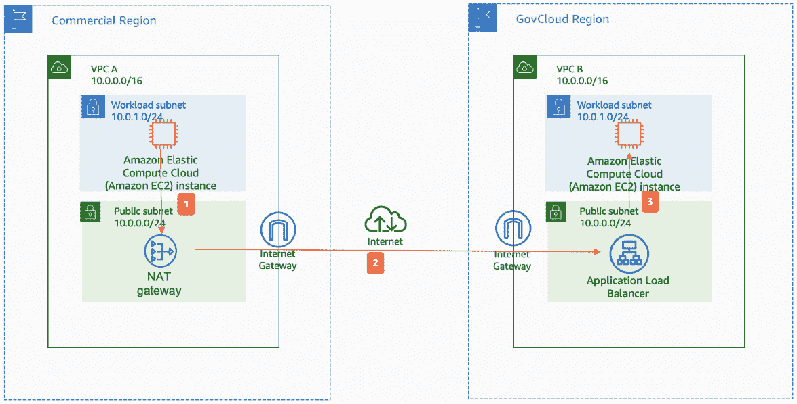
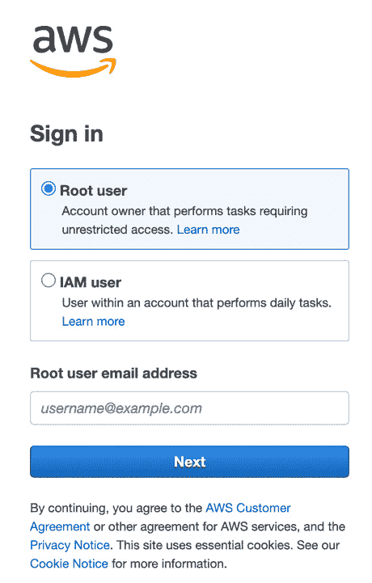
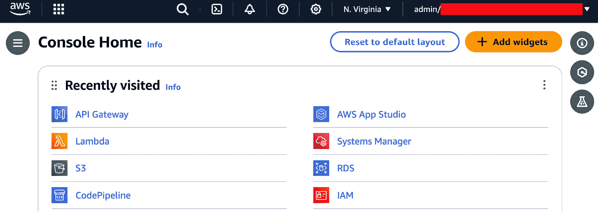
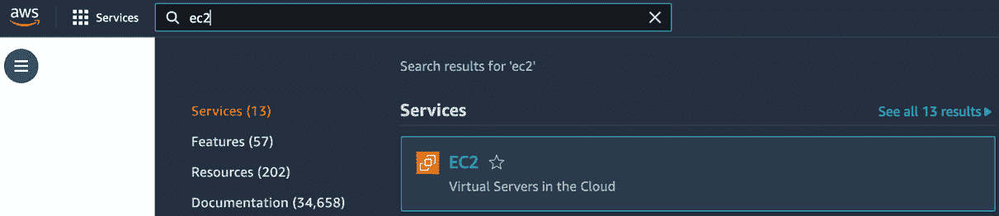
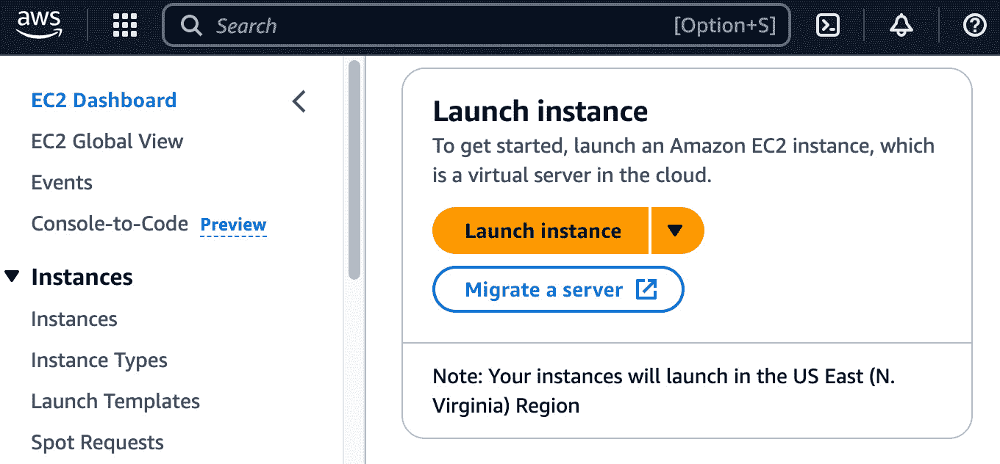
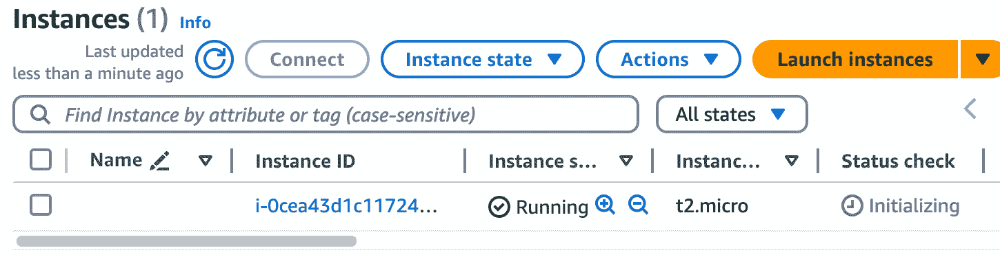
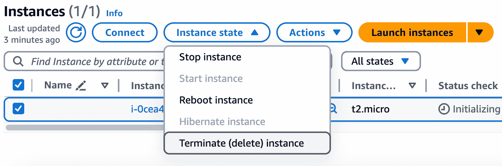

# <st c="0">1</st>

# <st c="2">部署和与 AWS 服务交互</st>

<st c="45">开始构建解决方案的旅程</st> <st c="90">在</st> **<st c="97">亚马逊 Web 服务</st>** <st c="116">(</st>**<st c="118">AWS</st>**<st c="121">)平台上，需要全面了解可用的工具和方法。</st> <st c="211">本章介绍了在 AWS 上架构设计的多种方法，从需求收集、服务选择开始，</st> <st c="371">到绘制架构图。</st>

<st c="387">接下来，你将探索可用于部署和与 AWS</st> <st c="489">服务交互的各种方法和工具，包括</st> <st c="508">AWS</st> <st c="517">控制台、AWS</st> **<st c="530">命令行界面</st>** <st c="552">(</st>**<st c="554">CLI</st>**<st c="557">)，AWS</st> **<st c="565">软件开发工具包</st>** <st c="590">(</st>**<st c="592">SDK</st>**<st c="596">)，以及</st> **<st c="604">基础设施即代码</st>** <st c="622">（<st c="628">IaC</st>）</st>。

<st c="634">这是一个理论章节，围绕以下</st> <st c="698">主要主题结构：</st>

+   <st c="710">架构设计</st> <st c="724">在 AWS 上</st>

+   <st c="730">开始使用</st> <st c="752">AWS 控制台</st>

+   <st c="763">导航 AWS CLI</st> <st c="783">和 SDK</st>

+   <st c="790">理解 IaC</st>

<st c="808">在本章结束时，你将掌握创建、操作和监控 AWS 服务的知识和技能，能够根据你的需求和偏好，选择最合适的方法进行操作，无论是通过用户友好的 AWS 控制台、CLI、通过 SDK 的编程访问，还是强大的</st> <st c="1118">IaC 工具。</st>

# <st c="1128">技术要求</st>

<st c="1151">虽然这是一个理论章节，但你将在本章的 GitHub 仓库中找到代码片段</st> <st c="1261">，链接如下：</st> [<st c="1264">https://github.com/PacktPublishing/AWS-Cloud-Projects/tree/main/chapter1/code</st>](https://github.com/PacktPublishing/AWS-Cloud-Projects/tree/main/chapter1/code)<st c="1341">。</st>

<st c="1342">要跟随学习，你需要一个</st> <st c="1377">AWS 账户。</st>

# <st c="1389">在 AWS 上架构设计</st>

<st c="1409">在 AWS 上架构设计是指</st> <st c="1436">使用 AWS 设计和规划基于云的解决方案的过程。</st> <st c="1511">这包括理解各种 AWS 服务、它们的功能，以及如何将它们结合起来构建可扩展、安全且</st> <st c="1643">具有成本效益的架构。</st>

<st c="1672">在 AWS 上架构设计时，应考虑以下四个方面，每个方面将在</st> <st c="1771">本章后续部分详细介绍：</st>

+   **<st c="1784">需求收集</st>**<st c="1807">：这是在 AWS 上架构解决方案过程中的一个关键步骤。</st> <st c="1882">它涉及了解业务需求、功能需求、非功能需求以及将在设计和实现 AWS 架构时起到决定性作用的约束条件。</st> <st c="2051">AWS 架构的设计。</st>

+   **<st c="2068">架构模式</st>**<st c="2090">：AWS 提供了多种架构模式和参考架构，作为常见用例（如 Web 应用、数据处理管道或无服务器架构）的起点。</st> <st c="2298">你可以利用这些模式并根据特定需求对其进行定制。</st>

+   **<st c="2385">服务选择</st>**<st c="2403">：AWS 提供了广泛的服务，包括计算、存储、数据库、网络、分析、机器学习等。</st> <st c="2534">你必须仔细评估应用程序的需求，并选择最适合这些需求的 AWS 服务。</st>

+   **<st c="2665">绘图</st>**<st c="2677">：创建拟议架构的可视化表示是架构过程中的一个关键步骤。</st> <st c="2788">AWS 没有官方工具，但</st> **<st c="2825">draw.io</st>** <st c="2832">或者仅仅使用 Microsoft PowerPoint 都可以用来创建架构图，这有助于沟通设计、促进协作</st> <st c="2914">并推动实施。</st> <st c="2973">。</st>

<st c="2992">让我们详细了解这些方面</st> <st c="3021">。</st>

## <st c="3031">需求收集</st>

<st c="3054">明确且定义良好的</st> <st c="3078">需求对架构师设计符合组织特定需求并实现预期结果的 AWS 解决方案至关重要。</st> <st c="3225">需求收集可能涉及与利益相关者的协作、开展研讨会、分析现有系统和数据、以及理解</st> <st c="3374">业务背景。</st>

<st c="3391">然而，如果你的项目范围较小，并非所有这些步骤都适用。</st> <st c="3469">尽管如此，在项目开始之前，了解可以收集到的需求类型是很重要的：</st>

+   **<st c="3578">业务需求</st>**<st c="3600">：第一步是理解解决方案背后的业务目标、目标和驱动因素。</st> <st c="3718">这包括目标市场、预期增长、收入模型以及需要考虑的任何特定业务约束或法规。</st>

+   **<st c="3880">功能要求</st>**<st c="3904">：这些要求定义了解决方案必须提供的具体功能、特性和能力。</st> <st c="4022">这可能包括与用户界面、数据处理、与现有系统的集成或特定</st> <st c="4146">业务逻辑相关的要求。</st>

+   **<st c="4161">非功能性要求</st>**<st c="4189">：非功能性要求定义了解决方案必须具备的定性特征，如性能、可扩展性、可用性、安全性和合规性。</st> <st c="4360">这些要求通常在确定适当的 AWS 服务和架构模式时至关重要，</st> <st c="4472">以便使用。</st>

+   **<st c="4480">技术要求</st>**<st c="4503">：技术要求涵盖了需要使用或与 AWS 解决方案集成的具体技术、编程语言、框架和工具。</st> <st c="4669">这可能包括对特定数据库、消息系统或</st> <st c="4747">第三方服务的要求。</st>

+   **<st c="4768">数据要求</st>**<st c="4786">：在 AWS 架构设计中，理解数据要求至关重要。</st> <st c="4864">这包括数据类型（结构化、非结构化或半结构化）、数据量、数据源、数据处理需求，以及任何特定的数据治理或</st> <st c="5031">合规性要求。</st>

+   **<st c="5055">集成要求</st>**<st c="5080">：如果 AWS 解决方案需要与现有的本地系统、第三方服务或其他云环境进行集成，则必须明确定义集成要求。</st> <st c="5262">这包括识别集成点、数据格式、协议和</st> <st c="5341">安全性考虑事项。</st>

+   **<st c="5365">安全性和合规性要求</st>**<st c="5402">：根据行业和所处理数据的性质，可能会有需要在 AWS 架构中解决的特定安全性和合规性要求。</st> <st c="5583">这些可能包括监管标准、数据保护法或</st> <st c="5650">行业特定认证。</st>

+   **<st c="5683">财务要求</st>**<st c="5706">：AWS 提供按需付费定价模式。</st> <st c="5751">了解预算限制和成本要求对于选择合适的 AWS 服务和实现</st> <st c="5883">具有成本效益的架构至关重要。</st>

<st c="5912">请记住，一些人将成本或安全性要求视为功能性和非功能性要求的一个范畴。</st> <st c="6050">不要拘泥于命名；只需收集所有</st> <st c="6098">要求。</st>

## <st c="6116">选择架构模式</st>

<st c="6149">架构模式</st> <st c="6171">和参考架构作为设计和实施基于云的解决方案的起点。</st> <st c="6279">这些模式封装了最佳实践、经过验证的设计和根据特定用例和需求量身定制的架构原则。</st> <st c="6416">你可以在</st> <st c="6445">AWS 架构中心</st> <st c="6467">找到许多这样的模式：</st> [<st c="6475">https://aws.amazon.com/architecture</st>](https://aws.amazon.com/architecture)<st c="6510">。</st>

<st c="6511">通过利用 AWS 架构模式和参考架构，你可以在经过验证的设计基础上构建，加速开发过程，并确保你的解决方案符合 AWS 最佳实践和</st> <st c="6717">行业标准。</st>

<st c="6736">架构模式解决了常见的场景和需求。</st> <st c="6802">这些包括用于 Web 应用程序、数据处理管道、无服务器架构、微服务、事件驱动架构等的模式。</st> <st c="6953">你可以利用这些模式作为基础，并根据</st> <st c="7028">具体需求进行定制。</st>

<st c="7043">除了通用模式外，AWS 还提供了针对特定领域和行业的参考架构，如电子商务、媒体和娱乐、医疗保健、金融服务等。</st> <st c="7238">这些参考架构提供了关于如何使用 AWS 服务和针对</st> <st c="7383">这些领域的最佳实践设计和实施解决方案的详细指导。</st>

<st c="7397">要选择一种模式或架构，必须仔细评估解决方案的需求、限制和用例，以选择最合适的架构。</st> <st c="7563">这一选择过程涉及理解每种模式的优缺点、权衡取舍，以及它们与其他技术栈的兼容性。</st> <st c="7733">这通常会在</st> <st c="7759">它们的描述中详细说明。</st>

<st c="7777">虽然架构模式提供了一个坚实的起点，但它们很少被照搬使用。</st> <st c="7873">你必须根据具体需求定制和调整这些模式，集成额外的 AWS 服务，调整配置，并考虑安全性、监控和</st> <st c="8057">运营问题。</st>

<st c="8084">也有可能你需要的是一个混合或多模式架构。</st> <st c="8166">有些解决方案需要结合多个架构模式，或者采用一种混合方法，结合不同模式的组件。</st> <st c="8306">在有效地集成和协调不同模式为一个统一且可扩展的架构时，存在额外的挑战。</st> <st c="8356">这是一个高级话题，你将在本书的后续章节中进一步了解。</st> <st c="8460">本书。</st>

## <st c="8550">选择服务</st>

<st c="8570">到目前为止，你已经有了一个</st> <st c="8589">明确定义的问题和一个通用的架构模式。</st> <st c="8648">下一步是选择服务。</st> <st c="8684">这是在 AWS 中架构解决方案的一个关键环节。</st> <st c="8744">AWS 提供了超过 200 种服务，拥有大量可以组合的构建模块，用以创建可扩展、安全且</st> <st c="8876">具有成本效益的架构。</st>

<st c="8905">服务选择是一个迭代过程，需要在架构最佳实践和各种需求（如非功能性、功能性、成本、安全性等）之间进行平衡。</st> <st c="9087">随着解决方案的发展，新的需求或</st> <st c="9196">约束条件的出现，你必须不断评估和优化服务选择。</st>

<st c="9215">服务选择的第一步是将收集到的需求映射到可用的 AWS 服务。</st> <st c="9319">这需要了解每个服务的能力和使用案例，并识别出能够满足解决方案特定功能性、非功能性和技术需求的服务。</st> <st c="9521">为了进行这种映射，你需要首先了解你应该查看的服务类别。</st> <st c="9622">服务被组织为不同的类别，例如计算、存储、数据库、网络、安全、分析等。</st> <st c="9752">在本书的后续章节中，你将看到这些类别中的不同服务。</st>

<st c="9851">在确定了符合你需求的服务类别之后，你需要评估不同服务的能力。</st> <st c="9993">每个 AWS 服务都提供一套独特的能力和功能。</st> <st c="10060">例如，如果解决方案需要一个高度可用且可扩展的数据库，像 Amazon RDS 或 Amazon Aurora 这样的服务可能是合适的选择。</st> <st c="10212">随着你在</st> <st c="10229">本书的学习深入，</st> <st c="10276">这一点会变得更加明确。</st>

<st c="10286">一些有趣的非功能性能力，你应该考虑的如下：</st> <st c="10361">如下所示：</st>

+   **<st c="10372">服务集成</st>**<st c="10393">：AWS 服务设计上能够无缝协作。</st> <st c="10451">你应该考虑不同服务之间的集成点，并确保所选服务能够有效集成，从而提供</st> <st c="10604">所需的功能。</st>

+   **<st c="10626">托管服务与自托管服务</st>**<st c="10663">：AWS 提供托管服务（由 AWS 处理底层基础设施和维护）和自托管服务（客户有更多控制权，但也承担更多责任）。</st> <st c="10858">您必须根据运营开销、成本以及合规要求等因素评估这两种服务类型之间的权衡。</st>

+   **<st c="11000">定价与成本优化</st>**<st c="11030">：AWS 服务有不同的定价模型，您需要考虑其服务选择的成本影响。</st> <st c="11150">应评估并将成本优化策略（例如利用预留实例、竞价实例或自动扩展）纳入架构设计中。</st>

+   **<st c="11311">发展路线图</st>**<st c="11319">：AWS 服务在不断发展，新的功能和服务会定期发布。</st> <st c="11417">您应考虑所选服务的未来路线图，并确保架构能够适应潜在的变化或新的服务提供。</st>

<st c="11576">重要提示</st>

<st c="11591">您知道并非所有 AWS 服务在所有地区都可用吗？</st> <st c="11661">没错。</st> <st c="11675">AWS 服务在所有 AWS 地区并非都能统一提供。</st> <st c="11740">因此，您还必须考虑您计划使用的服务的区域可用性。</st>

<st c="11831">有时，您可能找不到适合您需求的 AWS 服务，这也是正常的。</st> <st c="11924">这时，第三方服务就显得尤为重要。</st> <st c="11968">如果第三方工具符合您的需求，不要害怕使用它。</st> <st c="12032">不过，请考虑之前提到的各个维度，如成本或服务集成。</st>

## <st c="12134">架构图绘制</st>

<st c="12146">提议架构的可视化表示</st> <st c="12170">有助于传达设计，促进团队成员之间的协作，并确保对解决方案的组件及其相互关系有共同的理解。</st> <st c="12360">它还提供了实施的地图。</st>

<st c="12405">目前没有标准工具用于绘制 AWS 解决方案的架构图。</st> <st c="12458">最常用的工具是使用 AWS 架构图标的 PowerPoint（</st>[<st c="12532">https://aws.amazon.com/architecture/icons/</st>](https://aws.amazon.com/architecture/icons/)<st c="12575">）或 draw.io（</st>[<st c="12590">https://app.diagrams.net</st>](https://app.diagrams.net)<st c="12615">）。</st> <st c="12619">这些工具包括代表不同 AWS 服务的图标和形状。</st>

*<st c="12698">图 1</st>**<st c="12707">.1</st>* <st c="12709">展示了一个使用 PowerPoint 绘制的高层次图，展示了两个不同区域 EC2 实例之间的通信流程。</st>



<st c="13095">图 1.1 – 跨区域 EC2 通信流程</st>

<st c="13143">图示作为一种通用语言，用于与利益相关者、开发人员、运维团队以及其他相关方沟通架构设计。</st> <st c="13300">你不仅应该表示各种 AWS 服务，还要展示它们之间的关系，以及解决方案中数据和流程的整体流动。</st> <st c="13457">你可以为同一个解决方案创建多个图示，每个图示可以有不同的细节层次。</st>

<st c="13550">重要提示</st>

<st c="13565">在设计阶段，图示工作并没有结束。</st> <st c="13611">相反，它是架构生命周期中的一个持续过程。</st> <st c="13684">定期更新和审查图示，确保它们准确反映当前的架构状态。</st>

<st c="13801">图示是架构文档过程中不可或缺的一部分。</st> <st c="13828">它们作为设计决策、组件交互和所选架构背后理由的参考。</st> <st c="13876">然而，文档并不限于图示。</st> <st c="13998">创建详尽的文档对于未来的维护、故障排除以及团队或组织内的知识传承具有不可估量的价值。</st> <st c="14049">本书不会深入讨论文档内容，因为这是一本专注于</st> <st c="14282">实践构建的书籍。</st>

## <st c="14300">探索 AWS Well-Architected 框架</st>

<st c="14341">AWS 提供了一套最佳</st> <st c="14357">实践和设计原则，统称为</st> **<st c="14414">Well-Architected 框架</st>** <st c="14440">(</st>**<st c="14442">WAR</st>**<st c="14445">)，(</st>[<st c="14450">https://aws.amazon.com/architecture/well-architected/</st>](https://aws.amazon.com/architecture/well-architected/)<st c="14504">)。</st> <st c="14508">该框架涵盖六个支柱：运营卓越、安全性、可靠性、性能效率、成本优化，</st> <st c="14633">以及可持续性。</st>

<st c="14652">云架构师使用该框架来确保他们的解决方案符合 AWS 最佳实践，通常是在解决方案构建完成后，但也可以在设计阶段使用。</st> <st c="14830">尽管 WAR 可以单独作为一章来讲解，我们现在只是希望你了解它，并且看到我们在本书中的项目构建过程中如何引用它。</st>

<st c="15004">现在我们已经涵盖了设计和规划阶段，让我们深入探讨实施阶段。</st> <st c="15105">在这个过程中，你将探索多个工具，并获得一些</st> <st c="15156">实践经验。</st>

# <st c="15176">开始使用 AWS 控制台</st>

<st c="15209">AWS 控制台是</st> <st c="15229">AWS 提供的基于 Web 的用户界面，允许用户通过</st> **<st c="15356">图形用户</st>** **<st c="15371">界面</st>** <st c="15380">(</st>**<st c="15382">GUI</st>**<st c="15385">)来访问和管理各种 AWS 服务和资源。</st>

<st c="15388">AWS 控制台旨在用户友好，并且可以通过任何 Web 浏览器访问，允许用户从任何有网络连接的地方管理其 AWS 资源。</st> <st c="15562">它提供了 AWS 服务和资源的可视化展示，使得用户更容易理解和与</st> <st c="15692">AWS 生态系统互动。</st>

## <st c="15706">使用控制台</st>

<st c="15724">在本节中，你将</st> <st c="15755">部署一个 EC2 实例，这是 AWS 的</st> <st c="15795">虚拟机。</st>

<st c="15811">要使用控制台，你必须拥有一个 AWS 账户。</st> <st c="15862">AWS 账户的创建过程不在本书的范围内，但你可以在 AWS 网站上找到所有必要的信息，网址为</st> [<st c="16005">https://aws.amazon.com/free</st>](https://aws.amazon.com/free)<st c="16032">。</st>

<st c="16033">重要提示</st>

<st c="16048">本书中的每个示例都假设你拥有一个独立的 AWS 账户，该账户不属于</st> <st c="16143">AWS 组织。</st>

<st c="16161">让我们开始吧：</st> <st c="16168">让我们开始：</st>

1.  <st c="16180">访问 AWS 控制台的第一步是导航</st> <st c="16237">到</st> [<st c="16240">https://console.aws.amazon.com/</st>](https://console.aws.amazon.com/)<st c="16271">。</st>

    <st c="16272">你将看到一个登录界面，如</st> *<st c="16333">图 1</st>**<st c="16341">.2</st>*<st c="16343">所示。</st>



<st c="16761">图 1.2 – AWS 控制台登录界面</st>

1.  <st c="16798">如果你使用的是</st> <st c="16816">根用户，请输入你的用户邮箱和密码。</st> <st c="16885">如果你使用的是 IAM 用户，你还需要输入 12 位数字的</st> <st c="16956">账户 ID。</st>

1.  <st c="16967">成功登录后，你将看到 AWS 控制台主页，如</st> *<st c="17043">图 1</st>**<st c="17051">.3</st>*<st c="17053">所示。</st>



<st c="17253">图 1.3 – 控制台主页</st>

<st c="17278">本图需要重点强调的部分如下：</st>

+   顶部的**搜索**栏，你可以用它来搜索特定的服务。

+   当前管理的 AWS 区域显示在右上角；在这种情况下是**北弗吉尼亚**。

+   当前登录的用户或角色，位于右上角，隐藏在红色框下。

+   最近访问的部分，如果你之前没有打开过 AWS 控制台，它将是空的。

重要说明

为什么角色和账户 ID 会隐藏在*图 1.3*中的红色框下？尽管 AWS 账户 ID、用户和角色不被认为是敏感信息，但按照 AWS 最佳实践，公开披露这些信息是不推荐的。

1.  导航到 EC2 服务控制台。为此，在搜索栏中输入`ec2`，然后选择**EC2**，如*图 1.4*所示。



图 1.4 – 使用 AWS 控制台搜索 EC2 服务

1.  要启动最简单的虚拟机，且不进行任何自定义，请选择**启动实例**，如*图 1.5*所示。



图 1.5 – EC2 仪表板

1.  在以下菜单中，选择**启动一个实例**，然后选择**继续无密钥对（不推荐）**，从**密钥对名称**下拉菜单中选择。最后，再次选择**启动实例**，这次是在右侧菜单中。

1.  导航到正在运行的实例。你可以通过选择 EC2 左侧菜单中的“实例”来完成，或者直接访问[`console.aws.amazon.com/ec2/#Instances`](https://console.aws.amazon.com/ec2/#Instances)。你应该会看到类似于*图 1.6*的内容：一个正在运行的 EC2 实例，带有一个奇怪的实例 ID 和一些其他属性。



图 1.6 – EC2 实例状态

<st c="19587">这是一个不太实用的实例，因为你无法连接到它。</st> <st c="19657">原因是你没有选择密钥对。</st> <st c="19716">这只是一个简单的演示，展示了 AWS</st> <st c="19768">控制台的工作方式。</st>

1.  <st c="19782">你可以通过选择</st> **<st c="19827">终止（删除）实例</st>**<st c="19854">来终止该实例，如</st> *<st c="19868">图 1</st>**<st c="19876">.7</st>*<st c="19878">所示。</st>



<st c="20220">图 1.7 – 使用 AWS 控制台终止 EC2 实例</st>

<st c="20277">虽然 AWS 控制台是一个方便的管理和排除故障的方式，但你可能已经猜到它的一些缺点。</st> <st c="20408">假设你需要创建一百个，甚至一千个这样的 EC2 实例。</st> <st c="20485">这将需要你花费很长时间，特别是如果你需要配置一些特定的参数，比如你在</st> <st c="20617">上一篇指南中跳过的那些。</st>

<st c="20632">AWS 提供了</st> <st c="20645">命令行工具和 SDK，用于程序化访问和自动化 AWS 服务，以解决</st> <st c="20742">这些缺点。</st>

<st c="20758">重要提示</st>

<st c="20773">不建议使用根凭证在你的 AWS 账户中执行操作。</st> <st c="20863">我们强烈建议你不要将根用户用于日常任务，并遵循适用于 AWS 账户的根用户最佳实践，详细信息可以在</st> <st c="21032">此处找到：</st> [<st c="21035">https://docs.aws.amazon.com/IAM/latest/UserGuide/root-user-best-practices.html</st>](https://docs.aws.amazon.com/IAM/latest/UserGuide/root-user-best-practices.html)<st c="21113">。</st>

<st c="21114">建议在进入下一节之前，你先多浏览一下 AWS 控制台，熟悉一下它。</st>

# <st c="21254">导航 AWS CLI 和 AWS SDK</st>

<st c="21285">AWS CLI 和 AWS SDK 是用于访问和管理 AWS 服务的编程工具。</st> <st c="21368">在本节中，你将更深入地了解这些工具，并在自己的</st> <st c="21451">环境中执行它们。</st>

## <st c="21467">AWS CLI</st>

<st c="21475">AWS CLI 是 AWS 提供的一个</st> <st c="21493">统一工具，允许你通过命令行与 AWS 服务进行交互和管理，支持 macOS 终端或 Windows 命令提示符等环境。</st> <st c="21640">它提供了一种方便且可编程的方式，帮助自动化和控制各种 AWS 资源</st> <st c="21730">和操作。</st>

<st c="21745">它是一个 CLI 工具，因此需要进行安装。</st> <st c="21803">不同操作系统的安装过程有所不同，但 AWS 有详细的文档说明（</st>[<st c="21871">https://docs.aws.amazon.com/cli/latest/userguide/getting-started-install.html</st>](https://docs.aws.amazon.com/cli/latest/userguide/getting-started-install.html)<st c="21949">）。</st> <st c="21953">除了独立操作外，它还可以与其他 CLI 脚本或现有的自动化工具集成。</st> <st c="22063">例如，一个涉及多个组件的较大工作流，涉及本地和</st> <st c="22147">远程进程。</st>

### <st c="22164">使用 AWS CLI</st>

<st c="22182">在本节中，你将</st> <st c="22209">像上一节一样创建一个 EC2 实例，这次使用</st> <st c="22282">AWS CLI。</st>

<st c="22290">认证与 AWS 控制台的工作方式不同。</st> <st c="22346">AWS CLI 支持多种认证方法，包括 AWS 访问密钥、IAM 角色和外部凭证提供者。</st> <st c="22468">你可以在 AWS</st> <st c="22558">网站上查看有关不同类型安全凭证的所有详细信息：</st> [<st c="22567">https://docs.aws.amazon.com/IAM/latest/UserGuide/security-creds.html</st>](https://docs.aws.amazon.com/IAM/latest/UserGuide/security-creds.html)<st c="22635">。</st>

<st c="22636">在本节中，我们将重点讲解 AWS</st> <st c="22675">访问密钥。</st>

<st c="22687">如果你使用的是根用户或 IAM 用户，默认情况下，你的用户没有启用访问密钥。</st> <st c="22792">不建议使用根用户。</st> <st c="22832">不过，你可以为其创建访问密钥。</st> <st c="22876">该过程在 AWS</st> <st c="22912">网站上有描述：</st> [<st c="22921">https://docs.aws.amazon.com/IAM/latest/UserGuide/id_root-user_manage_add-key.html</st>](https://docs.aws.amazon.com/IAM/latest/UserGuide/id_root-user_manage_add-key.html)<st c="23002">。</st>

<st c="23003">按照以下步骤创建新的</st> <st c="23039">IAM 用户：</st>

1.  <st c="23048">通过</st> <st c="23075">控制台导航至 IAM（</st>[<st c="23084">https://us-east-1.console.aws.amazon.com/iam/home?region=us-east-1#/users</st>](https://us-east-1.console.aws.amazon.com/iam/home?region=us-east-1#/users)<st c="23158">）。</st>

1.  <st c="23161">选择</st> **<st c="23169">创建用户</st>**<st c="23180">，并为其指定用户名。</st>

1.  <st c="23205">在</st> **<st c="23215">设置权限</st>** <st c="23230">菜单中，选择</st> **<st c="23244">直接附加策略</st>**<st c="23268">，然后找到并选择</st> **<st c="23291">PowerUserAccess</st>**<st c="23306">。最后，</st> <st c="23317">点击</st> **<st c="23323">下一步</st>**<st c="23327">。</st>

1.  <st c="23328">点击</st> **<st c="23335">创建用户</st>**<st c="23346">。</st>

<st c="23347">你的用户现在应该出现在用户列表中。</st> <st c="23396">要为此用户创建访问密钥，请按</st> <st c="23440">以下步骤：</st>

1.  <st c="23452">选择你新</st> <st c="23471">创建的用户。</st>

1.  <st c="23484">导航到</st> **<st c="23501">安全凭证</st>** <st c="23521">标签页，选择</st> **<st c="23538">创建</st>** **<st c="23545">访问密钥</st>**<st c="23555">。</st>

1.  <st c="23556">在</st> **<st c="23564">使用场景</st>** <st c="23572">菜单中，选择</st> **<st c="23586">命令行界面（CLI）</st>**<st c="23614">，接受确认消息，然后</st> <st c="23653">选择</st> **<st c="23660">下一步</st>**<st c="23664">。</st>

1.  <st c="23665">在下一个菜单中，点击</st> **<st c="23695">创建</st>** **<st c="23702">访问密钥</st>**<st c="23712">。</st>

1.  <st c="23713">在离开此页面之前，请记下你的访问和秘密</st> <st c="23781">访问密钥。</st>

<st c="23793">AWS 还为所有可能的排列过程提供了详细的文档，</st> <st c="23813">可以在他们的官方网站上查看：</st>

+   <st c="23886">创建一个 IAM</st> <st c="23903">用户：</st> [<st c="23909">https://docs.aws.amazon.com/IAM/latest/UserGuide/id_users_create.html#id_users_create_console</st>](https://docs.aws.amazon.com/IAM/latest/UserGuide/id_users_create.html#id_users_create_console)

+   <st c="24002">管理 IAM 用户的访问密钥：</st> [<st c="24039">https://docs.aws.amazon.com/IAM/latest/UserGuide/id_credentials_access-keys.html</st>](https://docs.aws.amazon.com/IAM/latest/UserGuide/id_credentials_access-keys.html)

<st c="24119">打开你偏好的本地 CLI 工具，并使用你自己的密钥设置以下变量。</st> <st c="24207">这将允许你的终端与</st> <st c="24255">AWS 账户进行交互：</st>

```
 $ export AWS_ACCESS_KEY_ID=XXXXXXXXX
$ export AWS_SECRET_ACCESS_KEY=xxxxxxxxxx
$ export AWS_DEFAULT_REGION=<st c="24521">us-east-1</st>. We recommend that you run all the following examples in this region. If you are using a different region, some parameters, such as the <st c="24667">Amazon Machine Image</st> (<st c="24689">AMI</st>), require modifications.
			<st c="24718">Try the following command; it returns your running instances.</st> <st c="24781">If you don’t have any, it will</st> <st c="24812">be empty:</st>

```

$ aws ec2 describe-instances

```

			<st c="24850">To create the simplest possible instance, run the following command.</st> <st c="24920">This command creates an EC2 of the smallest instance type,</st> `<st c="24979">t2.micro</st>`<st c="24987">, using that AMI ID, which effectively means Amazon Linux 2023\.</st> <st c="25051">There will be more on AMIs in</st> *<st c="25081">Chapter 3</st>*<st c="25090">:</st>

```

$ aws ec2 run-instances --image-id ami-0c101f26f147fa7fd

--instance-type t2.micro

```

			<st c="25174">Your command output should be similar to the following.</st> <st c="25231">Bear in mind that part of the output was</st> <st c="25272">omitted, but check whether your</st> `<st c="25304">ImageId</st>` <st c="25311">and</st> `<st c="25316">InstanceType</st>` <st c="25328">match:</st>

```

{

    "Groups": [],

    "Instances": [

        {

            "AmiLaunchIndex": 0, <st c="25390">"ImageId": "ami-0c101f26f147fa7fd",</st> "InstanceId": "i-0a65cf3ecaec728a8", <st c="25463">"InstanceType": "t2.micro",</st> "LaunchTime": "2024-03-24T10:47:25+00:00",

            "Monitoring": {

                "State": "disabled"

            },

            "Placement": {

                "AvailabilityZone": "us-east-1a",

                "GroupName": "",

                "Tenancy": "default"

            },

            "PrivateDnsName": "ip-172-31-38-84.ec2.internal",

            ###OUTPUT OMMITED###

```

			<st c="25733">If you run the previous</st> `<st c="25758">describe</st>` <st c="25766">command again, this time, the output will show your running instance.</st> <st c="25837">Try it with the following filter, which only shows</st> `<st c="25888">t2.micro</st>`<st c="25896">-sized instances:</st>

```

$ aws ec2 describe-instances <st c="25944">--filters "Name=instance-type,</st>

<st c="25974">值=t2.micro"</st> --query "Reservations[].Instances[].InstanceId"

[

    "i-0a65cf3ecaec728a8"

]

```

			<st c="26065">To terminate the instance, run the following command.</st> <st c="26120">Replace the instance ID with</st> <st c="26149">your own:</st>

```

$ aws ec2 terminate-instances <st c="26240">describe</st> 命令再次执行以确保实例不再运行。

            <st c="26310">探索 AWS CLI</st>

            <st c="26332">进一步探索</st> <st c="26345">AWS CLI。</st> <st c="26374">每个服务的语法都是一样的：</st> <st c="26401">每个服务：</st>

```
 $ aws <command> <subcommand> [options and parameters]
```

            <st c="26469">以下是这些</st> <st c="26496">命令的含义：</st>

                +   <st c="26510">对</st> `<st c="26532">aws</st>` <st c="26535">程序的基础调用。</st>

                +   <st c="26544">顶级</st> `<st c="26559">命令</st>` <st c="26566">通常对应于由</st> <st c="26624">AWS CLI 支持的 AWS 服务。</st>

                +   <st c="26632">该</st> `<st c="26637">子命令</st>` <st c="26647">指定要执行的操作。</st>

            <st c="26685">重要提示</st>

            <st c="26700">你创建了一个具有</st> `<st c="26730">PowerUserAccess</st>` <st c="26745">权限的 IAM 用户。</st> <st c="26759">这授予对 AWS 服务和资源的完全访问权限，但不允许管理用户或组。</st> <st c="26868">在生产环境中，你可以将用户访问权限范围缩小到更窄的一组</st> <st c="26947">权限。</st>

            <st c="26962">AWS CLI 的一个方便功能是</st> `<st c="26997">帮助</st>` <st c="27001">功能。</st> <st c="27011">你可以使用它获得任何命令的帮助。</st> <st c="27057">为此，只需在命令名称的末尾键入</st> `<st c="27079">help</st>` <st c="27083">。</st> <st c="27114">执行以下命令。</st> <st c="27146">结果将是对这些命令所有可用选项的详细描述：</st>

```
 $ aws ec2 help
$ aws ec2 describe-instances help
```

            <st c="27285">如果逐命令浏览不是你的方式，你也可以在 AWS CLI 命令参考中找到每个</st> <st c="27384">服务的具体语法（</st>[<st c="27423">https://docs.aws.amazon.com/cli/latest/</st>](https://docs.aws.amazon.com/cli/latest/)<st c="27463">），但你将在</st> <st c="27510">接下来的章节中看到并使用更多。</st>

            <st c="27529">AWS SDK</st>

            <st c="27537">AWS SDK 是一个</st> <st c="27556">开源库的集合，提供来自多种编程语言的程序化访问 AWS 服务，包括 Java、Python、Node.js、.NET、Ruby、Go、PHP 等。</st> <st c="27743">这些 SDK 使开发者能够构建与 AWS 资源和服务直接交互的应用程序，而无需使用低级的 AWS</st> <st c="27884">服务 API。</st>

            <st c="27897">AWS SDK 抽象了向 AWS 服务发出认证 HTTP/HTTPS 请求的复杂性，处理重试和错误处理，并解析来自 AWS 服务的响应。</st> <st c="28085">它们提供了一个更高级的、特定语言的接口，使开发者更容易将 AWS 服务集成到</st> <st c="28209">他们的应用程序中。</st>

            <st c="28228">这些被认为是高级概念，你在本书中不会看到太多。</st> <st c="28312">它更常被应用开发人员使用。</st> <st c="28361">如果你有兴趣了解使用 Python SDK 创建 EC2 实例的语法，可以在</st> *<st c="28488">学习基础</st>* <st c="28504">部分找到</st> <st c="28513">，链接地址为</st> [<st c="28516">https://docs.aws.amazon.com/code-library/latest/ug/python_3_ec2_code_examples.html</st>](https://docs.aws.amazon.com/code-library/latest/ug/python_3_ec2_code_examples.html)<st c="28598">。</st>

            <st c="28599">从使用控制台的手动操作到半自动化的操作，如 AWS CLI，你尚未</st> <st c="28697">见识到自动化的全部潜力。</st> <st c="28741">在接下来的章节中，你将学习如何通过 IaC</st> <st c="28807">来扩展你的部署。</st>

            <st c="28816">理解 IaC</st>

            <st c="28834">IaC（基础设施即代码）是一种方法</st> <st c="28854">用于配置和管理如云基础设施等资源。</st> <st c="28918">它允许你使用人类可读的定义文件</st> <st c="29006">或代码来定义和部署你的资源。</st>

            <st c="29014">与之前章节中手动通过 AWS 控制台或 CLI 工具配置资源不同，IaC 允许声明性地指定所需的基础设施状态。</st> <st c="29203">在我们的上下文中，这指的是 AWS 云。</st> <st c="29241">这意味着计算实例、存储、网络、安全组以及其他</st> <st c="29319">AWS 服务。</st>

            <st c="29332">通过运用 IaC，你将获得</st> <st c="29368">多个好处：</st>

                +   **<st c="29386">配置一致性</st>**<st c="29412">：IaC</st> <st c="29419">推动了不可变基础设施的概念，即将基础设施组件视为一次性和可替换的，而不是手动修改。</st> <st c="29582">这种方法确保了一致性，减少了配置漂移，并简化了扩展或</st> <st c="29687">更新基础设施的过程。</st>

                +   **<st c="29711">版本控制和协作</st>**<st c="29745">：IaC 模板和代码可以存储在 Git 等版本控制系统中，支持协作、代码审查和跟踪基础设施定义的变化。</st> <st c="29922">这促进了基础设施管理的最佳实践，并便于团队间的知识共享。</st> <st c="30014">。

                +   **<st c="30026">自动化部署</st>**<st c="30048">：IaC 模板和代码可以与</st> **<st c="30097">持续集成和持续部署</st>** <st c="30145">(</st>**<st c="30147">CI/CD</st>**<st c="30152">) 流水线集成，从而实现</st> <st c="30175">自动化部署和更新。</st> <st c="30210">这减少了手动工作，最小化了人为错误，并确保在不同环境（例如开发、预生产、</st> <st c="30371">和生产）之间的一致性和可重复部署。</st>

                +   **<st c="30387">基础设施测试和验证</st>**<st c="30425">：IaC 模板和代码可以在部署之前进行测试和验证，确保定义的基础设施符合期望的规格，并遵守组织的政策和</st> <st c="30615">最佳实践。</st>

                +   **<st c="30630">成本优化和资源管理</st>**<st c="30672">：通过将基础设施视为代码，组织可以更轻松地跟踪和管理其 AWS 资源，从而实现更好的成本优化和资源利用策略。</st> <st c="30850">你将不再忘记</st> <st c="30876">某个虚拟机</st> <st c="30901">正在某个地方运行。</st>

            <st c="30919">有多种 IaC 工具。</st> <st c="30950">AWS 提供了自己的原生 IaC 工具，例如 AWS CloudFormation，允许用户使用 JSON 或 YAML 模板定义基础设施资源。</st> <st c="31106">它还提供了</st> <st c="31127">AWS</st> **<st c="31131">云开发工具包</st>** <st c="31152">(</st>**<st c="31154">CDK</st>**<st c="31157">)。</st> <st c="31161">这与 AWS SDK 不同，后者提供了一个比 CloudFormation 更高层次的抽象，允许开发人员使用熟悉的编程语言（如 TypeScript、Python、Java、</st> <st c="31379">和 C#）定义 AWS 构件。</st>

            <st c="31386">除了 AWS 原生工具外，还有许多第三方 IaC 解决方案，例如</st> **<st c="31471">Terraform</st>**<st c="31480">。Terraform</st> <st c="31491">是云中立的；它支持多种云服务提供商，包括 AWS，并提供一致的工作流程，以便在多个平台上管理基础设施。</st> <st c="31661">它是最著名的</st> <st c="31694">IaC 工具之一。</st>

            <st c="31704">选择 IaC 工具</st> <st c="31726">归结为个人偏好、现有技能和每个工具可以提供的特定功能。</st> <st c="31821">在本书中，你将通过实践操作 CloudFormation 和 Terraform。</st> <st c="31903">然而，如果你对这个话题感兴趣，AWS 提供了关于如何选择 IaC 工具的指导</st> <st c="32011">，可以参考</st> [<st c="32014">https://docs.aws.amazon.com/prescriptive-guidance/latest/choose-iac-tool/introduction.html</st>](https://docs.aws.amazon.com/prescriptive-guidance/latest/choose-iac-tool/introduction.html)<st c="32104">。</st>

            <st c="32105">使用 CloudFormation</st>

            在这一部分，你<st c="32147">将使用 CloudFormation 创建一个 EC2 实例。</st> <st c="32198">这是一个入门部分，不会深入探讨所有 CloudFormation 的语法</st> <st c="32281">和功能。</st>

            要开始，按照以下步骤操作：</st>

                1.  在你的本地环境中创建以下文件；这是一个 YAML 模板，用于创建一个指定 AMI 和 `<st c="32458">t2.micro</st>` <st c="32466">大小的 EC2 实例：</st>

    ```
     Resources:
      NewEC2Instance:
        Type: AWS::EC2::Instance
        Properties:
          ImageId: "ami-0c101f26f147fa7fd"
          InstanceType: "t2.micro"
    ```

    注意 CloudFormation 在 YAML 格式中的可读性。</st> <st c="32655">这是它的一个优点。</st>

                    1.  通过 AWS 控制台导航到 CloudFormation，访问 [<st c="32738">https://us-east-1.console.aws.amazon.com/cloudformation</st>](https://us-east-1.console.aws.amazon.com/cloudformation) <st c="32793">并选择</st> **<st c="32805">创建堆栈</st>**<st c="32817">。</st>

                1.  选择 `<st c="32884">ec2.yml</st>`<st c="32891">，然后</st> <st c="32897">选择</st> **<st c="32904">下一步</st>**<st c="32908">。</st>

                1.  给<st c="32915">堆栈</st>起个名字。

                1.  跳过所有选项并部署<st c="32973">堆栈。</st>

            部署过程结束时，你的堆栈状态应该显示 `<st c="33152">us-east-1</st>` <st c="33161">区域。</st>

            你可以通过导航到 EC2 服务来验证刚刚创建的 EC2 实例。<st c="33244">确认它具有正确的大小</st> <st c="33281">和 AMI。</st>

            <st c="33289">如果你不完全理解整个过程，不用担心。</st> <st c="33351">CloudFormation 是一个独立的世界，具有特定的语法和功能。</st> <st c="33423">浏览你的堆栈详情，你将能够找到许多特性，例如它是什么时候创建的，谁创建的，创建了哪些资源以及顺序，甚至更多高级概念，如参数</st> <st c="33665">和输出。</st>

            若要了解更多关于 CloudFormation 的信息，可以查看官方的 AWS</st> <st c="33739">文档：</st> [<st c="33754">https://docs.aws.amazon.com/AWSCloudFormation/latest/UserGuide/Welcome.html</st>](https://docs.aws.amazon.com/AWSCloudFormation/latest/UserGuide/Welcome.html)<st c="33829">。</st>

            在继续之前，为了避免额外费用，不要忘记删除你的 EC2\。<st c="33922">要删除所有</st> <st c="33936">堆栈资源，请选择</st> <st c="33962">你的堆栈并</st> <st c="33977">点击</st> **<st c="33983">删除</st>**<st c="33989">。</st>

            使用 Terraform

            <st c="34006">你现在将创建</st> <st c="34027">另一个 EC2 实例，这次使用 Terraform。</st> <st c="34054">本节假设你已经按照上一节的</st> *<st c="34199">AWS</st>* *<st c="34203">CLI</st>* <st c="34206">部分配置好了终端和 AWS 凭证。</st>

            <st c="34215">以下是如何</st> <st c="34230">操作：</st>

                1.  <st c="34236">在本地工作站的任意目录中创建一个文件，并命名为</st> `<st c="34308">ec2.tf</st>`<st c="34314">。</st>

                1.  <st c="34315">使用以下代码填充文件，它将创建一个最小实例类型的 EC2，</st> `<st c="34403">t2.micro</st>`<st c="34411">，位于</st> `<st c="34416">us-east-1</st>`<st c="34425">区域，使用相应的 AMI ID。</st> <st c="34445">这实际上意味着使用 Amazon</st> <st c="34481">Linux 2023：</st>

    ```
     provider "aws"{
        region = "us-east-1"
    }
    resource "aws_instance" "ec2" {
      ami           = "ami-0c101f26f147fa7fd"
      instance_type = "t2.micro"
    }
    ```

    <st c="34622">请注意，</st> **<st c="34639">HashiCorp 配置语言</st>** <st c="34671">(</st>**<st c="34673">HCL</st>**<st c="34676">) 代码仍然是人类可读的，尽管</st> <st c="34716">可能比</st> <st c="34747">CloudFormation YAML</st> <st c="34747">稍微难以理解一些。</st>

            <st c="34767">重要说明</st>

            <st c="34782">AMI ID 在每个区域都是不同的。</st> <st c="34821">如果你使用的是与</st> `<st c="34862">us-east-1</st>`<st c="34871">不同的区域，并且你想使用 Amazon Linux 2023，你需要找到相应的</st> <st c="34952">AMI ID。</st>

                1.  <st c="34959">要执行 Terraform 代码，你需要先安装它。</st> <st c="35018">安装过程不在本书的范围内。</st> <st c="35069">不同操作系统的安装步骤不同，但它是一个简单的过程，你可以在 HashiCorp 的</st> <st c="35196">官方网站找到详细文档（</st>[<st c="35205">https://developer.hashicorp.com/terraform/tutorials/aws-get-started/install-cli</st>](https://developer.hashicorp.com/terraform/tutorials/aws-get-started/install-cli)<st c="35285">）。</st>

                1.  <st c="35288">安装完成后，在你创建了</st> `<st c="35393">ec2.tf</st>` <st c="35399">文件的同一目录下执行以下命令。</st> <st c="35406">它们将在你的环境中启动 Terraform</st> <st c="35450">并将你之前创建的模板应用到 AWS 账户中，从而有效地</st> <st c="35526">创建</st> <st c="35535">相关资源：</st>

    ```
     $ terraform init
    $ terraform apply
    ```

    <st c="35584">系统将提示你进行确认。</st> <st c="35618">如果执行成功，它将显示如下</st> <st c="35683">简化输出：</st>

    ```
    Terraform used the selected providers to generate the following execution plan. Resource actions are indicated with the following symbols:
      + create
    Terraform will perform the following actions:
      # aws_instance.ec2 will be created
      + resource "aws_instance" "ec2" {
     <st c="35964">+ ami                            = "ami-0c101f26f147fa7fd"</st>
     <st c="35995">+ instance_type                  = "t2.micro</st>"
          ###OUTPUT OMMITED###
          + root_block_device {
              + delete_on_termination = (known after apply)
              + device_name           = (known after apply)
              + encrypted             = (known after apply)
              + iops                  = (known after apply)
              + kms_key_id            = (known after apply)
              + tags                  = (known after apply)
              + tags_all              = (known after apply)
              + throughput            = (known after apply)
              + volume_id             = (known after apply)
              + volume_size           = (known after apply)
              + volume_type           = (known after apply)
            }
        }
    Plan: 1 to add, 0 to change, 0 to destroy. Do you want to perform these actions? Terraform will perform the actions described above. Only 'yes' will be accepted to approve.
     <st c="36629">Enter a value: yes</st> aws_instance.ec2: Creating... aws_instance.ec2: Still creating... [10s elapsed]
    aws_instance.ec2: Still creating... [20s elapsed]
    aws_instance.ec2: Still creating... [30s elapsed]
    aws_instance.ec2: Creation complete after 34s [id=i-0de732fda772c16cf] <st c="36899">Apply complete!</st> <st c="36915">Resources: 1 added, 0 changed, 0 destroyed.</st>
    ```

                    1.  <st c="36958">你可以使用 AWS 控制台查看已创建的 EC2 实例。</st> <st c="37034">确保在正确的区域中查看。</st> <st c="37078">要删除所有资源，执行以下</st> <st c="37129">Terraform 命令：</st>

    ```
     $ terraform destroy
    ```

            <st c="37167">Terraform 提供了</st> <st c="37184">更多的功能，如</st> <st c="37217">使用</st> `<st c="37235">terraform plan</st>`<st c="37249">进行干运行，或者通过</st> `<st c="37303">terraform state list</st>`<st c="37323">可视化部署的资源。你可以在 Terraform 官方文档中了解更多这些内容</st> <st c="37395">，访问地址为</st> [<st c="37398">https://developer.hashicorp.com/terraform/cli/commands</st>](https://developer.hashicorp.com/terraform/cli/commands)<st c="37452">。</st>

            <st c="37453">看看为什么 IaC 有用的实际示例。</st> <st c="37511">假设你需要创建 100 台这样的机器。</st> <st c="37565">你可以将之前的代码修改为</st> <st c="37602">以下内容：</st>

```
 provider "aws"{
    region = "us-east-1"
}
resource "aws_instance" "ec2" {
  ami           = "ami-0c101f26f147fa7fd"
  instance_type = "t2.micro" <st c="37745">count         = 100</st> }
```

            <st c="37758">不要运行这个示例，因为它可能会产生高昂的费用。</st> <st c="37815">但是，注意与使用<st c="37858">AWS 控制台</st>执行相同任务相比，</st> <st c="37888">它是多么的简单。</st>

            <st c="37900">总结</st>

            在这一章中，你学习了在 AWS 上架构的含义。<st c="37908">它不仅仅是部署 AWS 服务，还包括收集不同类型的需求，将这些需求与已知模式和参考架构进行对比，选择不同的服务，并将<st c="37973">这些内容记录下来</st>。</st>

            <st c="38191">你还探索了在设计完成后用于部署和交互 AWS 服务的各种方法和工具。</st> <st c="38326">AWS 控制台提供了一个用户友好的图形界面，而 AWS CLI 和 SDK 则提供了程序化访问和自动化功能。</st> <st c="38458">此外，你还接触了多种基础设施即代码（IaC）技术，如 Terraform、CloudFormation 和 AWS CDK，它们允许你通过代码定义和管理你的 AWS 基础设施。</st> <st c="38624">。</st>

            <st c="38635">通过理解这些不同的方法，你可以根据自己的需求和技能水平以及 AWS 部署的复杂性，选择最合适的方法。</st> <st c="38819">无论你喜欢使用视觉界面、命令行工具、程序化访问还是 IaC，AWS 提供了一系列选项来满足你的需求并简化你的</st> <st c="38976">云操作。</st>

            在下一章中，你将使用<st c="38993">AWS 控制台</st>构建个人网站。

```

```
