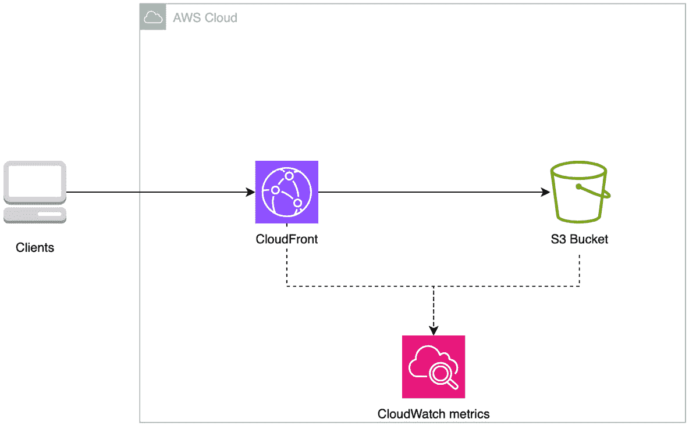
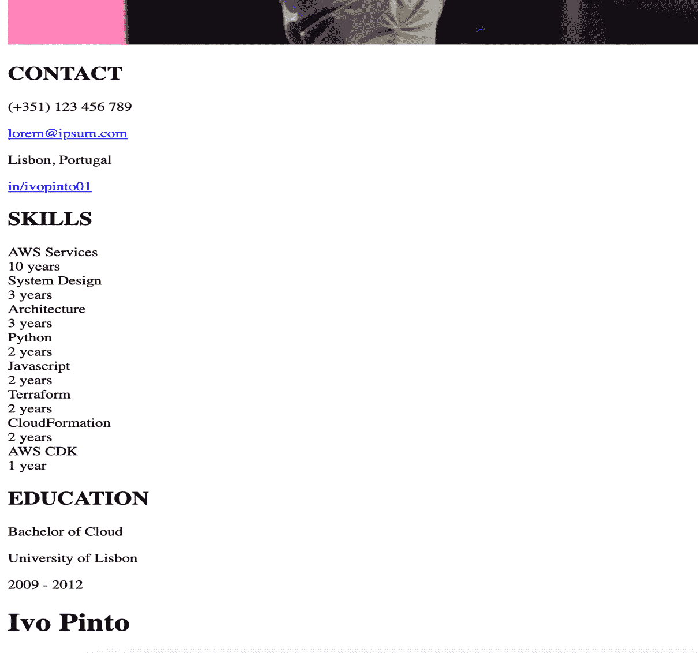
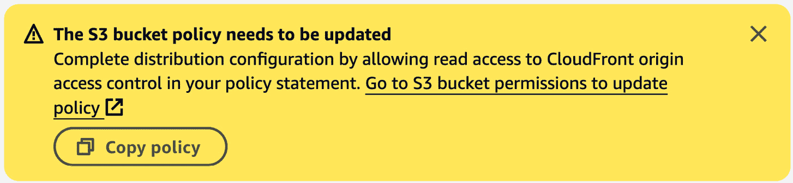
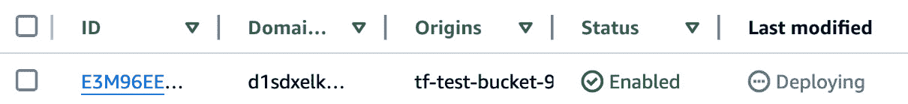
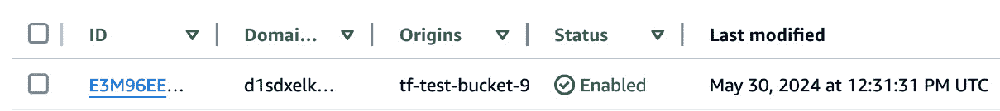
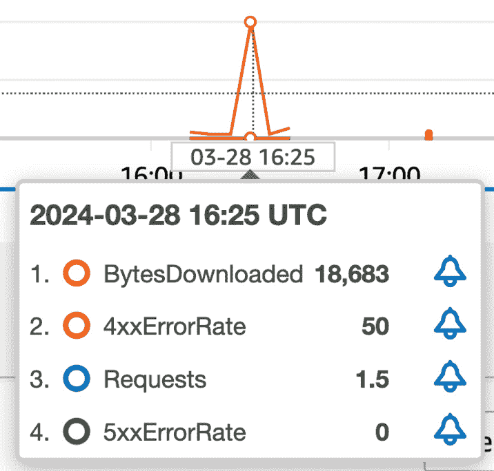
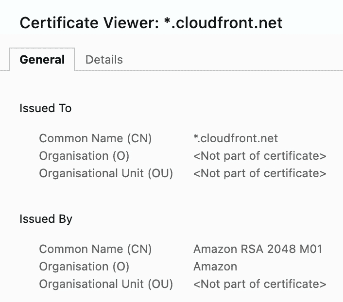
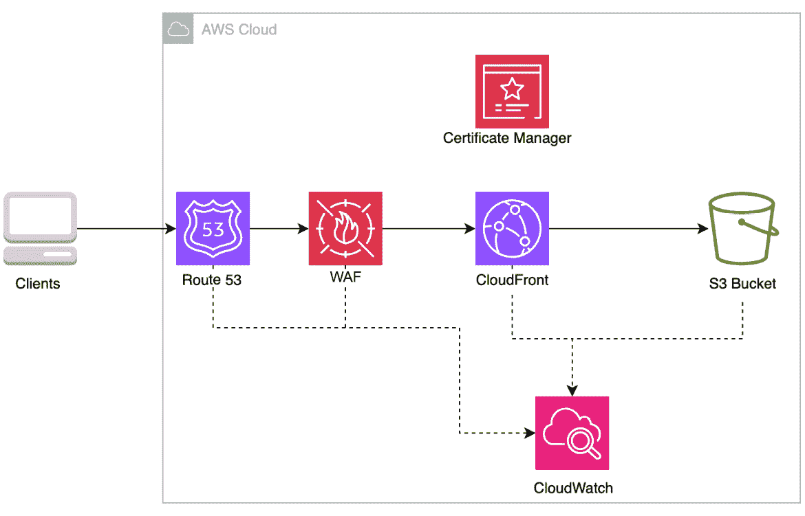

# <st c="0">2</st>

# <st c="2">创建个人网站</st>

<st c="29">这是你实践经验的开始。</st> <st c="81">在接下来的章节中，你将沉浸在各种场景中。</st> <st c="151">在本章的第一个实践部分，你将从一份需求列表中，学习如何为你的简历建立个人网站。</st> <st c="301">在记住这些需求的基础上，你将通过</st> *<st c="398">第一章</st>* <st c="407">提供的方法，构建一个使用 AWS 服务（如 S3 用于存储和 CloudFront 用于分发）的解决方案。</st> <st c="490">进行架构设计。</st>

<st c="502">接下来，你将使用</st> <st c="566">AWS 控制台构建该架构。</st>

<st c="578">总之，本章涵盖了以下主要主题</st> <st c="637">，顺序如下：</st>

+   <st c="646">你将要构建的内容是——一个</st> <st c="679">个人网站</st>

+   <st c="695">你将如何构建它——使用 S3</st> <st c="737">和 CloudFront</st>

+   <st c="751">实际构建它——使用</st> <st c="785">AWS 控制台</st>

+   <st c="796">如何改进解决方案——安全性</st> <st c="836">和 DNS</st>

<st c="843">到本章结束时，你将能够自信地在 AWS 中创建并托管自己的静态网站。</st> <st c="953">这是更高级 Web 应用程序的前奏，你将在</st> <st c="1032">接下来的章节中看到它们。</st>

# <st c="1051">技术要求</st>

<st c="1074">为了创建你自己的个人网站，你需要访问一个</st> <st c="1148">AWS 账户。</st>

<st c="1160">本章在本书的 GitHub 代码库中有一个专门的文件夹。</st> <st c="1236">在这里，你将找到跟随本章学习所需的代码片段：</st> <st c="1294">[<st c="1301">https://github.com/PacktPublishing/AWS-Cloud-Projects/tree/main/chapter2/code</st>](https://github.com/PacktPublishing/AWS-Cloud-Projects/tree/main/chapter2/code)<st c="1378">。</st>

# <st c="1379">场景</st>

<st c="1388">假设你是一个刚毕业的学生，或者是一个</st> <st c="1426">希望向潜在雇主或客户展示自己技能、经验和成就的专业人士。</st> <st c="1540">你希望创建一个既易于访问又具有专业外观的在线形象，在这里你可以分享你的简历</st> <st c="1658">或履历。</st>

<st c="1668">有什么比托管你自己的</st> <st c="1718">个人网站更好的方式呢？</st>

## <st c="1735">需求</st>

<st c="1748">回想一下，在</st> *<st c="1764">第一章</st>*<st c="1773">中，收集</st> <st c="1785">需求是架构 AWS 的第一步。</st> <st c="1838">无论你的场景有多简单或复杂，最好将需求写下来。</st> <st c="1950">这可能听起来有些傻，但花时间描述你需要什么，以及你如何构建它，会在</st> <st c="2062">长期内帮助你。</st>

<st c="2071">在这种具体情况下，你想要构建一个简单的东西。</st> <st c="2131">你需要一个提供良好用户体验的网站。</st> <st c="2188">你不希望招聘者看到页面加载缓慢，从而跳过你的页面直接去下一个候选人。</st> <st c="2295">同样，你也不希望招聘者在你的网站不可用时尝试访问它。</st> <st c="2379">为避免这种情况，你需要了解用户的</st> <st c="2446">体验。</st>

<st c="2457">简历经常变动。</st> <st c="2476">你可能会学习到新技能，换工作，或者其他原因影响你的简历。</st> <st c="2549">因此，你需要一个简单的机制来更新网站。</st> <st c="2623">最后，由于这是一个个人项目，你必须尽量将成本保持在最低</st> <st c="2689">水平。</st>

<st c="2701">所有这些因素都可以转化为功能性和</st> <st c="2761">非功能性需求。</st>

### <st c="2789">功能性需求</st>

<st c="2813">功能性需求</st> <st c="2837">定义了解决方案必须提供的具体特性、功能和能力。</st> <st c="2934">在这种情况下，具体如下：</st> <st c="2958">如以下所示：</st>

+   <st c="2969">能够创建、编辑和更新简历的内容，包括个人信息、教育背景、工作经历、技能，</st> <st c="3110">和项目</st>

+   <st c="3122">支持非文本内容，如</st> <st c="3157">图片</st>

+   <st c="3166">在任何浏览器上都可以访问，</st> <st c="3198">通过互联网</st>

+   <st c="3210">能够</st> <st c="3222">基于</st> <st c="3249">网站数据生成洞察</st>

### <st c="3261">非功能性需求</st>

<st c="3289">非功能性需求定义了解决方案必须提供的</st> <st c="3328">定性属性。</st> <st c="3384">在这种情况下，具体如下：</st> <st c="3408">如以下所示：</st>

+   <st c="3419">低延迟 – 快速的页面</st> <st c="3444">加载时间</st>

+   <st c="3454">高可用性 – 访问时可用</st> <st c="3485">可用性</st>

+   <st c="3498">易于维护性 – 易于更新和修补</st> <st c="3559">网站</st>

+   <st c="3570">低成本 – 便宜的</st> <st c="3588">按需付费服务</st>

<st c="3610">现在，你已经有了个人网站的需求。</st> <st c="3668">按照</st> *<st c="3688">第一章</st>* <st c="3697">的方法论，你现在需要检查已知的</st> <st c="3740">公认模式。</st>

## <st c="3763">架构模式</st>

<st c="3785">在</st> <st c="3805">AWS 架构中心进行简单搜索（</st>[<st c="3830">https://aws.amazon.com/architecture/</st>](https://aws.amazon.com/architecture/)<st c="3867">）并未找到任何</st> <st c="3888">参考架构图或示例代码。</st> <st c="3937">然而，它返回了一个 YouTube 系列，其中有一集名为</st> *<st c="3996">基础回顾：在</st>* *<st c="4040">AWS</st>* <st c="4043">(</st>[<st c="4045">https://www.youtube.com/watch?v=N0nhkyhaqyw&ab_channel=AmazonWebServices</st>](https://www.youtube.com/watch?v=N0nhkyhaqyw&ab_channel=AmazonWebServices)<st c="4117">)。</st>

<st c="4120">观看它；这是一个很好的</st> <st c="4146">起点。</st>

<st c="4161">在 AWS 云环境之外，理解什么是静态网站非常重要。</st> <st c="4256">一个</st> **<st c="4258">静态网站</st>** <st c="4272">是一种内容已预先构建并作为静态文件（通常是 HTML、CSS 和 JavaScript 文件）提供给用户的网站类型。</st> <st c="4405">静态网站不需要</st> <st c="4436">服务器端处理。</st>

**<st c="4459">动态网站</st>**<st c="4476">，另一方面，基于用户请求和其他数据在服务器端生成内容。</st> <st c="4572">你将在接下来的章节中看到并构建这些。</st>

<st c="4624">最简单的静态网站示例是将一个单一的 HTML 文件保存在本地桌面，并在浏览器中打开它。</st> <st c="4651">这可以运行；然而，除了你自己之外，没人能访问它。</st> <st c="4749">这就是为什么你需要一个托管平台来托管你的</st> <st c="4824">静态网站。</st>

<st c="4889">在构建好</st> <st c="4907">静态文件后，你将文件上传到托管平台，其他人便能通过该平台访问这些文件。</st> <st c="5025">这就是 AWS 和解决方案架构的作用所在。</st> <st c="5074">扮演着角色。</st>

# <st c="5081">架构</st>

<st c="5094">到现在，你已经了解了什么是静态网站，明确了需求，并准备创建一个架构</st> <st c="5211">图</st> <st c="5223">解决方案。</st>

<st c="5236">有两种</st> <st c="5251">可能的选项：</st>

+   <st c="5268">不带</st> <st c="5285">特定服务的图</st>

+   <st c="5302">带有</st> <st c="5316">特定服务的图</st>

<st c="5333">遵循正式的流程，您创建一个没有特定服务的图表。</st> <st c="5410">之后，在选择服务时，您可以根据需求将这些不特定的服务与具体服务匹配并替换掉。</st>

<st c="5548">例如，您知道自己需要一个</st> <st c="5580">内容分发网络（</st>**<st c="5582">CDN</st>**<st c="5606">），因此您应该表示该内容。</st> <st c="5645">之后，如果 Amazon CloudFront 满足您的需求，将无关的 CDN 图标替换为 CloudFront 图标，并放入您的</st> <st c="5766">架构图中。</st>

<st c="5787">然而，对于这个简单的场景，并在了解架构模式后，您可以直接跳到一个图表，图表中列出了</st> <st c="5925">AWS 服务。</st>

<st c="5938">请记住，您需要一个地方来存储静态文件，并且需要一个机制来使</st> <st c="6017">它们可用。</st>

<st c="6033">您的图表应当类似于</st> *<st c="6075">图 2</st>**<st c="6083">.1</st>*<st c="6085">：一个三部分组成的图表，包含 Amazon S3、Amazon CloudFront 和 Amazon CloudWatch。</st> <st c="6173">客户端通过 CloudFront 连接，它从 S3 中获取您网站的静态文件。</st> <st c="6258">这两个服务都将指标</st> <st c="6294">发送到 CloudWatch。</st>



<st c="6360">图 2.1 – AWS 上的静态网站架构</st>

<st c="6407">尽管</st> <st c="6417">客户端以计算机图标表示，但它们也可以是其他类型的设备，如手机</st> <st c="6518">或平板电脑。</st>

# <st c="6529">AWS 服务</st>

<st c="6542">该架构仅使用了三个服务。</st> <st c="6587">在这一</st> <st c="6594">节中，您将了解这些服务的功能以及它们如何满足</st> <st c="6663">您的需求。</st>

## <st c="6681">Amazon 简单存储服务（S3）</st>

<st c="6716">Amazon S3 是一个</st> <st c="6732">高度可扩展且耐用的对象存储服务。</st> <st c="6784">S3 具有许多特点。</st> <st c="6813">与我们使用案例相关的特点如下：</st>

+   <st c="6862">S3 是一种对象</st> <st c="6878">存储服务，意味着它将数据存储为对象（文件），并将其存放在</st> <st c="6946">桶（目录）中。</st>

+   <st c="6968">设计上具有高可用性，数据会在同一地区内的多个 AWS 可用区之间自动复制，确保即使发生停机或</st> <st c="7169">组件故障，您的数据仍然可以访问。</st>

+   <st c="7187">完全托管的服务；您无需担心管理存储基础设施的操作开销，因为这一切都由</st> <st c="7320">为您处理。</st>

+   <st c="7328">支持版本控制，可以在同一个存储桶中保存对象的多个变体，允许你保存、检索和恢复存储在</st> <st c="7510">桶中的每个对象的每个版本。</st>

+   <st c="7523">高度具有成本效益的存储解决方案，采用按需计费定价和分级</st> <st c="7602">存储类。</st>

<st c="7618">将这些陈述与</st> <st c="7646">你的需求关联起来：</st>

+   <st c="7664">你希望存储文件（例如</st> <st c="7695">HTML、CSS 和图像），并希望它们随时可供招聘人员访问。</st> <st c="7828">S3 是</st> <st c="7834">高度可用的。</st>

+   <st c="7851">你希望解决方案容易维护，无需进行操作系统补丁更新和其他繁琐的工作。</st> <st c="7978">S3 是一项</st> <st c="7986">完全托管的服务。</st>

+   <st c="8008">同样，你希望能够轻松更新你的简历，如果犯错，能够回滚到之前的版本。</st> <st c="8159">S3 支持</st> <st c="8171">文件版本控制。</st>

+   <st c="8187">最后，你需要以尽可能低的成本来实现这一点。</st> <st c="8239">S3 提供免费层，只对实际使用量收费，且被认为是一个</st> <st c="8320">具有成本效益的服务。</st>

<st c="8343">它符合所有条件，成为存储你</st> <st c="8397">静态文件的理想服务。</st>

<st c="8410">你知道 S3 有原生功能可以作为静态网站托管吗？</st> <st c="8492">你可以在 AWS 网站上了解更多</st> <st c="8537">信息，地址是</st> [<st c="8540">https://docs.aws.amazon.com/AmazonS3/latest/userguide/WebsiteHosting.html</st>](https://docs.aws.amazon.com/AmazonS3/latest/userguide/WebsiteHosting.html)<st c="8613">。</st>

<st c="8614">然而，它</st> <st c="8627">有两个</st> <st c="8640">主要的限制：</st>

+   <st c="8656">S3 是一项区域性服务，因此，网站可以通过该桶所在 AWS 区域的特定网站终端访问。</st>

+   <st c="8781">它不</st> <st c="8794">支持 HTTPS。</st>

<st c="8808">这引出了下一个服务：CloudFront。</st> <st c="8856">如果你想了解更多关于 S3 的信息，包括免费层的内容，可以阅读</st> <st c="8909">相关文档</st> <st c="8959">，地址是</st> [<st c="8962">https://aws.amazon.com/pm/serv-s3</st>](https://aws.amazon.com/pm/serv-s3)<st c="8995">。</st>

<st c="8996">Amazon CloudFront</st>

<st c="9014">Amazon CloudFront 是一项</st> <st c="9038">加速分发静态和动态网页内容的服务，内容包括</st> `<st c="9126">.html</st>`<st c="9131">，</st> `<st c="9133">.css</st>`<st c="9137">，</st> `<st c="9139">.js</st>`<st c="9142">和图像文件，传送给你的用户。</st> <st c="9176">它是</st> <st c="9182">Amazon 的 CDN。</st>

<st c="9195">CDN 是一个地理上分布的服务器群组，它将内容缓存到靠近最终用户的地方。</st> <st c="9291">简而言之，它的工作方式是，用户在离他们更近的 CloudFront 位置终止连接，然后通过 Amazon 的高速骨干网络完成剩余的传输。</st> <st c="9480">如果你的内容已经在该位置缓存，它会直接返回，而不需要传输到</st> <st c="9578">源服务器。</st>

<st c="9589">其一些关键特性如下：</st>

+   **<st c="9637">全球分布式</st>**<st c="9658">：通过在靠近用户的边缘位置缓存静态内容，CloudFront 可以更快速地提供网站文件，从而提高加载速度，带来更好的用户体验。</st> <st c="9664">这一点对互联网连接较慢或位于距离源 S3 存储桶较远地区的用户尤为有益。</st>

+   **<st c="9974">高可用且容错</st>**<st c="10010">：CloudFront 构建在 AWS 高可用且容错的基础设施之上。</st> <st c="10101">边缘位置和基础服务都考虑了冗余和容错设计，最大限度地减少单个</st> <st c="10238">组件故障的影响。</st>

+   **<st c="10257">增强的弹性</st>**<st c="10278">：CloudFront 支持为单个分发配置多个源服务器（例如，Amazon S3 存储桶或 Web 服务器）。</st> <st c="10393">如果主要源服务器不可用，CloudFront 会自动切换到次级或三级源服务器，确保内容持续</st> <st c="10541">交付。</st>

+   **<st c="10558">内容交付优化</st>**<st c="10588">：CloudFront 通过自动压缩文件、最小化数据传输量并支持高级缓存机制（如缓存控制头和查询</st> <st c="10794">字符串转发），来优化静态内容的交付。</st> <st c="10805">。 </st>

<st c="10823">再次，将这些特性与</st> <st c="10863">你的需求进行对比：</st>

+   <st c="10881">你需要一种通过互联网在任何设备上都能使用的分发机制。</st> <st c="10970">你不知道用户会在哪里，或者他们可能使用什么类型的设备和带宽限制。</st> <st c="11078">CloudFront 全球分布的特性和</st> <st c="11141">开箱即用的缓存功能，可以让你受益。</st>

+   <st c="11164">S3 是高可用的，但你还需要 CDN 高可用。</st> <st c="11239">当你将多个组件串联在一起时，任何一个组件的故障都会影响整个系统。</st> <st c="11322">CloudFront 还通过使用次级源</st> <st c="11432">或存储桶，进一步提高了你的可用性。</st>

+   <st c="11442">最后，成本是一个重要因素。</st> <st c="11470">CloudFront 的定价模型基于传输的数据量和请求次数，并采用按需付费模式。</st> <st c="11585">如果客户端的浏览器支持，CloudFront 会自动压缩你的文件，从而减少</st> <st c="11682">数据传输。</st>

<st c="11697">如果你想了解更多关于 CloudFront 的信息，包括免费套餐包含的内容，可以在 AWS</st> <st c="11819">文档中阅读：</st> [<st c="11834">https://aws.amazon.com/cloudfront</st>](https://aws.amazon.com/cloudfront)<st c="11867">。</st>

## <st c="11868">Amazon CloudWatch 指标</st>

<st c="11894">Amazon CloudWatch</st> <st c="11912">实时监控你在 AWS 上运行的资源和应用程序。</st> <st c="11982">你可以使用 CloudWatch 收集和追踪指标、日志、事件</st> <st c="12049">和追踪信息。</st>

<st c="12060">CloudWatch 拥有许多功能，但在本项目中，我们将只关注 CloudWatch 指标。</st> <st c="12154">CW 指标的一些关键特性如下：</st> <st c="12182">以下是</st> <st c="12197">一些特点：</st>

+   **<st c="12208">全面覆盖</st>**<st c="12231">：它收集来自多个 AWS 服务的指标，包括 Amazon S3 和 Amazon CloudFront，以及其他许多服务。</st> <st c="12355">这种全面的覆盖使你能够从一个集中位置监控和分析整个 AWS 基础设施和应用程序的性能与健康状况。</st> <st c="12509">集中管理。</st>

+   **<st c="12530">警报和通知</st>**<st c="12555">：它支持基于指标阈值或模式创建警报。</st> <st c="12633">当特定条件满足时，这些警报可以触发通知（例如，电子邮件、短信或 AWS Lambda 函数），使你能够主动应对潜在问题或采取</st> <st c="12814">自动化措施。</st>

+   **<st c="12832">成本效益</st>**<st c="12851">：其定价基于接收的指标数量、数据保存期限以及按需付费模式，使你能够随着 AWS 基础设施和应用程序的增长，扩展你的监控工作，而无需承担高额的</st> <st c="13091">前期成本。</st>

<st c="13105">对于任何你部署的解决方案，你都需要进行监控。</st> <st c="13159">这意味着你需要知道它是否正常工作，如果没有，你需要知道为什么没有。</st> <st c="13257">即便这是一个简单的包含你简历的网站，你也想知道是否有人在访问它，以及他们的体验如何。</st> <st c="13416">这将满足</st> *<st c="13438">根据网站</st>* *<st c="13484">数据生成洞察的能力</st>* <st c="13488">的要求。</st>

<st c="13501">CloudWatch 深度集成进 AWS 生态系统。</st> <st c="13558">它会原生显示 CloudFront 和 S3 指标，例如：请求次数、错误率和延迟。</st> <st c="13679">你可以访问这些指标，同时最大限度降低成本。</st> <st c="13746">如果没有访问量，你将</st> <st c="13783">没有费用。</st>

<st c="13792">如果你想了解更多关于 CloudWatch 指标的信息，包括免费层包含的内容，可以阅读</st> <st c="13919">AWS</st> <st c="13923">文档：</st> [<st c="13938">https://docs.aws.amazon.com/AmazonCloudWatch/latest/monitoring/working_with_metrics.html</st>](https://docs.aws.amazon.com/AmazonCloudWatch/latest/monitoring/working_with_metrics.html)<st c="14026">。</st>

# <st c="14027">编码解决方案</st>

<st c="14047">恭喜你，你已经设计了一个满足所有需求的架构。</st> <st c="14136">现在是时候构建它了。</st> <st c="14159">在本</st> <st c="14171">章中，你将使用 AWS 控制台，在</st> **<st c="14232">北弗吉尼亚</st>** <st c="14243">区域构建它。</st>

## <st c="14251">编辑网站</st>

<st c="14271">首先，</st> <st c="14280">在本书的 Git 仓库中下载资源，网址为</st> [<st c="14342">https://github.com/PacktPublishing/AWS-Cloud-Projects</st>](https://github.com/PacktPublishing/AWS-Cloud-Projects)<st c="14395">。你可以通过工作站终端使用 Git 工具下载，或者直接下载 ZIP 文件形式的仓库。</st> <st c="14510">如何使用 Git 和 GitHub 的详细步骤指南超出了本书的范围，但如果你想深入学习这个话题，可以参考本书*《精通 Git》*，它在</st> [<st c="14685">https://www.packtpub.com/product/mastering-git/9781783553754</st>](https://www.packtpub.com/product/mastering-git/9781783553754)<st c="14745">中全面讲解了相关内容。</st>

<st c="14770">你会在</st> `<st c="14804">chapter2/code</st>` <st c="14817">文件夹中找到三个文件。</st> <st c="14826">在你喜欢的代码编辑器中打开</st> `<st c="14831">index.html</st>` <st c="14841">文件。</st> <st c="14872">在那里，你会发现一个标准的 HTML 文件，头部引用了一些样式，HTML 正文包含多个分区，通过标签</st> `<st c="15027">div</st>`<st c="15030">突出显示，并填充</st> <st c="15042">着</st> <st c="15047">简历信息：</st>

```
 <!DOCTYPE html>
<html>
<head>
  <link href="https://maxcdn.bootstrapcdn.com/font-awesome/4.2.0/css/font-awesome.min.css" rel="stylesheet">
  <link rel="preconnect" href="https://fonts.googleapis.com">
  <link rel="preconnect" href="https://fonts.gstatic.com" crossorigin>
  <link href="https://fonts.googleapis.com/css2?family=Archivo+Narrow&family=Julius+Sans+One&family=Open+Sans&family=Source+Sans+Pro&display=swap" rel="stylesheet"> <st c="15492"><link rel="stylesheet" href="index.css"></st> </head>
<body>
  <page size="A4"> <st c="15565"><div class="container"></st>
 <st c="15588"><div class="leftPanel"></st> 
        <div class="details">
          <div class="item bottomLineSeparator">
            <h2>
              CONTACT
            </h2>
  ### OUTPUT OMMITED ###
```

<st c="15739">如果您不熟悉 HTML，以下是 1,000 英尺的概述：HTML 文件是浏览器读取的文件，用于渲染网页。</st> <st c="15863">它们由</st>`<st c="15890">.html</st>` <st c="15895">或</st> `<st c="15899">.htm</st>` <st c="15903">扩展名表示。</st> <st c="15916">HTML 文档由一系列元素组成，这些元素位于标签之间。</st> <st c="15987">标签通过</st> `<st c="16028"><></st>` <st c="16030">符号来表示。</st> <st c="16040">有开标签和闭标签；内容位于它们之间。</st> <st c="16105">有些标签是定义明确的，例如</st> `<st c="16147"><p></st>`<st c="16150">，表示</st> <st c="16164">段落。</st> <st c="16175">要表示一个段落，您可以这样做：</st>

```
<st c="16228"><p></st>This is a paragraph in HTML<st c="16260"></p></st>
```

<st c="16265">您可以在 w3school 网站上找到关于许多其他标签的文档</st> <st c="16338">，网址为</st> [<st c="16342">https://www.w3schools.com/tags/</st>](https://www.w3schools.com/tags/)<st c="16373">。</st>

<st c="16374">然而，如果仅使用纯 HTML，您的网站将不会具有良好的美学效果。</st> <st c="16457">为了直观地展示这一点，请在浏览器中打开</st> `<st c="16485">index.html</st>` <st c="16495">文件。</st> <st c="16518">如果您尚未修改它，它将看起来像是</st> *<st c="16568">图 2</st>**<st c="16576">.2</st>*<st c="16578">。</st>


<st c="19110">图 2.2 – index.html 浏览器可视化</st>

<st c="19155">现在，在文本编辑器中打开它，并删除头部中的这些链接标签：</st>

```
 <link href="https://maxcdn.bootstrapcdn.com/font-awesome/4.2.0/css/font-awesome.min.css" rel="stylesheet">
  <link rel="preconnect" href="https://fonts.googleapis.com">
  <link rel="preconnect" href="https://fonts.gstatic.com" crossorigin>
  <link href="https://fonts.googleapis.com/css2?family=Archivo+Narrow&family=Julius+Sans+One&family=Open+Sans&family=Source+Sans+Pro&display=swap" rel="stylesheet">
  <link rel="stylesheet" href="index.css">
```

<st c="19667">刷新您的</st> <st c="19681">浏览器页面。</st> <st c="19695">现在，它将看起来像是</st> *<st c="19718">图 2</st>**<st c="19726">.3</st>*<st c="19728">：</st>



<st c="20019">图 2.3 – 无样式的 index.html 浏览器可视化</st>

<st c="20079">希望你能看出其价值。</st> <st c="20110">HTML 中的样式为元素添加样式，例如颜色、字体、大小等。</st> <st c="20187">HTML 中的所有内容都可以添加样式，甚至是</st> `<st c="20226">div</st>` <st c="20229">元素。</st> <st c="20240">重新添加您已删除的五个链接标签。</st>

<st c="20283">现在，在文本编辑器中打开名为</st> `<st c="20309">index.css</st>` <st c="20318">的文件。</st> <st c="20337">在此代码中，您可以找到为 HTML 文件中每种标签类型指定的字体大小和颜色。</st> <st c="20440">同样，您还可以找到</st> <st c="20463">定位属性：</st>

```
 h1 {
  font-family: 'Julius Sans One', sans-serif;
}
h2 { /* Contact, Skills, Education, About me, Work Experience */
  font-family: 'Archivo Narrow', sans-serif;
}
h3 { /* Accountant */
  font-family: 'Open Sans', sans-serif;
} <st c="20710">.container {</st> display: flex;
  flex-direction: row;
  width: 100%;
  height: 100%;
} <st c="20788">.leftPanel</st> {
  width: 27%;
  background-color: #484444;
  padding: 0.7cm;
  display: flex;
  flex-direction: column;
  align-items: center;
}
## OUTPUT OMMITED ###
```

<st c="20939">对比这里找到的名称，例如</st> `<st c="20979">leftPanel</st>` <st c="20988">或</st> `<st c="20992">container</st>`<st c="21001">，与您的</st> `<st c="21012">div class</st>` <st c="21021">属性以及</st> `<st c="21041">index.html</st>` <st c="21051">文件中的内容。</st>

<st c="21057">第三个</st> <st c="21067">文件，</st> `<st c="21074">avatar.png</st>`<st c="21084">，只是一个照片文件。</st> <st c="21103">要在 HTML 中插入图片，使用</st> `<st c="21142"><</st>``<st c="21143">img></st>` <st c="21147">标签。</st>

<st c="21152">现在你已经理解了这三个文件以及它们之间的关系，替换内容为你自己的简历信息和照片。</st> <st c="21288">如果你有信心，也可以修改一些样式。</st>

## <st c="21344">发布网站</st>

<st c="21367">到目前为止，你所做的一切都只是在使用</st> <st c="21401">你的本地工作站。</st> <st c="21425">在本节中，我们将使你的网站</st> <st c="21476">在全球范围内可用。</st>

<st c="21495">使用控制台访问你的 AWS 账户，如同在</st> *<st c="21546">第一章</st>*<st c="21555">中所述。</st> <st c="21569">导航到</st> <st c="21573">S3：</st> [<st c="21573">https://s3.console.aws.amazon.com/s3/home?region=us-east-1#</st>](https://s3.console.aws.amazon.com/s3/home?region=us-east-1#)<st c="21632">。</st>

<st c="21633">创建一个桶。</st> <st c="21651">在其配置设置中，给它一个唯一的名称，并保持</st> **<st c="21715">阻止所有公共</st>** **<st c="21732">访问</st>** <st c="21738">选中。</st>

<st c="21747">进入新创建的 S3 桶，上传之前从书籍 GitHub 仓库下载的三个文件：</st> `<st c="21882">index.html</st>`<st c="21892">，</st> `<st c="21894">index.css</st>`<st c="21903">，以及</st> `<st c="21909">avatar.png</st>`<st c="21919">。如前所述，这些是示例文件，你可以并且应该用你自己的文件替换它们。</st> <st c="22013">如果在本章结束之前你还没有完成这个操作，你将看到一个展示书籍某位</st> <st c="22112">作者简历的网站。</st>

<st c="22125">导航到 CloudFront 控制台（</st>[<st c="22162">https://us-east-1.console.aws.amazon.com/cloudfront/v4/home?region=us-east-1#/distributions</st>](https://us-east-1.console.aws.amazon.com/cloudfront/v4/home?region=us-east-1#/distributions)<st c="22254">），并创建一个</st> <st c="22270">新的分发：</st>

1.  <st c="22287">选择你的桶作为</st> **<st c="22310">Origin 域名</st>**<st c="22323">。</st>

1.  <st c="22324">将</st> **<st c="22332">Origin 访问</st>** <st c="22345">从</st> **<st c="22351">公开</st>** <st c="22357">更改为</st> **<st c="22361">Origin 访问</st>** **<st c="22375">控制设置</st>**<st c="22391">。</st>

1.  <st c="22392">创建一个新的 OAC，选择默认选项，并在</st> **<st c="22456">Origin</st>** **<st c="22463">访问控制</st>**<st c="22477">下选择它。</st>

1.  <st c="22478">在</st> **<st c="22489">Web 应用防火墙(WAF)</st>** <st c="22519">部分，不启用</st> <st c="22547">安全保护。</st>

1.  <st c="22568">在创建您的分发之前，请仔细阅读所有选项。</st> <st c="22634">注意一些有趣的选项，例如缓存策略、自动压缩对象的能力，以及不同的定价类型。</st>

<st c="22772">当您创建</st> <st c="22789">分发时，屏幕顶部将出现一个黄色弹出窗口，如</st> *<st c="22883">图 2</st>**<st c="22891">.4</st>*<st c="22893">所示。选择</st> **<st c="22902">复制策略</st>**<st c="22913">，然后选择</st> **<st c="22927">前往 S3 存储桶权限以</st>** **<st c="22958">更新策略</st>**<st c="22971">。</st>



<st c="23197">图 2.4 – CloudFront OAC 弹出窗口</st>

<st c="23230">您将看到您的 S3 存储桶设置。</st> <st c="23283">选择</st> **<st c="23290">编辑</st>** <st c="23294">在</st> **<st c="23305">存储桶策略</st>** <st c="23318">部分下，粘贴您复制的策略，并且</st> <st c="23361">保存。</st>

<st c="23369">该策略应如下所示。</st> <st c="23417">它允许 CloudFront 服务访问您存储桶内的资源。</st> <st c="23494">在这种情况下，就是</st> `<st c="23519">cloudprojectwebsitebucket</st>` <st c="23544">存储桶：</st>

```
 {
    "Version": "2008-10-17",
    "Id": "PolicyForCloudFrontPrivateContent",
    "Statement": [
        {
            "Sid": "AllowCloudFrontServicePrincipal",
            "Effect": "Allow",
            "Principal": {
                "Service": "cloudfront.amazonaws.com"
            },
            "Action": "s3:GetObject",
            "Resource": "<st c="23796">arn:aws:s3:::cloudprojectwebsitebucket/*",</st> "Condition": {
                "StringEquals": {
                    "AWS:SourceArn": "arn:aws:cloudfront::111111111111:distribution/E33NUQ32Z0XQZB"
                }
            }
        }
    ]
}
```

<st c="23962">返回到您的</st> <st c="23984">CloudFront 分发并记下分发名称。</st> <st c="24041">请注意，CloudFront 分发可能需要一两分钟才能</st> <st c="24109">变得可用。</st>

<st c="24126">在末尾附加</st> `<st c="24134">index.html</st>` <st c="24144">，并且在您的分发状态显示为</st> **<st c="24198">已启用</st>**<st c="24205">后，使用浏览器打开它。</st> <st c="24232">URL 应具有以下格式；其中突出显示的部分在您的情况下应该不同：</st>

```
 https://<st c="24418">index.html</st> at the end of the URL, right?
			<st c="24458">Navigate to your CloudFront distribution and select</st> `<st c="24573">index.html</st>` <st c="24583">and save</st> <st c="24593">your changes.</st>
			<st c="24606">Your distribution state will change to</st> **<st c="24646">Deploying</st>** <st c="24655">momentarily, as shown in</st> *<st c="24681">Figure 2</st>**<st c="24689">.5</st>*<st c="24691">, under the</st> **<st c="24703">Last</st>** **<st c="24708">modified</st>** <st c="24716">column.</st>
			

			<st c="24850">Figure 2.5 – CloudFront distribution status during an update</st>
			<st c="24910">When the distribution finishes propagating your changes, the status column shows the</st> **<st c="24996">Enabled</st>** <st c="25003">status, and the</st> **<st c="25020">Last modified</st>** <st c="25033">column shows a date as shown in</st> *<st c="25066">Figure 2</st>**<st c="25074">.6</st>*<st c="25076">.</st>
			

			<st c="25223">Figure 2.6 – CloudFront distribution status after an update</st>
			<st c="25282">Refresh your</st> <st c="25296">CV page, this time without the path, as shown in the following line.</st> <st c="25365">Remember to replace the highlighted string with your</st> <st c="25418">own domain:</st>

```

https://<st c="25438">d1hjtv5xjv873g</st>.cloudfront.net/

```

			<st c="25469">Et voilà!</st> <st c="25480">Your CV is now online and available for recruiters to</st> <st c="25534">visit it.</st>
			<st c="25543">Monitoring the website</st>
			<st c="25566">Your website is online, you</st> <st c="25594">can share the URL with other people and they will always have access to your latest CV.</st> <st c="25683">However, how do you know whether they actually accessed it, or whether they are having a</st> <st c="25772">good experience?</st>
			<st c="25788">You already know the answer; it’s</st> <st c="25823">CloudWatch metrics:</st>

				1.  <st c="25842">Navigate to the CloudWatch metrics</st> <st c="25878">console (</st>[<st c="25887">https://us-east-1.console.aws.amazon.com/cloudwatch/home?region=us-east-1#metricsV2</st>](https://us-east-1.console.aws.amazon.com/cloudwatch/home?region=us-east-1#metricsV2)<st c="25971">).</st>
				2.  <st c="25974">In the</st> **<st c="25982">Browse</st>** <st c="25988">tab, you will find all kinds of AWS services.</st> <st c="26035">Select CloudFront, followed by</st> **<st c="26066">Per-Distribution Metrics</st>**<st c="26090">.</st>
				3.  <st c="26091">If you have more than one distribution, you will need to identify the relevant one by ID.</st> <st c="26182">If you just have one, select</st> **<st c="26211">BytesDownloaded</st>**<st c="26226">,</st> **<st c="26228">Requests</st>**<st c="26236">,</st> **<st c="26238">5xxErrorRate</st>**<st c="26250">,</st> <st c="26252">and</st> **<st c="26256">4xxErrorRate</st>**<st c="26268">.</st>

			<st c="26269">CloudWatch will plot a graphic for you on the top of your screen, like the one shown in</st> *<st c="26358">Figure 2</st>**<st c="26366">.7</st>*<st c="26368">. At 16h25, 18K bytes were downloaded and some users were facing HTTP</st> `<st c="26438">400</st>` <st c="26441">errors.</st> <st c="26450">These metrics were calculated as</st> <st c="26483">five-minute averages.</st>
			

			<st c="26641">Figure 2.7 – CW metrics graph for CloudFront</st>
			<st c="26685">These metrics are free</st> <st c="26708">and were automatically populated without you having to do anything other than just configuring CloudFront.</st> <st c="26816">However, if you want more detailed metrics such as</st> **<st c="26867">4xx</st>** <st c="26870">and</st> **<st c="26875">5xx</st>** <st c="26878">error rates by the specific HTTP status code, or cache hits as a percentage of total cacheable requests, you can enable that in your CloudFront distribution at</st> <st c="27039">a cost.</st>
			<st c="27046">Explore CloudWatch metrics further and see what other metrics were automatically populated.</st> <st c="27139">Here’s a hint: consider your file</st> <st c="27173">storage service.</st>
			<st c="27189">Cleaning up</st>
			<st c="27201">AWS resources incur costs.</st> <st c="27229">Although most services initially fall under the free tier, eventually that runs out, and you will incur costs.</st> <st c="27340">We recommend that you delete every application after you are done playing</st> <st c="27414">with it.</st>
			<st c="27422">Start by deleting your</st> <st c="27445">CloudFront distribution:</st>

				1.  <st c="27470">Navigate to CloudFront</st> <st c="27494">console (</st>[<st c="27503">https://us-east-1.console.aws.amazon.com/cloudfront/v4/home?region=us-east-1#/distributions</st>](https://us-east-1.console.aws.amazon.com/cloudfront/v4/home?region=us-east-1#/distributions)<st c="27595">).</st>
				2.  <st c="27598">Select and disable your</st> <st c="27623">CloudFront distribution.</st>
				3.  <st c="27647">After it’s</st> <st c="27658">disabled, delete</st> <st c="27676">the distribution.</st>

			<st c="27693">Next, delete your</st> <st c="27712">S3 bucket:</st>

				1.  <st c="27722">Navigate to S3</st> <st c="27738">console (</st>[<st c="27747">https://s3.console.aws.amazon.com/s3/home?region=us-east-1</st>](https://s3.console.aws.amazon.com/s3/home?region=us-east-1)<st c="27806">).</st>
				2.  <st c="27809">Select your bucket.</st> <st c="27830">Inside, delete all three files.</st> <st c="27862">Buckets can only be deleted if they</st> <st c="27898">are empty.</st>
				3.  <st c="27908">Delete</st> <st c="27916">your bucket.</st>

			<st c="27928">Future work</st>
			<st c="27940">Congratulations, you now have a working static website hosted on AWS.</st> <st c="28011">There are multiple features you can complement it with.</st> <st c="28067">This section details a few ideas, but it doesn’t guide you through</st> <st c="28134">their implementation.</st>
			<st c="28155">Implementing custom DNS</st>
			<st c="28179">Right now, your CV is at a</st> <st c="28207">non-memorable URL.</st> <st c="28226">It would be easier for you and others to remember if your URL was something such</st> <st c="28307">as</st> `<st c="28310">bestcandidatecv.com</st>`<st c="28329">.</st>
			<st c="28330">When you access a URL, in the backend, your workstation does a lookup of this URL to retrieve the IP address.</st> <st c="28441">Then it connects to</st> <st c="28461">that address.</st>
			<st c="28474">To verify this behavior, open your favorite terminal and execute the following command; it returns a series of IP addresses.</st> <st c="28600">Make sure you replace the URL with</st> <st c="28635">your own:</st>

```

$ nslookup d1hjtv5xjv873g.cloudfront.net

```

			<st c="28685">CloudFront supports having custom</st> <st c="28720">domain names.</st>
			<st c="28733">To achieve it, first, you will need to register a new domain.</st> <st c="28796">Domains are unique.</st> <st c="28816">Within the AWS ecosystem, you can register a new domain using</st> **<st c="28878">Route 53</st>**<st c="28886">. However, you can also register your domain with other providers.</st> <st c="28953">Domains</st> <st c="28961">have a</st> <st c="28968">yearly cost.</st>
			<st c="28980">Secondly, you will need to create a DNS record inside your domain.</st> <st c="29048">If you are managing your domain in Route 53, this will be done under hosted zones.</st> <st c="29131">This DNS record points your new name to your CloudFront distribution</st> <st c="29200">DNS name.</st>
			<st c="29209">In simple terms, if someone looks up</st> `<st c="29247">bestcandidatecv.com</st>`<st c="29266">, the server will return</st> `<st c="29291">d1hjtv5xjv873g.cloudfront.net</st>`<st c="29320">, and then recursively,</st> <st c="29344">the IP.</st>
			<st c="29351">Lastly, you will need a</st> <st c="29376">new certificate.</st> <st c="29393">Navigate to your current CV website and check the certificate details.</st> <st c="29464">They should look like</st> *<st c="29486">Figure 2</st>**<st c="29494">.8</st>*<st c="29496">. This certificate is only valid for common names that end</st> <st c="29555">with</st> `<st c="29560">cloudfront.net</st>`<st c="29574">.</st>
			

			<st c="29888">Figure 2.8 – CloudFront default certificate</st>
			<st c="29931">Since you will access your CV with a custom name, you will need a certificate that supports that naming.</st> <st c="30037">Within the AWS ecosystem, you can use the</st> **<st c="30079">AWS Certificate Manager</st>** <st c="30102">(</st>**<st c="30104">ACM</st>**<st c="30107">) to issue a</st> <st c="30121">new certificate.</st>
			<st c="30137">If you are interested in implementing this feature, the AWS documentation details the whole</st> <st c="30230">process:</st> [<st c="30239">https://docs.aws.amazon.com/AmazonCloudFront/latest/DeveloperGuide/CNAMEs.html</st>](https://docs.aws.amazon.com/AmazonCloudFront/latest/DeveloperGuide/CNAMEs.html)<st c="30317">.</st>
			<st c="30318">Taking security to the next level</st>
			<st c="30352">Your website</st> <st c="30365">is simple, and while static websites are generally considered less vulnerable to certain types of web attacks due to their lack of dynamic content and server-side</st> <st c="30528">processing, they can still be targeted by various attacks, such as</st> **<st c="30596">Distributed Denial-of-Service</st>** <st c="30625">(</st>**<st c="30627">DDoS</st>**<st c="30631">) attacks, or</st> <st c="30646">content injection.</st>
			<st c="30664">For example, a malicious person can launch a DDoS attack on your website right before an interview.</st> <st c="30765">Then during the interview, when you mention it, the website is not available, making you</st> <st c="30854">look bad.</st>
			<st c="30863">Security is a</st> <st c="30878">huge topic, but some quick wins that you can implement are</st> <st c="30936">AWS</st> **<st c="30941">Web Application Firewall</st>** <st c="30965">(</st>**<st c="30967">WAF</st>**<st c="30970">) and</st> <st c="30976">AWS Shield.</st>
			<st c="30988">Web Application Firewall</st>
			<st c="31013">AWS WAF is a</st> <st c="31026">web application firewall (not all AWS services are what the name implies) that helps to protect from common web exploits that could affect application availability, compromise security, or consume</st> <st c="31224">excessive resources.</st>
			<st c="31244">WAF is a managed service, and it offers managed rules</st> <st c="31299">called</st> **<st c="31306">rulesets</st>**<st c="31314">. They are groups of security rules that protect you against common attacks and are automatically updated as new threats emerge.</st> <st c="31443">This is especially useful if you are not a security expert, or if you don’t want to spend your time managing</st> <st c="31552">security rules.</st>
			<st c="31567">WAF is neatly integrated with CloudFront, and you can enable it by editing your CloudFront distribution.</st> <st c="31673">It’s a one-click action.</st> <st c="31698">Doing so creates a WAF web ACL for you with 3 Amazon-managed rulesets.</st> <st c="31769">You can view them in your</st> <st c="31795">WAF console.</st>
			<st c="31807">You can add more rules to the created Web ACL, or if you want to, you can configure a custom web ACL and attach it to your</st> <st c="31931">CloudFront distribution.</st>
			<st c="31955">Your static website does not interact with user inputs.</st> <st c="32012">In later chapters, as your application attack</st> <st c="32057">surface increases, you will see more benefits</st> <st c="32104">of WAF.</st>
			<st c="32111">If you are</st> <st c="32122">interested in implementing this feature, the AWS documentation details the whole</st> <st c="32204">process:</st> [<st c="32213">https://docs.aws.amazon.com/AmazonCloudFront/latest/DeveloperGuide/distribution-web-awswaf.html</st>](https://docs.aws.amazon.com/AmazonCloudFront/latest/DeveloperGuide/distribution-web-awswaf.html)<st c="32308">.</st>
			<st c="32309">Shield</st>
			<st c="32316">AWS Shield is</st> <st c="32330">a managed DDoS protection service.</st> <st c="32366">It is designed to safeguard applications running on AWS against DDoS attacks, which are attempts to make a website or application unavailable by overwhelming it with</st> <st c="32532">malicious traffic.</st>
			<st c="32550">Shield uses techniques such as traffic flow monitoring, network anomaly detection, and traffic scrubbing to identify and filter out</st> <st c="32683">malicious traffic.</st>
			<st c="32701">It has two offerings:</st> **<st c="32724">Standard</st>** <st c="32732">and</st> **<st c="32737">Advanced</st>**<st c="32745">.</st>
			<st c="32746">You are</st> <st c="32754">already using Shield Standard.</st> <st c="32786">This tier is automatically enabled for all AWS customers at no additional cost.</st> <st c="32866">It shields you from the most common and frequently occurring DDoS attacks targeting</st> <st c="32950">web applications.</st>
			<st c="32967">Shield</st> <st c="32975">Advanced is an optional paid subscription that you can enable on a resource basis.</st> <st c="33058">It provides additional detection and mitigation capabilities against more sophisticated and larger DDoS attacks, including those targeting higher layers (HTTP/HTTPS) and specific applications.</st> <st c="33251">Shield Advanced integrates with services such as AWS WAF for more advanced</st> <st c="33326">security controls.</st>
			<st c="33344">We do</st> *<st c="33351">not</st>* <st c="33354">recommend that you enable Shield Advanced for this project.</st> <st c="33415">It has a long subscription commitment, one year, and a big price tag for a personal project</st> <st c="33507">at $3,000/month.</st>
			<st c="33523">If you are interested in knowing more about</st> <st c="33568">AWS Shield, visit the AWS documentation at</st> [<st c="33611">https://aws.amazon.com/shield/</st>](https://aws.amazon.com/shield/)<st c="33641">.</st>
			<st c="33642">Having better observability</st>
			<st c="33670">Logging</st> <st c="33679">refers to the process of recording events, messages, and other information generated by an application during its execution.</st> <st c="33804">It is an essential practice in software development and operations as it provides insights into the behavior, performance, and potential issues of</st> <st c="33951">an application.</st>
			<st c="33966">You configured and verified metrics for your static website, but not logs.</st> <st c="34042">S3, CloudFront, WAF, and other AWS services have the ability to</st> <st c="34106">generate logs.</st>
			<st c="34120">Consider enabling CloudFront access logs.</st> <st c="34163">They are log files that contain detailed information about every user request that CloudFront receives.</st> <st c="34267">You can enable access logs by editing your</st> <st c="34310">CloudFront distribution.</st>
			<st c="34334">CloudFront logs contain 33 fields.</st> <st c="34370">Since that’s too many to list, some important ones to have in mind are</st> <st c="34441">as follows:</st>

				*   `<st c="34452">date</st>`
				*   `<st c="34457">time</st>`
				*   `<st c="34462">c-ip</st>` <st c="34467">– the IP address of</st> <st c="34488">the viewer</st>
				*   `<st c="34498">cs(UserAgent)</st>` <st c="34512">– the</st> <st c="34519">browser identifier</st>
				*   `<st c="34537">x-edge-location</st>` <st c="34553">– the physical location the request</st> <st c="34590">entered from</st>

			<st c="34602">Important note</st>
			<st c="34617">Although this feature might not seem very useful for this specific project, having an observable solution is considered an industry best practice.</st> <st c="34765">You will regret not having logs at the time of</st> <st c="34812">troubleshooting issues.</st>
			<st c="34835">Logs can be written</st> <st c="34856">to various destinations, such as files, databases, or centralized logging services such as CloudWatch, Elasticsearch, or Splunk.</st> <st c="34985">CloudFront logs are written to an S3 bucket of your choice.</st> <st c="35045">If, later, you decide that you want to centralize your logs in CloudWatch, you can move them from S3\.</st> <st c="35147">AWS designed this architecture in a blog</st> <st c="35188">post:</st> [<st c="35194">https://aws.amazon.com/blogs/mt/sending-cloudfront-standard-logs-to-cloudwatch-logs-for-analysis/</st>](https://aws.amazon.com/blogs/mt/sending-cloudfront-standard-logs-to-cloudwatch-logs-for-analysis/)<st c="35291">.</st>
			<st c="35292">After you have access to your CloudFront log files, you can correlate them with your CloudWatch metrics and have a complete picture of your user experience.</st> <st c="35450">For example, you will be able to tell, for the users having 4xx errors in</st> *<st c="35524">Figure 2</st>**<st c="35532">.7</st>*<st c="35534">, which countries are they from, which browser versions are they running, and which SSL security ciphers they tried</st> <st c="35650">to negotiate.</st>
			<st c="35663">As mentioned, it’s also possible to enable logs for the other components of your architecture, such as S3\.</st> <st c="35771">Investigate the benefits of that on</st> <st c="35807">your own.</st>
			<st c="35816">If you are interested in implementing CloudFront access logs, the AWS documentation details the whole</st> <st c="35919">process:</st> [<st c="35928">https://docs.aws.amazon.com/AmazonCloudFront/latest/DeveloperGuide/AccessLogs.html</st>](https://docs.aws.amazon.com/AmazonCloudFront/latest/DeveloperGuide/AccessLogs.html)<st c="36010">.</st>
			<st c="36011">Final architecture</st>
			<st c="36030">The final architecture, after</st> <st c="36061">enhancements, should look like the one in</st> *<st c="36103">Figure 2</st>**<st c="36111">.9</st>*<st c="36113">. Notice the addition of WAF, Route 53, and Certificate Manager.</st> <st c="36178">Your final architecture might look slightly different if you did not implement all</st> <st c="36261">the enhancements.</st>
			

			<st c="36369">Figure 2.9 – Final static website architecture with improvements</st>
			<st c="36433">The final simplified traffic flow is</st> <st c="36471">as follows:</st>

				1.  <st c="36482">The client enters your custom URL in</st> <st c="36520">its browser.</st>
				2.  <st c="36532">Route 53 responds to the</st> <st c="36558">DNS query.</st>
				3.  <st c="36568">The client’s browser sends the HTTP request to</st> <st c="36616">CloudFront IPs.</st>
				4.  <st c="36631">The request is inspected</st> <st c="36657">by WAF.</st>
				5.  <st c="36664">CloudFront replies to the request, and returns the</st> <st c="36716">static assets.</st>
				6.  <st c="36730">The</st> <st c="36734">client’s browser renders the</st> <st c="36764">website locally.</st>

			<st c="36780">All the components send metrics and logs to CW</st> <st c="36828">as configured.</st>
			<st c="36842">Summary</st>
			<st c="36850">In this chapter, you learned what static websites are.</st> <st c="36906">You also learned about the common files that compose them, such as HTML, CSS, and JavaScript.</st> <st c="37000">You followed</st> *<st c="37013">Chapter 1</st>*<st c="37022">’s methodology of requirements gathering, architecture patterns, service selection, and diagraming to draw the architecture of your own static website, a</st> <st c="37177">personal page.</st>
			<st c="37191">Then, using the AWS console, you</st> <st c="37225">built it.</st>
			<st c="37234">Lastly, you learned about multiple possible enhancements that can take your static website to a production-level website.</st> <st c="37357">By now, you are capable of building globally distributed, highly available, highly resilient, secure</st> <st c="37458">static websites.</st>
			<st c="37474">In the next chapter, you are going to go beyond static websites and create a dynamic web application to share recipes.</st> <st c="37594">You will put all your knowledge in static websites to use, but take it one</st> <st c="37669">step further.</st>

```

# <st c="0">第二部分：中级项目</st>

<st c="36">在</st> *<st c="40">第二部分</st>* <st c="46">中，您将继续在</st> *<st c="127">第一部分</st>*<st c="133">中学到的内容和构建的项目。然而，本部分的难度有所提升。</st> <st c="192">您将以一步步的方式构建四个应用，使用的 AWS 服务包括 EC2、Lambda、API Gateway、Rekognition 和 DynamoDB。</st> <st c="353">到本章结束时，您将能够独立构建自己的分布式</st> <st c="441">Web 应用。</st>

<st c="458">本部分包括以下章节：</st>

+   *<st c="496">第三章</st>*<st c="506">,</st> *<st c="508">构建一个食谱分享应用</st>*

+   *<st c="545">第四章</st>*<st c="555">,</st> *<st c="557">构建一个无服务器食谱分享应用</st>*

+   *<st c="605">第五章</st>*<st c="615">，</st> *<st c="617">实现图像分析器以检测照片友好性</st>*

+   *<st c="676">第六章</st>*<st c="686">，</st> *<st c="688">构建内容翻译管道</st>*
