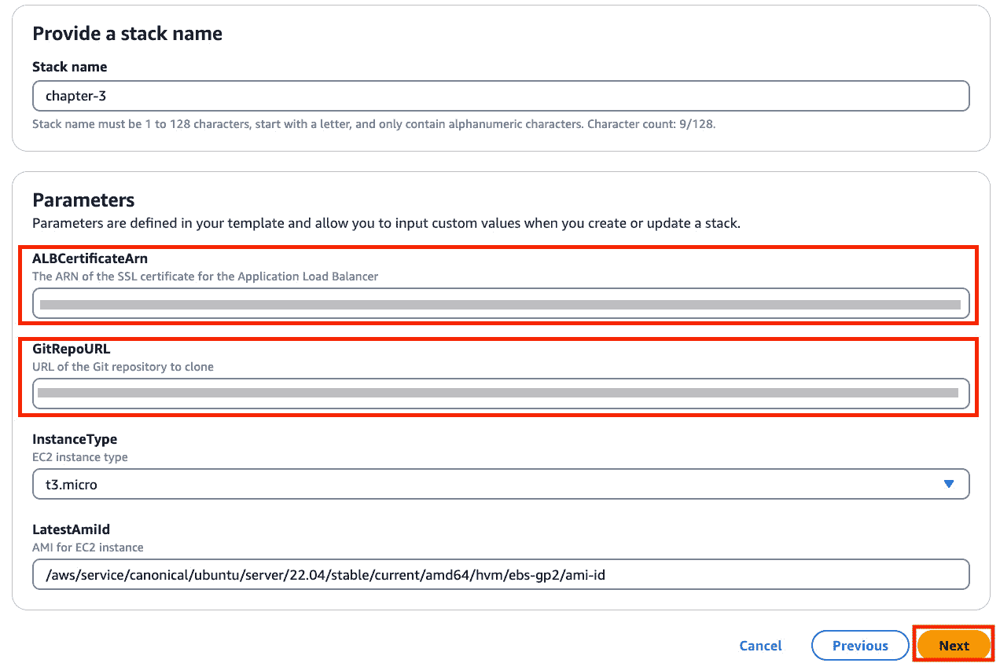
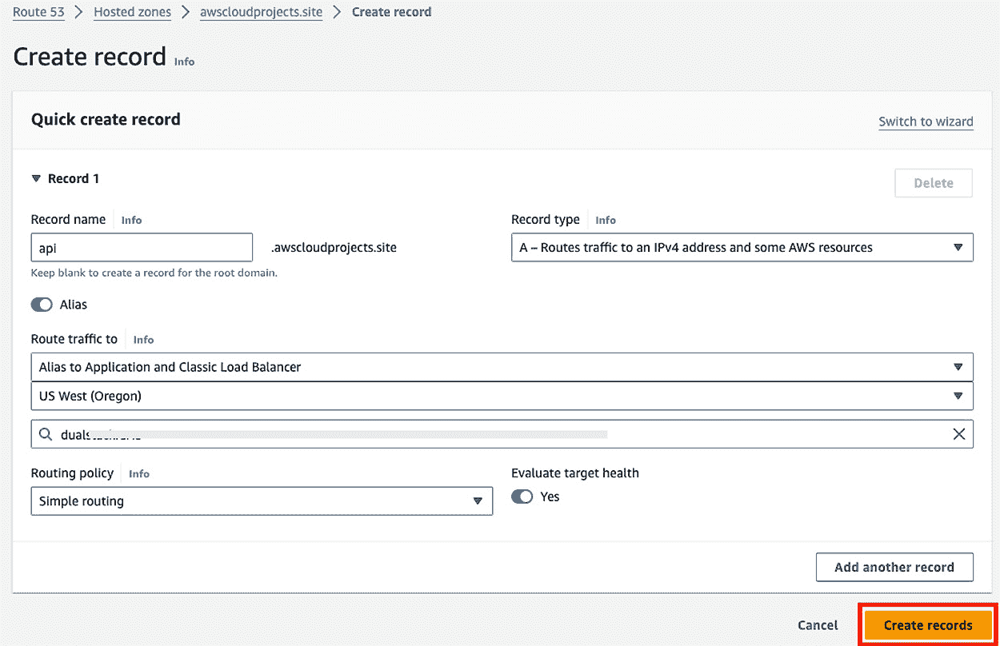

# <st c="0">3</st>

# <st c="2">构建一个食谱分享应用程序</st>

<st c="39">一个**Web 应用程序** <st c="57">是一个通过互联网可以从 Web 浏览器（如 Google Chrome 或 Mozilla Firefox）访问的软件程序，它可以像</st> *<st c="237">第二章</st>*<st c="246">中的示例一样简单并具有信息性，在该示例中，你将简历提供给最终用户，或者包含复杂的业务逻辑和关键数据</st> <st c="352">管理功能。</st>

<st c="376">Web 应用程序可以分解为两个部分：**前端** <st c="441">和**后端**</st><st c="457">。前端是用户可见的，通常使用 HTML、CSS、JavaScript 和现代框架（如 React.js 或 Vue.js）构建。</st> <st c="588">后端将处理业务逻辑、身份验证、数据处理及与外部服务和数据库的通信，通常使用 Python、Java 或 C# 等编程语言进行开发。</st> <st c="800">前端与后端之间的通信通常通过**应用程序编程接口** <st c="917">(**API**)</st><st c="922">进行，使开发人员能够抽象出复杂性，并高效地在不同应用程序之间重用功能。</st>

<st c="1039">在本章中，你将开发一个分享食谱的应用程序，用户可以创建、删除或查看他们的食谱。</st> <st c="1166">此外，你还将实现后端和前端，开发一个功能齐全的</st> <st c="1255">Web 应用程序。</st>

<st c="1271">总结来说，本章涵盖以下主题</st> <st c="1325">按顺序：</st>

+   <st c="1334">你将要构建的——一个用于</st> <st c="1383">分享食谱</st>

+   <st c="1396">你将如何构建它——使用 S3 和 CloudFront 构建前端，使用 EC2 托管 API，使用 DynamoDB 存储</st> <st c="1527">你的食谱</st>

+   <st c="1539">构建它——通过 CloudFormation 和使用</st> <st c="1591">AWS 控制台</st>

+   <st c="1602">如何改进解决方案——改进监控和应用日志，强制执行安全协议以访问应用程序，并且</st> <st c="1738">实施身份验证</st>

<st c="1762">在本章结束时，你将拥有在 AWS 上构建动态 Web 应用程序的实际经验，利用不同的服务实现特定功能，并理解前端和</st> <st c="1969">后端开发的基础知识。</st>

# <st c="1989">技术要求</st>

<st c="2012">要构建和部署你自己的食谱分享应用程序，你需要访问 AWS 账户，并可选地配置一个域名，如果你希望通过 HTTPS 实现安全通信。</st> <st c="2198">需要提醒的是，正如你在本章中所看到的，我们提供了一个第二种选择，配置为 HTTP，不需要拥有</st> <st c="2349">域名。</st>

<st c="2358">此外，本书在其 GitHub 仓库中有一个专门的文件夹，你可以在这里找到必要的代码片段以供跟随</st> <st c="2485">学习：</st> [<st c="2492">https://github.com/PacktPublishing/AWS-Cloud-Projects/tree/main/chapter3/code</st>](https://github.com/PacktPublishing/AWS-Cloud-Projects/tree/main/chapter3/code)<st c="2569">。</st>

# <st c="2570">场景</st>

<st c="2579">在</st> <st c="2586">上一章中，你创建了一个个人网站来分享你的简历，这个网站已经在招聘人员中变得非常受欢迎，其他同行也在寻找类似的方式来分享他们的简历。</st> <st c="2773">这对你的职业生涯非常有帮助，你开始思考云技术如何在你的副业和兴趣项目中提供帮助；其中一个与</st> <st c="2950">你的烹饪技能</st> <st c="2965">有关。</st>

<st c="2965">你花费大量空闲时间创造食谱和重新发明甜点，通常把它们写在笔记本里。</st> <st c="3090">与此同时，你已经开始在社交媒体上建立自己的个人档案，并且已经有 80 万粉丝，他们对你菜肴的照片作出反应，并向你索要食谱。</st> <st c="3262">由于你的名气越来越大，朋友和家人开始称你为“厨师”，并经常向你请教一些他们曾经尝试过的特定食谱的建议。</st> <st c="3438">过去。</st>

<st c="3447">直到现在，你还需要去查找你的食谱笔记本，拍照并分享，但随着时间的推移以及你创作的食谱数量越来越多，这变得越来越难以管理，你需要考虑</st> <st c="3653">一个替代方案。</st>

<st c="3668">在熟悉云技术的过程中，你开始寻找替代当前食谱分享方法的方案，用于你的第二个云项目——一个名为食谱</st> <st c="3849">分享应用程序</st>。

## <st c="3869">需求</st>

<st c="3882">在我们开始</st> <st c="3899">解答</st> *<st c="3909">如何</st>* <st c="3912">解决这个问题之前，重要的是要澄清</st> *<st c="3976">我们</st>* <st c="3980">将要构建什么，并以清晰简洁的需求列表进行结构化，就像我们在</st> *<st c="4085">第一章</st>* <st c="4094">中介绍的那样，并在</st> *<st c="4114">第二章</st>* <st c="4123">中举例说明。</st>

<st c="4124">在这</st> <st c="4132">个项目中，您希望开发一个食谱分享应用程序，为人们提供一个方便的平台来发现、分享和访问不同的食谱。</st> <st c="4285">与前一章不同，这个应用程序需要处理与食谱管理相关的动态内容。</st> <st c="4398">有不同的关键人物将访问</st> <st c="4448">您的应用程序：</st>

+   **<st c="4465">平台管理员</st>**<st c="4480">：平台所有者，可能希望创建新配方、维护或</st> <st c="4561">删除配方。</st>

+   **<st c="4571">终端用户/消费者</st>**<st c="4591">：使用平台访问特定配方的最终用户，不应具备创建、更改或删除</st> <st c="4715">任何记录的权限。</st>

<st c="4726">实际的实施应是应用开发的最后一步，精确和详细的需求收集是定义清晰的</st> <st c="4888">开发计划的关键。</st>

<st c="4905">您使用的技术、采用的服务和设计的架构应是您列出以实现</st> <st c="5089">目标的技术和非技术要求的结果。</st>

### <st c="5104">业务需求</st>

<st c="5126">在</st> <st c="5137">您进行的市场研究后，以及在一周内获得的点赞和评论数量，您得出结论，人们倾向于在星期五和星期六花更多时间烹饪，特别是晚餐时间。</st> <st c="5335">您还分析了用户的地理分布，85%位于美国，12%位于欧洲，其余 3%分布在</st> <st c="5473">全球其他地区。</st>

<st c="5483">一家食品配送服务向您提出签署广告合同的要求，但他们只同意在您的应用程序中达到 100,000 活跃用户之后才会给出收入流。</st> <st c="5661">在那之前，您的应用程序将没有收入来源。</st>

<st c="5726">根据这些发现和潜在的收入机会，您已经确定了以下关键</st> <st c="5828">业务需求：</st>

+   <st c="5850">在年底之前全球达到 100,000 用户</st> <st c="5898">的目标</st>

+   <st c="5906">增强</st> <st c="5925">在欧洲的存在</st>

+   <st c="5934">在支持增长的同时保持成本效益</st> <st c="5987">且成本不显著</st>

### <st c="6003">功能需求</st>

<st c="6027">您的</st> <st c="6032">应用程序应服务于两个不同的用户群体：</st> *<st c="6082">管理员</st>* <st c="6088">和</st> *<st c="6093">终端用户</st>*<st c="6102">。对于最初的项目，您将开始两个不同的页面，</st> `<st c="6170">/user</st>` <st c="6175">供终端用户使用，</st> `<st c="6198">/admin</st>` <st c="6204">供管理员使用，以支持这两个</st> <st c="6236">不同的角色。</st>

<st c="6255">你还希望通过简洁的用户界面创造无缝体验。</st> <st c="6322">此外，你希望你的应用能够响应式，支持不同的设备，如平板、手机</st>，<st c="6442">和笔记本电脑。</st>

<st c="6454">描述功能需求的一个关键步骤是创建界面原型，如</st> *<st c="6566">图 3.1</st>*<st c="6577">，</st> *<st c="6579">3.2</st>*<st c="6582">，</st> <st c="6584">和</st> *<st c="6588">3.3</st>*<st c="6591">。</st>


<st c="6646">图 3.1 – 用户界面首页原型</st>

<st c="6678">让我们拆解不同的功能</st> <st c="6727">和接口：</st>

+   `<st c="6742">/</st>``<st c="6744">用户</st>`<st c="6748">：</st>

    +   <st c="6750">访问</st> <st c="6769">食谱标题列表</st>

    +   <st c="6782">能够选择特定食谱并访问所有</st> <st c="6834">详细信息</st>

    +   <st c="6845">响应式</st>


<st c="7025">图 3.2 – 用户页面 UI 原型</st>

+   `<st c="7061">/</st>``<st c="7063">管理员</st>`<st c="7068">：</st>

    +   <st c="7070">访问</st> <st c="7089">食谱标题列表</st>

    +   <st c="7102">能够</st> <st c="7114">删除食谱</st>

    +   <st c="7128">支持</st> <st c="7137">食谱创建</st>

    +   <st c="7152">控制</st> <st c="7161">最大支持的食材、步骤和</st> <st c="7207">食谱数量</st>

    +   <st c="7224">响应式</st>


<st c="7414">图 3.3 – 管理页面 UI 原型</st>

### <st c="7451">非功能性需求</st>

<st c="7479">你的</st> <st c="7484">应用需要处理突发访问模式，因为预计的使用量应仅在就餐时间接近时增加。</st> <st c="7604">另外，你计划在未来几个月增加欧洲用户群，因此你需要为全球用户提供服务。</st> <st c="7745">此外，成本效益至关重要，因为你的应用没有收入来源。</st> <st c="7843">总结一下，以下是你需要的：</st> <st c="7870">需求：</st>

+   <st c="7879">全球分发，服务全球用户</st> <st c="7929">分布在全球各地的用户</st>

+   <st c="7938">自动扩展以处理突发</st> <st c="7972">使用模式</st>

+   <st c="7985">成本效益</st>

### <st c="8004">技术要求</st>

<st c="8027">如</st> <st c="8037">在</st> *<st c="8045">功能需求</st>* <st c="8068">部分中所述，您希望支持多设备，因此您的应用需要具备响应式设计，以保持一致且良好的用户体验。</st> <st c="8206">因此，前端您希望选择一个简化响应式设计并加速开发过程的框架。</st> <st c="8321">对于后端，您希望采用 Python 作为编程语言，因为它简单、灵活，并且拥有庞大的库和框架生态系统，</st> <st c="8474">同时支持 AWS SDK。</st> <st c="8515">除了与 AWS 服务的所有交互外，您还需要开发自己的 API，因此您选择了 FastAPI，一个用 Python 构建的现代 Web 框架，旨在高效、用户友好且轻量级。</st> <st c="8739">我们将使用以下技术：</st>

+   <st c="8763">现代前端框架 –</st> <st c="8792">React.js</st>

+   <st c="8800">后端编程语言 –</st> <st c="8832">Python</st>

+   <st c="8838">FastAPI 作为</st> <st c="8868">API 开发框架</st>

### <st c="8883">数据需求</st>

<st c="8901">在您的应用中，您处理食谱数据，有多种方式可以存储它们。</st> <st c="8909">食谱可以作为单独的文档存储，记录或条目之间没有关系。</st> <st c="8995">您不期望对数据进行任何复杂的查询，而是希望实现简单的操作来执行</st> <st c="9213">以下内容：</st>

+   **<st c="9227">列出食谱</st>**<st c="9244">：展示已创建的食谱列表。</st>

+   **<st c="9285">删除一个食谱</st>**<st c="9301">：如果管理员不再希望某个特定的食谱成为组合的一部分，应当能够删除该条目。</st>

+   **<st c="9420">创建一个食谱</st>**<st c="9436">：创建一个新的食谱与</st> <st c="9473">用户分享。</st>

<st c="9483">另外，您希望实现一个高度可扩展的数据存储，要求最低或无维护工作，理想情况下是一个管理服务。</st> <st c="9616">作为您食谱文档的结构，您设计了</st> `<st c="9671">recipe_example.json</st>`<st c="9690">：</st>

```
 {   "ID":"GUID",
   "Title":"recipe title",
   "Ingredients":[…],
   "Steps":[…] }
```

<st c="9764">考虑到每个食谱包含 10 个步骤和 10 个材料，您得出每个食谱大约为 1 KB 的结论。</st> <st c="9884">在读取操作方面，假设在高峰时段有 20,000 个并发用户</st> <st c="9955">，您将有 20,000 个并发读取操作，并且您希望确保即使在</st> <st c="10076">高峰时段也能保持性能的一致性。</st>

## <st c="10087">架构模式</st>

<st c="10109">AWS 架构中心提供了一个由 AWS 合作伙伴的云架构专家精心编制的全面资源集合，包含经过测试和推荐的解决方案，可以作为起点。</st> <st c="10326">对于这个项目，AWS 提供了一种完全适用于你的场景的架构模式：</st> *<st c="10418">将基于 React 的单页面应用部署到 Amazon S3 和 CloudFront</st>* <st c="10490">(</st>[<st c="10492">https://docs.aws.amazon.com/prescriptive-guidance/latest/patterns/deploy-a-react-based-single-page-application-to-amazon-s3-and-cloudfront.html</st>](https://docs.aws.amazon.com/prescriptive-guidance/latest/patterns/deploy-a-react-based-single-page-application-to-amazon-s3-and-cloudfront.html)<st c="10635">).</st> <st c="10639">阅读这些推荐的指南将帮助你了解你将要遵循的过程。</st>

<st c="10731">要深入了解每个 AWS 服务，AWS 文档可能是最好的信息来源。</st> <st c="10834">每个服务都有自己的文档，强烈建议你查看并通读它，以掌握从基础到更高级的概念。</st> <st c="10983">此外，理解 AWS 在你项目中的角色也很重要。</st> <st c="11057">AWS 将为你提供支持、托管，并帮助你满足需求，但基本的网页开发知识是必不可少的。</st> <st c="11170">在进行实现之前，了解与你的应用架构相关的一些关键概念是至关重要的。</st> <st c="11300">例如，你应该能够</st> <st c="11335">回答以下问题：</st>

+   <st c="11366">什么是</st> **<st c="11377">单页面应用</st>** <st c="11400">(</st>**<st c="11402">SPA</st>**<st c="11405">)，它与传统的</st> <st c="11448">网页应用有何不同？</st>

+   <st c="11465">API 在你的应用中扮演什么角色？</st> <st c="11514">为什么你</st> <st c="11525">需要一个 API？</st>

<st c="11534">第一个问题，a</st> **<st c="11561">SPA</st>** <st c="11564">是一个加载单一 HTML 页面并在用户与应用互动时动态更新该页面的网页应用。</st> <st c="11686">与传统的多页面应用不同，后者每次用户操作都需要从服务器加载一个新页面，SPA 初始时会加载所有必要的 HTML、CSS 和 JavaScript 文件，后续的交互通过 JavaScript 和对</st> <st c="11957">服务器的请求无缝进行。</st>

<st c="11968">确保你能够回答剩下的问题，在跳入 AWS 之前建立扎实的知识基础。</st>

## <st c="12055">架构</st>

<st c="12077">到目前为止，</st> <st c="12089">你应该已经熟悉了将要使用的技术，并且你可能已经在本地实现了一个小的概念验证。</st> <st c="12220">下一步是创建一个架构图，以支持你的项目。</st> *<st c="12314">图 3</st>**<st c="12322">.4</st>* <st c="12324">是一个抽象图，参考了组成完整架构的主要层次，是进行</st> <st c="12445">架构设计的一个良好起点。</st>


<st c="12531">图 3.4 – 抽象架构</st>

<st c="12565">最终用户与展示层交互，以获取前端应用程序，并向计算层发出请求，但永远不会直接访问数据层。</st> <st c="12731">相反，计算层负责通过</st> <st c="12816">API 执行数据操作。</st>

<st c="12823">设计 API 非常关键，以确保你使用正确的模型来执行所有需要的数据操作，同时还应考虑数据和功能要求。</st> *<st c="13016">图 3</st>**<st c="13024">.5</st>* <st c="13026">展示了基于</st> <st c="13078">所做分析的初步 API 结构。</st>


<st c="13167">图 3.5 – API 结构</st>

<st c="13193">以下是</st> <st c="13201">详细说明：</st>

+   `<st c="13215">GET /recipes</st>`<st c="13228">：此操作获取食谱列表。</st>

+   `<st c="13261">GET /health</st>`<st c="13273">：这是一个简单的健康</st> <st c="13300">检查端点。</st>

+   `<st c="13315">DELETE /recipes/{recipe_id}</st>`<st c="13343">：此操作删除具有</st> <st c="13384">定义 ID 的特定食谱。</st>

+   `<st c="13395">POST /recipes</st>`<st c="13409">：此操作创建一个新的</st> <st c="13431">食谱记录。</st>

<st c="13445">考虑到这一切，</st> <st c="13459">你应该能够继续进行完整架构的设计，并使用相应的 AWS 服务。</st> <st c="13564">对于前端，像上一章所用的解决方案，你将使用 Amazon S3 和 Amazon CloudFront 来提供应用程序。</st> <st c="13703">计算层通过 Amazon EC2 实现，计划将 API 部署在此处。</st> <st c="13797">对于数据层，在考虑所有要求之后，你最终选择了 Amazon DynamoDB 作为数据存储。</st> <st c="13913">为了简化，你将把计算层和数据层合并成一个名为后台的单一层，最终，你的架构图应如下所示</st> *<st c="14074">图 3</st>**<st c="14082">.6</st>*<st c="14084">。</st>


<st c="14191">图 3.6 – 用于食谱共享应用程序的 AWS 架构</st>

<st c="14256">在</st> <st c="14266">建立高层架构后，让我们更深入地探讨你选择的具体 AWS 服务，了解它们如何与之前定义的需求对齐。</st> <st c="14438">。</st>

# <st c="14454">AWS 服务</st>

<st c="14467">截至本文撰写时，AWS 提供了</st> <st c="14476">200 多种服务，支持不同的用途，并且管理层级各异。</st> <st c="14610">选择 AWS 服务是一个重要的过程，选择应由预先定义的需求驱动，而不是相反。</st> <st c="14745">在这一章节中，你将探索你解决方案中采用的服务，并了解它们如何与已定义的需求对齐。</st> <st c="14879">部分服务内容已经在前几章中覆盖过。</st> <st c="14953">因此，为避免内容重复，我们将简要提及当前用例的优势，并引用可以找到详细解释的章节。</st> <st c="15097">。</st>

## <st c="15118">Amazon S3</st>

<st c="15128">你的</st> <st c="15133">前端是一个使用 React.js 构建的 SPA，它会被转化为静态文件，如 HTML、CSS 和 JavaScript，应当将这些文件视为对象。</st> <st c="15278">如</st> *<st c="15294">第二章</st>*<st c="15303">所述，S3 是 AWS 提供的一个可扩展、高可用且持久的对象存储服务，是托管静态网站的成本效益高的解决方案，</st> <st c="15461">包括 SPA。</st>

<st c="15476">重要提示</st>

<st c="15491">S3 设计时保证了 11 个 9 的数据耐久性。</st> <st c="15550">这意味着，如果你在 S3 存储 10,000 个对象，你可以预期每 1000 万年因硬件故障或其他潜在数据丢失原因，最多丢失一个对象。</st> <st c="15733">。</st>

<st c="15743">如果你想深入了解 Amazon S3 架构，推荐观看</st> *<st c="15824">AWS re:Invent 2023 - 深入了解 Amazon S3</st>* <st c="15867">的会议：</st> [<st c="15877">https://www.youtube.com/watch?v=sYDJYqvNeXU</st>](https://www.youtube.com/watch?v=sYDJYqvNeXU)<st c="15920">。</st>

## <st c="15921">Amazon CloudFront</st>

<st c="15939">如果你计划让</st> <st c="15953">你的应用程序全球服务用户，并希望确保使用 HTTPS 协议进行安全访问，而 S3 不支持此协议。</st> <st c="16070">这只是将 CloudFront 纳入架构的众多原因之一，若要了解服务的详细解释及其优势，建议查看</st> *<st c="16254">AWS 服务</st>* <st c="16266">章节中的内容：</st> *<st c="16278">第二章</st>*<st c="16287">。</st>

## <st c="16288">Amazon 虚拟私有云（VPC）</st>

**<st c="16323">Amazon VPC</st>** <st c="16334">允许</st> <st c="16342">你在 AWS 云中创建一个逻辑隔离的虚拟网络。</st> <st c="16411">它使你能够定义一个虚拟网络环境，在其中启动和</st> <st c="16494">管理 AWS 资源，如</st> **<st c="16524">Amazon 弹性计算云 (EC2)</st>** <st c="16558">实例，以安全和受控的方式。</st> <st c="16605">作为 VPC 配置的一部分，你可以定义带有多个子网的网络拓扑，这些子网可以是公共的或私有的，意味着分别具有或不具有互联网访问权限，以便隔离流量并增强</st> <st c="16829">安全性。</st>

## <st c="16846">Amazon EC2</st>

<st c="16857">从</st> <st c="16866">技术要求来看，你决定开发自己的 API，现在你需要一个服务来部署和托管它。</st> <st c="16977">Amazon EC2 允许你在 VPC 内配置虚拟机（实例）来运行你的应用程序，或者在此情况下，运行你的 API。</st> <st c="17111">EC2 提供了多种实例类型，具有不同的 CPU、内存、存储和网络容量配置，允许你选择适合特定应用程序需求的实例类型，确保最佳性能</st> <st c="17353">和成本效益。</st>

<st c="17376">EC2 提供了不同的定价模型，如果你对需求有清晰的了解，可以带来额外的成本效益，同时还提供按需选项，采用纯粹的按量付费模式，这正是你为</st> <st c="17599">此项目选择的。</st>

<st c="17612">如果你想了解</st> <st c="17634">更多关于 EC2 定价模型及其工作原理的信息，你可以在 AWS</st> <st c="17716">文档中阅读：</st> [<st c="17731">https://docs.aws.amazon.com/whitepapers/latest/how-aws-pricing-works/amazon-ec2.html</st>](https://docs.aws.amazon.com/whitepapers/latest/how-aws-pricing-works/amazon-ec2.html)<st c="17815">。</st>

## <st c="17816">应用程序负载均衡器 (ALB)</st>

<st c="17848">ALB 是一个</st> <st c="17861">完全托管的负载均衡</st> <st c="17890">解决方案，旨在将流量分配到多个目标，具体来说就是 EC2 实例。</st> <st c="17977">作为一个托管解决方案，它在设计上具有高度的可扩展性，并根据流量负载自动进行扩展。</st> <st c="18091">此外，根据你的需求，ALB 带来了两个</st> <st c="18151">主要优势：</st>

+   **<st c="18167">健康检查</st>**<st c="18183">：每个</st> <st c="18191">负载均衡器都需要至少一个目标组，你可以为目标配置健康检查，以确保流量只发送到健康的目标，避免不良的用户体验，并提高应用程序的弹性和容错能力。</st> <st c="18441">你的应用程序。</st>

+   **<st c="18458">SSL 终止</st>**<st c="18474">：ALB 支持 SSL 终止，卸载加密和解密的计算负担，减轻你的</st> <st c="18582">EC2 实例的负担。</st>

<st c="18596">ALB 还</st> <st c="18607">与 AWS Web 应用防火墙无缝集成，这为防范常见攻击提供了额外的安全保护，例如</st> <st c="18740">SQL 注入，</st> **<st c="18755">跨站脚本攻击</st>** <st c="18775">(</st>**<st c="18777">XSS</st>**<st c="18780">)，以及其他网页</st> <st c="18798">应用漏洞。</st>

## <st c="18826">亚马逊 DynamoDB</st>

选择你的<st c="18842">数据库解决方案应根据你的数据和需求来决定。</st> <st c="18856">对于这个项目，你需要将食谱存储为单独的文档。</st> <st c="18923">此外，你已经定义了关于查询一致性和高性能的需求，即使在多个并发的</st> <st c="19097">查询操作下。</st>

**<st c="19114">亚马逊 DynamoDB</st>** <st c="19130">是一种完全</st> <st c="19141">托管的 NoSQL 数据库服务，更具体地说，是一种键值和文档存储，它在任何规模下都能提供单毫秒级的性能。</st> <st c="19288">通过选择 DynamoDB，你将利用其天生的高可用性，因为底层的数据复制采用按需付费模式并自动扩展，以处理突发的工作负载，就像</st> <st c="19499">你的应用程序的情况。</st>

<st c="19516">重要提示</st>

<st c="19531">DynamoDB 本质上是一个分布式服务，但即使你需要高一致性，这也不应成为障碍。</st> <st c="19645">DynamoDB 提供两种一致性模型：最终一致性（默认）和强一致性。</st> <st c="19751">使用最后一种选项，你可以确保高一致性和数据完整性，确保返回的数据始终是最新的。</st> <st c="19867">。</st>

<st c="19875">如果你想了解更多关于 DynamoDB 的故事、10 周年后的经验教训以及未来计划，查看这篇来自 Amazon</st> <st c="20035">Science:</st> [<st c="20044">https://www.amazon.science/latest-news/amazons-dynamodb-10-years-later</st>](https://www.amazon.science/latest-news/amazons-dynamodb-10-years-later)<st c="20114">。</st>

## <st c="20115">AWS CloudFormation</st>

在*<st c="20138">第一章</st>*中，我们简要介绍了 AWS CloudFormation 作为配置基础设施的工具，但考虑到这是它首次被广泛使用的章节，我们将进一步深入讲解并详细说明</st> <st c="20358">它。</st>

**<st c="20370">CloudFormation</st>** <st c="20385">是一个</st> **<st c="20392">基础设施即代码</st>** <st c="20414">(</st>**<st c="20416">IaC</st>**<st c="20419">) 服务，允许你以声明性方式定义并配置 AWS 资源，这些资源通过模板文档来描述，模板可以用 YAML 或 JSON 编写。</st> <st c="20582">像所有 IaC 工具一样，CloudFormation 支持基础设施生命周期自动化，从创建、更新到删除。</st> <st c="20707">它支持漂移检测，用于识别可能在模板外部进行的更改，这些更改可能导致不一致。</st> <st c="20836">不建议手动更改由 CloudFormation 管理的资源，因为这可能导致配置漂移，即资源的实际状态与</st> <st c="21034">模板中定义的状态不符。</st>

<st c="21047">CloudFormation 的一个主要优势是它能够将资源管理和配置作为一个单一的单元，称为栈。</st> <st c="21175">该栈可以包含来自各种 AWS 服务的资源，如 EC2 实例、VPC、S3 存储桶等。</st> <st c="21286">CloudFormation 会根据</st> <st c="21415">模板中定义的依赖关系，负责按正确的顺序创建和配置这些资源。</st>

# <st c="21428">编码解决方案</st>

<st c="21448">到目前为止，</st> <st c="21460">你应该已经牢固掌握了所使用的核心服务、选择这些服务的原因，最重要的是，如何使这些服务与你的需求相符合。</st> <st c="21630">你现在终于可以进行</st> <st c="21671">实际的实施了。</st>

## <st c="21693">克隆项目</st>

<st c="21713">如果你正在</st> <st c="21724">跟随前几章的内容，你应该已经克隆了与本书相关的代码库，但如果你是刚刚开始，可以先克隆该仓库，或者选择将代码库作为一个</st> <st c="21936">ZIP 文件</st> <st c="21947">下载。</st> <st c="22052">该仓库的结构是以每章一个文件夹为单位的，本章的所有代码位于</st> `<st c="22055">chapter3/code</st>`<st c="22068">。</st>

<st c="22069">在</st> `<st c="22081">chapter3/code</st>` <st c="22094">文件夹内，你将找到三个子文件夹，如</st> *<st c="22147">图 3</st>**<st c="22155">.7</st>*<st c="22157">所示：</st>

+   `<st c="22159">frontend</st>`<st c="22167">：此处包含</st> <st c="22197">你的前端代码</st>

+   `<st c="22210">backend</st>`<st c="22218">：此处包含</st> <st c="22248">你的 API 代码</st>

+   `<st c="22256">platform</st>`<st c="22265">：此处包含两个不同的 CloudFormation 模板，用于部署</st> <st c="22359">你的应用程序</st>的主要基础设施。


<st c="22415">图 3.7 – </st> <st c="22432">第三章</st> <st c="22441">文件夹结构</st>

<st c="22458">为什么有两个不同的</st> <st c="22489">模板可供选择？</st>

<st c="22509">SPA 有两种连接方式：一种是通过 CloudFront 获取前端资源，另一种是通过浏览器中的 JavaScript API 请求与后台进行通信，如下图所示：</st> *<st c="22714">图 3</st>**<st c="22722">.6</st>*<st c="22724">。</st>

<st c="22725">虽然 CloudFront 会自动提供 HTTPS 来交付前端资源，但您的 API 需要额外的配置。</st> <st c="22856">为了使用 HTTPS 保护 API，您需要拥有一个域名并申请证书以</st> <st c="22941">证明所有权。</st>

<st c="22957">我们理解您现在可能没有域名，或者不想购买域名，这不应该成为部署应用程序的障碍，因此我们已为您提供解决方案！</st>

<st c="23126">我们为本节设计了两种不同的选项，因此在</st> `<st c="23227">平台</st>` <st c="23235">文件夹中有两个不同的模板。</st> <st c="23244">下表将选项与模板进行映射，帮助您选择</st> <st c="23330">正确的路径：</st>

|  | **<st c="23341">描述</st>** | **<st c="23353">CloudFormation 模板</st>** | **<st c="23377">推荐</st>** |
| --- | --- | --- | --- |
| **<st c="23389">选项 1</st>** | <st c="23398">您要么拥有一个域名，要么愿意购买一个域名来配置与</st> <st c="23490">您的 API</st> 的 HTTPS 通信 | `<st c="23498">ch3-https-complete.yaml</st>` | <st c="23522">是</st> |
| **<st c="23526">选项 2</st>** | <st c="23535">您希望在没有拥有或购买域名的情况下测试应用程序</st> <st c="23598">一个域名</st> | `<st c="23606">ch3-http.yaml</st>` | <st c="23620">否</st> |

<st c="23623">表 3.1 – CloudFormation 模板与您选择的选项之间的映射</st>

<st c="23713">关于 HTTP 和 HTTPS 之间差异的详细解释超出了本书的范围，但如果您想了解更多，您可以阅读以下</st> <st c="23870">文章：</st> [<st c="23879">https://aws.amazon.com/compare/the-difference-between-https-and-http/</st>](https://aws.amazon.com/compare/the-difference-between-https-and-http/)<st c="23948">。</st>

<st c="23949">您遵循的步骤取决于您选择的选项。</st> <st c="24004">为了简化过程，选项 1 的特定步骤将标记为</st> *<st c="24074">(仅适用于选项 1)</st>*<st c="24089">，选项 2 的步骤将标记为</st> *<st c="24132">(仅适用于选项 2)</st>*<st c="24147">。没有任何标记的步骤适用于两种选项。</st> <st c="24198">请注意，即使选择了选项 2，建议阅读选项 1 的 HTTPS 配置步骤，以获取</st> <st c="24318">更多知识。</st>

<st c="24333">重要说明</st>

<st c="24348">虽然此应用程序和 CloudFormation 模板旨在适用于任何 AWS 区域，但如果选择选项 1，则必须使用相同的区域来创建证书并部署解决方案。</st> <st c="24551">这是因为选项 1 需要使用 AWS 证书管理器创建证书，而这是一个</st> <st c="24650">区域性服务。</st>

## <st c="24667">第一部分 – DNS 配置和证书签发（仅适用于选项 1）</st>

<st c="24737">要</st> <st c="24741">配置 HTTPS，您需要拥有一个域名，并通过获取证书来证明所有权，本节将介绍如何配置您的 DNS 服务并为</st> <st c="24914">您的域名签发证书。</st>

<st c="24926">域名是通过域名注册商购买的，注册商管理互联网域名的预定和注册。</st> <st c="25045">在 AWS 中，Route 53 可以同时作为您的域名注册商，用于</st> <st c="25106">购买域名，以及作为 DNS 服务来管理它们。</st> <st c="25169">此外，您还可以选择流行的第三方注册商，如 GoDaddy 或 Namecheap 等，来购买</st> <st c="25287">您的域名。</st>

### <st c="25299">Route 53 中的 DNS 配置</st>

<st c="25329">在本</st> <st c="25339">示例中，我们刚从第三方提供商那里购买了一个域名，并将演示如何在 Route 53 中为外部购买的域名设置 DNS 管理</st> <st c="25494">。</st>

<st c="25503">在控制台中，通过在搜索栏输入</st> `<st c="25559">route 53</st>` <st c="25567">，如</st> *<st c="25599">图 3</st>**<st c="25607">.8</st>*<st c="25609">所示，或者你也可以通过以下</st> <st c="25663">链接直接访问：</st> [<st c="25669">https://console.aws.amazon.com/route53</st>](https://console.aws.amazon.com/route53)<st c="25707">。</st>


<st c="25733">图 3.8 – 控制台访问 Route 53 服务</st>

<st c="25780">在 Route 53 控制台的左侧面板中，执行以下操作：</st>

1.  <st c="25840">点击</st> **<st c="25850">托管区域</st>**<st c="25862">。</st>

1.  <st c="25863">然后，点击</st> **<st c="25877">创建</st>** **<st c="25884">托管区域</st>**<st c="25895">。</st>

1.  <st c="25896">填写</st> `<st c="25967">awscloudprojects.site</st>`<st c="25988">。</st>

1.  <st c="25991">选择</st> **<st c="25999">公共托管区域</st>** <st c="26017">作为</st> <st c="26021">类型。</st>

1.  <st c="26030">点击</st> **<st c="26037">创建</st>** **<st c="26044">托管区域</st>**<st c="26055">。</st>

<st c="26056">您的配置窗口应该如下所示</st> *<st c="26100">图 3</st>**<st c="26108">.9</st>*<st c="26110">，除了</st> **<st c="26127">域名</st>** **<st c="26134">字段</st>** <st c="26138">。</st>


<st c="26955">图 3.9 – Route 53 托管区域创建表单</st>

<st c="27002">如果你</st> <st c="27009">返回到</st> **<st c="27024">托管区域</st>** <st c="27036">菜单，你应该能够看到你的域名列出。</st> <st c="27089">要访问与你的托管区域关联的名称服务器，请按照</st> <st c="27156">以下步骤操作：</st>

1.  <st c="27169">点击你创建的域名。</st>

1.  <st c="27202">请注意相关的名称服务器，因为你将需要它们来配置</st> <st c="27282">DNS。</st>

<st c="27291">你应该在你的托管区域详情中看到四个名称服务器值，如</st> *<st c="27379">图 3</st>**<st c="27387">.10</st>*<st c="27390">所示：</st>


<st c="27599">图 3.10 – 托管区域详情</st>

<st c="27632">以下步骤涉及更新你域名的名称服务器，具体步骤可能会根据你的域名注册商而有所不同。</st> <st c="27754">无论你的注册商是谁，AWS 都提供了与流行</st> <st c="27858">注册商配置名称服务器的逐步指南：</st> [<st c="27870">https://docs.aws.amazon.com/Route53/latest/DeveloperGuide/migrate-dns-domain-in-use.html</st>](https://docs.aws.amazon.com/Route53/latest/DeveloperGuide/migrate-dns-domain-in-use.html)<st c="27958">。</st>

<st c="27959">重要提示</st>

<st c="27974">一个</st> **<st c="27977">托管区域</st>** <st c="27988">在 Amazon Route 53 中是一个容器，保存特定域名及其子域的所有 DNS 记录和路由配置。</st> <st c="28128">它允许你根据定义的</st> <st c="28236">路由策略管理和路由流量到你的 AWS 资源或外部资源。</st>

### <st c="28253">证书颁发</st>

<st c="28273">你现在将继续</st> <st c="28295">使用</st> **<st c="28341">AWS 证书管理器</st>** <st c="28364">(</st>**<st c="28366">ACM</st>**<st c="28369">) 服务进行证书颁发过程。</st> <st c="28381">在控制台中，转到 ACM 服务</st> <st c="28421">，地址为</st> [<st c="28424">https://console.aws.amazon.com/acm</st>](https://console.aws.amazon.com/acm)<st c="28458">。</st>


<st c="28488">图 3.11 – 控制台访问 ACM 服务</st>

<st c="28535">要为你的域名颁发证书，你需要按照</st> <st c="28595">以下步骤操作：</st>

1.  <st c="28607">点击</st> **<st c="28621">请求一个</st>** **<st c="28631">证书</st>** <st c="28642">按钮。</st>

1.  <st c="28650">在</st> **<st c="28658">证书类型</st>** <st c="28674">屏幕上，选择</st> **<st c="28694">请求公共证书</st>** <st c="28722">选项，点击</st> **<st c="28740">下一步</st>**<st c="28744">。</st>

1.  在表单中填写必要的信息。大多数字段可以保留默认值，但对于`app.example.com`、`api.example.com`等，您可能需要进行调整。

1.  `*.example.com`。

1.  确保**验证方法**设置为**DNS 验证**，这是 AWS 推荐的方式。

1.  点击**请求**。

*图 3.12*展示了表单的最终状态，包含所有必要字段。


图 3.12 – 证书请求表单

在请求证书后，您将看到它的状态为**待验证**。要验证证书并证明域名所有权，您需要在您的托管区域创建一个 DNS 记录。

如果您的域名由 Route 53 管理，您可以点击**创建 Route 53 记录**，如*图 3.13*所示，这样可以更轻松地进行设置。


图 3.13 – 使用 DNS 记录验证证书

在继续操作之前，您需要等待状态变为**已颁发**，如*图 3.14*所示。如果一切配置正常，通常不需要超过 10 分钟，但根据 AWS 文档，可能需要长达几个小时，[查看详细信息](https://aws.amazon.com/certificate-manager/faqs/)。


图 3.14 – ACM 证书列表

最后一步是记下`certificateARN`，您需要在 CloudFormation 模板中作为参数输入它：

1.  导航到您创建证书所在区域的 ACM 控制台。

1.  从左侧面板中选择**证书列表**。

1.  定位到您的“已颁发”证书，如*图 3.14*所示。

1.  <st c="31609">点击证书，在</st> **<st c="31646">证书状态</st>**<st c="31664">下，你将</st> <st c="31673">找到</st> **<st c="31678">ARN</st>**<st c="31681">。</st>


<st c="31848">图 3.15 – 证书 ARN 访问</st>

<st c="31884">重要说明</st>

<st c="31899">在 AWS 中，ARN 是 AWS 服务的唯一标识符。</st> <st c="31958">它遵循以下</st> <st c="31974">格式：</st> `<st c="31982">arn:partition:service:region:account-id:resource-type/resource-id</st>`<st c="32047">。</st>

## <st c="32048">第二部分 – 解决方案部署</st>

<st c="32080">现在，你将使用 CloudFormation 模板来部署支持你的应用程序的基础设施，包括前端和后端，模板文件位于</st> `<st c="32233">chapter3/code</st>` <st c="32246">文件夹中。</st> <st c="32255">根据你选择的选项，选择不同的模板，它将创建不同的组件，正如你在</st> <st c="32390">下表中看到的那样。</st>

|  | **<st c="32401">选项 1</st>****<st c="32410">(</st>****<st c="32412">配置了 HTTPS</st>** | **<st c="32429">选项 2</st>****<st c="32438">(</st>****<st c="32440">配置了 HTTP</st>** |
| --- | --- | --- |
| **<st c="32456">模板</st>** | `<st c="32465">ch3-https-complete.yaml</st>` | `<st c="32489">ch3-http.yaml</st>` |
| **<st c="32503">前端</st>** | <st c="32512">CloudFront</st> <st c="32524">和 S3</st> | <st c="32530">CloudFront</st> <st c="32542">和 S3</st> |
| **<st c="32548">后端</st>** |

+   <st c="32556">1 VPC</st>

+   <st c="32562">2</st> <st c="32565">公共子网</st>

+   <st c="32579">2</st> <st c="32582">私有子网</st>

+   <st c="32597">1 私有</st> <st c="32608">EC2 实例</st>

+   <st c="32620">1 ALB</st>

+   <st c="32626">1</st> <st c="32629">NAT 网关</st>

+   <st c="32640">EC2 实例角色，具有与 DynamoDB 交互的最小权限</st> <st c="32710">食谱表</st>

|

+   <st c="32723">1 VPC</st>

+   <st c="32729">1</st> <st c="32732">公共子网</st>

+   <st c="32746">1 公共</st> <st c="32756">EC2 实例</st>

+   <st c="32768">EC2 实例角色，具有与 DynamoDB 交互的最小权限</st> <st c="32838">食谱表</st>

|

| **<st c="32851">数据存储</st>** | <st c="32862">DynamoDB</st> | <st c="32871">DynamoDB</st> |
| --- | --- | --- |

<st c="32880">表 3.2 – 每个 CloudFormation 模板的资源创建</st>

<st c="32943">从控制台，进入 CloudFormation 服务，网址为</st> [<st c="32998">https://console.aws.amazon.com/cloudformation/</st>](https://console.aws.amazon.com/cloudformation/)<st c="33044">。如果你选择了选项 1，请确保在控制台右上角的下拉区域列表中选择与你为证书选择的相同区域，如</st> *<st c="33230">图 3</st>**<st c="33238">.16</st>*<st c="33241">所示。</st>


图 3.16 – 控制台访问 CloudFormation

要继续堆栈创建，请按照以下步骤操作：

1.  点击**创建堆栈**。

1.  在**先决条件 – 准备模板**部分，选择**选择一个现有模板**。

1.  在**指定模板**部分，选择**上传模板文件**。

1.  点击**选择文件**。

1.  根据您所遵循的选项，从`chapter3/code/platform`文件夹中选择模板。

1.  点击**下一步**。

您的**创建堆栈**窗口应如下所示*图 3.17*。


图 3.17 – CloudFormation 创建堆栈表单

下一步是配置 CloudFormation 堆栈中的参数。参数允许您创建动态且特定于环境的资源配置，从而提高基础设施作为代码的安全性和可维护性。在*表 3.3*中，我们解释了每个参数的目的以及哪些适用于您选择的选项。

| **参数** | **描述** | **选项 1**（HTTPS 配置） | **选项 2**（HTTP 配置） |
| --- | --- | --- | --- |
| `<st c="35278">InstanceType</st>` | 从四个可用选项中选择 EC2 实例类型；默认是免费层，`t3.micro`。 | 是 | 是 |
| `<st c="35401">LatestAmiId</st>` | **Amazon 机器镜像**（**AMI**）将在您的 EC2 实例中使用。默认情况下，它将使用最新的 AMI。 | 是 | 是 |
| `<st c="35531">GitRepoURL</st>` | <st c="35542">代码仓库的 URL（</st><st c="35562">例如，</st> [<st c="35569">https://github.com/packtpublishing/aws-cloud-projects</st>](https://github.com/packtpublishing/aws-cloud-projects)<st c="35622">）。</st> | <st c="35625">是</st> | <st c="35629">是</st> |
| `<st c="35633">ALBCertificateArn</st>` | <st c="35651">你刚刚创建的证书的 ARN。</st> | <st c="35697">是</st> | <st c="35701">否</st> |

<st c="35704">表 3.3 – CloudFormation 模板参数</st>

<st c="35751">在</st> *<st c="35755">图 3</st>**<st c="35763">.18</st>*<st c="35766">中，你</st> <st c="35771">可以看到预期状态的示例，其中</st> `<st c="35907">ALBCertificateArn</st>` <st c="35924">不存在。</st>



<st c="36545">图 3.18 – CloudFormation 中的堆栈参数</st>

<st c="36593">继续操作，确认已创建</st> `<st c="36639">IAMPolicy</st>` <st c="36648">用于控制 API 访问 DynamoDB 表，并</st> <st c="36703">点击</st> **<st c="36709">提交</st>**<st c="36715">。</st>


<st c="37159">图 3.19 – CloudFormation 堆栈提交</st>

<st c="37204">你的应用程序的资源现在正在被配置。</st> <st c="37267">你需要等待，直到堆栈状态更改为</st> **<st c="37318">CREATE_COMPLETE</st>**<st c="37333">。你应该能够看到类似于</st> *<st c="37375">图 3</st>**<st c="37383">.20</st>*<st c="37386">的状态。</st>


<st c="37452">图 3.20 – CloudFormation 堆栈创建状态</st>

<st c="37501">在我们的例子中，</st> <st c="37518">堆栈部署大约花了 10 分钟，但请注意，这</st> <st c="37609">可能会有所不同。</st>

## <st c="37618">第三部分 – 附加配置（仅选项 1）</st>

<st c="37672">你</st> <st c="37677">快完成了！</st> <st c="37695">你只需要进行一个附加配置，就能让你的应用运行起来，那就是在托管区中创建一个指向 ALB 的子域记录。</st> <st c="37864">这还将启用一个友好的 API 名称，例如</st> `<st c="37914">api.<your_domain></st>`<st c="37931">。按照以下步骤操作：</st>

1.  <st c="37952">前往</st> **<st c="37963">Route</st>** **<st c="37969">53</st>** <st c="37971">控制台。</st>

1.  <st c="37980">选择你的域名的</st> <st c="38002">托管区。</st>

1.  <st c="38014">点击</st> **<st c="38024">创建记录</st>**<st c="38037">。</st>

1.  <st c="38038">进入</st> `<st c="38129">api</st>`<st c="38132">).</st>

1.  <st c="38135">对于</st> **<st c="38140">记录类型</st>**<st c="38151">，选择</st> **<st c="38160">A -</st>** **<st c="38164">IPv4 地址</st>**<st c="38176">。</st>

1.  <st c="38177">点击</st> **<st c="38204">记录名称</st>** <st c="38215">下的切换按钮</st> <st c="38219">启用</st> **<st c="38226">别名</st>**<st c="38231">。</st>

1.  <st c="38232">在</st> **<st c="38240">将流量路由到</st>** <st c="38256">下拉菜单中，选择</st> **<st c="38274">应用程序和经典的别名</st>** **<st c="38307">负载均衡器</st>**<st c="38320">。</st>

1.  <st c="38321">选择你的应用程序</st> <st c="38367">部署的 AWS 区域。</st>

1.  <st c="38379">在</st> **<st c="38387">选择负载均衡器</st>** <st c="38407">部分，选择与你的</st> <st c="38453">CloudFormation 堆栈关联的 ALB。</st>

1.  <st c="38474">如果</st> <st c="38478">你在所选区域有多个负载均衡器，你可以通过检查</st> **<st c="38599">CloudFormation 堆栈的输出</st>** <st c="38606">部分来找到正确的负载均衡器 DNS 名称，在</st> <st c="38651">CloudFormation 控制台中查看。</st>

1.  <st c="38674">点击</st> **<st c="38685">创建记录</st>** <st c="38699">按钮保存</st> <st c="38719">新记录。</st>

<st c="38730">你的记录创建表单应该像</st> *<st c="38774">图 3</st>**<st c="38782">.21</st>*<st c="38785">。</st>



<st c="39316">图 3.21 – 你的 ALB 的 Route 53 别名记录</st>

<st c="39368">在进入下一部分之前，记下你创建的 DNS 记录，因为你将在</st> <st c="39481">下一部分使用它。</st>

## <st c="39494">第四部分 – 前端配置与部署</st>

<st c="39544">CloudFormation 堆栈已经部署了前端所需的服务，唯一剩下的步骤是将应用程序文件复制到 S3\。</st> <st c="39697">但在此之前，你需要修改一些应用程序中的配置。</st> <st c="39781">由于 React 开发不是本书的主要内容，我们已经创建了包含参数的配置文件，以便定制</st> <st c="39903">你的应用程序。</st>

<st c="39920">导航到项目文件夹中的</st> `<st c="39937">…/frontend/src/configs/configs.tsx</st>` <st c="39971">文件，配置文件</st> <st c="40033">位于此处。</st>

<st c="40044">配置文件由七个</st> <st c="40082">配置变量组成：</st>

+   `<st c="40106">CONFIG_MAX_INGREDIENTS</st>`<st c="40129">: 一份食谱中最大</st> <st c="40151">配料数</st>

+   `<st c="40159">CONFIG_MAX_STEPS</st>`<st c="40176">: 一份食谱中的最大</st> <st c="40192">步骤数</st>

+   `<st c="40200">CONFIG_MAX_RECIPES</st>`<st c="40219">: 支持的最大</st> <st c="40226">食谱数量</st>

+   `<st c="40243">CONFIG_USER_PAGE_TITLE</st>`<st c="40266">: 用户页面的标题</st> <st c="40279">用户页面</st>

+   `<st c="40288">CONFIG_ADMIN_PAGE_TITLE</st>`<st c="40312">: 管理员页面的标题</st> <st c="40325">管理员页面</st>

+   `<st c="40335">CONFIG_appConfig</st>`<st c="40352">：包含页面标题和图标的对象（图标位于</st> `<st c="40397">/frontend/public/</st>`<st c="40414">）</st>

+   `<st c="40416">API_URL</st>`<st c="40423">:</st> <st c="40426">API 端点</st>


<st c="40872">图 3.22 – 配置文件示例 (config.tsx)</st>

<st c="40930">除了</st> `<st c="40955">API_URL</st>` <st c="40962">之外，所有配置项都是可选的，仅用于应用程序的微小定制，因此我们现在将重点关注 API 端点的配置。</st> `<st c="41092">API_URL</st>`<st c="41099">，顾名思义，是用于发送请求的端点，根据您选择的选项，您需要从</st> <st c="41241">不同的位置获取此值。</st>

### <st c="41258">选项 1 的解决方案</st>

<st c="41280">在此选项中，您现在应该已经为您的 ALB 创建了 Route 53 记录，并且这是您应该为</st> `<st c="41427">API_URL</st>` <st c="41434">参数使用的值。</st>

<st c="41445">例如，在我们的案例中，按照</st> *<st c="41479">图 3</st>**<st c="41487">.22</st>*<st c="41490">，我们创建了一个</st> `<st c="41506">api.awscloudprojects.site</st>` <st c="41531">记录，因此</st> `<st c="41543">API_URL</st>` <st c="41550">应设置为</st> `<st c="41568">https://api.awscloudprojects.site</st>` <st c="41601">(不要忘记包含</st> <st c="41627">协议部分)</st>

### <st c="41641">选项 2 的解决方案</st>

<st c="41663">如果您选择这个选项，这意味着您没有为您的 API 创建 DNS 记录，也没有配置 ALB。</st> <st c="41781">此外，由于您没有设置 HTTPS，访问 API 使用的协议是 HTTP。</st> <st c="41870">因此，在这种情况下，您需要提供 EC2</st> <st c="41916">公共 DNS。</st>

<st c="41927">您可以通过以下链接访问正在运行的 EC2 实例</st> [<st c="41977">https://console.aws.amazon.com/ec2/home?-Instances:instanceState=running</st>](https://console.aws.amazon.com/ec2/home?-Instances:instanceState=running)<st c="42049">，但您也可以选择通过 CloudFormation 输出中的</st> `<st c="42180">APIDNSName</st>` <st c="42190">访问新部署实例的 DNS。</st>

<st c="42198">在设置了</st> `<st c="42217">API_URL</st>` <st c="42224">配置后，您可以保存文件并继续构建过程，这个过程包括几个步骤，将代码转换为可用于网页浏览器的生产就绪的打包文件。</st> <st c="42405">在我们的示例中，我们使用了</st> `<st c="42429">npm</st>` <st c="42432">作为包管理器，因此您需要运行以下命令：</st>

```
 $ npm install && npm run build
```

<st c="42529">结果是一个包含需要复制到 S3 存储桶中的文件的文件夹。</st> <st c="42607">文件夹名称可能会有所不同，但通常为</st> `<st c="42652">build/</st>` <st c="42658">或</st> `<st c="42662">dist/</st>` <st c="42667">，并且创建在前端根目录，如</st> *<st c="42723">图 3</st>**<st c="42731">.23</st>*<st c="42734">所示。</st>


<st c="42794">图 3.23 – 构建命令后的文件夹结构</st>

<st c="42844">现在，最后一步是将构建文件夹复制到 S3，按照以下说明操作：</st>

1.  `<st c="43093">frontend-chapter-3-</st>` <st c="43112">后面跟着一串随机字符（例如，</st> `<st c="43162">frontend-chapter-3-XXXXX</st>`<st c="43186">）。</st> <st c="43190">点击其名称以</st> <st c="43211">打开它。</st>

1.  <st c="43219">从</st> `<st c="43239">dist</st>` <st c="43243">文件夹添加文件。</st>

1.  <st c="43251">在 S3 存储桶中，点击</st> **<st c="43287">上传</st>** <st c="43293">按钮。</st> <st c="43302">这将允许您从本地机器上传文件到</st> <st c="43369">S3 存储桶。</st>

+   `<st c="43458">dist</st>` <st c="43462">文件夹在您的本地机器上，选择该文件夹中的所有文件并确认。</st> <st c="43546">接下来，在 S3 控制台中，点击</st> `<st c="43603">dist</st>` <st c="43607">文件夹，选择</st> `<st c="43649">assets</st>` <st c="43655">文件夹，</st> <st c="43664">并确认。</st>

<st c="43676">可选择性地，您可以直接将内容拖放到 S3 窗口，但无论您使用哪种方法，您的 S3 上传窗口应该像</st> *<st c="43808">图 3</st>**<st c="43816">.24</st>*<st c="43819">所示。</st>


<st c="44189">图 3.24 – 上传到 S3 的前端文件</st>

<st c="44232">注意</st>

<st c="44237">文件名是由构建过程自动生成的，因此您的文件名可能与</st> <st c="44352">前面的图示不同。</st>

<st c="44369">请确保您有以下文件：</st>

+   `<st c="44419">i</st>``<st c="44421">ndex.html</st>`

+   `<st c="44430">i</st>``<st c="44432">ndex-XXXXXX.css</st>`

+   `<st c="44447">i</st>``<st c="44449">ndex-XXXXXX.js</st>`

+   <st c="44463">您可能在应用程序中包含的静态文件，例如图像</st>

<st c="44539">之后，在底部点击</st> <st c="44573">点击</st> **<st c="44576">上传</st>**<st c="44582">。</st>

<st c="44583">您刚刚完成了所有的部署和配置，现在是时候</st> <st c="44687">进行测试了。</st>

## <st c="44695">第五部分 – 测试和探索您的应用程序</st>

<st c="44746">这一最后</st> <st c="44757">部分专注于测试和探索你的应用程序，我们将其分为两部分：后端和前端。</st> <st c="44822">让我们从</st> <st c="44899">后端开始！</st>

### <st c="44911">测试和探索后端</st>

<st c="44945">到现在为止，你</st> <st c="44957">应该已经在 EC2 实例中运行了一个 API，再次强调，根据你选择的选项，你需要使用不同的 URL 进行测试，以及你在上一节更新的</st> `<st c="45137">API_URL</st>` <st c="45144">参数所使用的值，在</st> `<st c="45162">config.tsx</st>` <st c="45172">文件中。</st> <st c="45215">要测试你的 API，你可以向其中一个端点发送请求，如果一切正常，你应该会收到响应和一个成功的</st> <st c="45360">状态码。</st>

<st c="45372">要执行测试，你</st> <st c="45399">可以将端点定义为</st> `<st c="45427">{API_URL}/{ROUTE}</st>`<st c="45444">，其中</st> `<st c="45452">API_URL</st>` <st c="45459">是你在上一节的</st> `<st c="45487">config.tsx</st>` <st c="45497">文件中使用的 URL。</st> <st c="45528">这里，</st> `<st c="45534">ROUTE</st>` <st c="45539">是你想要访问的特定路由。</st>

<st c="45580">有许多不同的工具可以执行请求，你可以选择你喜欢的工具，但是如果你更喜欢视觉化工具，你可以使用，例如 Postman，或者选择通过运行一个</st> `<st c="45812">curl</st>` <st c="45816">命令来采用编程方法。</st>

<st c="45825">在以下代码中，你可以看到一个向我们 API 端点发出的</st> `<st c="45877">curl</st>` <st c="45881">命令示例，发往</st> `<st c="45924">/recipes</st>` <st c="45932">路由，用于获取已创建的</st> <st c="45958">食谱列表：</st>

```
 $ curl -i 'https ://api.awscloudprojects.site/recipes'
HTTP/2 200
date: Wed, 03 Apr 2024 16:06:15 GMT
contente-type: application/json
contente-length: 2
server: nginx/1.18.0 (Ubuntu)
[]
```

<st c="46160">无论你使用哪种方法，如果你尝试对</st> `<st c="46214">GET</st>` <st c="46217">请求</st> `<st c="46233">/recipes</st>` <st c="46241">端点，你应该会收到一个空对象，因为你还没有创建任何食谱，并且会收到一个</st> `<st c="46333">200</st>` <st c="46336">成功状态码，这证明了</st> <st c="46393">你的 API 正常工作。</st>

### <st c="46402">测试和探索前端</st>

<st c="46437">对于最终的测试，你将探索前端应用程序，并确保你在</st> `<st c="46554">需求</st>` <st c="46566">部分中定义的所有功能</st> <st c="46574">按预期工作。</st>

<st c="46592">要访问你的前端，你需要进行以下操作：</st>

1.  <st c="46647">进入</st> **<st c="46658">CloudFront</st>** <st c="46668">控制台。</st>

1.  <st c="46677">选择您用 CloudFormation 堆栈创建的分发。</st> <st c="46745">（如果您有多个分发，并且不确定哪一个是由</st> <st c="46842">堆栈创建的，请打开 CloudFormation</st> <st c="46873">服务，转到您之前创建的堆栈，并检查输出值</st> `<st c="46950">CloudFrontDistributionId</st>`<st c="46974">）。</st>

1.  <st c="46976">复制分发的 URL（它应该遵循</st> <st c="47032">结构</st> `<st c="47042">https://XXXXXX.cloudfront.net/</st>`<st c="47072">）。</st>

1.  <st c="47075">如果您愿意，您也可以从</st> `<st c="47188">CloudFrontDistributionUrl</st>`<st c="47213">中获取该值。</st>

1.  <st c="47214">如果您复制并粘贴 URL 到浏览器中，您应该能够访问您新创建的应用程序并在</st> **<st c="47348">用户</st>** <st c="47353">和</st> **<st c="47358">管理员</st>** <st c="47363">页面之间导航。</st> <st c="47371">如果您尝试访问</st> **<st c="47396">管理员</st>** <st c="47401">页面，您应该获得与</st> *<st c="47446">图 3</st>**<st c="47454">.25</st>*<st c="47457">相同的体验。</st>


<st c="47616">图 3.25 – 食谱分享应用程序管理页面</st>

<st c="47671">因为您还没有创建任何食谱，所以列表应该是空的，请尝试创建一些食谱，并尝试查看</st> **<st c="47827">管理员</st>** <st c="47832">和</st> **<st c="47837">用户</st>** <st c="47841">页面之间的体验，以确保满足正确的功能需求。</st> <st c="47892">。</st>

<st c="47907">如果您选择了选项 1，您应该能够看到预期的添加、删除和列出的食谱，但对于选项 2，还有一些额外的步骤</st> <st c="48068">需要执行。</st>

### <st c="48079">在浏览器中启用 HTTP 通信（仅限选项 2）</st>

<st c="48139">尽管</st> <st c="48148">安全性始终是一个关注点，现代浏览器已经提供了保护措施，使在互联网上保持安全姿态更加容易。</st> <st c="48289">在本例中，我们使用的是 Google Chrome，但其他浏览器如</st> <st c="48383">Mozilla Firefox</st> <st c="48390">也适用。</st>

<st c="48399">如果您仔细观察，在我们的 URL 左侧有一个警告显示为</st> **<st c="48468">不安全</st>**<st c="48478">，如</st> *<st c="48486">图 3</st>**<st c="48494">.26</st>*<st c="48497">。</st>


<st c="48582">图 3.26 – 食谱分享应用程序未安全警告</st>

之所以会发生这种情况，是因为 HTTP 不是一个安全协议，而你的应用正在尝试对你的 API 发出 HTTP 请求。</st> <st c="48760">此外，你的应用在 CloudFront 域中运行，正在通过 HTTP 向不同的域发出请求（一个 EC2 实例域），这通常</st> <st c="48910">看起来很可疑。</st>

如需深入故障排除，你可以在开发者工具中打开控制台，并查看我们收到的</st> <st c="49041">以下错误：</st>


图 3.27 – 控制台错误示例

仅限演示用途，你可以指示浏览器绕过其默认行为并接受 HTTP 连接，但需要强调的是，虽然这在本次练习中可以使用，但这并不是最佳实践，**不应** <st c="49663">常规执行此操作。</st>

如果你想跳过这个阻塞，你可以进行如下操作：</st> <st c="49724">以下操作：</st>

1.  点击红色的**<st c="49756">不安全</st>** <st c="49766">通知/</st>**<st c="49774">查看网站信息</st>** <st c="49796">按钮，位于</st> <st c="49823">URL 地址栏的左侧。</st>

1.  转到网站的**<st c="49849">设置</st>**<st c="49857">。</st>

1.  滚动到**<st c="49874">不安全内容</st>**<st c="49890">。</st>

1.  将**<st c="49904">阻止（默认）</st>** <st c="49919">更改为</st> **<st c="49923">允许</st>**<st c="49928">。</st>

这些指示适用于 Google Chrome，可能会根据版本或使用的浏览器有所不同。<st c="50031">完成后，你的应用程序应该能够正常工作，请求将</st> <st c="50099">被授权。</st>

### 测试并探索你的 DynamoDB 表

最后一步是测试你 API 和 DynamoDB 中的数据层之间的集成，你的食谱数据存储在这里。</st> <st c="50281">如果你想探索资源的创建和删除，请按照</st> <st c="50343">以下步骤操作：</st>

1.  转到你的**<st c="50366">DynamoDB</st>** <st c="50374">页面，位于你的</st> <st c="50388">AWS 账户中。</st>

1.  点击**<st c="50410">探索项目</st>** <st c="50423">在</st> <st c="50431">左侧菜单上。</st>

1.  选择你的<st c="50454">食谱表。</st>

1.  在你测试创建和删除食谱操作时，列出表中的项目。</st> <st c="50583">这些操作应该在你的 DynamoDB</st> **<st c="50637">探索</st>** **<st c="50645">项目</st>** <st c="50650">控制台中反映出来。</st>

*<st c="50659">图 3</st>**<st c="50668">.28</st>* <st c="50671">展示了食谱在创建后如何存储在 DynamoDB 中。</st> <st c="50736">作为练习，比较你的 DynamoDB 项目的结构与本章开始时定义的要求。</st>


<st c="51229">图 3.28 – 探索 DynamoDB 食谱表</st>

## <st c="51275">第六节 – 清理</st>

<st c="51299">虽然</st> <st c="51309">我们尝试使用 AWS 免费套餐中的服务，并且大多数采用的服务是无服务器的，并基于需求自动扩展，但如果你保持应用程序运行，未来可能会产生费用，因此本节解释了如何删除与你的 AWS 账户中与</st> <st c="51631">本项目相关的所有资源。</st>

<st c="51644">使用 IaC 的主要优势之一，特别是在这个 CloudFormation 示例中，是简化了基础设施的提供</st> <st c="51777">和删除。</st>

<st c="51790">要删除所有创建的资源，你只需要执行</st> <st c="51853">两个步骤：</st>

1.  `<st c="51993">frontend-chapter-3-</st>` <st c="52012">后面跟着一串随机字符（</st><st c="52056">例如，</st> `<st c="52063">frontend-chapter-3-XXXXX</st>`<st c="52087">）</st>。

1.  <st c="52091">点击</st> **<st c="52101">清空</st>** <st c="52106">– 这将删除你桶内的所有内容。</st>


<st c="52474">图 3.29 – 清空 S3 桶的过程</st>

1.  **<st c="52524">删除</st>** **<st c="52536">CloudFormation 堆栈</st>**<st c="52556">：</st>

    1.  <st c="52558">前往你的 AWS 账户中的 CloudFormation 控制台。</st>

    1.  <st c="52611">选择你创建的堆栈。</st>

    1.  <st c="52641">点击</st> <st c="52648">“删除”</st> **<st c="52651">删除</st>**<st c="52657">。</st>

<st c="52658">注意</st>

<st c="52663">如果你没有在列表中看到你的 CloudFormation 堆栈，请尝试更改右上角的区域，并选择你部署应用程序的区域。</st> <st c="52830">之后，你应该按照所描述并展示在</st> *<st c="52916">图 3</st>**<st c="52924">.30</st>*<st c="52927">中的删除过程进行操作。</st>


<st c="53348">图 3.30 – CloudFormation 堆栈删除</st>

### <st c="53391">清理证书和 DNS 管理配置（选项 1）</st>

<st c="53463">如果你选择了</st> <st c="53479">第一个选项并创建了</st> <st c="53513">证书并配置了 DNS，那么你需要执行以下</st> <st c="53582">附加步骤：</st>

1.  **<st c="53599">删除</st>** **<st c="53607">证书</st>**<st c="53622">：</st>

    1.  <st c="53624">进入你的</st> **<st c="53634">证书管理器</st>** <st c="53653">控制台。</st>

    1.  <st c="53682">选择你创建的证书。</st>

    1.  <st c="53718">点击</st> <st c="53725">在</st> **<st c="53728">删除</st>**<st c="53734">。</st>


<st c="54046">图 3.31 – 证书删除</st>

<st c="54080">注意</st>

<st c="54085">如果你没有在列表中看到你的证书，尝试更改右上角的区域，选择你部署应用程序的区域。</st> <st c="54243">然后，你应该按照删除过程继续操作，具体步骤如</st> *<st c="54329">图 3</st>**<st c="54337">.31</st>*

1.  **<st c="54340">清理 DNS</st>**<st c="54357">：如果你想继续在 Route 53 中管理 DNS，你可以直接</st> <st c="54423">删除</st> <st c="54430">为你的 API 创建的记录：</st>

    1.  <st c="54466">进入你的</st> **<st c="54477">Route 53</st>** <st c="54485">控制台。</st>

    1.  <st c="54514">在左侧面板中选择</st> **<st c="54522">托管区域</st>** <st c="54534">。</st>

    1.  <st c="54552">选择你为</st> <st c="54592">你的域名创建的托管区域。</st>

    1.  <st c="54604">选择 API 的记录。</st>

    1.  <st c="54635">点击</st> **<st c="54645">删除记录</st>**<st c="54658">。</st>


<st c="55098">图 3.32 – DNS 记录清理</st>

<st c="55130">此外，如果你不想继续使用 Route 53 管理你的域名，删除 Route 53 中的托管区域，并更新域名注册商中的名称服务器，指向新的</st> <st c="55307">DNS 服务。</st>

# <st c="55319">未来工作</st>

<st c="55331">恭喜你，你</st> <st c="55353">拥有一个完全功能的 Web 应用程序来存储和分享食谱！</st> <st c="55421">但是对于你开发的所有项目，必须时刻记住，你的架构总有改进的空间，并且你应该定期进行审查，以便理解哪些地方可以改进。</st> <st c="55642">这正是你接下来要</st> <st c="55671">做的事情。</st>

## <st c="55678">使用安全协议</st>

<st c="55701">很显然，HTTP 不是一个好的选择。</st> <st c="55707">因此，如果你遵循了选项 2，你可以专注的第一个改进是迁移到选项 1 并为</st> <st c="55865">API 通信配置 HTTPS。</st>

## <st c="55883">基础设施自动扩展</st>

<st c="55911">到目前为止，无论你选择了哪种选项，你都有一个 EC2 实例支持你的后台，但如果负载增加会发生什么？</st> <st c="56046">计算资源不足会带来不好的用户体验，并可能导致实例故障，那么你该如何应对</st> <st c="56169">故障的实例呢？</st>

<st c="56185">以故障为前提进行架构设计是实现弹性应用程序的路径。</st> <st c="56260">因此，始终是一个好习惯去问自己，假如这个组件失败会怎样？</st> <st c="56349">在我们的案例中，如果我们的 API 所在的 EC2 实例失败，比如由于负载过大，会发生什么？</st> <st c="56447">为了确保弹性和可扩展性，你应该</st> <st c="56496">使用自动化 API 配置，举个例子，可以使用 AWS</st> **<st c="56546">自动扩展</st>** **<st c="56559">组</st>** <st c="56565">(</st>**<st c="56567">ASGs</st>**<st c="56571">)。</st>

<st c="56574">ASG 会根据定义的指标自动配置和终止 EC2 实例，比如平均 CPU 使用率。</st> <st c="56689">你可以创建一个 AMI，它是一个预配置的虚拟机镜像，包含运行后台所需的所有配置和代码，并将其与 ASG 关联。</st> <st c="56868">为了限制需要配置的实例数量，你可以设置最小和最大实例数，比如四个实例作为上限，确保永远不会超过这个限制。</st> <st c="57068">通过监控实例状态，ASG 将在指标超过阈值时从 AMI 启动新的实例，并在指标低于</st> <st c="57237">另一个阈值时终止实例。</st>

<st c="57255">这种方法通过替换不健康的实例和根据定义的指标进行自动扩展，提供了自愈能力，使 API 具备弹性</st> <st c="57401">和可扩展性。</st>

## <st c="57414">托管服务和 CI/CD</st>

<st c="57440">在</st> <st c="57448">本章中，你体验了一个构建过程，涉及到在本地更改应用程序，构建并将文件复制到 S3 桶，这个过程非常容易出错。</st> <st c="57626">此外，尽管到目前为止，你是唯一一个在应用程序上工作的开发者，但通常会有一个开发者团队共同协作，而当前的部署方式对于团队协作</st> <st c="57811">来说具有挑战性。</st>

<st c="57830">AWS 提供了一个</st> <st c="57843">服务，已管理好托管和</st> **<st c="57890">持续集成与持续部署</st>** <st c="57938">（</st>**<st c="57940">CI/CD</st>**<st c="57945">）流水线</st> <st c="57957">，它简化了构建、部署和托管现代单页应用（如你的食谱共享应用）的过程。</st> <st c="58072">通过 Amplify，你可以连接代码仓库（例如 GitHub、AWS CodeCommit），并配置一个 CI/CD 流水线，能够在代码提交到仓库时自动构建、测试和部署应用。</st> <st c="58276">对于托管，Amplify 利用 S3 和 CloudFront，类似于你当前的设置，因此你仍将从前面提到的所有</st> *<st c="58437">AWS 服务</st>* <st c="58449">优势中受益。</st> <st c="58469">本章中会有更多相关内容。</st>

## <st c="58482">身份验证</st>

<st c="58497">当你</st> <st c="58507">向你的 API 发出请求时，你无需使用任何身份验证机制。</st> <st c="58592">这意味着世界上任何人，只要拥有端点 URL，都可以发出请求、创建食谱并删除它们，这显然不理想。</st> <st c="58732">在应用程序中实现身份验证对于确保数据的安全性和隐私至关重要，尤其是当涉及到</st> <st c="58874">敏感数据时。</st>

**<st c="58889">Amazon Cognito</st>** <st c="58904">是一个</st> <st c="58911">AWS 服务，简化了将用户身份验证和授权添加到你的 web 和移动应用程序中的过程。</st> <st c="59036">它充当用户身份提供者，允许你管理用户注册、登录和访问控制等功能。</st> <st c="59161">下一章将进一步介绍相关内容。</st> <st c="59195">敬请期待。</st>

## <st c="59208">日志记录与监控</st>

<st c="59231">你只能对</st> <st c="59251">你所衡量的内容采取行动，而在当前架构下，你无法看到应用程序中发生了什么。</st> <st c="59388">你获得了多少次访问？</st> <st c="59423">你的用户位于哪里？</st> <st c="59453">过去</st> <st c="59487">24 小时内是否出现了错误？</st>

<st c="59496">虽然</st> <st c="59506">有时监控与日志记录可以互换使用，但它们是两个不同的概念，尽管是互补的。</st> **<st c="59609">日志记录</st>** <st c="59616">涉及记录应用程序中的历史事件、错误和活动，而</st> **<st c="59720">监控</st>** <st c="59730">则侧重于收集和分析有关性能、健康状态和</st> <st c="59807">运行状态的数据。</st>

<st c="59825">作为 AWS 服务组合的一部分，你可以找到 CloudWatch，这是一个综合性的监控和日志解决方案，分为两个服务：CloudWatch Logs 用于日志记录和</st> <st c="60007">CloudWatch Metrics 用于监控。</st> <st c="60043">通过</st> <st c="60045">利用这些服务，我们可以深入了解应用的行为、性能</st> <st c="60141">和健康状况。</st>

<st c="60152">因此，作为改进，你可以将应用日志发送到 CloudWatch Logs，并且创建一个包含所有应用组件的监控仪表板，包括 CloudFront、S3、EC2 和 DynamoDB。</st> <st c="60370">这将为你提供应用程序的整体视图，并为你提供分析的工具。</st>

## <st c="60471">缓存</st>

<st c="60479">食谱</st> <st c="60487">是一次创建，多次访问，并且不常变更，非常适合进行数据缓存。</st> <st c="60607">如果你分析当前的设置，每次用户刷新页面或选择一个食谱时，都会发送请求并在数据库中执行读取操作，这在性能和</st> <st c="60849">成本角度上都可以改进。</st>

**<st c="60866">DynamoDB 加速器</st>** <st c="60887">(</st>**<st c="60889">DAX</st>**<st c="60892">)</st> 是一个</st> <st c="60900">完全托管的、集群化的内存缓存服务，用于 DynamoDB。</st> <st c="60955">它旨在通过缓存频繁的查询和响应来提高 DynamoDB 的读取性能。</st> <st c="61057">DAX 兼容 DynamoDB API，这意味着你可以将其与现有应用集成，而无需进行重大代码修改。</st> <st c="61204">但这并不是</st> <st c="61224">唯一的选择。</st>

<st c="61236">对于缓存层，你可以使用任何缓存技术，比如 Redis 或 Memcached，它们作为托管解决方案可以在</st> <st c="61371">Amazon ElastiCache 中使用。</st>

<st c="61390">这些只是你在应用中可能找到的许多未来工作示例中的六个，因此我们向你提出的挑战是，尝试寻找其他选项，并始终问自己：我能改进我当前的架构吗？</st>

<st c="61606">我们将以一个改进版本的应用为例，考虑之前提到的未来工作，如</st> *<st c="61737">图 3</st>**<st c="61745">.33</st>*<st c="61748"> 所示。</st>


<st c="61891">图 3.33 – 最终架构</st>

<st c="61923">与</st> <st c="61936">第*<st c="61970">3</st>**<st c="61978">.6</st>*<st c="61980">图中展示的初始架构相比，这个新版本已经包含了部分未来计划的工作。</st> <st c="62050">在顶部，CloudWatch 将提供监控功能，帮助你更好地了解应用程序的运行状况，了解过去发生的错误，最重要的是，在事件发生时能够及时采取行动。</st> <st c="62279">如本章所述，这个架构遵循了安全最佳实践，并且仅允许 HTTPS 作为应用程序的访问协议。</st> <st c="62429">为此，你在 Route 53 中配置了你的域名，并颁发了证书来证明你对该域名的所有权。</st>

<st c="62531">对于数据层，考虑到食谱通常是稳定的，发布后不会有太多更改，你选择了 DAX 作为缓存层，以提高</st> <st c="62717">用户体验，性能提升达到最多 10 倍——从毫秒级降低到微秒级。</st> <st c="62829">以便获取一个项目。</st>

# <st c="62837">总结</st>

<st c="62845">在这一章中，你实践了在</st> *<st c="62905">第一章</st>* <st c="62914">中介绍的架构设计框架。</st> <st c="62940">与前一章相比，你现在拥有了一个更强大的应用程序，能够处理动态内容，最终你得到了一个功能齐全的食谱分享应用，可以作为任何项目的起点并应用于你</st> <st c="63181">想到的任何项目。</st>

<st c="63190">你有机会体验了将单页面应用（SPA）构建并部署到 AWS 的过程，使用了 S3 和 CloudFront，这使得应用能够服务数千个</st> <st c="63329">用户。</st>

<st c="63338">你探索了新的 AWS 服务，如 DynamoDB、EC2 和 ALB。</st> <st c="63402">你还学习了使用 CloudFormation 进行基础设施即代码（IaC）的强大功能。</st> <st c="63457">此外，你还看到了如何配置带有自定义域名的 HTTPS，并与 ALB 关联，以及为什么不推荐使用 HTTP。</st>

<st c="63579">最后，你探讨了应用程序可能的改进方向，使其更具可扩展性、成本效益和安全性。</st>

<st c="63696">在下一章中，你将把当前的食谱分享应用提升到一个新的水平，并了解如何仅使用</st> <st c="63849">无服务器技术来架构应用程序。</st>
