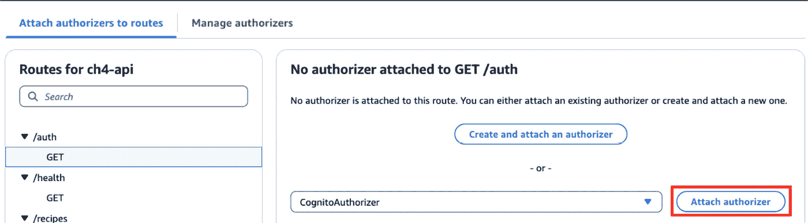
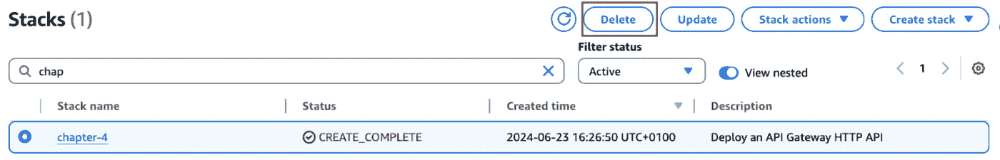

# <st c="0">4</st>

# <st c="2">构建无服务器食谱分享应用</st>

<st c="50">在上一章中，你开发了一个食谱分享应用，前端托管在 Amazon S3 和 CloudFront 上，后端使用 Amazon EC2 实例和 DynamoDB。</st> <st c="226">对于最终用户来说，只能看到功能和整体用户体验，但由提供者定义如何架构应用以及使用哪些技术</st> <st c="409">来实现。</st>

<st c="416">传统的应用部署涉及服务器的配置和管理、环境配置、资源扩展、安全补丁应用以及系统健康监控。</st> <st c="598">这种方法需要大量的操作开销，并且常常导致资源利用效率低下，因为资源是为</st> <st c="739">高峰需求而配置的。</st>

<st c="751">相比之下，无服务器计算抽象化了底层基础设施，使开发者能够专注于编写代码。</st> <st c="885">使用无服务器计算时，资源的配置、扩展和服务器管理由云提供商处理，从而实现更灵活、事件驱动的方法，并且采用</st> <st c="1038">按需付费模式。</st>

<st c="1058">事件驱动架构由通过事件相互作用的独立服务组成。</st> <st c="1161">例如，当用户请求创建一个新食谱时，该请求就变成了一个事件。</st> <st c="1250">这个事件会触发必要的代码来处理与创建食谱相关的业务逻辑。</st> <st c="1355">通过使用这种方法，系统无需提前准备和分配所有资源。</st> <st c="1464">相反，它会在事件发生时响应，从而使架构更加高效</st> <st c="1549">且具有适应性。</st>

<st c="1563">在本章中，你将通过完全采用</st> <st c="1708">无服务器技术重新架构你的食谱分享应用，来尝试采用无服务器技术。</st>

<st c="1732">总之，本章涵盖了以下主题</st> <st c="1786">按顺序：</st>

+   <st c="1795">你将要构建的内容——一个完全由</st> <st c="1899">无服务器技术支持的最新版本的食谱分享应用</st>

+   <st c="1922">你将如何构建它——使用 Amazon API Gateway 和 Lambda 作为后端，Amazon Cognito</st> <st c="2020">用于身份验证</st>

+   <st c="2038">构建它——通过 CloudFormation 并使用</st> <st c="2090">AWS 控制台</st>

+   <st c="2101">如何改进解决方案——支持食谱的媒体内容，并将身份验证扩展到最终用户，以便提供更</st> <st c="2225">个性化的体验</st>

<st c="2246">在本章结束时，你将获得动手实践经验，通过使用 AWS 无服务器技术（如 Lambda、API Gateway、Cognito、S3 和 DynamoDB）重新架构一个动态 Web 应用。</st> <st c="2443">你还将理解无服务器计算的好处，如可扩展性和成本效益，在现代</st> <st c="2560">应用开发中的应用。</st>

# <st c="2584">技术要求</st>

<st c="2607">要跟随并实现食谱共享应用的无服务器版本，你需要拥有自己的</st> <st c="2738">AWS 帐户。</st>

<st c="2750">此外，本书的 GitHub 代码库中有一个专门的文件夹，你可以在其中找到跟随学习所需的代码片段：</st> [<st c="2884">https://github.com/PacktPublishing/AWS-Cloud-Projects/tree/main/chapter4/code</st>](https://github.com/PacktPublishing/AWS-Cloud-Projects/tree/main/chapter4/code)<st c="2961">。</st>

# <st c="2962">场景</st>

<st c="2971">在成功部署个人网站作为你的简历的一部分后，</st> *<st c="3046">第二章</st>*<st c="3055">，你首次接触了云技术，并开始在这一领域建立信心。</st> <st c="3161">在上一章中，借助你的食谱共享应用，你将一个更复杂的应用演变为有后台处理的应用，后台负责处理食谱操作，如创建、删除和检索，用户基础也增长得超出了预期。</st>

<st c="3395">你的应用现在被认为是最受欢迎的食谱和烹饪应用之一。</st> <st c="3485">你花在扩展和管理基础设施上的时间越来越多，而不是基于有价值的用户反馈来改进应用，更不用说随着应用的受欢迎程度不断</st> <st c="3711">增长，成本方面的影响了。</st>

<st c="3719">上个月，你参加了一场关于无服务器技术的会议，你了解到这些技术非常适合你的需求。</st> <st c="3838">你越是深入探索，越意识到它们可以为你的食谱共享应用提供更高效、可扩展且具有成本效益的解决方案。</st> <st c="3996">使用无服务器架构，你可以专注于编写代码和构建功能，而无需担心配置和管理服务器或基础设施，这正是你所</st> <st c="4185">寻找的。</st>

<st c="4197">经过一些研究后，你决定重新架构你的应用，利用 AWS 无服务器服务，以便受益于自动扩展、按需计费和减少</st> <st c="4366">操作开销。</st>

## <st c="4387">需求</st>

<st c="4400">如同前一章中所做的，你将从收集该项目的需求开始。</st> <st c="4506">这将作为</st> <st c="4524">所有技术选择的基础，因此必须清楚地了解目标</st> <st c="4646">和限制。</st>

<st c="4663">总体来说，你仍然希望服务于两种</st> <st c="4701">不同的用户类型：</st>

+   **<st c="4720">管理员</st>**<st c="4726">：平台所有者，负责创建和</st> <st c="4773">管理食谱</st>

+   **<st c="4789">最终用户或消费者</st>**<st c="4812">：访问共享的食谱并点赞</st> <st c="4862">喜欢的食谱</st>

<st c="4876">考虑到这个项目是前一个项目的升级版，我们将专注于变化并分解</st> <st c="4993">新的需求。</st>

### <st c="5010">业务需求</st>

<st c="5032">凭借你之前的</st> <st c="5051">食谱分享应用，你超出了所有的预期。</st> <st c="5115">到目前为止，当人们想到烹饪并寻找灵感时，他们会直接使用你的应用，且你的市场不局限于美国。</st> <st c="5273">相反，你的用户分布均匀，分别为美国 41%、欧洲 35%、亚洲 20%，其余 4%分布在全球其他地区，去年你达到了 15 万用户。</st>

<st c="5506">由于你的成功，你能够与来自不同领域（广告、外卖和食品生产）的公司签订多个合同，但你的增长计划仍在继续。</st> <st c="5686">在前进的过程中，你已经确定了以下关键目标来</st> <st c="5759">专注：</st>

+   <st c="5768">实现 10%的年</st> <st c="5788">用户增长</st>

+   <st c="5799">提高</st> <st c="5808">你的</st> <st c="5812">成本效益</st>

### <st c="5831">功能需求</st>

<st c="5855">关于功能需求，相比前一章你不期望有重大变化，因此，概括起来，这些是</st> <st c="5962">如下：</st>

+   <st c="5995">两种不同的用户类型（管理员</st> <st c="6026">和用户）</st>

+   <st c="6035">简单</st> <st c="6043">的用户界面</st>

+   <st c="6057">响应能力</st>

<st c="6072">由于你一直在管理基础设施，没能投入太多时间去为应用开发新功能。</st> <st c="6228">然而，根据用户反馈，你希望增加两个</st> <st c="6308">新功能：</st>

+   <st c="6321">身份验证</st> <st c="6337">和授权</st>

+   <st c="6354">能够对食谱进行点赞，并按点赞排序</st> <st c="6397">进行排序</st>

<st c="6402">模拟图是创建应用程序预期行为的可视化表现的好策略，正如你在上一章中看到的那样。</st> <st c="6547">因此，在这一部分，你将进行类似的练习，只关注计划中的新特性，如</st> *<st c="6663">图 4.1</st>*<st c="6674">、</st> *<st c="6676">4.2</st>*<st c="6679">和</st> *<st c="6685">4.3</st>*<st c="6688">所示。对于主页，你将保持相同的布局，如</st> *<st c="6751">第三章</st>*<st c="6760">，</st> *<st c="6762">图 3</st>**<st c="6770">.1</st>*<st c="6772">。</st>

<st c="6773">你不指望不同的个人资料访问你的应用程序，因此相同的划分适用：用户</st> <st c="6875">和管理员。</st>

<st c="6886">注意</st>

<st c="6891">我们不会列出那些保持不变的功能，如访问食谱标题列表，因为这些内容已经在上一章中讨论过，我们希望避免重复。</st> <st c="7071">假设你已经跟上了进度，你应该已经熟悉了初步需求，如果不熟悉，我们建议你回顾一下上一章中的</st> *<st c="7223">需求</st>* <st c="7235">部分。</st>

<st c="7270">让我们探索每个个人资料</st> <st c="7298">以及界面</st> <st c="7346">和行为方面的预期变化：</st>

+   `<st c="7359">/user</st>`<st c="7365">：像一个</st> <st c="7375">特定食谱。</st>


<st c="7557">图 4.1 – UI 模拟用户页面</st>

+   `<st c="7589">/admin</st>`<st c="7596">：通过身份验证机制限制对管理员门户的访问，当用户尝试访问管理员页面时，提供一个简单的表单，如</st> *<st c="7745">图 4</st>**<st c="7753">.2</st>*<st c="7755">所示。</st>


<st c="7840">图 4.2 – UI 模拟图 – 身份验证</st>

### <st c="7879">非功能性需求</st>

<st c="7907">随着你的应用程序的普及，成本和可扩展性成为新的目标。</st> <st c="7927">此外，你希望通过将管理基础设施的时间转向应用程序创新来加速功能的推出。</st> <st c="7998">总结一下，我们需要：</st> 

+   <st c="8125">成本效益</st>

+   <st c="8160">事件驱动架构</st>

+   <st c="8205">低</st> <st c="8210">基础设施管理</st>

### <st c="8235">技术需求</st>

<st c="8258">与上一章相比</st> <st c="8292">并考虑到用户的整体反馈，你希望这次重新架构能够尽可能平滑，不对当前用户的界面和用户体验产生影响。</st> <st c="8485">你希望在编程语言和框架的选择上，尽可能保持之前的技术选型和项目结构。</st> <st c="8608">尽量保持不变。</st>

<st c="8620">作为最新研究的一部分，你希望将新的平台架构仅基于</st> <st c="8716">无服务器技术。</st>

### <st c="8740">数据需求</st>

<st c="8758">这个最新版本是你之前版本的扩展，所有数据需求仍然适用。</st> <st c="8860">你的应用程序的核心是存储和管理食谱，食谱由一系列步骤</st> <st c="8956">和食材组成，但你想实现的一个功能是给食谱添加点赞。</st> <st c="9049">对于你在食谱上执行的操作，你必须进行以下操作：</st>

+   **<st c="9121">列出食谱</st>**<st c="9138">：展示已创建的</st> <st c="9163">食谱列表。</st>

+   **<st c="9179">删除食谱</st>**<st c="9195">：如果管理员不再希望某个特定的食谱出现在他们的目录中，应该允许删除</st> <st c="9307">该项。</st>

+   **<st c="9316">创建食谱</st>**<st c="9332">：创建一个新的食谱以便与</st> <st c="9369">用户分享。</st>

+   **<st c="9379">点赞食谱</st>**<st c="9393">：增加特定食谱的点赞数。</st>

<st c="9446">根据列出的操作，你需要支持的唯一更改是存储每个食谱的点赞数，因此你定义了一个更新版的食谱文档，如下所示：</st> `<st c="9630">recipe_example_2.json</st>` <st c="9651">食谱示例：</st>

```
 {  "ID":"GUID",
   "Title":"recipe title",
   "Ingredients":[…],
   "Steps":[…],
   "Likes":X }
```

## <st c="9750">架构模式</st>

<st c="9772">每个项目都有其独特之处，但</st> <st c="9803">在设计应用时，有一些共性是可以并且应该加以利用的。</st> <st c="9900">AWS 提供了一个专门的无服务器架构和模式门户，叫做</st> **<st c="9976">Serverless Land</st>** <st c="9991">(</st>[<st c="9993">https://serverlessland.com/</st>](https://serverlessland.com/)<st c="10020">)，包含了最新的</st> <st c="10046">无服务器架构的资讯、博客、视频、代码和学习资源，专门面向 AWS。</st> <st c="10127">每当你计划构建无服务器应用时，它总是一个很好的起点。</st>

<st c="10222">与传统的部署策略相比，Serverless 意味着一种不同的范式，深入理解核心服务是关键。</st> <st c="10364">AWS 提供了一个无服务器开发者指南（</st>[<st c="10405">https://docs.aws.amazon.com/serverless/latest/devguide/welcome.html</st>](https://docs.aws.amazon.com/serverless/latest/devguide/welcome.html)<st c="10473">），其中包括核心服务的学习路径，并且也是关于</st> <st c="10553">无服务器相关信息的绝佳资源。</st>

<st c="10584">最后，正如前几章所述，每个 AWS 服务都有专门的页面，包含所有服务相关信息。</st> <st c="10619">例如，对于 AWS Lambda，您可以访问它</st> <st c="10709">在</st> [<st c="10770">https://aws.amazon.com/lambda/</st>](https://aws.amazon.com/lambda/)<st c="10800">。</st>

## <st c="10801">架构</st>

<st c="10814">尽管用户体验和界面应尽可能与之前版本的食谱分享应用程序保持一致，</st> *<st c="10965">第三章</st>*<st c="10974">，但平台架构是需要重点注意变化的地方。</st>

<st c="11055">在本章中，您将采用与设计架构时相同的自上而下的方法。</st> <st c="11150">您将从最高抽象层开始，逐步深入到组件级架构，在这里定义所使用的每个服务，以及它们如何协调工作以构建</st> <st c="11344">您的应用程序。</st>

<st c="11361">查看不同的架构层时，您将遵循与上一章相同的结构，包含三个明确定义的层次，就像在</st> *<st c="11530">第三章</st>*<st c="11539">中展示的那样，</st> *<st c="11541">图 3</st>**<st c="11549">.4</st>*<st c="11551">：</st>

+   **<st c="11553">展示层</st>**<st c="11571">：如何托管和提供</st> <st c="11596">前端</st>

+   **<st c="11609">计算层</st>**<st c="11623">：如何整合和执行</st> <st c="11657">业务逻辑</st>

+   **<st c="11671">数据层</st>**<st c="11682">：存储和检索</st> <st c="11713">您的数据</st>

<st c="11722">展示层和计算层通过 API 作为这两层之间的接口。</st> <st c="11811">该 API 负责暴露端点，执行所有操作以执行并抽象出业务逻辑。</st> <st c="11932">在这种情况下，考虑到需求，主要更新是新增了对食谱点赞的新功能，如</st> *<st c="12085">图 4</st>**<st c="12093">.3</st>*<st c="12095">所示：</st>


<st c="12189">图 4.3 – API 结构</st>

<st c="12215">以下是</st> <st c="12224">具体</st> <st c="12227">说明：</st>

+   `<st c="12238">GET /auth</st>`<st c="12248">: 测试</st> <st c="12256">授权流程</st>

+   `<st c="12274">GET /recipes</st>`<st c="12287">: 获取菜谱列表</st> <st c="12303">的接口</st>

+   `<st c="12313">GET /health</st>`<st c="12325">: 简单健康</st> <st c="12342">检查端点</st>

+   `<st c="12356">DELETE</st> <st c="12364">/recipes/{recipe_id}</st>`<st c="12384">: 删除特定的菜谱，使用</st> <st c="12415">其 ID</st>

+   `<st c="12421">POST /recipes</st>`<st c="12435">: 创建新的</st> <st c="12451">菜谱记录</st>

+   `<st c="12464">PUT /reci</st><st c="12474">pes/like/{recipe_id}</st>`<st c="12495">: 增加菜谱的喜欢数</st>

<st c="12521">除了添加喜欢的端点外，我们还增加了</st> `<st c="12579">/auth</st>` <st c="12584">端点，尽管该端点并未用于应用程序，但它作为理解认证和端点</st> <st c="12726">保护工作流的学习资源。</st>

*<st c="12746">图 4</st>**<st c="12755">.4</st>* <st c="12757">代表了你将实现的架构，基于所有的要求。</st> <st c="12837">前端将使用与上一章相同的方法，利用 S3 和 CloudFront 进行托管和服务。</st> <st c="12953">数据层仍将使用 DynamoDB 来存储菜谱数据。</st> <st c="13014">然而，你将引入 Amazon Cognito 作为认证服务，将菜谱管理活动限制为授权用户。</st> <st c="13148">对于 API，你将使用 Amazon API</st> <st c="13185">Gateway 并将其与 AWS Lambda 函数关联，以实现 API</st> <st c="13257">端点功能。</st>


<st c="13445">图 4.4 – 用于你的新菜谱共享应用程序的 AWS 架构</st>

<st c="13514">接下来将描述每个提到的服务，以及选择这些服务的主要优势和原因。</st>

# <st c="13632">AWS 服务</st>

<st c="13645">从大量可用服务中进行选择可能具有挑战性，理解需求是做出决策的关键。</st> <st c="13788">部分服务已经在前几章中介绍过，为避免重复，我们将仅提及当前用例的优势（如果之前没有提到），并指向相关章节以获取</st> <st c="13994">详细解释。</st>

## <st c="14015">Amazon Simple Storage Service (S3)</st>

<st c="14050">Amazon S3 是一种无服务器技术的例子，你应该已经熟悉它，因为它在</st> <st c="14167">前两章中有详细解释。</st> <st c="14204">如果你想复习，可以参考</st> *<st c="14267">第二章</st>* <st c="14277">和</st> *<st c="14282">第三章</st>*<st c="14283">。</st>

## <st c="14284">Amazon CloudFront</st>

<st c="14302">与 Amazon S3 类似，CloudFront 在本书的前一个项目中</st> <st c="14338">被广泛使用，且在前面的 AWS 服务章节中有详细覆盖，涉及</st> *<st c="14464">第二章</st>* <st c="14474">和</st> *<st c="14479">第三章</st>*<st c="14480">。要复习相关内容，我们建议查阅前面的章节。</st>

## <st c="14555">Amazon DynamoDB</st>

<st c="14571">数据需求一直是选择数据库</st> <st c="14603">技术的主要驱动因素。</st> <st c="14638">在本章中，数据需求没有变化，因此 Amazon DynamoDB 依然是我们的选择。</st> <st c="14751">其主要特性和优势在</st> *<st c="14813">AWS 服务</st>* <st c="14825">章节中已描述，因此，如果你希望详细了解 DynamoDB，我们建议</st> <st c="14948">查看该部分内容。</st>

## <st c="14963">AWS CloudFormation</st>

<st c="14982">如同你在前一章中所做的那样，你将继续使用 AWS CloudFormation（CloudFormation）作为你的</st> **<st c="15088">基础设施即代码</st>** <st c="15110">(</st>**<st c="15112">IaC</st>**<st c="15115">) 工具。</st> <st c="15124">CloudFormation 在</st> <st c="15166">前一章中有详细解释，因此我们建议你查看该章节，以了解该服务及其优势。</st>

## <st c="15289">Amazon Cognito</st>

<st c="15304">Amazon Cognito 是一项完全托管的服务，提供认证、授权和用户管理功能，用于</st> <st c="15416">你的 Web 和移动应用程序。</st> <st c="15450">使用 Amazon Cognito，你可以轻松实现用户注册、登录和账户恢复等功能。</st> <st c="15558">它支持多种认证方式，包括用户池（用于管理应用程序的用户目录）和身份池（用于与社交媒体或企业身份提供者集成）。</st> <st c="15765">Amazon Cognito 与其他 AWS 服务（如 Amazon API Gateway）无缝集成，这些服务也是你无服务器架构的一部分。</st> <st c="15908">这种集成使你能够实现</st> <st c="15949">无服务器认证</st> <st c="15976">和授权机制，以确保只有经过认证的用户才能访问并执行操作，</st> <st c="16096">确保你的应用程序安全。</st>

## <st c="16113">Amazon Lambda</st>

<st c="16127">Amazon Lambda 是一个无服务器</st> <st c="16158">计算服务，允许您在无需配置或管理服务器的情况下运行代码。</st> <st c="16246">使用 Lambda，您可以专注于编写应用程序代码，AWS 会处理</st> <st c="16321">底层计算资源的配置</st><st c="16344">和管理。</st> <st c="16390">Lambda 会根据传入的事件或请求自动扩展代码执行，确保您的应用程序能够处理流量波动，而无需</st> <st c="16558">人工干预。</st>

<st c="16578">Lambda 支持多种编程语言，其中 Python 是符合您技术要求的支持运行时之一。</st> <st c="16725">此外，Lambda 无缝集成了其他 AWS 服务，如 Amazon API Gateway，使您能够创建事件驱动的架构并开发高度可扩展、容错且</st> <st c="16943">具成本效益的应用程序。</st>

## <st c="16962">API Gateway</st>

<st c="16974">Amazon API Gateway 是</st> <st c="16996">一个完全托管的服务，使您能够轻松创建、发布、维护、监控和保护任何规模的 API。</st> <st c="17109">它作为您的无服务器应用程序的入口，处理客户端请求并将其路由到适当的后端服务，如 AWS</st> <st c="17259">Lambda 函数。</st>

<st c="17276">Amazon API Gateway 支持</st> <st c="17304">两种类型的 RESTful API：</st> **<st c="17332">REST API</st>** <st c="17341">和</st> **<st c="17346">HTTP API</st>**<st c="17355">。选择两者之一</st> <st c="17381">必须基于所支持的功能。</st> <st c="17423">REST API 提供更多高级功能，如 API 版本控制、请求/响应数据</st> <st c="17509">转换、缓存和全面的访问控制机制，而如果您需要一个不包含</st> <st c="17694">高级功能的简化且具有成本效益的选项，可以考虑使用 HTTP。</st>

<st c="17712">如果您想了解如何在 Amazon API Gateway 中选择 HTTP API 和 REST API，您可以</st> <st c="17805">访问</st> [<st c="17812">https://docs.aws.amazon.com/apigateway/latest/developerguide/http-api-vs-rest.html</st>](https://docs.aws.amazon.com/apigateway/latest/developerguide/http-api-vs-rest.html)<st c="17894">。</st>

# <st c="17895">编码解决方案</st>

<st c="17915">现在是将所有</st> <st c="17947">概念付诸实践的时刻，通过编码实现到目前为止描述的解决方案，审视并改进您在前面章节中已使用的服务，并熟悉本架构中引入的新服务。</st>

## <st c="18160">克隆项目</st>

<st c="18180">正如你在</st> <st c="18210">上一章中所做的那样，第一步是从与本书相关联的 Git 仓库中将项目复制到本地。</st> <st c="18326">如果你已经跟随上一章，你应该已经在本地计算机上有该 Git 仓库的副本。</st> <st c="18457">如果不是这种情况，你可以直接从与本书相关的 Git 仓库中克隆，或者将其下载为</st> <st c="18585">ZIP 文件。</st>

<st c="18594">导航到</st> `<st c="18611">chapter4/code</st>` <st c="18624">文件夹。</st> <st c="18633">在其中，你会找到两个子文件夹，如</st> *<st c="18683">图 4</st>**<st c="18691">.5</st>*<st c="18693">所示：</st>

+   `<st c="18695">前端</st>`<st c="18703">: 包含你的前端代码。</st>

+   `<st c="18742">平台</st>`<st c="18751">: 包含一个 CloudFormation 模板，用于部署你应用程序的主要基础设施。</st>


<st c="18875">图 4.5 –</st> <st c="18888">第四章</st> <st c="18897">文件夹结构</st>

## <st c="18914">解决方案部署</st>

<st c="18934">现在，时机已到，</st> <st c="18953">通过名为</st> `<st c="19040">ch4-application-template.yaml</st>`<st c="19069">的 CloudFormation 模板部署你的所有应用基础设施，该模板位于</st> `<st c="19095">/platform</st>` <st c="19104">子文件夹中，位于你的</st> `<st c="19123">chapter4/code</st>` <st c="19136">文件夹内（</st>`<st c="19145">chapter4/code/platform/ch4-application-template.yaml</st>`<st c="19198">）。</st>

<st c="19201">在</st> *<st c="19205">表 4.1</st>*<st c="19214">中，你可以看到由你的 CloudFormation 模板创建的所有资源，但可以随意探索代码本身，并尝试将其与</st> *<st c="19379">图 4</st>**<st c="19387">.4</st>*<st c="19389">中的架构进行匹配。</st>

| **<st c="19390">模板</st>** | **<st c="19399">ch4-application-template.yaml</st>** |
| --- | --- |
| <st c="19429">前端</st> | <st c="19438">CloudFront</st> <st c="19450">和 S3</st> |
| <st c="19456">后端</st> |

+   <st c="19464">1 个 HTTP API，拥有</st> <st c="19481">6 个端点</st>

+   <st c="19492">6 个 lambda 函数，每个对应一个</st> <st c="19521">端点</st>

+   <st c="19534">1 Cognito</st> <st c="19545">用户池</st>

|

| <st c="19554">数据存储</st> | <st c="19565">DynamoDB</st> |
| --- | --- |

<st c="19574">表 4.1 – CloudFormation 模板详情</st>

从控制台进入 CloudFormation 服务（[`console.aws.amazon.com/cloudformation/`](https://console.aws.amazon.com/cloudformation/)），并选择你希望应用程序所在的区域。你可以在控制台窗口右上角的下拉菜单中选择 AWS 区域，如*图 4.6*所示。


图 4.6 – 控制台访问 CloudFormation

为什么选择区域很重要？

在 AWS 中，服务可以根据其可用性和数据复制机制分为区域服务或全球服务。区域服务部署并在特定 AWS 区域内运行，而全球服务旨在提供跨**多个区域**的一致体验。

CloudFormation 是一个**区域服务**的例子。因此，选择正确的区域至关重要，因为这确保了你的资源部署在离目标用户更近的位置，从而提供更低的延迟和最佳的**用户体验**。

要继续创建堆栈，请按以下步骤操作：

1.  点击**创建堆栈**。

1.  在**前提条件 – 准备模板**部分，选择**选择一个现有模板**。

1.  在**指定模板**部分，选择**上传模板文件**。

1.  点击**选择文件**。

1.  从`chapter4/code/platform`文件夹中选择模板。

1.  点击**下一步**。你的**创建堆栈**窗口应显示为*图 4.7*。


图 4.7 – 一个 CloudFormation 创建堆栈表单

下一步是配置你在 CloudFormation 堆栈中的参数。在*表 4.2*中，你可以找到每个参数的详细说明。

| **参数** | **描述** |
| --- | --- |
| `<APIName>` | 你希望与之关联的 API 名称 |
| `<st c="22269">UserEmail</st>` | <st c="22279">你关联到用户的电子邮件必须有效，因为你会收到一个临时密码，并且稍后需要验证该</st> <st c="22398">电子邮件</st> |
| `<st c="22409">UserPoolName</st>` | <st c="22422">你将为 Cognito</st> <st c="22462">用户池</st>命名 |
| `<st c="22471">Username</st>` | <st c="22480">稍后，这将是你用来登录</st> <st c="22535">应用程序</st>的用户名 |

<st c="22551">表 4.2 – CloudFormation 模板参数</st>

<st c="22599">参数窗口的示例如</st> *<st c="22649">图 4</st>**<st c="22657">.8</st>*<st c="22659">所示。</st>


<st c="23186">图 4.8 – CloudFormation 堆栈参数</st>

<st c="23233">你可以继续操作</st> <st c="23250">直到最后一页。</st> <st c="23271">确认创建 IAM 角色，这些角色将用于提供对 Lambda 函数的访问权限，以执行对 DynamoDB 表的操作，即删除一个食谱，然后</st> <st c="23454">点击</st> **<st c="23460">提交</st>**<st c="23466">。</st>


<st c="23920">图 4.9 – CloudFormation 堆栈提交</st>

<st c="23964">等待堆栈状态更改为</st> **<st c="24004">CREATE_COMPLETE</st>**<st c="24019">，如</st> *<st c="24036">图 4</st>**<st c="24044">.10</st>*<st c="24047">所示。这意味着所有资源已成功配置，你现在可以</st> <st c="24115">继续操作。</st>


<st c="24192">图 4.10 – CloudFormation 堆栈创建状态</st>

<st c="24241">在我们的案例中，堆栈部署大约花费了</st> <st c="24263">五分钟，但请考虑到这</st> <st c="24350">可能会有所不同。</st>

<st c="24359">重要说明</st>

<st c="24374">如果你已经跟随前一章节（</st>*<st c="24435">第三章</st>*<st c="24445">）并且忘记清理该章节中创建的所有资源，你可能会在尝试部署本章节中的 CloudFormation 模板时遇到问题。</st> <st c="24610">部署可能会失败，因为在 AWS 中，DynamoDB 表名在单个账户的同一区域内必须是唯一的。</st> <st c="24723">由于本章节是前一章节的扩展，我们使用了相同的表名来存储</st> <st c="24819">食谱。</st>

<st c="24831">要解决此问题，请确保按照</st> *<st c="24978">清理</st>* <st c="24986">章节中的描述，正确清理并删除前一章节中的所有资源，然后再继续进行本章节。</st>

## <st c="25028">前端配置和部署</st>

在所有 AWS 服务配置完成后，接下来是配置前端并部署文件。

转到`…/frontend/src/configs`文件夹，您将找到两个文件：

+   `<st c="25250">aws-exports.ts</st>`：此文件用于配置您与 Cognito 用户池的数据认证。

+   `<st c="25356">configs.tsx</st>`：此文件用于配置您的应用程序，即要使用的 API URL。

让我们详细看看它们。

### `aws-exports.ts`

该文件由四个配置变量组成：

+   `<st c="25546">AWS_PROJECT_REGION</st>`：您部署解决方案的区域

+   `<st c="25605">AWS_COGNITO_REGION</st>`：您的 Cognito 用户池区域

+   `<st c="25656">AWS_USER_POOLS_ID</st>`：您的用户池 ID

+   `<st c="25701">AWS_USER_POOLS_WEB_CLIENT_ID</st>`：您的 Cognito 用户池应用程序的客户端 ID

### configs.tsx：

该配置文件包含七个配置项：

+   `<st c="25851">CONFIG_MAX_INGREDIENTS</st>`：一个配方中的最大食材数

+   `<st c="25904">CONFIG_MAX_STEPS</st>`：一个配方中的最大步骤数

+   `<st c="25945">CONFIG_MAX_RECIPES</st>`：支持的最大配方数

+   `<st c="25988">CONFIG_USER_PAGE_TITLE</st>`：用户页面的标题

+   `<st c="26033">CONFIG_ADMIN_PAGE_TITLE</st>`：管理员页面的标题

+   `<st c="26080">CONFIG_appConfig</st>`：包含页面标题和图标的对象（图标在`/frontend/public/`中）

+   `<st c="26161">CONFIG_API_URL</st>`：API 端点

所有作为配置文件一部分的必填值都可以在您刚刚部署的 CloudFormation 模板的**<st c="26278">Outputs</st>**标签中找到。

要访问它，请按以下步骤操作：

1.  转到 CloudFormation 控制台：[`console.aws.amazon.com/cloudformation/`](https://console.aws.amazon.com/cloudformation/)。

1.  点击您的堆栈。

1.  在右侧菜单中，选择**输出**标签，如*图 4.11*所示。


图 4.11 – CloudFormation 输出标签

*表 4.3* 映射了 Stack 输出与配置文件的参数（`aws-exports.ts`和`config.tsx`）。

| **文件** | **参数** | **Cloudformation** **Stack 输出** |
| --- | --- | --- |
| `aws-exports.ts` | `aws_project_region` | `CognitoRegion` |
| `aws_cognito_region` | `CognitoRegion` |
| `aws_user_pools_id` | `UserPoolId` |
| `aws_user_pools_web_client_id` | `UserPoolClientId` |
| `configs.tsx` | `CONFIG_API_URL` | `HttpApiEndpoint` |

表 4.3 – CloudFormation 输出与`aws-exports.ts`参数之间的映射

将每个文件中的值粘贴到相应的位置，最终，您的参数`aws-exports.ts`文件应该如下所示，*见图 4.12*。


图 4.12 – 配置文件示例（aws-exports.ts）

并且`config.tsx`文件应该如下所示，*见图 4.13*。


图 4.13 – 配置文件示例（config.tsx）

4. 保存文件。

一旦更新了配置文件，您可以启动`build`过程，将代码转化为可供浏览器使用的网页打包文件。在我们的示例中，我们使用`npm`作为包管理器，所以您需要安装依赖并启动`build`过程：

```
 $ npm install && npm run build
```

请注意，之前的命令应在`frontend`文件夹的根目录下运行。为了测试您是否处于根目录，可以使用以下命令：

```
 $ pwd
…/chapter4/code/frontend
```

<st c="29105">结果是一个文件夹，里面包含需要复制到我们 S3 存储桶中的文件。</st> <st c="29183">文件夹名称可能不同，但通常是</st> `<st c="29225">build/</st>` <st c="29231">或</st> `<st c="29235">dist/</st>`<st c="29240">。它创建在前端根目录下，如你在</st> *<st c="29296">图 4</st>**<st c="29304">.14</st>*<st c="29307">中所见。</st>


<st c="29478">图 4.14 – 前端文件夹结构</st>

<st c="29517">现在，最后一步是将构建文件夹复制到 S3，使用以下指令：</st>

1.  <st c="29604">定位到</st> <st c="29616">S3 存储桶。</st>

1.  <st c="29626">首先，你需要找到之前使用 CloudFormation 模板创建的 S3 存储桶。</st> <st c="29725">存储桶的名称应以</st> `<st c="29766">frontend-chapter-4-</st>`<st c="29785">开头，后面跟着一串随机字符（例如，</st> `<st c="29836">frontend-chapter-4-XXXXX</st>`<st c="29860">）。</st> <st c="29864">点击其名称以</st> <st c="29885">打开它。</st>

1.  <st c="29893">从</st> `<st c="29913">d</st><st c="29914">ist</st>` <st c="29917">文件夹中添加文件。</st>

1.  <st c="29925">在 S3 存储桶内，点击</st> **<st c="29961">上传</st>** <st c="29967">按钮。</st> <st c="29976">这将允许你从本地机器上传文件到</st> <st c="30028">S3 存储桶。</st>

1.  <st c="30053">将必要的内容添加到</st> <st c="30083">存储桶中。</st>

1.  <st c="30094">首先，点击</st> `<st c="30132">dist</st>` <st c="30136">文件夹，在本地机器上选择该文件夹中的所有文件并确认。</st> <st c="30220">接下来，在 S3 控制台中，点击</st> `<st c="30277">dist</st>` <st c="30281">文件夹，选择</st> `<st c="30323">assets</st>` <st c="30329">文件夹，</st> <st c="30338">并确认。</st>

1.  <st c="30350">你也可以选择将内容直接拖拽到 S3 窗口中，但无论你使用哪种方法，你的 S3</st> **<st c="30457">上传</st>** <st c="30463">窗口应该像</st> *<st c="30488">图 4</st>**<st c="30496">.15</st>*<st c="30499">所示。</st>


<st c="30803">图 4.15 – 前端文件上传到 S3</st>

<st c="30846">文件名由</st> `<st c="30884">构建</st>` <st c="30889">过程自动生成，因此你的文件名可能与前面图示中的不同。</st> <st c="30975">确保你有以下文件：</st> <st c="31003">以下文件：</st>

+   `<st c="31019">i</st>``<st c="31021">ndex.html</st>`

+   `<st c="31030">i</st>``<st c="31032">ndex-XXXXXX.css</st>`

+   `<st c="31047">i</st>``<st c="31049">ndex-XXXXXX.js</st>`

+   <st c="31063">你可能已在应用程序中包含的静态文件，例如，图片</st>

1.  <st c="31139">之后，在页面底部，点击</st> <st c="31173">按钮</st> **<st c="31176">上传</st>**<st c="31182">。</st>

<st c="31183">你刚刚完成了所有的</st> <st c="31214">部署和配置工作，现在是时候</st> <st c="31286">测试它了。</st>

## <st c="31294">测试并探索你的应用</st>

<st c="31328">这一部分主要讲解测试和探索你的应用，我们将其分为两部分：后端和前端。</st> <st c="31456">与前一章不同，今天我们从</st> <st c="31475">前端开始！</st>

<st c="31515">我们已经将 CloudFront URL 作为输出提供在 CloudFormation Stack 中，因此你可以通过</st> `<st c="31625">CloudFrontDistributionUrl</st>` <st c="31650">输出获取它。</st>

<st c="31658">你也可以直接从</st> <st c="31700">控制台获取值：</st>

1.  <st c="31712">进入 CloudFront 控制台</st> <st c="31742">访问</st> [<st c="31745">https://console.aws.amazon.com/cloudfront/</st>](https://console.aws.amazon.com/cloudfront/)<st c="31787">。</st>

1.  <st c="31788">点击左侧菜单中的</st> **<st c="31798">分发</st>** <st c="31811">。</st>

1.  <st c="31829">选择你创建的分发。</st>

1.  <st c="31866">复制</st> **<st c="31876">分发域名</st>** <st c="31900">值，来自</st> **<st c="31916">详细信息</st>** <st c="31923">部分，如</st> *<st c="31948">图 4</st>**<st c="31956">.16</st>*<st c="31959">所示。</st>


<st c="32200">图 4.16 – CloudFront 分发控制台</st>

1.  <st c="32245">如果你将 URL 复制并粘贴到浏览器中，你应该能够访问你新创建的应用，正如在</st> *<st c="32370">图 4</st>**<st c="32378">.17</st>*<st c="32381">中所示。</st>


<st c="32421">图 4.17 – 应用前端示例</st>

<st c="32463">你的新应用由</st> <st c="32500">三个元素组成：</st>

+   **<st c="32515">状态（未认证）</st>**<st c="32542">：该组件将通过更改描述和颜色帮助你了解是否已认证。</st> <st c="32601">此外，如果你已认证，它将</st> <st c="32693">高亮显示并展示你当前的</st> <st c="32726">访问令牌。</st>

+   **<st c="32739">用户</st>**<st c="32745">：导航到</st> **<st c="32764">用户</st>** <st c="32769">页面。</st>

+   **<st c="32775">管理员</st>**<st c="32781">：导航到</st> **<st c="32800">管理员</st>** <st c="32805">页面。</st>

<st c="32811">让我们来</st> <st c="32824">看一下。</st>

### <st c="32831">管理员页面</st>

<st c="32842">这个新解决方案的一个改进是身份验证。</st> <st c="32911">要进行测试，导航到管理员页面，您应该会被提示进行身份验证，如</st> *<st c="33013">图 4</st>**<st c="33021">.18</st>*<st c="33024">所示。</st>


<st c="33110">图 4.18 – 身份验证表单</st>

<st c="33143">通过部署应用程序 CloudFormation 模板，您应已收到类似</st> *<st c="33253">图 4</st>**<st c="33261">.19</st>* <st c="33264">的邮件，发送到您在堆栈部署过程中定义为参数的用户电子邮件，包含用于您所定义的用户名的临时密码。</st>


<st c="33709">图 4.19 – 临时密码邮件示例</st>

<st c="33755">使用这些值作为您的用户名和密码并继续。</st> <st c="33817">您应该会被提示定义新密码，请继续并点击</st> **<st c="33898">更改密码</st>**<st c="33913">。</st>

<st c="33914">您已经定义了新密码，最后一步是验证您的电子邮件以便进行账户恢复。</st>


<st c="34094">图 4.20 – 邮件验证表单</st>

<st c="34131">选择您的电子邮件地址并点击</st> **<st c="34171">验证</st>**<st c="34177">。通过此操作，您应收到一封新邮件，包含</st> <st c="34238">您的验证代码，如</st> *<st c="34275">图 4</st>**<st c="34283">.21</st>*<st c="34286">所示。</st>


<st c="34489">图 4.21 – 账户验证邮件示例</st>

<st c="34537">粘贴验证代码并继续。</st> <st c="34579">现在您已完成身份验证设置，您的界面应如下所示：</st> *<st c="34664">图 4</st>**<st c="34672">.22</st>*<st c="34675">。</st>


<st c="34929">图 4.22 – 身份验证后的管理员页面</st>

<st c="34974">如您所见，身份验证状态组件已经改变颜色，现在显示您已</st> <st c="35076">以您的用户名认证。</st> <st c="35108">在我们的例子中，用户名是</st> `<st c="35138">admin</st>`<st c="35143">。此外，如果您将鼠标悬停在访问令牌上，您将能够访问当前的</st> <st c="35226">访问令牌。</st>


<st c="35882">图 4.23 – 带有访问令牌的工具提示</st>

<st c="35921">您可以自由浏览应用程序，点击左箭头返回管理员页面，您将看到在未退出登录前您保持认证状态。</st> <st c="36093">返回管理员控制台；首先创建一些食谱，来体验</st> <st c="36166">用户体验。</st>

<st c="36182">请注意，根据要求，我们为应用程序添加了一个新功能，使用户可以点赞我们的食谱。</st> <st c="36317">此外，我们还可以根据点赞数对食谱进行排序，例如删除点赞数少的食谱，如</st> *<st c="36429">图 4.24</st>*<st c="36437">所示。</st>


<st c="36756">图 4.24 – 管理员用户体验，显示每个食谱的点赞数</st>

### <st c="36823">用户页面</st>

<st c="36833">该</st> **<st c="36838">用户</st>** <st c="36842">页面与</st> <st c="36863">上一章类似，但我们为</st> <st c="36928">食谱添加了点赞的新功能。</st>

<st c="36940">导航到</st> **<st c="36957">用户</st>** <st c="36961">页面，选择一个食谱，点击</st> **<st c="36995">喜欢</st>**<st c="36999">。这应该会增加特定食谱的点赞数，如</st> *<st c="37078">图 4.25</st>*<st c="37086">所示</st>。


<st c="37300">图 4.25 – 作为普通用户向食谱添加点赞的示例</st>

<st c="37368">如果您想体验点赞功能，只需刷新页面，点赞按钮将重新出现</st> <st c="37486">。</st> <st c="37493">最后，尝试更改排序，以根据</st> <st c="37571">用户反馈选择最受欢迎的食谱。</st>

### <st c="37585">测试和探索后端</st>

<st c="37619">您的后端现在是通过 HTTP API 网关构建的，每个端点都有一个 Lambda</st> <st c="37646">函数，负责执行相关的操作。</st> <st c="37761">例如，接下来我们来看看</st> `<st c="37792">delete</st>` <st c="37798">功能：</st>

```
 import json
import boto3
dynamodb = boto3.resource('dynamodb')
table = dynamodb.Table('recipes')
def lambda_handler(event, context):
     try:
          recipe_id = event['pathParameters']['recipe_id']
          response = table.delete_item(
                      Key={'id': recipe_id}
                      )
          return {
               "statusCode": 200,
               "body": json.dumps({"message": "Recipe deleted successfully"})}
      except Exception as e:
             return {
        "statusCode": 500,
        "body": json.dumps({"message": f"Error deleting recipe: {e}"})
```

<st c="38255">`delete`</st> <st c="38260">功能负责根据</st> <st c="38278">ID 在 DynamoDB 中删除特定食谱。</st>

<st c="38350">因此，每次</st> <st c="38364">执行时，API 网关将触发关联的 Lambda 函数。</st> <st c="38437">在这种情况下，函数将从路径中获取</st> `<st c="38474">recipe_id</st>` <st c="38483">并调用</st> `<st c="38511">delete_item</st>` <st c="38522">API，用于</st> <st c="38531">您的表。</st>

<st c="38542">继续探索其他示例：</st>

1.  <st c="38583">进入 API 网关控制台</st> <st c="38620">并访问</st> [<st c="38623">https://console.aws.amazon.com/apigateway</st>](https://console.aws.amazon.com/apigateway)<st c="38664">。</st>

1.  <st c="38665">选择您在 CloudFormation</st> <st c="38735">堆栈参数中指定的 API 名称。</st>

1.  <st c="38752">选择 API 选项：</st> `<st c="38776">[您的</st>` `<st c="38782">API 名称]</st>`<st c="38791">。</st>

1.  <st c="38792">点击左侧菜单中的</st> **<st c="38802">集成</st>** <st c="38814">选项。</st>

1.  <st c="38834">选择您想要</st> <st c="38861">探索的路由。</st>

1.  <st c="38872">点击</st> **<st c="38904">Lambda 函数</st>** <st c="38919">字段中的蓝色箭头。</st> <st c="38927">这将把您重定向到您特定的</st> <st c="38986">Lambda 函数的页面。</st>


<st c="39415">图 4.26 – 通过 API 网关控制台访问 Lambda 函数</st>

<st c="39479">您的应用程序已</st> <st c="39500">通过 Cognito 身份验证进行保护，因为您无法在未经过身份验证的情况下访问管理员页面。</st> <st c="39574">但是，如果用户试图直接访问</st> <st c="39666">API，会发生什么呢？</st>

<st c="39674">这就是 API 授权发挥作用的地方。</st> <st c="39731">对于这个应用程序，我们已经为要求部分中定义的特定路由配置了身份验证，您可以在 API</st> <st c="39891">网关控制台中进行探索：</st>

1.  <st c="39907">进入 API 网关</st> <st c="39936">控制台</st> [<st c="39944">https://console.aws.amazon.com/apigateway</st>](https://console.aws.amazon.com/apigateway)<st c="39985">。</st>

1.  <st c="39986">选择您在 CloudFormation</st> <st c="40056">堆栈参数中指定的 API 名称。</st>

1.  <st c="40073">选择 API 选项：</st> `<st c="40097">[您的</st>` `<st c="40103">API 名称]</st>`<st c="40112">。</st>

1.  <st c="40113">点击左侧菜单中的</st> **<st c="40123">授权</st>** <st c="40136">选项。</st>

<st c="40156">您应该能看到类似于</st> *<st c="40198">图 4</st>**<st c="40206">.27</st>*<st c="40209">的内容，其中包含两个端点，并且与一个身份验证器相关联。</st> <st c="40264">在这种情况下，使用的是</st> **<st c="40285">JWT Auth</st>**<st c="40293">。</st>


<st c="41004">图 4.27 – API 网关授权面板</st>

<st c="41048">在右侧的授权器</st> <st c="41068">详细信息中，您可以看到它期望在</st> **<st c="41149">Authorization</st>** <st c="41162">头中接收授权令牌，并会根据您的 Cognito 用户池配置进行验证。</st>

<st c="41235">为了理解行为，我们</st> <st c="41266">创建了</st> `<st c="41284">/auth</st>` <st c="41289">路由，该路由当前不需要授权，意味着它是公开可访问的。</st> <st c="41385">我们将做一些更改，以了解如何将其设置为受保护路由并需要一个</st> <st c="41473">授权令牌。</st>

<st c="41493">在这个例子中，我们使用了</st> `<st c="41520">curl</st>`<st c="41524">，但你也可以使用其他工具进行相同的测试，例如 Postman：</st>

1.  <st c="41599">执行</st> `<st c="41610">Get</st>` <st c="41613">请求到</st> `<st c="41629">API_URL/auth</st>` <st c="41641">端点。</st> <st c="41652">你应该在</st> `<st c="41687">config.tsx</st>` <st c="41697">文件中看到这个值，但如果你没有它，可以从</st> **<st c="41766">输出</st>** <st c="41773">选项卡中获取该值，方法是进入</st> <st c="41787">CloudFormation 控制台：</st>

    ```
    <st c="41810">$ c</st><st c="41814">url -i YOUR_API_URL/auth</st>
    <st c="41839">HTTP/2 200</st>
    <st c="41850">…</st>
    <st c="42036">GET</st> method under the <st c="42057">/</st><st c="42058">auth</st> route.
    ```

1.  <st c="42069">在</st> **<st c="42077">选择一个授权器以查看其详细信息</st>** <st c="42117">下拉框中，</st> <st c="42128">选择</st> **<st c="42135">CognitoAuthorizer</st>**<st c="42152">。</st>

1.  <st c="42153">点击</st> **<st c="42163">附加授权器</st>**<st c="42180">。</st>



<st c="42404">图 4.28 – 授权器附加过程</st>

<st c="42447">你的</st> **<st c="42453">授权</st>** <st c="42466">菜单现在应该包含</st> **<st c="42495">JWT Auth</st>** <st c="42503">标记，出现在</st> **<st c="42525">/auth</st>** <st c="42530">|</st> **<st c="42533">GET</st>** <st c="42536">选项前，如</st> *<st c="42557">图 4</st>**<st c="42565">.29</st>*<st c="42568">所示。</st>


<st c="42616">图 4.29 – 路由授权器页面</st>

1.  <st c="42654">再次执行请求并确认我们收到</st> `<st c="42708">Unauthorized</st>` <st c="42720">响应：</st>

    ```
    <st c="42730">$ curl -i YOUR_API_URL/auth</st>
    <st c="42758">HTTP/2 401</st>
    <st c="42769">…</st>
    <st c="42819">/auth</st> to require the authorization token and you are trying to perform the request without providing it, you are getting an <st c="42943">Unauthorized</st> response.
    ```

1.  <st c="42965">更改请求以包括授权令牌。</st> <st c="43021">要获取授权令牌，按照以下步骤操作：</st>

    1.  <st c="43072">在</st> <st c="43099">浏览器中打开你的应用程序。</st>

    1.  <st c="43112">导航到</st> **<st c="43129">管理员</st>** <st c="43134">控制台。</st>

    1.  <st c="43143">如果你没有进行身份验证，请继续进行</st> <st c="43191">登录过程。</st>

    1.  <st c="43207">在</st> **<st c="43215">管理员</st>** <st c="43220">页面上，将鼠标悬停在访问令牌上，并复制完整的访问令牌，如</st> *<st c="43299">图 4</st>**<st c="43307">.23</st>*<st c="43310">所示。</st>

<st c="43311">现在尝试执行相同的请求，但传递</st> `<st c="43361">Authorization</st>` <st c="43374">头部，并使用你从管理员控制台复制的值：</st>

```
 $ curl -H "Authorization: YOUR_JWT_TOKEN" -i YOUR_API_URL/auth
HTTP/2 200
…
{"message": "You've passed the authentication token"}
```

<st c="43562">通过此更改，你可以再次向该</st> <st c="43622">路由发起请求。</st>

<st c="43634">尝试更改你长 JWT 中的一个字符，你会注意到，即使只是修改一个字符，令牌也会变得无效，与该令牌相关的任何请求都会</st> <st c="43836">被拒绝，因为签名验证将失败，防止</st> <st c="43903">未经授权的访问。</st>

## <st c="43923">清理</st>

<st c="43932">使用无服务器技术的主要优势之一</st> <st c="43960">是它们通过设计提供按需付费的模型，这意味着你只为实际使用的部分付费。</st> <st c="44086">然而，从长远来看，如果你让应用继续运行，可能会产生费用，因此建议在不再使用时清理你的基础设施。</st> <st c="44261">由于我们通过基础设施即代码（IaC）进行部署，清理过程非常简单，包含以下</st> <st c="44360">两个步骤：</st>

1.  <st c="44370">清空</st> <st c="44377">桶：</st>

    1.  <st c="44388">进入你的</st> <st c="44418">AWS 账户中的 S3 控制台。</st>

    1.  <st c="44430">选择你的前端 S3 桶（桶的名称应以</st> `<st c="44504">frontend-chapter-4-</st>`<st c="44523">开头，后跟一个</st> <st c="44539">随机字符串）。</st>

    1.  <st c="44554">点击</st> **<st c="44564">清空</st>**<st c="44569">；这将</st> <st c="44582">删除桶内的所有内容。</st>


<st c="44972">图 4.30 – 清空 S3 桶的过程</st>

1.  <st c="45018">删除</st> <st c="45030">CloudFormation 堆栈：</st>

    1.  <st c="45051">进入你的</st> <st c="45093">AWS 账户中的 CloudFormation 控制台。</st>

    1.  <st c="45105">选择你创建的堆栈。</st>

    1.  <st c="45135">点击</st> <st c="45142">**删除**</st><st c="45151">。</st>

<st c="45152">注意：如果你在列表中看不到你的 CloudFormation 堆栈，尝试在右上角更改区域，选择你部署应用的区域。</st> <st c="45325">之后，你应该继续进行删除过程，该过程在</st> *<st c="45411">图 4</st>**<st c="45419">.31</st>*<st c="45422">中描述并表示。</st>



<st c="45698">图 4.31 – CloudFormation 堆栈删除</st>

<st c="45741">通过之前的</st> <st c="45759">步骤，你成功移除了为</st> <st c="45826">食谱分享应用创建的所有资源。</st>

<st c="45853">使用无服务器技术重新构建您的食谱分享应用程序是一次令人兴奋的实验。</st> <st c="45964">然而，像任何项目一样，总是有改进的机会。</st> <st c="46042">下一部分将探讨潜在的改进和未来的考虑事项，以进一步优化您的无服务器</st> <st c="46155">食谱分享应用程序。</st>

# <st c="46182">未来工作</st>

<st c="46194">恭喜，您已经使用完全无服务器技术构建了您的新版本食谱分享应用程序，并且现在可以根据使用情况进行扩展，而无需担心应用程序的基础设施。</st> <st c="46413">这个新的食谱分享应用程序已经包含了上一章中提到的一些未来工作，例如身份验证或使用安全协议，但始终有</st> <st c="46620">改进的空间。</st>

## <st c="46636">通过媒体内容丰富您的应用程序</st>

<st c="46679">到目前为止，您的应用程序展示了</st> <st c="46712">一组原料和步骤，这是跟随食谱所需的最基本内容。</st> <st c="46793">然而，人们首先寻找的是预期结果的照片，而您的应用程序仍然缺少这一功能。</st> <st c="46915">作为未来工作，您可以考虑为食谱添加照片和视频，以改善用户体验并丰富</st> <st c="47037">食谱内容。</st>

## <st c="47052">用户资料</st>

<st c="47065">在您当前的身份验证机制下，只有授权用户才能管理食谱，但对于最终用户，您几乎无法了解他们的偏好和资料。</st> <st c="47244">点赞功能让</st> <st c="47267">您了解食谱的受欢迎程度，但这并不意味着它适合每个人的口味。</st> <st c="47364">例如，某些用户可能有饮食限制，如果您能够提供更为定制化的体验，这可能会增加您的应用程序的受欢迎度。</st> <st c="47529">作为未来的项目，您可以考虑让用户创建自己的个人资料，填写他们的偏好和饮食限制，并根据</st> <st c="47697">他们的喜好筛选食谱。</st>

<st c="47715">在上一章中，已经列出了许多可能的改进。</st> <st c="47793">其中大多数仍然适用于您当前版本的应用程序，例如，内容缓存或定义监控和日志平台，因此我们仅专注于为当前的</st> <st c="48003">未来工作列表</st> <st c="48012">新增的两个功能。</st>

*<st c="48024">图 4</st>**<st c="48033">.32</st>** <st c="48036">展示了基于我们强调的两个建议改进，您的架构可能的样子。</st>


<st c="48353">图 4.32 – 最终架构</st>

<st c="48385">请注意，数据层添加了一个亚马逊 S3 存储桶，负责存储与每个食谱相关的所有媒体内容。</st> <st c="48529">作为学习练习，思考一下如何存储食谱照片的路径，并尝试</st> <st c="48625">实现它们。</st>

<st c="48640">作为提示，您可以</st> <st c="48662">按照当前用于成分和步骤的相同逻辑，将每个媒体文件的路径存储在</st> <st c="48792">食谱文档中的数组中……</st>

# <st c="48808">总结</st>

<st c="48816">在本章中，您投入了重新架构之前的应用程序，现在更加健壮且功能丰富。</st> <st c="48936">此外，您仅专注于无服务器技术，例如 Amazon API Gateway 用于我们的 API，Amazon Cognito 用于身份验证层，Amazon Lambda 用于计算，应该清楚这些技术在可伸缩性、成本效率和运营工作方面的优势。</st> <st c="49235">对于像 Amazon S3 和 Amazon CloudFront 这样的前端以及 Amazon DynamoDB 作为数据层这样未更改的组件，您能够实践和审查它们，因此您应该更加熟练</st> <st c="49434">使用它们。</st>

<st c="49444">在下一章中，您将探索使用 AWS 技术开发</st> <st c="49537">图像分析器。</st>
