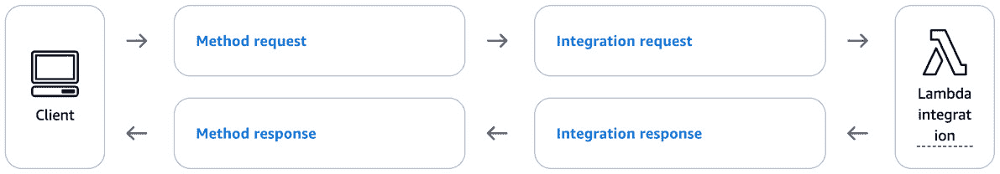

# 第六章：<st c="0">5</st>

# <st c="2">实现一个图像分析器以检测照片的友好度</st>

<st c="61">本章聚焦于</st> <st c="77">**机器学习**</st> <st c="104">（**ML**）</st> <st c="120">能够为你的应用带来的价值。</st> <st c="159">你将构建另一个无服务器应用，但这次，你将利用 AWS 原生的 ML 服务，而不是复杂的</st> <st c="298">编程逻辑。</st>

<st c="316">你将使用 Python 构建你的应用，并使用 Terraform 构建架构。</st>

<st c="387">本章涵盖以下主要内容：</st> <st c="450">按顺序：</st>

+   <st c="459">你将构建的内容 – 一个照片</st> <st c="498">质量分析器</st>

+   <st c="514">你将如何构建它 – 使用无服务器</st> <st c="564">AWS 服务</st>

+   <st c="576">构建它 – 使用 Terraform</st> <st c="607">和 Python</st>

+   <st c="617">如何改进应用程序 – 使用机器学习、先进的安全功能和自定义</st> <st c="700">域名</st>

<st c="712">在本章结束时，你将拥有一个自己的应用，使用机器学习识别照片是否足够专业，适合作为个人资料照片。</st> <st c="866">这是更高级机器学习应用的介绍，你将在</st> *<st c="944">第七章</st>*<st c="953">中看到。</st>

# <st c="954">技术要求</st>

<st c="977">为了根据本章的指引实现你自己的照片分析器，你需要一个</st> <st c="1080">AWS 账户。</st>

<st c="1092">本章在本书的 GitHub 仓库中有一个专用文件夹，你可以在其中找到跟随本章所需的代码片段：</st> [<st c="1232">https://github.com/PacktPublishing/AWS-Cloud-Projects/tree/main/chapter5/code</st>](https://github.com/PacktPublishing/AWS-Cloud-Projects/tree/main/chapter5/code)<st c="1309">。</st>

# <st c="1310">场景</st>

<st c="1319">你为一家</st> <st c="1335">营销公司工作。</st> <st c="1354">你的公司接收客户的信息和照片，整理它们，并为客户创建社交媒体个人资料</st> <st c="1459">。</st>

<st c="1468">然而，你的客户抱怨他们没有获得足够的点击量。</st> <st c="1539">经过研究，数据科学团队将点击量不足归因于</st> <st c="1607">不专业的照片。</st>

<st c="1637">你的任务是创建一个系统，在照片上传到</st> <st c="1755">社交媒体之前，识别它是否足够专业。</st>

## <st c="1768">要求</st>

<st c="1781">你想构建一个可以</st> <st c="1814">评估照片是否专业的应用。</st> <st c="1861">但是，什么是“专业”的标准呢？</st> <st c="1911">你决定，专业的照片要求主体微笑并且眼睛睁开。</st> <st c="2004">眼睛睁开。</st>

<st c="2014">你如何在照片中识别这些特征？</st> <st c="2070">编写能够识别照片中特定特征的逻辑并非易事，尤其是照片可能有多种文件格式。</st> <st c="2219">一个机器学习（ML）模型最有可能取得</st> <st c="2261">良好的结果。</st>

<st c="2274">由于贵公司所受的安全合规标准，你的解决方案不应存储</st> <st c="2379">个人信息。</st>

<st c="2400">此应用程序与之前在章节中构建的其他应用程序不同，它不需要用户界面。</st> <st c="2504">但它需要与现有的</st> <st c="2584">营销公司应用程序集成。</st>

<st c="2602">所有这些需求可以转化为功能性、非功能性、数据和</st> <st c="2690">技术需求。</st>

### <st c="2713">功能需求</st>

<st c="2737">功能性</st> <st c="2748">需求定义了解决方案必须提供的具体功能、特性和能力，在这种情况下，具体如下：</st> <st c="2883">以下内容：</st>

+   <st c="2897">能够识别照片是否足够好，适合用作</st> <st c="2951">头像</st>

+   <st c="2966">可与</st> <st c="2985">其他应用程序交互</st>

+   <st c="3003">支持</st> <st c="3011">多种照片格式：</st> `<st c="3040">.</st>``<st c="3041">png</st>`<st c="3045">,</st> `<st c="3047">.jpeg</st>`

### <st c="3052">非功能性需求</st>

<st c="3080">非功能性</st> <st c="3095">需求定义了解决方案必须提供的定性属性，在这种情况下，具体如下：</st> <st c="3200">以下内容：</st>

+   <st c="3214">高可用性</st>

+   <st c="3231">低成本</st>

+   <st c="3240">可扩展性 – 每秒最多支持 20 个请求</st> <st c="3270">每秒</st>

### <st c="3280">数据需求</st>

<st c="3298">数据需求</st> <st c="3316">定义数据源、处理、治理和合规性需求，在这种情况下，具体如下：</st> <st c="3408">以下内容</st><st c="3421">：</st>

+   <st c="3423">不得存储任何</st> <st c="3442">个人数据</st>

### <st c="3455">技术需求</st>

<st c="3478">技术需求</st> <st c="3502">定义了解决方案必须使用或集成的具体技术、编程语言、框架和工具，在这种情况下，具体如下：</st> <st c="3648">以下内容：</st>

+   <st c="3662">必须与多个其他</st> <st c="3698">Python 应用程序集成</st>

+   <st c="3717">必须使用 Terraform 来提供</st> <st c="3757">新的基础设施</st>

+   <st c="3772">分类算法必须</st> <st c="3807">使用机器学习（ML）</st>

## <st c="3813">架构模式</st>

<st c="3835">从 AWS 开始</st> <st c="3856">架构中心，你可以搜索</st> `<st c="3896">图像识别</st>` <st c="3913">或者</st> `<st c="3917">图像分类</st>`<st c="3937">。不幸的是，结果中并未输出任何参考架构。</st> <st c="4009">但是，一份指导性文档</st> <st c="4050">名为</st> *<st c="4057">AWS 上的图像分类解决方案</st>* <st c="4094">脱颖而出（</st>[<st c="4107">https://docs.aws.amazon.com/prescriptive-guidance/latest/image-classification/introduction.html</st>](https://docs.aws.amazon.com/prescriptive-guidance/latest/image-classification/introduction.html)<st c="4203">）。</st>

<st c="4206">虽然这份文档的重点是识别图像中的对象，但它也适用于你的用例。</st> <st c="4311">对于图像分析，AWS 建议你采用以下四种方法之一：</st>

+   <st c="4384">使用预训练的托管解决方案，例如，</st> <st c="4434">Amazon Rekognition</st>

+   <st c="4452">调整托管解决方案，例如，Amazon Rekognition</st> <st c="4515">自定义标签</st>

+   <st c="4528">使用无代码解决方案训练模型，例如，Amazon</st> <st c="4589">SageMaker Canvas</st>

+   <st c="4605">手动</st> <st c="4614">在你自己的模型上训练</st>

<st c="4640">针对每种选择，它们详细说明了灵活性、投入和成本等方面的优缺点。</st> <st c="4743">你可以与</st> <st c="4771">你的需求进行对比。</st>

# <st c="4789">架构</st>

<st c="4802">一个可能的不可知的</st> <st c="4823">架构，应用你在前几章学到的内容，看起来像</st> *<st c="4901">图 5</st>**<st c="4909">.1</st>*<st c="4911">。不同的应用程序连接到前端组件，处理连接终止，SSL 证书等，并协调和负载平衡后端连接，提交的照片被解析</st> <st c="5129">和分析。</st>


<st c="5233">图 5.1 – 照片分类架构</st>

<st c="5279">使用 AWS 服务的图表看起来像</st> *<st c="5331">图 5</st>**<st c="5339">.2</st>*<st c="5341">：一个三组件图表，包括 API 网关，</st> <st c="5389">Lambda 和 Rekognition。</st> <st c="5414">不同类型的应用程序将通过 HTTPS 连接到 API 网关，调用 Lambda 函数，后者查询 Rekognition 进行图像分析，并相应地解析</st> <st c="5575">响应。</st>


<st c="5729">图 5.2 – AWS 上的照片分类架构</st>

<st c="5782">在接下来的部分，你将找到关于为什么 Rekognition 是这个用例更好工具的详细解释。</st> <st c="5842">现在，</st> <st c="5904">相信我们。</st>

<st c="5922">在此架构中，你将前端和后端合并到 API Gateway</st> <st c="6002">和 Lambda 中。</st>

<st c="6013">你可能会问自己：“为什么我不能让我的消费应用程序直接与 Rekognition 交互？”你不能这样做的原因有：</st>

+   <st c="6168">它要求所有消费应用程序都必须访问</st> <st c="6226">AWS 凭证</st>

+   <st c="6241">它不允许解析和自定义</st> <st c="6293">响应</st>

+   <st c="6305">它不允许</st> <st c="6324">自定义身份验证/授权</st>

<st c="6359">如图所示，你的</st> <st c="6375">消费应用程序可以是任何类型，并且可以位于任何地方；它们可以是 EC2 上的虚拟机、其他云提供商上的容器，或者仅仅是</st> <st c="6515">你的工作站。</st>

# <st c="6532">AWS 服务</st>

<st c="6545">此架构使用了三项服务，但你以前已经使用过其中的两项。</st> <st c="6623">在这一部分，你将理解它们如何满足此项目的要求。</st>

## <st c="6706">Amazon Rekognition</st>

<st c="6725">对于这个用例，你</st> <st c="6749">不想创建编程逻辑来识别照片特征，因此你选择使用 ML 实现相同的功能。</st>

<st c="6875">如 AWS 的指导文档中所述，你可以从头开始创建自己的模型。</st> <st c="6967">但是，它与使用预训练的</st> <st c="7016">托管服务相比如何？</st>

<st c="7032">首先，在比较这两者之前，你需要找出一个可以处理此任务的服务。</st> <st c="7123">AWS 提供了大量的 AI 和</st> <st c="7154">ML 服务：</st>

+   **<st c="7167">Amazon Rekognition</st>**<st c="7186">：一种</st> <st c="7191">计算机视觉服务，旨在分析图像和视频，应用于各种用例，如面部分析、物体检测以及</st> <st c="7331">文本识别。</st>

+   **<st c="7348">Amazon Transcribe</st>**<st c="7366">：一种</st> **<st c="7372">自动语音识别</st>** <st c="7400">（</st>**<st c="7402">ASR</st>**<st c="7405">）服务，可以将音频</st> <st c="7436">文件</st> <st c="7442">转换为</st> <st c="7444">文本。</st>

+   **<st c="7450">Amazon Translate</st>**<st c="7467">：一种</st> <st c="7472">神经机器翻译服务，可以在</st> <st c="7539">多种语言之间进行翻译。</st>

+   **<st c="7558">Amazon Comprehend</st>**<st c="7576">：一种</st> **<st c="7581">自然语言处理</st>** <st c="7608">（</st>**<st c="7610">NLP</st>**<st c="7613">）服务，可以从非结构化</st> <st c="7668">文本数据中提取见解和关系。</st>

+   **<st c="7696">Amazon Kendra</st>**<st c="7710">：一个智能搜索服务，可用于索引和搜索多媒体内容，包括图像</st> <st c="7824">和视频。</st>

+   **<st c="7835">Amazon Lex</st>**<st c="7846">：一个用于构建对话界面和聊天机器人的服务，采用自然语言理解和自动</st> <st c="7963">语音识别。</st>

+   **<st c="7982">Amazon Polly</st>**<st c="7995">：一个</st> <st c="8000">文本转语音服务，可以将文本转换为</st> <st c="8050">逼真的语音。</st>

<st c="8066">Amazon Rekognition 看起来非常适合。</st> <st c="8112">其主要功能如下：</st>

+   **<st c="8149">面部分析</st>**<st c="8165">：</st>

    +   <st c="8167">检测并分析图像</st> <st c="8173">和视频中的面部。</st> <st c="8202">。</st>

    +   <st c="8213">识别面部特征，如性别、年龄范围、情绪和</st> <st c="8283">面部毛发。</st>

    +   <st c="8295">通过与用户提供的数据集中的面部进行比较，识别和识别面部</st> <st c="8375">。</st>

    +   <st c="8384">基于淫秽或</st> <st c="8448">挑逗内容，检测图像或视频中的不安全内容。</st>

+   **<st c="8467">物体和</st>** **<st c="8479">场景检测</st>**<st c="8494">：</st>

    +   <st c="8496">检测并标记</st> <st c="8513">图像和视频中的物体、人物、文本、场景和活动。</st>

    +   <st c="8580">以</st> <st c="8616">高精度识别物体和概念。</st>

    +   <st c="8630">为检测到的物体</st> <st c="8678">和场景提供边界框。</st>

+   **<st c="8689">文本识别</st>**<st c="8706">：</st>

    +   <st c="8708">检测并识别</st> <st c="8729">图像</st> <st c="8744">和视频中的文本。</st>

    +   <st c="8755">从不同的表面</st> <st c="8804">和方向提取文本内容。</st>

+   **<st c="8821">内容审查</st>**<st c="8832">：</st>

    +   <st c="8834">检测并过滤掉</st> <st c="8856">图像和视频中的淫秽或挑逗内容。</st> <st c="8897">。</st>

    +   <st c="8908">自动标记不当或</st> <st c="8945">冒犯内容。</st>

<st c="8963">重要提示</st>

<st c="8978">考虑到使用 Amazon Rekognition 或任何面部识别技术时，必须考虑隐私和伦理问题，并遵守相关法律</st> <st c="9172">和规定。</st>

<st c="9188">那么，您应该使用 Rekognition 面部分析功能，还是构建自己的模型呢？</st> <st c="9274">两种方法都是有效的，</st> <st c="9309">主要的比较点如下：</st>

+   **<st c="9347">易用性</st>** **<st c="9353">：</st>**

    +   <st c="9361">Rekognition 是一个完全托管的服务，这意味着你不需要担心设置和维护底层基础设施或训练模型。</st> <st c="9520">它提供了一个 API 来</st> <st c="9542">分析图像。</st>

    +   <st c="9557">训练你自己的机器学习模型需要在数据准备、模型架构选择、训练技术和部署策略方面的专业知识。</st> <st c="9703">它涉及显著的学习曲线和实践操作。</st> <st c="9763">它还需要大量的</st> <st c="9793">数据。</st>

+   **<st c="9801">定制化</st>** **<st c="9816">和控制</st>**<st c="9827">：</st>

    +   <st c="9829">Rekognition 提供了预训练的模型。</st> <st c="9868">虽然它提供了一些定制选项，例如创建面部识别的自定义集合，但定制的程度</st> <st c="10001">是有限的。</st>

    +   <st c="10012">训练你自己的模型允许你对模型架构、训练数据和微调过程拥有完全的控制权。</st> <st c="10144">这使你能够根据特定的应用场景定制模型，并在</st> <st c="10243">专业任务上达到更高的准确性。</st>

+   **<st c="10261">数据隐私</st>** **<st c="10275">和安全</st>**<st c="10287">：</st>

    +   <st c="10289">使用 Rekognition 时，你的数据——在本例中是图像——会被发送到 AWS 进行处理，这可能会引发数据隐私和</st> <st c="10407">安全问题。</st>

    +   <st c="10425">当训练你自己的模型时，你可以完全控制数据，并确保敏感信息永远不会离开你的环境，从而提供更好的数据隐私</st> <st c="10599">和安全性。</st>

+   **<st c="10612">可扩展性</st>** **<st c="10625">和性能</st>**<st c="10640">：</st>

    +   <st c="10642">Rekognition 是一个高度可扩展的服务，能够处理大量数据和</st> <st c="10725">并发请求。</st>

    +   <st c="10745">大规模训练和部署你自己的模型可能具有挑战性，因为它需要配置和管理计算资源、优化性能并处理</st> <st c="10910">与基础设施相关的任务。</st>

+   **<st c="10939">成本和</st>** **<st c="10949">资源管理</st>**<st c="10968">：</st>

    +   <st c="10970">Rekognition 遵循按需付费定价模式，你为 API 请求付费。</st> <st c="11053">对于较小的工作负载或</st> <st c="11101">间歇性使用来说，这种方式具有成本效益。</st>

    +   <st c="11120">训练你自己的模型需要对硬件资源进行前期投资，并且需要持续的成本来管理和维护</st> <st c="11250">基础设施。</st>

<st c="11269">总之，Rekognition 提供了一种便捷且可扩展的解决方案，适用于常见的计算机视觉任务，但其定制选项有限。</st> <st c="11412">训练你自己的机器学习模型提供了更多的灵活性和控制，但需要显著的专业知识、数据</st> <st c="11517">和资源。</st>

<st c="11531">在这种情况下，Rekognition 是最佳选择。</st> <st c="11573">你没有成千上万张带有你想要识别特征的标记图像，也没有数据科学知识或时间来构建端到端的</st> <st c="11731">机器学习框架。</st>

<st c="11744">根据你的要求，Rekognition 是一个高度可用且可扩展的服务，支持每秒最多 100 次请求。</st> <st c="11876">它支持</st> `<st c="11897">.jpeg</st>` <st c="11902">和</st> `<st c="11907">.png</st>` <st c="11911">图像格式，并且不会存储你提交的图像。</st> <st c="11968">它也具有低成本优势；在 N.</st> <st c="12009">弗吉尼亚地区，分析一张图像的费用为零点一美分，0.001$。</st> <st c="12082">由于采用按需付费模式，你只有在分析图像时才会产生费用；空闲时没有</st> <st c="12176">费用。</st>

## <st c="12184">Amazon API Gateway 和 AWS Lambda</st>

<st c="12218">在本章的</st> *<st c="12226">架构</st>* <st c="12238">部分，你了解了为什么直接与 Rekognition 交互并不是理想选择。</st> <st c="12333">然而，你会问自己，“我应该使用什么间接层？”</st> <st c="12391">我该如何选择？”</st>

<st c="12398">你可以直接使用</st> <st c="12413">Lambda。</st>

<st c="12429">Lambda</st> <st c="12436">允许你解析请求和 Rekognition 响应。</st> <st c="12493">通过使用 Lambda 函数 URL，你将</st> <st c="12530">能够通过 HTTPS 从其他应用访问你的函数（参见</st> [<st c="12603">https://docs.aws.amazon.com/lambda/latest/dg/lambda-urls.html</st>](https://docs.aws.amazon.com/lambda/latest/dg/lambda-urls.html)<st c="12664">）。</st> <st c="12668">然而，Lambda 函数 URL 仅支持 IAM 身份验证或无身份验证，而且你的一项要求是避免 AWS 凭证</st> <st c="12813">的广泛传播。</st>

<st c="12831">或者，也许，你可以仅使用</st> <st c="12862">API Gateway。</st> <st c="12875">正如你在上一章中学到的，它为你提供了一个独特的域名，你可以通过 HTTP 进行交互，并且拥有众多功能。</st> <st c="13026">然而，它也有一些缺点；尽管你可以进行一些请求和响应映射，但实现编程逻辑较为困难。</st> <st c="13163">Rekognition 不会返回好/坏的照片诊断，而是返回一个图像属性列表，你必须解析这些属性来计算</st> <st c="13288">决策。</st>

<st c="13299">API Gateway-only 方法存在阻塞限制。</st> <st c="13366">API Gateway 并不能直接与所有 AWS 服务集成，尤其是与 Rekognition 不直接集成。</st> <st c="13496">为此，你需要使用一个</st> <st c="13524">Lambda 集成。</st>

<st c="13543">对于这个项目，你的间接层应该是两者的结合</st> <st c="13609">。</st>

<st c="13617">重要提示</st>

<st c="13632">Lambda 函数 URL 适用于需要一个公共端点且不要求高级 API 网关功能的用例，例如请求验证、流量控制、自定义授权器、自定义域名，</st> <st c="13872">和缓存。</st>

<st c="13884">它们是调用 Lambda 函数进行测试的一个很好的方式。</st> <st c="13938">在测试过程中使用它们。</st>

<st c="13953">您可以将它们用于本章的用例，然而，为了模拟一个真实的项目，</st> <st c="14036">您不会这样做。</st>

<st c="14046">API 网关与 Lambda</st> <st c="14079">将允许您执行以下操作：</st> <st c="14101">以下操作：</st>

+   **<st c="14115">通过认证和授权请求控制对服务的访问</st>**<st c="14190">：您可以配置 API 密钥、IAM 角色和其他自定义</st> <st c="14249">认证机制。</st>

+   **<st c="14275">简化 API 版本管理和生命周期管理</st>**<st c="14325">：您可以创建并部署多个版本的 Rekognition 集成 API，并无缝管理版本之间的过渡。</st>

+   **<st c="14463">实现内置请求限流和速率限制功能</st>**<st c="14532">：这有助于保护您的后端服务，例如 Rekognition，免受过多请求的压垮，这可能导致服务中断和</st> <st c="14691">更高的成本。</st>

<st c="14704">将其与您的需求联系起来，Lambda 和 API 网关允许您使用一个广为接受的协议 HTTPS，从多种类型的应用接收请求，集成 Rekognition 进行图像分析，将响应处理为好/坏照片的诊断，并以按需计费的无服务器方式进行处理，而无需将图像存储在任何底层架构组件中。</st> <st c="15090">您可以通过高可用性和</st> <st c="15140">可扩展的组件完成所有这些工作。</st>

# <st c="15160">编写解决方案代码</st>

<st c="15180">再次恭喜你——你设计了一个满足公司所有需求的架构。</st> <st c="15278">现在，是时候构建它了。</st> <st c="15306">在本章中，我们将使用 AWS N。</st> <st c="15358">弗吉尼亚地区。</st> <st c="15375">您可以将 Terraform 变量更改为您</st> <st c="15421">首选的地区。</st>

## <st c="15438">构建基础设施</st>

<st c="15466">解决方案需求要求使用 Terraform 构建基础设施，因为该公司已经在使用该 IaC 语言。</st>

<st c="15613">在本书的 GitHub 仓库中，在</st> `<st c="15655">chapter5/code</st>` <st c="15668">文件夹里，你会找到以下文件：</st> `<st c="15712">interact.py</st>`<st c="15723">，</st> `<st c="15725">lambda.tf</st>`<st c="15734">，</st> `<st c="15736">apigw.tf</st>`<st c="15744">，</st> `<st c="15746">badphoto.png</st>`<st c="15758">，</st> `<st c="15760">goodphoto.jpeg</st>`<st c="15774">，以及一个</st> <st c="15782">Python 子目录。</st>

<st c="15802">首先专注于两个 Terraform 文件：</st> `<st c="15849">apigw.tf</st>` <st c="15857">和</st> `<st c="15862">lambda.tf</st>`<st c="15871">。回想一下你的架构有三个组件。</st> <st c="15925">你不需要创建自己的 Amazon Rekognition，因为它</st> <st c="15989">是</st> **<st c="15992">软件即服务</st>** <st c="16013">(</st>**<st c="16015">SaaS</st>**<st c="16019">)，因此它没有 Terraform</st> <st c="16073">资源表示。</st>

<st c="16097">重要说明</st>

<st c="16112">虽然许多人使用一个</st> `<st c="16140">main.tf</st>` <st c="16147">文件来描述他们的基础设施，但 Terraform 会考虑目录中所有具有</st> `<st c="16237">.tf</st>` <st c="16240">扩展名的文件。</st> <st c="16269">文件名</st> <st c="16282">并不重要。</st>

<st c="16293">首先浏览一下</st> `<st c="16317">lambda.tf</st>` <st c="16326">文件。</st> <st c="16333">在里面，你</st> <st c="16345">会找到五个资源定义；</st> `<st c="16382">aws_lambda_function</st>` <st c="16401">是用来创建你的 Lambda 函数的资源，</st> <st c="16447">其名称为</st> `<st c="16453">Detection_Lambda_Function</st>`<st c="16478">。</st>

```
 data "aws_iam_policy" "rekognition_policy" {
  arn = <st c="16531">"arn:aws:iam::aws:policy/AmazonRekognitionReadOnlyAccess"</st> }
resource "aws_iam_role_policy_attachment" "codedeploy_service_role_policy_attach" {
   role        = aws_iam_role.lambda_role.name
   policy_arn = "${data.aws_iam_policy.rekognition_policy.arn}"
} <st c="16775">data "archive_file" "zip_the_python_code"</st> {
    type        = "zip"
    source_file  = "${path.module}/python/rekognition.py"
    output_path = "${path.module}/python/rekognition.zip"
} <st c="16941">resource "aws_lambda_function" "terraform_lambda_func" {</st><st c="16997">filename                       = "${path.module}/python/rekognition.zip"</st>
 <st c="17048">function_name                  = "Detection_Lambda_Function"</st> role                           = aws_iam_role.lambda_role.arn
    handler                        = "rekognition.lambda_handler" <st c="17168">runtime                        = "python3.8"</st> depends_on                     = [aws_iam_role_policy_attachment.attach_iam_policy_to_iam_role]
}
```

<st c="17267">在这个相同的 Terraform 文件中，</st> `<st c="17297">lambda.tf</st>`<st c="17306">，你还创建了一个名为</st> `<st c="17342">Detection_Lambda_Function_Role</st>`<st c="17372">的 IAM 角色，它附加了两个 IAM 策略：</st> `<st c="17411">aws_iam_policy_for_terraform_aws_lambda_role</st>` <st c="17455">和</st> `<st c="17460">AmazonRekognitionReadOnlyAccess</st>`<st c="17491">。这是必要的，目的是让你的 Lambda 函数能够访问其他 AWS 服务，在这个案例中是 Rekognition 和 CloudWatch Logs。</st> <st c="17624">注意这些 IAM 策略如何基于最小权限原则，只允许 Lambda 函数对</st> <st c="17749">所需服务进行读取访问。</st>

<st c="17767">因为你的</st><st c="17780">营销公司已经在使用 Python，你也为你的 Lambda 函数选择了 Python。</st> <st c="17873">维护一个或少数几种编程语言有助于提高开发人员的生产力。</st> <st c="17960">你将在下一部分深入研究应用代码，但请注意这个 Terraform 项目是如何处理代码部署的；它使用的是</st>`<st c="18102">.zip</st>`<st c="18106">文件。</st> <st c="18113">这个 Lambda 函数使用 Python 3.8 作为运行时，但等你读到这篇文章时，你可能需要将其升级到更高的版本。</st> <st c="18250">如果是这种情况，只需更改</st>`<st c="18288">runtime</st>`<st c="18288">变量即可。</st>

<st c="18305">在第二个 Terraform 文件中，</st>`<st c="18336">apigw.tf</st>`<st c="18344">，你将找到八个资源。</st> <st c="18377">要使 API 网关工作，它需要多个组件：阶段、资源和方法。</st> <st c="18467">此外，它还需要权限与其他组件交互，在本例中就是你的</st>`<st c="18548">Lambda 函数。</st>

```
<st c="18564">resource "aws_api_gateway_rest_api" "my_api"</st> {
  name = "my-api"
  description = "My API Gateway"
  endpoint_configuration { <st c="18684">types = ["REGIONAL"]</st> }
} <st c="18709">resource "aws_api_gateway_resource" "root"</st> {
  rest_api_id = aws_api_gateway_rest_api.my_api.id
  parent_id = aws_api_gateway_rest_api.my_api.root_resource_id <st c="18864">path_part = "friendly"</st> }
```

前两个<st c="18888">Terraform 资源</st>，`<st c="18923">my-api</st>`和`<st c="18934">root</st>`<st c="18938">，创建了一个名为</st>`<st c="18976">my-api</st>`<st c="18982">的区域 API 网关，以及根资源上的</st>`<st c="18990">/friendly</st>`<st c="18999">资源路径。</st> <st c="19036">它将在</st>`<st c="19063">API_Gateway_URL/friendly</st>`<st c="19087">处可以访问，正如你稍后将看到的。</st>

<st c="19111">在</st>`<st c="19144">apigw.tf</st>`<st c="19152">中的以下四个资源定义了一个</st>`<st c="19162">POST</st>`<st c="19166">方法，用于</st>`<st c="19182">/friendly</st>`<st c="19191">资源路径：</st>

```
 resource "aws_api_gateway_method" "proxy" {
  rest_api_id = aws_api_gateway_rest_api.my_api.id
  resource_id = aws_api_gateway_resource.root.id <st c="19347">http_method = "POST"</st>
 <st c="19367">authorization = "NONE"</st> }
resource "aws_api_gateway_integration" "lambda_integration" {
  rest_api_id = aws_api_gateway_rest_api.my_api.id
  resource_id = aws_api_gateway_resource.root.id
  http_method = aws_api_gateway_method.proxy.http_method <st c="19606">integration_http_method = "POST"</st>
 <st c="19638">type = "AWS"</st>
 <st c="19651">uri = aws_lambda_function.terraform_lambda_func.invoke_arn</st> }
resource "aws_api_gateway_method_response" "proxy" {
  rest_api_id = aws_api_gateway_rest_api.my_api.id
  resource_id = aws_api_gateway_resource.root.id
  http_method = aws_api_gateway_method.proxy.http_method
  status_code = "200"
}
resource "aws_api_gateway_integration_response" "proxy" {
  rest_api_id = aws_api_gateway_rest_api.my_api.id
  resource_id = aws_api_gateway_resource.root.id
  http_method = aws_api_gateway_method.proxy.http_method
  status_code = aws_api_gateway_method_response.proxy.status_code
  depends_on = [
    aws_api_gateway_method.proxy,
    aws_api_gateway_integration.lambda_integration
  ]
}
```

<st c="20307">这段</st><st c="20312">代码创建了四个组件，如</st>*<st c="20355">图 5</st>**<st c="20363">.3</st>*<st c="20365">所示：</st>`<st c="20403">aws_api_gateway_method</st>`<st c="20425">资源，</st>`<st c="20476">aws_api_gateway_integration</st>`<st c="20503">资源，</st>`<st c="20554">aws_api_gateway_integration_response</st>`<st c="20590">资源，以及</st>`<st c="20641">aws_api_gateway_method_response</st>`<st c="20672">资源。</st>

<st c="20682">这里是你可以进行请求和响应处理的地方。</st> <st c="20756">在本例中，你将方法请求定义为无认证的</st>`<st c="20805">POST</st>`<st c="20809">方法，并将集成请求类型设置为 Lambda。</st> <st c="20885">你不会更改 Lambda 的响应，只是将其</st><st c="20940">代理回去。</st>



<st c="21043">图 5.3 – API 网关方法设置</st>

<st c="21083">在</st> `<st c="21098">apigw.tf</st>`<st c="21106"> 文件的末尾，你会找到一个名为</st> `<st c="21139">apigw_lambda</st>`<st c="21151">的资源，它修改了 Lambda 权限，允许 API 网关</st> <st c="21218">调用它。</st>

<st c="21228">在你喜欢的终端中，导航到</st> `<st c="21272">chapter5/code</st>` <st c="21285">文件夹，运行以下 Terraform 命令并</st> <st c="21335">确认。</st> <st c="21344">这将创建本节中提到的所有资源：</st>

```
 $ terraform apply
```

<st c="21423">如果你的</st> `<st c="21432">apply</st>` <st c="21437">命令执行成功，应该输出如下内容：</st> <st c="21493">如下：</st>

```
 aws_iam_policy.iam_policy_for_lambda: Creation complete after 1s [id=arn:aws:iam::381672823963:policy/aws_iam_policy_for_terraform_aws_lambda_role]
aws_api_gateway_rest_api.my_api: Creation complete after 1s [id=2g9sm87cnd]
aws_iam_role.lambda_role: Creation complete after 1s [id=Detection_Lambda_Function_Role]
aws_api_gateway_resource.root: Creation complete after 1s [id=06421l]
aws_iam_role_policy_attachment.codedeploy_service_role_policy_attach: Creation complete after 1s [id=Detection_Lambda_Function_Role-20240401171553538300000001]
aws_iam_role_policy_attachment.attach_iam_policy_to_iam_role: Creation complete after 1s [id=Detection_Lambda_Function_Role-20240401171553543900000002]
aws_api_gateway_method.proxy: Creation complete after 0s [id=agm-2g9sm87cnd-06421l-POST]
aws_api_gateway_method_response.proxy: Creation complete after 0s [id=agmr-2g9sm87cnd-06421l-POST-200]
aws_lambda_function.terraform_lambda_func: Creation complete after 15s [id=Detection_Lambda_Function]
aws_api_gateway_integration.lambda_integration: Creation complete after 0s [id=agi-2g9sm87cnd-06421l-POST]
aws_lambda_permission.apigw_lambda: Creation complete after 0s [id=AllowExecutionFromAPIGateway]
aws_api_gateway_integration_response.proxy: Creation complete after 0s [id=agir-2g9sm87cnd-06421l-POST-200]
aws_api_gateway_deployment.deployment: Creation complete after 1s [id=g5m5qa] <st c="22887">Apply complete!</st> <st c="22903">Resources: 13 added, 0 changed, 0 destroyed.</st> Outputs: <st c="22957">deployment_invoke_url = "https://2g9sm87cnd.execute-api.us-east-1.amazonaws.com/dev"</st>
```

<st c="23041">记下你的</st> <st c="23057">部署 URL。</st> <st c="23073">你稍后会用到它。</st>

<st c="23095">打开你的 AWS 控制台，导航到 API Gateway、Lambda 和 IAM 来验证之前创建的内容。</st> <st c="23189">确认所有资源已创建。</st>

## <st c="23201">理解图像分析代码</st>

<st c="23239">你在上一节部署的 Terraform 基础设施</st> <st c="23268">代码创建了一个包含应用逻辑的 Lambda 函数。</st> <st c="23361">打开位于</st> `<st c="23370">rekognition.py</st>` <st c="23384">文件中的目录，该文件位于</st> `<st c="23413">python</st>` <st c="23419">文件夹内，路径为</st> `<st c="23427">chapter5/code</st>` <st c="23440">文件夹。</st>

<st c="23448">你会找到像上一章一样的模板代码，用于与 Lambda 生态系统集成。</st> <st c="23549">但更有趣的是它与 Rekognition</st> `<st c="23625">DetectFaces</st>` <st c="23636">API 的交互方式（</st><st c="23642">见</st> [<st c="23647">https://docs.aws.amazon.com/rekognition/latest/APIReference/API_DetectFaces.html</st>](https://docs.aws.amazon.com/rekognition/latest/APIReference/API_DetectFaces.html)<st c="23727">）。</st>

<st c="23730">这段代码调用了</st> `<st c="23750">DetectFaces</st>` <st c="23761">API 并解析响应，确保照片中没有多于一个人，且此人正在微笑并且眼睛睁开：</st>

```
 rekognition_response = rekognition.detect_faces(
Image=image, Attributes=['ALL']) <st c="23990">if len(rekognition_response['FaceDetails']) != 1:</st> raise ValueError( <st c="24058">'Please upload a picture with only one face'</st>)
smile = rekognition_response['FaceDetails'][0]['Smile']
eyesOpen = rekognition_response['FaceDetails'][0]['EyesOpen']
result = 'Bad Profile Photo' <st c="24252">if smile['Value'] == True and eyesOpen['Value'] == True:</st>
<st c="24355">DetectFaces</st> API also returns a list of emotions identified in the person’s photo. The script is set up to save the list in a variable named <st c="24495">Emotions</st>:

```

#'HAPPY'|'SAD'|'ANGRY'|'CONFUSED'|'DISGUSTED'|'SURPRISED'|'CALM'|

'UNKNOWN'|'FEAR' <st c="24589">情感 = rekognition_response['FaceDetails'][0]['Emotions']</st>

```

			<st c="24650">Enhance the script to</st> <st c="24673">take the person’s emotions into consideration before making the final verdict of a good or</st> <st c="24764">bad photo.</st>
			<st c="24774">Testing your application</st>
			<st c="24799">Congratulations, you have a working photo</st> <st c="24842">identification application in AWS, which identifies if a photo is professional-looking enough for</st> <st c="24940">social media.</st>
			*<st c="24953">Figure 5</st>**<st c="24962">.4</st>* <st c="24964">shows what you’ve deployed so far.</st> <st c="25000">An API Gateway endpoint with a</st> `<st c="25031">dev</st>` <st c="25034">stage, configured with a</st> `<st c="25060">/friendly</st>` <st c="25069">resource path that supports the</st> `<st c="25102">POST</st>` <st c="25106">method.</st> <st c="25115">This method invokes a Lambda, written in Python, that calls the Rekognition</st> `<st c="25191">DetectFaces</st>` <st c="25202">API and parses</st> <st c="25218">the results.</st>
			

			<st c="25373">Figure 5.4 – Image analyzer API architecture</st>
			<st c="25417">However, you</st> <st c="25430">have not really tested it.</st> <st c="25458">How do you know</st> <st c="25474">it works?</st>
			<st c="25483">This application does not have a user interface like the previous ones.</st> <st c="25556">Nonetheless, there are multiple ways to interact with these types of HTTP applications, for example: using a terminal tool, such as</st> `<st c="25688">curl</st>`<st c="25692">, using an application, such as Postman, or using another application, such as a</st> <st c="25773">Python script.</st>
			<st c="25787">Start with Postman.</st> <st c="25808">Postman is an API platform for building and using APIs.</st> <st c="25864">If you do not have it installed, install it and</st> <st c="25912">open it.</st>
			<st c="25920">Select</st> `<st c="25928">POST</st>` <st c="25932">as the method and paste your previously noted deployment URL, followed by</st> `<st c="26007">/friendly</st>` <st c="26016">at the end of it in the URL field.</st> <st c="26052">Navigate to the body section, select</st> `<st c="26089">raw</st>`<st c="26092">, and paste the</st> <st c="26108">following code:</st>

```

{ "image": "b64"}

```

			<st c="26141">You are missing images to test this application.</st> <st c="26191">Recall that your Lambda function received an image as an input.</st> <st c="26255">You will find two images in the</st> `<st c="26287">chapter5/code</st>` <st c="26300">folder:</st> `<st c="26309">goodphoto.jpeg</st>` <st c="26323">and</st> `<st c="26328">badphoto.png</st>`<st c="26340">.</st>
			<st c="26341">To send images over the wire, the easiest way is to use</st> `<st c="26398">base64</st>` <st c="26404">encoding.</st> <st c="26415">Open your favorite terminal, navigate to where the images are located, and run the</st> `<st c="26498">openssl</st>` <st c="26505">command, replacing the</st> `<st c="26529"><infile></st>` <st c="26537">and</st> `<st c="26542"><outfile></st>` <st c="26551">variables with</st> `<st c="26567">badphoto.png</st>` <st c="26579">and</st> `<st c="26584">badphoto.txt</st>` <st c="26596">respectively.</st> <st c="26611">This command creates a new file named</st> `<st c="26649">badphoto.txt</st>`<st c="26661">. Inside, you will find the</st> `<st c="26689">base64</st>` <st c="26695">representation of</st> <st c="26714">your image:</st>

```

openssl base64 -A -in <infile> -out <outfile>

```

			<st c="26771">Go back to</st> <st c="26783">Postman and replace the body with your generated</st> `<st c="26832">base64</st>` <st c="26838">encoding.</st> <st c="26849">Send the request.</st> <st c="26867">The result should look like</st> *<st c="26895">Figure 5</st>**<st c="26903">.5</st>*<st c="26905">. You receive a</st> `<st c="26921">200 OK</st>` <st c="26927">status code, with a</st> `<st c="26948">Bad Profile Photo</st>` <st c="26965">response in</st> <st c="26978">the body.</st>
			

			<st c="27755">Figure 5.5 – Postman configuration</st>
			<st c="27789">Do it again, this time with the good photo in the same directory, and observe how the response is different.</st> <st c="27899">You can also do it more times with photos of yourself</st> <st c="27953">or friends.</st>
			<st c="27964">However, the initial focus of this project was to be integrated with other applications, many of them Python applications.</st> <st c="28088">Open the</st> `<st c="28097">interact.py</st>` <st c="28108">file located in the</st> `<st c="28129">chapter5/code</st>` <st c="28142">folder.</st>
			<st c="28150">In this file, you</st> <st c="28168">will find a Python application that reads two arguments,</st> `<st c="28226">url</st>` <st c="28229">and</st> `<st c="28234">image</st>`<st c="28239">, from the standard input and sends a</st> `<st c="28277">POST</st>` <st c="28281">request to the received URL, with the image encoded in</st> `<st c="28337">base64</st>` <st c="28343">in</st> <st c="28347">the body:</st>

```

定义 `def analyze_image(url, image):` 分析图片函数：

    使用 `with open(image, 'rb') as image_file:` 打开图片文件：

        image_bytes = image_file.read()

        data = base64.b64encode(image_bytes).decode("utf8") <st c="28510">payload = {"image": data}</st><st c="28535">response = requests.post(url, json=payload)</st> return response.json()

定义主函数 `def main():`

        尝试：

            parser = argparse.ArgumentParser(usage=argparse.SUPPRESS)

            parser.add_argument("url", help="你的 API Gateway 的 URL")

            parser.add_argument("image", help="你想要分析的本地图片。")

            args = parser.parse_args() <st c="28919">chapter5/code</st> 目录，使用以下语法测试此应用。你只需要将<st c="29024">invoke_url</st>替换为你自己的即可。此应用会将图像转换为<st c="29091">base64</st>，因此你无需使用<st c="29136">openssl</st>工具：

```
 $ python3 interact.py <st c="29172">invoke_url</st> goodphoto.jpeg
```

            <st c="29197">这个应用程序</st> <st c="29215">会将响应返回到你的终端窗口。</st> <st c="29261">其他更复杂的应用程序可以直接解析它并基于此做出决策。</st> <st c="29353">例如，当有人尝试上传照片时，可以阻止</st> <st c="29410">上传。</st>

            <st c="29421">清理</st>

            <st c="29433">如果没有请求，这种架构不会产生任何费用。</st> <st c="29504">所有使用的服务按请求收费，没有预配置成本。</st> <st c="29581">然而，完成使用后删除解决方案是一个良好的实践。</st> <st c="29657">在使用结束后，最好将其删除。</st>

            <st c="29666">要删除所有资源，请在</st> `<st c="29729">chapter5/code</st>` <st c="29742">目录中运行以下命令并确认：</st>

```
 $ terraform destroy
```

            <st c="29785">Terraform 会保留其已部署资源的状态文件，并且只会删除它所管理的资源。</st> <st c="29891">如果你有其他手动部署的资源，它们将不会</st> <st c="29973">被删除。</st>

            <st c="29984">未来工作</st>

            <st c="29996">一本书的章节所能涵盖的内容是有限的。</st> <st c="30045">你的项目工作已涵盖了所有需求。</st> <st c="30093">它会判断照片是否足够专业，但你仍然可以</st> <st c="30168">进一步改善它。</st>

            <st c="30179">实现身份验证和授权</st>

            <st c="30225">目前，任何人都可以</st> <st c="30247">发现并调用你的 API</st> <st c="30275">网关，以验证他们的照片是否专业。</st> <st c="30333">恶意行为者可以利用这一点，造成</st> <st c="30398">高额费用。</st>

            <st c="30409">在前一章中，你已经实现了 Cognito 来管理身份验证和授权。</st> <st c="30511">你可以对这个应用做同样的操作，或者如果你的客户端应用也运行在 AWS 上，你可以将你的 REST API 更改为私有 API。</st> <st c="30652">在这种情况下，你的 API 网关将只能在 VPC 内访问，而不再可以通过互联网访问。</st> <st c="30758">你可以在 AWS 文档中</st> <st c="30771">阅读更多相关内容</st> <st c="30810">，地址为</st> [<st c="30813">https://docs.aws.amazon.com/apigateway/latest/developerguide/apigateway-private-apis.html</st>](https://docs.aws.amazon.com/apigateway/latest/developerguide/apigateway-private-apis.html)<st c="30902">。</st>

            <st c="30903">提升你的安全姿态</st>

            <st c="30935">你已经远远超越了</st> <st c="30956">你在</st> *<st c="30988">第二章</st>*<st c="30997">中学到的静态网站。这一章的应用接收用户输入。</st> <st c="31049">这是一个潜在的攻击向量，因为恶意用户可以上传自定义软件以</st> <st c="31137">利用漏洞。</st>

            <st c="31161">一种缓解这一问题的方法是将带有安全策略的 WAF 附加到你的 API 网关，并利用其在</st> *<st c="31305">第二章</st>*<st c="31314">中描述的所有安全功能。</st>

            <st c="31315">要实现此功能，按照</st> <st c="31344">AWS</st> <st c="31348">文档中的步骤操作：</st> [<st c="31363">https://docs.aws.amazon.com/apigateway/latest/developerguide/apigateway-control-access-aws-waf.html</st>](https://docs.aws.amazon.com/apigateway/latest/developerguide/apigateway-control-access-aws-waf.html)<st c="31462">。</st>

            <st c="31463">实现自定义域名</st>

            <st c="31489">你正在通过 AWS 提供的 URL 调用</st> <st c="31506">你的 API。</st> <st c="31550">这个名字并不</st> <st c="31561">适合人类使用。</st>

            <st c="31581">要更改此设置，你需要拥有自己的域名并创建</st> <st c="31652">证书。</st>

            <st c="31666">在</st> *<st c="31670">第三章</st>*<st c="31679">中，你为负载均衡器做了这个配置。</st> <st c="31715">API Gateway 还支持自定义域名</st> <st c="31761">和证书。</st>

            <st c="31778">要实现此功能，按照</st> <st c="31803">AWS</st> <st c="31811">文档中的步骤操作：</st> [<st c="31826">https://docs.aws.amazon.com/apigateway/latest/developerguide/how-to-custom-domains.html</st>](https://docs.aws.amazon.com/apigateway/latest/developerguide/how-to-custom-domains.html)<st c="31913">。</st>

            <st c="31914">改进图像分析算法</st>

            <st c="31953">目前，你的</st> <st c="31970">算法检测照片中是否有单个人，是否该人眼睛睁开，是否在微笑。</st> <st c="32083">如果你实现了情感功能，那么它也会考虑在内，影响</st> <st c="32176">最终的判断结果。</st>

            <st c="32190">然而，考虑一下以下场景：一张全裸并且眼睛睁开、微笑的人物照片。</st> <st c="32299">这是一张看起来专业的照片吗？</st> <st c="32335">你的算法</st> <st c="32350">认为是的。</st>

            <st c="32360">你已经用尽了所有有用的</st> `<st c="32401">DetectFaces</st>` <st c="32412">Rekognition API 响应字段。</st> <st c="32446">然而，你可以使用其他 API 来增强</st> <st c="32489">你的解决方案。</st>

            <st c="32503">例如，</st> `<st c="32517">DetectModerationLabels</st>` <st c="32539">用于检测图像中是否包含不适当或冒犯性内容。</st> <st c="32602">示例包括明显的裸露、暴力、仇恨符号和毒品。</st> <st c="32671">你可以在 AWS</st> <st c="32701">文档中查看所有支持的内容及如何使用它，</st> [<st c="32749">https://docs.aws.amazon.com/rekognition/latest/dg/procedure-moderate-images.html</st>](https://docs.aws.amazon.com/rekognition/latest/dg/procedure-moderate-images.html)<st c="32829">。</st>

            <st c="32830">要实现这一点，你可以根据</st> <st c="32903">你的偏好选择两种不同的方法：</st>

                +   <st c="32919">在你现有的 Lambda 上链式调用 API，并将所有结果汇总为</st> <st c="32998">一个决策。</st>

                +   <st c="33009">创建一个不同的 API 资源，例如，</st> `<st c="33056">/moderate</st>`<st c="33065">，以及一个不同的 Lambda 函数，并从客户端应用程序中链式调用。</st>

            <st c="33155">你的应用程序是同步的。</st> <st c="33189">如果你添加了许多不同的功能来进行图像验证，响应延迟会增加，用户体验将会</st> <st c="33329">受到影响。</st>

            <st c="33343">你可以</st> <st c="33352">改变客户端的期望，让他们提交照片后等待稍后的判定结果。</st> <st c="33453">然后，将你的应用程序转变为一个异步处理应用程序，在其中你可以链式处理多个验证，并在</st> <st c="33600">最后提供决策。</st>

            <st c="33608">托管你自己的 ML 模型</st>

            <st c="33634">如果你</st> <st c="33647">寻找的功能在托管服务中不存在怎么办？</st> <st c="33666">或者，也许它存在，但并未产生你期望的结果。</st> <st c="33719">例如，假设你想要识别照片是否是由一位</st> <st c="33867">专业摄影师拍摄的。</st>

            <st c="33893">在这些情况下，你可以训练并托管你自己的</st> <st c="33942">ML 模型。</st>

            <st c="33952">正如本章前面简要提到的，训练你自己的 ML 模型需要数据工程、模型训练、选择和</st> <st c="34100">部署策略方面的专业知识。</st>

            <st c="34122">如果你已经具备这方面的专业知识，或者如果你想进行练习，可以使用 Amazon SageMaker 创建一个模型，并在新的资源路径中通过 API 网关调用它。</st> <st c="34284">这种集成还</st> <st c="34311">需要一个</st> <st c="34321">Lambda 函数。</st>

            <st c="34337">SageMaker 是一个完全</st> <st c="34358">托管的 AWS 服务，旨在简化和优化整个 ML 工作流，从数据准备到 ML 模型的部署和操作。</st>

            <st c="34507">总结</st>

            <st c="34515">在本章中，你看到了 AI 和 ML 如何帮助你解决传统编程难以解决的问题。</st> <st c="34645">你再次遵循了一种结构化方法来处理项目，从需求开始，检查可重用的资源，最后，进行架构设计。</st>

            <st c="34803">这一次，你使用了 Terraform。</st>

            <st c="34841">你深入使用 Python 应用逻辑来检索和解析 API 响应。</st> <st c="34929">然后，再次，</st> <st c="34942">用于测试。</st>

            <st c="34954">在本章末尾，你有多个可以通过 AWS 文档自行实现的想法，以改进本章项目。</st> <st c="35105">现在，你可以自信地在你的</st> <st c="35163">未来项目中利用 AI/ML。</st>

            <st c="35179">在下一章中，你将继续学习有关 ML 系统，这次应用于动态内容翻译。</st> <st c="35304">但这并不是全部；你还将开始你的 CI/CD 工具之旅。</st>

```

```
