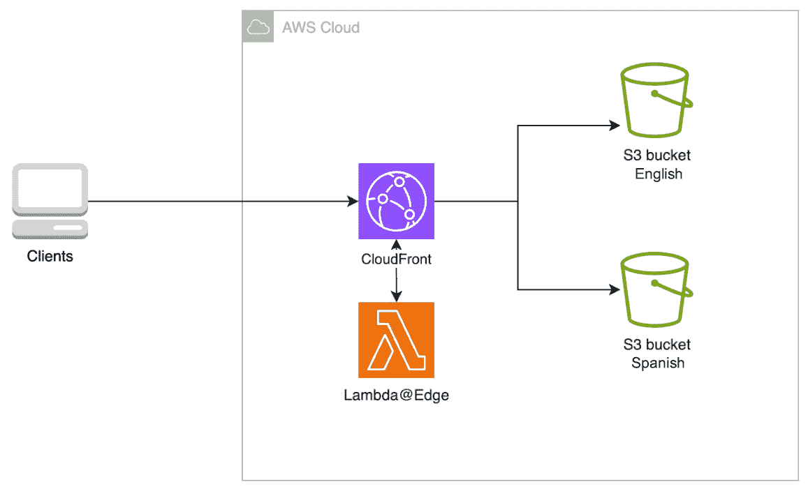
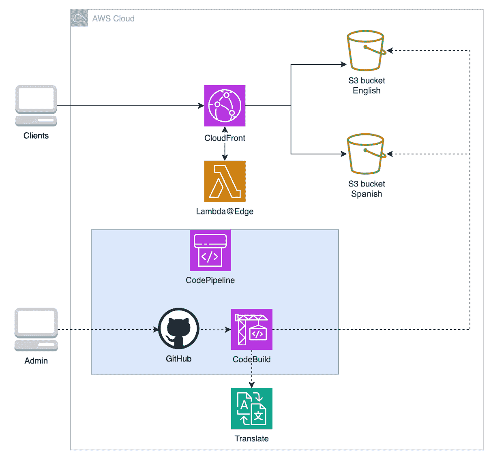
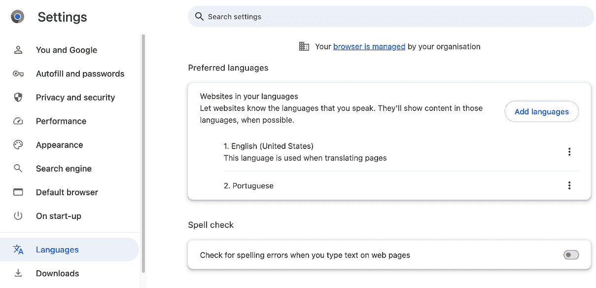
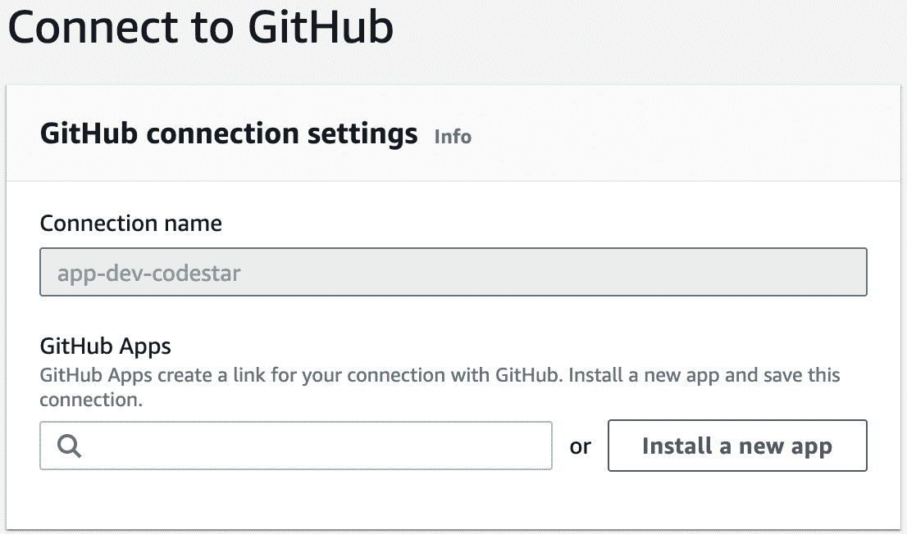

# <st c="0">6</st>

# <st c="2">构建内容翻译流水线</st>

<st c="45">在本章中，你将首次接触到</st> **<st c="109">持续集成与持续交付</st>** <st c="155">(</st>**<st c="157">CI/CD</st>**<st c="162">)。</st> <st c="166">你将构建一个事件网站，能够自动</st> <st c="225">根据用户的首选语言渲染内容，但与之前的方式不同，它将以自动化的方式进行部署。</st>

<st c="334">与上一章类似，你也将使用 AWS 机器学习服务、Python</st> <st c="435">和 Terraform。</st>

<st c="449">总的来说，本章涵盖了以下</st> <st c="496">主要内容：</st>

+   <st c="508">你将要构建的是——一个多语言的 Web 应用程序，使用</st> <st c="578">CICD 流水线</st>

+   <st c="591">你将如何构建它——使用 S3、CloudFront、Lambda@Edge、Translate 和</st> <st c="674">CICD 工具</st>

+   <st c="686">构建它——使用 Terraform</st> <st c="717">和 Python</st>

+   <st c="727">如何改进应用程序——为基础设施采用 CICD，并支持</st> <st c="809">更多语言</st>

<st c="823">在本章结束时，你将获得 AWS CI/CD 服务的实际操作经验，并能够构建自己的</st> <st c="940">应用程序流水线。</st>

# <st c="962">技术要求</st>

<st c="985">本章在本书的 GitHub 仓库中有一个专门的文件夹，你将在那里找到跟随本章进行操作所需的代码片段：</st> [<st c="1125">https://github.com/PacktPublishing/AWS-Cloud-Projects/tree/main/chapter6/code</st>](https://github.com/PacktPublishing/AWS-Cloud-Projects/tree/main/chapter6/code)<st c="1202">。</st>

<st c="1203">为了跟随本章，你需要访问一个</st> <st c="1248">AWS 账户。</st>

# <st c="1260">场景</st>

<st c="1269">你的公司</st> <st c="1283">在北美举办技术活动，如会议和网络研讨会。</st> <st c="1354">你的营销同事会分别在各大社交媒体平台上宣传这些活动。</st> <st c="1453">然而，他们认为如果能有一个单一的页面，用户可以在上面找到所有的</st> <st c="1548">即将举办的活动，那将会更有帮助。</st>

<st c="1564">你的任务是</st> <st c="1582">为该功能创建一个</st> **<st c="1592">概念验证</st>** <st c="1608">的</st> <st c="1637">Web 应用程序。</st>

<st c="1653">在与一位高级领导的谈话中，她提到可访问性是公司的一项原则。</st> <st c="1746">她还提到，虽然贵公司所有的活动都以多种语言进行直播，但这些活动总是只用英语进行宣传。</st> <st c="1882">这反映在它们的</st> <st c="1909">出席人数上。</st>

## <st c="1928">需求</st>

<st c="1941">您需要</st> <st c="1954">构建一个应用程序，显示所有即将举行的公司活动，并将用户带到活动的注册页面。</st> <st c="2071">语言可访问性很重要；应用程序应根据用户的</st> <st c="2164">首选语言动态呈现。</st>

<st c="2183">由于事件不断发生，并且新事件已计划，您需要一种机制来</st> <st c="2265">进行更改。</st>

<st c="2278">公司的云成本创下了历史新高。</st> <st c="2331">这款应用程序应尽可能低成本，同时保持高可用性。</st> <st c="2419">如果人们尝试访问它，而它处于停机状态，那将反映在低活动出席率中。</st> <st c="2508">但是，您不希望进一步增加</st> <st c="2562">云成本。</st>

<st c="2574">您可以将需求格式化为各种类别：功能性、非功能性，</st> <st c="2660">以及技术性。</st>

### <st c="2674">功能性需求</st>

<st c="2698">功能性需求定义了解决方案必须提供的特定功能、功能和能力。</st> <st c="2819">在这种情况下，它们是</st> <st c="2843">如下：</st>

+   <st c="2854">显示公司</st> <st c="2871">未来的活动</st>

+   <st c="2884">能够创建、编辑和</st> <st c="2914">删除事件</st>

+   <st c="2927">能够回滚到</st> <st c="2952">先前的版本</st>

+   <st c="2969">支持图像</st> <st c="2989">和文本</st>

+   <st c="2997">接口必须适应用户的</st> <st c="3030">首选语言</st>

### <st c="3049">非功能性需求</st>

<st c="3077">非功能性需求定义了解决方案必须提供的定性属性。</st> <st c="3172">在这种情况下，它们是</st> <st c="3196">如下：</st>

+   <st c="3207">低成本</st>

+   <st c="3216">北美地区的低延迟</st>

+   <st c="3245">高可用性</st>

+   <st c="3263">易于维护</st>

### <st c="3287">技术需求</st>

<st c="3310">技术需求定义了解决方案必须使用或集成的特定技术、编程语言、框架和工具。</st> <st c="3455">在这种情况下，它们是</st> <st c="3479">如下：</st>

+   <st c="3490">必须集成</st> <st c="3511">Terraform 代码库</st>

+   <st c="3529">必须使用自动化机制进行</st><st c="3540">内容翻译</st>

## <st c="3586">架构模式</st>

<st c="3608">转到</st> <st c="3625">AWS 架构中心并搜索</st> `<st c="3664">内容本地化</st>`<st c="3684">。您将找到</st> *<st c="3700">AWS 上自动语言翻译指南</st>* <st c="3751">和</st> *<st c="3756">AWS 上内容本地化</st>* <st c="3783">参考架构。</st>

<st c="3807">参考架构用于创建多语言字幕的解决方案，而指导则侧重于数据库中翻译的产品信息。</st> <st c="3981">虽然这些并不完全匹配，但你可以看到一个模式：两者都利用了 Amazon Translate 进行实际的</st> <st c="4097">内容翻译。</st>

<st c="4117">在继续之前，搜索</st> `<st c="4147">CICD</st>`<st c="4151">。</st> <st c="4152">这将返回大量结果。</st> <st c="4185">浏览它们。</st> <st c="4199">其中一个特别有趣的</st> <st c="4225">是</st> **<st c="4233">AWS Fargate 上的 .NET 应用程序 CI/CD</st>**<st c="4275">。它使用 CodeCommit 作为代码仓库，使用 CodeBuild 构建构件，最后，使用 ECS 部署它们。</st> <st c="4385">所有这些都作为</st> <st c="4415">CodePipeline 阶段进行编排。</st>

<st c="4435">在撰写本文时，CodeCommit 已被 AWS 弃用。</st>

<st c="4498">没有任何</st> <st c="4511">架构完全符合你的要求。</st> <st c="4566">你必须自己设计</st> <st c="4582">它。</st>

# <st c="4594">架构</st>

<st c="4607">有多种</st> <st c="4626">方法可以将网页呈现为用户首选的语言。</st> <st c="4687">你可以使用特定的框架工具，例如</st> `<st c="4733">i18n</st>` <st c="4737">在 React 中，或者使用基础设施重定向，例如</st> `<st c="4787">Lambda@Edge</st>`<st c="4798">。</st>

<st c="4799">重要提示</st>

<st c="4814">这是一本实用的 AWS 书籍，而不是特定的网页框架书籍，因此这一章实现了基础设施</st> <st c="4925">重定向方法。</st>

<st c="4944">然而，如何识别用户的首选语言呢？</st> <st c="5003">你可以在页面顶部添加一个按钮，让用户选择语言。</st> <st c="5072">这是一个常见的方法。</st> <st c="5099">不过，你可以做得更好。</st> <st c="5127">你可以让它基于</st> <st c="5197">请求属性</st> <st c="5127">自动检测用户的偏好。</st>

<st c="5216">在决定如何实现语言渲染后，回到解决方案需求，你会发现它们与</st> *<st c="5368">第二章</st>* <st c="5378">和</st> *<st c="5383">第三章</st>*<st c="5384">类似。然而，由于这是一个概念验证，你希望最小化市场推出时间，因此你决定重新使用静态架构，并配置自动检测语言属性并发送适当资源的功能。</st> <st c="5623">使用 AWS 服务时，架构如下所示：</st> *<st c="5671">图 6</st>**<st c="5679">.1</st>*<st c="5681">。使用两个或更多 S3 存储桶存储你的应用页面（在此案例中为英语和西班牙语），并使用 CloudFront 配合</st> `<st c="5799">Lambda@Edge</st>` <st c="5810">来检查用户的请求并获取特定的</st> <st c="5857">语言资源。</st>



<st c="5956">图 6.1 – 多语言静态网站架构</st>

<st c="6009">该架构可以工作，但并未满足所有需求，比如易于维护性或自动翻译。</st> <st c="6135">您可以添加、修改和删除事件；然而，在</st> *<st c="6186">第二章</st>*<st c="6195">中，它是一个单一的桶。</st> <st c="6221">在这个新架构中，每次要进行更改时，您必须将其复制到所有桶中。</st> <st c="6327">您还缺少一个自动化机制来创建翻译后的内容。</st> <st c="6401">虽然您可以使用 S3 对象版本控制来支持回滚，但这并不是一个理想的机制，尤其是当您必须保持多个</st> <st c="6558">不同桶中的内容同步时。</st>

<st c="6576">正如您之前</st> <st c="6595">在架构中心看到的，CI/CD 可以帮助构建并推送更改到应用程序。</st> <st c="6693">在这种情况下，您可以将 Web 应用程序文件存储在代码库中，并使用 CI/CD 管道来协调翻译并将内容同步到多个桶中。</st> *<st c="6883">图 6</st>**<st c="6891">.2</st>* <st c="6893">展示了使用 AWS 服务的架构。</st> <st c="6939">应用程序管理员 Admin 将应用程序文件以英文形式存储在 GitHub 仓库中。</st> <st c="7041">对仓库的更改会触发一个 CodePipeline，该管道与 Amazon Translate 互动生成翻译版本的文件，并将其部署到各自的桶中。</st> <st c="7218">GitHub 仓库在 AWS 云中展示，但它实际上位于外部。</st> <st c="7296">这仅仅是为了表示方便</st> <st c="7319">的目的。</st>



<st c="7463">图 6.2 – 带有内容翻译管道架构的多语言网站</st>

<st c="7545">使用这种架构，</st> <st c="7574">管理员只需要在一个地方、使用一种语言进行更改。</st> <st c="7649">虽然示例中显示的是西班牙语，但修改可以传播到任意数量的</st> <st c="7734">配置语言。</st>

<st c="7755">AWS CI/CD 服务是众多选项之一。</st> <st c="7800">您也可以使用第三方 CI/CD 工具来实现该架构。</st> <st c="7870">示例</st> <st c="7879">包括 Jenkins、GitHub Actions 或</st> <st c="7915">GitLab CI/CD。</st>

# <st c="7928">AWS 服务</st>

<st c="7941">该架构</st> <st c="7960">使用了四项新服务。</st> <st c="7984">在本节中，您将了解这些新服务的功能，以及它们为何满足</st> <st c="8065">您的需求。</st>

<st c="8083">其他服务，如 S3 或 CloudFront，已经被预先部署。</st> <st c="8160">请参阅前面的章节，深入了解它们的功能。</st>

## <st c="8242">Lambda@Edge</st>

<st c="8254">你已经在其他章节中学习了 Lambda</st> <st c="8279">，但 Lambda@Edge 不同。</st> <st c="8288">与在 AWS 区域中运行的 Lambda 不同，这些特殊的 Lambda 函数在你将它们与</st> <st c="8452">CloudFront 分发关联时，会在 AWS 边缘位置运行。</st>

<st c="8477">Lambda@Edge 背后的主要理念</st> <st c="8510">是将计算能力更靠近用户，使得操作如修改边缘的请求或响应成为可能，这正是你想要做的。</st> <st c="8661">目标。</st>

<st c="8667">Lambda@Edge 函数与 CloudFront 紧密集成。</st> <st c="8730">这些函数可以响应四种类型的事件触发：</st> <st c="8787">事件：</st>

+   **<st c="8797">查看器请求</st>**<st c="8812">：当查看器请求 CloudFront 分发的内容时，此事件会触发。</st> <st c="8829">此事件中的 Lambda@Edge 函数可以在请求发送到</st> <st c="9023">源服务器之前修改请求头或请求的对象路径。</st>

+   **<st c="9034">源请求</st>**<st c="9049">：当 CloudFront 需要从源服务器请求内容时，此事件会触发。</st> <st c="9135">此事件中的 Lambda@Edge 函数可以在请求发送到</st> <st c="9253">源服务器之前修改请求头或请求的对象路径。</st>

+   **<st c="9264">源响应</st>**<st c="9280">：当 CloudFront 从源服务器接收到响应时，此事件会触发。</st> <st c="9370">你可以在此事件中使用 Lambda@Edge 函数检查并修改源服务器的响应</st> <st c="9462">，然后再缓存并返回给</st> <st c="9499">用户。</st>

+   **<st c="9510">查看器响应</st>**<st c="9526">：此事件会在 CloudFront 返回请求的内容给查看器之前触发。</st> <st c="9616">此事件中的 Lambda@Edge 函数可以修改 CloudFront</st> <st c="9679">的响应头或响应体，然后再发送给</st> <st c="9738">查看器。</st>

<st c="9749">在你的场景中，你可能需要根据用户的请求更改对象路径。</st> <st c="9825">源请求触发器适用。</st> <st c="9844">事件。</st>

<st c="9857">这些特殊的 Lambda 函数用于许多其他用例，例如添加 HTTP 安全头、阻止不需要的请求、重定向到不同的页面、A/B 测试等。</st>

<st c="10035">没有免费层，但</st> <st c="10062">这些 Lambda 函数的费用是每次请求 $0.0000006，外加每 GB-秒 $0.00005001。</st> <st c="10152">你可以在 AWS 网站上查看详细信息</st> <st c="10195">，网址是</st> [<st c="10198">https://aws.amazon.com/lambda/pricing/</st>](https://aws.amazon.com/lambda/pricing/)<st c="10236">。</st>

## <st c="10237">Amazon Translate</st>

<st c="10254">你需要一个</st> <st c="10267">自动化</st> <st c="10277">翻译机制。</st> <st c="10300">Amazon Translate 就是这样一个机制，而且还提供更多功能。</st> <st c="10335">它是一个基于 API 的托管服务，支持 75 种不同语言。</st> <st c="10407">它使用机器学习提供按需的高质量翻译，</st> <st c="10480">即按翻译付费。</st>

<st c="10508">它支持文本和文档翻译。</st> <st c="10557">在你的情况下，你将发送 HTML 文档。</st> <st c="10601">然而，根据网页应用框架，你可能需要发送文本片段。</st> <st c="10692">如果你使用 React 和 i18n，你需要创建</st> `<st c="10750">translation.json</st>` <st c="10766">文件。</st>

<st c="10773">还有其他第三方翻译服务。</st> <st c="10824">然而，Translate 与 AWS 生态系统集成得非常好。</st><st c="10883">它可以使用 IAM 角色和临时凭证来进行访问，而无需用户名和密码，而且你的数据不需要通过</st> <st c="11029">互联网传输。</st>

<st c="11042">如果你是新用户，它还包括一个</st> <st c="11085">免费层。</st>

## <st c="11095">AWS CodePipeline 和 AWS CodeBuild</st>

<st c="11130">你需要</st> <st c="11140">某个东西来</st> <st c="11152">将所有组件</st> <st c="11165">串联起来，并协调</st> <st c="11202">步骤。</st>

<st c="11212">AWS CodePipeline 是一个完全</st> <st c="11241">托管的</st> **<st c="11249">持续交付/部署</st>** <st c="11279">(</st>**<st c="11281">CD</st>**<st c="11283">) 服务，帮助你自动化应用程序和基础设施更新。</st> <st c="11363">然而，在深入了解 CodePipeline 的好处以及它如何满足你的需求之前，</st> <st c="11456">什么是 CI/CD？</st>

<st c="11465">CI/CD 是一种软件</st> <st c="11485">开发实践，旨在自动化和简化构建、测试和</st> <st c="11589">部署应用程序的整个过程。</st>

**<st c="11612">持续集成</st>** <st c="11635">(</st>**<st c="11637">CI</st>**<st c="11639">) 是指频繁将代码更改合并到中央代码库中的实践。</st> <st c="11727">每当开发人员推送代码更改时，CI 过程会自动构建应用程序，运行单元测试，并检查是否有任何</st> <st c="11855">集成问题。</st>

<st c="11874">CD 是 CI 之后的下一步。</st> <st c="11905">CD 侧重于自动化整个软件发布过程，包括构建、测试和打包应用程序。</st> <st c="12026">其目标是确保应用程序始终处于可发布状态，并且可以在最小的人工干预下迅速、安全地进行部署。</st> <st c="12174">持续部署是持续交付的延伸。</st> <st c="12236">在这一实践中，每一次通过自动化测试和检查的代码更改都会自动部署，无需人工干预。</st> <st c="12370">在你的项目中，你将使用</st> <st c="12400">持续部署。</st>

<st c="12422">一个典型的 CI/CD 过程包括以下组件：</st>

+   **<st c="12481">代码仓库</st>**<st c="12497">：这是一个开发人员提交代码变更的地方，在你的</st> <st c="12510">情况下是 GitHub。</st>

+   **<st c="12574">CI 工具</st>**<st c="12585">：这些工具编译源代码，运行测试，并生成可部署的软件包。</st> <st c="12688">流行的 CD 工具包括 TravisCI 或</st> <st c="12725">AWS CodeBuild。</st>

+   **<st c="12739">持续交付工具</st>**<st c="12767">：这些工具可以自动检测代码变更，从你的代码仓库中检索最新版本，并执行一系列步骤。</st> <st c="12907">流行的 CD 工具包括 Jenkins、GitHub Actions、</st> <st c="12957">AWS CodePipeline。</st>

+   **<st c="12974">持续部署工具</st>**<st c="13004">：这是一个在应用程序构建和测试后自动化部署的工具，它们实现了蓝绿部署、金丝雀部署等流行的部署策略。</st> <st c="13185">流行的工具包括 AWS</st> <st c="13210">CodeDeploy</st> <st c="13222">或 Ansible。</st>

<st c="13233">CI/CD 实践旨在通过自动化从代码提交到部署的整个过程，更快速、更可靠、更高质量地交付软件。</st> <st c="13386">它们消除了人工操作，减少了人为错误的风险，使团队能够更频繁、更一致地发布更新。</st> <st c="13519">在你的情况下，它使你能够拥有一个英文的单一代码仓库，并将其部署到多个语言的多个存储桶中。</st>

<st c="13645">CodePipeline 是一个可行的持续交付选择。</st> <st c="13703">它有免费的套餐，原生集成在 AWS 生态系统中，语法易于理解，并且是一个</st> <st c="13813">AWS 项目。</st>

<st c="13825">由于你的部署目标是 S3 存储桶，你不需要传统的持续部署工具。</st> <st c="13932">你正在进行持续部署，这意味着如果你在代码仓库中做出更改，这些更改会直接推送到你的 web 应用程序。</st> <st c="14091">然而，你将使用持续集成工具 CodeBuild 来</st> <st c="14163">实现这一点。</st>

<st c="14174">你感到困惑吗？</st> <st c="14193">CodeBuild 是一项完全托管的持续集成服务，它可以编译源代码、运行测试并生成包。</st> <st c="14315">在你的案例中，部署就是将文件复制到 S3 存储桶。</st> <st c="14374">CodeBuild 可以做到这一点。</st> <st c="14397">CodeBuild 会从构建规范文件中读取并执行指令，</st> `<st c="14476">buildspec.yml</st>`<st c="14489">，在一个可配置的环境中运行，例如 Linux 虚拟机或一个</st> <st c="14564">Docker 容器。</st>

<st c="14581">传统的持续部署工具面向那些需要传统计算环境（例如虚拟机）的应用程序。</st> <st c="14645">如果你像在</st> *<st c="14801">第三章</st>*<st c="14810">中一样实现了一个带 API 后端的 web 应用程序，你将会利用</st> <st c="14837">这些</st> <st c="14839">工具。</st>

<st c="14852">在</st> *<st c="14860">构建 CI/CD 流水线</st>* <st c="14887">这一节中，你将更详细地了解这些工具，并与它们进行互动。</st>

# <st c="14984">编码解决方案</st>

<st c="15004">这个解决方案有两个部分：web 应用程序和 CI/CD 流水线。</st> <st c="15078">你将按顺序构建</st> <st c="15093">它们。</st>

<st c="15111">在本章中，你将把资源部署到</st> **<st c="15179">北维吉尼亚</st>** **<st c="15182">地区</st>** <st c="15190">。</st>

## <st c="15198">构建 web 应用程序</st>

<st c="15227">在本节中，你</st> <st c="15248">将使用 Terraform 构建在</st> *<st c="15290">图 6</st>**<st c="15298">.1</st>* <st c="15300">中讨论的架构。</st>

<st c="15317">如果你还没有这么做，从</st> [<st c="15380">https://github.com/packtpublishing/aws-cloud-projects</st>](https://github.com/packtpublishing/aws-cloud-projects)<st c="15433">克隆这本书的仓库。</st> <st c="15464">然后导航到</st> `<st c="15451">chapter6/code</st>` <st c="15464">文件夹。</st>

<st c="15472">在这个文件夹中，你将找到多个文件</st> <st c="15518">和文件夹：</st>

```
 .
├── app
│   ├── index.css
│   ├── index.html
│   └── translate.py
├── buildspec.yml
├── ch2-files
│   ├── index.css
│   └── index.html
├── cicd.tf
├── dev.tfvars
├── infrastructure.tf
├── lambda
│   ├── lambda.py
│   └── lambda.zip
└── variables.tf
```

<st c="15766">打开</st> `<st c="15772">infrastructure.tf</st>` <st c="15789">在你喜欢的代码编辑器中，并仔细检查代码。</st> <st c="15851">这段代码创建了两个 S3 桶，里面包含了</st> *<st c="15889">第二章</st>*<st c="15898">的 HTML 和 CSS 文件，一个使用 OAC 连接到 S3 的 CloudFront 分发，一个在源请求时触发的 Lambda@Edge 函数，以及为所有这些组件之间的交互所需的角色和权限。</st> <st c="16110">以确保其正常工作。</st>

<st c="16118">有一些值得注意的代码片段，例如，桶名称是</st> <st c="16196">输入变量：</st>

```
 resource "aws_s3_bucket" "english-bucket" {
  bucket = <st c="16266">var.en_bucket_name</st> }
resource "aws_s3_bucket" "spanish-bucket" {
  bucket = <st c="16340">var.es_bucket_name</st> }
```

<st c="16360">你必须在</st> `<st c="16404">dev.tfvars</st>`<st c="16414">文件中自行定义这些变量。它们是预填充的。</st> <st c="16440">然而，你必须将它们更改为不同的值，因为桶名称是唯一的。</st> <st c="16523">你将在运行时引用此文件：</st> <st c="16551">在运行时：</st>

```
 en_bucket_name = "my-english-assets-bucket"
es_bucket_name = "my-spanish-assets-bucket"
```

<st c="16650">同样值得注意的是一些 CloudFront 的变量：如</st> `<st c="16720">PriceClass_100</st>` <st c="16734">价格类别、转发头以及低 TTL</st> <st c="16787">缓存值：</st>

```
 resource "aws_cloudfront_distribution" "s3_distribution" {
  origin { domain_name              = aws_s3_bucket.english-bucket.bucket_regional_domain_name
    origin_access_control_id = aws_cloudfront_origin_access_control.oac.id
    origin_id                = local.s3_origin_id
  }
  enabled             = true
  default_root_object = "index.html"
  default_cache_behavior {
    allowed_methods  = ["DELETE", "GET", "HEAD", "OPTIONS", "PATCH", "POST", "PUT"]
    cached_methods   = ["GET", "HEAD"]
    target_origin_id = local.s3_origin_id
 <st c="17271">forwarded_values {</st>
 <st c="17289">query_string = false</st>
 <st c="17310">headers      = ["Accept-Language"]</st>
 <st c="17340">cookies {</st>
 <st c="17350">forward = "none"</st>
 <st c="17367">}</st>
 <st c="17369">}</st> lambda_function_association {
      event_type = "origin-request"
      lambda_arn = aws_lambda_function.terraform_lambda_func.qualified_arn
    }
    viewer_protocol_policy = "allow-all" <st c="17540">min_ttl                = 0</st>
 <st c="17551">default_ttl            = 1</st>
 <st c="17567">max_ttl                = 1</st> } <st c="17582">price_class = "PriceClass_100"</st> restrictions {
    geo_restriction {
      restriction_type = "none"
    }
  }
  viewer_certificate {
    cloudfront_default_certificate = true
  }
}
```

<st c="17738">根据要求，你的公司只期望观众位于北美。</st> <st c="17812">CloudFront 有不同的定价策略，按照该策略，它不会将你的内容分发到所有边缘位置。</st> <st c="17924">该价格类别仅在北美和欧洲的边缘位置分发你的内容，从而使数据传输成本降低。</st> <st c="18049">这并不意味着其他地区的用户无法访问你的内容，只是意味着数据将通过互联网传输，而不是通过 AWS 网络的骨干网。</st> <st c="18197">AWS 网络。</st>

<st c="18209">缓存的存活时间降低至</st> <st c="18234">0 到 1 秒之间。</st> <st c="18266">这使得 CloudFront 在一秒钟后从源服务器重新获取资产。</st> <st c="18337">这个配置帮助你测试和排除故障，无需等待缓存过期。</st> <st c="18444">你之后可以增加</st> <st c="18461">缓存的存活时间。</st>

<st c="18474">最后，还有</st> **<st c="18495">Accept-Language</st>** <st c="18510">转发头。</st> <st c="18529">有多种方法可以实现用户的首选语言。</st> <st c="18603">例如，你可以使用用户的 IP 地址推断他们的国家，或者使用 CloudFront 添加的头部，如</st> **<st c="18710">CloudFront-Viewer-City</st>** <st c="18732">或</st> **<st c="18736">CloudFront-Viewer-Country-Name</st>**<st c="18766">。在本项目中，你将使用 Accept-Language 头，因为你认为尽管一个人可能物理上位于某个国家，但他们可能并不懂该国的语言。</st> <st c="18969">这种情况在旅行时常常发生。</st>

<st c="19004">Accept-Language 头指示用户的语言偏好。</st> <st c="19071">它是一个列表。</st> <st c="19085">浏览器根据用户的设置来设置这个值。</st> <st c="19139">在 Chrome 中，设置项位于</st> **<st c="19175">语言</st>** <st c="19184">部分，如</st> *<st c="19206">图 6</st>**<st c="19214">.3</st>*<st c="19216">所示。</st>



<st c="19779">图 6.3 – Google Chrome 语言设置界面</st>

<st c="19827">在 CloudFront 中，你必须转发这个头部，以便 Lambda@Edge 函数能够进行评估。</st>

<st c="19923">接下来，进入 Python 代码</st> `<st c="19952">lambda.py</st>`<st c="19961">，该文件位于</st> `<st c="19974">lambda</st>` <st c="19980">文件夹内。</st> <st c="19989">这段代码将支持你的 Lambda@Edge 函数。</st> <st c="20037">尽管代码简短，但该函数解析了</st><st c="20089">Accept-Language 头，并检查列表中的第一个值是否以</st> **<st c="20172">es</st>**<st c="20174">开头。如果是，它将把</st> <st c="20203">源更改为存放西班牙语版本资源的存储桶：</st>

```
 import re
def handler(event, context):
    request = event['Records'][0]['cf']['request']
  viewerCountry = request['headers'].get('accept-language')
    if viewerCountry:
        countryCode = viewerCountry[0]['value'] <st c="20472">if re.match(r'^es', countryCode):</st><st c="20505">domainName = "my-spanish-assets-bucket.s3.us-east-1.amazona</st><st c="20565">ws.com</st><st c="20572">"</st> request['origin']['s3']['domainName'] = domainName
            request['headers']['host'] = [{'key': 'host', 'value': domainName}]
    return request
```

<st c="20709">你需要用自己的</st> **<st c="20752">domainName</st>** <st c="20762">参数来更改这段代码。</st> <st c="20774">这是你西班牙语资源 S3 存储桶的 URL。</st> <st c="20825">这段代码使用列表中的第一个值，因为 Accept-Language 头是按照</st> <st c="20917">用户的偏好顺序排列的。</st>

<st c="20936">Terraform 会读取目录中的所有</st> `<st c="20957">.tf</st>` <st c="20960">文件，并将所需的更改应用到你的基础设施中。</st> <st c="21039">你可以通过重构代码并将其移至单独的目录，单独运行这些 Terraform 模块。</st> <st c="21153">然而，最佳实践是将所有项目资产保存在一个单一的</st> <st c="21226">Terraform 状态文件中。</st> <st c="21249">目前，请不要运行 Terraform</st> `<st c="21283">apply</st>` <st c="21288">命令。</st> <st c="21298">你将在</st> <st c="21320">下一部分执行此操作。</st>

## <st c="21333">构建 CI/CD 管道</st>

<st c="21361">在前一部分中，你</st> <st c="21391">已经学习了如何构建在</st> *<st c="21448">图 6</st>**<st c="21456">.1</st>*<st c="21458">中讨论的架构。</st> 在本节中，你将学习 CI/CD 组件，并使用 Terraform 构建完整的</st> *<st c="21543">图 6</st>**<st c="21551">.2</st>* <st c="21553">架构。</st> <st c="21567"> </st>

<st c="21583">在你的代码编辑器中打开</st> `<st c="21589">cicd.tf</st>` <st c="21596">文件。</st> <st c="21618">这个 Terraform 文件创建了一个 CodeStar 连接到 GitHub 仓库，一个 S3 存储桶，存储桶名称由</st> `<st c="21727">codepipeline_bucket_name</st>` <st c="21751">变量值决定，</st> <st c="21768">该值在</st> `<st c="21778">dev.tfvars</st>` <st c="21778">文件中定义，</st> <st c="21811">创建一个使用</st> `<st c="21811">buildspec.yml</st>`<st c="21824">的 CodeBuild 项目，一个具有两个阶段（</st>*<st c="21858">源代码</st>* <st c="21865">和</st> *<st c="21870">构建</st>*<st c="21875">）的 CodePipeline，以及为所有组件设置角色和策略，以便它们能够成功地相互交互。</st>

<st c="21966">CodeStar 是最简单的。</st> <st c="21993">它只是一个与 GitHub 代码仓库的连接。</st> <st c="22046">但是，要使其工作，你必须创建你自己的 GitHub 仓库。</st> <st c="22117">如果你不熟悉这个过程，可以参考这个指南。</st> <st c="22186">学习如何在五分钟内创建新仓库并提交你的第一个更改</st> <st c="22268">，请访问</st> [<st c="22271">https://docs.github.com/en/repositories/creating-and-managing-repositories/quickstart-for-repositories</st>](https://docs.github.com/en/repositories/creating-and-managing-repositories/quickstart-for-repositories)<st c="22373">。</st>

<st c="22374">在这个仓库中，你将保存你的网站文件。</st> <st c="22429">创建仓库后，修改</st> `<st c="22471">github_repository_url</st>` <st c="22492">变量，在</st> `<st c="22505">dev.tfvars</st>` <st c="22515">文件中使其与您的 GitHub URL 匹配。</st>

<st c="22541">查看 CodePipeline 部分。</st> <st c="22574">它创建了一个包含两个阶段的流水线，但你可以看到每个阶段的工件是如何通过</st> `<st c="22677">input_artifacts</st>` <st c="22692">和</st> `<st c="22697">output_artifacts</st>` <st c="22713">变量连接的。</st> <st c="22725">这个功能确保你在下一个</st> <st c="22812">阶段中使用的是前一个阶段构建的内容。</st> <st c="22820">它使用一个 S3 存储桶，正如你在</st> `<st c="22863">artifact_store</st>` <st c="22877">变量中看到的那样：</st>

```
 resource "aws_codepipeline" "codepipeline" {
  name     = "tf-test-pipeline"
  role_arn = aws_iam_role.codepipeline_role.arn <st c="23005">a</st><st c="23006">rtifact_store</st> { location = aws_s3_bucket.codepipeline_bucket.bucket
    type     = "S3"
  }
  stage { <st c="23096">name = "Source"</st> action {
      name             = "Source"
      category         = "Source"
      owner            = "AWS" <st c="23171">provider         = "CodeStarSourceConnection"</st> version          = "1" <st c="23223">output_artifacts = ["source_output"]</st> configuration = {
        ConnectionArn    = aws_codestarconnections_connection.codestar_connection.arn <st c="23353">FullRepositoryId = var.github_repository_url</st>
 <st c="23397">BranchName       = "main"</st> }
    }
  }
  stage { <st c="23432">name = "Build"</st> action {
      name             = "Build"
      category         = "Build"
      owner            = "AWS" <st c="23504">provider         = "CodeBuild"</st><st c="23526">input_artifacts  = ["source_output"]</st> output_artifacts = ["build_output"]
      version          = "1"
      configuration = { <st c="23631">ProjectName = "event-website"</st> }
    }
  }
}
```

<st c="23668">第一阶段克隆</st> <st c="23691">仓库，第二阶段触发一个</st> <st c="23740">CodeBuild 项目。</st>

<st c="23758">现在，转移你的注意力到 CodeBuild 部分。</st> <st c="23780">它使用 Lambda 计算环境，这意味着它通过 Lambda 函数运行指令，而不是使用 EC2。</st> <st c="23928">CodeBuild 执行的指令在</st> `<st c="23986">buildspec</st>` <st c="23995">YAML 文件中定义：</st>

```
 resource "aws_codebuild_project" "translate" {
  name         = "event-website"
  service_role = aws_iam_role.codebuild.arn
  artifacts {
    type = "CODEPIPELINE"
  }
  environment { <st c="24169">compute_type = "BUILD_LAMBDA_2GB"</st> image        = "aws/codebuild/amazonlinux-x86_64-lambda-standard:python3.12"
    type         = "LINUX_LAMBDA_CONTAINER"
  }
  source {
    type      = "CODEPIPELINE" <st c="24339">buildspec = file("buildspec.yml")</st> }
}
```

<st c="24376">打开</st> `<st c="24382">buildspec.yml</st>`<st c="24395">。你</st> <st c="24401">可以看到 CodeBuild 将执行的五个命令。</st> <st c="24452">总结来说，CodeBuild 会将本地目录的内容复制到每个存储桶中，然后执行一个 Python 函数。</st> <st c="24576">最后，它会将该 Python 函数的结果文件复制到</st> <st c="24643">西班牙语存储桶：</st>

```
 version: 0.2
phases:
  build:commands:
       - ls
       - aws s3 sync . s3://my-english-assets-bucket
       - aws s3 sync . s3://my-spanish-assets-bucket
       - <st c="24797">python translate.py en es index.html</st>
 <st c="24833">- aws s3 cp es-index.html s3://my-spanish-assets-bucket/index.html</st>
```

<st c="24900">你需要将所有 AWS</st> <st c="24956">S3 命令中的 URL 替换为你自己的。</st>

<st c="24968">为什么 CodeBuild 在本地目录中有文件？</st> <st c="25023">这是因为 CodeBuild 是在 CodePipeline 从 GitHub 拉取之后执行的。</st> <st c="25104">现在，打开</st> `<st c="25114">translate.py</st>` <st c="25126">文件位于</st> `<st c="25134">app</st>` <st c="25137">文件夹中。</st>

<st c="25145">重要提示</st>

<st c="25160">该</st> `<st c="25165">s3 sync</st>` <st c="25172">命令通过递归地复制文件来同步 S3 中的目录。</st> <st c="25251">它仅传输</st> <st c="25269">更改过的文件。</st>

<st c="25283">记住，这条流水线的目标是将对网站源代码的更改传播出去；你可以通过</st> `<st c="25401">s3 sync</st>` <st c="25408">命令来完成。</st> <st c="25418">然而，你还希望将资源自动翻译成西班牙语并传播到另一个存储桶。</st> <st c="25536">这就是</st> `<st c="25549">translate.py</st>`<st c="25561">，利用 Amazon Translate 完成的任务。</st> <st c="25598">代码调用了</st> `<st c="25617">translate_document</st>` <st c="25635">API，并将</st> `<st c="25645">index.html</st>` <st c="25655">作为数据，创建了一个本地文档，内容为</st> <st c="25698">结果：</st>

```
 import boto3
import argparse
parser = argparse.ArgumentParser() <st c="25774">parser.add_argument("SourceLanguageCode")</st>
<st c="25815">parser.add_argument("TargetLanguageCode")</st>
<st c="25857">parser.add_argument("SourceFile")</st> args = parser.parse_args()
translate = boto3.client('translate')
localFile = args.SourceFile
file = open(localFile, "rb")
data = file.read()
file.close() <st c="26047">result = t</st><st c="26057">ranslate.translate_document(</st>
 <st c="26086">Document={</st>
 <st c="26097">"Content": data,</st>
 <st c="26114">"ContentType": "text/html"</st>
 <st c="26141">},</st>
 <st c="26144">SourceLanguageCode=args.SourceLanguageCode,</st>
 <st c="26188">TargetLanguageCode=args.TargetLanguageCode</st>
<st c="26231">)</st> if "TranslatedDocument" in result:
    fileName = localFile.split("/")[-1]
    tmpfile = f"{args.TargetLanguageCode}-{fileName}"
    with open(tmpfile,  'w') as f:
        f.write(result["TranslatedDocument"]["Content"].decode('utf-8'))
    print("Translated document ", tmpfile)
```

<st c="26491">该代码是可扩展的。</st> <st c="26516">它读取输入和输出语言，以及待翻译的文件，通过</st> <st c="26602">执行参数获取。</st>

<st c="26622">在</st> `<st c="26630">app</st>` <st c="26633">文件夹中，你还会找到新的</st> `<st c="26665">index.css</st>` <st c="26674">和</st> `<st c="26679">index.html</st>` <st c="26689">文件。</st> <st c="26697">这些是你新的网站资源。</st> <st c="26732">在本地工作站上查看这些文件，了解网站将</st> <st c="26801">呈现的样子。</st>

<st c="26811">现在你已经了解了所有解决方案组件及它们在 Terraform 中的表示方式，接下来是时候创建它们了。</st> <st c="26928">运行</st> `<st c="26932">terraform apply</st>` <st c="26947">并使用你的</st> <st c="26958">变量文件：</st>

```
 terraform apply -var-file="dev.tfvars"
```

<st c="27011">成功的</st> <st c="27024">执行应输出</st> `<st c="27049">Apply Complete!</st>`<st c="27064">。</st>

<st c="27065">在一切正常工作之前，你必须执行一个手动步骤：授权 CodePipeline 访问你的</st> <st c="27172">GitHub 仓库：</st>

1.  <st c="27190">导航到</st> **<st c="27207">CodePipeline</st>** <st c="27219">控制台</st> <st c="27228">在</st> [<st c="27231">https://us-east-1.console.aws.amazon.com/codesuite/settings/</st>](https://us-east-1.console.aws.amazon.com/codesuite/settings/)<st c="27291">。</st>

1.  <st c="27292">在</st> **<st c="27299">设置</st>**<st c="27307">中，</st> <st c="27309">选择</st> **<st c="27316">连接</st>**<st c="27327">。</st>

1.  <st c="27328">你将会看到</st> `<st c="27347">app-dev-codestar</st>` <st c="27363">与</st> **<st c="27384">待处理</st>** <st c="27391">状态连接。</st> <st c="27400">选择它并点击</st> **<st c="27420">更新</st>** **<st c="27427">待处理连接</st>**<st c="27445">。</st>

1.  <st c="27446">在弹出窗口中，选择</st> **<st c="27468">安装新应用</st>**<st c="27485">，如</st> *<st c="27499">图 6</st>**<st c="27507">.4</st>*<st c="27509">所示，然后使用你的</st> <st c="27533">GitHub 凭证登录。</st>



<st c="27776">图 6.4 – 连接到 GitHub AWS 菜单</st>

<st c="27815">你的</st> `<st c="27821">app-dev-codestar</st>` <st c="27837">连接</st> <st c="27848">现在应该显示</st> **<st c="27869">可用</st>** <st c="27878">状态。</st>

## <st c="27886">测试解决方案</st>

<st c="27907">导航到</st> <st c="27924">CloudFront 控制台并提取你的分发 URL。</st> <st c="27980">访问它，你看到了什么？</st> <st c="28011">它应该是</st> *<st c="28024">第二章</st>* *<st c="28032">2</st>*<st c="28033">的前端。</st>

<st c="28045">你 S3 桶中的文件没有改变。</st> <st c="28093">要触发变化，你首先需要将应用文件上传到你的</st> <st c="28169">GitHub 仓库。</st>

<st c="28187">有多种方法可以做到这一点。</st> <st c="28224">它是 Git 兼容的，因此你可以克隆仓库，并通过这种方式添加文件。</st> <st c="28308">另一种方法是通过</st> <st c="28368">GitHub 控制台手动上传这三个文件。</st>

<st c="28383">使用 Git 方法，从</st> `<st c="28454">app</st>` <st c="28457">文件夹中执行以下命令，替换 URL 为</st> <st c="28489">你自己的：</st>

```
 $ <st c="28501">ls</st> index.css    index.html   translate.py
$ <st c="28540">git clone  https://github.com/IvoP1/chapter6-repo.git</st> Cloning into 'chapter6-repo'... warning: You appear to have cloned an empty repository. $ <st c="28683">cp index.html index.css translate.py chapter6-repo/</st> $ <st c="28737">cd chapter6-repo</st> $ chapter6-repo git:(main) ✗ <st c="28782">ls</st> index.css    index.html   translate.py
$ chapter6-repo git:(main) ✗ <st c="28849">git add .</st> $ chapter6-repo git:(main) ✗ <st c="28889">git commit -m "1 version"</st> $ chapter6-repo git:(main) <st c="28941">git push</st> You are pushing to the remote origin at  https://github.com/IvoP1/chapter6-repo.git
Enumerating objects: 5, done. Counting objects: 100% (5/5), done. Delta compression using up to 12 threads
Compressing objects: 100% (5/5), done. Writing objects: 100% (5/5), 2.52 KiB | 2.52 MiB/s, done. Total 5 (delta 0), reused 0 (delta 0), pack-reused 0
remote: Validating objects: 100%
To  https://github.com/IvoP1/chapter6-repo.git
 * [new branch]      main -> main
  chapter6-repo git:(main)
```

<st c="29423">导航到你的</st> <st c="29441">分发 URL。</st> <st c="29461">现在你应该能看到新的网页，取决于你的浏览器设置，可能是英语或西班牙语。</st> *<st c="29568">图 6</st>**<st c="29576">.5</st>* <st c="29578">展示了并排对比。</st> <st c="29612">试试看两种版本。</st>


<st c="30881">图 6.5 – 英语和西班牙语 Web 应用版本的并排对比</st>

<st c="30965">导航到 CodePipeline 和 CodeBuild 控制台并查看</st> <st c="31030">输出。</st>

<st c="31042">对你的</st> <st c="31052">`index.html`</st> <st c="31078">或</st> `<st c="31082">index.css</st>` <st c="31091">本地文件进行任何更改，并将更新后的版本上传到 git。</st> <st c="31142">验证这些更改如何触发</st> <st c="31167">你的 CodePipeline。</st>

## <st c="31185">清理工作</st>

<st c="31197">正如你在</st> <st c="31216">上一章中看到的，使用 Terraform 进行清理非常简单。</st> <st c="31273">你只需使用</st> `<st c="31285">destroy</st>` <st c="31292">命令。</st>

<st c="31301">然而，在此架构中，有三个警告是你需要牢记的：</st> <st c="31374">需要注意的地方：</st>

+   <st c="31382">如果 S3 存储桶中有对象，它们无法被删除。</st> <st c="31441">在运行</st> `<st c="31460">terraform destroy</st>` <st c="31477">命令之前，你必须手动或通过编程方式清空所有存储桶。</st> <st c="31550">有三个存储桶：西班牙语资产、英语资产以及</st> <st c="31611">CodePipeline 工件。</st>

+   <st c="31634">Lambda@Edge 函数可能需要几个小时才能删除。</st> <st c="31693">这是 AWS 的一个限制，在他们的文档中通过以下引用进行了强调：“删除函数关联后，等待几个小时，以便 Lambda@Edge 函数副本可以被清理。</st> <st c="31897">之后，你将能够使用 Lambda 控制台、AWS CLI、Lambda API 或 AWS</st> <st c="32009">SDK 删除该函数。”（</st>[<st c="32016">https://docs.aws.amazon.com/AmazonCloudFront/latest/DeveloperGuide/lambda-edge-delete-replicas.html</st>](https://docs.aws.amazon.com/AmazonCloudFront/latest/DeveloperGuide/lambda-edge-delete-replicas.html)<st c="32116">）</st>。

+   <st c="32119">你在 Terraform 外创建了自己的 GitHub 仓库。</st> <st c="32178">你必须手动删除</st> <st c="32197">它。</st>

<st c="32211">考虑到之前的内容，运行</st> `<st c="32247">terraform destroy</st>` <st c="32264">命令。</st> <st c="32274">它将删除所有内容，但</st> <st c="32303">如果你的存储桶为空，则会保留 Lambda 函数。</st> <st c="32358">几小时后，你可以手动删除 Lambda 函数。</st>

# <st c="32421">未来的工作</st>

<st c="32433">你的概念验证已经成功；现在你需要将其投入生产。</st> <st c="32509">本节内容将为你提供一些增强功能的灵感。</st>

## <st c="32558">实现自定义名称</st>

<st c="32584">通常的增强功能</st> <st c="32608">适用此处。</st> <st c="32620">友好的 DNS 名称不仅有利于记忆，还能提升安全性，以避免用户误连接到其他 Web 应用程序。</st> <st c="32747">以免出错。</st>

<st c="32758">如果你拥有域名和证书，正如你在</st> *<st c="32829">第三章</st>*<st c="32838">中学到的那样，你也应该在这个应用程序中配置它们。</st> <st c="32891">在这个架构下，这是在</st> <st c="32935">CloudFront 级别完成的。</st>

## <st c="32952">扩展应用功能</st>

<st c="32993">尽管这个 Web</st> <st c="33012">应用程序满足了所有要求，但它还可以支持更多语言。</st> <st c="33093">修改该解决方案以支持至少一种</st> <st c="33139">更多语言。</st>

<st c="33153">为此，你需要创建一个新的桶，并修改 Lambda@Edge 代码以查找不同的</st> <st c="33255">请求头值。</st>

<st c="33269">你可以在</st> [<st c="33333">https://learn.microsoft.com/en-us/graph/search-concept-acceptlanguage-header</st>](https://learn.microsoft.com/en-us/graph/search-concept-acceptlanguage-header)<st c="33409">查看每种语言的请求头值。</st>

## <st c="33410">为基础设施代码采用 CI/CD</st>

<st c="33449">你已经在本书的各个章节中构建了</st> <st c="33465">许多</st> <st c="33470">基础设施组件。</st> <st c="33534">正如你在本章中学到的，CI/CD 同样适用于 IaC。</st> <st c="33599">例如，与你在终端中运行 IaC 命令不同，</st> `<st c="33664">terraform apply</st>`<st c="33679">，你可以并且应该通过</st> <st c="33713">CI/CD 工具来执行它。</st>

<st c="33724">这种方法有</st> <st c="33743">几个好处：</st>

+   **<st c="33760">范围访问</st>**<st c="33774">：人类操作员只能访问 CI/CD 工具，无法直接访问</st> <st c="33860">基础设施</st>

+   **<st c="33877">更好的可追溯性</st>**<st c="33897">：知道是谁做了</st> <st c="33916">什么，何时做的</st>

+   **<st c="33926">标准化</st>**<st c="33942">：再也不会有“在我机器上能用”的评论</st>

<st c="33986">如果你对这个</st> <st c="33998">主题感兴趣，AWS 提供了深入的指导</st> <st c="34016">在</st> [<st c="34059">https://docs.aws.amazon.com/prescriptive-guidance/latest/patterns/create-a-ci-cd-pipeline-to-validate-terraform-configurations-by-using-aws-codepipeline.html</st>](https://docs.aws.amazon.com/prescriptive-guidance/latest/patterns/create-a-ci-cd-pipeline-to-validate-terraform-configurations-by-using-aws-codepipeline.html)<st c="34216">。</st>

# <st c="34217">总结</st>

<st c="34225">在本章中，你构建了一个动态渲染的 Web 应用程序，考虑到用户的偏好来提供更好的用户体验。</st> <st c="34369">尽管你是为了适应用户的首选语言而构建它的，但同样的方法也可以用于根据其他信息（例如访问的网站或</st> <st c="34543">设备类型）来适配应用程序。</st>

<st c="34555">为了构建这个应用，你使用了一个高级的 CloudFront 动态渲染功能，结合 Lambda@Edge 和由</st> <st c="34709">Amazon Translate 提供支持的机器学习算法。</st>

<st c="34726">本章的第二部分集中在 CI/CD。</st> <st c="34781">你利用了 AWS 原生服务，构建了一个完全自动化的管道，接收英文资源，翻译它们，并将其部署到 Web 应用中。</st> <st c="34948">如今，CI/CD 在大多数</st> <st c="34982">应用中得到广泛使用。</st>

<st c="35001">本章以家庭作业结束：这些任务是你可以自行实施的，以磨练你的技能并改进该</st> <st c="35123">项目的功能性。</st>

<st c="35149">在下一章中，你将继续利用 AWS 机器学习服务，但这次你将构建一个</st> <st c="35272">类人聊天机器人。</st>

# <st c="0">第三部分：高级项目</st>

<st c="32">在</st> *<st c="36">第三部分</st>* <st c="42">本书中，你将继续学习关于新的 AWS 架构和服务。</st> <st c="126">最后一部分重点讲解了人工智能、机器学习和数据分析等高级功能。</st> <st c="245">你将利用大型语言模型、无服务器 ETL 工具和 AWS 原生仪表板。</st> <st c="335">在这一部分的最后，你将找到一些额外的资源，供你在构建下一个</st> <st c="429">大型项目时参考。</st>

<st c="441">这一部分包含以下章节：</st> <st c="460">：</st>

+   *<st c="479">第七章</st>*<st c="489">，</st> *<st c="491">利用机器学习实现聊天机器人</st>*

+   *<st c="536">第八章</st>*<st c="546">，</st> *<st c="548">构建商业智能应用</st>*

+   *<st c="592">第九章</st>*<st c="602">，</st> *<st c="604">探索未来工作</st>*
