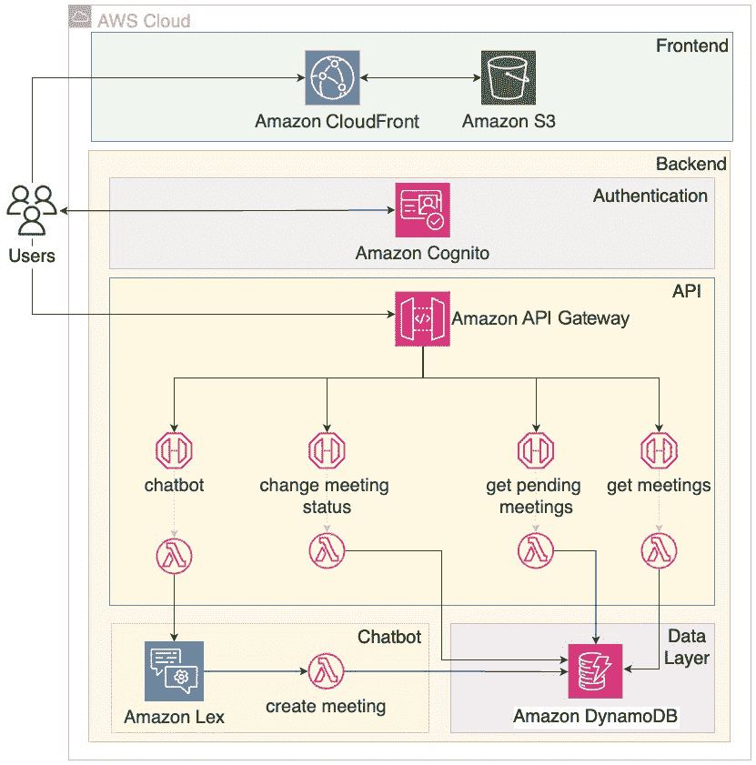

# 第八章：<st c="0">7</st>

# <st c="2">使用机器学习实现聊天机器人</st>

<st c="47">在前面的章节中，你已经有机会进行实验并熟悉</st> **<st c="150">人工智能</st>** <st c="173">（</st>**<st c="175">AI</st>**<st c="177">）技术在不同领域的应用。</st> <st c="216">从计算机视觉开始</st> <st c="245">通过分析你的照片到文本翻译的自动化，你现在应该已经有了两个完全功能的项目，展示了 AI 在现代应用中的强大力量，但这只是冰山一角。</st>

<st c="462">在今天的数字化环境中，用户越来越倾向于在应用程序中寻找有趣和互动的体验，而聊天机器人已经成为一种强大的方式来满足这一需求，利用</st> **<st c="658">自然语言处理</st>** <st c="685">（</st>**<st c="687">NLP</st>**<st c="690">）和</st> <st c="697">对话式 AI 提供个性化、实时的帮助，并促进一种</st> <st c="783">类人互动的感觉。</st>

<st c="806">总结来说，本章涵盖以下主题，</st> <st c="861">按顺序：</st>

+   <st c="870">你将构建的内容 - 一个用于</st> <st c="927">安排会议</st>的聊天机器人应用程序

+   <st c="946">你将如何构建它 - 使用</st> <st c="985">Amazon Lex</st>

+   <st c="995">构建它 - 通过 CloudFormation 并使用</st> <st c="1047">AWS 控制台</st>

+   <st c="1058">如何改进解决方案 - 使用来自</st> <st c="1139">Amazon Lex</st> <st c="1786">扩展你的聊天机器人功能</st>

<st c="1149">在本章中，你将提升对 AI 技术的理解，并探索开发聊天机器人以帮助安排会议而无需人工干预的用例。</st> <st c="1332">在本章结束时，你将了解 Amazon Lex 的工作原理，更重要的是，如何将聊天机器人整合到你的</st> <st c="1462">项目中。</st>

# <st c="1475">技术要求</st>

<st c="1498">要设置你自己的聊天机器人应用程序，你需要访问 AWS 账户。</st> <st c="1582">本书在其 GitHub 仓库中有一个专用文件夹，你可以在其中找到必要的代码片段来跟随</st> <st c="1701">进行操作：</st> [<st c="1708">https://github.com/PacktPublishing/AWS-Cloud-Projects/tree/main/chapter7/code</st>](https://github.com/PacktPublishing/AWS-Cloud-Projects/tree/main/chapter7/code)<st c="1785">。</st>

# <st c="1786">场景</st>

<st c="1795">在成功</st> <st c="1815">构建和部署多个利用云和无服务器技术的应用后，你已经熟练掌握了这些现代架构。</st> <st c="1963">然而，仍然需要大量时间和精力的一个领域是会议安排。</st> <st c="2049">平均而言，你需要三次或更多的互动才能协调可用时间、讨论议程事项并最终确定每个会议的后勤安排。</st> <st c="2188">这种来回沟通可能既乏味又耗时，经常使你从更</st> <st c="2289">重要的任务中分心。</st>

<st c="2305">在探索如何优化和加速这些重复性流程时，你偶然发现了聊天机器人这一概念。</st> <st c="2424">随着你对 AI 及其实际应用的兴趣日益增长，你意识到聊天机器人不仅仅是对话界面——它们可能处理特定的操作并且</st> <st c="2618">自动化工作流。</st>

<st c="2637">创建一个聊天机器人来简化会议安排流程的想法引起了你的兴趣。</st> <st c="2736">通过利用自然语言处理（NLP）和对话式 AI，一个设计良好的聊天机器人可以理解与会议相关的请求，并自动创建</st> <st c="2872">会议请求。</st>

<st c="2889">受到提高效率潜力的激励，并希望能应用你的 AI 知识，你决定开始一个新项目：开发一个智能聊天机器人应用，改变会议安排的方式。</st> <st c="3106">通过云技术、无服务器架构和 AI 能力的正确结合，你的目标是创建一个无缝的对话体验，自动化整个会议安排过程，节省宝贵时间，让你能够专注于更多</st> <st c="3375">战略性任务。</st>

## <st c="3391">需求</st>

<st c="3404">现在，你将开始收集该项目的需求。</st> <st c="3472">这项练习与你在前几章所做的工作相一致，将帮助你设计应用程序并定义技术选择，以便进行</st> <st c="3626">实现。</st>

<st c="3645">收集需求意味着要理解将与应用程序互动的用户角色、他们将执行的操作，以及从技术和</st> <st c="3837">功能角度可能存在的任何限制。</st>

<st c="3859">总的来说，你仍然希望服务于与</st> <st c="3933">你的应用互动的两类不同用户：</st>

+   **<st c="3950">最终用户/会议请求者</st>**<st c="3977">：平台的一部分，公开可访问，配有聊天机器人帮助</st> <st c="4052">安排会议。</st>

+   **<st c="4070">管理员/会议所有者</st>**<st c="4090">：通过日历视图管理会议请求并查看已接受的</st> <st c="4145">会议。</st>

这些需求可以被翻译为功能需求、非功能需求和数据需求。

### 功能需求

在你定义好应用程序的用户角色后，你可以按用户类型细分功能需求：

+   **会议请求者**：

    +   应用程序应公开可用，并且不需要身份验证。

    +   响应式设计，以便任何人都可以通过任何设备与应用程序进行互动。

    +   你的聊天机器人应能够处理输入中的小错误。

    +   理解描述性日期的能力，如“明天”或“下周一”。

+   **会议拥有者**：

    +   列出待处理的会议请求，并具有批准或**拒绝**它们的能力。

    +   包括一个显示所有已批准会议的日历，管理员可以在其中进行导航。

    +   日历应支持按天、周和月不同的视图。

    +   管理员页面应仅通过身份验证访问。

    +   发生冲突的会议不应被聊天机器人拒绝；如果提议的时间段已被占用，应用程序应包含一个与会议请求相关的警告标志。

列出主要功能或能力是定义功能需求的有效方法，然而，通过视觉表示来补充它们可以显著提升价值并加速开发过程。考虑到这一点，你创建了两个简单的原型：一个是面向终端用户界面的，另一个是面向管理员界面的，如*图 7.1* 和 *7.2* 所示：

+   **/home** 看起来是这样的：


图 7.1 – 用户页面的 UI 原型

+   **/admin** 看起来是这样的：


图 7.2 – 管理员页面的 UI 原型

### 非功能需求

基于你的研究，你发现由于生成性 AI 技术的出现以及专门用于聊天机器人开发的大型语言模型，当前对话式 AI 成为一个热门话题。

对于这个初步项目，你希望通过采用一个易于配置、维护工作量最小的托管服务来启动一个简单的解决方案。

<st c="6332">此外，从成本角度出发，你希望尽可能优化这个解决方案，并且在可能的情况下，采用无服务器技术，以利用纯粹的</st> <st c="6495">按需付费模式。</st>

### <st c="6515">数据需求</st>

<st c="6533">你的应用程序的</st> <st c="6553">目的是存储和管理会议。</st> <st c="6594">审查你想要执行的操作至关重要，这将帮助你定义正确的数据结构。</st> <st c="6698">让我们从你想要在会议请求上执行的操作开始：</st>

+   **<st c="6776">创建会议</st>**<st c="6793">：创建一个</st> <st c="6805">新的会议。</st>

+   **<st c="6817">获取待定会议请求</st>**<st c="6846">：显示待定状态的会议请求列表，供你选择接受或拒绝，并且会警告</st> **<st c="6892">待定</st>** <st c="6899">的重叠请求。</st>

+   **<st c="6975">更改会议状态</st>**<st c="6997">：将待定会议的状态更改为已接受</st> <st c="7051">或已拒绝。</st>

+   **<st c="7063">检查时间窗口内的已批准会议</st>**<st c="7108">：获取已批准会议的列表，以便将其包含在</st> <st c="7176">你的日历中。</st>

<st c="7190">考虑到</st> <st c="7206">列出的操作，可以将会议描述为</st> `<st c="7256">meeting_example.json</st>`<st c="7276">：</st>

```
 {
  "meetingId": "GUID",
  "startTime": "time when the meeting starts",
  "endTime": "time when the meeting ends",
  "duration": "duration of the meeting in minutes",
  "attendeeName": "the name of the participant",
  "email": "the email of the participant",
  "status": "meeting request status",
  "date": "meeting date",
  "isConflict": "for a meeting request, define if there is any overlap with a pre-accepted meeting"
};
```

<st c="7686">会议之间没有关系，你也不预见需要运行复杂查询，因此你希望采用高性能的无服务器数据服务，支持执行所有</st> <st c="7867">列举的操作。</st>

## <st c="7908">架构模式</st>

<st c="7930">AI 解决方案有</st> <st c="7948">潜力为各行各业的企业带来显著的价值，但通常，从零开始规划这些方案可能既费时又昂贵，并且复杂。</st> <st c="8137">作为 AWS 解决方案库的一部分，AWS 拥有一个名为</st> **<st c="8210">人工智能解决方案</st>** <st c="8247">（</st>[<st c="8249">https://aws.amazon.com/solutions/ai/</st>](https://aws.amazon.com/solutions/ai/)<st c="8285">），其中包含了一组精选的</st> <st c="8308">架构，可以帮助你加速 AI 的采用，并缩短将其嵌入当前产品的时间。</st> <st c="8426">这些解决方案属于不同的领域，涵盖从预测分析和计算机视觉到个性化和推荐等多个领域。</st> <st c="8578">当你在 AWS 上思考 AI 项目时，这是一个很好的起点。</st> <st c="8649">。</st>

<st c="8656">更具体地说，有一个子部分</st> <st c="8698">名为</st> **<st c="8705">聊天机器人与虚拟助手</st>** <st c="8734">(</st>[<st c="8736">https://aws.amazon.com/solutions/ai/chatbots-virtual-assistants/</st>](https://aws.amazon.com/solutions/ai/chatbots-virtual-assistants/)<st c="8800">)</st> <st c="8804">它是语言理解领域的一部分，可以作为此项目的良好基础。</st>

## <st c="8899">架构</st>

<st c="8912">要架构化你的</st> <st c="8930">应用程序，关键是要定义组成它们的构建块。</st> <st c="9004">从更高层次开始，你定义了一个由四个层组成的分层方法：</st> <st c="9079">四个层：</st>

+   **<st c="9091">展示层</st>**<st c="9110">：如何托管和提供</st> <st c="9135">前端</st>

+   **<st c="9148">计算层</st>**<st c="9162">：如何集成和执行</st> <st c="9196">业务逻辑</st>

+   **<st c="9210">数据层</st>**<st c="9221">：用于存储和检索</st> <st c="9252">数据</st>

+   **<st c="9261">聊天机器人层</st>**<st c="9275">：负责开发</st> <st c="9311">聊天机器人的层</st>

<st c="9323">对于展示层，你决定采用与上一章相似的策略，并使用 React 开发单页面应用。</st> <st c="9484">对于计算层，你从设计 API 开始，该 API 将作为前端与计算层中包含的业务逻辑之间的接口。</st> <st c="9645">考虑到你的功能需求，你列出了需要执行的各种操作，并按照</st> *<st c="9776">图 7</st>**<st c="9784">.3</st>*<st c="9786">中所示的方式结构化了你的 API：</st>

+   **<st c="9788">GET /meetings</st>**<st c="9801">：获取在指定时间窗口内已批准的会议列表</st> <st c="9847">时间窗口</st>

+   **<st c="9858">GET /pending</st>**<st c="9871">：获取待处理的会议请求列表</st> <st c="9898">会议请求</st>

+   **<st c="9914">POST /chatbot</st>**<st c="9928">：通过发送用户提示与聊天机器人进行交互</st> <st c="9972">用户提示</st>

+   **<st c="9984">PUT /status</st>**<st c="9996">：将会议请求的状态更改为批准</st> <st c="10050">或拒绝</st>


<st c="10107">图 7.3 – API 结构</st>

*<st c="10133">图 7</st>**<st c="10142">.4</st>* <st c="10144">展示了你将在满足所有需求的基础上实施的架构。</st>



<st c="10469">图 7.4 – 你聊天机器人应用的 AWS 架构</st>

<st c="10527">前端将通过 S3 和 CloudFront 服务的结合进行托管和提供。</st> <st c="10620">对于 API，您将利用 Amazon API Gateway HTTP API，使用与您列出的操作相映射的端点。</st> <st c="10715">在审查数据需求后，您选择了 DynamoDB 作为您的数据存储。</st> <st c="10732">最后一个组件是聊天机器人，经过研究后，您选择了 Amazon Lex 作为托管解决方案，因其具有成本效益、简便性以及与其他 AWS 服务如 Lambda 函数的整体集成，能够扩展您的聊天机器人的功能并在</st> <st c="11124">您的代理下执行操作。</st>

<st c="11136">接下来将描述提到的每个服务及其主要优点和选择原因。</st>

# <st c="11245">AWS 服务</st>

<st c="11258">从</st> <st c="11274">丰富的可用服务范围中选择可能是一项艰巨的任务，充分理解需求对于做出明智的决策至关重要。</st> <st c="11433">一些服务在前面的章节中已经介绍过，因此为了避免重复，我们将只突出当前用例中特有的优点，前提是这些优点之前未曾提及，并提供相关章节的参考，您可以在其中找到</st> <st c="11707">详细解释。</st>

## <st c="11729">Amazon CloudFront 和 Amazon 简单存储服务（S3）</st>

<st c="11786">我们已经</st> <st c="11795">广泛</st> <st c="11806">介绍了 Amazon</st> <st c="11822">S3 和 Amazon</st> <st c="11835">CloudFront 用于托管单页面应用程序的前端。</st> <st c="11895">这两项 AWS 服务在前面提到的项目中发挥了至关重要的作用，如果您想回顾它们，建议查看</st> *<st c="12030">第二章</st>* <st c="12040">和</st> *<st c="12045">第三章</st>*<st c="12046">。</st>

## <st c="12047">Amazon DynamoDB</st>

<st c="12063">Amazon</st> <st c="12071">DynamoDB 在</st> *<st c="12098">第三章</st>* <st c="12107">中介绍，作为第一版食谱共享应用程序的一部分。</st> <st c="12172">如果您不熟悉该服务及其用途，建议查看</st> *<st c="12253">第三章</st>*<st c="12262">的</st> *<st c="12266">AWS</st>* *<st c="12270">服务</st>* <st c="12278">部分。</st>

## <st c="12287">Amazon Cognito、Amazon API Gateway 和 Amazon Lambda</st>

<st c="12341">Amazon API</st> <st c="12353">网关</st> <st c="12361">已被</st> <st c="12370">用于</st> <st c="12375">API</st> <st c="12383">层，Amazon Lambda 用于计算层，Amazon Cognito 用于身份验证，这些都因其无缝集成在之前的项目中被使用。</st> <st c="12525">如果你希望深入了解这些服务，可以参考</st> *<st c="12618">第四章</st>*<st c="12627">。</st>

## <st c="12628">Amazon Lex</st>

<st c="12639">Amazon Lex</st> <st c="12650">是一个</st> <st c="12657">AWS 服务，它使得构建对话界面（称为聊天机器人或虚拟助手）变得更加简单。</st> <st c="12763">作为 AWS AI 服务的一部分，Amazon Lex 简化并简化了创建用户可以通过语音或文本交流、理解其意图、以自然和人类的方式回应，并且最重要的是，根据用户请求执行操作的应用程序。</st> <st c="13046">作为一种托管服务，使用 Amazon Lex 时，你不需要管理任何基础设施，因此，你也不需要为任何</st> <st c="13180">未使用的容量支付费用。</st>

<st c="13196">使用 Amazon Lex，你可以利用超过 25 种语言和地区设置，截至目前，这</st> <st c="13302">使得构建多功能聊天机器人变得更加容易，可以服务全球范围内的用户。</st>

<st c="13384">Amazon Lex 有一些基本概念，了解这些概念在配置</st> <st c="13498">你的聊天机器人之前非常重要：</st>

+   `<st c="13935">AMAZON.FallbackIntent</st>`<st c="13956">，当无法识别其他意图时将会使用此意图。</st>

+   **<st c="14015">语句（Utterances）</st>**<st c="14026">：这些是配置每个意图时需要提供的一个或多个句子，聊天机器人将根据用户输入使用这些语句来识别意图。</st> <st c="14186">例如，按照本章的案例，与“预定会议”意图相关的语句可能如下：</st>

    +   <st c="14311">“我想预定</st> <st c="14328">一个会议”</st>

    +   <st c="14338">“帮我预定</st> <st c="14353">一个会议”</st>

+   **<st c="14363">插槽（Slots）</st>**<st c="14369">：插槽是 Amazon Lex 需要从用户那里收集的信息，以便成功完成一个意图。</st> <st c="14485">每个插槽都与一个插槽类型相关联，该类型定义了该插槽期望的数据种类。</st> <st c="14582">AWS 已经提供了内置的插槽类型，如数字或日期，但你也可以通过创建自定义插槽类型来扩展它。</st> <st c="14702">根据本章的示例，插槽的例子可以是安排会议所需的任何信息，比如与会者的姓名、日期、</st> <st c="14856">开始时间以及会议的持续时间。</st>

<st c="14904">除了这些基础模块外，Amazon Lex 还与 AWS 生态系统中的其他服务进行集成，尤其是 Amazon Lambda。</st> <st c="15021">在那里，你可以在达到特定状态时触发 Lambda 函数，例如，意图的完成。</st> <st c="15139">在本项目的范围内，这种集成将使你能够触发 Lambda 函数，将会议详情</st> <st c="15271">在</st> <st c="15291">与用户对话过程中收集的</st> <st c="15338">信息存储到你选择的数据存储中。</st>

# <st c="15350">编码解决方案</st>

<st c="15370">在了解了架构和构成该架构的所有 AWS 服务之后，现在是时候根据所选的需求和</st> <st c="15521">技术实现解决方案了。</st>

## <st c="15543">克隆项目</st>

<st c="15563">第一步是克隆</st> <st c="15590">与本书相关的 Git 仓库，正如在</st> *<st c="15657">技术要求</st>* <st c="15679">部分提到的。</st> <st c="15689">如果你从上一章开始跟随，应该已经将其克隆到本地，但如果你现在才开始本章，检查是否能从 Git 克隆或下载为</st> <st c="15894">ZIP 文件。</st>

<st c="15903">导航到</st> `<st c="15920">chapter7/code</st>` <st c="15933">文件夹，里面你会发现</st> <st c="15967">两个子文件夹：</st>

+   `<st c="15982">frontend</st>`<st c="15991">：包含你的前端代码。</st>

+   `<st c="16030">platform</st>`<st c="16039">：包括部署应用主基础设施的 CloudFormation 模板。</st>

## <st c="16134">解决方案部署</st>

<st c="16154">首先通过</st> <st c="16174">在</st> `<st c="16259">/platform</st>` <st c="16268">文件夹中找到的 CloudFormation 模板部署你的所有应用基础设施。</st> *<st c="16277">表 7.1</st>* <st c="16286">列出了模板创建的所有资源，这些资源对应于</st> *<st c="16378">图 7</st>**<st c="16386">.4</st>*<st c="16388">中展示的架构。</st>

| **<st c="16389">模板</st>** | **<st c="16398">Ch7-application-template.yaml</st>** |
| --- | --- |
| <st c="16428">前端</st> | <st c="16437">CloudFront</st> <st c="16449">和 S3</st> |
| <st c="16455">后端</st> | <st c="16463">DynamoDB</st> |
| <st c="16472">认证</st> | <st c="16487">Cognito</st> <st c="16496">用户池</st> |
| <st c="16505">后端</st> | <st c="16513">一个 HTTP API，具有</st> <st c="16532">四个端点</st><st c="16546">四个 Lambda 函数，每个端点一个</st><st c="16578">一个 Cognito</st> <st c="16604">用户池</st> |
| <st c="16613">数据存储</st> | <st c="16624">DynamoDB</st> |
| <st c="16633">聊天机器人</st> | <st c="16641">One</st> <st c="16646">Lex 聊天机器人</st><st c="16657">一个由</st> <st c="16697">聊天机器人触发的 Lambda 函数</st> |

<st c="16708">表 7.1 – CloudFormation 模板详情</st>

<st c="16752">从控制台，前往 CloudFormation 服务，网址为</st> [<st c="16807">https://console.aws.amazon.com/cloudformation/</st>](https://console.aws.amazon.com/cloudformation/) <st c="16853">并选择您想要托管</st> <st c="16903">应用程序的 AWS 区域。</st>

<st c="16920">重要提示 – 为此项目选择 AWS 区域</st>

<st c="16978">服务可用性是选择 AWS 区域用于项目的原因之一。</st> <st c="17071">您将用于聊天机器人的 Amazon Lex 服务就是一个不可在所有 AWS 区域中使用的服务示例。</st> <st c="17196">尝试在没有 Amazon Lex 服务的区域部署 CloudFormation 模板将导致错误。</st> <st c="17307">您可以在以下链接查看支持的 AWS 区域完整列表：</st> <st c="17358">在</st> [<st c="17361">https://docs.aws.amazon.com/general/latest/gr/lex.html</st>](https://docs.aws.amazon.com/general/latest/gr/lex.html)<st c="17415">。</st>

<st c="17416">区域选择可以通过位于右上角的下拉菜单完成，如</st> *<st c="17524">图 7</st>**<st c="17532">.5</st>*所示。


<st c="17745">图 7.5 – 控制台访问 CloudFormation 和 AWS 区域下拉菜单</st>

<st c="17819">要部署与此项目相关的 CloudFormation 堆栈，请按照以下步骤操作：</st>

1.  <st c="17904">点击</st> <st c="17910">在</st> **<st c="17914">创建堆栈</st>**<st c="17926">。</st>

1.  <st c="17927">在</st> **<st c="17935">前提 – 准备模板</st>** <st c="17966">部分，选择</st> **<st c="17983">选择一个</st>** **<st c="17993">现有模板</st>**<st c="18010">。</st>

1.  <st c="18011">在</st> **<st c="18019">指定模板</st>** <st c="18035">部分，选择</st> **<st c="18052">上传模板文件</st>**<st c="18074">。</st>

1.  <st c="18075">点击</st> **<st c="18085">选择文件</st>**<st c="18096">。</st>

1.  <st c="18097">从</st> `<st c="18127">chapter7/code/platform</st>` <st c="18149">文件夹中选择模板。</st>

1.  <st c="18157">点击</st> **<st c="18164">下一步</st>**<st c="18168">。</st>

<st c="18169">您的</st> **<st c="18175">创建堆栈</st>** <st c="18187">窗口应该如下所示</st> *<st c="18212">图 7</st>**<st c="18220">.6</st>*<st c="18222">。</st>


<st c="19321">图 7.6 – CloudFormation 创建堆栈表单</st>

接下来，您将被要求配置 CloudFormation 堆栈中的参数。在*表 7.2*中，您可以找到每个参数的详细解释。

| **参数** | **描述** |
| --- | --- |
| `APIName` | 这是项目的 API 名称。 |
| `UserEmail` | 这是您希望与用户关联的电子邮件地址。必须是有效的电子邮件地址，因为您稍后将收到临时密码并进行验证。 |
| `UserPoolName` | 这是您为 Cognito 用户池命名的名称。 |
| `用户名` | 在您的应用中，稍后您将使用此用户名进行登录。 |

表 7.2 – CloudFormation 模板参数

*图 7.7* 显示了填写完所有参数后，堆栈配置应呈现的样子。所示的值仅为示例，您的值可能会有所不同。


图 7.7 – CloudFormation 中的堆栈参数

您可以点击**下一步**，继续到最后一页，系统会要求您确认创建 IAM 角色。此通知与将要创建并与每个 Lambda 函数关联的角色有关，以提供与 DynamoDB 表进行交互的最小权限，其中存储了会议数据。

点击**提交**，然后等待堆栈状态变化为**CREATE_COMPLETE**，如*图 7.8*所示。


图 7.8 – CloudFormation 堆栈创建状态

这意味着所有资源已经配置完毕，您现在可以继续操作。

## 前端配置和部署

现在所有必要的 AWS 服务已被配置完毕，是时候配置前端应用并部署文件了。

导航到`…/frontend/src/configs`文件夹，您将找到两个文件：

+   `<st c="21565">aws-exports.ts</st>`<st c="21580">：使用来自 Cognito 用户池的数据配置您的应用程序认证。</st> <st c="21664">该文件由四个</st> <st c="21694">配置变量组成：</st>

    +   `<st c="21718">AWS_PROJECT_REGION</st>`<st c="21737">：部署解决方案的区域</st>

    +   `<st c="21783">AWS_COGNITO_REGION</st>`<st c="21802">：Cognito 用户池的区域（与</st> <st c="21852">上一个变量相同）</st>

    +   `<st c="21870">AWS_USER_POOLS_ID</st>`<st c="21888">：您的用户池的 ID</st>

    +   `<st c="21915">AWS_USER_POOLS_WEB_CLIENT_ID</st>`<st c="21944">：您的 Cognito 用户池应用程序的客户端 ID</st>

+   `<st c="21998">configs.tsx</st>`<st c="22010">：定义应用程序中要使用的 API 的 URL。</st> <st c="22072">`configs.tsx` 文件由一个</st> <st c="22087">配置变量组成：</st>

    +   `<st c="22135">CONFIG_API_URL</st>`<st c="22150">：</st> <st c="22153">API 终端点</st>

<st c="22165">为了简化获取这些值的过程，我们已经将它们包含在我们的</st> **<st c="22254">Outputs</st>** <st c="22261">部分中</st> **<st c="22277">CloudFormation</st>** <st c="22291">模板。</st> <st c="22302">要访问它，请按照</st> <st c="22323">以下步骤：</st>

1.  <st c="22335">转到 CloudFormation 控制台</st> <st c="22369">在</st> [<st c="22372">https://console.aws.amazon.com/cloudformation/</st>](https://console.aws.amazon.com/cloudformation/)<st c="22418">。</st>

1.  <st c="22419">单击</st> <st c="22429">您的堆栈。</st>

1.  <st c="22440">在右侧菜单中，选择</st> **<st c="22471">Outputs</st>** <st c="22478">选项卡，如</st> *<st c="22496">图 7</st>**<st c="22504">.9</st>*<st c="22506">所示。</st>


<st c="23113">图 7.9 – CloudFormation 堆栈输出选项卡</st>

*<st c="23158">表 7.3</st>* <st c="23168">将</st> <st c="23173">堆栈输出与</st> <st c="23201">配置文件进行映射：</st>

| **<st c="23221">文件</st>** | **<st c="23226">参数名称</st>** | **<st c="23241">Cloudformation</st>** **<st c="23257">堆栈输出</st>** |
| --- | --- | --- |
| `<st c="23270">aws-exports.ts</st>` | `<st c="23285">aws_user_pools_id</st>` | `<st c="23303">UserPoolId</st>` |
| `<st c="23314">aws_user_pools_web_client_id</st>` | `<st c="23343">ClientId</st>` |
| `<st c="23352">configs.tsx</st>` | `<st c="23364">API_URL</st>` | `<st c="23372">CognitoUserPoolId</st>` |

<st c="23390">表 7.3 – CloudFormation 输出与 aws-exports.ts 参数之间的映射</st>

<st c="23471">4.</st> <st c="23475">保存</st> <st c="23480">文件。</st>

<st c="23490">最终，您的配置文件应如下所示：</st>

**<st c="23550">configs.tsx</st>**

```
 export const API_URL = '[ApiUrl CloudFormation Output]';
```

**<st c="23619">aws-exports.tsx</st>**

```
 export const amplifyConfig = {
  aws_project_region: 'AWS Region code where you deployed your application. E.g.: us-west-2',
  aws_cognito_region: ' AWS Region code where you deployed your application. E.g.: us-west-2',
  aws_user_pools_id: '[UserPoolId CloudFormation Output]',
  aws_user_pools_web_client_id: '[ClientId CloudFormation Output]',
  };
```

<st c="23977">更新配置文件后，你可以开始</st> `<st c="24036">构建</st>` <st c="24041">过程，将代码转换为可以提供给浏览器的网络优化包。</st> <st c="24130">在我们的示例中，我们使用了</st> `<st c="24154">npm</st>` <st c="24157">作为包管理器，因此你需要安装依赖项并启动</st> `<st c="24239">构建</st>` <st c="24244">过程：</st>

```
 $ npm install && npm run build
```

<st c="24284">注意</st>

<st c="24289">前面的命令应在</st> `<st c="24337">根</st>` <st c="24341">目录下执行，目录位于</st> `<st c="24359">frontend</st>` <st c="24367">文件夹中。</st> <st c="24376">要验证是否在根目录下，请使用以下命令：</st>

`<st c="24441">$</st>` `<st c="24444">pwd</st>`

`<st c="24447">…/</st>``<st c="24449">chapter7/code/frontend</st>`

<st c="24472">构建</st> `<st c="24477">过程会生成一个文件夹，其中包含需要上传到我们的 S3 存储桶的文件。</st> <st c="24575">文件夹的名称可能不同，但通常为</st> `<st c="24621">build/</st>` <st c="24627">或</st> `<st c="24631">dist/</st>`<st c="24636">，并且会在</st> `<st c="24667">根</st>` <st c="24671">目录下创建，该目录位于</st> <st c="24689">前端应用程序的根目录中。</st>

<st c="24710">最后一步是将构建文件夹复制到 S3，按以下说明操作：</st>

1.  <st c="24792">首先，你需要找到之前使用 CloudFormation 模板创建的 S3 存储桶。</st> <st c="24895">存储桶的名称应以</st> `<st c="24931">frontend-chapter-7-</st>` <st c="24950">开头，后跟一串随机字符（</st><st c="24996">例如，</st> `<st c="25003">frontend-chapter-7-XXXXX</st>`<st c="25027">）。</st>

1.  <st c="25030">点击存储桶的名称以</st> <st c="25061">打开它。</st>

1.  <st c="25069">在 S3 存储桶中，找到并点击</st> **<st c="25116">上传</st>** <st c="25122">按钮。</st> <st c="25131">此操作将使你能够将文件从本地机器传输到</st> <st c="25208">S3 存储桶。</st>

1.  <st c="25218">点击</st> `<st c="25258">dist</st>` <st c="25262">文件夹，在你的本地机器上。</st> <st c="25293">选择文件夹中的所有文件并确认（你应该在</st> `<st c="25390">dist</st>` <st c="25394">文件夹的根目录下看到两个文件：</st> `<st c="25403">index.html</st>` <st c="25413">和</st> `<st c="25418">penguin.png</st>`<st c="25429">）。</st>

1.  <st c="25432">接下来，点击</st> `<st c="25471">dist</st>` <st c="25475">文件夹，在你的本地机器上，选择</st> `<st c="25517">assets</st>` <st c="25523">文件夹，</st> <st c="25532">并确认。</st>

1.  <st c="25544">现在你的</st> <st c="25554">S3</st> **<st c="25557">上传</st>** <st c="25563">窗口应该如下所示：</st> *<st c="25588">图 7</st>**<st c="25596">.10</st>*<st c="25599">。</st>


**图 7.10 – 上传到 S3 的前端文件**

请注意，文件名是在构建过程中自动生成的，因此您看到的文件名可能与前面图示中显示的不同。**但是，请确保您拥有以下文件：**

+   `<st c="26152">i</st>``<st c="26154">ndex.html</st>`

+   `<st c="26163">assets/index-XXXXXX.css</st>`

+   `<st c="26187">assets/index-XXXXXX.js</st>`

+   您可能在应用程序中包含的静态文件，例如图像

1.  向下滚动到页面底部并点击**Upload**。

您现在已经完成了应用程序的部署和配置过程，可以继续进行**聊天机器人设置**。

## **Amazon Lex 配置和构建**

您已经几乎完成，剩下的唯一步骤是配置您的聊天机器人。大部分配置已经通过 CloudFormation 模板完成，您只需进行 lambda 函数集成，以根据**对话**执行相应操作。

为了完成这一步，请按照以下步骤操作：

1.  转到您部署 CloudFormation 堆栈的区域中的 Amazon Lex 控制台，网址为[`console.aws.amazon.com/lexv2/home?`](https://console.aws.amazon.com/lexv2/home?)。

1.  在左侧菜单中，选择**Bots**。

1.  在**Bots**列表中，选择**MeetyBot**，如*图 7.11*所示。


**图 7.11 – 选择 Amazon Lex 机器人**

1.  在**Deployment**部分，选择**Aliases**，并点击**TestBotAlias**，如*图 7.12*所示。


**图 7.12 – Amazon Lex 机器人别名部分**

1.  从**Languages**列表中，选择**English (US)**。

1.  在`<st c="27885">bot-function-meety</st>` <st c="27903">作为</st> <st c="27910">源，</st> `<st c="27923">$LATEST</st>` <st c="27930">作为版本，如</st> *<st c="27959">图 7</st>**<st c="27967">.13</st>*<st c="27970">所示。</st>

1.  点击**<st c="27978">保存</st>**<st c="27982">。</st>


<st c="28194">图 7.13 – 选择 Lambda 函数用于您的聊天机器人</st>

<st c="28250">最后一步是配置函数的触发条件，当 BookMeeting 意图完成时触发该函数。</st> <st c="28358">为此，执行以下操作：</st>

1.  <st c="28385">在左侧菜单中，选择**<st c="28411">意图</st>** <st c="28418">在</st> **<st c="28429">英语 (</st>**<st c="28438">美国)</st>** <st c="28442">菜单下。</st>

1.  <st c="28448">点击**<st c="28462">BookMeeting</st>** <st c="28473">意图。</st>

1.  <st c="28481">滚动到**<st c="28501">完成</st>** <st c="28512">部分，并点击切换按钮将其激活。</st> <st c="28571">这样可以确保每次此意图被完成时，Lambda 函数都会被触发。</st> <st c="28658">您可以在*<st c="28693">图 7</st>**<st c="28701">.14</st>*<st c="28704">中看到预期状态。</st>


<st c="28897">图 7.14 – Amazon Lex 聊天机器人 – 完成配置</st>

1.  <st c="28957">点击</st> <st c="28964">**<st c="28967">保存意图</st>**</st> <st c="28978">在右下角。</st>

1.  选择**<st c="29007">构建</st>** <st c="29012">在右上角。</st>

    <st c="29030">您的聊天机器人构建过程应该需要大约两分钟。</st> <st c="29097">等待直到您看到绿色横幅和成功消息，如</st> *<st c="29167">图 7</st>**<st c="29175">.15</st>*<st c="29178">所示。</st>


<st c="29240">图 7.15 – 来自 Amazon Lex 构建过程的成功消息</st>

<st c="29303">恭喜！</st> <st c="29321">您已经成功完成了应用程序的部署和配置，</st> <st c="29410">现在应该已经拥有一个完全功能的</st> <st c="29449">项目。</st> <st c="29458">是时候进行测试了！</st>

## <st c="29484">测试并探索您的应用程序</st>

<st c="29518">到目前为止，一切</st> <st c="29538">应该已经准备好进行测试。</st> <st c="29568">要访问您的应用程序，请执行</st> <st c="29599">以下操作：</st>

1.  <st c="29613">前往 CloudFront 控制台</st> <st c="29643">在</st> [<st c="29646">https://console.aws.amazon.com/cloudformation/</st>](https://console.aws.amazon.com/cloudformation/)<st c="29692">。</st>

1.  选择你在本章中部署的堆栈。

1.  转到**输出**选项卡。

1.  点击 `<CloudFrontDistributionUrl>` 值，如*图 7.16*所示。


图 7.16 – CloudFormation 输出选项卡

这应该会将你重定向到你的应用程序，预计会像*图 7.17*那样。


图 7.17 – 应用首页

这是用户可以与聊天机器人互动以安排会议的页面。通过点击聊天图标，你将能够启动对话。

如*AWS 服务*部分中讨论的那样，表达式是预定义在意图中的，用于帮助识别和理解用户的请求。

本章的 CloudFormation 模板创建了一个由三个意图组成的聊天机器人：

+   **StartMeety**：这是第一个负责欢迎消息的意图。

+   **BookMeeting**：负责预定会议的意图。

+   **FallbackIntent**：当无法基于用户输入识别其他意图时触发的默认意图。

### 探索并自定义你的聊天机器人

要查看每个意图的表达、响应和逻辑，请执行以下操作：

1.  进入你部署了 CloudFormation 堆栈的区域的 Amazon Lex 控制台 [`console.aws.amazon.com/lexv2/home?`](https://console.aws.amazon.com/lexv2/home?)。

1.  在左侧菜单中，选择**Bots**。

1.  选择**MeetyBot**。

1.  在**英语（美国）**下，点击**意图**。

    你的控制台应该像*图 7.18*那样。


图 7.18 – Amazon Lex 机器人意图部分

1.  点击**StartMeety**意图。

1.  向下滚动到**样本话语**部分，查看该意图的预定义话语，如图*7.19*所示。


图 7.19 – Amazon Lex 聊天机器人意图样本话语

这些是当前用于识别 StartMeety 意图的可用话语，但你可以自由添加其他话语或根据需要自定义现有的。更改后，请确保保存该意图并重新构建聊天机器人，正如前一节所述。

对 BookMeeting 意图执行相同的操作。在这种情况下，Amazon Lex 期望不同的样本话语，而且与 StartMeety 意图不同，它还包括五个槽位，这些是实现该意图所需的数据元素：

+   **FullName**：与会者的姓名

+   **MeetingDate**：用户希望见面的日期

+   **MeetingStime**：会议的开始时间

+   **MeetingDuration**：会议的持续时间，应该是 30 分钟或 60 分钟

+   **AttendeeEmail**：用户希望用于联系的电子邮件

我们建议花一些时间探索每个槽位以及聊天机器人用来请求它们的提示。如前所述，欢迎根据你的偏好自定义提示和槽位。

在熟悉了聊天机器人的所有配置后，你可以继续并在你的应用程序中开始一次对话以预定会议。

### 测试你的聊天机器人

配置好你的聊天机器人及其意图后，现在是时候在你的应用程序中测试其行为了：

1.  从使用在 StartMeety 意图中定义的某个话语开始，并注意聊天机器人的响应。


图 7.20 – 来自 StartMeety 意图的初始聊天机器人响应

在这里，你可以看到，根据与 StartMeety 意图的某个样本话语匹配的输入，聊天机器人响应了一个欢迎消息，正如在该意图中配置的那样。

在这个例子中，你可以看到聊天机器人识别并确认了该意图，并作出了相应的回复。

1.  <st c="35315">接下来，你可以使用 BookMeeting 意图中定义的某个语句进行响应，这样聊天机器人就能</st> <st c="35419">识别该语句。</st>


<st c="35529">图 7.21 – BookMeeting 意图对话流程</st>

<st c="35579">聊天机器人识别了意图，并开始提问以收集槽值，目的是</st> <st c="35678">实现该意图。</st> <st c="35706">请注意，聊天机器人能够根据</st> **<st c="35754">明天</st>** <st c="35762">的语句推断出</st> <st c="35786">当前日期。</st>

1.  <st c="35799">作为 BookMeeting 意图的一部分，你的聊天机器人被配置为在继续之前进行确认。</st> <st c="35907">在此，用户可以选择继续或取消请求，如</st> *<st c="35974">图 7</st>**<st c="35982">.22</st>*<st c="35985">所示。</st>


<st c="36153">图 7.22 – 聊天机器人确认提示</st>

1.  <st c="36194">确认后，你的意图达到了实现状态，并且根据机器人配置，</st> `<st c="36295">bot-function-meety lambda</st>` <st c="36320">函数被触发。</st> <st c="36345">lambda 函数包含三个</st> <st c="36375">主要操作：</st>

    +   <st c="36388">根据提供的槽值，评估是否有任何已接受的会议可能与提议的会议时间发生冲突。</st>

    +   <st c="36539">创建会议请求并将其存储在</st> <st c="36587">DynamoDB 表中。</st>

    +   <st c="36602">向最终用户发送自定义消息，确认</st> <st c="36671">会议请求。</st>


<st c="36844">图 7.23 – 聊天机器人最终响应</st>

<st c="36880">如果你想要</st> <st c="36896">详细查看 lambda 函数代码，请按照</st> <st c="36947">以下步骤进行操作：</st>

1.  <st c="36959">前往你部署 CloudFormation 堆栈的区域中的 AWS Lambda 控制台</st> <st c="37047">，网址为</st> [<st c="37050">https://console.aws.amazon.com/lambda/</st>](https://console.aws.amazon.com/lambda/)<st c="37088">。</st>

1.  <st c="37089">在左侧菜单中，</st> <st c="37108">选择</st> **<st c="37115">函数</st>**<st c="37124">。</st>

1.  <st c="37125">点击</st> `<st c="37139">bot-function-meety</st>` <st c="37157">函数。</st>

1.  <st c="37167">向下滚动至</st> **<st c="37187">代码源</st>** <st c="37198">部分，你将找到所有包含在此</st> <st c="37256">lambda 函数中的代码。</st>

<st c="37272">您已经检查了用户如何通过与您的聊天机器人对话发起会议请求。</st> <st c="37381">现在，是时候深入了解</st> **<st c="37415">管理员</st>** <st c="37420">页面，在那里您可以查看日历中的已接受会议并管理待处理的</st> <st c="37510">会议请求。</st>

### <st c="37527">通过管理员门户管理会议请求</st>

<st c="37576">到目前为止，您已经测试了您的聊天机器人，尤其是其通过类人对话处理会议请求的能力，现在您将探索如何管理已创建的</st> <st c="37741">请求。</st>

<st c="37758">在部署 CloudFormation 堆栈的过程中，您应该已经收到一封类似于</st> *<st c="37868">图 7</st>**<st c="37876">.24</st>* <st c="37879">的电子邮件，里面包含了您的用户名和临时密码。</st> <st c="37925">这将用于</st> <st c="37938">完成身份验证过程并访问</st> **<st c="37999">管理员</st>** <st c="38004">页面。</st>


<st c="38305">图 7.24 – 带有临时密码的电子邮件</st>

<st c="38350">要访问管理员门户并管理会议请求，请按照以下步骤操作：</st>

1.  <st c="38430">在您的应用程序主页上，点击</st> **<st c="38474">登录</st>**<st c="38481">。</st>

1.  <st c="38482">填写</st> **<st c="38496">用户名</st>** <st c="38504">和</st> **<st c="38509">密码</st>** <st c="38517">字段，输入您收到的电子邮件中的值</st> <st c="38569">并确认。</st>

1.  <st c="38581">设置一个新密码</st> <st c="38604">并继续。</st>

1.  <st c="38616">选择您的电子邮件并点击</st> **<st c="38648">验证</st>**<st c="38654">。您现在将收到一封带有</st> <st c="38693">临时代码</st> <st c="38693">的电子邮件。</st>

1.  <st c="38708">从您的电子邮件中复制验证码并将其粘贴到</st> <st c="38774">确认表单中。</st>

<st c="38792">您现在已经完成了身份验证设置，您的界面应如下所示：</st> *<st c="38878">图 7</st>**<st c="38886">.25</st>*<st c="38889">。</st>


<st c="39367">图 7.25 – 管理会议请求的管理员页面</st>

<st c="39421">管理员页面分为两个</st> <st c="39439">不同的部分：</st>

+   <st c="39475">会议日历，显示所有已接受的</st> <st c="39518">会议。</st>

+   <st c="39536">待处理会议部分，展示了等待</st> <st c="39614">您操作的会议请求列表。</st>

<st c="39626">在</st> **<st c="39638">操作</st>** <st c="39645">列中，你有两个可用按钮：</st> **<st c="39686">接受</st>** <st c="39692">和</st> **<st c="39697">拒绝</st>**<st c="39703">。点击</st> **<st c="39718">接受</st>** <st c="39724">按钮会将会议请求的状态更新为</st> **<st c="39776">已接受</st>**<st c="39784">，而选择</st> **<st c="39806">拒绝</st>** <st c="39812">按钮则会将其标记为</st> **<st c="39836">已拒绝</st>**<st c="39844">。为了观察功能，尝试接受一个会议请求，并观看它出现在</st> **<st c="39935">会议</st>** **<st c="39944">日历</st>** <st c="39952">中。</st>

<st c="39962">一个功能要求是，当新的会议请求与之前接受的会议时间重叠时，你应该收到通知。</st> <st c="40116">要测试这个行为，请执行以下步骤：</st>

1.  <st c="40167">在浏览器中打开一个新标签，访问主页（你可以复制来自</st> `<st c="40274">/admin</st>`<st c="40280">）的 URL）。</st>

1.  <st c="40969">尝试在与已接受会议相同的时间段安排一个新会议。</st>

1.  <st c="40371">刷新</st> **<st c="40384">管理员</st>** <st c="40389">页面以显示新的</st> <st c="40414">会议请求。</st>

<st c="40430">你可以验证，新请求现在会显示一个警告图标和一个工具提示，表示它与之前接受的会议冲突，如在</st> *<st c="40592">图 7</st>**<st c="40600">.26</st>*<st c="40603">中所示。</st>


<st c="40744">图 7.26 – 会议冲突警告</st>

<st c="40785">现在，你已经有了一个完全可操作的 Web 应用程序，配备了一个能够根据与终端用户对话安排会议的聊天机器人。</st> <st c="40919">此外，你还可以查看包含所有过去会议的日历，并管理你即将到来的会议日程。</st>

## <st c="41057">清理</st>

<st c="41066">符合你的</st> <st c="41084">非功能性要求，架构中的所有组件都采用按需计费模式，这意味着你只需为使用的部分付费。</st> <st c="41229">然而，如果你让应用程序长时间运行，可能会产生不必要的费用。</st> <st c="41336">因此，建议在不再使用时清理你的基础设施。</st> <st c="41426">由于你是通过基础设施即代码（IaC）部署应用程序的，清理过程十分简单，包含</st> <st c="41524">两个步骤：</st>

1.  <st c="41534">清空</st> <st c="41545">S3 存储桶：</st>

    1.  <st c="41555">进入你的 AWS 账户中的 S3 控制台。</st>

    1.  <st c="41597">选择你的前端 S3 存储桶（存储桶的名称应以</st> `<st c="41671">frontend-chapter-7-</st>`<st c="41690">开头，后跟一个</st> <st c="41706">随机字符串）。</st>

    1.  <st c="41721">点击</st> **<st c="41731">空</st>**<st c="41736">；这将删除你存储桶中的所有内容。</st> <st c="41779">内容。</st>


<st c="42082">图 7.27 – 清空 S3 存储桶的过程</st>

1.  <st c="42128">删除</st> <st c="42140">CloudFormation 堆栈：</st>

    1.  <st c="42161">在你的 AWS 账户中导航到 CloudFormation 服务控制台，确保你在最初部署时所在的相同区域。</st> <st c="42299">区域。</st>

    1.  <st c="42310">选择你创建的堆栈。</st> <st c="42328">堆栈。</st>

    1.  <st c="42340">点击</st> **<st c="42350">删除</st>**<st c="42356">，如</st> *<st c="42370">图 7</st>**<st c="42378">.28</st>*<st c="42381">所示。</st>


<st c="42669">图 7.28 – CloudFormation 堆栈删除</st>

<st c="42712">通过这些操作，应删除为本章节创建的所有资源。</st> <st c="42783">资源。</st>

<st c="42794">虽然这个项目</st> <st c="42813">为你的聊天机器人应用程序提供了坚实的基础，但还有一些增强功能和未来的考虑事项，可以进一步提高其功能和用户体验。</st> <st c="42993">这些将在</st> <st c="43024">下一部分中介绍。</st>

# <st c="43037">未来的工作</st>

<st c="43049">恭喜你成功实现了聊天机器人应用程序！</st> <st c="43120">你已经迈出了利用 AWS 构建智能对话界面的重要一步，并且现在你拥有了将这项技术融入未来项目的基础。</st> <st c="43323">这个项目代表了一个初始版本。</st> <st c="43367">我们希望提出一些改进建议和可以实施的想法，帮助你扩展和丰富</st> <st c="43456">你的聊天机器人。</st>

## <st c="43469">扩展你的聊天机器人执行的操作</st>

<st c="43514">当前的聊天机器人</st> <st c="43536">能够检测用户尝试安排会议时的冲突，但可以考虑通过实现逻辑来扩展其功能，以向用户建议可用的时间段。</st> <st c="43707">此外，你可以引入一个调度窗口，例如从早上 9 点到下午 5 点，只接受该时间段内的会议请求：</st>

```
 def check_meeting_slot(prop_date, prop_start, prop_dur):
#check if is there any conflict by querying the dynamoDB table for meeting already accepted at the proposed start time.
```

<st c="44027">你可以通过包括两个</st> <st c="44091">新参数来改进此功能：</st>

+   `<st c="44105">min_time</st>`<st c="44114">: 由管理员定义，接受会议的最早时间。</st> <st c="44167">会议的时间。</st>

+   `<st c="44177">max_time</st>`<st c="44186">: 由管理员定义，接受会议的最晚时间。</st> <st c="44237">会议的时间。</st>

<st c="44247">现在，在您的函数中，包含测试</st> <st c="44301">以下内容的逻辑：</st>

+   <st c="44315">会议提议的日期是否为</st> <st c="44355">之前</st> `<st c="44362">min_time</st>`<st c="44370">。</st>

+   <st c="44371">会议结束日期是否为</st> <st c="44406">之后</st> `<st c="44412">max_time</st>`<st c="44420">。</st>

+   <st c="44421">是否存在冲突，如果存在，请查询 DynamoDB 表以获取在提议日期上发生的所有会议，并实现逻辑以考虑提议的时长查找可用的时段。</st>

<st c="44637">以下是更新后的</st> `<st c="44691">check_meeting_slot</st>` <st c="44709">函数结构示例，它包含了扩展逻辑所需的参数，如上所述：</st>

```
 def check_meeting_slot(prop_date, prop_start, prop_dur, min_time, max_time):
#future work
```

<st c="44893">随时探索并自定义</st> `<st c="44933">bot-function-meety</st>` <st c="44951">lambda 函数，以便将这些想法或您设想的任何其他增强功能集成到</st> <st c="45038">您的聊天机器人中。</st>

## <st c="45051">多语言支持</st>

<st c="45072">目前，您的</st> <st c="45089">聊天机器人仅支持英语，但 Amazon Lex 提供了支持多语言的功能。</st> <st c="45190">作为未来的增强功能，您可以配置您的聊天机器人支持额外的语言，使其更容易为来自不同语言背景的用户所使用。</st> <st c="45355">您可以在 AWS 文档中找到如何实现的说明</st> <st c="45433">，网址为</st> [<st c="45436">https://docs.aws.amazon.com/lexv2/latest/dg/add-language.html</st>](https://docs.aws.amazon.com/lexv2/latest/dg/add-language.html)<st c="45497">。</st>

## <st c="45498">为不同的会话维护用户档案</st>

<st c="45544">CloudFormation</st> <st c="45564">部署包括一个名为</st> `<st c="45609">chatbot-meety</st>`<st c="45622">的 lambda 函数，负责通过发送用户输入并接收响应与您的 Amazon Lex 聊天机器人进行交互。</st> <st c="45738">与 Amazon Lex 交互时的参数之一是</st> `<st c="45796">sessionId</st>`<st c="45805">，它帮助服务识别</st> <st c="45840">不同的对话：</st>

```
 def lambda_handler(event, context):
…
response = bot.recognize_text(
botId = '${MeetyBot}',
botAliasId='TSTALIASID',
localeId='en_US',
sessionId='your_session_id',
text = user_input
)
…
```

<st c="46050">目前，这个值是硬编码的。</st> <st c="46087">您可以在前面的代码片段中看到，我们使用了</st> `<st c="46147">your_session_id</st>` <st c="46162">字符串，这意味着聊天机器人无法处理多个</st> <st c="46229">并发对话。</st> <st c="46256">您能想到一个为</st> <st c="46321">每个会话创建唯一标识符的策略吗？</st>

# <st c="46334">总结</st>

<st c="46342">在本章中，您开始了开发智能聊天机器人应用程序的旅程，该应用程序简化了会议安排过程。</st> <st c="46481">通过利用 AWS 服务（如 Amazon Lex、Lambda、API Gateway 和 DynamoDB）的强大功能，您创建了一种无缝对话体验，自动化了整个会议安排工作流程。</st> <st c="46681">具体而言，在聊天机器人开发中，您探索了 Amazon Lex 的复杂性，包括意图、话语和插槽，并学习了如何定制和扩展聊天机器人的功能。</st> <st c="46877">总体而言，在前三章中，您已经获得了人工智能领域的知识，并学会了如何使用 AWS 服务采用这些技术。</st>

<st c="47018">在下一章中，您将探索业务智能领域，并学习如何分析</st> <st c="47115">点击流数据。</st>
