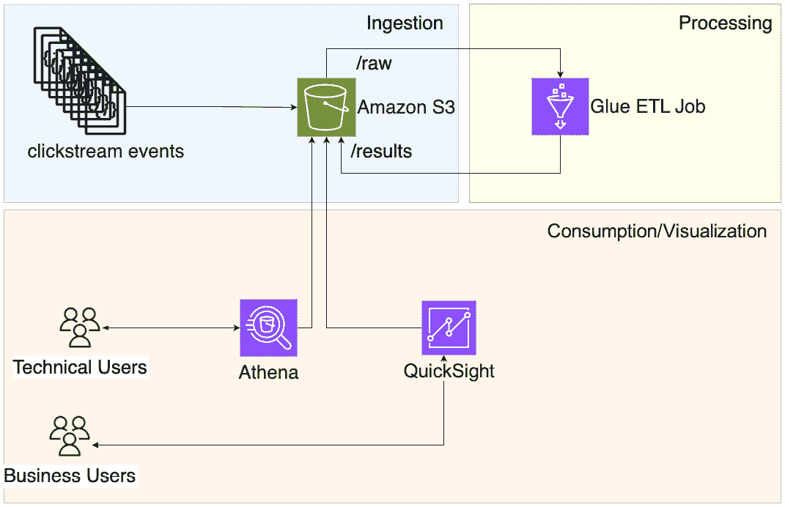
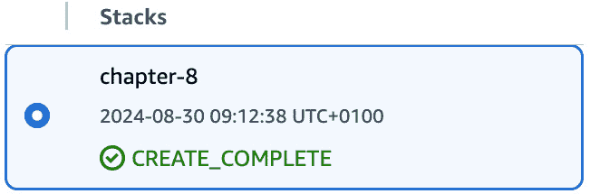
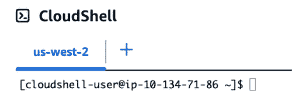
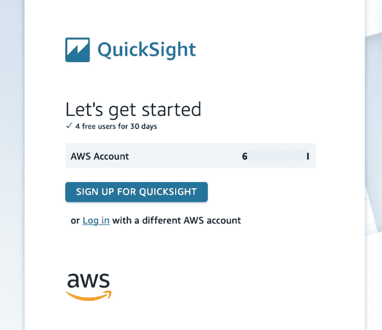

# 8

# 构建商业智能应用程序

在当今的数字时代，企业从各种来源生成大量数据，包括网站、移动应用程序和在线交易。其中一个数据来源是**点击流数据**，它记录了用户在网站或应用程序上的交互和活动。分析点击流数据可以提供有关用户行为、偏好和痛点的宝贵见解，从而使企业能够量身定制其产品、服务和营销策略，更好地满足客户需求。

在本章中，我们将探讨如何使用原生 AWS 服务构建商业智能应用程序，分析点击流数据。我们将覆盖整个过程，从数据采集和存储到数据转化、查询和可视化。

总结：本章将按以下顺序涵盖以下主题：

+   你将要构建的内容——一个商业智能应用程序

+   你将如何构建它——使用 Glue、Athena 和 QuickSight

+   实际构建过程——通过 CloudFormation 并使用 AWS 控制台

+   如何改进解决方案——自动化 ETL 管道和数据生命周期管理

本章结束时，你将获得使用 AWS 服务分析点击流数据，构建端到端商业智能应用程序的实践经验。

# 技术要求

要跟随本章内容并实现自己的商业智能应用程序，你需要拥有一个 AWS 账户。此外，本书在 GitHub 的专用文件夹中有一个文件夹，你可以在其中找到所有基础设施部署所需的代码以及本章中将使用的其他文件：[`github.com/PacktPublishing/AWS-Cloud-Projects/tree/main/chapter8/code`](https://github.com/PacktPublishing/AWS-Cloud-Projects/tree/main/chapter8/code)。

# 场景

你是一个电子商务网站的所有者，销售从电子产品到时尚商品等各种产品。你的网站已经运营了几年，并且随着时间的推移，你已经建立了一个相当可观的客户群。然而，你注意到你的转化率（即访问者中完成购买的比例）一直停滞不前，你不确定导致这一趋势的原因。

<st c="2205">为了提高转化率并改善您网站的整体用户体验，您决定分析用户生成的点击流数据。</st> **<st c="2370">点击流数据</st>** <st c="2386">指的是</st> <st c="2393">用户在您网站上的互动和活动记录，例如访问的页面、点击的链接、查看的产品以及在每个页面上停留的时间。</st>

<st c="2560">通过分析这些数据，您的目标是获得有关用户行为和偏好的有价值洞察，这可以帮助您识别潜在的瓶颈、痛点以及您网站用户体验中需要改进的地方。</st> <st c="2780">此外，您希望揭示出一些模式和趋势，从而指导您的营销和产品开发策略，进而提高转化率</st> <st c="2933">和收入。</st>

## <st c="2945">需求</st>

<st c="2958">正如您到目前为止所做的那样，收集需求应作为起点。</st> <st c="3050">考虑到当前情境，您的目标是分析点击流数据，并且有两类具有不同背景和技术能力的用户，希望从</st> <st c="3257">您的数据中提取信息：</st>

+   **<st c="3267">业务分析师</st>**<st c="3285">：业务分析师对创建和运行 SQL 查询没有信心，他们寻找更直观的替代方法来探索</st> <st c="3411">数据。</st>

+   **<st c="3420">技术用户</st>**<st c="3436">：技术用户熟悉并擅长使用 SQL，想要能够运行复杂的查询以回答</st> <st c="3546">特定问题。</st>

<st c="3565">了解用户画像并理解他们如何与您的应用程序交互，是定义功能性和</st> <st c="3689">非功能性需求的关键。</st>

### <st c="3717">功能需求</st>

**<st c="3741">功能需求</st>** <st c="3765">概述</st> <st c="3774">提出的解决方案必须提供的基本特性、功能和能力，以满足期望的目标。</st> <st c="3898">在这种情况下，功能需求应该做到</st> <st c="3950">以下几点：</st>

+   <st c="3964">从</st> <st c="3990">点击流数据</st> <st c="3990">中提取信息</st>

+   <st c="4006">支持地理分析和</st> <st c="4039">用户分布</st>

+   <st c="4056">支持按需更新，以获取最新的</st> <st c="4099">信息</st>

+   <st c="4121">能够为技术用户运行临时 SQL 查询</st> <st c="4169">的能力</st>

+   <st c="4184">具有无限期存储点击流数据的能力</st> <st c="4228">数据</st>

### <st c="4245">非功能性需求</st>

**<st c="4273">非功能性需求</st>** <st c="4301">描述</st> <st c="4311">拟议解决方案应遵循的定性特征和约束，以确保其整体质量和性能。</st> <st c="4450">在这种特定情况下，非功能性需求规定了以下内容：</st>

+   <st c="4529">有限的</st> <st c="4538">维护工作量</st>

+   <st c="4556">成本效益</st>

## <st c="4575">架构模式</st>

<st c="4597">AWS</st> <st c="4606">架构</st> <st c="4618">中心（</st>[<st c="4627">https://aws.amazon.com/architecture/</st>](https://aws.amazon.com/architecture/)<st c="4664">）提供了一套经过验证的解决方案，这些方案由 AWS 和 AWS 合作伙伴的专家共同开发和构建，可以作为你项目的起点。</st> <st c="4828">在这个使用案例中，AWS 提供了一种来自 AWS 解决方案库的解决方案</st> <st c="4907">名为</st> **<st c="4914">AWS 上的 Clickstream 分析</st>**<st c="4942">：</st> [<st c="4945">https://aws.amazon.com/solutions/implementations/clickstream-analytics-on-aws/</st>](https://aws.amazon.com/solutions/implementations/clickstream-analytics-on-aws/)<st c="5023">。这个解决方案专注于从网站和移动应用程序中收集、摄取、分析和可视化点击流数据，这与该项目的</st> <st c="5191">范围一致。</st>

<st c="5207">蓝图和解决方案应当是完全可行的，因为 AWS 会定期进行修订，但每个项目通常都有其独特性，可能需要一定程度的定制。</st> <st c="5411">无论如何，这些始终是宝贵的资源，并且在你从零开始启动项目时，尤其是在</st> <st c="5551">架构</st> <st c="5564">设计阶段，将节省不少时间。</st>

## <st c="5577">架构</st>

<st c="5590">正如你从本书的第一个项目开始所做的那样，你采用了自上而下的方法，从需求开始，这些需求应完全中立，描述你应用程序中的功能和约束，直到支持这些功能的具体服务。</st> <st c="5867">这些服务支撑着整个系统。</st>

<st c="5878">你的商业智能应用程序可以分解为三层，如</st> *<st c="5967">图 8</st>**<st c="5975">.1</st>*<st c="5977">所示：</st>


<st c="6026">图 8.1 – 商业智能应用程序层</st>

<st c="6079">让我们简要回顾一下</st> <st c="6103">细节：</st>

+   **<st c="6115">摄取层</st>**<st c="6131">：此层将来自各种来源的数据收集并导入到</st> <st c="6191">系统中。</st>

+   **<st c="6202">处理层</st>**<st c="6219">：此层准备、清洗并转换数据</st> <st c="6271">以便进行分析。</st>

+   **<st c="6284">可视化层</st>**<st c="6304">：以一种视觉吸引力强且交互性强的方式展示处理后的数据，供探索</st> <st c="6379">和洞察。</st> <st c="6403">。</st>

<st c="6416">理解各层的目的以及它们在整体应用中所扮演的角色是定义适合集成的服务的关键。</st> <st c="6581">在它们之内。</st>

<st c="6593">简单性和最低的维护努力是您架构的两个主要支柱，考虑到您希望服务的两种角色。</st> <st c="6751">您将需要两种方式来与数据进行交互或探索。</st> <st c="6817">此外，您不希望重复数据并为每个与点击流数据交互的角色创建不同的数据源；因此，针对数据存储，您希望采用一种足够灵活的解决方案，既能与类似 SQL 的引擎进行探索，又能与商业智能解决方案</st> <st c="7138">进行可视化。</st>

<st c="7156">经过一些研究后，您开始探索 Amazon QuickSight 作为可视化层，使用 Amazon Athena 执行 SQL 查询以分析点击流数据。</st> <st c="7315">为了存储数据，您决定选择 Amazon S3，因为它与 Amazon Athena 和 Amazon QuickSight 都可以集成，且在存储项数上没有任何限制。</st> <st c="7512">对于数据转换，您希望选择一种不需要任何基础设施</st> <st c="7603">维护的解决方案，理想情况下是一个可以利用您现有 Spark 知识的工具；因此，您选择了 AWS Glue 来处理</st> <st c="7729">数据管道。</st>

<st c="7744">考虑到上述所有要点，您制作了一个初步架构，如下所示：</st> *<st c="7832">图 8</st>**<st c="7840">.2</st>*<st c="7842">。总结来说，文件被导入到</st> `<st c="7884">/raw</st>` <st c="7888">存储桶的前缀中，并由 Glue 处理，存入相同存储桶的</st> `<st c="7941">/results</st>` <st c="7949">前缀。</st> <st c="7977">技术用户使用 Athena 通过类似 SQL 的语法查询数据，而业务用户则通过 QuickSight 获取可视化的洞察。</st>



<st c="8267">图 8.2 – 适用于您的商业智能应用的 AWS 架构</st>

<st c="8339">现在您已经概述了高级架构，让我们深入了解您选择的 AWS 服务，</st> <st c="8449">以构建此解决方案，并了解它们如何与之前设定的需求对接。</st> <st c="8531">。</st>

# <st c="8554">AWS 服务</st>

如图*<st c="8580">8.2</st>*所示，该架构由四个主要服务组成。在本节中，你将探索每个构建块，并理解它们如何与要求对齐。

## 亚马逊简单存储服务（S3）

在你的商业智能应用架构中，你需要一个数据存储来持久化大量的对象或事件，你发现 S3 可以成为数据湖的理想基础解决方案。S3 的设计目标是提供高耐久性，耐久性高达 99.999999999%（11 个 9），确保即使在面对意外事件或基础设施故障时，数据依然完整且可访问，同时提供高可用性，保证为分析和报告目的提供可靠的解决方案，这也是数据湖的预期需求。

此外，可扩展性和成本效益被强调为要求的一部分，而 S3 符合这两个原则，因为它可以存储和分析 PB 级的数据，且无需担心容量限制或基础设施配置，通过在需要时自动扩展，采用按需付费模式。

亚马逊 S3 是支持数据湖的最佳选择，你可以通过阅读以下博客了解更多原因：[<st c="9764">https://aws.amazon.com/blogs/big-data/tag/data-lake/</st>](https://aws.amazon.com/blogs/big-data/tag/data-lake/)

## AWS Glue

**AWS Glue** 是一个无服务器的数据集成服务，使得数据的发现、准备和结合变得更加容易。在你的商业智能应用架构中，AWS Glue 有两个主要用途：**提取、转换和加载**（ETL）作业和 Glue 数据目录。

ETL 是数据集成中的关键过程，其中从各种源提取数据，转化为所需的格式，然后加载到数据存储中进行分析或报告；在这种情况下，它被加载到 S3 中。AWS Glue 提供了一个无服务器的 Apache Spark 环境来运行 ETL 作业，无需配置或管理服务器。

AWS Glue ETL 作业具有高度的可扩展性和成本效益，因为您只需为作业执行过程中使用的资源付费。<st c="10670">此外，Glue 会自动配置和管理底层的 Apache Spark 集群，消除了手动<st c="10796">集群管理</st>的需要。</st>

**<st c="10820">Glue 数据目录</st>**是一个集中的存储库，用于存储关于数据源的元数据，并作为贵公司所有数据的唯一可信来源。<st c="10959">

在您的应用程序中，Glue 数据目录用于维护您的数据源的元数据定义，即基于 S3 构建的数据湖。<st c="11112">

Glue 数据目录与其他 AWS 服务无缝集成，例如 Amazon Athena，它是您架构的一部分，使您能够基于<st c="11300">存储在</st>目录中的元数据访问和查询数据。</st>

## <st c="11322">Amazon Athena</st>

**<st c="11336">Amazon Athena</st>**是一个交互式查询服务，使您可以使用标准 SQL 轻松分析存储在 Amazon S3 中的数据。<st c="11451">通过 Athena，您可以直接针对存储在 S3 中的数据运行临时查询或预定义的 SQL 脚本，而无需将数据加载或转换到单独的<st c="11617">数据存储。</st>

它的无服务器方式消除了配置和管理基础设施的需要，让您可以专注于数据分析，而不是<st c="11764">基础设施管理。</st>

如在*<st c="11811">AWS Glue</st>*部分所述，Athena 与 AWS Glue 数据目录无缝集成，通过引用 Glue 数据目录中的元数据，Athena 可以理解您在 S3 中的数据结构和位置，使您能够使用 SQL 查询数据，而无需手动<st c="12073">定义模式。</st>

对于在*<st c="12148">需求</st>*部分中介绍的技术概况，Athena 非常适合，因为它将使他们能够以临时的方式运行查询并回答复杂的问题。<st c="12271">

## <st c="12279">Amazon QuickSight</st>

**<st c="12297">Amazon QuickSight</st>**是一个基于云的商业智能服务，使组织能够快速轻松地创建和提供深刻的可视化和仪表板。<st c="12473">在您的商业智能应用架构中，您可以利用 QuickSight 作为一个强大的数据可视化和报告工具，赋能您的业务用户通过交互式和富有视觉吸引力的仪表板进行数据探索和决策，无需<st c="12755">技术技能。</st>

<st c="12772">QuickSight 无缝集成了多种数据源，包括 Athena，消除了复杂的数据迁移或转换过程的需求。</st> <st c="12927">通过利用 QuickSight 与 Athena 和 Glue 数据目录的集成，你可以轻松地可视化并探索存储在 S3 数据湖中的数据，从而更容易地</st> <st c="13102">获得洞察。</st>

<st c="13118">总的来说，QuickSight 解决了在</st> <st c="13224">需求</st> <st c="13237">章节中描述的非技术性用户的数据探索需求。</st>

# <st c="13245">编码解决方案</st>

<st c="13265">本项目分为两部分；第一部分是数据工程部分，你将构建一个端到端的工作流来收集、转换和加载数据，第二部分是你将在 QuickSight 中构建你的第一个仪表板。</st>

## <st c="13508">第一部分 – 克隆项目</st>

<st c="13540">首先，你需要</st> <st c="13559">克隆与本书相关的 Git 仓库，正如在</st> *<st c="13640">技术要求</st>* <st c="13662">章节中提到的。</st> <st c="13672">如果你已经跟随之前的章节进行操作，你应该已经在本地拥有该仓库，但如果不是这种情况，你可以直接从 Git 克隆它，或者如果你更喜欢，可以下载 ZIP 文件。</st>

<st c="13882">导航到</st> `<st c="13899">chapter8/code</st>` <st c="13912">文件夹，在里面你将找到</st> <st c="13947">两个子文件夹：</st>

+   `<st c="13962">平台</st>`<st c="13971">：这包含了一个 CloudFormation 模板，用于部署你的应用程序的主要基础设施。</st>

+   `<st c="14071">辅助文件</st>`<st c="14075">：这包含了一组将在整个章节中使用的辅助文件。</st>

## <st c="14158">第二部分 – 解决方案部署</st>

<st c="14190">第一步是</st> <st c="14211">部署必要的基础设施来支持你的应用程序。</st> <st c="14277">与前面的某些章节一样，这可以通过在</st> `<st c="14382">/platform</st>` <st c="14391">文件夹中找到的 CloudFormation 模板来完成。</st> *<st c="14400">表 8.1</st>* <st c="14409">列出了由你的模板创建的所有资源，这些资源映射到</st> *<st c="14501">图 8</st>**<st c="14509">.2</st>*<st c="14511">中展示的架构。</st>

| **<st c="14512">模板</st>** | **<st c="14521">ch8-application-template.yaml</st>** |
| --- | --- |
| <st c="14551">网络配置</st> | <st c="14562">1 VPC</st><st c="14568">1</st> <st c="14571">互联网网关</st><st c="14587">1</st> <st c="14590">公有子网</st> |
| <st c="14603">数据存储</st> | <st c="14614">Amazon S3</st> |
| <st c="14624">数据处理</st> | <st c="14640">1</st> <st c="14643">Glue 数据库</st><st c="14656">1</st> <st c="14659">Glue 表</st><st c="14669">1</st> <st c="14672">Glue 作业</st> |
| <st c="14680">其他</st> | <st c="14687">1 个参数在</st> <st c="14703">参数存储</st><st c="14718">1</st> <st c="14721">EC2 实例</st> |

<st c="14733">表 8.1 – CloudFormation 模板详情</st>

如同在<st c="14777">前面章节中所做的那样，您将使用 CloudFormation 来配置支持</st> <st c="14898">您的应用程序所需的基础设施：</st>

1.  从控制台，前往 CloudFormation 服务 [<st c="14970">https://console.aws.amazon.com/cloudformation/</st>](https://console.aws.amazon.com/cloudformation/) <st c="15016">并在右上角选择您希望托管应用程序的 AWS 区域（</st>**<st c="15110">俄勒冈州</st>**<st c="15117">，在我们的案例中），如</st> *<st c="15145">图 8</st>**<st c="15153">.3</st>*<st c="15155">所示。</st>


<st c="15358">图 8.3 – 访问 CloudFormation 控制台</st>

1.  点击**<st c="15417">创建堆栈</st>**<st c="15429">。</st>

1.  在**<st c="15438">先决条件 – 准备模板</st>** <st c="15469">部分，选择**<st c="15486">选择现有模板</st>**<st c="15513">。</st>

1.  在**<st c="15522">指定模板</st>** <st c="15538">部分，选择**<st c="15555">上传模板文件</st>**<st c="15577">。</st>

1.  点击**<st c="15588">选择文件</st>**<st c="15599">。</st>

1.  选择模板（`<st c="15622">ch8-application-template.yaml</st>`）来自`<st c="15664">chapter8/code/platform</st>`文件夹。

1.  点击**<st c="15701">下一步</st>**<st c="15705">。</st>

您的**<st c="15712">创建堆栈</st>** <st c="15724">窗口应当如</st> *<st c="15749">图 8</st>**<st c="15757">.4</st>*<st c="15759">所示。</st>


<st c="16859">图 8.4 – CloudFormation 堆栈创建屏幕</st>

接下来，您将被要求配置 CloudFormation 堆栈中的参数。<st c="16995">在</st> *<st c="16998">表 8.2</st>*<st c="17007">中，您可以找到关于</st> <st c="17048">每个参数的详细解释。</st>

| **<st c="17063">参数</st>** | **<st c="17073">描述</st>** |
| --- | --- |
| `<st c="17085">GitRepoURL</st>` | <st c="17096">您想要使用的 Git 仓库。</st> <st c="17133">默认情况下，您将拥有与本书相关联的仓库，但如果您将其 fork 到自己的 Git 账户中，您可以相应地进行更改。</st> |
| `<st c="17282">InstanceType</st>` | <st c="17295">您希望为 EC2 实例选择的实例类型。</st> <st c="17358">您可以保持默认设置，也可以在四个</st> <st c="17408">可选项中选择。</st> |
| `<st c="17426">LatestAmiId</st>` | <st c="17438">您想用于 EC2 实例的 Amazon 机器镜像。</st> <st c="17503">您可以保持默认</st> <st c="17520">不变。</st> |

<st c="17526">表 8.2 – CloudFormation 模板参数</st>

<st c="17577">您可以继续到最后一页，在该页上您将被要求确认 IAM 角色的创建</st> <st c="17680">才能继续。</st> <st c="17699">此通知会出现，因为模板将尝试创建两个</st> <st c="17773">IAM 角色：</st>

+   <st c="17783">与 AWS Glue 作业关联的 IAM 角色，授予读取和写入文件到 S3 所需的权限</st> <st c="17889">。</st>

+   <st c="17894">附加到 EC2 实例的 IAM 角色，在该实例上执行脚本，以提供足够的权限将特定文件复制到您的</st> <st c="18033">S3 桶</st>

<st c="18042">点击</st> **<st c="18049">提交</st>** <st c="18055">并等待堆栈状态更改为</st> **<st c="18099">CREATE_COMPLETE</st>**<st c="18114">，如</st> *<st c="18131">图 8</st>**<st c="18139">.5</st>*<st c="18141">所示。</st>



<st c="18207">图 8.5 – CloudFormation 堆栈创建状态</st>

<st c="18259">这意味着</st> <st c="18271">所有资源都已配置完毕，您可以</st> <st c="18323">继续进行。</st>

## <st c="18335">第三部分 – 点击流事件生成器</st>

<st c="18375">与任何商业智能应用程序一样，进一步处理所需的第一个要素是数据。</st> <st c="18396">在您的案例中，您还没有可以处理的数据；因此，在第一部分，我们创建了一个事件生成器，您可以使用它按需生成点击流事件。</st> <st c="18483">要执行事件生成器，请按照以下步骤操作：</st>

1.  <st c="18702">前往 CloudShell 控制台</st> <st c="18732">访问</st> [<st c="18735">https://console.aws.amazon.com/cloudshell</st>](https://console.aws.amazon.com/cloudshell)<st c="18776">。</st>

1.  <st c="18777">这将打开一个新的终端窗口，您可以在其中执行脚本。</st> <st c="18848">如果您没有准备好任何环境，请点击</st> **<st c="18903">打开 [AWS-Region] 环境</st>**<st c="18932">，如</st> *<st c="18946">图 8</st>**<st c="18954">.6</st>*<st c="18956">所示：</st>


<st c="19033">图 8.6 – CloudShell 终端创建</st>

<st c="19074">到最后，您应该看到一个全新的终端窗口，如</st> *<st c="19152">图 8</st>**<st c="19160">.7</st>*<st c="19162">所示：</st>



图 8.7 – CloudShell 终端窗口

这个新终端将用于运行命令，生成事件并将其发送到你最近创建的 S3 存储桶。

作为部署过程的一部分，我们生成了一个包含所有需要在终端中运行的命令的文件。要访问它，请按照以下步骤操作：

1.  前往 S3 控制台，[`console.aws.amazon.com/s3`](https://console.aws.amazon.com/s3)。

1.  选择你最近创建的 S3 存储桶。它应该被命名为`chapter-8-clickstream-XXXXXXXX`。

1.  点击`aux`文件夹。

1.  选择`instructions.txt`文件。

1.  点击**下载**，如*图 8.8*所示。


图 8.8 – instructions.txt 文件访问

1.  打开文件。在文件中，你应该能看到三条命令：

    ```
     git clone GIT_URL_DEFINED_IN_THE_CLOUDFORMATION_PARAMETER
    cd GIT_NAME/chapter8/code/aux
    pip install -r requirements.txt
    ```

    这三条命令将在你的 CloudShell 环境中本地克隆 Git 仓库。

1.  接下来，导航到`/aux`文件夹，那里存放着你的事件模拟器文件（`generator.py`），然后使用`pip`安装所有需要的库。

1.  从`instructions.txt`文件中复制命令，并粘贴到 CloudShell 终端中。

1.  运行以下命令：

    ```
    <st c="21221">/raw</st> folder. Moreover, the script will create one event per second and print it in the console so you can follow along:

    ```

    …

    {'event_type': 'search', 'user_id': 'lyttebmihe', 'user_action': 'home_page', 'product_category': None, 'location': '36', 'user_age': 30, 'timestamp': 1714680649}

    上传到 S3 的事件：search_lyttebmihe_1714680649.json

    {'event_type': 'click', 'user_id': 'oencotfldn', 'user_action': 'cart_page', 'product_category': 'books', 'location': '1', 'user_age': 42, 'timestamp': 1717732343}

    上传到 S3 的事件：click_oencotfldn_1717732343.json

    超时发生。创建 20 个事件后退出脚本。

    ```

    <st c="21838">As described before, this script will generate the events and store them in your</st> <st c="21920">S3 bucket.</st>
    ```

若要确认文件在你的 S3 存储桶中的持久性，请按照以下步骤操作：

1.  前往 S3 控制台，[`console.aws.amazon.com/s3`](https://console.aws.amazon.com/s3)。

1.  <st c="22067">选择你最近创建的 S3 桶。</st> <st c="22108">它应该被命名为</st> `<st c="22128">chapter-8-clickstream-XXXXXXXX</st>`<st c="22158">。</st>

1.  <st c="22159">点击</st> `<st c="22173">raw</st>` <st c="22176">文件夹。</st>

    <st c="22184">你的</st> `<st c="22190">/raw</st>` <st c="22194">文件夹应该像</st> *<st c="22219">图 8</st>**<st c="22227">.9</st>* <st c="22229">一样，包含与生成的总事件数相对应的 JSON 文件。</st>


<st c="23277">图 8.9 – 存储在 S3 中的事件数据</st>

<st c="23317">你可以多次运行该脚本，只需执行以下命令：</st>

```
<st c="23401">$ python3 generator.py</st>
```

<st c="23424">现在，你已经生成并存储了原始数据，是时候应用</st> <st c="23499">转换操作了。</st>

## <st c="23519">第四部分 – Glue ETL 作业</st>

<st c="23548">到目前为止，你已经拥有一组代表</st> <st c="23568">你生成的点击流事件的文件，但这些事件通常带有一种结构，不适合分析用途。</st> <st c="23715">因此，现在是时候运行你的 ETL 作业，并对你的点击流数据进行一些修改，以支持分析工作负载和</st> <st c="23850">信息提取：</st>

1.  <st c="23873">前往 Glue 控制台</st> <st c="23897">，网址为</st> [<st c="23900">https://console.aws.amazon.com/glue</st>](https://console.aws.amazon.com/glue)<st c="23935">。</st>

1.  <st c="23936">点击左侧菜单中的</st> **<st c="23946">Visual ETL</st>** <st c="23956">选项。</st>

1.  <st c="23976">从</st> `<st c="24009">chapter8-gluejob</st>` <st c="24025">中点击</st> **<st c="24039">运行作业</st>**<st c="24046">，如</st> *<st c="24060">图 8</st>**<st c="24068">.10</st>*<st c="24071">所示。</st>


<st c="24219">图 8.10 – Glue ETL 作业运行过程</st>

<st c="24265">在作业运行时，重要的是要记住正在执行的具体操作：</st>

1.  <st c="24361">读取 S3 桶中</st> `<st c="24395">/raw</st>` <st c="24399">文件夹内的所有事件文件。</st>

1.  <st c="24429">读取一个包含</st> <st c="24457">地理信息的参考文件。</st>

1.  <st c="24480">更改每个数据集的架构。</st>

1.  <st c="24515">将两个数据集</st> <st c="24538">合并为一个。</st>

1.  <st c="24547">选择一部分列。</st>

1.  <st c="24575">基于输出数据集，创建一个单一的</st> `<st c="24593">.csv</st>` <st c="24597">文件。</st>

1.  <st c="24631">将输出</st> `<st c="24651">.csv</st>` <st c="24655">文件保存在你的 S3 桶中的</st> `<st c="24686">/</st>``<st c="24687">results</st>` <st c="24694">文件夹内。</st>

1.  <st c="24702">将所有点击流事件从</st> `<st c="24744">/raw</st>` <st c="24748">文件夹移动到</st> `<st c="24763">/</st>``<st c="24764">processed</st>` <st c="24773">文件夹。</st>

1.  <st c="24781">要详细查看代码，按照以下步骤操作：</st>

    1.  <st c="24832">点击作业</st> <st c="24850">名称（</st>`<st c="24856">chapter8-gluejob</st>`<st c="24873">）。</st>

    1.  <st c="24876">选择</st> **<st c="24888">脚本</st>** <st c="24894">选项卡并查看</st> <st c="24910">代码。</st>

1.  <st c="24919">要检查作业状态，前往</st> **<st c="24958">运行</st>** <st c="24962">选项卡，并等待直到</st> **<st c="24982">运行状态</st>** <st c="24992">变为</st> **<st c="25004">成功</st>**<st c="25013">，如图</st> *<st c="25027">图 8</st>**<st c="25035">.11</st>*<st c="25038">所示：</st>


<st c="25066">图 8.11 – 成功运行消息</st>

<st c="25102">到目前为止，你的所有数据转换工作已完成，接下来是</st> <st c="25167">探索数据的时刻。</st>

## <st c="25178">第五章 – 使用 Athena 进行数据探索</st>

<st c="25219">到目前为止，你</st> <st c="25232">已经生成了点击流数据并运行了 ETL 流水线进行转换。</st> <st c="25316">现在，是时候探索你的数据并从中提取信息了。</st> <st c="25386">如前述</st> *<st c="25406">要求</st>* <st c="25418">部分所提到，与你的数据交互有两种类型的用户，我们将从技术用户的解决方案开始，并尝试对你的</st> <st c="25584">转换后的数据运行 SQL 查询：</st>

1.  <st c="25601">访问 Athena 控制台</st> <st c="25627">请前往</st> [<st c="25630">https://console.aws.amazon.com/athena</st>](https://console.aws.amazon.com/athena)<st c="25667">。</st>

1.  <st c="25668">如果这是你第一次访问 Athena 控制台，你需要进行初始配置。</st> <st c="25783">因此，点击</st> **<st c="25796">探索查询编辑器</st>**<st c="25820">，如图</st> *<st c="25834">图 8</st>**<st c="25842">.12</st>*<st c="25845">所示：</st>


<st c="26165">图 8.12 – Athena 控制台</st>

1.  <st c="26197">前往</st> **<st c="26208">设置</st>** <st c="26216">选项卡。</st>

1.  <st c="26221">点击</st> <st c="26228">管理</st> **<st c="26231">。</st>**

1.  **选择**<st c="26246">浏览 S3</st><st c="26255">。</st>

1.  <st c="26256">找到并点击你为此项目创建的 S3 桶（名称应以</st> <st c="26341">“</st> `<st c="26346">chapter-8-clickstream-xxxxxxxx</st>`<st c="26376">”</st> <st c="26255">为前缀）。</st>

1.  <st c="26379">选择</st> `<st c="26391">/</st>``<st c="26392">aux</st>` <st c="26395">文件夹。</st>

1.  <st c="26403">点击</st> <st c="26410">选择</st> **<st c="26413">选择</st>**<st c="26419">，如</st> <st c="26423">图中</st> *<st c="26436">8</st>**<st c="26444">.13</st>*<st c="26447">所示。</st>


<st c="26642">图 8.13 – Athena 配置</st>

<st c="26676">重要提示</st>

<st c="26691">您选择的存储桶与您用于存储数据的存储桶相同。</st> <st c="26777">理想情况下，您应该为此设置一个单独的存储桶，并在处理</st> <st c="26892">实际项目时考虑这一点。</st>

<st c="26905">配置 Athena 环境后，请按照</st> <st c="26956">以下步骤操作：</st>

1.  <st c="26968">切换到</st> **<st c="26983">编辑器</st>** <st c="26989">选项卡。</st>

1.  <st c="26994">确保您已选择了</st> <st c="27024">以下设置：</st>

    +   `<st c="27058">AwsDataCatalog</st>`

    +   `<st c="27084">clickstream_db</st>`

1.  <st c="27098">点击与</st> <st c="27128">`clickstream_table`</st><st c="27148">相邻的三个点。</st>

1.  <st c="27149">选择</st> **<st c="27157">预览表</st>**<st c="27170">，如</st> <st c="27175">图中</st> *<st c="27184">8</st>**<st c="27192">.14</st>*<st c="27195">所示。</st>


<st c="27554">图 8.14 – Athena 预览表示例</st>

<st c="27600">这将打开一个新选项卡，其中包含如下自动生成的查询：</st>

```
 SELECT * FROM "clickstream_db"."clickstream_table" limit 10;
```

<st c="27735">这是一个您可以使用纯 SQL 探索结果数据的示例，尽管自动生成的</st> <st c="27843">查询非常简单，但您可以扩展它以回答更复杂的问题；例如，您从哪个大陆获得的点击量更多？</st> <st c="27993">尝试运行以下查询以获取</st> <st c="28032">答案！</st>

```
 SELECT continent, COUNT(*) AS total_records
FROM "clickstream_db"."clickstream_table"
GROUP BY continent
ORDER BY total_records DESC;
```

<st c="28177">现在，是时候探索非技术用户如何在不具备 SQL 技术知识或经验的情况下与您的数据交互并提取信息了。</st> <st c="28344">为此，您现在将在</st> <st c="28366">QuickSight 中开发一个仪表板，为探索</st> <st c="28390">您的数据创建一个视觉替代方案。</st>

## <st c="28456">第六部分 – 使用 QuickSight 进行数据可视化</st>

<st c="28503">让我们开始</st> <st c="28519">设置您的</st> <st c="28535">QuickSight。</st> <st c="28547">如果您已经在账户中为其他项目使用 QuickSight，可以跳过初始配置，并选择您已在本章中使用过的区域继续进行</st> <st c="28742">数据集创建：</st>

1.  <st c="28759">在您的 AWS 控制台搜索栏中，</st> <st c="28799">输入</st> `<st c="28804">QuickSight</st>`<st c="28814">。</st>

1.  你将被重定向到**QuickSight**门户，并看到一个类似于*图 8.15*的表单：



图 8.15 – QuickSight 注册表单

1.  点击**注册 QuickSight**。

1.  接下来，你需要填写用于通知的电子邮件。你可以使用自己的电子邮件或其他任何你选择的电子邮件。

1.  前往 QuickSight 区域选择。从下拉菜单中选择你在本章项目中使用的相同区域，如*图 8.16*所示：


图 8.16 – QuickSight 区域选择

1.  向下滚动，在`chapter8-clickstream-xxx`中。

1.  向下滚动，在**可选附加组件**部分，确保你取消勾选**添加分页报告**复选框，如*图 8.17*所示：


图 8.17 – QuickSight 分页报告附加组件

重要说明

确保不将分页报告添加到你的订阅中，这对于避免使用本书中未涵盖的功能而产生不必要的费用至关重要。

1.  点击**完成**。

如果一切设置正确，在 QuickSight 门户的左侧菜单中，你应该看到一个包含各种选项的菜单，如*图 8.18*所示：


图 8.18 – QuickSight 菜单

每当你开始在 QuickSight 中创建任何内容时，第一步是创建一个数据集。所以，让我们从定义你的第一个数据集开始：

1.  点击**数据集**。

1.  在右上角，点击**新数据集**。

1.  选择**Athena**。

1.  对于数据源名称，给它一个有意义的名称，例如`clickstream`。

1.  <st c="31240">对于 Athena 工作组，确保</st> **<st c="31274">[Primary]</st>** <st c="31283">已选择。</st>

1.  <st c="31296">点击</st> **<st c="31306">验证连接</st>** <st c="31325">确保一切正常工作。</st>

1.  <st c="31368">点击</st> **<st c="31378">创建</st>** **<st c="31385">数据源</st>**<st c="31396">。</st>

1.  <st c="31397">在下一个</st> <st c="31409">窗口中，选择</st> `<st c="31425">clickstream_table</st>` <st c="31442">从表格列表中， 如</st> *<st c="31476">图 8</st>**<st c="31484">.19</st>*<st c="31487">所示：</st>


<st c="31721">图 8.19 – QuickSight 数据集配置</st>

1.  <st c="31771">点击</st> <st c="31778">在</st> **<st c="31781">选择</st>**<st c="31787">。</st>

1.  <st c="31788">点击</st> <st c="31795">在</st> **<st c="31798">可视化</st>**<st c="31807">。</st>

1.  <st c="31808">当系统提示报告类型时，选择</st> **<st c="31854">交互式表单</st>**<st c="31871">，如</st> *<st c="31885">图 8</st>**<st c="31893">.20</st>*<st c="31896">所示：</st>


<st c="32177">图 8.20 – QuickSight 报告类型创建表单</st>

<st c="32231">现在，是时候开始创建可视化了。</st> <st c="32279">由于这是一个学习练习，你将创建一个简单的仪表板，但</st> <st c="32351">你可以</st> <st c="32358">并且应该将其扩展为一个更复杂的并且</st> <st c="32402">更具信息量的仪表板。</st>

<st c="32418">我们从根据点击创建用户的地理分布开始：</st>

1.  <st c="32516">从</st> **<st c="32526">可视化</st>** <st c="32533">标签中，点击</st> **<st c="32566">+</st>** **<st c="32568">添加</st>**<st c="32571">。</st>

1.  <st c="32572">选择填充地图，如</st> *<st c="32608">图 8</st>**<st c="32616">.21</st>*<st c="32619">所示：</st>


<st c="32678">图 8.21 – QuickSight 可视化选择</st>

1.  <st c="32724">从</st> <st c="32733">字段</st> <st c="32740">列表中选择</st> `<st c="32774">country-name</st>`<st c="32786">。</st>

<st c="32787">最后，你的可视化应该像</st> *<st c="32829">图 8</st>**<st c="32837">.22</st>*<st c="32840">所示：</st>


<st c="32979">图 8.22 – 填充地图可视化创建</st>

<st c="33023">现在，让我们创建一个不同的可视化，展示基于点击数据的用户平均年龄。</st> <st c="33125">为此，你将</st> <st c="33144">利用</st> **<st c="33153">Autograph</st>**<st c="33162">，这是 QuickSight 中的一项功能，能够根据你想要可视化的数据推荐图表类型：</st>

1.  <st c="33257">点击地图可视化之外的区域。</st>

1.  <st c="33287">从</st> `<st c="33315">user_age</st>`<st c="33323">开始。</st>

    <st c="33324">请注意，QuickSight 会创建一个只包含单个数字的可视化。</st> <st c="33385">这是因为聚合类型默认设置为</st> **<st c="33445">求和</st>** <st c="33448">，因此它正在对所有</st> <st c="33487">用户的年龄进行求和。</st>

1.  <st c="33497">要更改它，请点击</st> `<st c="33548">user_age</st>` <st c="33556">字段旁边的三个点，然后在聚合菜单中将其更改为</st> **<st c="33604">平均值</st>**<st c="33611">，如</st> *<st c="33625">图 8</st>**<st c="33633">.23</st>*<st c="33636">中所示：</st>


<st c="33939">图 8.23 – QuickSight 数据计算配置</st>

<st c="33994">您的可视化应自动更改为显示</st> <st c="34047">新的计算结果。</st>

<st c="34063">您将构建的最后一个可视化是一个</st> <st c="34080">漏斗图，用于展示记录数量如何根据事件类型变化。</st> <st c="34164">为此，您应按照</st> <st c="34192">以下步骤操作：</st>

1.  <st c="34204">点击</st> **<st c="34214">+ 添加</st>** <st c="34219">并选择</st> **<st c="34231">漏斗图</st>**<st c="34243">。</st>

1.  <st c="34244">从数据菜单中，</st> <st c="34265">选择</st> `<st c="34272">event_type</st>`<st c="34282">。</st>

    <st c="34283">您的仪表板应如下所示</st> *<st c="34316">图 8</st>**<st c="34324">.24</st>*<st c="34327">。请随意探索其他可视化类型，重新排列您已有的可视化，并创建您自己的仪表板版本。</st>


<st c="34559">图 8.24 – QuickSight 仪表板示例</st>

<st c="34602">现在，是时候发布您的仪表板，以便您可以与</st> <st c="34670">其他用户共享：</st>

1.  <st c="34682">在右上角，点击</st> <st c="34714">点击</st> **<st c="34717">发布</st>**<st c="34724">。</st>

1.  <st c="34725">为您的仪表板命名。</st>

1.  <st c="34759">点击</st> **<st c="34769">发布仪表板</st>**<st c="34786">。</st>

<st c="34787">恭喜，您的仪表板已经完成并准备好共享了！</st> <st c="34852">您将测试的最后一项是端到端</st> <st c="34899">工作流</st> <st c="34908">，以确保您的数据在</st> <st c="34944">仪表板中更新。</st>

<st c="34959">要做到这一点，首先按照</st> *<st c="35050">第三部分 – 点击流事件生成器</st>* <st c="35089">和</st> *<st c="35094">第四部分 – Glue ETL 作业</st>*<st c="35122">中的描述生成额外的事件并运行 ETL 作业。</st> <st c="35138">当您的作业以成功状态完成后，在 QuickSight 控制台中，执行以下操作：</st>

1.  点击左上角的 QuickSight 图标。

1.  从左侧菜单中选择**数据集**。

1.  选择你刚刚创建的数据集。

1.  转到**刷新**标签。

1.  点击**立即刷新**，如*图 8.25*所示：


图 8.25 – QuickSight 数据集刷新

完成刷新过程后，请执行以下操作：

1.  点击左上角的 QuickSight 图标返回初始菜单。

1.  从左侧菜单中选择**仪表板**。

1.  选择你刚刚创建的仪表板。

如果你与之前的版本进行对比，你的仪表板应该在视觉效果上显示不同的数值，这正是你刚刚执行的数据更新的结果。

在所有工作流测试完成后，现在是清理资源的时刻，以避免不必要的成本。

## 第七节 – 清理

第一步是删除你的 QuickSight 订阅，同时你仍然可以享受免费套餐。

重要提示

删除你的 QuickSight 订阅将删除你在 QuickSight 账户中的所有资产。如果你已经在其他项目中使用 QuickSight，你可能想跳过这一步，因为它仅适用于本章中新创建的订阅。

要继续进行 QuickSight 订阅终止，请执行以下步骤：

1.  在 QuickSight 账户的右上角，点击用户图标。

1.  选择**管理 QuickSight**。

1.  在左侧，选择**账户设置**。

1.  在**账户终止**下，点击**管理**。

1.  通过点击切换按钮禁用账户保护。

1.  在文本框中输入`confirm`。

1.  点击**删除账户**。

<st c="36820">现在，您只需清空 S3 存储桶并删除 CloudFormation 模板。</st> <st c="36903">让我们从清空</st> <st c="36930">存储桶开始：</st>

1.  <st c="36941">转到您的 S3</st> <st c="36955">控制台。</st> <st c="36971">AWS 账户。</st>

1.  <st c="36983">选择您的前端 S3 存储桶（桶的名称应以</st> `<st c="37057">chapter-8-clickstream-</st>` <st c="37079">开头，后跟</st> <st c="37094">随机字符串）。</st>

1.  <st c="37109">点击</st> <st c="37119">**</st><st c="37119">清空</st><st c="37124">**<st c="37124">。</st> <st c="37166">这将删除存储桶中的所有内容。</st>


<st c="37501">图 8.26 – 清空 S3 存储桶的过程</st>

<st c="37551">现在存储桶已清空，您可以继续执行 CloudFormation</st> <st c="37619">堆栈删除：</st>

1.  <st c="37634">转到您的 CloudFormation 控制台。</st> <st c="37676">AWS 账户。</st>

1.  <st c="37688">选择堆栈</st> <st c="37706">您创建的。</st>

1.  <st c="37718">点击</st> <st c="37725">**</st><st c="37728">删除</st><st c="37734">**<st c="37734">。</st>

<st c="37735">到目前为止，本章中创建的所有资源都已被删除，始终确保</st> <st c="37841">清理未使用的资源，以避免产生不必要的费用。</st> <st c="37913">在下一节中，您将探索改进</st> <st c="37982">应用程序的可能性。</st>

# <st c="37999">未来工作</st>

<st c="38011">恭喜您成功构建了业务智能应用程序，包括数据摄取、处理，以及通过 SQL 查询和视觉方式探索。</st> <st c="38205">作为本书的最后一个项目，重要的是要强调一个信息，即在未来的项目中应始终铭记：技术不断发展，新功能、服务和最佳实践定期出现，因此保持持续改进的心态非常重要，本项目也不例外。</st> <st c="38540">本项目可以成为业务智能应用程序的起点，但有一些具体的操作可以使其更加健壮</st> <st c="38678">和适合生产环境。</st>

## <st c="38699">自动化 ETL 管道</st>

<st c="38725">未来增强的关键领域之一</st> <st c="38746">围绕自动化 ETL 管道展开，目前按需运行。</st> <st c="38843">一个强大的业务智能应用程序应在编排级别上集成自动化，以确保及时和可靠的数据处理。</st> <st c="38990">在 AWS 中，AWS Step Functions 或者 Glue 工作流可以帮助您调度和自动化您的</st> <st c="39080">ETL 过程。</st>

<st c="39094">此外，实施通知系统可以为你的 ETL 流水线提供有价值的健康状态和运行状态的洞察。</st> <st c="39222">Glue 已经与 Amazon CloudWatch 原生集成，提供关于流水线状态的新实时事件，结合通知服务，例如 Amazon</st> **<st c="39405">简单通知服务</st>** <st c="39433">(</st>**<st c="39434">SNS</st>**<st c="39437">)，可以</st> <st c="39445">帮助你在问题发生时及时进行干预。</st> <st c="39499">确保问题得到及时处理。</st>

## <st c="39513">数据生命周期管理</st>

<st c="39540">有效的数据</st> <st c="39555">管理和</st> <st c="39570">成本优化是任何商业智能应用程序中至关重要的考虑因素，尤其是在处理大量数据时，如点击流数据。</st> <st c="39751">S3 提供了不同的存储层，可以涵盖所有的数据</st> <st c="39813">访问模式。</st>

<st c="39829">例如，你可以将频繁访问的点击流数据存储在 S3 标准存储类中，以实现低延迟访问，而将较旧或不常访问的数据归档到 S3 Glacier 或 S3 Glacier Deep Archive 存储类中，这样可以显著节省成本。</st> <st c="40107">这种方法不仅优化了存储成本，还确保你的数据根据其生命周期阶段存储在最合适的层级，从而提高了整体的数据管理效率。</st> <st c="40302">此外，通过自动化生命周期管理过程，你可以减少人工干预，确保一致地执行数据保留政策，增强合规性并降低数据泄露或</st> <st c="40531">意外删除的风险。</st>

# <st c="40552">总结</st>

<st c="40560">在本章中，你探索了构建端到端商业智能应用程序的过程，利用了各种 AWS 服务。</st> <st c="40696">通过结合 Amazon Athena 进行临时查询、Amazon S3 进行数据存储、以及 Amazon QuickSight 进行数据可视化和仪表板设计，你创建了一个既能为技术用户也能为非技术用户提供有价值洞察的解决方案。</st> <st c="40952">从数据中提取洞察。</st>

<st c="40962">随着你继续未来的项目，你现在具备了构建支持数据和信息转化架构的知识，从而在</st> <st c="41168">各个层面推动数据驱动的决策。</st>

<st c="41179">在下一章中，你将有机会重新审视前几章的架构，并探索替代方法和 AWS 服务，同时理解任何架构选择背后的权衡。</st> <st c="41412">你所做的每一个决策。</st>
