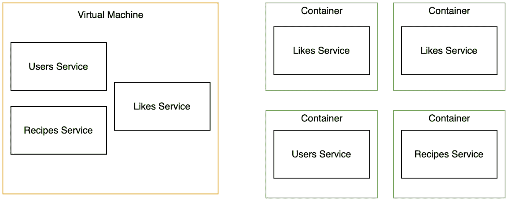
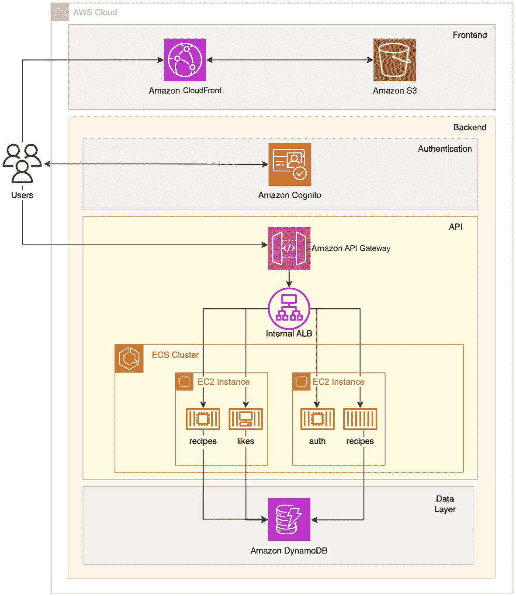
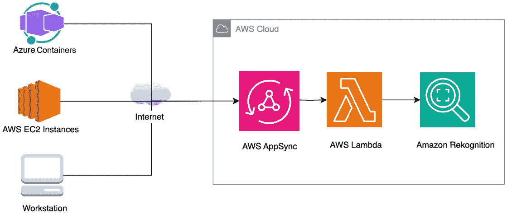
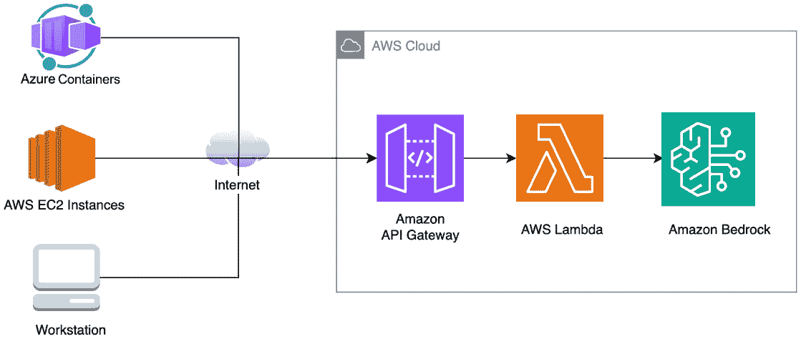
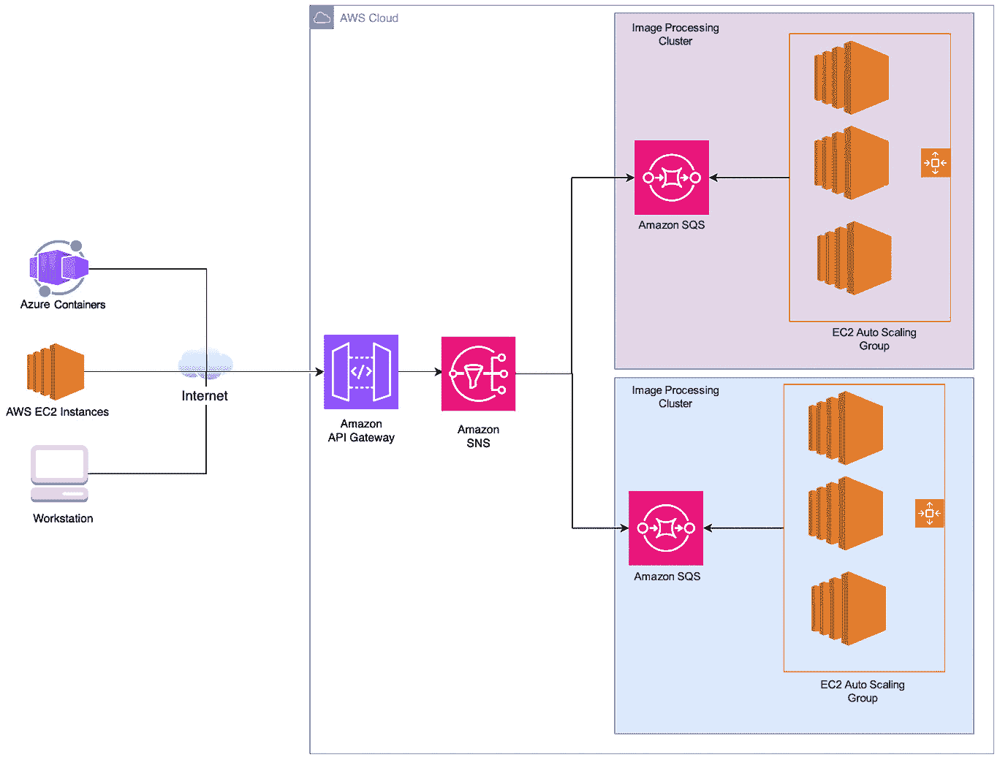
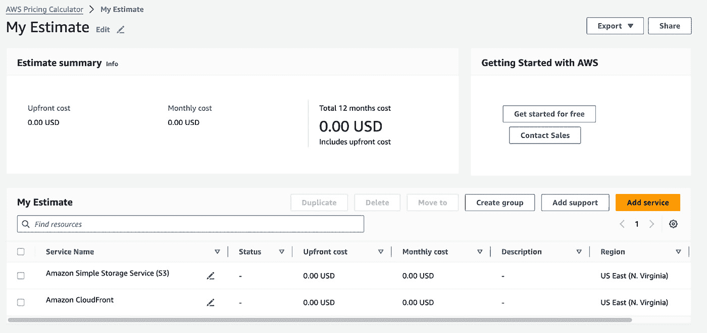
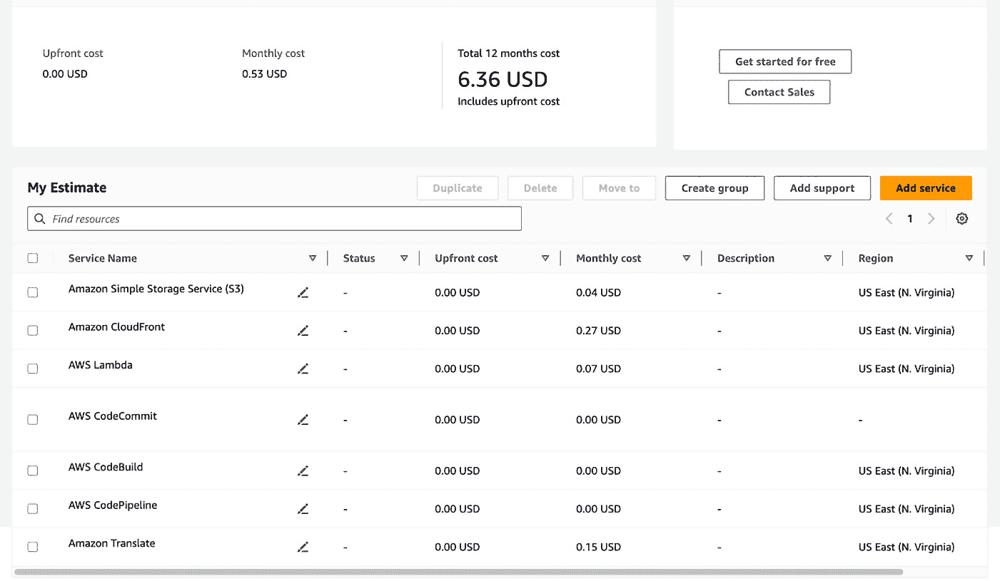
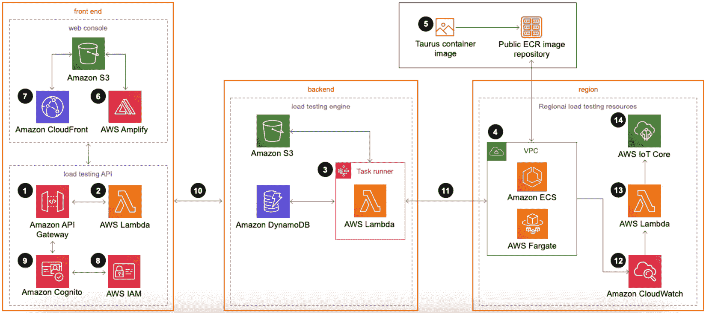

# 第十章：<st c="0">9</st>

# <st c="2">探索未来工作</st>

<st c="23">恭喜！</st> <st c="41">您已经使用多个 AWS 服务构建了七个独特的应用程序。</st> <st c="111">但是，学习是一个</st> <st c="142">永无止境的旅程。</st>

<st c="153">在本章基于理论的章节中，您将进一步了解更多关于 AWS 服务的内容。</st> <st c="237">架构是关于权衡的；了解什么时机使用哪些服务将在未来变得更加有利。</st> <st c="341">为了说明这一点，我们将重新审视前面章节的架构并</st> <st c="422">对其进行重新设计。</st>

<st c="436">价格是您在本书的需求收集和服务选择部分中看到的一个重点。</st> <st c="564">在本章中，您将学习如何使用 AWS 定价计算器来估算成本，以便在构建</st> <st c="668">架构之前进行预估。</st>

<st c="687">最后，您将探索 AWS 提供的多个不同资源，以帮助您架构和构建</st> <st c="799">更好的应用程序。</st>

# <st c="819">技术要求</st>

<st c="842">这是一个基于理论的章节，因此没有技术要求。</st> <st c="933">如果您决定根据本章的学习内容重新设计任何前面章节的架构，您将需要自己的</st> <st c="1067">AWS 账户。</st>

# <st c="1079">AWS 服务概览</st>

<st c="1101">AWS 目前提供</st> <st c="1123">超过 200 种服务，涵盖多个类别，包括计算、存储、数据库、网络、分析、机器学习、</st> **<st c="1253">物联网</st>** <st c="1272">(</st>**<st c="1273">IoT</st>**<st c="1276">)、移动、开发者</st> <st c="1297">工具、管理工具、安全性和企业应用程序。</st> <st c="1362">AWS 服务的确切数量会随着新服务的推出而变化。</st> <st c="1439">在过去的八章中，您已经学习了一些这些服务，并使用它们构建了多个应用程序。</st> <st c="1550">使用它们。</st>

<st c="1561">解决方案架构的美妙之处在于，没有单一的答案或架构。</st> <st c="1650">这完全是关于权衡。</st> <st c="1678">您在前面章节中学到的应用程序可以通过不同的方式和服务来构建。</st> <st c="1795">在本节中，我们将研究使用您尚未</st> <st c="1920">见过的 AWS 服务来实现过去章节中应用程序的替代架构。</st>

## <st c="1929">容器</st>

<st c="1940">容器</st> <st c="1952">是</st> <st c="1955">轻量级的虚拟化计算环境，允许您将应用程序及其依赖项打包并以隔离和可移植的方式运行。</st> <st c="2114">容器设计上非常轻量和高效，因为它们共享主机操作系统内核，不像传统的</st> **<st c="2238">虚拟机</st>** <st c="2254">(</st>**<st c="2256">VMs</st>**<st c="2259">)，后者为每个实例需要单独的操作系统。</st> <st c="2269">容器是一种计算选项，类似于</st> <st c="2330">虚拟机。</st>

<st c="2379">重要提示</st>

<st c="2394">您已经在</st> *<st c="2426">第六章</st>*<st c="2435">中使用过容器；CodePipeline 使用容器在</st> <st c="2495">每个阶段运行指令。</st>

<st c="2506">由于容器是轻量级的，最佳实践是将不同的功能隔离到不同的容器中，如</st> *<st c="2632">图 9</st>**<st c="2640">.1</st>*<st c="2642">所示，其中一个虚拟机变成了四个容器。</st> <st c="2686">一个单一的服务可以跨多个容器进行拆分。</st> <st c="2748">请注意，</st> **<st c="2759">点赞服务</st>** <st c="2772">分布在两个容器中，而在</st> **<st c="2808">虚拟机</st>** <st c="2823">环境中，只有一个容器。</st> <st c="2865">容器为您提供了</st> <st c="2885">更多的灵活性。</st>



<st c="3061">图 9.1 – 虚拟机与容器分解</st>

<st c="3107">随着容器构建的应用程序变得越来越复杂，跨多个容器和主机的协调变得至关重要；因此，容器编排对于高效的管理和扩展非常重要。</st> <st c="3298">容器编排平台提供了一个集中控制平面和 API，以简化容器化应用程序的部署、扩展和管理。</st> <st c="3432">容器化应用程序。</st>

<st c="3459">在 AWS 中，最常见的容器编排平台是</st> <st c="3522">以下几种：</st>

+   **<st c="3536">Amazon Elastic Container Service (ECS)</st>**<st c="3575">：一项完全托管的容器编排服务，帮助您在 EC2 实例或 Fargate 实例的集群中部署、管理和扩展容器化应用程序。</st> <st c="3617">它支持 Docker 容器，并允许您以大规模运行和管理容器。</st> <st c="3750">它支持 Docker 容器，允许您大规模运行和管理容器。</st>

+   **<st c="3833">Amazon 弹性 Kubernetes 服务（EKS）</st>**<st c="3873">：一种托管的 Kubernetes 服务，</st> <st c="3909">简化了在 AWS 上使用 Kubernetes 部署、管理和扩展容器化应用程序的过程。</st> <st c="4016">Kubernetes 是一个开源的容器编排平台，能够自动化容器化应用程序的部署、扩展和管理。</st> <st c="4136">容器化应用程序。</st>

<st c="4163">你可以将</st> <st c="4179">过去章节中的计算选项替换为容器。</st> <st c="4234">在</st> *<st c="4276">第四章</st>* <st c="4285">中介绍的无服务器架构，使用 ECS 在 EC2 环境中编排的容器，效果如</st> *<st c="4362">图 9</st>**<st c="4370">.2</st>*<st c="4372">。你将像</st> `<st c="4415">put_like</st>` <st c="4423">或</st> `<st c="4427">get_recipes</st>` <st c="4438">这样的 Lambda 函数替换为承载相同功能的容器。</st> <st c="4488">你的 API 网关使用私有集成连接到一个</st> <st c="4547">内部</st> **<st c="4557">应用负载均衡器（ALB）</st>** <st c="4588">，该负载均衡器公开 ECS 任务。</st> <st c="4613">你需要使用私有集成，因为负载均衡器和 ECS 容器位于 VPC 中，而 API 网关则不在其中。</st> <st c="4740">你可以在 AWS</st> <st c="4796">文档中阅读更多关于私有集成的内容：</st> [<st c="4811">https://docs.aws.amazon.com/apigateway/latest/developerguide/getting-started-with-private-integration.html</st>](https://docs.aws.amazon.com/apigateway/latest/developerguide/getting-started-with-private-integration.html)<st c="4917">。</st>



<st c="5144">图 9.2 – 使用容器重新设计的第四章架构</st>

<st c="5210">如你所见</st> <st c="5222">，*<st c="5230">图 9</st>**<st c="5238">.2</st>*<st c="5240">，容器仍然可以在虚拟机中运行， 在这种情况下是 EC2\。</st> <st c="5294">你</st> <st c="5297">也可以使用 Fargate 以无服务器方式运行容器。</st> <st c="5360">Fargate 是一种无服务器计算引擎，专为容器设计，允许你在无需管理底层 EC2 实例的情况下运行容器。</st> <st c="5503">它与 ECS 和 EKS 无缝配合，消除了</st> <st c="5557">提供和</st> <st c="5584">管理服务器</st> <st c="5599">或集群的需求。</st>

## <st c="5611">其他 API 类型</st>

<st c="5627">在本书中，你</st> <st c="5645">只构建了 REST API。</st> <st c="5668">然而，还有其他类型的 API 不是 RESTful 的。</st> <st c="5729">一个非常流行的例子</st> <st c="5752">是 GraphQL。</st>

<st c="5763">GraphQL 是一种查询语言和服务器端运行时环境，最初由 Facebook 于 2012 年开发。</st> <st c="5868">它提供了一种高效、强大且灵活的方法来构建和使用 API，并且在云应用中越来越受欢迎。</st> <st c="6026">它之所以如此受欢迎，是因为它解决了传统 REST API 中常见的两个问题：超取（获取比实际需要更多的数据）和欠取（需要多次请求以获取相关数据）。</st> <st c="6255">这些问题在传统的 REST API 中比较常见。</st>

<st c="6265">需要牢记一些重要特点：</st> <st c="6315"></st>

+   <st c="6323">GraphQL 通常会为数据查询暴露一个单一端点，而不是为不同资源设置多个端点。</st> <st c="6449">这简化了 API 接口，并使得 API 的演变变得更加容易</st> <st c="6519">随时间推移。</st>

+   <st c="6529">它使用一种强类型查询语言，允许客户端仅请求所需的数据。</st> <st c="6645">这与传统的 REST API 不同，后者通常返回超过客户端需求的数据</st> <st c="6737">量。</st>

+   <st c="6750">使用 GraphQL，客户端对接收到的数据有更多控制，从而实现更好的性能和灵活性。</st> <st c="6869">它具有</st> <st c="6878">客户端驱动的架构。</st>

+   <st c="6905">GraphQL API 是围绕一个模式构建的，定义了类型、查询、变更以及不同数据实体之间的关系。</st> <st c="7040">该模式充当客户端和服务器之间的契约，确保数据一致性，并使得</st> <st c="7141">强大的工具能够发挥作用。</st>

<st c="7158">在 AWS 中，AppSync 是一个托管服务，使得构建可扩展的 GraphQL API 变得更加容易。</st> <st c="7247">AppSync 通过处理底层基础设施、扩展和安全方面的工作，简化了构建 GraphQL API 的过程，让开发人员能够专注于构建应用逻辑；这与 API 网关为</st> <st c="7492">REST API 所做的工作类似。</st>

*<st c="7502">第五章</st>**<st c="7512">'s</st>* <st c="7515">架构使用 AWS AppSync 重新设计的方式相似，如</st> *<st c="7583">图 9</st>**<st c="7591">.3</st>*<st c="7593">所示。你将 API 网关替换为 AppSync，并使用</st> <st c="7644">Lambda 解析器。</st>



<st c="7772">图 9.3 – 使用 AWS AppSync 重新设计的第五章架构</st>

<st c="7839">您的客户与该应用程序的交互方式有所不同。</st> <st c="7906">您仍然可以使用 curl 或 Postman，但需要</st> <st c="7952">将查询发送到负载中。</st> <st c="7987">AWS 的文档对此有详细说明：</st> <st c="8022">文档链接：</st> [<st c="8037">https://docs.aws.amazon.com/appsync/latest/devguide/retrieve-data-with-graphql-query.html</st>](https://docs.aws.amazon.com/appsync/latest/devguide/retrieve-data-with-graphql-query.html)<st c="8126">。</st>

## <st c="8127">生成式 AI</st>

<st c="8141">您已经在本书中看到了</st> <st c="8155">不同的 AI 驱动的应用程序：</st> <st c="8206">第五章中的图像分析，</st> *<st c="8230">第五章</st>*<st c="8239">，第六章中的内容翻译，</st> *<st c="8264">第六章</st>*<st c="8273">，以及第七章中的问答。</st> *<st c="8286">第七章</st>*<st c="8295">。但还有一种 AI 正在席卷全球：</st> <st c="8364">生成式 AI。</st>

<st c="8378">生成式 AI 指的是一类能够基于训练数据生成新数据（如文本、图像、音频或其他多媒体内容）的 AI 模型和技术。</st> <st c="8575">与传统的主要关注分析或分类现有数据的 AI 模型不同，生成式 AI 模型学习训练数据的潜在模式和特征，并利用这些知识创造新的、</st> <st c="8798">原创内容。</st>

**<st c="8815">基础模型</st>** <st c="8833">(</st>**<st c="8835">FM</st>**<st c="8838">) 是一种强大的生成式 AI 模型，可用于各种任务。</st> <st c="8928">不同的公司已经构建了自己的模型，如 OpenAI GPT、Anthropic Claude 和</st> <st c="9019">Meta Llama。</st>

<st c="9030">您无需从零开始构建这些模型，但您应该知道如何充分利用它们。</st>

<st c="9147">在 AWS 中，您可以通过使用 Amazon Bedrock 以无服务器的方式利用 FMs。</st> <st c="9225">Amazon Bedrock 是一项完全托管的服务，提供来自领先 AI 公司（如 AI21 Labs、Anthropic、Cohere、Meta、Mistral AI、Stability AI 和 Amazon）的高性能 FMs，您可以通过单一 API 获取，并提供构建生成式</st> <st c="9504">AI 应用程序所需的广泛功能。</st>

<st c="9520">您所需要做的只是调用一个 API，就像使用其他任何类型的 AWS 服务一样。</st> *<st c="9610">第五章</st>*<st c="9619">的架构</st> <st c="9635">可以修改为使用 Bedrock 和 Claude 3</st> <st c="9682">Sonnet，而不是 Rekognition，如</st> *<st c="9726">图 9</st>**<st c="9734">.4</st>*<st c="9736">所示。</st>



<st c="9856">图 9.4 –</st> <st c="9869">第五章</st><st c="9878">的架构使用 Amazon Bedrock 重新设计</st>

<st c="9927">采用这种方法，你可以发送图像并用自然语言向模型提问。</st> <st c="10020">例如，你可能会问：“这个人是在微笑吗？”</st> <st c="10074">或者“这张照片看起来专业吗？”</st> <st c="10115">你将这些信息与图像一起发送，并提示模型进行评估。</st> <st c="10196">以下是本书作者与 Claude 3 Sonnet 之间的互动示例。</st> <st c="10289">第一行以</st> `<st c="10319">[author]</st>`<st c="10327">为前缀，显示了提示，内容是一个带有附图的问题。</st> <st c="10400">在这种情况下，使用的图像与在</st> <st c="10459">第五章</st><st c="10468">中引用的图像相同：</st> `<st c="10478">goodphoto.jpeg</st>`

```
<st c="10492">[author]</st> is this a professional looking image – attached 
goodphoto.jpeg <st c="10565">[agent-Claude]</st> Yes, this image also appears to be a professional-looking headshot or portrait photograph. It depicts a man with a friendly, smiling expression and neatly groomed facial hair. The background is slightly blurred but seems to be an outdoor setting with a gray or cloudy sky behind him. The lighting is relatively soft and flattering on his face. While a bit more casual with the hooded jacket attire, the framing, expression, and overall quality suggest this was taken with care, likely by a professional photographer or for professional purposes like corporate headshots or a personal branding photo. The image has a polished, high-quality look fitting for professional use.
```

<st c="11253">生成式 AI 正被越来越多地应用于多种场景，如问答聊天机器人、文本摘要</st> <st c="11355">和生成营销</st> <st c="11387">内容。</st> <st c="11396">在构建下一个应用程序时，请记住这一点。</st>

## <st c="11448">其他通信模式</st>

<st c="11477">最常见的</st> <st c="11496">通信模式是同步请求/响应。</st> <st c="11552">例如，当你访问一个网页（请求）时，你的浏览器会获取并渲染结果（响应）。</st> <st c="11658">这个过程是同步的，意味着在发出请求后你需要等待响应。</st> <st c="11753">但是在现代分布式架构中，有时你会遇到需要不同通信模式的情况，例如在长时间处理任务中，当等待响应时阻塞客户端会干扰客户体验，或者当你需要将相同的内容传递给许多</st> <st c="12064">不同的接收者。</st>

<st c="12084">一些常见的模式包括异步处理、分发和广播，以及事件驱动。</st> <st c="12180">让我们从异步处理开始。</st> <st c="12206">异步处理</st>

### <st c="12230">异步处理</st>

<st c="12254">假设你需要</st> <st c="12275">构建一个</st> <st c="12283">应用程序，像在</st> *<st c="12313">第五章</st>*<st c="12322">中那样，它接收一张照片并进行处理。</st> <st c="12361">然而，处理的复杂度并不像在</st> *<st c="12420">第五章</st>*<st c="12429">中那样轻便。</st> <st c="12440">相反，它需要四小时才能完成，并且是由 EC2 机器完成的。</st> <st c="12501">在四小时内可能会发生许多事情：处理可能失败，客户端可能超时，等等。</st> <st c="12595">在这种情况下，解耦架构带来了</st> <st c="12639">多个优势：</st>

+   <st c="12659">客户端可以发送请求，而无需等待订阅者</st> <st c="12721">处理它们。</st>

+   <st c="12734">订阅者可以按</st> <st c="12777">自己的节奏消费消息。</st>

+   <st c="12786">如果订阅者端出现故障，另一个订阅者可以继续处理相同的请求。</st> <st c="12885">它不会简单地</st> <st c="12904">丢失。</st>

<st c="12912">实现异步处理的一种方式是使用队列。</st> <st c="12976">AWS 提供了亚马逊</st> **<st c="12991">简单队列服务</st>** <st c="13011">(</st>**<st c="13013">SQS</st>**<st c="13016">)，这是一个</st> <st c="13021">完全托管的分布式消息</st> <st c="13056">队列服务。</st>

<st c="13072">来自</st> *<st c="13095">第五章</st>* <st c="13104">的架构可以更新为支持异步处理，如</st> *<st c="13168">图 9</st>**<st c="13176">.5</st>*<st c="13178">所示。消息存储在 SQS 中，EC2 集群订阅了 SQS 进行消息处理。</st> <st c="13270">每条消息只会</st> <st c="13291">被处理一次。</st>


<st c="13435">图 9.5 – 使用异步处理和 SQS 与 EC2 重新设计的第五章架构</st>

<st c="13531">请注意</st> <st c="13542">该</st> <st c="13547">架构并未考虑客户端如何接收任务</st> <st c="13629">完成的通知。</st>

### <st c="13647">Fan-out 和广播</st>

<st c="13672">当你需要将单条消息发送到多个端点时，使用 Fan-out。</st> <st c="13769">广播应用相同的概念，但将消息发送到所有端点，而不仅仅是选择的那些。</st> <st c="13882">假设你有一本电话簿：fan-out 就像是逐一发送消息给每个人，而广播就像是创建一个群聊并将消息发送给群里的所有人。</st> <st c="14071">这种方法在通知系统、数据复制或同步任务中很常见，且在</st> <st c="14167">事件驱动架构中也经常使用。</st>

<st c="14194">在 AWS 中，有一个 Amazon</st> **<st c="14219">简单通知服务</st>** <st c="14246">(</st>**<st c="14248">SNS</st>**<st c="14251">)。</st> <st c="14255">它是一个完全托管的发布/订阅消息</st> <st c="14294">服务。</st> <st c="14304">与 SQS 不同，它允许将一条消息发送到多个消费者。</st> <st c="14386">它采用基于推送的机制，而不是像 SQS 那样基于拉取的机制。</st>

<st c="14457">考虑到之前的异步处理场景，这次你需要处理同一提交的图像两次，并且你有两个不同的计算集群来处理它。</st> <st c="14637">使用 SQS，消息只会被处理一次。</st> *<st c="14681">图 9</st>**<st c="14689">.6</st>* <st c="14691">展示了如何使用 SNS 和 SQS 在扇出配置中实现这一目标。</st> <st c="14767">当 SNS 被触发时，它会复制接收到的消息并将其发送到两个 SQS 队列。</st> <st c="14861">然后，两个计算集群中的每一个会轮询各自的 SQS 队列并处理</st> <st c="14944">消息。</st>



<st c="15126">图 9.6 – 使用扇出模式将相同消息分发到两个不同计算集群的架构</st>

<st c="15242">最后，让我们</st> <st c="15257">看看</st> <st c="15270">事件驱动模式。</st>

### <st c="15291">事件驱动</st>

<st c="15304">事件驱动</st> <st c="15317">指的是一种编程</st> <st c="15341">范式或架构模式，在这种模式下，程序的流程由事件决定。</st> <st c="15429">在事件驱动系统中，程序的执行路径是由特定事件的发生触发的，而不是按照预定义的顺序执行指令。</st> <st c="15604">事件可以由各种来源生成，例如用户交互（如点击或按键）、系统通知（如文件变化或网络事件）、硬件中断（如定时器或传感器数据）或来自其他组件</st> <st c="15853">或系统的消息。</st>

<st c="15864">AWS 中的所有服务都会生成事件。</st> <st c="15902">你可以使用 AWS EventBridge（前身为 Amazon CloudWatch Events）基于这些事件采取相应的行动。</st> <st c="16005">它是一个无服务器的事件</st> <st c="16030">总线服务。</st>

<st c="16042">事件驱动架构的一个常见示例如下：一个客户端将文件上传到你的 S3 桶，触发一个事件。</st> <st c="16180">基于这个事件，你触发一个处理流水线来处理</st> <st c="16243">上传的文件。</st>

<st c="16257">所有这些主题都很广泛，但都有充分的文档。</st> <st c="16305">熟悉这些内容。</st> <st c="16337">如果你想深入了解，推荐阅读 AWS 白皮书</st> *<st c="16411">在 AWS 上实现微服务</st>* *<st c="16441">的通信机制</st>*<st c="16444">：</st> [<st c="16447">https://docs.aws.amazon.com/whitepapers/latest/microservices-on-aws/communication-mechanisms.html</st>](https://docs.aws.amazon.com/whitepapers/latest/microservices-on-aws/communication-mechanisms.html)<st c="16544">。</st>

# <st c="16545">AWS 定价计算器</st>

<st c="16568">在构建</st> <st c="16585">架构之前，了解它是否符合你的成本要求是很重要的。</st> <st c="16668">同时，比较不同的</st> <st c="16710">服务选项也很重要。</st>

<st c="16726">有多种方式可以实现这一目标，例如，使用 AWS 服务的定价页面。</st> <st c="16819">然而，AWS 定价计算器是推荐的方式。</st> <st c="16878">它允许你通过逐个添加每个服务来创建 AWS 使用成本的估算。</st>

<st c="16998">访问</st> [<st c="17011">https://calculator.aws/</st>](https://calculator.aws/) <st c="17034">并创建一个估算。</st> <st c="17059">逐个添加每个服务并配置它。</st> <st c="17107">配置参数因服务而异。</st> <st c="17156">结果将是每月和</st> <st c="17207">每年的成本估算。</st>

## <st c="17220">对第二章中的解决方案进行定价</st>

<st c="17256">重新审视</st> *<st c="17265">第二章</st>* <st c="17274">并回顾在</st> *<st c="17315">图 2</st>**<st c="17323">.1</st>*<st c="17325">中描绘的架构。</st> 它使用了两个服务：CloudFront 和 S3\。 <st c="17368">CloudWatch 基本监控指标是免费的。</st> <st c="17414">在 AWS</st> <st c="17448">定价计算器中重新创建此架构。</st>

<st c="17467">将 S3 添加到你的估算中。</st> <st c="17493">指定你计划使用的区域；定价可能会因区域而异。</st> <st c="17560">要估算 S3 成本，你需要知道每月将使用多少 GB 的存储空间，所需的请求数量和类型，以及</st> <st c="17670">数据传输量</st> **<st c="17684">（DTO）</st>** <st c="17701">的 GB/月。</st>

<st c="17721">要存储来自</st> <st c="17760">第二章</st> <st c="17769">的三个网站文件 –</st> `<st c="17772">index.html</st>`<st c="17782">，</st> `<st c="17784">index.css</st>`<st c="17793">，和</st> `<st c="17799">avatar.png</st>`<st c="17809">，你需要 100 KB。</st> <st c="17828">100 KB 等于 0.0001 GB。</st> <st c="17849">如果你修改了文件，请检查</st> <st c="17898">文件的大小。</st>

<st c="17909">CloudFront 主要</st> <st c="17933">会向你的 S3 发出 GET 请求。</st> <st c="17963">由于</st> *<st c="17969">第二章</st>*<st c="17978">的项目是一个展示个人简历的网站，你预计每月不会超过 500 次浏览。</st> <st c="18074">因此，你预计会有 500 次 GET 请求</st> <st c="18112">到 S3。</st>

<st c="18118">关于 DTO，选择 CloudFront 作为目标。</st> <st c="18172">这使得</st> <st c="18183">DTO 免费。</st>

<st c="18192">接下来，添加第二个服务，CloudFront。</st> <st c="18235">在用户访问你的网站的区域，输入每月预期的请求次数和 DTO 的数量。</st> <st c="18361">请求次数的计算方法与 S3 请求相同。</st> <st c="18428">由于这是一个简单的展示个人简历的网站，你估计每月会有 500 次请求。</st> <st c="18514">对于 DTO，计算 500 次请求乘以你文件的大小。</st> <st c="18571">网站文件总大小大约为 100 KB，折算下来大约是</st> <st c="18649">0.05 GB。</st>

<st c="18657">尽管这两个服务都有免费层，但计算器不会自动考虑这一点。</st> <st c="18756">对于大多数 AWS 服务，你需要确定免费层提供的内容，并在输入到计算器之前从你的值中减去这些内容。</st> <st c="18902">例如，S3 的免费层包括 20,000 次 GET 请求。</st> <st c="18962">如果你预计项目需要 40,000 次 GET 请求，你应该只输入 20,000 次 GET 请求到</st> <st c="19065">计算器中。</st>

<st c="19080">对于</st> *<st c="19085">第二章</st>*<st c="19094">，最终的计算器输出是 0 美元，无论你是否减去免费层，如</st> *<st c="19193">图 9</st>**<st c="19201">.7</st>*<st c="19203">所示。这是因为项目的规模</st> <st c="19244">非常小。</st>



<st c="19779">图 9.7 – 第二章项目的 AWS 定价计算器</st>

<st c="19838">本章的非功能需求之一是低成本。</st> <st c="19909">你无疑达成了这个目标。</st> <st c="19942">使用计算器来了解当静态网站拥有数千或数百万用户时，成本如何上升。</st>

## <st c="20053">定价第六章中的解决方案</st>

<st c="20089">请回顾</st> *<st c="20098">第六章</st>*<st c="20107">。使用</st> <st c="20113">AWS 定价计算器计算此解决方案的定价。</st> <st c="20180">从架构的静态网站托管部分开始，包括 S3 存储桶和</st> <st c="20282">CloudFront 分发。</st>

<st c="20306">添加 S3\。</st> <st c="20315">来自</st> *<st c="20338">第六章</st>*<st c="20347">的网站文件</st>，`<st c="20349">index.html</st>` <st c="20359">和</st> `<st c="20364">index.css</st>`<st c="20373">，每个文件大小都小于 10 KB。</st> <st c="20409">由于这些文件存储在两个不同的 S3 存储桶中，因此总存储需求为 20 KB，或 0.00002 GB。</st> <st c="20519">这是一个事件网站，预计每月约 100,000 次访问。</st> <st c="20592">就 S3 而言，这意味着</st> <st c="20627">100,000 次请求。</st>

<st c="20644">对于 CloudFront，它也有 100,000 次请求，总计 2 GB DTO。</st> <st c="20716">然而，CloudFront 还使用 Lambda@Edge。</st> <st c="20759">添加 Lambda。</st> <st c="20771">此服务允许包含或排除免费层。</st> <st c="20828">添加相同的 100,000 次请求，使用最小内存，128 MB，并假设执行时间为 10 毫秒。</st>

<st c="20935">现在，您已经完成了静态网站架构。</st> <st c="20993">您的计算器应该输出大约每月 0.40 美元。</st> <st c="21049">然而，如果您深入了解每项服务的费用，您会发现大部分费用来自 CloudFront。</st> <st c="21157">计算器没有包括此服务的免费层，就像它没有包括 Lambda 一样。</st> <st c="21239">CloudFront 的免费层包括</st> <st c="21273">以下内容：</st>

+   <st c="21287">每月 1 TB DTO 到互联网</st> <st c="21316">每月</st>

+   <st c="21325">每月 10,000,000 次 HTTP 或 HTTPS 请求</st> <st c="21360">每月</st>

<st c="21369">因此，这个架构在我们解决方案的规模下几乎是免费的。</st> <st c="21444">您的费用将低于每月 0.10 美元。</st> <st c="21483">每月。</st>

<st c="21491">启动另一个计算器，或在相同计算器中添加来自</st> *<st c="21573">第六章</st>*<st c="21582">的 CI/CD 组件：</st> CodeBuild、CodePipeline 和<st c="21614">Amazon Translate。</st>

<st c="21631">添加 CodeCommit。</st> <st c="21648">它将询问活跃用户的数量。</st> <st c="21692">在您的情况下，只有一个活跃</st> <st c="21731">用户：您。</st>

<st c="21741">添加 CodeBuild。</st> <st c="21757">在</st> *<st c="21760">第六章</st>*<st c="21769">中，我们描述了使用 2 GB 按需 Lambda 进行计算。</st> <st c="21831">假设您每周至少进行一次更改；每次更改的运行时间为</st> <st c="21889">10 秒。</st>

<st c="21900">添加 CodePipeline。</st> <st c="21919">您为</st> <st c="21950">此项目拥有一个单独的管道。</st>

<st c="21963">最后，添加 Amazon</st> <st c="21983">Translate。</st> <st c="21994">选择</st> `<st c="22045">index.html</st>` <st c="22055">有超过 2400 个字符。</st> <st c="22083">如果你每月将其翻译四次为一种语言，那么每月大约翻译 10,000 个字符。</st> <st c="22188">每月。</st>

*<st c="22198">图 9</st>**<st c="22207">.8</st>* <st c="22209">显示了该项目的计算器。</st> <st c="22248">S3 和 CloudFront 的费用将由服务的免费套餐免除。</st> <st c="22316">Amazon Translate 没有实时文档翻译的免费套餐，而 AWS Lambda 计算器已经包括了免费套餐。</st> <st c="22457">结果是每月 0.22 美元，或每年 2.64 美元。</st> <st c="22503">每年。</st>



<st c="23267">图 9.8 – 第六章项目的 AWS 定价计算器</st>

<st c="23326">将这些估算更改为与你构建的项目相符。</st> <st c="23386">例如，如果你正在将网站翻译成多种语言，你需要调整 Amazon Translate 的费用。</st> <st c="23507">如果</st> <st c="23509">你每周更改的次数超过一次，则需要调整 CodeBuild 的执行次数。</st> <st c="23621">如果你使用的是 AWS 以外的任何组件，例如 GitHub，如在</st> *<st c="23692">第六章</st>*<st c="23701">所示，</st> <st c="23726">则需要将这些费用添加到最终计算器中。</st>

<st c="23743">重要提示</st>

<st c="23758">你可以将估算结果导出为 JSON、PDF 或 CSV 格式。</st> <st c="23813">你还可以分享计算器的链接。</st> <st c="23859">这对于与同事</st> <st c="23921">和客户共享架构非常有帮助。</st>

<st c="23935">当你进行定价估算时，你需要估算项目的容量和某些特征，例如预期的请求数量。</st> <st c="24092">大多数时候，你不需要估算个位数或两位数的单位。</st> <st c="24169">使用整数进行计算更为简单；例如，不要使用 87 KB，而使用 100 KB。</st> <st c="24255">不要使用每秒 1 次请求（即每天 86,000 次请求），而使用每天 100,000 次请求。</st> <st c="24352">这种方法通常被称为“简易估算”，并且在</st> <st c="24443">构建架构时广泛应用。</st>

<st c="24466">实践成就</st> <st c="24482">完美；通过为本书中的所有项目创建计算器来进行练习。</st> <st c="24548">本书中的所有项目。</st>

# <st c="24558">AWS re:Post</st>

<st c="24570">如果你能在遇到开发或架构疑问时，向其他专家提问关于错误的问题，那该多好呢？</st> <st c="24595">你可以。</st>

<st c="24704">AWS re:Post 是一个由 AWS 创建的官方知识中心文章、视频及其他资源的知识库，旨在帮助客户更好地理解和使用 AWS 服务。</st> <st c="24873">但是，re:Post 也允许你发布自己的问题。</st>

<st c="24928">访问</st> [<st c="24935">https://repost.aws</st>](https://repost.aws) <st c="24953">并导航至你选择的主题。</st> <st c="24994">你将看到成百上千的问题，许多问题已由 AWS 专业人员或其他用户回答。</st> <st c="25081">这是一个获取帮助、与他人合作以及让你的知识和工作在更广泛的行业中可见的绝佳资源。</st>

<st c="25222">然而，如前所述，re:Post 不仅仅是一个技术论坛。</st> <st c="25286">AWS re:Post 包括官方的 AWS 知识中心，</st> [<st c="25342">https://repost.aws/knowledge-center</st>](https://repost.aws/knowledge-center)<st c="25377">，这是一个涵盖 AWS 客户最常见问题和请求的知识库。</st> <st c="25485">简而言之，AWS 会识别出经常被问到的问题，并将其转化为文章。</st> <st c="25569">你在构建应用程序时遇到的许多错误，如果不是全部，都会在这里有针对性的解决方案。</st> <st c="25666">解决方案在这里。</st>

<st c="25680">一些有用的示例如下：</st>

+   *<st c="25717">如何创建并激活一个新的 AWS</st>* *<st c="25757">账户？</st>*<st c="25765">:</st> [<st c="25768">https://repost.aws/knowledge-center/create-and-activate-aws-account</st>](https://repost.aws/knowledge-center/create-and-activate-aws-account)

+   *<st c="25835">如何排查 API</st>* *<st c="25883">网关的 HTTP 403 错误？</st>*<st c="25891">:</st> [<st c="25894">https://repost.aws/knowledge-center/api-gateway-troubleshoot-403-forbidden</st>](https://repost.aws/knowledge-center/api-gateway-troubleshoot-403-forbidden)

+   *<st c="25968">如何终止我在 AWS</st>* *<st c="26037">账户上不再需要的活动资源？</st>*<st c="26045">:</st> [<st c="26048">https://repost.aws/knowledge-center/terminate-resources-account-closure</st>](https://repost.aws/knowledge-center/terminate-resources-account-closure)

<st c="26119">最后，不仅仅是 AWS 的员工，其他人也可以与他人分享具有指导性的建议。</st> <st c="26208">他们可以通过社区文章来分享这些建议，</st> [<st c="26253">https://repost.aws/articles</st>](https://repost.aws/articles)<st c="26280">。作为练习，写一篇你在阅读本书时学到的内容，并将其作为社区文章分享</st> <st c="26307">到 re:Post 上。</st>

# <st c="26419">AWS 文档、解决方案库和指导性建议</st>

<st c="26482">了解一切的知识可能不如知道在哪里可以找到所需信息重要。</st> <st c="26582">如果你需要某些信息，这一点尤其重要。</st>

<st c="26590">在本书中，你已经访问过 AWS 文档、AWS 架构中心等多个页面。</st> <st c="26716">了解可用的多种选项非常重要。</st> <st c="26790">在本节中，你将深入了解三种具体选项：AWS 文档、AWS 解决方案库和 AWS</st> <st c="26898">指导性建议。</st>

## <st c="26920">AWS 文档</st>

<st c="26938">AWS 上的每项服务</st> <st c="26953">都有详尽的官方文档。</st> <st c="26998">除此之外，还有如</st> [<st c="27056">medium.com</st>](http://medium.com)<st c="27066">、社区文章、本书本身</st> <st c="27104">等非官方文档。</st>

<st c="27115">在本书中，你已经访问过多个文档页面。</st> <st c="27184">然而，值得特别强调的是几个</st> <st c="27234">文档页面：</st>

+   <st c="27254">AWS</st> <st c="27259">常见问题：</st> [<st c="27265">https://aws.amazon.com/faqs/</st>](https://aws.amazon.com/faqs/)

+   <st c="27293">AWS 技术</st> <st c="27308">文档：</st> [<st c="27323">https://docs.aws.amazon.com/</st>](https://docs.aws.amazon.com/)

+   <st c="27351">AWS</st> <st c="27356">博客：</st> [<st c="27362">https://aws.amazon.com/blogs/</st>](https://aws.amazon.com/blogs/)

+   <st c="27391">AWS 新动态：</st> <st c="27408">AWS?</st>：[<st c="27414">https://aws.amazon.com/new/</st>](https://aws.amazon.com/new/)

+   <st c="27441">AWS 技能</st> <st c="27452">Builder：</st> [<st c="27461">https://explore.skillbuilder.aws/learn</st>](https://explore.skillbuilder.aws/learn)

<st c="27499">熟悉这些资源，以便在需要时能够找到它们。</st>

## <st c="27593">AWS 解决方案库</st>

<st c="27615">AWS 架构中心</st> <st c="27636">是你在每章定义项目需求后最初的搜索引擎。</st> <st c="27734">这是一个一站式的目的地，允许你浏览、搜索，甚至请求参考架构、架构模式、最佳实践和指导性建议，所有这些都可以在</st> <st c="27918">一个地方找到。</st>

<st c="27931">但是，如果你正在寻找经过他人预构建、测试和验证的内容，并且附带如 CloudFormation 这样的 IaC 模板，AWS 解决方案库（</st>[<st c="28093">https://aws.amazon.com/solutions/</st>](https://aws.amazon.com/solutions/)<st c="28127">）是理想之地。</st> <st c="28150">该库还包括 AWS</st> <st c="28180">合作伙伴解决方案。</st>

<st c="28198">让我们为项目添加一个新需求，来自于</st> *<st c="28247">第六章</st>*<st c="28256">。公司要求在部署活动网站之前进行广泛的负载测试，以确保它能够承受</st> <st c="28364">高负载。</st>

如果您不是负载测试方面的专家，请搜索并导航到 *<st c="28446">AWS 上的分布式负载测试</st>* 在解决方案库中：[<st c="28500">https://aws.amazon.com/solutions/implementations/distributed-load-testing-on-aws/?did=sl_card&trk=sl_card</st>](https://aws.amazon.com/solutions/implementations/distributed-load-testing-on-aws/?did=sl_card&trk=sl_card)。

这是一个典型的解决方案库文档。在其中，您将找到三个组件：

+   一个架构图

+   一个实施指南

+   一键部署选项

如图 *<st c="28818">图 9</st>**<st c="28826">.9</st>* 所示，此架构图以逐步方式展示了流程。



图 9.9 – 分布式负载测试架构

实施指南，[<st c="29204">https://docs.aws.amazon.com/solutions/latest/distributed-load-testing-on-aws/solution-overview.html</st>](https://docs.aws.amazon.com/solutions/latest/distributed-load-testing-on-aws/solution-overview.html)，深入介绍了该解决方案的工作原理，包括监控和故障排除信息。另请注意，实施指南中有专门的部分用于估算成本。

最后，它包括一个一键部署选项，**<st c="29550">在 AWS 控制台中启动</st>**，您可以使用它进行部署并立即测试您的事件网站，而无需从头开始设计另一个项目。

## AWS 规范指导

**<st c="29730">AWS 规范指导</st>** (<st c="29758">APG</st>)（[<st c="29765">https://aws.amazon.com/prescriptive-guidance/</st>](https://aws.amazon.com/prescriptive-guidance/)）也可以在 AWS 架构中心找到，但它侧重于经过时间验证的策略、指南和模式，以帮助加速您的云迁移、现代化和优化项目。

与解决方案库不同，并非所有内容都具有实用性，也没有架构图和代码。

有三种类型的资源：

+   **<st c="30148">策略</st>**：云迁移和现代化的商业视角、方法论和框架，适用于 CxO 和高级经理。

+   **<st c="30283">指南</st>**<st c="30290">：为架构师、经理和</st> <st c="30416">技术负责人提供的规划和实施策略的指导，重点介绍最佳实践和工具。</st>

+   **<st c="30432">模式</st>**<st c="30441">：用于实现常见迁移、优化和现代化场景的步骤、架构、工具和代码，适用于构建者和其他</st> <st c="30583">实践用户。</st>

<st c="30598">当你刚开始时，模式是最有用的。</st> <st c="30656">它们详细描述了流行的</st> <st c="30676">服务配置。</st>

<st c="30699">在构建本书中的项目时，你已经部署了几个 CloudFront 分发。</st> <st c="30793">它们都像你期望的那样安全吗？</st> <st c="30832">你知道如何验证吗？</st> <st c="30864">你可以轻松地使用 APG 模式自动化这些</st> <st c="30893">验证类型</st> *<st c="30938">检查 Amazon CloudFront 分发的访问日志、HTTPS 和 TLS 版本</st>*<st c="31020">：</st> [<st c="31023">https://docs.aws.amazon.com/prescriptive-guidance/latest/patterns/check-an-amazon-cloudfront-distribution-for-access-logging-https-and-tls-version.html?did=pg_card&trk=pg_card</st>](https://docs.aws.amazon.com/prescriptive-guidance/latest/patterns/check-an-amazon-cloudfront-distribution-for-access-logging-https-and-tls-version.html?did=pg_card&trk=pg_card)<st c="31198">。它使用 Lambda 检查新的和已修改的 CloudFront 分发，确保其配置了 TLS 1.2、HTTPS 和</st> <st c="31290">日志记录配置。</st>

# <st c="31313">总结</st>

<st c="31321">在本章中，你了解了其他可以用于构建本书中不同示例项目的 AWS 服务。</st> <st c="31461">这表明架构更多的是关于权衡取舍，而非构建</st> <st c="31548">完美的解决方案。</st>

<st c="31565">你还了解了 AWS 定价计算器，以及它如何帮助你在构建项目之前估算成本。</st> <st c="31682">你为来自</st> *<st c="31734">第二章</st>* <st c="31744">和</st> *<st c="31749">第六章</st>*<st c="31750">的项目创建了定价估算。</st>

<st c="31751">最后，你探索了许多 AWS 的学习资源。</st> <st c="31806">其中一些可能是你之前没有接触过的，比如 AWS re:Posts，而另一些则属于现在已经熟悉的 AWS 架构中心，这是一个提供指导</st> <st c="31978">和资源的一站式平台。</st>

<st c="31992">AWS 服务、架构模式和技术种类繁多，无法在一本书中覆盖所有内容。</st> <st c="32092">但如果你了解基础知识，那应该能提升你所做的一切的水平。</st> <st c="32168">你所做的每件事都会有所提高。</st>

<st c="32175">恭喜你完成了这段充满实践项目和云计算知识的广泛旅程。</st> <st c="32280">虽然这本书已经结束，但这只是你 AWS</st> <st c="32355">云计算旅程的开始。</st>
