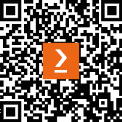

# 序言

迄今为止，Kubernetes 已发布超过 20 个版本，甚至在 2014 年首次出现几年后，仍然如火如荼。Kubernetes 与其他云原生技术一起，正在深刻重塑一些世界上最先进和最具进步性的公司中的 IT 格局。

根据**Linux 基金会**的**第十届年度开源职位报告**，云计算和容器被列为最受欢迎的技能类别。因此，精通 Kubernetes 和云原生技能对于提升你的职业生涯并在一些顶尖企业工作至关重要。获得 Kubernetes 和云原生认证助理资格可以帮助你脱颖而出，并证明你在该领域的能力。

本书将带你从零开始进行云原生之旅，教授 Kubernetes 的理论和实践方面。你将学习如何使用 Docker 构建、配置和运行容器；如何启动最小化的 Kubernetes 集群；如何使用 Kubernetes 部署、配置和管理容器化应用；如何使用 CI/CD 自动化软件交付，等等。你将打下坚实的基础，以便第一次尝试通过 KCNA 考试，并全面了解当今的行业标准。

本书分为五个部分：

1.  *云时代*

1.  *执行容器编排*

1.  *学习 Kubernetes 基础*

1.  *探索云原生*

1.  *KCNA 考试与下一步*

在第一部分，你将了解云原生计算，解释行业如何发展以及为什么现代应用程序通常运行在容器中。接下来，你将学习 Docker，并动手在本地运行容器。

在*第三部分*，最大的一部分，你将学习 Kubernetes：它的特性、架构、API 和组件。你将找到最佳实践、回顾问题以及大量的实践作业来支持你的学习旅程。在*第四部分*，我们将重点介绍云原生架构以及来自云原生生态系统的其他技术。我们将看到如何监控、观察和交付云原生应用。最后，在*第五部分*，你将找到模拟考试和 KCNA 考试通过技巧，以及一些关于获得认证后如何继续前进的建议。

# 本书适合谁

**Kubernetes 和云原生认证助理**（**KCNA**）是一个为有意通过展示对 Kubernetes 基础知识和技能的理解而晋升到专业级别的候选人设计的预备专业认证。

一名认证的 KCNA 将确认其对整个云原生生态系统的概念性知识，特别是 Kubernetes。KCNA 将展示候选人对 Kubernetes 和云原生技术的基本知识，包括如何使用基本的**kubectl**命令部署应用、Kubernetes 的架构、理解云原生的全貌和项目，以及了解云原生安全的基础知识。

无论是刚毕业的 IT 专业学生、开发人员、系统管理员，还是 DevOps 工程师，不论经验如何，任何对学习 Kubernetes 和云原生技术感兴趣的人都会觉得本书既实用又易于跟随。要求具备 IT 基础知识（Git）、操作系统以及命令行界面的基础，但无需具备 Kubernetes、Docker 或云原生技术的先前知识即可开始学习。

# 本书内容概述

*第一章*，*从云到云原生和 Kubernetes*，讲述了计算技术在过去 20 多年中的演变。它解释了云是什么，它是如何出现的，以及随着容器技术的引入，IT 环境如何发生了变化。你将学习到 IaaS、PaaS、SaaS 和 FaaS 等基础概念，并初步了解 Kubernetes。

*第二章*，*CNCF 和 Kubernetes 认证概述*，介绍了云原生计算基金会（CNCF）及其母组织——Linux 基金会。将分享这些基金会的背景、它们的起源，以及它们生态系统中的项目。这一章将讲解 CNCF 社区、治理结构、云角色和 Kubernetes 认证路径。

*第三章*，*容器入门*，对容器技术进行了更深入的探讨，深入了解容器技术及其生态系统，并介绍了常用的 Docker 工具。本章还包括实践任务。

*第四章*，*探索容器运行时、接口和服务网格*，带你更深入地探索容器运行时、网络和接口，并了解服务网格。你将学习容器如何通过网络相互通信，Kubernetes 中有哪些容器接口，并了解服务网格及其应用。

*第五章*，*使用 Kubernetes 编排容器*，开始覆盖 KCNA 认证中最重要且可能是最难的部分——*Kubernetes 基础*。你将了解 Kubernetes 的功能及架构基础，它的 API、组件，以及最小的可部署单元——Pod。实践部分包括通过 minikube 本地安装 Kubernetes。

*第六章*，*使用 Kubernetes 部署和扩展应用*，将进一步探索 Kubernetes 的功能和丰富的生态系统。本章概述了其他 Kubernetes 资源及其用途；讨论如何使用 Kubernetes 实现应用的自愈和扩展，如何使用 Kubernetes 服务发现，以及如何使用 Kubernetes 运行有状态的工作负载。更多的 Kubernetes 实践练习是本章的重要组成部分。

*第七章*，*使用 Kubernetes 进行应用部署和调试*，展示了如何控制工作负载在 Kubernetes 上的部署、调度器如何工作，以及如何调试在 K8s 上运行的应用程序。本章同时涉及了 Kubernetes 基础知识和 KCNA 考试的云原生可观察性领域的内容。

*第八章*，*遵循 Kubernetes 最佳实践*，讨论了 Kubernetes 的网络和流量控制的网络策略、使用基于角色的访问控制（RBAC）限制访问、将 Helm 作为 K8s 的包管理工具等。本部分的最后一章包括了一些实践练习。

*第九章*，*理解云原生架构*，更详细地探讨了云原生的各个方面。本章分享了云原生及其架构的核心概念。此章节还涵盖了 KCNA 考试云原生架构领域的其他要求。

*第十章*，*在云中实施遥测和可观察性*，强调了基于观察来监控和优化云原生应用程序，以确保最佳性能并考虑成本的必要性。本章进一步涵盖了 KCNA 的云原生可观察性领域的要求。

*第十一章*，*自动化云原生应用交付*，讲解了云原生应用生命周期。你将学习云原生应用开发和交付的最佳实践，并了解自动化如何帮助更好地开发和更快地交付。

*第十二章*，*通过模拟考试备考 KCNA 考试*，分享了一些通过考试的技巧，并包括了两场模拟考试，帮助在最后的准备阶段测试知识。

*第十三章*，*前进的道路*，以关于如何推进和下一步该做什么的建议结束本书，帮助你成功开启云原生职业生涯。

# 为了最大限度地利用本书

你将需要安装多个工具，因此需要一个具有管理员权限的系统。

| **本书涵盖的软件/硬件** | **操作系统要求** |
| --- | --- |
| Kubernetes | Windows、macOS 或 Linux（推荐使用 macOS 或 Linux） |
| minikube |  |
| Docker |  |
| Prometheus |  |

**如果你正在使用本书的数字版，我们建议你自己输入代码，或者通过本书的 GitHub 仓库访问代码（下文会提供链接）。这样做有助于避免与复制粘贴代码相关的潜在错误。**

# 下载示例代码文件

您可以从 GitHub 下载本书的示例代码文件，链接为 [`github.com/PacktPublishing/Becoming-KCNA-Certified`](https://github.com/PacktPublishing/Becoming-KCNA-Certified)。如果代码有更新，GitHub 仓库中的代码也会进行更新。

我们还提供了来自我们丰富图书和视频目录中的其他代码包，您可以在 [`github.com/PacktPublishing/`](https://github.com/PacktPublishing/) 进行查看！

# 下载彩色图片

我们还提供了包含本书中截图和图表的彩色图像 PDF 文件，您可以在此处下载：[`packt.link/OnZI3`](https://packt.link/OnZI3)。

# 使用的约定

本书中使用了多种文本约定。

`文本中的代码`：表示文本中的代码单词、表格名称、文件夹名称、文件名、文件扩展名、路径名、虚拟 URL、用户输入等。以下是一个示例：“让我们删除我们在本章开头创建的旧 `nginx-deployment`。”

代码块设置如下：

```
apiVersion: v1
kind: PersistentVolumeClaim
metadata:
  name: kcna-pv-claim
spec:
  storageClassName: standard
  accessModes:
    - ReadWriteOnce
  resources:
    requests:
      storage: 3Gi
```

当我们希望引起您对某个代码块中特定部分的注意时，相关的行或项会以粗体显示：

```
Normal   Scheduled  85s                default-scheduler   Successfully assigned kcna/liveness-exec to minikube
  Normal   Pulled     81s                kubelet            Successfully pulled image "k8s.gcr.io/busybox" in 3.4078911s
  Warning  Unhealthy  41s (x3 over 51s)  kubelet            Liveness probe failed: cat: can't open '/tmp/healthy': No such file or directory
  Normal   Killing    41s                kubelet            Container liveness failed liveness probe, will be restarted
  Normal   Pulling    11s (x2 over 85s)  kubelet            Pulling image "k8s.gcr.io/busybox"
```

**粗体**：表示术语、重要单词或词组。例如，重要要点可以用 **粗体** 显示。

提示或重要说明

如下所示

# 联系我们

我们欢迎读者的反馈。

**一般反馈**：如果您对本书的任何方面有疑问，请通过电子邮件联系我们，邮箱地址是 customercare@packtpub.com，并在邮件主题中注明书名。

**勘误表**：虽然我们已尽力确保内容的准确性，但仍难免出现错误。如果您在本书中发现错误，我们将非常感激您能向我们报告。请访问 [www.packtpub.com/support/errata](http://www.packtpub.com/support/errata) 并填写表格。

**盗版**：如果您在互联网上发现我们作品的任何非法版本，无论是何种形式，我们将非常感激您能提供相关位置或网站名称。请通过电子邮件 copyright@packt.com 将链接发送给我们。

**如果您有兴趣成为作者**：如果您在某个领域具有专业知识，并且有兴趣撰写或参与书籍的编写，请访问 [authors.packtpub.com.](http://authors.packtpub.com.)

# 分享您的想法

阅读完 *《成为 KCNA 认证专家》* 后，我们希望听到您的想法！[请点击这里直接进入此书的亚马逊评论页面](https://packt.link/r/1804613398) 并分享您的反馈。

您的评论对我们和技术社区都非常重要，它将帮助我们确保提供优质内容。

# 下载本书的免费 PDF 副本

感谢您购买本书！

您是否喜欢随时随地阅读，但又无法随身携带纸质书籍？或者您的电子书购买的格式与您选择的设备不兼容？

不用担心，现在每本 Packt 的书都可以免费获得一份无 DRM 的 PDF 版本。

随时随地，在任何设备上阅读。直接从您喜爱的技术书籍中搜索、复制和粘贴代码到您的应用程序中。

这些好处还不止于此，您还可以独享折扣、新闻简报以及每天在您的收件箱里获取的优质免费内容。

按照以下简单步骤获取这些好处：

1.  扫描下方的 QR 码或访问以下链接



[`packt.link/free-ebook/9781804613399`](https://packt.link/free-ebook/9781804613399)

1.  提交您的购买证明

1.  就这样！我们将直接将您的免费 PDF 和其他好处发送到您的电子邮件中

# 第一部分：云时代

在本部分中，您将快速了解云计算自问世以来的演变，传统 IT 在云之前的运作方式，以及今天的云原生景观。我们将讨论云原生计算基金会（CNCF）、Linux 基金会，并查看它们的项目和认证。

本部分包括以下章节：

+   *第一章*，*从云到云原生和 Kubernetes*

+   *第二章*，*CNCF 和 Kubernetes 认证概述*
