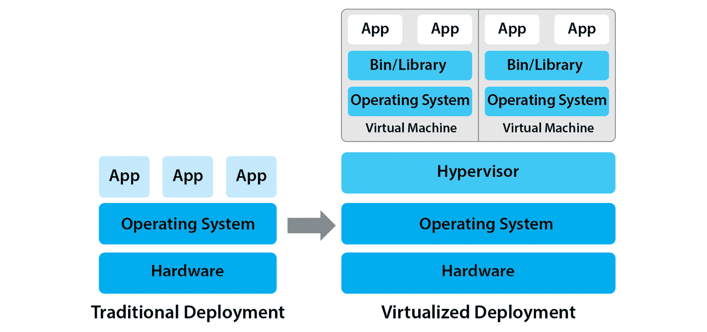
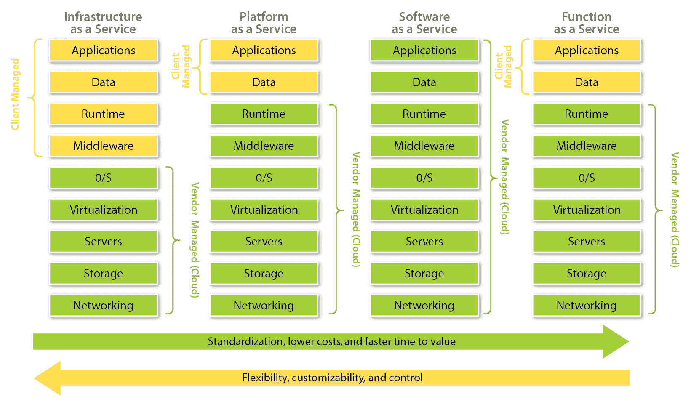
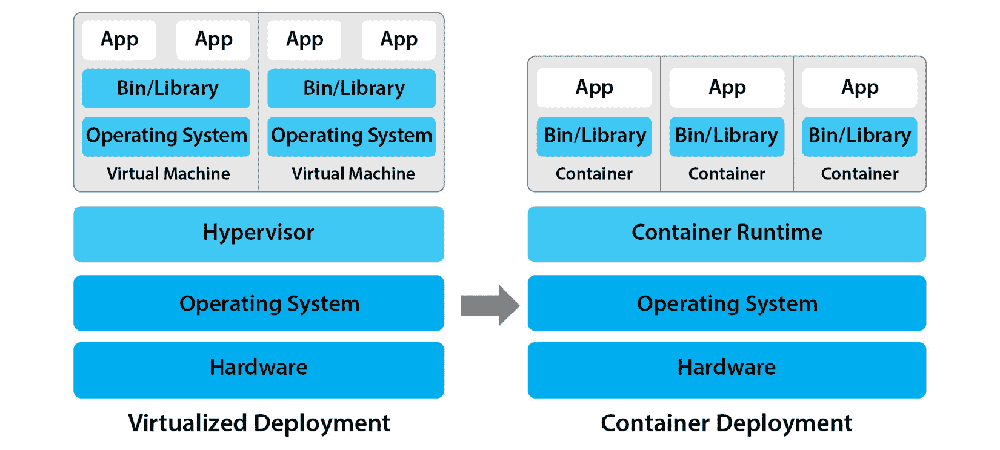
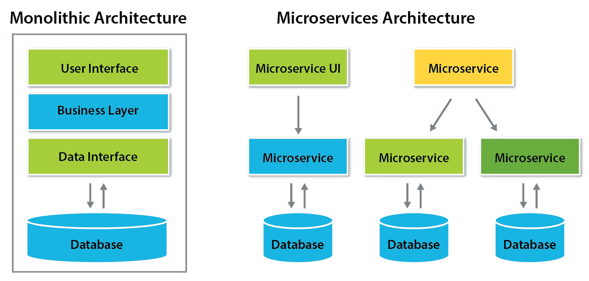

# 1

# 从云计算到云原生与 Kubernetes

本章将展示过去 20 多年中计算如何演变，**云计算**是什么及其如何出现，以及 IT 环境随着容器的引入发生了怎样的变化。你将学习到**基础设施即服务**(**IaaS**)、**平台即服务**(**PaaS**)、**软件即服务**(**SaaS**)和**函数即服务**(**FaaS**)等基础知识，同时还会了解从单体架构到微服务架构的过渡，并初步了解 Kubernetes。

本章并没有直接对应特定的 KCNA 考试目标，但这些主题对任何希望将自己职业与现代基础设施挂钩的人来说至关重要。如果你已经熟悉基本术语，可以通过直接查看回顾问题来快速验证你的知识。如果不熟悉，不要惊讶于本章没有深入探讨，因为这是一个入门章节，我们将在后续章节中深入探讨所有主题。

本章将涵盖以下主题：

+   云计算与**云之前**(**B.C.**)

+   云计算的演变与云原生

+   容器与容器编排

+   单体应用与微服务应用

+   Kubernetes 及其起源

让我们开始吧！

# 云计算与云之前（B.C.）

云计算引发了一场重大革命并加速了创新，但在我们学习云之前，先来看看云时代之前的做法。

在使用*云计算*这个术语之前，一台物理服务器通常只能同时运行一个**操作系统**(**OS**)。这些系统通常只承载一个应用程序，这意味着两件事：

+   如果一个应用程序不被使用，那么它运行的服务器上的计算资源就会浪费

+   如果一个应用程序非常活跃并且需要更大的服务器或更多服务器，通常需要几天甚至几周的时间来采购、交付、布线并安装新硬件。

接下来，让我们看看计算中的一个重要方面——虚拟化。

## 虚拟化

虚拟化技术和**虚拟机**(**VM**)最早出现在 1960 年代，但直到 2000 年代初，像 XEN 和**基于内核的虚拟机**(**KVM**)这样的虚拟化技术才开始成为主流。

虚拟化允许我们在一台物理服务器上通过使用虚拟机监控程序（hypervisor）运行多个虚拟机（VM）。虚拟机监控程序是一种作为硬件资源（如 CPU 和 RAM）模拟器的软件。它实际上通过将底层物理服务器的处理器时间和内存划分给多个虚拟机，从而允许你共享这些资源。

这意味着每个虚拟机将非常类似于物理服务器，但使用虚拟 CPU、内存、磁盘和网络卡，而非物理组件。每个虚拟机还将运行操作系统，并可以在其上安装应用程序。下图展示了在同一物理服务器上运行两个虚拟机的虚拟化部署：

图 1.1 – 传统与虚拟化部署的对比

这种在所谓的*客户虚拟机*之间共享硬件资源的概念，使得硬件的利用变得更加高效，减少了计算资源的浪费。也就是说，我们可能不需要为了运行另一个应用程序而购买一台全新的服务器。

虚拟化带来的明显好处如下：

+   需要更少的物理硬件

+   需要更少的数据中心人员

+   更低的采购和维护成本

+   更低的能耗

此外，配置一个新的虚拟机（VM）只需几分钟，而不是等待几天或几周来购买新硬件。然而，要超越公司数据中心已有硬件的容量，我们仍然需要订购、配置并布线新的物理服务器和网络设备——但随着云计算的引入，这一切都发生了变化。

## 云

从最基础的层面来看，云就是按需虚拟化。它允许我们在客户请求时，作为一种服务生成可通过网络访问的虚拟机（VM）。

云计算

这就是将计算资源作为服务提供的方式，其中实际的硬件由云服务提供商拥有和管理，而非企业的 IT 部门。

云计算引发了计算领域的重大革命。如今，构建和运行应用程序以及虚拟机不再需要购买和管理自己的硬件。云服务提供商全面负责硬件采购、安装和维护，并通过在共享硬件上为数百上千个客户提供安全的服务来确保资源的高效利用。每个客户仅需为其所使用的资源付费。如今，常见的云类型包括以下三种：

+   **公共云** – 最受欢迎的类型。公共云由第三方公司运营，任何付费客户都可以使用。公共云通常同时为成千上万的组织提供服务。公共云提供商的例子包括**亚马逊网络服务**（**AWS**）、**微软 Azure** 和 **谷歌云平台**（**GCP**）。

+   **私有云** – 仅供一个通常较大的组织或企业使用。其操作和维护可能由该组织本身或私有云提供商完成。例子包括 Rackspace 私有云和 VMware 私有云。

+   **混合云** – 这是公共云与私有云的结合，适用于某个组织拥有私有云，但同时也使用一些公共云服务的情况。

然而，云不仅仅是通过网络访问的虚拟机。云服务提供商提供了数十种、数百种服务。今天，您几乎可以立即请求并使用网络附加存储、虚拟网络设备、防火墙、负载均衡器、带有 GPU 或专用硬件的虚拟机、托管数据库等服务。

现在，让我们更详细地了解云服务如何交付和消费。

# 云计算和云原生的发展

除了今天可以找到的各种云服务外，云服务的提供方式也有所不同。通常可以区分四种云服务交付模型，以满足不同的需求：

+   **IaaS** – 最灵活的模型，提供基本服务：虚拟机、虚拟路由器、块设备、负载均衡器等等。这个模型也假设客户承担更多责任。IaaS 的用户可以访问他们的虚拟机，必须配置操作系统，安装更新，并设置、管理和保护他们的应用程序。AWS **弹性计算云**（**EC2**）、AWS **弹性块存储**（**EBS**）和 Google Compute Engine 虚拟机都是 IaaS 的示例。

+   **PaaS** – 通过免去安装操作系统更新或进行任何低级别维护的需求，帮助客户专注于应用程序的开发和管理。作为 PaaS 客户，您仍然需要负责您的数据、身份与访问以及应用程序生命周期。示例包括 Heroku 和 Google App Engine。

+   **SaaS** – 将责任进一步移离客户。通常，这些是完全托管的应用程序，*即开即用*，例如 Slack 或 Gmail。

+   **FaaS** – 一种在 2010 年左右出现的较新交付模型。如今也被称为**无服务器**。FaaS 的客户负责定义由事件触发的功能。这些功能可以使用流行的编程语言编写，客户无需担心服务器或操作系统管理、部署或扩展等问题。FaaS 的示例包括 AWS Lambda、Google Cloud Functions 和 Microsoft Azure Functions。

这些模型听起来可能有点复杂，让我们用汽车和交通工具做一个简单的类比。

*本地传统数据中心* 就像是拥有自己的车。你购买了它，并且负责它的保险和维护、坏件的更换、定期检查等等。

*IaaS* 更像是租车一段时间。你支付月租费，开车，给车加油，洗车，但你实际上并不拥有这辆车，当你不再需要它时，你可以把它还回去。

*PaaS* 可以与共享汽车进行类比。你不拥有汽车，不需要洗车、维护，甚至大多数时候不需要加油，但你仍然自己开车。

按照这个类比，*SaaS* 就像打出租车。你不需要拥有车甚至不需要开车。

最后，从用户的角度来看，*无服务器*或*FaaS*可以与公共汽车进行比较。你只需上车并直达目的地——无需维护、无需驾驶、无需拥有。

希望这能让事情更加明晰。传统的本地部署设置中，公司完全负责组织、硬件维护、数据安全等方面，而在云中适用的则是所谓的共享责任模型。

共享责任模型

定义了云服务提供商与云客户的责任。这些责任取决于提供的服务——在 IaaS 服务的情况下，客户的责任比 PaaS 或 SaaS 服务更多。例如，云服务提供商始终负责防止未经授权访问数据中心设施，以及确保电力供应和底层网络连接的稳定性。

以下图示形象地展示了不同责任之间的差异：

图 1.2 – 云交付模型比较

随着过去 20 年云技术和云服务提供商的发展，运行在云上的应用架构也发生了变化；一个新术语应运而生——**云原生**。大多数时候，它指的是一种架构方法，但你也会经常遇到云原生应用或云原生软件。

云原生

是一种在现代、动态基础设施（如云）上构建和运行应用的方式。它强调具有高弹性、可扩展性、高度自动化、易于管理和可观察性的应用工作负载。

尽管有*云*这个词，但这并不意味着云原生应用必须严格运行在公共、私有或混合云中。你可以开发一个云原生应用，并在本地运行它，例如使用 Kubernetes。

云原生不应与**云服务提供商**（**CSPs**）或简称云提供商混淆，也不应与云优先混淆，请记住以下几点：

**云原生 ≠ CSP ≠ 云优先**

为了完整性，让我们定义一下另外两个概念。

云服务提供商（CSP）是指提供云计算服务的第三方公司，例如 IaaS、PaaS、SaaS 或 FaaS。云优先（Cloud-first）仅仅意味着一种策略，在这种策略下，云是优化现有 IT 基础设施或启动新应用的默认选择。

如果这些定义目前还没有完全理解，也不用担心——我们将专门有一节来详细解释云原生的所有方面。现在，让我们简要介绍一下容器及其编排。

# 容器与容器编排

从高层次来看，容器是另一种轻量级虚拟化形式，也称为**操作系统级虚拟化**。然而，容器与虚拟机（VM）不同，具有各自的优缺点。

主要的区别在于，使用虚拟机时，我们可以在一台物理服务器上切分并共享多个虚拟机，每个虚拟机运行自己的操作系统。而使用容器时，我们可以在多个容器之间共享操作系统内核，每个容器都有自己的虚拟操作系统。让我们更详细地看看这个过程。

容器

这些是便携式的软件单元，包含应用代码、运行时、依赖项和系统库。容器共享一个操作系统内核，但每个容器可以拥有自己的隔离操作系统环境，带有不同的包、系统库、工具、存储、网络、用户、进程和组。

*便携性*很重要，需要详细说明。将应用程序打包成容器镜像后，可以保证它在另一台主机上运行，因为容器包含了自己的隔离环境。在另一台主机上启动容器不会干扰其环境或被容器化的应用程序。

容器的一个主要优势是，它们比虚拟机更加轻量和高效。容器消耗的资源（CPU 和 RAM）比虚拟机少，启动几乎是即时的，因为它们不需要启动一个完整的操作系统和内核。例如，如果一台物理服务器能够运行 10 个虚拟机，那么同一台物理服务器可能能够运行 30、40，甚至更多的容器，每个容器都有自己的应用程序（具体的数量取决于许多因素，包括工作负载类型，因此这些数字仅用于演示，并不代表任何公式）。

容器的磁盘大小也比虚拟机（VM）小得多，因为它们不会打包完整的操作系统和成千上万的库。容器镜像中仅包含带有依赖项的应用程序和一组最小的操作系统包。这使得容器镜像既小巧、便携，又容易下载或分享。

容器镜像

这些基本上是容器操作系统环境的模板，我们可以使用它们来创建多个具有相同应用程序和环境的容器。每次执行镜像时，都会创建一个容器。

从数字角度来看，一个流行的 Linux 发行版的容器镜像，如*Ubuntu Server 20.04*，大约为 70 MB，而相同的 Ubuntu Server 的 KVM QCOW2 虚拟机镜像大约为 500 MB。专门的 Linux 容器镜像，如*Alpine*，可能只有 5 到 10 MB，并提供安装和运行应用程序所需的最低功能。

容器与其运行的地方无关——无论是在物理服务器、内部虚拟机还是云端，容器都可以在这些位置中的任何一个上运行，只要有容器运行时的支持。

容器运行时

容器运行时是运行容器所需的特殊软件，它负责根据下载的容器镜像创建、启动、停止和删除容器。容器运行时的例子包括 containerd、CRI-O 和 Docker Engine。

*图 1.3* 展示了虚拟化和容器化部署的差异：

图 1.3 – 虚拟化与容器化部署的对比

现在，你可能会问自己，如果容器如此优秀，为什么还会有人使用虚拟机（VM），而且云服务提供商为什么仍然提供这么多虚拟机类型？

下面是虚拟机相比容器有优势的场景：虚拟机由于隔离性更强，提供了更好的安全性，因为它们不会直接共享相同的宿主机内核。这意味着，如果运行在容器中的应用程序被黑客攻破，那么黑客能够攻破同一宿主机上其他容器的可能性要比常规虚拟机高得多。

我们将在后面的章节中深入探讨操作系统级虚拟化背后的技术，并探索虚拟机和容器之间的底层差异。

随着容器的流行和广泛应用，容器的管理逐渐成为一个挑战，特别是在大规模管理容器时。行业需要一些工具来编排和管理基于容器的应用程序的生命周期。

这与公司和团队必须操作的容器数量不断增加有关，因为随着基础设施工具的不断发展，应用架构也在发生变化，从大型单体架构转变为小型、分布式、松耦合的微服务架构。

# 单体架构与微服务架构

为了理解单体应用和基于微服务的应用之间的差异，让我们回顾一个现实中的例子。假设一家企业运营着一个在线酒店预订业务，所有预订都是客户通过公司网站进行的，并且完成支付。

这种类型的 Web 应用程序的传统单体架构会将所有功能打包到一个复杂的软件中，这个软件可能包括以下内容：

+   客户仪表盘

+   客户身份与访问管理

+   根据条件搜索酒店

+   计费与支付供应商集成

+   酒店预订系统

+   票务与支持聊天

单体应用将所有业务和用户逻辑紧密耦合（打包）在一起，并且必须一起开发和更新。这意味着，如果需要修改计费代码，整个应用程序都必须进行更新。更新后，还必须进行仔细测试，并发布到生产环境中。每一个（即便是小的）变更都可能导致整个应用崩溃，并使得业务在较长时间内不可用。

在微服务架构下，同样的应用程序可以被拆分成几个小模块，通过网络相互通信，并各自完成自己的功能。例如，计费可以通过四个较小的服务来实现：

+   汇率转换器

+   信用卡供应商集成

+   银行电汇处理  

+   退款处理  

本质上，微服务是一组小型应用，每个应用负责完成自己的小任务。这些小型应用通过网络互相通信，并共同协作，成为一个更大应用的一部分。  

下图展示了单体架构与微服务架构之间的差异：  

  

图 1.4 – 单体架构与微服务架构的比较  

通过这种方式，Web 应用的其他部分也可以拆分成多个独立的小型应用（微服务），它们通过网络进行通信。此方法的优点包括以下几点：  

+   每个微服务可以由其独立的团队开发  

+   每个微服务可以单独发布和更新  

+   每个微服务可以独立于其他服务进行部署和扩展  

+   单个微服务的故障只会影响应用的一个小部分功能  

微服务是云原生架构的重要组成部分，我们将在*第九章*《理解云原生架构》中详细回顾微服务的优势与挑战。暂时让我们回到容器，探讨为什么它们需要进行编排。

当每个微服务被打包成容器时，容器的总数可能会很快达到几十个甚至几百个，特别是在大型和复杂应用中。在这样的复杂分布式环境下，情况可能迅速失控。  

容器编排系统帮助我们管理大量容器。它通过将应用容器分组到部署中，并自动化以下操作，简化了容器的管理：  

+   根据工作负载扩展微服务  

+   发布微服务的新版本及其更新  

+   根据主机的使用情况和需求调度容器  

+   自动重启失败的容器或将流量切换到其他容器  

目前，有许多容器和工作负载编排系统可供选择，包括以下几种：  

+   Kubernetes  

+   OpenShift（也称为**Open Kubernetes** **发行版**（**OKD**））  

+   Hashicorp Nomad  

+   Docker Swarm  

+   Apache Mesos  

正如你从书名中已经知道的，我们将仅专注于 Kubernetes，并且不会在这五种方案之间做任何比较。事实上，Kubernetes 的市场份额遥遥领先，多年来，它已成为编排容器的事实标准平台。你可以充满信心地专注于学习 Kubernetes，至少目前可以忽略其他的容器编排方案。  

# Kubernetes 及其起源  

让我们首先从简要的历史开始。Kubernetes 的名称源自希腊语，意思是*领航员*或*舵手* —— 一个操纵船只的人（这也是为什么标志中有一个舵轮）。舵轮上有七根条，而数字七对 Kubernetes 具有特殊意义。最初负责 Kubernetes 的团队称其为*七号项目* —— 这是根据著名电视系列《星际迷航》中的七个九分之七角色而命名的。

图 1.5 – Kubernetes 标志

Kubernetes 最初由 Google 开发，并于 2014 年作为开源项目发布。当时，Google 早已运行其服务于容器中超过十年，并且 Kubernetes 的发布引发了行业的另一场小革命。那时，许多企业已经意识到使用容器的好处，并需要简化大规模容器编排的解决方案。正如我们即将看到的，Kubernetes 成为了这个解决方案。

Kubernetes（K8s）

Kubernetes 是一个用于容器编排的开源平台。Kubernetes 具有可扩展和声明式 API，允许您自动达到资源的期望状态。它支持灵活的调度、自动扩展、滚动更新和基于容器的负载自愈。

（在线和文档中，经常可以遇到更短的缩写 K8s —— 其中八是“K”和“s”之间字母的数量。）

Kubernetes 继承了许多来自 Borg 的特性和最佳理念 —— Borg 是 Google 的一个内部容器集群管理系统，多年来支持运行数千个不同的应用程序。许多 Borg 工程师参与了 Kubernetes 的开发，并能够根据多年运营大规模容器的经验来解决相关痛点。

在初版发布后不久，Kubernetes 迅速吸引了开源社区的注意，并吸引了来自全球各地的许多才华横溢的贡献者。今天，Kubernetes 是 GitHub 上三大最大的开源项目之一（[`github.com/kubernetes`](https://github.com/kubernetes)），拥有超过 80,000 个星和 3,000 名贡献者。它还是第一个从**云原生计算基金会**（**CNCF**）毕业的项目，CNCF 是一个从 Linux 基金会分拆出来的非营利组织，旨在推动容器和云原生技术的发展。

Kubernetes 最重要的特性之一是期望状态的概念。Kubernetes 的运行方式是我们定义所需的应用程序容器状态，Kubernetes 将自动确保达到这个状态。Kubernetes 不断观察所有部署容器的状态，并确保此状态与我们请求的一致。

让我们考虑以下示例。假设我们在具有三个主机的 Kubernetes 集群上运行一个简单的微服务应用程序。我们定义了一个规格，要求 Kubernetes 运行以下内容：

+   两个相同的前端容器

+   三个相同的后端容器

+   两个用于数据持久化的容器

出乎意料的是，三个主机中的一个发生故障，导致在前端和后端上运行的两个容器不可用。Kubernetes 会观察到集群中主机的数量变化以及前端和后端容器的数量减少。Kubernetes 会自动在另外两个运行中的主机上启动一个前端容器和一个后端容器，将系统恢复到预期状态。这个过程被称为**自我修复**。

Kubernetes 能做的不仅仅是调度和重启失败的容器——我们还可以定义一个 Kubernetes 规格，要求根据当前的需求自动增加微服务容器的数量。例如，在前面的例子中，我们可以指定，在工作负载增加时，我们希望运行五个前端副本和五个后端副本。或者，在应用需求低时，我们可以自动将每个微服务容器的数量减少到两个。这个过程被称为**自动扩缩**。

这个例子展示了 Kubernetes 的基本功能。在*第三部分*，我们将深入探索更多 Kubernetes 特性，并亲自尝试其中的一些功能。

重要提示

虽然作为一个容器编排工具，Kubernetes 本身并没有容器运行时。相反，它与流行的容器运行时（如*containerd*）集成，并且可以在 Kubernetes 集群内与多个运行时一起工作。

你经常会看到 Kubernetes 集群的相关内容，因为一个典型的 Kubernetes 安装会被用来管理分布在多个主机上的数百个容器。单主机的 Kubernetes 安装仅适合用于学习或本地开发，而不适用于生产环境。

总结来说，Kubernetes 为大规模容器的采用铺平了道路，并且它是一个蓬勃发展的开源生态系统，每年都有新的项目从 CNCF 毕业。在本书中，我们将深入探讨 Kubernetes 的 API、组件、资源、功能和操作方面，并了解更多可以与 Kubernetes 一起使用以扩展其功能的项目。

# 概述

在本章中，我们学习了云计算和容器的概念，以及过去 20 到 30 年计算领域的演变。在云计算时代之前，传统的部署方式将一个或少量应用程序部署在每台物理服务器上，这导致了很多低效和资源浪费，硬件利用率低且拥有成本高。

当虚拟化技术出现时，使用虚拟机（VMs）可以在一个物理服务器上运行多个应用程序。这解决了传统部署的缺陷，并且能够更快速且成本显著降低地交付新应用程序。

虚拟化为通过四种不同模型提供的云服务铺平了道路：IaaS、PaaS、SaaS 和 FaaS 或无服务器。根据云服务和交付模型，客户的责任有所不同。

这种进步从未停止——现在，云原生作为一种构建和运行应用程序的方法已经出现。云原生应用程序设计和构建时强调可扩展性、弹性、易管理性和高度自动化。

近年来，容器技术发展迅速并获得了动力。容器在操作系统级别使用虚拟化，每个容器代表一个虚拟操作系统环境。与 VM 相比，容器更快速、更高效、更具可移植性。

容器使我们能够基于微服务架构开发和管理现代应用程序。与传统的单体应用程序相比，微服务更先进——*一体化*、*巨兽*应用程序。

虽然容器是运行云原生应用程序最有效的方式之一，但难以管理大量容器。因此，最好使用像 Kubernetes 这样的编排器来管理容器。

Kubernetes 是一种开源容器编排系统，起源于 Google，自动化容器的许多运维方面。Kubernetes 将根据提供的规格自动安排、启动、停止和重新启动容器，并根据当前需求增加或减少容器数量。Kubernetes 使得实施自愈和根据当前需求自动扩展成为可能。

# 问题

在每章末尾，您将找到总结性问题，以测试您的理解。问题可能有多个正确答案。正确答案可在*附录*的*评估*部分找到：

1.  以下哪项描述了物理服务器上的传统部署方式（选两个）？

    1.  简易维护

    1.  未充分利用的硬件

    1.  低能耗

    1.  高前期成本

1.  VM 相比容器有哪些优势？

    1.  它们更可靠

    1.  它们更具可移植性

    1.  它们更安全

    1.  它们更轻量级

1.  描述 VM 和容器之间差异的是哪两个（选两个）？

    1.  VM 镜像较小而容器镜像较大

    1.  VM 镜像较大而容器镜像较小

    1.  VMs 共享操作系统内核而容器不共享

    1.  容器共享操作系统内核而 VMs 不共享

1.  容器在哪个层级操作？

    1.  编排器层级

    1.  虚拟化层级

    1.  编程语言层级

    1.  操作系统级别

1.  容器镜像通常包含以下哪两个内容（选两个）？

    1.  操作系统内核

    1.  一个最小化的 OS 库和软件包集合

    1.  图形化桌面环境

    1.  一个打包的微服务

1.  与虚拟机相比，容器有哪些优势（选择多个）？

    1.  它们更安全

    1.  它们更轻量

    1.  它们更具可移植性

    1.  启动速度更快

1.  启动和运行容器需要哪些软件？

    1.  容器运行时

    1.  一个虚拟机监控程序

    1.  Kubernetes

    1.  VirtualBox

1.  以下哪些可以用于编排容器？

    1.  containerd

    1.  CRI-O

    1.  Kubernetes

    1.  无服务器

1.  以下哪些是云服务交付模型（选择多个）？

    1.  IaaS, PaaS

    1.  SaaS, FaaS

    1.  DBaaS

    1.  无服务器

1.  以下关于云原生的说法哪一项是正确的？

    1.  它是一种架构方法

    1.  它与云提供商相同

    1.  它类似于云优先

    1.  它是仅在云中运行的软件

1.  以下哪些描述适用于云原生应用程序（选择两个）？

    1.  高度自动化

    1.  高可扩展性和高韧性

    1.  只能在私有云中运行

    1.  只能在公有云中运行

1.  以下关于单体应用程序的说法哪一项是正确的？

    1.  它们容易更新

    1.  它们的组件通过网络相互通信

    1.  它们包含所有的业务逻辑和接口

    1.  它们可以轻松扩展

1.  以下哪些关于微服务的说法是正确的（选择多个）？

    1.  它们只能用于后端

    1.  它们作为更大应用的一部分协同工作

    1.  它们可以由多个团队开发

    1.  它们可以独立部署

1.  以下哪些可以通过 Kubernetes 完成（选择多个）？

    1.  在故障时自我修复

    1.  自动扩展容器

    1.  启动虚拟机

    1.  在不同主机上调度容器

1.  哪个项目为 Kubernetes 提供了灵感？

    1.  OpenStack

    1.  Docker

    1.  Borg

    1.  OpenShift
