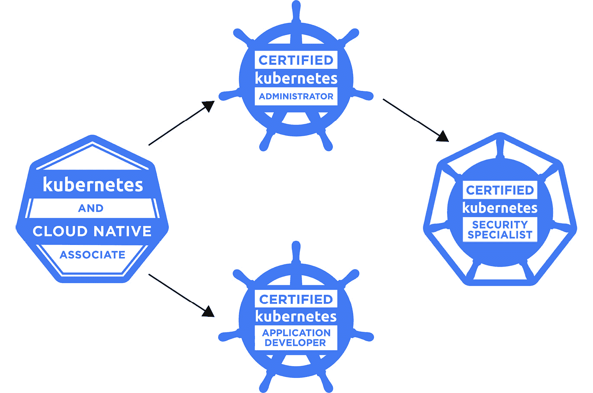

# 2

# CNCF 和 Kubernetes 认证概览

在这一章中，你将了解**云原生计算基金会**（**CNCF**）及其母组织——**Linux 基金会**。我们将了解这些基金会背后的内容，它们是如何出现的，以及它们的生态系统中托管了哪些项目。我们还将讨论 CNCF 社区、治理结构、云角色以及 Kubernetes 认证路径。

虽然这是本书中技术性最弱的一章，但你将在此学到的内容涵盖了 KCNA 认证中的大约一半云原生架构领域的知识点，所以确保你在本章结束时回答所有的复习问题。

在这一章中，我们将涵盖以下主题：

+   开源软件（OSS）和开放标准

+   Linux 和 CNCF

+   CNCF 社区与治理结构

+   云角色与人物画像

+   Kubernetes 认证路径

让我们开始吧！

# 开源软件和开放标准

如果你曾经从事过任何 IT 职位，那么你很有可能接触过**开源软件**（**OSS**）这一术语，了解它的含义，并且很可能已经使用过其中的一些软件。

什么是开源软件（OSS）？

开源软件是指软件的源代码是公开可访问的，任何人都可以研究、修改并用于任何目的。

软件不能仅仅因为它可以在互联网上轻松找到或可以从*暗网*下载而被视为开源软件。软件被视为开源，当它是根据某种开源许可证发布的，比如 Apache 2.0 或 GNU 通用公共许可证 v3。那些许可证赋予用户修改源代码的权利，甚至可以将其用于商业用途。没错——你可以使用开源软件来构建新的软件并出售，而无需向任何人支付许可费用。或者，你也可以修改现有的开源软件，增加新特性，并将其出售或提供相关的支持服务。

虽然开源软件的历史可以追溯到计算机早期的日子，但真正诞生其中最成功的开源软件是在 90 年代初。没错，你猜对了——我们在谈论的是 Linux。

Linux 内核是 1991 年由*Linus Torvalds*启动的开源项目中最著名的例子之一。三十年来，该项目吸引了大量志愿者和热心的程序员，他们愿意无偿贡献自己的时间、技能和精力。截至写作时，已经有超过 15,000 人贡献了他们的时间、技能和努力，共同打造了一个核心操作系统，这个操作系统支持了全球 100%的超级计算机和大约 95%的世界服务器。

有很多成功的开源项目——Kubernetes、OpenStack、Terraform、Ansible、Prometheus 和 Django 都是开源的。即使是像谷歌这样拥有强大工程资源的公司，也意识到了开源社区的力量，以及开源生态系统如何推动项目发展。这正是 Kubernetes 项目的经历。

自 Kubernetes 早期以来，已经吸引了众多热情的工程师，并成为 CNCF 孵化的第一个项目。但在我们继续学习 CNCF 的更多内容之前，让我们讨论另一个重要话题——开放标准。

## 开放标准

2015 年，随着 CNCF 的成立，另一个重要事件发生了——**开放容器倡议**（**OCI**）开始启动。

OCI

OCI 是一个开放的治理结构，旨在定义围绕容器格式和运行时的开放行业标准。

OCI 拥有一个技术社区，行业参与者可以在其中贡献，帮助构建中立、可移植且开放的容器规范。

它还提供了参考实现和工具，兑现容器在应用程序可移植性方面的承诺。这些标准帮助我们避免了供应商锁定（当客户被迫继续使用某个产品或服务，因为很难切换到其他供应商时）并帮助确保不同的项目可以顺利集成与协作。例如，正如我们在上一章所学，容器运行时并不属于 Kubernetes 的一部分，因此我们需要确保不同的容器运行时与 Kubernetes 完全兼容。

在撰写本文时，OCI 为容器生态系统提供了三个重要的规范：

+   **镜像规范**（image-spec）定义了如何构建和打包应用程序为符合 OCI 标准的容器镜像

+   **运行时规范**（runtime-spec）定义了容器的生命周期和执行环境

+   **分发规范**（distribution-spec）定义了通过所谓的注册表促进和标准化容器镜像分发的协议

那么，OCI 标准为什么如此重要？

让我们来看一个简单的交通运输类比。假设每个汽车制造商都有自己固定车轮与车轴连接的方法。如果轮胎制造商没有进行标准化，他们会很难为每个品牌和型号生产车轮。但由于大家都同意采用特定的车轮尺寸参数，如宽度、直径、螺栓孔数量等，这使得制造商能够生产适配任何市场上汽车型号的车轮。因此，你可以根据汽车的规格购买车轮，并且有信心它们能够匹配你的车。

类似于容器，我们有镜像、运行时和分发标准，这些标准允许任何人开发 100%兼容的软件。OCI 标准的建立促进了容器生态系统的进一步扩展，带来了新的软件。在 OCI 出现之前，构建容器镜像只有一种方式——使用 Docker。今天，我们有了像**Kaniko**、**Podman**、**Buildah**等项目。

目前，你不需要知道这些差异的具体细节——只需要记住，OCI 通过提供开放规范，标志着容器及其生态系统发展的一个重要节点。在接下来的章节中，我们将深入探讨 Docker 和 OCI 标准的某些方面。

根据 OCI，它并不寻求成为一个营销组织，也不定义完整的技术栈或解决方案要求——它致力于避免标准化正在进行创新和讨论的技术领域（[`github.com/opencontainers/tob/blob/main/CHARTER.md`](https://github.com/opencontainers/tob/blob/main/CHARTER.md)）。帮助建立 OCI 并在其倡议中仍然发挥重要作用的组织是 Linux 基金会。与许多开源项目一样，志愿者们在该领域工作，并希望贡献他们的时间，将技术推向下一个层次，或者弥合现有项目之间的差距。

我们已经在这里提到过 CNCF 和 Linux 基金会几次。现在，让我们更深入了解它们。

# Linux 和 CNCF

Linux 基金会是一个非营利组织，成立于 2000 年，源于开放源码开发实验室与自由标准组织的合并。基金会最初是为了标准化、推广和支持 Linux 的采纳而创建的，但自那时以来，它在开源社区中的作用已大大扩展。

今天，Linux 基金会的支持成员包括许多《财富》500 强公司，如谷歌、IBM、三星、Meta 等。基金会除了 Linux 内核外，还主持许多项目。这些项目包括 **汽车级 Linux**、**Ceph**（存储）、**XEN**（虚拟机监控器）、**实时 Linux**、**OpenAPI Initiative**（**OAI**）等。即使你之前从未听说过这些项目，也不必担心——你在考试中不会被问到这些内容。

近年来，Linux 基金会通过会议、认证、培训和新计划扩展了其项目。其中一个计划是 **云原生计算基金会**（**CNCF**），该基金会于 2015 年成立。

## CNCF

2015 年 7 月 21 日成为整个开源社区的一个重要日期——Kubernetes 1.0 发布了。随着发布，作为 K8s 背后的关键推动力和贡献者，谷歌与 Linux 基金会合作，成立了 CNCF。Kubernetes 成为了新基金会的种子技术和第一个孵化项目。CNCF 的使命是推动容器和云原生技术的发展，并与行业对接（[`www.cncf.io/about/who-we-are/`](https://www.cncf.io/about/who-we-are/))：

“基金会的使命是让云原生计算普及。”

云原生技术使组织能够在现代动态环境中构建和运行可扩展的应用程序，如公共云、私有云和混合云。容器、服务网格、微服务、不变基础设施和声明式 API 就是这种方法的典型例子。

这些技术使得松耦合系统变得更具弹性、可管理和可观察。结合强大的自动化，它们使工程师能够频繁且可预测地进行高影响力的变更，同时最小化工作量。

云原生计算基金会通过培育和维持一个开源、供应商中立的项目生态系统，推动这一范式的采纳。我们将最先进的模式民主化，使这些创新对每个人都可访问。”

我们在*第一章*《从云到云原生与 Kubernetes》中讲解了云计算、容器和微服务的基础知识，接下来的章节将深入探讨这些以及 CNCF 使命声明中提到的其他话题。

如今，CNCF 得到了超过 450 个成员的支持，并在云原生生态系统中发挥着重要作用。它提供治理并支持开源项目，使其成熟并确保其处于生产就绪状态。

说到成熟度，CNCF 有三个显著的级别：

+   **沙盒**：这是早期阶段项目的入口点，这些项目可以为 CNCF 使命增值。新项目如果与现有项目互补，可能会与其对齐。

+   **孵化**：这是一个已在生产环境中成功使用的项目，拥有持续的代码提交和贡献流，同时具有文档、规范和版本控制方案。

+   **毕业**：这是一个拥有来自多个组织的贡献者、遵循核心基础设施倡议最佳实践，并通过了独立第三方安全审核的项目。该项目还应定义治理和贡献者流程，并且证明其已被真实用户使用。

每个由 CNCF 托管的项目都有一个相应的成熟度级别。项目通过展示其获得了*最终用户采用、健康的代码变更频率，以及来自* *不同组织的贡献者*，来提高其成熟度。

此外，所有 CNCF 项目必须遵守*IP 政策*并采用*行为规范*。行为规范定义了可接受的行为以及不可接受的行为，以创建一个积极和富有同理心的协作环境。另一方面，IP 政策关注知识产权，决定应适用哪种开源许可证（通常，源代码使用 Apache 2.0 许可证，文档和图片使用 Creative Commons Attribution 4.0 International 许可证）。

# CNCF 社区与治理

随着 Kubernetes 等开源项目的势头不断增长，它们吸引了更多的贡献者，这总是一个好兆头。然而，较大的社区可能会失控，并在没有适当治理的情况下迅速变得 *混乱*。虽然 CNCF 不要求其托管的项目遵循任何特定的治理模型，但为了使项目毕业，必须明确规定治理和提交者流程。CNCF 遵循 *最小可行治理* 原则，这意味着项目自我治理，CNCF 机构仅在需要帮助或项目出现问题时介入。

说到其结构，CNCF 有三个主要机构：

+   **管理委员会** (**GB**): 负责 CNCF 的市场营销、预算和其他商业决策

+   **技术监督委员会** (**TOC**): 负责定义和维护技术愿景，批准新项目，并根据反馈调整现有项目

+   **终端用户社区** (**EUC**): 提供来自终端用户和组织的反馈，以改进云原生生态系统中的整体体验

TOC 还决定一个项目是否达到了更高的成熟度水平。项目可以在孵化阶段无限期停留，但通常期望在 2 年内毕业。

如你所知，Kubernetes 是 CNCF 中第一个孵化的项目，也是第一个在 2018 年达到 *毕业* 状态的项目。没错，Kubernetes 跳过了沙盒阶段，因为它是在 CNCF 成立的同时首次发布的。自那时以来，已有 10 多个项目毕业，约有 100 个项目目前处于孵化或沙盒阶段。在下一部分，我们将探讨云和云原生中常见的角色和人物。

# 云角色和人物

云原生不仅仅是关于技术和架构，还涉及人员和工作环境中高效的协作。因此，在使用云基础设施和云原生生态系统的组织中，常常会有一些特定的职位和角色。了解这些角色以及它们的职责是 KCNA 考试的要求。

在采用云和云原生的现代组织中，可以遇到以下角色：

+   **云架构师或云解决方案架构师**

+   **DevOps 工程师**

+   **DevSecOps 工程师**

+   **FinOps 工程师**

+   **站点可靠性工程师** (**SRE**)

+   **云工程师**

+   **数据工程师**

+   **全栈开发工程师**

这个列表并不详尽，你有时可能会看到这些角色的不同变体，但这应该能给你一个大致的概念。现在，让我们明确这些角色和职责之间的区别：

+   **云（解决方案）架构师**：不出所料，架构师负责设计云基础设施和云原生应用程序的架构。它必须具有高度的韧性、可观察性、可扩展性，并且具有较高的自动化程度。

云架构师通常还负责云战略和选择云提供商（公有云、私有云或混合云）以及合适的服务（IaaS/PaaS/SaaS/无服务器架构）。架构师角色要求具备广泛的技术和非技术领域知识。例如，他们必须了解**资本支出或前期成本**（**CAPEX**）与**运营支出或简而言之是运行成本**（**OPEX**）的区别。传统数据中心是高 CAPEX 的典型例子，而公有云则是零或几乎为零的 CAPEX，成本大多为运营成本（OPEX）。

+   **DevOps 工程师**：**Dev**代表**开发**，而**Ops**代表**运营**。DevOps 工程师是能够弥合开发人员与运营人员之间差距的人。通常，DevOps 工程师既有软件开发经验，也有系统管理员或基础设施工程师的经验。这些知识使他们能够有效地自动化云中的基础设施以及整个应用生命周期，包括开发、测试和发布。DevOps 工程师通常需要至少掌握一种编程语言（例如 Python、Ruby 或 Golang），以及一些自动化工具（如 Terraform、Ansible、Puppet 等）和**持续集成与持续部署/交付**（**CI/CD**）系统。如今，你通常也会看到 Kubernetes 经验作为 DevOps 岗位的要求之一。DevOps 文化强调学习优于责备，倡导共享责任和强有力的跨团队协作，并促进持续的反馈循环。

+   **DevSecOps 工程师**：这个角色与 DevOps 工程师非常相似，但更加注重安全性。在 DevSecOps 中，安全性在应用和基础设施生命周期的早期就开始介入，并且需要与安全团队密切合作。

+   **FinOps 工程师**：**Fin**代表**财务**，而**Ops**代表**运营**。FinOps 工程师使团队能够跟踪预算、提供透明度，并在云端进行成本优化。这个角色要求深入了解云端的各种定价模型和服务，以找到最佳和最具成本效益的解决方案。

+   **网站可靠性工程师** (**SRE**)：SRE 的职责包括维护和优化云基础设施和应用程序。SRE 在某种程度上与 DevOps 相似，但更侧重于运营部分，尤其是满足应用程序可用性要求或在**服务水平协议** (**SLAs**) 或 **服务级目标** (**SLOs**) 中定义的目标。SLA 规定了服务提供商与客户之间在质量、可用性和责任方面的承诺水平。SLO 是 SLA 的具体可衡量特征，如可用性或响应时间。SRE 经常参与值班轮换（即，他们随时准备在发生事故时作出反应）。

+   **云工程师**：这个角色与 DevOps 类似，但侧重于云服务提供商的云特性或服务。通常，DevOps 工程师的角色需要更广泛的技能，而云工程师则需要更深入了解特定的公共云服务。

+   **数据工程师**：在这个角色中，工程师需要处理数据保护、数据存储、性能和可用性要求，以及用于数据分类、保留和分析的各种工具。随着企业积累越来越多的数据，他们需要有效利用这些数据。因此，数据工程师目前的需求量很大。

+   **全栈开发者**：这是一个广泛的角色，开发者需要能够处理应用程序的前端部分（例如，**用户界面** (**UI**)）和后端部分。后端是一个通用术语，描述的是不对终端用户可见或无法访问的软件实现。有时，全栈开发者还可能涉及一些云基础设施和 DevOps 工具的基础经验。

虽然这些角色和职位在全球范围内的需求极高，但如果你来自完全不同的背景，或者刚刚从大学毕业且没有相关的工作经验，获得这些职位的机会可能并不容易。获得认证可以使你的个人资料脱颖而出，并大大提高你获得面试机会的几率。在本书的最后，你将找到一些职业建议，但现在让我们先看看 CNCF 提供了哪些 Kubernetes 认证以及认证路径是怎样的。

# Kubernetes 认证路径

在撰写本文时，CNCF 提供了四个 Kubernetes 认证考试：

+   **Kubernetes 和云原生** **助理** (**KCNA**)

+   **认证 Kubernetes 应用程序** **开发者** (**CKAD**)

+   **认证 Kubernetes** **管理员** (**CKA**)

+   **认证 Kubernetes 安全** **专家** (**CKS**)

CKA 是第一个于 2017 年发布的考试，原有效期为 2 年，但后来有效期延长至 3 年。CKAD 和 KCNA 的有效期也为 3 年；只有 CKS 考试通过后有效期为 2 年。

在所有考试中，CKS 是最难的，要求考生持有有效且未过期的 CKA 认证，以证明他们已经具备足够的 K8s 专业知识。这意味着虽然你可以随时购买 CKS，但除非你先通过 CKA，否则无法参加此考试。所有其他考试都可以按任意顺序进行；然而，推荐的路径如下图所示：

图 2.1 – CNCF Kubernetes 认证路径

KCNA 是列表中最简单的考试，也是唯一不需要动手操作的考试——即，它是选择题。其他所有认证都需要动手操作，并要求你在多个 K8s 集群上通过终端完成活动。

但不要对 KCNA 考试抱有过高期望。事实上，在云领域的入门级认证中，它是一个相对较难的认证。即使你在相关领域工作了几年，没有任何 Kubernetes 经验和一些准备，通常也不太可能通过考试。在尝试实际考试之前，确保你已经回答完所有的回顾性问题，并完成了本书结尾提供的模拟考试。

以下是关于 KCNA 考试的一些重要信息：

+   60 道选择题

+   90 分钟完成考试

+   需要 75%及以上的分数才能通过

+   考试会在约 24 小时内自动评分

+   可在任何地方在线参加（需要摄像头和麦克风）

+   价格包括一次免费重考

以下是 KCNA 考试中测试的领域：

+   Kubernetes 基础知识（46%）

+   容器编排（22%）

+   云原生架构（16%）

+   云原生可观察性（8%）

+   云原生应用交付（8%）

如你所见，Kubernetes 占据了考试的主要部分。因此，本书的最大篇幅（*第三部分*，*学习 Kubernetes 基础知识*）专门讲解 K8s。除此之外，KCNA 考生应能够确认自己对云原生及其生态、项目和实践的概念性知识。这包括上一章中的高层次定义，这些内容可能会在 KCNA 中被提问。

其他三个考试专注于与 Kubernetes 相关的不同方面。CKAD 考试测试应用部署和管理方面，而 CKA 更侧重于 Kubernetes 的搭建和管理。然而，这些考试涉及许多共同领域，如果你通过了其中一个，经过一些额外的准备，你也能通过另一个。最后，CKS 聚焦于安全性，需要在 Kubernetes 方面有丰富的经验。

# 总结

在本章节中，我们了解了开源软件（OSS）以及开放标准在 OCI 方面的重要性。OCI 定义了**镜像**、**运行时**和**分发**规范，使任何人都能开发完全兼容的容器软件。例如，Kubernetes 不包括自己的容器运行时；相反，它实现了对标准化运行时接口的支持，使其能够与多种容器运行时协同工作。开放的、定义明确的标准为云原生生态系统和 CNCF 中的许多新项目铺平了道路。

接下来，我们回顾了 CNCF 和 Linux 基金会的历史。CNCF 是在 Kubernetes 的第一个版本发布时成立的，并且成为了第一个孵化的项目。CNCF 将项目成熟度分为三个级别：**沙箱**、**孵化**和**毕业**。

CNCF 有三个主要的组织：**管理委员会**（**GB**）、**技术监督委员会**（**TOC**）和**最终用户社区**（**EUC**）。TOC 负责决定 CNCF 项目的成熟度。一个项目达到毕业状态的要求之一是必须有定义的治理和提交者流程。

云原生需要合适的人来做工作，这一点得到了许多市场上需求量很大的角色和身份的支持。我们已经看过并比较了不同的角色，以理解云架构师的责任与 DevOps 工程师或全栈开发人员的区别。

最后，我们回顾了 Kubernetes 认证路径，并深入研究了你正在准备的 KCNA 考试。确保在进入下一个章节之前回答所有复习问题，我们将在下一个章节中探讨 Docker 和运行容器。

# 问题

在我们总结时，以下是一些问题，供你测试本章内容的理解。你可以在*附录*中的*评估*部分找到答案：

1.  以下哪些是 CNCF 中有效的项目成熟度状态（请选择多个）？

    1.  沙箱状态

    1.  已发布状态

    1.  毕业状态

    1.  孵化状态

1.  哪个组织是为了建立容器行业标准而成立的？

    1.  开放容器基金会

    1.  云原生容器倡议

    1.  云原生容器基金会

    1.  开放容器倡议

1.  以下哪些要求必须满足，CNCF 项目才能达到毕业状态（请选择多个）？

    1.  为未来 3-5 年制定项目开发和维护计划

    1.  拥有实际用户和定义的治理及提交者流程

    1.  拥有来自多个组织的贡献者

    1.  遵循核心基础设施倡议的最佳实践

1.  以下哪个 CNCF 组织决定一个项目是否达到了另一个成熟度水平？

    1.  最终用户社区（EUC）

    1.  管理委员会（GB）

    1.  技术监督委员会（TOC）

    1.  技术监督委员会（TOC）

1.  以下哪些规范是 OCI 提供的（请选择多个）？

    1.  镜像规范

    1.  运行时规范

    1.  执行规范

    1.  分发规范

1.  以下哪些是 CNCF 项目在任何成熟阶段所需的（选择两个）？

    1.  接受 CNCF 行为准则

    1.  接受 CNCF 知识产权政策

    1.  接受 GNU GPL v.3 许可证

    1.  接受 Linux 基金会作为项目所有者

1.  以下哪些是 DevOps 文化强调的（选择多个）？

    1.  共享责任

    1.  学习而非责备

    1.  强大的跨团队协作

    1.  开发人员应该遵循运维团队

1.  以下哪个组织的使命是推动容器和云原生技术的发展，并使行业保持一致？

    1.  Linux 基金会

    1.  开放容器倡议

    1.  云原生容器基金会

    1.  云原生计算基金会

1.  以下哪些可能是云架构师的职责之一（选择两个）？

    1.  选择云服务提供商和合适的服务

    1.  设计云基础设施架构

    1.  将应用程序部署到生产环境

    1.  在云中维护应用程序

1.  DevOps 和 DevSecOps 工程师有什么区别？

    1.  DevOps 只负责运维

    1.  DevSecOps 只处理安全方面的问题

    1.  DevSecOps 类似于 DevOps，但更注重安全性

    1.  DevSecOps 必须拥有与安全相关的认证

1.  以下哪些描述了 SRE（选择两个）？

    1.  SRE 需要与云服务提供商现场合作

    1.  SRE 不参与任何操作

    1.  SRE 负责维护和优化基础设施和应用程序

    1.  SRE 需要确保应用程序的 SLA 和 SLO 得以满足

1.  云工程师和 DevOps 工程师有什么不同（选择两个）？

    1.  DevOps 工程师对云一无所知

    1.  云工程师对云服务有更深入的了解

    1.  DevOps 工程师通常具备更广泛的技能

    1.  DevOps 工程师需要值班，而云工程师则不需要

1.  拥有全栈开发人员团队有什么好处？

    1.  全栈开发人员可以处理前端和后端工作

    1.  全栈开发人员将应用程序部署到云端

    1.  全栈开发人员编写代码更快

    1.  全栈开发人员编写更简洁的代码

1.  为什么拥有开放标准很重要（选择两个）？

    1.  他们帮助我们避免厂商锁定

    1.  它们使不同的软件兼容

    1.  他们确保软件没有漏洞

    1.  它们防止通过软件获利

1.  以下哪些技术是 DevOps 工程师可能会使用的（选择多个）？

    1.  前端技术（例如，JavaScript、HTML 和 CSS）

    1.  自动化工具（例如，Terraform、Ansible 和 Puppet）

    1.  CI

    1.  CD

# 第二部分：执行容器编排

在本部分中，您将了解容器的起源、它们的实用性，以及导致它们在众多组织（从小型初创公司到全球企业）广泛采用的原因。我们将涵盖理论和实践方面的内容，如如何构建和运行容器，以及为何和何时需要编排。

本部分包含以下章节：

+   *第三章*，*容器入门*

+   *第四章*, *探索容器运行时、接口和服务网格*
