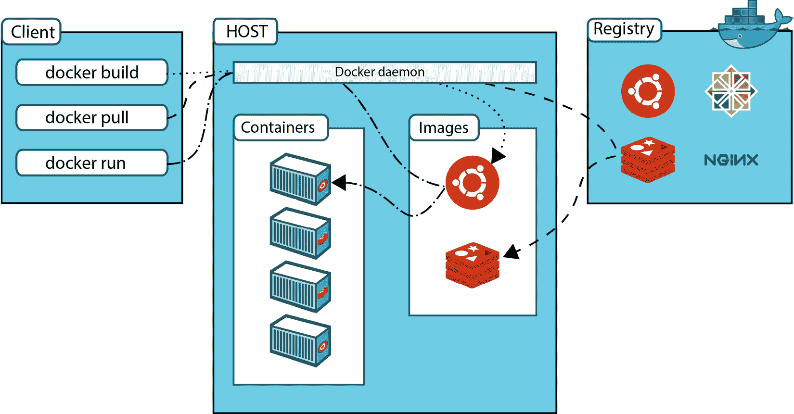
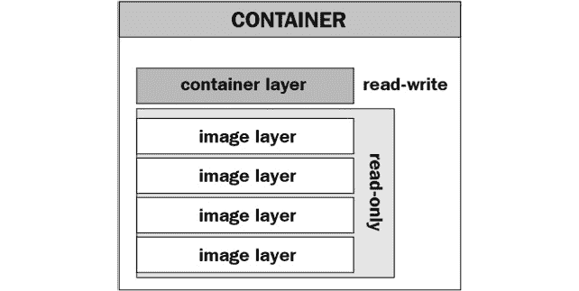

# 3

# 开始使用容器

本章我们将更深入地了解容器，深入探讨容器技术和容器生态系统，并发现常用的工具。

一句中国古老的谚语说：“*我听到的，我忘记；我看到的，我记住；我做的，* *我理解*。”

从本章开始，我们将亲自动手，尝试构建镜像和运行容器，以获得更深入的理解和第一手实践经验。尽管 KCNA 是一项选择题考试，但亲自实践非常重要，这段经验将对你未来的学习有所帮助。**不要只读代码片段——确保完全执行它们，尤其是在你没有容器使用经验的情况下。** 你需要一台运行最新版本的 Linux、Windows 或 macOS 的计算机，以及一个可用的互联网连接。

本章我们将涵盖以下主题：

+   介绍 Docker

+   探索容器技术

+   安装 Docker 并运行容器

+   构建容器镜像

# 技术要求

本章使用的所有示例文件和代码片段已上传到本书的 GitHub 仓库：[`github.com/PacktPublishing/Becoming-KCNA-Certified`](https://github.com/PacktPublishing/Becoming-KCNA-Certified)。

# 介绍 Docker

Docker 已经存在多年，因此你可能听说过它。对许多人来说，*Docker* 这个名字本身就是 *容器* 的代名词。然而，叫做 *Docker* 的东西有很多，容易让人混淆：

+   **Docker Inc.**

+   **Docker Engine**

+   **dockerd**（**Docker 守护进程**）

+   **Docker CLI**

+   **Docker Hub**

+   **Docker Registry**

+   **Docker Swarm**

+   **Docker Compose**

+   **Docker Desktop**

+   **Dockershim**

让我们逐一澄清这些内容。

首先，*Docker 公司*（作为一家公司）并没有发明容器技术，但它创建了易于使用的工具，帮助推动了容器技术的广泛采用。该公司成立于 2008 年，最初名为 dotCloud。

*Docker Engine* 是一个开源软件包，用于构建和容器化应用程序。它是一种客户端-服务器软件，由一个名为 `docker` 的守护进程服务组成。

容器化

容器化是将软件应用代码与依赖项（如库、框架等）一起打包到容器中的过程。容器可以在不同环境之间独立移动，而不依赖于基础设施的操作系统。

当你安装 Docker 引擎时，你实际上安装了两样东西——`dockerd` 服务和 CLI。`dockerd` 会持续运行并监听命令，对容器进行操作，如启动新容器、停止现有容器、重启容器等。这些命令可以通过 `docker` CLI 或常用工具如 `curl` 来发出。本章示例将使用 `docker` CLI。

下一项是 *Docker Hub* ([`hub.docker.com/`](https://hub.docker.com/))，一个公共容器镜像注册表。如你所知，容器镜像是一个预定义的静态模板，我们用它作为启动新容器的基础。那么，我们从哪里获取镜像呢？Docker Hub 就是其中一个地方。它是 Docker 公司提供的在线仓库服务，成千上万的容器镜像存放在其中，包含不同的环境（**Ubuntu**、**Centos**、**Fedora** 和 **Alpine Linux**），以及流行的软件如 **Nginx**、**Postgres**、**MySQL**、**Redis** 和 **Elasticsearch**。Docker Hub 允许你查找、分享和存储容器镜像，这些镜像可以通过互联网轻松拉取（下载）到你需要创建新容器的主机上。值得一提的是，Docker Hub 并不是唯一的此类服务——其他的服务还包括 **Quay** ([`quay.io/`](https://quay.io/))、**Google Container Registry** ([`cloud.google.com/container-registry`](https://cloud.google.com/container-registry)) 和 **Amazon Elastic Container** **Registry** ([`aws.amazon.com/ecr/`](https://aws.amazon.com/ecr/))。

接下来我们来看 *Docker Registry*，它现在由 CNCF 管理，作为一个名为 *Distribution* 的项目。它是一个开源的服务器端应用程序，可以用于存储和分发 Docker 镜像。与 Docker Hub 的主要区别在于，Docker Registry 是你可以直接取来、安装并在你的组织内运行的软件，而且无需付费，而 Docker Hub 是一个 *服务式注册表*，提供一些额外的付费功能。Docker Registry 可用于存储和提供你的 *开发* 团队正在开发的容器镜像。

接下来是 *Docker Swarm*，它的目的在于集群管理和容器编排。Swarm 与 Kubernetes 类似；然而，它仅与 Docker 引擎兼容（意味着不支持其他容器运行时），并且与 Kubernetes 相比，功能要少得多且定制性有限。这也是它没有像 Kubernetes 那样广泛采用的原因。

*Docker Compose* 是另一个 Docker 工具，它允许你定义和共享多容器应用程序的规格。使用 Compose，你可以在一个 **YAML** 格式的文件中定义多个需要相互通信的容器，作为一个应用的一部分。例如，你可以启动一个包含数据库的 *Django* Web 应用，运行在两个容器中，并定义数据库必须先启动，同时暴露容器的某些端口。Compose 可能对于一些本地开发使用 Docker 很有帮助，但它与 Kubernetes 不兼容，因此我们不打算进一步讨论它。

*Docker Desktop* 是一个结合了 Docker 引擎、`docker` CLI、Docker Compose、Kubernetes 以及一些其他工具的 Windows/macOS 工具，它配有 **图形用户界面**（**GUI**）。没错——Docker Desktop 甚至将 Kubernetes 和 K8s 客户端打包在一起，供本地开发使用。Docker Desktop 对非商业用途免费，但如果在组织中使用，则需要付费。也有一个适用于 Ubuntu 和 Debian Linux 的测试版。

*Dockershim* 是一种软件兼容层，旨在使 Kubernetes（准确地说是其 *kubelet* 组件）能够与 `dockerd`（Docker 守护进程）进行通信。正如你可能记得的那样，Kubernetes 没有自己的容器运行时（用于执行基本容器操作的软件，如启动、停止和删除）。在早期版本中，Kubernetes 仅支持 Docker 来操作容器。随着容器生态系统的发展，`dockerd` 并没有一个符合 OCI 标准的接口，因此创建了 Kubernetes 与 `dockerd` 之间的翻译层，称为 **Dockershim**。自 Kubernetes 1.20 版本起，*Dockershim* 已被弃用，并且在 1.24 版本中完全从 K8s 中移除。

最后，我们已经到达了列表的末尾。尽管多年来出现了许多替代方案，Docker 引擎和 Docker 工具仍然被全球成千上万的开发团队和组织积极使用。下图展示了如何使用 Docker CLI 与 Docker 守护进程进行通信，后者从 Docker Registry 中获取镜像并在本地创建容器：



图 3.1 – Docker 架构

在接下来的章节中，我们将安装一些 Docker 工具，看看它的实际操作，最终亲手操作容器。

# 探索容器技术

在进入实践部分之前，我们仍需要弄清楚容器背后的技术以及是谁创造了它。Linux 容器背后的技术其实早在很久之前就已经开发出来，并且基于两个核心内核功能：

+   **cgroups**（**控制组**）

+   **命名空间**

cgroups

cgroups 是一种机制，允许将进程组织成层次结构的组。这些组如何使用资源（如 CPU、内存、磁盘 I/O 吞吐量等）可以被限制、监控和控制。

*cgroups* 最初由谷歌的工程师开发，并于 2007 年首次发布。自 2008 年初以来，cgroups 功能被合并到 Linux 内核中，并一直存在至今。2016 年，发布了 cgroups 的修订版本，现在称为 cgroups 版本 2。

即使在 cgroups 之前，Linux 的命名空间功能在 2002 年就已经开发出来。

Linux 内核命名空间

这个 Linux 特性允许你以某种方式划分内核资源，让一组进程看到一组资源，而另一组进程看到不同的资源。Linux 命名空间用于将进程相互隔离。

命名空间有不同类型，每种类型有其独特的属性：

+   `root`（超级用户）但仅限于其自身的命名空间。

+   `1` 感谢命名空间的存在。

+   **网络命名空间**：这使你能够为一组进程运行独立的网络堆栈，拥有自己的路由表、IP 地址、连接跟踪等。

+   **挂载命名空间**：这使你能够在命名空间内拥有独立的挂载点。这意味着命名空间中的进程可以拥有不同的挂载，而不会影响主机文件系统。

+   **进程间通信（IPC）**：这使你能够隔离 Linux 的进程间通信机制，如共享内存、信号量和消息队列。

+   **UNIX 时间共享（UTS）**：这使你能够为不同的进程设置不同的主机名和域名。

这听起来可能很复杂，但别担心——命名空间和 cgroups 并不属于 KCNA 考试的内容，因此你不需要了解每个命名空间及其作用。然而，由于它们是容器技术的核心，了解它们的基本概念会有所帮助，而且如果你能够解释容器是如何在底层工作的，还会得到额外的加分。

总结一下，*cgroups* 和 *命名空间* 是容器的构建块。cgroups 允许你监控和控制进程（或一组进程）的计算资源，而命名空间则在不同的系统级别隔离进程。这两种功能也可以在没有容器的情况下使用，很多软件都利用了这些功能。

足够的理论，接下来让我们动手实践！在下一部分，我们将安装 Docker 工具并启动第一个容器。

# 安装 Docker 并运行容器

如果你使用的是 Windows 或 macOS，可以从 https://docs.docker.com/desktop/ 下载并安装 Docker Desktop。如果你使用的是最新版本的 Ubuntu Linux，也有 Docker Desktop 的版本可供下载。如果你使用的是其他 Linux 发行版，则需要安装 Docker Engine。你可以在 https://docs.docker.com/engine/install/ 上找到针对你的发行版的详细安装指南。请选择一个 *稳定* 版本进行安装。

如果你重新启动计算机，请确保 Docker Desktop 正在运行。在 Linux 上，你可能需要在终端中执行以下代码：

```
$ sudo systemctl start docker
```

如果你希望系统重启时自动启动，你可以运行以下命令：

```
$ sudo systemctl enable docker
```

无论你安装的是哪种操作系统或工具（桌面版或引擎版），都会随附我们将要使用的 Docker 命令行工具，简称为 `docker`。

首先，让我们通过检查版本来确保 Docker 已正确安装并正在运行。打开终端并输入以下命令：

```
$ docker --version
Docker version 20.10.10, build b485636
```

重要提示

如果你在 Linux 上，并且在安装后没有将你的用户添加到 docker 组中，你需要使用超级用户权限调用 Docker CLI，因此所有的 docker 命令应该加上 `sudo` 前缀。对于上面的示例，命令将是 `sudo` `docker --version`。

你的输出可能会稍有不同——也许你安装了更新的版本。如果之前的命令没有成功，但 Docker 已经安装，确保 Docker Desktop（如果你使用 macOS 或 Windows）或 Docker 守护进程（如果你使用 Linux）正在运行。

现在，让我们启动第一个带有 Ubuntu 22.04 的容器：

```
$ docker run -it ubuntu:22.04 bash
```

你将看到的输出应该类似于以下内容：

```
Unable to find image ‘ubuntu:22.04’ locally
22.04: Pulling from library/ubuntu
125a6e411906: Pull complete
Digest: sha256:26c68657ccce2cb0a31b330cb0be2b5e108d467f641c62e13ab40cbe c258c68d
Status: Downloaded newer image for ubuntu:22.04
root@d752b475a54e:/#
```

哇！我们现在在 Ubuntu 容器内运行 `bash`。镜像可能需要几秒钟才能下载，但一旦准备好，你将看到命令行提示符在新创建的容器内以 `root` 用户身份运行。

那么，当我们调用 `docker run` 时，究竟发生了什么？

`docker run` 在新容器内执行命令；它需要容器镜像的名称，其中命令将被执行（在上面的例子中是 `ubuntu`），可以选择镜像的标签（此处是 `22.04`），以及要执行的命令（此处是简单的 `bash`）。

`-i` 参数与 `--interactive` 相同，表示我们希望以交互模式运行命令。`-t`，即 `--tty`，将分配一个伪 TTY（模拟终端）。

如你所记得，镜像是容器环境的模板。我们请求了一个带有版本 `22.04` 的 `ubuntu` 环境。在输出的前几行中，我们看到该镜像在本地未找到：

```
Unable to find image ‘ubuntu:22.04’ locally
22.04: Pulling from library/ubuntu
125a6e411906: Pull complete
```

如果之前没有下载过带有特定标签的镜像，它将自动从 Docker Hub 库中下载（拉取），并且你应该能够看到下载进度。

现在，让我们退出容器并尝试重新运行它。在终端中输入 `exit`：

```
root@d752b475a54e:/# exit
exit
```

现在，执行我们之前做过的相同命令：

```
$ docker run -it ubuntu:22.04 bash
root@e5d98a473adf:/#
```

这次速度更快了吗？是的，因为我们已经在本地缓存了 `ubuntu:22.04` 镜像，所以不需要再下载它。因此，容器立即启动了。

你有没有注意到这次 `root@` 后面的主机名不同了——`e5d98a473adf` 与 `d752b475a54e`？*（注意：你将在这里看到你独特的容器名称。）* 这是因为我们启动了一个基于相同 `ubuntu` 镜像的新容器。当我们启动一个新容器时，并不会修改只读源镜像；相反，我们在镜像上创建了一个新的可写文件系统层。下面的图表展示了这种分层方法：



图 3.2 – 容器层

当我们启动一个容器时，我们添加了一个新的层，这使得容器镜像的副本可以进行修改。通过这种方式，我们可以从相同的基础镜像创建任意数量的容器，而无需修改初始的只读镜像层。这种方法的主要优点是**在容器层中，我们仅存储与镜像层的差异**，这意味着在大规模使用时可以显著节省磁盘空间。

镜像也可以由多个层组成，其中一个层可能源自另一个层。在接下来的章节中，我们将学习如何构建新镜像并将我们喜欢的软件包含在其中。

随时探索我们的容器环境，并在完成后`exit`退出：

```
$ docker run -it ubuntu:22.04 bash
root@e5d98a473adf:/# echo “Hello World” > /root/test
root@e5d98a473adf:/# hostname
e5d98a473adf
root@e5d98a473adf:/# date
Sun May 1 13:40:01 UTC 2022
root@e5d98a473adf:/# exit
exit
```

当我们在第一个容器中执行`exit`时，它退出了；稍后，当我们再次执行`docker run`时，一个新的容器被创建。现在，由于两个容器都已经退出，我们在磁盘上有一个镜像层，以及基于`ubuntu:22.04`基础镜像的两个不同容器层。

由于容器层仅跟踪与基础镜像的差异，直到所有容器层被删除之前，我们无法删除基础镜像。让我们通过运行以下代码获取本地镜像的列表：

```
$ docker images
REPOSITORY    TAG       IMAGE ID       CREATED      SIZE
ubuntu       22.04    d2e4e1f51132   39 hours ago  77.8MB
```

如果我们尝试使用`docker rmi`命令删除`ubuntu:22.04`镜像，我们会遇到一个错误：

```
$ docker rmi ubuntu:22.04
Error response from daemon: conflict: unable to remove repository reference “ubuntu:22.04” (must force) – container e5d98a473adf is using its referenced image d2e4e1f51132
```

我们还可以执行`docker ps`命令来查看所有*正在运行*的容器：

```
$ docker ps
CONTAINER ID  IMAGE  COMMAND  CREATED  STATUS  PORTS  NAMES
```

一个空表格表示当前没有容器在运行。

最后，我们可以执行`docker ps --all`来查看本地系统上的所有容器，包括那些已退出的容器：

```
$ docker ps --all
CONTAINER ID    IMAGE    COMMAND    CREATED              STATUS         PORTS   NAMES
e5d98a473adf  ubuntu:22.04  “bash” 8 minutes ago  Exited (0) 2 minutes ago vibrant_jenn
d752b475a54e  ubuntu:22.04  “bash” 18 minutes ago  Exited (0) 12 minutes ago  cool_perl
```

尝试使用`docker rm` `CONTAINER ID`删除那些已退出的容器：

```
$ docker rm d752b475a54e
d752b475a54e
$ docker rm e5d98a473adf
e5d98a473adf
```

现在，镜像也应该被删除：

```
$ docker rmi ubuntu:22.04
Untagged: ubuntu:22.04
Untagged: ubuntu@sha256:26c68657ccce2cb0a31b330cb0be2b5e108d467f641c62e13ab40cbe c258c68d
Deleted: sha256:d2e4e1f511320dfb2d0baff2468fcf0526998b73fe10c8890b4684bb 7ef8290f
Deleted: sha256:e59fc94956120a6c7629f085027578e6357b48061d45714107e79f04 a81a6f0c
```

`sha256`是镜像层的摘要；它们是唯一且不可变的标识符。如果我们为`ubuntu`镜像分配一个不同的标签而不是`22.04`，并尝试从 Docker Hub 再次拉取（下载）相同的镜像，Docker 会识别出我们已经拥有这个摘要的镜像，并且除了重新标记它之外，不会做任何事情。

让我们再试一件事——拉取另一个没有标签的 Docker 镜像。如果你仅仅`pull`镜像，那么不会启动容器，但这样可以节省下次从该镜像启动新容器时的下载时间：

```
$ docker pull centos
Using default tag: latest
latest: Pulling from library/centos
a1d0c7532777: Pull complete
Digest: sha256:a27fd8080b517143cbbbab9dfb7c8571c40d67d534bbdee55bd6c473 f432b177
Status: Downloaded newer image for centos:latest
docker.io/library/centos:latest
```

如你所见，如果我们没有明确指定标签，默认会使用`latest`。

在接下来的章节中，我们将进一步了解`latest`标签的含义、标签的基本概念以及如何使用 Docker 构建镜像。

# 构建容器镜像

现在我们知道如何启动容器和拉取镜像，我们将学习如何创建新的容器镜像。由于镜像层是不可变的，你可以通过在现有镜像之上添加新层来创建你选择的软件的新镜像。使用 Docker 可以通过两种方式来实现：

+   交互模式

+   使用 Dockerfile

交互式方法是从现有容器创建镜像。假设你启动了一个 Ubuntu 22.04 环境的容器，安装了附加包并暴露了端口`80`。要创建新镜像，我们可以使用`docker commit`命令：

```
 $ docker commit CONTAINER_ID [REPOSITORY[:TAG]] 
```

镜像名称将采用`REPOSITORY:TAG`格式。如果没有指定标签，则会自动添加`latest`。如果没有指定仓库，则镜像名称将是**唯一标识符**（**UUID**）。标签和名称（与镜像仓库的名称相同）可以在构建后更改或应用。

虽然交互式方法快捷且简单，但在正常情况下不应使用它，因为它是一个手动、容易出错的过程，生成的镜像可能会更大，且包含许多不必要的层。

构建镜像的第二个、更好的选择是使用 Dockerfile。

Dockerfile

Dockerfile 是一个包含构建镜像指令的文本文件。它支持运行 shell 脚本、安装附加包、添加和复制文件、定义默认执行的命令、暴露端口等。

让我们来看一个简化版的 Dockerfile：

```
FROM ubuntu:22.04
RUN apt-get update && apt-get install -y curl vim
LABEL description=”My first Docker image”
```

正如你可能已经猜到的，`FROM`指令定义了我们将要构建的镜像的基础镜像和标签。基础镜像也可以是我们之前构建的本地镜像，或者是来自镜像仓库的镜像。`RUN`指令执行`apt-get update`，然后安装`curl`和`vim`包。`LABEL`是你想要添加到镜像中的任何元数据。如果你将前面的内容复制到一个名为`Dockerfile`的文件中，你就可以通过在同一文件夹中调用`docker build`来构建一个新镜像：

```
$ docker build . -t myubuntuimage
[+] Building 11.2s (6/6) FINISHED
 => [internal] load build definition from Dockerfile                                                                                                                                                                                   0.0s
 => => transferring dockerfile: 153B                                                                                                                                                                                                     0.0s
 => [internal] load .dockerignore                                                                                                                                  
                                                        0.0s
 => => transferring context: 2B                                                                                                                                                                                                       0.0s
 => [internal] load metadata for docker.io/library/ubuntu:22.04                                                                                                                                                                        0.0s
 => [1/2] FROM docker.io/library/ubuntu:22.04                                                                                                                                                                                             0.0s
 => [2/2] RUN apt-get update && apt-get install -y curl vim                                                                                                                                                                            9.9s
 => exporting to image                                                                                                                                                                                                    1.1s
 => => exporting layers                                                                                                                                          
                                                        1.1s
 => => writing image sha256:ed53dcc2cb9fcf7394f8b03818c02e0ec4 5da57e89b550b68fe93c5fa9a74b53                                                                                                                                           0.0s
 => => naming to docker.io/library/myubuntuimage                                                                                                                                                                                       0.0s
```

使用`-t myubuntuimage`，我们指定了镜像的名称，但没有实际的标签。这意味着默认会为镜像应用`latest`标签：

```
$ docker images
REPOSITORY      TAG     IMAGE ID       CREATED       SIZE
myubuntuimage  latest  ed53dcc2cb9f   6 minutes ago   176MB
centos         latest  5d0da3dc9764   7 months ago    231MB
```

关于`latest`标签，我们需要澄清一些内容，因为它可能会产生误导：

+   如果在构建过程中没有指定标签，`latest`会默认应用。

+   如果在镜像下载或容器运行时没有指定标签，默认会拉取`latest`。

+   `latest`不会动态更新；你可以将任何镜像标记为`latest`——即使是同一镜像的旧版本。

因此，最佳实践是使用更具描述性的标签来标记镜像，而不是依赖`latest`。例如，可以使用打包应用程序的递增版本（如 v.0.32、v.1.7.1 等）作为标签，甚至可以使用构建时间戳。时间戳使我们能够确定镜像的构建时间，而无需检查每个镜像的元数据。

让我们快速回顾一下 Dockerfile 中支持的指令。我们已经了解了`FROM`、`RUN`和`LABEL`，但还有更多：

+   `ADD`：用于将文件和目录*添加到*Docker 镜像中（从构建位置或远程 URL）。

+   `COPY`：用于将文件*复制到*Docker 镜像内部。

+   `CMD`：用于定义 Docker 镜像的默认可执行文件（只有最后一个 `CMD` 指令会被尊重）。`CMD` 可以在容器运行时被轻松覆盖。

+   `ENTRYPOINT`：类似于 `CMD`，允许我们在启动容器时定义镜像的可执行文件。它可以与 `CMD` 一起使用。

+   `EXPOSE`：告诉我们，镜像中的应用程序在运行时会监听特定的网络端口。

+   `ENV`：用于设置镜像中的任何环境变量。

+   `USER`：设置 `RUN`、`CMD` 或 `ENTRYPOINT` 指令的用户名。

+   `VOLUME`：用于创建一个挂载点并标记其与外部挂载卷一起使用（例如，从启动容器的主机中）。

+   `WORKDIR`：设置 `RUN`、`CMD` 和 `ENTRYPOINT` 指令的工作（当前）目录。

关于 `CMD` 和 `ENTRYPOINT` 的简要说明：它们相似，但并不相同。我们可以在 Dockerfile 中指定 `CMD`、`ENTRYPOINT` 或两者。如果同时指定，则 `CMD` 作为 `ENTRYPOINT` 的参数。由于 `CMD` 在运行时更容易被覆盖，因此通常 `ENTRYPOINT` 是可执行文件，而 `CMD` 是参数。例如，我们可以将 `ENTRYPOINT` 设置为 `/bin/cat`，并使用 `CMD` 给出要连接的文件路径（如 `/etc/hosts`、`/etc/group` 等）。对于 Docker Hub 上的许多公共镜像，`ENTRYPOINT` 默认设置为 `/bin/sh -c`。

这个列表并不是 Dockerfile 支持的指令的完整参考，但它列出了涵盖 99% 场景的最常用指令。此外，你通常不会在笔记本电脑或本地工作站上构建容器；相反，你会使用现代 CI/CD 系统或 Docker Hub 上的自动构建作为替代。

现在，让我们了解当容器被使用时，开发工作流可能是什么样子的：

1.  软件开发人员使用自己选择的编程语言编写应用程序代码——例如，**Python**、**Java**、**Ruby**、**Node.js**、**Golang** 或其他任何语言。

重要说明

无需学习新的编程语言——任何在 Linux 环境中运行的软件也可以在容器中运行。

1.  代码经过测试并推送到 GitHub 仓库或其他版本控制系统。当源代码发生变化时，CI/CD 或第三方解决方案会被触发，应用程序会根据定义的 Dockerfile 打包到容器镜像中。

1.  Dockerfile 指令用于将代码复制并在容器镜像层内运行和安装。根据选择的语言和操作系统环境，这些指令有所不同。例如，Node.js 应用程序可能需要运行 `yarn install`，而 Python 应用程序则需要使用 `pip` 命令进行安装，等等。

1.  镜像被构建、标记并推送（上传）到镜像注册中心。这可能是例如 Docker Hub 中的私有仓库，云服务提供商提供的仓库，甚至是你公司内部维护的注册中心。

1.  此时，镜像可以由容器编排工具，如 Kubernetes，或者具有容器运行时的服务器，甚至只是由安装了 Docker 工具的其他团队成员下载并运行。

如你所记得，容器的主要特点之一是 *可移植性*——一个在某个主机上运行的容器也能在另一个主机上运行。这意味着你可以有一个包含 Alpine Linux 的容器镜像，并在你的 Fedora Linux 笔记本电脑上或基于 Ubuntu 的 Kubernetes 集群上运行它。

等等——我们能在 Windows 上运行 Linux 容器，或者反过来吗？其实不能。首先，我们需要区分 Linux 容器和 Windows 容器。

重要提示

本书的所有内容和 KCNA 考试本身都仅涉及 Linux 容器。

即使你在 Windows 上运行 Docker Desktop，它在后台也使用了一个最小化的 **Linuxkit** 虚拟机。Windows 容器是不同的，可能使用今天在微软操作系统中可用的两种隔离模式之一（**WSL 2** 或 **Hyper-V**）。如果你在 Windows 上运行，Docker Desktop 允许你在 *Windows 容器* 和 *Linux 容器* 之间切换。但请记住，全球超过 90% 的服务器运行的是 Linux，因此除非你打算在容器中运行仅限 Windows 的应用程序，否则你只需要学习和使用 Linux 容器。

# 总结

在这一章中，我们通过 (Linux) 容器获得了经验，并了解到容器背后的技术已经存在多年，基于 *cgroups* 和内核 *namespaces*。

Docker 推出了旨在为开发人员和工程师提供一种通用且简单的方式来打包和共享应用程序的工具。在容器出现之前，应用程序通常能够在开发环境中正常工作，但在生产环境中由于未满足的依赖关系或安装了不正确的版本而无法运行。容器通过将应用程序与所有依赖项和系统包捆绑在一个称为容器镜像的模板中解决了这个问题。

容器镜像可以存储在支持私有和公有仓库的注册中心，并允许你与不同的团队共享它们。**Docker Hub**、**Quay** 和 **Google Container Registry**（**GCR**）是目前一些最知名的容器镜像注册中心，可以通过互联网访问。被推送（上传）到注册中心的镜像可以通过容器编排工具，如 Kubernetes，或者仅通过具有容器运行时的服务器，通过互联网进行拉取（下载）。

镜像用于创建容器，因此容器是镜像的运行实例。当容器以可写的文件系统启动时，会在不可变镜像层之上创建一层。容器和镜像可以有多个层，并且我们可以从单个镜像启动任意多个容器。与虚拟机相比，容器更加轻量，并且启动速度非常快。

我们还学习了，使用 Docker 构建容器镜像时，可以利用交互式或 Dockerfile 方法。通过 Dockerfile，我们定义一组指令来构建包含容器化应用程序的镜像。

在下一章中，我们将继续探索容器，学习 Kubernetes 提供的运行时和可插拔接口。

# 问题

总结时，以下是一些问题，供你测试本章内容的知识。你可以在*评估*部分的*附录*中找到答案：

1.  以下哪项特性描述了容器（选择两个）？

    1.  环境之间的可移植性

    1.  镜像体积大

    1.  镜像体积小

    1.  高安全性

1.  以下哪些是正确的（选择两个）？

    1.  应用程序在容器中打包容易

    1.  应用程序在虚拟机中打包容易

    1.  容器镜像易于共享

    1.  虚拟机镜像易于共享

1.  开发者需要学习哪种编程语言来在容器中运行他们的代码？

    1.  Dockerlang

    1.  Golang

    1.  Python

    1.  无 – 容器允许与操作系统环境支持的语言相同的语言

1.  以下哪些问题是容器解决的（选择两个）？

    1.  环境之间的不满足依赖关系

    1.  应用程序代码中的错误

    1.  需要测试应用程序代码

    1.  长时间的虚拟机启动时间

1.  以下哪项是容器使用的（选择两个）？

    1.  `cgroups`

    1.  `hwmon`

    1.  `acpi`

    1.  `kernel namespaces`

1.  以下哪些可以用于共享容器镜像（选择两个）？

    1.  Docker Hub

    1.  Docker Swarm

    1.  Docker Registry

    1.  Docker Compose

1.  以下哪些关于容器镜像的说法是正确的（选择两个）？

    1.  它们只能通过 Dockerfile 构建

    1.  它们包含不可变的文件系统层

    1.  最新的镜像始终标记为 latest

    1.  它们可以通过交互式方式构建

1.  以下哪些适用于启动新容器时（选择两个）？

    1.  会创建一个新的可写文件系统层

    1.  请求的镜像总是被拉取

    1.  如果本地找不到请求的标签（SHA 摘要），则会拉取镜像

    1.  加载新的 Linux 内核

1.  以下哪些关于容器镜像标签的说法是正确的（选择两个）？

    1.  每个镜像必须有标签

    1.  在构建时，最新标签会自动应用，除非被覆盖

    1.  同一镜像不能有多个标签

    1.  同一镜像可以有多个名称（仓库）和标签

1.  如何使用 Docker 工具创建新容器？

    1.  `docker run`

    1.  `docker exec`

    1.  `docker spawn`

    1.  `docker launch`

# 进一步阅读

本章提供了容器生态系统的概述以及通过 KCNA 考试所需的知识，但并没有涵盖 Docker 工具的所有功能，也没有详细描述 cgroups 和 namespaces。如果你希望更进一步，建议你查阅以下资源：

+   cgroups v1：[`www.kernel.org/doc/Documentation/cgroup-v1/cgroups.txt`](https://www.kernel.org/doc/Documentation/cgroup-v1/cgroups.txt)

+   Namespaces：[`man7.org/linux/man-pages/man7/namespaces.7.html`](https://man7.org/linux/man-pages/man7/namespaces.7.html)

+   Docker 入门：[`docs.docker.com/get-started/`](https://docs.docker.com/get-started/)

+   编写 Dockerfile 的最佳实践：[`docs.docker.com/develop/develop-images/dockerfile_best-practices/`](https://docs.docker.com/develop/develop-images/dockerfile_best-practices/)
