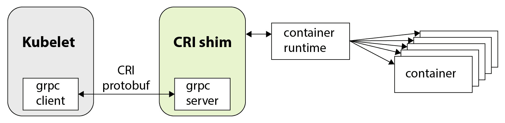
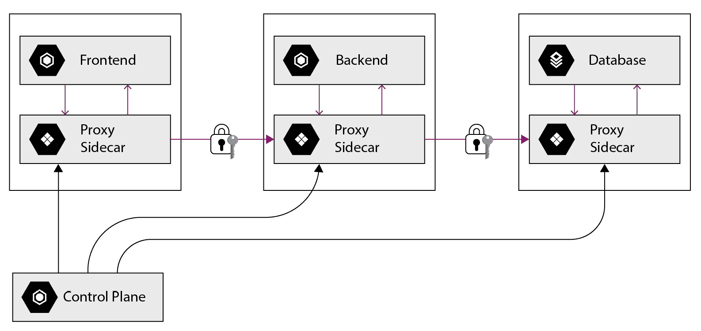

# 4

# 探索容器运行时、接口和服务网格

在本章中，我们将进一步探讨容器运行时、网络、接口，并学习服务网格。我们将了解现存的运行时实现及其差异，学习容器如何通过网络相互通信，Kubernetes 中存在哪些容器接口，并了解什么是服务网格及其应用。我们还将通过之前安装的 Docker 工具进行一些额外的练习，以支持我们的学习之旅。

本章内容将涉及 KCNA 认证的*容器编排*领域，这部分是考试中第二大部分，因此请确保回答本章末尾的所有问题。

以下是我们将要涵盖的主题：

+   容器运行时

+   容器网络

+   容器存储

+   容器安全

+   介绍服务网格

开始吧！

# 容器运行时

正如你从前几章了解到的，容器可以在虚拟机、云端、本地、裸金属服务器上运行，甚至仅仅在你的笔记本电脑上运行。负责执行基本操作的软件，如从镜像仓库下载镜像并创建、启动、停止或删除容器，被称为**容器运行时**。我们已经学习了 Docker 工具和运行时，但实际上还有更多的运行时存在，包括以下几种：

+   **Containerd**

+   **CRI-O**

+   **kata**

+   **gVisor**

在深入了解运行时细节之前，我们需要理解什么是**容器运行时接口**（**CRI**）。

CRI

CRI 是一个插件接口，允许 Kubernetes 使用不同的容器运行时。在引入 CRI 之前的 Kubernetes 早期版本中，只能使用 Docker 作为运行时。

如你所记得，Kubernetes 没有自己的运行时来执行基本的容器操作，因此它需要一个运行时来管理容器，并且该运行时必须是 CRI 兼容的。例如，Docker 引擎不支持 CRI，但大多数其他运行时，包括*containerd*或*CRI-O*，都支持 CRI。本质上，CRI 定义了 Kubernetes 与所选运行时之间的通信协议，使用的是**gRPC**（高性能的**远程过程调用**框架），如*图 4.1*所示：



图 4.1 – 容器运行时与 CRI 的集成

最初，Kubernetes 中没有 CRI 实现，但随着新容器运行时的开发，将它们全部集成到 Kubernetes 中变得越来越困难。因此，解决方案是定义一个标准接口，以便与任何运行时兼容。Kubernetes 版本 1.5 中引入 CRI 后，允许在单个 K8s 集群中使用多个容器运行时，并且也使得开发兼容的运行时变得更容易。今天，*containerd*是 Kubernetes 新版本中最常用的运行时。

但为什么你需要在同一个集群中运行不同的容器运行时呢？这是一个相对高级的场景，背后的主要原因是某些容器运行时可以为更敏感的容器工作负载提供更好的安全性。因此，当我们讨论容器及其运行时时，我们需要区分三种主要类型：

+   **命名空间** – 最快且最常用的类型，它基于 Linux 内核的 *cgroups* 和 *namespaces* 功能，这些我们在上一章中已介绍。此类型共享相同的内核来运行多个容器，因此被认为是所有容器类型中安全性最低的。例子包括 *Docker*、*containerd* 和 *CRI-O*。

+   **虚拟化** – 最慢的容器类型，实际上需要像虚拟机一样使用虚拟机监控程序。每个容器都在其自己的轻量级虚拟机中启动，拥有自己的专用内核。此类型被认为是最安全的，因为它为容器工作负载提供了最大程度的隔离。虚拟化容器的启动速度仍然比虚拟机快，而且它们相对于传统虚拟机的优势在于它们能够轻松与容器编排系统（如 Kubernetes）集成。*Kata* 项目是虚拟化容器的一个例子。

+   **沙盒** – 这是一种介于其他两者之间的容器类型，提供比命名空间容器更好的安全性，同时又比虚拟化容器更快。更好的安全性通过另一个隔离层来实现，这一层拦截来自容器工作负载的系统调用。*gVisor* 是一个来自 Google 的开源项目，允许创建沙盒容器。

虽然这听起来可能非常复杂，但在 KCNA 考试的范围内，你不需要了解容器运行时的所有细节。如果你以后参加 CKS 考试或有特殊用途使用 *沙盒* 或 *虚拟化* 容器，这些知识才会用得上。现在，请确保记住哪些容器运行时是存在的，并且在大多数场景中，*命名空间* 容器是常用的。同时，不要把 *CRI* 和 *OCI* 混淆，我们在 *第二章*中已经讲过，*CNCF 和 Kubernetes 认证概述*。

重要提示

**开放容器倡议** (**OCI**) 提供了容器行业规范（镜像、运行时和分发规范），而 CRI 是 Kubernetes 的一部分，它使得可以以可插拔的方式与 K8s 一起使用不同的容器运行时。

在实际操作中，你并不会直接与容器运行时进行交互，而是使用像 Kubernetes 或 Docker Swarm 这样的编排系统。我们还可以使用 CLI 来与容器运行时进行交互，就像我们使用 Docker CLI，或者在使用*containerd*运行时时，你可以使用`ctr`或`nerdctl` CLI。

接下来，在以下部分中，我们将学习更多关于容器网络的内容。

# 容器网络

到目前为止，我们只尝试过创建单个容器。然而，在现实世界中，我们需要处理成十上百个容器。随着微服务架构的广泛应用，应用程序被拆分为多个较小的部分，这些部分通过网络互相通信。一个应用程序可能由前端部分、多个后端服务和数据库层组成，其中前端接收到的用户请求会触发与后端的通信，而后端则会与数据库进行交互。当每个组件都运行在自己独立的容器中，并且跨多个服务器时，理解它们如何相互通信是至关重要的。网络是容器和 Kubernetes 的一个重要部分，理解这些如何工作是非常具有挑战性的。目前，我们只会简单触及容器间通信的表面，更多关于暴露容器和 K8s 细节的内容将在后续章节中介绍。

让我们回到前一章中安装的 Docker 工具，并尝试启动另一个 Ubuntu 容器。

重要提示

在尝试启动容器之前，请确保 Docker Desktop 正在运行。如果你之前没有启用自动启动，可能需要手动启动它。在 Linux 的 Docker Engine 上，你可能需要执行`$ sudo systemctl start docker`。

打开终端并运行以下命令：

```
$ docker run -it ubuntu:22.04 bash
```

因为该镜像被精简到最小化以节省空间，所以没有预安装像`net-tools`这样的基本软件包。我们可以通过调用`apt update`和`apt install`来在容器内安装这些包：

```
root@5919bb5d37e3:/# apt update; apt -y install net-tools
… SOME OUTPUT OMITTED …
Reading state information... Done
The following NEW packages will be installed:
  net-tools
… SOME OUTPUT OMITTED …
Unpacking net-tools (1.60+git20181103.0eebece-1ubuntu5) ...
Setting up net-tools (1.60+git20181103.0eebece-1ubuntu5) ...
root@5919bb5d37e3:/#
```

现在我们已经安装了`net-tools`，可以在容器内使用`ifconfig`工具。你看到的输出应该类似于此：

```
root@5919bb5d37e3:/# ifconfig
eth0: flags=4163<UP,BROADCAST,RUNNING,MULTICAST>  mtu 1500
        inet 172.17.0.2  netmask 255.255.0.0  broadcast 172.17.255.255
        ether 02:42:ac:11:00:02  txqueuelen 0  (Ethernet)
        RX packets 14602  bytes 21879526 (21.8 MB)
        RX errors 0  dropped 0  overruns 0  frame 0
        TX packets 3127  bytes 174099 (174.0 KB)
        TX errors 0  dropped 0 overruns 0  carrier 0  collisions 0
lo: flags=73<UP,LOOPBACK,RUNNING>  mtu 65536
        inet 127.0.0.1  netmask 255.0.0.0
        loop  txqueuelen 1000  (Local Loopback)
        RX packets 5  bytes 448 (448.0 B)
        RX errors 0  dropped 0  overruns 0  frame 0
        TX packets 5  bytes 448 (448.0 B)
        TX errors 0  dropped 0 overruns 0  carrier 0  collisions 0
```

我们还可以通过在容器内调用`route`工具来查看容器的路由表。输出将类似于以下内容：

```
root@9fd192b5897d:/# route
Kernel IP routing table
Destination     Gateway         Genmask         Flags Metric Ref     Use Iface
default         172.17.0.1      0.0.0.0         UG    0      0         0 eth0
172.17.0.0      0.0.0.0         255.255.0.0     U     0      0         0 eth0
```

正如我们所看到的，我们的容器具有`eth0`接口，IP 地址是`172.17.0.2`。在你的情况下，地址可能不同，但重要的是，我们的容器默认会有自己独立的网络堆栈，包括自己的（虚拟）接口、路由表、默认网关等等。

如果我们现在打开另一个终端窗口并执行`docker network ls`，我们将看到使用哪些驱动程序支持哪些网络类型。输出将类似于以下内容：

```
$ docker network ls
NETWORK ID     NAME      DRIVER    SCOPE
c82a29c5280e   bridge    bridge    local
83de399192b0   host      host      local
d4c7b1acbc0d   none      null      local
```

有三种基本的网络类型：

+   `bridge` – 这是我们创建的 Docker 容器的默认类型和驱动程序。它允许连接到同一主机上的桥接网络的容器相互通信，并与其他容器隔离（这些容器也可以连接到自己的桥接网络）。借助主机的**网络地址转换**（**NAT**）和**IPtables**，容器可以与*外界*进行通信。

+   `host` - 这是一种类型，用于在不需要网络隔离时创建容器。使用主机网络生成的容器不会与创建它的主机系统的网络隔离。例如，您可以启动一个带有 Apache Web 服务器监听 `80` 端口的容器，并且它将立即可以从同一网络中的任何其他主机访问，除非受到防火墙的保护。

+   `none` - 这是一个很少使用的选项，意味着容器的所有网络都将被禁用。

注意，`docker network ls` 输出中的这些类型具有 `local` 范围，这意味着它们可以用于我们在 Docker 中生成容器的单个主机上。但是它们不会允许在一个服务器上创建的容器直接与在另一个服务器上创建的容器通信（除非使用主机网络，这类似于在没有涉及容器的情况下直接在主机上运行应用程序）。

为了在多个主机之间建立容器相互通信的网络，我们需要所谓的*覆盖*网络。覆盖网络将多个服务器连接在一起，允许位于不同主机上的容器之间进行通信。

覆盖网络

一个覆盖网络是在另一个网络顶部运行的虚拟网络，通常使用数据包封装 - 覆盖网络数据包位于另一个数据包内，该数据包被转发到特定主机。

无论您是在运行 Kubernetes、Docker Swarm 还是其他解决方案来编排容器，实际上，您总是会为您的工作负载运行多个主机，并且运行在这些主机上的容器需要使用覆盖网络相互通信。

谈到 Kubernetes，类似于 CRI，它实现了**容器网络接口**（**CNI**），允许以可插拔的方式使用不同的覆盖网络。

CNI

CNI 是一个允许 Kubernetes 使用不同的覆盖网络插件的接口。

CNI 的引入使得第三方能够开发符合 Kubernetes 并提供其自身独特特性的解决方案，例如容器网络中的流量加密或网络策略（防火墙规则）。

今天在 Kubernetes 中使用的一些 CNI 网络插件包括**flannel**、**Cilium**、**Calico** 和 **Weave**，仅举几例。Kubernetes 还支持同时使用多个插件，如**Multus**（一个多网络插件）；但这是 KCNA 考试范围外的高级主题。在书籍的*第三部分*，*学习 Kubernetes 基础*中，我们将进一步深入了解 Kubernetes 中的网络，但现在是时候深入研究容器存储了。

# 容器存储

容器设计时是轻量级的，正如我们之前看到的那样，即使是`ifconfig`和`ping`等基本工具也可能不包含在容器镜像中。这是因为容器代表了操作系统环境的最小版本，我们只安装我们要容器化的应用及其依赖项。通常，容器镜像中不需要预安装很多包或工具，除非是应用程序运行所必需的。

容器默认不保持状态，这意味着如果你在容器文件系统内放置了一些文件，并且在删除容器后，这些文件将完全消失。因此，通常我们称容器为**无状态**的，而容器中的磁盘文件则是**短暂的**。

这并不意味着我们不能使用容器来存储重要数据，以便在容器失败或应用退出时能够持久化数据。

注意

如果容器中运行的应用失败、崩溃或简单地终止，容器默认也会停止。

通过使用*外部*存储系统，确实可以保留容器中的重要数据。

外部存储可以是一个通过协议如**iSCSI**附加到容器的块卷，也可以是一个**网络文件系统**（**NFS**）挂载，举个例子，或者外部存储也可以仅仅是容器主机上的一个*本地*目录。外部存储有很多选择，但我们通常将外部容器存储称为*卷*。

一个容器可以有多个附加的卷，而这些卷可以由不同的技术、协议和硬件支持。卷还可以在容器之间共享，或者从一个容器中分离并附加到另一个容器。卷的内容存在于容器生命周期之外，使我们能够解耦容器和应用数据。卷使我们能够在容器中运行需要写入磁盘的**有状态**应用程序，无论是数据库、应用程序还是其他任何文件。

让我们回到带有 Docker 工具的计算机，尝试在终端中运行以下命令：

```
$ docker run -it --name mycontainer --mount source=myvolume,target=/app ubuntu:22.04 bash
```

当我们运行并将*tty*附加到容器时，我们应该能够看到我们的新`myvolume`挂载在容器的`/app`目录下：

```
root@e642a068d4f4:/# df -h
Filesystem      Size  Used Avail Use% Mounted on
overlay         126G  7.9G  112G   7% /
tmpfs            64M     0   64M   0% /dev
tmpfs           3.0G     0  3.0G   0% /sys/fs/cgroup
shm              64M     0   64M   0% /dev/shm
/dev/vda1       126G  7.9G  112G   7% /app
tmpfs           3.0G     0  3.0G   0% /proc/acpi
tmpfs           3.0G     0  3.0G   0% /sys/firmware
root@e642a068d4f4:/# cd /app/
root@e642a068d4f4:/app#
```

发生的情况是，Docker 在开始时自动为我们的容器创建并附加了一个`local`卷。Local 意味着该卷由容器启动时所在主机上的一个目录提供支持。

重要提示

本地存储可以用于测试或某些开发工作，但绝不适用于生产工作负载和关键业务数据！

如果我们现在在`/app`写入任何文件，它们将会持久化：

```
root@e642a068d4f4:/app# echo test > hello_world
root@e642a068d4f4:/app# cat hello_world
test
root@e642a068d4f4:/app# exit
exit
```

即使我们通过调用`docker rm`来删除容器：

```
$ docker rm mycontainer
mycontainer
```

通过调用`docker volume ls`，我们可以看到当前在主机上存在的卷：

```
$ docker volume ls
DRIVER    VOLUME NAME
local     myvolume
```

要获取有关卷的更多详细信息，我们可以使用`docker volume` `inspect`命令：

```
$ docker volume inspect myvolume
[
    {
        "CreatedAt": "2022-05-15T18:00:06Z",
        "Driver": "local",
        "Labels": null,
        "Mountpoint": "/var/lib/docker/volumes/myvolume/_data",
        "Name": "myvolume",
        "Options": null,
        "Scope": "local"
    }
]
```

此时，你可以自由地自己尝试更多关于卷的操作。例如，你可以创建一个新容器并附加现有卷，以确保数据仍然存在：

```
$ docker run -it --name mycontainer2 --mount source=myvolume,target=/newapp ubuntu:22.04 bash
root@fc1075366787:/# ls /newapp/
hello_world
root@fc1075366787:/# cat /newapp/hello_world
test
```

现在，说到 Kubernetes，你可能已经猜到了——类似于 CRI 和 CNI，K8s 实现了 **Container Storage** **Interface**（**CSI**）。

CSI

CSI 允许使用可插拔的存储层。外部存储系统可以通过 CSI 以标准化的方式集成到 Kubernetes 中使用。

CSI 允许供应商和云服务提供商为他们的存储服务或硬件设备实现支持。例如，有一个**Amazon Elastic Block Store**（**EBS**）CSI 驱动程序，它允许你通过 Kubernetes 完全管理 AWS 云中 EBS 卷的生命周期。还有一个**NetApp Trident** CSI 项目，它支持各种 NetApp 存储设备，容器可以在 Kubernetes 中使用这些设备。现在，还有许多其他与 CSI 兼容的存储解决方案。

Kubernetes 在管理存储方面非常强大；它可以在集群中的主机和容器之间自动配置、附加和重新附加卷。我们将在 *第六章*，*使用 Kubernetes 部署和扩展应用程序* 中更详细地学习 Kubernetes 在有状态应用程序中的功能，现在让我们继续学习容器安全性。

# 容器安全性

容器安全性是一个高级且复杂的话题，即使是入门级的 KCNA 认证，你也需要了解一些基础知识。正如我们所学，*命名空间*容器是最常用的容器，它们共享底层操作系统的内核。这意味着在一个容器中运行的进程无法看到其他容器中运行的进程或主机上运行的进程。然而，在同一主机上运行的所有进程仍然使用相同的内核。如果其中一个容器被攻破，那么主机和其他所有容器都有可能被攻破。

让我们回到 Docker 配置，进行快速演示。启动一个 Ubuntu 容器，像之前一样运行 `uname -r` 命令，查看使用的是哪个内核版本：

```
$ docker run -it ubuntu:22.04 bash
root@4a3db7a03ccf:/# uname -r
5.10.47-linuxkit
```

你看到的输出取决于你的主机操作系统和内核版本。如果你看到另一个版本，不要感到惊讶。例如，你可能会看到这样的输出：

```
 5.13.0-39-generic
```

现在，退出容器，启动另一个较旧版本的 `Ubuntu:16.04`：

```
$ docker run -it ubuntu:16.04 bash
Unable to find image 'ubuntu:16.04' locally
16.04: Pulling from library/ubuntu
58690f9b18fc: Pull complete
b51569e7c507: Pull complete
da8ef40b9eca: Pull complete
fb15d46c38dc: Pull complete
Digest: sha256:20858ebbc96215d6c3c574f781133ebffdc7c18d98af 4f294cc4c04871a6fe61
Status: Downloaded newer image for ubuntu:16.04
root@049e8a43181f:/# uname -r
5.10.47-linuxkit
root@049e8a43181f:/#
```

看到了吗？我们使用了一个已经有超过 5 年历史的`Ubuntu:16.04`镜像，但所使用的内核版本与第一个容器中的完全相同。即使你使用的是不同版本的 Linux，主机操作系统的内核版本也会被使用。

那么，我们如何保护运行*命名空间*容器的主机内核呢？也许最著名的两项技术是**AppArmor**（适用于 Ubuntu）和**Security-Enhanced Linux**（**SELinux**，适用于 Red Hat 和 CentOS Linux 家族）。从本质上讲，这些项目允许你为所有用户应用程序和系统服务强制执行访问控制策略。还可以限制对特定文件或网络资源的访问。SELinux 还有一个特殊工具，可以帮助为运行在容器中的应用程序生成安全配置文件（[`github.com/containers/udica`](https://github.com/containers/udica)）。Kubernetes 与 AppArmor 和 SELinux 都有集成，允许你将配置文件和策略应用于由 K8s 管理的容器。

接下来，作为`root`用户运行容器被视为一种不良实践且具有安全风险。在 Linux 中，`root`用户是一个 ID 为`0`、组 ID 为`0`的用户（UID=0，GID=0）。在我们的所有动手练习中，我们都在容器内使用了`root`用户：

```
root@4a3db7a03ccf:/#
root@4a3db7a03ccf:/# id -u
0
```

在实际生产环境中，你应该考虑以非`root`用户运行应用程序，因为`root`本质上是一个超级管理员，可以在系统中执行任何操作。现在有趣的部分来了——容器中的`root`用户也可以是主机上运行容器的`root`用户（*非常不好的做法！*）。或者，得益于 Linux 内核的命名空间功能，容器内的`root`用户可以映射到主机操作系统上的另一个用户 ID（例如`UID=1001`）。这仍然不是完美的，但如果容器被攻破，容器中的`root`不会自动获得主机操作系统上的`root`权限。

注意

在镜像构建过程中，可以指定容器中应用程序使用的用户和组。你可以简单地在`Dockerfile`中添加`USER mynewuser`指令来定义要使用的用户。你可能需要在此之前先创建该用户，可以通过在指令上方添加如下内容：`RUN useradd -r -u` `1001 mynewuser`

最后但同样重要的是，请记住你在环境中使用的容器镜像。如果你访问 Docker Hub（[`hub.docker.com/`](https://hub.docker.com/)）或任何其他在线容器注册表，你会发现许多第三方镜像，任何人都可以下载并运行。你可能会遇到一个恰好满足你需求的镜像。例如，某个镜像可能打包了你想尝试的工具或应用程序（例如，监控你正在运行的数据库）。但是，它也可能打包了恶意代码。因此，确保只在容器中运行可信的代码。

最好自己构建镜像并将其存储在自己的仓库中，因为第三方公共镜像仓库完全不受你的控制。它们的所有者可能随时删除或替换镜像，甚至将仓库设为私有。你可能不会立即注意到这一点，这可能导致在镜像无法下载时发生事故。最后，现在有很多工具可以执行容器镜像扫描以检测安全漏洞（**Clair**、**Dagda** 和 **Anchore** 等工具）。这些工具可以集成到镜像构建过程中，以减少使用过时软件包或安装已知存在安全漏洞的软件的风险。

现在我们对容器安全性和网络有了更多了解，我们将研究*服务网格*——一种用于管理流量和保护云原生应用的新兴技术。

# 介绍服务网格

在深入了解服务网格的定义之前，我们先快速回顾一下之前学习的关于云原生应用架构的内容。

现代的云原生应用依赖于微服务，这些微服务作为更大应用的一部分协同工作，并通过网络相互通信。这些微服务被打包为容器镜像，并借助如 Kubernetes 这样的编排系统运行。云原生应用的特点是高度动态的，运行的容器数量根据当前的负载和基础设施事件或故障发生变化。

假设你负责运行公司开发的一个由 20 个不同微服务组成的应用。你已经为所有服务实现了自动扩展，并且在高负载时，运行的容器数量超过一百个（例如，每个服务的多个容器副本分布在多个云实例上）。即使使用 Kubernetes 有效地编排这些容器，你仍然希望确保应用可靠运行，基础设施安全，并且在出现问题时能够及时检测并迅速采取行动。这时，服务网格就派上用场了。

服务网格

服务网格是一个专用的基础设施层，用于确保服务之间的通信是安全、可观察和可靠的。

服务网格是一个特殊的层，用于处理服务与服务之间的通信。这里的服务通常是运行在容器中并由 Kubernetes 编排的微服务。从技术上讲，服务网格可以在没有 Kubernetes 甚至容器的情况下使用，但实际上，大多数情况下，服务网格是与由 Kubernetes 编排的容器一起使用的。以下是一些服务网格的例子：

+   **Linkerd**

+   **Istio**

+   **Open Service** **Mesh** (**OSM**)

+   **Consul Connect** **Service Mesh**

列表中的前三个实际上是开源的 CNCF 项目，尽管它们的成熟度不同。

那么，在服务网格的背景下，*安全通信*意味着什么呢？

在前面的部分，我们介绍了容器安全的基础知识，但我们尚未深入探讨如何保护容器之间的网络通信。保护网络通信通常是所谓**零信任**安全方法的一部分。

零信任

零信任是一种方法，其中无论是在网络内部还是外部，默认情况下任何人都不被信任。必须经过验证才能访问连接到网络的服务。

传统的网络安全方法是基于保护基础设施的边界，也就是说，*外部*很难获得网络访问权限，但在网络内部，每个人默认都是受信任的。显然，如果攻击者能够突破边界安全并访问内部网络，他们很可能会获得其他地方的访问权限，包括机密数据。这就是为什么越来越多的企业正在实施零信任（Zero Trust）方法，服务网格在这一过程中非常有帮助。

服务网格的主要优势之一是，您不需要对应用程序代码进行任何更改就可以使用服务网格及其功能。服务网格是在*平台层*上实现的，这意味着一旦在平台上安装，所有应用程序（例如容器中的微服务）都可以受益于其特性。通过服务网格，容器之间的所有流量可以自动加密和解密，且运行在*其中的应用程序*不需要修改*任何一行代码*。

在没有服务网格的情况下，传统方法实现这一目标可能需要管理 SSL 证书，在过期时请求并续期，甚至可能需要进一步修改应用程序或基础设施层。

实际上，上述列表中的所有服务网格都为连接到网格的容器之间的所有 TCP 流量提供**相互认证的传输层安全（mTLS）**。它与常规的*TLS*相似，后者通过证书展示服务器身份，区别在于*mTLS*的情况下，双方都必须自我认证才能开始通信。这意味着客户端也需要提供一个证书，服务器会进行验证。在我们的示例中，客户端和服务器是连接到服务网格的容器中的两个服务。同样，mTLS 可以完全自动启用，无需在应用程序部分做任何额外的工作。

在探讨其他特性之前，我们首先更好地了解一下服务网格是如何工作的。服务网格层通过一系列轻量级网络代理与微服务进行接口对接，所有微服务之间的流量都会通过这些代理在其自己的基础设施层中进行路由。通常，代理与每个服务一起运行在所谓的*sidecar*容器中，这些 sidecar 代理一起形成了服务网格网络，如*图 4.2*所示。



图 4.2 – 服务网格概述

服务网格通常由两部分组成：

+   **数据平面** – 由运行在微服务容器旁边的网络代理组成。例如，在*Linkerd*服务网格中，使用的是*linkerd-proxy*，而在*Istio*中，使用的是*Envoy*代理的扩展版本。

+   **控制平面** – 由多个组件组成，负责配置网络代理、服务发现、证书管理和其他功能。

为了让服务网格与 Kubernetes 兼容，它必须支持 K8s **服务网格** **接口**（**SMI**）。

SMI

这是一个定义标准、通用且可移植的 API 集合的规范，旨在以供应商无关的方式平滑集成服务网格。*SMI*的作用与*CRI*、*CNI*和*CSI*相同，但用于服务网格。

在可观察性方面，服务网格提供了网格内所有通信的详细遥测数据。所有代理自动收集的指标使得操作人员和工程师能够排查故障、维护和优化他们的应用程序。通过服务网格，我们可以追踪调用和服务依赖关系，并检查流量流动和单个请求。这些信息对于审计服务行为、响应时间以及在复杂的分布式系统中检测异常非常有帮助。

最后，服务网格提供了流量管理和可靠性功能。具体的功能可能因项目而异，因此一个服务网格提供的某些功能可能另一个没有提供。为了举例说明，让我们看看*Linkerd*网格提供了什么：

+   **负载均衡** – 适用于**HTTP**、**HTTP/2**和**gRPC**请求以及**TCP**连接。服务网格还可以自动检测最快的服务端点，并将请求发送到那里。

+   **自动重试和超时** – 这允许你通过透明地进行重试，优雅地处理暂时性的服务故障。

+   **流量拆分** – 这允许你动态地将一部分服务流量从一个服务切换到另一个服务，以实现新的服务版本的复杂发布策略。

+   **故障注入** – 这允许你人为地引入错误和故障，以测试系统或连接的服务的影响。

总的来说，服务网格是一个复杂且高级的话题，我们仅仅触及了最低要求的基础知识，以便通过 KCNA 考试。如果你对更多的内容感兴趣，建议查看*进一步阅读*部分。

你此时可能会问自己一个问题：*覆盖网络和服务网格有什么区别？我们为什么需要两者？*

简短的回答是，大多数覆盖网络运行在**开放系统互联**（**OSI**）模型的较低层（网络层 3），而服务网格则运行在 OSI 模型的第 7 层，专注于服务和高层应用协议（如果你不熟悉 OSI 模型，可以查看*进一步阅读*部分）。二者的功能并不是互相替代的，服务网格仍在获得势头，这意味着并不是每个基于微服务或容器化的 Kubernetes 应用都会使用服务网格。从技术上讲，我们也并不总是必须与容器一起使用覆盖网络，正如我们在 Docker 的练习中所看到的，但在接下来的章节中，我们将看到为什么使用它是有利的。

# 总结

在本章中，我们学到了很多关于容器运行时、容器接口和服务网格的知识。容器运行时是管理基本容器操作的底层软件，如镜像下载、容器启动或删除。Kubernetes 没有自己的运行时，但它提供了接口，允许你使用不同的运行时、不同的网络插件、不同的存储解决方案以及不同的服务网格。这些接口分别被称为 CRI、CNI、CSI 和 SMI，它们的引入使得在使用 K8s 时具有了很大的灵活性。

我们还了解了容器运行时类型及其区别。*命名空间*容器是最流行和轻量的，但它们的安全性不如其他类型的容器。*虚拟化*容器是最慢的，但它们提供最大安全性，因为每个容器使用独立的 Linux 内核。*沙箱*容器填补了两者之间的空白——它们比命名空间容器更安全，比虚拟化容器更快。

在容器网络方面，有很多选择。对于集群中的容器间通信，我们通常会使用覆盖网络。Kubernetes 通过 CNI 支持第三方网络插件，这些插件提供了不同的功能和能力。也可以在非隔离的网络环境中运行容器，例如直接在启动容器的主机的网络命名空间中运行。

容器本身是*无状态*的，意味着它们默认情况下不会保留磁盘上的数据。要在容器中运行一个*有状态*的应用程序，我们需要挂载外部存储卷，这些存储卷可以是从 iSCSI 块设备到特定厂商或云提供商的解决方案，甚至是简单的本地磁盘。Kubernetes 通过可插拔的 CSI 提供了很大的灵活性，使得将外部存储集成到由 K8s 管理的容器中变得非常方便。

我们还触及了容器安全性的基础知识。*命名空间*容器共享相同的内核，这就是为什么确保没有容器被攻破如此重要的原因。有一些安全扩展，如*AppArmor*和*SELinux*，它们通过可配置的配置文件为内核增加额外的保护层，此外还有一些最佳实践帮助最小化风险。

其中一种做法是使用常规的*（非 root）*用户帐户在容器中运行，另一种做法是确保在容器中执行受信任的代码。建议构建自己的镜像并将其保存在自己的注册中心，而不是使用来自未知第三方仓库的镜像。此外，您还可以将自动漏洞扫描作为镜像构建过程的一部分。

最后，我们学习了服务网格——一种特殊的基础设施层，它允许在不修改应用程序代码的情况下保护服务之间的网络通信。服务网格还提供了丰富的可观察性和流量管理功能，甚至允许你自动重试请求并拆分流量。

在接下来的章节中，我们将进入 KCNA 考试和本书的一个重要部分——即 Kubernetes 容器编排。现在，确保回答以下所有回顾问题来测试你的知识。

# 问题

在我们总结时，这里有一组问题供您测试关于本章节内容的知识。您将在*附录*的*评估*部分找到答案：

1.  以下哪项是负责启动和停止容器的软件？

    1.  容器虚拟化管理程序

    1.  容器守护进程

    1.  Kubernetes

    1.  容器运行时

1.  以下哪些是有效的容器类型（可多选）？

    1.  `超空间的`

    1.  `沙箱化的`

    1.  `命名空间`

    1.  `虚拟化的`

1.  以下哪项是沙箱化容器的示例？

    1.  Kata

    1.  gVisor

    1.  Docker

    1.  containerd

1.  以下哪项是虚拟化容器的示例？

    1.  Docker

    1.  containerd

    1.  gVisor

    1.  Kata

1.  以下哪项允许你在 Kubernetes 中使用不同的容器运行时？

    1.  CSI

    1.  SMI

    1.  CNI

    1.  CRI

1.  以下哪项允许你在 Kubernetes 中使用不同的服务网格？

    1.  CRI

    1.  SMI

    1.  CNI

    1.  CSI

1.  为什么命名空间容器被认为不太安全？

    1.  它们使用旧的内核功能

    1.  他们需要 Kubernetes 来运行

    1.  它们共享主机内核

    1.  它们共享主机网络

1.  哪种容器类型被认为是最轻量和最快的？

    1.  虚拟化的

    1.  沙箱化的

    1.  命名空间

    1.  超空间的

1.  以下哪些存储解决方案可以与 Kubernetes 一起使用？

    1.  任何支持 NFS v4.1 的

    1.  任何与 CSI 兼容的

    1.  任何与 CNI 兼容的

    1.  任何第三方云提供商存储

1.  服务网格正常运行需要改变应用程序代码的哪些部分？

    1.  应用程序必须用 Golang 重新编写

    1.  应用程序需要公开 SMI

    1.  应用程序必须是无状态的

    1.  无需应用程序更改

1.  以下哪项是服务网格的特性（可多选）？

    1.  mTLS

    1.  流量管理

    1.  可观察性

    1.  流量压缩

1.  服务网格数据平面包含哪些组件？

    1.  轻量级网络防火墙

    1.  轻量级网络代理

    1.  轻量级负载均衡器

    1.  轻量级 Web 服务器

1.  以下哪些是服务网格（选择多个）？

    1.  Istio

    1.  Prometheus

    1.  Falco

    1.  Linkerd

1.  以下哪项被认为是容器安全的最佳实践（选择多个）？

    1.  以`UID=0`身份运行应用程序

    1.  扫描容器镜像以发现漏洞

    1.  以非 root 身份运行应用程序

    1.  使用 Kubernetes 运行容器

1.  以下哪些技术可以用来提升容器安全性（选择多个）？

    1.  AppArmor

    1.  Ansible

    1.  SELinux

    1.  Firewalld

1.  使用公共容器镜像仓库时，你可能会遇到哪些潜在问题（选择多个）？

    1.  第三方镜像可能随时被删除

    1.  第三方镜像可能因速率限制而无法下载

    1.  第三方镜像可能包含恶意软件

    1.  第三方镜像在开发环境中可能工作正常，但在生产环境中可能会失败

1.  Kubernetes 可以生成哪些容器？

    1.  命名空间容器

    1.  K8s 不会生成容器；是运行时生成容器

    1.  虚拟化容器

    1.  沙箱容器

1.  通常用于多主机容器网络的是哪种技术？[链接](https://www.beyondcorp.com/)

    1.  [IPtables](https://www.beyondcorp.com/)

    1.  [CNI](https://www.beyondcorp.com/)

    1.  [服务网格](https://www.beyondcorp.com/)

    1.  覆盖网络

# 进一步阅读

若要了解更多本章涉及的主题，请查看以下资源：

+   零信任：[`www.beyondcorp.com/`](https://www.beyondcorp.com/)

+   Linkerd 概述：[`linkerd.io/2.12/overview/`](https://linkerd.io/2.12/overview/)

+   关于 Istio：[`istio.io/latest/about/service-mesh/`](https://istio.io/latest/about/service-mesh/)

+   开放系统互联（OSI）：[`en.wikipedia.org/wiki/OSI_model`](https://en.wikipedia.org/wiki/OSI_model)

# 第三部分：学习 Kubernetes 基础

在本部分中，你将从基础开始学习 Kubernetes：架构、资源和组件、特性以及使用案例。你将安装 Kubernetes，并通过 minikube 获得实际操作经验。你将学习如何运行无状态和有状态的工作负载，调试应用程序，并遵循 Kubernetes 的最佳实践。

本部分包含以下章节：

+   *第五章*，*使用 Kubernetes 编排容器*

+   *第六章*，*使用 Kubernetes 部署和扩展应用程序*

+   *第七章*，*使用 Kubernetes 进行应用部署与调试*

+   *第八章*，*遵循 Kubernetes 最佳实践*
