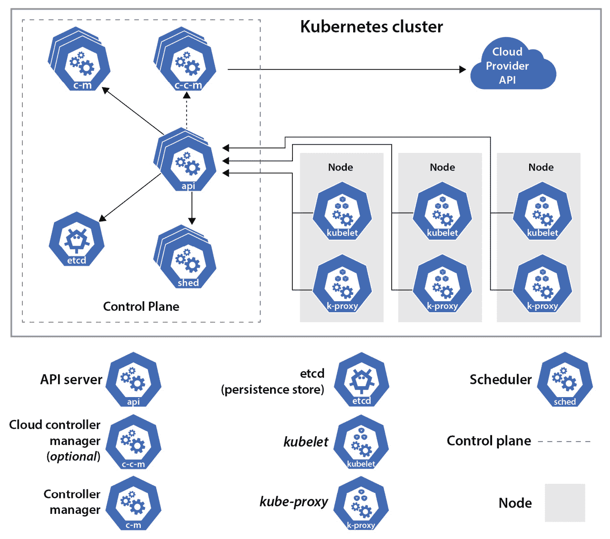
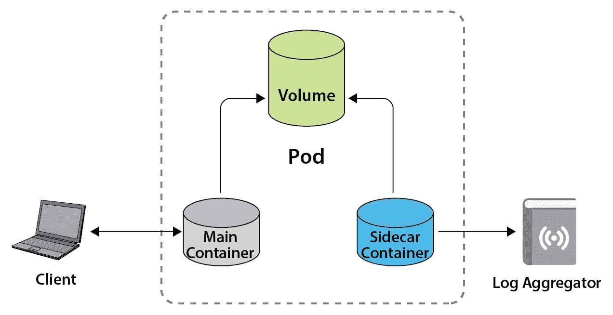
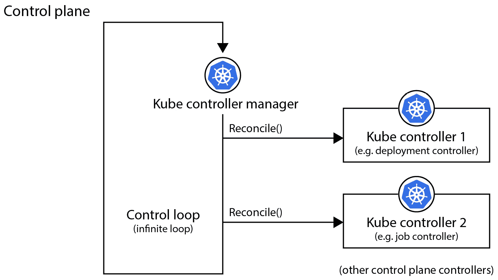
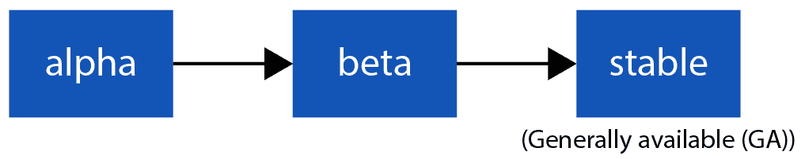
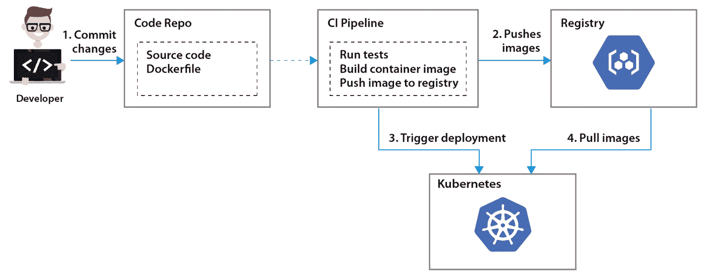

# 5

# 使用 Kubernetes 编排容器

在本章及接下来的几章中，我们将介绍 KCNA 认证中最重要、也许是最难的部分——*Kubernetes 基础知识*。它占据了总考试题目的近一半（46%），所以理解所有细节至关重要。我们将一步步进行，同时也会获得实际的 Kubernetes 经验，帮助你记住通过考试所需的所有内容。

在本章中，我们将学习 K8s 架构的特性和基础知识，它的 API、组件，以及最小的可部署单元——**Pod**。我们将借助**minikube**项目，在本地安装并运行 Kubernetes，帮助我们一步步完成学习。

我们将覆盖以下主题：

+   Kubernetes 架构

+   Kubernetes API

+   K8s – 容器编排的瑞士军刀

+   使用 minikube 安装并探索 Kubernetes

让我们开始吧！

# Kubernetes 架构

正如你所知，Kubernetes 用于编排运行在多个服务器上的容器，这些服务器组成了 Kubernetes 集群。那些服务器通常被称为*节点*，节点可以是运行在本地、云端的虚拟机，或者是裸金属服务器。你甚至可以将不同类型的节点组合在一个 Kubernetes 集群中（例如，几个由虚拟机表示的节点加上其他几个裸金属服务器节点）。

Kubernetes 中有两种区别明显的节点类型：

+   *控制平面*节点（有时也称为*主节点*）

+   *工作*节点

容器化的应用运行在*工作*节点上，而 K8s 集群管理组件运行在*控制平面*节点上。我们可以在*图 5.1*中看到更详细的说明。



图 5.1 – Kubernetes 组件

控制平面节点运行多个专门的 K8s 服务，并对 Kubernetes 集群进行全局决策，如调度容器化应用。控制平面节点还负责管理集群中的工作节点。

以下五个服务在控制平面节点上运行：

+   *API 服务器*（**kube-apiserver**）：一个核心服务，公开 Kubernetes 的 HTTP API，用于内部和外部集群的通信。集群内的所有操作都通过 API 服务器进行——例如，当你查询集群或特定应用的状态，或者启动一个新的容器时。

+   *集群数据存储*（**etcd**）：存储所有 Kubernetes 集群状态和配置的地方。*etcd* 是一个开源的分布式键值存储系统，用于此目的，它是唯一的有状态组件。

+   *调度器*（**kube-scheduler**）：一个决定应用容器将在集群中的哪个工作节点上运行的组件。影响调度决策的因素包括单个应用的需求、节点负载、硬件或策略限制等。

+   *Controller manager* (**kube-controller-manager**)：这是一个运行各种控制器进程的组件，如 *Node*、*Job* 或 *Deployment* 控制器。这些控制器监视集群中各资源的当前状态，并在当前状态与期望状态不一致时采取行动。

+   可选的 *Cloud controller manager* (**cloud-controller-manager**)：这是一个让你通过运行特定于提供商的控制器进程，将 Kubernetes 集群与云提供商集成的组件。例如，它允许你为容器化应用创建负载均衡器，或者判断一个工作节点的云实例是否已被删除。*Cloud controller manager* 是在 K8s 部署在本地时不需要的组件。

让我们继续讨论工作节点的组件：

+   **Kubelet**：一个代理，确保分配给节点的容器正在运行并保持健康。Kubelet 还会向 API 服务器报告状态。

+   **Proxy** (**kube-proxy**)：这是一个网络代理，帮助实现 Kubernetes *Service* 功能。Proxy 在节点上维护网络规则，以允许容器从 K8s 集群内外进行通信。

+   **Container runtime**：这是一个负责基本容器操作的软件。得益于 *CRI*，Kubernetes 可以使用不同的容器运行时。目前最流行的运行时之一是 *containerd*。

注意

Kubelet 不管理通过 Kubernetes API 以外的方式创建的容器。例如，通过其他方式在工作节点上创建的容器，Kubernetes 是无法识别的。

今天，工作节点组件**也运行在控制平面节点上**。没错——在 Kubernetes 控制平面中，你不仅会有 *scheduler*、*kube-apiserver*、*etcd* 和 *kube-controller-manager*，还会有 *kubelet*、*kube-proxy* 和 *runtime*。这意味着工作组件会在集群中的所有 Kubernetes 节点上运行。

为什么会这样？原因是控制平面组件本身就部署在容器中，因此可以通过所谓的静态 **pods** 由 Kubernetes 管理。或者，控制平面组件可以通过 **systemd** 启动和管理，但这种方法如今越来越不流行了。

什么是 pod？

Pod 是可以在 Kubernetes 中创建的最小可部署单元。Pod 是一组共享存储、网络和容器运行规范的一个或多个容器。

你可以将一个 pod 看作是 Kubernetes 对容器的封装，在 K8s 集群中部署任何应用时，你总是会处理 pod。即使你只需要运行一个由单个容器组成的小型简单应用，你也需要定义一个包含该单一容器的 pod。换句话说，**没有 pod 封装就无法在 Kubernetes 上运行容器**。

在一个 Pod 中有两个或多个容器的情况也非常常见，其中 Pod 中的第二个或第三个容器作为*辅助*容器来帮助*主*容器。这种情况发生在多个容器需要协同工作并共享资源时。这种*辅助*容器被称为*边车*容器。在上一章中，我们学习了*服务网格*，它利用边车容器将代理与应用容器一起部署。另一个可能在同一个 Pod 中运行多个容器的例子是从主容器中运行的应用程序收集监控指标。边车容器还可以用于日志聚合——例如，边车容器可能会收集并转发主应用容器的日志到长期存储中，如*图 5.2*所示：



图 5.2 – 包含两个容器的 Pod 示例

注意

同一个 Pod 中的容器始终被共置并共同调度在同一个节点上。

除了*边车*容器，还有另一种类型的容器，称为**初始化容器（Init Containers）**。它们对于运行设置脚本和初始化工具非常有用，这些工具是容器化应用所需的。

initContainers

这些容器在 Pod 中的其他容器启动之前按顺序执行。直到所有`initContainers`完成，其他容器才会启动，initContainers 每次 Pod 启动时都会运行。

除了允许你在 Kubernetes 上运行共置和独立的容器，Pods 还具有更多的功能，包括以下内容：

+   **共享存储**：Pod 中的所有容器都可以访问共享的卷，从而允许容器共享数据。

+   **共享网络**：Pod 中的所有容器共享*网络命名空间*，并拥有一个 IP 地址和网络端口。容器没有独立的 IP 地址，但 Pod 有，且 Pod 中的容器可以通过*localhost*简单地相互通信。此外，由于共享网络，Pod 中的两个容器不能监听相同的网络端口。

+   **共享内存**：Pod 中的容器可以使用标准的 Linux 进程间通信，如**SystemV 信号量**或**POSIX** **共享内存**。

现在，我们已经多次提到过 Kubernetes *集群*，这意味着我们需要至少两个节点。技术上，你可以在单个节点上运行 Kubernetes，同时结合控制平面和工作节点的功能。但是，**你绝不应该在生产环境中这样做。这仅适用于学习或** **开发用途**。

在现实场景中，我们至少会运行三个控制平面节点和多个工作节点。这些节点应该分布在多个**故障域**中（通常由云服务提供商称为**可用区**），这些故障域可能是由单独的数据中心组成，通过高速带宽网络互联。在单个服务器或可用区出现故障的情况下，这样的 Kubernetes 集群仍然可以保持运行。

集群中只有一个控制平面节点不足以满足生产环境的需求，因为在出现故障时，你将无法查询集群和应用程序的状态，无法启动带有容器的新 pod，也无法进行任何更改。而且，你不希望丢失你的*etcd* 数据存储，它保存着有关集群的所有信息。

因此，像许多集群系统一样，最佳实践是**运行奇数个控制平面节点**；例如三个或五个。拥有奇数个节点有助于防止*分脑*情境，在网络故障的情况下，集群的两个部分将无法建立多数（例如，四个节点分成两部分可能会导致不一致或无法正常工作）。

注意

这种做法不适用于工作节点，在集群中运行两个、四个、七个甚至 200 个工作节点是可以的。

我知道这有很多内容需要消化，但当我们开始使用 Kubernetes 并部署我们的第一个几个 pod 时，事情会变得更加清晰和简单。稍后在本章中，我们将更详细地了解 pod 规格，但现在，让我们先了解更多关于 Kubernetes API 以及如何使用它。

# Kubernetes API

正如我们之前所学，Kubernetes API 服务器是所有集群操作的主要入口。当我们想了解集群的状态、节点或 pod 的数量或其他资源及其状态时，我们需要使用 Kubernetes API。所有操作都是如此，例如创建新 pod 或修改其他资源的规格。简而言之，API 服务器是 K8s 的*大脑*。

与 Kubernetes API 交互有多种方式：

+   使用 `kubectl` 与 K8s 集群交互，并管理或调试在 Kubernetes 中运行的应用程序。

+   `dashboard`，然而并不支持`kubectl`所提供的所有功能。

+   **客户端库**：支持多种编程语言，包括 *Golang*、*Java*、*Python*、*JavaScript* 等。它们允许你编写使用 Kubernetes API 的软件，并帮助处理常见的任务，如身份验证。

+   使用 `curl` 或 `wget`，你可以直接访问 Kubernetes API。这种方式不常用，但有时还是有帮助的。

这个列表并不详尽，今天，你还可以找到许多其他工具（如 `kubectl`）。

在前几章中，我们提到过 Kubernetes API 是**声明式**的。

声明式 API

声明式 API 意味着你声明 Kubernetes 资源和 Kubernetes 控制器的*期望状态*，并不断确保 Kubernetes 对象的当前状态（例如，某个应用的 Pod 数量）与声明的期望状态保持一致。

因此，Kubernetes 的 API 与命令式方法不同，在命令式方法中你会指示服务器该做什么。在通过 API 定义了期望状态后，Kubernetes 会使用其 *kube-controller-manager*，指示运行在无限控制循环中的控制器检查资源状态是否与期望状态一致，并在不一致时进行*协调*。例如，我们已经指示 K8s 运行我们的应用程序并保持三个副本，如果其中一个副本最终崩溃，Kubernetes 将自动检测到只剩两个副本在运行，并会生成一个新的 Pod 来运行我们的应用程序：



图 5.3 – Kubernetes 控制循环

注意

控制器管理器的无限控制循环有时也被称为协调循环。

由于 Kubernetes 的开发速度非常快，其 API 不断演进。新的 API 资源可以频繁添加，而旧的资源或字段会根据 Kubernetes 的弃用政策在多个发布周期后被移除。为了便于进行这些更改，K8s 支持多个 API 版本和 API 分组，并在较长时间内与现有的 API 客户端保持兼容。例如，同一资源可以有两个 API 版本：`v1` 和 `v1beta1`。你可能最初使用 `v1beta1` 版本创建了一个资源，但你仍然可以在几个版本发布期间，使用 `v1` 或 `v1beta1` API 版本对该资源进行更改。

每个新的 Kubernetes 功能都有一个定义的生命周期，相关的 API 会在多个 K8s 版本中从 alpha 发展到 beta，再到正式发布的状态，如 *图 5.4* 所示：



图 5.4 – Kubernetes 功能生命周期

值得一提的是，Kubernetes 的 alpha 功能通常是*禁用*的。然而，你可以通过设置所谓的 **feature gates** 来启用这些功能。Beta 和稳定版的 Kubernetes 功能默认是启用的。

在 Kubernetes 中，对现有功能的新重大更改的实现通常从 **Kubernetes 增强提案** (**KEP**) 开始。这些是详细的规范文档，概述了更改的动机、目标和设计。你可以在 Kubernetes GitHub 仓库中找到现有的 KEP（[`github.com/kubernetes/enhancements/tree/master/keps`](https://github.com/kubernetes/enhancements/tree/master/keps)）。

因为 Kubernetes 是一个复杂的项目，包含许多组件，所以它有多个操作领域，包括存储、网络、扩展等。这些领域通常由 Kubernetes **特别兴趣小组**（**SIGs**）来覆盖。SIGs 是专注于 Kubernetes 特定部分的小型开发者社区。由于 K8s 是一个开源项目，任何人都可以成为 SIG 的一员，修复问题、审查代码和提出改进建议。

最后但同样重要的是，Kubernetes API 是高度可扩展的，扩展方式有两种：

+   使用 **自定义资源定义**（**CRDs**）：一种不需要编程的方法

+   使用 **聚合层**：一种需要编程的方法，但它允许你对 API 行为有更多控制

这两种方法都允许你为 Kubernetes 添加额外的功能，超出标准 Kubernetes API 所提供的范围。对于 KCNA 考试的范围，你不需要了解太多细节，但随着你实践经验的积累，你会发现可扩展的 API 是 Kubernetes 的一项非常强大的功能，它使我们能够在不需要了解或修改现有 K8s 源代码的情况下添加独特的功能。

现在我们已经了解了 Kubernetes API，让我们进一步了解 Kubernetes 的一些功能，正是这些功能使其成为容器编排的第一选择。

# K8s——容器编排的瑞士军刀

我们多次提到 Kubernetes 非常适合运行由许多微服务组成的云原生应用，这些微服务打包在容器中。那到底是为什么呢？

Kubernetes 提供了许多功能，极大地简化了大规模容器集群的操作。我们已经知道，可以使用 Kubernetes 自动扩展容器的数量或重启故障的容器。那么，Kubernetes 还有哪些其他功能呢？

+   **自动化滚动更新和回滚**：允许你以受控方式部署应用的新版本和配置更改，监控应用的健康状况并确保它始终运行。如果出现问题，K8s 还允许你回滚到应用的先前版本、镜像或配置。

+   **服务发现与负载均衡**：允许集群中不同的微服务轻松找到彼此。在一组表示相同微服务的 Pod 中，每个 Pod 都会有一个 IP 地址，但整个集合会有一个单一的 DNS 名称，从而简化服务发现和负载分配。

+   **秘密和配置管理**：允许你管理微服务配置和机密，而无需重新构建容器镜像或暴露敏感凭证——例如，当服务需要访问数据库或有许多配置参数需要变化时。

+   **自愈**：允许你自动重启由于任何原因失败的容器，如果工作节点停止响应，自动将容器重新调度到另一个节点，重启未通过预定义健康检查的容器，并且仅当应用程序完全启动并准备好服务时，才将请求路由到容器。

+   **水平扩展**：允许通过增加或减少运行应用程序的 Pod 数量来横向扩展容器化应用程序。这可以手动完成，也可以自动完成，例如，基于 CPU 使用率进行扩展。

+   **批处理执行**：允许你调度容器的执行，并灵活管理批处理处理或 CI 工作负载。

+   **自动垃圾回收**：允许根据请求的资源、当前集群利用率或其他需求，自动确定最佳的工作节点来启动容器。它还允许定义工作负载优先级，以处理不同的关键和非关键应用程序。

+   **存储编排**：允许你集成和管理自己选择的存储系统。当 Pod 启动时，Kubernetes 可以自动配置和挂载存储卷，并根据需要将卷重新挂载到不同的节点。

这是一长串内容，但仍然不是 100% 完整的。在上一节中，我们看到可以扩展 Kubernetes API 来添加新功能。如今，Kubernetes 拥有一个丰富的生态系统，拥有众多扩展 Kubernetes 的项目，甚至可以让你管理除容器之外的其他工作负载。没错，Kubernetes 不仅可以用来编排容器。我们应该提到几个项目：

+   **KubeVirt**：一个用于通过 Kubernetes 编排虚拟机与容器一起使用的项目。这通常用于当工作负载无法轻松容器化的情况，或在进行应用程序容器化的过程中，有些应用程序仍然运行在虚拟机中。

+   **Kubeless**：一个运行在 Kubernetes 上的无服务器计算框架。它为你的 K8s 集群增加了 FaaS 能力，并可以作为云提供商 FaaS 服务的替代方案。

+   **Knative**：另一个 Kubernetes 的无服务器计算框架，最近被 CNCF 接受。它最初由 Google 创建，自 2018 年以来一直在积极开发。

+   **OpenFaas**：另一个可以与 Kubernetes 一起使用或独立使用的无服务器框架。与其他两个无服务器框架类似，它支持多种编程语言来编写函数，包括*Golang*、*Java*、*Python*、*Ruby*、*C#* 等。

对于 KCNA 考试或 CNCF 认证的其他 Kubernetes 认证，你不需要了解这些项目的进一步细节。只需记住，借助 KubeVirt，能够编排虚拟机，并且可以通过如 Knative 等项目在 Kubernetes 上提供 FaaS。如果你想了解更多这些项目的信息，可以参考本章末尾的*进一步阅读*部分中的链接。

注意

即使有了 Kubernetes 的帮助，也可以管理虚拟机，但它仍然主要用于协调容器。

在我们开始安装 Kubernetes 并尝试其众多功能之前，让我们先看看一个例子，展示 K8s 如何成为开发工作流的一部分，如 *图 5.5* 所示：



图 5.5 – 使用 Kubernetes 的简单开发工作流示例

简化的工作流程可能如下所示：

1.  开发者编写一个新微服务的代码，并将其提交到 GitHub 仓库。正如你可能记得的那样，开发者无需学习新的编程语言即可在容器中运行应用程序。

1.  应该有一个 `Dockerfile`，定义将应用程序打包为容器镜像所需的步骤。在构建容器镜像之前，CI 管道中会执行自动化测试。如果测试成功，将构建 Docker 镜像并推送到镜像仓库。

1.  接下来，容器的部署会在 Kubernetes 集群中触发。要在 Kubernetes 上运行容器，我们需要在 `kubectl` 工具中定义一个 pod 规格，并确保其已配置为与我们的 K8s 集群协同工作。

1.  当规格应用时，Kubernetes 会负责找到合适的工作节点，从镜像仓库下载容器镜像，并启动我们的容器化应用程序的 pod。我们可以定义它以运行多个副本，以满足高可用性要求并平衡负载。

1.  这个过程可以重复多次，Kubernetes 可以以滚动更新的方式处理新应用版本的镜像部署，例如，每次只会替换一个副本。

一个 pod 只是 Kubernetes 对象的一个例子，它是最小的可部署单元。在下一章，我们将了解其他使用 Kubernetes 控制器并提供更高级功能的资源。

Kubernetes 对象

Kubernetes 对象是持久化的条目，表示集群的状态，包括哪些容器化应用程序在运行，在哪些节点上运行，应用程序可用的资源及其相关策略（例如，重启策略、调度要求等）。

Kubernetes 对象在我们应用规格定义的那一刻就会被创建，它们本质上是一个 *意图记录*。一旦对象被创建，Kubernetes 会确保该对象存在，并处于 *期望状态*。达到期望状态所需的时间取决于许多因素，可能只需要一秒钟，或者如果例如从镜像仓库下载的容器镜像很大且网络性能较差，则可能需要几分钟。

注意

Kubernetes 规格定义文件也称为 Kubernetes 清单。它是 API 对象的 JSON 或 YAML 格式的规范。

现在我们已经熟悉了一些基础知识，让我们亲自尝试一下。在接下来的章节中，我们将安装一个单节点的 Kubernetes 来获得实践经验。

# 安装并探索使用 minikube 的 K8s

今天，许多项目允许你快速启动一个简单的 K8s 集群或用于学习或本地开发的单节点 Kubernetes。我们将使用 **minikube**，这是一个由官方 Kubernetes SIG 支持的项目，专注于集群部署及其生命周期管理。其他项目也能达到类似效果，比如 **Kind** 和 **CRC**。

重要注意事项

miniKube、Kind 和其他一些项目并非为生产就绪的 Kubernetes 集群而设计。请不要使用这些设置来运行重要的工作负载！

快速确认你的系统满足 *minikube* 的要求：

+   最新版本的 Linux、macOS 或 Windows

+   2+ 个 CPU 核心

+   2+ GB 的可用内存

+   20+ GB 的可用磁盘空间

+   网络连接

+   管理员/超级用户权限

+   容器或虚拟机管理器（可以使用前面章节中的 Docker 引擎安装）

首先，在浏览器中打开 minikube 启动文档（[`minikube.sigs.k8s.io/docs/start/`](https://minikube.sigs.k8s.io/docs/start/)），然后在 *安装* 部分选择你的操作系统。确保选择 *稳定* 版本，并在运行 macOS 或 Linux 时选择正确的 CPU 架构。

注意

如果你没有安装 `curl` 工具，也可以直接复制文档中的 URL，粘贴到新的浏览器标签页并保存到计算机，就像下载其他文件一样。在这种情况下，`installation` 命令应该在保存 `minikube` 二进制文件的同一目录下执行。

打开终端并执行适合你操作系统的命令，如果需要，输入密码。例如，在 macOS 上使用 x86-64 CPU 时，输出可能如下所示：

```
$ curl -LO https://storage.googleapis.com/minikube/releases/latest/minikube-darwin-amd64
  % Total    % Received % Xferd  Average Speed   Time     Time     Time  Current
                                 Dload  Upload   Total    Spent    Left  Speed
100 68.6M  100 68.6M    0     0  38.5M      0  0:00:01   0:00:01 --:--:-- 38.7M
$ sudo install minikube-darwin-amd64 /usr/local/bin/minikube
Password:
```

到目前为止，我们准备好借助 `minikube` 的 `start` 命令启动本地 Kubernetes：

```
$ minikube start
😄  minikube v1.25.2 on Darwin 12.4
✨  Automatically selected the docker driver. Other choices: hyperkit, ssh
👍  Starting control plane node minikube in cluster minikube
🚜  Pulling base image ...
💾  Downloading Kubernetes v1.23.3 preload ...
    > preloaded-images-k8s-v17-v1...: 505.68 MiB / 505.68 MiB  100.00% 40.26 Mi
    > gcr.io/k8s-minikube/kicbase: 379.06 MiB / 379.06 MiB  100.00% 14.81 MiB p
🔥  Creating docker container (CPUs=2, Memory=4000MB) ...
🐳  Preparing Kubernetes v1.23.3 on Docker 20.10.12 ...
    ▪ kubelet.housekeeping-interval=5m
    ▪ Generating certificates and keys ...
    ▪ Booting up control plane ...
    ▪ Configuring RBAC rules ...
🌟  Enabled addons: storage-provisioner, default-storageclass
🏄  Done! kubectl is now configured to use "minikube" cluster and "default" namespace by default
```

注意

你可能有一个较新的 Kubernetes 版本，`minikube start` 的输出也会有所不同。如果遇到错误，输出中很可能会有指向相关问题的链接，帮助你解决问题。如果你使用的是与前面章节中不同的系统，你需要先安装 Docker 引擎。有关详细信息，请参考 *第三章*，*容器入门*，以及 minikube 的驱动程序文档页面（[`minikube.sigs.k8s.io/docs/drivers/`](https://minikube.sigs.k8s.io/docs/drivers/)）。对于其他问题，请查看本章 *进一步阅读* 部分中的 minikube 故障排除指南。

现在我们已经启动了 Kubernetes，应该能够使用`kubectl` CLI 工具访问其 API。你可以自己下载`kubectl`，但 minikube 可以为你完成这项工作。推荐让`minikube`来做这件事，因为它会自动选择正确的版本。你只需第一次运行任何带有`kubectl`的命令——例如列出集群中所有 Kubernetes 节点的命令：

```
$ minikube kubectl get nodes
    > kubectl.sha256: 64 B / 64 B [--------------------------] 100.00% ? p/s 0s
    > kubectl: 50.65 MiB / 50.65 MiB [-------------] 100.00% 54.17 MiB p/s 1.1s
NAME       STATUS   ROLES                  AGE   VERSION
minikube   Ready    control-plane,master   18m   v1.23.3
```

Minikube 已经为我们下载了 K8s CLI 并执行了命令。不出所料，我们只有一个名为`minikube`的节点，它的角色是`control-plane`和`master`。

让我们看看当前在 Kubernetes 中运行的内容。你可以使用`kubectl get` `pods`命令列出 Pods：

```
$ minikube kubectl get pods
No resources found in default namespace.
```

如我们所见，目前没有任何内容在运行，因为我们刚刚启动了一个新的集群。让我们使用一个额外的选项重新运行相同的命令——也就是`--all-namespaces`（注意`kubectl`和`get`之间的两个额外破折号；它们用于将`kubectl`与`minikube`的参数分开，因为这两个命令各自有不同的参数集）：

```
$ minikube kubectl -- get pods --all-namespaces
NAMESPACE     NAME                               READY   STATUS    RESTARTS   AGE
kube-system   coredns-64897985d-x28hm            1/1     Running   0          31m
kube-system   etcd-minikube                      1/1     Running   0          32m
kube-system   kube-apiserver-minikube            1/1     Running   0          32m
kube-system   kube-controller-manager-minikube   1/1     Running   0          32m
kube-system   kube-proxy-hwv2p                   1/1     Running   0          32m
kube-system   kube-scheduler-minikube            1/1     Running   0          32m
kube-system   storage-provisioner                1/1     Running   0          32m
```

输出已经发生了很大变化，现在我们可以看到在本章开头学习的所有 Kubernetes 组件：`kube-apiserver`、`kube-controller-manager`、`kube-proxy`、`kube-scheduler`、`etcd`以及其他几个在`kube-system`命名空间中的独立 Pods 中运行的组件。

Kubernetes 命名空间

Kubernetes 命名空间提供了一种分组机制，用于在集群内区分 Kubernetes 对象。通常，Kubernetes 命名空间用于按团队、项目或应用程序分组工作负载。`kube-system`命名空间是为 Kubernetes 的组件保留的。

现在，让我们看看在我们全新的 Kubernetes 中有哪些命名空间：

```
$ minikube kubectl -- get namespaces
NAME              STATUS   AGE
default           Active   56m
kube-node-lease   Active   56m
kube-public       Active   56m
kube-system       Active   56m
```

`default`命名空间，顾名思义，实际上就是一个标准的命名空间，容器工作负载将在该命名空间中默认创建。`kube-node-lease`是另一个为节点心跳（检查节点是否运行）的 Kubernetes 保留命名空间，`kube-public`是一个自动创建的命名空间，用于公共资源，例如集群发现所需的资源。

一般做法是为每个应用程序、合作工作的微服务组或每个团队创建新的命名空间。让我们创建一个新的命名空间并命名为`kcna`，通过执行`kubectl -- create` `namespace kcna`：

```
$ minikube kubectl -- create namespace kcna
namespace/kcna created
```

注意

你还可以设置一个别名来代替`minikube kubectl`，正如 minikube 文档中建议的那样（`$ alias kubectl="minikube kubectl --"`），以便省去每次都写`minikube`的麻烦。（确保在不再使用`minikube`时删除它。）

现在，让我们将一个容器化的*Nginx* Web 服务器部署到我们新的`kcna`命名空间中。我们可以通过添加`--namespace`参数来始终设置我们想要执行`kubectl`命令的命名空间：

```
$ minikube kubectl -- create -f https://k8s.io/examples/pods/simple-pod.yaml --namespace kcna
pod/nginx created
```

这里，我们提供了一个 Pod 规范文件，该文件位于 [`k8s.io/`](https://k8s.io/) 网页上显示的示例中。Kubernetes CLI 足够智能，可以下载文件，验证规范并应用它，创建它所定义的对象——在本例中，是一个包含 Nginx 的单一 Pod。如果我们自己编写这个简单的 Pod 规范文件并以 YAML 格式保存，它会像这样：

```
$ cat simple-pod.yaml
apiVersion: v1
kind: Pod
metadata:
  name: nginx
spec:
  containers:
  - name: nginx
    image: nginx:1.14.2
    ports:
    - containerPort: 80
```

让我们看看该规范文件的每一行代表什么。

`apiVersion: v1` 定义了我们用于创建该对象的 Kubernetes API 版本。如你所知，Kubernetes 的 API 会从 alpha 发展到 beta，再到稳定版本。`v1` 是本示例中的稳定版本：

+   `kind: Pod` – 定义了我们描述的对象类型。

+   `metadata:` – 定义对象的元数据，如 `name` 或其他注解。

+   `name: nginx` – 定义 Pod 的名称。

+   `spec:` – 定义了我们描述对象期望状态的块。

+   `containers:` – 定义了作为该 Pod 一部分的容器列表。

+   `-` `name:` `nginx` – Pod 中第一个容器的名称。多个容器可以在一个 Pod 中一起运行。

+   `image: nginx:1.14.2` – 镜像的名称（`nginx`），可以选择在前面加上镜像仓库 URL，后面跟上镜像标签（`1.14.2`）。如果在一个 Pod 中运行多个容器，您需要为每个容器定义镜像和名称。

+   `ports:` – 这是一个可选的信息块，用于告知我们哪些端口将被暴露。这些端口是容器中进程正在监听的端口。然而，不指定此块并不会阻止端口暴露。

+   `- containerPort: 80` – 这是本示例中的端口`80`。

注

YAML 格式中缩进非常重要，缺少一个空格或多出一个空格都会导致格式错误。如果应用规范时存在解析错误，`kubectl` 会报错。建议从本书的 GitHub 仓库复制示例文件，以避免拼写和格式错误。

好的，那么，我们的 Nginx Pod 出了什么问题？

```
$ minikube kubectl -- get pods --namespace kcna
NAME    READY   STATUS    RESTARTS   AGE
nginx   1/1     Running   0          10m
```

它处于 `Running` 状态，并且 Pod 中的 `1/1`（一个中的一个）容器已就绪。Pod 可能处于多种状态：

+   `Pending`: 规范已被 Kubernetes 接受，当前 Pod 正在等待调度，或等待从镜像仓库下载所请求的容器镜像。

+   `Running`: Pod 已被分配到某个节点，并且 Pod 中的所有容器都已创建。至少有一个容器正在运行。

+   `Succeeded`: Pod 中的所有容器已成功完成/退出，且以 *良好* 的退出代码（例如零）退出。当容器中的应用程序正常关闭时，会发生这种情况。

+   `Failed`: Pod 中的所有容器都已终止，并且至少有一个容器失败；例如，容器以非零退出代码退出。

+   `Unknown`：无法获取 pod 的状态。这可能发生在 Pod 应该运行的节点无法访问时，例如，由于网络问题。

+   `ErrImagePull` ：清单中指定的镜像无法获取（拉取）。这可能是由于镜像名称错误或标签错误，导致镜像在镜像库中不存在。

此外，你可能会遇到 `ContainerCreating` 或 `Terminating` 状态，分别描述 Pod 容器的启动或终止阶段。

目前，我们的 Nginx pod 什么也不做；除了它的默认静态页面外，不提供任何应用程序或内容。在下一章中，我们将学习如何使用 `kubectl describe` 命令在 Kubernetes 中暴露和访问 `nginx` pod 中的应用程序。

```
$ minikube kubectl -- describe pods nginx --namespace kcna
```

你会发现关于 pod 的大量信息，例如运行它的节点、启动时间、IP 地址、环境变量、最近的事件等。此信息对于我们调试失败的 pod 或应用程序非常有帮助。

既然我们已经稍微使用过 `kubectl`，现在也来试试 Kubernetes 仪表板。Minikube 提供了一个便捷的单命令仪表板安装，使用 `minikube dashboard`：

```
$ minikube dashboard
🔌  Enabling dashboard ...
    ▪ Using image kubernetesui/dashboard:v2.3.1
    ▪ Using image kubernetesui/metrics-scraper:v1.0.7
🤔  Verifying dashboard health ...
🚀  Launching proxy ...
🤔  Verifying proxy health ...
🎉  Opening http://127.0.0.1:55089/api/v1/namespaces/kubernetes-dashboard/services/http:kubernetes-dashboard:/proxy/ in your default browser...
```

此时，仪表板将被安装到新的 `kubernetes-dashboard` 命名空间中，浏览器应会自动在新标签页中打开它（如果没有自动打开，请尝试执行 `minikube dashboard --url` 以获取仪表板的 URL）。你需要在左上角的下拉菜单中切换到另一个命名空间，因为 `default` 命名空间中当前没有任何内容。如果你切换到 `kcna` 命名空间，你将看到我们的 `nginx` pod，而如果切换到 `kube-system`，你将看到我们在本章中描述的 Kubernetes 控制平面组件。你可能会注意到，除了 pod，还有 **Deployment**、**Daemon Set** 和 **Replica Set** 工作负载。它们将在下一章中讨论，届时我们将看到如何使用它们来创建 pod，并了解这些 K8s 资源的特点。

随时可以自己探索更多的仪表板；当你完成后，可以使用仪表板或通过 `kubectl delete` 命令删除我们的 Nginx pod。要中断 `minikube dashboard`，你可以使用 *Ctrl* + *C* 快捷键：

```
$  minikube kubectl -- delete pods nginx --namespace kcna
pod "nginx" deleted
```

注意

`kubectl` 是一个用户友好的工具，允许你输入 `pod`、`pods` 或简单地输入 `po`，它们的意思是一样的。它还拥有很多便捷的简短名称，例如 `ns`，代表命名空间。要列出所有简短名称，请运行 `minikube` `kubectl api-resources`。

如果你在进入下一章之前准备关闭工作站，你也可以通过执行 `minikube` `stop` 命令临时停止你的 Kubernetes 节点：

```
$ minikube stop
✋  Stopping node "minikube"  ...
🛑  Powering off "minikube" via SSH ...
🛑  1 node stopped.
```

这一章内容较长且非常密集，恭喜你已经走到了这一部分！在进入下一章之前，先休息一下，并确保回答提供的问题。

# 概要

在本章中，我们终于接触到了 Kubernetes。我们了解了很多关于它的架构、组件和 API。Kubernetes 集群由控制平面（也称为主节点）和工作节点组成，其中控制平面节点运行 K8s 管理组件，工作节点在 *kubelet*、*容器运行时* 和 *kube-proxy* 的帮助下运行实际的容器化应用程序。在主节点组件中，有 *kube-apiserver*、*etcd*、*kube-scheduler*、*kube-controller-manager*，以及可选的 *cloud-controller-manager*。

我们看到 *pod* 是 Kubernetes 中最小的可部署单元，它允许我们在 K8s 上运行单独的容器，也可以将多个容器一起运行。一个 pod 内的容器是耦合的，可以共享存储、网络和内存。pod 中的辅助容器通常被称为 *sidecar*，它可以通过做日志聚合等任务来帮助主容器运行主应用程序。

Kubernetes API 是 *声明式* 的。当我们使用 K8s 时，我们描述集群中资源的期望状态；Kubernetes 确保在对象创建后，当前状态会达到期望状态。由于开发的快速发展，Kubernetes API 被分组并多版本化，默认情况下仅启用 *beta* 和 *稳定*（GA）特性。有多种方式可以访问 Kubernetes API，其中 *kubectl* CLI 和 *仪表板* 是最常用的方式。K8s 的一个特色是它能够通过 CRD 和聚合层扩展其 API。

说到功能，Kubernetes 提供了很多强大功能，从自动滚动发布、服务发现、和密钥管理，到自动扩展、自我修复，甚至存储编排。我们将在接下来的章节中实践其中许多功能。还可以借助 *KubeVirt* 和 *Knative* 等独立项目，使用 Kubernetes 来管理虚拟机或提供 FaaS。

在最后一节中，我们使用 *minikube* 项目安装了一个简单的单节点 Kubernetes 部署，并了解了 Kubernetes *命名空间* 的概念，用于资源的隔离和分组。我们还创建了一个包含单个 Nginx 容器的 pod，并探索了 YAML 格式的最简 pod 规格定义。

在下一章中，我们将学习其他 Kubernetes 资源及其使用方法。我们将学习如何使用 Kubernetes 配置和扩展多容器应用程序，如何使用 Kubernetes 运行有状态工作负载，以及了解如何暴露在 K8s 上运行的应用程序。

# 问题

在我们总结时，这里有一系列问题供您测试有关本章内容的知识。您可以在*附录*的*评估*部分找到答案：

1.  以下哪项是 Kubernetes 中最小的可调度单元？

    1.  容器

    1.  边车

    1.  Pod

    1.  部署

1.  在一个 pod 中运行的容器共享以下哪些选项（可选择多个）？

    1.  名称

    1.  存储

    1.  网络

    1.  内存

1.  以下 Kubernetes 节点类型有哪些（选择多个）？

    1.  Secondary

    1.  主节点

    1.  工作节点

    1.  Primary

1.  以下哪些是控制平面节点的组件（选择多个）？

    1.  Docker, kube-scheduler, cloud-controller-manager

    1.  kube-master-server, kubelet, kube-proxy

    1.  kube-scheduler, kube-controller-manager

    1.  kube-api-server, etcd

1.  以下哪个 K8s 集群配置可以推荐？

    1.  1 个主节点，5 个工作节点

    1.  2 个主节点，3 个工作节点

    1.  2 个主节点，20 个工作节点

    1.  3 个主节点，10 个工作节点

1.  以下哪些组件用于存储 Kubernetes 集群状态？

    1.  kube-api-server

    1.  kube-volume

    1.  kubelet

    1.  etcd

1.  以下哪个组件是 Kubernetes 用来下载镜像并启动容器的？

    1.  Kubelet

    1.  容器运行时

    1.  etcd

    1.  kube-proxy

1.  以下哪个组件负责 Kubernetes 控制器流程？

    1.  kube-api-server

    1.  kube-proxy

    1.  kube-controller-manager

    1.  kube-scheduler

1.  以下哪些可以用来访问 Kubernetes API（选择多个）？

    1.  kubeadmin

    1.  kubectl

    1.  kubelet

    1.  dashboard

1.  Kubernetes 有一个声明式 API，这意味着什么？

    1.  我们总是需要声明一个 YAML 规格文件来使用 K8s API

    1.  我们声明期望的状态，K8s 将会在某个时刻达到这个状态

    1.  我们告诉 Kubernetes 如何处理哪些资源

    1.  我们声明期望的状态，K8s 将会不断努力达成这个状态

1.  以下哪些 Kubernetes API 版本默认启用（选择多个）？

    1.  Alpha

    1.  Beta

    1.  Gamma

    1.  稳定

1.  如何扩展 Kubernetes API 添加新功能（选择多个）？

    1.  代码资源定义

    1.  聚合层

    1.  扩展层

    1.  自定义资源定义

1.  以下哪个项目允许你将 Kubernetes 扩展到容器编排之外（选择多个）？

    1.  Knative 用于 FaaS

    1.  Linkerd 用于 IPAM

    1.  Kvirt 用于虚拟机编排

    1.  KubeVirt 用于虚拟机编排

1.  什么有助于检测 Kubernetes 资源当前状态与期望状态之间的差异？

    1.  容器运行时

    1.  Kubernetes 调度器

    1.  自定义资源定义

    1.  协调循环

1.  什么是运行在 pod 中的次要容器？

    1.  Flatcars

    1.  Sidecars

    1.  Podcars

    1.  Helpcars

1.  以下哪个格式用于编写 Kubernetes 规格文件？

    1.  CSV

    1.  Protobuf

    1.  YAML

    1.  Marshal

1.  以下哪个 Kubernetes 组件负责将新 pod 分配到节点上？

    1.  kube-api

    1.  kube-proxy

    1.  kube-scheduler

    1.  kube-controller-manager

1.  以下哪个 K8s CLI 命令可以用来列出 `development` 命名空间中的 pods？

    1.  `kubectl list pods -``n development`

    1.  `kubectl get pods --``namespace development`

    1.  `kubectl show pods --``namespace development`

    1.  `kubectl get` `pods --all-namespaces`

1.  以下哪个 K8s CLI 命令可以用来列出集群中的所有命名空间？

    1.  `kubectl list` `namespaces --all-namespaces`

    1.  `kubectl` `show namespaces`

    1.  `kubectl` `get namespaces`

    1.  `kubectl` `get all`

1.  以下哪个 pod 状态表示其容器正在执行？

    1.  执行中

    1.  成功

    1.  运行中

    1.  ContainerCreated

1.  以下哪些 Pod 状态表示其所有容器都在运行（可多选）？

    1.  100%

    1.  1/2

    1.  2/2

    1.  1/1

# 进一步阅读

若要了解本章中涵盖的更多内容，请查看以下资源：

+   Minikube 故障排除指南: [`minikube.sigs.k8s.io/docs/handbook/troubleshooting/`](https://minikube.sigs.k8s.io/docs/handbook/troubleshooting/)

+   常用的 `kubectl` 命令: [`kubernetes.io/docs/reference/kubectl/cheatsheet/`](https://kubernetes.io/docs/reference/kubectl/cheatsheet/)

+   K8s Pod 概念: [`kubernetes.io/docs/concepts/workloads/pods/`](https://kubernetes.io/docs/concepts/workloads/pods/)

+   K8s 命名空间概念: [`kubernetes.io/docs/concepts/overview/working-with-objects/namespaces/`](https://kubernetes.io/docs/concepts/overview/working-with-objects/namespaces/)
