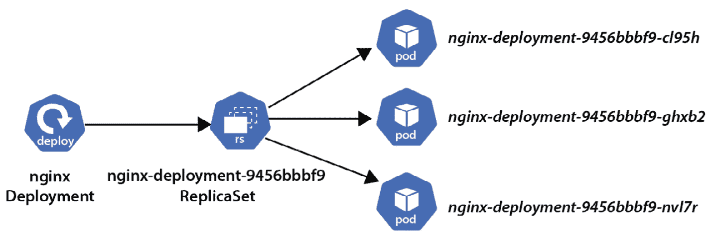
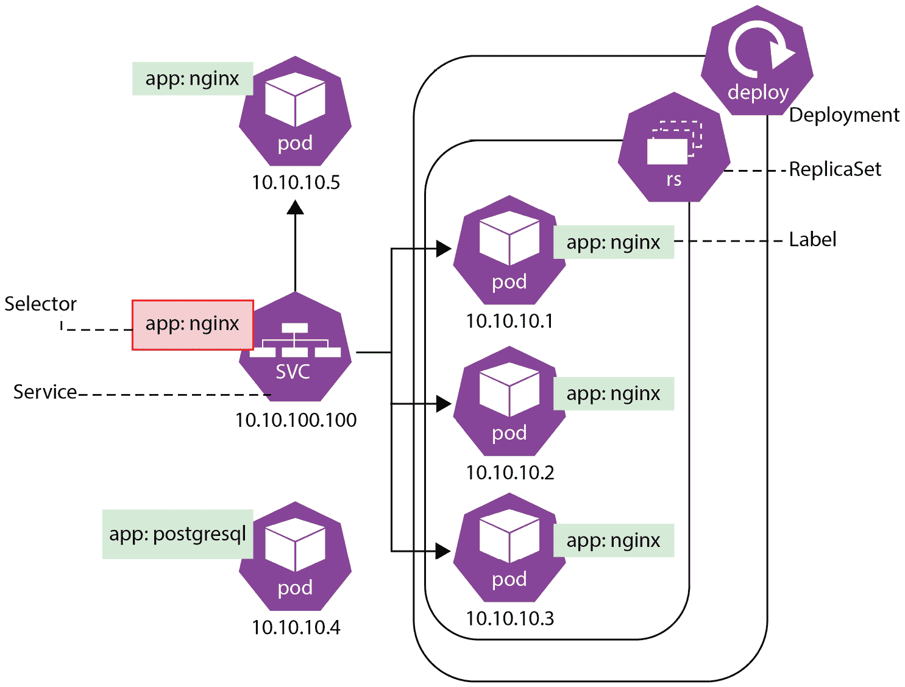

# 第六章：使用 Kubernetes 部署和扩展应用程序

在这一章中，我们将继续探索 Kubernetes 丰富的功能和生态系统。我们将了解 Kubernetes 中还存在哪些资源及其目的，如何实现应用程序的自我修复和扩展，如何使用 Kubernetes 的服务发现，如何在 Kubernetes 中运行有状态的工作负载。我们还将使用上一章中安装的 minikube Kubernetes 进行若干练习（如果你跳过了这一部分，请查看第*5 章*的最后部分）。

这是本书中最密集且最重要的一章之一，所以请确保在继续前进之前回答所有问题并完成所有实际操作任务。如果你觉得某些部分难以理解，可以读两遍并参考*进一步阅读*部分。

我们即将涵盖以下激动人心的话题：

+   Deployments、ReplicaSets 和 DaemonSets

+   运行有状态的工作负载

+   应用程序配置与服务发现

+   确保应用程序处于正常运行并健康状态

所以，直接进入正题吧！

# Deployments、ReplicaSets 和 DaemonSets

正如我们在上一章中看到的，Kubernetes 中有比*Pods*和*命名空间*更多的资源。首先让我们来了解一下*Deployments*。

Deployment

这是一个声明式更新 Pod 和 ReplicaSet 的封装器。你在 Deployment 资源规格中描述所需状态后，Kubernetes Deployment 控制器会按照配置的速率将当前状态更改为所需状态。

听起来有些复杂，但本质上 Deployment 是用来控制 Pods 并管理这些 Pods 的应用程序生命周期的。Pods 是最小的部署单元，用来封装容器，但它们不提供任何高级 Kubernetes 功能，如*自我修复*、*滚动更新*或*自动扩展*。然而，Deployment 是提供这些功能的。

因为 Pods 本身没有弹性，一个失败的应用程序容器会将 Pod*带*下去。这就是为什么在实际操作中，你通常会使用 Kubernetes 中的高级资源之一，如 Deployment，来在失败时自动重新创建 Pods。Deployment 控制器不断监视它所管理的 Pods 的当前状态，并确保所需数量的 Pods 在运行。我们很快会展示如何实现这一点。

ReplicaSet

ReplicaSet 用于确保在任何给定时间运行指定数量的副本 Pod。ReplicaSet 也被 Deployment 使用，以确保所需数量的 Pod 运行（即使只有一个 Pod 应当运行）。

与 ReplicaSet 相比，Deployment 是一个更高级的封装资源，它管理着 ReplicaSet 并提供其他有用的功能。ReplicaSet 不允许你实现自定义更新编排，因此建议使用 Deployment 而不是直接使用 ReplicaSet。

让我们回到上一章中使用的 minikube Kubernetes 设置，进行一个快速演示。如果你之前已经停止了集群，请先使用 `minikube` `start` 命令启动它：

```
$ minikube start
😄  minikube v1.25.2 on Darwin 12.4
✨  Using the docker driver based on existing profile
👍  Starting control plane node minikube in cluster minikube
🚜  Pulling base image ...
🔄  Restarting existing docker container for "minikube" ...
🐳  Preparing Kubernetes v1.23.3 on Docker 20.10.12 ...
    ▪ kubelet.housekeeping-interval=5m
🔎  Verifying Kubernetes components...
    ▪ Using image kubernetesui/dashboard:v2.3.1
    ▪ Using image gcr.io/k8s-minikube/storage-provisioner:v5
    ▪ Using image kubernetesui/metrics-scraper:v1.0.7
🌟  Enabled addons: storage-provisioner, default-storageclass, dashboard
🏄  Done! kubectl is now configured to use "minikube" cluster and "default" namespace by default
```

如果你不确定 minikube Kubernetes 的状态，你也可以使用 `minikube status` 命令。确保 `host`、`kubelet` 和 `apiserver` 处于 `Running` 状态：

```
$ minikube status
minikube
type: Control Plane
host: Running
kubelet: Running
apiserver: Running
kubeconfig: Configured
```

之前，我们在 `kcna` Kubernetes 命名空间中创建了一个运行 `Nginx` Web 服务器的简单 pod。现在，让我们创建一个相同的 nginx Web 服务器的 Deployment，但带有三个副本（即三个 Pods）：

```
$ minikube kubectl -- create -f https://k8s.io/examples/controllers/nginx-deployment.yaml --namespace kcna
deployment.apps/nginx-deployment created
```

完整的 Deployment 规范（可以在本书随附的 GitHub 仓库中的 `nginx-deployment.yaml` 文件中找到）如下所示：

```
apiVersion: apps/v1
kind: Deployment
metadata:
  name: nginx-deployment
  labels:
    app: nginx
spec:
  replicas: 3
  selector:
    matchLabels:
      app: nginx
  template:
    metadata:
      labels:
        app: nginx
    spec:
      containers:
      - name: nginx
        image: nginx:1.14.2
        ports:
        - containerPort: 80
```

这在某种程度上类似于我们之前使用的 pod 规范，但有一些不同之处，例如以下几点：

+   `kind: Deployment`

+   `apps/v1` 表示 API 版本

+   在元数据中增加了一个 `app: nginx` 标签

+   Pods 的数量由 `replicas: 3` 定义。

+   有一个用于通过 `app:` `nginx` 标签匹配 Pods 的选择器

+   它为模板添加了一个 `app:` `nginx` 标签

`spec:` 字段下的 `selector:` 定义了这个 Deployment 如何找到它管理的 Pods。在这个示例中，它选择了带有 `app:` `nginx` 标签的 Pods。

`template` 块具有与我们在上一章中用于独立 pod 情境中的 `containers:` 规格相同的 `image:` 和 `ports:` 字段。此外，它还包含带有 `app: nginx` 标签的元数据，该标签将添加到此规范创建的每个 pod 中。再次强调，标签对于 Deployment 找到其 Pods 是必须的。

让我们检查一下在应用了 Deployment 规范后，`kcna` 命名空间发生了什么：

```
$ minikube kubectl -- get pods -n kcna
NAME                               READY    STATUS    RESTARTS   AGE
nginx-deployment-9456bbbf9-cl95h   1/1      Running   0          10m
nginx-deployment-9456bbbf9-ghxb2   1/1      Running   0          10m
nginx-deployment-9456bbbf9-nvl7r   1/1      Running   0          10m
```

我们可以看到三个 `nginx` Pods，每个都有一个独特的名称。这些名称对你来说可能略有不同，因为字符串的第二部分是随机生成的。现在，让我们用 `kubectl get` `replicasets` 命令查询 `kcna` 命名空间中的 ReplicaSets：

```
$ minikube kubectl -- get replicasets -n kcna
NAME                         DESIRED   CURRENT   READY   AGE
nginx-deployment-9456bbbf9   3         3         3       12m
```

好的，我们看到一个 ReplicaSet；然而，我们并没有定义它！是 nginx Deployment 自动创建了一个 ReplicaSet，以保持所需的 Pod 数量。所以，实际上是 Deployment 在 ReplicaSets 上工作；ReplicaSets 在 Pods 上工作；Pods 是在容器之上的包装层，如 *图 6.1* 所示。你还可以看到 ReplicaSet 获得了一个唯一的 ID，最终的 Pods 会在其名称中继承这个 ID。



图 6.1 – Deployment、ReplicaSet 和 Pod 的层次结构

让我们做一个快速实验，删除我们 Deployment 创建的三个 `nginx` Pods 中的一个，看看会发生什么（*你需要指定一个 Pod 的名称，因为 Pod 名称* *是唯一的*）：

```
$ minikube kubectl -- delete pods nginx-deployment-9456bbbf9-cl95h -n kcna
pod "nginx-deployment-9456bbbf9-cl95h" deleted
```

现在，即使你打字非常快，你也可能不会注意到已删除的 Pod 已经终止并且一个新的 Pod 被创建了。接下来，获取 `kcna` 命名空间中 Pods 的列表：

```
$ minikube kubectl -- get pods -n kcna
NAME                               READY    STATUS    RESTARTS   AGE
nginx-deployment-9456bbbf9-9zv5c   1/1      Running   0          3s
nginx-deployment-9456bbbf9-ghxb2   1/1      Running   0          42m
nginx-deployment-9456bbbf9-nvl7r   1/1      Running   0          42m
```

然后，我们有一个新的 Pod，其 `AGE` 为 `3` 秒，状态为 `Running`，而旧的已删除的 Pod（`nginx-deployment-9456bbbf9-cl95h`）已经完全消失。这就是我们一直谈论的*Kubernetes 自愈魔法*！仅仅几秒钟内，Kubernetes 就检测到 Nginx 部署的当前状态发生了变化，因为只有两个副本（Pods）在运行，而期望的状态是三个副本。Kubernetes 的*协调循环*启动了，并创建了第三个 `nginx` Pod 副本。

*自愈*是非常棒的，它帮助我们保持应用在某些情况下正常运行，例如节点硬件故障（当然，前提是你在生产环境中运行多个 Kubernetes 节点）；当应用在某些请求类型下崩溃时；以及在计划内或计划外的维护期间，当我们需要将负载迁移到另一个节点时。

但这仅仅是开始。让我们假设我们预计应用会收到大量请求，因此我们需要提前做好准备，并在应用中增加额外的副本。在 Kubernetes 中，只需执行一个 `kubectl scale` `deployment` 命令就可以做到这一点：

```
$ minikube kubectl -- scale deployment nginx-deployment --replicas 5 -n kcna
deployment.apps/nginx-deployment scaled
```

如果你足够快地检查相关的 ReplicaSet 状态，你可能会看到新 Pods 正在生成：

```
$ minikube kubectl -- get replicaset -n kcna
NAME                         DESIRED   CURRENT   READY   AGE
nginx-deployment-9456bbbf9   5         5         4       52m
```

就这样！不久之后，两个新 Pods 就已经启动并运行：

```
$ minikube kubectl -- get pods -n kcna
NAME                               READY    STATUS    RESTARTS   AGE
nginx-deployment-9456bbbf9-9zv5c   1/1      Running   0          30m
nginx-deployment-9456bbbf9-ghxb2   1/1      Running   0          52m
nginx-deployment-9456bbbf9-hgjnq   1/1      Running   0          23s
nginx-deployment-9456bbbf9-nvl7r   1/1      Running   0          52m
nginx-deployment-9456bbbf9-pzm8q   1/1     Running   0          23s
```

注意

显然，在单节点 K8s 集群中添加更多的应用副本并不会对性能或服务可用性带来太多实用性。在生产环境中，你应该始终运行多节点的 Kubernetes 集群，并将应用的副本分布在多个节点上。我们在这里进行这些练习是基于单节点 Kubernetes 实例，仅用于演示和教学目的。

接下来，让我们看看如何使用 Deployments 执行*滚动更新*。滚动更新非常重要，因为它有助于确保快速的软件开发周期和频繁的发布，并且使我们能够在没有*零停机时间*的情况下进行更新，避免对客户造成影响。

零停机时间

零停机时间是一种部署方法，在这种方法下，更新后的应用能够正常处理请求，不会中断或出错。

通过滚动更新，我们可以执行以下操作：

+   将应用变更从一个环境推广到另一个环境（例如，新的镜像版本、配置或标签）

+   在出现任何问题时回滚到先前的版本

+   定义每次可以替换多少个应用副本

让我们通过 Nginx 部署来看看这一切是如何运作的。我们将使用 `kubectl` 更新 `nginx` 容器镜像版本标签为 `1.20`。首先，检查我们的部署是否完好：

```
$ minikube kubectl -- get deployment -n kcna
NAME               READY   UP-TO-DATE   AVAILABLE   AGE
nginx-deployment   5/5     5            5           9h
```

现在，修改镜像为 `nginx:1.20`：

```
$ minikube kubectl -- set image deployment/nginx-deployment nginx=nginx:1.20 -n kcna
deployment.apps/nginx-deployment image updated
```

然后观察更改镜像后 Nginx Pods 的状态变化（*你必须快速观察* *这个过程！*）：

```
$ minikube kubectl -- get pods -n kcna
NAME                                READY    STATUS              RESTARTS   AGE
nginx-deployment-7b96fbf5d8-dwskw   0/1      ContainerCreating   0          2s
nginx-deployment-7b96fbf5d8-grkv6   0/1      ContainerCreating   0          2s
nginx-deployment-7b96fbf5d8-jcb4p   0/1      ContainerCreating   0          2s
nginx-deployment-9456bbbf9-9zv5c    1/1      Running             0          6h
nginx-deployment-9456bbbf9-ghxb2    1/1      Running             0          9h
nginx-deployment-9456bbbf9-hgjnq    1/1      Running             0          2h
nginx-deployment-9456bbbf9-nvl7r    1/1      Running             0          9h
nginx-deployment-9456bbbf9-pzm8q    1/1      Terminating         0          2h
```

从我们五个 Nginx 部署的副本中，我们看到其中一个处于`Terminating`状态，四个处于`Running`状态，另外三个新副本处于`ContainerCreating`状态。稍过片刻，我们可能会看到最后几个使用旧 Nginx 镜像的 Pods 进入`Terminating`状态，四个新副本进入`Running`状态，还有一个进入`ContainerCreating`状态：

```
$ minikube kubectl -- get pods -n kcna
NAME                                READY    STATUS              RESTARTS   AGE
nginx-deployment-7b96fbf5d8-6dh9q   0/1      ContainerCreating   0          2s
nginx-deployment-7b96fbf5d8-dwskw   1/1      Running             0          25s
nginx-deployment-7b96fbf5d8-grkv6   1/1      Running             0          25s
nginx-deployment-7b96fbf5d8-jcb4p   1/1      Running             0          25s
nginx-deployment-7b96fbf5d8-zt7bj   1/1     Running             0          4s
nginx-deployment-9456bbbf9-ghxb2    1/1     Terminating         0          9h
nginx-deployment-9456bbbf9-nvl7r    1/1     Terminating         0          9h
```

不久之后，所有旧的 Pods 都会消失，最后一个新的 Pod 会进入`Running`状态。我们还可以通过对任何新 Pod 执行`kubectl describe pod`命令来验证是否使用了新镜像（在 Windows 上使用`findstr`代替`grep`命令）：

```
$ minikube kubectl -- describe pod nginx-deployment-7b96fbf5d8-dwskw -n kcna | grep Image
    Image:        nginx:1.20
```

现在，如果部署的应用的新镜像不正确，或者它有可能导致 Pods 崩溃的 bug，该怎么办呢？就像更新 Kubernetes 部署一样，我们可以回滚到之前的部署版本。Kubernetes 会追踪每个更改，并为每个版本分配一个修订版本，我们可以使用`kubectl rollout history`命令查看：

```
$ minikube kubectl -- rollout history deployment -n kcna
deployment.apps/nginx-deployment
REVISION  CHANGE-CAUSE
1         <none>
2         <none>
```

注意

`CHANGE-CAUSE` 是一个可选描述，可以通过向部署添加注释来设置。例如，我们可以执行以下命令：`kubectl -n kcna annotate deployment/nginx-deployment kubernetes.io/change-cause="image updated to 1.20"`。

如果我们意识到需要将部署回滚到以前的修订版本，只需调用`kubectl rollout undo`，并可以选择指定确切的、可能是较旧的部署修订版本。我们可以尝试回滚到`nginx`部署的前一个修订版本（当前修订版本为`2`）：

```
$ minikube kubectl -- rollout undo deployment/nginx-deployment -n kcna
deployment.apps/nginx-deployment rolled back
```

片刻之后，所有 Pods 都会按照滚动更新的方式重新创建。我们可以使用`kubectl get pods`命令，并加上额外的`-o yaml`选项来验证镜像版本标签是否已回到`1.14.2`（*命名可能与你的情况不同，从你的* *输出列表中选择任何一个 pod*）：

```
$ minikube kubectl -- get pods -n kcna
NAME                               READY    STATUS    RESTARTS   AGE
nginx-deployment-9456bbbf9-6xpq2   1/1      Running   0          22s
nginx-deployment-9456bbbf9-75m7d   1/1      Running   0          22s
nginx-deployment-9456bbbf9-hbglw   1/1      Running   0          22s
nginx-deployment-9456bbbf9-hxdjd   1/1      Running   0          16s
nginx-deployment-9456bbbf9-mtxzm   1/1      Running   0          17s
$ minikube kubectl -- get pod nginx-deployment-9456bbbf9-6xpq2 -n kcna -o yaml
apiVersion: v1
kind: Pod
… LONG OUTPUT OMITTED …
spec:
  containers:
  - image: nginx:1.14.2
    imagePullPolicy: IfNotPresent
    name: nginx
… LONG OUTPUT OMITTED …
```

你会看到非常长的输出，包含该 Pod 的所有详细信息。你也可以结合`kubectl get`和`-o yaml`选项查询其他 Kubernetes 资源（如*namespaces*、*Deployments*等，我们即将学习的）以获取关于该对象的完整信息。在此阶段，你不需要理解输出的每一行，但了解`imagePullPolicy`非常有用，它定义了如何从注册表中拉取容器镜像的规则。该策略可以是以下之一：

+   `IfNotPresent` – 这是默认设置。当请求的`name:tag`组合在 Pod 被调度到的节点上尚未存在（缓存）时，镜像才会被下载。

+   `Always` - 这意味着每次启动包含相应容器的 Pod 时，镜像注册中心会请求一个镜像摘要（从镜像标签解析得到）。如果该镜像的*确切摘要*已经在节点本地缓存，它将被使用；否则，Kubernetes 的 kubelet 将从目标节点的注册中心拉取该镜像。

+   `Never` - 这意味着 kubelet 不会尝试从注册中心拉取镜像。镜像应该提前以某种方式传送到节点，否则容器将无法启动。

此外，我们可以通过一些可选的设置和超时来控制滚动更新过程。最重要的两个设置如下：

+   `maxUnavailable` - 这定义了滚动更新过程中不可用的最大 Pod 数。可以用百分比（例如，`25%`）或绝对数字（例如，`3`）来指定。

+   `maxSurge` - 这定义了可以创建的 Pods 数量，超过了所需副本数。它也可以以百分比或绝对数值指定。例如，如果设置为`25%`，那么*旧*和*新* Pods 的总数将不超过所需副本数的`125%`。

最后，如果我们不想进行滚动更新，我们可以选择`Recreate`策略，这意味着所有现有的 Pods 会一次性被销毁，只有在所有旧 Pods 被终止之后，新的 Pods 才会被创建。显然，这种策略无法实现零停机更新，因为应用的所有 Pods 至少会停机几秒钟。可以通过在相应部署的 YAML 规格文件中定义`.spec.strategy.type`设置来配置该策略。

现在我们了解了部署的相关内容，接下来让我们讲解一下`sshd`，它是一个允许我们通过**安全****外壳**协议远程登录系统的服务。

DaemonSet

DaemonSet 是一个 Pods 的封装器，它确保 Kubernetes 集群中的所有或某些节点每个运行目标 Pod 的单个副本。如果集群中增加了更多节点，DaemonSet 会确保在新节点加入集群后，自动在该节点上生成一个 Pod。

在 Kubernetes 中，Deployment 被认为是适用于各种用户工作负载的通用资源，而 DaemonSet 的典型用例如下：

+   在每个 Kubernetes 节点上运行日志收集服务（例如，**Fluent Bit**等软件）

+   在每个节点上运行节点监控守护进程（例如，**Prometheus**的节点出口程序）

+   在每个节点上运行集群存储守护进程

类似于 ReplicaSet，DaemonSet 会确保达到期望的状态，这意味着在 Pod 发生故障的情况下，它会自动重新创建一个新的 Pod。默认情况下，DaemonSet 会在集群中的所有工作节点上创建 Pod，但也可以选择集群中的特定节点或控制平面节点（如何做将在下一章的*第七章*中讨论）。DaemonSet 无法做的是设置每个节点的副本数量，因为 DaemonSet 每个节点只会运行一个 Pod。DaemonSet 的 spec 文件与 Deployment 的 spec 文件非常相似，只有一些差异，例如 `kind: DaemonSet` 或缺少 `replicas:` 设置。

接下来，我们不会现在创建一个 DaemonSet，因为一个合适的演示需要一个多节点的 Kubernetes 集群。如果你有兴趣，可以查看章节末尾的*进一步阅读*部分，自己动手尝试一下。在接下来的部分，我们将展示如何使用 Kubernetes 运行需要在磁盘上持久化信息的应用程序。

# 运行有状态的工作负载

到目前为止，我们在 Kubernetes 中尝试的所有操作并没有回答一个重要问题——如果我们需要在 Pod 重启之间保持应用程序的状态该怎么办？默认情况下，写入容器文件系统中的数据是不会持久化的。如果你只是将最近 Nginx 示例中的部署 spec 拷贝过来，并将镜像替换为 **PostgreSQL**，这还不够。技术上讲，你的 PostgreSQL Pod 会启动，数据库会运行，但写入该数据库实例的任何数据都不会在 Pod 重启后保留。不过，当然，Kubernetes 也为有状态的应用程序提供了解决方案。

如你可能还记得，来自*第四章*的内容，《探索容器运行时、接口和服务网格》一章中，Kubernetes 提供了一个 **容器存储接口**（**CSI**），它允许你将各种存储解决方案集成到 K8s 集群中。为了通过 Kubernetes API 为 Pods 增加外部存储，我们需要可以动态分配的 *卷*。让我们从两个新的资源定义开始：

+   **持久卷** (**PV**)：这是集群中的一块存储，可以通过动态（由 K8s 在请求时自动分配）或静态（例如，由集群管理员以某种方式预配置并在 K8s 中暴露）方式进行配置。

+   **持久卷声明** (**PVC**)：这是用户对存储的请求，消耗 *PVs*。

当我们希望为容器化的应用程序使用持久存储时，我们需要定义一个 PVC 的 spec，格式为 YAML，类似以下内容：

```
apiVersion: v1
kind: PersistentVolumeClaim
metadata:
  name: kcna-pv-claim
spec:
  storageClassName: standard
  accessModes:
    - ReadWriteOnce
  resources:
    requests:
      storage: 3Gi
```

然后，可以在部署和 Pod 中将此 PVC 作为一个卷进行引用。声明允许你请求特定的大小（如前面例子中的 `3Gi`）和以下四种 `accessModes` 中的一种：

+   `ReadWriteOnce` – 这允许卷被单个节点以读写模式挂载。此模式可以允许此节点上的多个 Pod 访问该卷。

+   `ReadOnlyMany` – 这允许卷被一个或多个节点以只读方式挂载。

+   `ReadWriteMany` – 这允许卷被多个节点以读写模式挂载。这应由存储解决方案和协议（例如，**NFS**）支持。

+   `ReadWriteOncePod` – 这与`ReadWriteOnce`相同，但有一个严格的限制：整个集群中只有一个 Pod 能够写入该卷。

由于 PVs 是 Kubernetes 集群中的实际存储资源，我们可能会遇到没有适合的 PV 来满足 PVC 请求的情况。在这种情况下，Kubernetes 可以根据 PVC 规范中指定的存储类动态地提供 PV（在前面的示例中是`storageClassName: standard`）。

存储类

存储类提供了一种分类集群中不同存储选项的方法。这些存储类可能在性能、支持的访问模式和协议、备份策略等方面有所不同。

还可以通过在 PVC 规范中设置`storageClassName: ""`（空字符串），指示 Kubernetes 仅使用已经提供（可能是静态提供）的可用 PV。在动态 PV 提供的情况下，卷的大小将始终与 PVC 规范中请求的大小一致。然而，如果我们要求仅使用已存在的 PV，我们可能会得到一个比 PVC 资源请求中指定的更大的卷（例如，虽然请求了`3Gi`，但如果集群中最接近的可用 PV 是`5Gi`，则会使用该`5Gi`卷，并且该容器可以使用全部`5Gi`）。

让我们回到 minikube 设置，看看这个如何发挥作用。首先，使用先前的规范创建`kcna-pv-claim`（文件可以从本书的 GitHub 仓库下载）：

```
$ minikube kubectl -- create -f kcna-pv-claim.yaml -n kcna
persistentvolumeclaim/kcna-pv-claim created
```

现在，获取集群中所有 PV 的列表（在这种情况下，名称将是唯一的）：

```
$ minikube kubectl -- get pv -n kcna
NAME                                       CAPACITY   ACCESS MODES   RECLAIM POLICY   STATUS   CLAIM                 STORAGECLASS   REASON   AGE
pvc-6b56c062-a36b-4bd5-9d92-f344d02aaf5c   3Gi        RWO             Delete           Bound     kcna/kcna-pv-claim   standard                74s
```

PV 已被 Kubernetes 自动分配，速度非常快！此时，我们可以开始在我们的部署或 Pod 规范中使用`kcna-pv-claim`作为卷。让我们删除在本章开头创建的旧`nginx-deployment`：

```
$ minikube kubectl -- get deployment -n kcna
NAME               READY   UP-TO-DATE   AVAILABLE   AGE
nginx-deployment   5/5     5            5           2d
$ minikube kubectl -- delete deployment nginx-deployment -n kcna
deployment.apps "nginx-deployment" deleted
```

并创建另一个新 PV，并附加我们的新卷。为此，我们需要对原来的`nginx-deployment.yaml`规范文件进行一些更改（修改后的版本可以在 GitHub 上找到）：

```
$ cat nginx-deployment-with-volume.yaml
apiVersion: apps/v1
kind: Deployment
metadata:
  name: nginx-deployment-with-volume
  labels:
    app: nginx
spec:
  replicas: 1
  selector:
    matchLabels:
      app: nginx
  template:
    metadata:
      labels:
        app: nginx
    spec:
      containers:
      - name: nginx
        image: nginx:1.14.2
        ports:
        - containerPort: 80
        volumeMounts:
        - name: kcna-volume
          mountPath: "/usr/share/nginx/html"
      volumes:
      - name: kcna-volume
        persistentVolumeClaim:
          claimName: kcna-pv-claim
```

除了为部署指定一个新名称（`nginx-deployment-with-volume`）并将副本数设置为`1`外，其他更改如下：

+   我们在相应的`nginx`容器下添加了`volumeMounts:`块，说明哪个卷（`kcna-volume`）应挂载到哪个路径（`"/usr/share/nginx/html"` – 这是用于静态 HTML 内容的位置）。

+   此外，我们还定义了`volumes:`块，将`kcna-volume`映射到我们在前一步创建的名为`kcna-pv-claim`的 PVC。

注意

`volumeMounts` 位于每个容器的部分，因为同一个 Pod 中的不同容器可以挂载不同的（或相同的）卷。`volumes` 块与 `containers` 在同一层级，它应该列出所有将在 Pod 中使用的卷。

现在，让我们创建一个修改过的 nginx 部署，看看会发生什么：

```
$ minikube kubectl -- create -f nginx-deployment-with-volume.yaml -n kcna
deployment.apps/nginx-deployment-with-volume created
$ minikube kubectl -- get pod -n kcna
NAME                                            READY   STATUS    RESTARTS   AGE
nginx-deployment-with-volume-6775557df5-bjmr6    1/1     Running   0          39s
```

目前看起来一切都没有变化，但我们可以使用 `kubectl exec -it` 命令，通过启动一个新的 shell 进程进入容器。你可能记得我们在*第三章*中做过类似的事情，当时我们使用了 `docker run -it`。你需要在这里指定你唯一的 Pod 名称：

```
$ minikube kubectl -- -n kcna exec -it nginx-deployment-with-volume-6775557df5-bjmr6 -- bash
root@nginx-deployment-with-volume-6775557df5-bjmr6:/#
```

让我们检查一下我们要求的 `/usr/share/nginx/html` 路径下是否有挂载卷：

```
root@nginx-deployment-with-volume-6775557df5-bjmr6:/# mount | grep nginx
/dev/vda1 on /usr/share/nginx/html type ext4 (rw,relatime)
```

就是这样！我们动态分配的 PV 被自动挂载到我们的 Pod 所在的节点上。如果 Pod 死亡，卷上的数据将被保留，如果新的 Pod 在另一个节点上启动，Kubernetes 会处理卷的卸载和重新挂载到正确的节点，达到我们在规格文件中描述的期望状态。为了确保数据确实被持久化，我们可以在容器内做个小练习。让我们安装 `curl` 工具并尝试对 `localhost` 进行测试：

```
root@nginx-deployment-with-volume-6775557df5-bjmr6:/# apt update
… LONG OUTPUT OMITTED …
root@nginx-deployment-with-volume-6775557df5-bjmr6:/# apt -y install curl
Reading package lists... Done
Building dependency tree
Reading state information... Done
… LONG OUTPUT OMITTED …
root@nginx-deployment-with-volume-6775557df5-bjmr6:/ # curl localhost
<html>
<head><title>403 Forbidden</title></head>
<body bgcolor="white">
<center><h1>403 Forbidden</h1></center>
<hr><center>nginx/1.14.2</center>
</body>
</html>
```

接下来，让我们在 `/usr/share/nginx/html` 路径下创建一个简单的一行 `index.html` 文件，再次尝试运行 `curl`：

```
root@nginx-deployment-with-volume-6775557df5-bjmr6:/# echo "Kubernetes Rocks!" > /usr/share/nginx/html/index.html
root@nginx-deployment-with-volume-6775557df5-bjmr6:/# curl localhost
Kubernetes Rocks!
```

本练习的最后一步由你来完成。退出容器（可以通过输入 `exit` 命令或按 *Ctrl* + *D*）并使用 `kubectl delete pods` 命令删除 Pod，待新 Pod 启动后再登录进去。检查我们创建的 `index.html` 文件是否仍然存在于挂载点，并且文件中是否包含正确的 `Kubernetes Rocks!` 字符串。

尽管在 Kubernetes 部署中使用 PV 是常规做法，但另一个工作负载资源专门用于管理有状态的应用。

StatefulSet

`StatefulSet` 是一个用于管理 Pod 部署和扩展的资源，保证这些 Pod 的顺序性和唯一性。

这意味着，由 StatefulSet 创建的 Pods 具有稳定的命名（没有随机生成的 UUID），并且允许按顺序、优雅地部署，以及按顺序滚动更新。除此之外，StatefulSet 还可以为每个 Pod 副本分配一个 PV。这意味着每当你想通过添加新副本来扩展应用时，不需要为每个副本定义并应用新的 PVC。让我们快速看一下 StatefulSet 的一个示例规格：

```
apiVersion: apps/v1
kind: StatefulSet
metadata:
  name: nginx-statefulset
spec:
  selector:
    matchLabels:
      app: nginx
  serviceName: "nginx"
  replicas: 3
  template:
    metadata:
      labels:
        app: nginx
    spec:
      containers:
      - name: nginx
        image: nginx:1.14.2
        ports:
        - containerPort: 80
        volumeMounts:
        - name: nginx-html
          mountPath: /usr/share/nginx/html
  volumeClaimTemplates:
  - metadata:
      name: nginx-html
    spec:
      accessModes: [ "ReadWriteOnce" ]
      storageClassName: "standard"
      resources:
        requests:
          storage: 1Gi
```

如你所见，PVC 规格本质上是位于 `volumeClaimTemplates` 块下的 StatefulSet 规格的一部分。你可以自由地应用这个 StatefulSet 规格并观察发生了什么。你应该会看到三个新的 PVC 和三个新的 Pod 自动创建，并且 PV 会被自动分配并附加。

尽管这看起来一开始可能比较复杂，但想想看，如果*没有* Kubernetes，你需要做多少*手动*步骤才能达到相同的结果。你需要花多长时间来创建多个卷、下载容器镜像、配置并启动容器？Kubernetes 使得许多操作任务变得非常简单，在接下来的部分中，我们将进一步了解 Kubernetes 如何让你配置运行在容器中的应用，以及服务发现如何工作。

# 应用配置与服务发现

到目前为止，我们已经探索了 Kubernetes 的许多功能和资源，但如何进行应用配置呢？我们可以在构建过程中将配置文件或环境变量添加到容器镜像中，但*这是错误的*。如果这样做，即使是最小的配置更改，你也必须重新构建容器镜像。而且，当需要为不同环境设置不同配置时，你还需要维护多个相同应用的镜像。这样会导致混乱、复杂和容易出错，因此不要这样做。

在 Kubernetes 中，更好的做法是使用**ConfigMaps**和**Secrets**。

ConfigMap

ConfigMap 是一个用于存储非机密数据和配置设置的资源，以键值对的形式，可以在 Pods 内部作为环境变量、命令行参数或配置文件使用。ConfigMap 不提供保密性或加密功能，因此不适合用于存储机密信息，例如密码或访问令牌。

Secret

Secret 是一个用于存储敏感数据的资源，如密码、令牌和访问密钥。与 ConfigMap 类似，Secret 也可以作为环境变量或配置文件在 Pods 内部使用。

ConfigMap 和 Secrets 都允许我们将配置与容器镜像解耦，从而实现更好的应用可移植性，并使同一个容器镜像可以在不同环境中重用。

让我们通过一个简单的例子来探索。假设你正在开发一个需要访问数据库的 web 应用。该应用的设计是查找 `DATABASE_HOST`、`DATABASE_USERNAME` 和 `DATABASE_PASSWORD` 环境变量。在这种情况下，你可以使用 ConfigMap 来设置 `DATABASE_HOST`，并使用 Secret 来保存用户名和密码的信息。这些配置会在容器内与应用一起使用，并允许我们在不同环境中使用不同的设置（例如，在开发、测试和生产环境中使用不同的数据库和密码）。

除了将 ConfigMap 和 Secrets 映射到容器内的环境变量外，我们还可以像挂载常规文件一样将它们挂载到容器内。这是通过我们在前一节学习 PV 和 PVC 时提到的*卷*概念来实现的。

让我们回到键盘，使用 `kubectl create` `secret` 命令来创建一个简单的 Secret：

```
$ minikube kubectl -- create secret generic kcna-secret --from-literal="username=kcnauser" --from-literal="password=topsecret" -n kcna
secret/kcna-secret created
```

注意

不用说，也可以通过定义一个带有`kind: Secret`的 YAML 规范文件，并像我们之前对待其他资源一样，使用`kubectl create -f`来创建 Secrets。

接下来，找到我们在上一节中使用的`nginx-statefulset`规范文件，并将其修改为将新创建的`kcna-secret`作为额外的卷挂载到`/etc/nginx/kcna.secret`。请尝试自行完成，但如果遇到任何困难，以下是规范文件中相关的修改（完整的修改版规范文件也可以在 GitHub 上找到）：

```
… BEGINNING OF THE SPEC OMITTED …
      containers:
      - name: nginx
        image: nginx:1.14.2
        ports:
        - containerPort: 80
        volumeMounts:
        - name: nginx-html
          mountPath: /usr/share/nginx/html
        - name: nginx-kcna-secret
          mountPath: /etc/nginx/kcna/
      volumes:
      - name: nginx-kcna-secret
        secret:
          secretName: kcna-secret
  volumeClaimTemplates:
  - metadata:
      name: nginx-html
    spec:
      accessModes: [ "ReadWriteOnce" ]
      storageClassName: "standard"
      resources:
        requests:
          storage: 1Gi
```

注意

在 Kubernetes 中，除了删除并重新创建资源外，还可以修改已创建的资源。然而，某些字段和资源是不可变的，不能*实时*修改。

现在，让我们使用`kubectl apply -f`命令应用修改后的规范文件（规范文件名为`statefulset_with_secret.yaml`，如下所示）：

```
$ minikube kubectl -- apply -f statefulset_with_secret.yaml -n kcna
statefulset.apps/nginx-statefulset configured
```

因为我们添加了一个新的卷，所以 Pod 将会在之后直接重新创建：

```
$ minikube kubectl -- get pods -n kcna
NAME                                            READY   STATUS    RESTARTS   AGE
nginx-statefulset-0                             1/1     Running   0          12s
nginx-statefulset-1                             1/1     Running   0          15s
nginx-statefulset-2                             1/1     Running   0          18s
```

让我们执行进入其中一个 pod，看看我们的 Secret 是否已正确挂载：

```
$ minikube kubectl -- -n kcna exec -it nginx-statefulset-0 -- bash
root@nginx-statefulset-0:/# cat /etc/nginx/kcna/username
kcnauser
root@nginx-statefulset-0:/# cat /etc/nginx/kcna/password
topsecret
```

好了，Secret 已经挂载到我们的 nginx 容器中。值得一提的是，Kubernetes 使得各种组合变得可能：Secrets（以及单独的密钥）可以作为环境变量使用；Secrets 可以从现有文件创建；Secrets 可以用来存储和挂载 SSL 证书或 SSH 密钥；K8s Secrets 中的单独密钥可以挂载到不同的路径等等。

ConfigMap 和 Secrets 在功能上非常相似，但它们的用途是存储通用配置。例如，我们可以创建一个新的`ConfigMap`，并将 nginx 配置挂载到容器中的`/etc/nginx/nginx.conf`，从而覆盖默认的配置文件。

在 KCNA 考试的范围内，你不需要了解所有细节，但随着你开始使用 Kubernetes，你会遇到需要进行服务发现的情况，因此，如果你有时间，随时可以查看章节末尾的*进一步阅读*部分中的链接。

接下来，我们将讨论 Kubernetes 中的服务发现。

服务发现

服务发现提供了设备以及这些设备所提供的服务在网络上的自动检测功能。

正如你可能记得的那样，在微服务架构中，我们有许多小服务需要通过网络相互通信。这意味着服务发现起着至关重要的作用，因为它帮助服务找到它们的对应服务，例如，一个后端服务需要发现它要连接的数据库。幸运的是，Kubernetes 也通过基于**域名系统**（**DNS**）的服务发现机制解决了这个问题。

Kubernetes 实现了一个内部 DNS 系统，跟踪应用程序及其名称和相应的 Pod IP（每个 Pod 启动时都会获得一个唯一的集群范围的 IP 地址）。这使得不同的应用可以轻松找到彼此的端点，通过解析应用名称到 Pod IP。此时，Kubernetes **服务**资源就派上用场了。

服务

服务是一种抽象层，能够实现依赖 Pod 之间的松耦合。它是一个资源，允许你在集群内部发布应用名称，并将应用暴露出来，使其可以从集群外部访问。

Kubernetes Pod 的生命周期相对较短。如果我们添加新的卷、更新部署镜像，或者节点出现故障，在所有这些情况下，Pod 会使用新名称和新 IP 地址重新创建。这意味着我们不能依赖 Pod 名称，而应该使用服务，它将通过匹配 Kubernetes **标签**和 **选择器**来定向一个或多个 Pod。

标签和选择器

标签是可以附加到任何 Kubernetes 对象的简单键/值元数据对，可以在创建期间或创建后添加。标签可以包含应用程序名称、版本标签或任何其他对象分类。

选择器允许识别一组 Kubernetes 对象。例如，可以使用标签选择器来查找具有相同 `app` 标签的对象组，如 *图 6.2* 所示。



图 6.2 – Kubernetes 中的服务抽象

*图 6.2* 演示了一个服务如何选择所有带有 `app: nginx` 标签的 Pod。这些 Pod 可以是由 Deployment 创建的，也可以是任何其他带有该标签的 Pod。你可以通过在 `kubectl get` 命令中添加 `--show-labels` 参数来列出对象的标签，例如：

```
NAME                                            READY   STATUS    RESTARTS   AGE     LABELS
nginx-deployment-with-volume-6775557df5-f6ll7   1/1      Running   0          23h     app=nginx,pod-template-hash=6775557df5
nginx-statefulset-0                             1/1     Running   0          46m     app=nginx,controller-revision-hash=nginx-statefulset-6fbdf55d78,statefulset.kubernetes.io/pod-name=nginx-statefulset-0
nginx-statefulset-1                             1/1     Running   0          46m     app=nginx,controller-revision-hash=nginx-statefulset-6fbdf55d78,statefulset.kubernetes.io/pod-name=nginx-statefulset-1
nginx-statefulset-2                             1/1      Running   0          46m     app=nginx,controller-revision-hash=nginx-statefulset-6fbdf55d78,statefulset .kubernetes.io/pod-name=nginx-statefulset-2
```

看，我们的 nginx 部署 Pod 以及 `nginx-statefulset` 中的 Pod 都有相同的 `app=nginx` 标签，因为 Deployment 和 StatefulSet 都在其规范模板中定义了这个标签：

```
  template:
    metadata:
      labels:
        app: nginx
```

现在，让我们创建一个服务，目标是所有带有该标签的 Pod。以下是一个简单的规范示例，目标是选定的 Pod 的端口`80`：

```
apiVersion: v1
kind: Service
metadata:
  name: nginx
spec:
  selector:
    app: nginx
  ports:
    - protocol: TCP
      port: 80
      targetPort: 80
```

接下来，创建服务：

```
$ minikube kubectl -- create -f nginx-service.yaml -n kcna
service/nginx created
$ minikube kubectl -- get service -n kcna
NAME    TYPE        CLUSTER-IP       EXTERNAL-IP   PORT(S)   AGE
nginx   ClusterIP   10.105.246.191   <none>        80/TCP    36s
```

创建后，你应该能够看到服务背后的端点，它们实际上是带有 `app=nginx` 标签的运行中 Pod 的 IP 地址。列出端点可以通过执行 `kubectl get endpoints` 命令来完成，如下所示：

```
$ minikube kubectl -- get endpoints -n kcna
NAME    ENDPOINTS                                               AGE
nginx   172.17.0.2:80,172.17.0.6:80,172.17.0.7:80 + 1 more...   4m
```

如果我们现在再次进入其中一个 Pod，运行`curl nginx`（我们创建的服务名称），应该会得到响应。在容器中安装 curl 后，执行几次（5-10 次）：

```
$ minikube kubectl -- -n kcna exec -it nginx-statefulset-0 -- bash
root@nginx-statefulset-0:/# apt update && apt -y install curl
… LONG OUTPUT OMITTED …
root@nginx-statefulset-0:/# curl nginx
Kubernetes Rocks!
root@nginx-statefulset-0:/# curl nginx
Kubernetes Rocks!
root@nginx-statefulset-0:/# curl nginx
<html>
<head><title>403 Forbidden</title></head>
<body bgcolor="white">
<center><h1>403 Forbidden</h1></center>
<hr><center>nginx/1.14.2</center>
</body>
</html>
```

然后我们得到不同的响应！我们当前运行的四个 Pod 中，有一个 Pod 包含我们在本章早些时候创建的自定义`index.html`文件，而其他三个没有。

发生的情况是，我们创建的服务在所有可用的`nginx` Pod IP 之间进行负载均衡。如果我们扩展副本数量，或者进行相反的操作，服务还会自动更新端点列表。

现在，让我们看看存在哪些服务类型，以及它们允许你完成什么任务：

+   **ClusterIP**: 这种类型将在内部集群 IP 上暴露应用程序。只有在同一集群中运行的 Pod 才能访问此类服务。这是默认类型，除非在规范中被覆盖。

+   **NodePort**: 这种类型将应用程序暴露在集群中每个节点的相同静态端口上。用户可以通过请求任何节点的 IP 和配置的端口，从集群外部访问该应用程序。

+   **LoadBalancer**: 这种类型通过云服务提供商的负载均衡器将应用程序暴露到集群外部。

+   `mybestservice.app.com`通过返回`ExternalName`并不像其他服务类型那样充当应用程序请求的代理。

这意味着，实际上，当你需要将 Kubernetes 中运行的应用程序暴露到集群外部时，通常会使用`LoadBalancer`类型（假设你的云服务提供商或本地基础设施提供负载均衡器）。而在集群内需要相互通信的多个应用程序之间，你将使用默认的`ClusterIP`类型。例如，当你的后端部署需要与作为 StatefulSet 运行的数据库通信，而该数据库不应暴露到互联网时。

接下来是本章的最后一部分。在进行所有练习时，你可能会想，当 Pod 正在运行时，Kubernetes 是如何知道应用程序实际上正在运行的。如果应用程序在响应请求之前需要时间怎么办？我们怎么知道应用程序没有陷入死锁？让我们弄明白这一点！

# 确保应用程序处于存活和健康状态

默认情况下，Kubernetes 确保集群中应用程序的期望状态已达到。当进程退出或节点失败时，它会重启并重新创建失败的容器。然而，仅仅这样可能不足以判断 Pod 内部运行的应用程序是否健康。为了确保工作负载处于存活和健康状态，Kubernetes 实现了**探针**的概念。

探针

探针是由 Kubernetes kubelet 在容器上执行的诊断。诊断可以是执行容器内任意命令或 TCP 探测，或是 HTTP 请求。

Kubernetes 提供了三种类型的探针，如下所示：

+   **Liveness**: 确保容器中的进程存活，如果没有，则重启容器。在应用程序发生死锁时，重启容器通常有助于使应用程序在出现故障时仍保持可用。

+   **就绪性**：确保应用程序已经准备好接收流量。当一个 Pod 中的所有容器都准备好并且所有的就绪性探针都成功时，该 Pod 被认为是就绪的。

+   **启动探针**：允许您知道容器中的应用程序何时启动。如果配置了启动探针，它将在启动探针成功之前禁用活跃性和就绪性探针。这对于启动较慢的应用程序可能是必要的，以避免在应用程序启动之前由于活跃性探针失败而导致它们被终止。

所有这些探针的目的是提高容器化应用程序的可用性，但它们覆盖了不同的场景。例如，如果探针失败，活跃性探针会导致容器重新启动。长时间运行的复杂应用程序最终可能过渡到故障状态，这时 Kubernetes 的活跃性探针就发挥了作用。

注意

当单个容器的活跃性探针失败时，不会重新创建整个 Pod。只有 Pod 中的特定容器会被重新启动。这与容器中的应用程序退出并且 Pod 被如 Deployment、ReplicaSet 或 StatefulSet 等控制器重新创建的情况不同。

当容器中的应用程序无法处理流量时，需要就绪性探针。一些应用程序可能需要很长时间才能启动，因为它们需要加载大量数据集到内存中，或者需要执行一些耗时的初始化配置。应用程序还可能依赖外部服务。在所有这些情况下，我们不希望终止并重新启动容器；而是希望避免向它发送任何流量。

就绪性探针有助于确定 Service 后面的哪些 Pods 已经准备好接收连接并处理流量。如果容器未通过就绪性探针，它的 Pod IP 会被自动从 Service 的端点列表中移除。这有助于防止将用户请求路由到一个*尚未正常工作的*应用程序副本。

注意

如果同时定义了活跃性和就绪性探针，前者不会等待后者成功。可以为探针设置初始延迟（通过`initialDelaySeconds`设置），或者使用`startupProbe`临时禁用活跃性和就绪性检查。

每个探针可以执行自定义命令、执行 HTTP 请求或进行 TCP 探测。除此之外，活跃性和就绪性探针可以通过多个参数进行调整：检查执行的频率（可通过`periodSeconds`配置）、等待探针完成的时间（可通过`timeoutSeconds`配置）或探针在放弃之前应该重试的次数阈值，具体取决于探针的类型。

现在，让我们来检查以下定义了简单活跃性探针的 Pod：

```
apiVersion: v1
kind: Pod
metadata:
  labels:
    test: liveness
  name: liveness-exec
spec:
  containers:
  - name: liveness
    image: k8s.gcr.io/busybox
    args:
    - /bin/sh
    - -c
    - touch /tmp/healthy; sleep 30; rm -f /tmp/healthy; sleep 600
    livenessProbe:
      exec:
        command:
        - cat
        - /tmp/healthy
      initialDelaySeconds: 5
      periodSeconds: 5
```

当 pod 容器启动时，它会在 `/tmp/healthy` 路径下创建一个空文件，等待 `30` 秒，然后删除该文件。之后，容器将再等待 `600` 秒后退出。健康检查探针会在初始检查延迟 `5` 秒后每 `5` 秒执行一次 `cat /tmp/healthy` 命令。

让我们创建规格并查看其实际效果：

```
$ minikube kubectl -- create -f https://k8s.io/examples/pods/probe/exec-liveness.yaml -n kcna
pod/liveness-exec created
```

起初，pod 运行正常，它的健康检查成功，重启计数器显示 `0` 次重启：

```
$ minikube kubectl -- get pod -n kcna
NAME                                            READY   STATUS    RESTARTS   AGE
liveness-exec                                   1/1     Running   0          59s
```

稍后，我们可以看到发生了重启：

```
$ minikube kubectl -- get pod -n kcna
NAME                                            READY   STATUS    RESTARTS      AGE
liveness-exec                                   1/1     Running   1 (20s ago)   95s
```

如果我们描述该 pod，可以看到事件的时间线：

```
$ minikube kubectl -- describe pod liveness-exec -n kcna
… LONG OUTPUT OMITTED …
Events:
  Type     Reason     Age                From                Message
  ----     ------     ----               ----               -------
  Normal   Scheduled  85s                default-scheduler  Successfully assigned kcna/liveness-exec to minikube
  Normal   Pulled     81s                kubelet             Successfully pulled image "k8s.gcr.io/busybox" in 3.4078911s
  Warning  Unhealthy  41s (x3 over 51s)  kubelet            Liveness probe failed: cat: can't open '/tmp/healthy': No such file or directory
  Normal   Killing    41s                kubelet             Container liveness failed liveness probe, will be restarted
  Normal   Pulling    11s (x2 over 85s)  kubelet             Pulling image "k8s.gcr.io/busybox"
  Normal   Created    10s (x2 over 81s)  kubelet             Created container liveness
  Normal   Pulled     10s                kubelet             Successfully pulled image "k8s.gcr.io/busybox" in 1.2501457s
  Normal   Started    9s (x2 over 81s)   kubelet             Started container liveness
```

我们现在接近这一长篇章的结束。到目前为止，你已经学到了许多关于 Kubernetes 特性以及一些其高级资源的内容。这里讲解的许多深入细节不要求通过 KCNA 考试，但它们对开始使用 Kubernetes 至关重要，如果你决定获得 CKA 或 CKAD 认证，它们无疑会帮助你。如果你没有完全掌握这一章的内容，这不会妨碍你通过 KCNA 考试，但尽量现在多了解一些。请查看*进一步阅读*部分的资源，必要时进行额外的研究。

# 总结

在这一章中，我们已经看到 Kubernetes 的自愈能力以及 K8s 的资源调和循环如何使其在极短时间内达到所需的资源状态。由于 Pods 本身没有任何从故障中恢复的机制，我们通常使用 Kubernetes 的*Deployments*来确保所请求数量的应用副本正在运行。*Deployments* 还允许我们执行可控的*滚动更新*、*回滚*和*零停机*部署，以支持需要频繁发布版本的快速软件开发周期。

*DaemonSet* 是一种资源，适用于我们需要在每个节点或特定节点集群中运行一个副本的场景。*DaemonSets* 通常用于在集群中运行日志记录或监控代理。

*StatefulSet* 是一种管理有状态工作负载的 Kubernetes 资源。它使我们能够轻松地将卷集成到 Pods 中，以保持容器重启后的持久数据，并自动化 PVs 的动态配置。

接下来，我们探索了为在 Kubernetes 中运行的应用提供配置和敏感信息的方法。*ConfigMaps* 适用于通用的非机密数据，而 *Secrets* 则用于存储密码、令牌等信息。ConfigMaps 和 Secrets 本质上都是可以挂载到容器内部特定文件路径的卷。

我们还学习了服务发现的重要性，它允许应用程序在 Kubernetes 集群内部找到并与彼此通信。*Service* 资源允许将应用程序及其 Pods 通过不同的 Service 类型（如 `LoadBalancer`，`NodePort` 或 `ClusterIP`）暴露到集群内部和外部。

最后但同样重要的是，我们已经探索了确保 Kubernetes 中运行的应用程序始终处于活动和健康状态的选项。Kubernetes 提供了三种类型的探针（*liveness*，*readiness* 和 *startup*），它们的作用是验证应用程序在启动时或定期在常规间隔时的状态。如果应用程序未通过 liveness 探针，它的容器会被重新启动；如果未通过 Readiness 探针，它将不会接收任何流量，且 Pod 的 IP 会从服务端点列表中排除。Startup 探针用于启动缓慢的应用程序，这些应用程序需要更多时间才能处理其他探针或实际流量。

注意

随时删除本章中创建的任何 Kubernetes 资源，除非你计划稍后再回来使用它们。

在接下来的章节中，我们将继续探索 Kubernetes 及其特性。我们将学习关于调度控制、资源请求以及调试在 Kubernetes 上运行的应用程序的方法。确保回答所有回顾问题，并查看 *进一步阅读* 部分，如果你想深入了解本章中的主题。

# 问题

在总结时，这里有一系列问题，帮助你测试自己对本章内容的理解。你可以在 *评估* 部分的 *附录* 中找到答案：

1.  以下哪个 Kubernetes 资源可以在其运行的节点失败时帮助恢复应用程序（可选择多个）？

    1.  Pod

    1.  Service

    1.  StatefulSet

    1.  Deployment

1.  以下哪个 Kubernetes 资源确保定义的副本数始终运行（可选择多个）？

    1.  Pod

    1.  ReplicaSet

    1.  Deployment

    1.  DaemonSet

1.  以下哪个 Kubernetes 资源允许我们执行滚动更新和零停机部署？

    1.  Service

    1.  Deployment

    1.  ReplicaSet

    1.  DeploySet

1.  以下哪项描述最准确地阐明了 Pods 与各类 Kubernetes 控制器（资源）之间的关系？

    1.  Pods 管理资源

    1.  Pods 由容器运行时管理

    1.  Pods 始终由一个 Kubernetes 控制器管理

    1.  Pods 可以由一个 Kubernetes 控制器管理

1.  标签选择器的作用是什么？

    1.  它们帮助确定集群中每个 Pod 的用途

    1.  它们帮助区分更重要的 Pods 和不太重要的 Pods

    1.  它们仅仅是辅助元数据

    1.  它们允许我们通过标签对资源进行分组和选择

1.  以下哪个镜像拉取策略将在镜像未被节点缓存时才从注册中心下载镜像？

    1.  `IfNotCached`

    1.  `IfNotPresent`

    1.  `IfNotAvailable`

    1.  `Always`

1.  服务如何确定哪些 Pods 已经准备好接收流量？

    1.  准备好的 Pods 会有`ready: true`标签

    1.  只有由部署（Deployment）管理的 Pods 才能接受来自服务（Service）的流量

    1.  一个 Pod 的就绪探针必须成功

    1.  一个 Pod 的启动探针必须成功

1.  哪种类型的探针会延迟其他探针的执行？

    1.  延迟

    1.  存活性

    1.  启动

    1.  就绪性

1.  哪个规格设置控制由 Deployment 管理的 Pod 数量？

    1.  podnum

    1.  副本

    1.  容器

    1.  实例

1.  哪个 Kubernetes 控制器最适合需要将数据保存到磁盘的应用程序？

    1.  `Deployment`

    1.  `DaemonSet`

    1.  `ReplicaSet`

    1.  `StatefulSet`

1.  以下哪个选项允许 Kubernetes 控制器检测与期望状态的偏差？

    1.  副本控制器

    1.  Kubelet

    1.  协调循环

    1.  存活性探针

1.  哪种类型的服务允许在集群内暴露应用程序？

    1.  `LoadBalancer`

    1.  `ClusterIP`

    1.  `InternalIP`

    1.  `NodePort`

1.  在 Kubernetes 中，服务发现背后使用了什么技术？

    1.  Avahi

    1.  Iptables

    1.  NTP

    1.  DNS

1.  以下哪些服务类型适合将应用程序暴露到 Kubernetes 集群外部（请选择多个）？

    1.  `ClusterIP`

    1.  `NodePort`

    1.  `LoadBalancer`

    1.  `ExternalIP`

1.  以下哪个资源适合存储并注入通用配置到容器中？

    1.  ConfigMap

    1.  Secret

    1.  SettingMap

    1.  PV

1.  Kubernetes 中哪个对象表示实际的存储卷？

    1.  `StatefulSet`

    1.  PVC

    1.  PV

    1.  SV

1.  哪种资源适合表示容器中应用程序的敏感信息？

    1.  ConfigMap

    1.  Secret

    1.  卷

    1.  PVC

1.  哪种探针失败时会重启容器？

    1.  存活性

    1.  就绪性

    1.  启动

    1.  存活性

# 进一步阅读

要了解更多关于本章涵盖的主题，请查看以下资源：

+   动态卷提供：[`kubernetes.io/docs/concepts/storage/dynamic-provisioning/`](https://kubernetes.io/docs/concepts/storage/dynamic-provisioning/)

+   管理 Kubernetes 密钥：[`kubernetes.io/docs/tasks/configmap-secret/`](https://kubernetes.io/docs/tasks/configmap-secret/)

+   创建和使用 ConfigMaps：[`kubernetes.io/docs/tasks/configure-pod-container/configure-pod-configmap/`](https://kubernetes.io/docs/tasks/configure-pod-container/configure-pod-configmap/)

+   Kubernetes 探针配置：[`kubernetes.io/docs/tasks/configure-pod-container/configure-liveness-readiness-startup-probes/`](https://kubernetes.io/docs/tasks/configure-pod-container/configure-liveness-readiness-startup-probes/)
