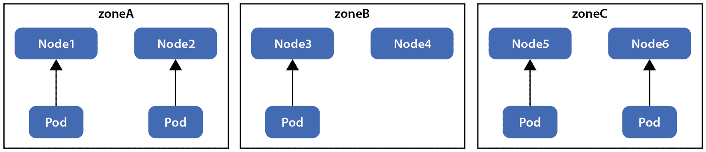
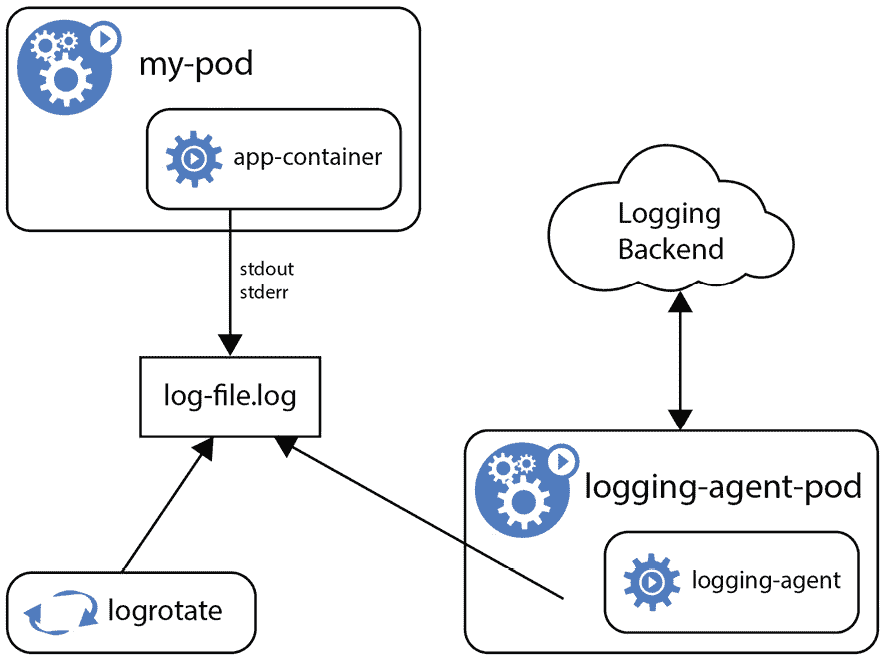
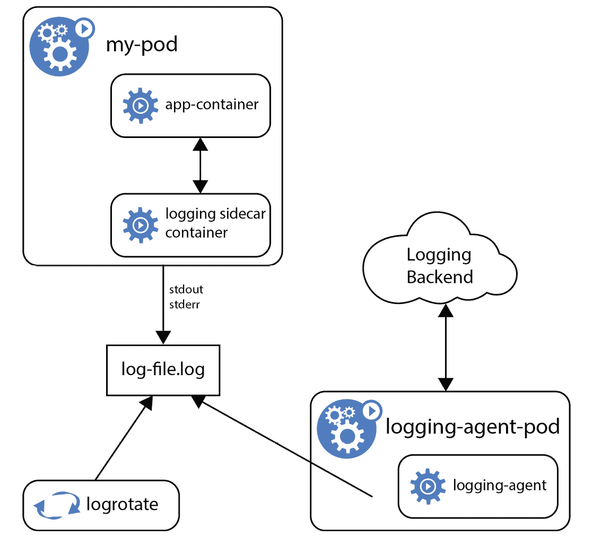

# 7

# 使用 Kubernetes 进行应用程序部署和调试

在本章中，我们将了解如何控制工作负载在 Kubernetes 上的部署，Kubernetes 调度器是如何工作的，以及当应用程序在 K8s 上运行时出现问题时，如何进行调试。本章同时涵盖了**Kubernetes 和 Cloud Native Associate**（**KCNA**）认证考试的 *Kubernetes 基础* 和 *Cloud Native Observability* 域的内容。

如前所述，我们将继续使用我们的 minikube Kubernetes 进行一些练习，所以保持你的设置准备好。我们将涵盖以下主题：

+   Kubernetes 中的调度

+   资源请求和限制

+   在 Kubernetes 中调试应用程序

让我们继续我们的 Kubernetes 之旅！

# Kubernetes 中的调度

我们已经在 *第五章* 简要介绍了 Kubernetes 调度器（`kube-scheduler`）的工作原理。调度器是 K8s 控制平面的组件，决定 pod 会在哪个节点上运行。

调度

调度是将 Pods 分配给 Kubernetes 节点以供 kubelet 执行的过程。调度器会在无限循环中监控新创建的 Pods，查看哪些 Pods 尚未分配 *节点*，并为每个发现的 Pod 找到合适的节点来运行它。

默认的 `kube-scheduler` 调度器会分两阶段为 pod 选择节点：

1.  **过滤**：第一阶段是调度器确定可以运行 pod 的节点集合。这包括检查节点是否具有足够的容量以及其他特定 pod 的需求。如果集群中没有适合的节点，这个列表可能为空，且在这种情况下，pod 会停留在未调度状态，直到需求或集群状态发生变化。

1.  **评分**：第二阶段是调度器在第一阶段过滤的节点中进行排名，选择最合适的 pod 部署位置。列表中的每个节点都会被评分，最终选择得分最高的节点。

让我们通过一个实际的例子来说明。假设我们有一个应用程序需要具备特定硬件的节点。例如，你运行**机器学习**（**ML**）工作负载，可以利用 GPU 进行更快的处理，或者一个应用程序要求特定的 CPU 代际，而这个 CPU 可能并非集群中的每个节点都具备。在所有这种情况下，我们需要指示 Kubernetes 限制可用于 pod 的适合节点列表。方法有多种：

+   在 pod 规范中指定 `nodeSelector` 字段，并给节点打标签

+   在 pod 规范中指定一个确切的 `nodeName` 字段

+   使用**亲和性**和**反亲和性**规则

+   使用 pod **拓扑** **分布约束**

现在让我们回到 minikube 设置，通过使用 `minikube node add` 命令（*此操作可能需要* *一些时间*）来扩展集群，添加一个新的节点：

```
$ minikube node add
😄  Adding node m02 to cluster minikube
❗  Cluster was created without any CNI, adding a node to it might cause broken networking.
👍  Starting worker node minikube-m02 in cluster minikube
🚜  Pulling base image ...
🔥  Creating docker container (CPUs=2, Memory=2200MB) ...
🐳  Preparing Kubernetes v1.23.3 on Docker 20.10.12 ...
🔎  Verifying Kubernetes components...
🏄  Successfully added m02 to minikube!
```

到此为止，我们应该已经拥有一个包含两个节点的 minikube 集群！让我们查看节点列表：

```
$ minikube kubectl get nodes
NAME           STATUS   ROLES                  AGE   VERSION
minikube       Ready    control-plane,master   22d   v1.23.3
minikube-m02   Ready    <none>                 84s   v1.23.3
```

注意

如果你的系统没有足够的资源来运行另一个 Kubernetes 节点，你也可以像之前一样仅使用一个节点。但是，在这种情况下，你需要调整本章中遇到的示例命令来标记第一个节点。

现在我们将创建之前的 nginx 部署的修改版，要求节点上附加`purpose: web-server`标签。相应的`Deployment`规范可能是这样的：

```
$ cat nginx-deployment-with-node-selector.yaml
apiVersion: apps/v1
kind: Deployment
metadata:
  name: nginx-deployment-with-node-selector
  labels:
    app: nginx
spec:
  replicas: 1
  selector:
    matchLabels:
      app: nginx
  template:
    metadata:
      labels:
        app: nginx
    spec:
      containers:
      - name: nginx
        image: nginx:1.14.2
        ports:
        - containerPort: 80
      nodeSelector:
        purpose: web-server
```

注意

如果你还没有删除上一章练习中的资源，可以通过分别在`kcna`命名空间中执行`kubectl delete deployment`、`kubectl delete sts`或`kubectl delete service`来删除它们。

接下来，创建前述的 nginx 部署规范：

```
$ minikube kubectl -- create -f nginx-deployment-with-node-selector.yaml -n kcna
deployment.apps/nginx-deployment-with-node-selector created
```

让我们检查发生了什么；例如，查询`kcna`命名空间中的 Pod：

```
$ minikube kubectl -- get pods -n kcna
NAME                                                   READY   STATUS    RESTARTS   AGE
nginx-deployment-with-node-selector-7668d66698 -48q6b   0/1     Pending   0          1m
```

看，它开始了——创建的 Nginx Pod 卡在了`Pending`状态。让我们通过`kubectl describe`命令检查更多细节（*你的 Pod 命名* *可能不同*）：

```
$ minikube kubectl -- describe pods nginx-deployment-with-node-selector-7668d66698-48q6b -n kcna
… LONG OUTPUT OMITTED …
Events:
  Type     Reason            Age                From               Message
  ----     ------            ----               ----               -------
  Warning  FailedScheduling  1m                default-scheduler  0/2 nodes are available: 2 node(s) didn't match Pod's node affinity/selector.
```

信息很明确——我们已经请求了一个具有特定标签的节点来运行我们的 nginx 部署 Pod，但没有可用的具有该标签的节点。

我们可以通过添加`--show-labels`参数来检查节点上有哪些标签：

```
$ minikube kubectl -- get nodes --show-labels
NAME           STATUS   ROLES                  AGE    VERSION   LABELS
minikube       Ready    control-plane,master    22d    v1.23.3   beta.kubernetes.io/arch=amd64,beta.kubernetes.io/os=linux,kubernetes.io/arch=amd64,kubernetes.io/hostname=minikube,kubernetes.io/os=linux,minikube.k8s.io/commit=362d5fdc0a3dbee389b3d3f1034e8023e72bd3a7,minikube.k8s.io/name=minikube,minikube.k8s.io/primary=true,minikube.k8s.io/updated_at=2022_06_19T17_20_23_0700,minikube.k8s.io/version=v1.25.2,node-role.kubernetes.io/control-plane=,node-role.kubernetes.io/master=,node.kubernetes.io/exclude-from-external-load-balancers=
minikube-m02   Ready    <none>                 19m   v1.23.3   beta.kubernetes.io/arch=amd64,beta.kubernetes.io /os=linux,kubernetes.io/arch=amd64,kubernetes.io/hostname=minikube-m02,kubernetes.io/os=linux
```

默认标签包括有关节点角色、CPU 架构、操作系统等一些有用信息。现在我们为新添加的节点标记与 nginx 部署所需要的相同标签（*节点名称在你的情况下可能类似，请* *相应调整*）：

```
$ minikube kubectl -- label node minikube-m02  "purpose=web-server"
node/minikube-m02 labeled
```

过了一会儿，我们可以看到 nginx Pod 正在被创建：

```
$ minikube kubectl -- get pods -n kcna
NAME                                                   READY   STATUS              RESTARTS   AGE
nginx-deployment-with-node-selector-7668d66698 -48q6b   0/1     ContainerCreating   0          22m
```

通过添加`-o wide`选项，我们可以看到 Pod 被分配到哪个节点：

```
$ minikube kubectl -- get pods -n kcna -o wide
NAME                                                   READY   STATUS    RESTARTS   AGE   IP           NODE           NOMINATED NODE   READINESS GATES
nginx-deployment-with-node-selector-7668d66698-48q6b    1/1     Running   0          23m   172.17.0.2   minikube-m02   <none>           <none>
```

这展示了通过`nodeSelector`向 Kubernetes 调度器提供位置指令的最常见方式。

让我们继续讨论 Kubernetes 提供的其他调度控制。`nodeName`应该很明显——它允许我们指定希望工作负载被调度到哪个节点。亲和性和反亲和性规则则更有趣。从概念上讲，亲和性类似于`nodeSelector`，但有更多的自定义选项。

nodeAffinity 和 podAffinity

这些规则允许你将 Pod 调度到集群中的某些节点（`nodeAffinity`），或者调度到已经运行指定 Pod 的节点（`podAffinity`）。

nodeAntiAffinity 和 podAntiAffinity

亲和性（affinity）的反义词。这些规则允许你将 Pod 调度到与指定节点不同的节点（`nodeAntiAffinity`），或者将 Pod 调度到已有指定 Pod 运行的不同节点（`podAntiAffinity`）。

换句话说，亲和性规则用于将 Pod 吸引到某些节点或其他 Pod 上，而反亲和性则是相反——将 Pod 推离某些节点或其他 Pod。亲和性也可以分为两种类型——*硬性*和*软性*：

+   `requiredDuringSchedulingIgnoredDuringExecution`——硬性要求，意味着除非满足规则，否则 Pod 不会被调度。

+   `preferredDuringSchedulingIgnoredDuringExecution` – 软性要求，意味着调度器会尝试找到满足要求的节点，但如果不可用，pod 仍会被调度到其他任何节点上。

注意

`IgnoredDuringExecution` 意味着如果 Kubernetes 已经调度了 pod 后节点标签发生变化，pod 将继续在同一节点上运行。

我们清单上的最后一项是 pod **拓扑** **分布约束**。

拓扑分布约束

这些规则使我们能够控制 Pods 在集群中的分布，跨越不同的故障域，如区域、**可用区** (**AZs**)、节点或其他用户定义的拓扑。

本质上，这些规则使我们能够控制 Pods 的运行位置，考虑到集群的物理拓扑。在今天的云环境中，我们通常会在每个云提供商运营的区域内拥有多个 AZ。

AZ

这指的是一个或多个离散的数据中心，具有冗余的电力、网络和互联网连接。

在 Kubernetes 中，最佳实践是将控制平面和工作节点运行在多个可用区（AZ）中。例如，在 `eu-central-1` 区域，**Amazon Web Services** (**AWS**) 当前有三个 AZ，因此我们可以在每个 AZ 中运行一个控制平面节点，并在每个 AZ 中运行多个工作节点。在这种情况下，为了实现**高可用性** (**HA**) 和高效的资源利用，我们可以对工作负载应用拓扑分布约束，以控制 Pods 在节点和可用区之间的分布，如*图 7.1*所示：



图 7.1 – Pods 在集群中分布的示例

通过这种方式，我们可以保护工作负载免受单个节点故障以及可能影响整个 AZ 的云提供商故障的影响。此外，还可以结合不同的方法和规则，进行更精确和细粒度的 Pods 安排控制。例如，我们可以将拓扑分布约束与 `nodeAffinity` 和 `podAntiAffinity` 规则结合使用，应用于同一个部署。

注意

可以为每个 pod 组合多个规则，例如，`nodeSelector` 与硬性 `nodeAffinity` 规则（`requiredDuringSchedulingIgnoredDuringExecution`）一起使用。两个规则都必须满足才能调度 pod。在至少有一个规则不满足的情况下，pod 将处于 `Pending` 状态。

总体来说，Kubernetes 的调度可能一开始看起来有些复杂，但随着经验的积累，你会发现它的丰富特性非常强大，可以帮助我们处理复杂的场景以及非常大规模和多样化的 K8s 安装。就 KCNA 考试的范围而言，你不需要了解深入的细节，但如果你有时间，建议查看本章末尾的*进一步阅读*部分。

# 资源请求和限制

在我们之前探索 K8s 调度器功能时，你是否曾想过 Kubernetes 是如何知道 *哪个节点是集群中最适合特定 Pod 的节点*？如果我们创建一个没有亲和性设置、拓扑约束或节点选择器的 Deployment，Kubernetes 如何决定集群中哪个位置最适合运行我们想要的应用？

默认情况下，K8s 不知道每个容器在调度的 Pod 中需要多少资源（CPU、内存等）来运行。因此，为了让 Kubernetes 做出最佳调度决策，我们需要让 K8s 了解每个容器正常运行所需的资源。

资源请求

资源请求是可选的指定，表明每个 Pod 中的容器需要多少资源。如果 Pod 所在的节点有可用资源，容器可以使用超过请求的资源。指定的请求量将在 Pod 被调度到的节点上保留。

Kubernetes 还允许我们对容器可以消耗的资源设置硬性限制。

资源限制

资源限制是对正在运行的容器最大可消耗资源的可选指定，这些限制由 kubelet 和容器运行时强制执行。

例如，我们可以设置 nginx 容器需要 `250 MiB`。如果这个容器所在的 Pod 被调度到一个总内存为 `8 GiB` 的节点上，且该节点上运行的 Pod 不多，那么我们的 nginx 容器可能会使用 `1 GiB` 或更多内存。然而，如果我们额外设置了 `1 GiB` 的限制，运行时将防止 nginx 超过该限制。如果进程试图分配更多内存，节点的内核将强制终止该进程并报出 **Out Of Memory** (**OOM**) 错误，容器将被重启。

对于 CPU，限制和请求是通过绝对单位来衡量的，其中 1 CPU 单位等于 1 `0.5` CPU，也就是 `500m` 单位，其中 `m` 代表 *milliCPU*，如你所猜测的，它允许我们以这种方式指定 CPU 的一部分。与内存不同，如果进程试图消耗超出限制的 CPU 时间，它不会被杀死；而是会被限制使用。

注意

当指定了资源限制但未指定请求，并且未设置默认请求（例如，默认值可能从命名空间设置中继承）时，Kubernetes 将复制指定的限制并将其用作请求。例如，`500 MiB` 的限制会导致请求也为 `500 MiB`。

是时候看到这些操作了！让我们回到 Minikube 配置，尝试在 `kcna` 命名空间中创建以下带有单个容器的示例 Pod：

```
apiVersion: v1
kind: Pod
metadata:
  name: memory-demo
spec:
  containers:
  - name: memory-demo-ctr
    image: polinux/stress
    resources:
      requests:
        memory: "100Mi"
      limits:
        memory: "200Mi"
    command: ["stress"]
    args: ["--vm", "1", "--vm-bytes", "150M", "--vm-hang", "1"]
```

执行以下命令：

```
$ minikube kubectl -- create -f memory-request-limit.yaml -n kcna
pod/memory-demo created
```

其中的应用是一个简单的 `stress` 测试工具，能够生成可配置的负载和内存消耗。根据前面规范中指定的参数，它正好消耗 `150 Mi` 内存。由于 `150 Mi` 小于设置的限制（`200 Mi`），一切正常。

现在，让我们修改 `stress` 规格中的参数，将 `150M` 改为 `250M`。相应的更改在以下代码片段中突出显示：

```
        memory: "200Mi"
    command: ["stress"]
    args: ["--vm", "1", "--vm-bytes", "250M", "--vm-hang", "1"]
```

删除旧的 pod，并应用更新后的规格，假设文件现在名为 `memory-request-over-limit.yaml`：

```
$ minikube kubectl -- delete pods memory-demo -n kcna
pod "memory-demo" deleted
$ minikube kubectl -- apply -f memory-request-over-limit.yaml -n kcna
pod/memory-demo created
$ minikube kubectl -- get pods -n kcna
NAME                                                   READY   STATUS              RESTARTS   AGE
memory-demo                                            0/1     ContainerCreating   0          3s
```

如果你输入足够快，你应该能够看到 `OOMKilled` 状态，最终还会看到 `CrashLoopBackOff`：

```
$ minikube kubectl -- get pods -n kcna
NAME                                                   READY   STATUS      RESTARTS   AGE
memory-demo                                            0/1     OOMKilled   0          5s
$ minikube kubectl -- get pods -n kcna
NAME                                                   READY   STATUS             RESTARTS      AGE
memory-demo                                            0/1     CrashLoopBackOff   2 (31s ago)   54s
```

此外，你还可以运行 `minikube kubectl -- describe po memory-demo -n kcna` 查看更多细节：

```
… LONG OUTPUT OMITTED …
     State:          Waiting
      Reason:       CrashLoopBackOff
    Last State:     Terminated
      Reason:       OOMKilled
      Exit Code:    1
```

因为该进程分配了 `250 MiB` 内存，并设置了 `150 MiB` 的限制，所以它被杀死。请记住，如果你在一个 pod 中运行多个容器，而该 pod 中至少有一个容器没有运行，则整个 pod 会停止接受请求。

总结一下，请求和限制非常重要，**最佳实践是为所有在 Kubernetes 中运行的工作负载配置这两者**，因为 Kubernetes 并不知道你的应用需要多少资源，而你可能会导致集群中的工作节点过载或未充分利用，从而影响稳定性，尤其是在资源请求未定义时。另一方面，资源限制有助于防止出现异常的 pod 和有 bug 的应用，它们可能会泄漏内存或试图使用所有可用的 CPU 时间，影响邻近的工作负载。

完成后，如果需要，可以删除 `kcna` 命名空间中的 pod 和其他资源。接下来，我们将继续探索 Kubernetes，并学习如何调试在 Kubernetes 上运行的应用。

# 在 Kubernetes 中调试应用

当你开始使用 Kubernetes 运行各种应用时，你最终会遇到需要调试至少部分应用的情况。有时，应用可能会遇到导致崩溃的 bug——可能是配置错误，或者在某些场景下表现异常。Kubernetes 提供了多种机制来帮助我们找出容器化负载和各个 pod 容器的问题，包括以下内容：

+   从 pod 中所有容器获取日志，并获取之前 pod 运行的日志

+   查询集群中最近发生的事件

+   从 pod 转发端口到本地环境

+   在 pod 容器内运行任意命令

日志在调试过程中起着至关重要的作用，帮助我们理解哪些地方没有按预期工作。应用通常支持多个日志级别，按信息的严重性和详细程度分类，例如接收到的请求及其负载；中断的连接；无法连接到数据库或其他服务等。

常见的日志级别有`INFO`、`WARNING`、`ERROR`、`DEBUG`和`CRITICAL`，其中`ERROR`和`CRITICAL`级别只会记录被认为是错误或重大问题的事件。`INFO`和`WARNING`级别可能提供关于发生了什么或可能表示应用程序问题的通用信息，而`DEBUG`通常会记录应用程序发生的所有事件，提供最详细的内容。顾名思义，启用`DEBUG`日志级别来帮助调试问题通常是明智的。尽管这种分类方式在业界非常标准，但一些软件可能有自己定义的日志详细程度方式，因此请参考相应的文档和配置示例。目前，标准的日志表示格式是 JSON，并且几乎所有编程语言和各种应用程序的开发库都广泛支持这一格式。

在日志架构方面，最佳做法是使用单独的后端来存储、分析和查询日志，以便独立于 Kubernetes 节点、Pod 和容器的生命周期持久化日志记录。这种方法称为**集群级日志**。Kubernetes 本身并不提供原生的日志存储解决方案，只会在每个节点上保留最新的日志。然而，有许多日志解决方案可以与 Kubernetes 无缝集成，例如**Grafana Loki**或**Elastic Stack**（**ELK**）等。集群级日志的对立面是为集群中运行的每个 Pod（应用程序）单独配置日志。这种方式不推荐在 Kubernetes 中使用。

为了收集每个 Kubernetes 节点的日志进行聚合和长期存储，通常使用**节点日志代理**。这些是小型的容器化代理，运行在每个节点上，并将所有收集的日志推送到日志后端服务器。由于它们需要在集群中的每个节点上运行，因此通常将它们定义为**DaemonSet**。这种设置的示意图如*图 7.2*所示：



图 7.2 – 使用节点日志代理进行日志收集与聚合

让我们暂时回到我们的 minikube 设置，看看如何获取应用程序日志。我们从一个基本的 Pod 开始，它只是将当前的日期和时间写入**标准** **输出**（**stdout**）：

```
$ minikube kubectl -- apply -f 
https://k8s.io/examples/debug/counter-pod.yaml -n kcna
pod/counter created
$ minikube kubectl -- get pods -n kcna
NAME                                                   READY   STATUS    RESTARTS   AGE
counter                                                1/1     Running   0          22s
```

执行`kubectl logs`以获取容器日志。如果一个 Pod 有多个容器，你需要额外指定想要获取日志的特定容器，可以使用`--container`参数：

```
$ minikube kubectl -- logs counter -n kcna
0: Sun Aug  7 13:31:21 UTC 2022
1: Sun Aug  7 13:31:22 UTC 2022
2: Sun Aug  7 13:31:23 UTC 2022
3: Sun Aug  7 13:31:24 UTC 2022
4: Sun Aug  7 13:31:25 UTC 2022
5: Sun Aug  7 13:31:26 UTC 2022
6: Sun Aug  7 13:31:27 UTC 2022
7: Sun Aug  7 13:31:28 UTC 2022
8: Sun Aug  7 13:31:29 UTC 2022
9: Sun Aug  7 13:31:30 UTC 2022
10: Sun Aug  7 13:31:31 UTC 2022
11: Sun Aug  7 13:31:32 UTC 2022
12: Sun Aug  7 13:31:33 UTC 2022
```

注意

也可以通过在`kubectl` `logs`命令中添加`--previous`参数，来获取上一个容器执行的日志（在容器被重启之前）。

我们在这里看到的实际上是容器内应用程序写入的`stdout`和`stderr`内容（`kubectl logs`）。

然而，如果一个应用没有配置将日志记录到`stdout`和`stderr`，则可以添加一个日志侧车（sidecar）——一个在同一 Pod 中运行的独立容器，它捕获主容器的日志并将其转发到日志服务器或自身的`stdout`和`stderr`输出流。这样的设置在*图 7.3*中有示意图：



图 7.3 – 使用侧车容器流式传输日志

接下来是可以提供有价值的见解，帮助你了解 Kubernetes 集群中发生了什么的事件。

Kubernetes 事件

这是一个记录 Kubernetes 资源状态变化的记录——例如，当节点变为`NotReady`或**PersistentVolume**（**PV**）未能挂载时，对节点、Pod 及其他资源的变化。

事件是有命名空间的，可以使用`kubectl get events`命令查询最近的事件。例如，如果我们最近扩展了一个 nginx 部署，我们可能会看到类似这样的内容：

```
$ minikube kubectl -- get events -n kcna
LAST SEEN   TYPE     REASON              OBJECT                                                      MESSAGE
5s          Normal   Scheduled           pod/nginx-deployment-with-node-selector-7668d66698-bx7kl    Successfully assigned kcna/nginx-deployment-with-node-selector-7668d66698-bx7kl to minikube-m02
3s          Normal   Pulled              pod/nginx-deployment-with-node-selector-7668d66698-bx7kl    Container image "nginx:1.14.2" already present on machine
3s          Normal   Created             pod/nginx-deployment-with-node-selector-7668d66698-bx7kl    Created container nginx
3s          Normal   Started             pod/nginx-deployment-with-node-selector-7668d66698-bx7kl    Started container nginx
5s          Normal   SuccessfulCreate    replicaset/nginx-deployment-with-node-selector-7668d66698   Created pod: nginx-deployment-with-node-selector-7668d66698-bx7kl
5s          Normal   ScalingReplicaSet   deployment/nginx-deployment-with-node-selector              Scaled up replica set nginx-deployment-with-node-selector-7668d66698 to 2
```

注意

默认情况下，只有过去一小时内发生的事件会被保留。这个时长可以在`kube-apiserver`配置中增加。

接下来是另一个在调试或开发过程中使用 Kubernetes 时非常有用的功能——`kubectl`命令，你可以配置它将本地端口上的连接转发到 K8s 集群中任意 Pod 的指定远程端口。命令的语法如下所示：

```
kubectl port-forward POD_NAME LOCAL_PORT:REMOTE_POD_PORT
```

如果你需要像在工作站本地运行一样访问 Kubernetes 负载，这非常有帮助。例如，你有一个 Web 应用在 Pod 中的`80`端口上监听，你将本地端口`8080`转发到该 Pod 的远程端口`80`。在端口转发运行时，你可以通过`localhost:8080`在本地访问该应用。

端口转发不是 KCNA 考试的一部分；然而，如果你有时间，可以随时查看本章结尾的*进一步阅读*部分，里面有关于如何使用它的示例。

我们列表中的最后一点是关于在已经运行的 Pod 容器中启动进程。我们之前已经做过这件事，在*第六章*，*使用 Kubernetes 部署和扩展应用*中。

相应的`kubectl exec`命令允许我们在容器中启动临时的、任意的进程，大多数情况下，你可能会用它来启动一个交互式模式的 shell（`bash`或`sh`）。这*感觉*就像使用**安全外壳**（**SSH**）协议登录到容器中。以下是一个示例：

```
kubectl exec -it POD_NAME -c CONTAINER_NAME bash
```

Kubernetes 还允许我们在本地系统和远程容器之间复制文件。相关命令是`kubectl cp`，它的工作方式与 Linux 的`scp`工具非常相似，但在 Kubernetes 的上下文中使用。

`exec` 和 `cp` 都非常实用于理解在调试的应用程序容器内发生的事情。它们允许我们快速验证配置设置、执行 HTTP 请求，或获取未写入 `stdout` 或 `stderr` 的日志。

# 总结

总的来说，在本章中，我们学习了在 K8s 中运行和操作工作负载的一些重要方面。我们了解了 pod 调度在 Kubernetes 中是如何工作的，它的各个阶段（`nodeSelector`、`nodeName`、**亲和性**和**反亲和性**设置，以及**拓扑分布约束**）。Kubernetes 调度器的丰富功能使我们能够涵盖控制工作负载在集群节点上如何分配的所有可能场景。通过这些控制，我们可以将一个应用程序的 Pods 分布到多个可用区（AZ）中的节点上以实现高可用性；将需要特殊硬件（例如 GPU）的 Pods 仅调度到具有该硬件的节点上；使用亲和性将多个应用程序集中在同一节点上运行；等等。

接下来，我们了解到**资源请求**帮助 Kubernetes 做出更好的调度决策，而**资源限制**则是为了保护集群和其他 Pod 免受不良应用程序的影响，或者简单地限制资源利用。当容器达到指定的内存限制时，它的进程会被终止（并重新启动容器）；而当达到分配的 CPU 单元时，进程会被限速。

之后，我们探讨了在 K8s 上调试应用程序的方法。日志是任何问题分析中最基础和最重要的工具之一。Kubernetes 遵循 `stdout` 和 `stderr`，解决方案是在与应用程序同一 pod 中运行一个**日志 sidecar 容器**，以流式传输日志。

调试应用程序并了解集群中发生的情况的其他实用方法包括 Kubernetes 事件、端口转发，以及执行任意进程，如 `kubectl` `exec` 命令。

接下来是 Kubernetes 部分的最后一章，我们将在其中学习一些最佳实践并探索 K8s 的其他操作方面。如果你想更深入了解本节中描述的内容，请查看*进一步阅读*部分。

# 问题

在总结时，这里有一组问题供你测试自己对本章内容的理解。你可以在*附录*的*评估*部分找到答案：

1.  以下哪些阶段是 Kubernetes 调度的一部分（可以选择多个）？

    1.  扩展

    1.  启动

    1.  过滤

    1.  打分

1.  如果 Kubernetes 调度器无法将一个 pod 分配到节点上，会发生什么？

    1.  它将停留在 `CrashLoopBackOff` 状态

    1.  它将停留在 `Pending` 状态

    1.  它将停留在 `NotScheduled` 状态

    1.  它将强制在某个控制平面节点上运行

1.  以下哪些调度器指令在条件无法满足（软亲和性或软反亲和性）时，不会阻止 pod 被调度？

    1.  `requiredDuringSchedulingIgnoredDuringExecution`

    1.  `preferredDuringSchedulingIgnoredDuringExecution`

    1.  `neededDuringSchedulingIgnoredDuringExecution`

    1.  `softAffinity`

1.  应该使用 Kubernetes 调度器的哪个功能来控制 Pods 如何在不同的故障域（如可用区、节点等）中分布？

    1.  Pod 故障域约束

    1.  Pod 拓扑分布约束

    1.  `podAntiAffinity`

    1.  `nodeName`

1.  `podAffinity` 在 Kubernetes 中的作用是什么？

    1.  将 Pods 调度到集群中的特定节点

    1.  将两个或更多的 Pods 组合在一起以获得更好的性能

    1.  将 Pods 调度到其他 Pods 已经运行的节点上

    1.  将 Pods 调度到其他 Pods 已经运行的不同节点上

1.  Kubernetes 中资源请求的目的是什么？

    1.  它们帮助规划集群扩展

    1.  它们定义了集群中更重要的工作负载

    1.  它们帮助选择集群中适合工作负载的硬件

    1.  它们有助于在集群中优化 Pod 的放置

1.  如果容器的内存限制设置为 `500Mi`，但尝试分配 `550Mi`，会发生什么情况？

    1.  `550Mi` 在 10% 的误差范围内，因此容器将正常分配内存

    1.  Pods 的限制比容器更高，因此内存分配将正常工作

    1.  容器进程将因为 OOM 错误被杀死

    1.  当容器进程超过 `500Mi` 时，将会卡住

1.  如果限制设置为 `1.5`，且该命名空间没有默认值，那么容器的 CPU 请求值是多少？

    1.  `0.0`

    1.  `0.75`

    1.  `1.5`

    1.  `1.0`

1.  如果一个 Pod 的容器请求总共为 `10.0` CPU 单位，但集群中最大的节点只有 `8.0` 个 CPU，会发生什么情况？

    1.  请求不是硬性要求；Pod 将被调度

    1.  请求是硬性要求；Pod 将处于 `Pending` 状态

    1.  由于 `preferredDuringScheduling` 选项，Pod 无论如何都会被调度

    1.  由于集群资源不足，Pod 将处于 `CrashLoopBackOff` 状态

1.  通常用于调试的最大详细级别是哪一个日志级别？

    1.  `INFO`

    1.  `ERROR`

    1.  `MAXIMUM`

    1.  `DEBUG`

1.  集群级别日志在 Kubernetes 中意味着什么样的日志存储？

    1.  K8s 将所有集群日志聚合到控制平面节点

    1.  K8s 需要独立的日志收集和聚合系统

    1.  K8s 提供了一个完整的日志存储和聚合解决方案

    1.  K8s 仅为最重要的集群健康日志提供存储

1.  Kubernetes 中的节点日志代理做什么（选择多个）？

    1.  仅从工作节点收集日志

    1.  收集所有节点的日志

    1.  将日志从工作节点发送到控制平面节点

    1.  将日志发送到聚合和存储到日志后端

1.  Kubernetes 中日志侧车代理的作用是什么？

    1.  从无法记录到 `stdout` 和 `stderr` 的应用程序收集并流式传输日志

    1.  为了在节点故障时提供日志的备份副本

    1.  允许在 `ERROR` 和 `DEBUG` 等详细级别上记录日志

    1.  使 `kubectl logs` 命令正常工作的目的

1.  以下哪个 `kubectl` 命令允许我们在容器中运行一个任意进程？

    1.  `kubectl run`

    1.  `kubectl start`

    1.  `kubectl exec`

    1.  `kubectl proc`

1.  以下哪个命令将返回已失败并重新启动的 Pod 容器的日志？

    1.  `kubectl logs` `POD_NAME --previous`

    1.  `kubectl` `logs POD_NAME`

    1.  `kubectl previous` `logs POD_NAME`

    1.  `kubectl logs`

1.  哪个 Kubernetes 调度器功能提供了一种简单的方法，将 Pods 限制到具有特定标签的节点上？

    1.  `kubectl local`

    1.  `nodeConstrain`

    1.  `nodeSelector`

    1.  `nodeName`

# 深入阅读

要了解本章中涉及的更多主题，请查看以下资源：

+   调度和分配 Pods 到节点： [`kubernetes.io/docs/concepts/scheduling-eviction/assign-pod-node/`](https://kubernetes.io/docs/concepts/scheduling-eviction/assign-pod-node/)

+   Pod 拓扑分布约束： [`kubernetes.io/docs/concepts/scheduling-eviction/topology-spread-constraints/`](https://kubernetes.io/docs/concepts/scheduling-eviction/topology-spread-constraints/)

+   Kubernetes 中的资源管理： [`kubernetes.io/docs/concepts/configuration/manage-resources-containers/`](https://kubernetes.io/docs/concepts/configuration/manage-resources-containers/)

+   使用端口转发访问 K8s 集群中的应用程序：[`kubernetes.io/docs/tasks/access-application-cluster/port-forward-access-application-cluster/`](https://kubernetes.io/docs/tasks/access-application-cluster/port-forward-access-application-cluster/)

+   获取运行中容器的 Shell: [`kubernetes.io/docs/tasks/debug/debug-application/get-shell-running-container/`](https://kubernetes.io/docs/tasks/debug/debug-application/get-shell-running-container/)
