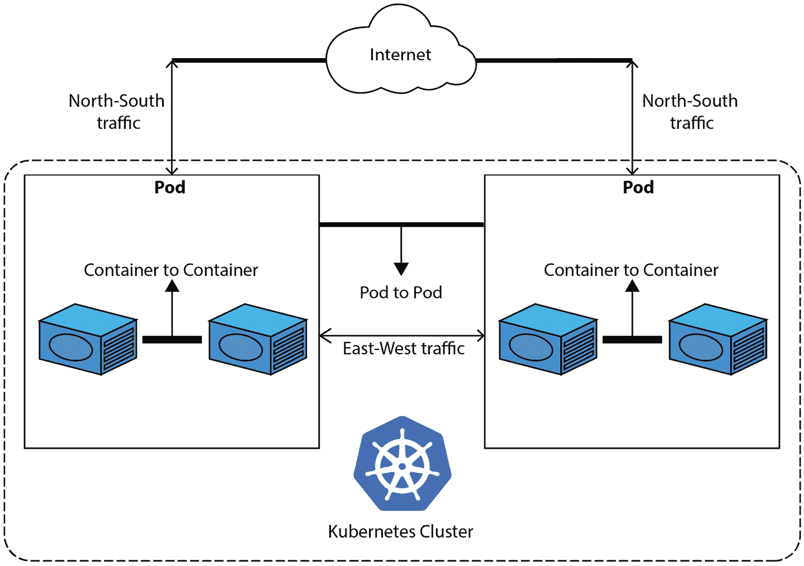

# 8

# 遵循 Kubernetes 最佳实践

我们终于到达了 Kubernetes 部分的最后一章！恭喜你来到这里——你现在已经完成了成为**Kubernetes 和云原生助理**（**KCNA**）认证的一半以上！

本章将讨论一些操作 Kubernetes 的最佳实践以及一些安全漏洞和解决方法。

我们将学习 Kubernetes 网络和**网络策略**用于流量控制；使用**基于角色的访问控制**（**RBAC**）来限制访问；使用**Helm**作为 K8s 的包管理器，等等。和之前一样，我们需要上一章的 minikube 设置来进行一些实践练习。

本章的主题包括以下内容：

+   Kubernetes 网络基础

+   RBAC

+   Helm——K8s 的包管理器

+   Kubernetes 最佳实践

让我们开始吧！

# Kubernetes 网络基础

毫不夸张地说，K8s 网络可能是最难理解的部分，即使是经验非常丰富的工程师和运维人员，也可能会感到困难。希望你还记得在*第四章*中提到，Kubernetes 实现了**容器网络接口**（**CNI**），这使我们可以使用不同的覆盖网络插件进行容器网络配置。然而，市面上有很多 CNI 提供商（例如**Flannel**、**Calico**、**Cilium**、**Weave**和**Canal**等），因此很容易感到困惑。这些提供商依赖于不同的技术，如**边界网关协议**（**BGP**）或**虚拟扩展局域网**（**VXLAN**），以提供不同级别的覆盖网络性能，并提供不同的功能。

但不用担心——在 KCNA 的范围内，你不需要了解太多细节。目前，我们将介绍 Kubernetes 网络基础知识。

请查看下图：



图 8.1 – Kubernetes 网络模型

如*图 8.1*所示，Kubernetes 集群中有三种类型的通信：

+   `localhost`，因为它们作为一个单元共同部署。

+   **Pod 到 Pod**——在覆盖网络层级上的通信（有时称为**Pod 网络**），跨越集群中所有节点。覆盖网络使得一个节点上的 pod 能够与集群中任何其他节点上的 pod 进行通信。这种通信通常称为**东西流量**。

+   使用`NodePort`或`LoadBalancer`类型将一个 pod 或一组具有相同应用程序的 pods 暴露到集群外部。与外部世界的通信也称为**南北流量**。

在实践中，当一个 Pod 需要与其他 Pod 通信时，这还会涉及 Kubernetes 的服务发现机制。由于 Kubernetes 中每个新启动的 Pod 会自动获得一个在平面覆盖网络中的 IP 地址，因此几乎不可能在任何配置中引用 IP 地址，因为地址会不断变化。相反，我们将使用 `ClusterIP` 服务，它会在新 Pod 启动或旧 Pod 终止时自动跟踪所有端点列表的变化（详见 *第六章*）。Kubernetes 还允许使用 **IP 地址管理**（**IPAM**）插件来控制 Pod IP 地址的分配。默认情况下，集群中的所有 Pod 使用单一的 IP 池。使用 IPAM 插件，可以将覆盖网络 IP 池细分为更小的块，并根据注释或 Pod 启动所在的工作节点来分配 Pod IP 地址。

接下来，重要的是要理解，集群中的所有 Pod 网络中的 Pod *默认情况下* 可以相互通信，*没有任何限制*。

注意

Kubernetes 命名空间不提供网络隔离。命名空间 `A` 中的 Pod 可以通过其在 Pod 网络中的 IP 地址访问命名空间 `B` 中的 Pod，反之亦然，除非通过 `NetworkPolicy` 资源加以限制。

`NetworkPolicy` 是一种资源，允许我们以应用程序为中心的方式控制 Kubernetes 中的网络流量。`NetworkPolicy` 允许我们定义 Pod 如何与其他 Pod（通过标签选择器选择）、其他命名空间中的 Pod（通过命名空间选择器选择）或 IP 地址块范围内的 Pod 通信。

网络策略本质上是 Kubernetes 中的一种 Pod 级别防火墙，它允许我们指定哪些流量可以进出与选择器匹配的 Pod。一个简单的例子是，当你有一个每个 Kubernetes 命名空间下包含多个微服务的应用程序时。你可能想要在这种情况下禁止命名空间之间的 Pod 通信，以便更好地实现隔离。另一个例子是：你可能希望限制对运行在 Kubernetes 中的数据库的访问，只允许需要访问它的 Pod，因为允许集群中的每个 Pod 访问数据库会带来安全风险。

但是，为什么我们在 Kubernetes 中需要应用网络策略呢？

随着应用程序从单体架构转向微服务架构，这增加了大量基于网络的通信。单体应用程序的绝大部分通信发生在 *内部*，因为它是一个大的可执行程序，而微服务依赖于消息总线和 Web 协议交换数据，这导致了大量的 **东西向** 网络流量，这些流量也应当得到安全保护。

在底层，网络策略由 CNI 提供商实现，为了使用网络策略，提供商应支持这些策略。例如，在我们的 minikube Kubernetes 中，`NetworkPolicy` 定义不会对集群中的流量产生任何影响。不过，如果你想深入了解 K8s 网络和网络策略，请查看*进一步阅读*部分。

接下来，我们将深入探讨 RBAC，看看它如何帮助保障 Kubernetes 集群的安全。

# RBAC

你可能已经注意到，在我们的 minikube 集群中，我们对所有资源和命名空间都有无限制的访问和控制。虽然这对于学习目的来说是可以的，但在运行和操作生产系统时，你很可能需要限制访问权限。这时，Kubernetes RBAC 就变得非常有用。

Kubernetes RBAC

这是 Kubernetes 中的主要安全机制，确保用户仅根据其分配的角色访问资源。

使用 K8s RBAC 可以做的一些示例：

+   限制对特定命名空间（例如生产命名空间或某个应用的命名空间）的访问，仅限于一小部分人群（例如具有管理员角色的人员）

+   限制对某些资源的只读访问

+   限制对特定资源组的访问（例如，**Pod**、**Service**、**Deployment**、**Secret** 或任何其他资源）

+   限制对与 Kubernetes API 交互的应用的访问

Kubernetes RBAC 是一个非常强大的机制，它允许我们实施**最小权限**原则，这被认为是访问管理的最佳实践。

最小权限原则

这是指每个用户或账户仅获得完成其工作或流程所需的最小权限。

至于 KCNA 考试的范围，这几乎涵盖了你需要了解的关于 Kubernetes 中访问限制的所有内容。不过，本书的目的是将你带得更进一步，更接近操作 Kubernetes 集群的真实场景，因此我们将深入探讨。

让我们看看当你执行 `kubectl apply` 或 `kubectl create` 并提供一些资源规范时会发生什么：

1.  `kubectl` 会从 `KUBECONFIG` 环境变量中指定的文件读取 Kubernetes 配置。

1.  `kubectl` 会发现可用的 Kubernetes API。

1.  `kubectl` 会验证提供的规范（例如，检查 YAML 格式是否正确）。

1.  将请求与载荷中的规范一起发送到 `kube-apiserver`。

1.  `kube-apiserver` 接收请求并验证请求的真实性（例如，*是谁*发起的请求）。

1.  如果在上一步请求的用户已通过身份验证，则会执行授权检查（例如，是否允许该用户创建/应用所请求的更改？）。

这是 RBAC 发挥作用的地方，它帮助 API 服务器决定是否允许该请求。在 Kubernetes 中，使用多个 RBAC 概念来定义访问规则：

+   `ALLOW`权限和没有`DENY`规则，角色没有明确允许的内容将会被*拒绝*。角色是一个命名空间资源，创建时需要指定命名空间。

+   **ClusterRole**—与*Role*相同，但它是一个非命名空间资源。用于集群范围的权限，如一次性授予对所有命名空间内所有资源的访问权限，或授予对集群范围内资源（如*节点*）的访问权限。

+   **ServiceAccount**—一种为运行在*Pod*内的应用程序提供身份的资源。它本质上与普通的*User*相同，但专门用于需要与 Kubernetes API 交互的非人工身份。Kubernetes 中的每个 Pod 都总是与一个服务账户关联。

+   **RoleBinding**—这是一个实体，用于在特定命名空间内将 Role 或*ClusterRole*中定义的权限应用并授予*User*、*Group*（用户组）或*ServiceAccount*。

+   **ClusterRoleBinding**—与*RoleBinding*类似，但仅适用于*ClusterRole*，可以将规则应用于所有命名空间。

*图 8.2* 演示了将*Role A*和*ClusterRole B*通过*RoleBinding*应用于*Namespace E*中的*Group D*用户和*ServiceAccount C*。规则是累加的，意味着将*ClusterRole B*和*Role A*规则合并后，允许的所有操作都将被允许：


图 8.2 – 通过 RoleBinding 应用 Role 和 ClusterRole 规则

虽然 Kubernetes RBAC 初看可能比较复杂，但一旦你开始实践应用它，它会变得更加简单和清晰。你会发现 RBAC 机制非常灵活和精细，可以覆盖所有可能的场景，包括当 Pod 内的应用程序需要访问 Kubernetes API 时的情况。

让我们来看看以下简单的`pod-reader`角色定义：

```
apiVersion: rbac.authorization.k8s.io/v1
kind: Role
metadata:
  namespace: kcna
  name: pod-reader
rules:
- apiGroups: [""] # "" indicates the core API group
  resources: ["pods"]
  verbs: ["get", "watch", "list"] # the actions allowed on resources
```

它可以通过`RoleBinding`授予在`kcna`命名空间内的 Pod 资源的只读访问权限，如以下代码片段所示：

```
apiVersion: rbac.authorization.k8s.io/v1
kind: RoleBinding
metadata:
  name: read-pods
  namespace: kcna
subjects:
# subjects can be multiple users, groups or service accounts
- kind: User
  name: jack # name is case sensitive
  apiGroup: rbac.authorization.k8s.io # the standard API group for all RBAC resources
roleRef:
  # roleRef specifies the binding to a Role or ClusterRole
  kind: Role # either a Role or ClusterRole
  name: pod-reader # name of the Role or ClusterRole to bind to
  apiGroup: rbac.authorization.k8s.io
```

继续在我们的 minikube 游乐场中首先创建一个`Role`，然后创建一个`RoleBinding`资源：

```
$ minikube kubectl -- create -f role.yaml -n kcna
role.rbac.authorization.k8s.io/pod-reader created
$ minikube kubectl -- create -f rolebinding.yaml -n kcna
rolebinding.rbac.authorization.k8s.io/read-pods created
```

`RoleBinding`引用了用户`jack`作为唯一主体，但单个`RoleBinding`也可以用来引用任意数量的用户、组和服务账户。

现在，在测试权限时，Kubernetes 有一个非常整洁的功能，允许我们在没有实际用户凭据（如 x509 客户端证书）的情况下检查权限。相应的`kubectl auth can-I`命令使我们能够验证特定用户、组或服务账户的允许和不允许的操作。尝试以下操作：

```
$ minikube kubectl -- auth can-i get pods --as=jack
no
```

但是，嘿，我们不是在之前的`pod-reader`角色定义中允许了用户`jack`进行`get`操作吗？是的，但是仅限于`kcna`命名空间！让我们通过指定命名空间再试一次：

```
$ minikube kubectl -- auth can-i get pods -n kcna --as=jack
yes
```

看起来好多了。那么 Pod 的创建或删除呢？让我们尝试以下操作：

```
$ minikube kubectl -- auth can-i create pods -n kcna --as=jack
no
$ minikube kubectl -- auth can-i delete pods -n kcna --as=jack
no
```

正如预期的那样，这是不允许的，就像我们为 `kcna` 命名空间中其他资源（除了 pod）创建的角色和绑定所限制的一样。你可能已经注意到角色定义中的*动词*非常精确——我们指定了 `get`、`watch` 和 `list`，它们并不相同：

+   `watch` 是一个动词，允许我们实时查看资源的更新。

+   `list` 只允许我们列出资源，但无法获取特定对象的更多细节

+   `get` 允许我们检索资源的信息，但你需要知道资源的名称（要找出这个信息，你需要使用 `list` 动词）

当然，也有写权限的动词，如 `create`、`update`、`patch` 和 `delete`，它们可以作为角色定义规范的一部分。

如果你想了解更多关于 RBAC 的信息，可以自行探索并查看章节末尾的*进一步阅读*部分的资料。接下来，我们将学习 Kubernetes 包管理器的内容。

# Helm —— Kubernetes 的包管理器

Kubernetes 的包管理器——这可能听起来有些困惑。我们使用系统包构建镜像，并通过 Docker 或其他工具将其推送到镜像仓库。那么，我们为什么还需要包管理器呢？

注意

本节内容并不是 KCNA 考试的必备知识；然而，强烈推荐阅读它，因为它可能帮助你在实际使用 Kubernetes 时避免一些错误。

想象一下以下场景——你正在为一家小企业管理几个 Kubernetes 集群。这些 Kubernetes 集群在规模和配置上类似，并且运行完全相同的应用程序，但分别用于不同的环境，如*开发*、*测试*和*生产*。开发团队推动微服务架构，现在大约有 50 个微服务在 Kubernetes 上运行，作为更大应用的一部分协同工作。

管理这些 Kubernetes 规范的天真方法是为每个微服务和每个环境创建单独的规范文件。要维护的 YAML 文件数量可能轻易超过 100 个，并且它们可能会包含大量重复的代码和设置，长期来看更难以管理。肯定有更好的方法，使用像 Helm 这样的包管理器就是其中一种可能的解决方案。

让我们更详细地澄清一下。Helm 不是用于构建容器镜像并将应用程序可执行文件打包其中的工具。Helm 用于对 Kubernetes 规范进行标准化管理，这些规范代表了我们希望在 Kubernetes 集群中运行的负载。

Helm

这是一个用于自动化创建、打包、部署和配置 Kubernetes 应用程序的工具。它有助于在 Kubernetes 上定义、安装和更新应用程序。

回到之前的 50 个微服务和 3 个环境的例子，使用 Helm，你可以创建一次可重用的模板，避免编写重复的规格文件，并且可以根据应用程序应该部署的环境，简单地应用不同的配置值。

接下来，你会意识到你运行的 50 个微服务中有 20 个依赖于独立的**Redis**实例，为了避免重复 20 次编写相同的 Redis 部署规格并使用不同的名称，你创建了一个模板化、可重用的单一规格，并可以简单地作为需求添加到其他需要它的应用程序中。

为了更好地理解 Helm，我们来谈谈它的三个主要概念：

+   **Helm chart**——这是一个包含运行 Kubernetes 应用程序所需的所有 K8s 资源定义（规格）的包。可以把它看作 Kubernetes 的等效物，就像 Linux 的**DEB**包、**RPM**包或**Homebrew**配方一样。

+   **Helm 仓库**——这是收集和共享*charts*的地方；它可以被视为 Kubernetes 的等效物，就像**Python 包索引**（**PyPI**）或**Perl 综合档案网络**（**CPAN**）对于 Perl 一样。*Charts*可以从*仓库*中下载，也可以上传到*仓库*。

+   **Helm 发布**——这是在 Kubernetes 集群中运行的*chart*实例。一个*chart*可以多次安装到同一个集群中，每次安装时都会创建一个新的发布。对于之前提到的 Redis 示例，我们可以有一个 Redis *chart*，在同一个集群中安装 20 次，每次安装都会有自己的*发布*和*发布名称*。

总而言之，Helm 将 charts 安装到 Kubernetes 中，每次安装时都会创建一个新的发布。通过 Helm 仓库，非常容易找到并重用适用于 Kubernetes 运行的常见软件的现成 charts。通过指定 charts 之间的依赖关系，也可以轻松地将多个 charts 一起安装，作为一个应用程序共同工作。

Helm 附带了一个 CLI 工具，也叫做`helm`。使用`helm` CLI 工具，我们可以搜索 chart 仓库、打包 charts、安装、更新和删除发布，并且几乎可以做 Helm 允许的所有操作。Helm 使用与`kubectl`相同的 Kubernetes 配置文件，并直接与 Kubernetes API 交互，如*图 8.3*所示：


图 8.3 – Helm v3 架构

Helm 还使得应用程序的更新和回滚变得更加简单。如果发布的变更出现问题，一个简单的命令——`helm rollback`——可以在几秒钟或几分钟内将你带回到之前的发布版本。使用 Helm 回滚与我们之前在*第六章*中尝试过的 Kubernetes 部署回滚类似，但不同之处在于 Helm 可以回滚任何图表规格的更改。例如，你修改了一个属于 Helm 图表的 Secret 规格文件，并触发了 `helm upgrade` 来推出这些更改。几分钟后，你发现这些更改破坏了图表应用程序，需要快速恢复到先前的版本。你可以执行 `helm rollback` 命令，指定可选的发布修订版和发布名称，迅速恢复到工作版本。

在此，我们不会深入探讨 Helm 或进行任何动手实验，因为 Helm 并不属于 KCNA 考试的一部分。本节的目标是为你快速介绍 Helm——一个大大简化 Kubernetes 上应用管理的工具。Helm 是一个包含 `if`/`else`/`with`/`range` 等功能的工具。

你还可以考虑其他工具，如**Kustomize**和**YTT**，它们实现了相同的目标，但采用了不同的方法。这些工具都不属于 KCNA 考试的一部分，但和往常一样，*进一步阅读*部分将包括这些工具的相关资源，如果你愿意深入了解。

# Kubernetes 最佳实践

虽然 KCNA 认证并不是一个安全性聚焦的认证，但你需要了解一些关于 Kubernetes 和 Cloud Native 的基本知识和最佳实践，现在是时候讨论这些内容了。

Kubernetes 的文档建议了**Cloud Native 安全的 4Cs**：*Cloud*、*Clusters*、*Containers* 和 *Code*——这是一个具有四层深入防御的方法：


图 8.4 – Cloud Native 安全的 4Cs

在这种方法中，内圈安全性建立在外层的基础上。这样，*Code* 层受到 *Container*、*Cluster* 和 *Cloud* 层的保护，你无法仅通过在 *Code* 层进行安全防护来解决基础层存在的不良安全标准和实践问题，就像即使外层有很强的安全性，你也不能忽视保护最内层的需要。让我们更详细地了解一下，看看 4Cs 中的每一层代表了什么。

从基础层开始，云或其他基础设施（例如企业数据库或共置服务器）作为 Kubernetes 集群的可信基础。如果 *Cloud* 层存在漏洞或配置错误，那么构建在其上的组件就无法保证安全。

在书的开始部分，我们讨论了云中的*共享责任模型*的含义，其中云提供商和用户都必须采取措施，以确保工作负载的安全。因此，始终参考并遵循云提供商的安全文档。

说到*集群*层，Kubernetes 有许多最佳实践——具体来说，包括*etcd*加密、RBAC 配置、限制对节点的访问、限制 API 服务器访问、保持 Kubernetes 版本更新等。但不用担心——你不需要记住这些内容就能通过 KCNA 考试。

接下来是*容器*层。如你在*第四章*中可能记得的那样，容器有*命名空间*、*沙箱*和*虚拟化*三种类型，它们各有优缺点，*虚拟化*最安全但*笨重*，*命名空间*最轻量，但共享同一宿主机内核，因此安全性较低。运行哪种容器取决于工作负载及其他要求。此外，避免在容器中以`root`用户身份运行应用程序。如果`root`容器被攻破，那么整个节点和所有其他容器都可能面临被攻破的高风险。

到达中间层时，核心是*代码*层。你不应运行你不信任的源代码——例如，如果你不知道代码的来源或具体功能。我们在*第四章*中也详细讨论了这个方面。你在某处找到的容器镜像可能会封装恶意代码，运行这些代码会在你的环境中为攻击者打开一个后门。至少，你应该自己构建和测试运行的代码，并将漏洞扫描自动化，作为容器镜像构建过程的一部分。

如果你在不安全或公共网络上运行 Kubernetes 集群，考虑实施服务网格来加密所有 pod 流量。否则，Kubernetes 默认的覆盖网络会以未加密的方式传输所有数据，尽管一些 CNI 提供商也支持**传输层安全协议**（**TLS**）。考虑使用网络策略来隔离并进一步保护你的工作负载。正确的做法是默认*拒绝*所有 pod 之间的通信，并为每个应用程序和微服务制定定制的*允许*规则。是的，你可以在一个集群中同时使用服务网格和网络策略，它们的使用并不互相排斥。

最后，在处理 Kubernetes 时，有一些基本的良好实践。它们可能是我们所学内容的重复，但“温故而知新”总比*事后吃苦*要好：

+   **使用控制器** **创建**

简单的 pod 规格不提供容错性及任何额外功能，如滚动更新。使用`Deployment`、`StatefulSet`、`DaemonSet`或`Job`控制器来创建 pod。

+   **使用命名空间** **组织工作负载**

将所有内容都部署到一个默认的命名空间中很快会变得一团糟。创建多个命名空间以更好地组织工作负载，并简化操作。命名空间对于 RBAC 配置以及通过网络策略限制流量也非常有用。

+   **使用资源请求** **和限制**

这些是 Kubernetes 做出最佳调度决策和保护集群免受恶意应用程序占用所有资源导致节点崩溃所必需的。

+   **使用就绪和** **存活探针**

这些可以确保请求仅在 Pod *准备好* 处理时到达。如果我们没有定义 `readinessProbe` 且应用程序启动过慢，那么所有转发到该 Pod 的请求都会失败或超时。`livenessProbe` 同样重要，因为它可以在容器的进程陷入死锁或卡住时重新启动容器。

+   **尽可能使用小的容器镜像**

避免在构建的容器镜像中安装可选的包，并尽量去除所有不必要的包。大镜像下载时间较长（因此，Pod 启动时也会花费更多时间），并且占用更多磁盘空间。像**Alpine**这样的专用精简镜像大小仅为 5-10 MB。

+   **使用标签** **和注解**

向 Kubernetes 资源添加元数据，以便组织集群中的工作负载。这对操作和追踪不同应用程序之间的交互非常有帮助。K8s 文档建议包括 `name`、`instance`、`version`、`component`、`part-of` 和其他标签。标签用于标识资源，而注解则用于存储关于 K8s 资源的额外信息（如 `last-updated`、`managed-by` 等）。

+   **使用多个节点和** **拓扑感知**

使用奇数个控制平面节点（如 3 或 5）来避免 *脑裂* 情况，并尽可能使用分布在多个故障域（如**可用区**或**AZs**）的多个工作节点。应用 Pod 拓扑分布约束或反亲和性规则，以确保微服务的所有副本不会都运行在同一个节点上。

这个列表可以扩展为更多的内容，但这些应该足够让你在使用 Kubernetes 时朝着正确的方向前进。监控和可观测性的话题将在后续章节中进一步讨论。

# 总结

这样，我们就完成了 Kubernetes 部分的内容——做得好！

记住——你动手实践越多，学习和理解 Kubernetes 及其概念的速度就越快。如果某些点仍然有些模糊，那也没关系。你可以随时回去重新阅读一些部分，并查看每章结尾的 *进一步阅读* 部分。如果有任何问题，请参考官方的 [Kubernetes 文档](https://kubernetes.io/docs/home/)。

本章讨论了 Kubernetes 集群中发生的三种类型的网络通信，并且默认情况下，集群中的两个 Pod 之间没有任何限制通信。因此，使用网络策略来只允许必要的通信并拒绝其余通信是一个好主意，出于安全原因。并非所有 CNI 提供商都支持网络策略，因此在规划 Kubernetes 安装时，确保检查这一点。

集群中的每个新 Pod 都会自动获得覆盖网络中的 IP 地址，Kubernetes 也会在 Pod 被终止时自动清理该 IP 地址。然而，在任何配置中使用 Pod 的 IP 地址并不实际，我们应该使用 Kubernetes 服务来处理 **东-西** 和 **南-北** 的通信。

接下来，我们学习了 Kubernetes 的 RBAC 功能，以及它们如何限制对 API 的访问。强烈建议为任何由多个人访问的集群，或者在 Kubernetes 中运行的应用程序与 K8s API 交互时，实施 RBAC 规则。

管理大量微服务和环境可能是一个挑战，一个包管理工具会非常有用。Helm 是一个强大的工具，用于打包、配置和部署 Kubernetes 应用程序。我们已经看到，Helm 引入了额外的概念，如 chart、仓库和发布。

关于安全性，Kubernetes 提出了 4Cs 分层方法：*云*，*集群*，*容器*，和*代码*。每一层都需要采取相应的实践和措施，只有这些层一起工作，才能确保基础设施和工作负载的安全。根据安全要求和 K8s 集群的设置，可能需要使用虚拟化容器而不是命名空间容器，并集成服务网格以加密 Pod 流量。

最后，我们总结了七个基本的 Kubernetes 实践，基于本章和前几章的材料，这些实践应有助于你朝着正确的方向前进。在接下来的章节中，我们将继续探索云原生世界，并学习关于云原生架构的内容。

# 问题

在我们总结时，以下是一些问题，供你测试自己对本章内容的理解。你可以在*附录*的*评估*部分找到答案：

1.  以下哪个是 Pod 之间网络流量的另一种说法？

    1.  东-西

    1.  东-北

    1.  东-西

    1.  南-北

1.  可以应用什么来限制 Pod 之间的流量？

    1.  `PodPolicy`

    1.  `PodSecurityPolicy`

    1.  `TrafficPolicy`

    1.  `NetworkPolicy`

1.  哪些层是云原生安全性 4Cs 的组成部分？

    1.  云，联合，集群，代码

    1.  云，集群，容器，代码

    1.  云，联合，容器，代码

    1.  代码，控制器，集群，云

1.  Pod A 在命名空间 A 中运行，Pod B 在命名空间 B 中运行。它们可以通过各自的 IP 地址通信吗？

    1.  不是，因为不同的命名空间通过防火墙隔离

    1.  是的，但只有在它们运行在同一个工作节点上时

    1.  是的，如果没有通过 `NetworkPolicy` 限制

    1.  不，因为不同的命名空间有不同的 IP **无类域间路由**（**CIDR**）块

1.  同一 Pod 中的两个容器如何通信？

    1.  通过网络策略

    1.  通过 `localhost`

    1.  通过 `NodeIP` 服务

    1.  通过 `ClusterIP` 服务

1.  以下哪种服务类型通常用于内部 Pod 到 Pod 的通信？

    1.  `InternalIP`

    1.  `LoadBalancer`

    1.  `ClusterIP`

    1.  `NodePort`

1.  可以用什么来加密集群中 Pod 之间的通信？

    1.  `NetworkPolicy`

    1.  服务网格

    1.  `EncryptionPolicy`

    1.  安全服务

1.  以下哪种容器类型提供最大的隔离？

    1.  虚拟化

    1.  Namespaced

    1.  隔离

    1.  沙盒化

1.  可以用什么来限制对 Kubernetes API 的访问？

    1.  服务网格

    1.  Helm

    1.  网络策略

    1.  RBAC

1.  为什么构建自己的容器镜像很重要？

    1.  新构建的镜像通常体积更小

    1.  由于版权和许可限制

    1.  新构建的镜像总是包含最新的软件包

    1.  网络上的镜像可能包含恶意软件

1.  以下哪项可以用来为 Pods 提供容错能力（可以选择多个）？

    1.  服务

    1.  部署

    1.  Ingress

    1.  StatefulSet

1.  为什么最好使用三个控制平面节点，而不是四个？

    1.  因为四个节点消耗太多资源，三个节点就足够了

    1.  不等数目的节点有助于防止脑裂情况

    1.  更多节点会使覆盖的 Pod 网络变慢

    1.  更多节点会带来更多的运维负担，尤其是在版本升级时

1.  为什么不建议在 `ConfigMap` 配置中使用 Pod 的 IP 地址？

    1.  因为 Pods 是短暂的

    1.  因为 Pod 的 IP 无法从互联网访问

    1.  因为 Pods 使用的是旧版 IPv4 协议

    1.  因为很难记住 IP 地址

1.  将请求转发到正在运行的 Pod 可能会导致超时错误的原因是什么（可以选择多个）？

    1.  Kubernetes API 过载，影响所有 Pods

    1.  网络策略规则增加额外的网络延迟

    1.  Pod 中的进程卡住且没有设置 `livenessProbe`

    1.  Pod 中的进程仍在启动中，且没有设置 `readinessProbe`

1.  哪个 RBAC 实体用于给应用程序分配身份？

    1.  `Role`

    1.  `ServiceAccount`

    1.  `RoleBinding`

    1.  `ServiceIdentity`

# 进一步阅读

要了解更多本章覆盖的主题，请查看以下资源：

+   网络策略: [`kubernetes.io/docs/concepts/services-networking/network-policies/`](https://kubernetes.io/docs/concepts/services-networking/network-policies/)

+   使用 miniKube Kubernetes 的网络策略: [`minikube.sigs.k8s.io/docs/handbook/network_policy/`](https://minikube.sigs.k8s.io/docs/handbook/network_policy/)

+   RBAC: [`kubernetes.io/docs/reference/access-authn-authz/rbac/`](https://kubernetes.io/docs/reference/access-authn-authz/rbac/)

+   Helm 快速入门指南: [`helm.sh/docs/intro/quickstart/`](https://helm.sh/docs/intro/quickstart/)

+   Kustomize: [`kustomize.io/`](https://kustomize.io/)

+   YTT: [`carvel.dev/ytt/`](https://carvel.dev/ytt/)

+   云原生安全的 4Cs：[`kubernetes.io/docs/concepts/security/overview/`](https://kubernetes.io/docs/concepts/security/overview/)

+   推荐的 Kubernetes 标签：[`kubernetes.io/docs/concepts/overview/working-with-objects/common-labels/`](https://kubernetes.io/docs/concepts/overview/working-with-objects/common-labels/)

+   Kubernetes 在生产环境中： [`kubernetes.io/docs/setup/production-environment/`](https://kubernetes.io/docs/setup/production-environment/)

# 第四部分：探索云原生

本部分将更详细地解释云原生背后的概念，什么使得应用成为云原生应用，哪些概念应该应用于云原生应用，以及如何在现代环境中交付和运营这些应用。

本部分包含以下章节：

+   *第九章*，*理解云原生架构*

+   *第十章*，*在云中实现遥测与可观察性*

+   *第十一章*，*自动化云原生应用交付*
