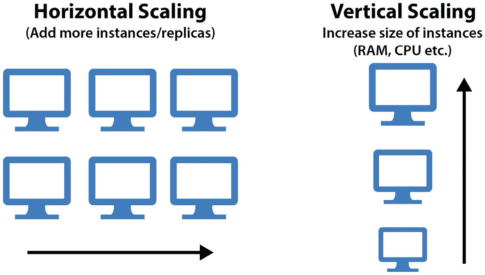
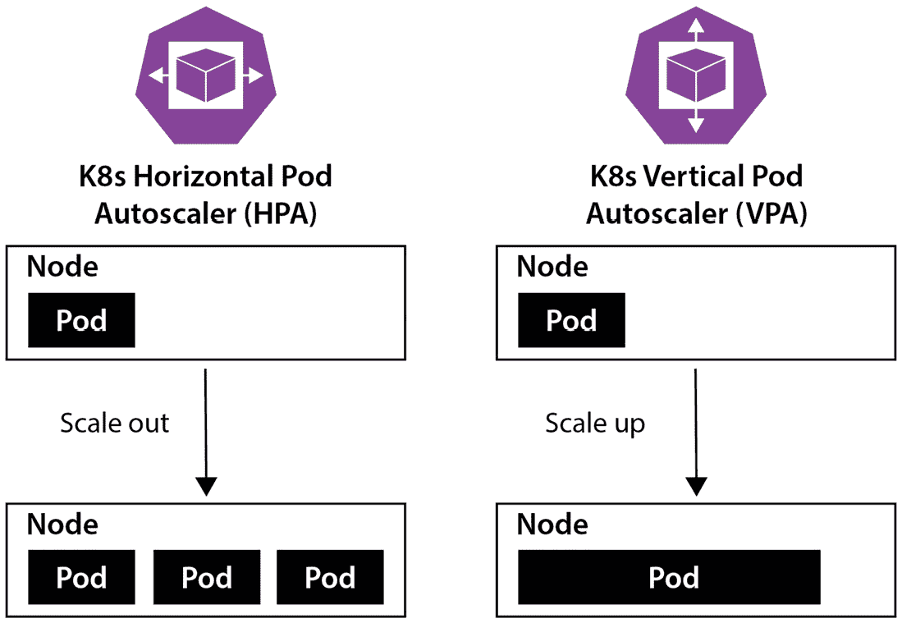
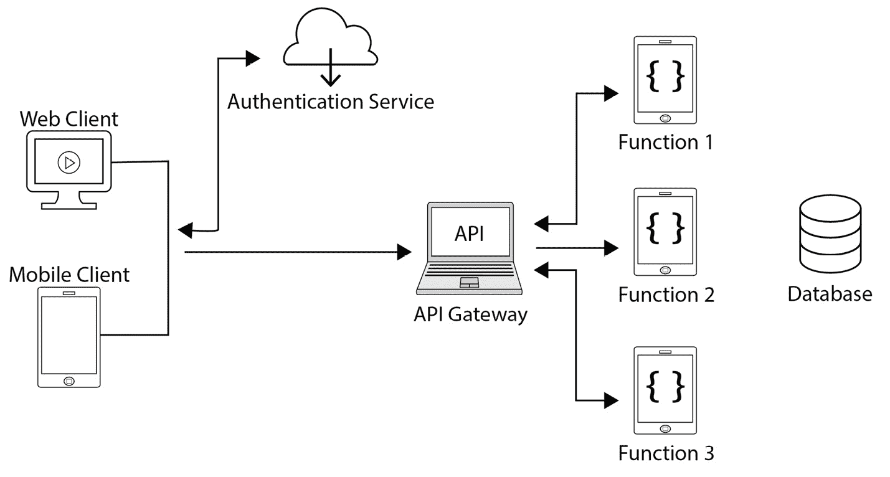

# 9

# 理解云原生架构

本章将继续深入探讨云原生的各个方面。我们将看到哪些概念属于云原生，云原生的架构是什么，讨论**韧性**和**自动扩展**，并了解一些最佳实践。本章涵盖了*云原生架构*领域的进一步要求，这部分内容占**Kubernetes 和云原生认证工程师**（**KCNA**）考试问题的 16%。

本章没有实践部分，因此我们不会进行动手练习，但它仍然非常重要，因为它是通过 KCNA 考试并在该领域进一步发展的基础。我们将关注以下主题：

+   云原生架构

+   韧性与自动扩展

+   无服务器

+   云原生最佳实践

如果你跳过了本书的前两章，发现这里讨论的一些术语不清楚，请返回并阅读*第一章*和*第二章*，以弥补知识空白。

# 云原生架构

在前两章中，我们已经介绍了云原生的定义。让我们再检查一次，以便快速回顾。

云原生

这是一种在现代动态基础设施上构建和运行应用程序的方法，例如云计算。它强调高韧性、可扩展性、高度自动化、易于管理和可观察性的应用程序工作负载。

尽管有“云”这个词，云原生应用程序并不严格要求运行在云中。它是一种可以在本地构建和运行应用程序时也能采用的方法。没错——你也可以在本地构建具有韧性、可扩展性、高度自动化的云原生应用程序，尽管它们并不运行在云中。

重要的是要理解，仅仅选择一个知名的公共云服务提供商，并在其服务基础上构建应用程序（无论是 IaaS、PaaS、SaaS 还是 FaaS），并不意味着你的应用程序自动成为云原生。例如，如果你的应用程序启动时需要人工干预，那么它就无法自动扩展，也无法在发生故障时自动重启，因此它就不是云原生的。

另一个例子：你有一个由若干微服务组成的 Web 应用程序，但它是手动部署和配置的，没有任何自动化，因此无法轻松更新。这不是一种云原生方法。如果你此时忘记了微服务的概念，下面再给你一个定义。

微服务

微服务是作为大型应用或服务的一部分协同工作的较小应用程序。每个微服务可能负责大型应用中的单一功能，并通过网络与其他微服务进行通信。这与单体应用程序相反，后者将所有功能和逻辑打包成一个大的可部署单元（紧耦合）。

实际上，为了实现一个云原生应用程序，你很可能会采用微服务。微服务是松耦合的，这使得它们可以独立扩展、开发和更新。微服务解决了许多问题，但随着数量的增加，也带来了更多的操作开销，这就是为什么许多云原生技术，如 Kubernetes 和 Helm，旨在使微服务的部署、管理和扩展变得更加简单。

再次严格来说，运行由 Kubernetes 管理的微服务并不是实现云原生架构的必要条件。但这种由 Kubernetes 协调的容器化、小型、松耦合的应用程序组合非常有效，并为云原生铺平了道路。相比于使用许多**虚拟机**（**VMs**）和自制的 Shell 脚本，通过 Kubernetes 和容器来实现弹性、自动扩展、可控的滚动更新和可观测性要容易得多。Kubernetes 还具有与基础设施无关的特点，这使得它在许多环境和用例中都具有很大的吸引力。它可以运行在裸金属服务器上、虚拟机中、公共云和私有云中，且可以作为托管服务使用，或者运行在由云资源和本地数据中心组成的混合环境中。

现在，在深入探讨一些方面之前，让我们高层次地看一下云原生带来的好处：

+   **缩短市场时间（TTM）** – 高度的自动化和简便的更新使得新功能能够迅速交付，从而为许多企业提供了竞争优势。

+   **成本效益** – 云原生应用程序根据需求扩展，这意味着只需为实际需要的资源付费，避免了浪费。

+   **更高的可靠性** – 云原生应用程序能够自我修复并自动从故障中恢复。这意味着减少了系统的停机时间，从而改善了用户体验。

+   **可扩展性和灵活性** – 微服务可以单独扩展、开发和更新，这使我们能够处理各种场景，并为开发团队提供更多灵活性。

+   **无供应商锁定** – 通过正确的方法和开源技术的使用，云原生应用程序可以在不同的基础设施或云提供商之间迁移，且几乎不需要任何努力。

这个列表还可以继续，但应该足以让你了解为什么大多数现代应用程序遵循云原生方法和实践。接下来，我们将重点讨论云原生的一些重要方面，比如弹性和自动扩展。

# 弹性和自动扩展

听起来可能有些好笑，但为了设计和构建弹性系统，我们需要预期事物会失败并分崩离析。换句话说，为了打造弹性系统，我们需要为故障设计，并提供让应用程序和基础设施能够自动从故障中恢复的方法。

弹性

这表明应用程序和基础设施能够在故障发生时自动恢复。无需人工干预的恢复能力通常称为*自我修复*。

我们已经在*第六章*中看到过自我修复的实际应用，当时 Kubernetes 检测到*期望状态*和*当前状态*不一致，并迅速启动了额外的应用程序副本。这要归功于 Kubernetes 的*协调循环*。

当然，也有方法在没有 Kubernetes 的情况下构建具有韧性的应用程序和基础设施。例如，**Amazon Web Services** (**AWS**) 公有云提供了 **自动伸缩组**，允许您在一个组内运行所需数量的虚拟机（VM），并根据负载自动增加或减少虚拟机的数量。如果虚拟机发生故障，系统会检测到并通过创建新的虚拟机来做出响应。当组内的 CPU 利用率达到某个预定义的阈值时，可以创建新的虚拟机来分担负载。这引出了另一个重要的概念：自动伸缩。

自动伸缩

这是一种能够自动增加或减少计算资源以满足当前需求的能力。

不用多说，如今不同的云服务提供商提供了多种配置自动伸缩的选项。这些选项可以基于各种指标和条件，其中 CPU 或内存利用率仅仅是常见的例子。

过去，在传统 IT 时代，应用程序和基础设施是根据系统的峰值使用情况来设计的，这导致了硬件的高度低效利用和高昂的运行成本。自动伸缩是一个巨大的改进，它已成为云原生的最重要特性之一。

当我们谈论自动伸缩时，它适用于*应用程序及其运行的基础设施*，因为仅仅伸缩其中一个是远远不够的。让我们通过以下例子来解释——你管理着多个微服务应用程序，这些应用在典型负载下需要 10 个工作节点才能运行。如果创建了额外的工作节点并将其加入到 K8s 集群中，那么在以下情况之一发生之前，这些新节点上将不会有任何 Pod 运行：

+   应用程序的副本数量增加，以便创建新的 Pod。

+   一些现有的 Pod 会退出并由控制器（如 Deployment、StatefulSet 等）重新创建。

这是因为 Kubernetes 不会在新节点加入集群时重新调度已经运行的 Pod。所以，除了增加新节点外，还需要增加微服务副本的数量。*为什么仅仅增加副本数就不够？* 这样做最终会使 CPU/内存利用率达到上限，导致 Kubernetes 节点无法响应，因为负载将会为资源而*争斗*。

一般来说，伸缩可以分为两种类型，如*图 9.1*所示：

图 9.1 – 水平扩展与垂直扩展的比较

让我们更详细地了解一下：

+   **水平扩展**—当我们增加或减少实例（虚拟机或节点）的数量时，就像前面的例子那样。水平扩展也称为**向外扩展**（添加新的虚拟机）和**向内扩展**（终止虚拟机）。

+   **垂直扩展**—当我们保持实例数量不变，但更改其配置（如 vCPU 数量、内存 GB、磁盘大小等）时。垂直扩展也称为**向上扩展**（增加 CPU/RAM 容量）和**向下扩展**（减少 CPU/RAM 容量）。

为了简化记忆，你可以将水平自动扩展记作数字的自动增加（或减少），而将垂直自动扩展记作大小的增加（或减少）。云原生微服务架构通常采用水平自动扩展，而传统的单体应用程序通常采用垂直扩展。垂直自动扩展也更具限制性，因为即使是今天可用的最大虚拟机和裸机服务器，也无法突破某些技术限制。因此，水平扩展是更为推荐的方式。

从前面的章节中，我们已经知道可以通过 Kubernetes 在一个简单的命令中更改部署副本的数量；然而，这不是自动的，而是手动扩展。除此之外，Kubernetes 中有三种机制可以实现自动扩展：

+   **水平 Pod 自动扩展器（HPA）**—当负载上升时，它会更新工作负载资源（如 Deployment、StatefulSet），以添加更多 Pods，而当负载下降时，它会移除 Pods 以匹配需求。HPA 需要配置副本的上下限（例如，最少 3 个副本，最多 10 个副本）。

+   **垂直 Pod 自动扩展器（VPA）**—它会更新工作负载资源的请求和限制（如 CPU、内存、大页面大小）。它可以减少资源请求过多的容器的请求和限制，并根据历史使用情况扩展资源请求和限制，适用于资源请求过少的工作负载。与 HPA 不同，VPA 不会更改副本数量，如在*图 9.2*中所示。VPA 还可以选择性地允许我们定义请求的最小和最大边界。

+   **集群自动扩展器**—它通过增加或移除工作节点来调整 Kubernetes 集群的大小，适用于当因资源不足而导致某些 Pods 无法运行，或者存在长时间未使用的节点且这些节点上的 Pods 可以迁移到集群中的其他节点时。建议限制集群中节点的最大数量，以防止集群过大。集群自动扩展器还需要与您的云服务提供商集成才能正常工作：

图 9.2 – Kubernetes HPA 和 VPA 的比较

这些机制尤其在结合使用时非常强大。如你所记得，我们需要同时扩展应用程序和运行它的基础设施，因此仅使用 HPA 或仅使用 Cluster Autoscaler 是不够的。实际上，所有三种机制可以一起使用，但这是一个复杂的主题，你在没有足够 K8s 经验之前不应该轻易接触。就 KCNA 的范围而言，你只需要了解什么是自动扩展以及 Kubernetes 提供了哪些自动扩展机制。

到头来，自动扩展是云原生的重要组成部分，它有助于在工作负载性能、基础设施规模和成本之间找到平衡。

接下来，我们将进一步了解 Serverless——一种近年来获得广泛应用的计算演进模式。

# Serverless

在第一章中，我们简要介绍了 Serverless 的定义——一种在 2010 年左右出现的较新云交付模型，通常被称为*功能即服务*或*FaaS*。

Serverless

这是一种计算模型，代码以小函数的形式编写，这些函数在不需要管理任何服务器的情况下构建和运行。这些函数由事件触发（例如，用户在网页上点击按钮、上传文件等）。

尽管名字中有“Serverless”，但事实上，Serverless 计算仍然依赖于底层的真实硬件服务器。然而，运行这些函数的服务器**完全抽象**与应用开发分离。在这种模式下，提供商负责运行代码所需的所有操作：配置、扩展、维护、安全补丁等。由于你无需关心服务器，因此这种模式被称为 Serverless。

除了不需要例行的服务器操作外，Serverless 还带来了一些优势。开发团队可以简单地将代码上传到 Serverless 平台，一旦部署，应用程序及其运行的基础设施将根据需求自动扩展。

当 Serverless 函数处于空闲状态时，大多数云提供商不会收费，因为没有事件触发函数执行，因此没有产生费用。如果有 10,000 个事件触发 10,000 次函数执行，那么在大多数情况下，提供商会按*精确执行时间*计费。这与典型的*按需付费*云虚拟机不同，后者不管实际的 CPU/RAM 利用率如何，只要虚拟机在运行，你就需要支付所有运行时间。一个示例 Serverless 架构如*图 9.3*所示：

图 9.3 – Serverless 架构示例

注意

API 网关是 Serverless 的一部分，允许我们为应用程序的 REST API 定义端点，并将这些端点与实现实际逻辑的函数连接起来。API 网关通常处理用户认证和访问控制，并且经常提供额外的可观察性功能。

值得一提的是，许多流行的编程语言（如 Java、Golang、Python 和 Ruby 等）都得到了提供 Serverless 服务的云服务商的支持，但并不是所有供应商都允许使用我们自己的容器镜像。事实上，目前提供 Serverless 服务的大多数公共云服务商都依赖于其自有的技术。因此，如果你为 **AWS Lambda**（AWS 提供的 Serverless 服务）开发了一个 Serverless 应用，那么将其迁移到 **Google Cloud Functions**（Google Cloud 提供的 Serverless 服务）将需要付出相当大的努力。

除了完全托管的云 Serverless 平台，今天还有一些开源替代方案可供选择，这些方案减少了供应商锁定的风险。例如，以下 Serverless 框架可以安装在 Kubernetes 上，并将函数代码打包成容器运行：

+   **OpenFaaS**

+   **CloudEvents**

+   **Knative**

+   **Fn**

Knative 和 CloudEvents 目前是由 **Cloud Native Computing Foundation**（**CNCF**）策划的项目。

总结来说，FaaS 可以看作是云计算模型（IaaS、PaaS 和 SaaS）的进化，适用于 Cloud Native 架构。虽然 Serverless 的市场份额仍在增长，但显然它不会取代常见的虚拟机和托管平台服务，因为我们在这里简要提到的一些限制：

+   为了持久化数据，Serverless 应用必须与其他有状态组件进行交互。因此，除非你完全不需要保持状态，否则你将不得不涉及数据库和其他存储选项。

+   在大多数情况下，对运行时配置的控制非常有限。举例来说，当使用云服务提供商的 FaaS 时，你将无法更改操作系统或 **Java 虚拟机**（**JVM**）的参数。

+   **Cold start**——容器或基础设施初始化以执行函数代码需要一些时间（通常在几十秒的范围内）。如果某个函数长时间未被调用，下次调用时将遭遇冷启动延迟。解决办法是定期调用函数以保持其 *预热*。

+   监控、日志记录和调试 Serverless 应用通常更加困难。虽然你不需要关心服务器以及 CPU 或磁盘利用率等指标，但在运行时调试函数的方式有限。你将无法像在本地 IDE 中那样逐行运行代码。

+   供应商锁定的风险。正如前面提到的，FaaS 服务尚未标准化，因此从一个供应商迁移到另一个供应商需要大量的工作。

这个列表并不详尽，但希望它能让你明白为什么你不应该急于让开发团队完全迁移到 Serverless。无论是云服务提供商还是开源 FaaS 服务，近年来都已经有了很大的改进，因此许多限制可能会在不久的将来得到解决。

再次强调，我们在这里探讨的内容比 KCNA 认证所要求的要深入一些。你不会被问及无服务器架构的局限性，但你需要理解计费模型的概念，并能列举几个允许你在 Kubernetes 上运行自己的 FaaS 项目。

在本章的最后部分，我们将总结一些关于云原生的关键点。

# 云原生最佳实践

随着世界变化的加速，用户的需求越来越高，IT 领域也必须做出相应的变化以满足这些期望。如今，如果一个网页打开需要 30 秒钟，很多人都无法忍受，而且如果网上银行系统停运一个小时，人们会抱怨。

云原生通过引入全新的应用构建和运行方式，显著改善了该领域的情况。云原生应用程序设计时考虑到了故障，并能够从大多数故障中自动恢复。大量的重点放在了让**应用程序和基础设施都具备弹性**上。这可以通过多种方式实现，不论是否使用 Kubernetes。如果使用 Kubernetes，请确保运行多个控制平面和工作节点，并将它们分布在不同的故障域中，例如云服务提供商的**可用区**（**AZs**）。始终使用如 Deployment 等控制器运行应用的至少两个副本（pod），并确保它们分布在集群的拓扑结构中。若 pod 发生故障，K8s 的调和循环将启动，并自动修复应用。

一些公司通过在基础设施中引入随机故障，采取了更进一步的措施来提高弹性，使它们能够检测到需要改进或重设计的薄弱环节。例如，Netflix 就以其**混沌猴子**工具而闻名，这个工具会随机终止虚拟机和容器，促使工程师构建高度弹性的服务。

排在下一个重点的是自动扩展——这对于性能和成本效率都是至关重要的。自动扩展必须为**应用程序和基础设施**同时实现。如果使用 Kubernetes，请确保至少设置 HPA 和集群自动扩展器。并且不要忘记为所有工作负载配置资源请求和限制，因为它有助于 K8s 以最优方式调度 pod。

在应用架构方面，应用*松耦合*原则——开发执行小任务的微服务，并让它们作为更大应用的一部分协同工作。如果场景适合，考虑使用事件驱动的无服务器架构。在许多情况下，无服务器架构可能更具成本效益，且几乎不需要运维。

关于角色方面，我们在*第二章*中已经了解到，组织需要为合适的岗位聘用合适的人才。这不仅仅是聘请 DevOps 和站点可靠性工程师来处理基础设施，还涉及团队协作和企业文化的支持，促进不断变化和实验。通过不断学习，能获得宝贵的见解，并促进架构和系统设计的改进。

此外，我们之前简要提到过，云原生应用应该具备高度的自动化和易于管理的特点。在*第十一章*中，我们将详细探讨自动化如何帮助更快速、更可靠地交付软件。在接下来的*第十章*中，我们将讨论遥测和可观测性。

# 总结

在本章中，我们学习了云原生架构、应用及其特性。并非所有在云中运行的应用都自动变为云原生应用。实际上，云原生原则也可以成功地应用于本地部署，而不仅仅是云中。我们简要讨论了云原生的好处，并深入探讨了两个核心特性——**弹性**和**自动扩展**。虽然云原生应用并不严格要求必须使用 Kubernetes 来运行，但 K8s 凭借其*自愈*能力和多种自动扩展机制，使得实现更加轻松：**HPA**、**VPA**和**集群自动扩展器**。

接下来，我们介绍了 Serverless 或 FaaS——一种更新的、基于事件驱动的计算模型，具备自动扩展功能，几乎不需要任何操作维护。使用 Serverless 时，我们无需负责操作系统、安全补丁或服务器生命周期管理。Serverless 的计费基于实际使用情况，通过实际函数调用次数和执行时间来计算。Serverless 技术可以用来实现云原生应用，但也要注意其局限性。

最后，我们总结了本章以及之前章节中关于云原生的要点，在*第二章*中已有提到。在接下来的章节中，我们将重点讨论如何监控云原生应用，并了解如何实现遥测和可观测性。

# 问题

在我们结束时，这里有一组问题，供你测试自己对本章内容的理解。你可以在*附录*的*评估*部分找到答案：

1.  以下哪个选项有助于提高 Kubernetes 的弹性？

    1.  资源请求

    1.  多容器 Pod

    1.  调和循环

    1.  Ingress 控制器

1.  以下哪种 Kubernetes 自动扩展器允许我们根据负载自动增加或减少 Pod 的数量？

    1.  VPA

    1.  HPA

    1.  RPA

    1.  集群自动扩展器（Cluster Autoscaler）

1.  以下哪种 Kubernetes 自动扩展器基于统计数据调整容器的资源请求和限制？

    1.  VPA

    1.  HPA

    1.  RPA

    1.  集群自动扩展器（Cluster Autoscaler）

1.  为什么下调应用程序和基础设施的扩展很重要？

    1.  为了减少可能的攻击面

    1.  为了避免触及云服务提供商的限制

    1.  为了减少网络流量

    1.  在计算资源空闲时减少成本

1.  什么最能描述水平扩展？

    1.  向同一服务实例添加更多 CPU

    1.  向同一服务添加更多副本/实例

    1.  向同一服务实例添加更多 RAM

    1.  将 Pods 调度到其他已运行 Pod 的不同节点

1.  哪种扩展方法适用于 Cloud Native 应用程序？

    1.  集群扩展

    1.  云扩展

    1.  垂直扩展

    1.  水平扩展

1.  以下哪些项目允许我们在 Kubernetes 上运营自己的无服务器平台（选择多个）？

    1.  KubeVirt

    1.  KEDA

    1.  Knative

    1.  OpenFaaS

1.  什么特征表征了无服务器计算（选择多个）？

    1.  服务器不再需要

    1.  它支持所有编程语言

    1.  它是基于事件的

    1.  提供商负责服务器管理

1.  关于微服务扩展，哪种说法是正确的？

    1.  单独的微服务可以扩展进出

    1.  只有所有微服务可以同时进行扩展和收缩

    1.  微服务不需要扩展——只需要扩展基础设施

    1.  微服务最适合垂直扩展

1.  哪种应用程序设计原则最适合 Cloud Native？

    1.  自愈

    1.  紧耦合

    1.  解耦

    1.  松耦合

1.  什么描述了一个高度弹性的应用程序和基础设施？

    1.  在出现问题时自动关闭的能力

    1.  自动从大多数故障中恢复的能力

    1.  在故障情况下保持状态的能力

    1.  执行滚动更新的能力

1.  什么代表了无服务器应用程序的最小部分？

    1.  网关

    1.  方法

    1.  容器

    1.  函数

1.  以下哪个关于无服务器的说法是正确的？

    1.  仅按实际使用量计费

    1.  它是免费的，因为不涉及服务器

    1.  按固定小时价格计费

    1.  按与 IaaS 服务相同的方式计费

1.  以下哪些是 Cloud Native 应用程序的特征（选择多个）？

    1.  高可扩展性

    1.  高效率

    1.  高弹性

    1.  高可移植性

1.  通常应该扩展什么以适应负载？

    1.  应用程序及其运行的基础设施

    1.  负载均衡器和入口

    1.  应用程序 Pod 的数量

    1.  Kubernetes 工作节点的数量

1.  哪种弹性测试工具可以随机引入基础设施中的故障？

    1.  Chaos Monster

    1.  Chaos Kube

    1.  Chaos Donkey

    1.  Chaos Monkey

# 进一步阅读

要了解本章中涉及的主题，请查看以下资源：

+   自动扩展：[`glossary.cncf.io/auto-scaling/`](https://glossary.cncf.io/auto-scaling/)

+   Kubernetes HPA 演练：[`kubernetes.io/docs/tasks/run-application/horizontal-pod-autoscale-walkthrough/`](https://kubernetes.io/docs/tasks/run-application/horizontal-pod-autoscale-walkthrough/)

+   Kubernetes 集群自动扩展器：[`github.com/kubernetes/autoscaler`](https://github.com/kubernetes/autoscaler)

+   Chaos Monkey: [`github.com/Netflix/chaosmonkey`](https://github.com/Netflix/chaosmonkey)

+   OpenFaaS: [`www.openfaas.com/`](https://www.openfaas.com/)

+   Knative: [`knative.dev/docs/`](https://knative.dev/docs/)
