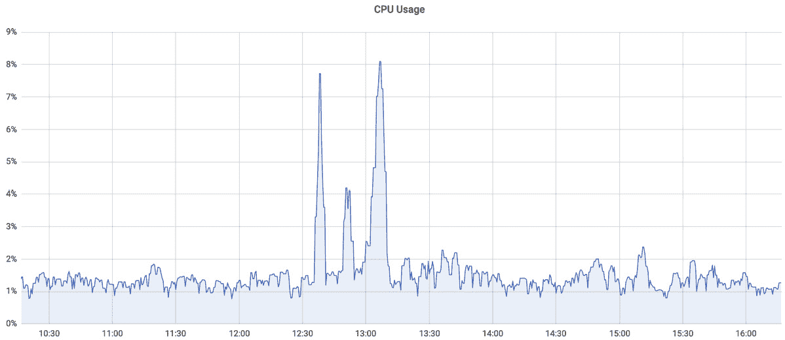
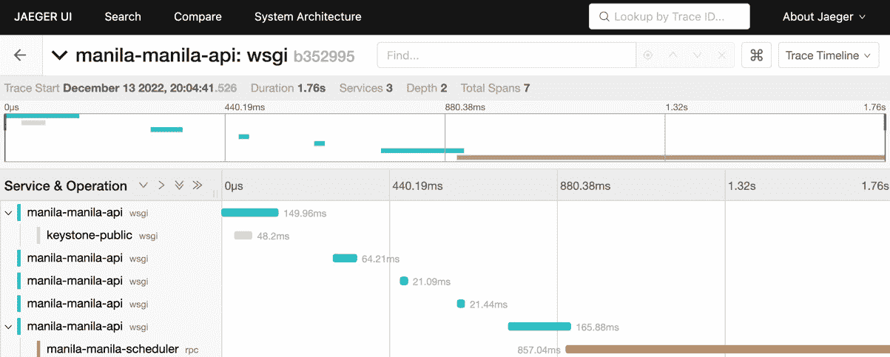
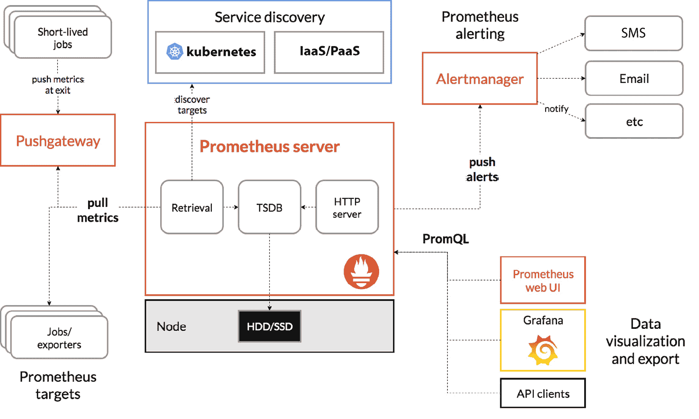

# 10

# 在云中实施遥测与可观察性

正如我们已经知道的，云原生应用程序通常由多个小型服务组成，这些服务通过网络进行通信。云原生应用程序会频繁更新并用新版本替换，在本章中，我们强调基于观察来监控和优化这些应用程序，以便在考虑成本的情况下获得最佳性能。

本章涵盖了 KCNA 考试中*云原生可观察性*领域的进一步要求，占总考试题目的 8%。以下是我们将重点关注的主题：

+   遥测与可观察性

+   Prometheus 用于监控和告警

+   FinOps 和成本管理

让我们开始吧！

# 遥测与可观察性

随着传统单体架构向分布式松耦合微服务架构的演变，对高质量遥测的详细需求迅速变得显而易见。在进一步阐述之前，首先让我们定义一下在 IT 基础设施上下文中什么是**遥测**。

遥测

指监控和收集系统性能数据进行分析，帮助识别问题。遥测是**日志**、**指标**和**追踪**的统称，也称为遥测类型或信号。

由于云原生应用程序本身就是分布式的，因此追踪和跟踪各部分之间的所有通信在故障排除、找出瓶颈以及提供应用程序性能洞察方面发挥着重要作用。

三种遥测信号（**日志**、**指标**和**追踪**）帮助我们更好地理解应用程序和基础设施在任何给定时刻的状态，并在需要时采取纠正措施。

可观察性

是指基于来自被观察系统的遥测信号持续生成洞察的能力。换句话说，一个可观察的系统就是那种通过*正确的数据*在*正确的时间*提供*正确的决策*来清晰了解其状态的系统。

让我们通过一个例子来解释什么是*正确的数据*在*正确的时间*做出*正确的决策*。假设你在 Kubernetes 上操作微服务，其中大多数服务将数据持久化到由**持久化****存储卷**（**PV**）支持的数据库层。

显然，你需要确保所有数据库都在正常运行，并且存储设备上为存储卷提供的磁盘空间足够。如果你仅仅收集并分析服务的*日志*，那将不足以决定何时扩展存储容量。例如，使用数据库的服务可能会突然崩溃，因为它们无法再向数据库写入数据。数据库的日志将指向存储空间已经用尽，并且急需更多的容量。

在这种情况下，日志有助于找到罪魁祸首，但它们并不是在正确的时间提供的正确数据。*正确的数据*应该是从存储设备收集的连续磁盘利用率度量。*正确的时间*应该是预定义的阈值（假设设备已满 70%），这样操作员有足够的时间做出*正确的决策*，比如扩展或释放容量。在凌晨 2 点告知操作员数据库存储已满且服务中断显然不是最佳做法。

这就是为什么仅依赖一个遥测信号几乎永远不够，我们应该同时具备这三者以确保可观测性。可观测性是更快响应事故、提高生产力和优化性能的关键之一。然而，拥有更多的信息并不一定意味着系统更可观察。有时，信息过多可能会产生相反的效果，使得从噪声中辨别出有价值的见解变得更加困难（例如，由应用程序的最大调试级别生成的过多日志记录）。

现在让我们更详细地了解每个遥测信号，从日志开始。

日志

事件是由应用程序、操作系统或设备（例如防火墙、负载均衡器等）记录的文本描述。

日志记录所代表的事件几乎可以是任何事情，从服务重启和用户登录到接收到有效载荷的 API 请求或代码中执行特定方法等。日志通常包括时间戳、文本消息以及进一步的信息，如状态码、严重性级别（`DEBUG`、`INFO`、`WARNING`、`ERROR`、`CRITICAL`）、用户 ID 等。

注意

日志的严重性级别以及如何在 Kubernetes 中访问容器日志的说明已经在*第七章*的*在 Kubernetes 中调试应用程序*一节中详细讨论过。如果您之前因为任何原因跳过了它，请务必回去查看。

下面是 Nginx Web 服务器记录的示例日志消息，该消息在处理来自 IP `66.211.65.62`的客户端的`HTTP v1.1` `GET`请求时生成，时间为 2022 年 10 月 4 日：

```
66.211.65.62 - - [04/Oct/2022:19:12:14 +0600] "GET /?q=%E0%A6%A6%E0%A7%8B%E0%A7%9F%E0%A6%BE HTTP/1.1" 200 4556 "-" "Mozilla/5.0 (compatible; Googlebot/2.1; +http://www.google.com/bot.html)"
```

还可以从消息中提取其他信息，如：

+   响应状态码`200`（`HTTP OK`）

+   发送给客户端的字节数`4556`

+   URL 和查询字符串`/?q=%E0%A6%A6%E0%A7%8B%E0%A7%9F%E0%A6%`

+   以及用户代理`Mozilla/5.0 (compatible; Googlebot/2.1; +http://www.google.com/bot.html)`，这实际上告诉我们请求是由 Google 的网页爬虫发出的。

根据应用程序的不同，日志格式可以进行调整，只包含您想要的信息，并跳过任何不必要的细节。

下一项信号是度量。我们来弄清楚它们是什么。

度量

度量是常规的性能测量，描述了应用程序或系统在一段时间内的表现，以时间序列格式呈现。

常见的例子包括像 CPU 使用率、RAM 利用率、打开的连接数或响应时间等指标。如果你仔细想一想，单独的、不规律的测量并不能提供系统状态的大量价值或洞察力。可能会出现短暂的利用率高峰，持续不到一分钟，或者反过来：利用率在一段时间内下降。

通过单个测量，无法对应用程序或系统的行为进行任何预测或分析。使用时间序列，我们可以分析一个或多个度量标准的变化，确定趋势和模式，并预测即将发生的变化。这就是为什么应该定期收集度量标准，通常在 30 秒到几分钟之间的短时间间隔内。时间序列还可以作为图表进行可视化表示，如下图*10**.1*所示：



图 10.1 – CPU 使用率度量可视化（X = 时间，Y = 利用率）。

虽然根据图表，在 12:30 到 13:15 之间 CPU 使用率似乎有显著增加，但显示期间的最大利用率始终在 10%以下，表明系统严重未利用。应始终收集基本的 CPU、内存或磁盘使用率等基本度量标准，但通常这些是不足以做出*正确决策*的。

因此，建议收集多个应用程序特定的度量标准，包括每分钟的 API 请求次数、队列中等待的消息数量、请求响应时间、打开的连接数等等。这些度量标准中的一些非常适合做出正确的自动扩展决策，另一些则可以提供有关应用程序性能宝贵的见解。

目前关于度量标准就介绍到这里。接下来我们将继续讲述请求追踪。

追踪

是对通过分布式系统组件传递的请求的完整跟踪。它允许查看哪些组件参与处理特定请求、处理时间多长以及沿途发生的任何额外事件。*追踪*是追踪请求的结果。

现在想象一下以下情况。您正在调查您运行的基于分布式微服务的应用程序的较长响应时间，但请求或负载的数量并没有太大变化。由于大多数应用程序请求经过多个服务，您需要验证每个服务，找出表现不佳的服务（一个或多个）。但是，如果集成了像**Jaeger**或**Zipkin**这样的追踪工具，它将允许您追踪请求并存储和分析结果。追踪将显示哪个服务具有较长的响应时间，并可能减慢整个应用程序。然后可以在如下图*10**.2*所示的仪表板上查看收集到的追踪结果：



图 10.2 – Jaeger 仪表板中的示例追踪视图。

总的来说，追踪对可观察性贡献巨大。它有助于理解流量的流向，并能快速检测到瓶颈或问题。与日志和度量值一起，这三种遥测类型是现代应用程序和基础设施监控的必备工具。如果没有它们，运维人员将是*盲目的*，无法确保所有系统正常运行并按预期执行。实现遥测和可观察性的正确方式可能需要一些努力和时间，但它总是值得的，因为最终它会在解决问题时为你节省大量时间。

说到实现，有一个 CNCF 项目叫做 **OpenTelemetry**（简称 **OTel**）。它提供了一套标准化的、与供应商无关的 API、SDK 和工具，用于接收、转换和发送数据到可观察性后端。支持大量开源和商业协议及编程语言（*C++*、*Java*、*Go*、*Python*、*PHP*、*Ruby*、*Rust* 等），使得几乎可以将遥测集成到任何应用程序中。虽然在 KCNA 范围内并非严格要求，但如果你想了解更多，下面的*进一步阅读*部分将提供相关链接。

接下来，在下一部分我们将学习 **Prometheus** —— 云原生可观察性工具中的佼佼者。

# Prometheus 用于监控和告警

在 2012 年首次亮相后，Prometheus 迅速凭借其丰富的功能和 **时间序列数据库** (**TSDB**) 获得了广泛关注，TSDB 使得度量数据可以持久化，便于查询、分析和预测。有趣的是，Prometheus 的灵感来源于 Google 的 **Borgmon** —— 一个用于监控 Google **Borg**（Kubernetes 的前身）工具。

2016 年，Prometheus 被接受为第二个 CNCF 项目（仅次于 K8s），并在 2018 年达到了*毕业*状态。今天，Prometheus 被视为监控和告警的行业标准，广泛用于 Kubernetes 和其他 CNCF 项目中。

够了，历史背景我们先放一边，直接进入正题。首先，什么是 TSDB？

TSDB

是一种优化用于存储带有时间戳数据的数据库。这些数据可以是被跟踪和聚合的测量值或事件。在 Prometheus 的情况下，这些数据是从应用程序和基础设施的各个部分定期收集的度量值。这些度量值保存在 Prometheus TSDB 中，可以使用其强大的*PromQL*查询语言进行查询。

度量数据是如何被收集的？一般来说，有两种收集监控度量数据的方法：

+   `/metrics` URL 是通过一个简单的 HTTP `GET` 请求调用的。这是 Prometheus 的主要工作方式。服务应该使度量数据可用并保持更新，Prometheus 应定期通过 `GET` 请求访问 `/metrics` 来获取数据。

+   `Pushgateway` 是通过 HTTP `PUT` 请求完成的。它对于那些无法通过抓取（pull）获取服务指标的情况非常有用，比如由于网络限制（服务在防火墙或 NAT 网关后面）或当指标源的生命周期非常短暂（例如快速批处理作业）时。

当我们说到*指标数据*时，它不仅仅指指标名称和值，还包括时间戳和通常的附加标签。标签表示指标的某些属性，可以包含抓取该指标的服务器的主机名、应用程序的名称，或者其他几乎任何内容。标签对于使用 Prometheus 的 PromQL 语言进行分组和查询指标数据非常有帮助。让我们看一个示例指标：

```
nginx_ingress_controller_requests{
cluster="production",
container="controller",
controller_class="k8s.io/ingress-nginx",
endpoint="metrics",
exported_namespace="kcna",
exported_service="kcnamicroservice",
host="kcnamicroservice.prd.kcna.com",
ingress="kcnamicroservice",
instance="100.90.111.22:10254",
job="kube-system-ingress-nginx-controller-metrics",
method="GET",
namespace="kube-system",
path="/",
pod="kube-system-ingress-nginx-controller-7bc4747dcf-4d246",
prometheus="kube-monitoring/collector-kubernetes",
status="200"} 273175
```

在这里，`nginx_ingress_controller_requests` 是指标名称，`273175` 是指标的值（表示请求数），`{}` 中的其他内容是标签。正如你所看到的，标签对于缩小指标范围至关重要，能够帮助确认它适用于哪个服务，或者它究竟表示什么。在这个例子中，它显示的是 `kcnamicroservice` 服务在 `kcna` 命名空间下的 HTTP `GET` 请求被 HTTP `200 OK` 响应的计数。

Prometheus 的另一个优秀功能是仪表盘，它允许我们直接在 Prometheus UI 中可视化 TSDB 中的数据。虽然它非常容易绘制图表，但其功能有些有限，这也是为什么许多人使用 **Grafana** 来进行可视化和指标分析的原因。

现在让我们思考一下，如何在无法修改的应用程序中使用 Prometheus 收集指标？我们指的是那些没有在 `/metrics` 端点上公开指标的服务，或者那些并非在你公司内部开发的服务。这同样适用于没有内置 Web 服务器的软件，如数据库、消息总线，甚至基本的操作系统统计数据（CPU、RAM、磁盘利用率）。针对这种情况的解决方案叫做 Prometheus **Exporter**。

Prometheus Exporter

这是一个小工具，它弥合了 Prometheus 服务器与那些原生不导出指标的应用程序之间的差距。Exporter 聚合来自进程或服务的自定义指标，格式为 Prometheus 支持的格式，并通过 `/metrics` 端点暴露供 Prometheus 收集。

本质上，Exporter 是一个简化的 Web 服务器，它知道如何从需要监控的应用程序中捕获指标，并将这些指标转换为 Prometheus 格式以供收集。我们以 PostgreSQL 数据库为例，PostgreSQL 本身并不公开任何指标，但我们可以与它一起运行一个 exporter，该 exporter 会查询数据库并提供可观测数据，这些数据会被拉入 Prometheus 的时序数据库（TSDB）。如果在 Kubernetes 上运行，典型的做法是将 exporter 与被监控的服务放在同一个 Pod 中，作为 *Sidecar* 容器（如果你错过了，*Sidecar* 容器的介绍可以参考 *第五章*）。

今天，你会发现许多现成的导出器可用于流行的软件，如*MySQL*、*Redis*、*Nginx*、*HaProxy*、*Kafka*等。然而，如果没有可用的导出器，使用任何流行的编程语言和 Prometheus 客户端库编写一个也并不难。

说到 Kubernetes 和 Prometheus，它们之间有无缝的集成。Prometheus 具有*开箱即用*的能力来监控 Kubernetes，并自动发现你在 K8s 集群中运行的工作负载的服务端点。除了 Kubernetes，Prometheus 还支持各种 PaaS 和 IaaS 服务，包括来自 Google Cloud、Microsoft Azure、Amazon Web Services 等的服务。

有了这些，我们已经涵盖了使用 Prometheus 进行监控的部分，在进入告警之前，让我们先看一下*图* *10.3*：



图 10.3 – Prometheus 架构。

如你所见，Prometheus 服务器将从其*目标*中拉取指标，这些目标可以是静态配置的，也可以通过服务发现动态发现。短生命周期的作业或位于 NAT 后的服务也可以通过`Pushgateway`推送它们的指标。这些指标可以通过`PromQL`在*Prometheus Web UI*或第三方工具中查询、显示和可视化。

接下来，我们将学习关于 Prometheus **Alertmanager**及其通知功能的内容。

告警

监控系统中的响应元素是由指标变化或某个阈值的突破触发的。

告警用于通知团队或值班工程师应用程序或基础设施状态的变化。通知可以采取电子邮件、短信或聊天消息等形式。例如，Alertmanager，正如你已经猜到的，是 Prometheus 中负责告警和通知的组件。

当某个指标（或多个指标的组合）突破预设阈值并维持在该阈值以上或以下若干分钟时，通常会触发告警。告警定义基于 Prometheus 表达式语言，并接受数学运算，从而允许灵活地定义条件。事实上，Prometheus 的一个独特功能是能够预测某个指标何时会达到某个阈值，并提前触发告警，在实际发生之前提醒你。这样，你可以定义一个告警，在主机磁盘空间不足时提前五天通知你。例如，这得益于 Prometheus 的 TSDB，它保持时间序列数据，并允许分析数据及其变化速率。

总体而言，Prometheus 是云原生时代监控的终极解决方案。它通常用于监控 Kubernetes 本身以及运行在 Kubernetes 上的工作负载。如今，您会发现很多软件原生支持 Prometheus，通过 `/metrics` 端点以 Prometheus 格式暴露度量数据。许多语言提供的客户端库使得将 Prometheus 支持直接集成到您自己的应用程序中成为可能。这个过程有时被称为**直接插桩**，因为它引入了 Prometheus 的原生支持。对于不提供原生支持的应用程序和软件，您可能会找到导出器来提取数据并以 Prometheus 指标格式提供以供收集。

现在，有些人可能迫不及待想要亲自动手操作 Prometheus，但事实上我们已经比 KCNA 考试所需的更详细地介绍了它。尽管如此，仍然鼓励您查看*进一步阅读*部分，并尝试将 Prometheus 部署到我们的 miniKube K8s 集群上。现在，我们将进入成本管理的话题。

# FinOps 和成本管理

随着传统数据中心和共置环境迅速过渡到云计算，云服务的费用也很快显现出可能相当昂贵的特点。事实上，如果您看到公共云提供商的账单，通常会发现*所有东西*都被计量，*所有东西*都有费用：跨可用区流量和互联网流量、对象数量或空间使用、API 请求数量、互联网 IP、不同的虚拟机规格、分级存储和额外的 IOPS、关闭的虚拟机存储，等等。价格有时还会因地区而异，这使得提前估算费用变得困难。这导致了近年来 FinOps 的出现。

FinOps

是一种云财务管理学科和文化实践。它帮助组织通过工程、财务、技术和业务团队的协作，基于数据驱动的支出决策，获得最大的商业价值。

在 DevOps 强调*开发*与*运维*之间的协作时，FinOps 将*财务*也加入到这个组合中。它帮助团队管理他们的云支出，并强调工程和业务团队之间的协作需求，作为持续改进和优化过程的一部分。尽管您不需要了解细节以通过 KCNA 考试，但仍然鼓励您在*进一步阅读*部分了解更多关于 FinOps 的内容。

当我们谈论云计算时，默认假设我们可以随时提供和终止资源，如虚拟机，并且我们只需为虚拟机运行的时间付费。这就是所谓的**按需**容量或按需定价模型，这是当今最流行的云服务消费方式。您使用它——您为此付费，如果什么也不运行——那么就不会收费。

然而，公共云服务提供商通常还提供另外两种选项：

+   **保留实例** – 这些是你为较长时间（通常为一年或更长时间）预定的虚拟机或裸金属服务器，并且需要提前支付费用。保留实例相比于常规的按需定价，通常有非常好的折扣（30-70%），但你将失去一定的灵活性。这意味着即使你不再需要这些资源，你仍然需要为保留的资源付费。

+   **抢占式实例**（有时也叫做**可抢占实例**） – 这些实例可以在任何时候被云服务提供商终止（删除）。抢占式实例是云服务提供商提供的剩余和备用容量，通常会有大幅折扣（60-90%）相较于按需容量。在某些情况下，你需要竞标（类似拍卖）抢占式实例，只要你的出价高于其他竞标者，你的实例就会继续运行。

那么，你应该使用哪种实例类型呢？

对这个问题没有简单的答案，因为有许多变量会影响最终的决策，而且每种情况的答案都不同。一个基本的原则是，只为持续的工作负载或始终需要的最小容量购买保留实例，这样可以运行你的应用程序。对于非关键性的工作负载、批处理和各种非实时分析，可以使用**抢占式实例**。那些可以重新启动并稍后完成的工作负载非常适合使用抢占式实例。而按需实例则可以用于其他所有情况，包括临时扩展以应对更高的负载。正如你从前一章节中记得的，*自动扩展*是云原生架构的主要特点之一，通常情况下，你会在这里使用按需实例。

然而，云中的有效成本管理不仅仅依赖于正确的容量类型（按需/保留/抢占式）。实例的大小（规格）也必须正确。这就是所谓的**合理调整大小**。

合理调整大小

是一种持续的过程，旨在将实例大小与工作负载的性能和容量需求相匹配，同时考虑成本因素。

我们已经知道，自动扩展对于成本效益至关重要，自动扩展也可以视为合理调整大小策略的一部分。你不希望在负载较低时运行太多低效能的实例，而在负载较高时又缺乏足够的实例来处理负载。自动扩展应该瞄准容量/性能与相关基础设施成本之间的最佳平衡点。但除了实例的数量，实例的大小（如 CPU 数量、内存 GB 数、网络吞吐量等）也是非常重要的。

例如，运行 40 个 Kubernetes 工作节点作为虚拟机，每个只有 4 个 CPU 和 8 GB 的内存，可能比运行 20 个工作节点，每个有 8 个 CPU 和 16 GB 内存的成本还要高，尽管它们的总 CPU 和内存数相同。此外，许多提供商提供基于不同 CPU 代次和优化特定工作负载的实例。有些实例可能针对高网络吞吐量进行了优化，而有些则针对低延迟磁盘操作进行了优化，因此可能更适合您的应用程序。所有这些都应作为正确资源规划和云端成本管理策略的一部分加以考虑。

# 摘要

在本章中，我们学习了很多关于遥测和可观察性（Observability）的内容。三种遥测类型或信号分别是 *日志*、*指标* 和 *追踪*，它们从不同的角度提供了对系统的宝贵洞察。一个可观察的系统是一个不断被监控的系统，我们通过遥测数据来了解系统的状态，这些数据充当了证据。

我们还了解了一些项目，如 *OpenTelemetry*，它可以帮助进行仪表化并简化实施遥测所需的工作。我们对如 *Zipkin* 和 *Jaeger* 等项目进行了简要介绍，这些项目用于追踪，并且仔细看了 Prometheus——一个功能齐全的监控平台。

Prometheus 支持 *Push* 和 *Pull* 两种操作模型用于指标收集，但主要使用 *Pull* 模型定期抓取 (`/metrics` 端点) 的指标数据，并以时间序列格式保存到 TSDB 中。将指标存储在 TSDB 中可以让我们使用 *Grafana* 等软件可视化数据，并定义告警，当某个指标超出预设的阈值时，通过首选通道通知我们。

另一个关于 Prometheus 的优点是 Kubernetes 集成。Prometheus 支持自动发现运行在 Kubernetes 中的目标，这使得运维人员的工作更加轻松。对于那些没有原生提供 Prometheus 格式指标的软件，可以运行 Exporters——这些小工具能够汇总来自服务或应用程序的指标，并通过 `/metrics` 端点以 Prometheus 格式暴露出来以供收集。如果你控制着所运行应用程序的源代码，也可以通过多种编程语言中提供的客户端库来为 Prometheus 提供支持。这被称为 *直接仪表化*。

最后，我们还需要了解 FinOps 和云中的成本管理。最常见的是所谓的*按需*容量，它们在云中被消费。这意味着资源可以在需要时配置，在不再需要时删除，并且只按它们运行的时间计费。这与*预留*容量不同，后者是为较长时间支付的实例，预付后可以获得较大的折扣，但如果未使用，仍然需要付费。而*Spot*或*Preemptible*实例是云服务商可能随时终止的备用容量。它们是三者中最便宜的选择，但对于需要最大正常运行时间的关键工作负载可能不是最佳选择。

最后但同样重要的是，我们已经涵盖了*合理配置（Rightsizing）*。这是一个根据性能需求和成本之间的平衡，找到适合当前工作负载的最佳实例大小和实例数量的过程。

下一章节将介绍云原生应用程序的自动化和交付。我们将学习最佳实践，并看到如何更快速、更可靠地交付更好的软件。

# 问题

正确答案可以在 __TBD__ 找到

1.  以下哪些是有效的遥测信号（可以选择多个）？

    1.  跟踪

    1.  Ping

    1.  日志

    1.  指标

1.  以下哪种是 Prometheus 进行指标收集的主要操作模式？

    1.  推送

    1.  拉取

    1.  提交

    1.  合并

1.  以下哪个选项允许在缺少原生应用程序支持时通过 Prometheus 收集指标？

    1.  在 Kubernetes 中运行应用程序

    1.  安装 Pushgateway

    1.  安装 Alertmanager

    1.  安装应用程序导出器

1.  以下哪个信号是 Prometheus 收集的？

    1.  日志

    1.  指标

    1.  跟踪

    1.  审计

1.  哪个组件可以用来让应用程序将指标推送到 Prometheus？

    1.  Zipkin

    1.  Grafana

    1.  Alertmanager

    1.  Pushgateway

1.  哪种遥测信号最适合查看请求如何穿越基于微服务的应用程序？

    1.  日志

    1.  跟踪

    1.  指标

    1.  Ping

1.  哪个软件可以用来可视化存储在 Prometheus TSDB 中的指标？

    1.  Zipkin

    1.  Kibana

    1.  Grafana

    1.  Jaeger

1.  以下哪些软件可以用于分布式应用程序的端到端跟踪（可以选择多个）？

    1.  Prometheus

    1.  Grafana

    1.  Jaeger

    1.  Zipkin

1.  什么使得查询过去的 Prometheus 指标成为可能？

    1.  Alertmanager

    1.  TSDB

    1.  PVC

    1.  Graphite

1.  Prometheus 默认从哪个端点收集指标？

    1.  `/``collect`

    1.  `/``prometheus`

    1.  `/``metric`

    1.  `/``metrics`

1.  Prometheus 指标的格式是什么？

    1.  时间序列

    1.  跟踪

    1.  Span

    1.  图表

1.  以下哪个选项允许应用程序直接进行仪表化以提供 Prometheus 格式的指标？

    1.  K8s 服务发现

    1.  Pushgateway

    1.  导出器

    1.  客户端库

1.  一个定期任务只需要 30 秒就能完成，但 Prometheus 的抓取间隔是 60 秒。收集该任务的指标的最佳方式是什么？

    1.  将指标推送到 Pushgateway

    1.  将抓取间隔缩短到 30 秒

    1.  将抓取间隔缩短到 29 秒

    1.  使用 Kubernetes CronJob 替代 job

1.  以下哪个是合理配置（Rightsizing）的关键部分？

    1.  FinOps

    1.  预留实例

    1.  自动伸缩

    1.  自动化

1.  在实施自动扩展时，以下哪些因素应该被考虑？

    1.  CPU 利用率指标

    1.  RAM 利用率指标

    1.  CPU + RAM 利用率指标

    1.  CPU、RAM 和应用程序特定指标

1.  以下哪些实例类型由多个公有云提供商提供（请选择多个）？

    1.  按需

    1.  无服务器

    1.  Spot

    1.  预留

1.  以下哪种实例类型适合用于负载稳定没有波动的持续工作负载，并且应运行几年不间断？

    1.  按需

    1.  无服务器

    1.  Spot

    1.  预留

1.  以下哪种实例类型适合用于批量处理和周期性任务，并且如果最低价格是主要优先考虑因素，可以中断任务？

    1.  按需

    1.  无服务器

    1.  Spot

    1.  预留

# 进一步阅读

+   OpenTelemetry: [`opentelemetry.io/docs/`](https://opentelemetry.io/docs/)

+   Jaeger: [`www.jaegertracing.io/`](https://www.jaegertracing.io/)

+   Grafana: [`grafana.com/grafana/`](https://grafana.com/grafana/)

+   Prometheus 查询语言: [`prometheus.io/docs/prometheus/latest/querying/basics/`](https://prometheus.io/docs/prometheus/latest/querying/basics/)

+   Prometheus 导出器: [`prometheus.io/docs/instrumenting/exporters/`](https://prometheus.io/docs/instrumenting/exporters/)

+   Kubernetes 用于 Prometheus 的指标: [`kubernetes.io/docs/concepts/cluster-administration/system-metrics/`](https://kubernetes.io/docs/concepts/cluster-administration/system-metrics/)

+   FinOps 简介: [`www.finops.org/`](https://www.finops.org/)
