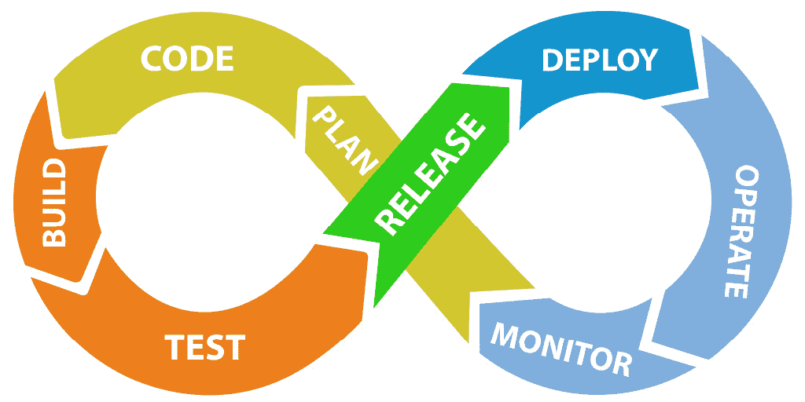
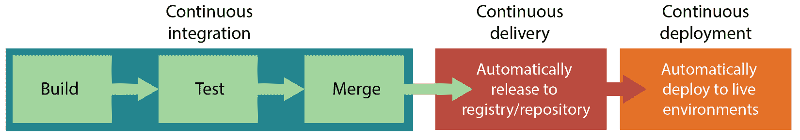
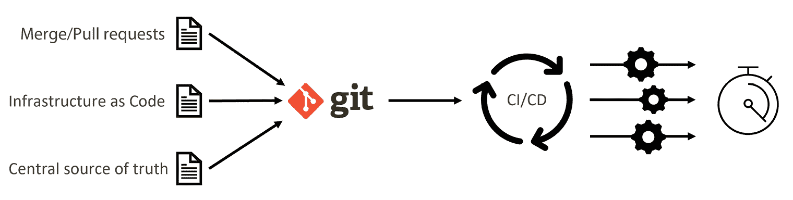
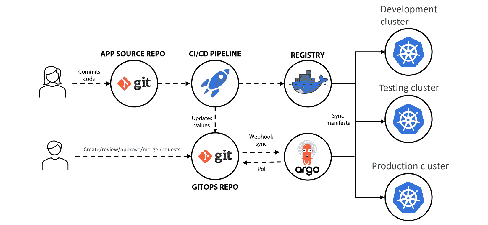

# 第十一章：自动化云原生应用交付

本章我们将重点介绍云原生应用生命周期。我们将了解云原生应用的开发和交付最佳实践，并看看自动化如何帮助*更好地开发*和*更快地交付*。

本章涵盖了 KCNA 考试中有关*云原生应用交付*领域的所有知识，该领域占总考试题目的 8%。我们将要讨论的主题如下：

+   云原生应用交付

+   CI/CD 和 GitOps

+   基础设施即代码（IaC）

这是本书的最后一章技术内容。你几乎准备好参加考试并成为 Kubernetes 和 Cloud Native 助理了。继续加油！

# 云原生应用交付

现代应用通常以较高的速度开发，这需要高效且强大的交付流程。这就是为什么云原生应用交付是一个相当复杂但高度自动化的过程，包含多个阶段。

首先，开发人员编写代码并将其提交到**版本控制系统（VCS）**，如**Git**、**Mercurial** 或 **Subversion**，目前 Git 是事实上的标准。然后代码被*构建*、*测试*和*发布*。自动化这些阶段可以加速整个软件交付过程，并使得发布小而频繁且经过充分测试的软件版本成为可能。

发布

软件的一个版本，包括要交付给用户的变更（新功能、增强、修复等）。每个发布都有**语义版本控制**，其中 v1.0.0 通常代表*第一个稳定*版本（更多关于语义版本控制的信息，请参见*进一步阅读*部分）。

*发布*（作为动词）也常用于描述将软件部署到生产环境的过程，例如将新软件版本提供给最终用户。

严格来说，交付的应用不一定非得是云原生应用。然而，由于云原生架构通常基于微服务，手动执行所有*构建-测试-发布*阶段几乎是不可能的。想象一下，如果你必须为 30 个不同的微服务做这些工作 30 次——这将是慢的、容易出错且繁琐的工作。这就是为什么自动化成为现代应用生命周期中不可或缺的一部分，并为我们带来了许多好处，包括以下几点：

+   更快的交付时间和更频繁的更新

+   通过自动化流程获得更稳定的发布

+   减少人工工作提高生产力

+   通过自动化测试减少缺陷

+   可重复的结果

显然，除了*构建-测试-发布*，每个服务还应部署、操作和监控，正如下面*图 11.1*所示：



图 11.1 – 现代应用生命周期。

这个循环是无限的，阶段的自动化使得即使一天发布多次变更和更新也变得可能。事实上，这还节省了大量开发者的时间，使他们能够专注于开发新功能和修复 bug。如果出现任何问题，应该能够轻松快速地回滚更改（之前在*第八章*中讨论了如何使用 Kubernetes 和 Helm 来实现这一点）。

现在我们了解了 Cloud Native 应用交付的基本知识，让我们深入探讨 CI/CD 和 GitOps。

# CI/CD 和 GitOps

你可能听说过，**CI**代表**持续集成**，**CD**代表**持续交付**，有时也代表**持续部署**。

持续集成

是一种面向开发者的实践和过程自动化。通过 CI，代码更改会定期被*构建*、*测试*并*集成*到共享仓库中（分支/主干等）。

CI 被视为解决开发中同时进行的过多更改可能相互冲突并且难以*合并*的问题。最终目标是确保软件始终处于可工作状态，如果自动化测试失败，团队必须先解决问题，然后才能继续开发。

持续交付

通常指的是 Pipeline 中的自动化，在这里经过测试的代码更改标志着一个*发布*，该发布被上传到软件包仓库或容器镜像。从那里起，镜像或软件包可以在批准后*部署*。

持续交付可以看作是一种对齐开发和业务团队的方式，其目的是确保部署新代码所需的时间和精力最小化。在持续交付中，通常需要人工批准才能将发布版本部署到生产环境。

持续部署

是将更改从源代码仓库自动部署到开发、测试或生产环境的进一步自动化。它本质上是持续交付，只不过当所有测试和检查通过后，部署会自动发生。

示意图如下所示，见*图 11.2*：



图 11.2 – CI/CD/CD 管道

毋庸置疑，任何组织中实现 CI 或 CD 自动化的方式有很多种，没有*单一的正确方式*。我们可以使用不同的工具，引入自定义检查或部署计划，涉及不同的利益相关者进行审批等。然而，有一件事总是存在的，那就是**Pipeline**。

CI/CD Pipeline

是实现自动化流程的顶级组件。Pipeline 通常由多个任务和阶段组成，其中一个任务或阶段的输出可以作为下一个任务/阶段的输入。Pipeline 可能会调用多个工具来编译代码、运行单元测试、执行代码分析、创建二进制文件、将代码打包成容器等。

我们在谈论 CI/CD 时为什么常提到流水线，是因为软件交付中的许多过程都有顺序执行的步骤。你可以把它看作一个管道，源代码从一端进入，构建和测试后的包从另一端出来，或者包可能被部署到另一端。这个过程会像*图 11.1*中展示的那样一遍遍重复。

说到包和变更集，通常认为最好的做法是频繁发布和部署小的更改，而不是偶尔做大的更改，特别是在实施*持续部署*时。当变更集较小时，出现问题的风险要低得多，因此建议定期发布和部署经过测试的小更改，而不是一次性部署许多更改作为*爆炸式更新*。

现在我们已经介绍了这个概念，接下来提到一些可以帮助我们实现 CI/CD 自动化的工具。今天有许多工具可用，尽管功能集各不相同，但它们都可以用来构建和运行 CI/CD 流水线。某些工具可能更适合你的技术栈，提供更好的 VCS 支持，某些提供 Kubernetes 和各种 IaaS/PaaS 集成，某些则仅作为*服务*提供。作为服务提供的 CI/CD 系统意味着供应商将负责其维护、更新、扩展等，按月收费。在为团队选择一个工具之前，确保进行一些研究。

这里列出了一些你可能想了解的流行 CI/CD 系统：

+   **ArgoCD**

+   **Jenkins**

+   **Gitlab CI**

+   **Tekton**

+   **GitHub Actions**

+   **Spinnaker**

+   **FluxCD**

+   **GoCD**

+   **CircleCI**

+   **TravisCI**

注意

名字中带有*CI*或*CD*并不意味着你只能用该工具来实现*CI*或*CD*。一些工具可以同时用于实现*CI*和*CD*，而一些则不行。

## GitOps

之前，我们学习了*DevOps*、*DevSecOps*、*FinOps*，现在还有一个*Ops*要介绍——**GitOps**。它于 2017 年推出，是对现代基础设施和 Cloud Native 应用交付的行业最佳实践和 CI/CD 的进一步演进。

GitOps

是一个结合了 DevOps 实践的操作框架，如 Git 版本控制、协作、合规性、声明性配置和 CI/CD。



图 11.3 – GitOps 概述。

GitOps 基于三个核心元素：

**合并请求（MR）+基础设施即代码（IaC）+** **CI/CD**

1.  `master`）分支和提交消息及评论作为审计日志。

1.  **IaC**是下一个章节的主题，但简单来说，它是一种将期望的基础设施配置和设置描述为代码，并存储在 Git 仓库中的实践。IaC 是*声明性配置*的一个例子，作为你基础设施的*真实来源*。

1.  **CI/CD**是 GitOps 的一个关键组成部分，它的目的是不仅自动化前一节中描述的交付阶段，还能避免手动更改并消除**基础设施漂移**。GitOps 不容忍手动更改。

基础设施（配置）漂移

这就是基础设施的实时状态与*IaC*配置中定义的内容不匹配的情况。漂移可能是由手动操作、应用程序进行意外更改、软件漏洞等原因引起的。

漂移可能导致不确定性、应用程序故障，甚至引入安全漏洞。这就是为什么消除基础设施漂移非常重要，如果实现得当，GitOps 能够很好地完成这项工作。如果有人做了手动更改，那么在下一个 MR 被接受并合并到*事实来源*Git 仓库时，这些手动更改将被覆盖，漂移将被消除。

此外，一些高级 GitOps 工具，如*ArgoCD*、*FluxCD*和*Jenkins X*，具备持续监控 Git 仓库中的变化并将其传播到连接的实时环境中的能力。系统会自动重新同步，并将环境恢复到期望状态——任何在实时环境中的手动更改都会在几秒钟内被覆盖。从 Git 合并的代码中的新变化会自动快速部署。

需要记住的一点是，*ArgoCD*、*FluxCD*和*Jenkins X*需要在 Kubernetes 集群上运行。这并不意味着没有 Kubernetes 就无法实现 GitOps，但由于 Kubernetes 拥有开发完善的生态系统及其终极的*协调循环*功能，它能将集群资源带回到期望状态，使用 Kubernetes 实现 GitOps 要容易得多（如果你忘了的话，参考*第五章*）。

让我们通过以下示例来看 GitOps 和 K8s 是如何互相补充的。假设你的团队在 Kubernetes 上运行微服务，规格定义存储在 Git 仓库中，Git 仓库作为事实来源。你使用 ArgoCD 来进行 GitOps，将 K8s 清单部署到目标 Kubernetes 集群。最近，你团队里有一位新同事，他的任务是停用一个不再需要的微服务。

不幸的是，这位新同事并没有完全了解流程，开始使用 `kubectl` 手动删除 Kubernetes 资源，这种做法是 GitOps 的反模式。由于错误，他/她删除了错误的 K8 部署，该部署属于生产环境中的另一个微服务。Kubernetes 控制循环开始工作，终止了由该部署管理的 Pods，导致错误的微服务停机。幸运的是，ArgoCD 开启了自动同步，并检测到两个受影响的微服务的状态已经偏离了位于 Git 仓库中的定义。ArgoCD 启动并迅速创建了缺失的部署以及其他手动删除的资源。服务很快恢复上线。一位同事提出了一个 MR，正确地修改了 Git 中所需的状态，并且得到了队友的批准并合并。如果错误的更改被合并到 Git 中，恢复它们也同样简单，只需回滚相应的提交即可。

*图 11.4* 演示了一个 GitOps 流程的示例：



图 11.4 – 使用 ArgoCD 和 Kubernetes 的 CI/CD 和 GitOps 示例。

如果你决定在你的团队或组织中实施类似的流程，请考虑到 ArgoCD 适用于 GitOps 和 CD，但要实现 CI，你还需要一个额外的工具。比如说，Argo Workflows、Gitlab CI 或类似的工具。

总结一下，GitOps 是一个非常强大的框架，主要关注 CD 和 CI。它允许以非常快的速度交付软件，最大化稳定性，提高生产力，并且通过自动化手动操作为团队释放更多的生产时间。所有配置都是透明的、可审计的，并且可以复审。为了获得最佳结果和最大效率，你还需要实施 CI 来自动化应用程序的测试和构建。

最后，让我们更详细地讨论一下 IaC。

# 基础设施即代码（IaC）

IaC 是通过定义文件以声明性方式管理和配置基础设施的实践。你在定义文件中描述所需的状态，并让工具将配置应用到你的环境中。

不用担心，尽管出现了*Code*这个词，但这并不意味着你需要学习**C++**、**Java**或其他高级编程语言。大多数基础设施即代码（IaC）工具允许使用*YAML*或类似的可读性高的标记语言来定义配置。

IaC 自动化并替代了基础设施配置和供应的手动操作。从本质上讲，所有可以通过云提供商的 UI 或 CLI 手动完成的操作，都可以通过 IaC 工具来实现。你无需每次都通过控制面板点击来配置和供应虚拟机，而是可以在 IaC 中描述你所需的虚拟机数量和类型，并将该配置保存在 Git 或其他版本控制中。通过调用带有所需配置的 IaC 工具，它将与云提供商的 API 建立通信，并创建所描述的资源。如果资源之前已经存在并且配置正确，IaC 工具则不会进行进一步的更改。IaC 可以供应的资源包括虚拟机、负载均衡器、网络附加存储、防火墙规则、对象存储桶等更多资源。

今天，**Terraform** 是市场上最受欢迎的 IaC 工具之一。它支持主要的公有云和私有云提供商以及他们大多数的 IaaS/PaaS/SaaS/FaaS 服务。

Terraform 接受 JSON 格式以及它自己的 `.tf` 定义文件格式，下面是一个小示例，帮助你了解它的格式：

```
terraform {
  required_providers {
    aws = {
      source  = "hashicorp/aws"
      version = "~> 4.16"
    }
  }
  required_version = ">= 1.2.0"
}
provider "aws" {
  region  = "eu-central-1"
}
resource "aws_instance" "kcna_demo_vm" {
  ami           = "ami-051835d754b74795c"
  instance_type = „t3.medium"
  tags = {
    Name = "KCNAExampleInstance"
  }
}
```

如果应用该定义文件，它将在 AWS 公共云的 `eu-central-1` 区域中供应一个 `t3.medium` 类型的虚拟机，并标记为 `KCNAExampleInstance`。该虚拟机也可以在其他定义文件中再次引用，例如，如果你想附加一个存储块设备到该虚拟机上。

对于 KCNA 的范围，你不需要记住 `.tf` 格式的具体细节，但你需要记住 IaC 的优势，这些已经在前面一节中提到过，因为 IaC 是 GitOps 的关键部分：

+   更快的设置和可复现的结果。

+   可读且可审查的配置，可以存储在 VCS 中。

+   通过定义期望状态来消除基础设施漂移。

值得一提的是，一些云提供商有自己的、特定于厂商的 IaC 工具，这些工具可能会为其云服务提供更好的支持，但显然不会与其他云提供商兼容。**CloudFormation**——由 AWS 专为 AWS 开发的 IaC 就是一个这样的例子。

如果你还记得我们在 *第五章* 和 *第六章* 中做的练习，我们基本上是用 IaC 配置了 Kubernetes。Kubernetes 使用声明式资源定义来描述工作负载，但也可以用于供应负载均衡器（使用 `LoadBalancer` 服务类型）和持久存储（作为 *PV* 和 *PVC*）。当你在公共云环境中运行它并应用规范时，Kubernetes 云控制器管理器将与提供商 API 进行交互，确保资源被供应并处于期望的状态。

# 总结

在本章中，我们学习了云原生应用程序的交付。现代应用程序需要 CI/CD 来自动化所有软件交付阶段。

在 CI 集中于*构建-测试-发布*阶段时，*持续交付*则专注于将软件打包成容器镜像或可安装的软件包，并分别上传到容器注册表或软件包仓库中。

另一个 CD——*持续部署*专注于将经过测试和打包的*发布*自动部署到各个实时环境中。

接下来，我们已经看到*GitOps*如何在*CI/CD*的基础上发展，添加了可审查的合并（或拉取）请求，并与 IaC 结合使用。这导致了一个最终的、高度自动化且强大的流程，尤其在 Kubernetes 环境中表现出色。帮助实现 GitOps 的一些流行工具包括*ArgoCD*、*FluxCD*和*Jenkins X*。

IaC（基础设施即代码）是通过定义文件以声明式方式管理和配置基础设施的实践。使用 IaC 可以消除*基础设施漂移*，并使基础设施配置可审查且可重现。*Terraform* 是当前最受欢迎的 IaC 工具之一。

采用 IaC 和 GitOps 意味着不允许手动更改、不允许手动部署或实时重新配置。整个团队应当了解并遵循该流程。Git 仓库充当真实来源，CI/CD 系统确保达到并维持这一预期状态。

至此，我们已经完成了最后一个技术章节！祝贺你，做得好！在接下来的两章中，你将找到一份模拟考试，以评估你的准备情况，以及如何通过考试的提示和考试后的步骤。

# 问题

正确答案可以在 __ 待定 __ 处找到

1.  CI 代表什么？

    1.  持续交互

    1.  持续改进

    1.  持续集成

    1.  持续检查

1.  以下哪些阶段是 CI 自动化的重点（可多选）？

    1.  发布

    1.  构建，测试

    1.  部署

    1.  打包

1.  以下哪些定义是正确的 CD 定义（可多选）？

    1.  持续调试

    1.  持续交付

    1.  持续销毁

    1.  持续部署

1.  以下哪些被视为 CI/CD 实践？

    1.  整个团队一起进行频繁的大规模发布

    1.  频繁的小规模且完全自动化的发布

    1.  频繁的小规模、经过充分测试且自动化的发布

    1.  不频繁的大规模自动化发布

1.  以下哪些工具适用于 GitOps（可多选）？

    1.  Jenkins X

    1.  FluxCD

    1.  TravisCI

    1.  ArgoCD

1.  以下哪些元素是 GitOps 的一部分（可多选）？

    1.  Kubernetes

    1.  CI/CD

    1.  IaC

    1.  合并（或拉取）请求

1.  GitOps 使用的是哪个 VCS？

    1.  Bitbucket

    1.  Subversion

    1.  Git

    1.  Mercurial

1.  什么是基础设施漂移？

    1.  当基础设施完全自动化并可以自动驾驶时

    1.  当由于自动扩展事件导致云中 VM 的数量增加时

    1.  当 VM 的性能在一天中的不同时间根据需求变化时

    1.  当实际的基础设施状态与 IaC 定义的预期状态不符时

1.  团队中已建立的 GitOps 流程不应该做什么？

    1.  监控系统状态

    1.  开放（拉取）合并请求

    1.  实时环境中的手动更改

    1.  因为测试已经自动化，所以需要审查队友的代码

1.  通常在 IaC 中定义的内容是什么（请选择多个）？

    1.  系统架构

    1.  虚拟机和负载均衡器

    1.  数据库迁移

    1.  防火墙规则

1.  GitOps 的好处是什么（请选择多个）？

    1.  更快、更稳定的软件交付

    1.  不再需要监控实时环境

    1.  由于高度自动化，团队拥有更多自由时间

    1.  所有 Kubernetes 操作都由 CI/CD 处理

1.  CI 的好处是什么（请选择多个）？

    1.  自动部署已测试的代码

    1.  自动打包已测试的代码

    1.  没有开发人员的时间花费在运行构建或测试上

    1.  使用自动化测试进行问题检测

1.  *Release* 的正确定义是什么？

    1.  要交付给用户的软件版本

    1.  K8s 集群中应用程序的当前状态

    1.  停止进一步开发的决定

    1.  完整的 CI/CD 流水线运行

1.  以下哪项是 CI/CD 工具？

    1.  CloudFormation

    1.  Terraform

    1.  GitlabCI

    1.  Subversion

1.  在 GitOps 中，什么通常触发部署？

    1.  推送到任何 Git 分支

    1.  基础设施漂移事件

    1.  已批准并合并的 MR（PR）

    1.  Git 中的手动 rebase

1.  以下哪些关于 GitOps 的说法是正确的（请选择多个）？

    1.  覆盖手动更改

    1.  这仅在 Kubernetes 中可行

    1.  使用声明式配置

    1.  只能与一些流行的编程语言一起使用

1.  以下哪个阶段不是 CI/CD 的一部分（请选择多个）？

    1.  监控

    1.  构建

    1.  计划

    1.  代码

# 进一步阅读

+   语义化版本控制: [`semver.org/`](https://semver.org/)

+   什么是 GitOps: [`www.weave.works/blog/what-is-gitops-really`](https://www.weave.works/blog/what-is-gitops-really)

+   ArgoCD: [`argo-cd.readthedocs.io/`](https://argo-cd.readthedocs.io/)

+   ArgoCD 示例: [`github.com/argoproj/argocd-example-apps`](https://github.com/argoproj/argocd-example-apps)

+   FluxCD: [`fluxcd.io/`](https://fluxcd.io/)

+   GitLab 用于 CI/CD: [`docs.gitlab.com/ee/ci/`](https://docs.gitlab.com/ee/ci/)

+   Terraform: [`www.terraform.io/`](https://www.terraform.io/)

# 第五部分：KCNA 考试和后续步骤

在这一结束部分，您将找到考试准备和通过的技巧，以及两个模拟考试来验证您的知识。最后，我们将讨论获得认证后，如何启动或推进您的云原生职业生涯。

这一部分包含以下章节：

+   *第十二章*, *通过模拟试卷为 KCNA 考试做准备*

+   *第十三章*, *前进的道路*
