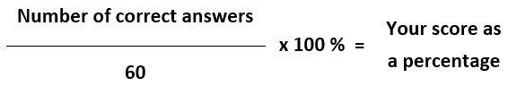

# 12

# 通过模拟试卷进行 KCNA 考试的练习

在本章中，您将找到一些关于如何做好最后准备并应对**Kubernetes 和云原生关联**（**KCNA**）考试的技巧。接着是两个模拟考试，让您可以测试自己的知识，并确保自己准备好参加正式考试。

# 关于 KCNA 考试

正如您在*第二章*中可能记得的，KCNA 是一个入门级考试，涵盖`kubectl`命令、Kubernetes 资源、架构和特性。考试的几乎一半（46%）内容是关于 Kubernetes 的，如果您没有进行本书中的任何实操练习，或者没有任何 K8s 的先前经验，不建议尝试此考试。

与 CKA、CKAD 和 CKS 不同，KCNA 更为广泛，测试了其他领域和能力，包括云原生和微服务架构、**持续集成/持续部署**（**CI/CD**）、可观察性等。然而，即使您没有使用 Prometheus、Jaeger、Argo CD 或 Helm 的实际经验，您也能根据前几章中呈现的理论通过考试。

考试本身是在线进行的，远程监考，您可以在全球任何地方参加，只要网络连接可靠。远程监考意味着您需要配备网络摄像头和麦克风，并且在整个考试期间，您和您的桌面将被录制。禁止使用多屏显示，因此请准备仅使用一个屏幕。

如果您的网络连接中断，您可以重新加入考试，但由于计时器仍会继续，您将会失去时间。您不得在公共场所（如咖啡馆）或有其他人在场的房间内参加考试，并且在考试期间不允许进食。允许从透明容器中饮用水。

注意事项

不要作弊或留下任何笔记和提示，因为这样会导致考试被终止！您的周围环境将通过网络摄像头进行检查！

有关定价和最新信息，请参阅官方来源：

+   [`www.cncf.io/certification/kcna/`](https://www.cncf.io/certification/kcna/)

+   [`training.linuxfoundation.org/certification/kubernetes-cloud-native-associate/`](https://training.linuxfoundation.org/certification/kubernetes-cloud-native-associate/)

在那里，您可以找到候选人手册、考试安排说明和常见组织问题的答案。

注意事项

在安排考试后，请确保满足*系统要求*，并完成检查清单，以便参加考试。**请提前完成，因为迟到将被视为缺考！**

考试当天请确保携带有效的政府颁发的带有照片的身份证，并且带有电话——这一点将在考试开始时进行验证。

# 准备考试的技巧

如果你已经阅读了所有章节并完成了章节末的所有习题，那么推荐的做法是尝试这里的模拟考试，同时记录所用时间。你将有 90 分钟来完成 60 道题目，这意味着每道题目约有 1.5 分钟的时间。

之后，计算你的得分：

+   如果模拟考试得分达到 80%或以上，你应该已经准备好参加真正的 KCNA 考试。赶紧安排考试时间吧！

+   如果得分接近 75%，请回去检查你出错的章节或至少总结一下相关主题的内容。做完章节末的习题后，过一两天再进行一次模拟考试。

KCNA 的及格分数是 75%，如果你在模拟考试中的得分明显低于此分数，意味着你需要更多的准备。

就在考试前，确保你得到充足的睡眠，并进行一些除了 KCNA 准备之外的活动。不要熬夜复习，因为这可能会对考试当天的表现产生负面影响。如果你感到压力和焦虑，试着调整你的心态。万一出现问题，你还有一次完全免费的重考机会！既然第二次考试已经包含在价格里，为什么还要给自己增添压力呢？但如果你仔细阅读了本书，你可能根本不需要第二次尝试。

关于如何解答考试题目的一些建议。近年来，我参加了 10 多场专业认证考试，并且都在第一次尝试时通过了，除了一个。以下是我通常的做法：

1.  仔细阅读每道题目。

1.  如果你不知道答案或不确定，标记该题并继续下一题。

1.  切勿在某一道题目上花费过多时间，因为你可能没有足够的时间完成所有题目。

1.  只有在完成所有题目后，再回来看标记的题目。

现在，是时候开始模拟考试了。准备好纸和笔，设定 90 分钟计时器，开始吧！

注意

这里的模拟考试题目考察的领域和能力与真实考试相同，但这些并不是来自真实的 KCNA 考试！发布或公开真实的考试题目违反了你在考试前签署的保密协议。绝对不要这么做！

# 模拟考试 A

正确答案可以在*评估*部分的*附录*中找到。

注意

除非另有说明，否则每道题只有一个正确答案。

1.  你计划在你的组织中部署一个 Kubernetes 集群。要求使控制平面具有高可用性。应该部署多少个控制平面节点？

    1.  1

    1.  2

    1.  3

    1.  4

1.  你正在生产环境中操作一个 Kubernetes 集群，节点运行在多个故障域（也叫**可用区**，或**AZs**）中。你需要确保 Pod 在预定义的故障域中启动。可以使用哪个 K8s 功能？

    1.  PVC

    1.  Pod 拓扑分布约束

    1.  Pod 网络策略

    1.  Pod 安全策略

1.  你被要求将一个新应用程序部署到 Kubernetes 集群中。你需要实施哪个检查来持续确保该应用程序健康运行？

    1.  Prometheus 探针

    1.  容器运行时检查

    1.  调和检查

    1.  存活性和就绪性探针

1.  以下哪个 `kubectl` 命令可用于获取名为 `microservice-a` 的部署的详细信息？

    1.  `kubectl get` `pod microservice-a`

    1.  `kubectl describe` `pod microservice-a`

    1.  `kubectl explain` `deployment microservice-a`

    1.  `kubectl describe` `deployment microservice-a`

1.  你正在操作一个 Kubernetes 集群，并收到了一个请求，要在容器中运行一个新应用程序，该应用程序将驻留在其自己的 **虚拟机** (**VMs**) 中，与其他工作负载隔离。哪项技术可以帮助你实现这一目标？

    1.  命名空间容器运行时

    1.  虚拟化容器运行时

    1.  沙箱容器运行时

    1.  隔离容器运行时

1.  你正在将一个新的无状态微服务应用程序部署到 Kubernetes 集群中。该应用程序必须在集群节点发生故障时自动恢复，并且应该定期滚动更新。哪个 K8s 资源最适合这种情况？

    1.  StatelessSet

    1.  StatefulSet

    1.  副本集

    1.  部署

1.  以下哪项是 Kubernetes 中最小的可调度工作负载单元？

    1.  部署

    1.  容器

    1.  Pod

    1.  服务

1.  你正在将一个新的有状态应用程序部署到 Kubernetes 集群中，且该应用程序必须在磁盘上持久化数据。哪个 Kubernetes 控制器最适合这种情况？

    1.  副本集

    1.  部署

    1.  StatelessSet

    1.  StatefulSet

1.  你正在操作多个 Kubernetes 集群，并且为了实现 GitOps，你已经开始评估几个工具。以下哪个工具适合 GitOps？

    1.  Argo CD

    1.  GitLab CI

    1.  Prometheus

    1.  Travis CI

1.  你正在管理一个运行在大型公共云中的 Kubernetes 集群。需求经常波动，你需要自动化集群大小的变更，在需求高时增加工作节点，在负载低时减少节点。你会使用哪项技术？

    1.  自我修复

    1.  **水平 Pod** **自动伸缩器** (**HPA**)

    1.  **垂直 Pod** **自动伸缩器** (**VPA**)

    1.  **集群** **自动伸缩器** (**CA**)

1.  你正在调试一个运行在 Kubernetes 中的应用程序，需要获取刚刚终止的名为 `microservice-b` 的 Pod 的日志。哪个 `kubectl` 命令可以实现这一操作？

    1.  `kubectl get` `logs microservice-b`

    1.  `kubectl logs` `microservice-b --previous`

    1.  `kubectl` `logs microservice-b`

    1.  `kubectl get logs` `microservice-b --previous`

1.  你正在调试 Kubernetes 中的应用程序，需要检查名为 `microservice-c` 的 Pod 中名为 `app` 的容器的日志。你可以使用哪个 `kubectl` 命令？

    1.  `kubectl` `logs microservice-c`

    1.  `kubectl get logs` `microservice-c app`

    1.  `kubectl get` `logs microservice-c`

    1.  `kubectl logs microservice-c -``c app`

1.  你正在管理一个 Kubernetes 集群，需要在每个节点上运行一个日志代理，将日志发送到集中式日志系统。可以使用哪个 Kubernetes 资源控制器来管理这个日志代理？

    1.  DaemonSet

    1.  部署

    1.  StatefulSet

    1.  ReplicaSet

1.  以下哪个是 Kubernetes 控制器背后的主要操作概念？

    1.  就绪探针

    1.  无服务器

    1.  调解循环

    1.  滚动更新

1.  以下哪些项目可以用来实现你自己的无服务器平台？选择两个。

    1.  Knative

    1.  Prometheus

    1.  OpenFaaS

    1.  Jaeger

1.  以下哪些技术可以用来在 Kubernetes 中操作虚拟化容器运行时？

    1.  containerd

    1.  gVisor

    1.  Kata

    1.  Docker

1.  你被要求部署一个应用程序到 Kubernetes，该应用程序需要一个小的辅助服务与主应用程序一起运行。该辅助服务应与主应用程序共享磁盘上的数据。可以使用哪些资源？

    1.  两个 Pod 与网络策略

    1.  两个 Pod 与亲和性策略

    1.  带有单个容器的 Pod

    1.  带有多个容器的 Pod

1.  你被要求帮助迁移到 Kubernetes 的应用程序。该应用程序无法将日志输出到**标准输出**（**stdout**）或**标准错误**（**stderr**）。可以做些什么来将其日志发送到中央日志聚合系统？

    1.  没什么—应该要求供应商首先实现该功能

    1.  应用程序应运行在带有持久卷（PV）附加的 Pod 内，用于存储日志

    1.  应该在所有节点上作为 DaemonSet 运行一个日志代理

    1.  应该在 Pod 中的应用程序旁边使用日志侧车容器

1.  以下哪种格式今天通常用于应用程序日志？

    1.  CSV

    1.  JSON

    1.  YAML

    1.  SQL

1.  作为你组织中的流程改进的一部分，你需要为多个开发团队自动化、测试和构建程序。如果没有必要自动部署更改到各种环境，哪些工具和流程会有所帮助？

    1.  跟踪

    1.  GitOps

    1.  CD

    1.  CI/CD

1.  以下哪些项目可以用来实现服务网格？选择两个：

    1.  Linkerd

    1.  containerd

    1.  Istio

    1.  dockerd

1.  你刚刚为一个新项目部署了一个专用的 Kubernetes 集群，并且已经可以访问其他几个集群。为了从工作站访问额外的 Kubernetes API，需要做些什么？

    1.  向`kubecon`文件添加新凭证

    1.  向`ssh-config`文件添加新凭证

    1.  向`kube-proxy`文件添加新凭证

    1.  向`kubeconfig`文件添加新凭证

1.  你被要求允许多个开发团队使用同一个 Kubernetes 集群。可以采取哪些措施来逻辑上将他们的工作负载分开？

    1.  让每个团队为其启动的每个 Pod 分配自己的标签

    1.  为每个团队创建一个命名空间

    1.  使用亲和性规则将每个团队的 Pod 调度到特定节点

    1.  使用虚拟化容器运行时，如 Kata

1.  你的开发团队正在为它正在开发的一个新微服务添加遥测工具。它正在询问应在哪个端点暴露 Prometheus 兼容的指标以供收集。以下哪项是正确的选择？

    1.  `/``metrics`

    1.  `/``metric`

    1.  `/``prometheus`

    1.  `/``collect`

1.  云原生安全的四个 C 是什么？

    1.  代码，提交，遵守，云

    1.  代码，容器，集群，云

    1.  代码，提交，集群，云

    1.  代码，容器，提交，共享

1.  你被分配设计一个 Kubernetes 设置，其中所有 Pod 到 Pod 的流量都将被加密。以下哪种解决方案适用？

    1.  使用集群网络策略

    1.  部署服务网格到集群

    1.  使用 RBAC

    1.  要求开发人员为集群中的每个应用添加 TLS

1.  在 Kubernetes 中，服务网格的一个组件必须是所有工作负载的一部分，是什么？

    1.  每个 Pod 前面都有一个 LoadBalancer 类型的服务

    1.  密钥注入到所有 Pod

    1.  配置映射注入到所有 Pod

    1.  Sidecar 容器注入到所有 Pod

1.  以下哪些是 **开放容器倡议** (**OCI**) 规范的一部分？选择所有适用项：

    1.  镜像规范

    1.  运行时规范

    1.  分发规范

    1.  Pod 规范

1.  以下哪些是 CNCF 组织的项目的正确成熟度级别？

    1.  沙盒，孵化中，已通过

    1.  沙盒，孵化中，已毕业

    1.  沙盒化，命名空间化，虚拟化

    1.  Alpha，Beta，发布

1.  你被要求部署一个追踪工具来分析一个复杂的微服务架构应用程序。以下哪项可能是一个选项？

    1.  Prometheus

    1.  Traefik

    1.  Knative

    1.  Jaeger

1.  以下哪些是高度可靠系统的特性？选择所有正确答案。

    1.  流量加密

    1.  最新内核版本

    1.  期望状态

    1.  自愈

1.  以下哪项技术是 Kubernetes 默认服务发现机制的核心？

    1.  Iptables

    1.  DNS

    1.  SSL

    1.  DHCP

1.  你被要求为一个运行在 Kubernetes 上的应用实现自动扩展（根据负载）。以下哪些工具将有帮助？

    1.  CA

    1.  **部署** **自动扩展器** (**DA**)

    1.  **水平节点** **自动扩展器** (**HNA**)

    1.  HPA

1.  一家公司正在寻找一位了解整个应用生命周期并将安全性作为其核心部分的专业人才。公司应该寻找以下哪种职位？

    1.  系统管理员

    1.  DevSecOps 工程师

    1.  云解决方案架构师

    1.  数据科学家

1.  以下哪些是有效的容器运行时？选择所有正确答案：

    1.  Xen

    1.  Kubernetes

    1.  gVisor (`runsc`)

    1.  containerd

1.  有哪些方式可以扩展 Kubernetes API，添加新特性？请选择两个：

    1.  代码资源定义

    1.  自定义资源定义

    1.  扩展层

    1.  聚合层

1.  你已经为一个新的应用程序准备了一个声明式 Kubernetes 规范文件。该文件命名为 `microservice-d.yaml`。你将如何使用 `kubectl` 将其部署到集群？

    1.  `kubectl deploy -``f microservice-d.yaml`

    1.  `kubectl apply -``f microservice-d.yaml`

    1.  `kubectl run -``f microservice-d.yaml`

    1.  `kubectl exec -``f microservice-d.yaml`

1.  您的团队正在评估 Kubernetes 作为容器编排工具，并希望了解以下哪些功能是开箱即用的。选择两个：

    1.  请求追踪

    1.  IP 地址管理（IPAM）

    1.  服务发现

    1.  完全流量加密

1.  以下哪项被认为是良好的 CI/CD 实践？

    1.  频繁的大规模发布由整个团队一起完成

    1.  频繁、小规模且完全自动化的发布

    1.  不频繁、大规模且自动化的发布

    1.  频繁的小规模、经过充分测试且自动化的发布

1.  使用 Kubernetes 控制器（如 Deployment 或 StatefulSet）与静态定义简单 Pods 相比，有哪些优势？

    1.  控制的 Pods 启动和运行速度更快

    1.  它们允许自愈和滚动更新

    1.  它们允许定义亲和性设置

    1.  它们允许通过服务暴露 Pods

1.  以下哪项是关于无服务器架构（Serverless）的有效说法？

    1.  它仅在公共云中可用

    1.  它仅与 Kubernetes 配合使用

    1.  它不使用任何服务器硬件

    1.  它将所有服务器管理操作抽象化

1.  团队负责人要求您帮助优化开发过程。开发人员花费大量时间自己测试和构建包。您会建议什么？

    1.  让开发人员安装更新的 IDE

    1.  实现 CI/CD 流水线

    1.  将应用程序迁移到 Kubernetes

    1.  将应用程序迁移到大型裸金属服务器

1.  一个旧应用无法轻易容器化，必须继续在虚拟机中运行，但通过 Kubernetes 管理。以下哪个项目允许我们将 Kubernetes 扩展到容器编排之外，还能管理虚拟机？

    1.  KubeVirt

    1.  Kubeless

    1.  Swarm

    1.  Istio

1.  以下哪种格式通常用于编写 Kubernetes 配置文件？

    1.  CSV

    1.  YAML

    1.  HTML

    1.  XML

1.  以下哪些元素是 GitOps 的一部分？选择两个：

    1.  Kubernetes

    1.  基础设施即代码（IaC）

    1.  Jenkins

    1.  合并（拉取）请求

1.  以下哪些是有效的遥测信号？

    1.  日志、度量、追踪

    1.  日志、ping、轨迹

    1.  日志、元数据、追踪

    1.  日志、测量、追踪

1.  在 Kubernetes 环境中，集群级别的日志记录意味着什么？

    1.  当集群中每个节点的日志存储在控制平面节点的 `/``var/log` 路径下时

    1.  当所有容器的日志都发送到与 K8s 生命周期无关的独立后端时

    1.  当每个 Pod 都有自己的日志配置和独立的日志存储位置时

    1.  当所有集群事件都记录到单独的日志文件中

1.  您正在故障排除一个表现异常的应用，并决定启用最大日志详细度以获取尽可能多的细节。对应的日志级别是什么？

    1.  `CRITICAL`

    1.  `WARNING`

    1.  `INFO`

    1.  `DEBUG`

1.  您被要求为一个新应用配置自动扩展。哪种遥测信号类别最适合？

    1.  度量

    1.  应用日志

    1.  Kubernetes 事件

    1.  追踪

1.  您的组织已启动成本优化计划，并希望减少每月的云账单。以下哪项建议最合适？

    1.  将关键工作负载切换到抢占实例

    1.  降低日志级别以节省存储空间

    1.  根据负载实现自动扩展

    1.  从微服务迁移到单体架构

1.  是什么使得查询过去的 Prometheus 度量指标成为可能？

    1.  警报管理器

    1.  时间序列数据库（TSDB）

    1.  PVC

    1.  Graphite

1.  以下哪个 CNCF 机构负责批准新的 CNCF 项目并对现有项目进行对齐？

    1.  董事会

    1.  最终用户社区

    1.  **治理** **委员会** (**GB**)

    1.  **技术监督** **委员会** (**TOC**)

1.  以下哪项是 Prometheus 度量指标的格式？

    1.  跟踪

    1.  JSON

    1.  时间序列

    1.  跨度

1.  在拥有既定 GitOps 流程的团队中，以下哪项绝对不应执行？

    1.  打开（拉取）合并请求

    1.  生产环境中的手动更改

    1.  审查队友的代码

    1.  监控系统状态

1.  你的团队正在运行一个使用 containerd 运行时的 Kubernetes 集群。为什么这会成为一个对新应用程序（具有严格安全要求）的担忧？

    1.  containerd 不是最快的运行时，可能成为瓶颈

    1.  containerd 不支持网络策略

    1.  containerd 依赖共享内核

    1.  containerd 不支持 Pod 安全策略

1.  与虚拟机相比，容器有哪些优势？选择两个：

    1.  容器消耗的资源比虚拟机少

    1.  容器比虚拟机更安全

    1.  容器启动时间更短

    1.  容器不需要操作系统更新

1.  每年发布多少次新的 Kubernetes 版本？

    1.  1

    1.  2

    1.  3

    1.  5

1.  以下哪个允许我们在 Kubernetes 中使用不同的容器运行时？

    1.  CSI

    1.  CNI

    1.  SMI

    1.  CRI

1.  有人说 Kubernetes 有一个声明式的 API。这意味着什么？

    1.  我们始终需要声明一个 YAML 规范文件才能使用 K8s API

    1.  我们声明期望的状态，K8s 会一次性实现它

    1.  我们声明期望的状态，K8s 会不断尝试实现它

    1.  我们明确指示 Kubernetes 如何处理哪些资源

1.  以下哪个容器运行时在主机内核与容器之间添加了一个中间内核层，将容器沙箱化？

    1.  containerd

    1.  gVisor

    1.  Kata

    1.  dockerd

就是这样！你能在 90 分钟内完成吗？希望你能做到。现在，检查正确答案并根据以下简单公式计算你的得分：

如果你对结果不满意，或者想要更有信心，可以阅读更多你犯错的主题，然后再做一次*模拟考试 B*。

确保在尝试之间休息一下。有时，最好休息一天甚至两天，让一切沉淀下来。祝你好运！

# 模拟考试 B

正确答案可以在*评估*部分的*附录*中找到。

1.  以下哪些是有效的遥测信号？

    1.  测量、跟踪、日志

    1.  Ping、跟踪、日志

    1.  元数据、跟踪、日志

    1.  度量、跟踪、日志

1.  你的组织正在运行 Kubernetes，开发团队问是否可以使用它运行无服务器应用程序。以下哪些项目可以用来在 Kubernetes 上实现你自己的无服务器平台？请选择两个：

    1.  Knative

    1.  OpenFaaS

    1.  KubeVirt

    1.  KubeConf

1.  你正在规划组织中的 Kubernetes 集群的生产部署。控制平面应该是高可用的。应该部署多少个控制平面节点？

    1.  2

    1.  4

    1.  3

    1.  1

1.  以下哪个是 Kubernetes 中最小的、可独立调度的工作负载单元？

    1.  Pod

    1.  容器

    1.  部署

    1.  服务

1.  你已经为一个新应用准备了 Kubernetes 规范文件。该文件名为 `kcna-microservice.yaml`。你将如何使用 `kubectl` 将其部署到集群？

    1.  `kubectl deploy -``f kcna-microservice.yaml`

    1.  `kubectl apply -``f kcna-microservice.yaml`

    1.  `kubectl run -``f kcna-microservice.yaml`

    1.  `kubectl exec -``f kcna-microservice.yaml`

1.  你组织中的某些应用程序不能轻易地容器化，必须继续在虚拟机中运行，但要通过 Kubernetes 管理。以下哪个项目允许我们扩展 Kubernetes 来管理虚拟机？

    1.  KubeVirt

    1.  Kubeless

    1.  Swarm

    1.  Knative

1.  在 Kubernetes 中，应用程序会根据一天中的不同时间承受不同的负载。你被要求为其实现自动扩展，以适应负载波动。以下哪个工具可以提供帮助？

    1.  CA

    1.  HPA

    1.  HNA

    1.  DA

1.  应用程序出现问题，你被要求找出根本原因。你决定启用最大日志详细程度。以下哪个日志级别提供最多的细节？

    1.  `INFO`

    1.  `WARNING`

    1.  `ERROR`

    1.  `DEBUG`

1.  以下哪些是 CNCF 策划的项目的成熟度级别？

    1.  沙箱、孵化中、已完成

    1.  沙箱、孵化中、已毕业

    1.  沙箱、命名空间、已毕业

    1.  Alpha、Beta、Release

1.  以下哪些类型的节点是 Kubernetes 的组成部分？

    1.  从属节点和工作节点

    1.  控制平面节点和工作节点

    1.  控制平面节点和从属节点

    1.  主节点和从节点

1.  哪项技术支撑着 Kubernetes 的默认服务发现机制？

    1.  Iptables

    1.  SSL

    1.  DNS

    1.  DHCP

1.  你被要求部署一个追踪工具来分析一个基于分布式微服务的应用。以下哪些选项可以考虑？请选择两个：

    1.  Zipkin

    1.  Traefik

    1.  Prometheus

    1.  Jaeger

1.  你正在调试 Kubernetes 中的应用程序，需要检查名为 `kcna` 的 `microservice` Pod 中容器的日志。如何使用 `kubectl` 来查看？

    1.  `kubectl` `logs microservice`

    1.  `kubectl get logs microservice -``c kcna`

    1.  `kubectl get logs` `microservice kcna`

    1.  `kubectl logs microservice -``c kcna`

1.  以下哪些是 OCI 规范的一部分？请选择所有适用项：

    1.  Kubernetes 规范

    1.  运行时规范

    1.  分发规范

    1.  镜像规范

1.  你的团队正在评估 Kubernetes 用于容器编排，并希望了解默认提供的网络相关功能。请选择两个：

    1.  请求追踪

    1.  IPAM

    1.  服务发现

    1.  全流量加密

1.  以下哪些 Kubernetes 资源允许我们在节点故障时恢复（自愈）应用程序？选择两个：

    1.  部署

    1.  Pod

    1.  StatefulSet

    1.  服务

1.  您被要求在 Kubernetes 中部署一个新应用程序。哪个检查功能有助于不断确保应用程序正常运行且健康？

    1.  部署探测

    1.  容器运行时检查

    1.  和解检查

    1.  存活探测和就绪探测

1.  安装了`kubectl`版本 1.24 后，您可以管理哪些 Kubernetes 集群版本？选择所有适用的选项：

    1.  1.24

    1.  1.25

    1.  1.23

    1.  1.21

1.  Kubernetes 中所有工作负载必须成为服务网格的哪个关键元素的一部分？

    1.  在每个 Pod 前部署负载均衡器服务

    1.  将代理配置注入到所有 Pod 中

    1.  Service ConfigMap 注入到所有 Pod 中

    1.  将 Sidecar 容器注入到所有 Pod 中

1.  以下哪个 Kubernetes 组件用于存储有关集群及其状态的信息？

    1.  `etcd`

    1.  `kubelet`

    1.  `kube-store`

    1.  PVC

1.  以下 CNCF 机构负责批准新的 CNCF 项目并对现有项目进行调整？

    1.  TOC

    1.  终端用户社区

    1.  GB

    1.  董事会

1.  您收到了一个新的基于微服务的应用程序的安全要求，不应在具有共享内核的主机上运行。以下哪个可能是解决方案？

    1.  使用 Docker

    1.  使用命名空间容器运行时

    1.  使用虚拟化容器运行时

    1.  使用 Pod 安全策略

1.  您在云环境中运行一个分布在多个可用区的 Kubernetes 集群。您需要确保应用程序 Pod 在所有可用区运行。可以使用哪个 K8s 特性？

    1.  StatefulSet

    1.  Pod 拓扑传播约束

    1.  Pod 网络策略

    1.  Pod 可用性策略

1.  以下哪个`kubectl`命令可以用来获取有关名为`microservice-kcna`的部署的详细信息？

    1.  `kubectl get` `pod microservice-kcna`

    1.  `kubectl describe` `pod microservice-kcna`

    1.  `kubectl describe` `deployment microservice-kcna`

    1.  `kubectl explain` `deployment microservice-kcna`

1.  以下哪个是有效的容器运行时？选择所有正确答案：

    1.  KVM

    1.  Kubernetes

    1.  gVisor（`runsc`）

    1.  containerd

1.  以下哪个最能描述高度弹性的应用程序和基础架构？

    1.  在出现问题时能够自动关闭的能力

    1.  自动从大多数故障中恢复的能力

    1.  在故障发生时保持状态的能力

    1.  能够执行滚动更新的功能

1.  您正在审查新的 Kubernetes 版本的发布说明，结果发现您正在使用的资源之一已被弃用。弃用资源要被移除需要多长时间？

    1.  大约 2 年

    1.  4 个月

    1.  2 个月

    1.  6 个月

1.  您的开发团队正在为正在开发的新微服务添加与 Prometheus 兼容的遥测仪器。Prometheus 默认会抓取哪个端点？

    1.  `/``metrics`

    1.  `/``metric`

    1.  `/``prometheus`

    1.  `/``collect`

1.  你正在部署一个应用程序，该应用程序缺少原生支持 Prometheus 指标暴露。在这种情况下，以下哪项可以帮助我们收集指标？

    1.  在 Kubernetes 中运行应用程序

    1.  安装 `Pushgateway`

    1.  安装 `Alertmanager`

    1.  为应用程序安装 Prometheus Exporter

1.  云原生安全的四个 C 是什么？

    1.  代码、提交、合规、云

    1.  代码、容器、集群、共置

    1.  代码、协作、集群、云

    1.  代码、容器、集群、云

1.  以下哪个 Kubernetes 组件用于下载容器镜像并启动容器？

    1.  `kubelet`

    1.  容器运行时

    1.  `etcd`

    1.  `kube-scheduler`

1.  以下关于 Serverless 的说法哪个是正确的？

    1.  它仅在云中可用

    1.  它仅与 Kubernetes 一起使用

    1.  它完全不使用服务器硬件

    1.  它将所有服务器管理操作抽象化

1.  以下哪个是 Serverless 应用程序中最小的部分？

    1.  Gateway

    1.  函数

    1.  提交

    1.  容器

1.  你刚刚获得了访问 Kubernetes 集群的凭据，并希望查看有哪些命名空间。以下哪个 `kubectl` 命令可以列出集群中的所有命名空间？

    1.  `kubectl list` `namespaces --all-namespaces`

    1.  `kubectl` `show namespaces`

    1.  `kubectl` `get namespaces`

    1.  `kubectl list` `all namespaces`

1.  当 Kubernetes 调度器无法将 Pod 分配到节点时会发生什么？

    1.  它将停留在 `Pending` 状态

    1.  它将强制在控制平面节点之一上运行

    1.  它将停留在 `NotScheduled` 状态

    1.  它将在五次调度尝试后消失。

1.  你正在为一个具有严格安全要求的微服务架构应用程序寻找解决方案。所有 Pod 之间的网络通信必须加密。以下哪项是合适的选择？

    1.  部署服务网格

    1.  强制执行 K8s 安全策略

    1.  设置 Kubernetes RBAC

    1.  使用 K8s 网络策略

1.  以下哪种格式通常用于应用程序日志？

    1.  CSV

    1.  SSL

    1.  YAML

    1.  JSON

1.  你被要求评估服务网格解决方案。以下哪个项目可以使用？请选择两个：

    1.  Linkerd

    1.  Swarm

    1.  Istio

    1.  Traefik

1.  你正在管理一个 Kubernetes 集群，需要在每个节点上运行日志代理，将日志发送到集中式日志系统进行存储和处理。以下哪个 Kubernetes 资源控制器最合适？

    1.  DaemonSet

    1.  Deployment

    1.  StatefulSet

    1.  ReplicaSet

1.  你正在调试一个在 Kubernetes 上运行的应用程序，需要获取刚刚终止的名为 `microservice-kcna` 的 Pod 的日志。以下哪个 `kubectl` 命令可以帮助你做到这一点？

    1.  `kubectl get logs` `microservice-kcna -p`

    1.  `kubectl logs` `microservice-kcna -p`

    1.  `kubectl` `logs microservice-kcna`

    1.  `kubectl get logs` `microservice-kcna –previous`

1.  你正在阅读最佳实践指南，其中推荐在 Kubernetes 上设置集群级日志。这到底对日志存储意味着什么？

    1.  K8s 需要独立的日志收集和聚合系统

    1.  K8s 会在控制平面节点上汇总所有集群日志。

    1.  K8s 自带日志存储和聚合解决方案

    1.  K8s 仅存储最重要的集群健康日志

1.  以下哪个 Kubernetes 规范设置配置了 Deployment 管理的 Pod 数量？

    1.  podnum

    1.  Replicas

    1.  容器

    1.  实例

1.  你正在评估不同的工具，以便为开发团队构建 CI/CD 管道，自动化构建-测试-发布流程。以下哪些可以考虑？选择两个：

    1.  Prometheus

    1.  Jenkins

    1.  Linkerd

    1.  GitLab CI

1.  一位同事分享了访问他们刚部署的新 Kubernetes 集群的凭证。你需要做什么才能从工作站访问其 API？

    1.  将新凭证添加到 `kubecon` 文件中

    1.  将新凭证添加到 `kubernetes-conf` 文件中

    1.  将新凭证添加到 `kube-proxy` 文件中

    1.  将新凭证添加到 `kubeconfig` 文件中

1.  你正在准备在 Kubernetes 集群中部署一个新应用，并需要为其提供非默认的配置文件。以下哪种 K8s 资源适合存储和注入容器的通用配置？

    1.  SettingMap

    1.  ConfigMap

    1.  PV

    1.  Ingress

1.  你正在评估将微服务应用部署到 Kubernetes 集群中的选项。该应用必须能够从单个 K8s 节点故障中自动恢复，并应通过滚动更新进行更新。该应用不需要本地存储数据。哪种 K8s 资源最适合这种情况？

    1.  StatelessSet

    1.  StatefulSet

    1.  ReplicaSet

    1.  Deployment

1.  你的团队在公共云上运行 Kubernetes，由于需求波动，希望根据当前需求动态地添加和移除集群节点。以下哪项可以帮助你实现这一目标？

    1.  K8s 节点自动扩展器

    1.  K8s CA

    1.  K8s HPA

    1.  K8s VPA

1.  以下哪种 Kubernetes 集群配置适用于高度可用的基础设施设置？

    1.  3 个控制平面和 10 个工作节点

    1.  1 个控制平面和 10 个工作节点

    1.  2 个控制平面和 10 个工作节点

    1.  3 个控制平面和 1 个工作节点

1.  以下关于容器和虚拟机的说法正确的是？选择两个：

    1.  应用程序易于打包到容器中

    1.  应用程序易于打包到虚拟机中

    1.  容器镜像易于共享

    1.  虚拟机镜像体积小

1.  一个开发团队已联系并请求帮助，提升其工作流程并提高开发人员生产力。你可以推荐以下哪些选项？

    1.  部署服务网格

    1.  切换到 Go 或 Python 等其他语言

    1.  构建 CI/CD 管道

    1.  迁移到更好的云提供商

1.  以下哪项允许直接对应用程序进行仪器化，以提供 Prometheus 格式的指标？

    1.  K8s 服务发现

    1.  客户端库

    1.  Exporters

    1.  Pushgateway

1.  几个部门要求在公司 Kubernetes 集群中创建一个独立的分区，并为其分配自己的用户和配额。以下哪项可以帮助实现？

    1.  命名空间运行时

    1.  共享运行时

    1.  Pod 配额策略

    1.  Kubernetes 命名空间

1.  开发团队计划很快部署一个新应用程序，要求你为其配置自动扩展。哪类遥测最适合用于自动扩展决策？  

    1.  指标  

    1.  跟踪  

    1.  Ping  

    1.  日志  

1.  最近你们团队新加入了一位同事，他们遵循 GitOps 工作流程。以下哪项是他们不应该做的，因为它违反了既定的 GitOps 过程？  

    1.  审核任何拉取请求或合并请求  

    1.  手动更改环境  

    1.  使用声明式规范将工作负载部署到 Kubernetes  

    1.  响应生产环境中产生的任何警报  

1.  以下哪项最能描述水平扩展？  

    1.  向同一服务实例添加更多 CPU  

    1.  向同一服务实例添加更多内存  

    1.  向同一服务添加更多副本/实例  

    1.  在服务实例前添加一个额外的负载均衡器  

1.  开发团队要求自动化应用程序的测试、构建和发布，但软件不应该自动部署到任何环境中。以下哪项可以提供帮助？请选择两项：  

    1.  GitOps  

    1.  Flux CD  

    1.  CI/CD 流水线  

    1.  Jenkins  

1.  以下哪项特征描述了无服务器计算？请选择两项：  

    1.  服务器不再需要  

    1.  它支持所有编程语言  

    1.  它是基于事件的  

    1.  供应商负责服务器管理  

1.  为什么使用 Kubernetes 资源控制器（如 Deployments）是部署工作负载的首选方式？  

    1.  它们让工作负载运行得更快  

    1.  它们增加了自愈、扩展和滚动更新功能  

    1.  它们优化了 CPU 和内存使用，整体上消耗更少的资源

    1.  它们允许在不重启 Pods 的情况下更改容器镜像  

1.  Kubernetes 资源控制器背后的主要操作机制是什么？  

    1.  CI/CD  

    1.  无服务器  

    1.  就绪探针  

    1.  协调循环  

1.  开发团队正在努力将遥测功能集成到所有用不同编程语言编写的应用程序中。他们在询问是否有任何开源项目可以帮助。你会建议哪一个？  

    1.  Knative  

    1.  Istio  

    1.  OpenTelemetry  

    1.  Traefik  

恭喜你完成了第二次模拟考试，做得很好！  

希望你的成绩达到 75% 或更高，这将增强你参加真正认证考试的信心。正如你所看到的，许多问题本质上是小场景，你必须找到最佳解决方案。相比章节末尾的问题，一些问题也较为简单，因为许多章节的目的是让你超越 KCNA 合格标准的要求。事实上，对于 KCNA 的范围，你需要理解核心概念，并熟悉工具及其用途。  

不要期待非常深奥或复杂的问题，但要期待来自 KCNA 课程所有领域的广泛问题，且大量关注 Kubernetes。  

现在，继续安排 KCNA 考试。祝你好运，并希望你也能阅读下一章，也是最后一章，在那里我将分享一些如何在云原生领域继续前进并提升职业生涯的建议。
