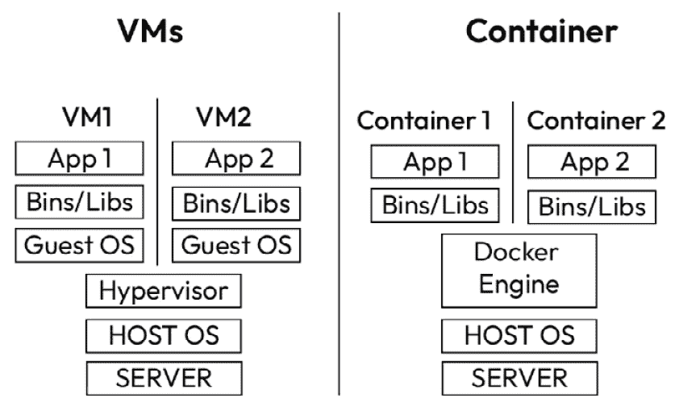
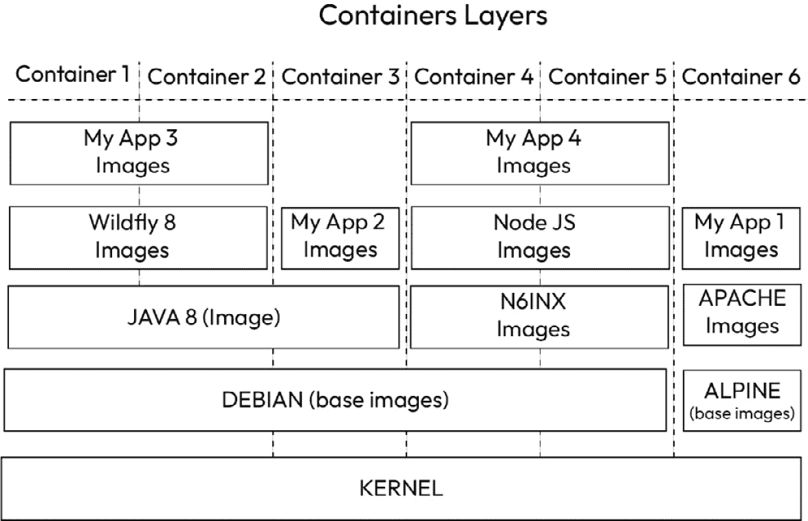
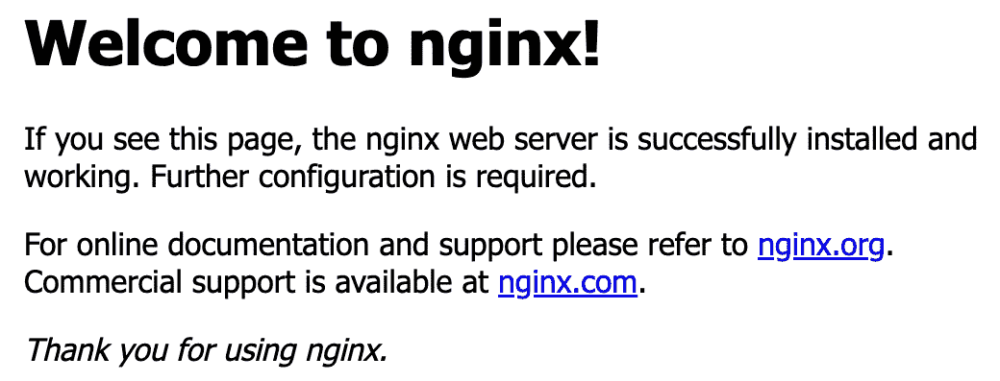

# 1

# 容器入门

随着移动设备、社交媒体、电商交易、传感器等各种来源迅速生成大量数据，世界正面临着数据爆炸。这种数据爆炸通常被称为“**大数据**”。尽管大数据为企业和组织提供了获取有价值洞察的巨大机会，但它也带来了如何存储、处理、分析和从大量多样化的数据中提取价值的巨大复杂性。

这时，Kubernetes 就派上了用场。Kubernetes 是一个开源容器编排系统，帮助自动化容器化应用的部署、扩展和管理。Kubernetes 为构建大数据系统带来了重要的优势。它提供了一种标准方式来在任何基础设施上部署容器化的大数据应用。这使得应用可以轻松地在本地服务器或云服务商之间迁移。同时，它也使得根据需求对大数据应用进行水平扩展变得更加简单。可以根据使用情况自动启动或关闭额外的容器。

Kubernetes 通过自愈和自动重启失败容器等特性，帮助确保大数据应用的高可用性。它还提供了一种统一的方法来部署、监控和管理不同的大数据组件。这与分别管理每个系统相比，显著减少了操作复杂性。

本书旨在为您提供实际技能，帮助您利用 Kubernetes 构建强大且可扩展的大数据管道。您将学习如何在 Kubernetes 上容器化并部署流行的大数据工具，如 Spark、Kafka、Airflow 等。本书涵盖了构建批处理和实时数据管道的架构最佳实践和实际示例。

到本书结束时，您将全面了解如何在 Kubernetes 上运行大数据工作负载，并能够构建高效的数据平台，支持分析和人工智能应用。无论您是数据工程师、数据科学家、DevOps 工程师，还是在推动组织数字化转型的技术领导者，您所获得的知识都将具有巨大价值。

Kubernetes 的基础是容器。容器是当今数据工程中最常用的技术之一。它们允许工程师将软件打包成标准化的单元，用于开发、运输和部署。在本章结束时，您将理解容器的基本概念，并能够使用 Docker 构建和运行自己的容器。

在本章中，我们将介绍容器是什么，为什么它们有用，以及如何使用 Docker 在本地机器上创建和运行容器。容器解决了开发者在应用程序迁移过程中面临的许多问题。它们确保应用程序及其依赖项被打包在一起，并与底层基础设施隔离开。这使得应用程序能够在不同的计算环境之间快速而可靠地运行。

我们将从在本地系统上安装 Docker 开始，Docker 是一个用于构建和运行容器的平台。我们将运行简单的 Docker 镜像，并学习基本的 Docker 命令。接着，我们将构建第一个包含简单 Python 应用的 Docker 镜像。我们将学习如何定义 Dockerfile，以高效地指定应用的环境和依赖项。然后，我们将以容器的形式运行该镜像，探索如何访问应用并检查其日志。

容器是现代软件部署的关键技术。它们轻量、可移植且可扩展，使你能够更快地构建和发布应用程序。本章中你将学习的概念和技能将为你使用容器和部署数据应用提供坚实的基础。到本章结束时，你将准备好开始构建和部署自己的容器化数据处理任务、API 和数据工程工具。

在本章中，我们将涵盖以下主要内容：

+   容器架构

+   安装 Docker

+   入门 Docker 镜像

+   构建自己的镜像

# 技术要求

对于本章内容，你需要已经安装 Docker。此外，电脑至少需要 4 GB 的内存（推荐 8 GB），因为 Docker 会消耗大量的计算机内存。

本章的代码可以在 GitHub 上找到。请参考 [`github.com/PacktPublishing/Bigdata-on-Kubernetes`](https://github.com/PacktPublishing/Bigdata-on-Kubernetes) 并访问 `Chapter01` 文件夹。

# 容器架构

容器是一种操作系统级别的虚拟化方法，我们可以利用它在单一主机上运行多个隔离的进程。容器允许应用在独立的环境中运行，拥有自己的依赖项、库和配置文件，而不需要像完整的**虚拟机**（**VM**）那样的开销，这使得容器更加轻量且高效。

如果将容器与传统的虚拟机进行比较，它们在几个方面有所不同。虚拟机在硬件层面进行虚拟化，创建一个完整的虚拟操作系统。而容器则是在操作系统层面进行虚拟化。因此，容器共享主机系统的内核，而虚拟机则每个都有自己的内核。这使得容器的启动时间非常快，通常以毫秒为单位，而虚拟机则需要几分钟（值得注意的是，在 Linux 环境中，Docker 可以直接利用 Linux 内核的功能。然而，在 Windows 系统中，Docker 则运行在一个轻量级的 Linux 虚拟机中，尽管如此，它仍然比完整的虚拟机更轻便）。

此外，容器具有更好的资源隔离性，因为它们仅隔离应用层，而虚拟机则隔离整个操作系统。容器是不可变的基础设施，使得它们在更新时创建新的容器镜像（版本），而不是在原地更新，从而使它们更加便携和一致。

由于这些差异，容器相比虚拟机允许更高的密度、更快的启动时间和更低的资源使用。单台服务器可以运行数十个甚至数百个彼此隔离的容器化应用程序。

Docker 是最受欢迎的容器平台之一，提供了构建、运行、部署和管理容器的工具。Docker 架构由 Docker 客户端、Docker 守护进程、Docker 注册表和 Docker 镜像组成。

Docker 客户端是一个**命令行界面**（**CLI**）客户端，用于与 Docker 守护进程交互，构建、运行和管理容器。这一交互通过 REST API 实现。

Docker 守护进程是一个在主机机器上运行的后台服务，负责构建、运行和分发容器。它是所有容器运行的基础。

Docker 注册表是一个用于托管、分发和下载 Docker 镜像的仓库。Docker Hub 是默认的公共注册表，里面有许多预构建的镜像，但云服务提供商通常也有自己的私有容器注册表。

最后，Docker 镜像是只读的模板，用于创建 Docker 容器。镜像定义了容器的环境、依赖关系、操作系统、环境变量以及容器运行所需的一切。

*图 1.1* 显示了在虚拟机中运行的应用程序与在容器中运行的应用程序之间的区别。



图 1.1 – 虚拟机与容器

*图 1.2* 显示了容器如何通过分层运行。底部是共享的内核。在此之上，我们可以有任意数量的操作系统层。Debian 操作系统层之上，我们看到 Java 8 镜像和 NGINX 镜像。Java 8 层被三个容器共享，其中一个仅包含镜像信息，另外两个使用不同的镜像，Wildfly。该图展示了为什么容器架构如此高效地共享资源和轻量，因为它是建立在各类库、依赖关系和应用程序的层之上的，这些层会彼此隔离运行。



图 1.2 – 容器层

现在，开始吧。在接下来的部分中，你将学习如何安装 Docker 并运行你的第一个 Docker CLI 命令。

# 安装 Docker

要开始使用 Docker，你可以通过你所使用的 Linux 发行版的包管理器进行安装，或者为 Mac/Windows 机器安装 Docker Desktop。

## Windows

要在 Windows 上使用 Docker Desktop，你必须启用 WSL 2 功能。参考此链接获取详细说明：[`docs.microsoft.com/en-us/windows/wsl/install-win10`](https://docs.microsoft.com/en-us/windows/wsl/install-win10)。

之后，你可以按照以下步骤安装 Docker Desktop：

1.  访问[`www.docker.com/products/docker-desktop`](https://www.docker.com/products/docker-desktop)下载安装程序。

1.  下载完成后，双击安装程序并按照提示操作。

    你应该确保在 **配置** 页面上选择了 **使用 WSL 2 替代 Hyper-V** 选项。这是推荐的使用方式。（如果你的系统不支持 WSL 2，此选项将不可用。不过，你仍然可以使用 Hyper-V 运行 Docker。）

1.  安装完成后，关闭并启动 Docker Desktop。

如果你有任何疑问，请参考官方文档：[`docs.docker.com/desktop/install/windows-install/`](https://docs.docker.com/desktop/install/windows-install/)。

## macOS

在 macOS 上安装 Docker Desktop 非常简单：

1.  访问[`www.docker.com/products/docker-desktop`](https://www.docker.com/products/docker-desktop)下载 macOS 的安装程序。

1.  双击安装程序并按照提示安装 Docker Desktop。

1.  安装完成后，Docker Desktop 将自动启动。

Docker Desktop 在 macOS 上原生运行，使用 HyperKit 虚拟机，无需额外配置。当 Docker Desktop 第一次启动时，它会提示你授权访问驱动器。授权 Docker Desktop 允许其访问文件系统上的文件。

## Linux

在基于 Linux 的系统上安装 Docker 非常简单。你只需要使用你的 Linux 发行版的包管理器，执行几条命令即可。例如，在 Ubuntu 上，首先需要删除你以前在机器上安装的任何旧版本的 Docker：

```
$ sudo apt-get remove docker docker-engine docker.io containerd runc
```

你可以通过以下方式从默认的`apt`仓库安装 Docker：

```
$ sudo apt install docker.io
```

这将安装一个稍微旧一点的 Docker 版本。如果你想要最新版本，请访问官方 Docker 网站（[`docs.docker.com/desktop/install/linux-install/`](https://docs.docker.com/desktop/install/linux-install/)）并按照说明操作。

如果你想在不使用`sudo`的情况下使用 Docker，可以运行以下命令：

```
$ sudo groupadd docker
$ sudo usermod –aG docker <YOUR_USERNAME>
```

现在，让我们动手实践 Docker。

# 入门 Docker 镜像

我们可以运行的第一个 Docker 镜像是`hello-world`镜像。它通常用于测试 Docker 是否正确安装并运行。

## hello-world

安装完成后，打开终端（Windows 中的命令提示符）并运行以下命令：

```
$ docker run hello-world
```

该命令将从 Docker Hub 公共仓库拉取`hello-world`镜像并运行其中的应用。如果你成功运行它，你将看到以下输出：

```
Unable to find image 'hello-world:latest' locally
latest: Pulling from library/hello-world
70f5ac315c5a: Pull complete
Digest: sha256:88ec0acaa3ec199d3b7eaf73588f4518c25 f9d34f58ce9a0df68429c5af48e8d
Status: Downloaded newer image for hello-world:latest
Hello from Docker!
This message shows that your installation appears to be working correctly.
To generate this message, Docker took the following steps:
 1\. The Docker client contacted the Docker daemon.
 2\. The Docker daemon pulled the "hello-world" image from the Docker Hub.
 3\. The Docker daemon created a new container from that image which runs the executable that produces the output you are currently reading.
 4\. The Docker daemon streamed that output to the Docker client, which sent it to your terminal.
To try something more ambitious, you can run an Ubuntu container with:
 $ docker run -it ubuntu bash
Share images, automate workflows, and more with a free Docker ID:
 https://hub.docker.com/
For more examples and ideas, visit:
 https://docs.docker.com/get-started/
```

恭喜！你刚刚运行了第一个 Docker 镜像！现在，让我们尝试一些更有挑战性的操作。

## NGINX

NGINX 是一个著名的开源软件，广泛用于 Web 服务、反向代理和缓存。它在基于 Kubernetes 的架构中得到了广泛应用。

与`hello-world`应用（它表现得像一个作业执行程序）不同，NGINX 表现得像一个服务。它会打开一个端口并持续监听用户请求。我们可以通过以下方式在 Docker Hub 中搜索可用的 NGINX 镜像：

```
$ docker search nginx
```

输出将显示几个可用的镜像。通常，列表中的第一个是官方镜像。现在，为了设置一个运行中的 NGINX 容器，我们可以使用以下命令：

```
$ docker pull nginx:latest
```

这将下载当前的最新版本镜像。冒号后面的`latest`关键字代表该镜像的“标签”。如果要安装特定版本（推荐），请像这样指定标签：

```
$ docker pull nginx:1.25.2-alpine-slim
```

你可以访问[`hub.docker.com/_/nginx`](https://hub.docker.com/_/nginx)查看所有可用的标签。

现在，为了运行容器，你应该指定想要使用的镜像版本。以下命令可以完成这个任务：

```
$ docker run --name nginxcontainer –p 80:80 nginx:1.25.2-alpine-slim
```

你将开始在终端中看到 NGINX 日志。然后，打开你喜欢的浏览器，输入`http://localhost/`。你应该能看到这个信息（*图 1.3*）：



图 1.3 – 浏览器中的 nginx 默认输出

`docker run`命令有一些重要的参数。`--name`定义了将运行的容器名称。如果你没有定义名称，Docker 会自动为它选择一个名字（相信我，它可以非常有创意）。`-p`将你机器上的一个端口（端口`80`）连接到容器内的一个端口（同样是`80`）。如果你不打开这个端口，你将无法访问容器中的应用程序。

测试成功后，返回到运行容器的终端并按下“CTRL + C”停止容器。停止后，容器仍然存在，尽管不再运行。要删除容器，请使用以下命令：

```
$ docker rm nginxcontainer
```

如果有疑问，你可以使用此命令查看所有正在运行和已停止的容器：

```
$ docker ps –a
```

我们还可以使用这个命令查看所有本地可用的镜像：

```
$ docker images
```

在我的情况下，输出显示了三个镜像：`hello-world` 和两个 NGINX 镜像，其中一个是 `latest` 标签，另一个是 `1.25.2-alpine-slim` 标签。所有镜像及其对应版本都会显示。

## Julia

在这个最后的示例中，我们将学习如何通过与正在运行的容器进行交互，使用我们机器上未安装的技术。我们将运行一个名为 Julia 的新型高效编程语言容器，它适用于数据科学。执行以下命令来实现：

```
$ docker run -it --rm julia:1.9.3-bullseye
```

注意，`docker run` 命令会查找本地镜像。如果本地没有该镜像，Docker 会自动从 Docker Hub 拉取镜像。使用前面的命令，我们将在 Julia 1.9.3 容器中启动一个交互式会话。`-it` 参数使我们可以交互使用该容器。`--rm` 参数表示容器停止后会自动删除，因此我们无需手动删除它。

容器启动并运行后，我们将尝试一个简单的自定义函数来计算两个描述性统计量：均值和标准差。你会在终端看到 Julia 的标志，并可以使用以下命令：

```
$ using Statistics
$ function descriptive_statistics(x)
    m = mean(x)
    sd = std(x)
    return Dict("mean" => m, "std_dev" => sd)
  end
```

定义好函数后，我们将用一个小的随机数字数组来运行它：

```
$ myvector = rand(5)
$ descriptive_statistics(myvector)
```

你应该能在屏幕上看到正确的输出。恭喜你！你刚刚使用了 Julia 编程语言，而无需在你的计算机上安装或配置它，只需通过 Docker！要退出容器，请使用以下命令：

```
$ exit()
```

由于我们使用了 `--rm` 参数，如果运行 `docker ps -a` 命令，我们会看到它已被自动删除。

# 构建你自己的镜像

现在，我们将定制自己的容器镜像，以便运行一个简单的数据处理任务和 API 服务。

## 批处理任务

下面是一个简单的 Python 代码示例，用于批处理任务：

**run.py**

```
import pandas as pd
url = 'https://raw.githubusercontent.com/jbrownlee/Datasets/master/pima-indians-diabetes.data.csv'
df = pd.read_csv(url, header=None)
df["newcolumn"] = df[5].apply(lambda x: x*2)
print(df.columns)
print(df.head())
print(df.shape)
```

这段 Python 代码从 URL 加载 CSV 数据集到 pandas DataFrame，新增一列，方法是将现有列的值乘以 2，然后打印出 DataFrame 的一些信息（列名、前五行以及 DataFrame 的大小）。在你喜欢的代码编辑器中键入这段代码，并将文件保存为 `run.py`。

通常，我们会在本地测试代码（尽可能地），以确保它能够正常工作。为此，首先需要安装 `pandas` 库：

```
pip3 install pandas
```

然后，使用以下命令运行代码：

```
python3 run.py
```

如果一切顺利，你应该会看到如下输出：

```
Index([0, 1, 2, 3, 4, 5, 6, 7, 8, 'newcolumn'], dtype='object')
   0    1   2   3    4     5      6   7  8  newcolumn
0  6  148  72  35    0  33.6  0.627  50  1       67.2
1  1   85  66  29    0  26.6  0.351  31  0       53.2
2  8  183  64   0    0  23.3  0.672  32  1       46.6
3  1   89  66  23   94  28.1  0.167  21  0       56.2
4  0  137  40  35  168  43.1  2.288  33  1       86.2
(768, 10)
```

现在，我们已经准备好将我们的简单处理任务打包到一个容器中了。让我们先定义一个 Dockerfile：

**Dockerfile_job**

```
FROM python:3.11.6-slim
RUN pip3 install pandas
COPY run.py /run.py
CMD python3 /run.py
```

这四行就是我们定义一个工作容器所需要的内容。第一行指定了要使用的基础镜像，这是一个精简版的 `Python 3.11.6`。它是基于 Debian 的操作系统，已经安装了 `Python 3.11.6`，这能为我们节省大量时间。使用精简镜像非常重要，因为它能保持容器大小小巧，优化传输时间和存储成本（如果适用）。

第二行安装了 `pandas` 库。第三行将本地的 `run.py` 文件复制到容器中。最后一行设置了容器启动时执行的默认命令，即运行 `/run.py` 脚本。在定义完代码后，保存为 `Dockerfile_job`（没有 `.extension`）。现在，是时候构建我们的 Docker 镜像了：

```
docker build -f Dockerfile_job -t data_processing_job:1.0 .
```

`docker build` 命令根据 Dockerfile 中的指令构建镜像。通常，这个命令会期望一个名为 `Dockerfile` 的文件。由于我们使用的文件名与预期不同，因此我们必须使用 `-f` 标志告诉 Docker 使用哪个文件。`-t` 标志定义了镜像的标签。标签由名称和版本组成，中间用冒号（`:`）分隔。在这种情况下，我们为镜像设置的名称是 `data_processing_job`，版本是 `1.0`。该命令的最后一个参数是代码文件所在的路径。这里我们设置了当前文件夹，使用一个点（`.`）。这个点很容易忘记，所以请小心！

构建完成后，我们可以通过以下命令检查本地可用的镜像：

```
docker images
```

你应该能在输出的第一行看到你刚刚构建的数据显示处理镜像：

```
REPOSITORY       TAG  IMAGE ID      CREATED        SIZE
data_process...  1.0  39bae1eb068c  6 minutes ago  351MB
```

现在，要在容器内部运行我们的数据处理任务，请使用以下命令：

```
docker run --name data_processing data_processing_job:1.0
```

`docker run` 命令运行指定的镜像。`--name` 标志定义容器的名称为 `data_processing`。当你启动容器时，应该会看到与之前相同的输出：

```
Index([0, 1, 2, 3, 4, 5, 6, 7, 8, 'newcolumn'], dtype='object')
   0    1   2   3    4     5      6   7  8  newcolumn
0  6  148  72  35    0  33.6  0.627  50  1       67.2
1  1   85  66  29    0  26.6  0.351  31  0       53.2
2  8  183  64   0    0  23.3  0.672  32  1       46.6
3  1   89  66  23   94  28.1  0.167  21  0       56.2
4  0  137  40  35  168  43.1  2.288  33  1       86.2
(768, 10)
```

最后，别忘了清理你环境中的退出容器：

```
docker ps –a
docker rm data_processing
```

恭喜！你已经使用容器运行了第一个任务。接下来，让我们进入另一种容器化应用类型：服务。

## API 服务

在这一部分中，我们将使用 `app`，并创建一个名为 `main.py` 的 Python 脚本。

在脚本中，首先导入 FastAPI 和 random 模块：

```
from fastapi import FastAPI
import random
```

接下来，我们创建 FastAPI 应用实例：

```
app = FastAPI()
```

下一个代码块使用 `@``app.get` 装饰器定义一个路由：

```
@app.get("/api")
async def root():
    return {"message": "You are doing great with FastAPI..."}
```

`@app.get` 装饰器表示这是一个 `GET` 类型的端点。这个函数被定义为响应 `"/api"` 路由的请求。它只是在请求该路由时返回一个愉快的消息。

下一个代码块定义了一个路由 `"/api/{name}"`，其中 `name` 是在请求中接收的参数。它返回一个包含给定名称的问候信息：

```
@app.get("/api/{name}")
async def return_name(name):
    return {
        "name": name,
        "message": f"Hello, {name}!"
    }
```

最后的代码块定义了 `"/joke"` 路由。这个函数从之前定义的笑话列表中随机返回一个（非常有趣的！）笑话。可以随意用你自己酷的笑话替换它们：

```
@app.get("/joke")
async def return_joke():
    jokes = [
        "What do you call a fish wearing a bowtie? Sofishticated.",
        "What did the ocean say to the beach? Nothing. It just waved",
        "Have you heard about the chocolate record player? It sounds pretty sweet."
    ]
    return {
        "joke": random.choice(jokes)
    }
```

需要注意的是，每个函数都返回一个 JSON 格式的响应。这是 API 中非常常见的模式。有关完整的 Python 代码，请参考本书的 GitHub 仓库（[`github.com/PacktPublishing/Bigdata-on-Kubernetes`](https://github.com/PacktPublishing/Bigdata-on-Kubernetes)）。

在我们构建 Docker 镜像之前，建议先在本地测试代码（尽可能的话）。为此，你需要安装 `fastapi` 和 `uvicorn` 包。在终端中运行以下命令：

```
pip3 install fastapi uvicorn
```

运行 API 时，使用以下命令：

```
uvicorn app.main:app --host 0.0.0.0 --port 8087
```

如果一切顺利，你将在终端中看到如下输出：

```
INFO:  Started server process [14417]
INFO:  Waiting for application startup.
INFO:  Application startup complete.
INFO:  Uvicorn running on http://0.0.0.0:8087 (Press CTRL+C to quit)
```

该命令将在 `8087` 端口本地运行 API 服务。要进行测试，请打开浏览器并访问 `http://localhost:8087/api`。你应该能看到屏幕上显示的编程消息。也可以测试 `http://localhost:8087/api/<YOUR_NAME>` 和 `http://localhost:8087/joke` 端点。

现在我们知道一切运行正常，接下来将 API 打包成 Docker 镜像。为此，我们将构建一个简单的 Dockerfile。为了优化它，我们将使用 `alpine` Linux 发行版，这是一种极为轻量的基础操作系统。在项目的根文件夹中创建一个名为 `Dockerfile`（没有 `.extension`）的新文件。这是我们将用于该镜像的代码：

**Dockerfile**

```
FROM python:3.11-alpine
RUN pip3 --no-cache-dir install fastapi uvicorn
EXPOSE 8087
COPY ./app /app
CMD uvicorn app.main:app --host 0.0.0.0 --port 8087
```

第一行导入基于 `alpine` Linux 发行版的 Python 容器。第二行安装 `fastapi` 和 `uvicorn`。第三行告知 Docker，容器在运行时将监听 `8087` 端口。如果没有这条命令，我们将无法访问 API 服务。第四行将本地 `/app` 文件夹中的所有代码复制到容器内的 `/app` 文件夹中。最后，`CMD` 命令指定了容器启动时要运行的命令。在这里，我们启动 `uvicorn` 服务器来运行我们的 FastAPI 应用程序。在 `uvicorn` 后面，我们指定了一个位置模式 `folder.script_name:FastAPI_object_name`，以告诉 FastAPI 在哪里查找 API 进程对象。

当这个 Dockerfile 被构建成镜像时，我们将得到一个容器化的 Python 应用程序，配置为在 `8087` 端口运行 FastAPI Web 服务器。Dockerfile 允许我们将应用程序及其依赖项打包成一个标准化的部署单元。要构建镜像，请运行以下命令：

```
docker build -t my_api:1.0 .
```

这里无需指定 `-f` 标志，因为我们使用的是默认名称的 Dockerfile。记得在命令末尾加上一个点！

现在，我们使用稍微不同的一组参数来运行容器：

```
docker run -p 8087:8087 -d --rm --name api my_api:1.0
```

`-p` 参数设置了我们将在服务器（在此情况下为你的计算机）中将 `8087` 端口映射到容器中的 `8087` 端口。如果不设置此参数，就无法与容器进行任何通信。`-d` 参数以 *分离* 模式运行容器。终端将不会显示容器日志，但容器会在后台运行，终端仍然可以使用。`--rm` 参数设置容器在完成后自动删除（非常方便）。最后，`--name` 为容器设置名称为 `api`。

我们可以使用以下命令检查容器是否正确运行：

```
docker ps –a
```

如果需要查看容器的日志，请使用以下命令：

```
docker logs api
```

你应该看到类似如下的输出：

```
INFO:  Started server process [1]
INFO:  Waiting for application startup.
INFO:  Application startup complete.
INFO:  Uvicorn running on http://0.0.0.0:8087 (Press CTRL+C to quit)
```

现在，我们可以通过之前显示的相同链接在浏览器中测试我们的 API 端点（`http://localhost:8087/api`、`http://localhost:8087/api/<YOUR_NAME>` 和 `http://localhost:8087/joke`）。

恭喜！你已经在容器内部运行了你的 API 服务。这是一个完全便携且自包含的应用程序，可以部署到任何地方。

要停止 API 服务，请使用以下命令：

```
docker stop api
```

要检查已停止的容器是否已被自动删除，请使用以下命令：

```
docker ps -a
```

做得很好！

# 总结

在本章中，我们介绍了容器的基本原理以及如何使用 Docker 构建和运行它们。容器提供了一种轻量级、便携的方式来打包应用程序及其依赖项，以便它们能够在各种环境中可靠地运行。

你已经了解了关键概念，例如镜像、容器、Dockerfile 和仓库。我们安装了 Docker，并运行了简单的容器，如 NGINX 和 Julia，进行实践操作。你还为批处理作业和 API 服务构建了自己的容器，定义了 Dockerfile 来打包依赖项。

这些技能使你能够开发应用程序并将其容器化，以便能够顺利地在任何地方部署。容器非常有用，因为它们确保每次都能按预期运行你的软件。

在下一章中，我们将学习如何使用 Kubernetes 来编排容器，轻松地扩展、监控和管理容器化应用程序。我们将重点介绍 Kubernetes 中最重要的概念和组件，并学习如何通过 YAML 文件（清单）实现它们。
