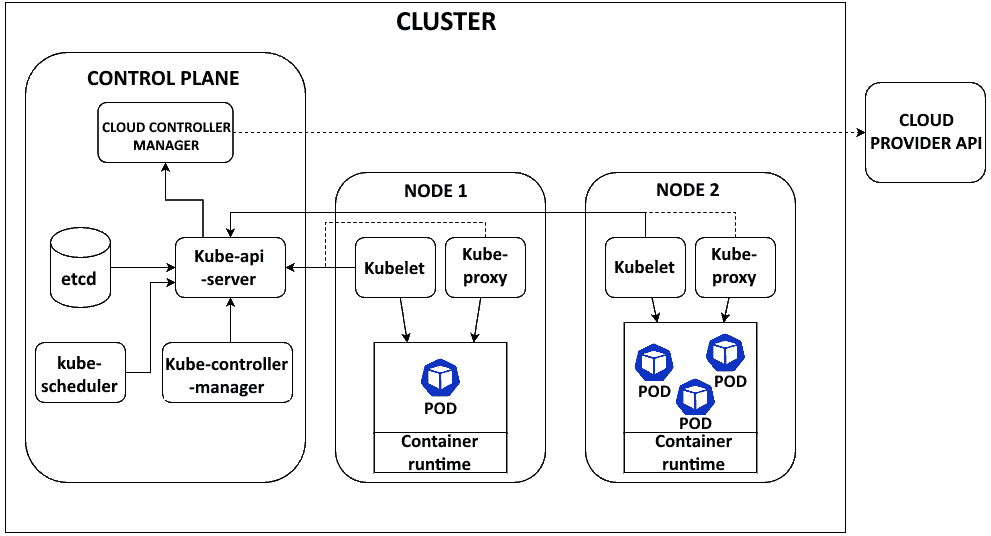

# 2

# Kubernetes 架构

理解 Kubernetes 架构对于正确利用其能力至关重要。在本章中，我们将介绍构成 Kubernetes 集群的主要组件和概念。熟悉这些构建块将帮助你了解 Kubernetes 如何在幕后工作。

我们将首先看看构成 Kubernetes 集群的不同组件——控制平面和工作节点。控制平面由 API 服务器、控制器管理器和 etcd 等组件组成，负责管理和维护集群的期望状态。工作节点在 Pod 中运行容器化应用。

在介绍集群架构之后，我们将深入探讨 Kubernetes 的主要抽象和 API 资源，如 Pods、部署、StatefulSets、服务、Ingress 和持久化卷。这些资源允许你声明应用的期望状态，并让 Kubernetes 调整实际状态以匹配它。理解这些概念是能够在 Kubernetes 上部署和管理应用的关键。

我们还将查看支持资源，如 ConfigMaps 和 Secrets，这些可以将配置与代码分开。Jobs 提供对批处理工作负载的支持。

到本章结束时，你将对 Kubernetes 集群的构建方式以及如何利用其 API 资源来发挥其能力有一个扎实的理解。这将使你能够开始部署自己的应用并高效地管理它们。

我们将通过以下主要主题来讲解这些概念：

+   集群架构

+   Pods

+   部署

+   StatefulSets

+   Jobs

+   服务

+   Ingress 和 ingress 控制器

+   网关

+   持久化卷

+   ConfigMaps 和 Secrets

# 技术要求

本章没有技术要求。这里展示的所有代码都是通用的，实际可执行的示例将在 *第三章* 中给出。

# Kubernetes 架构

Kubernetes 是一种集群架构。这意味着在完整的生产环境中，通常会有多台机器同时运行工作负载，以创建可靠且可扩展的架构。（请注意，Kubernetes 也可以在单台机器上运行，这非常适合测试，但对于生产环境来说并不合适。）

为了协调集群功能，Kubernetes 有两个主要功能组：**控制平面**负责集群管理，**节点组件**与控制平面通信并在工作节点上执行任务。*图 2.1* 展示了整个系统的表示。



图 2.1 – Kubernetes 架构

让我们仔细看看每个组及其组件。

## 控制平面

控制平面的主要组件如下：

+   kube-apiserver

+   etcd

+   kube-scheduler

+   kube-controller-manager

当运行基于云的 Kubernetes 集群时，我们还有一个组件叫做 cloud-controller-manager。

### kube-apiserver

Kubernetes API 通过 **kube-apiserver** 向管理员开放。它可以看作是控制平面的“前端”。通过 API 服务器，我们与 Kubernetes 进行交互，向集群发送指令或从集群获取数据。它具有高度的可扩展性，支持横向扩展（通过部署更多工作节点到集群中）。

### etcd

Kubernetes 使用 etcd 作为一个分布式键值数据库，持久化存储所有集群数据和状态。etcd 作为 Kubernetes API 服务器的后端存储，提供了一个安全且具有韧性的基础，支持在集群节点之间协调容器的运行。通过利用 etcd 在一致性、高可用性和分布式方面的能力，Kubernetes 可以可靠地管理应用程序和基础设施的期望状态。即使集群中的领导节点发生故障，etcd 仍具有容错能力。

### kube-scheduler

**kube-scheduler** 负责将工作负载或容器分配到多个节点。它会监控那些尚未分配到任何节点的已创建 Pod，并为它们选择一个运行节点。为了做出调度决策，kube-scheduler 会分析单个和集体可用资源、硬件/软件/策略约束、亲和性和反亲和性规则、截止时间、数据位置以及工作负载之间的潜在干扰。

### kube-controller-manager

**kube-controller-manager** 运行控制器来调节集群中的行为，如节点控制器、任务控制器、EndpointSlice 控制器和 ServiceAccount 控制器。控制器通过对比期望状态和当前状态来进行调节。

### cloud-controller-manager

**cloud-controller-manager** 与底层云提供商进行交互，并设置基于云的网络服务（如网络路由和负载均衡器）。它将与云提供商交互的组件与仅在集群内运行的组件分离开来。此控制器管理器仅运行与所使用的云提供商相关的控制器，因此，如果你在运行本地测试 Kubernetes 实例，cloud-controller-manager 将不会被使用，因为它只处理基于云的服务。

接下来，让我们看看节点组件。

## 节点组件

每个集群的工作节点中都包含节点组件，这些组件负责与控制平面通信、运行和维护工作负载，并提供运行时环境。主要组件如下：

+   容器运行时

+   kubelet

+   kube-proxy

### 容器运行时

**容器运行时** 是负责运行容器的底层软件。Kubernetes 支持多种容器运行时，但最常见的是 Docker 和 containerd。容器运行时负责从镜像仓库拉取镜像、运行容器并管理容器的生命周期。

### kubelet

**kubelet** 是主要的节点代理，负责监视分配给节点的 Pods，并确保容器正在运行并且健康。它与容器运行时交互，以拉取镜像并运行容器。

### kube-proxy

**kube-proxy** 是一个网络代理和负载均衡器，通过维护网络规则和执行连接转发，在每个节点上实现 Kubernetes 网络服务。

现在，让我们将注意力转向我们将在构建工作负载时使用的 Kubernetes 组件。

# Pods

**Pods** 是 Kubernetes 中最小的可部署单元，表示应用程序的单个实例。Pod 包含一个或多个容器（尽管最常见的情况是每个 Pod 仅包含一个容器）。当多个容器位于同一个 Pod 中时，它们会保证被调度到同一个节点上，并且能够共享资源。

Pods 提供两个主要的好处：

+   `localhost` 并共享卷等资源。这有助于相关容器之间的轻松通信。不过，需要注意的是，这是一个高级用例，应该仅在容器紧密耦合时使用。我们通常使用 Pods 来进行单容器部署。

+   **管理与部署**：Pods 是在 Kubernetes 中部署、扩展和管理的单位。你不会直接创建或管理 Pod 内的容器。整个过程是完全自动化的。

通常，你不会直接定义 Pods。Pods 可以通过其他资源（如部署、任务和 `StatefulSets`）创建和管理。然而，你也可以通过合适的 YAML 文件清单来定义一个 Pod。

`.yaml` 文件。**YAML 文件** 通常用于配置。它们与 JSON 文件非常相似，但由于依赖缩进来表示代码层次结构，而不是使用括号和大括号，因此更具可读性。以下是一个部署单个 Pod 的清单示例：

pod.yaml

```
apiVersion: v1
kind: Pod
metadata:
    name: myapp-pod
    labels:
    app: myapp
spec:
    containers:
    - name: myapp-container
    image: myimage:latest
    ports:
    - containerPort: 80
```

让我们更仔细地看看这个清单的每个部分：

+   `apiVersion`：此清单中对象的 Kubernetes API 版本。对于 Pods，版本为 `v1`。

+   `kind`：正在创建的对象类型，对于此清单是 `Pod`。

+   `metadata`：此部分包含 Pod 的元数据，例如名称和标签。名称是唯一标识符。标签将在未来特别重要，因为它们作为其他 Kubernetes 资源（如部署和服务）的标识符。

+   `spec`：此部分定义 Pod 的期望状态，包括其容器。

+   `containers`：指定运行在 Pod 内的容器。包括镜像、端口等信息。

+   `image`：容器使用的 Docker 镜像，可以是公共镜像或私有镜像。

+   `ports`: 定义容器暴露的端口。

这涵盖了 Pod 清单的基本结构。Pods 提供了一种在 Kubernetes 中部署和管理容器的简单方式。现在我们已经讨论了 Pods 及其定义方式，让我们讨论一种通过部署自动化更复杂 Pod 结构的方法。

# Deployments

**Deployments**是 Kubernetes 中运行应用程序最重要的资源之一。它们提供了一种声明式的方法来管理 Pods 和副本。

部署定义了应用程序的所需状态，包括容器镜像、副本数、资源限制等。Kubernetes 控制平面会将集群的实际状态与部署中所需的状态进行匹配。

例如，这是一个简单的部署清单：

deployment.yaml

```
apiVersion: apps/v1
kind: Deployment
metadata:
    name: myapp-deployment
spec:
    replicas: 3
    selector:
    matchLabels:
      app: myapp
    template:
    metadata:
      labels:
        app: myapp
    spec:
      containers:
      - name: myapp
        image: nginx:1.16
        ports:
        - containerPort: 80
```

让我们逐节分析：

+   `apiVersion`: 这是指定 Kubernetes API 版本的字段，用于部署资源。我们需要使用`apps/v1`版本，该版本包含了 Deployments。

+   `kind: Deployment`: 我们正在创建的资源类型，这里是 Deployment。

+   `metadata`: 资源的标准元数据，如唯一名称。

+   `spec`: 部署的规格。它定义了所需的状态。

+   `replicas: 3`: 我们希望运行三个 Pod 副本。Kubernetes 将保持这个 Pod 数。

+   `selector`: 用于匹配由此部署管理的 Pod。Pod 将根据标签选择器进行选择。

+   `template`: 将要创建的 Pod 模板。它定义了 Pod 的规格。请注意，部署将与指定的标签相关联。

+   `spec: containers`: Pod 的规格，包括要运行的容器。

+   `image: nginx:1.16`: 使用的容器镜像。

+   `ports`: 容器暴露的端口。

当此部署应用时，Kubernetes 将启动三个与模板匹配的 Pod，每个 Pod 运行一个 Nginx 容器。部署控制器将监控这些 Pod，并确保所需状态与实际状态一致，必要时会重启 Pod。

部署提供了强大的功能，用于在 Kubernetes 上运行可扩展和弹性的应用程序。使用声明式配置使得部署变得简便。接下来，我们将讨论管理 Pods 和副本的另一种方法：StatefulSets。

# StatefulSets

StatefulSets 是 Kubernetes 资源，用于管理有状态应用程序，如数据库。它们类似于 Deployments，但专门设计用于处理需要持久存储和唯一网络标识符的有状态工作负载。

StatefulSet 管理包含有状态应用的 Pods（必须为其他应用或用户会话跟踪数据的应用）。StatefulSet 中的 Pods 具有粘性的、唯一的身份，即使在重新调度时也能保持不变。这使得每个 Pod 在重启或重新调度到新节点时能够保持其状态。因此，StatefulSets 非常适合像数据库这样的有状态应用，需要数据持久化。而 Deployments 则是为无状态工作负载设计的，提供没有持久化存储的相同 Pods，因此更适用于无状态的 Web 应用。

StatefulSets 通过为每个 Pod 创建持久化存储卷（将在本章后续部分介绍）来运行。这样可以确保数据在 Pod 重启时得以持久保存。StatefulSets 还为每个 Pod 提供独特的主机名和稳定的网络 ID，使用可预测的命名规则。

这里是一个部署 MySQL 数据库的 StatefulSet 清单示例：

statefulset.yaml

```
apiVersion: apps/v1
kind: StatefulSet
metadata:
    name: mysql
spec:
    serviceName: "mysql"
    replicas: 1
    selector:
    matchLabels:
      app: mysql
    template:
    metadata:
      labels:
        app: mysql
    spec:
      containers:
      - name: mysql
        image: mysql:5.7
        ports:
        - containerPort: 3306
          name: mysql
        volumeMounts:
        - name: mysql-persistent-storage
          mountPath: /var/lib/mysql
    volumeClaimTemplates:
    - metadata:
      name: mysql-persistent-storage
    spec:
      accessModes: [ "ReadWriteOnce" ]
      storageClassName: "my-storage-class"
      resources:
        requests:
          storage: 1Gi
```

该清单为 MySQL 创建了一个包含一个副本的 StatefulSet。它使用 `volumeClaimTemplate` 动态为每个 Pod 配置一个持久化存储卷。MySQL 数据将保存在 `/``var/lib/mysql` 路径下。

每个 Pod 都会得到一个唯一的名称，如 `mysql-0`，并且具有一个稳定的主机名。如果 Pod 被重新调度，它将重新挂载其持久化存储卷，继续以有状态的方式运行。

通过这种方式，StatefulSets 为 Kubernetes 中的数据库和其他有状态应用提供了强大的有状态管理功能。它们确保数据持久化、稳定的网络、有序的部署以及平滑的扩展。接下来，我们将继续讨论 Kubernetes 作业。

# 作业

**作业**是 Kubernetes 中的一个基本资源类型，用于运行直到完成的批处理任务。与长时间运行的服务（如 Web 服务器）不同，作业旨在在批处理任务完成时终止。

一个作业创建一个或多个 Pod，运行定义的工作负载，并在工作负载完成后终止。对于数据处理、机器学习训练或任何有限计算等任务，这种方式非常有用。

要创建一个作业，你可以在 YAML 清单中定义一个 Job 资源，如下所示：

job.yaml

```
apiVersion: batch/v1
kind: Job
metadata:
    name: myjob
spec:
    template:
    spec:
      containers:
      - name: myjob
        image: busybox
        command: ['sh', '-c', 'echo Hello Kubernetes! && sleep 30']
      restartPolicy: Never
    backoffLimit: 4
```

让我们逐部分仔细看一下这段代码：

+   `apiVersion` `'` `batch/v1` 用于作业

+   `kind` `'` `Job`

+   `metadata.name` `'` 作业的名称

+   `spec.template` `'` Pod 模板，定义了容器（们），与我们在之前的资源定义中看到的方式相同

+   `spec.template.spec.restartPolicy` `'` 设置为 `Never`，因为作业不应该重启

+   `spec.backoffLimit` `'` 可选的失败任务重试次数限制

`spec.template` 下的 pod 模板定义了要运行的容器，就像 pod 清单一样。你可以指定镜像、命令、环境变量等。一个重要的设置是 `restartPolicy`，对于作业来说，它应该设置为 `Never`，以确保如果 pod 失败或退出时不会被重启。`backoffLimit` 是可选的，指定一个失败的作业 pod 可以重试的次数。默认值是 **6**。如果不希望作业在失败后重试太多次，可以将此值设置得更低。

当你创建作业时，Kubernetes 会调度一个或多个符合模板的 pod 来运行你的工作负载。当 pod 完成时，Kubernetes 会跟踪它们的状态并知道作业何时完成。你可以查看作业状态和 pod 日志以监控进度。作业使得在 Kubernetes 上运行批量计算工作负载变得更容易。在接下来的部分中，我们将深入了解 Kubernetes 服务。

# 服务

**服务** 提供了稳定的端点，以便访问在集群中运行的 pod，从而将我们的应用程序暴露给在线用户。它们允许 pod 死亡和复制，而不会中断对在这些 pod 中运行的应用程序的访问。Kubernetes 中有几种类型的服务。我们将详细讨论其中的三种：ClusterIP、NodePort 和负载均衡器。

## ClusterIP 服务

ClusterIP 服务提供了一个仅在集群内部可访问的 IP 地址。这个 IP 地址在服务生命周期内不会改变，为访问 pod 提供了一个稳定的端点。以下是一个 ClusterIP 服务清单的示例：

service_clusterip.yaml

```
apiVersion: v1
kind: Service
metadata:
    name: my-service
spec:
    type: ClusterIP
    selector:
    app: my-app
    ports:
    - protocol: TCP
     port: 80
     targetPort: 9376
```

这个清单创建了一个名为 `my-service` 的服务，它会将请求转发到具有 `app: my-app` 标签的 pod，端口为 `80`。请求将被转发到目标 pod 上的 `9376` 端口。在此服务存在期间，ClusterIP 不会改变。

## NodePort 服务

NodePort 服务通过在每个节点上分配的端口使得内部的 ClusterIP 服务能够在外部访问。NodePort 从配置的范围中分配（默认是 `30000`-`32767`），并且在每个节点上都是相同的。对 `<NodeIP>:<NodePort>` 的流量将被转发到 ClusterIP 服务。以下是一个示例：

service_nodeport.yaml

```
apiVersion: v1
kind: Service
metadata:
    name: my-service
spec:
    type: NodePort
    selector:
    app: my-app
    ports:
    - port: 80
      targetPort: 9376
      nodePort: 30007
```

这将在每个节点的 `30007` 端口上暴露内部的 ClusterIP。对 `<NodeIP>:30007` 的请求将被转发到服务。

## 负载均衡器服务

负载均衡器服务提供了一个外部负载均衡器，用于将服务暴露给外部流量。ClusterIP 将服务暴露在 Kubernetes 集群内的内部 IP 地址上，这使得服务仅能在集群内访问。另一方面，负载均衡器通过云提供商的负载均衡器实现将服务暴露到外部，这使得服务能够从 Kubernetes 集群外部进行访问。

负载均衡器的实现依赖于环境。例如，在 AWS 上，这将创建一个 **Elastic Load Balancer**（**ELB**），这是一个 AWS 服务，用于提供托管的负载均衡器。以下是一个示例：

service_loadbalancer.yaml

```
apiVersion: v1
kind: Service
metadata:
    name: my-service
spec:
    selector:
    app: my-app
    ports:
    - protocol: TCP
      port: 80
      targetPort: 9376
    type: LoadBalancer
```

这会创建一个负载均衡器并分配一个外部 IP 地址。流量到达外部 IP 后会被转发到内部的 ClusterIP 服务。接下来，我们将讨论另一种使用 Ingress 和 Ingress 控制器定义服务的方法。

# Ingress 和 Ingress 控制器

**Ingress** 资源定义了外部连接到 Kubernetes 服务的规则。它使得 HTTP 和 HTTPS 连接能够访问集群内运行的服务。流量路由由 Ingress 资源中定义的规则控制。要使 Ingress 能够运行，你需要在 Kubernetes 上运行一个 Ingress 控制器。

**Ingress 控制器** 负责实现 Ingress，通常通过负载均衡器完成。它监视 Ingress 资源，并相应地配置负载均衡器。不同的负载均衡器需要不同的 Ingress 控制器实现。

一些 Ingress 控制器的示例如下：

+   NGINX Ingress Controller：使用 NGINX 作为负载均衡器和反向代理，是最常见和功能最全的控制器之一。

+   HAProxy Ingress Controller：使用 HAProxy 进行负载均衡，提供高性能和高可靠性。

+   Traefik Ingress Controller：一种云原生控制器，集成了 Let’s Encrypt，用于自动生成 HTTPS 证书。

+   AWS ALB Ingress Controller：使用 AWS **应用负载均衡器**（**ALB**）。与其他 AWS 服务本地集成。

Ingress 资源包含两个主要部分——后端和规则。后端指定路由到默认服务的未匹配请求。规则包含一组路径和将它们路由到的服务：

ingress.yaml

```
apiVersion: networking.k8s.io/v1
kind: Ingress
metadata:
    name: example-ingress
spec:
    backend:
    service:
      name: example-service
      port:
        number: 80
    rules:
    - http:
        paths:
          - path: /
            pathType: Prefix
            backend:
              service:
                name: example-service
                port:
                  number: 80
```

在这个例子中，根路径 `/` 的请求将被路由到 `example-service` 的端口 `80`。`pathType:` 前缀表示任何子路径也应该路由到该服务。

可以定义多个规则，将不同的路径路由到不同的服务：

```
spec:
    rules:
    - http:
        paths:
          - path: /foo
            backend:
              service:
                name: foo-service
                port:
                  number: 80
    - http:
        paths:
          - path: /bar
            backend:
              service:
                name: bar-service
                port:
                  number: 80
```

使用前面的代码，请求 `/foo` 会被路由到 `foo-service`，而请求 `/bar` 会被路由到 `bar-service`。

在某些情况下，我们必须配置具有传输加密的安全连接。当出现这种情况时，我们可以在 Ingress 控制器中使用注解配置高级加密选项：

```
metadata:
    annotations:
    nginx.ingress.kubernetes.io/ssl-redirect: "false"
```

也可以通过指定主机名来配置基于主机的路由：

```
spec:
    rules:
    - host: foo.example.com
    http:
      paths:
      - path: /
        backend:
          serviceName: foo-service
          servicePort: 80
    - host: bar.example.com
    http:
      paths:
      - path: /
        backend:
          serviceName: bar-service
          servicePort: 80
```

现在 `foo.example.com` 将路由到 `foo-service`，而 `bar.example.com` 将路由到 `bar-service`。

总结来说，Ingress 提供了一种智能路由 HTTP 和 HTTPS 流量到 Kubernetes 集群中服务的方式。Ingress 控制器处理实际的负载均衡和反向代理功能。Ingress 的常见用例包括将服务暴露给外部用户和处理 TLS/SSL。对于生产级 Kubernetes 部署，谨慎配置 Ingress 至关重要。

**需要注意的是，Ingress API 已被冻结。** 这意味着该 API 将不再接受任何更新，已被 Gateway API 取代。尽管如此，了解它仍然很重要，因为本书中我们将使用的许多大数据工具仍然是通过 Ingress 指令部署的。现在，让我们转向 Gateway API，了解它是如何工作的。

# Gateway

Gateway API 是一个 Kubernetes API，提供了一种在 Kubernetes 上动态配置负载均衡和服务网格功能的方式。Gateway API 允许以集中声明的方式定义路由和策略来管理外部流量到 Kubernetes 服务。

Gateway API 中的主要资源如下：

+   `GatewayClass` `'` 定义了一组具有共同配置和行为的网关。它类似于持久化存储卷的 StorageClass 概念。

+   `Gateway` `'` 定义了一组给定主机名的路由。这将 GatewayClass、TLS 证书和其他配置绑定到一组路由。

+   `HTTPRoute/TCPRoute` `'` 定义了实际的路由到 Kubernetes 服务及其策略，如超时、重试等。

下面是一个 GatewayClass 资源的示例：

gateway_class.yaml

```
apiVersion: gateway.networking.k8s.io/v1
kind: GatewayClass
metadata:
    name: external-lb
spec:
    controllerName: lb.acme.io/gateway-controller
```

这定义了一个名为 `external-lb` 的 GatewayClass，将由 `lb.acme.io/gateway-controller` 控制器处理。

一个 Gateway 资源将主机名和 TLS 证书与 GatewayClass 绑定，如以下代码所示：

gateway.yaml

```
apiVersion: gateway.networking.k8s.io/v1
kind: Gateway
metadata:
    name: my-gateway
spec:
    gatewayClassName: external-lb
    listeners:
    - name: http
    port: 80
    protocol: HTTP
```

这个名为 `my-gateway` 的网关使用了之前定义的 `external-lb` GatewayClass。它处理端口 `80` 上的 HTTP 流量。请注意，`addresses` 字段没有指定，因此网关的控制器将为其分配一个地址或主机名。

最后，HTTPRoute 和 TCPRoute 资源定义了实际的后端服务路由。这里是一个示例：

http_route.yaml

```
apiVersion: gateway.networking.k8s.io/v1
kind: HTTPRoute
metadata:
    name: http-route
spec:
    parentRefs:
    - name: my-gateway
    rules:
    - matches:
    - path:
    type: PathPrefix
    value: /foo
    backendRefs:
    - name: my-foo-service
      port: 80
    - matches:
    - path:
        type: PathPrefix
        value: /bar
    backendRefs:
    - name: my-bar-service
      port: 80
```

这个 HTTPRoute 是之前定义的 `my-gateway` 网关的子资源。它将请求路由到 `/foo` 路径，指向端口 `80` 上的 `my-foo-service` 服务，且请求到 `/bar` 的流量将被路由到端口 `80` 上的 `my-bar-service`。此外，诸如请求超时、重试和流量拆分等附加功能可以在 Route 资源中进行配置。

网关是配置 Kubernetes 中网络和路由的新方式，且非常有效。集中式的入口流量管理配置充当了单一的事实来源。虽然 Ingress 资源提供了一个简单、声明式的接口，专注于暴露 HTTP 应用程序，但 Gateway API 资源则提供了一个更通用的抽象，用于代理 HTTP 以外的多种协议。此外，它们还将数据平面与控制平面解耦。任何网关控制器都可以使用，包括 NGINX、HAProxy 和 Istio。网关通过 TLS 处理和身份验证提供了更好的安全性，并通过先进的路由规则和策略实现了精细的流量控制。最后，它们在复杂的入口配置中提供了更容易的管理和操作。

接下来，我们将探讨持久化存储卷（persistent volumes）。

# 持久卷（Persistent Volumes）

Kubernetes 最初是为无状态应用设计的。因此，当在 Kubernetes 上运行有状态应用时，管理存储是一个关键挑战。Kubernetes 提供了抽象，使得存储能够在不同环境中以可移植的方式进行配置和使用。在 Kubernetes 上设计存储基础设施时，需要理解两个主要资源：**持久卷**（**PVs**）和 **持久卷声明**（**PVCs**）。PV 代表由集群管理员配置的网络存储单元。与计算节点类似，PVs 成为集群资源池。相对而言，PVC 允许最终用户请求具有定义容量和访问模式的抽象存储。PVC 的功能类似于 pod 资源请求，但用户可以指定所需的卷大小和读/写权限，而不是 CPU 和内存。Kubernetes 控制平面负责绑定匹配的 PV 和 PVC 资源，以根据声明为 pods 配置存储。通过这种角色分离，底层存储层从单个 pod 的生命周期中独立出来。

这是一个持久卷 YAML 清单示例：

persistent_volume.yaml

```
apiVersion: v1
kind: PersistentVolume
metadata:
    name: pv0003
spec:
    capacity:
    storage: 5Gi
    volumeMode: Filesystem
    accessModes:
    - ReadWriteOnce
    persistentVolumeReclaimPolicy: Recycle
    storageClassName: slow
    mountOptions:
    - hard
    - nfsvers=4.1
    nfs:
    path: /tmp
    server: 172.17.0.2
```

这定义了 NFS 服务器 `172.17.0.2` 上的 `/tmp`。回收策略设置为 `Recycle`，这意味着当释放时，卷会被回收而不是删除。`storageClassName` 设置为 `slow`，它可以用于将此 PV 与请求特定存储类的 PVC 匹配。

这是一个持久卷声明 YAML 清单示例：

pvc.yaml

```
apiVersion: v1
kind: PersistentVolumeClaim
metadata:
    name: myclaim
spec:
    accessModes:
    - ReadWriteOnce
    volumeMode: Filesystem
    resources:
    requests:
      storage: 8Gi
    storageClassName: slow
    selector:
    matchLabels:
      release: "stable"
```

这个 PVC 请求 8GB 的存储，并具有 `ReadWriteOnce` 访问权限。它指定了 `slow` 的 `storageClassName`，这将使其与前面具有相同存储类的 PV 匹配。还有一个选择器会匹配具有 `stable` 版本标签的 PV。

当创建 PVC 时，Kubernetes 控制平面会寻找匹配的 PV 进行绑定。匹配条件考虑了访问模式、存储容量和 `storageClassName` 等因素。一旦绑定，该存储就可以被 pods 挂载。

下面是一个挂载前述 PVC 的 pod YAML：

pod_with_pvc.yaml

```
kind: Pod
apiVersion: v1
metadata:
    name: mypod
spec:
    containers:
    - name: myfrontend
      image: nginx
      volumeMounts:
      - mountPath: "/var/www/html"
        name: mypd
    volumes:
    - name: mypd
      persistentVolumeClaim:
        claimName: myclaim
```

该 pod 将 PVC 挂载到容器中的 `/var/www/html`。PVC 为 pod 提供了持久存储，即使 pod 被删除或迁移到其他节点，存储也会保留。

## 存储类（StorageClasses）

StorageClass 对象定义了可以请求的不同 *存储类*。这允许管理员在同一集群内提供不同级别的存储。以下代码定义了一个标准硬盘 StorageClass 和一个在 GCE 上的快速 SSD StorageClass：

storage_classes.yaml

```
apiVersion: storage.k8s.io/v1
kind: StorageClass
metadata:
    name: standard
provisioner: kubernetes.io/gce-pd
parameters:
    type: pd-standard
---
apiVersion: storage.k8s.io/v1
kind: StorageClass
metadata:
    name: fast
provisioner: kubernetes.io/gce-pd
parameters:
    type: pd-ssd
```

`---` 行告诉 Kubernetes 我们将两个 YAML 清单聚合在一个文件中。在定义 StorageClass 后，PVC 可以请求特定的存储类：

pvc2.yaml

```
apiVersion: v1
kind: PersistentVolumeClaim
metadata:
    name: myclaim
spec:
    accessModes:
    - ReadWriteOnce
    storageClassName: fast
    resources:
    requests:
      storage: 30Gi
```

这使得集群能够提供不同类型的存储，而无需用户了解实现的细节。接下来，我们将讨论本章最后一个主题，也是 Kubernetes 安全性中非常重要的一个话题：配置映射和秘密（Secrets）。

# 配置映射和秘密

配置映射和秘密是两个重要的 Kubernetes 对象，它们允许你将配置数据与应用程序代码分离。这使得你的应用程序更具可移植性、可管理性和安全性。

## 配置映射（ConfigMaps）

配置映射提供了一种便捷的方式，以声明的方式将配置数据传递给 Pod。它们允许你存储配置数据，而不直接将其放入 Pod 定义或容器镜像中。Pod 可以通过环境变量、命令行参数或将配置映射作为卷挂载来访问存储在配置映射中的数据。使用配置映射使得你能够将配置数据与应用程序代码分离。

使用以下清单，你可以创建一个配置映射来存储配置文件：

config_map.yaml

```
apiVersion: v1
kind: ConfigMap
metadata:
    name: app-config
data:
    config.properties: |
    app.color=blue
    app.mode=prod
```

这个配置映射包含一个 `config.properties` 文件，Pod 可以挂载并使用它。

你还可以从目录、文件或字面值创建配置映射。以下命令展示了每种配置映射定义的示例。这些命令在 shell 中通过 `kubectl` 可执行文件运行（我们将在下一章深入探讨它）：

```
kubectl create configmap app-config --from-file=path/to/dir
kubectl create configmap app-config --from-file=config.properties
kubectl create configmap app-config --from-literal=app.color=blue
```

要在 Pod 中使用配置映射，你可以执行以下操作：

+   从配置映射数据设置环境变量

+   从配置映射数据设置命令行参数

+   在卷中使用配置映射的值

以下 YAML 文件定义了一个 Kubernetes Pod，它通过环境变量和将配置映射作为卷来使用配置数据。让我们看看如何实现：

pod_with_configmap.yaml

```
apiVersion: v1
kind: Pod
metadata:
    name: configmap-demo
spec:
    containers:
    - name: demo
      image: alpine
      env:
        - name: APP_COLOR
          valueFrom:
            configMapKeyRef:
              name: app-config
              key: app.color
      args:
        - $(APP_MODE)
        valueFrom:
          configMapKeyRef:
            name: app-config
            key: app.mode
      volumeMounts:
        - name: config-volume
          mountPath: /etc/config
    volumes:
    - name: config-volume
      configMap:
        name: app-config
```

让我们仔细看看这段代码，并理解它的作用：

+   它定义了一个名为 `configmap-demo` 的 Pod。

+   该 Pod 有一个名为 `demo` 的容器，使用 `alpine` 镜像。

+   容器设置了两个环境变量：

    +   `APP_COLOR` 从 `app-config` 配置映射中的 `app.color` 键设置

    +   `APP_MODE` 从 `app-config` 配置映射中的 `app.mode` 键设置（这是作为运行命令的参数定义的）

+   容器有一个名为 `config-volume` 的卷挂载，它挂载了 `/etc/config` 路径。

+   该 Pod 定义了一个名为 `config-volume` 的卷，使用 `app-config` 配置映射作为数据源。这使得来自配置映射的数据在挂载路径上对容器可用。

尽管配置映射非常有用，但它们并不为机密数据提供保密性。为此，Kubernetes 提供了秘密（Secrets）。

## 秘密（Secrets）

秘密是一个对象，包含少量敏感数据，如密码、令牌或密钥。秘密允许你存储和管理这些敏感数据，而不会将其暴露在应用程序代码中。

例如，你可以使用 `kubectl` 从字面值创建一个秘密：

```
kubectl create secret generic db-secret \
--from-literal=DB_HOST=mysql \
--from-literal=DB_USER=root \
--from-literal=DB_PASSWORD=password123
```

上面的代码将创建一个包含机密数据库凭据的 Secret。你还可以从文件或目录创建 Secrets：

```
kubectl create secret generic ssh-key-secret --from-file=ssh-privatekey=/path/to/key
kubectl create secret generic app-secret --from-file=/path/to/dir
```

Secrets 以`base64`格式存储数据。这可以防止值在`etcd`中以`plaintext`（明文）形式暴露。然而，这些数据并没有被加密。你可以通过以下方式从 Pod 中获取机密数据：

pod_with_secrets.yaml

```
apiVersion: v1
kind: Pod
metadata:
    name: secret-demo
spec:
    containers:
    - name: demo
    image: nginx
    env:
      - name: DB_HOST
        valueFrom:
          secretKeyRef:
            name: db-secret
            key: DB_HOST
      - name: DB_USER
        valueFrom:
          secretKeyRef:
            name: db-secret
            key: DB_USER
      - name: DB_PASSWORD
        valueFrom:
          secretKeyRef:
            name: db-secret
            key: DB_PASSWORD
    volumeMounts:
      - name: secrets-volume
        mountPath: /etc/secrets
        readOnly: true
    volumes:
    - name: secrets-volume
      secret:
        secretName: app-secret
```

上面的 YAML 文件定义了一个从 Kubernetes API 获取机密的 Kubernetes Pod。我们来看看这段代码：

+   它定义了一个名为`secret-demo`的 Pod。

+   该 Pod 有一个名为`demo`的容器，基于 NGINX 镜像。

+   容器有三个环境变量，它们的值来自机密：

    +   `DB_HOST`的值来自`db-secret`秘密中的`DB_HOST`键。

    +   `DB_USER`的值来自`db-secret`秘密中的`DB_USER`键。

    +   `DB_PASSWORD`的值来自`db-secret`秘密中的`DB_PASSWORD`键。

+   容器在`/etc/secrets`路径挂载了一个名为`secrets-volume`的卷。该卷为只读。

+   `secrets-volume`卷使用`app-secret`秘密作为其存储后端。因此，`app-secret`中的任何键/值都将作为文件暴露在容器中的`/etc/secrets`路径下。

# 总结

在本章中，我们介绍了构成 Kubernetes 集群的基本架构和组件。了解控制平面、节点及其组件对于有效操作 Kubernetes 至关重要。

我们了解了控制平面中的 API 服务器、etcd、控制器管理器和调度器如何管理和维护期望的集群状态。kubelet 和 kube-proxy 在节点上运行，与控制平面通信并管理容器。熟悉这些构建块有助于建立一个关于 Kubernetes 内部运作的心智模型。

我们还探讨了用于部署和管理应用程序的主要 API 资源，包括 Pods、Deployments、StatefulSets、Jobs 和 Services。Pods 封装了容器，并为紧密相关的容器提供网络和存储。Deployments 和 StatefulSets 允许声明式地管理 Pod 副本，并提供自我修复能力。Jobs 使得批量工作负载能够执行完毕。Services 实现了 Pods 之间的松耦合，并提供稳定的网络。

我们讨论了 ingress 资源和 ingress 控制器如何通过路由规则配置对集群服务的外部访问。新的 Gateway API 提供了一种集中式的方式来管理 ingress 配置。PersistentVolumes 和 PersistentVolumeClaims 允许有效地配置和消费可移植的网络附加存储。StorageClasses 使得不同类别的存储可以被提供。

最后，我们探讨了 ConfigMaps 和 Secrets 如何以解耦的方式将配置信息和敏感数据注入到 Pods 中。总体而言，这些 API 资源为应用程序的部署和管理提供了强大的抽象。

学习这些基础概念使你能够有效地使用 Kubernetes。你现在明白了集群是如何构建的，应用程序如何根据所需状态进行部署和管理，以及包括存储、配置和秘密在内的支持资源是如何工作的。这些关键基础知识使你能够开始在 Kubernetes 上部署应用程序，并利用其自动化功能进行自愈、扩展和管理。本章获得的知识在我们继续前进时将是必不可少的。

在下一章，我们将通过一些动手练习使用 Kubernetes，来应用我们在这里学习的所有概念。
