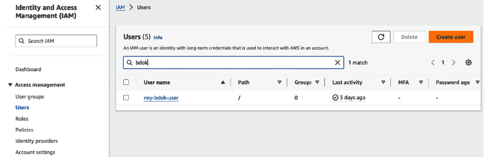

# 第三章：亲自实践 Kubernetes

在本章中，我们将通过部署本地和云端 Kubernetes 集群来实践 Kubernetes，并将示例应用程序部署到这些集群中。首先，你将使用 **Kubernetes in Docker**（**Kind**）部署一个本地集群。接着，你将部署在 AWS、GCP 和 Azure 上的托管 Kubernetes 集群。对于云选项，我们将提供部署集群所需的最基本账户设置。你可以自由选择你最熟悉的云服务提供商；核心的 Kubernetes 功能是相同的。

部署集群后，本章将分为两部分。第一部分，你将把在 *第一章* 中开发的简单 API 应用程序部署到 Kubernetes 集群中。你将学习如何将应用程序容器化，并与 Kubernetes 部署和服务一起工作，暴露你的应用程序。第二部分，你将把 *第一章* 中的简单数据处理批处理任务部署到 Kubernetes。这将演示如何使用 Kubernetes 运行一次性任务。

在本章结束时，你将拥有亲自将应用程序部署到 Kubernetes 的经验。你将理解如何打包和部署容器化应用程序，如何通过服务和入口暴露它们，并利用 Kubernetes 运行长期服务和批处理任务。有了这些技能，你将准备好将应用程序部署到生产 Kubernetes 环境中。

在本章中，我们将涵盖以下主要主题：

+   安装 `kubectl`

+   使用 Kind 部署本地 K8s 集群

+   部署 AWS EKS 集群

+   部署 Google Cloud GKE 集群

+   部署 Azure AKS 集群

+   在 Kubernetes 上运行你的 API

+   在 Kubernetes 上运行数据处理任务

让我们开始吧。

# 技术要求

在本章中，你需要安装 Docker（安装说明请参考 *第一章*）。我们将进行的主要实践活动是基于云的，但你也可以选择使用 Kind 在本地完成这些活动。在本章中，你将学习如何使用 Kind 或在云端（AWS、Google Cloud 和 Azure）部署 Kubernetes 集群。最后，你需要安装 `kubectl` 来与 Kubernetes 集群进行交互。在下一节中，你将学习如何安装它。

# 安装 kubectl

`kubectl` 是我们将用来向 Kubernetes 集群发送命令的命令行工具。你必须安装它，才能与集群进行交互（无论集群是本地运行还是在云端）：

+   要在 macOS 上使用 Homebrew 安装 `kubectl`，请使用以下命令：

    ```
    brew install kubectl
    ```

+   要在 Linux 发行版上安装 `kubectl`，你可以使用 `curl` 下载二进制可执行文件：

    ```
    curl -LO "https://dl.k8s.io/release/$(curl -L -s https://dl.k8s.io/release/stable.txt)/bin/linux/amd64/kubectl"
    ```

+   要在 Windows 系统上安装它，你可以使用 `chocolatey` 包管理器：

    ```
    choco install kubernetes-cli
    ```

从此以后，每个 `kubectl` 命令都是相同的，无论你使用的是哪个操作系统。要检查安装是否成功，运行以下命令。这将为你提供 `kubectl` 版本的格式化视图，显示你系统上正在运行的版本：

```
kubectl version –client –output=yaml
```

现在，让我们继续安装 `kind`。

# 使用 Kind 部署本地集群

部署本地 Kubernetes 集群对学习、测试和准备生产环境的部署非常有帮助，因为 Kubernetes 在任何运行环境下都是相同的。让我们从使用 Kind 部署一个单节点本地集群开始。

## 安装 kind

Kind 是一个允许你在本地机器上通过 Docker 容器运行 Kubernetes 的工具。除了轻便和易于设置外，Kind 还能提供符合 Kubernetes 标准的性能。Kind 集群通过了 Kubernetes 上游兼容性测试。

Kind 作为一个单一的二进制文件分发。你可以通过包管理器轻松安装它（确保你已经安装了 Docker）：

+   如果你使用的是 macOS，可以通过 Homebrew 安装 `kind`，方法如下：

    ```
    brew install kind
    ```

+   如果你使用的是 Linux 发行版（例如 Ubuntu），你可以通过 `curl` 安装它：

    ```
    $ [ $(uname -m) = x86_64 ] && curl -Lo ./kind https://kind.sigs.k8s.io/dl/v0.20.0/kind-linux-amd64
    $ chmod +x ./kind
    $ sudo mv ./kind /usr/local/bin/kind
    ```

+   如果你使用的是 Windows 系统，可以通过 `chocolatey` 安装它（[`chocolatey.org/packages/kind`](https://chocolatey.org/packages/kind)）：

    ```
    choco install kind
    ```

安装完成后，你可以通过运行以下命令来检查是否安装成功：

```
kind version
```

## 部署集群

现在，要部署一个单节点本地集群，只需运行以下命令：

```
kind create cluster
```

如果这是你第一次运行这个命令，Kind 会下载控制平面镜像，为它创建一个 Docker 容器，并为你配置一个单节点的 Kubernetes 集群。第一次运行时，由于要下载 Kubernetes 镜像，Kind 需要 1-2 分钟才能完成。之后的运行会快得多。

要验证集群是否已启动，运行以下命令：

```
kubectl cluster-info
```

这将打印本地集群的连接详情。就这样！你准备好了，可以开始了。

如果你愿意使用基于云的 Kubernetes 集群，在接下来的几节中，我们将部署一个 AWS、Google Cloud 和 Azure 上的集群。

# 部署 AWS EKS 集群

使用 `kubectl` 管理工作节点。

要开始使用 EKS，您需要一个 AWS 账户。请访问[`aws.amazon.com`](http://aws.amazon.com)并点击**创建 AWS 账户**。按照步骤注册新账户；请注意，您需要提供信用卡信息。AWS 提供免费的使用层，提供有限的资源，在 12 个月内无需付费。通常这足以运行小型工作负载，但不适用于 Kubernetes（尽管如果管理得当，费用不会很高）。AWS 每月对每个运行的集群收费 73 美元（假设集群运行整个月；如果只运行几天或几小时，计费将相应按比例减少），并且按所选机器的大小为每个节点收取相应费用。

设置账户后，您必须使用`root`用户访问它。我们需要创建一个具有特定权限的 IAM 用户，因为这是推荐的使用方法。在 AWS 控制台中，进入**IAM**服务，并点击左侧面板中的**用户**。您应该看到如下屏幕：



图 3.1 – IAM 中的用户菜单

然后，定义访问的用户名和密码。当您点击**下一步**时，选择直接附加策略（由于这是一个学习账户——此配置不适合生产环境）。从列表中选择**AdministratorAccess**（这将允许您在 AWS 中做任何事情），然后点击**下一步**进行审查。接着，点击**创建用户**按钮完成该过程。设置完成后，记得下载 AWS 密钥（AWS 访问密钥 ID 和 AWS 秘密访问密钥）。您需要这些密钥才能从您的计算机在 AWS 中进行身份验证。现在，注销控制台并使用新 IAM 用户重新登录，验证您的新 IAM 用户是否已正确配置。

在我们开始设置 Kubernetes 集群的工具之前，需要安装 AWS CLI 以便从本地终端与 AWS 进行交互。为此，请输入以下命令：

```
pip3 install awscli
```

安装完成后，我们运行`aws configure`来设置我们的 AWS 凭证：

```
aws configure
```

您将被提示输入您的 AWS 凭证（AWS 访问密钥 ID 和 AWS 秘密访问密钥）。根据提示复制并粘贴这些凭证。然后，配置会要求您选择默认的 AWS 区域。您可以选择`us-east-1`。对于输出格式，`json`是一个不错的选择。

这将把您的凭证保存为配置文件`~/.aws/credentials`。现在，您可以运行 AWS CLI 命令与 AWS 服务进行交互。

一旦你有了 AWS 账户并配置了 IAM 用户及 AWS CLI，安装 `eksctl` 命令行工具。此工具简化并自动化了部署 EKS 集群的过程。请访问 [`eksctl.io/installation/`](https://eksctl.io/installation/) 并按照安装说明操作。注意，文档页面列出了你部署集群所需的权限。**AdministratorAccess** 策略应包括你需要的所有权限。

安装完成后，检查 `eksctl` 是否正确设置，可以运行以下命令：

```
eksctl version
```

你应该能看到一些显示版本的输出。现在，让我们通过一个命令从零开始创建一个集群：

```
eksctl create cluster \
    --managed --alb-ingress-access \
    --node-private-networking --full-ecr-access \
    --name=studycluster \
    --instance-types=m6i.xlarge \
    --region=us-east-1 \
    --nodes-min=2 --nodes-max=4 \
    --nodegroup-name=ng-studycluster
```

此命令的基础是 `eksctl create cluster`。从第二行开始，我们正在陈述一些选项。让我们来看看它们：

+   `--managed` 选项告诉 `eksctl` 创建一个完全托管的集群。它将处理 EKS 控制平面、节点组、网络等的创建。

+   `--alb-ingress-access` 选项将配置集群，允许来自负载均衡器的入站流量。这是负载均衡器类型服务所必需的。

+   `--node-private-networking` 选项启用工作节点之间的私有网络连接。节点将仅拥有私有 IP 地址。

+   `--full-ecr-access` 选项为工作节点提供对 ECR 容器镜像库的完全访问权限。这是拉取容器镜像所需的。

+   `--name` 选项为集群设置一个用户定义的名称。

+   `--instance-type` 选项配置用于工作节点的实例类型。在这种情况下，我们选择使用 `m6i.xlarge` EC2 实例。

+   `--region` 选项设置 AWS 区域——在本例中为北弗吉尼亚（us-east-1）。

+   `--nodes-min` 和 `--nodes-max` 选项为节点组设置自动扩缩规则。在这里，我们将最小节点数设置为 `2` 个实例，最大节点数设置为 `4` 个实例。

+   `--nodegroup` 选项将节点组的名称设置为 `ng-studycluster`。

这将大约需要 10-15 分钟来完成。`eksctl` 处理创建 VPC、子网、安全组、IAM 策略以及运行 EKS 集群所需的其他 AWS 资源的所有细节。

在后台，`eksctl` 使用 CloudFormation 来配置 AWS 基础设施。`eksctl` 命令根据提供的参数生成一个 CloudFormation 模板，然后将此模板部署，以创建所需的资源。

以下是一些由 `eksctl` 创建的关键组件：

+   **虚拟私有云（VPC）**：一个 VPC 网络，您的集群资源将在其中运行。这包括跨多个可用区的公有和私有子网。

+   **EKS 集群**：Kubernetes 控制平面，包括 API 服务器、etcd、控制器管理器、调度器等。由 AWS 运营和管理。

+   **工作节点组**：包含将运行 Kubernetes 工作负载的 EC2 实例的托管节点组。

+   **安全组**：控制集群访问的防火墙规则。

+   **IAM 角色和策略**：访问策略，允许工作节点和 Kubernetes 访问 AWS API 和资源

一旦`eksctl`命令完成，您的 EKS 集群就可以使用了。您可以通过运行以下命令来查看集群的详细信息：

```
eksctl get cluster --name studycluster --region us-east-1
```

接下来，我们将使用 Google Cloud 创建一个 Kubernetes 集群。

# 部署一个 Google Cloud GKE 集群

要在 Google Cloud 上部署一个 Kubernetes 集群，我们需要设置一个 Google Cloud 账户并安装`gcloud` **命令行接口**（**CLI**）。为此，请访问 [`cloud.google.com/`](https://cloud.google.com/)，点击**开始免费**以创建一个新账户。按照指示操作，当您的新账户创建完成后，进入 [`console.cloud.google.com/`](https://console.cloud.google.com/) 控制台。在这里，您可以管理所有的 Google Cloud 资源。

在我们部署 GKE 集群之前，我们需要启用必要的 API。在左上角点击导航菜单图标，进入`Kubernetes Engine API`并点击它。确保它已启用。启用`gcloud` CLI 也是一个好的实践，这将使我们能够通过命令行管理 Google Cloud 资源。

`gcloud` CLI 可以安装在 Linux、macOS 和 Windows 上。在 Linux 发行版中，您可以通过以下方式下载安装脚本：

```
wget https://dl.google.com/dl/cloudsdk/release/google-cloud-sdk.tar.gz
```

然后，解压缩存档：

```
tar -xzf google-cloud-sdk.tar.gz
```

接下来，运行安装脚本：

```
./google-cloud-sdk/install.sh
```

对于 macOS 安装，您可以使用 Homebrew：

```
brew install --cask google-cloud-sdk
```

注意

对于 Windows，您可以从 [`cloud.google.com/sdk/docs/install#windows`](https://cloud.google.com/sdk/docs/install#windows) 下载`gcloud`安装程序。

安装完成后，您可以通过运行以下命令来检查：

```
gcloud --version
```

安装完成后，您必须初始化 CLI：

```
gcloud init
```

这个过程将指导您使用 Google 账户登录并配置`gcloud`。

现在`gcloud`已经安装并初始化完毕，我们可以在 GKE 上部署 Kubernetes 集群。首先，选择一个 Google Cloud 项目来部署该集群。您可以创建一个新项目并将其设置为活动项目，如下所示：

```
gcloud projects create [PROJECT_ID]
gcloud config set project [PROJECT_ID]
```

然后，您必须设置一个计算区域来部署集群。在这里，我们将在`us-central1-a`区域进行操作：

```
gcloud config set compute/zone us-central1-a
```

现在，我们可以通过运行以下命令来部署一个 Kubernetes 集群：

```
gcloud container clusters create studycluster --num-nodes=2
```

`–num-nodes`参数控制将要部署的节点数量。请注意，这个过程需要几分钟时间，因为 Google Cloud 会设置所有集群组件、网络等。部署完成后，收集凭证以便与集群进行交互：

```
gcloud container clusters get-credentials studycluster
```

这将把凭证保存到您的 Kubernetes 配置文件中。最后，您可以通过运行以下命令来验证是否可以连接到集群：

```
kubectl cluster-info
```

您应该会看到有关 Kubernetes 主节点和云提供商的信息。就这样！您现在已经在 Google Cloud 上运行了一个完全功能的 Kubernetes 集群。

接下来，我们将使用微软的 Azure 云执行相同的操作。

# 部署一个 Azure AKS 集群

在本节中，我们将演示如何使用 **Azure Kubernetes 服务**（**AKS**）部署 Kubernetes 集群的步骤。要开始使用 AKS，你需要一个 Azure 账户。首先，访问 [`azure.com`](https://azure.com)，点击 **免费试用 Azure**，然后点击 **开始免费试用**。这样你就可以在 Azure 上开始免费的试用账户了。你需要提供一些基本信息，如你的电子邮件和电话号码，以完成账户设置。确保使用有效的电子邮件地址，因为 Azure 会发送验证码来完成注册过程。账户创建完成后，你将进入 Azure 门户。这是用于管理你所有 Azure 资源的主面板。

在这一点上，建议在本地机器上安装 Azure CLI。Azure CLI 允许你通过命令行管理 Azure 资源。请按照 [`docs.microsoft.com/en-us/cli/azure/install-azure-cli`](https://docs.microsoft.com/en-us/cli/azure/install-azure-cli) 上的说明，在 Linux、macOS 或 Windows 上安装它。

安装 CLI 后，运行 `az login` 并按照提示进行身份验证。这样你就可以从终端运行 Azure 命令了。设置好 Azure 账户并安装好 CLI 后，你就可以准备部署 AKS 集群了。

首先，你必须创建一个资源组。Azure 中的资源组允许你将 AKS 集群、存储账户、虚拟网络等资源逻辑地分组。让我们从为 AKS 集群创建一个资源组开始：

```
az group create --name myResourceGroup --location eastus
```

这将会在 `eastus` 区域创建一个名为 `myResourceGroup` 的资源组。你可以指定任何靠近你的区域。现在，我们可以在这个资源组中创建 AKS 集群。创建集群的基本命令如下：

```
az aks create --resource-group myResourceGroup --name studycluster--node-count 2 --generate-ssh-keys
```

这将会创建一个名为 `studycluster` 的 Kubernetes 集群，包含两个节点。我们会自动生成 SSH 密钥以设置访问节点的权限。你还可以指定一些其他选项，如下所示：

+   `--node-vm-size`：节点虚拟机的大小。默认为 `Standard_D2s_v3`。

+   `--kubernetes-version`：要用于集群的 Kubernetes 版本。默认为最新版本。

+   `--enable-addons`：启用附加功能，如监控、虚拟节点等。

`az aks create` 命令会自动处理 Kubernetes 集群、虚拟机、网络、存储等的设置。该过程可能需要 5-10 分钟才能完成。

完成后，你可以通过运行以下命令连接到集群：

```
kubectl get nodes
```

这将显示属于你的 AKS 集群的节点。到此为止，你已经成功部署了 AKS 集群，并准备在其上部署我们的 API 和批处理任务。

# 在 Kubernetes 上运行你的 API

从这一点开始，你可以选择你最喜欢的 Kubernetes 部署类型（本地或基于云的）来运行我们的 API。以下示例将使用 AWS，但你也可以选择其他云提供商。随意选择。

现在，到了重拾我们在 *第一章* 中构建的 API 并将其推向生产环境的时候了。我们开发了一个简单的 API，当你请求时，它可以向你打招呼或回答一个（非常酷的）笑话。

我们已经有了 API 的代码（[`github.com/PacktPublishing/Bigdata-on-Kubernetes/blob/main/Chapter01/app/main.py`](https://github.com/PacktPublishing/Bigdata-on-Kubernetes/blob/main/Chapter01/app/main.py)）以及构建容器镜像的 Dockerfile（[`github.com/PacktPublishing/Bigdata-on-Kubernetes/blob/main/Chapter01/Dockerfile`](https://github.com/PacktPublishing/Bigdata-on-Kubernetes/blob/main/Chapter01/Dockerfile)）。

为了让 Kubernetes 能够访问镜像，它应该在容器注册表中可用。每个云服务提供商都有一个注册表，但为了简化起见，我们使用 DockerHub（[`hub.docker.com/`](https://hub.docker.com/)）。只要你的镜像是公开的，你可以免费存储任意数量的镜像。让我们开始吧：

1.  要开始，请在终端中输入以下命令：

    ```
    docker login
    docker build –t <USERNAME>/jokeapi:v1 .
    ```

    记得将 `<USERNAME>` 替换为你的真实 DockerHub 用户名。我们将镜像名称更改为 `jokeapi`，以便更容易找到。如果你在 Mac M1 上运行 Docker，那么设置 `--platform` 参数非常重要，以使容器镜像与 AMD64 机器兼容。为此，运行以下命令：

    ```
    docker build --platform linux/amd64 –t <USERNAME>/jokeapi:v1 .
    ```

1.  现在，我们可以将镜像推送到 DockerHub：

    ```
    docker push <USERNAME>/jokeapi:v1
    ```

1.  访问 [`hub.docker.com/`](https://hub.docker.com/) 并登录。你应该会在 **Repositories** 部分看到你的镜像。

现在，镜像已可用于 Kubernetes。接下来，我们需要定义一些 Kubernetes 资源来运行我们的 API。我们将创建一个部署和一个服务。

## 创建部署

按照以下步骤操作：

1.  首先，我们将创建部署。这指定了要运行的 Pod 副本数量以及它们的配置：

    **deployment_api.yaml**

    ```
    apiVersion: apps/v1
    kind: Deployment
    metadata:
        name: jokeapi
    spec:
        replicas: 2
        selector:
        matchLabels:
          app: jokeapi
        template:
        metadata:
          labels:
            app: jokeapi
        spec:
          containers:
          - name: jokeapi
            image: <USERNAME>/jokeapi:v1
            imagePullPolicy: Always
            ports:
            - containerPort: 8087
    ```

    这将使用我们构建的 Docker 镜像运行两个 Pod 副本。请注意，我们正在容器中打开端口 `8087`。这与 Dockerfile 中的 `EXPOSE` 命令类似。

1.  接下来，我们将创建一个命名空间来分隔和组织我们的资源，并应用部署：

    ```
    kubectl create namespace jokeapi
    kubectl apply -f deployment_api.yaml -n jokeapi
    ```

1.  这将创建部署并在 `jokeapi` 命名空间中创建两个 Pod 副本。我们可以通过运行以下命令检查一切是否正常：

    ```
    kubectl get deployments -n jokeapi
    ```

    你应该会看到以下输出：

    ```
    NAME      READY   UP-TO-DATE    AVAILABLE      AGE
    jokeapi    0/2        2              0          2s
    ```

1.  现在，让我们检查 Pods 是否正常运行：

    ```
    kubectl get pods -n jokeapi
    ```

    你应该会看到类似如下的输出：

    ```
    NAME                       READY   STATUS    RESTARTS
    jokeapi-7d9877598d-bsj5b    1/1     Running    0
    jokeapi-7d9877598d-qb8vs    1/1     Running    0
    ```

## 创建一个服务

按照以下步骤操作：

1.  在这里，我们将指定一个服务，以便在集群中暴露 Pods：

    **service_api.yaml**

    ```
    apiVersion: v1
    kind: Service
    metadata:
        name: jokeapi
    spec:
        selector:
        app: jokeapi
        ports:
        - protocol: TCP
          port: 80
          targetPort: 8087
    ```

    这将创建一个 ClusterIP 服务，在集群的内部 IP 地址上暴露 API Pods。请注意，`spec` 部分没有指定 `type` 参数，因此默认为 ClusterIP。

1.  为了使 API 可供外部访问，我们可以创建一个负载均衡器（这在本地 `kind` 集群中不可行，只能在云基础集群中实现）：

    **lb_api.yaml**

    ```
    apiVersion: v1
    kind: Service
    metadata:
        name: jokeapi
    spec:
        selector:
        app: jokeapi
        type: LoadBalancer
        ports:
        - protocol: TCP
          port: 80
          targetPort: 8087
    ```

1.  现在，`type` 定义已设置，这段代码将定义一个负载均衡器并分配一个外部 IP。接下来，我们将部署负载均衡器服务：

    ```
    kubectl apply -f lb_api.yaml -n jokeapi
    ```

1.  现在，我们可以测试 API 是否可访问。首先，我们必须通过运行以下命令来获取负载均衡器的 URL（在这里，我们使用的是 AWS）：

    ```
    kubectl get services -n jokeapi
    ```

    你应该看到以下输出：

    ```
    NAME      TYPE          CLUSTER-IP      EXTERNAL-IP
    jokeapi  LoadBalancer  10.100.251.249  <DNS>.amazonaws.com
    ```

1.  复制 `EXTERNAL-IP` 下的内容，将 URL 粘贴到浏览器中，并添加 `/joke`。例如，在我的实现中，我得到了 `ab1cdd20ce1a349bab9af992211be654-1566834308.us-east-1.elb.amazonaws.com/joke`。你应该能看到屏幕上的以下响应：

    ```
    {"joke":"Have you heard about the chocolate record player? It sounds pretty sweet."}
    ```

成功！我们在浏览器中看到（一个很棒的）笑话！现在，我们将使用 ingress 来部署 API，而不是负载均衡器（仅限云端集群）。

## 使用 ingress 访问 API

对于这次部署，我们将使用 NGINX ingress 控制器，并将其连接到 AWS 提供的负载均衡器（如果你使用其他云提供商，过程非常相似）。请按以下步骤操作：

1.  首先，我们将为 NGINX 创建一个新的命名空间，并在 Kubernetes 上部署控制器：

    ```
    kubectl create namespace ingress-nginx
    kubectl apply -f https://raw.githubusercontent.com/kubernetes/ingress-nginx/controller-v1.1.3/deploy/static/provider/baremetal/deploy.yaml -n ingress-nginx
    ```

1.  这将使用官方清单部署 NGINX 控制器。现在，我们必须在部署中编辑一行，确保它使用负载均衡器作为 ingress 部署，而不是默认的 `NodePort`。在终端中输入以下内容：

    ```
    kubectl edit service ingress-nginx-controller -n ingress-nginx
    ```

1.  查找 `spec.type` 字段并将其值更改为 `LoadBalancer`。保存文件后，让我们检查已部署的服务：

    ```
    kubectl get services -n ingress-nginx
    ```

1.  我们将看到 `ingress-nginx-controller` 服务被设置为 `LoadBalancer` 并且有一个与之相关的外部 IP 地址。现在，设置指向这个 ingress 控制器的 ingress 变得简单了。首先，我们将在 `service_api.yaml` 文件中创建一个定义好的服务。这个服务应该设置为 ClusterIP 类型（请参见上一节中的代码）。然后，我们可以用以下代码定义一个 ingress：

    **ingress.yaml**

    ```
    apiVersion: networking.k8s.io/v1
    kind: Ingress
    metadata:
        name: jokeapi-ingress
    spec:
        rules:
        - http:
          paths:
          - path: /
            pathType: Prefix
            backend:
              service:
                name: jokeapi
                port:
                  number: 80
    ```

1.  这个 ingress 会将外部流量路由到内部服务 IP。当 ingress 获得外部 IP 后，我们应该能够通过访问该 URL 来访问我们的 API。输入以下内容：

    ```
    kubectl get services –n ingress-nginx
    ```

1.  获取控制器的外部 URL 并在其后添加 `/joke`：

    ```
    {"joke":"What do you call a fish wearing a bowtie? Sofishticated."}
    ```

Voilà！在下一节中，我们将在 Kubernetes 上部署我们的数据处理任务。

# 在 Kubernetes 中运行数据处理任务

在这一节中，我们将在 Kubernetes 上部署来自 *第一章* 的简单数据处理任务。我们已经开发了这个任务（[`github.com/PacktPublishing/Bigdata-on-Kubernetes/blob/main/Chapter01/run.py`](https://github.com/PacktPublishing/Bigdata-on-Kubernetes/blob/main/Chapter01/run.py)）并且编写了一个 Dockerfile，将其打包为容器镜像（[`github.com/PacktPublishing/Bigdata-on-Kubernetes/blob/main/Chapter01/Dockerfile_job`](https://github.com/PacktPublishing/Bigdata-on-Kubernetes/blob/main/Chapter01/Dockerfile_job)）。

现在，我们必须构建一个 Docker 镜像并将其推送到 Kubernetes 可访问的仓库。

```
docker build --platform linux/amd64 –f Dockerfile_job –t <USERNAME>/dataprocessingjob:v1 .
docker push <USERNAME>/dataprocessingjob:v1
```

现在，我们可以创建一个 Kubernetes 作业来运行我们的数据处理任务。以下是一个示例作业清单：

job.yaml

```
apiVersion: batch/v1
kind: Job
metadata:
    name: dataprocessingjob
spec:
    template:
    spec:
      containers:
      - name: dataprocessingjob
        image: <USERNAME>/dataprocessingjob:v1
      restartPolicy: Never
    backoffLimit: 4
```

这配置了一个名为`dataprocessingjob`的作业，它将运行一个副本的`<USERNAME>/dataprocessingjob:v1`镜像。现在，我们可以创建一个新的命名空间并像这样部署作业：

```
kubectl create namespace datajob
kubectl apply -f job.yaml -n datajob
```

这定义了一个名为`dataprocessingjob`的作业，它将使用我们的 Docker 镜像运行一个单独的 Pod。我们设置`restartPolicy: Never`，因为我们希望容器运行完成，而不是重新启动。

我们可以像这样检查作业的状态：

```
kubectl get jobs –n datajob
```

作业完成后，我们将看到`1/1`：

```
NAME                COMPLETIONS    DURATION      AGE
dataprocessingjob      1/1           8s          11s
```

要查看我们作业的日志，可以在由作业创建的 Pod 上使用`kubectl logs`：

```
kubectl get pods -n datajob
kubectl logs <NAMEOFTHEPOD> -n datajob
```

在我的案例中，我输入了以下内容：

```
kubectl logs dataprocessingjob-g8lkm -n datajob
```

我得到以下结果：

```
Index([0, 1, 2, 3, 4, 5, 6, 7, 8, 'newcolumn'], dtype='object')
   0    1   2   3    4     5      6   7  8    newcolumn
0  6  148  72  35    0  33.6  0.627  50  1       67.2
1  1   85  66  29    0  26.6  0.351  31  0       53.2
2  8  183  64   0    0  23.3  0.672  32  1       46.6
3  1   89  66  23   94  28.1  0.167  21  0       56.2
4  0  137  40  35  168  43.1  2.288  33  1       86.2
(768, 10)
```

这将打印我们 Python 程序的应用程序输出，以便我们验证它是否正确运行。就这样！你在 Kubernetes 内部运行了一个数据处理作业！

# 总结

在这一章中，我们通过实践经验部署了 Kubernetes 集群并在其中运行了应用程序。我们从安装`kubectl`并使用 Kind 部署了一个本地 Kubernetes 集群开始。然后，我们在 AWS、GCP 和 Azure 上部署了托管的 Kubernetes 集群。虽然云提供商有所不同，但 Kubernetes 提供了一个一致的环境来运行容器。

在设置好集群后，我们将*第一章*中的简单 API 应用程序容器化并部署。这展示了如何定义 Kubernetes 部署、服务、入口和负载均衡器来运行 Web 应用程序。然后，我们将*第一章*中的数据处理批量作业作为 Kubernetes 作业进行了部署。这向我们展示了如何利用 Kubernetes 运行一次性任务和作业。

通过完成部署集群和应用程序的全过程，你现在已经有了 Kubernetes 的第一手经验。你了解如何将应用程序打包为容器，通过服务、入口或负载均衡器暴露它们，并利用 Kubernetes 的抽象，如部署和作业。有了这些技能，你就具备了在开发或生产环境中运行 Kubernetes 上的应用程序和工作负载的能力。

在下一章中，我们将更深入地了解现代数据栈，理解每项技术，为什么它们很重要，以及它们如何相互关联以构建数据解决方案。

# 第二部分：大数据栈

在这一部分，你将深入了解构成**现代数据栈**的核心技术，这是一组用于构建强大且可扩展的数据管道的工具和架构。你将深入理解 Lambda 架构及其组件，并获得一些使用强大的大数据工具（如 Apache Spark、Apache Airflow 和 Apache Kafka）的实践经验。

这一部分包含以下章节：

+   *第四章*，*现代数据栈*

+   *第五章*，*使用 Apache Spark 进行大数据处理*

+   *第六章*, *用于构建流水线的 Apache Airflow*

+   *第七章*, *用于实时事件和数据摄取的 Apache Kafka*
