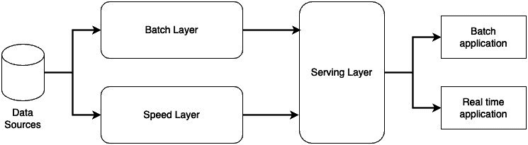
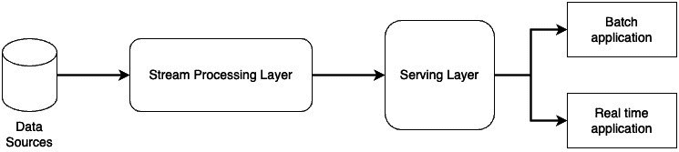
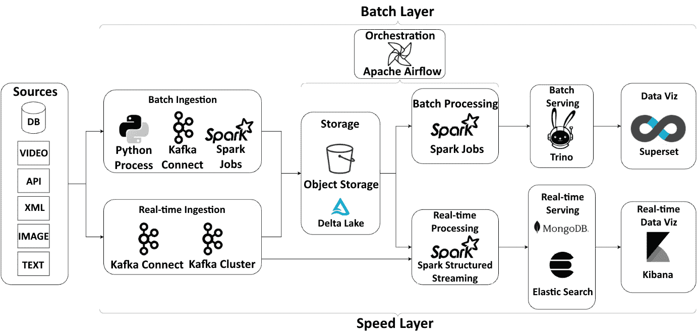

# 4

# 现代数据架构

在本章中，我们将探讨为构建可扩展和灵活的数据平台而出现的现代数据架构。具体来说，我们将介绍 Lambda 架构模式，并讨论它如何结合批量数据分析实现实时数据处理。你将了解 Lambda 架构的关键组件，包括用于历史数据的批处理层、用于实时数据的速度处理层，以及用于统一查询的服务层。我们还将讨论如何利用 Apache Spark、Apache Kafka 和 Apache Airflow 等技术，在大规模环境中实现这些层。

本章结束时，你将理解构建现代数据湖的核心设计原则和技术选择。你将能够解释 Lambda 架构相比传统数据仓库设计的优势。最重要的是，你将拥有开始构建自己现代数据平台的概念基础。

所涵盖的概念将帮助你以低延迟处理流数据，同时在历史数据上执行复杂的分析工作负载。你将获得利用开源大数据技术构建可扩展、灵活的数据管道的实践经验。无论你需要实时分析、机器学习模型训练，还是临时分析，现代数据架构模式都能帮助你支持多样化的数据需求。

本章提供了从传统数据仓库过渡到下一代数据湖的蓝图。通过这些课程，你将掌握构建现代数据平台所需的关键架构原则、组件和技术，以便在 Kubernetes 上实现。

在本章中，我们将涵盖以下主要内容：

+   数据架构

+   大数据数据湖设计

+   实现湖屋架构

# 数据架构

现代数据架构在过去十年中经历了显著的发展，使得组织能够利用大数据的力量并推动先进的数据分析。两种关键的架构模式是 Lambda 架构和 Kappa 架构。在本节中，我们将探讨这两种架构，并了解它们如何为构建我们的大数据环境提供有用的框架。

## Lambda 架构

Lambda 架构是一种大数据处理架构模式，平衡了批处理和实时处理方法。其名称源自 Lambda 计算模型。Lambda 架构在 2010 年代初期变得流行，成为一种以经济高效和灵活的方式处理大规模数据的方法。

Lambda 架构的核心组件包括以下内容：

+   **批处理层**：负责管理主数据集。该层在固定间隔内批量摄取和处理数据，通常为每 24 小时一次。数据处理完成后，批处理视图被视为不可变的，并被存储。

+   **速度层**：负责处理尚未由批处理层处理的最新数据。此层在数据到达时实时处理数据，以提供低延迟视图。

+   **服务层**：负责通过合并批处理层和速度层的视图来响应查询。

这些组件在*图 4.1*的架构图中有所展示：

图 4.1 – Lambda 架构设计

Lambda 架构的主要优点是它提供了一种混合方法，将大量历史数据视图（批处理层）与最新数据的视图（速度层）结合在一起。这使得分析师可以以统一的方式查询最新和历史数据，从而获得快速的洞察。

批处理层针对吞吐量和效率进行了优化，而速度层则针对低延迟进行了优化。通过分离各自的职责，该架构避免了每次查询都需要运行大规模、长期运行的批处理任务。相反，查询可以利用预计算的批处理视图，并通过速度层的最新数据进行增强。

在构建于云基础设施上的现代数据湖中，Lambda 架构提供了一个灵活的蓝图。云存储层作为基础数据湖，用于存储数据。批处理层利用分布式数据处理引擎，如 Apache Spark，生成批处理视图。速度层流式处理并处理最新数据，服务层运行高效的查询引擎，如 Trino，用于分析数据。

## Kappa 架构

Kappa 架构作为一种替代方法，最近由 Lambda 架构的主要创始人提出。Kappa 架构的主要区别在于，它旨在通过消除单独的批处理层和速度层来简化 Lambda 模型。

相反，Kappa 架构通过单一的流处理路径来处理所有数据。其关键组件包括以下内容：

+   **流处理层**：负责将所有数据作为流进行摄取和处理。此层处理历史数据（通过重放日志/文件）以及新来的数据。

+   **服务层**：负责通过访问流处理层生成的视图来响应查询。

我们可以在*图 4.2*中看到一个可视化表示：

图 4.2 – Kappa 架构设计

Kappa 架构的核心是一个不可变的、仅附加的日志，供所有数据使用工具（如 Kafka 和事件溯源范式）使用。流数据直接被摄取到日志中，而不是通过独立的管道。该日志确保数据有序、无法篡改，并支持自动重放——这些是流处理和批处理的关键支持功能。

Kappa 架构的优势在于其设计的简单性。通过单一的处理路径，不需要管理独立的批处理和实时系统。所有数据都通过流处理进行处理，这也使得历史数据的重新处理和分析变得更加灵活。

其权衡之处在于，流处理引擎可能无法提供与最先进的批处理引擎相同的规模和吞吐量（尽管现代流处理器已不断发展，以处理非常大的工作负载）。另外，尽管 Kappa 设计可能更简单，但其架构本身可能比 Lambda 更难实现和维护。

对于数据湖，Kappa 架构与大量原始数据的特性非常契合。云存储层充当原始数据的骨干。然后，像 Apache Kafka 和 Apache Flink 这样的流处理器接收、处理并生成分析准备好的数据视图。服务层利用 Elasticsearch 和 MongoDB 等技术来推动分析和仪表板的展示。

## 比较 Lambda 和 Kappa

Lambda 和 Kappa 架构采取不同的方法，但在准备、处理和分析大数据集方面解决了相似的问题。其主要区别列于*表 4.1*：

|  | **Lambda** | **Kappa** |
| --- | --- | --- |
| 复杂度 | 管理独立的批处理和实时系统 | 通过流合并处理 |
| 重新处理 | 重新处理历史批次 | 依赖于流重放和算法 |
| 延迟 | 在速度层中对最近数据有较低的延迟 | 所有数据的延迟相同 |
| 吞吐量 | 利用优化吞吐量的批处理引擎 | 将所有数据作为流处理 |

表 4.1 – Lambda 和 Kappa 架构的主要区别

在实践中，现代数据架构通常将这些方法结合使用。例如，Lambda 的批处理层可能每周或每月运行一次，而实时流则填补空白。Kappa 可能会在流中利用小批次来优化吞吐量。平衡延迟、吞吐量和重新处理的核心思想是相同的。

对于数据湖，Lambda 提供了一个经过验证的蓝图，而 Kappa 提供了一个强大的替代方案。虽然有人可能认为 Kappa 提供了更简化的操作，但它难以实现，并且随着规模的扩大，其成本可能快速增长。Lambda 的另一个优势是它完全可以适应需求。如果没有必要进行数据流处理（或者没有经济可行性），我们可以仅实现批处理层。

数据湖构建者应该理解每种架构的关键原则，以便根据他们的业务、分析和运营需求设计最佳架构。通过利用云基础设施的规模和灵活性，现代数据湖可以实施这些模式，以处理当今的数据量并推动高级分析。

在下一节，我们将深入探讨 Lambda 架构方法以及它如何应用于创建高性能、可扩展的数据湖。

# 大数据的数据湖设计

在本节中，我们将对比数据湖与传统数据仓库，并涵盖核心设计模式。这将为后面“如何做”的工具和实施部分奠定基础。让我们从现代数据架构的基线——数据仓库开始。

## 数据仓库

数据仓库几十年来一直是商业智能和分析的支柱。数据仓库是一个集成多个来源的数据存储库，经过组织和优化，旨在用于报告和分析。

传统数据仓库架构的关键方面如下：

+   **结构化数据**：数据仓库通常只存储结构化数据，例如来自数据库和 CRM 系统的交易数据。不包括来自文档、图片、社交媒体等的非结构化数据。

+   **写时模式**：数据结构和模式在数据仓库设计时就已定义。这意味着添加新的数据源和改变业务需求可能会很困难。

+   **批处理**：数据**提取、转换和加载**（**ETL**）是按计划批量从源系统提取的，通常是每日或每周。这会引入访问最新数据时的延迟。

+   **与源系统分离**：数据仓库作为一个独立的数据存储，用于优化分析，与源事务系统分开。

在大数据时代，数据量、种类和速度的增长暴露了传统数据仓库架构的一些局限性。

它无法以具有成本效益的方式存储和处理来自新来源（如网站、移动应用、物联网设备和社交媒体）的庞大非结构化和半结构化数据。此外，它缺乏灵活性——添加新的数据源需要更改模式和 ETL，这使得适应变得缓慢且昂贵。最后，批处理无法快速提供足够的洞察力，以满足实时个性化和欺诈检测等新兴需求。

这引发了数据湖架构的产生，作为应对，我们将在接下来的部分详细讨论。

## 大数据和数据湖的崛起

为应对上述挑战，新的数据湖方法使得能够大规模处理任何类型的数据存储，使用诸如 Hadoop HDFS 或云对象存储等负担得起的分布式存储。数据湖以读取时模式运行，而不是预先定义的模式。数据以原生格式存储，只有在读取时才会解释模式。它包括通过诸如 Apache Kafka 等工具捕获、存储和访问实时流数据。此外，还有一个庞大的开源生态系统，支持可扩展的处理，包括 MapReduce、Spark 和其他工具。

数据湖是一个集中式的数据存储库。它旨在以原始格式存储数据，这样可以灵活地按需分析不同类型的数据（表格、图像、文本、视频等），而无需预先确定数据的使用方式。由于它是基于对象存储实现的，因此可以存储来自不同来源、在不同时间间隔下的数据（有些数据可能每天更新，有些每小时更新，甚至有些是接近实时的数据）。数据湖还将存储和处理技术分开（与数据仓库不同，数据仓库将存储和处理整合在一个独特的结构中）。通常，数据处理涉及分布式计算引擎（如 Spark），用于处理 TB 级别的数据。

数据湖提供了一种以成本效益的方式存储组织面临的庞大而多样化数据量并进行分析的方式。然而，它们也面临一些挑战：

+   如果没有治理，数据湖有可能变成无法访问的数据*沼泽*。数据需要进行分类并提供上下文，以便发现。

+   准备原始数据进行分析仍然涉及在分散的孤立工具中进行复杂的数据处理。

+   大多数分析仍然需要先对数据进行建模、清洗和转换——就像数据仓库一样。这种做法导致了重复劳动。

+   数据湖中使用的基于对象存储的系统无法执行行级修改。每当表格中的一行需要修改时，整个文件都必须重写，这会大大影响处理性能。

+   在数据湖中，没有高效的模式控制。虽然按需读取模式使得新的数据源更容易加入，但无法保证因为数据摄取失败，表格的结构不会发生变化。

近年来，为了克服这些新挑战，业界进行了大量努力，将两者的优势结合在一起，这就是现在所称的数据湖仓（data lakehouse）。让我们深入了解这一概念。

## 数据湖仓的兴起

在 2010 年代，随着 Delta Lake、Apache Hudi 和 Apache Iceberg 等新兴开源技术的出现，“湖仓”（lakehouse）这一术语开始受到关注。湖仓架构旨在结合数据仓库和数据湖的最佳特性：

+   支持像数据湖一样在任何规模上处理多种结构化和非结构化数据

+   提供像数据仓库一样对原始数据和精炼数据进行高效的 SQL 分析

+   对大规模数据集的**ACID**（**原子性、一致性、隔离性和持久性**）事务

数据湖仓允许以开放格式同时存储、更新和查询数据，同时确保数据在大规模环境下的正确性和可靠性。它支持以下功能：

+   模式强制执行、演化和管理

+   行级*更新插入*（更新+插入）和删除以实现高效的可变性

+   按时间点一致性视图跨历史数据

使用湖屋架构，整个分析生命周期——从原始数据到清洗和建模后的数据，再到策划的数据产品——都可以在一个地方直接访问，适用于批处理和实时用例。这提升了敏捷性，减少了重复劳动，并通过生命周期使数据的重用和再利用更加容易。

接下来，我们将探讨数据在这一架构概念中的结构化方式。

### 湖屋存储层

与数据湖架构类似，湖屋（Lakehouse）也建立在云对象存储之上，通常分为三个主要层次：铜层、银层和金层。这种方法被称为“奖章”设计。

铜层是原始数据摄取层。它包含来自各种来源的原始数据，存储方式与接收到时完全相同。数据格式可以是结构化的、半结构化的或非结构化的。例如，日志文件、CSV 文件、JSON 文档、图片、音频文件等。

该层的目的是以最完整和最原始的格式存储数据，作为分析用途的真相版本。在这一层不会进行任何转换或聚合。它作为构建更高层次的策划和聚合数据集的源数据。

银层包含精心策划、精炼和标准化的数据集，这些数据集经过丰富、清洗、集成，并符合业务标准。数据具有一致的模式，能够进行查询以支持分析。

该层的目的是准备高质量的、可分析的数据集，这些数据集可以为下游分析和机器学习模型提供支持。这涉及到数据整理、标准化、去重、联合不同数据源等。

该结构可以是表格、视图或优化查询的文件。例如，Parquet 文件、Delta Lake 表、物化视图等。元数据被添加以启用数据发现。

金层包含聚合后的数据模型、指标、关键绩效指标（KPI）和其他衍生数据集，支持商业智能和分析仪表板。

该层的目的是为业务用户提供现成的策划数据模型，用于报告和可视化。这涉及到预计算指标、聚合、业务逻辑等，以优化分析工作负载。

该结构通过列存储、索引、分区等优化分析。示例包括聚合、数据立方体、仪表板和机器学习模型。元数据将其与上游数据连接。

有时，在铜层之前，通常会有一个额外的层——着陆区。在这种情况下，着陆区接收原始数据，所有清洗和结构化工作都在铜层完成。

在接下来的章节中，我们将看到如何使用现代数据工程工具将数据湖屋设计付诸实践。

# 实施湖屋架构

*图 4.3* 显示了在 Lambda 设计中实现数据湖仓架构的可能方式。该图显示了常见的数据湖仓层以及在 Kubernetes 上实现这些层所使用的技术。左侧的第一组代表了与此架构一起工作的可能数据源。此方法的一个关键优势是它能够摄取和存储来自多种来源和格式的数据。如图所示，数据湖可以连接并整合来自数据库的结构化数据，以及来自 API 响应、图像、视频、XML 和文本文件等的非结构化数据。这种按需模式（schema-on-read）允许原始数据快速加载，而无需提前建模，从而使架构具有高度的可扩展性。当需要分析时，数据湖仓层可以使用按查询模式（schema-on-query）在一个地方查询所有这些数据集。这使得从不同来源整合数据以获得新见解变得更加简便。加载与分析的分离还使得随着对数据的新理解的出现，能够进行迭代分析。总体而言，现代数据湖仓旨在快速接纳多结构和多源数据，同时使用户能够灵活地分析这些数据。

首先，我们将仔细查看*图 4.3*顶部显示的批量层。

## 批量摄取

设计的第一层是批量摄取过程。对于所有的非结构化数据，定制的 Python 处理过程是首选。可以开发自定义代码来从 API 端点查询数据，读取 XML 结构，处理文本和图像。对于数据库中的结构化数据，我们有两种数据摄取选择。首先，Kafka 和 Kafka Connect 提供了一种简单配置数据迁移任务并连接到大量数据库的方法。Apache Kafka 是一个分布式流处理平台，允许发布和订阅记录流。在其核心，Kafka 是一个基于发布-订阅模型构建的持久化消息代理。Kafka Connect 是 Kafka 附带的工具，提供了一种通用的方式将数据进出 Kafka。它提供了可重用的连接器，帮助将 Kafka 主题连接到外部系统，如数据库、键值存储、搜索索引和文件系统等。Kafka Connect 为许多常见的数据源和接收器提供了连接器插件，如 JDBC、MongoDB、Elasticsearch 等。这些连接器将外部系统中的数据移动到 Kafka 主题中，反之亦然。

图 4.3 – Kubernetes 中的数据湖仓

这些连接器是可重用且可配置的。例如，JDBC 连接器可以配置为捕获来自 PostgreSQL 数据库的变更并将其写入 Kafka 主题。Kafka Connect 负责处理数据格式转换、分布式协调、容错等，并支持通过跟踪源连接器（例如数据库 **变更数据捕获**（**CDC**）连接器）中的数据变更，将变更流管道化到 Kafka 主题中，从而简化了数据的进出 Kafka 的过程。虽然 Kafka 是一个广为人知的流数据工具，但与 Kafka Connect 一起使用已证明在数据库的批量数据迁移方面非常高效。

有时，当管理 Kafka 集群进行数据迁移不可行时（我们稍后会讨论其中的一些情况），可以通过 Apache Spark 从结构化数据源摄取数据。Apache Spark 提供了一种多功能的工具，可以从各种结构化数据源摄取数据到基于云对象存储的数据湖中，例如 Amazon S3 或 Azure Data Lake Storage。Spark 的 DataFrame API 允许从关系数据库、NoSQL 数据存储以及其他结构化数据源查询数据。尽管很方便，但从 JDBC 数据源读取数据在 Spark 中可能效率低下。Spark 会将表作为单个分区读取，因此所有处理将在单个任务中进行。对于大型表格，这可能会减慢数据摄取和后续查询的速度（更多细节请参见 *第五章*）。为了优化，我们需要手动对源数据库的读取进行分区。使用 Spark 进行数据摄取的主要缺点是需要自己处理这些分区和优化问题。其他工具可以通过为你管理并行摄取任务来提供帮助，但 Spark 提供了连接和处理许多数据源的灵活性，开箱即用。

现在，让我们来看一下存储层。

## 存储

接下来，在图表的中间部分，我们有 **存储** 层。这是我不建议迁移到 Kubernetes 的唯一一层。基于云的对象存储服务现在有许多功能，能够优化可扩展性和可靠性，使其操作简单且具有很好的检索性能。尽管有一些很棒的工具可以在 Kubernetes 中构建数据湖存储层（例如 [`min.io/`](https://min.io/)），但这样做不值得，因为你必须自己处理可扩展性和可靠性。对于本书的目的，我们将在 Kubernetes 中处理所有数据湖仓层，除了存储层。

## 批处理

现在，我们将讨论**批处理处理**层。Apache Spark 已成为大数据生态系统中大规模批处理数据处理的事实标准。与传统的 MapReduce 作业不同，传统作业将中间数据写入磁盘，而 Spark 在内存中处理数据，这使得其在迭代算法和交互式数据分析上更快。Spark 使用集群管理器来协调作业在多个工作节点上的执行。这使得它能够通过将数据分布到集群中并并行处理，来高效处理非常大的数据集。Spark 能够高效地处理存储在分布式文件系统（如 HDFS）和云对象存储中的 TB 级数据。

Spark 的一个关键优势是它为 SQL 和复杂分析提供的统一 API。数据工程师和科学家可以使用 Python DataFrame API 来处理和分析批量数据集。然后，可以通过 Spark SQL 查询相同的 DataFrame，提供熟悉性和交互性。这使得 Spark 对于各种用户来说非常易于操作。通过利用内存处理并提供易于使用的 API，Apache Spark 成为可扩展批量数据分析的首选解决方案。拥有大量日志文件、传感器数据或其他记录的公司可以依赖 Spark 高效地并行处理这些庞大的数据集。这也巩固了它在现代数据架构中的基础技术地位。

接下来，我们将讨论编排层。

## 编排

在存储层和批处理层之上，在*图 4.3*中，我们找到了一个**编排**层。当我们构建更复杂的数据管道，将多个处理步骤连接在一起时，我们需要一种可靠的方式来管理这些管道的执行。这就是编排框架的作用。在这里，我们选择使用 Airflow。Airflow 是一个开源的工作流编排平台，最初由 Airbnb 开发，用于编写、调度和监控数据管道。此后，它已成为数据管道中最流行的编排工具之一。

使用 Airflow 对于批处理数据管道的重要原因如下：

+   **调度**：Airflow 允许你定期调度批处理作业（每小时、每天、每周等）。这样就不需要手动启动作业，确保它们可靠地运行。

+   **依赖管理**：作业通常需要按顺序运行，或者等待其他作业完成。Airflow 提供了一种简单的方法来设置这些依赖关系，在**有向无环图**（**DAG**）中进行管理。

+   **监控**：Airflow 具有内置的仪表板，用于监控作业的状态。你可以看到哪些作业已成功、失败、正在运行等状态。它还会保留日志和历史记录，以供后续调试。

+   **灵活性**：可以通过修改 DAG 来添加新的数据源、转换和输出，而不会影响其他不相关的作业。Airflow 的 DAG 提供了高度的可配置性。

+   **抽象**：Airflow DAG 允许管道开发人员专注于业务逻辑，而非应用程序编排。底层的 Airflow 平台处理工作流调度、状态监控等事务。

现在，我们将进入服务层的介绍。

## 批处理服务

对于 Kubernetes 中的 **批处理服务** 层，我们选择了 Trino。Trino（前身为 PrestoSQL）是一个开源的分布式 SQL 查询引擎，旨在对多种数据源执行交互式分析查询。Trino 可以处理高达 PB 级别的数据查询。使用 Trino，你可以并行查询多个数据源。当 SQL 查询提交给 Trino 时，它会被解析和规划，生成分布式执行计划。该执行计划随后会提交给工作节点，工作节点并行处理查询并将结果返回给协调节点。它支持 ANSI SQL（最常见的 SQL 标准之一），并且可以连接多种数据源，包括所有主要的云端对象存储服务。通过利用 Trino，数据团队可以直接在云数据湖中实现自助 SQL 分析，避免了仅为分析而进行的数据移动，且仍能提供交互式的响应时间。

接下来，我们将看一下为数据可视化选择的工具。

## 数据可视化

对于数据可视化和分析，我们选择了使用 Apache Superset。尽管市场上有许多优秀的工具，我们发现 Superset 易于部署、易于运行、易于使用，并且极易集成。Superset 是一个开源的数据探索和可视化应用，能够让用户轻松构建交互式仪表板、图表和图形。Superset 最早于 2015 年在 Airbnb 内部作为分析师和数据科学家的工具开发。随着 Airbnb 对其使用和贡献的增加，它决定在 2016 年将 Superset 开源，并以 Apache 许可证发布，将其捐赠给 Apache 软件基金会。从那时起，Superset 被许多其他公司采用，并拥有一个活跃的开源社区为其发展做出贡献。它具有直观的图形界面，可以通过丰富的仪表板、图表和图形可视化和探索数据，支持多种复杂的可视化类型。它拥有一个 SQL Lab 编辑器，可以让你编写 SQL 查询，连接不同的数据库并可视化结果。它提供了安全访问和角色管理，允许对数据访问和修改进行细粒度的控制。它可以连接多种数据源，包括关系数据库、数据仓库和 SQL 引擎，如 Trino。Superset 可以通过提供的 Helm charts 方便地在 Kubernetes 上部署。Helm chart 会配置所有必需的 Kubernetes 对象——如部署、服务、入口等——以运行 Superset。

由于具备丰富的可视化功能、处理多样数据源的灵活性以及 Kubernetes 部署支持，Apache Superset 是现代数据栈中在 Kubernetes 上的一个重要补充。

现在，让我们继续查看图表下方的部分，*图 4.3*，即实时层。

## 实时摄取

在批量数据摄取中，数据按照定期的时间表以较大的块或批次加载。例如，批量作业可能每小时、每天或每周运行一次，以从源系统加载新数据。另一方面，在实时数据摄取中，数据随着其生成持续不断地流入系统。这使得数据能够真实地、接近实时地流入数据湖。实时数据摄取是*事件驱动*的——当事件发生时，它们会生成数据并流入系统。这可能包括用户点击、物联网传感器读数、金融交易等内容。系统会对每个到达的事件做出反应并进行处理。Apache Kafka 是最流行的开源工具之一，它提供了一个可扩展、容错的平台来处理实时数据流。它可以与 Kafka Connect 配合使用，用于从数据库和其他结构化数据源流式传输数据，或者与用 Python 等语言开发的定制数据生产者一起使用。

实时摄取到 Kafka 的数据通常也会“同步”到存储层，以便进行后续的历史分析和备份。我们不建议仅仅使用 Kafka 作为实时数据存储。相反，我们遵循最佳实践，在定义的时间段后从 Kafka 中清除数据，以节省存储空间。默认的时间段为七天，但我们可以根据需要进行配置。然而，实时数据处理并不是基于存储层进行的，而是通过直接从 Kafka 中读取数据来完成的。这就是接下来要讨论的内容。

## 实时处理

有许多优秀的实时数据处理工具：Apache Flink、Apache Storm 和 KSQLDB（它是 Kafka 家族的一部分）。然而，我们选择使用 Spark，因为它具有出色的性能和易用性。

Spark Structured Streaming 是一个 Spark 模块，我们可以用它来处理流式数据。其核心思想是，Structured Streaming 从概念上将实时数据流转换为一个表，数据会持续不断地附加到这个表中。内部机制是将实时数据流拆分成小批量的数据，然后通过 Spark SQL 处理这些数据，就像它们是表一样。

在实时流数据被拆分成几毫秒的小批次后，每个小批次被视为一个表，并附加到逻辑表中。然后，在每个批次到达时，Spark SQL 查询会在这些批次上执行，以生成最终的结果流。这种小批次架构提供了可扩展性，因为它可以利用 Spark 的分布式计算模型在数据批次之间并行处理。可以通过增加更多机器来扩展以处理更大的数据量。小批次方法还提供了容错保障。结构化流使用检查点机制，在计算状态被定期快照。如果发生故障，流处理可以从最后一个检查点重新启动，而不是重新计算所有数据。

通常，Spark Structured Streaming 查询直接从 Kafka 主题读取数据（使用必要的外部库），内部处理并进行必要的计算后，将数据写入实时数据服务引擎。实时服务层是我们接下来的话题。

## 实时数据服务

为了实时提供数据，我们需要能够快速查询数据并以低延迟返回数据的技术。MongoDB 和 Elasticsearch 是两种最常用的技术。

MongoDB 是一个流行的开源文档型 NoSQL 数据库。与传统的关系型数据库使用表和行不同，MongoDB 以灵活的 JSON 类文档存储数据，这些文档的结构可以不同。MongoDB 设计用于可扩展性、高可用性和高性能。它使用高效的存储格式、索引优化以及其他技术，以提供低延迟的读写操作。文档模型和分布式能力使 MongoDB 能够非常高效地处理实时数据的写入和读取。查询、数据聚合和分析可以在实时数据累积过程中进行大规模操作。

Elasticsearch 是一个开源的搜索和分析引擎，基于 Apache Lucene 构建。它提供了一个分布式、多租户支持的全文搜索引擎，具备 HTTP Web 接口和无模式的 JSON 文档。一些 Elasticsearch 的关键功能和应用场景包括：

+   **实时分析与洞察**：Elasticsearch 允许你实时分析和探索非结构化数据。当数据被接收时，Elasticsearch 会立即对其进行索引并使其可搜索。这使得数据流的实时监控和分析成为可能。

+   **日志分析**：Elasticsearch 通常用于从各种源（如应用程序日志、网络日志、Web 服务器日志等）实时接收、分析、可视化和监控日志数据。这使得实时监控和故障排除成为可能。

+   **应用监控和性能分析**：通过摄取和索引应用程序指标，Elasticsearch 可用于实时监控和分析应用程序性能。可以分析诸如请求速率、响应时间、错误率等指标。

+   **实时网站分析**：Elasticsearch 可以实时摄取和处理来自网站流量的分析数据，以启用自动建议、用户行为实时追踪等功能。

+   **物联网（IoT）和传感器数据**：对于时间序列的物联网和传感器数据，Elasticsearch 提供诸如数据聚合、异常检测等功能，能够实现物联网平台的实时监控和分析。

由于其低延迟和数据查询速度，Elasticsearch 是一个非常适合实时数据消费的工具。此外，Elastic 系列产品中还有 Kibana，它可以实现实时数据可视化，接下来我们将进一步探讨它。

## 实时数据可视化

Kibana 是一个开源的数据可视化和探索工具，专门设计用于与 Elasticsearch 配合使用。Kibana 提供易于使用的仪表板和可视化功能，允许你探索和分析已在 Elasticsearch 集群中索引的数据。Kibana 直接连接到 Elasticsearch 集群，并索引关于集群的元数据，利用这些元数据呈现关于数据的可视化和仪表板。它提供预构建的和可定制的仪表板，允许通过直方图、折线图、饼图、热力图等可视化方式进行数据探索。这些可视化方式使得理解趋势和模式变得容易。通过 Kibana，用户可以创建并分享自己的仪表板和可视化，以满足特定的数据分析需求。它拥有专门的工具来处理时间序列日志数据，非常适合用于监控 IT 基础设施、应用程序、物联网设备等，并且能够快速进行强大的临时数据过滤，深入挖掘具体细节。

Kibana 适用于实时数据的一个重要原因是 Elasticsearch 是为日志分析和全文搜索而设计的，这两者都需要快速和接近实时的数据摄取和分析。当数据流入 Elasticsearch 时，Kibana 的可视化会实时更新，以反映数据的当前状态。这使得根据实时数据流监控系统、检测异常、设置警报等成为可能。Elasticsearch 的可扩展性与 Kibana 的交互式仪表板相结合，为大规模系统中的实时数据可视化和探索提供了一个极为强大的解决方案。

# 总结

在本章中，我们介绍了现代数据架构的演变和关键设计模式，例如 Lambda 架构，它支持构建可扩展和灵活的数据平台。我们学习了 Lambda 方法如何结合批处理和实时数据处理，提供历史数据分析的同时，还能支持低延迟的应用程序。

我们讨论了从传统数据仓库到下一代数据湖和湖仓的过渡。现在你已经理解了这些基于云对象存储的现代数据平台如何提供架构灵活性、按需扩展的成本效益，并统一批处理和流式数据。

我们还深入研究了构成现代数据技术栈的组件和技术。这包括数据摄取工具，如 Kafka 和 Spark，分布式处理引擎，如用于流式处理的 Spark Structured Streaming 和用于批数据的 Spark SQL，调度器，如 Apache Airflow，存储在云对象存储中的数据，以及使用 Trino、Elasticsearch 和可视化工具（如 Superset 和 Kibana）的服务层。

无论你的使用场景是需要对历史数据进行 ETL 和分析，还是对实时数据应用程序进行处理，这个现代数据技术栈都提供了一个蓝图。这里的课程为你提供了必要的基础，帮助你摄取、处理、存储、分析并服务数据，从而支持高级分析并推动数据驱动的决策。

在下一章中，我们将深入探讨 Apache Spark，了解它的工作原理、内部架构，以及执行数据处理的基本命令。
