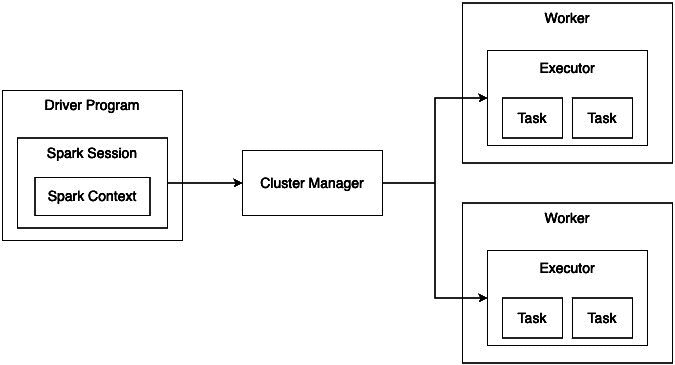
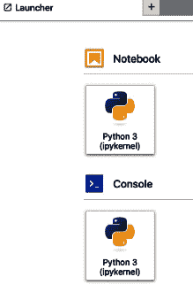

# 5

# 使用 Apache Spark 进行大数据处理

如前一章所示，Apache Spark 已迅速成为用于大数据工作负载的最广泛使用的分布式数据处理引擎之一。在本章中，我们将介绍使用 Spark 进行大规模数据处理的基础知识。

我们将首先讨论如何为开发和测试设置本地 Spark 环境。您将学习如何启动交互式 PySpark Shell，并使用 Spark 内置的 DataFrames API 来探索和处理示例数据集。通过编码示例，您将获得有关 PySpark 数据转换的实际经验，例如过滤、聚合和连接操作。

接下来，我们将探索 Spark SQL，它允许您通过 SQL 查询 Spark 中的结构化数据。您将学习 Spark SQL 如何与其他 Spark 组件集成，以及如何使用它来分析 DataFrame。我们还将讨论优化 Spark 工作负载的最佳实践。虽然本章不会深入探讨如何调优集群资源和参数，但您将了解一些配置，这些配置可以显著提高 Spark 作业的性能。

到本章结束时，您将理解 Spark 架构，并了解如何设置本地 PySpark 环境，加载数据到 Spark DataFrame，使用 PySpark 转换和分析数据，通过 Spark SQL 查询数据，并应用一些性能优化。掌握了这些 Spark 基础技能，您将为使用 Spark 的统一引擎处理大数据分析挑战做好准备。

在本章中，我们将涵盖以下主要内容：

+   入门 Spark

+   DataFrame API 和 Spark SQL API

+   使用真实数据

到本章结束时，您将获得使用 PySpark（Spark 的 Python API）加载、转换和分析大数据集的实践经验。

# 技术要求

+   要在本地运行 Spark，您需要 Java 8 或更高版本，并配置 `JAVA_HOME` 环境变量。为此，请按照[`www.java.com/en/download/help/download_options.html`](https://www.java.com/en/download/help/download_options.html)中的说明操作。

+   为了更好地可视化 Spark 过程，我们将通过 JupyterLab 进行交互式使用。您还应该确保您的 Python 发行版中已启用此功能。要安装 Jupyter，请按照此处的说明进行操作：[`jupyter.org/install`](https://jupyter.org/install)。

+   本章的所有代码都可以在本书 GitHub 仓库的 `Chapter05` 文件夹中找到，地址为：[`github.com/PacktPublishing/Bigdata-on-Kubernetes`](https://github.com/PacktPublishing/Bigdata-on-Kubernetes)。

# 入门 Spark

在本节中，我们将学习如何在本地计算机上启动并运行 Spark。我们还将概览 Spark 的架构和一些核心概念。这将为本章后续的实际数据处理部分打下基础。

## 本地安装 Spark

现在安装 Spark 和执行 `pip3 install` 命令一样简单：

1.  安装 Java 8 后，运行以下命令：

    ```
    pip3 install pyspark
    ```

1.  这将安装 PySpark 及其依赖项，例如 Spark 本身。你可以通过在终端运行以下命令来测试安装是否成功：

    ```
    spark-submit --version
    ```

你应该会在终端看到一个简单的输出，显示 Spark 的 logo 和版本信息。

## Spark 架构

Spark 采用分布式/集群架构，正如你在下面的图示中看到的：



图 5.1 – Spark 集群架构

协调 Spark 应用程序的核心部分叫做 `SparkSession` 对象，它直接与 Spark 上下文集成。Spark 上下文连接到一个集群管理器，集群管理器可以在计算集群中配置资源。当本地运行时，一个嵌入式集群管理器会与驱动程序程序在同一个**Java 虚拟机**（**JVM**）内运行。但在生产环境中，Spark 应配置为使用如 Yarn 或 Mesos 这样的独立集群资源管理器。我们稍后将看到 Spark 如何使用 Kubernetes 作为集群管理器结构。

集群管理器负责分配计算资源并隔离集群中的计算。当驱动程序请求资源时，集群管理器会启动 Spark 执行器来执行所需的计算任务。

## Spark 执行器

**Spark 执行器**是由集群管理器在集群中的工作节点上启动的进程。它们执行计算任务并为 Spark 应用存储数据。每个应用都有自己的执行器，这些执行器在整个应用程序运行期间保持运行，并在多个线程中执行任务。Spark 执行名为**任务**的代码片段以执行分布式数据处理。

## 执行组件

**Spark 作业**触发 Spark 程序的执行。它会被划分为一组个更小的任务集，这些任务集之间相互依赖，称为**阶段**。

阶段由可以并行执行的任务组成。这些任务在执行器内部通过多个线程执行。可以在执行器内并发运行的任务数量基于集群中预先分配的**槽位**（核心）数进行配置。

这一层次结构包括作业、阶段、任务、槽位和执行器，旨在促进 Spark 程序在集群中的分布式执行。我们将在本章稍后深入探讨与此结构相关的一些优化。现在，让我们通过运行一个简单的交互式 Spark 程序来可视化 Spark 的执行组件。

## 启动 Spark 程序

在接下来的步骤中，我们将使用一个名为**Jupyter**的交互式 Python 编程环境。如果你尚未在本地安装 Jupyter，请确保它已安装。

你可以通过在终端中键入以下命令来启动 Jupyter 环境：

```
jupyter lab
```

你会看到 Jupyter 进程的输出，并且一个新的浏览器窗口应该会打开。



图 5.2 – Jupyter 界面

Jupyter 会使事情变得更加简单，因为我们将运行一个交互式的 Spark 会话，并且能够通过其 UI 监控 Spark：

1.  首先，点击 **Python 3** 按钮，位于 **Notebook** 部分（*图 5.2*）。这将启动一个新的 Jupyter 笔记本。

1.  接下来，我们将使用一些 Python 代码从网络下载 `titanic` 数据集（可通过 [`raw.githubusercontent.com/neylsoncrepalde/titanic_data_with_semicolon/main/titanic.csv`](https://raw.githubusercontent.com/neylsoncrepalde/titanic_data_with_semicolon/main/titanic.csv) 获取）。在第一个代码块中，输入以下内容：

    ```
    requests Python library if it is not available. Press *Shift* + *Enter* to run the code block.
    ```

1.  接下来，我们将导入必要的库：

    ```
    import os
    import requests
    ```

1.  然后，我们将创建一个字典，文件名作为键，URL 作为值：

    ```
    urls_dict = {
    "titanic.csv": "https://raw.githubusercontent.com/neylsoncrepalde/titanic_data_with_semicolon/main/titanic.csv",
    }
    ```

1.  现在，我们将创建一个简单的 Python 函数来下载这个数据集并将其保存在本地：

    ```
    def get_titanic_data(urls):
        for title, url in urls.items():
          response = requests.get(url, stream=True)
          with open(f"data/titanic/{title}", mode="wb") as file:
            file.write(response.content)
        return True
    ```

1.  接下来，我们将创建一个名为 `data` 的文件夹，以及一个名为 `titanic` 的子文件夹来存储数据集。`exist_ok` 参数允许代码继续运行，如果这些文件夹已经存在则不会抛出错误。然后，我们运行我们的函数：

    ```
    os.makedirs('data/titanic', exist_ok=True)
    get_titanic_data(urls_dict)
    ```

现在，`titanic` 数据集已经可以用于分析。

本章中呈现的所有代码可以在本书 GitHub 仓库的 *第五章* 文件夹中找到 ([`github.com/PacktPublishing/Bigdata-on-Kubernetes/tree/main/Chapter%205`](https://github.com/PacktPublishing/Bigdata-on-Kubernetes/tree/main/Chapter%205))。

接下来，我们可以开始配置 Spark 程序来分析这些数据：

1.  为了做到这一点，我们必须首先导入 `SparkSession` 类和 `functions` 模块。这个模块将是我们使用 Spark 进行大部分数据处理所必需的：

    ```
    from pyspark.sql import SparkSession
    from pyspark.sql import functions as f
    ```

1.  在运行完导入后，创建一个 Spark 会话：

    ```
    spark = SparkSession.builder.appName("TitanicData").getOrCreate()
    ```

1.  这个 Spark 会话使 Spark UI 可用。我们可以通过在浏览器中输入 [`localhost:4040`](http://localhost:4040) 来查看它。


图 5.3 – Spark UI

如你所见，目前还没有数据可用。在我们运行 Spark 程序中的某些操作后，作业将开始显示在这个监控页面上。

现在，让我们回到 Jupyter 中的代码。

1.  要读取下载的数据集，运行以下代码：

    ```
    titanic = (
        spark
        .read
        .options(header=True, inferSchema=True, delimiter=";")
        .csv('data/titanic/titanic.csv')
    )
    ```

    这段代码的选项说明文件的第一行包含列名（`header = True`），我们希望 Spark 自动检测表格模式并相应地读取它（`inferSchema = True`），并设置文件分隔符或定界符为 `;`。

1.  要显示数据集的前几行，运行以下代码：

    ```
    titanic.show()
    ```

1.  现在，如果我们回到 Spark UI，我们已经可以看到完成的作业。


图 5.4 – 带有作业的 Spark UI

我们可以检查 Spark UI 中其他选项卡，查看各个阶段和任务，并在 **SQL / DataFrame** 选项卡中可视化发送到 Spark 的查询。我们将在本章稍后对这些选项卡进行进一步分析。

在接下来的部分中，我们将重点理解如何使用 Python（DataFrame API）和 SQL（Spark SQL API）语言进行 Spark 编程，以及 Spark 如何确保无论我们选择哪种编程语言，都能达到最佳性能。

# DataFrame API 和 Spark SQL API

Spark 提供了不同的 API，构建在核心 RDD API（原生的低级 Spark 语言）之上，旨在简化分布式数据处理应用程序的开发。最受欢迎的两个高级 API 是 DataFrame API 和 Spark SQL API。

DataFrame API 提供了一种领域特定语言，用于操作组织成命名列的分布式数据集。从概念上讲，它等同于关系数据库中的表或 Python pandas 中的 DataFrame，但在底层有更丰富的优化。DataFrame API 使用户能够在领域特定的术语（如*分组*和*连接*）后抽象数据处理操作，而不是考虑`map`和`reduce`操作。

Spark SQL API 在 DataFrames API 的基础上进一步构建，通过暴露 Spark SQL，一个用于结构化数据处理的 Spark 模块。Spark SQL 允许用户在 DataFrame 上运行 SQL 查询，以便对数据进行过滤或聚合。SQL 查询会被优化并转换为原生 Spark 代码执行。这使得熟悉 SQL 的用户可以轻松地针对数据运行临时查询。

两个 API 都依赖 Catalyst 优化器，它利用先进的编程技术，如谓词下推、投影剪枝和多种连接优化，来构建高效的查询计划。这样，Spark 通过根据业务逻辑而非硬件考虑来优化查询，从而与其他分布式数据处理框架区别开来。

在使用 Spark SQL 和 DataFrames API 时，理解一些关键概念非常重要，这些概念使 Spark 能够快速、高效地进行数据处理。这些概念包括转换、操作、懒评估和数据分区。

## 转换

转换定义了将要执行的计算，而操作触发了这些转换的实际执行。

转换是从现有的 DataFrame 中生成新 DataFrame 的操作。以下是 Spark 中的一些转换示例：

+   这是`select`命令，用于在 DataFrame（`df`）中选择列：

    ```
    new_df = df.select("column1", "column2")
    ```

+   这是`filter`命令，用于根据给定条件过滤行：

    ```
    filtered_df = df.filter(df["age"] > 20)
    ```

+   这是`orderBy`命令，用于根据给定列对 DataFrame 进行排序：

    ```
    sorted_df = df.orderBy("salary")
    ```

+   分组聚合可以通过`groupBy`命令和聚合函数来完成：

    ```
    agg_df = df.groupBy("department").avg("salary")
    ```

关键要理解的是，转换是*懒惰*的。当你调用`filter()`或`orderBy()`等转换时，并不会执行实际的计算。相反，Spark 仅仅记住要应用的转换，并等待直到调用操作时才会执行计算。

这种懒惰求值使得 Spark 在执行之前可以优化整个转换序列。与立即执行每个操作的贪婪求值引擎相比，这可能带来显著的性能提升。

## 行动

虽然转换描述了对 DataFrame 的操作，但行动实际上会执行计算并返回结果。在 Spark 中，一些常见的行动包括以下内容：

+   `count` 命令用于返回 DataFrame 中的行数：

    ```
    df.count()
    ```

+   `first` 命令用于返回 DataFrame 中的第一行：

    ```
    df.first()
    ```

+   `show` 命令用于打印 DataFrame 的内容：

    ```
    df.show()
    ```

+   `collect` 命令用于返回包含 DataFrame 所有行的数组：

    ```
    df.collect()
    ```

+   `write` 命令用于将 DataFrame 写入指定路径：

    ```
    df.write.parquet("PATH-TO-SAVE")
    ```

当在 DataFrame 上调用一个行动时，会发生以下几个事情：

1.  Spark 引擎会查看已应用的转换序列，并创建一个高效的执行计划来执行这些操作。这时就会进行优化。

1.  执行计划在集群中运行以执行实际的数据操作。

1.  该行动会聚合并将最终结果返回给驱动程序。

总结来说，转换描述了一个计算过程，但不会立即执行它。行动会触发懒惰求值和 Spark 作业的执行，返回具体的结果。

将计算指令存储起来以便稍后执行的过程称为 **懒惰求值**。让我们更详细地了解这个概念。

## 懒惰求值

懒惰求值是一项关键技术，使得 Apache Spark 能够高效运行。如前所述，当你对 DataFrame 应用转换时，并不会立即进行实际的计算。

相反，Spark 会内部记录每个转换作为操作来应用于数据。实际执行被推迟，直到调用行动时才会执行。

这种延迟计算非常有用，原因如下：

+   **避免不必要的操作**：通过查看许多转换的顺序，Spark 能够优化哪些计算部分实际上需要返回最终结果。如果某些中间步骤不需要，它们可能会被省略。

+   **运行时优化**：当行动被触发时，Spark 会根据分区、可用内存和并行性制定一个高效的物理执行计划。它在运行时动态地进行这些优化。

+   **将批处理操作组合在一起**：多个 DataFrame 上的几个转换可以被批量处理为更少的作业。这会把作业调度和初始化的开销分摊到许多计算步骤中。

作为示例，考虑一个包含用户点击流数据的 DataFrame，在返回最终的前 10 行之前，需要对其进行过滤、聚合和排序。

通过惰性计算，所有这些转换会在定义时被记录，当通过 `collect()` 或 `show()` 请求最终行时，才会执行一个优化后的任务。如果没有惰性计算，引擎需要为 `filter()` 执行一个独立的任务，为 `groupBy()` 执行另一个任务，为 `orderBy()` 执行另一个任务，以此类推。这将非常低效。

总结一下，惰性计算将计算步骤的定义与执行分开。这允许 Spark 提出一个优化的物理计划来执行整个操作序列。接下来，我们将看到 Spark 如何通过数据分区来分配计算任务。

## 数据分区

Spark 的速度来源于其能够将数据处理分发到集群中。为了实现并行处理，Spark 将数据划分为独立的分区，可以在集群中的不同节点上并行处理。

当你将数据读入 Spark 的 DataFrame 或 RDD 时，数据会被划分为逻辑分区。在集群上，Spark 会调度任务执行，使得分区能够在不同节点上并行运行。每个节点可以处理多个分区。这使得整个任务的处理速度比在单个节点上按顺序执行要快得多。

理解 Spark 中的数据分区对于理解 `狭义` 和 `广义` 转换的区别至关重要。

## 狭义转换与广义转换

狭义转换是指可以在每个分区独立执行的操作，而不需要在节点之间进行任何数据洗牌。例子包括 `map`、`filter` 和其他每条记录的转换。这些操作允许并行处理而不会产生网络流量的开销。

广义转换要求在分区和节点之间进行数据洗牌。例子包括 `groupBy` 聚合、连接、排序和窗口函数。这些操作要么涉及将多个分区的数据合并，要么基于某个键重新分区数据。

下面是一个例子来说明。我们正在过滤一个 DataFrame，并且只保留年龄小于 20 的行：

```
narrow_df = df.where("age > 20")
```

按年龄过滤是在每个数据分区中独立进行的。

```
grouped_df = df.groupBy("department").avg("salary")
```

分组聚合需要在集群中的分区之间交换数据。这个交换就是我们所说的 **shuffle**。

为什么这个区分很重要？如果可能的话，最好先进行狭义转换，再进行广义转换。这可以最小化数据在网络上的洗牌，从而提高性能。

例如，通常最好先通过过滤数据得到需要的子集，然后在过滤后的数据上应用聚合/窗口/连接操作，而不是对整个数据集应用所有操作。先过滤数据可以减少在网络上洗牌的数据量。

理解窄变换和宽变换的区别，可以通过最小化数据洗牌和仅在需要时分区数据，从而优化 Spark 作业，降低延迟并提高吞吐量。这是优化 Spark 应用性能的关键调优技巧。

现在，让我们尝试将这些概念应用到我们的`titanic`数据集上。

## 分析泰坦尼克号数据集

让我们回到我们之前开始构建的 Jupyter notebook。首先，我们启动一个`SparkSession`，并将`titanic`数据集读取到 Spark 中：

```
from pyspark.sql import SparkSession
from pyspark.sql import functions as f
spark = SparkSession.builder.appName("TitanicData").getOrCreate()
titanic = (
    spark
    .read
    .options(header=True, inferSchema=True, delimiter=";")
    .csv('data/titanic/titanic.csv')
)
```

我们现在将使用`printSchema()`命令检查表结构：

```
titanic.printSchema()
```

接下来，我们将在原始数据集上应用一些窄变换。我们将只筛选出年龄大于 21 岁的男性，并将此变换后的数据保存到名为`filtered`的对象中：

```
filtered = (
    titanic
    .filter(titanic.Age > 21)
    .filter(titanic.Sex == "male")
)
```

现在，让我们回到 Spark UI。发生了什么？*什么都没有发生！* 没有进行任何计算，因为（记住）这些命令是转换操作，不会触发 Spark 中的任何计算。


图 5.5 – 变换后的 Spark UI

但是现在，我们运行了一个`show()`命令，它是一个动作：

```
filtered.show()
```

*瞧！* 现在，我们可以看到 Spark 中触发了一个新的作业。


图 5.6 – 执行动作后的 Spark UI

我们还可以在**SQL / DataFrame**选项卡中检查执行计划。点击此选项卡，然后点击最后执行的查询（表格中的第一行）。你应该看到如*图 5.7*所示的输出。


图 5.7 – Spark 过滤器的执行计划

`titanic`数据集不够大，Spark 无法将其划分为多个分区。在本章的后面部分，我们将看到使用宽变换时如何进行数据洗牌（分区间的数据交换）。

本节的最后一个重要内容是观察 Spark 如何使用 DataFrame 和 Spark SQL API，并将所有指令转换为 RDD 以便优化处理。让我们实现一个简单的查询来分析`titanic`数据集。我们将在 Python 和 SQL 中都实现该查询。

首先，我们计算在每个旅行舱次中，21 岁以上的男性乘客在泰坦尼克号上的幸存情况。我们将 Python 查询保存在一个名为`queryp`的对象中：

```
queryp = (
    titanic
    .filter(titanic.Sex == "male")
    .filter(titanic.Age > 21)
    .groupBy('Pclass')
    .agg(f.sum('Survived').alias('Survivors'))
)
```

现在，我们将使用 SQL 实现完全相同的查询。为此，首先，我们需要创建一个临时视图，然后使用`spakr.sql()`命令来运行 SQL 代码：

```
titanic.createOrReplaceTempView('titanic')
querysql = spark.sql("""
    SELECT
        Pclass,
        sum(Survived) as Survivors
    FROM titanic
    WHERE
        Sex = 'male'
        AND Age > 21
    GROUP BY Pclass
""")
```

两个查询都被保存在对象中，我们现在可以使用它们来检查执行计划。让我们来做这件事：

```
queryp.explain('formatted')
querysql.explain('formatted')
```

如果你查看输出，你会注意到两个执行计划完全相同！ 这是因为 Spark 会将所有在高级 API 中给出的指令转换成运行在底层的 RDD 代码。我们可以通过`show()`命令执行这两个查询，并看到结果是相同的，它们以相同的性能执行：

```
queryp.show()
querysql.show()
```

两个命令的输出如下：

```
+------+---------+
|Pclass|Survivors|
+------+---------+
|     1|       36|
|     3|       22|
|     2|        5|
+------+---------+
```

我们还可以在 Spark UI 的 **SQL / DataFrame** 标签中直观地查看执行计划。点击该标签中的前两行（最近的两次执行），你会发现执行计划是相同的。

从现在开始，让我们在处理这个更具挑战性的数据集时，尝试深入挖掘 PySpark 代码。

# 使用真实数据进行工作

我们现在将使用 IMDb 公共数据集。这个数据集较为复杂，分成了多个表格。

以下代码将从 `imdb` 数据集中下载五个表格，并将它们保存到 `./data/imdb/` 路径下（也可以在 [`github.com/PacktPublishing/Bigdata-on-Kubernetes/blob/main/Chapter05/get_imdb_data.py`](https://github.com/PacktPublishing/Bigdata-on-Kubernetes/blob/main/Chapter05/get_imdb_data.py) 找到该代码）。

首先，我们需要将数据下载到本地：

get_imdb_data.py

```
import os
import requests
urls_dict = {
    "names.tsv.gz": "https://datasets.imdbws.com/name.basics.tsv.gz",
    "basics.tsv.gz": "https://datasets.imdbws.com/title.basics.tsv.gz",
    "crew.tsv.gz": "https://datasets.imdbws.com/title.crew.tsv.gz",
    "principals.tsv.gz": "https://datasets.imdbws.com/title.principals.tsv.gz",
    "ratings.tsv.gz": "https://datasets.imdbws.com/title.ratings.tsv.gz"
}
def get_imdb_data(urls):
    for title, url in urls.items():
        response = requests.get(url, stream=True)
      with open(f"data/imdb/{title}", mode="wb") as file:
        file.write(response.content)
    return True
os.makedirs('data/imdb', exist_ok=True)
get_imdb_data(urls_dict)
```

现在，我们将打开一个 Jupyter notebook，启动一个 `SparkSession`，并读取表格（你可以在 [`github.com/PacktPublishing/Bigdata-on-Kubernetes/blob/main/Chapter05/analyzing_imdb_data.ipynb`](https://github.com/PacktPublishing/Bigdata-on-Kubernetes/blob/main/Chapter05/analyzing_imdb_data.ipynb) 找到这段代码）：

```
from pyspark.sql import SparkSession
from pyspark.sql import functions as f
spark = SparkSession.builder.appName("IMDBData").getOrCreate()
spark.sparkContext.setLogLevel("ERROR")
```

这次，我们将不使用 `inferSchema` 参数来读取表格。`inferSchema` 在处理小型表格时非常有用，但对于大数据来说并不推荐使用，因为 Spark 会先读取所有表格一次以定义模式，然后再读取一次数据以正确获取数据，这会导致性能下降。最佳做法是事先定义模式，并使用定义好的模式来读取数据。请注意，像这样读取表格，直到我们给出任何 *动作* 指令之前，是不会触发执行的。IMDb 数据集的模式可以在 [`developer.imdb.com/non-commercial-datasets/`](https://developer.imdb.com/non-commercial-datasets/) 找到。

为了正确读取 IMDb 表格，我们首先定义模式（schemas）：

```
schema_names = "nconst string, primaryName string, birthYear int, deathYear int, primaryProfession string, knownForTitles string"
schema_basics = """
tconst string, titleType string, primaryTitle string, originalTitle string, isAdult int, startYear int, endYear int,
runtimeMinutes double, genres string
"""
schema_crew = "tconst string, directors string, writers string"
schema_principals = "tconst string, ordering int, nconst string, category string, job string, characters string"
schema_ratings = "tconst string, averageRating double, numVotes int"
```

现在，我们将读取所有表格，并将其定义好的模式作为参数传递：

```
names = (
    spark
    .read
    .schema(schema_names)
    .options(header=True)
    .csv('data/imdb/names.tsv.gz')
)
basics = (
    spark
    .read
    .schema(schema_basics)
    .options(header=True)
    .csv('data/imdb/basics.tsv.gz')
)
crew = (
    spark
    .read
    .schema(schema_crew)
    .options(header=True)
    .csv('data/imdb/crew.tsv.gz')
)
principals = (
    spark
    .read
    .schema(schema_principals)
    .options(header=True)
    .csv('data/imdb/principals.tsv.gz')
)
ratings = (
    spark
    .read
    .schema(schema_ratings)
    .options(header=True)
    .csv('data/imdb/ratings.tsv.gz')
)
```

现在，我们检查 Spark 是否正确导入了模式：

```
print("NAMES Schema")
names.printSchema()
print("BASICS Schema")
basics.printSchema()
print("CREW Schema")
crew.printSchema()
print("PRINCIPALS Schema")
principals.printSchema()
print("RATINGS Schema")
ratings.printSchema()
```

如果你检查 Spark UI，你会注意到*没有触发任何计算*。只有当我们调用任何*动作*函数时，才会执行计算。接下来我们将分析这些数据。来看一下 `names` 表格：

```
names.show()
```

`.show()` 命令将产生如下输出（这里只选择了部分列以便更好地展示）：

```
+---------+-------------------+--------------------+
|nconst   |        primaryName|      knownForTitles|
+---------+-------------------+--------------------+
|nm0000001|       Fred Astaire|tt0031983,tt00504...|
|nm0000002|      Lauren Bacall|tt0038355,tt00373...|
|nm0000003|    Brigitte Bardot|tt0049189,tt00544...|
|nm0000004|       John Belushi|tt0078723,tt00725...|
|nm0000005|     Ingmar Bergman|tt0050976,tt00839...|
|nm0000006|     Ingrid Bergman|tt0034583,tt00368...|
|nm0000007|    Humphrey Bogart|tt0037382,tt00425...|
|nm0000008|      Marlon Brando|tt0078788,tt00708...|
|nm0000009|     Richard Burton|tt0061184,tt00578...|
|nm0000010|       James Cagney|tt0031867,tt00355...|
|nm0000011|        Gary Cooper|tt0044706,tt00358...|
|nm0000012|        Bette Davis|tt0031210,tt00566...|
|nm0000013|          Doris Day|tt0045591,tt00494...|
|nm0000014|Olivia de Havilland|tt0041452,tt00313...|
|nm0000015|         James Dean|tt0049261,tt00485...|
|nm0000016|    Georges Delerue|tt8847712,tt00699...|
|nm0000017|   Marlene Dietrich|tt0052311,tt00512...|
|nm0000018|       Kirk Douglas|tt0049456,tt00508...|
|nm0000019|   Federico Fellini|tt0071129,tt00568...|
|nm0000020|        Henry Fonda|tt0082846,tt00512...|
+---------+-------------------+--------------------+
```

这是 Spark 实际读取 `names` 数据的确切时刻，一旦我们运行 `.show()` 命令。这个表格包含关于演员、制作人、导演、编剧等的信息。但注意 `knownForTitles` 列的结构。它包含了一个人参与过的所有电影，但这些电影的名称以字符串形式存储，所有标题用逗号隔开。这在未来当我们需要将该表格与其他信息进行联接时，可能会给我们带来麻烦。让我们**展开**这一列，将其转换为多行：

```
names = names.select(
    'nconst', 'primaryName', 'birthYear', 'deathYear',
    f.explode(f.split('knownForTitles', ',')).alias('knownForTitles')
)
```

请注意，我们没有选择`primaryProfession`列。我们在此分析中不需要它。现在，检查`crew`表：

```
crew.show()
```

这是输出`:` 

```
+---------+-------------------+---------+
|   tconst|          directors|  writers|
+---------+-------------------+---------+
|tt0000001|          nm0005690|       \N|
|tt0000002|          nm0721526|       \N|
|tt0000003|          nm0721526|       \N|
|tt0000004|          nm0721526|       \N|
|tt0000005|          nm0005690|       \N|
|tt0000006|          nm0005690|       \N|
|tt0000007|nm0005690,nm0374658|       \N|
|tt0000008|          nm0005690|       \N|
|tt0000009|          nm0085156|nm0085156|
|tt0000010|          nm0525910|       \N|
|tt0000011|          nm0804434|       \N|
|tt0000012|nm0525908,nm0525910|       \N|
|tt0000013|          nm0525910|       \N|
|tt0000014|          nm0525910|       \N|
|tt0000015|          nm0721526|       \N|
|tt0000016|          nm0525910|       \N|
|tt0000017|nm1587194,nm0804434|       \N|
|tt0000018|          nm0804434|       \N|
|tt0000019|          nm0932055|       \N|
|tt0000020|          nm0010291|       \N|
+---------+-------------------+---------+
```

在这里，我们有相同的情况：由多个导演执导的电影。这些信息作为一个字符串存储，多个值之间用逗号分隔。如果你一开始不能想象这种情况，试着筛选`crew`表，查找包含逗号的值：

```
crew.filter("directors LIKE '%,%'").show()
```

我们还将这个列展开为多行：

```
crew = crew.select(
    'tconst', f.explode(f.split('directors', ',')).alias('directors'), 'writers'
)
```

然后，你还可以检查（使用`.show()`命令）其他表格，但它们没有这种情况。

现在，让我们开始分析这些数据。我们将可视化最著名的基努·里维斯电影。仅凭一张表格无法查看这一点，因为在`names`表中，我们只有电影 ID（`tconst`）。我们需要将`names`和`basics`表连接起来。首先，我们只获取基努·里维斯的信息：

```
only_keanu = names.filter("primaryName = 'Keanu Reeves'")
only_keanu.show()
```

现在，我们将此新表与`basics`表进行连接：

```
keanus_movies = (
    basics.select('tconst', 'primaryTitle', 'startYear')
    .join(
        only_keanu.select('primaryName', 'knownForTitles'),
        basics.tconst == names.knownForTitles, how='inner'
    )
)
```

在这段代码中，我们只选择了`basics`表中需要的列，并将它们与过滤后的`only_keanu`表连接。`join`命令有三个参数：

+   将要连接的表

+   将使用的列

+   Spark 将执行的连接类型

在这种情况下，我们使用`tconst`和`knownForTitles`列进行连接，并执行内连接，只保留在两个表中都存在的记录。

在我们用动作触发这个连接的结果之前，让我们探索一下这个连接的执行计划：

```
keanus_movies.explain('formatted')
```

分析输出时，我们注意到 Spark 将执行排序-合并连接：

```
== Physical Plan ==
AdaptiveSparkPlan (11)
+- SortMergeJoin Inner (10)
    :- Sort (4)
    :  +- Exchange (3)
    :     +- Filter (2)
    :        +- Scan csv  (1)
    +- Sort (9)
      +- Exchange (8)
         +- Generate (7)
            +- Filter (6)
               +- Scan csv  (5)
```

连接是 Spark 中的一个关键操作，并且与 Spark 的性能直接相关。稍后我们会回到数据集和我们正在进行的连接，但在继续之前，简要说明一下 Spark 连接的内部原理。

## Spark 如何执行连接

Spark 提供了几种物理连接实现方式，以高效地执行连接。选择哪种连接实现方式取决于所连接数据集的大小和其他参数。

Spark 内部执行连接的方式有很多种。我们将介绍三种最常见的连接：排序-合并连接、洗牌哈希连接和广播连接。

### 排序-合并连接

**排序-合并连接**，顾名思义，在应用连接之前会先对连接键进行排序。以下是涉及的步骤：

1.  Spark 读取左右两边的 DataFrame/RDD，并应用任何所需的投影或过滤。

1.  接下来，两个侧面会根据连接键进行排序。这种数据的重新排列被称为洗牌，它涉及在集群中移动数据。

1.  在洗牌之后，具有相同连接键的行将被定位在同一分区上。然后，Spark 通过比较两边具有相同连接键的值来合并排序后的分区，并生成连接输出行。

当双方数据在洗牌后都能适配内存时，排序-合并连接效果较好。排序的预处理步骤能够加速合并。然而，洗牌对于大数据集来说可能会非常耗费资源。

### 洗牌哈希连接

**洗牌哈希连接**通过避免*排序*阶段来优化排序-合并连接。以下是主要步骤：

1.  Spark 会根据连接键的哈希值对两边数据进行分区。这将相同键的行分配到同一分区。

1.  由于相同键的行被哈希到相同的分区，Spark 可以从一方构建哈希表，从另一方查询哈希表中的匹配项，并在每个分区内输出连接结果。

洗牌哈希连接每一方仅读取一次。通过避免排序，它比排序-合并连接节省了 I/O 和 CPU 成本。但是当洗牌后的连接数据集可以适配内存时，它的效率不如排序-合并连接。

### 广播哈希连接

如果连接的一方足够小，可以适应每个执行器的内存，Spark 可以使用**广播哈希连接**来广播这一方。以下是步骤：

1.  较小的 DataFrame 会被哈希并广播到所有工作节点。这使得整个数据集可以加载到内存中。

1.  较大的一方随后会根据连接键进行分区。每个分区会查询广播的内存哈希表以寻找匹配项，并输出连接结果。

由于数据传输最小化，广播连接非常快速。如果一方足够小以便广播，Spark 会自动选择这一方式。然而，最大大小取决于用于广播的内存。

现在，让我们回到数据集，尝试强制 Spark 执行不同于自动选择的排序-合并连接类型的连接。

## 连接 IMDb 表

`keanu_movies` 查询执行计划将执行一个排序-合并连接，这是 Spark 自动选择的，因为在这种情况下，它可能带来最佳的性能。不过，我们也可以强制 Spark 执行不同类型的连接。我们来尝试广播哈希连接：

```
keanus_movies2 = (
    basics.select(
        'tconst', 'primaryTitle', 'startYear'
    ).join(
        f.broadcast(only_keanu.select('primaryName', 'knownForTitles')),
        basics.tconst == names.knownForTitles, how='inner'
    )
)
```

这个查询几乎与之前的查询完全相同，唯一的区别是：我们使用了 `broadcast` 函数来强制执行广播连接。让我们检查一下执行计划：

```
keanus_movies2.explain('formatted')
== Physical Plan ==
AdaptiveSparkPlan (8)
+- BroadcastHashJoin Inner BuildRight (7)
    :- Filter (2)
    :  +- Scan csv  (1)
    +- BroadcastExchange (6)
      +- Generate (5)
         +- Filter (4)
            +- Scan csv  (3)
```

现在，执行计划变得更小，并且包含一个 `BroadcastHashJoin` 任务。我们也可以尝试通过以下代码提示 Spark 使用洗牌哈希连接：

```
keanus_movies3 = (
    basics.select(
        'tconst', 'primaryTitle', 'startYear'
    ).join(
        only_keanu.select('primaryName', 'knownForTitles').hint("shuffle_hash"),
        basics.tconst == names.knownForTitles, how='inner'
    )
)
```

现在，让我们看看执行计划：

```
keanu_movies3.explain("formatted")
== Physical Plan ==
AdaptiveSparkPlan (9)
+- ShuffledHashJoin Inner BuildRight (8)
    :- Exchange (3)
    :  +- Filter (2)
    :     +- Scan csv  (1)
    +- Exchange (7)
      +- Generate (6)
         +- Filter (5)
            +- Scan csv  (4)
```

现在，我们触发所有查询的执行，通过 `show()` 命令，每个查询都放在自己的代码块中：

```
keanus_movies.show()
keanus2_movies.show()
keanus3_movies.show()
```

我们可以看到结果完全相同。不过，Spark 在内部处理连接的方式不同，性能也不同。查看 Spark UI 中的**SQL / DataFrame**标签，可以可视化执行的查询。

如果我们仅想使用 SQL 来检查基努·里维斯的电影，我们可以通过创建一个临时视图并使用 `spark.sql()` 命令来实现：

```
basics.createOrReplaceTempView('basics')
names.createOrReplaceTempView('names')
keanus_movies4 = spark.sql("""
    SELECT
        b.primaryTitle,
        b.startYear,
        n.primaryName
    FROM basics b
    INNER JOIN names n
        ON b.tconst = n.knownForTitles
    WHERE n.primaryName = 'Keanu Reeves'
""")
```

现在，让我们再尝试一个查询。让我们看看是否能够回答这个问题：*汤姆·汉克斯和梅格·瑞恩共同出演的电影的导演、制片人和编剧是谁，哪部电影的评分最高？*

首先，我们需要检查`Tom Hanks`和`Meg Ryan`在`names`表中的编码：

```
(
    names
    .filter("primaryName in ('Tom Hanks', 'Meg Ryan')")
    .select('nconst', 'primaryName', 'knownForTitles')
    .show()
)
```

结果如下：

```
+----------+-----------+--------------+
|    nconst|primaryName|knownForTitles|
+----------+-----------+--------------+
| nm0000158|  Tom Hanks|     tt0094737|
| nm0000158|  Tom Hanks|     tt1535109|
| nm0000158|  Tom Hanks|     tt0162222|
| nm0000158|  Tom Hanks|     tt0109830|
| nm0000212|   Meg Ryan|     tt0120632|
| nm0000212|   Meg Ryan|     tt0128853|
| nm0000212|   Meg Ryan|     tt0098635|
| nm0000212|   Meg Ryan|     tt0108160|
|nm12744293|   Meg Ryan|    tt10918860|
|nm14023001|   Meg Ryan|            \N|
| nm7438089|   Meg Ryan|     tt4837202|
| nm9013931|   Meg Ryan|     tt6917076|
| nm9253135|   Meg Ryan|     tt7309462|
| nm9621674|   Meg Ryan|     tt7993310|
+----------+-----------+--------------+
```

这个查询显示了梅格·瑞恩的许多不同编码，但我们想要的是第一项，它在`knownForTitles`列中有几部电影。接着，我们将找出他们两人共同出演的电影。为此，我们将过滤出在`principals`表中有他们编码的电影，并按电影计算演员人数。那些有两位演员的电影应该就是他们共同出演的电影：

```
movies_together = (
    principals
    .filter("nconst in ('nm0000158', 'nm0000212')")
    .groupBy('tconst')
    .agg(f.count('nconst').alias('nactors'))
    .filter('nactors > 1')
)
movies_together.show()
```

然后我们得到这个结果：

```
+---------+-------+
|   tconst|nactors|
+---------+-------+
|tt2831414|      2|
|tt0128853|      2|
|tt0099892|      2|
|tt1185238|      2|
|tt0108160|      2|
|tt7875572|      2|
|tt0689545|      2|
+---------+-------+
```

现在，我们可以将这些信息与其他表连接，得到我们需要的答案。我们将创建一个`subjoin`表，连接`principals`、`names`和`basics`中的信息。由于`ratings`表占用的资源较多，我们先将其保留到后面使用：

```
subjoin = (
    principals
    .join(movies_together.select('tconst'), on='tconst', how='inner')
    .join(names.select('nconst', 'primaryName'),
          on='nconst', how='inner')
    .join(basics.select('tconst', 'primaryTitle', 'startYear'),
         on='tconst', how='inner')
    .dropDuplicates()
)
subjoin.show()
```

为了加速后续的计算，我们将缓存这个表。这将允许 Spark 将`subjoin`表保存在内存中，从而避免所有之前的连接再次触发：

```
subjoin.cache()
```

现在，让我们找出汤姆和梅格一起出演了哪些电影：

```
(
    subjoin
    .select('primaryTitle', 'startYear')
    .dropDuplicates()
    .orderBy(f.col('startYear').desc())
    .show(truncate=False)
)
```

最终的输出如下：

```
+-----------------------------------------+---------+
|primaryTitle                             |startYear|
+-----------------------------------------+---------+
|Everything Is Copy                       |2015     |
|Delivering 'You've Got Mail'             |2008     |
|You've Got Mail                          |1998     |
|Episode dated 10 December 1998           |1998     |
|Sleepless in Seattle                     |1993     |
|Joe Versus the Volcano                   |1990     |
|Joe Versus the Volcano: Behind the Scenes|1990     |
+-----------------------------------------+---------+
```

现在，我们将找出这些电影的导演、制片人和编剧：

```
(
    subjoin
    .filter("category in ('director', 'producer', 'writer')")
    .select('primaryTitle', 'startYear', 'primaryName', 'category')
    .show()
)
```

现在，我们可以查看这些电影的评分并对其进行排序，从而找出评分最高的电影。为此，我们需要将`subjoin`缓存表与`ratings`表进行连接。由于`subjoin`已经被缓存，注意这次连接发生的速度：

```
(
    subjoin.select('tconst', 'primaryTitle')
    .dropDuplicates()
    .join(ratings, on='tconst', how='inner')
    .orderBy(f.col('averageRating').desc())
    .show()
)
```

最后一次连接的结果如下：

```
+---------+--------------------+-------------+--------+
|   tconst|        primaryTitle|averageRating|numVotes|
+---------+--------------------+-------------+--------+
|tt7875572|Joe Versus the Vo...|          7.8|      12|
|tt2831414|  Everything Is Copy|          7.4|    1123|
|tt1185238|Delivering 'You'v...|          7.0|      17|
|tt0108160|Sleepless in Seattle|          6.8|  188925|
|tt0128853|     You've Got Mail|          6.7|  227513|
|tt0099892|Joe Versus the Vo...|          5.9|   39532|
|tt0689545|Episode dated 10 ...|          3.8|      11|
+---------+--------------------+-------------+--------+
```

就这样！接下来，作为练习，你应该尝试使用 SQL 和`spak.sql()`命令重新执行这些查询。

# 概要

在这一章中，我们介绍了使用 Apache Spark 进行大规模数据处理的基础知识。你学习了如何设置本地 Spark 环境，并使用 PySpark API 加载、转换、分析和查询 Spark DataFrame 中的数据。

我们讨论了诸如惰性求值、窄变换与宽变换、以及物理数据分区等关键概念，这些概念使得 Spark 能够在集群中高效执行计算。你通过使用 PySpark 进行过滤、聚合、连接和分析示例数据集，获得了实际操作经验。

你还学习了如何使用 Spark SQL 查询数据，这使得熟悉 SQL 的人能够分析 DataFrame。我们了解了 Spark 的查询优化和执行组件，以理解 Spark 如何将高级 DataFrame 和 SQL 操作转换为高效的分布式数据处理计划。

虽然我们只触及了 Spark 工作负载调优和优化的表面，但你学到了一些最佳实践，比如最小化洗牌并在适当时使用广播连接来提高性能。

在下一章中，我们将学习用于管道编排的最常用工具之一——Apache Airflow。
