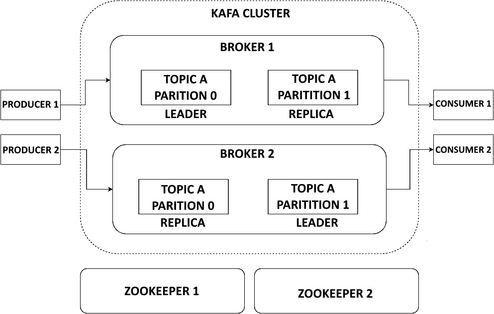

# 7

# Apache Kafka 用于实时事件和数据摄取

实时数据和事件流处理是现代数据架构中的关键组成部分。通过利用像 Apache Kafka 这样的系统，组织可以摄取、处理和分析实时数据，从而推动及时的业务决策和行动。

本章将介绍 Kafka 的基本概念和架构，使其成为一个高性能、可靠且可扩展的消息系统。你将学习 Kafka 的发布-订阅消息模型是如何通过主题、分区和代理来工作的。我们将演示 Kafka 的设置和配置，并让你亲身体验如何为主题生产和消费消息。

此外，你将通过实验数据复制和主题分布策略，了解 Kafka 的分布式和容错特性。我们还将介绍 Kafka Connect，用于从外部系统（如数据库）流式摄取数据。你将配置 Kafka Connect，将 SQL 数据库中的变更流式传输到 Kafka 主题。

本章的亮点是将 Kafka 与 Spark 结构化流处理结合，构建实时数据管道。你将通过实现端到端的管道，学习这种高可扩展的流处理方法，这些管道会消费 Kafka 主题数据，使用 Spark 处理数据，并将输出写入另一个 Kafka 主题或外部存储系统。

到本章结束时，你将掌握实际技能，能够设置 Kafka 集群并利用 Kafka 的功能构建强大的实时数据流和处理架构。公司可以通过做出及时的数据驱动决策从中获益，而 Kafka 正是实现这一目标的关键。

在本章中，我们将覆盖以下主要内容：

+   开始使用 Kafka

+   探索 Kafka 架构

+   使用 Kafka Connect 从数据库流式传输数据

+   使用 Kafka 和 Spark 进行实时数据处理

# 技术要求

在本章中，我们将使用`docker-compose`在本地运行 Kafka 集群和 Kafka Connect 集群，而`docker-compose`是随 Docker 一同提供的，因此无需额外的安装步骤。如果你需要手动安装`docker-compose`，请参考[`docs.docker.com/compose/install/`](https://docs.docker.com/compose/install/)。

此外，我们将使用**Spark**进行实时数据处理。安装说明请参考*第五章*。

本章的所有代码都可以在本书的 GitHub 仓库中找到，网址是([`github.com/PacktPublishing/Bigdata-on-Kubernetes`](https://github.com/PacktPublishing/Bigdata-on-Kubernetes))，位于`Chapter07`文件夹中。

# 开始使用 Kafka

Kafka 是一个流行的开源平台，用于构建实时数据管道和流处理应用程序。在本节中，我们将学习如何使用`docker-compose`在本地运行基本的 Kafka 环境，这样你就可以开始构建 Kafka 生产者和消费者。

`docker-compose` 是一个帮助定义和运行多容器 Docker 应用的工具。使用 Compose，你可以通过一个 YAML 文件配置应用的服务，然后通过一个命令启动所有服务。这可以避免手动运行和连接容器。为了运行我们的 Kafka 集群，我们将使用 `docker-compose` 定义一组节点。首先，创建一个名为 `multinode` 的文件夹（仅为保持代码有序），并创建一个名为 `docker-compose.yaml` 的新文件。这是 `docker-compose` 用来设置容器的常规文件（类似于 Dockerfile）。为了提高可读性，我们不会显示整个代码（代码可以在 [`github.com/PacktPublishing/Bigdata-on-Kubernetes/tree/main/Chapter07/multinode`](https://github.com/PacktPublishing/Bigdata-on-Kubernetes/tree/main/Chapter07/multinode) 找到），只展示其中的一部分。让我们来看一下：

docker-compose.yaml

```
---
version: '2'
services:
    zookeeper-1:
      image: confluentinc/cp-zookeeper:7.6.0
      environment:
        ZOOKEEPER_SERVER_ID: 1
        ZOOKEEPER_CLIENT_PORT: 22181
        ZOOKEEPER_TICK_TIME: 2000
        ZOOKEEPER_INIT_LIMIT: 5
        ZOOKEEPER_SYNC_LIMIT: 2
        ZOOKEEPER_SERVERS: localhost:22888:23888;localhost:32888:33888;localhost:42888:43888
    network_mode: host
    extra_hosts:
      - "mynet:127.0.0.1"
    kafka-1:
      image: confluentinc/cp-kafka:7.6.0
      network_mode: host
      depends_on:
        - zookeeper-1
        - zookeeper-2
        - zookeeper-3
    environment:
      KAFKA_BROKER_ID: 1
      KAFKA_ZOOKEEPER_CONNECT: localhost:22181,localhost:32181,localhost:42181
      KAFKA_ADVERTISED_LISTENERS: PLAINTEXT://localhost:19092
    extra_hosts:
      - "mynet:127.0.0.1"
```

原始的 Docker Compose 文件正在设置一个包含三个 Kafka 经纪人和三个 Zookeeper 节点的 Kafka 集群（更多关于 Kafka 架构的细节将在下一节中讲解）。我们只保留了第一个 Zookeeper 和 Kafka 经纪人的定义，因为其他的都是相同的。在这里，我们使用的是 Confluent Kafka（由 Confluent Inc. 维护的企业版 Kafka）和 Zookeeper 镜像来创建容器。对于 Zookeeper 节点，关键参数如下：

+   `ZOOKEEPER_SERVER_ID`：集群中每个 Zookeeper 服务器的唯一 ID。

+   `ZOOKEEPER_CLIENT_PORT`：客户端连接到此 Zookeeper 节点的端口。我们为每个节点使用不同的端口。

+   `ZOOKEEPER_TICK_TIME`：Zookeeper 用于心跳的基本时间单位。

+   `ZOOKEEPER_INIT_LIMIT`：Zookeeper 服务器必须连接到领导者的时间。

+   `ZOOKEEPER_SYNC_LIMIT`：服务器可以与领导者相差多远。

+   `ZOOKEEPER_SERVERS`：以 `address:leaderElectionPort:followerPort` 格式列出集群中的所有 Zookeeper 服务器。

对于 Kafka 经纪人，关键参数如下：

+   `KAFKA_BROKER_ID`：每个 Kafka 经纪人的唯一 ID。

+   `KAFKA_ZOOKEEPER_CONNECT`：列出 Kafka 应该连接的 Zookeeper 集群。

+   `KAFKA_ADVERTISED_LISTENERS`：对外连接到此经纪人的广告监听器。我们为每个经纪人使用不同的端口。

容器配置为使用主机网络模式以简化网络配置。依赖关系确保 Kafka 仅在 Zookeeper 准备好后才启动。

这段代码创建了一个完全功能的 Kafka 集群，能够处理单个经纪人或 Zookeeper 的复制和故障。现在，我们将启动这些容器。在终端中，进入 `multinode` 文件夹并输入以下命令：

```
docker-compose up –d
```

这将告诉 `docker-compose` 启动容器。如果本地未找到必要的镜像，它们将被自动下载。`-d` 参数使得 `docker-compose` 在 `-d` 模式下运行。

要查看某个 Kafka 经纪人的日志，请运行以下命令：

```
docker logs multinode-kafka-1-1
```

这里，`multinode-kafka-1-1` 是我们在 YAML 文件中定义的第一个 Kafka Broker 容器的名称。通过这个命令，您应该能够可视化 Kafka 的日志并验证一切是否正常运行。现在，让我们更详细地了解 Kafka 的架构，并理解它是如何工作的。

# 探索 Kafka 的架构

Kafka 具有分布式架构，包括经纪人、生产者、消费者、主题、分区和副本。在高层次上，生产者向主题发布消息，经纪人接收这些消息并将它们存储在分区中，消费者订阅主题并处理发布给它们的消息。

Kafka 依赖于一个称为**Zookeeper**的外部协调服务，帮助管理 Kafka 集群。Zookeeper 帮助进行控制器选举——选择一个经纪人作为集群控制器。控制器负责管理操作，例如将分区分配给经纪人并监视经纪人故障。Zookeeper 还帮助经纪人协调彼此的操作，例如为分区选举领导者。

Kafka **经纪人**是 Kafka 集群的主要组件，负责处理生产者和消费者的所有读/写请求。经纪人从生产者接收消息并向消费者公开数据。每个经纪人管理以分区形式存储在本地磁盘上的数据。默认情况下，经纪人将分区均匀分布在它们之间。如果经纪人宕机，Kafka 将自动将这些分区重新分配给其他经纪人。这有助于防止数据丢失并确保高可用性。现在，让我们了解 Kafka 如何在**发布-订阅**（PubSub）设计中处理消息，以及如何为消息的写入和读取保证可靠性和可伸缩性。

## 发布-订阅设计

Kafka 依赖于发布-订阅（PubSub）消息模式来实现实时数据流。Kafka 将消息组织成称为**主题（topics）**的类别。主题充当消息的源或流。生产者将数据写入主题，消费者从主题读取数据。例如，“页面访问”主题将记录每次访问网页的情况。主题始终是多生产者和多订阅者的，可以有零到多个生产者向主题写入消息，以及零到多个消费者从主题读取消息。这有助于在应用程序之间协调数据流。

主题被分成**分区**以实现可伸缩性。每个分区充当一个有序、不可变的消息序列，可以不断追加消息。通过将主题分区成多个分区，Kafka 可以通过让多个消费者并行地从多个分区读取主题来扩展主题消费。分区允许 Kafka 水平分布负载到经纪人之间，并允许并行处理。数据在每个分区内保持生产顺序。

Kafka 通过**复制分区**到可配置数量的代理上来提供冗余和容错性。一个分区将有一个代理被指定为“领导者”，并且有零个或多个代理充当“跟随者”。所有的读写操作都由领导者处理，跟随者通过拥有与领导者数据完全相同的副本来被动地复制领导者的数据。如果领导者失败，某个跟随者将自动成为新的领导者。

在各个代理（brokers）之间拥有**副本**可以确保容错性，因为即使某些代理出现故障，数据仍然可以被消费。副本因子控制副本的数量。例如，副本因子为三意味着将有两个跟随者复制一个领导者分区。常见的生产环境设置通常至少有三个代理，副本因子为二或三。

消费者用**消费者组**名称来标识自己，并且发布到主题中的每一条记录只会发送给组中的一个消费者。如果一个组中有多个消费者，Kafka 会在消费者之间负载均衡消息。Kafka 保证在一个分区内将消息有序、至少一次地传递给一个消费者。消费者组允许你扩展消费者的数量，同时仍然提供消息的顺序保证。

**生产者**将记录发布到主题的分区中。如果只有一个分区，所有消息都会发送到该分区。如果有多个分区，生产者可以选择随机分配消息到各个分区，或者通过使用相同的分区来确保消息的顺序。这个顺序保证只适用于单个分区内，而不适用于跨分区的消息。

生产者为了提高效率和持久性，将消息批量处理。消息在发送到代理之前会在本地缓冲并进行压缩。这样的批处理提供了更好的效率和吞吐量。生产者可以选择等待直到批次满，或根据时间或消息大小的阈值来刷新。生产者还通过在确认写入之前确保所有同步副本都已确认来进行数据复制。生产者可以选择不同的确认保证，从一旦领导者写入记录就提交，或等到所有跟随者都已复制后再提交。

**消费者**通过订阅 Kafka 主题来读取记录。消费者实例可以位于不同的进程或服务器上。消费者通过定期发送数据请求从代理中拉取数据。消费者会跟踪它们在每个分区中的位置（“偏移量”），以便在发生故障时从正确的位置开始读取。消费者通常会定期提交偏移量。偏移量还可以让消费者在需要时倒带或跳过一些记录。到底这些偏移量是如何工作的？让我们更深入地了解一下。

Kafka 将记录流存储在称为主题的类别中。每个主题下的记录被组织成分区，这样就可以进行并行处理和扩展性。每个分区中的记录都有一个称为 **偏移量** 的 *递增 ID 编号*，它唯一标识该分区内的记录。这个偏移量反映了分区内记录的顺序。例如，偏移量为三意味着它是第三条记录。

当 Kafka 消费者从分区读取记录时，它会跟踪已读取的最后一条记录的偏移量。这使得消费者只会读取尚未处理的新记录。如果消费者断开连接并稍后重新连接，它将从最后提交的偏移量处重新开始读取。偏移量提交日志存储在一个名为 `__consumer_offsets` 的 Kafka 主题中。这样可以保证持久性，并允许消费者在故障发生时透明地从中断处恢复。

偏移量使得多个消费者可以从同一分区读取数据，同时确保每个消费者只处理每条记录一次。消费者可以按自己的速度读取数据，彼此之间不会互相干扰。这是 Kafka 可扩展性的关键设计特性。当这些特性一起使用时，Kafka 可以实现 **精确一次语义**。让我们更详细地了解这个概念。

## Kafka 如何实现精确一次语义

在处理数据流时，考虑数据传输保障时有三种相关的语义：

+   **至少一次语义**：在这种情况下，数据流中的每条记录保证至少被处理一次，但可能会被处理多次。如果数据源下游发生故障，在处理确认之前，系统将重新发送未确认的数据，导致重复处理。

+   **最多一次语义**：在这种情况下，每条记录要么被处理一次，要么完全不处理。这可以防止重复处理，但意味着在发生故障时，一些记录可能会完全丢失。

+   **精确一次语义**：此案例结合了其他两种语义的保证，确保每条记录只被处理一次且仅一次。由于需要在存储和处理之间进行协调，以确保在重试过程中不会引入重复项，这在实践中非常难以实现。

Kafka 提供了一种方法，通过架构设计和与流处理系统的集成，实现事件处理的精确一次语义。Kafka 主题被划分为多个分区，这使得数据可以通过将负载分散到不同的代理上来实现并行处理。具有相同键的事件会进入同一个分区，从而保证了处理顺序的保证。Kafka 为每个分区分配一个顺序 ID，称为偏移量，它唯一标识该分区内的每个事件。

消费者通过存储最后处理事件的偏移量来跟踪每个分区的位置。如果消费者失败并重新启动，它将从最后提交的偏移量恢复，确保事件不会丢失或被处理两次。

通过将偏移量追踪与流处理器通过 Kafka 的 API 紧密集成，Kafka 的基础设施为构建精确一次的实时数据管道提供了支撑。

*图 7.1*展示了 Kafka 架构的可视化表示：



图 7.1- Kafka 架构

接下来，我们将做一个简单的练习，以开始并查看 Kafka 的实际操作。

## 第一个生产者和消费者

在使用`docker-compose`设置 Kafka 后，我们需要创建一个主题来保存我们的事件。我们可以在容器外部执行此操作，也可以进入容器并从内部运行命令。为了本次练习，我们将访问容器并从内部运行命令，目的是为了教学。稍后在本书中，我们将研究另一种方法，这在 Kafka 运行在 Kubernetes 上时尤其有用。我们开始吧：

1.  首先，检查所有容器是否都已启动并正在运行。在终端中，运行以下命令：

    ```
    docker-compose ps
    ```

    你应该看到一个输出，指定了容器的名称、镜像、命令等信息。一切似乎都在正常运行。请注意第一个 Kafka 代理容器的名称。

1.  我们需要它来从容器内运行 Kafka 的命令。要进入容器，运行以下命令：

    ```
    CONTAINER_NAME=multinode-kafka-1-1
    docker exec -it $CONTAINER_NAME bash
    ```

    在这里，我们正在创建一个环境变量，存储第一个容器的名称（在我的例子中是`multinode_kafka-1_1`），并使用`docker exec`命令与`-it`参数一起运行。

1.  现在，我们进入了容器。让我们声明三个有助于管理 Kafka 的环境变量：

    ```
    BOOTSTRAP_SERVER=localhost:19092
    TOPIC=mytopic
    GROUP=mygroup
    ```

1.  现在，我们将使用 Kafka 命令行工具通过`kafka-topics --create`命令创建一个主题。运行以下代码：

    ```
    kafka-topics --create --bootstrap-server $BOOTSTRAP_SERVER --replication-factor 3 --partitions 3 --topic $TOPIC
    ```

    这将创建一个名为`mytopic`的主题，复制因子为`3`（三个副本），并且有`3`个分区（注意，最大分区数是你拥有的代理数量）。

1.  虽然我们在终端中收到了确认消息，但列出集群中的所有主题还是很有帮助的：

    ```
    kafka-topics --list --bootstrap-server $BOOTSTRAP_SERVER
    ```

    你应该在屏幕上看到`mytopic`作为输出。

1.  接下来，让我们获取一些关于我们主题的信息：

    ```
    kafka-topics --bootstrap-server $BOOTSTRAP_SERVER --describe --topic $TOPIC
    ```

    这会产生以下输出（已格式化以便更好地可视化）：

    ```
    Topic: mytopic
    TopicId: UFt3FOyVRZyYU7TYT1TrsQ
    PartitionCount: 3
    ReplicationFactor: 3
    Configs:
    Topic:mytopic Partition:0 Leader:2 Replicas:2,3,1
    Topic:mytopic Partition:1 Leader:3 Replicas:3,1,2
    Topic:mytopic Partition:2 Leader:1 Replicas:1,2,3
    ```

    这个主题结构被分配到所有三个代理，并且每个分区在所有其他代理中都有副本，这正是我们在*图 7.1*中看到的。

1.  现在，让我们构建一个简单的生产者，并开始向这个主题发送一些消息。在终端中，输入以下命令：

    ```
    kafka-console-producer --broker-list $BOOTSTRAP_SERVER --topic $TOPIC
    ```

    这会启动一个简单的控制台生产者。

1.  现在，在控制台中输入一些消息，它们将被发送到该主题：

    ```
    abc
    def
    ghi
    jkl
    mno
    pqr
    stu
    vwx
    yza
    ```

    你可以输入任何你想要的内容。

1.  现在，打开一个不同的终端（最好将它放在第一个运行控制台生产者的终端旁边）。我们必须以与第一个终端相同的方式登录到容器：

    ```
    CONTAINER_NAME=multinode-kafka-1-1
    docker exec -it $CONTAINER_NAME bash
    ```

1.  然后，创建相同的必要环境变量：

    ```
    BOOTSTRAP_SERVER=localhost:19092
    TOPIC=mytopic
    ```

1.  现在，我们将启动一个简单的控制台消费者。我们将指示该消费者从头开始读取主题中的所有消息（仅限此练习——不建议在生产环境中的主题上使用此方法，特别是当数据量非常大时）。在第二个终端中，运行以下命令：

    ```
    kafka-console-consumer --bootstrap-server $BOOTSTRAP_SERVER --topic $TOPIC --from-beginning
    ```

你应该能在屏幕上看到所有输入的消息。注意它们的顺序不同，因为 Kafka 只会在分区内保持消息的顺序。

在跨分区时，无法保持顺序（除非消息内部包含日期和时间信息）。按 *Ctrl* + *C* 停止消费者。你也可以在生产者终端按 *Ctrl* + *C* 停止它。然后，在两个终端中输入 `exit`，退出容器，并通过运行以下命令停止并杀死所有容器：

```
docker-compose down
```

你可以通过以下命令检查所有容器是否已成功删除：

```
docker ps -a
```

现在，让我们尝试做一些不同的事情。使用 Kafka 最常见的一个场景是实时迁移数据库表中的数据。让我们看看如何通过 Kafka Connect 简单地实现这一点。

# 从数据库流式传输数据到 Kafka Connect

在本节中，我们将使用 Kafka Connect 实时读取在 Postgres 表中生成的所有数据。首先，需要构建一个可以连接到 Postgres 的 Kafka Connect 自定义镜像。请按照以下步骤操作：

1.  我们为这个新练习创建一个不同的文件夹。首先，创建一个名为 `connect` 的文件夹，并在其中再创建一个名为 `kafka-connect-custom-image` 的文件夹。在自定义镜像文件夹内，我们将创建一个新的 Dockerfile，内容如下：

    ```
    FROM confluentinc/cp-kafka-connect-base:7.6.0
    RUN confluent-hub install --no-prompt confluentinc/kafka-connect-jdbc:10.7.5 \
    && confluent-hub install --no-prompt confluentinc/kafka-connect-s3:10.5.8
    ```

    这个 Docker 文件基于 Confluent Kafka Connect 镜像，并安装了两个连接器——一个 JDBC 源/接收连接器和一个用于 Amazon S3 的接收连接器。前者用于连接数据库，而后者则非常方便用于将事件传送到 S3。

1.  使用以下命令构建你的镜像：

    ```
    cd connect
    cd kafka-connect-custom-image
    docker build -t connect-custom:1.0.0 .
    cd ..
    ```

    现在，在 `connect` 文件夹中，你应该有一个 `.env_kafka_connect` 文件，用于存储你的 AWS 凭证。请记住，凭证*绝不*应硬编码在任何配置文件或代码中。你的 `.env_kafka_connect` 文件应如下所示：

    ```
    AWS_DEFAULT_REGION='us-east-1'
    AWS_ACCESS_KEY_ID='xxxxxxxxxxxxxxxxxxxxxxxxxxxxxxx'
    AWS_SECRET_ACCESS_KEY='xxxxxxxxxxxx'
    ```

1.  将其保存在 `connect` 文件夹中。然后，创建一个新的 `docker-compose.yaml` 文件。该文件的内容可以在本书的 GitHub 仓库中找到：[`github.com/PacktPublishing/Bigdata-on-Kubernetes/blob/main/Chapter07/connect/docker-compose.yaml`](https://github.com/PacktPublishing/Bigdata-on-Kubernetes/blob/main/Chapter07/connect/docker-compose.yaml)。

    这个 Docker Compose 文件为 Kafka 和 Kafka Connect 设置了一个环境，并包含一个 Postgres 数据库实例。它定义了以下服务：

    +   `zookeeper`：此容器运行一个 Zookeeper 实例，Kafka 依赖于它进行节点间的协调。它设置了一些配置，如端口、tick 时间和客户端端口。

    +   `broker`：此容器运行一个 Kafka broker，依赖于 Zookeeper 服务（在所有 Zookeeper 启动之前，broker 无法存在）。它配置了如 broker ID、连接到的 Zookeeper 实例、用于外部连接的端口 `9092` 和 `29092` 的监听器、Kafka 所需的内部主题的复制设置，以及一些性能调优设置。

    +   `schema-registry`：此容器运行 Confluent Schema Registry，它允许我们存储主题的模式。它依赖于 Kafka broker，并设置 Kafka 集群的 URL 以及监听 API 请求的端口。

    +   `connect`：此容器运行我们定制的 Confluent Kafka Connect 镜像。它依赖于 Kafka broker 和 Schema Registry，并设置了启动服务器、组 ID、用于存储连接器配置、偏移量和状态的内部主题、用于序列化的键值转换器、Schema Registry 集成以及查找更多连接器的插件路径。

    +   `rest-proxy`：此容器运行 Confluent REST 代理，它提供了一个 Kafka 的 REST 接口。它设置了 Kafka broker 的连接信息和 Schema Registry。

    +   `postgres`：此容器运行一个 Postgres 数据库实例，并暴露在端口 `5432` 上，设置了一些基本凭据。请注意，我们在代码中以明文保存数据库密码。在生产环境中**绝不**应这样做，因为这是一个安全漏洞。我们这样定义密码仅限于本地测试。

    还定义了一个名为 `proxynet` 的自定义网络，所有这些服务都会加入该网络。这允许通过主机名进行服务间通信，而无需将所有服务暴露到主机机器的网络中。

1.  要启动这些容器，请运行以下命令：

    ```
    docker-compose up -d
    ```

    所有容器应在几分钟内启动。

1.  现在，我们将持续向我们的 Postgres 数据库插入一些模拟数据。为此，创建一个新的 Python 文件，命名为 `make_fake_data.py`。代码可以在 [`github.com/PacktPublishing/Bigdata-on-Kubernetes/tree/main/Chapter07/connect/simulations`](https://github.com/PacktPublishing/Bigdata-on-Kubernetes/tree/main/Chapter07/connect/simulations) 文件夹中找到。此代码为客户生成假数据（如姓名、地址、职业和电子邮件），并将其插入到数据库中。要使其正常工作，您应安装 `faker`、`pandas`、`psycopg2-binary` 和 `sqlalchemy` 库。在运行代码之前，请确保通过 `pip install` 安装它们。本书的 GitHub 仓库中提供了一个 `requirements.txt` 文件和代码。

1.  现在，在终端中运行模拟，输入以下命令：

    ```
    python make_fake_data.py
    ```

    这将打印出模拟参数（生成间隔、样本大小和连接字符串）到屏幕，并开始打印模拟数据。经过几次模拟后，可以通过按 *Ctrl* + *C* 停止它。然后，使用你喜欢的 SQL 客户端（例如 DBeaver）检查数据是否已正确导入数据库。运行简单的 SQL 语句（`select * from customers`）查看数据是否在 SQL 客户端中正确显示。

1.  现在，我们将注册一个源 JDBC 连接器来从 Postgres 拉取数据。此连接器将作为 Kafka Connect 进程运行，建立一个到源数据库的 JDBC 连接。它使用该连接执行 SQL 查询，从特定表中选择数据。连接器将结果集转换为 JSON 文档，并将其发布到配置的 Kafka 主题。每个表都有一个专门为其创建的主题。提取数据的查询可以是简单的 `SELECT` 语句，也可以是基于时间戳或数字列的增量查询。这使我们能够捕捉到新增或更新的行。

1.  首先，我们将定义一个配置文件，以便在 Kafka Connect 上部署连接器。创建一个名为 `connectors` 的文件夹，并创建一个名为 `connect_jdbc_pg_json.config` 的新文件。配置代码如下所示：

    **connect_jdbc_pg_json.config**

    ```
    {
        "name": "pg-connector-json",
        "config": {
            "connector.class": "io.confluent.connect.jdbc.JdbcSourceConnector",
            "value.converter": "org.apache.kafka.connect.json.JsonConverter",
            "value.converter.schemas.enable": "true",
            "tasks.max": 1,
            "connection.url": "jdbc:postgresql://postgres:5432/postgres",
            «connection.user»: «postgres»,
            «connection.password»: «postgres»,
            «mode»: «timestamp»,
            "timestamp.column.name": "dt_update",
            "table.whitelist": "public.customers",
            "topic.prefix": "json-",
            "validate.non.null": "false",
            "poll.interval.ms": 500
        }
    }
    ```

    此配置创建了一个 Kafka 连接器，将基于行的时间戳变化将 `customers` 表的行同步到 JSON 格式的 Kafka 主题。我们来更详细地了解所使用的参数：

    +   `name`: 为连接器指定一个名称，以便于管理。

    +   `connector.class`: 指定使用 Confluent 提供的 JDBC 连接器类。

    +   `value.converter`: 指定数据将在 Kafka 中转换为 JSON 格式。

    +   `value.converter.schemas.enable`: 启用将架构与 JSON 数据一起存储。

    +   `tasks.max`: 限制为一个任务。此参数可以根据生产环境的扩展性需求，在主题的分区数不同的情况下增加。

    +   `connection.url`: 连接到本地的 PostgreSQL 数据库，端口为 `5432`。

    +   `connection.user/.password`: PostgreSQL 凭证（在本示例中为明文，凭证*绝不*应硬编码）。

    +   `mode`: 指定使用时间戳列来检测新增/更改的行。你也可以使用 `id` 列。

    +   `timestamp.column.name`: 查看 `dt_update` 列。

    +   `table.whitelist`: 指定同步 `customers` 表。

    +   `topic.prefix`: 输出的主题将以 `json-` 为前缀。

    +   `validate.non.null`: 允许同步包含 null 值的行。

    +   `poll.interval.ms`: 每 500 毫秒检查一次新数据。

1.  现在，我们将创建一个 Kafka 主题来存储来自 Postgres 表的数据。在终端中，输入以下内容：

    ```
    docker-compose exec broker kafka-topics --create --bootstrap-server localhost:9092 --partitions 2 --replication-factor 1 --topic json-customers
    ```

    请注意，我们正在使用 `docker-compose` API 在容器内执行命令。命令的第一部分（`docker-compose exec broker`）告诉 Docker 我们希望在 `docker-compose.yaml` 文件中定义的 `broker` 服务中执行某些操作。其余命令将在 broker 内部执行。我们正在创建一个名为 `json-customers` 的主题，具有两个分区和一个副本因子（每个分区一个副本）。你应该在终端中看到主题创建的确认消息。

1.  接下来，我们将使用简单的 API 调用来注册连接器到 Kafka Connect。我们将使用 `curl` 库来实现。请在终端中输入以下命令：

    ```
    curl -X POST -H "Content-Type: application/json" --data @connectors/connect_jdbc_pg_json.config localhost:8083/connectors
    curl localhost:8083/connectors
    ```

    连接器的名称应在终端中打印出来。

1.  现在，快速检查 Connect 实例的日志：

    ```
    docker logs connect
    ```

    向上滚动几行，你应该会看到连接器注册的输出。

1.  现在，让我们尝试一个简单的控制台消费者，只是验证消息是否已经被迁移到主题中：

    ```
    docker exec -it broker bash
    kafka-console-consumer --bootstrap-server localhost:9092 --topic json-customers --from-beginning
    ```

    你应该在屏幕上看到以 JSON 格式打印的消息。按 *Ctrl* + *C* 停止消费者，然后输入 `exit` 退出容器。

1.  现在，我们将配置一个 sink 连接器，将这些消息传输到 Amazon S3。首先，去 AWS 创建一个新的 S3 存储桶。S3 存储桶的名称必须在所有 AWS 中唯一。因此，我建议将其设置为账户名称作为后缀（例如，`kafka-messages-xxxxxxxx`）。

    在 `connectors` 文件夹中，创建一个名为 `connect_s3_sink.config` 的新文件：

    **connect_s3_sink.config**

    ```
    {
        "name": "customers-s3-sink",
        "config": {
            "connector.class": "io.confluent.connect.s3.S3SinkConnector",
            "format.class": "io.confluent.connect.s3.format.json.JsonFormat",
            "keys.format.class": "io.confluent.connect.s3.format.json.JsonFormat",
            "key.converter": "org.apache.kafka.connect.json.JsonConverter",
            "value.converter": "org.apache.kafka.connect.json.JsonConverter",
            "key.converter.schemas.enable": false,
            "value.converter.schemas.enable": false,
            "flush.size": 1,
            "schema.compatibility": "FULL",
            "s3.bucket.name": "<YOUR_BUCKET_NAME>",
            "s3.region": "us-east-1",
            "s3.object.tagging": true,
            "s3.ssea.name": "AES256",
            "topics.dir": "raw-data/kafka",
            "storage.class": "io.confluent.connect.s3.storage.S3Storage",
            "tasks.max": 1,
            "topics": "json-customers"
        }
    }
    ```

    让我们来熟悉一下这个连接器的参数：

    +   `connector.class`：指定要使用的连接器类。在这种情况下，它是 Confluent S3 sink 连接器。

    +   `format.class`：指定写入 S3 时使用的格式。这里，我们使用 `JsonFormat`，使数据以 JSON 格式存储。

    +   `key.converter` 和 `value.converter`：分别指定用于将键和值序列化为 JSON 的转换器类。

    +   `key.converter.schemas.enable` 和 `value.converter.schemas.enable`：禁用键和值的模式验证。

    +   `flush.size`：指定连接器在执行刷新操作之前应等待的记录数。这里，这个参数设置为 `1`。然而，在生产环境中，当消息吞吐量较大时，最好将此值设置得更高，以便更多的消息在一个文件中一起传输到 S3。

    +   `schema.compatibility`：指定要使用的模式兼容性规则。这里，`FULL` 表示模式必须完全兼容。

    +   `s3.bucket.name`：要写入数据的 S3 存储桶的名称。

    +   `s3.region`：S3 存储桶所在的 AWS 区域。

    +   `s3.object.tagging`：启用 S3 对象标签。

    +   `s3.ssea.name`：要使用的服务器端加密算法（在这种情况下是 AES256，即 S3 管理的加密）。

    +   `topics.dir`：指定在 S3 存储桶中写入数据的目录。

    +   `storage.class`：指定底层存储类别。

    +   `tasks.max`：此连接器的最大任务数。对于一个接收器，这通常应为`1`。

    +   `topics`：以逗号分隔的主题列表，用于获取数据并写入 S3。

1.  现在，我们可以注册接收器连接器。在你的终端中输入以下命令：

    ```
    curl -X POST -H "Content-Type: application/json" --data @connectors/connect_s3_sink.config localhost:8083/connectors
    ```

使用 `docker logs connect` 查看日志，以验证连接器是否已正确注册，并且在部署过程中没有错误。

就这样！你可以检查 AWS 上的 S3 桶，查看 JSON 文件的传输情况。如果你愿意，可以再次运行 `make_fake_data.py` 模拟器，查看更多消息传递到 S3。

现在你已经知道如何设置实时消息传递管道，让我们通过 Apache Spark 向其中加入一些实时处理功能。

# 使用 Kafka 和 Spark 进行实时数据处理

实时数据管道的一个非常重要的部分是实时处理。随着来自各种来源（如用户活动日志、物联网传感器等）的数据不断生成，我们需要能够在这些数据流上进行实时转换。

Apache Spark 的结构化流模块提供了一个高层 API，用于处理实时数据流。它建立在 Spark SQL 的基础上，使用类似 SQL 的操作提供丰富的流处理。Spark 结构化流通过微批处理模型来处理数据流。在这个模型中，流数据会被接收并收集成小批次，通常在毫秒级别内非常快速地处理。这提供了低延迟处理，同时保留了批处理的可扩展性。

我们将从使用 Kafka 启动的实时管道中提取数据，并在其上构建实时处理。我们将使用 Spark 结构化流模块来实现这一点。创建一个名为 `processing` 的新文件夹，并在其中创建一个名为 `consume_from_kafka.py` 的文件。处理数据并聚合结果的 Spark 代码已提供在此。

该代码也可以在本书的 GitHub 仓库中找到：[`github.com/PacktPublishing/Bigdata-on-Kubernetes/blob/main/Chapter07/connect/processing/consume_from_kafka.py`](https://github.com/PacktPublishing/Bigdata-on-Kubernetes/blob/main/Chapter07/connect/processing/consume_from_kafka.py)。这个 Spark 结构化流应用程序正在从 `json-customers` Kafka 主题读取数据，转换 JSON 数据，并在计算聚合后将结果打印到控制台：

consume_from_kafka.py

```
from pyspark.sql import SparkSession
from pyspark.sql import functions as f
from pyspark.sql.types import *
spark = (
    SparkSession.builder
    .config("spark.jars.packages", "org.apache.spark:spark-sql-kafka-0-10_2.12:3.1.2")
    .appName("ConsumeFromKafka")
    .getOrCreate()
)
spark.sparkContext.setLogLevel('ERROR')
df = (
    spark.readStream
    .format('kafka')
    .option("kafka.bootstrap.servers", "localhost:9092")
    .option("subscribe", "json-customers")
    .option("startingOffsets", "earliest")
    .load()
)
```

首先，创建并配置 `SparkSession` 来使用 Kafka 连接器包。设置错误日志以减少噪声，并方便在终端中可视化输出。接下来，使用 `kafka` 源从 `json-customers` 主题读取数据，创建一个 DataFrame。它连接到本地 Kafka，开始从最早的偏移量读取数据，并将每条消息的负载表示为字符串：

```
schema1 = StructType([
    StructField("schema", StringType(), False),
    StructField("payload", StringType(), False)
])
schema2 = StructType([
    StructField("name", StringType(), False),
    StructField("gender", StringType(), False),
    StructField("phone", StringType(), False),
    StructField("email", StringType(), False),
    StructField("photo", StringType(), False),
    StructField("birthdate", StringType(), False),
    StructField("profession", StringType(), False),
    StructField("dt_update", LongType(), False)
])
o = df.selectExpr("CAST(value AS STRING)")
o2 = o.select(f.from_json(f.col("value"), schema1).alias("data")).selectExpr("data.payload")
o2 = o2.selectExpr("CAST(payload AS STRING)")
newdf = o2.select(f.from_json(f.col("payload"), schema2).alias("data")).selectExpr("data.*")
```

这第二个代码块定义了两个模式——`schema1`捕获了 Kafka 有效载荷中预期的嵌套 JSON 结构，具有模式字段和有效载荷字段。另一方面，`schema2`定义了包含在有效载荷字段中的实际客户数据模式。

从初始 DataFrame 中提取代表原始 Kafka 消息有效载荷的值字符串字段。使用定义的`schema1`将此字符串有效载荷解析为 JSON，仅提取有效载荷字段。然后使用`schema2`再次解析有效载荷字符串，以提取实际的客户数据字段到名为`newdf`的新 DataFrame 中：

```
query = (
    newdf
    .withColumn("dt_birthdate", f.col("birthdate"))
    .withColumn("today", f.to_date(f.current_timestamp()))
    .withColumn("age", f.round(
f.datediff(f.col("today"), f.col("dt_birthdate"))/365.25, 0)
    )
    .groupBy("gender")
    .agg(
      f.count(f.lit(1)).alias("count"),
      f.first("dt_birthdate").alias("first_birthdate"),
      f.first("today").alias("first_now"),
      f.round(f.avg("age"), 2).alias("avg_age")
    )
)
```

现在，转换发生了——`birthdate`字符串被转换为`date`，获取当前日期，并使用`datediff`计算年龄。按性别聚合数据以计算计数、数据中最早的出生日期、当前日期和平均年龄：

```
(
    query
    .writeStream
    .format("console")
    .outputMode("complete")
    .start()
    .awaitTermination()
)
```

最后，聚合的 DataFrame 以追加输出模式写入控制台使用 Structured Streaming。此查询将持续运行，直到通过运行*Ctrl* + *C*终止。

要运行查询，在终端中输入以下命令：

```
spark-submit --packages org.apache.spark:spark-sql-kafka-0-10_2.12:3.1.2 processing/consume_from_kafka.py
```

你应该在终端中看到聚合的数据。打开另一个终端并通过运行以下命令来运行更多模拟：

```
python simulations/make_fake_data.py
```

当新的模拟数据生成并被注入到 Postgres 中时，Kafka 连接器将自动将其拉取到`json-customers`主题，此时 Spark 将拉取这些消息，实时计算聚合结果并打印输出。一段时间后，你可以按下*Ctrl* + *C*来停止模拟，然后再次按下来停止 Spark 流查询。

恭喜！你使用 Kafka 和 Spark 运行了一个实时数据处理管道！记得使用`docker-compose down`清理创建的资源。

# 总结

在本章中，我们介绍了 Apache Kafka 背后的基本概念和架构——这是一个用于构建实时数据管道和流式应用程序的流行开源平台。

你了解了 Kafka 如何通过其主题和代理架构提供分布式、分区、复制和容错的 PubSub 消息传递。通过实际示例，你获得了使用 Docker 设置本地 Kafka 集群、创建主题以及生成和消费消息的实际经验。你理解了偏移量和消费者组，这些使得从主题进行容错和并行消费成为可能。

我们介绍了 Kafka Connect，它允许我们在 Kafka 和外部系统（如数据库）之间流动数据。你实现了一个源连接器，用于将 PostgreSQL 数据库中的更改摄入到 Kafka 主题中。我们还设置了一个接收器连接器，以实时方式将 Kafka 消息传递到 AWS S3 中的对象存储。

亮点是使用 Kafka 和 Spark Structured Streaming 构建端到端的流数据管道。您学到了如何通过流数据上的微批处理实现低延迟，同时保持可扩展性。提供的示例展示了如何从 Kafka 中消费消息，使用 Spark 进行转换，并实时聚合结果。

通过这些实践练习，您获得了使用 Kafka 架构和功能的实际经验，以构建强大且可扩展的流数据管道和应用程序。企业可以通过利用 Kafka 来满足其实时数据处理需求，从而推动及时的洞察和行动，获得巨大收益。

在下一章中，我们将最终将我们迄今为止所学的所有技术引入 Kubernetes。您将学习如何在 Kubernetes 中部署 Airflow、Spark 和 Kafka，并使它们准备好构建一个完全集成的数据管道。

# 第三部分：将一切连接起来

在这一部分中，您将学习如何在 Kubernetes 上部署和编排前几章中介绍的大数据工具和技术。您将构建脚本来在 Kubernetes 集群上部署 Apache Spark、Apache Airflow 和 Apache Kafka，使它们能够分别执行数据处理作业、编排数据管道并处理实时数据摄取。此外，您还将探索数据消费层、数据湖引擎（如 Trino）以及使用 Elasticsearch 和 Kibana 进行的实时数据可视化，所有这些都将在 Kubernetes 上部署。最后，您将通过在 Kubernetes 集群上构建和部署两个完整的数据管道来将一切连接起来，一个用于批处理，另一个用于实时处理。本部分还涵盖了在 Kubernetes 上部署生成式 AI 应用程序，并为您在 Kubernetes 和大数据之旅中下一步的行动提供指导。

本部分包含以下章节：

+   *第八章*，*在 Kubernetes 上部署大数据栈*

+   *第九章*，*数据消费层*

+   *第十章*，*在 Kubernetes 上构建大数据管道*

+   *第十一章*，*Kubernetes 上的生成式 AI*

+   *第十二章*，*从这里开始*
