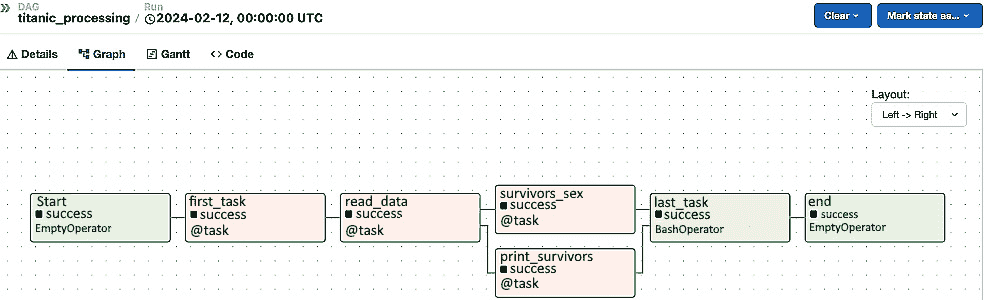
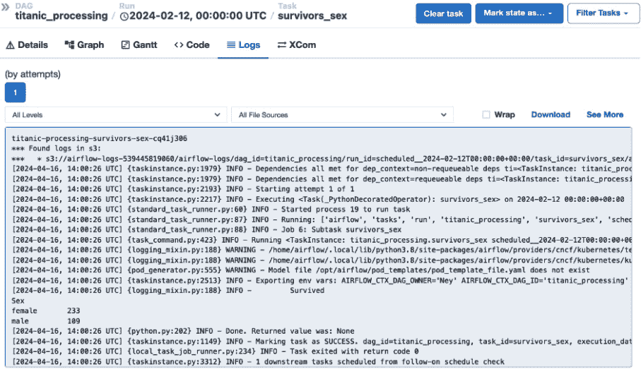

# 8

# 在 Kubernetes 上部署大数据堆栈

在本章中，我们将涵盖在 Kubernetes 上部署关键的大数据技术 —— Spark、Airflow 和 Kafka。随着容器编排和管理变得对于高效运行数据工作负载至关重要，Kubernetes 已成为事实上的标准。在本章结束时，你将能够成功在 Kubernetes 上部署和管理大数据堆栈，构建强大的数据管道和应用程序。

我们将首先使用 Spark 操作员在 Kubernetes 上部署 Apache Spark。你将学习如何配置和监控在 Kubernetes 集群上运行的 Spark 应用程序。能够在 Kubernetes 上运行 Spark 工作负载带来了重要的好处，如动态扩展、版本控制和统一的资源管理。

接下来，我们将在 Kubernetes 上部署 Apache Airflow。你将配置 Kubernetes 上的 Airflow，将其日志链接到 S3，以便于调试和监控，并设置它来编排使用 Spark 等工具构建的数据管道。在 Kubernetes 上运行 Airflow 可以提高可靠性、扩展性和资源利用率。

最后，我们将在 Kubernetes 上部署 Apache Kafka，这对流数据管道至关重要。在 Kubernetes 上运行 Kafka 简化了操作、扩展和集群管理。

在本章结束时，你将拥有在 Kubernetes 上部署和管理大数据堆栈的实践经验。这将使你能够利用 Kubernetes 作为容器编排平台，构建强大、可靠的数据应用程序。

在本章中，我们将涵盖以下主要内容：

+   在 Kubernetes 上部署 Spark

+   在 Kubernetes 上部署 Airflow

+   在 Kubernetes 上部署 Kafka

# 技术要求

在本章的活动中，你应该拥有一个 AWS 账户，并已安装 `kubectl`、`eksctl` 和 `helm`。关于如何设置 AWS 账户以及安装 `kubectl` 和 `eksctl` 的说明，请参考 *第一章*。有关 `helm` 安装的说明，请访问 [`helm.sh/docs/intro/install/`](https://helm.sh/docs/intro/install/)。

我们还将使用 Titanic 数据集进行练习。你可以在 [`github.com/neylsoncrepalde/titanic_data_with_semicolon`](https://github.com/neylsoncrepalde/titanic_data_with_semicolon) 找到我们将使用的版本。

本章中的所有代码都可以在 GitHub 仓库 [`github.com/PacktPublishing/Bigdata-on-Kubernetes`](https://github.com/PacktPublishing/Bigdata-on-Kubernetes) 的 `Chapter08` 文件夹中找到。

# 在 Kubernetes 上部署 Spark

为了帮助我们在 Kubernetes 上部署资源，我们将使用**Helm**。Helm 是 Kubernetes 的包管理器，帮助安装应用程序和服务。Helm 使用名为**Charts**的模板，将安装配置、默认设置、依赖关系等打包成一个易于部署的包。

另一方面，我们有**操作符**。操作符是自定义控制器，扩展了 Kubernetes API，用于管理应用程序及其组件。它们提供了一种声明性方式来创建、配置和管理 Kubernetes 上的复杂状态应用程序。

使用操作符的一些关键优势包括以下几点：

+   **简化的应用程序部署和生命周期管理**：操作符抽象了底层细节，为应用程序部署提供了高层次的抽象，而无需了解 Kubernetes 的复杂性。

+   **与监控工具的集成**：操作符暴露自定义指标和日志，支持与 Prometheus 和 Grafana 等监控堆栈的集成。

+   **Kubernetes 原生**：操作符利用 Kubernetes 的可扩展性，并专门为 Kubernetes 编写，使其能够保持云无关性。

操作符通过创建**自定义资源定义**（**CRDs**）和控制器来扩展 Kubernetes。CRD 允许你在 Kubernetes 中定义一个新的资源类型。例如，SparkOperator 定义了一个 SparkApplication 资源。

操作符接着创建一个控制器，监视这些自定义资源并根据资源的`spec`执行操作。

例如，当创建 SparkApplication 资源时，SparkOperator 控制器会执行以下操作：

+   根据规范创建驱动程序和执行器 Pods

+   挂载存储卷

+   监控应用程序的状态

+   执行日志记录和监控

现在，开始吧：

1.  首先，让我们使用 `eksctl` 创建一个 AWS EKS 集群：

    ```
    eksctl create cluster --managed --alb-ingress-access --node-private-networking --full-ecr-access --name=studycluster --instance-types=m6i.xlarge --region=us-east-1 --nodes-min=3 --nodes-max=4 --nodegroup-name=ng-studycluster
    ```

    请记住，这行代码需要几分钟才能完成。现在，我们需要进行一些重要的配置，以便允许我们的 Kubernetes 集群代表我们创建卷。为此，我们需要安装 AWS EBS CSI 驱动程序。这对于部署 Spark 应用程序不是必须的，但对于 Airflow 部署来说非常重要。

1.  首先，我们需要将 IAM OIDC 提供者与 EKS 集群关联，这样 IAM 角色和用户就能通过 Kubernetes API 进行身份验证。为此，请在终端中输入以下命令：

    ```
    eksctl utils associate-iam-oidc-provider --region=us-east-1 --cluster=studycluster --approve
    ```

1.  接下来，我们将在 `kube-system` 命名空间中创建一个名为 `ebs-csi-controller-sa` 的 IAM 服务账户，并附加指定的 IAM 角色和策略。这个服务账户将由 EBS CSI 驱动程序使用：

    ```
    eksctl create iamserviceaccount --name ebs-csi-controller-sa --namespace kube-system --cluster studycluster --role-name AmazonEKS_EBS_CSI_DriverRole --role-only --attach-policy-arn arn:aws:iam::aws:policy/service-role/AmazonEBSCSIDriverPolicy --approve
    ```

1.  最后，我们将在集群中启用 EBS CSI 驱动程序，并将其链接到之前创建的服务账户和角色。记得将 `<YOUR_ACCOUNT_NUMBER>` 替换为真实值：

    ```
    eksctl create addon --name aws-ebs-csi-driver --cluster studycluster --service-account-role-arn arn:aws:iam::<YOUR_ACCOUNT_NUMBER>:role/AmazonEKS_EBS_CSI_DriverRole --force
    ```

1.  现在，让我们开始实际的 Spark 操作符部署。接下来我们将创建一个命名空间来组织我们的资源：

    ```
    kubectl create namespace spark-operator
    ```

1.  接下来，我们将使用网上提供的 SparkOperator Helm chart 来部署操作符：

    ```
    helm install spark-operator https://github.com/kubeflow/spark-operator/releases/download/spark-operator-chart-1.1.27/spark-operator-1.1.27.tgz --namespace spark-operator --set webhook.enable=true
    ```

1.  检查操作符是否正确部署：

    ```
    kubectl get pods -n spark-operator
    ```

    你应该看到类似这样的输出：

    ```
    NAME                                READY   STATUS
    spark-operator-74db6fcf98-grhdw     1/1     Running
    spark-operator-webhook-init-mw8gf   0/1     Completed
    ```

1.  接下来，我们需要将 AWS 凭证注册为 Kubernetes Secret，以使其可供 Spark 使用。这将允许我们的 Spark 应用程序访问 AWS 中的资源：

    ```
    kubectl create secret generic aws-credentials --from-literal=aws_access_key_id=<YOUR_ACCESS_KEY_ID> --from-literal=aws_secret_access_key="<YOUR_SECRET_ACCESS_KEY>" -n spark-operator
    ```

1.  现在，到了开发我们的 Spark 代码的时候了。到目前为止，你应该已经将泰坦尼克号数据集存储在 Amazon S3 上。在[`github.com/PacktPublishing/Bigdata-on-Kubernetes/blob/main/Chapter08/spark/spark_job.py`](https://github.com/PacktPublishing/Bigdata-on-Kubernetes/blob/main/Chapter08/spark/spark_job.py)上，你可以找到读取 S3 桶中的泰坦尼克号数据集并将其写入另一个桶的简单代码（这个第二个 S3 桶必须是事先创建的——你可以在 AWS 控制台中创建）。

1.  将此文件保存为`spark_job.py`并上传到另一个 S3 桶中。这是 SparkOperator 将要查找代码以运行应用程序的地方。请注意，这段 PySpark 代码与我们之前在*第五章*中看到的有所不同。在这里，我们将 Spark 配置与 Spark 会话分开设置。我们将详细讨论这些配置：

    +   `.set("spark.cores.max", "2")`：这限制了此 Spark 应用程序最多使用两个核心。这可以防止资源的过度分配。

    +   `.set("spark.executor.extraJavaOptions", "-Dcom.amazonaws.services.s3.enableV4=true")` 和 `.set("spark.driver.extraJavaOptions", "-Dcom.amazonaws.services.s3.enableV4=true")`：这些配置启用了使用签名版本 4 认证对 S3 进行读写操作的支持，这种认证方式更为安全。

    +   `.set("spark.hadoop.fs.s3a.fast.upload", True)`：此属性启用了 S3A 连接器的快速上传功能，这可以提高将数据保存到 S3 时的性能。

    +   `.set("spark.hadoop.fs.s3a.impl", "org.apache.hadoop.fs.s3a.S3AFileSystem")`：此配置将 S3 文件系统的实现设置为使用更新的、优化的`s3a`，而不是旧版的`s3`连接器。

    +   `.set("spark.hadoop.fs.s3a.aws.crendentials.provider", "com.amazonaws.auth.EnvironmentVariablesCredentials")`：这将 Spark 配置为从环境变量中获取 AWS 凭证，而无需直接在代码中指定。

    +   `.set("spark.jars.packages", "org.apache.hadoop:hadoop-aws:2.7.3")`：这会添加对 Hadoop AWS 模块的依赖，以便 Spark 能够访问 S3。

    还需要注意的是，默认情况下，Spark 使用`INFO`日志级别。在此代码中，我们将其设置为`WARN`，以减少日志记录并提高日志的可读性。记得将`<YOUR_BUCKET>`替换为你自己的 S3 桶。

1.  上传此代码到 S3 后，接下来就是创建一个包含 SparkApplication 定义的 YAML 文件。代码的内容可以在[`github.com/PacktPublishing/Bigdata-on-Kubernetes/blob/main/Chapter08/spark/spark_job.yaml`](https://github.com/PacktPublishing/Bigdata-on-Kubernetes/blob/main/Chapter08/spark/spark_job.yaml)找到。

    代码定义了一个新的 SparkApplication 资源。这只有在 SparkOperator 创建了 SparkApplication 自定义资源后才有可能。让我们仔细看看这个 YAML 定义在做什么。

    +   YAML 文件的第一个块指定了 apiVersion 和资源类型为 Spark 应用程序。它还为应用程序设置了名称和命名空间。

    +   第二个块定义了一个名为“ivy”的卷挂载，用于缓存依赖项，以避免每次作业运行时重新获取它们。它挂载到驱动程序和执行器的`/tmp`目录。

    +   第三个块配置了 Spark 属性，启用了 Ivy 缓存目录，并设置了 Kubernetes 的资源分配批量大小。

    +   第四个块配置了 Hadoop 属性，以使用 S3A 文件系统实现。

    +   第五个块将此 Spark 应用程序设置为 Python 类型，指定要使用的 Python 版本，运行模式为集群模式，并设置要使用的 Docker 镜像——在此情况下是一个之前准备好的与 AWS 和 Kafka 集成的 Spark 镜像。它还定义了即使该镜像已经存在于集群中，也会始终从 Docker Hub 拉取镜像。

    +   第六个块指定了 S3 中主 Python 应用程序文件的位置以及 Spark 版本——在这种情况下是 3.1.1。

    +   第七个块将`restartPolicy`设置为`Never`，这样应用程序只会运行一次。

    其余的块设置了驱动程序和执行器 Pod 的配置。在这里，我们设置了用于访问 S3 的 AWS 访问密钥密文，要求为驱动程序和执行器分别分配 1 个核心和 1GB 内存，并为它们提供相同的资源，我们挂载了一个名为“ivy”的`emptyDir`卷用于缓存依赖项，并设置了 Spark 和驱动程序 Pod 标签用于跟踪。

1.  一旦这个文件保存在你的计算机上，并且你已经有了存储在 S3 中的`.py`文件，就可以运行 Spark 应用程序了。在终端中，输入以下内容：

    ```
    kubectl apply -f spark_job.yaml -n spark-operator
    kubectl get sparkapplication -n spark-operator
    ```

    我们可以通过以下方式获取应用程序的更多细节：

    ```
    kubectl describe sparkapplication/test-spark-job -n spark-operator
    ```

    要查看 Spark 应用程序的日志，请输入以下命令：

    ```
    kubectl logs test-spark-job-driver -n spark-operator
    ```

就这样！你刚刚在 Kubernetes 上运行了你的第一个 Spark 应用程序！Kubernetes 不会让你用相同的名称部署另一个作业，因此，要重新测试，你应该删除该应用程序：

```
kubectl delete sparkapplication/test-spark-job -n spark-operator
```

现在，让我们看看如何使用官方 Helm 图表在 Kubernetes 上部署 Airflow。

# 在 Kubernetes 上部署 Airflow

在 Kubernetes 上部署 Airflow 非常简单。然而，在 Helm 图表配置中有一些重要的细节，我们需要注意。

首先，我们将下载最新的 Helm 图表到本地环境：

```
helm repo add apache-airflow https://airflow.apache.org
```

接下来，我们需要配置一个`custom_values.yaml`文件，以更改图表的默认部署配置。此 YAML 文件的示例可以在[`github.com/PacktPublishing/Bigdata-on-Kubernetes/blob/main/Chapter08/airflow/custom_values.yaml`](https://github.com/PacktPublishing/Bigdata-on-Kubernetes/blob/main/Chapter08/airflow/custom_values.yaml)找到。我们将不逐行查看整个文件，而是只关注部署所需的最重要配置：

1.  在`defaultAirflowTag`和`airflowVersion`参数中，确保设置为`2.8.3`。这是 1.13.1 Helm 图表版本可用的最新 Airflow 版本。

1.  `executor` 参数应设置为`KubernetesExecutor`。这样可以确保 Airflow 使用 Kubernetes 基础设施来动态启动任务。

1.  在`env`部分，我们将配置“远程日志记录”以允许 Airflow 将日志保存到 S3 中。这是审计和节省 Kubernetes 存储资源的最佳实践。在这里，我们为 Airflow 配置了三个环境变量。第一个设置远程日志记录为`"True"`；第二个定义 Airflow 将日志写入的 S3 桶和文件夹；最后一个定义 Airflow 将在 AWS 中进行身份验证时使用的“连接”。稍后我们将在 Airflow UI 中设置此项。这是这个块应该是什么样的例子：

    ```
    env:
        - name: "AIRFLOW__LOGGING__REMOTE_LOGGING"
        value: "True"
        - name: "AIRFLOW__LOGGING__REMOTE_BASE_LOG_FOLDER"
        value: "s3://airflow-logs-<YOUR_ACCOUNT_NUMBER>/airflow-logs/"
        - name: "AIRFLOW__LOGGING__REMOTE_LOG_CONN_ID"
        value: "aws_conn"
    ```

1.  在 webserver 块中，我们必须配置第一个用户凭据和服务类型。`service` 参数应该设置为“LoadBalancer”，这样我们就可以通过浏览器访问 Airflow 的 UI 界面。`defaultUser` 块应该如下所示：

    ```
        defaultUser:
          enabled: true
          role: Admin
          username: <YOUR_USERNAME>
          email: admin@example.com
          firstName: NAME
          lastName: LASTNAME
          password: admin
    ```

    在值文件中设置一个简单的密码，并在部署完成后尽快在 UI 中更改它，这一点非常重要。这样，你的凭据就不会以明文形式存储。这将避免发生重大安全事件。

1.  `redis.enabled` 参数应设置为`false`。因为我们使用的是 Kubernetes 执行器，所以 Airflow 不需要 Redis 来管理任务。如果我们没有将此参数设置为`false`，Helm 仍然会部署一个 Redis Pod。

1.  最后，在`dags`块中，我们将配置`gitSync`。这是将我们的 DAG 文件发送到 Airflow 并保持它们在 GitHub（或你喜欢的任何其他 Git 仓库）中更新的最简单方法。首先，你应该创建一个名为`dags`的 GitHub 仓库，用来存储 Python DAG 文件。然后，你应该按如下方式配置`gitSync`块：

    ```
    gitSync:
        enabled: true
        repo: https://github.com/<USERNAME>/<REPO_NAME>.git
        branch: main
        rev: HEAD
        ref: main
        depth: 1
        maxFailures: 0
        subPath: "dags"
    ```

    请注意，我们在原始文件中省略了几个注释以提高可读性。`custom_values.yaml` 文件已准备好部署。现在我们可以在终端中执行以下命令：

    ```
    helm install airflow apache-airflow/airflow --namespace airflow --create-namespace -f custom_values.yaml
    ```

这个部署可能需要几分钟才能完成，因为 Airflow 在使 UI 可用之前会执行数据库迁移任务。

接下来，我们需要获取 UI 的 LoadBalancer 的 URL。在终端中，输入以下命令：

```
kubectl get svc -n airflow
```

在`EXTERNAL-IP`列中，你会注意到`airflow-webserver`服务有一个`非空`值。复制这个 URL 并粘贴到浏览器中，添加`:8080`以访问 Airflow 的正确端口。

登录到 UI 后，点击`aws_conn`（正如我们在值文件中所述），选择**Amazon Web Services**作为连接类型，并输入你的访问密钥 ID 和密钥访问密钥。（此时，你应该已经将 AWS 凭据存储在本地——如果没有，在 AWS 控制台中，进入 IAM 并为你的用户生成新的凭据。你将无法在屏幕上看到旧的凭据。）

最后，我们将使用从 *第五章* 中改编的 DAG 代码，该代码将在 Kubernetes 上顺利运行。此 DAG 将自动从互联网下载 Titanic 数据集，执行简单的计算，并打印结果，这些结果将在“日志”页面上查看。代码内容可以通过以下链接访问：[`github.com/PacktPublishing/Bigdata-on-Kubernetes/blob/main/Chapter08/airflow/dags/titanic_dag.py`](https://github.com/PacktPublishing/Bigdata-on-Kubernetes/blob/main/Chapter08/airflow/dags/titanic_dag.py)。

将此 Python 代码的副本上传到你的 GitHub 仓库，并在几秒钟内它将出现在 Airflow UI 中。现在，激活你的 DAG（点击 `switch` 按钮）并跟踪执行 (*图 8.1*)。



图 8.1 – DAG 成功执行

然后点击任何任务以选择它，点击 **日志**。你将看到 Airflow 日志直接从 S3 读取 (*图 8.2*)。



图 8.2 – S3 中的 Airflow 日志

恭喜！现在你已经在 Kubernetes 上成功启动并运行 Airflow。在 *第十章* 中，我们将把所有这些部分组合在一起，构建一个完全自动化的数据管道。

接下来，我们将在 Kubernetes 上使用 Strimzi 操作符部署一个 Kafka 集群。让我们开始吧。

# 在 Kubernetes 上部署 Kafka

Strimzi 是一个开源操作符，简化了在 Kubernetes 上部署和管理 Kafka 集群的过程，通过创建新的 CRD。它由 Strimzi 项目开发和维护，Strimzi 项目是 **云原生计算基金会** (**CNCF**) 的一部分。Strimzi 操作符提供了一种声明式的方法来管理 Kubernetes 上的 Kafka 集群。用户不再需要手动创建和配置 Kafka 组件，而是通过 Kubernetes 自定义资源定义所需的 Kafka 集群状态。然后，操作符会根据指定的配置自动部署和管理 Kafka 组件：

1.  要在 Kubernetes 中部署 Strimzi，首先，我们需要安装其 Helm 图表：

    ```
    helm repo add strimzi https://strimzi.io/charts/
    ```

1.  接下来，我们使用以下命令安装操作符：

    ```
    helm install kafka strimzi/strimzi-kafka-operator --namespace kafka --create-namespace --version 0.40.0
    ```

1.  我们可以通过以下方式检查部署是否成功：

    ```
    helm status kafka -n kafka
    kubectl get pods -n kafka
    ```

1.  现在，是时候配置我们 Kafka 集群的部署了。以下是一个 YAML 文件，用于使用新的 CRD 配置 Kafka 集群。为了更好地理解，我们将它分解成几个部分：

    **kafka_jbod.yaml**

    ```
    apiVersion: kafka.strimzi.io/v1beta2
    kind: Kafka
    metadata:
        name: kafka-cluster
    spec:
        kafka:
        version: 3.7.0
        replicas: 3
    ```

    代码的第一部分指定了 API 版本和正在定义的资源类型。在本例中，这是一个由 Strimzi 操作符管理的 Kafka 资源。然后，我们为 Kafka 资源定义了元数据，特别是其名称，设置为`kafka-cluster`。接下来的代码块指定了 Kafka 经纪人的配置。我们将 Kafka 版本设置为 3.7.0，并指定希望集群中有三个副本（Kafka 经纪人实例）：

    ```
        listeners:
          - name: plain
            port: 9092
            type: internal
            tls: false
          - name: tls
            port: 9093
            type: internal
            tls: true
          - name: external
            port: 9094
            type: loadbalancer
            tls: false
    ```

    接下来，我们定义 Kafka 经纪人的监听器。我们将配置三个监听器：

    +   `plain`: 一个没有 TLS 加密的内部监听器，端口为 `9092`

    +   `tls`: 一个启用了 TLS 加密的内部监听器，端口为 `9093`

    +   `external`: 一个暴露为 LoadBalancer 服务的外部监听器，端口为 `9094`，不使用 TLS 加密

        ```
            readinessProbe:
              initialDelaySeconds: 15
              timeoutSeconds: 5
            livenessProbe:
              initialDelaySeconds: 15
              timeoutSeconds: 5
        ```

    下一个块配置了 Kafka brokers 的就绪和存活探针。就绪探针检查 broker 是否准备好接受流量，而存活探针检查 broker 是否仍在运行。`initialDelaySeconds` 参数指定了在执行第一次探针之前等待的秒数，而 `timeoutSeconds` 参数指定了探针被认为失败后的秒数：

    ```
        config:
          default.replication.factor: 3
          num.partitions: 9
          offsets.topic.replication.factor: 3
          transaction.state.log.replication.factor: 3
          transaction.state.log.min.isr: 1
          log.message.format.version: "3.7"
          inter.broker.protocol.version: "3.7"
          min.insync.replicas: 2
          log.retention.hours: 2160
    ```

    这个 `kafka.config` 块指定了 Kafka brokers 的各种配置选项，例如默认的复制因子、新主题的分区数量、偏移量和事务状态日志主题的复制因子、日志消息格式版本，以及日志保留期（以小时为单位）。Kafka 默认的日志保留期是 7 天（168 小时），但我们可以根据需要修改这个参数。需要记住的是，更长的保留期意味着更多的磁盘存储使用，因此要小心：

    ```
        storage:
          type: jbod
          volumes:
          - id: 0
            type: persistent-claim
            size: 15Gi
            deleteClaim: false
          - id: 1
            type: persistent-claim
            size: 15Gi
            deleteClaim: false
    ```

    `kafka.storage` 块配置了 Kafka brokers 的存储。我们使用 `deleteClaim` 设置为 `false`，以防止在删除 Kafka 集群时删除持久化存储卷声明：

    ```
        resources:
          requests:
            memory: 512Mi
            cpu: "500m"
          limits:
            memory: 1Gi
            cpu: "1000m"
    ```

    接下来，`kafka.resources` 块指定了 Kafka brokers 的资源请求和限制。我们请求 512 MiB 的内存和 500 毫 CPU，并将内存限制设置为 1 GiB，CPU 限制设置为 1 `cpu`：

    ```
        zookeeper:
        replicas: 3
        storage:
            type: persistent-claim
            size: 10Gi
            deleteClaim: false
        resources:
          requests:
            memory: 512Mi
            cpu: "250m"
          limits:
            memory: 1Gi
            cpu: "500m"
    ```

    最后，我们有一个 `zookeeper` 块，它配置了 Kafka 集群使用的 ZooKeeper 集群。我们为 ZooKeeper 指定了三个副本，使用 10 GiB 的持久化存储卷声明，并设置了类似于 Kafka brokers 的资源请求和限制。

1.  配置文件准备好后，在你的机器上输入以下命令来将集群部署到 Kubernetes：

    ```
    kubectl apply -f kafka_jbod.yaml -n kafka
    kubectl get kafka -n kafka
    ```

    这将输出以下内容：

    ```
    NAME          DESIRED KAFKA REPLICAS   DESIRED ZK REPLICAS
    kafka-class   3                        3
    kubectl describe kafka -n kafka
    ```

    现在，检查 Pods：

    ```
    kubectl get pods -n kafka
    ```

输出显示了三个 Kafka broker 和 ZooKeeper 实例：

```
NAME                      READY   STATUS
kafka-class-kafka-0       1/1     Running
kafka-class-kafka-1       1/1     Running
kafka-class-kafka-2       1/1     Running
kafka-class-zookeeper-0   1/1     Running
kafka-class-zookeeper-1   1/1     Running
kafka-class-zookeeper-2   1/1     Running
```

恭喜！你已经在 Kubernetes 上成功运行了一个完全操作的 Kafka 集群。接下来的步骤是部署一个 Kafka Connect 集群，并为实时数据管道做好一切准备。由于云端成本效率问题，我们暂时不会进行此操作，但我们将在 *第十章* 中回到这个配置。

# 总结

在本章中，你学习了如何在 Kubernetes 上部署和管理 Apache Spark、Apache Airflow 和 Apache Kafka 等关键大数据技术。将这些工具部署到 Kubernetes 上提供了多个好处，包括简化操作、更好的资源利用、扩展性、高可用性和统一的集群管理。

你首先在 Kubernetes 上部署了 Spark 操作符，并运行了一个 Spark 应用程序来处理来自 Amazon S3 的数据。这使你能够利用 Kubernetes 以云原生的方式运行 Spark 作业，利用动态资源分配和扩展的优势。

接下来，你使用官方 Helm 图表在 Kubernetes 上部署了 Apache Airflow。你配置了 Airflow 使用 Kubernetes 执行器运行，从而使其能够动态地在 Kubernetes 上启动任务。你还设置了远程日志记录到 Amazon S3，以便于监控和调试。在 Kubernetes 上运行 Airflow 提高了可靠性、可扩展性和资源利用率，从而更好地协调数据管道。

最后，你使用 Strimzi 操作符在 Kubernetes 上部署了 Apache Kafka。你配置了一个包含代理、ZooKeeper 集群、持久化存储卷以及内部/外部监听器的 Kafka 集群。在 Kubernetes 上部署 Kafka 简化了操作、扩展、高可用性和集群管理，从而帮助构建流数据管道。

总体而言，你现在已经具备了在 Kubernetes 上部署和管理大数据栈关键组件的实战经验。这将使你能够构建可靠、可扩展的数据应用和管道，利用 Kubernetes 容器编排的强大功能。 本章中学习的技能对于在云原生环境中高效运行大数据工作负载至关重要。

在下一章，我们将看到如何在 Kubernetes 上构建数据消费层，并了解如何通过工具连接这些层来可视化和使用数据。
