# 第九章：数据消费层

在今天的数据驱动世界中，组织正在处理日益增长的数据量，有效地消费和分析这些数据对于做出明智的业务决策至关重要。当我们深入探讨基于 Kubernetes 的大数据领域时，必须解决数据消费层的关键组成部分。这一层将作为数据存储库和需要提取有价值洞察并对业务产生影响的业务分析师之间的桥梁。

在本章中，我们将探讨两个强大的工具，它们将使您能够释放基于 Kubernetes 的数据架构的潜力：**Trino** 和 **Elasticsearch**。Trino，一个分布式 SQL 查询引擎，将使您能够直接查询您的数据湖，消除了传统数据仓库的需求。您将学习如何在 Kubernetes 上部署 Trino，监视其性能，并对存储在 Amazon S3 中的数据执行 SQL 查询。

此外，我们将介绍 Elasticsearch，这是一个广泛用于实时数据管道的高度可伸缩和高效的搜索引擎，以及其强大的数据可视化工具 **Kibana**。您将获得在 Kubernetes 上部署 Elasticsearch、对数据进行索引以进行优化存储和检索，并使用 Kibana 构建简单而富有洞察力的可视化的实际经验。这将使您能够分析实时数据流并发现有价值的模式和趋势。

到达本章结束时，您将掌握成功部署和利用 Trino 和 Elasticsearch 在 Kubernetes 上所需的技能。您将能够直接对数据湖执行 SQL 查询，监视查询执行和历史记录，并利用 Elasticsearch 和 Kibana 进行实时数据分析和可视化。

在本章中，我们将讨论以下主要主题：

+   开始使用 SQL 查询引擎

+   在 Kubernetes 中部署 Trino

+   在 Kubernetes 中部署 Elasticsearch

+   运行查询和连接其他工具

# 技术要求

对于本章，您应准备好一个用于部署的 AWS EKS 集群，并在本地安装了 DBeaver Community ([`dbeaver.io/`](https://dbeaver.io/))。我们将继续在我们在 *第八章* 部署的集群上工作。本章的所有代码都可以在 [`github.com/PacktPublishing/Bigdata-on-Kubernetes`](https://github.com/PacktPublishing/Bigdata-on-Kubernetes) 的 `Chapter09` 文件夹中找到。

# 开始使用 SQL 查询引擎

在大数据的世界中，我们存储和分析数据的方式发生了重大转变。曾经是数据分析首选方案的传统数据仓库，已经被更现代、更具可扩展性的方法所取代，例如 SQL 查询引擎。这些引擎，如**Trino**（前身为 Presto）、**Dremio**和**Apache Spark SQL**，提供了比传统数据仓库更高性能、更具性价比和更灵活的替代方案。

接下来，我们将看到数据仓库和 SQL 查询引擎之间的主要区别。

## 传统数据仓库的局限性

传统数据仓库是为存储和分析关系数据库中的结构化数据而设计的。然而，随着大数据的到来以及日志文件、传感器数据和社交媒体数据等多样化数据源的普及，数据仓库的局限性逐渐显现。这些局限性包括：

+   **可扩展性**：数据仓库通常难以实现水平扩展，处理大量数据时效率较低。

+   **数据摄取**：将数据**提取、转换和加载**（**ETL**）到数据仓库的过程可能复杂、耗时且资源密集。

+   **成本**：数据仓库的搭建和维护可能非常昂贵，尤其是在处理大量数据时。

+   **灵活性**：数据仓库通常优化用于结构化数据，可能无法高效处理半结构化或非结构化数据。

SQL 查询引擎的开发旨在解决这些局限性。让我们来看它们是如何工作的。

## SQL 查询引擎的崛起

SQL 查询引擎，如 Trino，提供了一种分布式、可扩展且具性价比的解决方案，用于查询存储在各种数据源中的大规模数据集，包括对象存储（如 Amazon S3、Google Cloud Storage 和 Azure Blob Storage）、关系数据库和 NoSQL 数据库。我们将在下一部分深入探讨 SQL 查询引擎的架构。

以下是 SQL 查询引擎的一些关键优势：

+   **高性能**：SQL 查询引擎旨在利用分布式计算的优势，使它们能够在多个节点上并行处理大规模数据集。这种并行化使得即使在庞大的数据集上也能进行高性能查询。

+   **性价比高**：通过利用对象存储并将存储与计算分离，SQL 查询引擎相比传统数据仓库可以显著降低数据存储和处理的成本。

+   **可扩展性**：SQL 查询引擎可以通过向集群中添加更多节点来水平扩展，使其能够高效处理不断增长的数据量。

+   **灵活性**：SQL 查询引擎能够查询多种数据源，包括结构化、半结构化和非结构化数据，使其具有高度的灵活性和适应性，能够应对各种数据格式和存储系统。

+   **开源**：许多 SQL 查询引擎都是开源项目，允许组织利用社区贡献的力量并避免供应商锁定。

现在，让我们理解一下这种解决方案的底层架构。

## SQL 查询引擎的架构

Trino 等 SQL 查询引擎设计为在分布式计算环境中工作，其中多个节点协同处理查询并返回结果。该架构通常包括以下组件：

+   **协调节点**，负责解析 SQL 查询，创建分布式执行计划，并协调查询在工作节点之间的执行。

+   一组**工作节点**，负责执行协调节点分配的任务。它们从底层数据源读取数据，执行计算，并根据需要与其他工作节点交换中间结果。

+   一个**元数据存储**，其中包含有关数据源、表定义及查询执行所需的其他元数据的信息。

当用户向 SQL 查询引擎提交 SQL 查询时，发生的过程如下：

1.  首先，协调节点接收查询并解析它，以创建一个分布式**执行计划**。

1.  执行计划被划分为更小的任务，这些任务被分配给可用的工作节点。

1.  工作节点从底层数据源读取数据，执行计算，并根据需要交换中间结果。

1.  协调节点收集并合并来自工作节点的结果，生成最终的查询结果，然后返回给客户端应用程序的用户。

这种分布式架构使 SQL 查询引擎能够利用多个节点的联合计算能力，使其能够高效处理大数据集并提供高性能的查询执行。

在 Trino 的情况下，它可以直接连接到对象存储系统，如 Amazon S3、Azure Blob Storage 或 Google Cloud Storage，其中数据通常以 Parquet、ORC 或 CSV 等格式存储。Trino 可以直接从对象存储读取并处理这些数据，无需中间的数据加载或转换步骤。这种能力消除了单独的数据摄取过程的需要，简化了复杂性并加速了洞察的获取时间。

Trino 的分布式架构使其能够将查询执行分配到多个工作节点，每个节点并行处理数据的一部分。这样的并行化使 Trino 能够利用集群的计算能力，从而在处理大规模数据集时实现高性能查询执行。

此外，Trino 的成本效益来源于它能够将存储与计算分离。通过利用对象存储进行数据存储，组织可以利用这些存储系统的低成本和可扩展性，同时根据需要动态分配计算资源（工作节点）以执行查询。这种关注点的分离使组织能够优化其基础设施成本，并根据特定需求独立地扩展资源。

现在，让我们进行一个实践练习，看看如何将 Trino 部署到 Kubernetes，并将其连接到 Amazon S3 作为数据源。

# 在 Kubernetes 中部署 Trino

使用官方 Helm 图表部署 Trino 非常简单。首先，我们使用以下命令安装该图表：

```
helm repo add trino https://trinodb.github.io/charts
```

接下来，我们将配置`custom_values.yaml`文件。该文件的完整版本可以在[`github.com/PacktPublishing/Bigdata-on-Kubernetes/blob/main/Chapter09/trino/custom_values.yaml`](https://github.com/PacktPublishing/Bigdata-on-Kubernetes/blob/main/Chapter09/trino/custom_values.yaml)找到。此部署仅需少量自定义配置。首先，`server.workers`参数允许我们设置 Trino 集群的工作节点数。我们将其设置为`2`，但如果要处理大数据查询，建议进行扩展：

```
server:
  workers: 2
```

在参数块中，将`image.tag`参数设置为`432`，因为这是与我们使用的图表版本（0.19.0）兼容的最新 Trino 版本：

```
image:
  registry: ""
  repository: trinodb/trino
  tag: 432
```

在`additionalCatalogs`部分，我们必须配置 Trino 使用 AWS Glue 数据目录。该代码块应该如下所示：

```
additionalCatalogs:
  hive: |
    connector.name=hive
    hive.metastore=glue
```

最后，我们将`service.type`参数设置为`LoadBalancer`，以便能够从 AWS 外部访问 Trino（仅用于测试，不适用于生产环境）：

```
service:
  type: LoadBalancer
  port: 8080
```

就这样。我们已经准备好在 Kubernetes 上启动 Trino。

注意

我们没有使用任何认证方法（密码、OAuth、证书等）。在生产环境中，你应该设置合适的认证方法，并将流量限制在你的 VPC（私有网络）内，而不是像这里一样将负载均衡器暴露到互联网上。这个简单的配置仅用于培训和非关键数据。

保存`custom_values.yaml`文件后，使用以下命令部署 Trino：

```
helm install trino trino/trino -f custom_values.yaml -n trino --create-namespace --version 0.19.0
```

现在，我们可以使用以下命令检查部署是否成功：

```
kubectl get pods,svc -n trino
```

这将产生如下输出：

```
NAME                                    READY   STATUS
pod/trino-coordinator-dbbbcf9d9-94wsn   1/1     Running
pod/trino-worker-6c58b678cc-6fgjs       1/1     Running
pod/trino-worker-6c58b678cc-hldrb       1/1     Running
NAME           TYPE          CLUSTER-IP       EXTERNAL-IP
service/trino  LoadBalancer  10.100.246.148   xxxx.us-east-1.elb.amazonaws.com
```

输出已简化以提高可视化效果。我们可以看到一个协调节点和两个工作节点，这正是我们设置的节点数。现在，复制输出中`EXTERNAL-IP`列提供的 URL，并将其粘贴到浏览器中，在末尾加上`:8080`。你应该能看到登录页面。

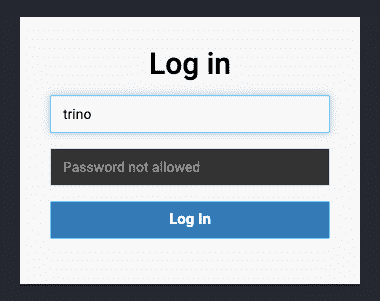

图 9.1 – Trino 登录页面

默认用户是`trino`。由于我们在部署时没有设置任何密码，因此不需要密码。点击**登录**后，你将看到 Trino 的监控页面。

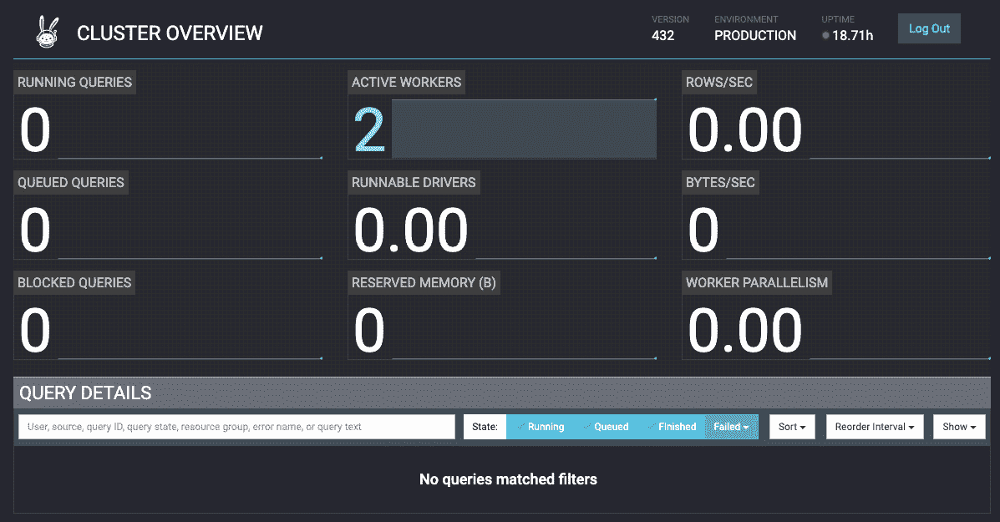

图 9.2 – Trino 的监控页面

接下来，我们将使用相同的`LoadBalancer` URL，通过 DBeaver（一款开源 SQL 客户端）与 Trino 进行交互。

## 连接 DBeaver 和 Trino

要连接 Trino，首先，打开 DBeaver 并创建一个新的 Trino 连接。在配置部分（`trino`作为用户名，密码留空）。

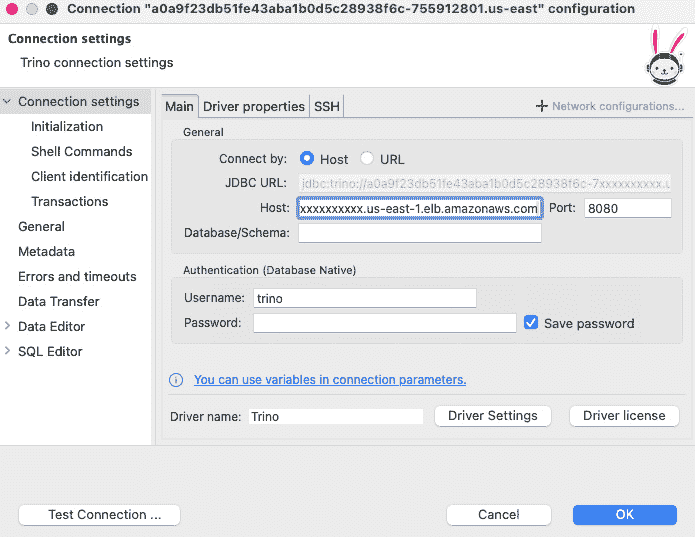

图 9.3 – DBeaver 连接配置

然后，点击**测试连接 …**。如果这是第一次配置 Trino 连接，DBeaver 会自动找到必要的驱动程序并弹出新窗口，提示您下载它。您可以点击**确定**并完成安装，然后完成配置。

在尝试访问数据之前，我们需要对一些数据进行目录化，并使其在 Glue 数据目录中可用，同时设置一个 IAM 权限，允许 Trino 访问目录和底层数据。让我们开始吧。

从[`github.com/neylsoncrepalde/titanic_data_with_semicolon`](https://github.com/neylsoncrepalde/titanic_data_with_semicolon)下载数据集，并将 CSV 文件存储在一个名为`titanic`的文件夹中的 S3 存储桶里。Glue 只理解来自文件夹中的表，而不是孤立的文件。现在，我们将创建一个**Glue 爬虫**。该爬虫将扫描数据集，映射其列和列类型，并在目录中注册元数据：

1.  在您的 AWS 账户中，输入`Glue`以进入 AWS Glue 服务，展开侧边菜单中的**数据目录**选项，点击**爬虫**（*图 9.4*）。

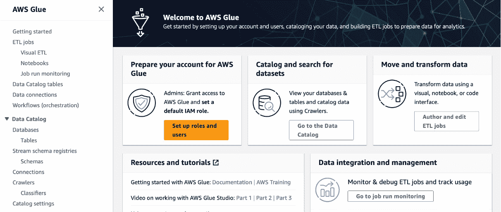

图 9.4 – AWS Glue 着陆页

1.  接下来，点击`bdok-titanic-crawler`（您可以选择任何名称）。点击**下一步**。

1.  在下一页，点击`s3://<YOUR_BUCKET_NAME>/titanic/`。您可以保持其他配置为默认。点击**添加 S3 数据源**，然后点击**下一步**。

1.  在下一步中，点击`AWSGlueServiceRole-titanic`。点击**下一步**。

1.  在下一页，点击`bdok-database`，点击**创建数据库**，然后关闭此窗口并返回到**Glue 爬虫** **配置**标签页。

1.  返回到爬虫页面，点击刷新按钮，选择您的新**bdok-database**数据库。保持其他选项为默认。点击**下一步**。

1.  现在，在最后一节中，仔细检查所有信息并点击**创建爬虫**。

1.  当准备好后，您将被带到 AWS 控制台的爬虫页面。点击**运行爬虫**以启动爬虫。它应该运行约 1 到 2 分钟（*图 9.5*）。

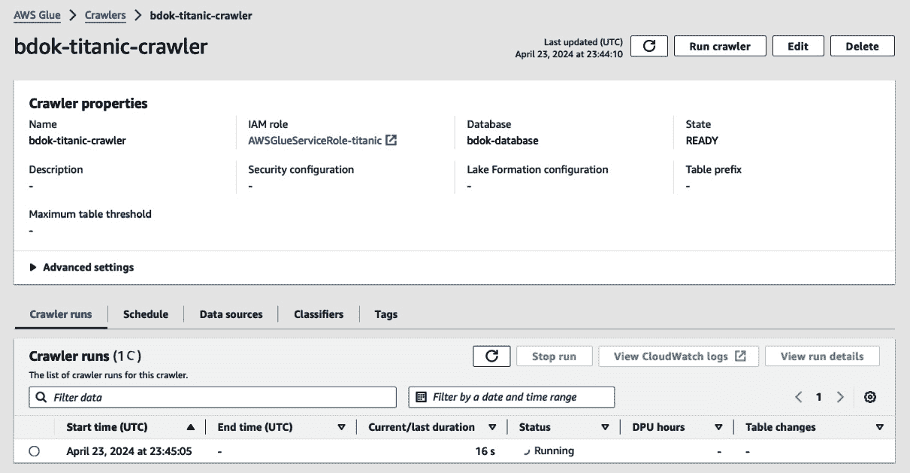

图 9.5 – bdok-titanic-crawler

1.  爬虫完成后，您可以通过访问**数据目录表**菜单项验证表是否已正确目录化。**titanic** 表应与**bdok-database**数据库一起列出（*图 9.6*）。

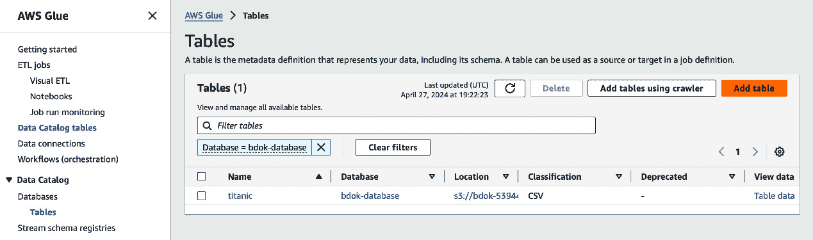

图 9.6 – Glue 数据目录表

1.  点击`titanic`表的名称，检查列是否正确映射。

1.  现在，我们需要创建一个 IAM 策略，授权 Kubernetes 访问目录和存储在 S3 中的数据。为此，在控制台中，进入`studycluster`，你会看到为 Kubernetes 创建的两个角色，一个是服务角色，一个是节点实例角色。我们需要更改节点实例角色的权限（*图 9.7*）。

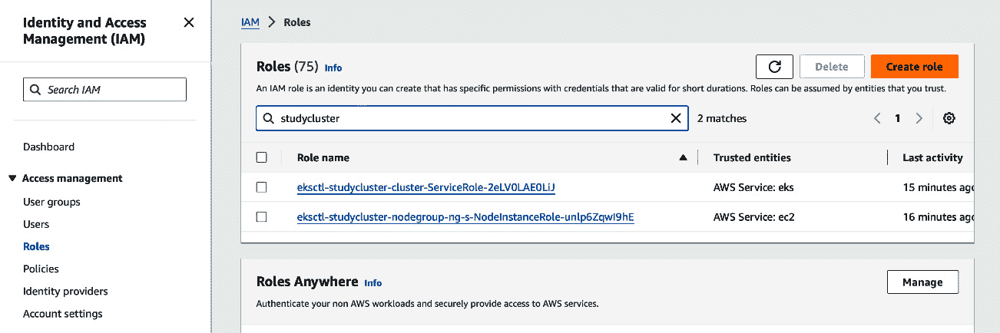

图 9.7 – IAM 角色页面

1.  点击节点实例角色，然后点击**添加权限**按钮，选择**创建** **内联策略**。

1.  在**指定权限**页面，点击以 JSON 文档方式编辑，并粘贴此 GitHub 仓库中的 JSON 文件：[`github.com/PacktPublishing/Bigdata-on-Kubernetes/blob/main/Chapter09/trino/iam/AthenaFullWithAllBucketsPolicy.json`](https://github.com/PacktPublishing/Bigdata-on-Kubernetes/blob/main/Chapter09/trino/iam/AthenaFullWithAllBucketsPolicy.json)（*图 9.8*）。此策略允许 Athena 和 Glue 权限，并获取任何桶中的所有 S3 数据。请记住，这是一个非常开放的策略，不应在生产环境中使用。最好的安全实践是仅允许访问所需的桶。

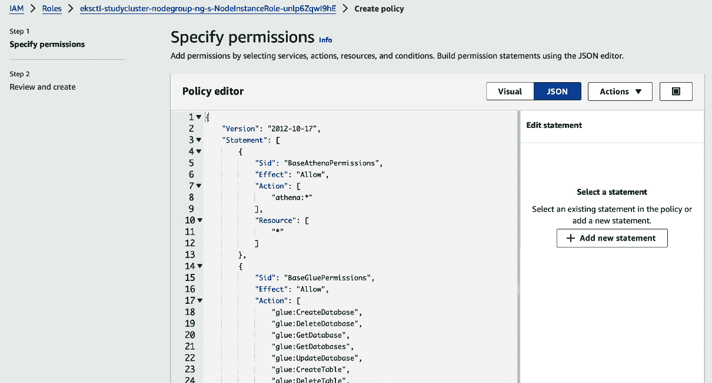

图 9.8 – 指定权限

1.  点击`AthenaFullWithAllBucketsPolicy`，以便稍后更方便地搜索此策略。然后，点击**创建策略**。我们就准备好了！

现在，让我们回到 DBeaver 并玩一些查询。首先，我们需要找到表存储的位置。在 DBeaver 中展开 Trino 连接，你会看到一个名为**hive**的数据库。这是 Glue 数据目录中的数据在 Trino 中的镜像。展开**hive**，你会看到**bdok-database**目录。如果展开**表格**，你会看到映射的**titanic**数据集。

要测试查询，右键点击**hive**数据库，选择**SQL 编辑器**，然后选择**新建 SQL 脚本**。现在，运行查询：

```
select * from hive."bdok-database".titanic
```

你应该能看到如下结果（*图 9.9*）：

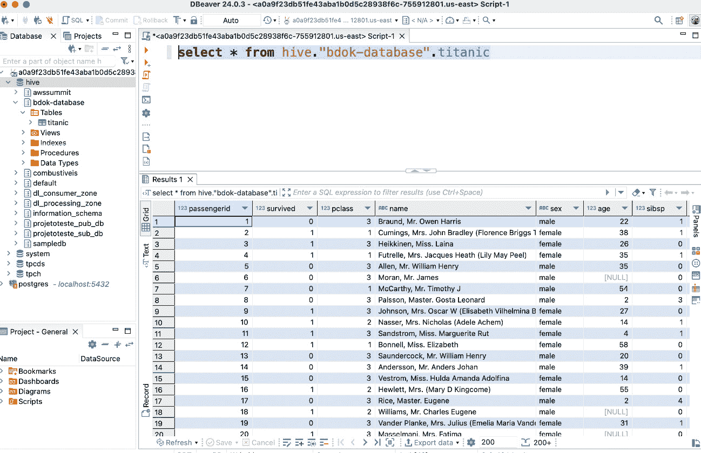

图 9.9 – Trino 的 DBeaver 结果

当然，Trino 可以执行我们喜欢的任何计算或聚合。让我们尝试一个简单的查询，按`pclass`和`sex`统计所有乘客的数量和平均年龄。我们将按`sex`和`pclass`的顺序显示结果。

```
select
    pclass,
    sex,
    COUNT(1) as people_count,
    AVG(age) as avg_age
from hive."bdok-database".titanic
group by pclass, sex
order by sex, pclass
```

这个查询返回了以下结果：

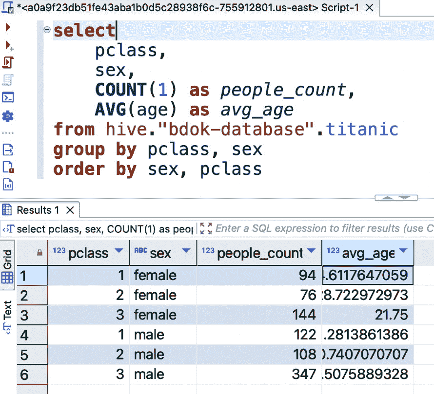

图 9.10 – Titanic 数据集上的简单查询

现在，让我们再次访问 Trino 的监控页面，查看我们刚才运行的查询。在**查询详情**下勾选**已完成**框，以查看所有查询；第一个显示的就是我们刚才运行的查询。点击它查看详细信息。

就是这样！你已经成功地在 Kubernetes 上部署了 Trino，并利用它查询了来自 Amazon S3 数据湖的数据。在接下来的部分，我们将开始使用 Elasticsearch。

# 在 Kubernetes 中部署 Elasticsearch

虽然 Trino 提供了一个强大的 SQL 接口，用于查询数据湖中的结构化数据，但许多现代应用程序也需要实时分析半结构化和非结构化数据，如日志、指标和文本。对于这些类型的用例，Elasticsearch（或者 ELK 堆栈，指代 Elasticsearch、Logstash 和 Kibana）提供了一个强大的解决方案。

Elasticsearch 是一个开源的分布式、RESTful 搜索与分析引擎，建立在 Apache Lucene 之上。它旨在快速并几乎实时地存储、搜索和分析大量数据。

Elasticsearch 的核心是一个 NoSQL 数据库，它使用 JSON 文档来表示数据。它会对每个字段中的所有数据进行索引，并使用高级数据结构和索引技术使得搜索速度极快。

## Elasticsearch 如何存储、索引和管理数据

数据以单独的 JSON 文档存储在 Elasticsearch 中。这些文档会被分组为索引内的类型。你可以将索引视为一个具有定义映射或模式的数据库表。

向 Elasticsearch 添加数据时，你需要向相应的索引发送一个 HTTP 请求，请求体中包含 JSON 文档。Elasticsearch 会使用先进的数据结构（如 Apache Lucene 的倒排索引）自动对文档中的所有字段数据进行索引。

这个索引过程优化了数据，使其能够进行极快的查询和聚合。Elasticsearch 将数据分布到分片中，这些分片可以被分配到集群中的不同节点，以实现冗余和可扩展性。

当你想要从 Elasticsearch 查询或检索数据时，你可以使用 RESTful 搜索 API，通过简单的 JSON 请求体定义查询。查询结果同样以 JSON 格式返回。

Elasticsearch 从一开始就是作为一个分布式系统设计的。它可以扩展到数百台服务器，并处理 PB 级的数据。其核心元素如下：

+   **节点**，是 Elasticsearch 的运行实例，它们共同构成一个 **集群**

+   **索引**，是具有相似特征的文档集合

+   **分片**，是索引的低级分区，包含索引中所有文档的一部分

+   **副本**，是用于冗余和提高性能的分片副本

Elasticsearch 分布式架构的核心是分片系统。分片指的是将 Elasticsearch 索引水平拆分成多个部分，称为分片。这使得索引数据可以分布在集群中的多个节点上，从而提供多个关键好处：

+   **横向扩展性**：通过将分片分布到各个节点，Elasticsearch 可以有效地横向扩展，以处理更多数据和更高的查询/索引吞吐量。随着数据集的增长，您只需向集群中添加更多节点，Elasticsearch 会自动迁移分片以平衡负载。

+   **高可用性**：每个分片可以有一个或多个副本分片。副本是主分片的完整副本。副本提供冗余和高可用性——如果承载主分片的节点发生故障，Elasticsearch 会自动将副本提升为新的主分片以接管任务。

+   **操作并行化**：由于索引操作（如搜索和聚合）会在每个分片上并行执行，拥有更多的分片可以实现更大的并行化，从而提升性能。

当您在 Elasticsearch 中创建索引时，需要指定该索引应该拥有的主分片数量。例如，如果您为索引配置了三个主分片，Elasticsearch 将把索引数据横向分区为三个分片，并将它们分布到集群中的各个节点上。

每个主分片也可以配置零个或多个副本分片。一个常见的设置是拥有一个副本，这意味着每个分片都有两个副本——一个主分片和一个副本。副本分片也会分布到集群中的节点上，每个副本与其相应的主分片位于不同的节点上以确保冗余。

Elasticsearch 使用分片分配策略自动管理节点之间的分片分配。默认情况下，它会将分片尽可能多地分布到各个节点上以平衡负载。当节点被添加或从集群中移除时，Elasticsearch 会自动迁移分片以重新平衡集群。

查询会在每个分片上并行执行，结果会被合并以产生最终的结果集。写入（索引新文档）会发送到一个主分片，该主分片负责验证数据、使更改持久化，并将更改复制到相关的副本分片。

为索引配置的分片数量在索引创建时是固定的，之后不能更改，因此合理的分片规划非常重要。拥有更多的分片可以实现更大的并行化，但过多的分片也可能增加开销。

一个好的经验法则是从足够数量的分片（3 到 5 个分片）开始，以便索引数据可以分布到多个节点上。如果索引变得非常庞大且需要更多的并行化，可以增加分片数量。然而，一般不建议拥有成百上千个分片，因为这会增加集群管理的开销。

现在，让我们来看一下如何在 Kubernetes 上部署 Elasticsearch。

## Elasticsearch 部署

在这里，我们将使用**Elastic Cloud on Kubernetes**（**ECK**），这是一个官方的 Elastic 操作员，允许你在 Kubernetes 集群上部署、管理和编排 Elastic Stack 应用程序。我们将使用官方的 Helm 图表来安装该操作员。在终端中，输入以下命令：

```
helm repo add elastic https://helm.elastic.co
helm install elastic-operator elastic/eck-operator -n elastic --create-namespace --version 2.12.1
```

这将会将 Helm 图表下载到本地，并在一个名为`elastic`的新环境中部署 Elastic Stack 的默认定义。在这里，我们将使用版本`2.12.1`的 Helm 图表。

现在，我们将为 Elasticsearch 集群配置部署。`elastic_cluster.yaml` YAML 文件可以完成这项工作。

```
apiVersion: elasticsearch.k8s.elastic.co/v1
kind: Elasticsearch
metadata:
  name: elastic
spec:
  version: 8.13.0
  volumeClaimDeletePolicy: DeleteOnScaledownAndClusterDeletion
  nodeSets:
  - name: default
    count: 2
    podTemplate:
      spec:
        containers:
        - name: elasticsearch
          resources:
            requests:
              memory: 2Gi
              cpu: 1
            limits:
              memory: 2Gi
        initContainers:
        - name: sysctl
          securityContext:
            privileged: true
            runAsUser: 0
          command: ['sh', '-c', 'sysctl -w vm.max_map_count=262144']
    volumeClaimTemplates:
    - metadata:
        name: elasticsearch-data
      spec:
        accessModes:
        - ReadWriteOnce
        resources:
          requests:
            storage: 5Gi
        storageClassName: gp2
```

让我们仔细看看这段代码。第一个块指定了 API 版本和我们正在定义的 Kubernetes 资源类型。在这种情况下，它是来自`elasticsearch.k8s.elastic.co/v1` API 组的`Elasticsearch`资源，由 ECK 操作员提供。`metadata`块指定了集群的名称，这里是`elastic`。在`spec`块中，我们设置了要使用的 Elasticsearch 版本（`8.13.0`）以及一个策略，该策略决定了`DeleteOnScaledownAndClusterDeletion`策略在 Elasticsearch 集群缩减或完全删除时删除 PVCs。

`nodeSets`块定义了 Elasticsearch 节点的配置。在这种情况下，我们有一个名为`default`的节点集，节点数为`2`，意味着集群中将有两个 Elasticsearch 节点。`podTemplate`块指定了运行 Elasticsearch 容器的 Pod 的配置。在这里，我们定义了 Elasticsearch 容器的资源请求和限制，将内存请求和限制设置为 2 GiB，CPU 请求为一个 vCPU。

`initContainers`块是官方 Elastic 文档对生产环境的推荐。它定义了一个将在主 Elasticsearch 容器启动之前运行的容器。在这里，我们有一个名为`sysctl`的`initContainer`，它以特权安全上下文运行，并将`vm.max_map_count`内核设置为`262144`。这个设置推荐在 Linux 上运行 Elasticsearch 时使用，以允许在内存映射区域使用中设置更高的限制。

最后，`volumeClaimTemplates`块定义了用于存储 Elasticsearch 数据的 PVC。在这种情况下，我们有一个名为`elasticsearch-data`的 PVC，要求的存储大小为 5 GiB。`accessModes`指定该卷应该是`ReadWriteOnce`，意味着它可以被单个节点以读写方式挂载。`storageClassName`设置为`gp2`，这是 AWS EBS 存储类别的通用 SSD 卷。

在本地保存该文件后，运行以下命令以部署一个 Elasticsearch 集群：

```
kubectl apply -f elastic_cluster.yaml -n elastic
```

使用以下命令监控部署过程：

```
kubectl get pods -n elastic
```

或者，你也可以使用以下命令：

```
kubectl get elastic -n elastic
```

这将提供更多的信息。请注意，这个部署过程可能需要几分钟才能完成。你还可以使用以下命令获取集群的详细信息：

```
kubectl describe elastic -n elastic
```

在输出中，`HEALTH`应为`green`，`PHASE`列应显示`Ready`：

```
NAME      HEALTH   NODES   VERSION   PHASE
elastic   green    2       8.13.0    Ready
```

现在，让我们转向 Kibana。我们将按照相同的流程进行。首先要做的是设置一个名为`kibana.yaml`的 YAML 文件，并配置部署。

```
apiVersion: kibana.k8s.elastic.co/v1
kind: Kibana
metadata:
  name: kibana
spec:
  version: 8.13.0
  count: 1
  elasticsearchRef:
    name: elastic
  http:
    service:
      spec:
        type: LoadBalancer
  podTemplate:
    spec:
      containers:
      - name: kibana
        env:
          - name: NODE_OPTIONS
            value: "--max-old-space-size=2048"
        resources:
          requests:
            memory: 1Gi
            cpu: 0.5
          limits:
            memory: 2Gi
            cpu: 2
```

此代码与以前非常相似，但更简单。主要区别在于`spec`块。首先，`elasticsearchRef`参数指定了 Kibana 应连接到的 Elasticsearch 集群的名称。在这种情况下，它引用了我们之前创建的名为`elastic`的 Elasticsearch 集群。http 块配置了将公开 Kibana 部署的 Kubernetes 服务。具体来说，我们将服务的类型设置为`LoadBalancer`，这意味着云提供商将提供一个负载均衡器来分发 Kibana 实例的流量。最后，在`podTemplate`块中，我们有一个`env`配置，设置了一个名为`NODE_OPTIONS`的环境变量，其值为`--max-old-space-size=2048`，这会增加 Kibana 的最大堆大小。

现在，我们已经准备好部署：

```
kubectl apply -f kibana.yaml -n elastic
```

我们使用与之前相同的命令来监视部署是否成功。现在，我们需要访问 Elastic 和 Kibana 的自动生成密码。我们可以通过以下命令完成：

```
kubectl get secret elastic-es-elastic-user -n elastic -o go-template='{{.data.elastic | base64decode}}'
```

此命令将在屏幕上打印生成的密码。复制并妥善保管。现在，运行以下命令：

```
kubectl get svc -n elastic
```

要获取服务列表，请复制负载均衡器的 URL 地址，并将其粘贴到浏览器中，在末尾添加`:5601`并以 https://开头。Kibana 将不接受常规 HTTP 协议连接。您应该看到登录页面，如*图 9.11*所示。

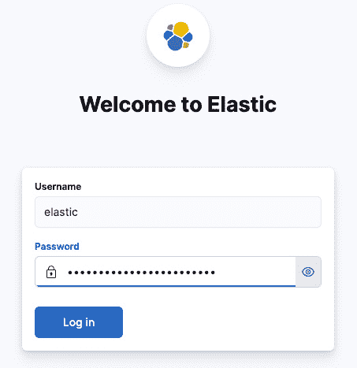

图 9.11 – Kibana 登录页面

插入用户名和密码后，您应该能够访问 Kibana 的第一个空白页面（*图 9.12*）。

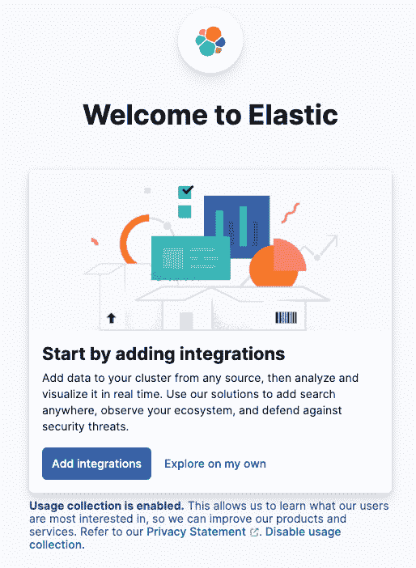

图 9.12 – Kibana 的第一个空白页面

点击**自行探索**，现在您可以尽情使用 Elastic（虽然目前还没有任何数据）。为此，我们将尝试使用我们熟悉的 Titanic 数据集。在**主页**上，点击左上角的菜单，然后点击**堆栈管理**（最后一个选项）。在下一页中，左侧菜单中，点击**数据视图**，然后在中心点击**上传文件**按钮（*图 9.13*）。

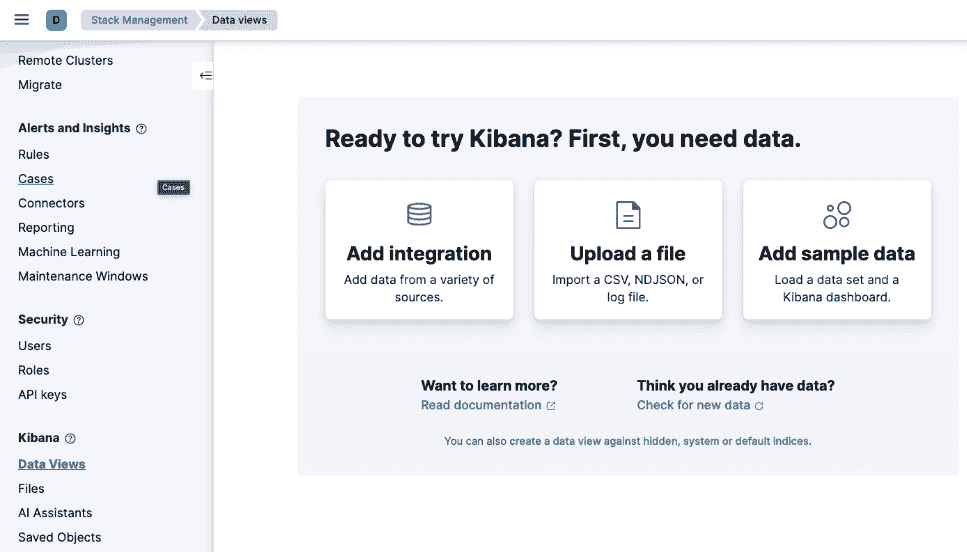

图 9.13 – 在 Kibana 中上传文件选项

现在，选择你已经拥有的 Titanic 数据集 CSV 文件并将其上传到 Kibana。您将看到一个页面，显示来自文件的映射内容（*图 9.14*）。

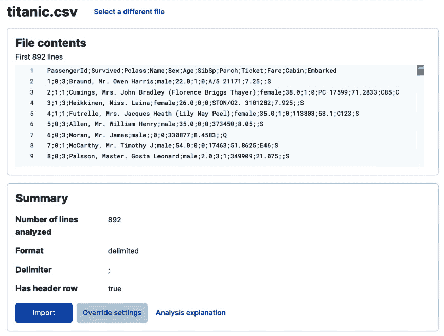

图 9.14 – Titanic 数据集的映射内容

现在，点击`titanic`，确保**创建数据视图**选项已选中。点击**导入**（*图 9.15*）。

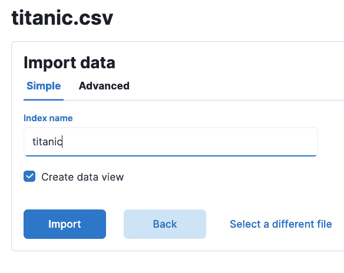

图 9.15 – Kibana – 创建索引

几秒钟后，你应该会看到一个成功的屏幕。现在，让我们使用这些数据进行一些可视化操作。返回主页，在左侧菜单中点击**仪表板**。然后点击**创建仪表板**，再点击**创建可视化**。这将带你进入 Kibana 中的可视化构建页面（*图 9.16*）。

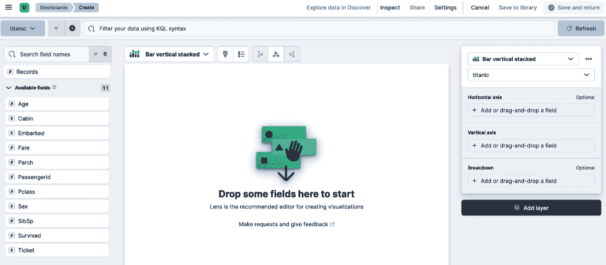

图 9.16 – Kibana 可视化创建

现在，让我们来创建一些快速的可视化。在页面的右侧，选择可视化的类型（我们选择**垂直堆叠条形图**）。对于**横轴**，拖动并放置**Pclass**字段。对于**纵轴**，拖动并放置**Fare**字段。由于这是一个数值字段，Kibana 会自动建议使用中位数作为聚合函数。点击它将其更改为**平均值**。对于**细分**，拖动并放置**Sex**字段。最后我们将得到一个漂亮的条形图，如*图 9.17*所示。

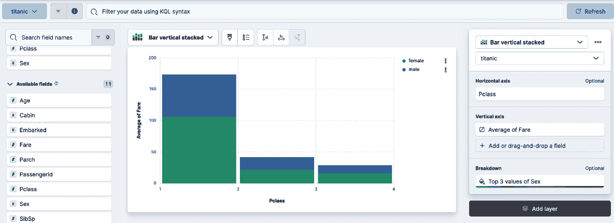

图 9.17 – 按性别和 Pclass 分组的平均票价

点击**保存并返回**，在新仪表板上查看你新创建的图形。让我们再进行一次快速分析。再次点击**创建可视化**。这次，我们将制作一个散点图，展示**年龄**和**票价**之间是否存在关联。将**年龄**放入**横轴**，将**票价**放入**纵轴**。点击**纵轴**将聚合函数更改为**平均值**。现在，你将看到一个漂亮的散点图，展示这两个变量之间的互动。到目前为止，没有显著的相关性。接下来，我们将**Pclass**字段添加为细分，你将得到一个很酷的数据可视化图像（*图 9.18*）。

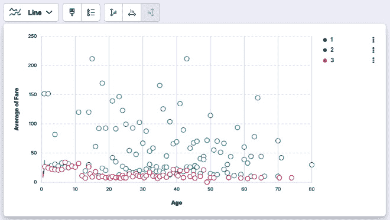

图 9.18 – Kibana 中的散点图

现在，点击`Survivors`（*图 9.19*）。

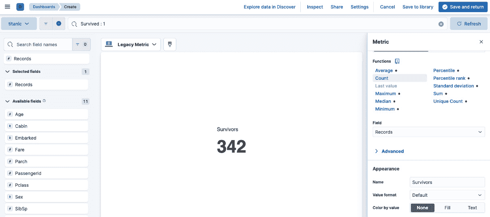

图 9.19 – 生还者计数可视化

然后，点击**保存并返回**，并根据需要手动重新排列仪表板（*图 9.20*中展示了一个简单的示例）。

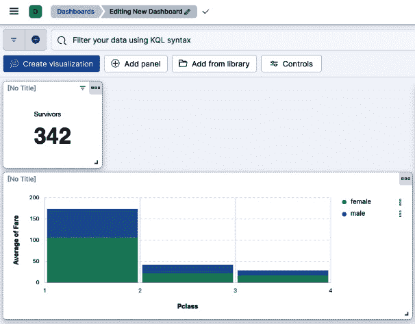

图 9.20 – 你的第一个 Kibana 仪表板

就是这样！你成功地在 Kubernetes 上部署了 Elasticsearch 和 Kibana，手动添加了数据，并创建了一个仪表板（具有巨大潜力）。随时可以尝试使用 Kibana，尝试其他数据集和可视化。

# 总结

在本章中，我们探讨了两个强大的工具，Trino 和 Elasticsearch，它们使得在基于 Kubernetes 的大数据架构中进行有效的数据消费和分析成为可能。我们学习了拥有一个强大的数据消费层的重要性，它可以在数据仓库和业务分析师之间架起桥梁，帮助他们提取有价值的洞察，并做出明智的决策。

我们学习了如何在 Kubernetes 上部署 Trino，一个分布式 SQL 查询引擎，并利用它直接查询存储在对象存储系统（如 Amazon S3）中的数据。这消除了传统数据仓库的需求，并提供了一种具有成本效益、可扩展且灵活的解决方案，用于查询大规模数据集。我们通过实际操作获得了在 Kubernetes 上部署 Trino、配置其使用 AWS Glue 数据目录，并执行针对数据湖的 SQL 查询的经验。

此外，我们还深入学习了 Elasticsearch，一个高度可扩展且高效的搜索引擎，以及 Kibana，它是一个强大的数据可视化工具。我们学习了如何使用 ECK 操作符在 Kubernetes 上部署 Elasticsearch，如何为优化存储和检索创建索引，以及如何使用 Kibana 构建简单但富有洞察力的可视化。这一组合使我们具备了分析实时数据流并发现有价值的模式和趋势的能力。

本章中学习的技能在今天这个数据驱动的世界中至关重要，组织需要有效地消耗和分析海量数据，以做出明智的业务决策。Trino 和 Elasticsearch 对于不熟悉编码的业务团队来说也非常有帮助，可以通过简单的 SQL 查询或可视化的方式探索数据，从而提升日常决策能力。

在下一章中，我们将把到目前为止所学的所有内容结合起来，构建一个完整的 Kubernetes 数据管道。
