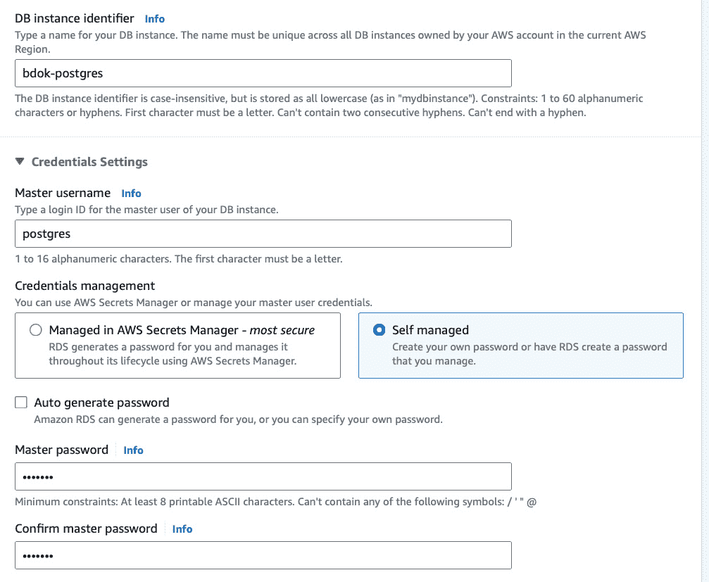

# 10

# 在 Kubernetes 上构建大数据管道

在前面的章节中，我们介绍了在 Kubernetes 上构建大数据管道所需的各个组件。我们探索了 Kafka、Spark、Airflow、Trino 等工具。然而，在现实世界中，这些工具并非孤立运行。它们需要集成并协调工作，形成完整的数据管道，以应对各种数据处理需求。

在本章中，我们将把你迄今为止所学的所有知识和技能结合起来，通过构建两个完整的数据管道来实践：一个批处理管道和一个实时管道。到本章结束时，你将能够（1）部署和协调构建大数据管道所需的所有工具；（2）使用 Python、SQL 和 API 编写数据处理、协调和查询的代码；（3）无缝集成不同的工具，创建复杂的数据管道；（4）理解并应用构建可扩展、高效且可维护的数据管道的最佳实践。

我们将从确保所有必要工具在你的 Kubernetes 集群中正确部署和运行开始。然后，我们将深入构建批处理管道，你将学习如何从各种来源摄取数据，使用 Spark 进行处理，并将结果存储在数据湖中以供查询和分析。

接下来，我们将讨论实时数据管道，它对于近实时地处理和分析数据流至关重要。你将学习如何使用 Kafka、Spark Streaming 和 Elasticsearch 来摄取和处理数据流，使你能够构建能够实时响应事件的应用程序。

到本章结束时，你将获得在 Kubernetes 上构建完整数据管道的实际操作经验，为应对现实世界的大数据挑战做好准备。让我们开始吧，解锁 Kubernetes 上的大数据力量！

在本章中，我们将涵盖以下主要主题：

+   检查已部署的工具

+   构建批处理数据管道

+   构建实时数据管道

# 技术要求

本章的活动要求你拥有一个正在运行的 Kubernetes 集群。有关 Kubernetes 部署和所有必要操作符的详细信息，请参阅*第八章*。你还需要一个**亚马逊 Web 服务**（**AWS**）账户来进行练习。我们还将使用 DBeaver 来检查数据。安装说明，请参阅*第九章*。

本章的所有代码都可以在[`github.com/PacktPublishing/Bigdata-on-Kubernetes`](https://github.com/PacktPublishing/Bigdata-on-Kubernetes)的`Chapter10`文件夹中找到。

# 检查已部署的工具

在我们深入构建一个完整的数据管道之前，我们需要确保所有必要的操作符已经在 Kubernetes 上正确部署。我们将检查 Spark 操作符、Strimzi 操作符、Airflow 和 Trino。首先，我们通过以下命令检查 Spark 操作符：

```
kubectl get pods -n spark-operator
```

此输出显示 Spark 操作符正在成功运行：

```
NAME                                READY   STATUS
spark-operator-74db6fcf98-f86vt     1/1     Running
spark-operator-webhook-init-5594s   0/1     Completed
```

现在，我们将检查 Trino。为此，输入以下命令：

```
kubectl get pods -n trino
```

检查所有 Pod 是否正确运行；在我们的案例中，包括一个协调器 Pod 和两个工作节点 Pod。同时，使用以下命令检查 Kafka 和 Elasticsearch：

```
kubectl get pods -n kafka
kubectl get pods -n elastic
```

最后，我们需要重新部署 Airflow。我们将需要使用 Airflow 的特定版本以及其某个提供程序库，以确保与 Spark 正常配合工作。我已经设置了一个 Airflow 2.8.1 的镜像，并配备了 `apache-airflow-providers-cncf-kubernetes` 库的 7.13.0 版本（这是 `SparkKubernetesOperator` 所需的）。如果你已经安装了 Airflow，可以通过以下命令将其删除：

```
helm delete airflow -n airflow
```

确保所有服务和持久化存储卷声明也已被删除，使用以下代码：

```
kubectl delete svc --all -n airflow
kubectl delete pvc --all -n airflow
```

然后，我们需要稍微修改我们已有的 `custom_values.yaml` 文件配置。我们需要将 `defaultAirflowTag` 和 `airflowVersion` 参数设置为 `2.8.1`，并且将 `images.airflow` 参数更改为获取已准备好的公共镜像：

```
images:
  airflow:
    repository: "docker.io/neylsoncrepalde/apache-airflow"
    tag: "2.8.1-cncf7.13.0"
    digest: ~
    pullPolicy: IfNotPresent
```

此外，如果你使用的是不同的 GitHub 仓库或文件夹，别忘了调整 `dags.gitSync` 参数。适配后的完整版本 `custom_values.yaml` 代码可在 [`github.com/PacktPublishing/Bigdata-on-Kubernetes/tree/main/Chapter10/airflow_deployment`](https://github.com/PacktPublishing/Bigdata-on-Kubernetes/tree/main/Chapter10/airflow_deployment) 查阅。用新配置重新部署 Airflow，操作如下：

```
helm install airflow apache-airflow/airflow --namespace airflow --create-namespace -f custom_values.yaml
```

最后所需的配置允许 Airflow 在集群上运行 `SparkApplication` 实例。我们将为 Airflow 命名空间设置一个服务账户和一个集群角色绑定：

```
kubectl create serviceaccount spark -n airflow
kubectl create clusterrolebinding spark-role --clusterrole=edit --serviceaccount=airflow:spark --namespace=airflow
```

现在，我们将创建一个新的集群角色和集群角色绑定，以授予 Airflow 工作节点必要的权限。设置一个 YAML 文件：

rolebinding_for_airflow.yaml

```
apiVersion: rbac.authorization.k8s.io/v1
kind: ClusterRole
metadata:
  name: spark-cluster-cr
  labels:
    rbac.authorization.kubeflow.org/aggregate-to-kubeflow-edit: "true"
rules:
  - apiGroups:
      - sparkoperator.k8s.io
    resources:
      - sparkapplications
    verbs:
      - "*"
---
apiVersion: rbac.authorization.k8s.io/v1
kind: ClusterRoleBinding
metadata:
  name: airflow-spark-crb
roleRef:
  apiGroup: rbac.authorization.k8s.io
  kind: ClusterRole
  name: spark-cluster-cr
subjects:
  - kind: ServiceAccount
    name: airflow-worker
    namespace: airflow
```

现在，使用以下命令部署此配置：

```
kubectl apply -f rolebinding_for_airflow.yaml -n airflow
```

就这样！我们现在可以进入批处理数据管道的实现部分了。让我们开始吧。

# 构建批处理管道

对于批处理管道，我们将使用在 *第五章* 中使用的 IMBD 数据集。我们将自动化整个过程，从数据采集和将数据摄取到我们的数据湖（**Amazon Simple Storage Service**，**Amazon S3**），直到将消费就绪的表格交付给 Trino。在 *图 10.1* 中，你可以看到代表本节练习架构的示意图：


图 10.1 – 批处理管道的架构设计

现在，让我们进入代码部分。

## 构建 Airflow DAG

让我们像往常一样开始开发我们的 Airflow DAG。完整的代码可以在 [`github.com/PacktPublishing/Bigdata-on-Kubernetes/tree/main/Chapter10/batch/dags`](https://github.com/PacktPublishing/Bigdata-on-Kubernetes/tree/main/Chapter10/batch/dags) 文件夹中找到：

1.  以下是 Airflow DAG 的第一部分代码：

    **imdb_dag.py**

    ```
    from airflow.decorators import task, dag
    from airflow.utils.task_group import TaskGroup
    from airflow.providers.cncf.kubernetes.operators.spark_kubernetes import SparkKubernetesOperator
    from airflow.providers.cncf.kubernetes.sensors.spark_kubernetes import SparkKubernetesSensor
    from airflow.providers.amazon.aws.operators.glue_crawler import GlueCrawlerOperator
    from airflow.models import Variable
    from datetime import datetime
    import requests
    import boto3
    aws_access_key_id = Variable.get("aws_access_key_id")
    aws_secret_access_key = Variable.get("aws_secret_access_key")
    s3 = boto3.client('s3',
        aws_access_key_id=aws_access_key_id,
        aws_secret_access_key=aws_secret_access_key
    )
    default_args = {
        'owner': 'Ney',
        'start_date': datetime(2024, 5, 10)
    }
    ```

    这段代码导入了必要的库，设置了两个用于在 AWS 上进行身份验证的环境变量，定义了一个 Amazon S3 客户端，并设置了一些默认配置。

1.  在下一个代码块中，我们将开始 DAG 函数的编写：

    ```
    @dag(
            default_args=default_args,
            schedule_interval="@once",
            description="IMDB Dag",
            catchup=False,
            tags=['IMDB']
    )
    def IMDB_batch():
    ```

    该代码块集成了 DAG 的默认参数，并定义了一个调度间隔，使得 DAG 仅运行一次，还设置了一些元数据。

1.  现在，我们将定义第一个任务，它会自动下载数据集并将其存储在 S3 中（第一行重复）：

    ```
    def IMDB_batch():
        @task
        def data_acquisition():
            urls_dict = {
                "names.tsv.gz": "https://datasets.imdbws.com/name.basics.tsv.gz",
                "basics.tsv.gz": "https://datasets.imdbws.com/title.basics.tsv.gz",
                "crew.tsv.gz": "https://datasets.imdbws.com/title.crew.tsv.gz",
                "principals.tsv.gz": "https://datasets.imdbws.com/title.principals.tsv.gz",
                "ratings.tsv.gz": "https://datasets.imdbws.com/title.ratings.tsv.gz"
            }
            for title, url in urls_dict.items():
                response = requests.get(url, stream=True)
                with open(f"/tmp/{title}", mode="wb") as file:
                    file.write(response.content)
                s3.upload_file(f"/tmp/{title}", "bdok-<YOUR_ACCOUNT_NUMBER>", f"landing/imdb/{title}")
            return True
    ```

    这段代码来源于我们在 *第五章* 中开发的内容，最后做了一个小修改，用于将下载的文件上传到 S3。

1.  接下来，我们将调用 Spark 处理作业来转换数据。第一步仅仅是读取数据的原始格式（TSV），并将其转换为 Parquet（这种格式在 Spark 中优化了存储和处理）。首先，我们定义一个 `TaskGroup` 实例，以便更好地组织任务：

    ```
    with TaskGroup("tsvs_to_parquet") as tsv_parquet:
        tsvs_to_parquet = SparkKubernetesOperator(
            task_id="tsvs_to_parquet",
            namespace="airflow",
            #application_file=open(f"{APP_FILES_PATH}/spark_imdb_tsv_parquet.yaml").read(),
            application_file="spark_imdb_tsv_parquet.yaml",
            kubernetes_conn_id="kubernetes_default",
            do_xcom_push=True
        )
        tsvs_to_parquet_sensor = SparkKubernetesSensor(
            task_id="tsvs_to_parquet_sensor",
            namespace="airflow",
            application_name="{{ task_instance.xcom_pull(task_ids='tsvs_to_parquet.tsvs_to_parquet')['metadata']['name'] }}",
            kubernetes_conn_id="kubernetes_default"
        )
        tsvs_to_parquet >> tsvs_to_parquet_sensor
    ```

    在这个组内，有两个任务：

    +   `tsvs_to_parquet`：这是一个 `SparkKubernetesOperator` 任务，在 Kubernetes 上运行一个 Spark 作业。该作业在 `spark_imdb_tsv_parquet.yaml` 文件中定义，包含 Spark 应用程序的配置。我们使用 `do_xcom_push=True` 参数，使得该任务与后续任务之间能够进行跨任务通信。

    +   `tsvs_to_parquet_sensor`：这是一个 `SparkKubernetesSensor` 任务，它监视由 `tsvs_to_parquet` 任务启动的 Spark 作业。它通过 `task_instance.xcom_pull` 方法，从前一个任务推送的元数据中获取 Spark 应用程序名称。此传感器在 Spark 作业完成之前不会允许 DAG 继续执行后续任务。

    `tsvs_to_parquet >> tsvs_to_parquet_sensor` 这一行设置了任务依赖关系，确保 `tsvs_to_parquet_sensor` 任务在 `tsvs_to_parquet` 任务成功完成后运行。

1.  接下来，我们将进行另一次数据处理，这次使用 Spark。我们将连接所有表，构建一个合并的唯一表。这个合并后的表被称为 `TaskGroup` 实例，名为 `Transformations`，并按与之前代码块相同的方式进行处理：

    ```
    with TaskGroup('Transformations') as transformations:
        consolidated_table = SparkKubernetesOperator(
            task_id='consolidated_table',
            namespace="airflow",
            application_file="spark_imdb_consolidated_table.yaml",
            kubernetes_conn_id="kubernetes_default",
            do_xcom_push=True
        )
        consolidated_table_sensor = SparkKubernetesSensor(
            task_id='consolidated_table_sensor',
            namespace="airflow",
            application_name="{{ task_instance.xcom_pull(task_ids='Transformations.consolidated_table')['metadata']['name'] }}",
            kubernetes_conn_id="kubernetes_default"
        )
        consolidated_table >> consolidated_table_sensor
    ```

1.  最后，在数据处理并写入 Amazon S3 后，我们将触发一个 Glue 爬虫，它会将该表的元数据写入 Glue 数据目录，使其可供 Trino 使用：

    ```
    glue_crawler_consolidated = GlueCrawlerOperator(
        task_id='glue_crawler_consolidated',
        region_name='us-east-1',
        aws_conn_id='aws_conn',
        wait_for_completion=True,
        config = {'Name': 'imdb_consolidated_crawler'}
    )
    ```

    记住，这些代码应该缩进以便位于 `IMDB_Batch()` 函数内。

1.  现在，在这段代码的最后一个块中，我们将配置任务之间的依赖关系以及 `TaskGroup` 实例，并触发 DAG 函数的执行：

    ```
        da = data_acquisition()
        da >> tsv_parquet >> transformations
        transformations >> glue_crawler_consolidated
    execution = IMDB_batch()
    ```

现在，我们需要设置 Airflow 将调用的两个 `SparkApplication` 实例，以及 AWS 上的 Glue 爬虫。我们开始吧。

## 创建 SparkApplication 任务

我们将遵循 *第八章* 中使用的相同模式来配置 Spark 任务。我们需要存储在 S3 中的 PySpark 代码，以及定义任务的 YAML 文件，该文件必须与 Airflow DAG 代码一起位于 `dags` 文件夹中：

1.  由于 YAML 文件与我们之前做的非常相似，我们不会在这里深入讨论。两个 YAML 文件的代码可以在 [`github.com/PacktPublishing/Bigdata-on-Kubernetes/tree/main/Chapter10/batch/dags`](https://github.com/PacktPublishing/Bigdata-on-Kubernetes/tree/main/Chapter10/batch/dags) 文件夹中找到。创建这些文件并将它们分别保存为 `spark_imdb_tsv_parquet.yaml` 和 `spark_imdb_consolidated_table.yaml` 到 `dags` 文件夹中。

1.  接下来，我们将查看 PySpark 代码。第一个任务相当简单，它从 Airflow 导入的 TSV 文件中读取数据，并将相同的数据转换后写回 Parquet 格式。首先，我们导入 Spark 模块，并定义一个带有必要配置的 `SparkConf` 对象，用于 Spark 应用程序：

    ```
    from pyspark import SparkContext, SparkConf
    from pyspark.sql import SparkSession
    conf = (
        SparkConf()
            .set("spark.cores.max", "2")
            .set("spark.executor.extraJavaOptions", "-Dcom.amazonaws.services.s3.enableV4=true")
            .set("spark.driver.extraJavaOptions", "-Dcom.amazonaws.services.s3.enableV4=true")
            .set("spark.hadoop.fs.s3a.fast.upload", True)
            .set("spark.hadoop.fs.s3a.impl", "org.apache.hadoop.fs.s3a.S3AFileSystem")
            .set("spark.hadoop.fs.s3a.aws.credentials.provider", "com.amazonaws.auth.EnvironmentVariablesCredentials")
            .set("spark.jars.packages", "org.apache.hadoop:hadoop-aws:2.7.3")
    )
    sc = SparkContext(conf=conf).getOrCreate()
    ```

    这些配置是针对与 Amazon S3 配合使用而定制的，启用了某些功能，例如 S3 V4 认证、快速上传和使用 S3A 文件系统实现。`spark.cores.max` 属性限制应用程序使用的最大核心数为 `2`。最后一行创建了一个带有之前定义的配置的 `SparkContext` 对象。

1.  接下来，我们创建一个 `SparkSession` 实例并将日志级别设置为 `"WARN"`，这样日志中只会显示警告和错误信息。这有助于提高日志的可读性：

    ```
    if __name__ == "__main__":
        spark = SparkSession.builder.appName("SparkApplicationJob").getOrCreate()
        spark.sparkContext.setLogLevel("WARN")
    ```

1.  接下来，我们将定义表格架构。在处理大数据集时，这一点非常重要，因为它可以提高 Spark 在处理基于文本的文件（如 TSV、CSV 等）时的性能。接下来，我们仅展示第一个表格的架构，以简化可读性。完整代码可以在 [`github.com/PacktPublishing/Bigdata-on-Kubernetes/tree/main/Chapter10/batch/spark_code`](https://github.com/PacktPublishing/Bigdata-on-Kubernetes/tree/main/Chapter10/batch/spark_code) 文件夹中找到：

    ```
    schema_names = "nconst string, primaryName string, birthYear int, deathYear int, primaryProfession string, knownForTitles string"
    ```

1.  现在，我们将表格读取到 Spark DataFrame 中（这里只显示读取第一个表格）：

    ```
    names = (
        spark
        .read
        .schema(schema_names)
        .options(header=True, delimiter="\t")
        .csv('s3a://bdok-<ACCOUNT_NUMBER>/landing/imdb/names.tsv.gz')
    )
    ```

1.  接下来，我们将把表格写回 S3，以 Parquet 格式存储：

    ```
    names.write.mode("overwrite").parquet("s3a://bdok-<ACCOUNT_NUMBER>/bronze/imdb/names")
    ```

1.  最后，我们停止 Spark 会话并释放应用程序使用的任何资源：

    ```
    spark.stop()
    ```

1.  将此文件保存为 `spark_imdb_tsv_parquet.py` 并上传到你在 YAML 文件中定义的 S3 存储桶中（在本例中为 `s3a://bdok-<ACCOUNT_NUMBER>/spark-jobs/`）。

1.  现在，我们将定义第二个 `SparkApplication` 实例，负责构建 OBT。对于第二段代码，我们将跳过 Spark 配置和 `SparkSession` 代码块，因为它们与上一个任务几乎相同，唯一需要导入的是一个额外的模块：

    ```
    from pyspark.sql import functions as f
    ```

    这将导入 `functions` 模块，允许使用 Spark 内部函数进行数据转换。

1.  我们从这里开始读取数据集：

    ```
    names = spark.read.parquet("s3a://bdok-<ACCOUNT_NUMBER>/bronze/imdb/names")
    basics = spark.read.parquet("s3a://bdok-<ACCOUNT_NUMBER>/bronze/imdb/basics")
    crew = spark.read.parquet("s3a://bdok-<ACCOUNT_NUMBER>/bronze/imdb/crew")
    principals = spark.read.parquet("s3a://bdok-<ACCOUNT_NUMBER>/bronze/imdb/principals")
    ratings = spark.read.parquet("s3a://bdok-<ACCOUNT_NUMBER>/bronze/imdb/ratings")
    ```

1.  `names`数据集中的`knownForTitles`列和`crew`数据集中的`directors`列，在同一个单元格中有多个值，需要进行展开，才能得到每个导演和标题的一行数据：

    ```
    names = names.select(
        'nconst', 'primaryName', 'birthYear', 'deathYear',
        f.explode(f.split('knownForTitles', ',')).alias('knownForTitles')
    )
    crew = crew.select(
        'tconst', f.explode(f.split('directors', ',')).alias('directors'), 'writers'
    )
    ```

1.  现在，我们开始进行表连接：

    ```
    basics_ratings = basics.join(ratings, on=['tconst'], how='inner')
    principals_names = (
        principals.join(names, on=['nconst'], how='inner')
        .select('nconst', 'tconst','ordering', 'category', 'characters', 'primaryName', 'birthYear', 'deathYear')
        .dropDuplicates()
    )
    directors = (
        crew
        .join(names, on=crew.directors == names.nconst, how='inner')
        .selectExpr('tconst', 'directors', 'primaryName as directorPrimaryName',
                    'birthYear as directorBirthYear', 'deathYear as directorDeathYear')
        .dropDuplicates()
    )
    ```

    在这里，我们执行三次连接操作：（a）通过在`basics`和`ratings` DataFrame 中基于`tconst`列（电影标识符）连接，创建`basics_ratings`；（b）通过在`principals`和`names` DataFrame 中基于`nconst`列（演员标识符）连接，创建`principals_names`；我们选择一些特定的列并删除重复项；（c）通过在`crew`和`names` DataFrame 中基于`crew`中的`directors`列与`names`中的`nconst`列连接，创建`directors`表。接着，我们选择特定的列，重命名一些列以便识别哪些数据与导演相关，并删除重复项。

1.  接下来，我们将创建一个`basics_principals`表，通过连接`crew`和`principals_names`数据集，获取有关剧组和电影表演者的完整数据集。最后，我们创建一个`basics_principals_directors`表，连接`directors`表信息：

    ```
    basics_principals = basics_ratings.join(principals_names, on=['tconst'], how='inner').dropDuplicates()
    basics_principals_directors = basics_principals.join(directors, on=['tconst'], how='inner').dropDuplicates()
    ```

1.  最后，我们将这个最终表作为 Parquet 文件写入 Amazon S3 并停止 Spark 作业：

    ```
    basics_principals_directors.write.mode("overwrite").parquet("s3a://bdok-<ACCOUNT_NUMBER>/silver/imdb/consolidated")
    spark.stop()
    ```

最后一步是创建一个 Glue 爬虫，使 OBT 中的信息可供 Trino 使用。

## 创建一个 Glue 爬虫

我们将使用 AWS 控制台创建一个 Glue 爬虫。请按照以下步骤操作：

1.  登录到 AWS 并进入**AWS Glue**页面。然后，点击侧边菜单中的**爬虫**，并点击**创建爬虫**（*图 10.2*）：


图 10.2 – AWS Glue：爬虫页面

1.  接下来，输入`imdb_consolidated_crawler`（与 Airflow 代码中引用的名称相同）作为爬虫名称，并根据需要填写描述。点击**下一步**。

1.  确保在第一个配置项**您的数据是否已映射到 Glue 表？**中选中**尚未**。然后，点击**添加数据源**（*图 10.3*）：


图 10.3 – 添加数据源

1.  在`s3://bdok-<ACCOUNT_NUMBER>/silver/imdb/consolidated`中，如*图 10.4*所示。点击**添加 S3 数据源**，然后点击**下一步**：


图 10.4 – S3 路径配置

1.  在下一页，点击**创建新 IAM 角色**，并为其填写您喜欢的名称。确保它不是已有的角色名称。点击**下一步**（*图 10.5*）：


图 10.5 – IAM 角色配置

1.  在下一页，您可以选择我们在*第九章*中创建的相同数据库来与 Trino（`bdok-database`）一起使用。为了方便定位此表，请使用`imdb-`（*图 10.6*）。将**Crawler 调度**设置为**按需**。点击**下一步**：


图 10.6 – 目标数据库和表名前缀

1.  在最后一步，检查所有提供的信息。如果一切正确，点击 **创建爬虫**。

就这样！设置完成。现在，我们返回到浏览器中的 Airflow UI，激活 DAG，看看“魔法”发生了 (*图 10**.7*):


图 10.7 – 在 Airflow 上运行完整的 DAG

DAG 执行成功后，等待大约 2 分钟，直到爬虫停止，然后我们用 DBeaver 搜索我们的数据。我们来玩一下，搜索所有《约翰·威克》电影 (*图 10**.8*):


图 10.8 – 使用 DBeaver 检查 Trino 中的 OBT

看，搞定了！你刚刚运行了完整的批量数据处理管道，连接了我们迄今为止学习的所有批量工具。恭喜！现在，我们将开始构建一个使用 Kafka、Spark Streaming 和 Elasticsearch 的数据流管道。

# 构建实时数据管道

对于实时管道，我们将使用我们在 *第八章* 中使用的相同数据模拟代码，结合一个增强的架构。在 *图 10**.9* 中，你可以看到我们即将构建的管道架构设计：


图 10.9 – 实时数据管道架构

首先，我们需要在 AWS 上创建一个 **虚拟私有云** (**VPC**) —— 一个私有网络 —— 并设置一个 **关系数据库服务** (**RDS**) Postgres 数据库，作为我们的数据源：

1.  进入 AWS 控制台，导航到 **VPC** 页面。在 **VPC** 页面上，点击 **创建 VPC**，你将进入配置页面。

1.  确保 `bdok` 在 `10.20.0.0/16` **无类域间路由** (**CIDR**) 块中。其余设置保持默认 (*图 10**.10*):


图 10.10 – VPC 基本配置

1.  现在，滚动页面。你可以保持 **可用区** (**AZs**) 和子网配置不变（两个 AZ，两个公共子网和两个私有子网）。确保为 **网络地址转换** (**NAT**) 网关勾选 **在 1 个 AZ 中**。保持 **S3 网关** 选项框选中 (*图 10**.11*)。此外，最后两个 DNS 选项也保持勾选。点击 **创建 VPC**：


图 10.11 – NAT 网关配置

1.  创建 VPC 可能需要几分钟。成功创建后，在 AWS 控制台中，导航到 **RDS** 页面，在侧边菜单中点击 **数据库**，然后点击 **创建数据库**。

1.  在下一个页面中，选择**标准创建**，并选择**Postgres**作为数据库类型。保持默认的引擎版本。在**模板**部分，选择**免费层**，因为我们仅需要一个小型数据库用于本练习。

1.  在 `bdok-postgres` 中，对于凭证，保持`postgres`为主用户名，选择**自管理**作为**凭证管理**选项，并选择一个主密码（*图 10.12*）：



图 10.12 – 数据库名称和凭证

1.  将**实例配置**和**存储**部分保持为默认设置。

1.  在 `bdok-vpc` 中，保持 `bdok-database-sg` 作为安全组名称（*图 10.13*）：


图 10.13 – RDS 子网和安全组配置

1.  确保**数据库认证**部分标记为**密码认证**。其他设置可以保持默认。最后，AWS 会给出如果我们让这个数据库运行 30 天的费用估算（*图 10.14*）。最后，点击**创建数据库**，并等待几分钟以完成数据库创建：


图 10.14 – 数据库费用估算

1.  最后，我们需要更改数据库安全组的配置，以允许来自 VPC 外部的连接，除了您自己的 IP 地址（默认配置）。进入 `bdok-postgres` 数据库。点击安全组名称以打开其页面（*图 10.15*）：


图 10.15 – bdok-postgres 数据库查看页面

1.  在安全组页面中，选择安全组后，向下滚动页面并点击**入站规则**选项卡。点击**编辑入站规则**（*图 10.16*）：


图 10.16 – 安全组页面

1.  在下一个页面中，您将看到一个已经配置好的入口规则，源为您的 IP 地址。将其更改为**任何地方-IPv4**，并点击**保存规则**（*图 10.17*）：


图 10.17 – 安全规则配置

1.  最后，为了向我们的数据库填充一些数据，我们将使用 `simulatinos.py` 代码生成一些虚假的客户数据并将其导入到数据库中。代码可以在[`github.com/PacktPublishing/Bigdata-on-Kubernetes/tree/main/Chapter10/streaming`](https://github.com/PacktPublishing/Bigdata-on-Kubernetes/tree/main/Chapter10/streaming) 文件夹中找到。要运行它，请从 AWS 页面复制数据库端点，然后在终端中输入以下命令：

    ```
    python simulations.py --host <YOUR-DATABASE-ENDPOINT> -p <YOUR-PASSWORD>
    ```

在代码在终端打印出一些数据后，使用*Ctrl* + *C* 停止该进程。现在，我们可以开始处理数据管道了。让我们从 Kafka Connect 配置开始。

## 部署 Kafka Connect 和 Elasticsearch

为了让 Kafka 能够访问 Elasticsearch，我们需要在与 Kafka 部署相同的命名空间中部署另一个 Elasticsearch 集群。为此，我们将使用两个 YAML 配置文件，`elastic_cluster.yaml`和`kibana.yaml`。这两个文件可以在[`github.com/PacktPublishing/Bigdata-on-Kubernetes/tree/main/Chapter10/streaming/elastic_deployment`](https://github.com/PacktPublishing/Bigdata-on-Kubernetes/tree/main/Chapter10/streaming/elastic_deployment)文件夹中找到。请按照以下步骤操作：

1.  首先，下载这两个文件并在终端中运行以下命令：

    ```
    kubectl apply -f elastic_cluster.yaml -n kafka
    kubectl apply -f kibana.yaml -n kafka
    ```

1.  接下来，我们将使用以下命令获取一个自动生成的 Elasticsearch 密码：

    ```
    kubectl get secret elastic-es-elastic-user -n kafka -o go-template='{{.data.elastic | base64decode}}'
    ```

    该命令将在终端中打印出密码。请保存以供后用。

1.  Elasticsearch 仅在传输加密时工作。这意味着我们必须配置证书和密钥，允许 Kafka Connect 正确连接到 Elastic。为此，首先，我们将获取 Elastic 的证书和密钥，并使用以下命令将它们保存在本地：

    ```
    kubectl get secret elastic-es-http-certs-public -n kafka --output=go-template='{{index .data "ca.crt" | base64decode}}' > ca.crt
    kubectl get secret elastic-es-http-certs-public -n kafka --output=go-template='{{index .data "tls.crt" | base64decode}}' > tls.crt
    kubectl get secret elastic-es-http-certs-internal -n kafka --output=go-template='{{index .data "tls.key" | base64decode}}' > tls.key
    ```

    这将在本地创建三个文件，分别命名为`ca.crt`、`tls.crt`和`tls.key`。

1.  现在，我们将使用这些文件创建一个`keystore.jks`文件，该文件将用于 Kafka Connect 集群。在终端中运行以下命令：

    ```
    openssl pkcs12 -export -in tls.crt -inkey tls.key -CAfile ca.crt -caname root -out keystore.p12 -password pass:BCoqZy82BhIhHv3C -name es-keystore
    keytool -importkeystore -srckeystore keystore.p12 -srcstoretype PKCS12 -srcstorepass BCoqZy82BhIhHv3C -deststorepass OfwxynZ8KATfZSZe -destkeypass OfwxynZ8KATfZSZe -destkeystore keystore.jks -alias es-keystore
    ```

    请注意，我设置了一些随机密码。你可以根据自己的需要选择其他密码。现在，你已经有了我们需要配置传输加密的文件`keystore.jks`。

1.  接下来，我们需要使用`keystore.jks`文件在 Kubernetes 中创建一个 secret。为此，在终端中输入以下命令：

    ```
    kubectl create secret generic es-keystore --from-file=keystore.jks -n kafka
    ```

1.  现在，我们准备好部署 Kafka Connect 了。我们有一个已准备好的配置文件，名为`connect_cluster.yaml`，可以在[`github.com/PacktPublishing/Bigdata-on-Kubernetes/tree/main/Chapter10/streaming`](https://github.com/PacktPublishing/Bigdata-on-Kubernetes/tree/main/Chapter10/streaming)文件夹中找到。然而，这段代码有两个部分值得注意。在*第 13 行*，我们有`spec.bootstrapServers`参数。这个参数应该填写由 Helm chart 创建的 Kafka 启动服务。要获取该服务的名称，输入以下命令：

    ```
    kubectl get svc -n kafka
    ```

    检查服务名称是否与代码中的名称匹配。如果不匹配，请相应调整。保持此服务的`9093`端口。

1.  在*第 15 行*，你有`spec.tls.trustedCertificates`参数。`secretName`的值应该与 Helm chart 创建的`ca-cert` secret 的确切名称匹配。使用以下命令检查此 secret 的名称：

    ```
    kubectl get secret -n kafka
    ```

    如果 secret 的名称不匹配，请相应调整。保持`certificate`参数中的`ca.crt`值。

1.  最后值得一提的是，我们将在 Kafka Connect 的 Pod 中将之前创建的`es-keystore` secret 作为卷进行挂载。以下代码块设置了此配置：

    ```
      externalConfiguration:
        volumes:
          - name: es-keystore-volume
            secret:
              secretName: es-keystore
    ```

    此 secret 必须作为卷挂载，以便 Kafka Connect 可以导入连接到 Elasticsearch 所需的 secret。

1.  要部署 Kafka Connect，在终端中输入以下命令：

    ```
    kubectl apply -f connect_cluster.yaml -n kafka
    ```

    Kafka Connect 集群将在几分钟内准备就绪。准备好后，接下来是配置**Java 数据库连接**（**JDBC**）源连接器，从 Postgres 数据库中拉取数据。

1.  接下来，准备一个配置 JDBC 源连接器的 YAML 文件。接下来，您将找到此文件的代码：

    **jdbc_source.yaml**

    ```
    apiVersion: "kafka.strimzi.io/v1beta2"
    kind: "KafkaConnector"
    metadata:
      name: "jdbc-source"
      namespace: kafka
      labels:
        strimzi.io/cluster: kafka-connect-cluster
    spec:
      class: io.confluent.connect.jdbc.JdbcSourceConnector
      tasksMax: 1
      config:
        key.converter: org.apache.kafka.connect.json.JsonConverter
        value.converter: org.apache.kafka.connect.json.JsonConverter
        key.converter.schemas.enable: true
        value.converter.schemas.enable: true
        connection.url: «jdbc:postgresql://<DATABASE_ENDPOINT>:5432/postgres»
        connection.user: postgres
        connection.password: "<YOUR_PASSWORD>"
        connection.attempts: "2"
        query: "SELECT * FROM public.customers"
        mode: "timestamp"
        timestamp.column.name: "dt_update"
        topic.prefix: "src-customers"
        valincrate.non.null: "false"
    ```

    连接器的配置指定它应该使用来自 Confluent 的 JDBC 连接器库中的`io.confluent.connect.jdbc.JdbcSourceConnector`类。它将连接器的最大任务数（并行工作线程）设置为 1。连接器配置为使用 JSON 转换器处理键和值，并包括模式信息。它连接到运行在 Amazon RDS 实例上的 PostgreSQL 数据库，使用提供的连接 URL、用户名和密码。指定了`SELECT * FROM public.customers` SQL 查询，这意味着连接器将持续监控`customers`表，并将任何新行或更新行作为 JSON 对象流式传输到名为`src-customers`的 Kafka 主题中。`mode`值设置为`timestamp`，这意味着连接器将使用时间戳列（`dt_update`）来追踪哪些行已经处理过，从而避免重复。最后，`validate.non.null`选项设置为`false`，这意味着如果遇到数据库行中的`null`值，连接器不会失败。

1.  将 YAML 文件放在名为`connectors`的文件夹中，并使用以下命令部署 JDBC 连接器：

    ```
    kubectl apply -f connectors/jdbc_source.yaml -n kafka
    ```

    您可以使用以下命令检查连接器是否已正确部署：

    ```
    kubectl get kafkaconnector -n kafka
    kubectl describe kafkaconnector jdbc-source -n kafka
    ```

    我们还将使用以下命令检查消息是否正确地传递到分配的 Kafka 主题：

    ```
    kubectl exec kafka-cluster-kafka-0 -n kafka -c kafka -it -- bin/kafka-console-consumer.sh --bootstrap-server localhost:9092 --from-beginning --topic src-customers
    ```

您应该看到以 JSON 格式打印在屏幕上的消息。太棒了！我们已经与源数据库建立了实时连接。现在，是时候使用 Spark 设置实时处理层了。

## 实时处理与 Spark

为了正确连接 Spark 和 Kafka，我们需要在 Kafka 的命名空间中设置一些授权配置：

1.  以下命令创建了一个 Spark 的服务账户，并设置了运行`SparkApplication`实例所需的权限：

    ```
    kubectl create serviceaccount spark -n kafka
    kubectl create clusterrolebinding spark-role-kafka --clusterrole=edit --serviceaccount=kafka:spark -n kafka
    ```

1.  接下来，我们需要确保在命名空间中设置了一个包含 AWS 凭证的秘密。使用以下命令检查秘密是否已存在：

    ```
    kubectl get secrets -n kafka
    ```

    如果秘密尚不存在，请使用以下命令创建它：

    ```
    kubectl create secret generic aws-credentials --from-literal=aws_access_key_id=<YOUR_ACCESS_KEY_ID> --from-literal=aws_secret_access_key="<YOUR_SECRET_ACCESS_KEY>" -n kafka
    ```

1.  现在，我们需要构建一个 Spark Streaming 作业。为了实现这一点，正如之前所看到的，我们需要一个 YAML 配置文件和存储在 Amazon S3 中的 PySpark 代码。YAML 文件遵循与*第八章*中看到的相同模式。此配置的代码可在[`github.com/PacktPublishing/Bigdata-on-Kubernetes/tree/main/Chapter10/streaming`](https://github.com/PacktPublishing/Bigdata-on-Kubernetes/tree/main/Chapter10/streaming)文件夹中找到。将其保存在本地，因为它将用于部署`SparkApplication`作业。

1.  Spark 作业的 Python 代码也可以在 GitHub 仓库中的*第十章*`/streaming/processing`文件夹中找到，文件名为`spark_streaming_job.py`。这段代码与我们在*第七章*中看到的非常相似，但有一些地方值得注意。在*第 61 行*，我们对数据进行实时转换。在这里，我们仅仅根据出生日期计算人的年龄，使用以下代码：

    ```
    query = (
            newdf
            .withColumn("dt_birthdate", f.col("birthdate"))
            .withColumn("today", f.to_date(f.current_timestamp() ) )
            .withColumn("age", f.round(
                f.datediff(f.col("today"), f.col("dt_birthdate"))/365.25, 0)
            )
            .select("name", "gender", "birthdate", "profession", "age", "dt_update")
        )
    ```

1.  为了使 Elasticsearch sink 连接器正确读取主题中的消息，消息必须采用标准的 Kafka JSON 格式，并包含两个键：`schema`和`payload`。在代码中，我们将手动构建该 schema 并将其与最终版本的 JSON 数据连接起来。*第 70 行*定义了`schema`键和`payload`结构的开头（此行为了提高可读性，在此不会打印）。

1.  在*第 72 行*，我们将 DataFrame 的值转换为单个 JSON 字符串，并将其设置为名为`value`的列：

    ```
        json_query = (
            query
            .select(
                f.to_json(f.struct(f.col("*")))
            )
            .toDF("value")
        )
    ```

1.  在*第 80 行*，我们将之前定义的`schema`键与数据的实际值连接成 JSON 字符串，并将其写入流式查询，返回 Kafka 中的`customers-transformed`主题：

    ```
        (
            json_query
            .withColumn("value", f.concat(f.lit(write_schema), f.col("value"), f.lit('}')))
            .selectExpr("CAST(value AS STRING)")
            .writeStream
            .format("kafka")
            .option("kafka.bootstrap.servers", "kafka-cluster-kafka-bootstrap:9092")
            .option("topic", "customers-transformed")
            .option("checkpointLocation", "s3a://bdok-<ACCOUNT-NUMBER>/spark-checkpoint/customers-processing/")
            .start()
            .awaitTermination()
        )
    ```

1.  将此文件保存为`spark_streaming_job.py`并保存到我们在 YAML 文件中定义的 S3 存储桶中。现在，你已经准备好开始实时处理了。要启动流式查询，请在终端中输入以下命令：

    ```
    kubectl apply -f spark_streaming_job.yaml -n kafka
    ```

    你还可以使用以下命令检查应用程序是否正确运行：

    ```
    kubectl describe sparkapplication spark-streaming-job -n kafka
    kubectl get pods -n kafka
    ```

1.  现在，检查消息是否正确写入新主题，使用以下命令：

    ```
    kubectl exec kafka-cluster-kafka-0 -n kafka -c kafka -it -- bin/kafka-console-consumer.sh --bootstrap-server localhost:9092 --from-beginning --topic customers-transformed
    ```

就是这样！我们已经启动了实时处理层。现在，是时候部署 Elasticsearch sink 连接器并将最终数据导入 Elastic 了。让我们开始吧。

## 部署 Elasticsearch sink 连接器

在这里，我们将从 Elasticsearch sink 连接器的 YAML 配置文件开始。大部分“重头戏”已经在之前的秘密配置中完成了：

1.  在`connectors`文件夹下创建一个名为`es_sink.yaml`的文件。以下是代码：

    **es_sink.yaml**

    ```
    apiVersion: "kafka.strimzi.io/v1beta2"
    kind: "KafkaConnector"
    metadata:
      name: "es-sink"
      namespace: kafka
      labels:
        strimzi.io/cluster: kafka-connect-cluster
    spec:
      class: io.confluent.connect.elasticsearch.ElasticsearchSinkConnector
      tasksMax: 1
      config:
        topics: "customers-transformed"
        connection.url: "https://elastic-es-http.kafka:9200"
        connection.username: "elastic"
        connection.password: "w6MR9V0SNLD79b56arB9Q6b6"
        batch.size: 1
        key.ignore: "true"
        elastic.security.protocol: "SSL"
        elastic.https.ssl.keystore.location: "/opt/kafka/external-configuration/es-keystore-volume/keystore.jks"
        elastic.https.ssl.keystore.password: "OfwxynZ8KATfZSZe"
        elastic.https.ssl.key.password: "OfwxynZ8KATfZSZe"
        elastic.https.ssl.keystore.type: "JKS"
        elastic.https.ssl.truststore.location: "/opt/kafka/external-configuration/es-keystore-volume/keystore.jks"
        elastic.https.ssl.truststore.password: "OfwxynZ8KATfZSZe"
        elastic.https.ssl.truststore.type: "JKS"
    ```

    我认为这里值得注意的部分是从*第 20 行*开始。在这里，我们正在配置与 Elasticsearch 连接的 SSL/TLS 设置。`keystore.location`和`truststore.location`属性分别指定`keystore`和`truststore`文件的路径（在本例中，它们是相同的）。`keystore.password`、`key.password`和`truststore.password`属性提供访问这些文件的密码。`keystore.type`和`truststore.type`属性指定`keystore`和`truststore`文件的类型，在本例中是`JKS`（Java KeyStore）。

1.  现在，一切已准备好启动此连接器。在终端中，输入以下命令：

    ```
    kubectl apply -f connectors/es_sink.yaml -n kafka
    ```

    你还可以使用以下命令检查连接器是否正确部署：

    ```
    kubectl describe kafkaconnector es-sink -n kafka
    ```

1.  现在，获取负载均衡器的 URL 并访问 Elasticsearch UI。让我们看看数据是否已经正确导入：

    ```
    kubectl get svc -n kafka
    ```

1.  一旦登录到 Elasticsearch，选择 `GET _cat/indices` 命令。如果一切正常，新的 `customers-transformed` 索引将显示在输出中（*图 10.18*）：


图 10.18 – 在 Elasticsearch 中创建的新索引

1.  现在，让我们使用这个索引创建一个新的数据视图。在侧边菜单中，选择 **堆栈管理** 并点击 **数据视图**。点击 **创建数据视图** 按钮。

1.  将数据视图名称设置为 `customers-transformed`，并再次将 `customers-transformed` 设置为索引模式。选择 `dt_update` 列作为时间戳字段。然后，点击 **保存数据视图到 Kibana**（*图 10.19*）：


图 10.19 – 在 Kibana 上创建数据视图

1.  现在，让我们检查数据。在侧边菜单中，选择 `customers-transformed` 数据视图。记得将日期过滤器设置为合理的值，例如一年前。如果你在进行较大的索引操作，可以尝试一些基于时间的数据子集。数据应该会在 UI 中显示（*图 10.20*）：


图 10.20 – 在 Kibana 中显示的 customers-transformed 数据

现在，通过再次运行 `simulations.py` 代码来添加更多数据。试着动动手，构建一些酷炫的仪表盘来可视化你的数据。

就这样！你刚刚在 Kubernetes 中使用 Kafka、Spark 和 Elasticsearch 运行了一个完整的实时数据管道。干杯，我的朋友！

# 总结

在本章中，我们将全书中学到的所有知识和技能结合起来，在 Kubernetes 上构建了两个完整的数据管道：一个批处理管道和一个实时管道。我们首先确保了所有必要的工具，如 Spark 运维工具、Strimzi 运维工具、Airflow 和 Trino，都已正确部署并在我们的 Kubernetes 集群中运行。

对于批处理管道，我们协调了整个过程，从数据获取和导入到 Amazon S3 数据湖，到使用 Spark 进行数据处理，最后将消费就绪的表格交付到 Trino。我们学习了如何创建 Airflow DAG，配置 Spark 应用程序，并无缝集成不同的工具来构建一个复杂的端到端数据管道。

在实时管道中，我们解决了实时处理和分析数据流的挑战。我们将 Postgres 数据库设置为数据源，部署了 Kafka Connect 和 Elasticsearch，并构建了一个 Spark Streaming 作业来对数据进行实时转换。然后，我们使用 sink 连接器将转换后的数据导入 Elasticsearch，使我们能够构建可以对事件进行响应的应用程序。

在整个章节中，我们通过编写 Python 和 SQL 代码来处理数据、编排和查询，获得了实战经验。我们还学习了集成不同工具的最佳实践，管理 Kafka 主题，以及将数据高效索引到 Elasticsearch 中。

通过完成本章的练习，您将掌握在 Kubernetes 上部署和编排构建大数据管道所需的所有工具的技能，连接这些工具以成功运行批处理和实时数据处理管道，并理解并应用构建可扩展、高效和可维护数据管道的最佳实践。

在接下来的章节中，我们将讨论如何使用 Kubernetes 部署**生成式 AI**（**GenAI**）应用程序。
