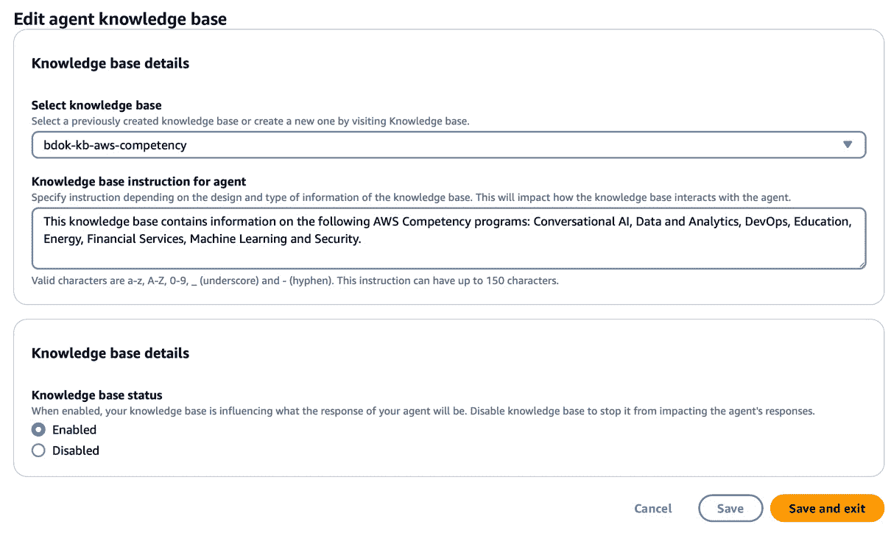

# 第十一章：Kubernetes 上的生成式 AI

**生成式人工智能**（**GenAI**）已成为一项变革性技术，彻底改变了我们与 AI 的互动方式以及如何利用 AI。本章将带你探索生成式 AI 的精彩世界，学习如何在 Kubernetes 上利用其强大功能。我们将深入了解生成式 AI 的基础知识，并理解它与传统 AI 的主要区别。

我们的重点将放在利用 **Amazon Bedrock**，这是一个旨在简化生成式 AI 应用开发和部署的综合服务套件。通过实际操作示例，你将获得在 Kubernetes 上构建生成式 AI 应用的实践经验，并使用 **Streamlit**，一个强大的 Python 库，用于创建互动数据应用。我们将覆盖整个过程，从开发到将应用部署到 Kubernetes 集群。

此外，我们将探索 **检索增强生成**（**RAG**）的概念，RAG 将生成式 AI 的力量与外部知识库结合起来。

最后，我们将介绍 **Amazon Bedrock** 的 **Agents**，这是一项强大的功能，允许你自动化任务并创建智能助手。你将学习如何构建代理，如何通过 OpenAPI 架构定义其能力，以及如何创建作为代理后端的 Lambda 函数。

到本章结束时，你将对生成式 AI 有一个扎实的理解，了解其应用以及构建和部署生成式 AI 应用到 Kubernetes 上所需的工具和技术。

本章将涵盖以下主要主题：

+   什么是生成式 AI，什么不是

+   使用 Amazon Bedrock 与基础模型进行工作

+   在 Kubernetes 上构建生成式 AI 应用

+   使用 **Amazon Bedrock** 构建 RAG 知识库

+   使用代理构建行动模型

# 技术要求

本章需要一个 AWS 账户和一个正在运行的 Kubernetes 集群。我们还将使用 **LangChain** 和 Streamlit 库。虽然部署应用到 Kubernetes 时不需要它们，但如果你希望在本地测试代码并修改以适应自己的实验，建议安装这些库。

此外，为了获取 RAG 练习（第四部分）的数据，必须安装 **Beautiful Soup** 库。

本章的所有代码可以在 [`github.com/PacktPublishing/Bigdata-on-Kubernetes`](https://github.com/PacktPublishing/Bigdata-on-Kubernetes) 的 `Chapter11` 文件夹中找到。

# 什么是生成式 AI，什么不是

生成性 AI 的核心是指能够基于其所接触到的训练数据生成新的原创内容的 AI 系统，这些内容可以是文本、图像、音频或代码。生成性 AI 模型在大量现有内容的数据集上进行训练，并学习其中的模式和关系。在得到提示后，这些模型可以生成新的原创内容，这些内容类似于训练数据，但并不是任何特定示例的精确复制。

这与传统的机器学习模型形成对比，后者侧重于基于现有数据进行预测或分类。

传统的机器学习模型，例如用于图像识别、自然语言处理或预测分析的模型，旨在接收输入数据，并基于该数据进行预测或分类。机器学习模型擅长处理分类任务（例如，识别图像中的物体或文本中的主题）、回归任务（例如，根据面积和位置等特征预测房价）以及聚类任务（例如，根据相似行为模式将客户分组）。

例如，一个图像识别模型可能会基于大量带标签的图像数据集进行训练，学习识别和分类新图像中的物体。同样，一个自然语言处理模型可能会基于文本数据语料库进行训练，执行情感分析、命名实体识别或语言翻译等任务。

在信用风险评估场景中，一个机器学习模型会基于包含过去贷款申请者信息的数据集进行训练，例如他们的收入、信用历史和其他相关特征，以及是否违约的标签。该模型会学习这些特征与贷款违约结果之间的模式和关系。当遇到新的贷款申请时，经过训练的模型便可以预测该申请者违约的可能性。

在这些情况下，机器学习模型并不生成新内容；相反，它是在使用从训练数据中学习到的模式和关系，对新的、未见过的数据进行有根据的预测或决策。

相比之下，例如，经过大量文本语料库训练的生成性 AI 模型可以在任何给定的主题或所需的风格下生成类似人类的写作。同样，经过图像训练的模型可以根据文本描述或其他输入数据创建全新的、逼真的图像。

尽管生成性 AI 的最终结果是创造新的内容，但其基本机制仍然基于相同的机器学习原理：进行预测。然而，生成性 AI 模型不仅仅是预测单一输出（如分类或数值），它们被训练来预测序列中的下一个元素，无论这个序列是由单词、像素或任何其他类型的数据组成。

## 大型神经网络的力量

虽然预测序列中下一个元素的概念相对简单，但生成性人工智能模型生成连贯、高质量内容的能力在于所使用的神经网络的规模和复杂性。

生成性人工智能模型通常使用拥有数十亿甚至万亿个参数的大型深度神经网络。这些神经网络在大量数据上进行训练，通常涉及数百万或数十亿个示例，从而使模型能够捕捉数据中极其微妙的模式和关系。

例如，Anthropic 的模型，如 Claude，是在一个庞大的文本数据集上进行训练的，这些数据涵盖了广泛的主题和领域。这使得模型能够深入理解语言、上下文和领域特定的知识，从而生成不仅语法正确，而且在语义上连贯且与给定上下文相关的文本。

## 挑战与局限性

尽管生成性人工智能展现出了显著的能力，但它并非没有挑战和局限性。一个主要的担忧是，这些模型可能生成带有偏见、有害或误导性内容，尤其是在训练数据集包含反映社会偏见或不准确信息的情况下。

此外，生成式 AI 模型有时可能会产生无意义、不一致或事实不准确的输出，尽管它们可能在表面上看起来合乎逻辑且可信。这被称为“幻觉”问题，即模型生成的内容并未基于事实知识或提供的背景。以下是两个著名的真实案例。加拿大航空的 AI 聊天机器人向一名乘客提供了有关航空公司丧亲票价政策的误导性信息。该聊天机器人错误地表示，即使在旅行已发生后，乘客仍可追溯申请减价的丧亲票价，这与加拿大航空的实际政策相矛盾。乘客依赖该聊天机器人“幻觉”般的回应，最终在航空公司拒绝兑现聊天机器人建议时，成功提起小额索赔案件并获胜（[`www.forbes.com/sites/marisagarcia/2024/02/19/what-air-canada-lost-in-remarkable-lying-ai-chatbot-case/`](https://www.forbes.com/sites/marisagarcia/2024/02/19/what-air-canada-lost-in-remarkable-lying-ai-chatbot-case/)）。此外，巴西的一名联邦法官使用 ChatGPT AI 系统来研究他所撰写判决的法律先例。然而，AI 提供了伪造的信息，引用了不存在的最高法院裁决作为该法官判决的依据（[`g1.globo.com/politica/blog/daniela-lima/post/2023/11/13/juiz-usa-inteligencia-artificial-para-fazer-decisao-e-cita-jurisprudencia-falsa-cnj-investiga-caso.ghtml`](https://g1.globo.com/politica/blog/daniela-lima/post/2023/11/13/juiz-usa-inteligencia-artificial-para-fazer-decisao-e-cita-jurisprudencia-falsa-cnj-investiga-caso.ghtml)）。

尽管存在这些挑战，生成式 AI 仍是一个快速发展的领域，研究人员和开发者正在积极解决这些问题。诸如微调、提示工程和使用外部知识来源（例如，知识库或 RAG）等技术，正在被探索以提高生成式 AI 模型的可靠性、安全性和事实准确性。

在接下来的章节中，我们将深入探讨如何使用 Amazon Bedrock 及其基础模型、知识库和基于代理的架构来构建和部署生成式 AI 应用的实际操作。

# 使用 Amazon Bedrock 来与基础模型进行协作

Amazon Bedrock 提供了一套基础模型，可作为构建生成式 AI 应用的模块。了解每个模型的能力和预期使用场景非常重要，以便为你的应用选择合适的模型。

在 Amazon Bedrock 中可用的模型包括语言模型、计算机视觉模型和多模态模型。语言模型擅长理解和生成类人文本，可以用于文本摘要、问答和内容生成等任务。而计算机视觉模型则擅长分析和理解视觉数据，非常适合图像识别、物体检测和场景理解等应用。

如同名称所示，多模态模型可以同时处理多种模态。这使得它适用于图像标注、视觉问答和数据图表分析等任务。

需要注意的是，每个模型都有其自身的优点和局限性，选择模型时应根据应用的具体需求来决定。例如，如果你的应用主要处理基于文本的任务，那么像 Llama 这样的语言模型可能是最合适的选择。然而，如果你需要处理文本和图像，那么像 Claude 这样的多模态模型则会更为合适。

为了将 Amazon Bedrock 的基础模型有效集成到我们的生成型 AI 应用程序中，请按照以下步骤操作：

1.  要使用 Amazon Bedrock 上的可用基础模型，首先需要激活它们。进入 AWS 控制台，搜索 Amazon Bedrock 页面。然后，点击 **修改模型访问权限** (*图 11.1*)。


图 11.1 – 修改 Amazon Bedrock 上的模型访问权限

1.  在下一页，选择 **Claude 3 Sonnet** 和 **Claude 3 Haiku** Anthropic 模型。这些是我们将用于生成型 AI 应用程序的基础模型。如果你愿意尝试和实验不同的模型，也可以选择所有可用的模型 (*图 11.2*)。


图 11.2 – 请求访问 Anthropic 的 Claude 3 模型

1.  点击 **下一步**，在下一页上查看更改并点击 **提交**。这些模型可能需要几分钟才能获得访问权限。

一旦获得访问权限，我们就拥有了开发生成型 AI 应用程序所需的一切。让我们开始吧。

# 在 Kubernetes 上构建生成型 AI 应用程序

在这一节中，我们将使用 Streamlit 构建一个生成型 AI 应用程序。该应用程序架构的示意图如 *图 11.3* 所示。在这个应用程序中，用户将能够选择与之交互的基础模型。


图 11.3 – 基础模型的应用架构

让我们从应用程序的 Python 代码开始。完整的代码可以在 GitHub 上的 *第十一章*`/streamlit-claude/app` 文件夹中找到。我们将逐块分析代码：

1.  创建一个名为`app`的文件夹，并在其中创建一个`main.py`代码文件。首先，我们导入必要的文件并创建一个客户端以访问 Amazon Bedrock 运行时 API：

    ```
    import boto3
    from langchain_community.chat_models import BedrockChat
    from langchain.callbacks.streaming_stdout import StreamingStdOutCallbackHandler
    bedrock = boto3.client(service_name='bedrock-runtime', region_name="us-east-1")
    ```

1.  接下来，我们定义一个重要的参数字典，用于与 Claude 进行交互：

    ```
    inference_modifier = {
        "max_tokens": 4096,
        "temperature": 0.5,
        "top_k": 250,
        "top_p": 1,
        "stop_sequences": ["\n\nHuman:"],
    }
    ```

1.  接下来，我们将配置一个函数，以允许选择首选的基础模型。通过选择，我们将返回一个可以通过 Langchain 访问 Bedrock 的模型对象：

    ```
    def choose_model(option):
        modelId = ""
        if option == "Claude 3 Haiku":
            modelId = "anthropic.claude-3-haiku-20240307-v1:0"
        elif option == "Claude 3 Sonnet":
            modelId = "anthropic.claude-3-sonnet-20240229-v1:0"
        model = BedrockChat(
            model_id=modelId,
            client=bedrock,
            model_kwargs=inference_modifier,
            streaming=True,
            callbacks=[StreamingStdOutCallbackHandler()],
        )
        return model
    ```

1.  现在，我们将添加一个小功能，用于重置对话历史记录：

    ```
    def reset_conversation():
        st.session_state.messages = []
    ```

1.  接下来，我们将开始开发`main`函数，并为应用程序界面添加一些小部件。以下代码创建了一个侧边栏。在其中，我们添加了一个选择框，选项包括 Claude 3 Haiku 和 Claude 3 Sonnet，我们写了一个确认消息告诉用户他们正在与哪个模型对话，并添加了一个`choose_model`函数来返回连接到 Bedrock 的类，并写下应用程序的标题，*Chat with* *Claude 3*：

    ```
    def main():
        with st.sidebar:
            option = st.selectbox(
                "What model do you want to talk to?",
                ("Claude 3 Haiku", "Claude 3 Sonnet")
            )
            st.write(f"You are talking to **{option}**")
            st.button('Reset Chat', on_click=reset_conversation)
        model = choose_model(option)
        st.title("Chat with Claude 3")
    ```

1.  接下来，如果`st.session_state`中尚未存在聊天历史记录，我们将初始化一个空列表。`st.session_state`是一个 Streamlit 对象，可以在应用程序重新运行时保持数据的持久性。然后，我们遍历`st.session_state`中的`messages`列表，并在聊天消息容器中显示每条消息。`st.chat_message`函数根据指定的角色（例如`user`或`assistant`）创建聊天消息容器。`st.markdown`函数在容器内显示消息内容：

    ```
    if "messages" not in st.session_state:
            st.session_state.messages = []
        for message in st.session_state.messages:
            with st.chat_message(message["role"]):
                st.markdown(message["content"])
    ```

1.  接下来，我们处理用户输入并显示对话。`st.chat_input`函数创建一个输入框，用户可以在其中输入提示。如果用户输入了提示，将执行以下步骤：（1）将用户的提示以`user`角色添加到`st.session_state`中的`messages`列表中；（2）将用户的提示以`user`角色显示在聊天消息容器中；（3）调用`model.stream(prompt)`函数，将用户的提示发送到 Bedrock 模型并实时返回响应。`st.write_stream`函数实时显示流式响应；（4）助手的响应以`assistant`角色添加到`st.session_state`中的`messages`列表中：

    ```
        if prompt := st.chat_input("Enter your prompt here"):
            st.session_state.messages.append(
                {"role": "user", "content": prompt}
            )
            with st.chat_message("user"):
                st.markdown(prompt)
            with st.chat_message("assistant"):
                response = st.write_stream(
                    model.stream(prompt)
                )
            st.session_state.messages.append(
                {"role": "assistant", "content": response}
            )
    ```

1.  最后，我们调用主函数来启动 Streamlit 应用程序：

    ```
    if __name__ == "__main__":
        main()
    ```

    如果你想在本地运行此应用程序，这里有一个`requirements.txt`文件：

    ```
    boto3==1.34.22
    langchain-community==0.0.33
    langchain==0.1.16
    streamlit==1.34.0
    pip install -r requirements.txt
    ```

    如果你已经安装了所需的库，使用`aws configure`命令对 AWS CLI 进行身份验证，然后通过以下命令在本地启动应用程序：

    ```
    streamlit run main.py
    ```

    这是在构建用于部署的容器镜像之前测试应用程序的绝妙方法。你可以随心所欲地测试和修改应用程序。

    准备好后，现在，让我们构建一个用于部署的容器镜像。

1.  以下是一个简单的**Dockerfile**，用于构建镜像：

    **Dockerfile**

    ```
    FROM python:3.9-slim
    WORKDIR /app
    RUN apt-get update && apt-get install -y \
        build-essential \
        curl \
        software-properties-common \
        git \
        && rm -rf /var/lib/apt/lists/*
    COPY app /app/
    EXPOSE 8501
    HEALTHCHECK CMD curl --fail http://localhost:8501/_stcore/health
    RUN pip3 install -r requirements.txt
    ENTRYPOINT ["streamlit", "run", "main.py", "--server.port=8501", "--server.address=0.0.0.0"]
    ```

    这个 Dockerfile 从 Python 3.9 slim 基础镜像开始，并将工作目录设置为 `/app`。它接着安装应用程序所需的各种系统包，例如 `build-essential`、`curl`、`software-properties-common` 和 `git`。应用程序代码被复制到 `/app` 目录，容器暴露 `8501` 端口。健康检查会检查 Streamlit 应用程序是否在 [`localhost:8501/_stcore/health`](http://localhost:8501/_stcore/health) 正常运行。通过 `pip3` 安装所需的 Python 包，依据 `requirements.txt` 文件。最后，`ENTRYPOINT` 命令通过运行 `streamlit run main.py` 启动 Streamlit 应用程序，并指定服务器端口和地址。

1.  要在本地构建镜像，请输入以下命令：

    ```
    docker build --platform linux/amd64 -t <YOUR_USERNAME>/chat-with-claude:v1 .
    ```

    记得将 `<YOUR_USERNAME>` 替换成你实际的 Docker Hub 用户名。然后，使用以下命令推送镜像：

    ```
    docker push <YOUR_USERNAME>/chat-with-claude:v1
    ```

记住，这个镜像将在 Docker Hub 上公开可用。不要在代码中或作为环境变量放入任何认证凭据或敏感数据！

现在，让我们在 Kubernetes 上部署我们的应用程序。

## 部署 Streamlit 应用程序

正如我们之前所看到的，要在 Kubernetes 上部署我们的应用程序，我们需要一个 `Deployment` 和一个 `Service` `.yaml` 定义。我们可以将两者合并到一个文件中：

1.  首先，创建一个 `deploy_chat_with_claude.yaml` 文件，内容如下：

    **deploy_chat_with_claude.yaml**

    ```
    apiVersion: apps/v1
    kind: Deployment
    metadata:
      name: chat-with-claude
    spec:
      replicas: 1
      selector:
        matchLabels:
          app: chat-with-claude
      template:
        metadata:
          labels:
            app: chat-with-claude
        spec:
          containers:
          - name: chat-with-claude
            image: docker.io/neylsoncrepalde/chat-with-claude:v1
            ports:
            - containerPort: 8501
            env:
            - name: AWS_ACCESS_KEY_ID
              valueFrom:
                secretKeyRef:
                  name: aws-credentials
                  key: aws_access_key_id
            - name: AWS_SECRET_ACCESS_KEY
              valueFrom:
                secretKeyRef:
                  name: aws-credentials
                  key: aws_secret_access_key
    ```

    代码的第一部分定义了一个名为 `chat-with-claude` 的 `Deployment` 资源。它使用一个预先构建的镜像（你可以将其更改为自己的新镜像），并在容器中打开 `8501` 端口，供外部访问。`spec.template.spec.containers.env` 块会将 AWS 凭证作为环境变量挂载到容器中，这些凭证来自名为 `aws-credentials` 的密钥。

1.  代码的第二部分定义了一个 `LoadBalancer` 服务，为 `Deployment` 中定义的 pod 提供服务，该服务监听 `8501` 端口并将流量转发到容器中的 `8501` 端口。别忘了 `---`，它是分隔多个资源的必需项：

    ```
    ---
    apiVersion: v1
    kind: Service
    metadata:
      name: chat-with-claude
    spec:
      type: LoadBalancer
      ports:
      - port: 8501
        targetPort: 8501
      selector:
        app: chat-with-claude
    ```

1.  现在，我们将创建命名空间和密钥，并使用以下命令部署应用程序：

    ```
    kubectl create namespace genai
    kubectl create secret generic aws-credentials --from-literal=aws_access_key_id=<YOUR_ACCESS_KEY_ID> --from-literal=aws_secret_access_key="<YOUR_SECRET_ACCESS_KEY>" -n genai
    kubectl apply -f deploy_chat_with_claude.yaml -n genai
    ```

1.  就这些。等待几分钟，直到 `LoadBalancer` 启动并运行，然后使用以下命令检查其 URL：

    ```
    kubectl get svc -n genai
    ```

1.  现在，粘贴带有 `:8501` 的 URL 以定义正确的端口，*瞧瞧！*（*图 11.4*）。


图 11.4 – Chat with Claude 3 应用程序 UI

现在，和助手玩一玩。试试 Haiku 和 Sonnet，并注意它们在速度和回答质量上的差异。试几次之后，你会注意到，向基础模型提问特定问题会导致幻觉。比如问模型：“你是谁？”你会得到一个惊喜（还会笑出声）。这个模型需要上下文。

在下一节中，我们将使用 RAG 提供一些上下文。

# 使用知识库构建 Amazon Bedrock 的 RAG

RAG 是一种用于生成 AI 模型的技术，通过在生成过程中为基础模型提供额外的上下文和知识。其工作原理是首先从知识库或文档语料库中检索相关信息，然后使用这些检索到的信息来增强输入到生成模型的内容。

RAG 是为生成 AI 模型提供上下文的良好选择，因为它允许模型访问并利用外部知识源，这可以显著提高生成输出的质量、准确性和相关性。如果没有 RAG，模型将仅限于在训练过程中学到的知识和模式，而这些可能并不总是充足或最新的，尤其是对于特定领域或快速发展的主题。

RAG 的一个关键优势是它使模型能够利用大型知识库或文档集合，这些内容在模型的训练数据中包含是不现实或不可能的。这使得模型能够生成更为知情和专业的输出，因为它可以从大量相关信息中提取内容。此外，RAG 有助于缓解如幻觉和偏见等问题，因为模型可以访问权威和事实性的来源。

然而，RAG 也存在一些局限性。生成输出的质量在很大程度上依赖于检索信息的相关性和准确性，而这些因素会受到知识库质量、检索机制效果以及模型是否能够正确整合检索信息的影响。此外，RAG 还可能带来计算开销和延迟，因为它需要在生成过程之前执行额外的检索步骤。

要使用 RAG 构建 AI 助手，我们将使用亚马逊 Bedrock 服务中的知识库功能，这是 Bedrock 中允许你无缝创建和管理知识库的功能。让我们开始吧。

对于我们的练习，我们将构建一个能够提供 AWS 能力计划信息的 AI 助手。该助手架构的视觉表示如 *图 11.5* 所示：


图 11.5 – 亚马逊 Bedrock 应用架构的知识库

AWS 能力计划是 AWS 提供的一个验证计划，旨在认可在特定解决方案领域中展示出技术熟练度和客户成功的合作伙伴。AWS 能力授予 **AWS 合作伙伴网络** (**APN**) 成员，这些成员经过与特定 AWS 服务或工作负载相关的技术验证，确保他们具备提供一致且高质量解决方案的专业能力。这些能力涵盖了 DevOps、迁移、数据与分析、机器学习和安全等多个领域。每个能力都有自己的规则文档，理解起来可能相当具有挑战性。

1.  首先，我们将收集一些有关该程序的上下文信息。在 GitHub 上的*第十一章*`/claude-kb/knowledge-base/`文件夹下，您将找到一段 Python 代码，该代码将收集关于对话式 AI、数据与分析、DevOps、教育、能源、金融服务、机器学习和安全程序的信息。将此代码保存到本地后，使用以下命令安装 Beautiful Soup 库：

    ```
    pip install "beautifulsoup4==4.12.2"
    python get_competency_data.py
    ```

    几秒钟后，数据应保存到您本地的机器上。

1.  接下来，创建一个 S3 存储桶并上传这些文件。这将成为我们 RAG 层的基础。

1.  接下来，进入 AWS 控制台中的**Bedrock**页面。在侧边菜单中，点击**知识库**，然后点击**创建知识库**（*图 11.6*）。


图 11.6 – 知识库首页

1.  在下一页面，选择一个名称为您的知识库，并在**IAM 权限**部分选择**创建并使用新服务角色**。然后，点击**下一步**。

1.  接下来，您将配置数据源。为**数据源名称**选择一个您喜欢的名称。对于**数据源位置**，确保选中了**此 AWS 账户**选项框。然后，在**S3 URI**部分，点击**浏览 S3**，搜索包含 AWS Competency 数据集的 S3 存储桶（我们在*步骤 2*中创建的存储桶）。该配置的示例如*图 11.7*所示。选择 S3 存储桶后，点击**下一步**。


图 11.7 – 选择知识库的数据源

接下来，我们将选择嵌入模型。此嵌入模型负责将文本或图像文件转换为称为**嵌入**的向量表示。这些嵌入捕捉输入数据的语义和上下文信息，从而支持高效的相似性比较和检索操作。默认情况下，Bedrock 的嵌入模型 Amazon Titan 应该是可用的。如果不可用，请在控制台中按照相同的过程申请访问权限。

1.  在下一页面的**嵌入模型**部分，选择**Titan Embeddings G1 - Text**。在**向量数据库**部分，确保选中了**快速创建新的向量存储**选项。此快速创建选项基于 OpenSearch Serverless 创建一个向量数据库。将其他选项保持未选中状态，然后点击**下一步**。

注意

OpenSearch 是一个开源分布式搜索与分析引擎，基于 Apache Lucene，并来源于 Elasticsearch。它是 RAG 向量数据库的一个优秀选择，因为它提供了高效的全文搜索和最近邻搜索功能，适用于向量嵌入的检索。OpenSearch 支持稠密向量索引与检索，非常适合存储和查询大量的向量嵌入，这对于 RAG 模型的检索组件至关重要。

1.  接下来，检查信息是否正确提供。如果一切看起来正常，点击**创建知识库**。请耐心等待，创建过程将需要几分钟才能完成。

1.  知识库启动并运行后，返回 Bedrock 中的**知识库**页面，点击你刚创建的知识库。在下一个页面中，滚动直到找到**数据源**部分（如*图 11.8*所示）。选择数据源并点击**同步**，以开始嵌入文本内容。这也需要几分钟。


图 11.8 – 同步知识库与其数据源

在“同步”准备好之后，我们已经具备了运行生成式 AI 助手与 RAG 所需的一切。现在，是时候调整代码，让 Claude 与知识库配合使用。

## 调整 RAG 检索代码

我们将从之前开发的代码开始，使用纯 Claude 模型。由于我们只需要进行一些小修改，因此不需要重新查看整个代码。我们将仔细看看必要的修改。RAG 应用程序的完整代码可以在[`github.com/PacktPublishing/Bigdata-on-Kubernetes/tree/main/Chapter11/claude-kb/app`](https://github.com/PacktPublishing/Bigdata-on-Kubernetes/tree/main/Chapter11/claude-kb/app)文件夹中找到。如果你不想自定义代码，可以使用我为此示例提供的现成 docker 镜像。

1.  首先，我们需要额外的导入：

    ```
    import os
    from botocore.client import Config
    from langchain.prompts import PromptTemplate
    from langchain.retrievers.bedrock import AmazonKnowledgeBasesRetriever
    from langchain.chains import RetrievalQA
    ```

    在这里，我们导入`os`库以获取环境变量。`Config`类将帮助构建一个配置对象，以访问`bedrock-agent` API。所有其他导入与访问知识库并将检索到的文档与 AI 响应合并有关。

1.  接下来，我们将从环境变量中获取 Amazon Bedrock 服务的知识库 ID。这是一个非常有用的方法。如果将来需要更改知识库，就无需重新构建镜像，只需更改环境变量。然后，我们设置一些配置并为`bedrock-agent-runtime` API（用于知识库）创建一个客户端：

    ```
    kb_id = os.getenv("KB_ID")
    bedrock_config = Config(connect_timeout=120, read_timeout=120, retries={'max_attempts': 0})
    bedrock_agent_client = boto3.client(
        "bedrock-agent-runtime", config=bedrock_config, region_name = "us-east-1"
    )
    ```

1.  接下来，我们将配置一个提示模板，帮助我们将从知识库中检索的文档与用户问题串联起来。最后，我们将实例化一个对象，该对象将保存模板，并接收文档和用户问题作为输入：

    ```
    PROMPT_TEMPLATE = """
    Human: You are a friendly AI assistant and provide answers to questions about AWS competency program for partners.
    Use the following pieces of information to provide a concise answer to the question enclosed in <question> tags.
    Don't use tags when you generate an answer. Answer in plain text, use bullets or lists if needed.
    If you don't know the answer, just say that you don't know, don't try to make up an answer.
    <context>
    {context}
    </context>
    <question>
    {question}
    </question>
    The response should be specific and use statistics or numbers when possible.
    Assistant:"""
    claude_prompt = PromptTemplate(template=PROMPT_TEMPLATE,
                                   input_variables=["context","question"])
    ```

1.  设置完`choose_model()`函数后，我们需要实例化一个`retriever`类，用于从知识库中拉取文档：

    ```
    retriever = AmazonKnowledgeBasesRetriever(
            knowledge_base_id=kb_id,
            retrieval_config={
                "vectorSearchConfiguration": {
                    "numberOfResults": 4
                }
            },
            client=bedrock_agent_client
        )
    ```

1.  现在，在`main`函数中，我们将添加`RetrievalQA`。这个类用于构建能够从知识库中检索相关信息的问答系统：

    ```
    qa = RetrievalQA.from_chain_type(
            llm=model,
            chain_type="stuff",
            retriever=retriever,
            return_source_documents=False,
            chain_type_kwargs={"prompt": claude_prompt}
        )
    ```

1.  最后，我们将修改响应以提供完整的答案：

    ```
    with st.chat_message("assistant"):
        response = qa.invoke(prompt)['result']
        st.write(response)
    ```

    就这样。代码已经准备好，可以构建新的镜像。你可以通过创建一个新的 Dockerfile，使用之前的代码重新构建它。在运行 `docker build` 命令时，记得选择一个不同的镜像名称（或者至少选择一个不同的版本）。

1.  接下来，我们将开始部署。`.yaml` 文件与上一节中的文件非常相似（但记得更改部署、服务、容器和标签的所有名称为 `rag-with-claude`）。该代码的完整版可在 GitHub 仓库中找到。我们只需声明知识库 ID 的环境变量。由于这不是敏感凭证，因此我们不需要使用 Kubernetes 秘密来处理它。我们将使用 `ConfigMap`。`.yaml` 文件中的 `spec.template.spec.container.env` 部分应该如下所示：

    ```
    env:
      - name: AWS_ACCESS_KEY_ID
        valueFrom:
          secretKeyRef:
            name: aws-credentials
            key: aws_access_key_id
      - name: AWS_SECRET_ACCESS_KEY
        valueFrom:
          secretKeyRef:
            name: aws-credentials
            key: aws_secret_access_key
      - name: KB_ID
        valueFrom:
          configMapKeyRef:
            name: kb-config
            key: kb_id
    ```

    注意，我们添加了一个新的环境变量 `KB_ID`，它将从 `ConfigMap` 导入。

1.  要部署新应用程序，我们运行以下命令：

    ```
    kubectl create configmap kb-config --from-literal=kb_id=<YOUR_KB_ID> -n genai
    kubectl apply -f deploy_chat_with_claude.yaml -n genai
    ```

    我们运行前面的命令来部署应用程序。等待几分钟，直到 `LoadBalancer` 启动，然后使用以下命令：

    ```
    kubectl get svc -n genai
    ```

    使用前面的命令获取 `LoadBalancer` 的 URL。将名为 `rag-with-claude` 的服务复制并粘贴到浏览器中，并添加 `:8501` 以连接到暴露的端口。*瞧！* 你应该能看到新应用程序在运行，正如*图 11.9* 所示。


图 11.9 – RAG 应用 UI

尝试稍微玩一下这个应用程序。你会发现，如果你提问与其范围无关的问题（如 AWS 能力计划以外的内容），助手会告诉你它无法回答。

现在，我们将进入本章的最后部分，学习如何让生成性 AI 模型通过代理执行操作。

# 使用代理构建行动模型

代理是生成性 AI 世界中最新的功能。它们是强大的工具，通过允许生成性 AI 模型代表我们执行任务，实现了任务的自动化。它们充当生成性 AI 模型与外部系统或服务之间的中介，促进了现实世界任务的执行。

在后台，代理“理解”用户的需求，并调用执行操作的后端函数。代理能够执行的范围由 OpenAPI 架构定义，它将用于“理解”它的功能以及如何正确调用后端函数。

总结来说，要构建一个代理，我们需要一个 OpenAPI 架构、一个后端函数和一个知识库。知识库是可选的，但它能大大提升用户与 AI 助手的交互体验。

在本节的练习中，我们将构建一个“了解” AWS 能力计划相关信息的代理。该代理的应用架构的可视化表示如*图 11.10*所示。


图 11.10 – 代理应用架构

这个代理将创建一个简单的工作表，包含用例信息，将工作表保存到 Amazon S3，并在 DynamoDB 表中注册该信息以供查询。我们开始吧：

1.  首先，我们需要一个 OpenAPI 模式，定义代理可用的方法。在这种情况下，我们将定义两个方法。第一个方法 `generateCaseSheet` 注册用例信息并创建工作表。第二个方法 `checkCase` 接收用例 ID 并返回相关信息。由于这是一个较长的 JSON 文件，我们不会在此展示。完整的代码可以在 [`github.com/PacktPublishing/Bigdata-on-Kubernetes/tree/main/Chapter11/agent`](https://github.com/PacktPublishing/Bigdata-on-Kubernetes/tree/main/Chapter11/agent) 文件夹中找到。复制这段代码并将其保存在 S3 桶中。

1.  然后，我们将定义一个 Lambda 函数，作为代理的后端。该函数的完整 Python 代码可以在书籍的 GitHub 仓库中找到，位于 *第十一章*`/agent/function` 文件夹中。在你的机器上，创建一个名为 `function` 的文件夹，并将此代码保存为 `lambda_function.py`。这段代码定义了一个 Lambda 函数，作为 Bedrock 代理的后端。该函数处理两个不同的 API 路径：`/generateCaseSheet` 和 `/checkCase`。让我们逐块分析这段代码。在导入必要的文件夹之后，我们定义了两个辅助函数，从事件对象中提取参数值（`get_named_parameter` 和 `get_named_property`）。`generateCaseSheet` 函数负责根据提供的信息创建一个新的用例表格。它从事件对象中提取所需的参数，生成一个唯一的 ID，使用 `CaseTemplate` 类创建一个新的 Excel 工作簿，将提供的参数填充到模板中，保存工作簿到临时文件，上传到 S3 桶，并将用例信息存储到 DynamoDB 表中。最后，它返回一个包含用例详情的响应对象。`checkCase` 函数根据提供的 `caseSheetId` 参数从 DynamoDB 表中检索用例表格信息，并返回一个包含用例详情的响应对象。`lambda_handler` 函数是 Lambda 函数的入口点，它根据事件对象中的 `apiPath` 值决定执行的操作。该函数根据操作构建相应的响应对象并返回。

1.  接下来，在 `function` 文件夹中，创建一个名为 `lambda_requirements.txt` 的新文件，在其中列出 Lambda 函数代码的依赖项。在 `lambda_requirements.txt` 文件中输入 `openpyxl==3.0.10` 并保存。

1.  现在，在部署该函数之前，我们需要创建一个 IAM 角色，授予 Lambda 所需的权限。在 AWS 控制台中，进入 IAM 页面，选择侧边菜单中的 **角色**，然后点击 **创建新角色**。

1.  在下一页，选择**AWS 服务**作为**受信实体类型**，并选择**Lambda**作为**使用案例**（如*图 11.11*所示）。点击**下一步**。


图 11.11 – 选择受信实体和 AWS 服务

1.  现在，我们将选择权限策略。选择**Administrator Access**并点击**下一步**。记住，拥有这样的开放权限在生产环境中*不是*一个好做法。你应该仅为所需的操作和资源设置权限。

1.  然后，为你的 IAM 角色选择一个名称（例如`BDOK-Lambda-service-role`），并点击**创建角色**。

1.  然后，你将再次看到 IAM **角色**页面。搜索你创建的角色并点击它（*图 11.12*）。


图 11.12 – 选择你创建的 IAM 角色

1.  在角色页面，你将看到角色的**Amazon 资源名称**（**ARN**）。复制并保存它，稍后我们将需要这个名称来部署 Lambda 函数。

1.  接下来，在你创建的`function`文件夹内，创建一个名为`worksheet`的新文件夹。从[`github.com/PacktPublishing/Bigdata-on-Kubernetes/tree/main/Chapter11/agent/function/worksheet`](https://github.com/PacktPublishing/Bigdata-on-Kubernetes/tree/main/Chapter11/agent/function/worksheet)复制两个文件，第一个命名为`__init__.py`，第二个命名为`template.py`，将这些代码文件放入`worksheet`文件夹中。这段代码包含一个名为`CaseTemplate`的类，它使用`openpyxl` Python 库构建一个 Excel 工作表。

1.  接下来，复制[`github.com/PacktPublishing/Bigdata-on-Kubernetes/tree/main/Chapter11/agent/scripts`](https://github.com/PacktPublishing/Bigdata-on-Kubernetes/tree/main/Chapter11/agent/scripts)文件夹中的另外两个文件，分别命名为`build_lambda_package.sh`和`create_lambda_function.sh`。这些文件包含 bash 代码，将为 Lambda 函数安装依赖项并将其部署到 AWS。

1.  现在，我们将部署 Lambda 函数。这是检查项目结构是否正确的好时机。文件夹和文件结构应该如下所示：

    ```
    ├── app
    │   └── main.py
    ├── function
    │   ├── lambda_function.py
    │   ├── lambda_requirements.txt
    │   ├── test_event.json
    │   └── worksheet
    │       ├── __init__.py
    │       └── template.py
    ├── openapi_schema.json
    └── scripts
        ├── build_lambda_package.sh
    scripts folder and run the following commands:

    ```

    sh build_lambda_package.sh

    sh create_lambda_function.sh "<YOUR_ROLE_ARN>"

    ```

    ```

记得将`<YOUR_ROLE_ARN>`替换为你实际的 Lambda IAM 角色 ARN。现在，我们还有一些工作要做。接下来，我们将创建 DynamoDB 表格，用于存储关于使用案例的信息。

## 创建 DynamoDB 表

DynamoDB 是一个完全托管的 NoSQL 数据库服务。它是一个键值和文档数据库，可以在任何规模下提供单数毫秒级的性能。DynamoDB 已针对运行无服务器应用进行了优化，并且设计上能够根据需求自动向上或向下扩展，无需预配置或管理服务器。它特别适合需要在任何规模下对数据进行低延迟读写访问的应用程序。其极低的延迟使其成为 AI 助手应用程序的一个非常好的选择。让我们开始吧：

1.  在 AWS 控制台中，导航到**DynamoDB**页面。在侧边菜单中，点击**表格**，然后点击**创建表格**。

1.  在下一页中，填写`case-sheets`和`caseSheetId`。记得选择**数字**，表示此条目为数字，如*图 11.13*所示。将所有其他配置保留为默认，然后点击**创建表格**。


图 11.13 – 创建 DynamoDB 表格

几秒钟后，你应该能够看到已准备好的 DynamoDB 表格。现在，我们将配置 Bedrock 代理。

## 配置代理

现在，在本节的最后部分，我们将配置一个 Bedrock 代理，并将其链接到其后端 Lambda 函数和知识库数据库。让我们开始吧：

1.  首先，在 AWS 控制台中，搜索`Bedrock`，然后在侧边菜单中点击**代理**。

1.  在弹出框中，输入你的代理名称（`aws-competency-agent`），然后点击**创建**。

1.  接下来，你将看到代理配置页面。滚动到**选择模型**，然后选择 Anthropic 模型**Claude 3 Haiku**（你也可以根据需要尝试其他可用的模型）。

1.  在`你是一个友好的 AI 助手。你的主要目标是帮助 AWS 合作伙伴公司为 AWS 能力认证计划创建案例表格，注册这些案例，并向用户提供已注册案例的信息。当你生成案例表格时，总是要向用户展示案例表格的 ID（id）、客户的名称（client）和案例名称（casename），并确认案例已成功创建。同时，回答用户关于你能做什么以及如何帮助他们的问题。` 这是代理配置中非常重要的一部分。可以根据这些指令进行多次操作。此屏幕的示例如*图 11.14*所示。


图 11.14 – 配置代理的指令

1.  之后，点击页面顶部的**保存**按钮，让 AWS 创建必要的权限策略。

1.  接下来，滚动到**操作组**部分，点击**添加**。

1.  在下一页中，为你的操作组选择一个名称。对于**操作组类型**，选择**使用 API 模式定义**。在**操作组调用**中，选择**选择一个现有的 Lambda 函数**，然后选择我们刚才创建的 Lambda 函数（*图 11.15*）。


图 11.15 – 为代理的操作组选择 Lambda 函数

1.  现在，在**操作组架构**部分，选择**选择现有 API 架构**，然后点击**浏览 S3**，搜索我们保存在 S3 上的 OpenAPI 架构（*图 11.16*）。然后，点击**创建**。


图 11.16 – 选择 OpenAPI 架构

1.  接下来，在**知识库**部分，点击**添加**。

1.  选择我们之前创建的知识库，并为代理输入一些使用说明。例如：`此知识库包含以下 AWS 能力程序的信息：对话式 AI、数据与分析、DevOps、教育、能源、金融服务、机器学习和安全`。确保**知识库状态**设置为**启用**（*图 11.17*）。点击**保存** **并退出**。



图 11.17 – 将知识库附加到代理

1.  现在，您已返回到代理的编辑页面。这里不需要其他操作，所以您可以点击顶部的**准备**，使代理准备运行，然后点击**保存** **并退出**。

1.  现在，您将被带回代理的主页。向下滚动到**别名**部分并点击**创建**。

1.  输入一个别名名称（例如`aws-competency`），然后点击**创建别名**。


图 11.18 – 创建别名

1.  现在，最后一步是为 Lambda 注册一个权限，以便这个代理能够触发函数执行。在代理的主页上，复制代理 ARN。

1.  接下来，转到**Lambda**页面，点击我们为此练习创建的函数。在函数的主页上，向下滚动，点击**配置**，然后点击侧边菜单中的**权限**（*图 11.19*）。


图 11.19 – Lambda 权限

1.  再次向下滚动到**基于资源的策略声明**部分，点击**添加权限**。

1.  在下一页中，填写`lambda:InvokeFunction`（*图 11.20*）。然后，点击**保存**。


图 11.20 – 配置 Bedrock 代理的 Lambda 权限

这就是我们让代理运行所需的所有配置。现在，是时候进行部署了。让我们把 Streamlit 应用程序部署到 Kubernetes 上。

## 在 Kubernetes 上部署应用程序

在 Kubernetes 上部署代理 Streamlit 应用程序遵循与之前部署的其他两个应用程序相同的路径。唯一不同的是我们必须创建一个新的`configmap`，并包含代理的 ID 及其别名 ID：

1.  进入 AWS 控制台中的**代理**页面，复制代理的 ID（位于顶部区域）和别名 ID（位于底部区域）。

1.  现在，使用以下命令创建带有这些参数的 `configmap`：

    ```
    kubectl create configmap agent-config --from-literal=agent_alias_id=<YOUR_ALIAS_ID> --from-literal=agent_id=<YOUR_AGENT_ID> -n genai
    ```

    记得将 `<YOUR_ALIAS_ID>` 和 `<YOUR_AGENT_ID>` 占位符替换为实际值。

1.  如果你想自定义应用程序，可以构建一个自定义镜像。如果不想，可以使用来自 DockerHub 的现成镜像（[`hub.docker.com/r/neylsoncrepalde/chat-with-claude-agent`](https://hub.docker.com/r/neylsoncrepalde/chat-with-claude-agent)）。

1.  接下来，我们将为应用程序和服务部署定义一个 `deploy_agent.yaml` 文件。该文件的内容可以在 [`github.com/PacktPublishing/Bigdata-on-Kubernetes/tree/main/Chapter11/agent`](https://github.com/PacktPublishing/Bigdata-on-Kubernetes/tree/main/Chapter11/agent) 文件夹中找到。

1.  将此文件复制到本地后，现在运行以下命令：

    ```
    kubectl apply -f deploy_agent.yaml -n genai
    ```

1.  等待几秒钟，直到 `LoadBalancer` 启动完成。然后，运行以下命令以获取 `LoadBalancer` 的 URL：

    ```
    kubectl get svc -n genai
    ```

    将其粘贴到浏览器中，并添加正确的端口（`:8501`），查看魔法的发生（*图 11.21*）。


图 11.21 – AWS 能力代理应用程序 UI

尝试插入一个用于创建新用例的提示，如*图 11.18*所示。同时，你也可以通过传递用例的 ID 来查看该用例的具体信息（*图 11.22*）。


图 11.22 – 使用代理检查用例信息

玩一玩。提出关于能力计划的问题，尝试注册不同的用例。同时，你也可以检查 AWS DynamoDB，查看我们创建的表中摄取的信息，并查看 S3 中代理创建的 Excel 文件。

就是这样！恭喜你！你刚刚部署了一个完整的生成式 AI 代理应用程序，它可以通过自然语言在 Kubernetes 上为你执行任务。

# 总结

在本章中，我们探索了生成式 AI 的激动人心的世界，并学习了如何在 Kubernetes 上利用其力量。我们首先了解了生成式 AI 的基本概念、其底层机制以及它与传统机器学习方法的区别。

然后，我们利用 Amazon Bedrock，一个全面的服务套件，来构建和部署生成式 AI 应用程序。我们学习了如何使用 Bedrock 的基础模型，如 Claude 3 Haiku 和 Claude 3 Sonnet，并将它们集成到 Streamlit 应用程序中，以提供交互式用户体验。

接下来，我们深入探讨了 RAG 的概念，它将生成式 AI 的强大功能与外部知识库相结合。我们使用 Amazon Bedrock 构建了一个 RAG 系统，使我们的应用程序能够访问和利用大量的结构化数据，从而提高生成输出的准确性和相关性。

最后，我们探讨了 Amazon Bedrock 的代理功能，这是一个强大的特性，允许生成式 AI 模型自动化任务并代替我们采取行动。我们学习了如何构建代理，通过 OpenAPI 架构定义其能力，并创建作为代理后台的 Lambda 函数。

在本章中，我们通过实践经验学习了如何在 Kubernetes 上构建和部署生成式 AI 应用。通过本章获得的技能和知识，在当今快速发展的技术环境中具有不可估量的价值。生成式 AI 正在改变各行各业，彻底革新我们与 AI 的互动方式及其应用。通过掌握本章中介绍的工具和技术，你将能够构建创新且智能的应用，生成类人内容，利用外部知识来源，并实现任务自动化。

在下一章，我们将讨论一些构建生产就绪的 Kubernetes 环境所需的重要要点，这些内容由于篇幅原因在本书中未能展开。
