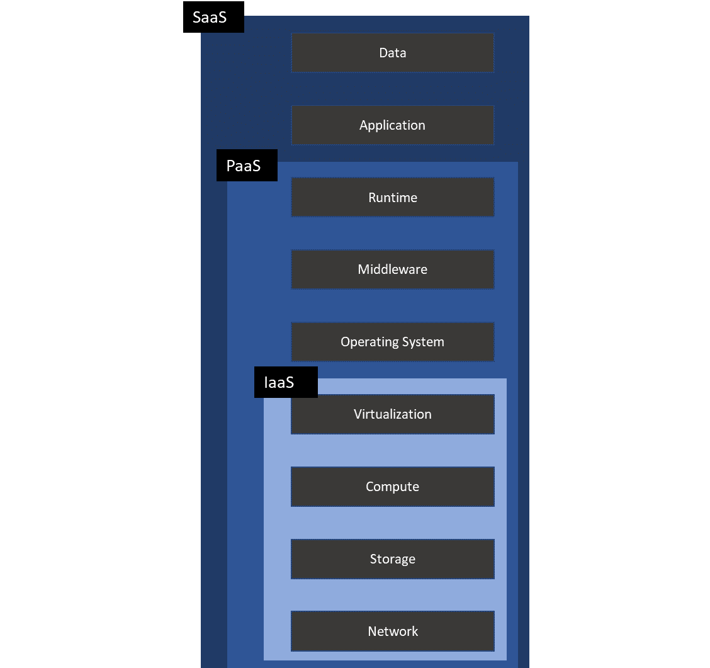
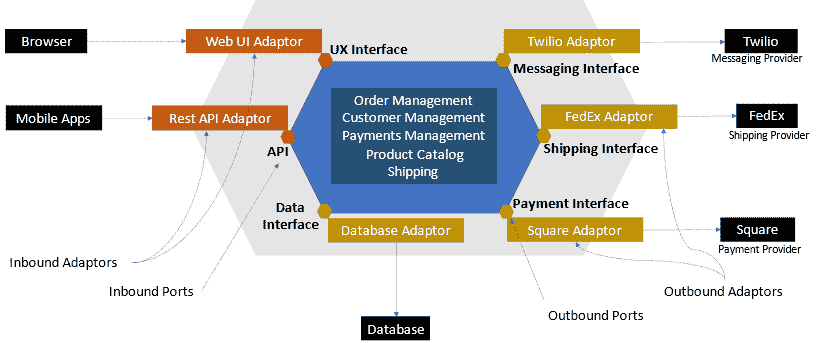
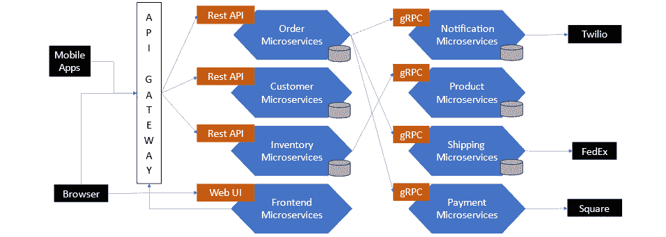
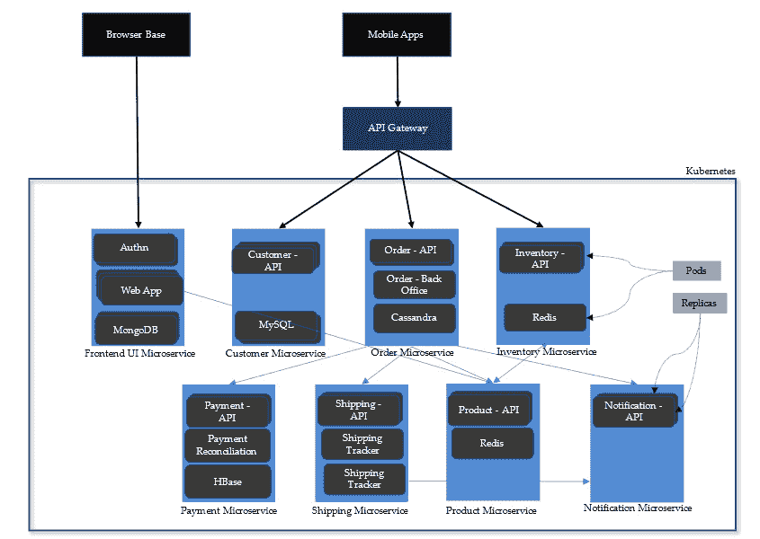
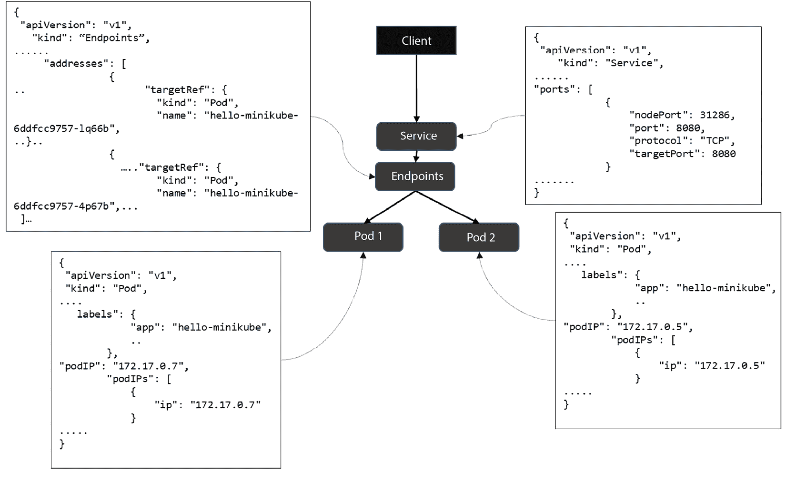
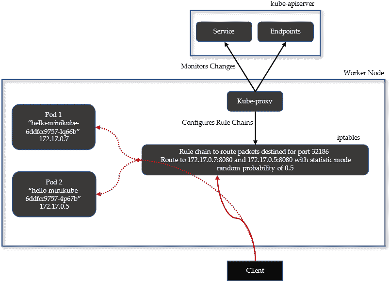
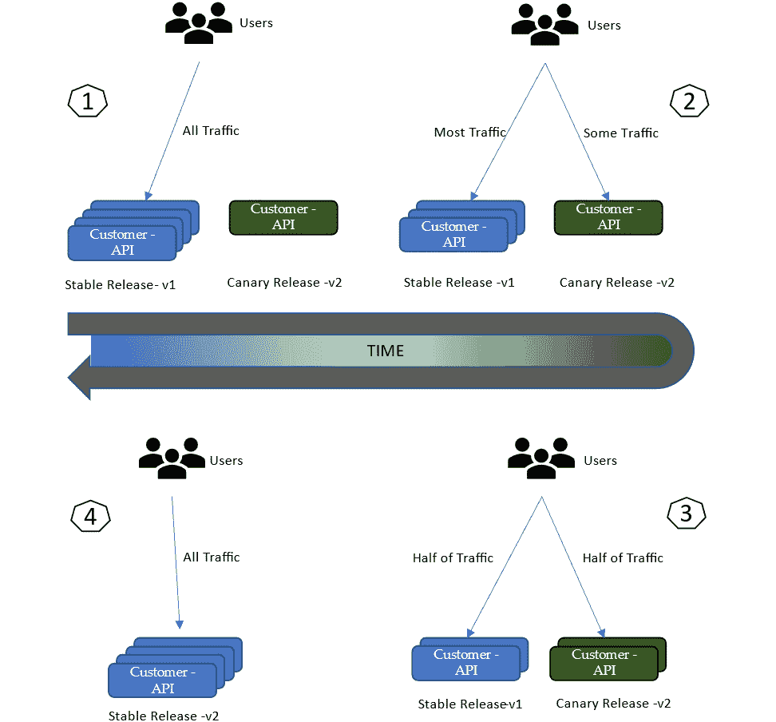
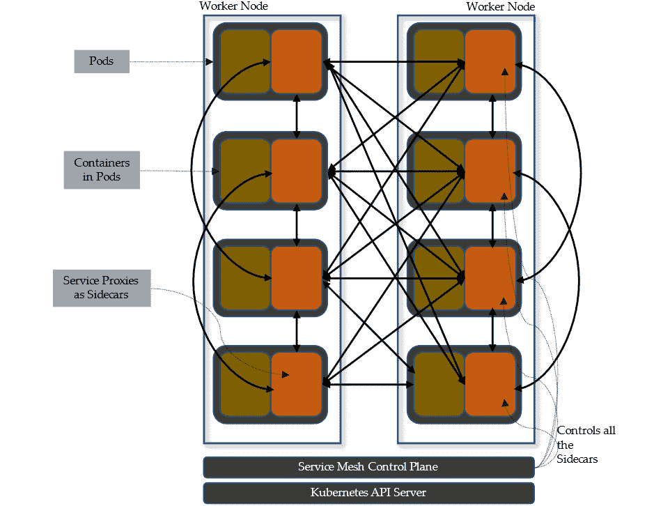

# 1

# 服务网格简介

**服务网格**是一个高级且复杂的话题。如果你有使用云、Kubernetes，及基于微服务架构开发和构建应用程序的经验，那么你会很容易理解服务网格带来的一些好处。在本章中，我们将熟悉并回顾一些关键概念，而不会深入讨论细节。我们将探讨在使用微服务架构构建的应用程序在云端或传统数据中心中部署和运行时遇到的问题。后续章节将重点讲解 Istio，因此花些时间阅读本章，对你后续的学习将大有裨益。

在本章中，我们将涵盖以下主要主题：

+   云计算及其优势

+   微服务架构

+   Kubernetes 及其对设计思维的影响

+   服务网格简介

本章中的概念将帮助你建立对服务网格的理解，并说明它们为何必要。它还将指导你识别 IT 环境中一些迹象和症状，提示你需要实施服务网格。如果你没有在使用 Kubernetes、云和微服务架构的大规模部署中积累实践经验，那么本章将帮助你熟悉这些概念，为你后续理解更复杂的内容打下良好的基础。即使你已经熟悉这些概念，阅读本章也能帮助你刷新记忆和经验。

# 重新审视云计算

在本节中，我们将简要介绍什么是云计算，它带来了哪些好处，如何影响设计思维，以及软件开发流程。

**云计算**是一种类似于我们家中使用的公共事业服务（如液化气和电力）的计算方式。你不需要管理电力的生产、分配或运作。相反，你只需通过插入电源插座来有效、经济地使用设备，使用设备，并为你消费的电力付费。虽然这个例子非常简单，但作为类比，它仍然很有意义。云计算提供商通过互联网提供计算、存储、数据库以及其他众多服务，包括**基础设施即服务**（**IaaS**）、**平台即服务**（**PaaS**）和**软件即服务**（**SaaS**）。



图 1.1 – 云计算选项

*图 1.1* 展示了最常用的云计算选项：

+   **IaaS** 提供了如网络等基础设施，以便将你的应用程序与组织内的其他系统连接，并且连接到你想要的所有其他资源。IaaS 让你可以访问计算基础设施来运行你的应用程序，类似于传统数据中心中的 **虚拟机**（**VMs**）或裸机服务器。它还提供了存储用于主机数据的资源，支持你的应用程序运行和操作。一些最受欢迎的 IaaS 提供商包括 Amazon EC2、Azure 虚拟机、Google Compute Engine、阿里巴巴 E-HPC（在中国及大中华区非常受欢迎）和 VMware vCloud Air。

+   **PaaS** 是另一种服务，它为你提供了灵活性，让你可以专注于构建应用程序，而不必担心应用程序如何部署、监控等。PaaS 包含了你从 IaaS 中得到的一切，同时还包括用于部署应用程序的中间件、帮助你构建应用程序的开发工具、存储数据的数据库等。PaaS 对于采用微服务架构的公司尤其有益。在采用微服务架构时，你还需要构建一个支持微服务的底层基础设施。构建支持微服务架构所需的生态系统既昂贵又复杂。利用 PaaS 来部署微服务可以让微服务架构的采用变得更快、更容易。云服务提供商有许多流行的 PaaS 服务。我们将在这里使用 Amazon **Elastic Kubernetes Service**（**EKS**）作为 PaaS 来部署我们将要通过 Istio 实践的示例应用程序。

+   **SaaS** 是另一种服务，它提供了一个完整的软件解决方案，作为一种服务供你使用。PaaS 和 SaaS 服务之间容易混淆，因此简单来说，你可以将 SaaS 看作是你无需编写或部署任何代码即可消费的服务。例如，你很可能正在使用像 Gmail 这样的邮件服务作为 SaaS。此外，许多组织也使用作为 SaaS 提供的生产力软件，流行的例子有 Microsoft Office 365 等服务。其他例子包括像 Salesforce 这样的客户关系管理（CRM）系统和 **企业资源规划**（**ERP**）系统。Salesforce 还提供了一个 PaaS 服务，在这个平台上可以构建和部署 Salesforce 应用程序。Salesforce 为小型企业提供的 Salesforce Essentials、Sales Cloud、Marketing Cloud 和 Service Cloud 是 SaaS 服务，而 Salesforce Platform 是一个低代码服务，供用户构建 Salesforce 应用程序，它属于 PaaS 服务。其他流行的 SaaS 示例包括 Google Maps、Google Analytics、Zoom 和 Twilio。

云服务提供商还提供不同种类的云服务，拥有不同的商业模式、访问方式和目标受众。在这些服务中，最常见的有公共云、私有云、混合云和社区云：

+   **公共云**是你最可能熟悉的云服务。这种服务可以通过互联网访问，任何人只要能够订阅，就可以使用，通常通过信用卡或类似的支付方式。

+   **私有云**是一种可以通过互联网或限制性私有网络访问的云服务，通常面向一组受限的用户。私有云可以是组织为其 IT 用户提供 IaaS 或 PaaS 服务；也有服务提供商向组织提供私有云服务。私有云提供高度的安全性，广泛用于那些拥有高度敏感数据的组织。

+   **混合云**指的是在一个环境中同时使用公共云和私有云。混合云通常用于同时使用多个云服务的场景——例如，一个组织同时使用 AWS 和 Azure，在这两个云平台之间进行应用程序部署和数据流转。混合云是一个很好的选择，当某些数据和应用程序因安全原因需要托管在私有云中时。相反，可能还有一些应用程序不需要驻留在私有云中，而可以从公共云的可扩展性和弹性功能中获益。与其局限于公共云或私有云，或者选择某一云服务提供商，你应该利用各种云服务提供商的优势，创建一个安全、韧性强、弹性十足且具有成本效益的 IT 环境。

+   **社区云**是另一种面向一组组织和用户的云服务。一个好的例子是美国的 AWS GovCloud，它是为美国政府提供的社区云。这种云服务限制了使用者的范围——例如，AWS GovCloud 只能由美国政府部门和机构使用。

现在你已经理解了云计算的核心内容，接下来让我们在以下章节中看看它的一些关键优势。

## 云计算的优势

云计算使得组织能够轻松访问各种技术，而无需经历高额的前期投资去采购昂贵的硬件和软件。通过利用云计算，组织实现了敏捷性，因为它们可以通过获得高端计算能力和基础设施（例如负载均衡器、计算实例等）以及软件服务（例如机器学习、分析、消息传输基础设施、AI、数据库等）来加速创新，并且这些服务可以像插件一样集成，帮助构建软件应用程序。

例如，如果你正在构建一个软件应用程序，那么它很可能需要以下内容：

+   负载均衡器

+   数据库

+   服务器用于运行和计算，服务器用于托管应用程序

+   存储用于托管应用程序二进制文件、日志等

+   用于异步通信的消息系统

你需要在本地数据中心采购、搭建并配置基础设施。尽管这项活动对于在生产环境中启动和运营应用程序至关重要，但它不会在你与竞争对手之间产生任何业务上的差异化。软件应用程序基础设施的高可用性和弹性是维持和生存于数字世界中的必要条件。要与竞争对手竞争并击败他们，你需要专注于客户体验，并不断为消费者提供价值。

在本地部署时，你需要考虑所有采购基础设施的前期成本，包括以下内容：

+   网络设备和带宽

+   负载均衡器

+   防火墙

+   服务器和存储

+   机架空间

+   运行应用程序所需的任何新软件

以上所有成本将会产生项目的**资本支出**（**CapEx**）。你还需要考虑搭建成本，包括以下内容：

+   网络、计算服务器和电缆

+   虚拟化、操作系统和基础配置

+   中间件的搭建，如应用服务器和 Web 服务器（如果使用容器化，则包括容器平台、数据库和消息中间件的搭建）

+   日志记录、审计、报警和监控组件

以上所有活动将会产生项目的资本支出（CapEx），但可能会计入组织的**运营****费用**（**OpEx**）。

除了前述的附加成本外，最重要的考虑因素是采购、搭建并使基础设施准备就绪所需的时间和人力资源。这将显著影响你将功能和服务推向市场的能力（这也被称为*敏捷性*和*市场时间*）。

使用云计算时，这些成本可以通过按需付费模型进行采购。在需要计算和存储的地方，可以以 IaaS 的形式进行采购，而在需要中间件的地方，可以以 PaaS 的形式进行采购。你会发现，你需要构建的某些功能可能已经作为 SaaS 可用。这加快了软件交付和市场推向速度。在成本方面，某些成本仍将产生项目的资本支出（CapEx），但你的组织可以将其计入运营费用（OpEx），这在税务方面具有一定的优势。以前，部署应用程序所需的所有准备工作可能需要几个月的时间，而现在可以在几天或几周内完成。

云计算还改变了你设计、开发和运营 IT 系统的方式。在*第四章*中，我们将探讨云原生架构及其与传统架构的区别。

云计算使得构建和发布软件应用变得更加容易，并且前期投资较低。以下部分将描述微服务架构以及它如何用于构建和交付高度可扩展和具备弹性的应用程序。

# 理解微服务架构

在讨论微服务架构之前，我们先讨论一下**单体架构**。你很可能已经接触过或甚至参与过单体架构的构建。为了更好地理解它，我们通过一个场景来看一下它是如何通过单体架构传统地解决问题的。

假设有一家图书出版商想要开设一个在线书店。这个在线书店需要为读者提供以下功能：

+   读者应该能够浏览所有可供购买的图书。

+   读者应该能够选择自己想要购买的书籍，并将其保存到购物车中。他们还应该能够管理购物车。

+   读者应该能够使用信用卡授权支付图书订单。

+   读者应该能够在支付完成后，将书籍送到其配送地址。

+   读者应该能够注册，存储包括配送地址在内的详细信息，并收藏喜欢的图书。

+   读者应该能够登录，查看自己购买的图书，下载已购买的电子版，并更新配送信息及其他账户信息。

在线书店会有更多的需求，但为了理解单体架构，让我们将范围限制在这些需求上，尽量保持简洁。

值得一提的是康威定律，他指出，单体系统的设计往往反映了组织的沟通结构：

任何设计系统的组织（广义上定义）都会产生一个设计，其结构是组织沟通结构的复制。

— 梅尔文·E·康威

设计这个系统有很多种方式；我们可以遵循传统的设计模式，比如**模型-视图-控制器**（**MVC**），但为了与微服务架构做公平的比较，我们将使用**六边形架构**。我们在微服务架构中也将使用六边形架构。

从**六边形架构**的逻辑视图来看，业务逻辑位于中心。然后，有适配器来处理来自外部的请求以及向外部发送请求，这些适配器分别被称为内向适配器和外向适配器。业务逻辑有一个或多个端口，这些端口定义了一组操作，规定了适配器如何与业务逻辑交互，以及业务逻辑如何调用外部系统。外部系统与业务逻辑交互的端口被称为内向端口，而业务逻辑与外部系统交互的端口被称为外向端口。

我们可以通过以下两点来总结六边形架构中的执行流程：

+   网站和移动端的用户界面与 REST API 适配器通过内向适配器调用业务逻辑。

+   商业逻辑通过外向适配器调用面向外部的适配器，如数据库和外部系统。

关于六边形架构的最后一个但非常重要的点是，业务逻辑由模块组成，这些模块是领域对象的集合。要了解更多关于领域驱动设计的定义和模式，可以阅读 Eric Evans 撰写的参考指南，链接如下：[`domainlanguage.com/wp-content/uploads/2016/05/DDD_Reference_2015-03.pdf`](https://domainlanguage.com/wp-content/uploads/2016/05/DDD_Reference_2015-03.pdf)。

回到我们的在线书店应用，以下是核心模块：

+   **订单管理**：管理客户订单、购物车及订单进度更新

+   **客户管理**：管理客户账户，包括注册、登录和订阅

+   **支付管理**：管理支付

+   **产品目录**：管理所有可用的产品

+   **配送管理**：管理订单配送

+   **库存管理**：管理最新的库存信息

考虑到这些，让我们绘制这个系统的六边形架构。



图 1.2 – 在线书店应用单体架构

尽管架构遵循六边形架构和领域驱动设计的某些原则，但它仍然被打包成一个可部署或可执行单元，这取决于你所使用的底层编程语言。例如，如果你使用的是 Java，部署的制品将是一个 WAR 文件，然后部署到应用服务器上。

单体应用在绿地项目中看起来很棒，但当变成“棕地”项目时就变得非常糟糕，这时候需要更新或扩展，以融入新功能和变化。

单体架构难以理解、演化和增强，因为代码库庞大，随着时间推移，代码量和复杂度会变得非常巨大。这意味着代码更改需要很长时间，并且要将代码推送到生产环境也需要较长时间。代码更改成本高，并且需要彻底的回归测试。应用程序的扩展困难且成本高，而且没有办法为应用程序的各个组件分配专门的计算资源。所有资源都整体分配给整个应用程序，并被所有部分使用，而不管它们在执行中的重要性。

另一个问题是代码库对某一技术的锁定。基本上，这意味着你需要将自己限制在一种或少数几种技术上，以支持整个代码库。代码锁定对高效结果是不利的，包括性能、可靠性以及实现结果所需的努力。你应该使用最适合解决问题的技术。例如，你可以使用 TypeScript 来开发 UI，使用 Node.js 开发 API，使用 Golang 开发需要并发的模块，或者用它来编写核心模块，等等。使用单体架构时，你会被过去使用的技术所束缚，这些技术可能不适合当前的问题。

那么，*微服务架构*是如何解决这个问题的呢？*微服务* 是一个过载的术语，关于它有许多不同的定义；换句话说，微服务没有单一的定义。一些知名人物提出了他们自己对微服务架构的定义：

微服务架构这个术语在过去几年间出现，用来描述一种将软件应用程序设计为一组可以独立部署的服务的方式。虽然这种架构风格没有精确定义，但有一些共同的特点，比如围绕业务能力进行组织、自动化部署、端点智能化、语言和数据的去中心化控制等。

– 马丁·福勒（Martin Fowler）和詹姆斯·刘易斯（James Lewis）

该定义已发布在 [`martinfowler.com/articles/microservices.html`](https://martinfowler.com/articles/microservices.html) 上，发布时间是 2014 年 3 月 25 日，因此你可以忽略描述中的“在过去几年间出现”，因为微服务架构已经成为主流并广泛应用。

另一种对微服务的定义来自亚当·科克罗夫特（Adam Cockcroft）：“*松耦合的面向服务架构，带有* *界限上下文*。”

在微服务架构中，*micro* 这个词是一个激烈讨论的话题，通常被问到的问题是：“*微服务应该有多小？*”或“*我该如何分解我的应用程序？*”。这个问题没有简单的答案；你可以通过遵循领域驱动设计，基于业务能力、功能、每个服务或模块的责任或关注点、可扩展性、界限上下文以及影响范围等多个维度来分解应用程序。有大量的文章和书籍讨论微服务及其分解策略，因此我相信你可以找到足够的资料来阅读，了解如何在微服务中确定应用程序的大小策略。

让我们回到在线书店应用程序，并使用微服务架构重新设计它。下图展示了使用微服务架构原则构建的在线书店应用程序。各个服务仍然遵循六边形架构，为了简洁起见，我们没有展示入站和出站端口及适配器。你可以假设端口、适配器和容器都在六边形内部。



图 1.3 – 在线书店微服务架构

微服务架构相比单体架构提供了几个好处。将基于功能独立划分并解耦的模块，可以解锁单体架构所带来的束缚，推动软件开发过程的进步。与单体架构相比，微服务可以更快地构建，成本也较低，并且非常适合于持续部署流程，因此具有更快的生产上线时间。采用微服务架构后，开发人员可以根据需要频繁地将代码发布到生产环境中。微服务的小型代码库容易理解，开发人员只需理解微服务本身，而不需要理解整个应用程序。此外，多个开发人员可以在应用程序中的微服务上协作工作，而不必担心代码被覆盖或互相影响。你的应用程序现在由微服务构成，可以利用多语言编程技术提高性能效率，减少付出而获得更多成果，并使用最优技术来解决问题。

作为自包含的独立可部署单元，微服务提供了故障隔离和较小的爆炸半径——例如，假设某个微服务开始出现异常、性能下降、内存泄漏等问题。在这种情况下，由于该服务作为一个自包含的单元并具有自己的资源分配，这个问题不会影响其他微服务。其他微服务不会受到内存、CPU、存储、网络和 I/O 过度消耗的影响。

微服务的部署也更为简单，因为你可以根据微服务的需求以及可用的资源使用不同的部署选项——例如，你可以将一组微服务部署在无服务器平台上，同时将另一组部署在容器平台上，再将另一组部署在虚拟机上。与单体应用不同，你不受限于一种部署选项。

虽然微服务提供了许多好处，但它们也带来了额外的复杂性。这种复杂性是因为现在你需要部署和管理的东西太多了。不遵循正确的分解策略也可能导致微型单体架构的产生，这将使管理和操作变得极其困难。另一个重要的方面是微服务之间的通信。由于需要大量微服务相互交流，因此微服务之间的通信必须快速、高效、可靠、具备弹性且安全。在*了解服务网格*部分中，我们将深入探讨这些术语的具体含义。

现在，掌握了微服务架构的基本概念后，是时候了解 Kubernetes 了，Kubernetes 也是部署微服务的事实标准平台。

# 理解 Kubernetes

在设计和部署微服务时，管理少量微服务相对简单。但随着微服务数量的增加，管理的复杂性也会增加。以下列表展示了采用微服务架构可能带来的一些复杂性：

+   微服务在部署时会有特定的要求，包括基础操作系统、中间件、数据库以及计算/内存/存储资源的选择。此外，微服务的数量会非常庞大，这意味着你需要为每个微服务提供资源。而且，为了降低成本，你需要在资源分配和利用方面保持高效。

+   每个微服务的部署频率都会不同。例如，支付微服务的更新可能是每月一次，而前端 UI 微服务的更新则可能是每周或每天一次。

+   微服务需要相互通信，因此它们需要了解彼此的存在，并且应该具备应用程序网络功能以高效地进行通信。

+   构建微服务的开发人员需要为开发生命周期的各个阶段提供一致的环境，这样在生产环境中部署微服务时，就不会出现未知或接近未知的行为。

+   应该建立一个持续部署流程来构建和部署微服务。如果没有自动化的持续部署流程，那么你将需要一支庞大的团队来支持微服务的部署。

+   随着部署的微服务数量增多，故障是不可避免的，但你不能把这些问题的解决责任都压在微服务开发人员身上。跨领域问题，如弹性、部署协调和应用程序网络功能，应该易于实现，并且不应分散微服务开发人员的注意力。这些跨领域问题应该由底层平台来处理，而不是嵌入到微服务代码中。

**Kubernetes**，也简称为 **K8S**，是一个源自 Google 的开源系统。Kubernetes 提供了自动化的部署、扩展和容器化应用的管理。它在不需要雇佣大量 DevOps 工程师的情况下，提供了可扩展性。它适应各种复杂情况——也就是说，无论是小规模还是企业级规模都能运行。Google 以及许多其他组织都在 Kubernetes 平台上运行着大量容器。

重要提示

**容器** 是一个自包含的部署单元，包含所有代码和相关的依赖项，包括操作系统、系统和应用程序库，打包在一起。容器是从镜像实例化出来的，镜像是轻量级的可执行包。**Pod** 是 Kubernetes 中的可部署单元，由一个或多个容器组成，每个容器共享资源，如存储和网络。Pod 的内容总是共同定位和共同调度，并在共享的上下文中运行。

以下是 Kubernetes 平台的一些优点：

+   Kubernetes 通过处理发布和回滚，实现自动化和可靠的部署。在部署过程中，Kubernetes 会逐步推出变更，并监控微服务的健康状况，以确保请求的处理不会中断。如果微服务的整体健康状况存在风险，Kubernetes 会回滚变更，恢复微服务的健康状态。

+   如果你正在使用云服务，那么不同的云服务提供商有不同的存储类型。在数据中心运行时，你将使用各种网络存储类型。使用 Kubernetes 时，你无需担心底层存储，因为它会处理这些问题。Kubernetes 抽象了底层存储类型的复杂性，并为开发人员提供了一个基于 API 的机制，用于将存储分配给容器。

+   Kubernetes 负责 Pod 的 DNS 和 IP 分配；它还为微服务提供了一种机制，使其能够通过简单的 DNS 约定相互发现。当多个服务副本运行时，Kubernetes 还会负责它们之间的负载均衡。

+   Kubernetes 自动处理 Pod 的扩展需求。根据资源利用情况，Pod 会自动扩展，这意味着运行的 Pod 数量会增加，或者会缩减，这意味着运行的 Pod 数量会减少。开发人员无需担心如何实现扩展。他们只需要关注 CPU、内存和其他各种自定义指标的平均利用率以及扩展限制。

+   在分布式系统中，故障是不可避免的。同样，在微服务部署中，Pods 和容器会变得不健康或无响应。Kubernetes 通过重启失败的容器、将容器重新调度到其他工作节点（如果底层节点出现问题），以及替换变得不健康的容器来处理这些情况。

+   如前所述，微服务架构的资源消耗是其挑战之一，资源应该高效且有效地分配。Kubernetes 通过最大化资源分配，确保不影响可用性或牺牲容器的性能，承担了这一责任。



图 1.4 – 部署在 Kubernetes 上的在线书店微服务

上图是通过微服务架构构建并部署在 Kubernetes 上的在线书店应用程序的可视化图示。

# 了解服务网格

在上一节中，我们阅读了关于单体架构的优缺点。我们还了解了微服务如何解决可扩展性问题，并提供灵活性，使软件更改能够快速部署到生产环境中。云平台使组织能够专注于创新，而无需担心昂贵且漫长的硬件采购过程和高昂的资本支出（CapEx）成本。云平台不仅通过提供按需基础设施促进微服务架构的实施，还通过提供各种现成可用的平台和构建模块（如 PaaS 和 SaaS）来加速这一过程。在组织构建应用程序时，他们不需要每次都从头开始，而是可以利用现成的数据库、各种平台（包括 Kubernetes）以及**中间件即服务**（**MWaaS**）。

除了云平台，微服务开发者还利用容器，这使得微服务开发变得更加容易，因为容器提供了统一的环境和隔离机制，有助于实现微服务的模块化和自包含架构。在容器之上，开发者还应使用容器编排平台，如 Kubernetes，它简化了容器的管理，并处理网络、资源分配、可扩展性、可靠性和弹性等问题。Kubernetes 还通过提供更好的底层硬件利用率来帮助优化基础设施成本。当你将云、Kubernetes 和微服务架构结合在一起时，你就拥有了交付强大软件应用所需的所有要素，这些应用不仅能完成你希望它们完成的任务，还能以更具成本效益的方式做到这一点。

所以，你心里一定有个问题：“*我为什么需要 Service Mesh？*”或者“*如果我使用云、Kubernetes 和微服务，为什么还需要 Service Mesh？*”这是一个很好的问题，值得思考，一旦你到了一个阶段，能够自信地在 Kubernetes 上部署微服务，你会遇到一个拐点，那时微服务之间的网络复杂度已经超出了 Kubernetes 原生特性所能解决的范围。

分布式计算的谬误

分布式系统的谬误是由 L Peter Deutsch 及其他人于 Sun Microsystems 提出的八个假设。这些假设是软件开发者在设计分布式应用时常犯的错误。假设包括：网络是可靠的、延迟为零、带宽是无限的、网络是安全的、拓扑结构不变、只有一个管理员、传输成本为零、网络是同质的。

在*理解 Kubernetes*部分的开始，我们探讨了开发者在实施微服务架构时面临的挑战。Kubernetes 提供了各种功能，用于部署容器化微服务以及通过声明式配置进行容器/Pod 生命周期管理，但它在解决微服务之间的通信挑战方面存在不足。当我们谈到微服务的挑战时，使用了诸如*应用网络*等术语来描述通信挑战。那么，首先让我们理解一下什么是应用网络，以及它为什么对微服务的成功运作如此重要。

*应用网络*也是一个宽泛的术语，具体的解释会根据上下文的不同而有所不同。在微服务的背景下，我们将应用网络定义为支持微服务之间分布式通信的工具。微服务可以部署在一个 Kubernetes 集群中，也可以跨多个集群，在任何类型的底层基础设施上运行。微服务还可以部署在云端、本地或两者兼备的非 Kubernetes 环境中。目前，我们将重点放在 Kubernetes 及其内部的应用网络上。

无论微服务部署在哪里，都需要一个强大的应用网络来让微服务之间进行通信。底层平台不仅要促进通信，还要确保通信的韧性。所谓的韧性通信，指的是在其周围生态系统处于不利条件下，依然能成功通信的高概率。

除了应用程序网络，你还需要了解微服务之间通信的可见性；这也叫做可观察性。可观察性在微服务通信中非常重要，因为它可以帮助我们了解微服务如何互相交互。微服务之间的通信还需要安全保障。通信应该是加密的，并且防止中间人攻击。每个微服务应该有自己的身份，并且能够证明它有权与其他微服务进行通信。

那么，为什么要使用服务网格？为什么这些需求不能在 Kubernetes 中解决？答案在于 Kubernetes 的架构以及它被设计的目的。正如前面提到的，Kubernetes 是应用程序生命周期管理软件。它提供应用程序网络、可观察性和安全性，但这些功能仅仅处于一个非常基础的层面，不足以满足现代动态微服务架构的要求。这并不意味着 Kubernetes 不是现代化的软件。事实上，它是一项非常复杂且前沿的技术，但仅限于容器编排的服务。

Kubernetes 中的流量管理由 Kubernetes 网络代理处理，也叫 kube-proxy。kube-proxy 在 Kubernetes 集群的每个节点上运行。kube-proxy 与 Kubernetes API 服务器进行通信，并获取关于 Kubernetes 服务的信息。Kubernetes 服务是另一层抽象，用于将一组 Pod 暴露为网络服务。kube-proxy 为服务实现了一种虚拟 IP 形式，并设置 iptables 规则，定义了该服务的所有流量如何路由到端点，这些端点本质上是托管应用程序的底层 Pods。

为了更好地理解，我们来看一下下面的例子。要运行这个例子，你需要在计算设备上安装**minikube**和**kubectl**。如果你还没有安装这些软件，建议先不要安装，因为我们将在*第二章*中详细介绍安装步骤。

我们将通过[`minikube.sigs.k8s.io/docs/start/`](https://minikube.sigs.k8s.io/docs/start/)上的示例创建一个 Kubernetes 部署和服务：

```
$ kubectl create deployment hello-minikube --image=k8s.gcr.io/echoserver:1.4
deployment.apps/hello-minikube created
```

我们刚刚创建了一个名为`hello-minikube`的部署对象。让我们执行`kubectl`的`describe`命令：

```
$ kubectl describe deployment/hello-minikube
Name:                   hello-minikube
…….
Selector:               app=hello-minikube
…….
Pod Template:
  Labels:  app=hello-minikube
  Containers:
   echoserver:
    Image:        k8s.gcr.io/echoserver:1.4
    ..
```

从上面的代码块中，你可以看到一个 Pod 已经创建，包含了一个从`k8s.gcr.io/echoserver:1.4`镜像实例化的容器。现在让我们检查一下 Pods：

```
$ kubectl get po
hello-minikube-6ddfcc9757-lq66b   1/1     Running   0          7m45s
```

上面的输出确认了 Pod 已经创建。现在，让我们创建一个服务并暴露它，使其可以通过静态端口上的集群内部 IP 访问，也叫`NodePort`：

```
$ kubectl expose deployment hello-minikube --type=NodePort --port=8080
service/hello-minikube exposed
```

让我们描述一下这个服务：

```
$ kubectl describe services/hello-minikube
Name:                     hello-minikube
Namespace:                default
Labels:                   app=hello-minikube
Annotations:              <none>
Selector:                 app=hello-minikube
Type:                     NodePort
IP:                       10.97.95.146
Port:                     <unset>  8080/TCP
TargetPort:               8080/TCP
NodePort:                 <unset>  31286/TCP
Endpoints:                172.17.0.5:8080
Session Affinity:         None
External Traffic Policy:  Cluster
```

从之前的输出中，你可以看到一个名为`hello-minikube`的 Kubernetes 服务已创建，并且可以通过端口`31286`访问，也称为`NodePort`。我们还看到有一个`Endpoints`对象，值为`172.17.0.5:8080`。接下来，我们将看到`NodePort`和`Endpoints`之间的连接。

让我们深入探讨一下 iptables 发生了什么。如果你想查看前面的服务返回了什么，你可以直接输入`minikube service`。我们正在使用 macOS，minikube 本身作为虚拟机运行。我们需要通过`ssh`连接到 minikube，查看 iptables 的情况。在 Unix 主机上，这些步骤是不需要的：

```
$ minikube ssh
```

让我们检查一下 iptables：

```
$ sudo iptables -L KUBE-NODEPORTS -t nat
Chain KUBE-NODEPORTS (1 references)
target     prot opt source               destination
KUBE-MARK-MASQ  tcp  --  anywhere             anywhere             /* default/hello-minikube */ tcp dpt:31286
KUBE-SVC-MFJHED5Y2WHWJ6HX   tcp  --  anywhere             anywhere             /* default/hello-minikube */ tcp dpt:31286
```

我们可以看到与`hello-minikube`服务关联的两个 iptables 规则。让我们进一步查看这些 iptables 规则：

```
$ sudo iptables -L KUBE-MARK-MASQ -t nat
Chain KUBE-MARK-MASQ (23 references)
target     prot opt source               destination
MARK       all  --  anywhere             anywhere             MARK or 0x4000
$ sudo iptables -L KUBE-SVC-MFJHED5Y2WHWJ6HX -t nat
Chain KUBE-SVC-MFJHED5Y2WHWJ6HX (2 references)
target     prot opt source               destination
KUBE-SEP-EVPNTXRIBDBX2HJK   all  --  anywhere             anywhere             /* default/hello-minikube */
```

第一个规则`KUBE-MARK-MASQ`只是为所有目标端口`31286`的流量添加了一个名为`packet mark`的属性，值为`0x400`。

第二条规则`KUBE-SVC-MFJHED5Y2WHWJ6HX`正在将流量路由到另一个规则`KUBE-SEP-EVPNTXRIBDBX2HJK`。让我们进一步了解它：

```
$ sudo iptables -L KUBE-SEP-EVPNTXRIBDBX2HJK -t nat
Chain KUBE-SEP-EVPNTXRIBDBX2HJK (1 references)
target     prot opt source               destination
KUBE-MARK-MASQ  all  --  172.17.0.5           anywhere             /* default/hello-minikube */
DNAT       tcp  --  anywhere             anywhere             /* default/hello-minikube */ tcp to:172.17.0.5:8080
```

请注意，这条规则有一个`172.17.0.5:8080`，这是我们创建服务时端点的地址。

让我们扩展 Pod 副本的数量：

```
$ kubectl scale deployment/hello-minikube --replicas=2
deployment.apps/hello-minikube scaled
```

描述服务以查找任何变化：

```
$ kubectl describe services/hello-minikube
Name:                     hello-minikube
Namespace:                default
Labels:                   app=hello-minikube
Annotations:              <none>
Selector:                 app=hello-minikube
Type:                     NodePort
IP:                       10.97.95.146
Port:                     <unset>  8080/TCP
TargetPort:               8080/TCP
NodePort:                 <unset>  31286/TCP
Endpoints:                172.17.0.5:8080,172.17.0.7:8080
Session Affinity:         None
External Traffic Policy:  Cluster
```

请注意，端点的值已发生变化；让我们也描述一下`hello-minikube`端点：

```
$ kubectl describe endpoints/hello-minikube
Name:         hello-minikube
…
Subsets:
  Addresses:          172.17.0.5,172.17.0.7
  NotReadyAddresses:  <none>
  Ports:
    Name     Port  Protocol
    ----     ----  --------
    <unset>  8080  TCP
```

请注意，端点现在也同时指向`172.17.0.7`和`172.17.0.5`。`172.17.0.7`是通过将副本数量增加到`2`后创建的新 Pod。



图 1.5 – 服务、端点和 Pods

现在让我们检查一下 iptables 规则：

```
$ sudo iptables -t nat -L KUBE-SVC-MFJHED5Y2WHWJ6HX
Chain KUBE-SVC-MFJHED5Y2WHWJ6HX (2 references)
target     prot opt source               destination
KUBE-SEP-EVPNTXRIBDBX2HJK  all  --  anywhere              anywhere             /* default/hello-minikube */ statistic mode random probability 0.50000000000
KUBE-SEP-NXPGMUBGGTRFLABG  all  --  anywhere              anywhere             /* default/hello-minikube */
```

你会发现一个额外的规则`KUBE-SEP-NXPGMUBGGTRFLABG`已被添加，并且由于统计模式的随机概率`0.5`，每个由`KUBE-SVC-MFJHED5Y2WHWJ6HX`处理的数据包在`KUBE-SEP-EVPNTXRIBDBX2HJK`和`KUBE-SEP-NXPGMUBGGTRFLABG`之间进行 50/50 的分配。

让我们快速检查一下在将副本数量更改为`2`后添加的新链：

```
$ sudo iptables -t nat -L KUBE-SEP-NXPGMUBGGTRFLABG
Chain KUBE-SEP-NXPGMUBGGTRFLABG (1 references)
target     prot opt source               destination
KUBE-MARK-MASQ  all  --  172.17.0.7           anywhere             /* default/hello-minikube */
DNAT       tcp  --  anywhere             anywhere             /* default/hello-minikube */ tcp to:172.17.0.7:8080
```

请注意，为`172.17.0.7`添加了另一个`DNAT`条目。所以，本质上，新的链和之前的链现在都在将流量路由到相应的 Pods。

所以，如果我们总结一下，kube-proxy 在每个 Kubernetes 节点上运行，并监视服务和端点资源。根据服务和端点的配置，kube-proxy 会创建 iptables 规则，负责在消费者/客户端和 Pod 之间路由数据包。

下图展示了通过 kube-proxy 创建 iptables 规则以及消费者如何连接到 Pods。



图 1.6 – 客户端基于 iptables 规则链连接到 Pod

kube-proxy 还可以运行在另一种模式下，称为 **IP 虚拟服务器**（**IPVS**）。为了方便参考，以下是官方 Kubernetes 网站上对此术语的定义：

在 IPVS 模式下，kube-proxy 监视 Kubernetes 服务和端点调用网络接口，按需创建 IPVS 规则，并定期与 Kubernetes 服务和端点同步 IPVS 规则。这个控制循环确保 IPVS 状态与期望状态匹配。当访问某个服务时，IPVS 会将流量引导到某个后端 Pod。

提示

要查找 kube-proxy 正在运行的模式，您可以使用 `$ curl localhost:10249/proxyMode`。在 Linux 上，您可以直接使用 curl，但在 macOS 上，您需要从 minikube 虚拟机本身进行 curl 操作。

那么，kube-proxy 使用 iptables 或 IPVS 有什么问题呢？

kube-proxy 不提供任何精细化配置；所有设置都应用于该节点上的所有流量。kube-proxy 只能进行简单的 TCP、UDP 和 SCTP 流转发，或在一组后端之间进行轮询 TCP、UDP 和 SCTP 转发。随着 Kubernetes 服务数量的增加，iptables 中的规则集数量也会增加。由于 iptables 规则是顺序处理的，因此随着微服务数量的增长，会导致性能下降。此外，iptables 只支持使用简单的概率来支持流量分配，这非常基础。Kubernetes 提供了一些其他技巧，但不足以支持微服务之间的弹性通信。为了实现微服务通信的弹性，您需要比基于 iptables 的流量管理更多的东西。

现在，让我们讨论一下实现弹性、容错通信所需的一些能力。

## 重试机制、断路器、超时和截止时间

如果一个 Pod 无法正常工作，则流量应自动发送到另一个 Pod。此外，重试需要在约束条件下进行，以避免使通信变得更糟。例如，如果调用失败，则系统可能需要等待一段时间后再进行重试。如果重试仍未成功，或许可以增加等待时间。即使这样，如果仍然失败，可能值得放弃重试并为后续连接断开电路。

断路器是通常涉及电路断路器的一种机制。当系统出现故障而不安全运行时，电路断路器会自动跳闸。类似地，考虑微服务通信，其中一个服务调用另一个服务，被调用的服务未响应，响应过慢以至于对调用服务有害，或者这种行为的发生已达到预定义的阈值。在这种情况下，最好是跳闸（停止）电路（通信），这样当下游服务（调用者）调用底层服务（上游）时，通信会立即失败。停止下游系统调用上游系统的原因是防止网络带宽、线程、IO、CPU 和内存等资源在极有可能失败的活动上浪费。断路器并不解决通信问题，而是阻止其跳出边界并影响其他系统。超时在微服务通信中也很重要，以便下游服务等待上游系统的响应，响应的有效时间段内等待。截止时间进一步建立在超时基础上；您可以将其视为整个请求的超时，而不仅仅是一个连接的超时。通过指定截止时间，下游系统告知上游系统关于处理请求的整体最大允许时间，包括对处理请求涉及的其他上游微服务的后续调用。

重要说明

在微服务架构中，下游系统是依赖于上游系统的系统。如果服务 A 调用服务 B，那么服务 A 将被称为下游，而服务 B 将被称为上游。在绘制北-南架构图以展示 A 和 B 之间的数据流时，通常会将 A 画在顶部，并向下指向 B，这样称 A 为下游、B 为上游会令人困惑。为了便于记忆，可以类比*下游系统依赖于上游系统*。这样，微服务 A 依赖于微服务 B；因此，A 是下游，B 是上游。

## 蓝/绿和金丝雀部署

蓝/绿部署是您希望将新版本（绿色）服务与先前/现有（蓝色）服务并行部署的情形。您进行稳定性检查以确保绿色环境能够处理实时流量，如果可以，则将流量从蓝色环境转移到绿色环境。

蓝色和绿色可以是集群中服务的不同版本，或者是独立集群中的服务。如果绿色环境出现问题，你可以将流量切换回蓝色环境。蓝色到绿色的流量迁移也可以逐步进行（金丝雀部署），有多种方式——例如，在前 10 分钟按 90:10 的比例，接下来的 10 分钟按 70:30，接下来的 20 分钟按 50:50，之后按 0:100 的比例迁移。另一个例子是将上述例子应用于某些特定流量，例如将之前的迁移比例应用于带有特定 HTTP 头值的所有流量——也就是某一类流量。在蓝绿部署中，你是并排部署相同的服务，而在金丝雀部署中，你可以只部署绿色部署中的一部分。这些特性在 Kubernetes 中难以实现，因为它不支持细粒度的流量分配。

下图展示了蓝绿部署和金丝雀部署。



图 1.7 – 蓝绿部署

为了处理像蓝绿部署和金丝雀部署这样的需求，我们需要一个能够处理第 7 层流量而不是第 4 层流量的工具。像 Netflix **开源软件**（**OSS**）等框架以及其他一些框架可以解决分布式系统通信中的挑战，但在此过程中，它们将解决应用网络问题的责任转移给了微服务开发者。在应用代码中解决这些问题不仅成本高、耗时，而且不利于最终目标的实现——交付业务成果。像 Netflix OSS 这样的框架和库是用某些特定编程语言编写的，这会限制开发者只能使用与之兼容的语言来构建微服务。这些框架限制了开发者使用特定框架支持的技术和编程语言，违背了多语言编程的概念。

所需的是一种可以与应用程序一起工作的代理，而无需应用程序了解代理本身。代理不仅仅是传递通信，还应具备对进行通信的服务及其上下文的深刻了解。这样，应用程序/服务可以专注于业务逻辑，而让代理处理所有与其他服务通信相关的事务。`ss` 就是这样的一个在第七层工作的代理，旨在与微服务一起运行。当它这样做时，它与其他在各自微服务旁边运行的 Envoy 代理形成了一个透明的通信网格。微服务仅与 Envoy 作为本地主机进行通信，Envoy 负责与其余网格的通信。在这种通信模型中，微服务无需了解网络。Envoy 可扩展，因为它具有一个可插拔的过滤器链机制，支持第 3、4 和 7 层的网络，可以根据需要添加新的过滤器，执行各种功能，如 TLS 客户端证书认证和流量限制。

那么，服务网格是如何与 Envoy 相关的呢？服务网格是一种负责应用程序网络的基础设施。下图描述了服务网格控制平面、Kubernetes API 服务器、服务网格 Sidecar 和 Pod 中其他容器之间的关系。



图 1.6 – 服务网格 Sidecar、数据和平面控制

服务网格提供了一个数据平面，基本上是由应用感知的代理（如 Envoy）组成的集合，这些代理由一组名为控制平面（control plane）的组件进行管理。在基于 Kubernetes 的环境中，服务代理被作为 Sidecar 插入到 Pods 中，而无需对 Pod 内现有的容器进行任何修改。服务网格也可以添加到 Kubernetes 和传统环境（如虚拟机）中。一旦被添加到运行时生态系统中，服务网格就会处理我们之前讨论的与应用程序网络相关的问题，如负载均衡、超时、重试、金丝雀发布和蓝绿部署、安全性以及可观察性。

# 小结

在本章中，我们从单体架构开始，讨论了它在扩展新功能以及上市时间上的拖累。单体架构是脆弱的，且改变起来成本高昂。我们阅读了微服务架构如何打破这种惯性，并提供了所需的动力，以满足数字消费者日益变化且永无止境的需求。我们还看到微服务架构是模块化的，每个模块都是自包含的，并且可以独立构建和部署。使用微服务架构构建的应用程序利用了最适合解决单一问题的最佳技术。

然后我们讨论了云计算和 Kubernetes。云计算提供了一种按需付费的公用事业式计算模式。常见的云服务包括 IaaS、PaaS 和 SaaS。云计算为你提供了所需的所有基础设施，无需担心昂贵的硬件采购、数据中心成本等问题。云计算还提供了软件构建模块，帮助你缩短软件开发周期。在微服务架构中，容器是封装应用程序代码的方式。它们提供了一致的环境和服务之间的隔离，解决了*邻居噪音*问题。

另一方面，Kubernetes 通过提供容器生命周期管理并解决生产环境中运行容器的许多挑战，使得容器的使用变得更加简便。随着微服务数量的增加，你会开始面临微服务之间的流量管理挑战。Kubernetes 确实提供了基于 kube-proxy 和 iptables 规则的流量管理，但它未能提供应用程序网络功能。

最后我们讨论了服务网格，它是 Kubernetes 之上的基础设施层，负责应用程序网络。它的工作方式是通过提供数据平面，数据平面本质上是一个由应用感知的服务代理（如 Envoy）组成的集合，这些代理由一组被称为控制平面的组件来管理。

在下一章，我们将阅读 Istio，这是最流行的服务网格实现之一。
