# 第二章：开始使用 Istio

在上一章中，我们讨论了单体架构及其缺点。我们还讨论了微服务架构及其如何为大型复杂应用程序提供模块化。微服务架构具有可扩展性、易于部署、具备弹性，并通过隔离和模块化实现故障容忍，利用云容器和 Kubernetes。容器是云原生应用程序的默认打包格式，而 Kubernetes 是容器生命周期管理和部署编排的事实标准平台。微服务能够分布式、高度可扩展，并与其他微服务并行工作，这加强了微服务之间的通信挑战，也带来了操作上的挑战，例如在微服务的通信和执行中的可见性问题。

微服务需要彼此之间有安全的通信，以避免中间人攻击等利用和攻击。为了解决这些挑战并以成本高效和性能优越的方式进行处理，需求一个应用网络基础设施，通常称为服务网格。Istio 就是这样一种服务网格实现，它由一些伟大的组织开发并支持，包括 Google、Red Hat、VMware、IBM、Lyft、Yahoo 和 AT&T。

在本章中，我们将安装并运行 Istio，同时我们也将深入了解其架构和各个组件。本章将帮助你理解 Istio 与其他服务网格实现之间的区别。到章节末尾，你应该能够配置和设置你的环境，并在深入理解安装过程后成功安装 Istio。安装完成后，你将启用 Istio sidecar 注入到一个与 Istio 安装一同提供的示例应用程序中。我们将一步一步地查看启用和禁用 Istio 对示例应用程序的影响，并了解 Istio 是如何工作的。

我们将通过以下主题进行探索：

+   为什么 Istio 是最流行的服务网格？

+   准备工作站环境以安装和运行 Istio

+   安装 Istio

+   安装可观察性工具

+   Istio 架构介绍

# 为什么 Istio 是最流行的服务网格？

Istio 源自希腊词 *ιστίο*，发音为 *Iss-tee-oh*。Istio 意为 *帆*，它是一种不弯曲、不压缩的结构，通常由织物或类似材料制成。帆通过风产生的升力和阻力推动帆船前进。最初的贡献者选择 Istio 作为名字，可能与 Kubernetes 的命名有关，Kubernetes 同样来源于希腊语，发音为 *koo-burr-net-eez*，写作 *κυβερνήτης*，意思是 *舵手*——即站在船舵前并操控船只的人。

Istio 是一个开源的服务网格，采用 Apache License 2.0 进行分发。它是平台独立的，这意味着它不依赖于底层的 Kubernetes 提供商。它不仅支持 Kubernetes，还支持非 Kubernetes 环境，如虚拟机。话虽如此，Istio 在 Kubernetes 环境中的开发更为成熟，并且正在迅速适应和发展以支持其他环境。Istio 拥有一个非常成熟的开发社区、强大的用户基础，并且具有高度的可扩展性和可配置性，提供了对服务网格中的流量和安全的可靠操作控制。Istio 还通过先进和精细化的指标提供行为洞察。它支持 WebAssembly，这对于可扩展性和针对特定需求的定制非常有用。Istio 还为多集群和多网络环境提供支持和简易配置。

# 探索 Istio 的替代方案

Istio 还有许多其他替代方案，每种方案都有其优缺点。在这里，我们将列出一些可用的其他服务网格实现。

## Kuma

在撰写本文时（2022 年），**Kuma** 是 **Cloud Native Computing Foundation** (**CNCF**) 的沙盒项目，最初由 Kong Inc. 创建，Kong Inc. 还提供 Kong API 管理网关的开源和商业版本。Kuma 被 Kong Inc. 宣传为一个现代化的分布式控制平面，内置了 Envoy 代理集成。它支持多云和多区域连接，以适应高度分布式的应用程序。Kuma 数据平面由 Envoy 代理组成，然后由 Kuma 控制平面进行管理，支持不仅部署在 Kubernetes 上的工作负载，还支持虚拟机和裸金属环境中的工作负载。Kong Inc. 还提供了一种企业级服务网格产品，名为 Kong Mesh，它扩展了 CNCF 的 Kuma 和 Envoy。

## Linkerd

**Linkerd** 最初由 Buoyant, Inc. 创建，后来被开源，现在采用 Apache V2 许可证。Buoyant, Inc. 还提供 Linkerd 的托管云服务，并为那些希望自行运行 Linkerd 但需要企业级支持的客户提供企业支持服务。Linkerd 通过提供运行时调试、可观测性、可靠性和安全性，使服务的运行更加简单和安全。与 Istio 类似，你无需更改应用程序源代码；相反，你只需在每个服务旁边安装一组超轻透明的 Linkerd2-proxy。

Linkerd2-proxy 是一个用 Rust 编写的微代理，并作为 sidecar 与应用程序一起部署在 Pod 中。Linkerd 代理专门为 Service Mesh 用例编写，并且被认为比 Envoy 更快，Envoy 被用作 Istio 和许多其他 Service Mesh 实现（如 Kuma）中的 sidecar。Envoy 是一个非常出色的代理，但它是为多个用例设计的——例如，Istio 使用 Envoy 作为 Ingress 和 Egress 网关，同时也作为 sidecar 与应用程序一起运行。许多 Linkerd 实现使用 Linkerd 作为 Service Mesh，并且 Envoy 基于的 Ingress 控制器。

## Consul

**Consul** 是 Hashicorp 提供的 Service Mesh 解决方案；它是开源的，但也有来自 Hashicorp 的云和企业支持服务。Consul 可以部署在 Kubernetes 以及基于虚拟机的环境中。在 Service Mesh 之上，Consul 还提供了服务目录、TLS 证书和服务间授权的所有功能。Consul 的数据平面提供两种选择；用户可以选择类似于 Istio 的基于 Envoy 的 sidecar 模式，或者通过 Consul Connect SDK 的原生集成，这种方式无需注入 sidecar，且提供比 Envoy 代理更好的性能。另一个区别是，你需要在每个 Kubernetes 集群中的工作节点和非 Kubernetes 环境中的每个节点上运行一个 Consul agent 作为守护进程。

## AWS App Mesh

**App Mesh** 是 AWS 提供的 Service Mesh 解决方案，当然，它可以用于 AWS 上部署的工作负载，包括 **Elastic Container Service** (**ECS**)、Kubernetes 的 Elastic Container Service 或在 AWS 中运行的自管 Kubernetes 集群。像 Istio 一样，App Mesh 也在 Pod 中使用 Envoy 作为 sidecar 代理，同时控制平面由 AWS 提供为托管服务，类似于 EKS。App Mesh 提供与其他 AWS 服务的集成，如 Amazon Cloudwatch 和 AWS X-Ray。

## OpenShift Service Mesh

**Red Hat OpenShift Service Mesh** 基于 Istio；事实上，Red Hat 也是 Istio 开源项目的贡献者。该产品捆绑了 Jaeger 用于分布式追踪，以及 Kiali 用于可视化网格、查看配置和流量监控。与 Red Hat 的其他产品一样，你可以为 OpenShift Service Mesh 购买企业支持。

## F5 NGINX Service Mesh

NGINX 是 F5 的一部分，因此其 Service Mesh 解决方案称为 **F5 NGINX Service Mesh**。它使用 NGINX Ingress 控制器与 NGINX App Protect 一起在边缘加密流量，然后通过 Ingress 控制器将流量路由到网格。NGINX Plus 作为应用程序的 sidecar 提供无缝透明的负载均衡、反向代理、流量路由和加密。使用 OpenTracing 和 Prometheus 进行指标收集和分析，同时提供内建的 Grafana 仪表板来可视化 Prometheus 指标。

这部分简要介绍了服务网格的实现，接下来我们将在 *附录 A* 中更详细地讨论其中的一些内容。目前，让我们重新聚焦到 Istio 上。接下来的章节以及全书将详细介绍 Istio 的好处，但首先让我们通过安装 Istio 并启用一个与 Istio 一起打包的应用来开始。

# 为 Istio 安装做好准备

我们将在前几章中使用 minikube 来安装和使用 Istio。在后续章节中，我们将把 Istio 安装到 AWS EKS 上，以模拟现实场景。首先，让我们准备好你的笔记本电脑/台式机与 minikube。如果你的环境中已经安装了 minikube，强烈建议升级到最新版本。

如果你还没有安装 minikube，请按照说明进行安装。minikube 是安装在工作站上的本地 Kubernetes，可以让你轻松学习和使用 Kubernetes 以及 Istio，而不需要一大堆计算机来安装 Kubernetes 集群。

## 系统规格

你需要 Linux 或 macOS 或 Windows。本书主要以 macOS 作为目标操作系统。如果 Linux 和 macOS 之间的命令有很大差异，你将会在小贴士中看到对应的步骤/命令。你至少需要两个 CPU，2 GB 可用内存，以及 Docker Desktop（如果是 macOS 或 Windows）或 Linux 的 Docker Engine。如果你还没有安装 Docker，请根据相应的操作系统，访问 [`docs.docker.com/`](https://docs.docker.com/) 安装 Docker。

## 安装 minikube 和 Kubernetes 命令行工具

我们将使用 **Homebrew** 安装 minikube。然而，如果你没有安装 Homebrew，可以使用以下命令来安装 Homebrew：

```
$/bin/bash -c "$(curl -fsSL https://raw.githubusercontent.com/Homebrew/install/HEAD/install.sh)"
```

开始吧：

1.  使用 `brew` `install minikube` 安装 minikube：

    ```
    $ brew install minikube
    Running `brew update --preinstall`...
    ..
    ==> minikube cask is installed, skipping link.
    ==> Caveats
    Bash completion has been installed to:
      /usr/local/etc/bash_completion.d
    ==> Summary
      /usr/local/Cellar/minikube/1.25.1: 9 files, 70.3MB
    ==> Running `brew cleanup minikube`...
    ```

安装完成后，在 Homebrew 的 `Cellar` 文件夹中创建一个指向新安装的二进制文件的符号链接：

```
$ brew link minikube
Linking /usr/local/Cellar/minikube/1.25.1... 4 symlinks created.
$ which minikube
/usr/local/bin/minikube
$ ls -la /usr/local/bin/minikube
lrwxr-xr-x  1 arai  admin  38 22 Feb 22:12 /usr/local/bin/minikube -> ../Cellar/minikube/1.25.1/bin/minikube
```

为了测试安装情况，请使用以下命令查看 minikube 版本：

```
$ minikube version
minikube version: v1.25.1
commit: 3e64b11ed75e56e4898ea85f96b2e4af0301f43d
```

注意，Linux 用户！

如果你在 Linux 上安装，可以使用以下命令安装 minikube：

`$ curl -``LO` [`storage.googleapis.com/minikube/releases/latest/minikube-linux-amd64`](https://storage.googleapis.com/minikube/releases/latest/minikube-linux-amd64)

`$ sudo install` `minikube-linux-amd64 /usr/local/bin/minikube`。

1.  下一步是安装 kubectl，如果你的机器上尚未安装它。

**kubectl** 是 Kubernetes 命令行工具的简称，发音为 *kube-control*。kubectl 允许你对 Kubernetes 集群运行命令。你可以在 Linux、Windows 或 macOS 上安装 kubectl。以下步骤将演示如何在 macOS 上通过 Brew 安装 kubectl：

```
$ brew install kubectl
```

你可以使用以下步骤在基于 Debian 的机器上安装 kubectl：

1.  **sudo** **apt-get update**

1.  **sudo apt-get install -y apt-transport-https** **ca-certificates curl**

1.  **sudo curl -****fsSLo /usr/share/keyrings/****kubernetes-archive-keyring.gpg https://packages.cloud.google.com/apt/doc/apt-key.gpg**

1.  **echo "****deb [signed-by=/usr/share/****keyrings/****kubernetes-archive-keyring.gpg]** **https://apt.kubernetes.io/ kubernetes-xenial main" | sudo** **tee /etc/apt/sources.list.d/kubernetes.list**

1.  **echo “deb [signed-by=/usr/share/keyrings/kubernetes-archive-keyring.gpg] https://apt.kubernetes.io/ kubernetes-xenial main” | sudo** **tee /etc/apt/sources.list.d/kubernetes.list**

1.  **sudo** **apt-get update**

1.  **sudo apt-get install -****y kubectl**

以下步骤可以用来在 Red Hat 机器上安装 kubectl：

1.  **cat <<EOF | sudo** **tee /etc/yum.repos.d/kubernetes.repo**

1.  **[****kubernetes]**

1.  **name=Kubernetes**

1.  **baseurl=https://packages.cloud.google.com** **/yum/repos/kubernetes-el7-x86_64**

1.  **enabled=1**

1.  **gpgcheck=1**

1.  **repo_gpgcheck=1**

1.  **gpgkey=https://packages.cloud.google.com/yum/doc/****yum-key.gpg****https://packages.cloud.google.com/yum/doc/****rpm-package-key.gpg**

1.  **ckages.cloud.google.com/yum/doc/rpm-package-key.gpg**

1.  **EOF**

1.  **sudo yum install -****y kubectl**

现在你已经具备了本地运行 Kubernetes 所需的一切，接下来输入以下命令。确保你以具有管理员权限的用户身份登录。

你可以使用 `minikube start` 配合 Kubernetes 版本，方法如下：

```
$ minikube start --kubernetes-version=v1.23.1
  minikube v1.25.1 on Darwin 11.5.2
  Automatically selected the hyperkit driver
..
  Done! kubectl is now configured to use the "minikube" cluster and "default" namespace by default
```

你可以在控制台输出中看到 minikube 正在使用 HyperKit 驱动程序。`—driver=hyperkit`。

对于 Linux 用户

对于 Linux，你可以使用 `minikube start --driver=docker`。在这种情况下，minikube 将作为 Docker 容器运行。对于 Windows，你可以使用 `minikube start –driver=virtualbox`。为了避免每次启动 minikube 时都输入 `--driver`，你可以通过使用 `minikube config set driver DRIVERNAME` 来配置默认驱动程序，其中 `DRIVERNAME` 可以是 Hyperkit、Docker 或 VirtualBox。

你可以使用以下命令来验证 kubectl 是否正常工作，且 minikube 是否已正确启动：

```
$ kubectl cluster-info
Kubernetes control plane is running at https://192.168.64.6:8443
CoreDNS is running at https://192.168.64.6:8443/api/v1/namespaces/kube-system/services/kube-dns:dns/proxy
```

在输出中，你可以看到 Kubernetes 控制平面和 DNS 服务器正在运行。这标志着 minikube 和 `kubernetes-cli` 的安装完成。你现在拥有一个本地运行的 Kubernetes 集群，并且可以通过 kubectl 与其进行通信。

# 安装 Istio

这一部分是你一直迫不及待想读的内容。等待已经结束，你已经准备好安装 Istio。只需按照提供的说明进行操作。

第一步是从 [`github.com/istio/istio/releases`](https://github.com/istio/istio/releases) 下载 Istio。你也可以使用 `curl` 下载，方法如下。建议在一个你希望下载二进制文件的目录中运行以下命令。我们可以将该目录命名为 `ISTIO_DOWNLOAD`，然后在该目录中运行以下命令：

```
$ curl -L https://istio.io/downloadIstio | sh -
Downloading istio-1.13.1 from https://github.com/istio/istio/releases/download/1.13.1/istio-1.13.1-osx.tar.gz ...
Istio 1.13.1 Download Complete!
```

上述命令将 Istio 的最新版本下载到`ISTIO_DOWNLOAD`位置。如果我们拆解这个命令，它有两部分：

```
$ curl -L https://istio.io/downloadIstio
```

命令的第一部分从[`raw.githubusercontent.com/istio/istio/master/release/downloadIstioCandidate.sh`](https://raw.githubusercontent.com/istio/istio/master/release/downloadIstioCandidate.sh)下载一个脚本（位置可能会变），然后第二部分的脚本被传递给`sh`执行。脚本分析处理器架构和操作系统，并根据这些信息决定适当的 Istio 版本（`ISTIO_VERSION`）、操作系统（`OSEXT`）和处理器架构（`ISTIO_ARCH`）。然后，脚本将这些值填充到以下 URL 中：[`github.com/istio/istio/releases/download/${ISTIO_VERSION}/istio-${ISTIO_VERSION}-${OSEXT}-${ISTIO_ARCH}.tar.gz`](https://github.com/istio/istio/releases/download/)，然后下载`gz`文件并解压。

让我们调查一下下载到`ISTIO_DOWNLOAD`位置的内容：

```
$ ls
istio-1.13.1
$ ls istio-1.13.1/
LICENSE  README.md bin  manifest.yaml manifests samples  tools
```

以下是对文件夹的简要描述：

+   `bin`包含`istioctl`，也叫做`Istio-control`，它是 Istio 的命令行工具，用于调试和诊断 Istio，还可以创建、列出、修改和删除配置资源。

+   `samples`包含一个我们将用于学习的示例应用程序。

+   `manifest`包含 Helm 图表，现在你不需要担心这些。当我们希望安装过程从`manifest`中获取图表，而不是使用默认图表时，它们才会起作用。

由于我们将使用`istioctl`来执行安装，所以让我们将其添加到可执行路径中：

```
$ pwd
/Users/arai/istio/istio-1.13.1
$ export PATH=$PWD/bin:$PATH
$ istioctl version
no running Istio pods in "istio-system"
1.13.1
```

我们距离安装 Istio 只差一个命令了。继续输入以下命令以完成安装：

```
$ istioctl install --set profile=demo
This will install the Istio 1.13.1 demo profile with ["Istio core" "Istiod" "Ingress gateways" "Egress gateways"] components into the cluster. Proceed? (y/N) y
 Istio core installed
 Istiod installed
 Egress gateways installed
 Ingress gateways installed
 Installation complete
Making this installation the default for injection and validation.
Thank you for installing Istio 1.13.
```

提示

你可以传递`-y`来避免出现（Y/N）问题。只需使用`istioctl install --set` `profile=demo -y`。

哇！你已经通过八个命令成功完成了 Istio 的安装，包括平台设置。如果你已经在使用 minikube 和 kubectl，那么希望你应该能在三个命令内完成安装。如果你是在现有的 minikube 设置上安装的，那么在这个阶段建议在一个新的集群上安装 Istio，而不是在已有的集群中与其他应用一起安装。

让我们看看已安装了什么。我们首先从分析命名空间开始：

```
$ kubectl get ns
NAME              STATUS   AGE
default           Active   19h
istio-system      Active   88m
kube-node-lease   Active   19h
kube-public       Active   19h
kube-system       Active   19h
```

我们可以看到，安装过程中创建了一个名为`istio-system`的新命名空间。

让我们检查一下`istio-system`命名空间中的 Pods 和 Services：

```
$ kubectl get pods -n istio-system
NAME                           READY   STATUS    RESTARTS   AGE
pod/istio-egressgateway-76c96658fd-pgfbn   1/1     Running   0          88m
pod/istio-ingressgateway-569d7bfb4-8bzww   1/1     Running   0          88m
pod/istiod-74c64d89cb-m44ks                1/1     Running   0          89m
```

前面的输出部分显示了在`istio-system`命名空间下运行的各种 Pods，接下来的部分将显示`istio-system`命名空间中的 Services：

```
$ kubectl get svc -n istio-system
NAME           TYPE      CLUSTER-IP       EXTERNAL-IP    PORT(S)         AGE
service/istio-egressgate way    ClusterIP      10.97.150.168     <none>        80/TCP,443/TCP             88m
service/istio-ingressgateway   LoadBalancer   10.100.113.119    <pending>     15021:31391/TCP,80:32295/TCP,443:31860/TCP,31400:31503/TCP,15443:31574/TCP   88m
service/istiod          ClusterIP      10.110.59.167     <none>        15010/TCP,15012/TCP,443/TCP,15014/TCP    89m
```

你可以通过以下命令查看所有资源：

```
$ kubectl get all -n istio-system
```

在`istio-system`命名空间中，Istio 安装了`istiod`组件，这是 Istio 的控制平面。还有许多其他自定义配置，例如 Kubernetes 自定义资源定义、ConfigMaps、Admission Webhooks、服务帐户、角色绑定以及安装的 Secrets。

我们将在下一章更详细地了解`istiod`和其他控制平面组件。目前，让我们为带有 Istio 的示例应用启用 Istio。

## 为示例应用启用 Istio

为了将我们的工作与其他资源隔离开来，我们将首先创建一个名为`bookinfons`的 Kubernetes 命名空间。创建命名空间后，我们将在`bookinfons`命名空间中部署示例应用。

你需要在 Istio 安装目录中运行第二个命令——即`$ISTIO_DOWNLOAD/istio-1.13.1`：

```
 $ kubectl create ns bookinfons
namespace/bookinfons created
$ kubectl apply -f samples/bookinfo/platform/kube/bookinfo.yaml -n bookinfons
```

所有创建的资源都定义在`samples/bookinfo/platform/kube/bookinfo.yaml`中。

使用以下命令检查已创建的 Pod 和服务：

```
$ kubectl get po -n bookinfons
$ kubectl get svc -n bookinfons
```

请注意，每个`details`、`productpage`和`ratings`都有一个 Pod，而`review`有三个 Pod 版本。每个微服务都有一个服务。它们都很相似，除了`kubectl review`服务，它有三个端点。使用以下命令，让我们检查一下`review`服务的定义与其他服务的不同之处：

```
$ kubectl describe svc/reviews -n bookinfons
...
Endpoints:         172.17.0.10:9080,172.17.0.8:9080,172.17.0.9:9080
...
$ kubectl get endpoints -n bookinfons
NAME          ENDPOINTS                                           AGE details     172.17.0.6:9080                                     18h
productpage   172.17.0.11:9080                                    18h
ratings  172.17.0.7:9080                                     18h
reviews       172.17.17.0.10:9080,172.17.0.8:9080,172.17.0.9:9080   18h
```

现在`bookinfo`应用已成功部署，让我们使用以下命令访问`bookinfo`应用的产品页面：

```
$ kubectl port-forward svc/productpage 9080:9080 -n bookinfons
Forwarding from 127.0.0.1:9080 -> 9080
Forwarding from [::1]:9080 -> 9080
Handling connection for 9080
```

请在你的浏览器中输入`http://localhost:9080/productpage`。如果你没有浏览器，你可以通过`curl`来访问：


图 2.1 – BookInfo 应用的产品页面

如果你能看到`productpage`，那么你就成功部署了示例应用。

如果我没有浏览器怎么办？

如果你没有浏览器，你可以使用以下方法：

`curl -``sS localhost:9080/productpage`

所以，现在我们已经成功部署了带有 Istio 的示例应用，让我们继续为其启用 Istio。

## 侧车注入

侧车注入是将`istio-proxy`注入到 Kubernetes Pod 中的一种方式，作为侧车运行。侧车是与主容器一起在 Kubernetes Pod 中运行的附加容器。通过与主容器一起运行，侧车可以与 Pod 中其他容器共享网络接口；这种灵活性被`istio-proxy`容器用来调解和控制所有与主容器之间的通信。我们将在*第三章*中更详细地了解侧车。目前，我们将通过为示例应用启用 Istio 来继续进行。

让我们在启用 Istio 之前和之后检查一些有趣的细节：

```
$ kubectl get ns bookinfons –show-labels
NAME         STATUS   AGE    LABELS
bookinfons   Active   114m   kubernetes.io/metadata.name=bookinfons
```

让我们来看一下其中一个 Pod，`productpage`：

```
$ kubectl describe pod/productpage-v1-65b75f6885-8pt66 -n bookinfons
```

将输出复制到安全的地方。我们将使用这些信息，在你为 `bookinfo` 应用启用 Istio 后进行对比。

我们需要删除已部署的内容：

```
$ kubectl delete -f samples/bookinfo/platform/kube/bookinfo.yaml -n bookinfons
```

等待几秒钟，检查 `bookinfons` 命名空间中的所有资源是否已终止。之后，启用 `bookinfons` 的 `istio-injection`：

```
$ kubectl label namespace bookinfons istio-injection=enabled
namespace/bookinfons labeled
$ kubectl get ns bookinfons –show-labels
NAME         STATUS   AGE   LABELS
bookinfons   Active   21h   istio-injection=enabled,kubernetes.io/metadata.name=bookinfons
```

手动注入 sidecar

另一种方式是手动注入 sidecar，通过使用 `istioctl kube-inject` 来增强部署描述符文件，然后使用 kubectl 应用它：

`$ istioctl kube-inject -f deployment.yaml -o deployment-injected.yaml | kubectl apply -f –`

继续部署 `bookinfo` 应用程序：

```
$ kubectl apply -f samples/bookinfo/platform/kube/bookinfo.yaml -n bookinfons
```

让我们检查一下已经创建了什么：

```
$ kubectl get po -n bookinfons
```

我们可以看到，Pods 中的容器数量现在不是一个，而是两个。在我们启用 `istio-injection` 之前，Pods 中的容器数量为一个。稍后我们将讨论额外的容器是什么。我们还将检查服务数量是否有所变化：

```
$ kubectl get svc -n bookinfons
```

好的，Pod 行为发生了变化，但服务行为没有显著变化。让我们深入查看其中一个 Pod：

```
$ kubectl describe po/productpage-v1-65b75f6885-57vnb -n bookinfons
```

此命令的完整输出可以在 `Output references/Chapter 2/productpage pod.docx` 中找到，位于本章的 GitHub 仓库中。

请注意，`productpage` Pod 及 `bookinfons` 中的每个 Pod 的描述中，都有一个名为 `istio-proxy` 的容器和一个名为 `istio-init` 的初始化容器。它们在我们最初创建这些 Pod 时是不存在的，但在我们应用了 `istio-injection=enabled` 标签后添加了，使用的命令如下：

```
kubectl label namespace bookinfons istio-injection=enabled
```

Sidecar 可以手动或自动注入。自动注入是注入 sidecar 的更简单方式。然而，一旦我们熟悉了 Istio，我们将在本书的*第二部分*中讨论如何通过修改应用程序资源描述符文件手动注入 sidecar。现在，让我们简单看一下自动 sidecar 注入是如何工作的。

Istio 使用 Kubernetes **准入控制器**。Kubernetes 准入控制器负责拦截请求到 Kubernetes API 服务器。拦截发生在身份验证和授权之后，但在对象的修改/创建/删除之前。你可以使用以下命令找到这些准入控制器：

```
$ kubectl describe po/kube-apiserver-minikube -n kube-system | grep enable-admission-plugins
--enable admission plugins=NamespaceLifecycle, LimitRanger,ServiceAccount,DefaultStorageClass, DefaultTolerationSeconds,NodeRestriction, MutatingAdmissionWebhook,ValidatingAdmissionWebhook, ResourceQuota
```

Istio 利用变更准入 webhook 实现自动 sidecar 注入。让我们来了解一下在我们的集群中配置了哪些变更准入 webhook：

```
$ kubectl get --raw /apis/admissionregistration.k8s.io/v1/mutatingwebhookconfigurations | jq '.items[].metadata.name'
"istio-revision-tag-default"
"istio-sidecar-injector"
```

以下图表描述了在 API 调用 Kubernetes API 服务器时准入控制器的作用。变更准入 Webhook 控制器负责 sidecar 的注入。

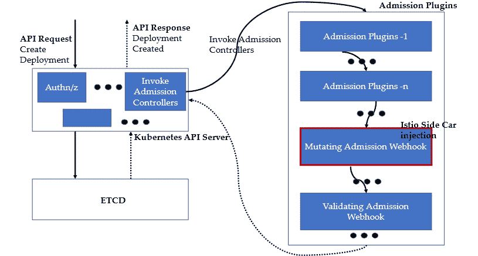

图 2.2 – Kubernetes 中的准入控制器

我们将在*第三章*中更详细地讨论 sidecar 注入。现在，让我们将注意力转回到 `istio-injection` 导致的 Pod 描述符变化上。

`istio-iptables` 在产品页面 Pod 描述文件的 `istio-init` 配置中提到，使用了以下命令：

```
kubectl describe po/productpage-v1-65b75f6885-57vnb -n bookinfons
```

以下是 Pod 描述文件中的一个片段：

```
istio-iptables -p 15001 -z 15006 -u 1337 -m REDIRECT -I '*' -x "" -b '*' -d 15090,15021,15020
```

`istio-iptables` 是一个初始化脚本，负责通过 `iptables` 设置 Istio sidecar 代理的端口转发。以下是在执行脚本时传递的各种参数：

+   **-p** 指定所有 TCP 流量将被重定向到的 Envoy 端口

+   **-z** 指定所有入站流量到 Pod 应该重定向到的端口

+   **-u** 是不应用重定向的用户的 UID

+   **-m** 是用于重定向入站连接的模式

+   **-I** 是需要重定向到 Envoy 的出站连接的 CIDR 块目标 IP 范围列表

+   **-x** 是需要免除从重定向到 Envoy 的出站连接的 CIDR 块目标列表

+   **-b** 是需要重定向到 Envoy 的入站端口列表

+   **-d** 是需要从重定向到 Envoy 中排除的入站端口列表

总结前面在 `istio-init` 容器中的参数，容器正在执行一个脚本 `istio-iptables`，它基本上在 Pod 层面创建 `iptables` 规则——也就是说，应用于 Pod 内的所有容器。该脚本配置了一个 `iptables` 规则，应用以下内容：

+   所有流量应该重定向到端口 `15001`

+   任何流量到 Pod 都应该重定向到端口 `15006`

+   此规则不适用于 UID `1337`

+   重定向使用的模式是 REDIRECT

+   所有到任何目标 (`*`) 的出站连接应该重定向到 `15001`

+   没有出站目标可以免除此规则

+   重定向需要发生在来自任何 IP 地址的所有入站连接上，除非目标端口是 `15090`、`15021` 或 `15020`

我们将在*第三章*中深入探讨，但现在记住，初始化容器基本上会在 Pod 层面设置一个 `iptables` 规则，该规则将所有到达产品页面容器端口 `9080` 的流量重定向到 `15006`，而从产品页面容器发出的所有流量将被重定向到端口 `15001`。端口 `15001` 和 `15006` 都由 `istio-proxy` 容器暴露，该容器来自 `docker.io/istio/proxyv2:1.13.1`。`istio-proxy` 容器与产品页面容器一起运行。除了 `15001` 和 `15006`，它还暴露端口 `15090`、`15021` 和 `15020`。

`Istio-iptables.sh` 可以在这里找到：[`github.com/istio/cni/blob/master/tools/packaging/common/istio-iptables.sh`](https://github.com/istio/cni/blob/master/tools/packaging/common/istio-iptables.sh)。

你还会注意到，`istio-init` 和 `istio-proxy` 都是从相同的 Docker 镜像 `docker.io/istio/proxyv2:1.13.1` 中创建的。可以在这里查看 Docker 文件：[`hub.docker.com/layers/proxyv2/istio/proxyv2/1.13.4/images/sha256-1245211d2fdc0f86cc374449e8be25166b9d06f1d0e4315deaaca4d81520215e?context=explore.`](https://hub.docker.com/layers/proxyv2/istio/proxyv2/1.13.4/images/sha256-1245211d2fdc0f86cc374449e8be25166b9d06f1d0e4315deaaca4d81520215e?context=explore) Docker 文件能提供更多关于镜像构建方式的洞察：

```
# BASE_DISTRIBUTION is used to switch between the old base distribution and distroless base images
..
ENTRYPOINT ["/usr/local/bin/pilot-agent"]
```

入口点是一个名为 `pilot-agent` 的 Istio 命令/工具，它在传递 *proxy sidecar* 参数到 `istio-proxy` 容器时，启动 Envoy 作为 sidecar 运行。`pilot-agent` 还在初始化时设置 `iptables`，当传递 *istio-iptables* 参数时，它会在 `istio-init` 容器的初始化过程中执行。

关于 pilot-agent 的更多信息

你可以通过在容器外部执行 `pilot-agent`，并选择任何注入了 `istio-proxy` sidecar 的 Pod 来获得有关 pilot-agent 的更多信息。在以下命令中，我们需要使用 `istio-system` 命名空间中的 Ingress 网关 Pod：

`$ kubectl exec -it po/istio-ingressgateway-569d7bfb4-8bzww -n istio-system -c istio-proxy -- /usr/local/bin/pilot-agent proxy` `router --help`

和前面一样，你仍然可以通过 `kubectl port-forward` 从浏览器访问产品页面：

```
$ kubectl port-forward svc/productpage 9080:9080 -n bookinfons
Forwarding from 127.0.0.1:9080 -> 9080
Forwarding from [::1]:9080 -> 9080
Handling connection for 9080
```

到目前为止，我们已经研究了 sidecar 注入以及它对 Kubernetes 资源部署的影响。在接下来的部分，我们将了解 Istio 如何管理流量的 Ingress 和 Egress。

## Istio 网关

我们不仅可以使用 `port-forward`，还可以利用 Istio 的 Ingress 网关来暴露应用程序。网关用于管理进出服务网格的流量，提供对进出流量的控制。请尝试以下命令，列出 `istiod` 命名空间中的 Pods，并查看在 Istio 安装过程中已经安装的网关：

```
$ kubectl get pod -n istio-system
NAME                        READY   STATUS    RESTARTS   AGE
istio-egressgateway-76c96658fd-pgfbn   1/1     Running   0          5d18h
istio-ingressgateway-569d7bfb4-8bzww   1/1     Running   0          5d18h
istiod-74c64d89cb-m44ks                1/1     Running   0          5d18h
$ kubectl get po/istio-ingressgateway-569d7bfb4-8bzww -n istio-system -o json  | jq '.spec.containers[].image'
"docker.io/istio/proxyv2:1.13.1"
$ kubectl get po/istio-egressgateway-76c96658fd-pgfbn -n istio-system -o json  | jq '.spec.containers[].image'
"docker.io/istio/proxyv2:1.13.1"
```

你可以看到，网关也是一组在服务网格中运行的 Envoy 代理。它们类似于在 Pod 中作为 sidecar 部署的 Envoy 代理，但在网关中，它们作为独立容器运行在通过 `pilot-agent` 部署的 Pod 中，并带有 *proxy router* 参数。让我们来研究一下 Egress 网关的 Kubernetes 描述符：

```
$ kubectl get po/istio-egressgateway-76c96658fd-pgfbn -n istio-system -o json  | jq '.spec.containers[].args'
[
  "proxy",
  "router",
  "--domain",
  "$(POD_NAMESPACE).svc.cluster.local",
  "--proxyLogLevel=warning",
  "--proxyComponentLogLevel=misc:error",
  "--log_output_level=default:info"
]
```

接下来，我们来看一下网关服务：

```
$ kubectl get svc -n istio-system
NAME                TYPE          CLUSTER-
IP          EXTERNAL-IP    PORT(S)                                              AGE
istio-egressgateway    ClusterIP      10.97.150.168    <none>        80/TCP,443/TCP                                    5d18h
istio-ingressgateway   LoadBalancer
   10.100.113.119   <pending>     15021:31391/TCP,80:32295/TCP,443:31860/TCP,31400:31503/TCP,15443:31574/TCP   5d18h
istiod   ClusterIP      10.110.59.167    <none>        15010/TCP,15012/TCP,443/TCP,15014/TCP                                        5d18h
```

现在，让我们尝试使用以下命令理解 Ingress 网关的端口：

```
$ kubectl get svc/istio-ingressgateway -n istio-system -o json | jq '.spec.ports'
[
…
  {
    "name": "http2",
    "nodePort": 32295,
    "port": 80,
    "protocol": "TCP",
    "targetPort": 8080
  },
  {
    "name": "https",
    "nodePort": 31860,
    "port": 443,
    "protocol": "TCP",
    "targetPort": 8443
  },
  ….
```

你可以看到，Ingress 网关服务从集群外部的端口 `32295` 和 `31860` 接受 `http2` 和 `https` 流量。从集群内部，流量通过端口 `80` 和 `443` 处理。然后，`http2` 和 `https` 流量被转发到端口 `8080` 和 `8443`，转发到底层的 Ingress Pod。

让我们为 `bookinfo` 服务启用 Ingress 网关：

```
$ kubectl apply -f samples/bookinfo/networking/bookinfo-gateway.yaml -n bookinfons
gateway.networking.istio.io/bookinfo-gateway created
virtualservice.networking.istio.io/bookinfo created
```

让我们来看一下 `bookinfo` 的虚拟服务定义：

```
$ kubectl describe virtualservice/bookinfo -n bookinfons
Name:         bookinfo
..
API Version:  networking.istio.io/v1beta1
Kind:         VirtualService
...
Spec:
  Gateways:
    bookinfo-gateway
  Hosts:
    *
  Http:
    Match:
      Uri:
        Exact:  /productpage
      Uri:
        Prefix:  /static
      Uri:
        Exact:  /login
      Uri:
        Exact:  /logout
      Uri:
        Prefix:  /api/v1/products
    Route:
      Destination:
        Host:  productpage
        Port:
          Number:  9080
```

虚拟服务不限制任何特定的主机名。它将`/productpage`、`login`和`/logout`，以及任何其他以`/api/v1/products`或`/static`为前缀的 URI 路由到端口`9080`的 `productpage` 服务。如果您还记得，`9080`也是 `productpage` 服务暴露的端口。`spec.gateways` 注解意味着该虚拟服务配置应该应用于 `bookinfo-gateway`，我们接下来会进行探讨：

```
$ kubectl describe gateway/bookinfo-gateway -n bookinfons
Name:         bookinfo-gateway
..
API Version:  networking.istio.io/v1beta1
Kind:         Gateway
..
Spec:
  Selector:
    Istio:  ingressgateway
  Servers:
    Hosts:
      *
    Port:
      Name:      http
      Number:    80
      Protocol:  HTTP
..
```

网关资源描述了一个负载均衡器，用于接收从网格进入和流出的连接。前面的示例首先定义了配置应该应用于带有`Istio: ingressgateway`标签的 Pod（`istiod`命名空间中的 Ingress 网关 Pod）。该配置不绑定到任何主机名，并且在端口`80`上接收 HTTP 流量的连接。

总结一下，您有一个以网关形式定义的负载均衡器配置，以及以虚拟服务形式定义的后端路由配置。这些配置应用于一个代理 Pod，在此案例中是 `istio-ingressgateway-569d7bfb4-8bzww`。

在浏览器中打开产品页面时，检查代理 Pod 的日志。

首先，找到 IP 和端口（Ingress 网关服务中的 HTTP2 端口）：

```
$ echo $(minikube ip)
192.168.64.6
$ echo $(kubectl -n istio-system get service istio-ingressgateway -o jsonpath='{.spec.ports[?(@.name=="http2")].nodePort}')
32295
```

通过以下 URL 获取产品：[`192.168.64.6:32295/api/v1/products`](http://192.168.64.6:32295/api/v1/products)。您可以通过浏览器或 `curl` 执行此操作。

将 `istio-ingressgateway` Pod 的日志流式传输到 `stdout`：

```
$ kubectl logs -f pod/istio-ingressgateway-569d7bfb4-8bzww -n istio-system
"GET /api/v1/products HTTP/1.1" 200 - via_upstream - "-" 0 395 18 16 "172.17.0.1" "Mozilla/5.0 (Macintosh; Intel Mac OS X 10_15_7) AppleWebKit/537.36 (KHTML, like Gecko) Chrome/98.0.4758.102 Safari/537.36" "cfc414b7-10c8-9ff9-afa4-a360b5ad53b8" "192.168.64.6:32295" "172.17.0.10:9080" outbound|9080||productpage.bookinfons.svc.cluster.local 172.17.0.5:56948 172.17.0.5:8080 172.17.0.1:15370 - -
```

从日志中，您可以推断出一个传入请求 `GET /api/v1/products HTTP/1.1` 到达了 `192.168.64.6:32295`，然后被路由到 `172.17.0.10:9080`。这是终端节点，也就是 `productpage` Pod 的 IP 地址。

下图展示了带有注入的`istio-proxy`边车和 Istio Ingress 网关的 `bookinfo` Pods 的组成。

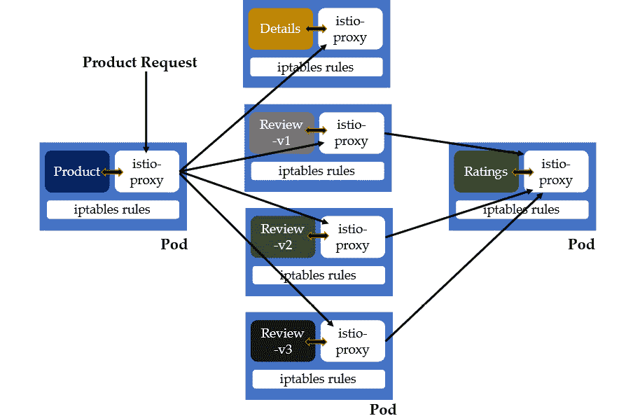

图 2.3 – 带有边车注入和 Istio Ingress 网关的 BookInfo 应用程序

提示

如果您遇到 TLS 错误，如证书过期或任何其他 OpenSSL 错误，那么请尝试使用以下命令重新启动 BookInfo 应用程序和 Istio 组件：

`$ kubectl rollout restart deployment --``namespace bookinfons`

`$ kubectl rollout restart deployment --``namespace istio-system`。

希望到目前为止，您已经熟悉了 Istio 的基本概念以及如何在工作站上安装它。在接下来的章节中，我们将继续介绍在 Istio 中安装附加组件。

# 可观察性工具

Istio 生成各种度量指标，这些指标可以输入到各种遥测应用程序中。开箱即用的安装包包含了附加组件，包括**Kiali**、**Jaeger**、**Prometheus** 和 **Grafana**。接下来，我们将详细了解它们。

## Kiali

第一个安装的组件是 Kiali，它是 Istio 的默认管理 UI。我们将通过运行以下命令开始启用遥测工具：

```
$ kubectl apply -f samples/addons
serviceaccount/grafana created
…….
$ kubectl rollout status deployment/kiali -n istio-system
Waiting for deployment "kiali" rollout to finish: 0 of 1 updated replicas are available...
deployment "kiali" successfully rolled out
```

一旦所有资源都创建完成并且 Kiali 成功部署，你可以通过以下命令打开 Kiali 的仪表盘：

```
$ istioctl dashboard kiali
http://localhost:20001/kiali
```

当你需要可视化或排除网格拓扑以及底层网格流量时，Kiali 非常方便。让我们快速看一下其中的一些可视化图表。

**概览** 页面提供了集群中所有命名空间的概览。

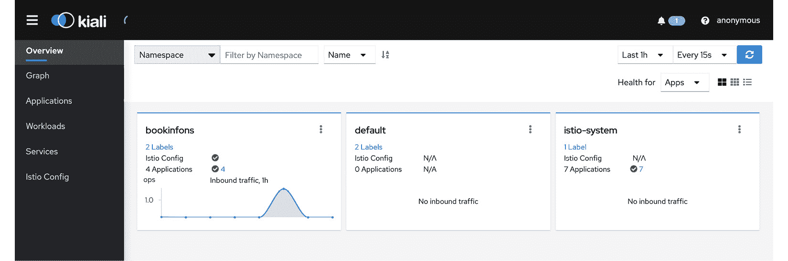

图 2.4 – Kiali 仪表盘概览部分

你可以点击右上角的三个点，进一步查看该命名空间的详细信息，并且可以更改它的配置。

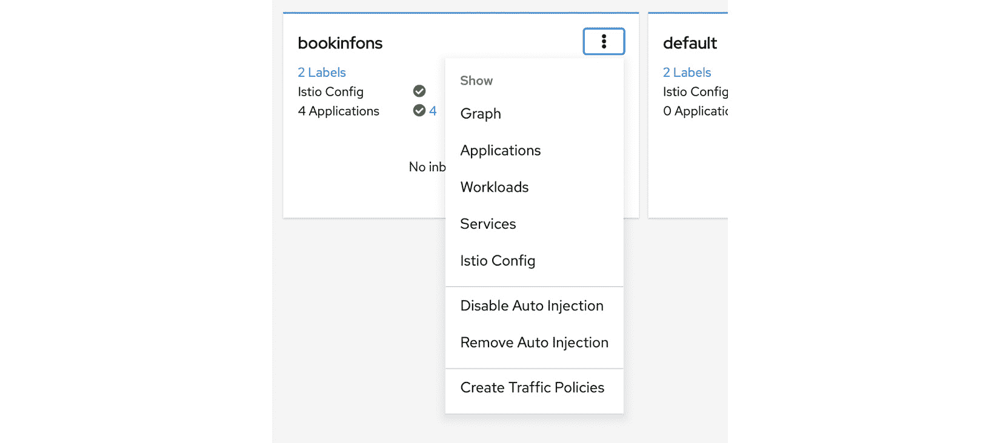

图 2.5 – Kiali 仪表盘上命名空间的 Istio 配置

你还可以查看单独的应用、Pods、服务等。最有趣的可视化之一是 **图形**，它表示在指定时间段内网格中流量的流动。

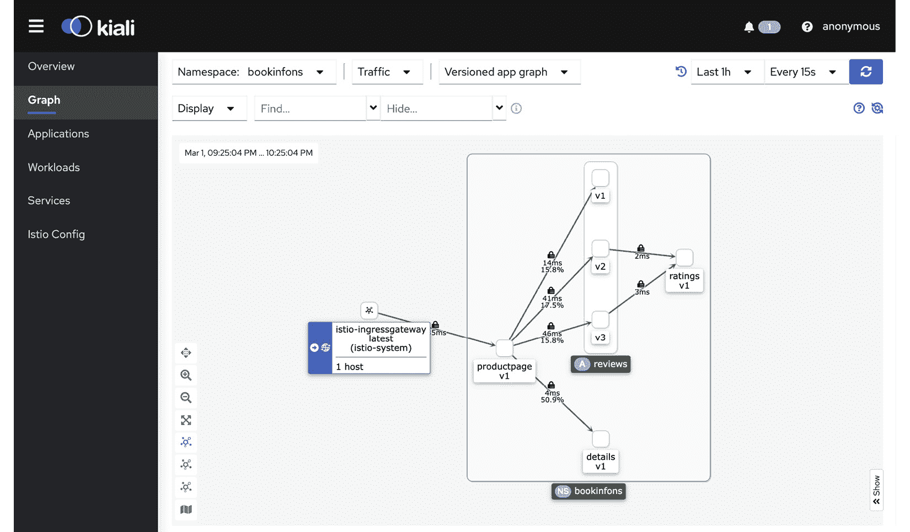

图 2.6 – Kiali 仪表盘上的版本化应用图

上面的截图显示的是一个版本化应用图，其中多个版本的应用被分组在一起；在这个例子中，是一个评价应用。我们将在*第八章*中详细讨论这一点。

## Jaeger

另一个附加组件是 Jaeger。你可以通过以下命令打开 Jaeger 仪表盘：

```
$ istioctl dashboard jaeger
http://localhost:16686
```

上述命令应该会在你的浏览器中打开 Jaeger 仪表盘。Jaeger 是一个开源的端到端分布式事务监控软件。构建并部署一个实际应用时，*第四章* 中将会明确显示出对这种工具的需求。

在 Jaeger 仪表盘中的 `bookinfons` 命名空间下。

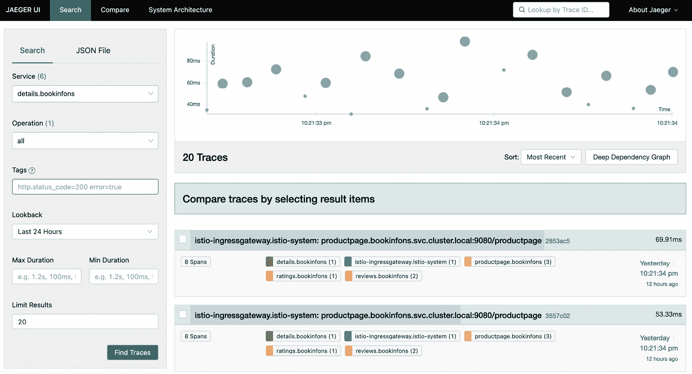

图 2.7 – Jaeger 仪表盘搜索部分

你可以点击任意条目以查看更详细的信息：

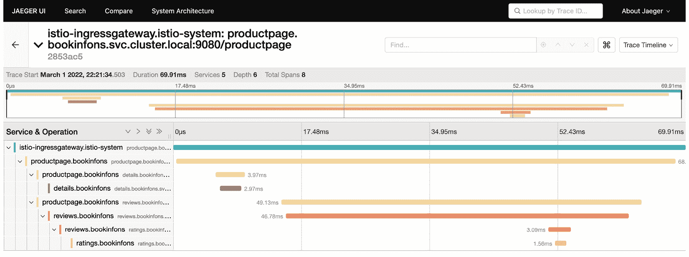

图 2.8 – Jaeger 仪表盘详情部分

你可以看到整体调用花费了 69.91 毫秒。详情由 `productpage` 调用，返回响应花费了 2.97 毫秒。你可以进一步点击任何服务查看详细追踪信息。

## Prometheus

接下来，我们将深入了解 Prometheus，它也是一个开源的监控系统和时间序列数据库。Prometheus 用来捕捉所有与时间相关的指标，以跟踪网格及其组成部分的健康状况。

要启动 Prometheus 仪表盘，使用以下命令：

```
$ istioctl dashboard prometheus
http://localhost:9090
```

这将会在你的浏览器中打开 Prometheus 仪表盘。在我们的安装中，Prometheus 被配置为从 `istiod`、Ingress 和 Egress 网关以及 istio-proxy 收集指标。

在以下示例中，我们查看 Istio 处理的`productpage`应用的总请求。

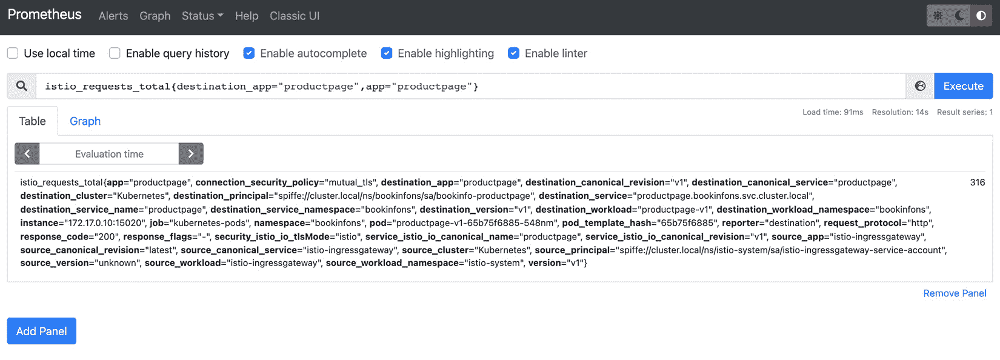

图 2.9 – 在 Prometheus 仪表板上的 Istio 总请求

另一个需要关注的附加工具是 Grafana，和 Kiali 一样，它也是一个可视化工具。

## Grafana

要启动 Grafana 仪表板，请使用以下命令：

```
$ istioctl dashboard grafana
http://localhost:3000
```

以下是 Istio 处理的`productpage`总请求的可视化：

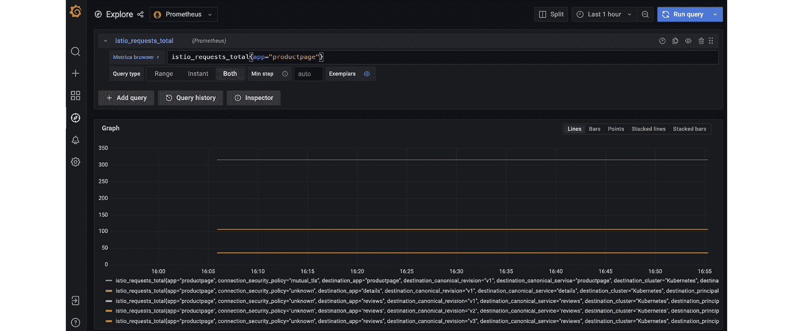

图 2.10 – Grafana 仪表板的 Explore 部分

以下是 Istio 性能指标的另一个可视化。

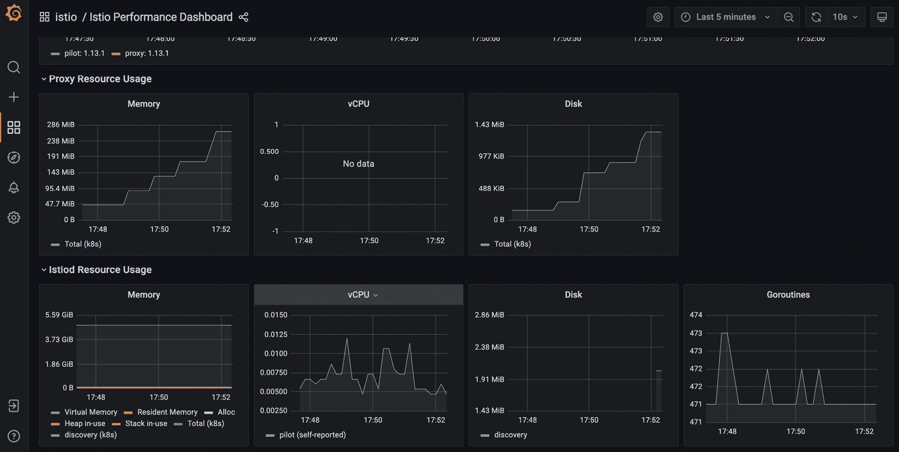

图 2.11 – Grafana Istio 性能仪表板

请注意，仅通过应用标签`istio-injection: enabled`，我们便为 BookInfo 应用启用了服务网格。Sidecar 自动注入，mTLS 也默认启用于应用中不同微服务之间的通信。此外，众多监控工具提供有关 BookInfo 应用及其底层微服务的信息。

# Istio 架构

现在我们已经安装了 Istio，为 BookInfo 应用启用了它，并且也分析了它的操作，是时候通过图表简化我们迄今为止看到的内容了。以下图为 Istio 架构的表示。

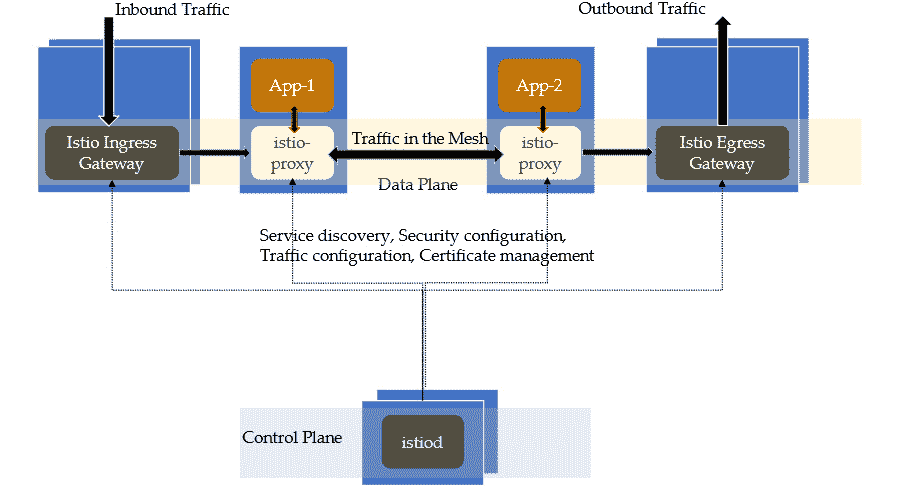

图 2.12 – Istio 架构

Istio 服务网格由数据平面和控制平面组成。本章中我们遵循的示例将它们都安装在一个节点上。在生产或非生产环境中，Istio 控制平面将安装在独立的节点集上。**控制平面**由 istiod 组件以及一些其他 Kubernetes 配置组成，这些组件和配置共同负责管理并提供服务发现给数据平面，传播与安全性和流量管理相关的配置，并向数据平面组件提供和管理身份与证书。

**数据平面**是服务网格的另一个部分，由部署在 Pod 中的应用容器旁的 Istio 代理组成。Istio 代理基本上是 Envoy。Envoy 是一个感知应用的服务代理，根据控制平面的指示调节微服务之间的所有网络流量。Envoy 还收集各种指标并将遥测数据报告回各种附加工具。

后续章节将专注于控制平面和数据平面，我们将深入理解它们的功能和行为。

# 摘要

在本章中，我们准备了一个本地环境来使用 `istioctl` 工具安装 Istio，这是 Istio 的命令行工具。然后，我们通过将 `istio-injection: enabled` 标签应用于托管微服务的命名空间，启用了 Sidecar 注入。

我们简要地了解了 Kubernetes 的准入控制器以及如何通过变更准入 Webhook 将 Sidecar 注入到部署 API 调用中，进而与 Kubernetes API 服务器进行交互。我们还了解了网关，并查看了与 Istio 一起安装的示例入口和出口网关。网关是一个独立的 istio-proxy，也叫 Envoy 代理，主要用于管理进出服务网格的流量。接着，我们了解了如何配置各个端口以便在入口网关上公开，并且如何将流量路由到上游服务。

Istio 提供了与各种遥测和可观察性工具的集成。我们首先了解的工具是 Kiali，这是一个可视化工具，能提供流量流动的洞察。它同时也是 Istio 服务网格的管理控制台。通过 Kiali，你还可以执行 Istio 管理功能，如检查/修改各种配置和检查基础设施状态。在 Kiali 之后，我们了解了 Jaeger、Prometheus 和 Grafana，这些都是开源工具，可以与 Istio 无缝集成。

本章的内容为你深入学习 Istio 打下了基础，并为后续章节的学习做了准备。在下一章中，我们将阅读关于 Istio 的控制平面和数据平面的内容，深入了解它们的各个组件。
