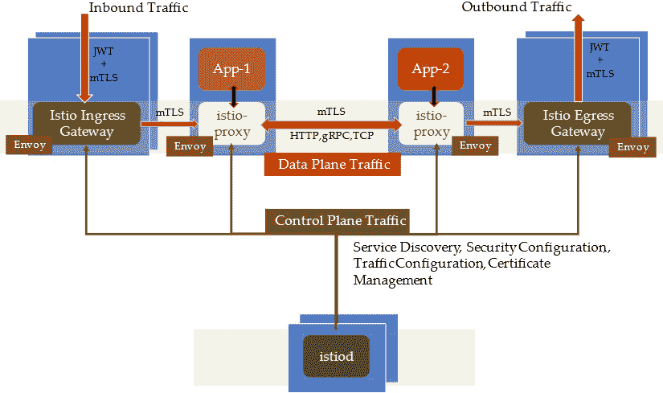
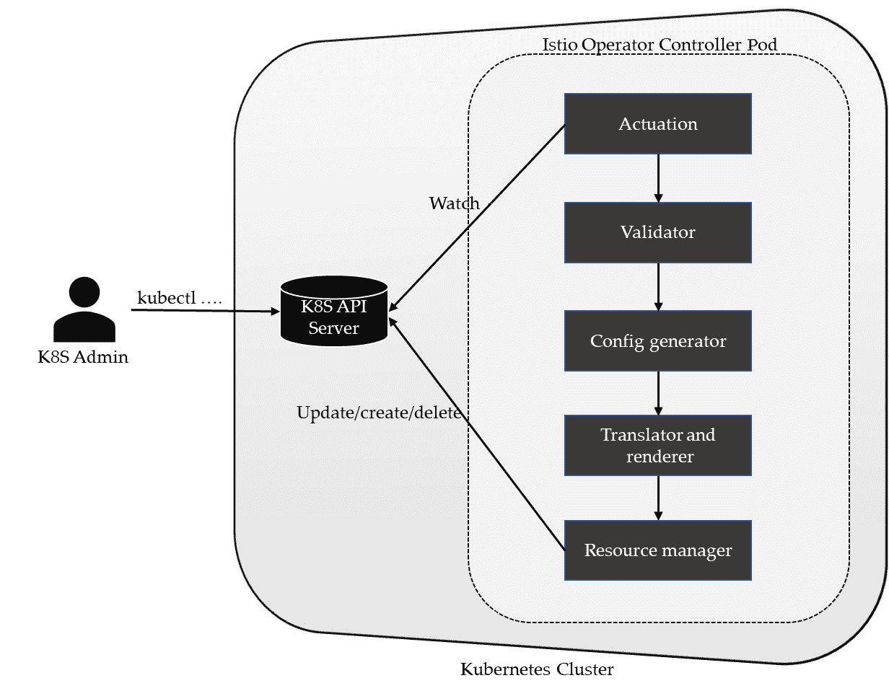
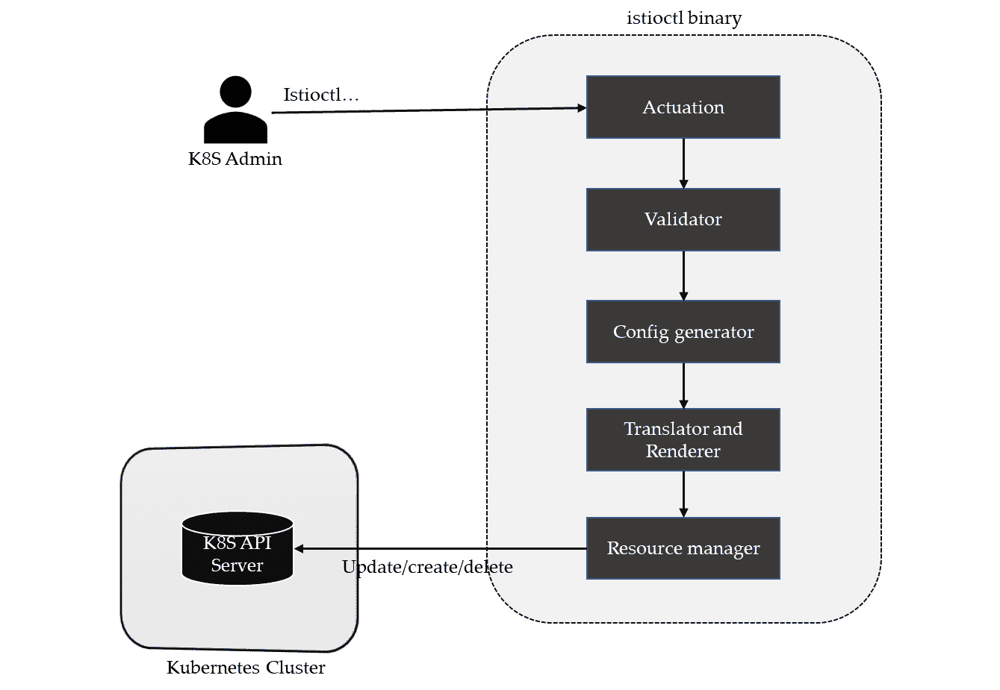
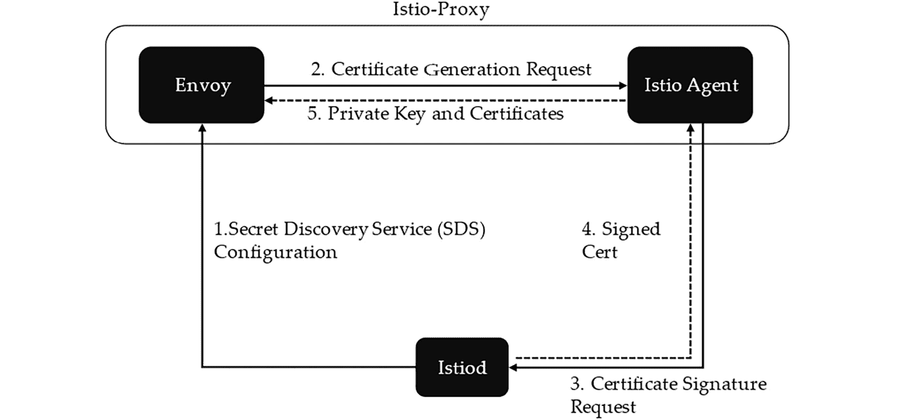
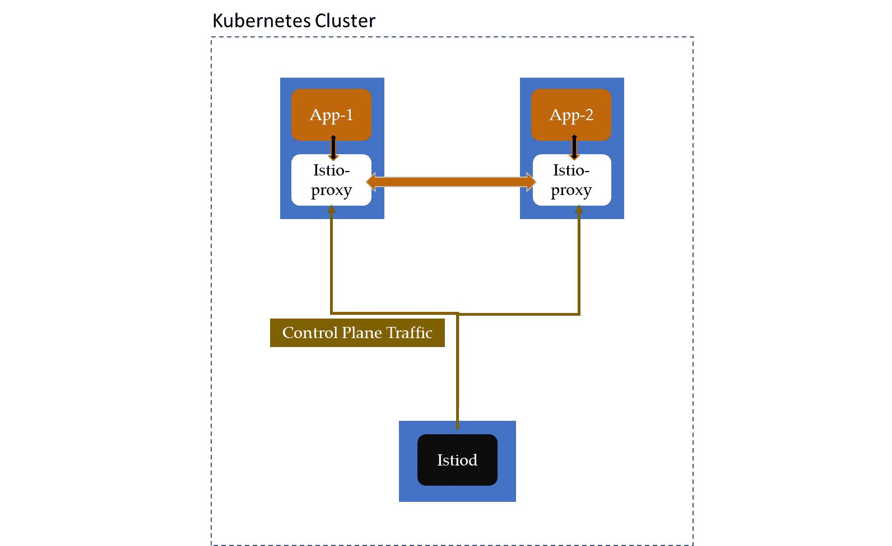
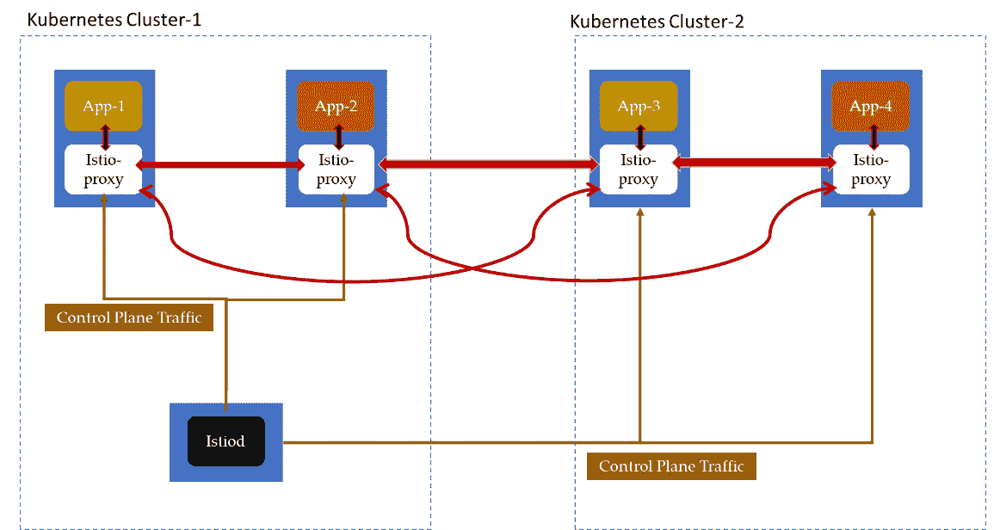
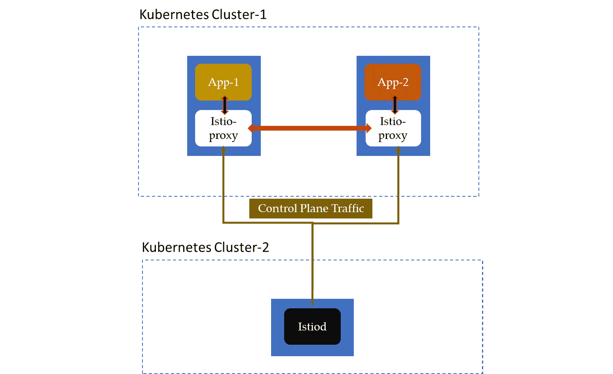
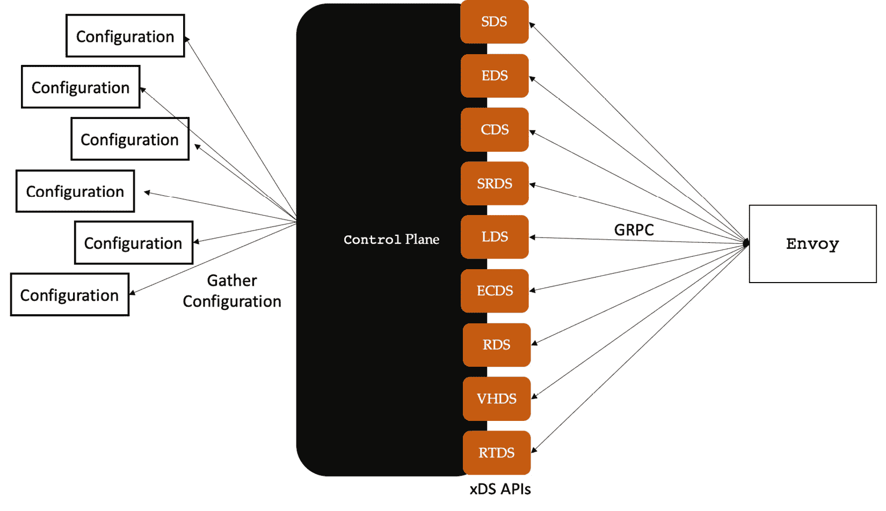

# 3

# 理解 Istio 控制平面和数据平面

上一章给你概述了 Istio，展示了简单安装的样子，并且说明了如何将 Service Mesh 应用于示例应用程序。在本章中，我们将深入探讨 Istio 的控制平面和数据平面。我们将通过以下主题来了解这些组件的角色：

+   Istio 控制平面组件

+   Istio 控制平面的部署模型

+   Envoy，Istio 数据平面

本章将帮助你理解 Istio 控制平面，以便你能够规划在生产环境中安装控制平面。在阅读本章后，你应该能够识别 Istio 控制平面的各个组件，包括 istiod，并理解它们在 Istio 整体工作中所发挥的作用。

# 探索控制平面组件

下图总结了 Istio 架构以及各个组件之间的交互。我们在上一章中使用了 Ingress 网关和 istio-proxy，因此这里不再详细讲解这些内容。然而，我们将揭示一些在下图中没有直接描绘的 Istio 控制平面其他组件。



图 3.1 – Istio 控制平面

在深入探讨控制平面的组件之前，我们先把术语的定义搞清楚——**控制平面**是一组负责 Istio 数据平面操作的 Istio 服务。没有单一组件构成控制平面——而是由多个组件组成。

让我们来看看 Istio 控制平面的第一个组件——istiod。

## istiod

istiod 是 Istio 控制平面组件之一，提供服务发现、配置和证书管理。在 Istio 的早期版本中，控制平面由名为 Galley、Pilot、Mixer、Citadel、WebHook Injector 等组件组成。istiod 将这些组件（Pilot、Galley 和 Citadel）的功能统一到一个二进制文件中，从而提供简化的安装、操作和监控，并实现了不同 Istio 版本之间的无缝升级。

让我们来看一下运行在 `istio-system` 命名空间中的 `istiod` Pod：

```
$ kubectl get po -n istio-system
NAME                        READY   STATUS    RESTARTS   AGE
istio-egressgateway-84f95886c7-5gxps    1/1     Running   0          10d
istio-ingressgateway-6cb4bb68df-qbjmq   1/1     Running   0          10d
istiod-65fc7cdd7-r95jk                  1/1     Running   0          10d
$ kubectl exec -it pod/istiod-65fc7cdd7-r95jk -n istio-system -- /bin/sh -c «ps -ef"
UID          PID    PPID  C STIME TTY          TIME CMD
istio-p+       1       0  0 Mar14 ?        00:08:26 /usr/local/bin/pilot-discovery discovery --monitoringAddr=:15014 --log_output_level=default:info --domain cluster.local --keepaliveMaxServerConnectionAge 30m
```

你一定注意到，Pod 本身正在运行 `pilot-discovery` 并且基于以下镜像：

```
$ kubectl get pod/istiod-65fc7cdd7-r95jk -n istio-system -o json | jq '.spec.containers[].image'
"docker.io/istio/pilot:1.13.1"
```

你一定也注意到，`istiod` Pod 的镜像与作为 sidecar 插入的 istio-proxy 镜像不同。istiod 镜像基于 `pilot-discovery`，而 sidecar 则基于 `proxyv2`。

以下命令显示 sidecar 容器是由 `proxyv2` 创建的：

```
$ kubectl get pod/details-v1-7d79f8b95d-5f4td -n bookinfons -o json|jq '.spec.containers[].image'
"docker.io/istio/examples-bookinfo-details-v1:1.16.2"
"docker.io/istio/proxyv2:1.13.1"
```

现在我们知道 `istiod` Pod 是基于 `pilot-discovery`，让我们来看一下 istiod 执行的一些功能。

### 配置监视

istiod 监视 Istio **自定义资源定义**（**CRDs**）以及发送到 Kubernetes API 服务器的任何其他与 Istio 相关的配置。任何此类配置都将被处理并在内部分发到 istiod 的各个子组件。你通过 Kubernetes API 服务器与 Istio 服务网格进行交互，但并非所有与 Kubernetes API 服务器的交互都是为了服务网格而进行的。

istiod 监视各种配置资源，通常是由 Kubernetes API 服务器识别的资源，通过某些特征（如标签、命名空间、注解等）进行识别。然后，这些配置更新会被拦截、收集，并转换为 Istio 特定格式，通过 **Mesh 配置协议**（**MCP**）分发给 istiod 的其他组件。istiod 还实现了配置转发，我们将在后续章节中介绍它，当我们进行 Istio 的多集群安装时。现在，我们可以先说，istiod 也可以通过 MCP 在拉取和推送模式下，将配置传递给另一个 istiod 实例。

### API 验证

istiod 还添加了一个准入控制器，以确保在 Istio 资源被 Kubernetes API 服务器接受之前，进行验证。在上一章中，我们看到两个准入控制器：**mutating webhook** 和 **validation webhook**。

mutating webhook 负责增强诸如部署等资源的 API 调用，通过为 Istio sidecar 注入添加配置。同样，validation webhook 会自动向 Kubernetes API 服务器注册自己，以便在每次调用 Istio CRD 时被触发。当添加/更新/删除 Istio CRD 的请求到达 Kubernetes API 服务器时，它们会被传递给 validation webhook，后者会验证传入的请求，并根据验证结果决定是否接受或拒绝该 API 调用。

### Istio 证书颁发机构

Istio 为网格中的所有通信提供全面的安全保障。所有 Pod 都通过 Istio PKI 分配身份，并且采用 x.509 证书/密钥，以 **Spiffe 可验证身份文档**（**SVID**）格式进行表示。Istio **证书颁发机构**（**CA**）负责签署与 istio-proxy 一起部署的节点代理发送的请求。Istio CA 基于 Citadel 构建，负责批准并签署 Istio 节点代理发送的 **证书签名请求**（**CSRs**）。Istio CA 还执行证书和密钥的轮换和吊销工作。它支持不同 CA 的插件化，以及使用 Kubernetes CA 的灵活性。

Istio 控制平面的一些其他功能和组件如下：

+   **Sidecar 注入**：Istio 控制平面还通过 mutating webhooks 管理 sidecar 注入。

+   **Istio 节点代理**：节点代理与 Envoy 一起部署，负责与 Istio CA 进行通信，向 Envoy 提供证书和密钥。

+   **身份目录和注册表**：Istio 控制平面管理用于各种工作负载的身份目录，这些工作负载将由 Istio CA 用来为请求的身份颁发密钥/证书。

+   **终端用户上下文传播**：Istio 提供了一种安全机制，在 Ingress 上执行终端用户认证，然后将用户上下文传播到服务网格内的其他服务和应用程序。用户上下文以 JWT 格式传播，这有助于在不需要传递终端用户凭证的情况下，将用户信息传递到网格中的服务。

istiod 是一个关键的控制平面组件，执行控制平面中的许多重要功能，但它并不是唯一值得记住的控制平面组件。在下一节中，我们将探讨其他不属于 istiod 但仍然是 Istio 控制平面重要组成部分的组件。

## Istio 操作员和 istioctl

Istio 操作员和 istioctl 都是控制平面组件，并且是可选安装的。它们都提供管理功能，用于安装和配置控制平面和数据平面的组件。在上一章中，您已经使用了不少 istioctl 作为命令行工具与 Istio 控制平面进行交互并传达指令。这些指令可以用于获取信息、创建、更新或删除与 Istio 数据平面工作相关的配置。Istio 操作员和 istioctl 本质上执行相同的功能，不同之处在于 istioctl 是显式调用以进行更改，而 Istio 操作员则按照 Kubernetes 的 *operator* 框架/模式运行。

我们不会使用 Istio 操作员，但如果您愿意，您可以使用以下命令来安装它：

```
$ istioctl operator init
Installing operator controller in namespace: istio-operator using image: docker.io/istio/operator:1.13.1
Operator controller will watch namespaces: istio-system
 Istio operator installed
 Installation complete
```

Istio 操作员的两个主要组件是名为 **IstioOperator** 的客户资源，表示为高级 API，以及一个控制器，它具有将高级 API 转换为低级 Kubernetes 操作的逻辑。IstioOperator CRD 封装了第二个组件 **IstioOperatorSpec**、一个状态字段以及一些附加元数据。

您可以使用以下命令来查找 IstioOperator **自定义** **资源**（**CR**）的详细信息：

```
$ kubectl get istiooperators.install.istio.io -n istio-system -o json
```

您可以在此处找到命令的输出：[`github.com/PacktPublishing/Bootstrap-Service-Mesh-Implementations-with-Istio/blob/main/Output%20references/Chapter%203/IstioOperator%20CR.docx`](https://github.com/PacktPublishing/Bootstrap-Service-Mesh-Implementations-with-Istio/blob/main/Output%20references/Chapter%203/IstioOperator%20CR.docx)

如您在输出中所见，API 的结构与围绕基础 Kubernetes 资源、Pilot、Ingress 和 Egress 网关以及最终可选的第三方插件的控制平面组件一致。



图 3.2 – Istio 操作员

上面的图表描述了 IstioOperator 的操作，下面的内容描述了 istioctl 的操作：



图 3.3 – istioctl

istioctl 和操作员非常相似，除了在 *执行* 阶段。istioctl 是用户运行的命令，它以 IstioOperator CR 作为输入，而控制器则在集群内的 IstioOperator CR 更改时运行，但其余组件相似，甚至是相同的。

以下是 Istio 操作员和 istioctl 各个组件的简要总结：

+   **执行**：在事件发生时触发验证器组件，例如 CR 更新请求。对于 istioctl，执行逻辑通过操作员调用 istioctl CLI 来触发，istioctl CLI 是用 Go 编写的，使用 Cobra 库来创建强大的 CLI 应用程序。

+   **验证器**：验证输入（IstioOperator CR）是否符合原始 CR 的模式。

+   **配置生成器**：在此阶段，会创建完整的配置。配置包括原始事件中提供的参数和数值，以及原始事件中省略的参数。配置中包含了省略的参数及其各自的默认值。

+   **翻译器和渲染器**：翻译器将 IstioOperator 的 Kubernetes 资源规格映射到 Kubernetes 资源，而渲染器则在应用所有配置后生成输出清单。

+   **资源管理器**：该组件负责管理集群中的资源。它将资源的最新状态缓存到内置缓存中，然后与输出清单进行比较，每当 Kubernetes 对象（命名空间、CRDs、ServiceAccounts、ClusterRoles、ClusterRoleBindings、MutatingWebhookConfigurations、ValidatingWebhookConfigurations、Services、Deployments 或 ConfigMaps）的状态与输出清单之间存在偏差或不一致时，资源管理器将根据清单更新它们。

卸载 IstioOperator 的步骤

由于我们接下来不再使用 IstioOperator，建议使用以下命令卸载它：

`$ istioctl` `operator remove`

`正在删除` `Istio operator...`

`已移除 Deployment:istio-operator:istio-operator。`

`已移除 Service:istio-operator:istio-operator。`

`已移除 ServiceAccount:istio-operator:istio-operator。`

`已移除 ClusterRole::istio-operator。`

`已移除 ClusterRoleBinding::istio-operator。`

`删除完成`

`$ kubectl delete` `ns istio-operator`

`命名空间 "istio-operator" 已删除`

我们在上一章简要了解了 istio-proxy。接下来，我们将查看 Istio 代理，它是部署在 istio-proxy 中的容器之一。

## Istio 代理

Istio 代理（也叫 `pilot-agent`）是控制平面的一部分，部署在每个 istio-proxy 中，帮助通过安全地将配置和机密传递给 Envoy 代理来连接到服务网格。让我们通过列出 `details-v1` 的 istio-proxy sidecar 中所有运行的进程，来查看 `bookinfo` 中的一个微服务的 istio-agent：

```
$ kubectl exec -it details-v1-7d79f8b95d-5f4td -c istio-proxy -n bookinfons --/bin/sh -c "ps -ef"
UID          PID    PPID  C STIME TTY          TIME CMD
istio-p+       1       0  0 Mar14 ?        00:02:02 /usr/local/bin/pilot-agent p
istio-p+      15       1  0 Mar14 ?        00:08:17 /usr/local/bin/Envoy -c etc/
```

你一定注意到，pilot-agent 也在侧车中运行。pilot-agent 不仅初始化了 Envoy 代理，还为 Envoy 代理生成密钥和证书对，以便在网格通信中建立 Envoy 代理的身份。

在讨论 Istio 代理在证书生成中的作用之前，让我们简单谈一下 Istio **秘密发现服务**（**SDS**）。SDS 简化了证书管理，并最初由 Envoy 项目创建，目的是提供一个灵活的 API，将秘密/证书传递给 Envoy 代理。需要证书的组件称为 SDS 客户端，生成证书的组件称为 SDS 服务器。在 Istio 数据平面中，Envoy 代理充当 SDS 客户端，Istio 代理充当 SDS 服务器。SDS 客户端和 SDS 服务器之间的通信是通过 SDS API 规范进行的，通常通过 gRPC 实现。

下列步骤，如 *图 3.4* 所示，在 Istio 代理、Envoy 和 istiod 之间执行，以生成证书：

1.  在侧车注入过程中，istiod 会将关于 SDS 的信息传递给 Envoy 代理，包括 SDS 服务器的位置。

1.  Envoy 通过 SDS 协议向 pilot-agent（SDS 服务器）发送请求，要求生成证书，使用 **Unix 域套接字**（**UDS**）进行通信。pilot-agent 生成一个证书签名请求。

1.  然后，pilot-agent 与 istiod 进行通信，提供其身份信息以及证书签名请求。

1.  istiod 对 pilot-agent 进行身份验证，如果一切正常，便签署证书。

1.  pilot-agent 通过 UDS 将证书和密钥传递给 Envoy 代理。



图 3.4 – Envoy 通信的证书生成

在这一节及前面的章节中，我们讨论了 Istio 控制平面。现在是时候介绍部署 Istio 控制平面的各种选项了。

# Istio 控制平面的部署模型

在前面的章节中，我们在 minikube 上安装了 Istio，minikube 是一个本地集群，主要用于开发目的，运行在本地工作站上。当在企业环境中部署 Istio 时，部署将不会在 minikube 上，而是在企业级的 Kubernetes 集群上。服务网格可能运行在一个 Kubernetes 集群上，或者分布在多个 Kubernetes 集群之间。也可能所有服务都在一个网络中，或者位于不同的网络中，彼此之间没有直接连接。每个组织的网络和基础设施布局不同，Istio 的部署模式也会因此而有所不同。

什么是集群？

集群的定义有很多，具体取决于所处的上下文。在本节中，当我们提到集群时，基本上是指一组计算节点，这些节点托管着彼此互联的容器化应用程序。你也可以将集群视为 Kubernetes 集群。

我们将在*第八章*讨论 Istio 的各种架构选项，但现在，让我们简要地回顾一下控制平面的各种部署模型。

## 单集群与本地控制平面

集群中所有命名空间中的所有边车代理连接到部署在同一集群中的控制平面。类似地，控制平面正在观察、监控并与其部署所在集群中的 Kubernetes API 服务器和边车进行通信。



图 3.5 – 数据平面和控制平面位于同一 Kubernetes 集群中

上述插图描述了我们在上一章中用于部署 Istio 的部署模型。从图中可以看出，Istio 控制平面和数据平面都位于同一 Kubernetes 集群中；在我们的案例中，它是 minikube。istiod 安装在`istio-system`命名空间或您选择的其他命名空间中。数据平面由多个命名空间组成，应用程序与 istio-proxy 边车一同部署。

## 主集群和远程集群共享单一控制平面

数据平面和控制平面部署在同一 Kubernetes 集群中的服务网格集群，也称为*主集群*。控制平面与数据平面不共存的集群称为*远程集群*。

在这种架构中，有一个主集群和一个远程集群，它们共享一个共同的控制平面。使用这种模型时，需要额外配置，以提供主集群中的控制平面和远程集群中的数据平面之间的互联。通过添加 Ingress 网关来保护并路由通信到主控制平面，可以实现远程集群与主集群控制平面之间的连接。这在以下图示中有所展示：



图 3.6 – 单集群控制平面，数据平面分布在多个 Kubernetes 集群中

Istio 控制平面还需要配置，以建立以下通信：

+   与远程平面 Kubernetes API 服务器通信

+   将突变 Webhook 修补到远程平面，以监控配置为自动注入 istio-proxy 的命名空间

+   为来自远程平面 Istio 代理的 CSR 请求提供端点

## 单集群与外部控制平面

在这种配置中，您可以将控制平面与数据平面分开，而不是在同一个 Kubernetes 集群中同时运行控制平面和数据平面。这是通过将控制平面远程部署到一个 Kubernetes 集群中，并将数据平面部署到其自己的专用 Kubernetes 集群来实现的。这个部署可以通过以下图示来查看：



图 3.7 – 控制平面和数据平面分别位于不同的 Kubernetes 集群中

为了安全性、关注点分离以及合规性要求（如**联邦信息处理标准**（**FIPS**）），我们可能需要将 Istio 控制平面与数据平面分开部署。将控制平面与数据平面分离，可以在不影响数据平面流量的情况下，严格执行控制平面流量的流量和访问策略。此外，在企业环境中，如果有团队可以将控制平面作为托管服务提供给项目团队，那么这种部署控制平面的模型非常适合。

到目前为止，我们讨论的部署模型都位于共享网络内的一个或多个 Kubernetes 集群中。当网络不共享时，部署模型变得更加复杂。我们将在*第十章*中通过一些动手练习，详细讨论这些部署模型以及本章中涉及的模型。

在下一节中，我们将通过了解 Envoy 来研究 Istio 数据平面。

# 探索 Envoy，Istio 数据平面

Envoy 是 Istio 数据平面的关键组件。要理解 Istio 数据平面，了解和认识 Envoy 是非常重要的。

Envoy 是一个开源项目，并且是 CNCF 的毕业项目。你可以在[`www.cncf.io/projects/Envoy/`](https://www.cncf.io/projects/Envoy/)找到更多关于 Envoy 作为 CNCF 项目的详细信息。在本节中，我们将学习 Envoy，并了解为什么它被选为 Istio 数据平面的服务代理。

## 什么是 Envoy？

Envoy 是一个轻量级、高性能的第 7 层和第 4 层代理，具有易于使用的配置系统，使其高度可配置，适合作为 API 网关架构模式中的独立边缘代理，也可以作为 Service Mesh 架构模式中的 sidecar 运行。在这两种架构模式中，Envoy 以单独的进程形式与应用程序/服务并行运行，这使得它更容易升级和管理，同时也使得 Envoy 可以在整个基础设施中透明地进行部署和升级。

为了理解 Envoy，我们来看一下以下三个使 Envoy 与今天市面上其他代理不同的特点。

### 线程模型

Envoy 架构的亮点之一是其独特的线程模型。在 Envoy 中，大多数线程异步运行，彼此不阻塞。与其为每个连接分配一个线程，不如让多个连接共享同一个工作线程，并以非阻塞的顺序运行。这个线程模型帮助异步处理请求，但以非阻塞的方式，从而实现非常高的吞吐量。

大致来说，Envoy 有三种类型的线程：

+   **主线程**：负责 Envoy 和 xDS 的启动与关闭（更多关于 xDS 的内容将在下一节介绍），API 处理、运行时管理和一般的进程管理。主线程协调所有管理功能，通常不需要过多的 CPU 资源。因此，与一般管理相关的 Envoy 逻辑是单线程的，使得代码库更容易编写和管理。

+   **工作线程**：通常，每个 CPU 核心或每个硬件线程（如果 CPU 支持超线程）运行一个工作线程。工作线程打开一个或多个网络位置（端口、套接字等），以供下游系统连接；Envoy 的这个功能称为 *监听*。每个工作线程运行一个非阻塞的事件循环，用于执行监听、过滤和转发操作。

+   **文件刷新线程**：该线程负责以非阻塞的方式将数据写入文件。

### 架构

Envoy 架构的另一个亮点是其过滤器架构。Envoy 也是一个 L3/L4 网络代理，具有可插拔的过滤器链，可以编写过滤器来执行不同的 TCP/UDP 任务。**过滤器链** 本质上是一组步骤，每个步骤的输出作为输入传递到下一个步骤，就像 Linux 中的管道一样。你可以通过堆叠所需的过滤器来构建逻辑和行为，形成一个过滤器链。Envoy 提供了许多开箱即用的过滤器来支持任务，如原始 TCP 代理、UDP 代理、HTTP 代理和 TLS 客户端证书认证。Envoy 还支持额外的 HTTP L7 过滤器层。通过过滤器，我们可以执行不同的任务，如缓冲、速率限制、路由、转发等。

Envoy 支持 HTTP 1.1 和 HTTP 2，并且能够在这两种 HTTP 协议中作为透明代理运行。当你有支持 HTTP 1.1 的旧版应用程序时，这一点尤其有用；你可以将其与 Envoy 代理一起部署，从而实现协议转换——也就是说，应用程序可以与 Envoy 使用 HTTP 1.1 通信，而 Envoy 会使用 HTTP 2 与其他系统通信。Envoy 支持一个全面的路由子系统，提供灵活的路由和重定向功能，适用于构建 Ingress/Egress API 网关，也可以作为侧车模式下的代理部署。

Envoy 还支持现代协议，如 gRPC。**gRPC** 是一个开源的远程过程调用框架，可以在任何地方运行。它广泛用于服务间通信，性能优越且易于使用。

### 配置

Envoy 的另一个亮点是它的配置方式。我们可以使用静态配置文件来配置 Envoy，这些文件描述了服务及其通信方式。在一些静态配置 Envoy 不切实际的高级场景下，Envoy 支持动态配置，并且能够在运行时自动重新加载配置，无需重启。通过名为 xDS 的一组发现服务，可以通过网络动态配置 Envoy，并提供有关主机、集群、HTTP 路由、监听套接字和加密材料的 Envoy 信息。这使得为 Envoy 编写不同类型的控制平面成为可能。控制平面基本上实现了 xDS API 的规范，并保持各种资源和信息的最新状态，供 Envoy 通过 xDS APIs 动态获取。对于 Envoy，有许多开源的控制平面实现，以下是其中几个：

+   [`github.com/envoyproxy/go-control-plane`](https://github.com/envoyproxy/go-control-plane)

+   [`github.com/envoyproxy/java-control-plane`](https://github.com/envoyproxy/java-control-plane)

各种服务网格实现，如 Istio、Kuma、Gloo 等，它们将 Envoy 作为 sidecar，使用 xDS API 为 Envoy 提供配置信息。

Envoy 还支持以下内容：

+   **自动重试**：Envoy 支持对请求进行任意次数的重试，或者在重试预算内进行重试。根据应用需求，可以为请求配置特定的重试条件。如果你想进一步了解重试机制，可以访问 [`www.abhinavpandey.dev/blog/retry-pattern`](https://www.abhinavpandey.dev/blog/retry-pattern)。

+   **断路器**：断路器对于微服务架构至关重要。Envoy 在网络层面提供断路器功能，从而保护上游系统，确保所有 HTTP 请求执行的安全性。Envoy 提供多种基于配置的断路器限制，如最大连接数、最大待处理请求数、最大请求数、最大活动重试次数和上游系统支持的最大并发连接池等。有关断路器模式的更多详情，请访问 [`microservices.io/patterns/reliability/circuit-breaker.html`](https://microservices.io/patterns/reliability/circuit-breaker.html)。

+   **全局速率限制**：Envoy 支持全局速率限制，以防止下游系统对上游系统造成过载。速率限制可以在网络层面或 HTTP 请求层面执行。

+   **流量镜像**：Envoy 支持将流量从一个集群镜像到另一个集群。这在测试以及众多其他应用场景中非常有用，比如机器学习。一个网络层面的流量镜像示例是 AWS VPC，它提供将所有流量镜像到 VPC 的选项。你可以阅读有关 AWS 流量镜像的内容，链接地址是 [`docs.aws.amazon.com/vpc/latest/mirroring/what-is-traffic-mirroring.html`](https://docs.aws.amazon.com/vpc/latest/mirroring/what-is-traffic-mirroring.html)。

+   **异常检测**：Envoy 支持动态检测不健康的上游系统，并将其从健康的负载均衡集中过滤掉。

+   **请求预处理**：Envoy 支持请求预处理，以通过向多个上游系统发出请求并将最合适的响应返回给下游系统来应对尾延迟。你可以在[`medium.com/star-gazers/improving-tail-latency-with-request-hedging-700c77cabeda`](https://medium.com/star-gazers/improving-tail-latency-with-request-hedging-700c77cabeda)了解更多关于请求预处理的信息。

我们之前讨论过，基于过滤器链的架构是 Envoy 的一个差异化特点。现在让我们了解一下构成过滤器链的那些过滤器。

### HTTP 过滤器

HTTP 是最常见的应用协议之一，许多工作负载大多数情况下都通过 HTTP 进行操作。为了支持 HTTP，Envoy 附带了各种 HTTP 级别的过滤器。

配置 Envoy 时，您将主要处理以下配置：

+   **Envoy 监听器**：这些是下游系统连接的端口、套接字和任何其他命名的网络位置

+   **Envoy 路由**：这些是 Envoy 配置，描述流量如何路由到上游系统

+   **Envoy 集群**：这些是由一组相似的上游系统组成的逻辑服务，Envoy 将请求路由或转发到这些系统

+   **Envoy 端点**：这些是单个上游系统，用于处理请求

重要提示

我们现在将使用 Docker 来操作 Envoy。如果你正在运行 minikube，最好现在停止 minikube。如果你没有安装 Docker，可以按照[`docs.docker.com/get-docker/`](https://docs.docker.com/get-docker/)上的说明进行安装。

利用到目前为止获得的知识，我们来创建一些 Envoy 监听器。

下载`envoy` Docker 镜像：

```
$ docker pull envoyproxy/envoy:v1.22.2
```

一旦你拉取了 Docker 镜像，就可以从本章的 Git 仓库中运行以下命令：

```
docker run –rm -it -v $(pwd)/envoy-config-1.yaml:/envoy-custom.yaml -p 9901:9901 -p 10000:10000 envoyproxy/envoy:v1.22.2 -c /envoy-custom.yaml
```

在前面的命令中，我们将`envoy-config-1.yaml`文件挂载为卷，并通过`-c`选项将其传递给 Envoy 容器。我们还将`10000`端口暴露给本地主机，并将其映射到 Envoy 容器的`10000`端口。

现在让我们检查一下`envoy-config-1.yaml`的内容。Envoy 配置的根节点称为引导配置。第一行描述它是静态配置还是动态配置。在这个实例中，我们通过指定`static_resources`来提供静态配置：

```
Static_resources:
  listeners:
  - name: listener_http
```

在这个实例中，配置非常简单。我们定义了一个名为`listener_http`的监听器，它在`0.0.0.0`和端口`10000`上监听传入的请求：

```
Listeners:
  - name: listener_http
    address:
      socket_address:
        address: 0.0.0.0
        port_value: 10000
```

我们没有应用任何特定于监听器的过滤器，但我们应用了一个名为`HTTPConnectionManager`的网络过滤器，简称 HCM：

```
Filter_chains:
    - filters:
      - name: envoy.filters.network.http_connection_manager
        typed_config:
          "@type": type.googleapis.com/envoy.extensions.filters.network.http_connection_manager.v3.HttpConnectionManager
          stat_prefix: chapter3-1_service
```

HCM 过滤器能够将原始字节转换为 HTTP 级别的消息。它可以处理访问日志记录，生成请求 ID，操作头部，管理路由表，并收集统计信息。Envoy 还支持在 HCM 过滤器内定义多个 HTTP 级别的过滤器。我们可以在 `http_filters` 字段下定义这些 HTTP 过滤器。

在以下配置中，我们已经应用了一个 HTTP 路由器过滤器：

```
http_filters:
          - name: envoy.filters.http.router
            typed_config:
              "@type": type.googleapis.com/envoy.extensions.filters.http.router.v3.Router
          route_config:
            name: my_first_route_to_nowhere
            virtual_hosts:
            - name: dummy
              domains: ["*"]
              routes:
              - match:
                  prefix: "/"
                direct_response:
                  status: 200
                  body:
                    inline_string: "Bootstrap Service Mesh Implementations with Istio"
```

路由器过滤器负责执行路由任务，也是在 HTTP 过滤器链中应用的最后一个过滤器。路由器过滤器在 `route_config` 字段下定义路由。在路由配置中，我们可以通过查看 URI、头部等元数据来匹配传入请求，并基于此定义流量应路由或处理到哪里。

路由配置中的顶层元素是虚拟主机。每个虚拟主机都有一个用于发出统计信息（不用于路由）的名称和一组域名，这些域名将被路由到它。在 `envoy-config-1.yaml` 中，对于所有请求，无论主机头如何，都将返回硬编码的响应。

要检查 `envoy-config1.yaml` 的输出，您可以使用 `curl` 来测试响应：

```
$ curl localhost:10000
Bootstrap Service Mesh Implementations with Istio
```

让我们在 `envoy-config1.yaml` 的 `route_config` 中操作虚拟主机定义：

```
          route_config:
            name: my_first_route_to_nowhere
            virtual_hosts:
            - name: acme
              domains: ["acme.com"]
              routes:
              - match:
                  prefix: "/"
                direct_response:
                  status: 200
                  body:
                    inline_string: "Bootstrap Service Mesh Implementations with Istio And Acme.com"
            - name: ace
              domains: ["acme.co"]
              routes:
              - match:
                  prefix: "/"
                direct_response:
                  status: 200
                  body:
                    inline_string: "Bootstrap Service Mesh Implementations with Istio And acme.co"
```

在这里，我们在 `virtual_hosts` 下定义了两个条目。如果传入请求的主机头是 `acme.com`，那么将处理在 `acme` 虚拟主机下定义的路由。如果传入请求是为 `acme.co`，那么将处理在 `ace` 虚拟主机下定义的路由。

停止 Envoy 容器并使用以下命令重新启动它：

```
docker run –rm -it -v $(pwd)/envoy-config-1.yaml:/envoy-custom.yaml -p 9901:9901 -p 10000:10000 envoyproxy/envoy:v1.22.2 -c /envoy-custom.yaml
```

通过将不同的主机头传递给 `curl` 来检查输出：

```
$ curl -H host:acme.com localhost:10000
Bootstrap Service Mesh Implementations with Istio And Acme.com
$ curl -H host:acme.co localhost:10000
Bootstrap Service Mesh Implementations with Istio And acme.co
```

在大多数情况下，您不会对 HTTP 请求发送硬编码的响应。实际情况是，您希望将请求路由到真实的上游服务。为了演示这种情况，我们将使用 nginx 模拟一个虚拟的上游服务。

使用以下命令运行 `nginx` Docker 容器：

```
docker run -p 8080:80 nginxdemos/hello:plain-text
```

使用 `curl` 从另一个终端检查输出：

```
$ curl localhost:8080
Server address: 172.17.0.3:80
Server name: a7f20daf0d78
Date: 12/Jul/2022:12:14:23 +0000
URI: /
Request ID: 1f14eb809462eca57cc998426e73292c
```

我们将通过使用集群子系统配置来将 Envoy 处理的请求路由到 nginx。而 `Listener` 子系统配置则处理下游请求处理和管理下游请求生命周期，集群子系统负责选择并连接到端点的上游连接。在集群配置中，我们定义集群和端点。

让我们编辑 `envoy-config-2.yaml` 并修改 `acme.co` 的虚拟主机：

```
                - name: ace
              domains: ["acme.co"]
              routes:
              - match:
                  prefix: "/"
                route:
                  cluster: nginx_service
  clusters:
  - name: nginx_service
    connect_timeout: 5s
    load_assignment:
      cluster_name: nginx_service
      endpoints:
      - lb_endpoints:
        - endpoint:
            address:
              socket_address:
                address: 172.17.0.2
                port_value: 80
```

我们已删除 `direct_response` 属性，并替换为以下内容：

```
route:
                  cluster: nginx_service
```

我们已经在定义中添加了集群，它与监听器配置处于同一层级。在集群定义中，我们定义了端点。在这种情况下，端点是运行在`80`端口上的`nginx` Docker 容器。请注意，我们假设 Envoy 和 nginx 运行在同一个 Docker 网络上。

你可以通过检查容器来找到`nginx`容器的 IP 地址。配置保存在`envoy-config-3.yaml`文件中。请使用`nginx`容器的正确 IP 地址更新`address`值，并使用更新后的`envoy-config-3.yaml`运行 Envoy 容器：

```
$ docker run –rm -it -v $(pwd)/envoy-config-3.yaml:/envoy-custom.yaml -p 9901:9901 -p 10000:10000 envoyproxy/envoy:v1.22.2 -c /envoy-custom.yaml
```

执行`curl`测试，你会注意到请求目标为`acme.co`的响应来自 nginx 容器：

```
$ curl -H host:acme.com localhost:10000
Bootstrap Service Mesh Implementations with Istio And Acme.com
$ curl -H host:acme.co localhost:10000
Server address: 172.17.0.2:80
Server name: bfe8edbee142
Date: 12/Jul/2022:13:05:50 +0000
URI: /
Request ID: 06bbecd3bc9901d50d16b07135fbcfed
```

Envoy 提供了多个内置的 HTTP 过滤器。你可以在此查看完整的 HTTP 过滤器列表：[`www.envoyproxy.io/docs/envoy/latest/configuration/http/http_filters/http_filters#config-http-filters`](https://www.envoyproxy.io/docs/envoy/latest/configuration/http/http_filters/http_filters#config-http-filters)。

)

### 监听器过滤器

我们之前提到过，监听器子系统负责处理传入请求及与下游系统的响应。除了定义 Envoy 为接收传入请求而*监听*的地址和端口之外，我们还可以选择性地为每个监听器配置**监听器过滤器**。监听器过滤器作用于新接受的套接字，可以停止或继续执行进一步的过滤器。

监听器过滤器的顺序很重要，因为 Envoy 会按顺序处理它们：在监听器接受一个套接字之后，连接创建之前。我们使用监听器过滤器的结果来进行过滤器匹配，从而选择合适的网络过滤器链。例如，通过使用监听器过滤器，我们可以确定协议类型，并基于此运行与该协议相关的特定网络过滤器。

让我们来看一个简单的`envoy-config-4.yaml`中的监听器过滤器示例，位于`listener_filters`下。你会注意到，我们使用了以下类型的`envoy.filters.listener.http_inspector`：`type.googleapis.com/envoy.extensions.filters.listener.http_inspector.v3.HttpInspector`。

`HTTPInspector`监听器过滤器可以检测底层应用协议，并判断它是`HTTP/1.1`还是`HTTP/2`。你可以在此阅读有关`HTTPInspector`监听器过滤器的更多信息：https://www.envoyproxy.io/docs/envoy/latest/configuration/listeners/listener_filters/http_inspector。

在这个示例中，我们使用监听器过滤器通过过滤器链找到应用协议。根据下游系统使用的 HTTP 协议，我们然后应用各种 HTTP 过滤器，如前面章节所讨论的。

你可以在`envoy-config-4.yaml`文件中找到这个示例。继续应用配置到 Envoy，但也记得关闭你为之前的示例创建的 Docker 容器：

```
$ docker run –rm -it -v $(pwd)/envoy-config-4.yaml:/envoy-custom.yaml -p 9901:9901 -p 10000:10000 envoyproxy/envoy:v1.22.2 -c /envoy-custom.yaml
```

使用`curl`命令并指定`HTTP 1.1`和`HTTP 2`协议，你会发现 Envoy 能够自动识别应用协议，并将请求路由到正确的目标：

```
$ curl localhost:10000 –http1.1
HTTP1.1
$ curl localhost:10000 –http2-prior-knowledge
HTTP2
```

正如我在介绍 Envoy 时提到的，它是高度可配置的，并且可以动态配置。我相信 Envoy 的动态可配置性正是它如此受欢迎并且使它在今天的其他代理中脱颖而出的原因。接下来我们将深入探讨这一点！

## 通过 xDS API 进行动态配置

到目前为止，在我们之前的示例中，我们一直通过在配置文件开头指定`static_resources`来使用静态配置。每次我们想要更改配置时，都必须重新启动 Envoy 容器。为了避免这种情况，我们可以使用**动态配置**，让 Envoy 通过从磁盘或网络读取配置来动态重新加载配置。

对于动态配置，Envoy 通过网络获取配置，我们需要使用 xDS API，xDS API 基本上是一组与各种 Envoy 配置相关的服务发现 API。为了使用 xDS API，你需要实现一个应用程序，它能够获取各种 Envoy 配置的最新值，然后通过 gRPC # 按照 xDS *protobuf* 规范（也叫*协议缓冲区*；你可以在[`developers.google.com/protocol-buffers`](https://developers.google.com/protocol-buffers)找到关于协议缓冲区的详细信息，以及更多关于 gRPC 的信息在[`grpc.io/`](https://grpc.io/)）进行呈现。这个应用程序通常被称为控制平面。以下图表描述了这一概念。



图 3.8 – xDS API 控制平面实现

让我们来看看服务发现 API 提供了什么：

+   **秘密发现服务**（**SDS**）：提供密钥信息，如证书和私钥。这对于 MTLS、TLS 等是必需的。

+   **端点发现服务**（**EDS**）：提供集群成员的详细信息。

+   **集群发现服务**（**CDS**）：提供与集群相关的信息，包括对端点的引用。

+   **范围路由发现服务**（**SRDS**）：当路由确认较大时，按块提供路由信息。

+   **监听器发现服务**（**LDS**）：提供关于监听器的详细信息，包括端口、地址以及所有相关的过滤器。

+   **扩展配置发现服务**（**ECDS**）：提供扩展配置，如 HTTP 过滤器等。此 API 帮助从监听器独立地获取信息。

+   **路由发现服务**（**RDS**）：提供包括对集群的引用在内的路由信息。

+   **虚拟主机发现服务**（**VHDS**）：提供有关虚拟主机的信息。

+   **运行时发现服务**（**RTDS**）：该服务提供有关运行时的信息。运行时配置指定了一个虚拟文件系统树，包含可重载的配置元素。这个虚拟文件系统可以通过一系列本地文件系统、静态引导配置、RTDS 和管理控制台派生的覆盖层来实现。

+   **聚合发现服务**（**ADS**）：ADS 允许通过一个单一的 API 接口交付所有 API 及其资源。通过 ADS API，你可以对涉及多种资源类型的变化（包括监听器、路由和集群）进行排序，并通过单一流传送它们。

+   **增量聚合发现服务**（**DxDS**）：与其他 API 不同，每次资源更新时，API 需要将所有资源包含在响应中。例如，每次 RDS 更新时，必须包含所有路由。如果我们没有包含某个路由，Envoy 会认为该路由已经被删除。采用这种方式更新会导致高带宽使用和计算成本，尤其是在大量资源通过网络传输时。Envoy 支持 xDS 的增量变体，在这种方式下，我们只需包含我们想要添加/删除/更新的资源，从而改善这一场景。

我们在上一节中介绍了 Envoy 过滤器，但请注意，你并不局限于使用内建的过滤器——你可以轻松地构建新的过滤器，正如我们在下一节中将看到的那样。

## 可扩展性

Envoy 的过滤器架构使其具有高度可扩展性；你可以利用过滤器库中的各种过滤器作为过滤器链的一部分。当你需要某些过滤器库中没有的功能时，Envoy 还提供了编写自定义过滤器的灵活性，然后由 Envoy 动态加载并像任何其他过滤器一样使用。默认情况下，Envoy 过滤器是用 C++ 编写的，但它们也可以使用 Lua 脚本或任何其他编译为 **WebAssembly**（**Wasm**）的编程语言编写。

以下是目前可用于编写 Envoy 过滤器的三种选项的简要描述：

+   **原生 C++ API**：最理想的选项是编写原生的 C++ 过滤器，然后将其与 Envoy 一起打包。但这种方式需要重新编译 Envoy，如果你不是一个大企业，且不打算维护自己版本的 Envoy，这可能不是理想的选择。

+   `envoy.filters.http.lua` 允许你定义一个 Lua 脚本，可以是内联的，也可以是外部文件，并在请求和响应流程中执行。Lua 是一种自由、快速、便携且强大的脚本语言，运行在 LuaJIT 上，后者是一个为 Lua 提供即时编译的编译器。在运行时，Envoy 会为每个工作线程创建一个 Lua 环境，并以协程的形式运行 Lua 脚本。由于 HTTP Lua 过滤器在请求和响应流程中执行，你可以做到以下几点：

    +   在请求/响应流程中检查和修改头部和尾部

    +   在请求/响应流程中检查、拦截或缓冲主体

    +   异步调用上游系统

+   **Wasm 过滤器**：最后但同样重要的是基于 Wasm 的过滤器。我们使用自己喜欢的编程语言编写这些过滤器，然后将代码编译成类似低级汇编语言的编程语言，称为 Wasm，随后 Envoy 会在运行时动态加载这些过滤器。Wasm 被广泛应用于开放网络中，它在 Web 浏览器中的 JavaScript 虚拟机内执行。Envoy 嵌入了 V8 虚拟机的一个子集（[`v8.dev/`](https://v8.dev/)），使每个工作线程能够执行 Wasm 模块。我们将在*第九章*中深入了解 Wasm 并进行实际操作。

写自定义过滤器的能力使 Envoy 足够可扩展，可以实现自定义用例。对基于 Wasm 的过滤器的支持降低了编写新过滤器的学习曲线，因为你可以使用你最熟悉的编程语言。我们希望随着 Envoy 的广泛应用，开发者可以获得更多工具，以便轻松使用自定义过滤器扩展它。

# 总结

本章向你详细介绍了 Istio 控制平面组件，包括 istiod 及其架构。我们还了解了 Istio 操作员、CLI 以及证书分发的工作原理。Istio 控制平面可以部署在多种架构模式下，我们也概述了一些这些部署模式。

在讲解 Istio 控制平面之后，我们了解了 Envoy，这是一款轻量级、高性能的 `l3/l4/l7` 代理。它通过监听器和集群子系统提供一系列配置来控制请求处理。基于过滤器的架构易于使用且可扩展，因为新的过滤器可以用 Lua、Wasm 或 C++ 编写，并且可以轻松地插入到 Envoy 中。最后，Envoy 支持通过 xDS API 进行动态配置的能力也是其一大亮点。由于其在充当代理时的灵活性和性能，以及通过由 Istio 控制平面实现的 xDS API 易于配置，Envoy 是 Istio 数据平面的最佳选择。前一章中讨论的 istio-proxy 由 Envoy 和 Istio 代理组成。

在下一章中，我们将暂时搁置 Istio，转而沉浸于体验一个实际的应用场景。我们将把该应用带入类似生产环境的环境，并讨论工程师在构建和运营此类应用时可能面临的问题。在本书的*第二部分*和*第三部分*中，我们将通过实践操作使用这个应用。所以，系好安全带，准备迎接下一章。

# 第二部分：Istio 实践

本部分描述了 Istio 的应用及其如何用于管理应用流量、提供应用弹性，并确保微服务之间的通信安全。在众多实践案例的帮助下，你将了解各种 Istio 流量管理概念，并使用它们进行应用网络配置。本部分最后以可观测性章节作为总结，介绍了如何观察服务网格，利用它了解系统行为及故障背后的根本原因，从而能够自信地进行故障排除并分析潜在修复方案的效果。

本部分包含以下章节：

+   *第四章*，*管理应用流量*

+   *第五章*，*管理应用弹性*

+   *第六章*，*确保微服务通信安全*

+   *第七章*，*服务网格可观测性*
