# 4

# 管理应用流量

微服务架构创建了一个由松散耦合的应用程序组成的扩展系统，这些应用程序以容器的形式部署在如 Kubernetes 等平台上。由于应用程序之间的松散耦合，服务间的流量管理变得复杂。如果暴露给外部系统不安全，可能导致敏感数据的泄露，从而使系统容易受到外部威胁。Istio 提供了多种机制来保护和管理以下类型的应用流量：

+   来自外部的流量访问您的应用程序

+   在应用程序各个组件之间生成的跨网格流量

+   从您的应用程序到网格外其他应用程序的 Egress 流量

在本章中，我们将通过以下详细的主题来学习和实践管理应用流量。

+   使用 Kubernetes Ingress 资源和 Istio Gateway 管理 Ingress 流量

+   流量路由和金丝雀发布

+   流量镜像

+   将流量路由到网格外的服务

+   通过 HTTPS 暴露 Ingress

+   管理 Egress

删除 Istio 并重新安装它是个好主意，这样可以获得一个干净的环境，并且复习在*第二章*中学到的内容。Istio 每三个月发布一个小版本，如[`istio.io/latest/docs/releases/supported-releases/`](https://istio.io/latest/docs/releases/supported-releases/)中所述；因此，建议使用 Istio 网站上的文档([`istio.io/latest/docs/setup/getting-started/#download`](https://istio.io/latest/docs/setup/getting-started/#download))保持 Istio 版本更新，并结合在*第二章*中学到的概念。

# 技术要求

在本节中，我们将创建一个 AWS 云设置，用于在本章和后续章节中进行动手操作练习。您可以使用任何您选择的云提供商，但为了在本书中引入一些多样性，我选择了 AWS 作为*第二部分*的练习环境，Google Cloud 作为*第三部分*的练习环境。您也可以使用 minikube 进行练习，但您需要至少一个四核处理器和分配给 minikube 16 GB 或更多的内存，以保证操作流畅且无延迟。

## 设置环境

让我们开始吧！

1.  创建一个 AWS 账户。如果你还没有 AWS 账户，是时候使用[`portal.aws.amazon.com/billing/signup#/start/email`](https://portal.aws.amazon.com/billing/signup#/start/email)注册 AWS 账户了。

1.  设置 AWS CLI：

    1.  按照[`docs.aws.amazon.com/cli/latest/userguide/getting-started-install.html`](https://docs.aws.amazon.com/cli/latest/userguide/getting-started-install.html)中提供的步骤安装 AWS CLI。

    1.  按照[`docs.aws.amazon.com/cli/latest/userguide/cli-chap-configure.html`](https://docs.aws.amazon.com/cli/latest/userguide/cli-chap-configure.html)中提供的步骤配置 AWS CLI。

1.  按照[`docs.aws.amazon.com/eks/latest/userguide/install-aws-iam-authenticator.html`](https://docs.aws.amazon.com/eks/latest/userguide/install-aws-iam-authenticator.html)提供的步骤安装 AWS IAM 验证器。

1.  安装 Terraform，它是一个基础设施即代码软件，可以自动化基础设施的配置。这有助于你创建与本书中的练习所用基础设施一致的基础设施。我希望这能为你提供一个无忧的体验，让你能更多时间学习 Istio，而不是解决基础设施问题。按照[`learn.hashicorp.com/tutorials/terraform/install-cli?in=terraform/aws-get-started`](https://learn.hashicorp.com/tutorials/terraform/install-cli?in=terraform/aws-get-started)提供的步骤进行操作。

## 创建 EKS 集群

接下来，你需要创建一个 EKS 集群。在本书的源代码仓库中的`sockshop/devops/deploy/terraform`目录下创建。

从`sockshop/devops/deploy/terraform/src`文件夹中执行以下步骤：

1.  初始化 Terraform。准备工作目录，使 Terraform 能够运行配置：

    ```
    % terraform init
    Initializing the backend...
    Initializing provider plugins...
    - Reusing previous version of hashicorp/aws from the dependency lock file
    - Using previously-installed hashicorp/aws v4.26.0
    Terraform has been successfully initialized!
    ```

你可以在[`developer.hashicorp.com/terraform/tutorials/cli/init`](https://developer.hashicorp.com/terraform/tutorials/cli/init)上阅读有关`init`的更多信息。

1.  通过修改`sockshop/devops/deploy/terraform/src/variables.tf`配置 Terraform 变量。默认值可以使用，但你也可以根据需求修改它们。

1.  规划部署。在这一步中，Terraform 会创建一个执行计划，你可以检查该计划，以查找任何不一致之处并预览基础设施，尽管它还未被配置。

以下代码片段中的输出已被简化，以节省空间：

```
% terraform plan
………
~ cluster_endpoint       = "https://647937631DD1A55F1FDDAB99E08DEE0C.gr7.us-east-1.eks.amazonaws.com" -> (known after apply)
```

你可以在[`developer.hashicorp.com/terraform/tutorials/cli/plan`](https://developer.hashicorp.com/terraform/tutorials/cli/plan)上阅读更多关于`plan`的信息。

1.  配置基础设施。在这一步中，Terraform 会根据前面创建的执行计划来创建基础设施：

    ```
    % terraform apply
    ```

一旦基础设施配置完成，Terraform 还会设置` sockshop/devops/deploy/terraform/src/outputs.tf`中定义的变量。

你可以在[`developer.hashicorp.com/terraform/tutorials/cli/apply`](https://developer.hashicorp.com/terraform/tutorials/cli/apply)上阅读更多关于`apply`的信息。

## 设置 kubeconfig 和 kubectl

接下来，我们将配置 kubectl，以便通过 Terraform 连接到新创建的 EKS 集群。使用以下 aws cli 命令更新 kubeconfig 以包含集群详情：

```
% aws eks --region $(terraform output -raw region) update-kubeconfig --name $(terraform output -raw cluster_name)
```

接下来，检查 kubectl 是否使用正确的上下文：

```
% kubectl config current-context
```

如果值不符合预期，你可以执行以下操作：

```
% kubectl config view -o json | jq '.contexts[].name'
"arn:aws:eks:us-east-1:803831378417:cluster/MultiClusterDemo-Cluster1-cluster"
"minikube"
```

查找集群的正确名称，然后使用以下命令设置 kubectl 上下文：

```
% kubectl config use-context "arn:aws:eks:us-east-1:803831378417:cluster/MultiClusterDemo-Cluster1-cluster"
Switched to context "arn:aws:eks:us-east-1:803831378417:cluster/MultiClusterDemo-Cluster1-cluster".
```

在某些情况下，你需要使用 minikube。在这种情况下，只需使用以下命令切换上下文，反之亦然，切换回 EKS：

```
% kubectl config use-context minikube
Switched to context "minikube".
```

## 部署 Sockshop 应用程序

最后，为了增加实践练习的多样性，我们将使用一个名为 Sockshop 的演示应用程序，该应用程序可以在[`github.com/microservices-demo/microservices-demo`](https://github.com/microservices-demo/microservices-demo)找到。您可以在`sockshop/devops/deploy/kubernetes/manifests`中找到部署文件：

```
% kubectl create -f sockshop/devops/deploy/kubernetes/manifests/00-sock-shop-ns.yaml
% kubectl create -f  sockshop/devops/deploy/kubernetes/manifests/* -n sock-shop
```

这将部署 Sockshop 应用程序，您已准备好环境。接下来的步骤是按照[`istio.io/latest/docs/setup/install/istioctl/`](https://istio.io/latest/docs/setup/install/istioctl/)的说明安装 Istio 的最新版本，并应用您在*第二章*中学习的概念。

在本章和本书的其余部分，我们将使用 Sockshop 应用程序来演示各种 Service Mesh 概念。您也可以随意使用 Istio 附带的示例`BookInfo`应用程序，或者任何您喜欢的应用程序来进行实践练习。让我们开始吧！

# 使用 Kubernetes Ingress 资源管理 Ingress 流量

当构建需要由外部网络边界之外的其他应用程序访问的应用程序时，您需要创建一个 Ingress 点，消费者可以通过该点访问应用程序。在 Kubernetes 中，Service 是一个抽象，通过它可以将一组 Pod 暴露为网络服务。当这些服务需要被其他应用程序使用时，它们需要对外部可访问。Kubernetes 支持`ClusterIP`用于从集群内部访问服务，`NodePort`用于在集群外部但在网络内访问服务，`LoadBalancer`用于通过云负载均衡器外部访问服务，还可以选择暴露一个面向内部流量的负载均衡器，供 Kubernetes 集群外的内部流量使用。在本节中，我们将了解如何配置 Istio，通过 Kubernetes Ingress 资源暴露服务。

在前一章中，我们将前端服务暴露为`NodePort`类型，并通过 minikube tunnel 以及 AWS `Loadbalancer`访问它。这个方法剥夺了我们对如何管理前端服务流量的控制。

因此，除了使用`Loadbalancer`服务类型来暴露前端服务外，让我们将前端服务设置为内部服务，并改为使用 Kubernetes Ingress 资源。通过从 YAML 文件中删除以下行，更新前端服务的 Kubernetes 配置，移除`NodePort`（如果使用 minikube）或`LoadBalancer`（如果在 AWS 上部署）：

```
type: NodePort
…..
    nodePort: 30001
```

之前的更改使得服务类型采用了`ClusterIp`的默认值。

更新后的文件也可以在`Chapter4`文件夹中找到，文件名为`10-1-front-end-svc.yaml`。

继续使用以下命令将前端服务类型更改为`ClusterIP`：

```
$ kubectl apply -f Chapter4/ClusterIp-front-end-svc.yaml
```

变更后，你会注意到，由于明显的原因，浏览器无法访问 Sockshop 网站。

现在，我们将利用 Kubernetes Ingress 资源来为 Sockshop 前端服务提供访问。Kubernetes Ingress 是为集群中的 `ClusterIP` 服务提供访问的一种方式。Ingress 定义了 Ingress 接受的目标主机，并列出了 URI 和请求需要路由到的服务。以下是突出此概念的图示：

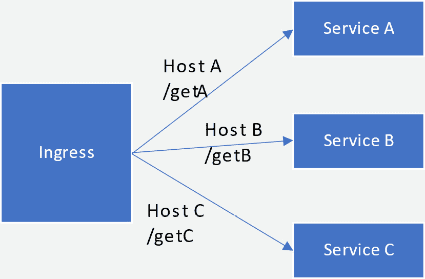

图 4.1 – Kubernetes Ingress 资源

在定义 Ingress 时，我们还需要定义 Ingress 控制器，Ingress 控制器是另一种 Kubernetes 资源，负责根据 Ingress 资源中定义的规范处理流量。

以下图示了 Ingress、Ingress 控制器和服务之间的关系。请注意，Ingress 是一个逻辑构造——也就是说，它是由 Ingress 控制器强制执行的一组规则。

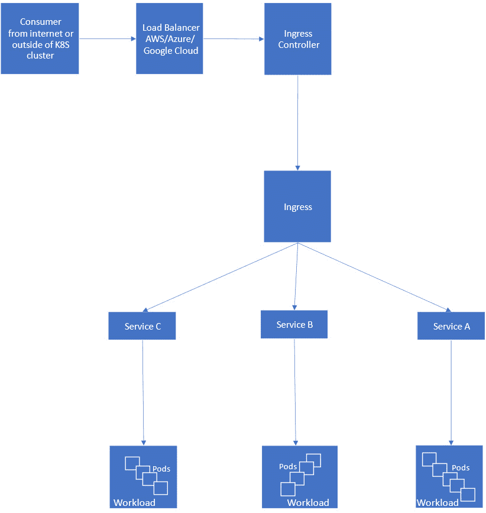

图 4.2 – Ingress 控制器

接下来，我们将使用 Istio Gateway 控制器来处理 Ingress；我们在*第三章*中介绍了 Istio Gateway。

我们需要提供以下配置，也定义在 `Chapter4/1-istio-ingress.yaml` 中，以进行更改：

```
apiVersion: networking.k8s.io/v1
kind: Ingress
metadata:
  annotations:
    kubernetes.io/ingress.class: istio
  name: sockshop-istio-ingress
  namespace: sock-shop
spec:
  rules:
  - host: "sockshop.com"
    http:
      paths:
      - path: /
        pathType: Prefix
        backend:
          service:
            name: front-end
            port:
              number: 80
```

在前面的配置中，我们正在执行以下操作：

+   创建一个带有 `kubernetes.io/ingress.class: istio` 注解的 Ingress 资源，通过 admission controllers（我们在*第三章*中讨论过）告诉 Istio，该 Ingress 由 Istio Gateway 处理。

+   Ingress 资源在 `sock-shop` 命名空间中定义，因为我们的 Sockshop 前端服务就存在于这个命名空间中。

+   规定任何指定为 `/` 路径并且目标主机为 `"sockshop.com"`（由 `host` 和 `sockshop.com` 值指定）的请求应由该 Ingress 处理的规则。

+   在 `path` 配置中，我们正在配置 `pathType` 为 `Prefix`，这基本意味着任何以 `hostname/` 格式的请求都会被匹配。`pathType` 的其他值如下：

    +   `Exact`：路径与 `path` 中指定的内容完全匹配

    +   `ImplementationSpecific`：`path` 的匹配由 Ingress 控制器的底层实现决定

使用以下命令应用规则：

```
$ kubectl create -f Chapter4/1-istio-ingress.yaml
```

如果你在做这个练习时使用的是 minikube，请在单独的终端中运行 `minikube tunnel`，并从输出中获取外部 IP。使用以下命令找到 Istio Ingress 网关暴露服务的端口：

```
$ kubectl get svc istio-ingressgateway -n istio-system -o wide
NAME                   TYPE           CLUSTER-IP      EXTERNAL-IP     PORT(S)                                                                      AGE    SELECTOR
istio-ingressgateway   LoadBalancer   10.97.245.106   10.97.245.106   15021:32098/TCP,80:31120/TCP,443:30149/TCP,31400:30616/TCP,15443:32339/TCP   6h9m   app=istio-ingressgateway,istio=ingressgateway
```

在此实例中，Ingress 网关将端口 `80` 的流量暴露到 Ingress 端口 `31120`，并将 `443` 暴露到 `30149`，但你的设置可能有所不同。

如果你按照*第四章*中的说明使用了 AWS EKS，那么 IP 和端口会有所不同；以下是 AWS EKS 中与 minikube 等效的配置：

```
$ kubectl get svc istio-ingressgateway -n istio-system
NAME                   TYPE           CLUSTER-IP       EXTERNAL-IP                                                               PORT(S)                                                                      AGE
istio-ingressgateway   LoadBalancer   172.20.143.136   a816bb2638a5e4a8c990ce790b47d429-1565783620.us-east-1.elb.amazonaws.com   15021:30695/TCP,80:30613/TCP,443:30166/TCP,31400:30402/TCP,15443:31548/TCP   29h
```

在此示例中，Ingress 网关通过 AWS 经典负载均衡器暴露，地址如下：

+   `http://a816bb2638a5e4a8c990ce790b47d429-1565783620.us-east-1.elb.amazonaws.com:80` 用于 HTTP 流量

+   `https://a816bb2638a5e4a8c990ce790b47d429-1565783620.us-east-1.elb.amazonaws.com:443` 用于 HTTPS 流量

之后，请根据您选择的环境使用适当的 IP 地址和端口。接下来章节中的示例部署在 AWS EKS 集群上，但它们也适用于任何其他 Kubernetes 提供商。

继续，通过 `curl` 测试 Ingress 到前端服务：

```
curl -HHost:sockshop.com http://a816bb2638a5e4a8c990ce790b47d429-1565783620.us-east-1.elb.amazonaws.com/
```

或者如果使用 Chrome 浏览器，则可以使用如 ModHeader 等扩展，访问 [`modheader.com/`](http://modheader.com/)。无论哪种情况，您都需要提供 `host` 头，并将其值设置为 `sockshop.com`。

所以，我们看到 Istio Ingress 网关可以配置为处理 Kubernetes Ingress。

让我们再添加一个 Ingress 规则，看看 Istio Ingress 控制器如何处理多个 Ingress 规则。我们将使用我们在 *第三章* 中做的 `envoy` 配置，其中我们使用了一个路由过滤器返回一个虚拟字符串：

1.  在以下命令中，我们创建了一个 `chapter4` 命名空间，以便于管理，并且清理时也更方便：

    ```
    $ kubectl create ns chapter4
    ```

1.  在此阶段，我们不需要自动侧车注入，但从可视化的角度出发，为了从 Kiali 获取有意义的信息，启用 Istio 侧车注入将是一个好主意，可以使用我们在 *第二章* 中讨论的以下命令：

    ```
    $ kubectl label namespace chapter4 istio-injection=enabled --overwrite
    ```

1.  然后，我们将继续创建 `configmap` 来加载 `envoy` 配置（也在 *第三章* 中讨论），这是我们将在下一步创建的 Pods 所需要的：

    ```
    $ kubectl create configmap envoy-dummy --from-file=Chapter3/envoy-config-1.yaml -n chapter4
    ```

1.  接下来，我们将创建服务和部署以运行 `envoy`，为所有 HTTP 请求返回一个虚拟响应：

    ```
    $ kubectl apply -f Chapter4/01-envoy-proxy.yaml
    ```

1.  最后，我们创建一个 Ingress 规则，将所有目标为 `mockshop.com` 的流量路由到我们在前一步中创建的 `envoy` 服务：

    ```
    $ kubectl apply -f Chapter4/2-istio-ingress.yaml
    ```

1.  继续使用 `sockshop.com` 和 `mockshop.com` 主机头进行测试；Istio Ingress 控制器将根据定义的 Ingress 规则管理路由到适当的目标。

下图描述了我们迄今为止配置的内容。请注意，Ingress 规则如何根据主机名定义流量路由到服务 A 和 B：

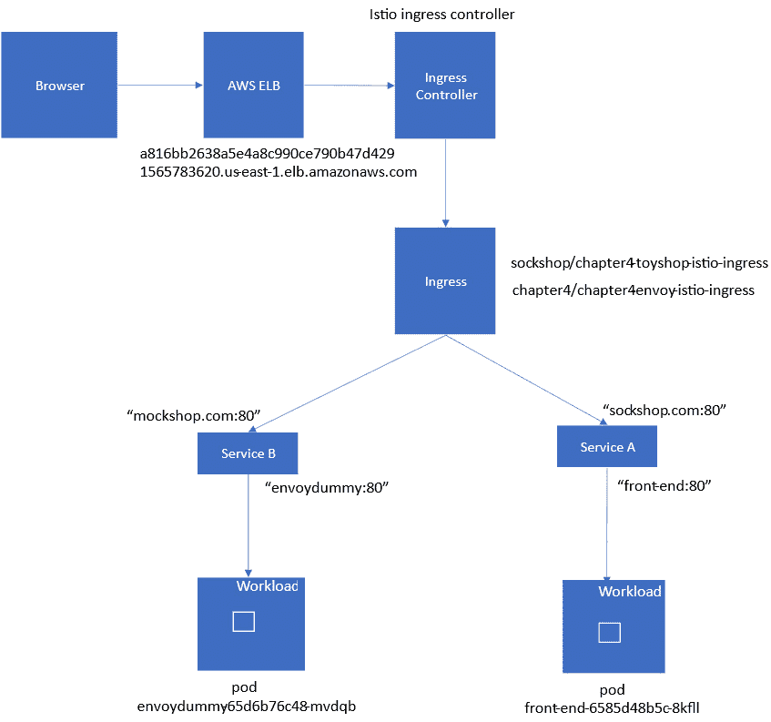

图 4.3 – Ingress 配置快照

在本节中，我们讨论了如何使用 Kubernetes Ingress 资源和 Istio Ingress 控制器将服务暴露到 Kubernetes 集群外部。在这种 Ingress 配置中，尽管我们使用 Istio 来管理 Ingress，但我们受限于 Kubernetes Ingress 的规格，这使得 Ingress 控制器只能执行有限的功能，如负载均衡、SSL 终止和基于名称的虚拟主机。使用 Kubernetes Ingress 资源类型时，我们没有充分利用 Istio 提供的广泛功能来管理 Ingress。使用 Istio 时，建议使用 Istio 网关 CRD 来管理 Ingress；我们将在下一节讨论这一点。

在继续之前，让我们先进行一些环境的技术清理，以避免与接下来的练习产生冲突：

```
$ kubectl delete -f Chapter4/2-istio-ingress.yaml
$ kubectl delete -f Chapter4/1-istio-ingress.yaml
```

重要提示

在本书中，我们将给出一些提醒，让你反向或清理配置。你可以使用前述命令来执行清理操作。

# 使用 Istio 网关管理 Ingress

在管理 Ingress 时，建议优先使用 Istio 网关，而非 Kubernetes Ingress 资源。Istio 网关像一个负载均衡器，运行在服务网格的边缘，接收传入的 HTTP 和 TCP 连接。

在通过 Istio 网关配置 Ingress 时，你需要执行以下任务。

## 创建网关

以下代码块创建了一个 Istio 网关资源：

```
apiVersion: networking.istio.io/v1alpha3
kind: Gateway
metadata:
  name: chapter4-gateway
  namespace: chapter4
spec:
  selector:
    istio: ingressgateway
  servers:
  - port:
      number: 80
      name: http
      protocol: HTTP
    hosts:
    - "sockshop.com"
    - "mockshop.com"
```

在这里，我们声明了一个名为`chapter4-gateway`的 Kubernetes 资源，该资源属于`gateway.networking.istio.io`类型的自定义资源定义，位于`chapter4`命名空间中。这也等同于定义了一个负载均衡器。

在`servers`属性中，我们定义了以下内容：

+   `hosts`：这些是网关暴露的一个或多个 DNS 名称。在前面的例子中，我们定义了两个主机：`sockshop.com`和`mockshop.com`。除了这两个主机之外，任何其他主机将被 Ingress 网关拒绝。

+   `port`：在端口配置中，我们定义了端口号和协议，可以是`HTTP`、`HTTPS`、`gRPC`、`TCP`、`TLS`或`Mongo`。端口名称可以是任何你喜欢使用的名称。在这个例子中，我们通过`HTTP`协议暴露端口`80`。

总结来说，网关将接受所有通过端口`80`的 HTTP 请求，且主机头为`sockshop.com`或`mockshop.com`。

## 创建虚拟服务

虚拟服务是 Ingress 网关与目标服务之间的另一层抽象。通过虚拟服务，你可以声明如何将一个主机（如`sockshop.com`）或多个主机（如`sockshop.com`和`mockshop.com`）的流量路由到目标。例如，你可以在虚拟服务中定义以下内容，针对所有指向`sockshop.com`的流量：

+   请求带有`/path1` URI 的应发送到服务 1，带有`/path2`的应发送到服务 2。

+   根据头信息或查询参数的值来路由请求。

+   基于权重的路由或流量拆分——例如，60%的流量进入服务的版本 1，40%的流量进入另一个版本的服务

+   定义超时——即，如果在*X*秒内未收到来自上游服务的响应，则请求应超时

+   重试——即，如果上游系统没有响应或响应过慢，请尝试多少次请求

所有这些路由功能都是通过虚拟服务实现的，我们将在本章以及下一章中详细了解它们。

在以下配置中，我们定义了两个虚拟服务，这些服务包含关于流量匹配的规则以及流量应路由到的目标：

```
---
apiVersion: networking.istio.io/v1alpha3
kind: VirtualService
metadata:
  name: sockshop
  namespace: chapter4
spec:
  hosts:
  - "sockshop.com"
  gateways:
  - chapter4-gateway
  http:
  - match:
    - uri:
        prefix: /
    route:
    - destination:
        port:
          number: 80
        host: front-end.sock-shop.svc.cluster.local
```

在之前的配置中，我们定义了一个名为`sockshop`的虚拟服务。在`spec`属性中，我们定义了以下内容：

+   `hosts`：此虚拟服务中的规则将应用于目标为`sockshop.com`的流量，正如在`host`中定义的那样。

+   `gateway`：此虚拟服务与我们在第 1 步（*创建网关*）中创建的`chapter4-gateway`关联；这强制要求任何未与该网关关联的流量不会被此虚拟服务配置处理。

+   `http`：在这里，我们将定义 HTTP 流量的规则和路由信息。还有定义`tls`和`tcp`路由的选项；`tls`用于透传 TLS 或 HTTPS 流量，而`tcp`用于不透明的 TCP 流量。

+   `match`：这些包含匹配标准，可以基于路径、头部等。在此示例中，我们指示所有流量都将根据本节中的指示进行路由。

+   `route`：如果流量匹配，则根据这里提供的信息路由流量。在此示例中，我们将流量路由到`front-end.sock-shop.svc.cluster.local`的端口`80`。

你可以在`Chapter4/3-istio-gateway.yaml`中找到与`envoy-dummy-svc`对应的虚拟服务声明。该文件结合了网关和虚拟服务的声明。

下一步，如果尚未按照上一节的清理说明删除，则请删除上一节中创建的 Ingress 资源，以避免与我们将在本节应用的配置发生冲突。

应用新配置：

```
$ kubectl apply -f chapter4/3-istio-gateway.yaml
```

请测试你是否能够使用你喜欢的 HTTP 客户端访问`sockshop.com`和`mockshop.com`，并且不要忘记注入正确的`host`头。

如果你发现很难将端到端的配置可视化，那么可以参考以下插图：

+   以下图表总结了本节中的配置：

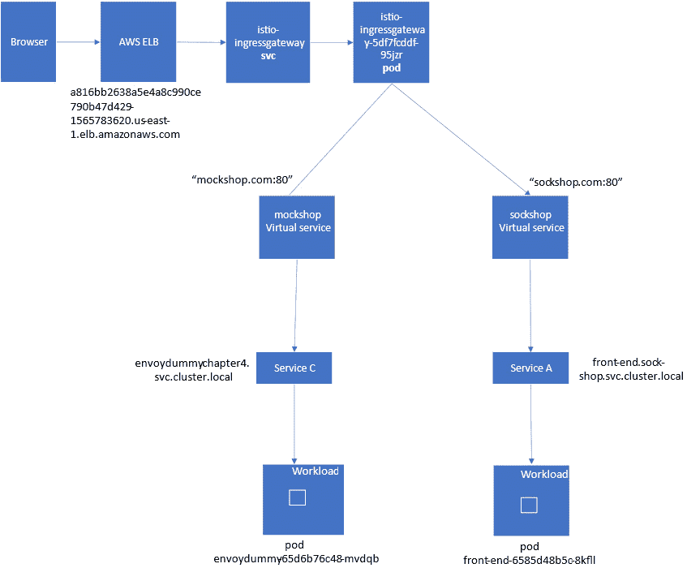

图 4.4 – 虚拟服务

+   以下图表总结了各种 Istio CRD 和 Kubernetes 资源之间的关联：

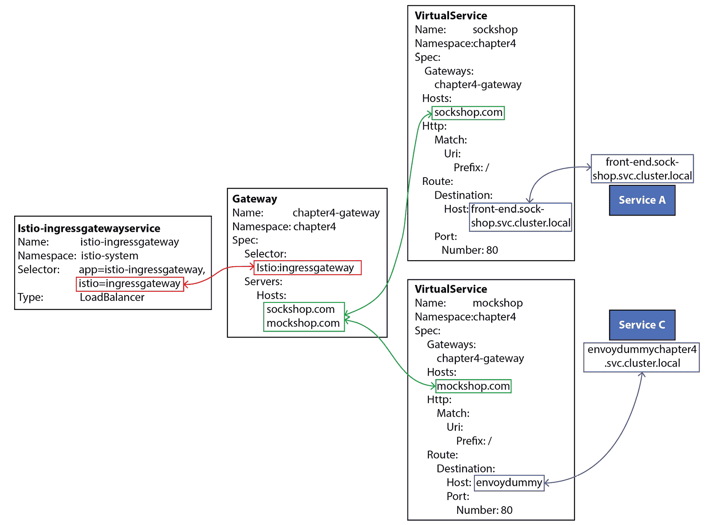

图 4.5 - 虚拟服务与其他 Istio 资源的关联

在本节中，我们学习了如何使用 Istio Gateway 和虚拟服务来管理 Ingress。

提醒

请清理`chapter4/3-istio-gateway.yaml`文件，以避免与即将进行的练习发生冲突。

# 流量路由与金丝雀发布

在前一部分中，我们了解了虚拟服务的一些功能；在这一部分中，我们将介绍如何将流量分配到多个目标。

假设你已经配置了`envoy-dummy`配置映射，并且根据`01-envoy-proxy.yaml`文件启动了`envoy` Pod 和服务。如果没有，请按照前面的说明配置这些内容。

在接下来的练习中，我们将创建另一个名为`v2`的`envoydummy` Pod 版本，它返回与`v1`不同的响应。我们将并行部署`v2`和`v1`，然后配置两者之间的流量分配：

1.  创建另一个版本的`envoy`模拟服务，但使用不同的消息：

    ```
    direct_response:
                      status: 200
                      body:
                        inline_string: "V2----------Bootstrap Service Mesh Implementation with Istio----------V2"
    ```

1.  更改内容可以在`Chapter4/envoy-config-2.yaml`中找到；请继续创建另一个配置映射：

    ```
    $ kubectl create configmap envoy-dummy-2 --from-file=Chapter4/envoy-config-2.yaml -n chapter4
    ```

1.  然后，创建另一个部署，但这次请按以下方式标记 Pods：

    ```
    template:
        metadata:
          labels:
            name: envoyproxy
            version: v2
    ```

1.  应用更改：

    ```
    $ kubectl apply -f Chapter4/02-envoy-proxy.yaml
    ```

1.  接下来，我们将创建另一个虚拟服务，但会做以下更改：

    ```
        route:
        - destination:
            port:
              number: 80
            subset: v1
            host: envoy-dummy-svc
          weight: 10
        - destination:
            port:
              number: 80
            subset: v2
            host: envoy-dummy-svc
          weight: 90
    ```

你一定注意到我们在同一路由下有两个目标。`destination`表示请求最终路由到的服务位置。在`destination`下，我们有以下三个字段：

+   `host`：这表示请求应该路由到的服务名称。服务名称会根据 Kubernetes 服务注册表或 Istio 服务入口注册的主机解析。我们将在下一部分讨论服务入口。

+   `subset`：这是目标规则定义的服务子集，接下来会进行说明。

+   `port`：这是服务可以访问的端口。

我们还为路由规则关联了权重，指定 10%的流量应发送到`subset: v1`，而 90%的流量应发送到`subset: v2`。

在虚拟服务定义之后，我们还需要定义目标规则。目标规则是一组应用于流量的规则，这些流量在通过虚拟服务路由规则后执行。

在以下配置中，我们定义了一个名为`envoy-destination`的目标规则，这个规则将应用于指向`envoy-dummy-svc`的流量。它进一步定义了两个子集——`subset: v1`对应于带有`version = v1`标签的`envoy-dummy-svc`端点，而`subset: v2`对应于带有`version = v2`标签的端点：

```
apiVersion: networking.istio.io/v1alpha3
kind: DestinationRule
metadata:
  name: envoy-destination
  namespace: chapter4
spec:
  host: envoy-dummy-svc
  subsets:
  - name: v1
    labels:
      version: v1
  - name: v2
    labels:
      version: v2
```

应用更改：

```
kubectl apply -f Chapter4/4a-istio-gateway.yaml
```

你会注意到，10%的请求将返回`Bootstrap Service Mesh Implementation with Istio`，而 90%的请求将返回`V2----------Bootstrap Service Mesh Implementation with` `Istio----------V2`响应。

如果你觉得难以直观理解端到端的配置，可以参考以下插图，它总结了本节中的配置：

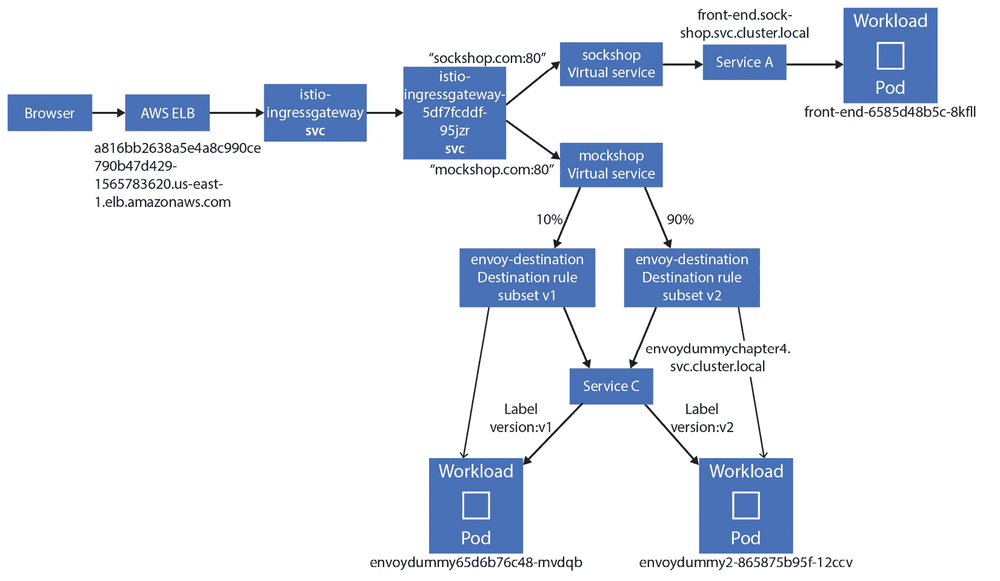

图 4.6 – 目标规则

以下图表总结了各种 Istio CRD 与 Kubernetes 资源之间的关联：

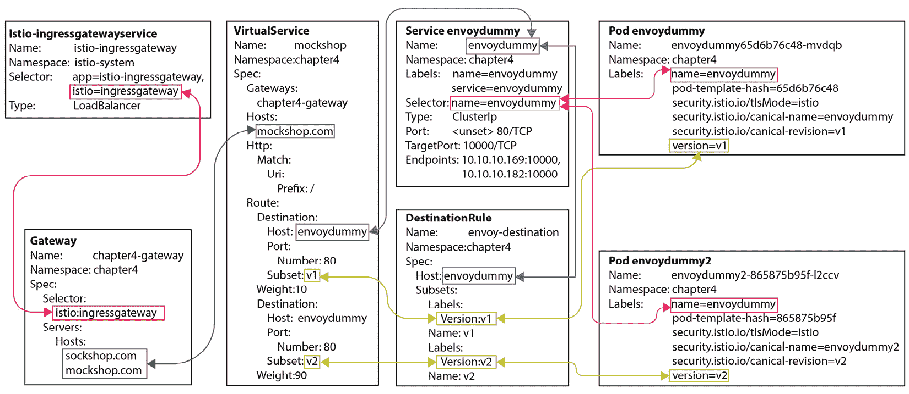

图 4.7 – 目标规则与其他 Istio 资源的关联

你还可以在 Kiali 仪表板中查看流量是如何以 1:9 的比例在两个服务之间路由的：

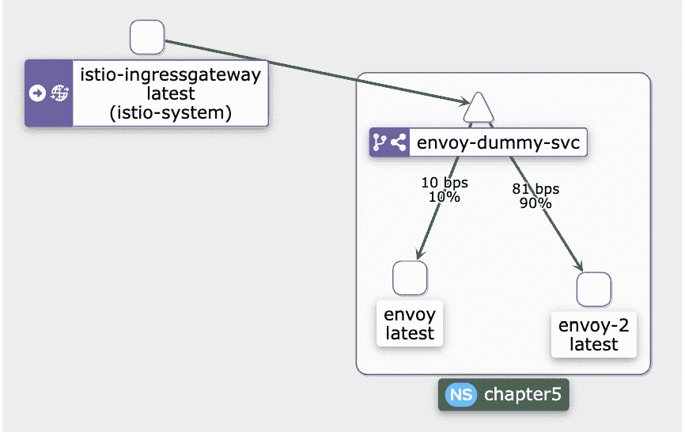

图 4.8 – Kiali 仪表板显示流量分配

提示

请清理`Chapter4/4a-istio-gateway.yaml`文件，以避免在接下来的练习中发生冲突。

本节中，你学习了如何在服务的两个版本之间路由或分配流量。这是与流量管理相关的多种操作的基础，其中金丝雀发布是一个例子。在下一节中，我们将了解流量镜像，也称为**流量阴影**；它是流量路由的另一个例子。

# 流量镜像

**流量镜像**是另一项重要功能，它允许你将发送到上游的流量异步地复制到另一个上游服务，也称为**镜像服务**。流量镜像是一个"无等待"的操作，即 sidecar/gateway 不会等待来自镜像上游的响应。

以下是流量镜像的示意图：

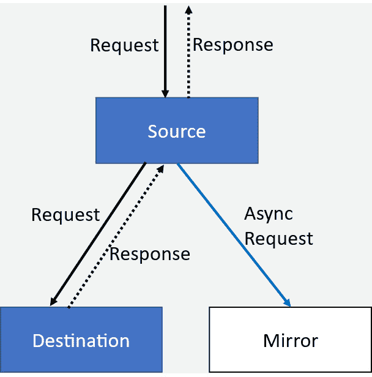

图 4.9 – 流量镜像

流量镜像有很多有趣的应用场景，包括以下几点：

+   将流量镜像到预生产系统进行测试

+   将流量镜像到接收流量并进行带外分析的目标系统

在以下示例中，在虚拟服务定义中的路由配置下，我们指定了 100%的流量应镜像到`subset: v2`：

```
  route:
    - destination:
        port:
          number: 80
        subset: v1
        host: envoydummy
      weight: 100
    mirror:
      host: nginxdummy
      subset: v2
    mirrorPercentage:
      value: 100.0
```

在应用上述更改之前，首先使用以下命令创建一个 nginx 服务：

```
kubectl apply -f utilities/nginx.yaml
```

然后，部署虚拟服务：

```
kubectl apply -f chapter4/4b-istio-gateway.yaml
```

以下说明了虚拟服务和目标规则的配置：

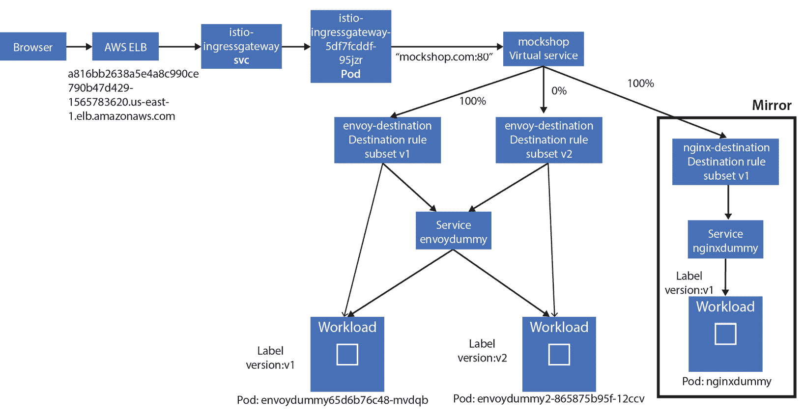

图 4.10 – 通过虚拟服务实现流量镜像

当使用`curl`或浏览器带有`mockshop.com`主机头访问服务时，你会注意到你总是收到`Bootstrap Service Mesh Implementation with` `Istio`的响应。

但如果使用`kubectl logs nginxdummy -c nginx -n chapter4`命令查看 nginx 日志，你会发现 nginx 也收到了请求，这表明流量已被镜像到 nginx。

这部分简短地介绍了流量镜像功能，它是一个简单但强大的特性，尤其适用于事件驱动架构、测试以及使用机器学习和人工智能进行模型训练时。

提醒

请清理`Chapter4/4b-istio-gateway.yaml`文件，以避免在接下来的练习中出现冲突。

# 将流量路由到集群外的服务

在你的 IT 环境中，并非所有服务都将在 Kubernetes 集群内部署；一些服务将在传统的虚拟机或裸金属环境中运行，也有一些服务将由 SaaS 提供商或业务合作伙伴提供，另外还有一些服务将运行在外部或不同的 Kubernetes 集群中。在这些场景中，需要让网格中的服务能够访问这些外部服务。因此，接下来的步骤是尝试构建到集群外服务的路由。我们将使用位于[`httpbin.org/`](https://httpbin.org/)的`httpbin`服务。

任何目标为`mockshop.com/get`的请求应路由到`httpbin`；其他请求应由我们在上一节中创建的`envoy-dummy-svc`处理。

在以下虚拟服务定义中，我们已定义任何带有`/get`的请求应路由到`httpbin.org`：

```
- match:
    - uri:
        prefix: /get
    route:
    - destination:
        port:
          number: 80
        host: httpbin.org
```

接下来，我们将创建`ServiceEntry`，它是向 Istio 内部服务注册表添加条目的方法。Istio 控制平面管理着网格内所有服务的注册表。该注册表由两种数据源填充——一种是 Kubernetes API 服务器，后者使用 etcd 来维护集群中所有服务的注册表，第二种是由`ServiceEntry`和`WorkloadEntry`填充的配置存储。现在，`ServiceEntry`和`WorkloadEntry`用于填充有关 Kubernetes 服务注册表中未知服务的详细信息。我们将在*第十章*中阅读关于`WorkloadEntry`的内容。

以下是将`httpbin.org`添加到 Istio 服务注册表的`ServiceEntry`声明：

```
apiVersion: networking.istio.io/v1alpha3
kind: ServiceEntry
metadata:
  name: httpbin-svc
  namespace: chapter4
spec:
  hosts:
  - httpbin.org
  location: MESH_EXTERNAL
  ports:
  - number: 80
    name: httpbin
    protocol: http
  resolution: DNS
```

在`ServiceEntry`声明中，定义了以下配置：

+   `resolution`：在这里，我们定义如何解析主机名；以下是可能的值：

    +   `DNS`：利用可用的 DNS 来解析主机名

    +   `DNS_ROUND_ROBBIN`：在这种情况下，使用第一个解析的地址

    +   `NONE`：不需要 DNS 解析；目标通过 IP 地址指定

    +   `STATIC`：使用静态端点对应主机名

+   `location`：服务条目的位置用于指定请求的服务是属于网格内部还是外部。可能的值有`MESH_EXTERNAL`和`MESH_INTERNAL`。

+   `hosts`：这是与请求的服务相关联的主机名；在本例中，主机是`httpbin.org`。`ServiceEntry`中的主机字段与虚拟服务和目标规则中指定的主机字段匹配。

请继续应用更改：

```
$ kubectl apply -f Chapter4/5a-istio-gateway.yaml
```

执行 `curl` 到 `/get` 时，你将收到来自 `httpbin.org` 的响应，而 `/ping` 应路由到 `envoydummy` 服务。

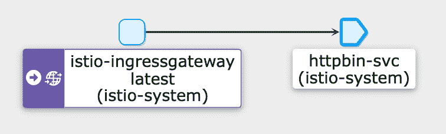

图 4.11 – Kiali 仪表板显示通过 ServiceEntry 连接到外部系统

提醒

请清理 `Chapter4/5a-istio-gateway.yaml` 以避免在接下来的练习中发生冲突。

`ServiceEntry` 提供了多种选项，用于将外部服务注册到 Istio 注册表，以便网格内的流量能够正确路由到网格外的工作负载。

# 通过 HTTPS 暴露 Ingress

在本节中，我们将学习如何配置 Istio 网关通过 HTTPS 暴露 Sockshop 前端应用程序。

*步骤 1* 和 *步骤 3* 如果你已经拥有**证书颁发机构**（**CA**），则是可选的；通常，对于生产系统，这些步骤将由组织的 CA 执行：

1.  创建一个 CA。这里，我们正在创建一个 CA，`CN` 为 (`sockshop.inc`)：

    ```
    $openssl req -x509 -sha256 -nodes -days 365 -newkey rsa:2048 -subj '/O=Sockshop Inc./CN=Sockshop.inc' -keyout Sockshop.inc.key -out Sockshop.inc.crt
    ```

1.  生成一个 `sockshop.com`，并生成一个私钥：

    ```
    $openssl req -out sockshop.com.csr -newkey rsa:2048 -nodes -keyout sockshop.com.key -subj "/CN=sockshop.com/O=sockshop.inc"
    ```

1.  使用以下命令通过 CA 签署 CSR：

    ```
    $openssl x509 -req -sha256 -days 365 -CA Sockshop.inc.crt -CAkey Sockshop.inc.key -set_serial 0 -in sockshop.com.csr -out sockshop.com.crt
    ```

1.  将证书和私钥作为 Kubernetes Secret 加载：

    ```
    $kubectl create -n istio-system secret tls sockshop-credential --key=sockshop.com.key --cert=sockshop.com.crt
    ```

1.  使用以下命令创建网关和虚拟服务：

    ```
    kubectl apply -f Chapter4/6-istio-gateway.yaml
    ```

这样，我们已经创建了证书并将其与私钥一起作为 Kubernetes Secret 加载。

最后，我们正在配置 Istio 网关使用 Secret 作为 TLS 通信的凭证。在 `Chapter4/6-istio-gateway.yaml` 文件中，我们将网关配置为 Ingress，并在 `HTTPS` 服务器协议上监听端口 `443`：

```
  servers:
  - port:
      number: 443
      name: https
      protocol: HTTPS
    tls:
      mode: SIMPLE
      credentialName: sockshop-credential
    hosts:
    - "sockshop.com"
```

在网关配置中，我们将协议版本从 `HTTP` 更改为 `HTTPS`，并在 `servers`>`tls` 下添加了以下配置：

+   `Mode`：指示是否应使用 TLS 来保护该端口。此字段的可能值如下：

    +   `SIMPLE`：这是我们选择的标准 TLS 设置，用于暴露 Sockshop。

    +   `MUTUAL`：这是用于网关与任何调用网关的系统之间的双向 TLS。

    +   `PASSTHROUGH`：当连接需要路由到具有主机值的虚拟服务时，使用此选项，该主机值是通话期间呈现的**服务器名称指示符**（**SNI**）。

SNI

SNI 是 TLS 协议的一个扩展，在 TLS 握手过程中共享目标服务的主机名或域名，而不是在第 7 层。SNI 在服务器托管多个域名时非常有用，每个域名都由其自己的 HTTPS 证书表示。通过在第 5 层握手时了解请求的主机名，服务器能够根据握手期间呈现的 SNI 提供正确的证书。

+   `AUTO_PASSTHROUGH`：这与 `PASSTHROUGH` 相同，唯一的区别是无需虚拟服务。连接将按照 SNI 中的详细信息转发到上游服务。

+   `ISTIO_MUTUAL`：这与 `MUTUAL` 相同，只是用于互信 TLS 的证书是由 Istio 自动生成的。

+   `凭证名称`：这是持有私钥和证书的 Secret，用于在 TLS 连接期间为服务器端连接提供认证。我们在*第 4 步*创建了这个 Secret。

继续访问 `sockshop.com`；你需要在 `curl` 中使用 `--connect-to` 来绕过由替换名称与主机实际名称不同而引起的名称解析问题：

```
$ curl -v -HHost:sockshop.com --connect-to "sockshop.com:443:a816bb2638a5e4a8c990ce790b47d429-1565783620.us-east-1.elb.amazonaws.com" --cacert Sockshop.inc.crt  https://sockshop.com:443/
```

请注意，`a816bb2638a5e4a8c990ce790b47d429-1565783620.us-east-1.elb.amazonaws.com` 是 `curl` 中的 `--resolve`，类似于以下内容：

```
$ curl -v -HHost:sockshop.com --resolve "sockshop.com:56407:127.0.0.1" http://sockshop.com:56407/
```

在前面的命令中，`56407` 是 Ingress 网关监听的本地端口。

在连接过程中，你会在输出中注意到网关正确地呈现了服务器端证书：

```
* SSL connection using TLSv1.3 / AEAD-CHACHA20-POLY1305-SHA256
* ALPN, server accepted to use h2
* Server certificate:
*  subject: CN=sockshop.com; O=sockshop.inc
*  start date: Aug 12 06:45:27 2022 GMT
*  expire date: Aug 12 06:45:27 2023 GMT
*  common name: sockshop.com (matched)
*  issuer: O=Sockshop Inc.; CN=Sockshop.inc
*  SSL certificate verify ok.
```

这里有一个特别要注意的点是，我们暴露了 `sockshop.com` 作为一个 `HTTPS` 服务，而没有对托管该网站的前端服务进行任何更改。

提醒

请清理 `Chapter4/6-istio-gateway.yaml`，以避免与即将到来的练习冲突。

## 启用 HTTP 重定向到 HTTPS

对于仍然向非 HTTPS 端口发送请求的下游系统，我们可以通过在网关配置中对非 HTTPS 端口进行以下更改来实现 HTTP 重定向：

```
  servers:
  - port:
      number: 80
      name: http
      protocol: HTTP
    hosts:
    - "sockshop.com"
    tls:
      httpsRedirect: true
```

我们仅仅添加了 `httpsRedirect: true`，使得网关对所有非 HTTPS 连接发送 `301` 重定向。应用更改并测试连接：

```
$ kubectl apply -f Chapter4/7-istio-gateway.yaml
$ curl -v -HHost:sockshop.com --connect-to "sockshop.com:80:a816bb2638a5e4a8c990ce790b47d429-1565783620.us-east-1.elb.amazonaws.com" --cacert Sockshop.inc.crt  http://sockshop.com:80/
```

在输出中，你会看到重定向到 `sockshop.com`：

```
* Mark bundle as not supporting multiuse
< HTTP/1.1 301 Moved Permanently
< location: https://sockshop.com/
```

提醒

如往常一样，请清理 `Chapter4/7-istio-gateway.yaml`，以避免与下一节练习冲突。

## 启用多个主机的 HTTPS

在上一节中，我们定义了网关上 `sockshop.com` 的设置。我们也可以在网关上为多个主机应用类似的设置。在本节中，我们将同时为 `mockshop.com` 和 `sockshop.com` 启用网关上的 TLS：

1.  我们将使用在上一节中创建的 CA。所以，作为下一步，让我们为 `mockshop.com` 生成一个 CSR：

    ```
    $openssl req -out mockshop.com.csr -newkey rsa:2048 -nodes -keyout mockshop.com.key -subj "/CN=mockshop.com/O=mockshop.inc"
    ```

1.  使用 CA 签署 CSR：

    ```
    $openssl x509 -req -sha256 -days 365 -CA Sockshop.inc.crt -CAkey Sockshop.inc.key -set_serial 0 -in mockshop.com.csr -out mockshop.com.crt
    ```

1.  将证书和私钥加载为 Kubernetes Secret：

    ```
    $kubectl create -n istio-system secret tls mockshop-credential --key=mockshop.com.key --cert=mockshop.com.crt
    ```

1.  在网关的服务器配置下，添加以下配置来为 `mockshop.com` 配置：

    ```
    - port:
          number: 443
          name: https-mockshop
          protocol: HTTPS
        tls:
          mode: SIMPLE
          credentialName: mockshop-credential
        hosts:
        - "mockshop.com"
    ```

1.  应用更改：

    ```
    kubectl apply -f Chapter4/8-istio-gateway.yaml
    ```

修改后，网关将根据主机名解析正确的证书。

1.  现在让我们访问 `sockshop.com`：

    ```
    curl -v --head -HHost:sockshop.com --resolve "sockshop.com:56408:127.0.0.1" --cacert Sockshop.inc.crt https://sockshop.com:56408/
    ```

在响应中，你可以看到正确的证书已被呈现：

```
* SSL connection using TLSv1.3 / AEAD-CHACHA20-POLY1305-SHA256
* ALPN, server accepted to use h2
* Server certificate:
*  subject: CN=sockshop.com; O=sockshop.inc
*  start date: Aug 12 06:45:27 2022 GMT
*  expire date: Aug 12 06:45:27 2023 GMT
*  common name: sockshop.com (matched)
*  issuer: O=Sockshop Inc.; CN=Sockshop.inc
*  SSL certificate verify ok.
* Using HTTP2, server supports multiplexing
```

1.  同样，测试 `mockshop.com`：

    ```
    curl -v -HHost:mockshop.com --connect-to "mockshop.com:443:a816bb2638a5e4a8c990ce790b47d429-1565783620.us-east-1.elb.amazonaws.com" --cacert Sockshop.inc.crt  https://mockshop.com/
    ```

1.  然后，检查网关呈现的证书是否属于 `mockshop.com`：

    ```
    SSL connection using TLSv1.3 / AEAD-CHACHA20-POLY1305-SHA256
    * ALPN, server accepted to use h2
    * Server certificate:
    *  subject: CN=mockshop.com; O=mockshop.inc
    *  start date: Aug 12 23:47:27 2022 GMT
    *  expire date: Aug 12 23:47:27 2023 GMT
    *  common name: mockshop.com (matched)
    *  issuer: O=Sockshop Inc.; CN=Sockshop.inc
    *  SSL certificate verify ok.
    * Using HTTP2, server supports multiplexing
    ```

通过这种方式，我们已配置 Istio Ingress 网关根据主机名提供多个 TLS 证书，这也称为 SNI。Istio Ingress 网关可以在 TLS 第 4 层解析 SNI，从而允许它通过 TLS 为多个域名提供服务。

## 启用 CNAME 和通配符记录的 HTTPS

关于 HTTPS 的最后一个主题是如何管理 CNAME 和通配符记录的证书。特别是对于内部暴露的流量，支持通配符是非常重要的。在本节中，我们将配置网关以支持使用 SNI 的通配符。我们将使用之前章节中创建的 CA：

1.  为`*.sockshop.com`创建 CSR，并使用 CA 证书对其进行签名，然后创建 Kubernetes 密钥：

    ```
    $openssl req -out sni.sockshop.com.csr -newkey rsa:2048 -nodes -keyout sni.sockshop.com.key -subj "/CN=*.sockshop.com/O=sockshop.inc"
    $openssl x509 -req -sha256 -days 365 -CA Sockshop.inc.crt -CAkey Sockshop.inc.key -set_serial 0 -in sni.sockshop.com.csr -out sni.sockshop.com.crt
    $kubectl create -n istio-system secret tls sni-sockshop-credential --key=sni.sockshop.com.key --cert=sni.sockshop.com.crt
    ```

1.  然后，将`*.sockshop.com`主机名添加到网关的服务器配置中：

    ```
    servers:
      - port:
          number: 443
          name: https-sockshop
          protocol: HTTPS
        tls:
          mode: SIMPLE
          credentialName: sni-sockshop-credential
        hosts:
        - "*.sockshop.com"
    ```

1.  同时，使用`*.sockshop.com`修改虚拟服务：

    ```
    kind: VirtualService
    metadata:
      name: sockshop
      namespace: chapter4
    spec:
      hosts:
      - "*.sockshop.com"
      - "sockshop.com"
    ```

1.  应用配置：

    ```
    $ kubectl apply -f Chapter4/9-istio-gateway.yaml
    ```

1.  你可以测试`mockshop.com`、`sockshop.com`或任何其他指向`sockshop.com`的 CNAME 记录。以下示例使用的是`my.sockshop.com`：

    ```
    $ curl -v -HHost:my.sockshop.com --connect-to "my.sockshop.com:443:a816bb2638a5e4a8c990ce790b47d429-1565783620.us-east-1.elb.amazonaws.com" --cacert Sockshop.inc.crt  https://my.sockshop.com/
    ```

以下是*第 5 步*输出的片段，显示在握手过程中正确的证书被呈现：

```
* SSL connection using TLSv1.3 / AEAD-CHACHA20-POLY1305-SHA256
* ALPN, server accepted to use h2
* Server certificate:
*  subject: CN=*.sockshop.com; O=sockshop.inc
*  start date: Aug 13 00:27:00 2022 GMT
*  expire date: Aug 13 00:27:00 2023 GMT
*  common name: *.sockshop.com (matched)
*  issuer: O=Sockshop Inc.; CN=Sockshop.inc
*  SSL certificate verify ok.
* Using HTTP2, server supports multiplexing
```

如你所见，Istio 为 CNAME 提供了正确的通配符证书。这个示例演示了如何配置 Istio 网关来处理多个域名和子域名。

在本章及之前的章节中，我们了解了 Istio 如何管理网格内外的流量路由。了解网关、虚拟服务、目标规则和服务条目的概念，并通过本章提供的示例进行实验，以及思考其他示例并尝试实现它们，是非常重要的。在*第六章*中，我们将更深入地讨论安全性，并涵盖 mTLS 等主题。但目前，我们将了解 Istio 如何管理 Egress 流量。

提醒

别忘了清理`Chapter4/8-istio-gateway.yaml`和`Chapter4/9-istio-gateway.yaml`。

# 使用 Istio 管理 Egress 流量

在*将流量路由到集群外的服务*一节中，我们发现如何使用服务条目更新 Istio 服务注册表，介绍网格和集群外的服务。服务条目是将额外条目添加到 Istio 内部服务注册表中的一种方式，以便虚拟服务能够路由到这些条目。然而，Egress 网关用于控制外部服务流量如何离开网格。

为了熟悉 Egress 网关，我们将首先在网格中部署一个 Pod，从中我们可以调用外部服务：

```
$ kubectl apply -f utilities/curl.yaml
```

该命令创建了一个 Pod，你可以从中执行`curl`；这模拟了在网格内部运行的工作负载：

```
$ kubectl exec -it curl sh -n chapter4
```

从 Shell 访问`httpbin.org`，使用`curl`：

```
$ curl -v https://httpbin.org/get
```

现在，我们将使用以下命令停止所有出站流量：

```
$ istioctl install -y --set profile=demo --set meshConfig.outboundTrafficPolicy.mode=REGISTRY_ONLY
```

在上一个命令中，我们正在修改 Istio 安装，以将出站流量策略从`ALLOW_ANY`更改为`REGISTRY_ONLY`，这强制要求只有通过`ServiceEntry`资源定义的主机才是网格服务注册表的一部分。

返回并再次尝试`curl`；你将看到以下输出：

```
$ curl -v https://httpbin.org/get
curl: (35) OpenSSL SSL_connect: SSL_ERROR_SYSCALL in connection to httpbin.org:443
```

现在，让我们通过创建一个服务条目将`httpbin.org`列入 Istio 服务注册表，方法如下：

```
apiVersion: networking.istio.io/v1alpha3
kind: ServiceEntry
metadata:
  name: httpbin-svc
  namespace: chapter4
spec:
  hosts:
  - httpbin.org
  location: MESH_EXTERNAL
  resolution: DNS
  ports:
  - number: 443
    name: https
    protocol: HTTPS
  - number: 80
    name: http
    protocol: HTTP
```

现在，您可以继续应用配置：

```
$ kubectl apply -f Chapter4/10-a-istio-egress-gateway.yaml
```

从`curl` Pod 访问`https://httpbin.org/get`；这次您会成功。

`ServiceEntry`将`httpbin.org`添加到网格服务注册表中，因此我们能够从`curl` Pod 访问`httpbin.org`。

虽然`ServiceEntry`非常适合提供外部访问，但它并不提供对外部端点访问方式的控制。例如，您可能希望只有特定的工作负载或命名空间能够向外部资源发送流量。如果需要通过验证证书来验证外部资源的真实性怎么办？

提醒

别忘了清理`Chapter4/10-a-istio-egress-gateway.yaml`。

Egress 网关，结合虚拟服务、目标规则和服务条目的配置，提供了灵活的选项来管理和控制离开网格的流量。因此，让我们进行配置更改，将所有流量路由到 Egress 网关：

1.  配置 Egress 网关，这与 Ingress 网关配置非常相似。请注意，Egress 网关附加到`httpbin.org`；您可以为其他主机提供配置，或使用`*`来匹配所有主机名：

    ```
    apiVersion: networking.istio.io/v1alpha3
    kind: Gateway
    metadata:
      name: istio-egressgateway
      namespace: chapter4
    spec:
      selector:
        istio: egressgateway
      servers:
      - port:
          number: 80
          name: http
          protocol: HTTP
        hosts:
        - httpbin.org
    ```

1.  接下来，配置虚拟服务。这里，我们将虚拟服务配置为同时连接到 Egress 网关和网格：

    ```
    spec:
      hosts:
      - httpbin.org
      gateways:
      - istio-egressgateway
      - mesh
    ```

在虚拟服务定义的以下部分中，我们配置了从网格内发出的所有流量将定向到 Egress 网关，这些流量来自`httpbin.org`主机：

```
http:
  - match:
    - gateways:
      - mesh
      port: 80
    route:
    - destination:
        host: istio-egressgateway.istio-system.svc.cluster.local
        subset: httpbin
        port:
          number: 80
      weight: 100
```

我们已经配置了`subset: httpbin`来应用目标规则；在这个示例中，目标规则是空的。

最后，我们将添加另一个规则，将流量从 Egress 网关路由到`httpbin.org`：

```
  - match:
    - gateways:
      - istio-egressgateway
      port: 80
    route:
    - destination:
        host: httpbin.org
        port:
          number: 80
      weight: 100
```

1.  创建一个占位符，用于实现任何可能的目标规则：

    ```
    apiVersion: networking.istio.io/v1alpha3
    kind: DestinationRule
    metadata:
      name: rules-for-httpbin-egress
      namespace: chapter4
    spec:
      host: istio-egressgateway.istio-system.svc.cluster.local
      subsets:
      - name: httpbin
    ```

1.  您还需要为`httpbin.org`添加`ServiceEntry`，我们在前面部分已经讨论过。

1.  继续应用更改：

    ```
    kubectl apply -f Chapter4/10-b-istio-egress-gateway.yaml
    ```

1.  尝试从`curl` Pod 访问`httpbin.org`；现在您应该可以访问它了。

检查响应中的头信息，以及`istio-egressgateway pods`的日志。您会在`X-Envoy-Peer-Metadata-Id`下找到关于 Egress 网关的信息。您也可以在 Egress 网关的日志中看到请求。

您会注意到，尽管我们在服务条目中定义了`https`，但您无法访问`https://httpbin.org/get`。尝试启用对`httpbin.org`的`https`访问；您将在`Chapter4/10-c-istio-egress-gateway.yaml`中找到解决方案。

出口流量控制对于管理离开网格的流量非常重要。在*第六章*中，我们将重点讨论出口流量的其他安全方面。

提醒

删除`chapter4/10-b-istio-egress-gateway.yaml`以及`chapter4`命名空间。

使用以下命令将授权策略恢复为允许所有网格外发流量，而不需要 Egress 网关：

`$ istioctl install -y --set profile=demo --set meshConfig.outboundTrafficPolicy.mode=ALLOW_ANY`

# 总结

在本章中，我们了解了如何使用 Istio Ingress 网关管理进入 Service Mesh 的外部流量，以及如何使用 Istio Egress 网关管理离开网格的内部流量。

我们学习了虚拟服务和目标规则：虚拟服务是如何用于描述路由流量到网格中各个目的地的规则，目标规则是如何用于定义最终目的地，以及目标如何处理通过虚拟服务定义的规则路由的流量。使用虚拟服务，我们可以进行基于权重的流量路由，这也用于金丝雀发布和蓝绿部署。

此外，我们了解了`ServiceEntry`以及它是如何用于使 Istio 识别外部服务，以便网格中的工作负载可以将流量发送到网格外的服务。最后，我们还了解了 Egress 网关是如何用于控制流量出口到由`ServiceEntry`定义的终端，以便我们可以安全可靠地从网格访问外部服务。本章为下一章做了铺垫，下一章我们将讨论如何利用本章中的概念实现应用程序的韧性。
