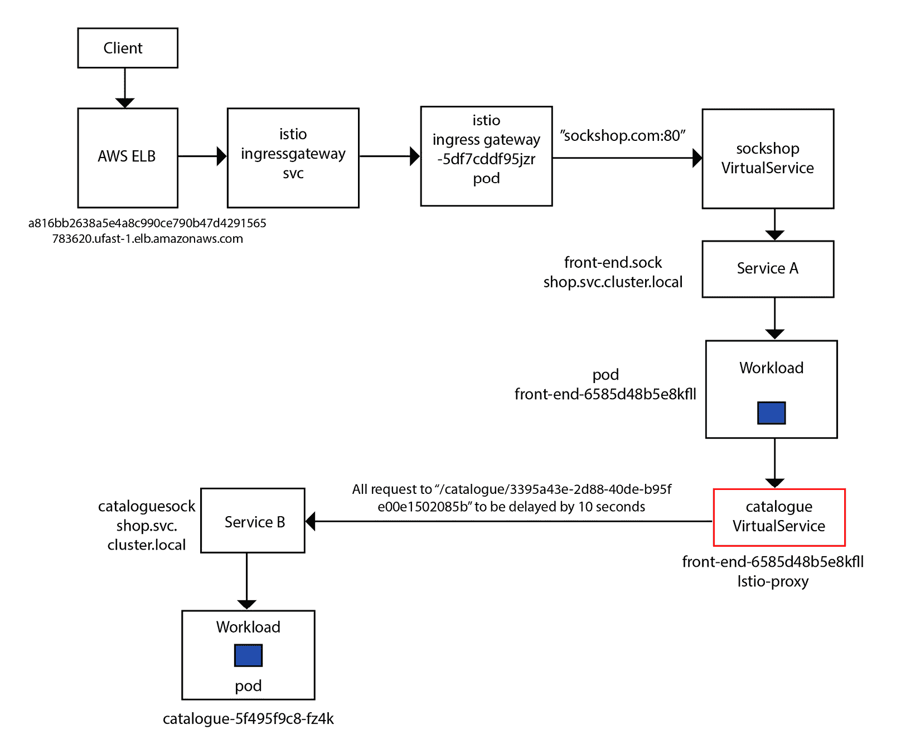
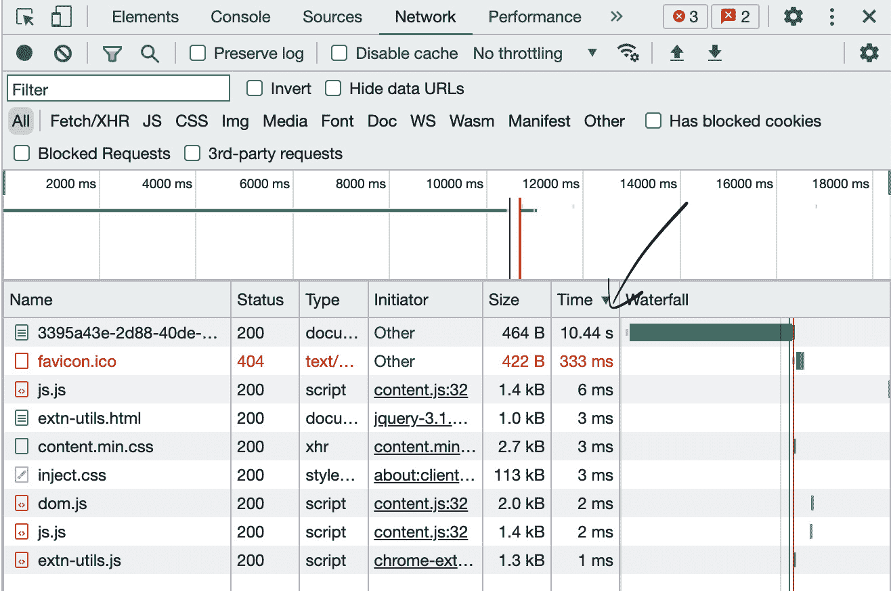
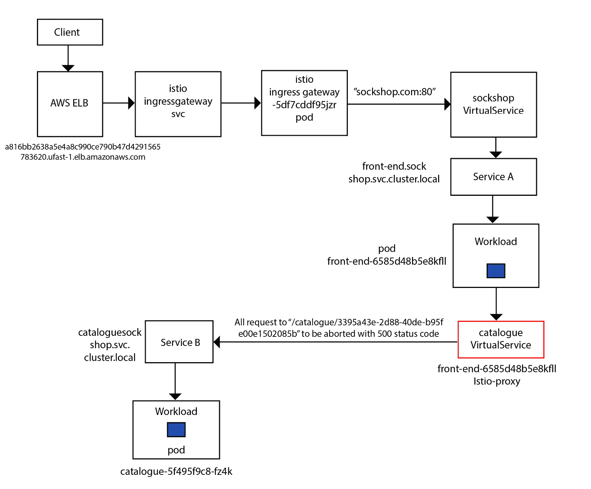
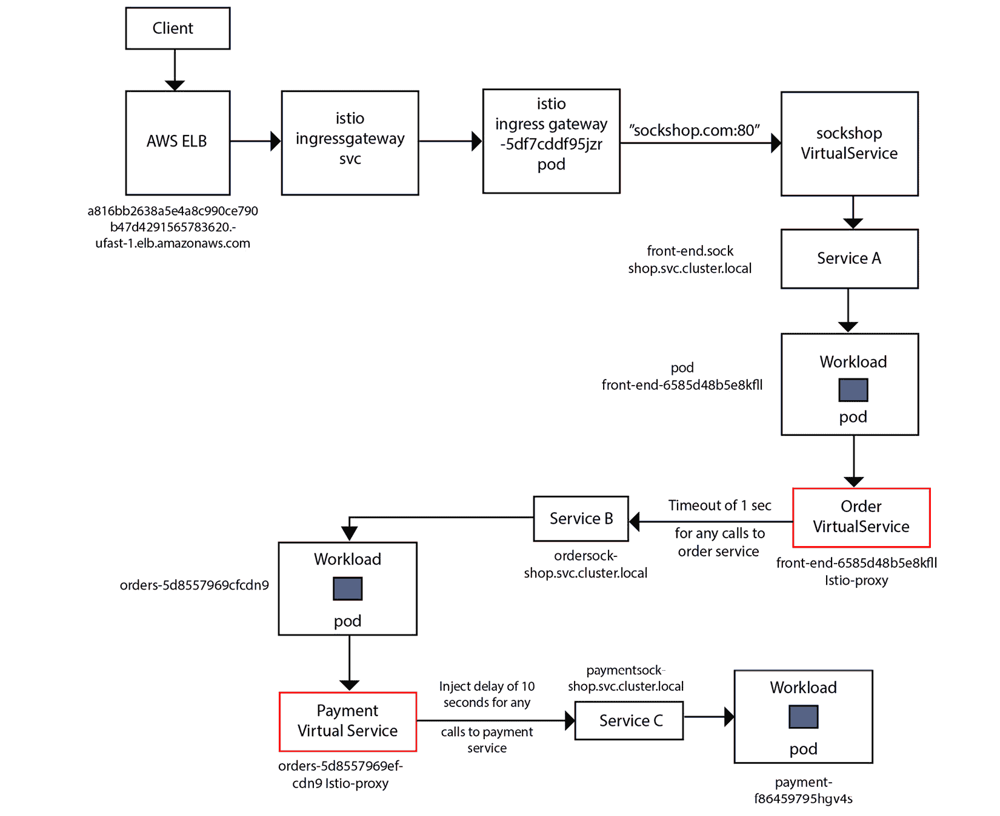

# 第五章：管理应用程序韧性

应用程序的韧性是指软件应用在面对故障和失败时，能够保持不明显的质量和服务水平下降的能力。从单体架构到微服务架构的转变，进一步加剧了软件设计和架构中对应用程序韧性的需求。在单体应用中，只有一个代码库和一个部署，而在基于微服务的架构中，则有多个独立的代码库，每个代码库都有自己的部署。当使用 Kubernetes 和其他类似平台时，还需要考虑部署的灵活性，以及多个应用实例的弹性部署和扩展；这些动态实例不仅需要相互协调，还需要与所有其他微服务协调。

本章将介绍如何利用 Istio 提高微服务的应用程序韧性。在我们深入每个部分时，我们将讨论应用程序韧性的各个方面，以及 Istio 如何解决这些问题。

总之，本章将涵盖以下主题：

+   使用故障注入提高应用程序的韧性

+   使用超时和重试提高应用程序的韧性

+   使用负载均衡构建应用程序的韧性

+   限制请求速率

+   熔断器和异常检测

重要提示

本章的技术先决条件与上一章相同。

# 使用故障注入提高应用程序的韧性

故障注入用于测试应用程序在发生任何类型故障时的恢复能力。从原则上讲，每个微服务都应设计为具备内建的韧性，以应对内部和外部的故障，但实际上，往往并非如此。构建韧性最复杂和困难的工作通常是在设计和测试阶段。

在设计阶段，必须识别所有已知和未知的场景，并为其提供解决方案。例如，必须解决以下问题：

+   在微服务内部和外部，可能发生哪些已知和未知的错误？

+   应用程序代码应如何处理这些错误？

在测试阶段，应该能够模拟这些场景，以验证应用程序代码中构建的应急处理措施：

+   实时模拟其他上游服务的不同故障场景，以测试整体应用程序的行为

+   模拟不仅是应用程序故障，还包括网络故障（如延迟、停机等）以及基础设施故障

混沌工程是一个软件工程术语，用于指引通过在软件系统及其执行和通信环境及生态系统中引入不利条件来测试软件系统的学科。你可以在[`hub.packtpub.com/chaos-engineering-managing-complexity-by-breaking-things/`](https://hub.packtpub.com/chaos-engineering-managing-complexity-by-breaking-things/)了解更多关于混沌工程的内容。生成混沌（即故障）的各种工具大多数是在基础设施级别。一种流行的工具是 Chaos Monkey。它可以在[`netflix.github.io/chaosmonkey/`](https://netflix.github.io/chaosmonkey/)找到。AWS 还提供了 AWS 故障注入模拟器，用于运行故障注入模拟。你可以在[`aws.amazon.com/fis/`](https://aws.amazon.com/fis/)了解关于 AWS 故障注入模拟器的更多信息。另一个流行的开源软件是 Litmus，它是一个混沌工程平台，通过以受控的方式引入混沌测试来识别基础设施中的弱点和潜在的停机。你可以在[`litmuschaos.io/`](https://litmuschaos.io/)了解更多信息。

Istio 提供了细粒度的故障注入控制，因为它能够访问并了解应用程序流量。通过 Istio 故障注入，你可以使用应用层的故障注入；结合像 Chaos Monkey 和 AWS 故障模拟器这样的基础设施级别故障注入工具，提供了非常强大的能力来测试应用程序的韧性。

Istio 支持以下类型的故障注入：

+   HTTP 延迟

+   HTTP 中止

在接下来的章节中，我们将更详细地讨论这两种故障注入类型。

## 什么是 HTTP 延迟？

延迟是时间故障。它们模拟由于网络延迟或上游服务过载而导致的请求周转时间增加。这些延迟是通过 Istio VirtualServices 注入的。

在我们的袜子商店示例中，让我们在前端服务和目录服务之间注入一个 HTTP 延迟，并测试当前端服务无法从目录服务获取图片时，它的表现。我们将专门为一张图片而非所有图片进行此操作。

你可以在 GitHub 上的`Chapter5/02-faultinjection_delay.yaml`文件中找到 VirtualService 定义。



图 5.1 – 目录 VirtualService 中的 HTTP 延迟注入

以下是来自 VirtualService 定义的代码片段：

```
spec:
  hosts:
  - "catalogue.sock-shop.svc.cluster.local"
  gateways:
  - mesh
  http:
  - match:
    - uri:
        prefix: "/catalogue/3395a43e-2d88-40de-b95f-e00e1502085b"
      ignoreUriCase: true
    fault:
      delay:
        percentage:
          value: 100.0
        fixedDelay: 10s
    route:
    - destination:
        host: catalogue.sock-shop.svc.cluster.local
        port:
          number: 80
```

首先需要注意的是`fault`的定义，它用于在将请求转发到路由中指定的目标之前，注入延迟和/或中止故障。在这种情况下，我们正在注入一种`delay`类型的故障，用于模拟慢响应时间。

在`delay`配置中，定义了以下字段：

+   `fixedDelay`：指定延迟的持续时间，值可以是小时、分钟、秒或毫秒，分别由`h`、`m`、`s`或`ms`后缀指定。

+   `percentage`：指定延迟将注入的请求百分比

另外需要注意的是，VirtualService 与 `mesh` 网关关联；你可能已经注意到我们没有为 `mesh` 定义 Ingress 或 Egress 网关。那么，你一定在想这个是从哪里来的，`mesh` 是一个保留字，用来指代网格中的所有 sidecar。这也是网关配置的默认值，因此，如果你没有为网关提供值，VirtualService 默认会与网格中的所有 sidecar 关联。

那么，让我们总结一下我们配置的内容。

`sock-shop` VirtualService 与网格中的所有 sidecar 关联，并且应用于目标为 `catalogue.sock-shop.svc.cluster.local` 的请求。VirtualService 为所有以 `/catalogue/3395a43e-2d88-40de-b95f-e00e1502085b` 为前缀的请求注入了 10 秒的延迟，然后将其转发到 `catalogue.sock-shop.svc.cluster.local` 服务。没有该前缀的请求则直接转发到 `catalogue.sock-shop.svc.cluster.local` 服务。

使用 Istio 注入启用为 `Chapter5` 创建一个命名空间：

```
$ kubectl create ns chapter5
$ kubectl label ns chapter5 istio-injection=enabled
```

使用以下内容为 `sockshop.com` 创建 Ingress 网关和 VirtualService 配置：

```
$ kubectl apply -f Chapter5/01-sockshop-istio-gateway.yaml
```

之后，应用目录服务的 VirtualService 配置：

```
$ kubectl apply -f Chapter5/02-faultinjection_delay.yaml
```

然后，使用 Ingress ELB 和自定义主机头在浏览器中打开 `sockshop.com`。启用开发者工具并搜索以 `/catalogue/3395a43e-2d88-40de-b95f-e00e1502085b` 为前缀的请求。你会注意到这些特定的请求处理时间超过了 10 秒。



图 5.2 – HTTP 延迟导致请求耗时超过 10 秒

你还可以检查注入到 `front-end` Pod 中的 sidecar，以获取此请求的访问日志：

```
% kubectl logs -l name=front-end -c istio-proxy -n sock-shop | grep /catalogue/3395a43e-2d88-40de-b95f-e00e1502085b
[2022-08-27T00:39:09.547Z] "GET /catalogue/3395a43e-2d88-40de-b95f-e00e1502085b HTTP/1.1" 200 DI via_upstream - "-" 0 286 10005 4 "-" "-" "d83fc92e-4781-99ec-91af-c523e55cdbce" "catalogue" "10.10.10.170:80" outbound|80||catalogue.sock-shop.svc.cluster.local 10.10.10.155:59312 172.20.246.13:80 10.10.10.155:40834 - -
```

在前面的代码块中突出显示的是在本实例中处理时耗时 `10005` 毫秒的请求。

在本节中，我们注入了 10 秒的延迟，但你可能也注意到前端网页没有出现明显的延迟。所有图片都异步加载，任何延迟仅限于页面的目录部分。然而，通过配置延迟，你可以测试在网络或目录服务处理过程中出现任何不可预见的延迟时，应用程序的端到端行为。

## 什么是 HTTP 中止？

HTTP 中止是通过 Istio 注入的第二种故障类型。HTTP 中止会提前终止请求的处理；你还可以指定需要返回到下游的错误代码。

以下是 `VirtualService` 定义中的片段，包含为目录服务配置的 `abort` 配置。该配置可在 `Chapter5/03-faultinjection_abort.yaml` 文件中找到：

```
spec:
  hosts:
  - "catalogue.sock-shop.svc.cluster.local"
  gateways:
  - mesh
  http:
  - match:
    - uri:
        prefix: "/catalogue/3395a43e-2d88-40de-b95f-e00e1502085b"
      ignoreUriCase: true
    fault:
      abort:
        httpStatus: 500
        percentage:
          value: 100.0
    route:
    - destination:
        host: catalogue.sock-shop.svc.cluster.local
        port:
          number: 80
```

在 `fault` 下，还有一个名为 `abort` 的配置项，包含以下参数：

+   `httpStatus`：指定需要下游返回的 HTTP 状态码

+   `percentage`：指定需要中止的请求百分比

以下是可以应用于 gRPC 请求的额外配置列表：

+   `grpcStatus`：在中止 gRPC 请求时需要返回的 gRPC 状态码



图 5.3 – 目录 VirtualService 中的 HTTP 中止注入

在 `Chapter5/03-faultinjection_abort.yaml` 文件中，我们为所有来自网格内部的调用配置了一个 VirtualService 规则，要求它们访问 [`catalogue.sock-shop.svc.cluster.local/catalogue/3395a43e-2d88-40de-b95f-e00e1502085b`](http://catalogue.sock-shop.svc.cluster.local/catalogue/3395a43e-2d88-40de-b95f-e00e1502085b) 时会被中止，并返回 HTTP 状态码 `500`。

应用以下配置：

```
$ kubectl apply -f Chapter5/03-faultinjection_abort.yaml
```

当从浏览器加载 `sock-shop.com` 时，你会注意到有一张图片未能加载。查看 `front-end` Pod 的 `istio-proxy` 访问日志，你将看到以下内容：

```
% kubectl logs -l name=front-end -c istio-proxy -n sock-shop | grep /catalogue/3395a43e-2d88-40de-b95f-e00e1502085b
[2022-08-27T00:42:45.260Z] "GET /catalogue/3395a43e-2d88-40de-b95f-e00e1502085b HTTP/1.1" 500 FI fault_filter_abort - "-" 0 18 0 - "-" "-" "b364ca88-cb39-9501-b4bd-fd9ea143fa2e" "catalogue" "-" outbound|80||catalogue.sock-shop.svc.cluster.local - 172.20.246.13:80 10.10.10.155:57762 - -
```

这部分内容结束了故障注入的讲解，现在你已经练习了如何将 `delay` 和 `abort` 注入到服务网格中。

提醒

请清理 `Chapter5/02-faultinjection_delay.yaml` 和 `Chapter5/03-faultinjection_abort.yaml` 文件，以避免与本章节后续练习的冲突。

在本节中，我们了解了如何向服务网格中注入故障，以便测试微服务的弹性，并设计它们以应对由于上游服务通信导致的延迟和故障。在接下来的章节中，我们将了解如何在服务网格中实现超时和重试机制。

# 使用超时和重试机制实现应用的弹性

在多个微服务之间的通信中，许多问题可能会发生，网络和基础设施是导致服务降级和中断的最常见原因。响应过慢的服务可能导致其他服务发生级联故障，并对整个应用产生连锁反应。因此，微服务的设计必须通过设置 **超时** 来应对向其他微服务发送请求时可能发生的意外延迟。

超时是指服务等待其他服务响应的最大时间；超出超时期限，响应对请求方没有意义。一旦发生超时，微服务将按照应急方法进行处理，这可能包括从缓存提供响应或让请求优雅地失败。

有时，问题是短暂的，重新尝试获取响应是有意义的。这个方法称为 **重试**，即微服务可以基于某些条件重试请求。在本节中，我们将讨论如何在不需要修改微服务代码的情况下，使用 Istio 实现服务超时和重试。我们将先从超时开始。

## 超时

超时是 `istio-proxy` sidecar 应等待某个服务回复的时间。超时有助于确保微服务不会无故等待过长时间的回复，并且调用能够在可预测的时间框架内成功或失败。Istio 让你可以轻松地通过 `VirtualServices` 动态调整每个服务的超时设置，而不需要修改服务代码。

作为示例，我们将在 `order` 服务上配置 `1` 秒的超时，并在 `payment` 服务中引入 `10` 秒的延迟。`order` 服务在结账时调用 `payment` 服务，因此我们正在模拟一个缓慢的支付服务，并通过在调用 `order` 服务时配置超时来实现前端服务的弹性：



图 5.4 – 订单超时与支付服务中的延迟故障

我们将首先在 `order` 服务中配置超时，这也是通过 `VirtualService` 实现的。你可以在 GitHub 上的 `Chapter5/04-request-timeouts.yaml` 文件中找到完整的配置：

```
apiVersion: networking.istio.io/v1alpha3
kind: VirtualService
metadata:
  name: orders
  namespace: chapter5
spec:
  hosts:
  - "orders.sock-shop.svc.cluster.local"
  gateways:
  - mesh
  http:
  - timeout: 1s
    route:
    - destination:
        host: orders.sock-shop.svc.cluster.local
        port:
          number: 80
```

在这里，我们创建了一个新的 VirtualService，名为 `orders`，并且为从网格内部发往 `orders.sock-shop.svc.cluster.local` 的任何请求配置了 `1` 秒的超时。该超时是 `http` 路由配置的一部分。

接下来，我们还将在所有请求到 `payment` 服务时注入 `10` 秒的延迟。详情请参见 `Chapter5/04-request-timeouts.yaml` 文件。

继续并应用更改：

```
% kubectl apply -f Chapter5/04-request-timeouts.yaml
```

从 sockshop 网站添加任何商品到购物车并结账。观察在应用本节更改前后的行为。

检查订单 Pod 中 sidecar 的日志：

```
% kubectl logs --follow -l name=orders -c istio-proxy -n sock-shop | grep payment
[2022-08-28T01:24:31.968Z] "POST /paymentAuth HTTP/1.1" 200 - via_upstream - "-" 326 51 2 2 "-" "Java/1.8.0_111-internal" "ce406513-fd29-9dfc-b9cd-cb2b3dbd24a6" "payment" "10.10.10.171:80" outbound|80||payment.sock-shop.svc.cluster.local 10.10.10.229:60984 172.20.93.36:80 10.10.10.229:40816 - -
[2022-08-28T01:25:55.244Z] "POST /paymentAuth HTTP/1.1" 200 DI via_upstream - "-" 326 51 10007 2 "-" "Java/1.8.0_111-internal" "ae00c14e-409c-94b1-8cfb-951a89411246" "payment" "10.10.10.171:80" outbound|80||payment.sock-shop.svc.cluster.local 10.10.10.229:36752 172.20.93.36:80 10.10.10.229:52932 - -
```

请注意，实际请求到 `payment` Pod 的处理时间是 `2` 毫秒，但由于注入了 `delay` 故障，整体耗时为 `10007` 毫秒。

此外，检查 `front-end` Pods 中 `istio-proxy` 的日志：

```
% kubectl logs --follow -l name=front-end -c istio-proxy -n sock-shop | grep orders
[2022-08-28T01:25:55.204Z] "POST /orders HTTP/1.1" 504 UT upstream_response_timeout - "-" 232 24 1004 - "-" "-" "b02ea4a2-b834-95a6-b5be-78db31fabf28" "orders" "10.10.10.229:80" outbound|80||orders.sock-shop.svc.cluster.local 10.10.10.155:49808 172.20.11.100:80 10.10.10.155:55974 - -
[2022-08-28T01:25:55.173Z] "POST /orders HTTP/1.1" 504 - via_upstream - "-" 0 26 1058 1057 "10.10.10.217" "Mozilla/5.0 (Macintosh; Intel Mac OS X 10_15_7) AppleWebKit/537.36 (KHTML, like Gecko) Chrome/104.0.0.0 Safari/537.36" "a8cb6589-4fd1-9b2c-abef-f049cd1f6beb" "sockshop.com" "10.10.10.155:8079" inbound|8079|| 127.0.0.6:36185 10.10.10.155:8079 10.10.10.217:0 outbound_.80_._.front-end.sock-shop.svc.cluster.local default
```

在这里，我们可以看到请求在大约 `1` 秒后返回，并且 HTTP 状态码为 `504`。尽管底层的支付请求在 `10` 秒内处理完毕，但对 `order` 服务的请求在 `1` 秒后超时。

在这种情况下，我们可以看到网站没有优雅地处理错误。它没有返回像“`order` 服务”的友好信息。

提醒

别忘了清理 `Chapter5/04-request-timeouts.yaml` 文件，以避免与后续练习发生冲突。

## 重试

超时是防止延迟蔓延到应用程序其他部分的良好防火墙，但延迟的根本原因有时是暂时性的。在这些情况下，可能需要重试请求至少几次。重试次数和重试间隔取决于延迟的原因，该原因由响应中返回的错误代码确定。

在本节中，我们将学习如何将重试机制注入到服务网格中。为了简化操作，使我们能够专注于学习本节中的概念，我们将利用前一章中创建的 `envoydummy` 服务。Envoy 提供了许多过滤器来模拟各种延迟，我们将利用这些过滤器来模拟应用程序故障。

首先，配置 `envoydummy` 服务：

```
$ kubectl create ns utilities
$ kubectl label ns utilities istio-injection=enabled
```

然后部署 `envoy` 服务和 Pods：

```
$ kubectl apply -f Chapter5/envoy-proxy-01.yaml
```

然后，我们部署网关和 VirtualService：

```
$ kubectl apply -f Chapter5/mockshop-ingress_01.yaml
```

测试服务，查看它是否正常工作。

之后，我们将配置 `envoy` 配置文件来中止一半的调用，并返回错误代码 `503`。注意 Istio 配置和 `envoy` 配置之间的相似性。

配置 `envoydummy` 以中止一半的 API 调用：

```
  http_filters:
              - name: envoy.filters.http.fault
                typed_config:
                  "@type": type.googleapis.com/envoy.extensions.filters.http.fault.v3.HTTPFault
                  abort:
                    http_status: 503
                    percentage:
                      numerator: 50
                      denominator: HUNDRED
```

完整的文件可以在 `Chapter5/envoy-proxy-02-abort-02.yaml` 中找到。

应用更改：

```
$ kubectl apply -f Chapter5/envoy-proxy-02-abort-02.yaml
```

进行几次测试后，你会注意到 API 调用正常工作，尽管我们已将`envoydummy`配置为使一半的调用失败。这是因为 Istio 已经启用了默认的重试机制。尽管请求被`envoydummy`中止，但 sidecar 会默认重试两次，最终得到成功的响应。重试之间的间隔（超过 25 毫秒）是可变的，由 Istio 自动确定，从而防止被调用的服务被过多请求压垮。这得益于 sidecar 中的 Envoy 代理，它使用完全抖动的指数回退算法进行重试，并提供可配置的基础间隔，默认值为 25 毫秒。如果基础间隔为 C，N 为重试次数，则重试的回退范围为 0, (2^N−1)C)。例如，间隔为 25 毫秒，重试次数为 2 时，第一个重试会随机延迟 0-24 毫秒，第二个重试会延迟 0-74 毫秒。

要禁用 `retries`，请在 `mockshop` VirtualService 中进行以下更改：

```
  http:
  - match:
    - uri:
        prefix: /
    route:
    - destination:
        port:
          number: 80
        host: envoydummy.utilities.svc.cluster.local
    retries:
      attempts: 0
```

在这里，我们已将 `retries` 的次数配置为 `0`。应用更改后，你会注意到一半的 API 调用返回 `503`。

我们将按照下图所示进行更改：

![图 5.5 – 请求重试

图 5.5 – 请求重试

对 `retry` 块进行以下更改。你可以在 `Chapter5/05-request-retry.yaml` 中找到完整配置：

```
    retries:
      attempts: 2
      perTryTimeout: 2s
      retryOn: 5xx,gateway-error,reset,connect-failure,refused-stream,retriable-4xx
```

在 `retry` 块中，我们定义了以下配置：

+   `attempts`: 给定请求的重试次数

+   `perTryTimeout`: 每次尝试的超时时间

+   `retryOn`: 请求应重试的条件

应用配置后，你会注意到请求按预期正常工作：

```
$ kubectl apply -f  Chapter5/05-request-retry.yaml
```

提醒

请清理`Chapter5/05-request-retry.yaml`以避免与后续练习发生冲突。

本节到此结束，你已经学会了如何设置服务网格中的超时和重试机制，以提高应用程序的韧性。在下一节中，我们将探索不同的负载均衡策略。

# 使用负载均衡构建应用程序的韧性

负载均衡是提高应用程序韧性的另一种技术。Istio 的负载均衡策略通过有效地将网络流量分配到微服务或底层服务，帮助你最大化应用程序的可用性。负载均衡使用目标规则，目标规则定义了在路由完成后，服务如何处理流量的策略。

在前一章中，我们使用了目标规则进行流量管理。在本节中，我们将介绍 Istio 提供的各种负载均衡策略，以及如何使用目标规则进行配置。

部署另一个`envoydummy` Pod，但这次添加一个标签`version:v2`，输出为`V2----------Bootstrap Service Mesh Implementation with Istio----------V2`。配置文件可在`Chapter5/envoy-proxy-02.yaml`中找到：

```
$ kubectl apply -f Chapter5/envoy-proxy-02.yaml
```

Istio 支持以下负载均衡策略。

## 循环轮询

循环轮询是最简单的负载分配方式之一，请求会依次转发到底层后端服务。虽然易于使用，但它们不一定能导致最有效的流量分配，因为在轮询负载均衡中，每个上游都被视为相同的流量类型，具有相同的性能，并且承受类似的环境约束。

在`Chapter5/06-loadbalancing-roundrobbin.yaml`中，我们已经创建了如下的目标规则，`trafficPolicy`如下：

```
apiVersion: networking.istio.io/v1alpha3
kind: DestinationRule
metadata:
  name: envoydummy
spec:
  host: envoydummy
  trafficPolicy:
       loadBalancer:
         simple: ROUND_ROBIN
```

在`DestinationRule`中，你可以定义多个参数，我们将在本节及后续章节中逐一揭示。

对于轮询负载均衡，我们在`trafficPolicy`中定义了如下的目标规则：

+   `simple`：定义要使用的负载均衡算法—可能的值如下：

    +   `UNSPECIFIED`：Istio 将选择一个合适的默认值

    +   `RANDOM`：Istio 将随机选择一个健康的主机。

    +   `PASSTHROUGH`：此选项允许客户端请求特定的上游，并且负载均衡策略将把请求转发到请求的上游。

    +   `ROUND_ROBIN`：Istio 将按轮询方式向上游服务发送请求。

    +   `LEAST_REQUEST`：此策略根据每个端点上未处理的请求数量来分配负载。该策略是所有负载均衡策略中效率最高的。

使用以下命令应用配置：

```
$ kubectl apply -f Chapter5/06-loadbalancing-roundrobbin.yaml
```

测试端点后，你会注意到从`envoydummy`的两个版本接收到了相等数量的响应。

## RANDOM

使用`RANDOM`负载均衡策略时，Istio 会随机选择一个目标主机。你可以在`Chapter5/07-loadbalancing-random.yaml`文件中找到`RANDOM`负载均衡策略的示例。以下是使用`RANDOM`负载均衡策略的目标规则：

```
apiVersion: networking.istio.io/v1alpha3
kind: DestinationRule
metadata:
  name: envoydummy
spec:
  host: envoydummy
  trafficPolicy:
       loadBalancer:
         simple: RANDOM
```

应用配置：

```
$ kubectl apply -f Chapter5/07-loadbalancing-random.yaml
```

向端点发送几个请求，你会发现响应没有任何可预测的模式。

## LEAST_REQUEST

如前所述，在`LEAST_REQUEST`负载均衡策略中，Istio 会将未完成请求最少的流量引导到上游。

为了模拟这种情况，我们将创建另一个服务，专门将所有请求发送到`envoydummy`版本 2 Pod。配置文件可以在`Chapter5/08-loadbalancing-leastrequest.yaml`找到：

```
apiVersion: v1
kind: Service
metadata:
  name: envoydummy2
  labels:
    name: envoydummy2
    service: envoydummy2
  namespace: chapter5
spec:
  ports:
    # the port that this service should serve on
  - port: 80
    targetPort: 10000
  selector:
    name: envoydummy
```

我们还修改了`DestinationRule`，将请求发送到活动连接最少的主机：

```
  trafficPolicy:
       loadBalancer:
         simple: LEAST_REQUEST
    version: v2
```

应用配置：

```
$ kubectl apply -f Chapter5/08-loadbalancing-leastrequest.yaml
```

使用`kubectl port-forward`，我们可以从`localhost`向`envoydummy2`服务发送请求：

```
$ kubectl port-forward svc/envoydummy2 10000:80 -n utilities
```

之后，我们将使用以下命令生成一个目标为`envoydummy`版本 2 服务的请求：

```
$ for ((i=1;i<1000000000;i++)); do curl -v "http://localhost:10000"; done
```

当负载处理进行时，通过`mockshop`端点访问请求，你会发现大多数（如果不是所有）请求都是由`envoydummy` Pods 的版本 1 提供服务，因为使用了`LEAST_REQUEST`负载均衡策略：

```
$ curl -Hhost:mockshop.com http://a816bb2638a5e4a8c990ce790b47d429-1565783620.us-east-1.elb.amazonaws.com/
V1----------Bootstrap Service Mesh Implementation with Istio----------V1
V1----------Bootstrap Service Mesh Implementation with Istio----------V1
V1----------Bootstrap Service Mesh Implementation with Istio----------V1
V1----------Bootstrap Service Mesh Implementation with Istio----------V1
```

在前面的示例中，你看到了 Istio 如何将所有对`mockshop`的请求引导到`envoydummy`版本 1，因为`v1`的活动连接最少。

## 定义多个负载均衡规则

Istio 提供了为每个子集应用多个负载均衡规则的功能。在`Chapter5/09-loadbalancing-multirules.yaml`文件中，我们定义了默认的负载均衡策略为`ROUND_ROBIN`，为`v1`子集定义了`LEAST_REQUEST`策略，为`v2`子集定义了`RANDOM`策略。

以下是从`Chapter5/09-loadbalancing-multirules.yaml`配置文件中提取的配置片段：

```
  host: envoydummy
  trafficPolicy:
       loadBalancer:
         simple: ROUND_ROBIN
  subsets:
  - name: v1
    labels:
      version: v1
    trafficPolicy:
      loadBalancer:
        simple: LEAST_REQUEST
  - name: v2
    labels:
      version: v2
    trafficPolicy:
      loadBalancer:
        simple: RANDOM
```

在前面的代码块中，我们为`v1`子集应用了`LEAST_REQUEST`负载均衡策略，为`v2`子集应用了`RANDOM`负载均衡策略，而对代码块中未指定的其他子集应用了`ROUND_ROBIN`策略。

能够为工作负载定义多个负载均衡规则，允许你在目标规则子集的级别上进行精细的流量分配控制。在下一节中，我们将介绍另一个关于应用程序弹性的重要方面——**限流**，以及它如何在 Istio 中实现。

# 限流

另一个重要的应用程序弹性技术是限流和断路器。限流有助于提供以下控制，来处理来自消费者的流量而不至于崩溃提供者系统：

+   激增保护，防止系统因流量的突然激增而被超载

+   将传入请求的速率与可用的处理请求的能力对齐

+   保护慢速提供者免受快速消费者的影响

速率限制通过配置目标规则与连接池来执行，以连接到上游服务。连接池设置可以应用于 TCP 层以及 HTTP 层，如在`Chapter5/10-connection-pooling.yaml`中的以下配置所示：

```
apiVersion: networking.istio.io/v1alpha3
kind: DestinationRule
metadata:
  name: envoydummy
  namespace: chapter5
spec:
  host: envoydummy
  trafficPolicy:
      connectionPool:
        http:
          http2MaxRequests: 1
          maxRequestsPerConnection: 1
          http1MaxPendingRequests: 0
```

以下是连接池配置的关键属性：

+   `http2MaxRequests`：每个目的地的最大活跃请求数；默认值为`1024`。

+   `maxRequestsPerConnection`：每个连接到上游的最大请求数。值为`1`时禁用保持连接，而`0`表示无限制。

+   `http1MaxPendingRequests`：在等待来自连接池的连接时，将排队的最大请求数；默认值为`1024`。

我们已经配置了每个连接最多`1`个请求到上游，在任何时刻最多`1`个活跃连接，并且不允许连接请求排队。

测试速率限制、熔断器和异常值检测并不像测试应用程序弹性功能的其他特性那样直接。幸运的是，有一个非常方便的负载测试工具叫做`fortio`，它可以在[`github.com/fortio/fortio`](https://github.com/fortio/fortio)找到，并且已经打包在 Istio 示例目录中。我们将使用`fortio`来生成负载并测试速率限制。

从 Istio 目录部署`fortio`：

```
$ kubectl apply -f samples/httpbin/sample-client/fortio-deploy.yaml -n utilities
```

应用其中一种负载均衡策略以测试正常行为：

```
$ kubectl apply -f Chapter5/06-loadbalancing-roundrobbin.yaml
```

使用`fortio`生成负载：

```
$ kubectl exec -it fortio-deploy-7dcd84c469-xpggh -n utilities -c fortio -- /usr/bin/fortio load -qps 0 -c 2 -t 1s -H "Host:mockshop.com" http://a816bb2638a5e4a8c990ce790b47d429-1565783620.us-east-1.elb.amazonaws.com/
```

在之前的请求中，我们配置了`fortio`以生成一个`1`秒的负载测试，使用`2`个并行连接，最大查询每秒（`qps`）为`0`，意味着没有等待/最大`qps`速率。

在输出中，你会注意到所有请求都成功处理了：

```
Code 200 : 486 (100.0 %)
Response Header Sizes: count 486 avg 151.01235 +/- 0.1104 min 151 max 152 sum 73392
Response Body/Total Sizes : count 486 avg 223.01235 +/- 0.1104 min 223 max 224 sum 108384
All done 486 calls (plus 2 warmup) 4.120 ms avg, 484.8 qps
```

在这种情况下，共进行了`486 次调用`，成功率为 100%。接下来，我们将应用更改以强制执行速率限制：

```
$ kubectl apply -f Chapter5/10-connection-pooling.yaml
```

使用`1`个连接重新运行测试：

```
kubectl exec -it fortio-deploy-7dcd84c469-xpggh -n utilities -c fortio -- /usr/bin/fortio load -qps 0 -c 1 -t 1s -H "Host:mockshop.com" http://a816bb2638a5e4a8c990ce790b47d429-1565783620.us-east-1.elb.amazonaws.com/
Code 200 : 175 (100.0 %)
Response Header Sizes : count 175 avg 151.01143 +/- 0.1063 min 151 max 152 sum 26427
Response Body/Total Sizes : count 175 avg 223.01143 +/- 0.1063 min 223 max 224 sum 39027
All done 175 calls (plus 1 warmup) 5.744 ms avg, 174.0 qps
```

再次运行测试，这次使用两个连接：

```
Code 200 : 193 (66.6 %)
Code 503 : 97 (33.4 %)
Response Header Sizes : count 290 avg 100.55517 +/- 71.29 min 0 max 152 sum 29161
Response Body/Total Sizes : count 290 avg 240.45517 +/- 24.49 min 223 max 275 sum 69732
All done 290 calls (plus 2 warmup) 6.915 ms avg, 288.8 qps
```

你会看到，`33.4%`的调用因 503 错误代码失败，因为目标规则强制执行了速率限制规则。

在本节中，你看到了一种速率限制的示例，速率限制在某种程度上也是基于速率限制条件的熔断。在下一节中，我们将学习如何通过检测异常值来进行熔断。

# 熔断器和异常值检测

在本节中，我们将讨论异常值检测和熔断器模式。**熔断器**是一种设计模式，它持续监控上游系统的响应处理行为，当行为不可接受时，停止向上游发送任何进一步的请求，直到该行为恢复到可接受状态。

例如，您可以监控上游系统的平均响应时间，当其超过某个阈值时，您可以决定停止向该系统发送更多请求；这就叫做触发断路器。一旦断路器被触发，您可以保持这一状态一段时间，以便上游服务自我修复。在断路器持续时间过去后，您可以重置断路器，让流量重新通过。

当断路器负责流量控制时，**异常检测**是一组策略，用于识别何时触发断路器。

我们将配置一个`envoy` Pod，随机返回一个`503`错误。我们将重用`Chapter5/envoy-proxy-02-abort-02.yaml`，在其中我们配置了一个版本的`envoydummy`，以 50%的概率返回`503`错误。

为避免混淆，请删除`utilities`命名空间中所有之前部署的`envoydummy`以及在此部分之前执行的任何 Istio 配置。

按照以下顺序执行：

```
Kubectl apply -f Chapter5/envoy-proxy-02.yaml
Kubectl apply -f Chapter5/envoy-proxy-02-abort-02.yaml
```

此时，我们有两个`envoydummy` Pods。对于标记为`version:v1`的 Pod，返回`V1----------Bootstrap Service Mesh Implementation with Istio----------V1`，我们已将其修改为中止 50%的请求并返回`503`。

执行以下命令来禁用 Istio 的默认自动重试：

```
$ kubectl apply -f Chapter5/11-request-retry-disabled.yaml
```

测试请求，你会发现响应是`v1`、`v2`和`503`的混合结果。

现在，任务是定义一个异常检测策略，将`v1`识别为异常，因为它返回了一个`503`错误码。我们将通过目标规则来实现这一点，如下所示：

```
apiVersion: networking.istio.io/v1alpha3
kind: DestinationRule
metadata:
  name: envoydummy
  namespace: utilities
spec:
  host: envoydummy.utilities.svc.cluster.local
  trafficPolicy:
      connectionPool:
        http:
          http2MaxRequests: 2
          maxRequestsPerConnection: 1
          http1MaxPendingRequests: 0
      outlierDetection:
        baseEjectionTime: 5m
        consecutive5xxErrors: 1
        interval: 1s
        maxEjectionPercent: 100
```

在`outlierDetection`中，提供了以下参数：

+   `baseEjectionTime`：每次弹出的最小弹出持续时间，然后根据发现上游不健康的次数进行乘法计算。例如，如果某个主机被判定为异常五次，那么它将在连接池中被弹出`baseEjectionTime*5`。

+   `consecutive5xxErrors`：需要发生的 5xx 错误次数，以判定上游为异常。

+   `interval`：Istio 扫描上游健康状态的检查间隔时间。间隔时间可以以小时、分钟或秒为单位。

+   `maxEjectionPercent`：连接池中可以被弹出的最大主机数。

在目标规则中，我们配置了 Istio 以 1 秒的间隔扫描上游。如果连续返回 1 次或更多的 5xx 错误，则该上游将在 5 分钟内从连接池中弹出，如果需要，所有主机都可以从连接池中弹出。

也可以为异常检测定义以下参数，但我们在本例中未使用它们：

+   `splitExternalLocalOriginErrors`：此标志告诉 Istio 是否应考虑本地服务的行为来判断上游服务是否为异常节点。例如，可能会返回 `404`，这是一个有效响应，但如果返回过于频繁，也可能意味着存在问题。也许上游服务出现了错误，但由于错误处理不当，导致上游返回 `404`，这进而使下游服务返回 5XX 错误。总之，此标志使异常检测不仅基于上游返回的响应代码，还基于下游系统如何感知这些响应。

+   `consecutiveLocalOriginFailures`：这是在上游服务从连接池中被驱逐之前，发生的连续本地错误次数。

+   `consecutiveGatewayErrors`：这是在上游服务被驱逐之前，发生的网关错误次数。通常由网关与上游服务之间的连接不健康或配置错误引起。当通过 HTTP 访问上游主机时，由于网关和上游服务之间的通信问题，通常会返回 HTTP 状态码 `502`、`503` 或 `504`。

+   `minHealthPercent`：此字段定义了启用异常检测所需的负载均衡池中可用的最小健康上游系统数量。一旦健康上游系统的数量低于此阈值，异常检测将被禁用，以保持服务可用性。

`Chapter5/12-outlier-detection.yaml` 中定义的配置使我们能够快速观察异常检测的效果，但在非实验场景下部署时，需要根据弹性要求调整和配置相应的值。

应用更新后的目标规则：

```
$ kubectl apply -f  Chapter5/12-outlier-detection.yaml
```

在应用更改后，测试请求几次。你会注意到，除了少数响应包含 `V1----------Bootstrap Service Mesh Implementation with Istio----------V1`，大部分响应包含 `V2----------Bootstrap Service Mesh Implementation with Istio----------V2`，这是因为 Istio 检测到 `v1` Pod 返回了 `503` 错误，并将其标记为连接池中的异常节点。

# 总结

在本章中，我们学习了 Istio 如何通过提供注入延迟和故障的选项来实现应用程序的弹性和测试。故障注入有助于验证当底层服务、网络和基础设施出现意外故障时，应用程序的弹性。在故障注入之后，我们学习了请求超时以及它们如何改善应用程序的弹性。对于瞬时故障，在放弃请求之前进行几次重试可能是一个明智的选择，因此，我们实践了配置 Istio 进行服务重试。故障注入、超时和重试是 VirtualServices 的属性，它们在将请求路由到上游服务之前执行。

在本章的第二部分，我们阅读了各种负载均衡策略，以及如何根据上游服务的动态行为配置负载均衡策略。负载均衡有助于将流量分配到上游服务，`LEAST_REQUEST`策略是最有效的流量分配策略，它基于任何时刻上游服务处理的请求数量进行流量分配。负载均衡在目标规则中配置，因为它是请求路由到上游服务的一部分。在负载均衡之后，我们阅读了速率限制以及它如何基于目标规则中的连接池配置。在本章的最后部分，我们阅读了如何配置目标规则来实现异常检测。

本章中我们阅读的最显著的内容是能够通过超时、重试、负载均衡、断路器和异常检测等方式实现应用程序的弹性，而无需更改应用程序代码。应用程序只需成为服务网格的一部分，就能从这些弹性策略中受益。软件工程师使用各种类型的软件和工具来执行混沌工程，以了解在遭遇故障时应用程序的弹性。你可以使用这些混沌工程工具来测试服务网格提供的应用程序弹性。

下一章非常激动人心且紧张，因为我们将阅读如何利用 Istio 为运行在网格中的应用程序实现坚如磐石的安全性。
