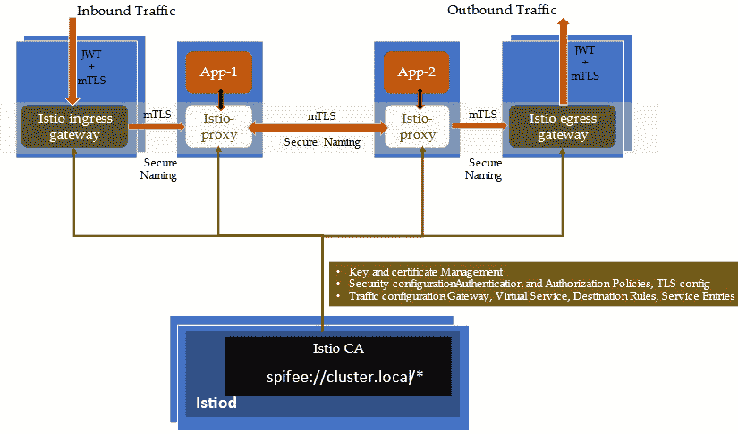
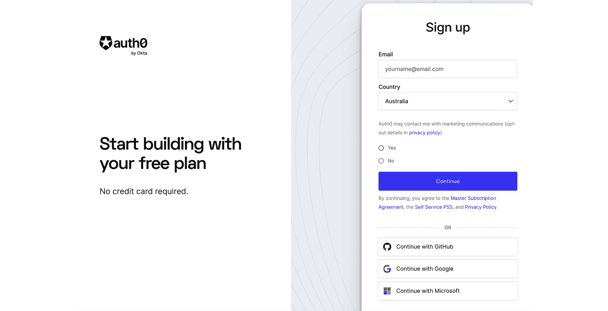
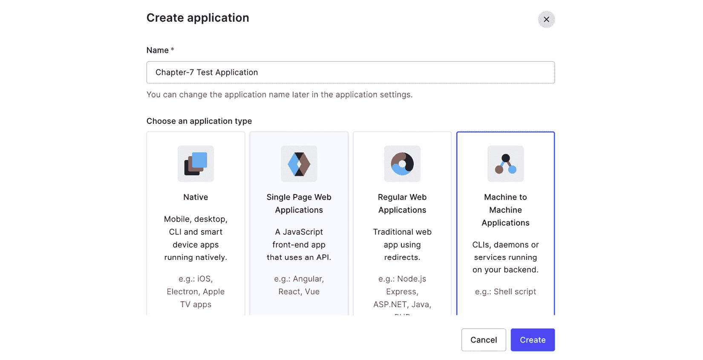
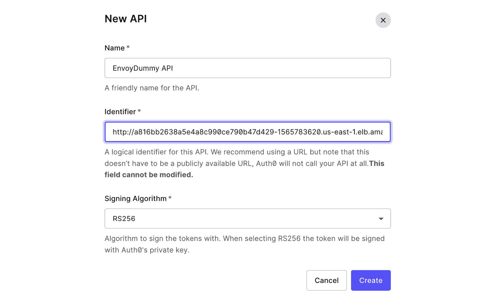
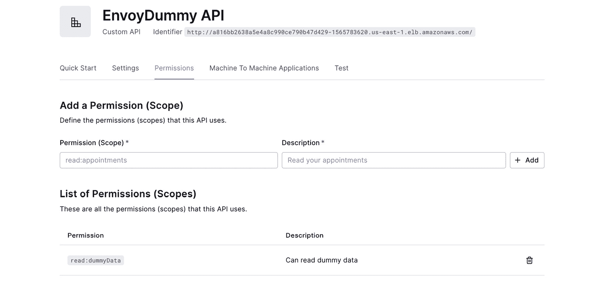
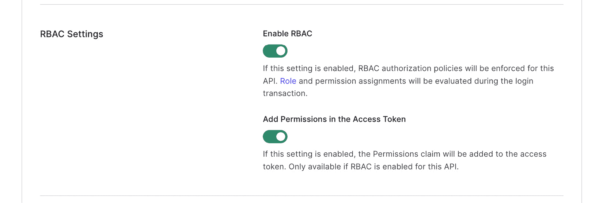
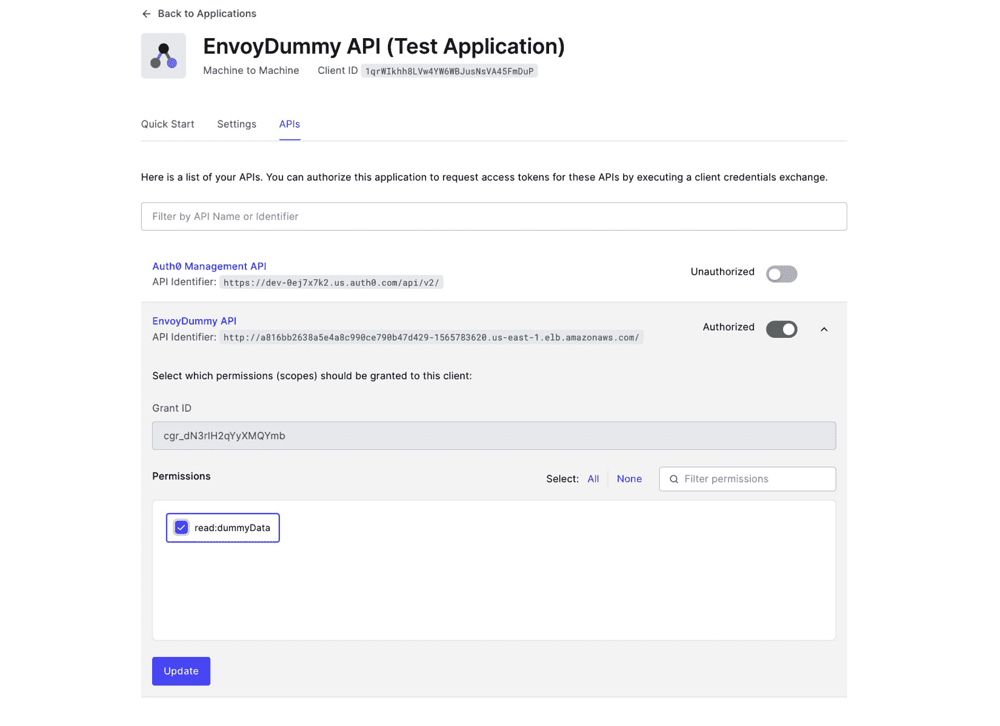
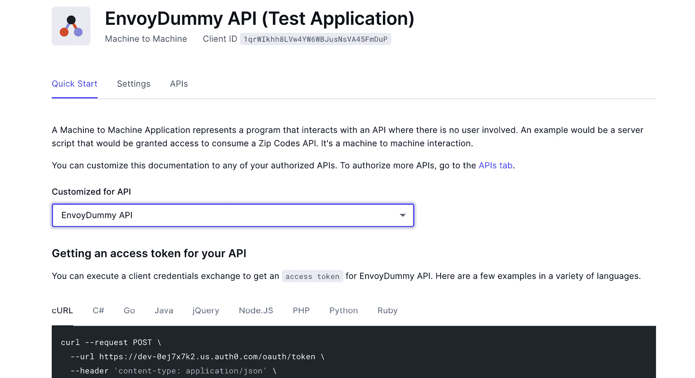
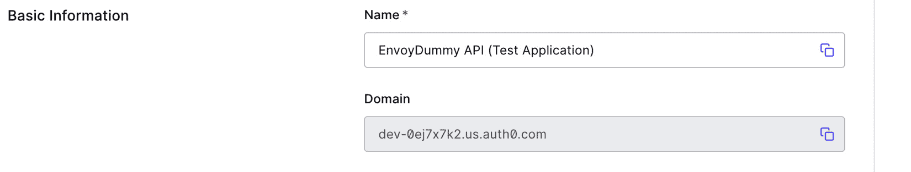

# 6

# 微服务通信的安全性

Istio 可以在微服务之间保障通信安全，而无需对微服务进行任何代码修改。在*第四章*中，我们简要介绍了安全性的话题。我们通过将我们的 sockshop 应用暴露为 HTTPS 来配置传输层安全性。我们创建了证书，并配置 Istio Ingress 网关将这些证书绑定到主机名，采用 SIMPLE TLS 模式。我们还为由单个 Ingress 网关管理的多个主机实现了基于 TLS 的安全性。

本章将深入探讨一些安全方面的高级主题。我们将首先了解 Istio 安全架构，然后实现服务与网格内其他服务之间的互相 TLS 认证，并实现与网格外下游客户端的互相 TLS 认证。接着，我们将进行各种实践操作，创建自定义安全策略用于身份验证和授权。我们将按以下顺序进行这些主题的讲解：

+   Istio 安全架构

+   使用互相 TLS 认证

+   如何配置自定义的身份验证和授权策略

重要提示

本章的技术前提与*第四章*和*第五章*相同。

# 理解 Istio 安全架构

在*第三章*中，我们讨论了 Istio 控制平面如何负责注入 sidecar 并建立信任，使得 sidecar 可以安全地与控制平面通信，同时安全策略最终由 sidecar 强制执行。Istio 在 Kubernetes 中的部署依赖 Kubernetes 服务账户来识别服务网格中工作负载的角色。Istio CA 监视 Kubernetes API 服务器，监听启用 Istio 注入的命名空间中任何服务账户的添加、删除或修改。它为每个服务账户创建密钥和证书，并在 Pod 创建时将证书和密钥挂载到 sidecar 上。Istio CA 负责管理分发到 sidecar 上证书的生命周期，包括私钥的轮换和管理。通过使用**面向所有人的安全生产身份框架**（**SPIFFE**）格式身份，Istio 为每个服务提供强大的身份及服务命名，表示分配给该服务的身份所能扮演的角色。

SPIFFE 是一套针对软件身份的开源标准。SPIFFE 提供与平台无关的可互操作软件身份，并提供获取和验证加密身份所需的接口和文档，实现完全自动化的身份管理。

在 Istio 中，每个工作负载都会自动分配一个身份，表示为 X.509 证书格式。如*第三章*中所述，**证书签名请求**（**CSR**）的创建和签署由 Istio 控制平面管理。X.509 证书遵循 SPIFFE 格式。

让我们重新部署 `envoydummy` 服务并检查 `envoydummy` Pods：

```
$ kubectl apply -f Chapter6/01-envoy-dummy.yaml
$ istioctl proxy-config all po/envoydummy-2-7488b58cd7-m5vpv -n utilities -o json | jq -r '.. |."secret"?' | jq -r 'select(.name == "default")' | jq -r '.tls_certificate.certificate_chain.inline_bytes' | base64 -d - | step certificate inspect  --short
X.509v3 TLS Certificate (RSA 2048) [Serial: 3062...1679]
  Subject:     spiffe://cluster.local/ns/utilities/sa/default
  Issuer:
  Valid from:  2022-09-11T22:18:13Z
          to:  2022-09-12T22:20:13Z
```

步骤 CLI

你需要安装 `CLI` 步骤工具才能运行前面的命令。要安装它，请参考[`smallstep.com/docs/step-cli`](https://smallstep.com/docs/step-cli)中的文档。

在前面命令的输出中，你会注意到 `spiffe://cluster.local/ns/utilities/sa/default`。这是 SPIFFE ID，作为唯一标识符：

+   `spiffe` 是 URI 协议

+   `cluster.local` 是信任域

+   `/ns/utilities/sa/default` 是标识与工作负载关联的服务账户的 URI：

    +   `ns` 代表命名空间

    +   `sa` 代表服务账户

服务账户的默认值来自于与工作负载关联的服务账户。在我们的 `envoydummy` 示例中，我们没有关联任何服务账户，因此，默认情况下，Kubernetes 关联了 `default` 服务账户。你可以使用以下命令找到与 Pod 关联的服务账户名称：

```
kubectl get po/envoydummy-2-7488b58cd7-m5vpv -n utilities -o json | jq .spec.serviceAccountName
"default"
```

你会注意到，`default` 是与所有命名空间中的所有 Pod 关联的默认服务账户名称，例如 `sock-shop`、`utilities` 等。Kubernetes 会在每个命名空间中创建一个名为 `default` 的服务账户：

```
% kubectl get sa -n utilities
NAME      SECRETS   AGE
default   1         13d
% kubectl get sa -n sock-shop
NAME      SECRETS   AGE
default   1         27d
```

Kubernetes 服务账户

服务账户是 Kubernetes 中分配给工作负载的身份。当工作负载内运行的进程尝试访问其他 Kubernetes 资源时，它们会根据其服务账户的详细信息进行身份验证和认证。你可以在[`kubernetes.io/docs/tasks/configure-pod-container/configure-service-account/`](https://kubernetes.io/docs/tasks/configure-pod-container/configure-service-account/)中找到有关服务账户的更多详细信息。

安全命名是一种技术，它将服务的名称与服务运行的身份解耦。在前面的示例中，`spiffe://cluster.local/ns/utilities/sa/default` 是服务在 mutual TLS 中由 `envoydummy-2-7488b58cd7-m5vpv` 工作负载中的 istio-proxy sidecar 提供的身份。从 SPIFFE ID 中，MTLS 会话中的另一方（另一个 Pod 中的 istio-proxy）可以验证该端点是否具有名为 `default` 的服务账户身份，并且该服务账户位于 `utilities` 命名空间中。Istio 控制平面将安全命名信息传播到网格中的所有 sidecar 容器，在 mutual TLS 过程中，sidecar 容器不仅验证身份是否正确，还验证相应的服务是否采用了正确的身份。

以下图表总结了 Istio 的安全架构：



图 6.1 – Istio 安全架构

这些是需要记住的关键概念：

+   Istio CA 管理密钥和证书，并且证书中的 SANs 采用 SPIFFE 格式

+   Istiod 将认证和授权安全策略分发到网格中的所有 sidecar 容器

+   Sidecar 容器根据 Istiod 分发的安全策略强制执行认证和授权

提醒

请确保清理 `Chapter6/01-envoy-dummy.yaml` 文件，以避免后续练习中的冲突。

在接下来的部分中，我们将学习如何在服务网格中保护微服务之间的传输数据。

# 使用双向 TLS 进行身份验证

**双向 TLS** (**mTLS**) 是一种在网络连接两端验证双方身份的技术。通过 mTLS，双方可以验证对方是否如其所声明的那样。证书颁发机构在 mTLS 中扮演着关键角色，因此我们在前一部分中介绍了 Istio 安全架构，讲解了证书颁发机构和 Istio 中的安全命名。

mTLS 是实现零信任安全框架中最常用的身份验证机制之一，其中任何一方默认都不信任另一方，无论该方在网络中的位置如何。零信任假设没有传统的网络边界，因此每一方都需要进行身份验证和授权。这有助于消除基于假设信任模型所带来的许多安全漏洞。

在接下来的两个小节中，我们将了解 Istio 如何帮助你实现服务到服务的 mTLS 身份验证，也就是在网格内的东西-东西流量，以及在网格外的客户端/下游系统与网格内的服务之间的 mTLS，即南北向通信。

## 服务到服务的身份验证

Istio 通过使用 mTLS 进行传输认证来提供服务到服务的身份验证。在流量处理过程中，Istio 执行以下操作：

+   所有来自 Pods 的外发流量都将被重新路由到 istio-proxy。

+   istio-proxy 与服务器端 istio-proxy 发起 mTLS 握手。在握手过程中，它还会进行安全命名检查，以验证服务器证书中呈现的服务账户是否可以运行该 Pod。

+   服务器端的 istio-proxy 以相同的方式验证客户端的 istio-proxy，如果一切正常，则在两个代理之间建立安全通道。

Istio 在实现 mTLS 时提供以下两种选项：

+   **宽松模式**：在宽松模式下，Istio 允许 mTLS 和非 mTLS 模式的流量。此功能主要是为了改善客户端向 mTLS 过渡的过程。尚未准备好通过 mTLS 进行通信的客户端可以继续通过 TLS 进行通信，预计它们最终会在准备好时迁移到 mTLS。

+   **严格模式**：在严格模式下，Istio 强制执行严格的 mTLS，任何非 mTLS 流量都不被允许。

双向 TLS 流量可以在尝试访问网格内工作负载的网格外客户端与尝试访问网格内其他工作负载的网格内客户端之间建立。对于前者，我们将在下一部分中讨论详细信息。对于后者，我们将在本部分中通过一些示例进行讲解。

让我们使用 mTLS 设置服务到服务的通信：

1.  创建一个名为`chapter6`的命名空间，并启用 Istio 注入，然后部署`httpbin`服务：

    ```
    $ kubectl apply -f Chapter6/01-httpbin-deployment.yaml
    ```

这个部署中的大部分配置都是常规配置，唯一不同的是我们在`Chapter6`命名空间中创建了一个名为`httpbin`的默认 Kubernetes 服务账户：

```
apiVersion: v1
kind: ServiceAccount
metadata:
  name: httpbin
  namespace: chapter6
```

然后按照以下规范将`httpbin`身份分配给`httpbin` Pod：

```
  Spec:
      serviceAccountName: httpbin
      containers:
      - image: docker.io/kennethreitz/httpbin
        imagePullPolicy: IfNotPresent
        name: httpbin
        ports:
        - containerPort: 80
```

1.  接下来，我们将创建一个以`curl` Pod 形式的客户端来访问`httpbin`服务。创建一个禁用 Istio 注入的`utilities`命名空间，并创建一个带有自己服务账户的`curl` Deployment：

    ```
    $ kubectl apply -f Chapter6/01-curl-deployment.yaml
    ```

确保没有应用`istio-injection`标签。如果有，可以使用以下命令将其移除：

```
$ kubectl label ns utilities istio-injection-
```

1.  从`curl` Pod，尝试访问`httpbin` Pod，应该能收到响应：

    ```
    $ kubectl exec -it curl -n utilities – curl -v http://httpbin.chapter6.svc.cluster.local:8000/get
    {
      "args": {},
      "headers": {
        "Accept": "*/*",
        "Host": "httpbin.chapter6.svc.cluster.local:8000",
        "User-Agent": "curl/7.87.0-DEV",
        "X-B3-Sampled": "1",
        "X-B3-Spanid": "a00a50536c3ec2f5",
        "X-B3-Traceid": "49b6942c85c7c1f2a00a50536c3ec2f5"
      },
      "origin": "127.0.0.6",
      "url": "http://httpbin.chapter6.svc.cluster.local:8000/get"
    ```

1.  到目前为止，我们已经在网格中运行了`httpbin` Pod，但默认情况下，它处于*宽松* TLS 模式。现在我们将创建一个`PeerAuthentication`策略，以强制执行`STRICT` mTLS。`PeerAuthentication`策略定义了如何通过侧车隧道传输流量：

    ```
    apiVersion: security.istio.io/v1beta1
    kind: PeerAuthentication
    metadata:
      name: "httpbin-strict-tls"
      namespace: chapter6
    spec:
      mtls:
        mode: STRICT
      selector:
        matchLabels:
          app: httpbin
    ```

在`PeerAuthentication`策略中，我们定义了以下配置参数：

+   `mtls`：这定义了 mTLS 设置。如果未指定，则该值从默认的网格级别设置继承。它有一个名为`mode`的字段，可以具有以下值：

    +   `UNSET`：此值表示 mTLS 设置从父级继承，如果父级没有任何设置，则将值设置为`PERMISSIVE`。

    +   `MTLS`：此值使侧车接受 mTLS 和非 mTLS 连接。

    +   `STRICT`：这会强制执行严格的 mTLS—任何非 mTLS 连接都会被拒绝。

    +   `DISABLE`：禁用 mTLS，连接不进行隧道传输。

+   `Selector`：这定义了工作负载必须满足的条件，才能成为此身份验证策略的一部分。它有一个名为`matchLabels`的字段，用于以`key:value`格式接受标签信息。

总结一下配置，我们创建了`httpbin-strict-tls`，这是`Chapter6`命名空间中的一个`PeerAuthentication`策略。该策略对所有具有`app=httpbin`标签的工作负载强制执行 mTLS 连接。该配置文件位于`Chapter6/02-httpbin-strictTLS.yaml`。

1.  通过以下命令应用更改：

    ```
    $ kubectl apply -f Chapter6/02-httpbin-strictTLS.yaml
    peerauthentication.security.istio.io/httpbin-strict-tls created
    ```

1.  现在，尝试从`curl` Pod 连接到`httpbin`服务：

    ```
    $ kubectl exec -it curl -n utilities – curl -v http://httpbin.chapter6.svc.cluster.local:8000/get
    * Connected to httpbin.chapter6.svc.cluster.local (172.20.147.104) port 8000 (#0)
    > GET /get HTTP/1.1
    > Host: httpbin.chapter6.svc.cluster.local:8000
    > User-Agent: curl/7.87.0-DEV
    > Accept: */*
    >
    * Recv failure: Connection reset by peer
    * Closing connection 0
    curl: (56) Recv failure: Connection reset by peer
    command terminated with exit code 56
    ```

`curl`无法连接，因为`curl` Pod 运行在禁用 Istio 注入的命名空间中，而`httpbin` Pod 运行在启用了`PeerAuthentication`策略并强制执行`STRICT` mTLS 的网格中。一种解决方案是手动建立 mTLS 连接，这相当于修改应用程序代码来执行 mTLS。在这种情况下，由于我们正在模拟网格内的服务通信，我们可以简单地启用 Istio 注入，让 Istio 处理客户端的 mTLS。

1.  使用以下步骤为`curl` Pod 启用 Istio 注入：

    1.  删除由`Chapter6/01-curl-deployment.yaml`创建的资源。

    1.  修改 Istio 注入的值以启用。

    1.  应用更新的配置。

一旦 `curl` Pod 处于 `RUNNING` 状态，并且与 istio-proxy sidecar 一起，您可以对 `httpbin` 服务执行 `curl`，并看到以下输出：

```
$ kubectl exec -it curl -n utilities -- curl -s http://httpbin.chapter6.svc.cluster.local:8000/get
{
  "args": {},
  "headers": {
    "Accept": "*/*",
    "Host": "httpbin.chapter6.svc.cluster.local:8000",
    "User-Agent": "curl/7.85.0-DEV",
    "X-B3-Parentspanid": "a35412ed46b7ec46",
    "X-B3-Sampled": "1",
    "X-B3-Spanid": "0728b578e88b72fb",
    "X-B3-Traceid": "830ed3d5d867a460a35412ed46b7ec46",
    "X-Envoy-Attempt-Count": "1",
    "X-Forwarded-Client-Cert": "By=spiffe://cluster.local/ns/chapter6/sa/
httpbin;Hash=b1b88fe241c557bd1281324b458503274eec3f04b1d439758508842d6d5b7018;Subject=\"\";URI=spiffe://cluster.local/ns/utilities/sa/curl"
  },
  "origin": "127.0.0.6",
  "url": "http://httpbin.chapter6.svc.cluster.local:8000/get"
}
```

在 `httpbin` 服务的响应中，您会注意到所有由 `httpbin` Pod 接收到的头信息。最有趣的头信息是 `X-Forwarded-Client-Cert`，也叫 `XFCC`。`XFCC` 头值的两个部分揭示了 mTLS 的信息：

+   `By`：这里填写的是 SAN，即 `httpbin` Pod 的 istio-proxy 客户端证书的 SPIFFE ID（`spiffe://cluster.local/ns/chapter6/sa/httpbin`）

+   `URI`：它包含 SAN，这是在 mTLS 过程中呈现的 `curl` Pod 客户端证书的 SPIFFE ID（`spiffe://cluster.local/ns/utilities/sa/curl`）

还有 `Hash`，它是 `httpbin` Pod 的 istio-proxy 客户端证书的 SHA256 摘要。

您也可以在端口级别选择性地应用 mTLS 配置。在以下配置中，我们暗示所有端口都严格执行 mTLS，除了 `8080` 端口，它应该允许宽松的连接。配置文件位于 `Chapter6/03-httpbin-strictTLSwithException.yaml`：

```
apiVersion: security.istio.io/v1beta1
kind: PeerAuthentication
metadata:
  name: "httpbin-strict-tls"
  namespace: chapter6
spec:
  portLevelMtls:
    8080:
      mode: PERMISSIVE
    8000:
      mode: STRICT
  selector:
    matchLabels:
      app: httpbin
```

所以，在本节中，我们学习了如何在网格内的服务之间执行 mTLS。mTLS 可以在服务级别以及端口级别启用。在下一节中，我们将学习如何与网格外的客户端执行 mTLS。

提醒

确保清理 `Chapter6/01-httpbin-deployment.yaml`、`Chapter6/01-curl-deployment.yaml` 和 `Chapter6/02-httpbin-strictTLS.yaml`，以避免在接下来的练习中发生冲突。

## 与网格外客户端的身份验证

对于网格外的客户端，Istio 支持通过 Istio Ingress 网关进行 mTLS。在*第五章*中，我们已在 Ingress 网关上配置了 HTTPS。在本节中，我们将扩展该配置以同时支持 mTLS。

现在我们将为 `httpbin` Pod 配置 mTLS。请注意，前五个步骤与*第五章*中*通过 HTTPS 暴露 Ingress*的*步骤 1-5*非常相似。步骤如下：

1.  创建一个 CA。在这里，我们正在用 `sock.inc` 创建一个 CA：

    ```
    $ openssl req -x509 -sha256 -nodes -days 365 -newkey rsa:2048 -subj '/O=sock Inc./CN=sock.inc' -keyout sock.inc.key -out sock.inc.crt
    ```

1.  为 `httpbin.org` 生成 CSR。在这里，我们正在为 `httpbin.org` 生成 CSR，这也会生成一个私钥：

    ```
    $ openssl req -out httpbin.org.csr -newkey rsa:2048 -nodes -keyout httpbin.org.key -subj "/CN=httpbin.org/O=sockshop.inc"
    Generating a 2048 bit RSA private key
    .........+++
    ..+++
    writing new private key to 'httpbin.org.key'
    ```

1.  使用*第 1 步*中创建的 CA 签署 CSR：

    ```
    $ openssl x509 -req -sha256 -days 365 -CA sock.inc.crt -CAkey sock.inc.key -set_serial 0 -in httpbin.org.csr -out httpbin.org.crt
    Signature ok
    subject=/CN=httpbin.org/O=sockshop.inc
    Getting CA Private Key
    ```

1.  将证书和私钥作为 Kubernetes 密钥与必须验证客户端证书的 CA 证书一起加载：

    ```
    $ kubectl create -n istio-system secret generic httpbin-credential --from-file=tls.key=httpbin.org.key --from-file=tls.crt=httpbin.org.crt --from-file=ca.crt=sock.inc.crt
    secret/httpbin-credential created
    ```

1.  配置 Ingress 网关以强制所有传入连接使用 mTLS，并使用*第 4 步*中创建的密钥作为包含 TLS 证书和 CA 证书的密钥：

    ```
      tls:
          mode: MUTUAL
          credentialName: httpbin-credential
    ```

1.  部署 `httpbin` Pod、Ingress 网关和虚拟服务：

    ```
    $ kubectl apply -f Chapter6/02-httpbin-deployment-MTLS.yaml
    ```

1.  要执行 mTLS，您还需要生成客户端证书，以证明客户端的身份。为此，请执行以下步骤：

    ```
    $ openssl req -out bootstrapistio.packt.com.csr -newkey rsa:2048 -nodes -keyout bootstrapistio.packt.com.key -subj "/CN= bootstrapistio.packt.com/O=packt.com"
    $ openssl x509 -req -sha256 -days 365 -CA sock.inc.crt -CAkey sock.inc.key -set_serial 0 -in bootstrapistio.packt.com.csr -out bootstrapistio.packt.com.crt
    ```

1.  通过在请求中传递客户端证书来测试与 `httpbin.org` 的连接：

    ```
    % curl -v -HHost:httpbin.org --connect-to "httpbin.org:443:a816bb2638a5e4a8c990ce790b47d429-1565783620.us-east-1.elb.amazonaws.com" --cacert sock.inc.crt --cert bootstrapistio.packt.com.crt --key bootstrapistio.packt.com.key https://httpbin.org:443/get
    ```

提醒

别忘了清理，使用`kubectl delete -n istio-system secret httpbin-credential` 和 `kubectl delete -f Chapter6/02-httpbin-deployment-MTLS.yaml`。

# 配置 RequestAuthentication

像服务到服务的身份验证一样，Istio 也可以验证终端用户，或者基于终端用户提供的声明验证终端用户是否已被验证。`RequestAuthentication`策略用于指定工作负载支持的身份验证方法。该策略识别经过身份验证的身份，但不强制要求请求是否应该被允许或拒绝。相反，它将经过身份验证的身份信息提供给授权策略，我们将在下一节中介绍。在本节中，我们将学习如何利用 Istio 的`RequestAuthentication`策略来验证已经通过 Auth0 身份验证并提供承载令牌作为 Istio 安全凭证的终端用户。如果你不熟悉 OAuth，可以在[`auth0.com/docs/authenticate/protocols/oauth`](https://auth0.com/docs/authenticate/protocols/oauth)查看更多信息。

我们将按照动手操作步骤配置 Auth0，并执行 OAuth 流程，同时揭开所有幕后发生的事情：

1.  注册 Auth0：



图 6.2 – Auth0 注册

1.  注册后，在 Auth0 中创建应用：



图 6.3 – 在 Auth0 中创建应用

1.  创建应用后，你需要创建一个 API。你可以提供 Ingress URL 作为标识符：



图 6.4 – 在 Auth0 中创建 API

1.  声明 API 消费者需要具备的权限，才能访问该 API：



图 6.5 – Auth0 中的 API 作用域

1.  从**常规设置**启用 API 的 RBAC：



图 6.6 – 在 Auth0 中启用 API 的 RBAC

1.  创建 API 后，返回应用程序并授权应用访问 EnvoyDummy API，同时也请配置作用域：



图 6.7 – 在 Auth0 中授予应用权限

1.  最后一步，进入应用页面，获取可以用来获取访问令牌的请求：



图 6.8 – 在 Auth0 中获取访问令牌的快速入门示例

复制`curl`字符串，包括`client_id`、`client_secret`等，至此我们完成了所有 Auth0 的步骤。

现在，使用你在前面步骤中复制的`curl`字符串，从终端获取访问令牌：

```
$ curl --request POST --url https://dev-0ej7x7k2.us.auth0.com/oauth/token --header 'content-type:application/json' --data '{"client_id":"XXXXXX-id","client_secret":"XXXXX-secret"," "audience":"http://a816bb2638a5e4a8c990ce790b47d429-1565783620.us-east-1.elb.amazonaws.com/","grant_type":"client_credentials"}'
{"access_token":"xxxxxx-accesstoken" "scope":"read:dummyData","expires_in":86400,"token_type":"Bearer"}%
```

一旦我们收到访问令牌，我们将应用 `RequestAuthentication` 策略。`RequestAuthentication` 策略指定了如何验证身份验证过程中提供的 JWT。以下是 **RequestAuthentication** 策略：

```
apiVersion: security.istio.io/v1beta1
kind: RequestAuthentication
metadata:
  name: "auth0"
  namespace: chapter6
spec:
  selector:
    matchLabels:
      name: envoydummy
  jwtRules:
  - issuer: "https://dev-0ej7x7k2.us.auth0.com/"
    jwksUri: "https://dev-0ej7x7k2.us.auth0.com/.well-known/jwks.json"
```

在之前的配置中，也可以在 `Chapter6/01-requestAuthentication.yaml` 中找到，我们在 `chapter6` 命名空间中声明了一个 `auth0`，其规格如下：

+   `issuer`: 这是 Auth0 应用程序域的值。你可以从以下屏幕中获取该值：



图 6.9 – 应用程序域

+   `jwksUri`: 这是 JWKS 端点，Istio 可以用它来验证签名。Auth0 为每个租户暴露一个 JWKS 端点，地址为 `https://DOMAIN/.well-known/jwks.json`。该端点将包含用于验证该租户所有 Auth0 发放的 JWT 的 JWK。请将 `DOMAIN` 的值替换为应用程序中的值。

在使用 `RequestAuthentication` 策略时，最佳实践是将 `RequestAuthentication` 和 `AuthorizationPolicy` 一起配置，并强制执行一个规则，要求任何没有主体的请求都不允许。以下是一个示例授权策略——你将在下一节中阅读更多关于授权策略的内容：

```
apiVersion: security.istio.io/v1beta1
kind: AuthorizationPolicy
metadata:
  name: auth0-authz
  namespace: chapter6
spec:
  action: DENY
  selector:
    matchLabels:
      name: envoydummy
  rules:
  - from:
    - source:
        notPrincipals: ["*"]
```

# 配置 RequestAuthorization

在上一节中，我们配置了一个 `RequestAuthentication` 策略，用于根据 JWKS 位置验证 JWT 令牌的颁发者和 JWK 细节。我们将 Auth0 配置为身份验证提供程序，并生成承载令牌。在本节中，我们将学习如何使用身份验证策略提供的信息，例如对等身份验证和请求身份验证，以授权客户端访问服务器（请求的资源、Pod、工作负载、服务等）。

我们将首先专注于实现与上一节中的 `RequestAuthentication` 策略结合的授权策略。

为了让 `curl` 使用 Auth0 发放的访问令牌访问 envoy 模拟器，我们需要创建一个 `AuthorizationPolicy`：

```
apiVersion: "security.istio.io/v1beta1"
kind: "AuthorizationPolicy"
metadata:
  name: "envoydummy-authz-policy"
  namespace: utilities
spec:
  action: ALLOW
  selector:
    matchLabels:
      name: envoydummy
  rules:
  - when:
    - key: request.auth.claims[permissions]
      values: ["read:profile"]
```

`AuthorizationPolicy` 包含以下数据：

+   `action`: 这定义了当请求匹配定义的规则时应采取的操作类型。`action` 的可能值有 `ALLOW`、`DENY` 和 `AUDIT`。

+   `selector`: 这定义了该策略应应用于哪些工作负载。在这里，你需要提供一组标签，这些标签应与工作负载的标签匹配，才能成为选择的一部分。

+   `rules`: 在这里，我们定义了一组规则，这些规则应与请求匹配。规则包含以下子配置：

    +   `source`: 这是关于请求来源的规则。

    +   `to`: 这是关于请求的规则，比如请求是发往哪个主机、方法名是什么以及 URI 标识的资源是什么。

    +   `when`：此字段指定一组附加条件。你可以在[`istio.io/latest/docs/reference/config/security/conditions/`](https://istio.io/latest/docs/reference/config/security/conditions/)找到所有参数的详细列表。

在此示例中，我们定义了一个授权策略，允许访问带有标签`name:envoydummy`的 Pods，如果请求包含带有`read:profile`声明的已认证 JWT 令牌。

在应用更改之前，请确保你可以访问虚拟数据，并确保你已经在`utilities`命名空间中部署了 Ingress 网关和`envoydummy` Pods——如果没有，你可以通过以下命令来实现：

```
$ curl -Hhost:mockshop.com http://a816bb2638a5e4a8c990ce790b47d429-1565783620.us-east-1.elb.amazonaws.com/
V1----------Bootstrap Service Mesh Implementation with Istio----------V1%
```

继续应用这两个策略：

```
% kubectl apply -f Chapter6/01-requestAuthentication.yaml
requestauthentication.security.istio.io/auth0 created
% kubectl apply -f Chapter6/02-requestAuthorization.yaml
authorizationpolicy.security.istio.io/envoydummy-authz-policy created
```

检查你是否能够访问`mockshop.com`：

```
% curl -Hhost:mockshop.com http://a816bb2638a5e4a8c990ce790b47d429-1565783620.us-east-1.elb.amazonaws.com/
RBAC: access denied
```

访问被拒绝，因为我们需要提供有效的访问令牌作为请求的一部分。复制你从上一个请求中获得的访问令牌，并按以下方式重试：

```
$ curl -Hhost:mockshop.com -H "authorization: Bearer xxxxxx-accesstoken " http://a816bb2638a5e4a8c990ce790b47d429-1565783620.us-east-1.elb.amazonaws.com/
RBAC: access denied%
```

尽管 JWT 验证成功，但由于 RBAC 控制，请求失败。该错误是故意的，因为我们在`Chapter6/02-requestAuthorization.yaml`中没有提供`read:dummyData`，而是提供了`read:profile`。这些更改已更新在`Chapter6/03-requestAuthorization.yaml`中。应用更改并测试 API：

```
% kubectl apply -f Chapter6/03-requestAuthorization.yaml
authorizationpolicy.security.istio.io/envoydummy-authz-policy configured
$ curl -Hhost:mockshop.com -H "authorization: Bearer xxxxxx-accesstoken " http://a816bb2638a5e4a8c990ce790b47d429-1565783620.us-east-1.elb.amazonaws.com/
V2----------Bootstrap Service Mesh Implementation with Istio----------V2%
```

总结一下，我们做了以下操作，包括前面的部分：

1.  我们将 Auth0 配置为身份验证提供者和 OAuth 服务器。

1.  我们创建了一个`RequestAuthentication`策略，用于验证请求中提供的承载令牌。

1.  我们创建了一个`AuthorizationPolicy`，验证 JWT 令牌中呈现的声明以及声明是否匹配所需的值，然后允许请求通过上游。

接下来，我们将学习如何将请求授权配置与我们在*服务到服务* *身份验证*部分配置的`PeerAuthentication`结合使用。

我们将修改`curl` Pod，使用另一个服务账户，并将其命名为`chapter6sa`：

```
apiVersion: v1
kind: ServiceAccount
metadata:
  name: chapter6sa
  namespace: utilities
```

由于你无法更改现有 Pod 的服务账户，因此需要删除之前的部署，并使用新的服务账户重新部署：

```
Kubectl delete -f Chapter6/01-curl-deployment.yaml
kubectl apply -f Chapter6/02-curl-deployment.yaml
```

你可以检查`curl` Pod 是否使用`chapter6sa`服务账户身份运行。之后，让我们创建一个`AuthorizationPolicy`，允许对`httpbin` Pod 的请求，如果请求方的主体是`cluster.local/ns/utilities/sa/curl`：

```
apiVersion: "security.istio.io/v1beta1"
kind: "AuthorizationPolicy"
metadata:
  name: "httpbin-authz-policy"
  namespace: chapter6
spec:
  action: ALLOW
  selector:
    matchLabels:
      app: httpbin
  rules:
  - from:
    - source:
        principals: ["cluster.local/ns/utilities/sa/curl"]
    to:
    - operation:
        methods: ['*']
```

之前我们看过`AuthorizationPolicy`，你会对这个示例中的大部分配置很熟悉。在这个示例中，我们在对等身份验证的基础上构建了`AuthorizationPolicy`，而不是请求身份验证。最有趣的部分是`rules`部分中的`source`字段。在`source`配置中，我们定义了请求的源身份。源请求中的所有字段需要匹配，规则才会成功。

以下字段可以在`source`配置中定义：

+   `principals`：这是一个接受的身份列表，这些身份是通过 mTLS 的客户端证书派生的。值的格式为`<TRUST_DOMAIN NAME>/ns/<NAMESPACE NAME>/sa/<SERVICE_ACCOUNT NAME>`。在本例中，`principals`的值将是`cluster.local/ns/utilities/sa/curl`。

+   `notPrincipals`：这是一个列出将不接受请求的身份的列表。值的派生方式与`principals`相同。

+   `requestPrincipals`：这是一个接受的身份列表，请求主体来自 JWT，并且格式为`<ISS>/<SUB>`。

+   `notRequestPrincipals`：这是一个列出将不接受请求的身份的列表。主体来自 JWT，格式为`<ISS>/<SUB>`。

+   `namespaces`：这是一个列出请求将被接受的命名空间的列表。命名空间是从对等证书详细信息中派生的。

+   `notNamespaces`：这是一个列出不允许请求的命名空间的列表。命名空间是从对等证书详细信息中派生的。

+   `ipBlocks`：这是一个列出将接受请求的 IP 或 CIDR 块的列表。IP 是从 IP 数据包的源地址中填充的。

+   `notIpBlocks`：这是一个列出将拒绝请求的 IP 块的列表。

+   `remoteIpBlocks`：这是一个 IP 块的列表，从`X-Forwarded-For`头部或代理协议中填充。

+   `notRemoteIpBlocks`：这是`remoteIpBlocks`的负面列表。

请继续并应用配置，测试是否能够使用`curl`访问`httpbin`：

```
$ kubectl apply -f Chapter6/04-httpbinAuthorizationForSpecificSA.yaml
authorizationpolicy.security.istio.io/httpbin-authz-policy configured
$ kubectl exec -it curl -n utilities -- curl -v http://httpbin.chapter6.svc.cluster.local:8000/headers
*   Trying 172.20.152.62:8000...
* Connected to httpbin.chapter6.svc.cluster.local (172.20.152.62) port 8000 (#0)
> GET /headers HTTP/1.1
> Host: httpbin.chapter6.svc.cluster.local:8000
> User-Agent: curl/7.85.0-DEV
> Accept: */*
>
* Mark bundle as not supporting multiuse
< HTTP/1.1 403 Forbidden
< content-length: 19
< content-type: text/plain
< date: Tue, 20 Sep 2022 02:20:39 GMT
< server: envoy
< x-envoy-upstream-service-time: 15
<
* Connection #0 to host httpbin.chapter6.svc.cluster.local left intact
RBAC: access denied%
```

Istio 拒绝`curl` Pod 到`httpbin`的请求，因为`curl` Pod 提供的对等证书包含`cluster.local/ns/utilities/sa/chapter6sa`，而不是`cluster.local/ns/utilities/sa/curl`作为主体。虽然`curl` Pod 是网格的一部分并且包含有效证书，但它没有被授权访问`httpbin` Pod。

请继续并通过将正确的服务帐户分配给`curl` Pod 来解决问题。

提示

你可以使用以下命令来解决这个问题：

```
$ kubectl delete -f Chapter6/02-curl-deployment.yaml
$ kubectl apply -f Chapter6/03-curl-deployment.yaml
```

我们将实现另一个授权策略，但这次策略将强制要求使用`utilities`或`curl`服务帐户时，请求者只能访问`httpbin`的`/headers`。

以下是授权策略：

```
apiVersion: "security.istio.io/v1beta1"
kind: "AuthorizationPolicy"
metadata:
  name: "httpbin-authz-policy"
  namespace: chapter6
spec:
  action: ALLOW
  selector:
    matchLabels:
      app: httpbin
  rules:
  - from:
    - source:
        requestPrincipals: ["cluster.local/ns/utilities/sa/curl"]
  - to:
    - operation:
        methods: ["GET"]
        paths: ["/get"]
```

在此策略中，我们在规则的`to`字段中定义了`HTTP`方法和`HTTP`路径。`to`字段包含将应用规则的操作列表。操作字段支持以下参数：

+   `hosts`：此项指定将接受请求的主机名列表。如果未设置，则允许任何主机。

+   `notHosts`：这是一个负面主机列表。

+   `ports`：这是一个列出将接受请求的端口的列表。

+   `notPorts`：这是一个列出端口的负面匹配列表。

+   `methods`：这是一个列出 HTTP 请求方法的列表。如果未设置，则允许任何方法。

+   `notMethods`: 这是一个包含方法负匹配的列表，方法是按 HTTP 请求指定的。

+   `paths`: 这是一个按 HTTP 请求指定的路径列表。路径会根据[`istio.io/latest/docs/reference/config/security/normalization/`](https://istio.io/latest/docs/reference/config/security/normalization/)进行规范化。

+   `notPaths`: 这是一个包含路径负匹配的列表。

应用更改：

```
kubectl apply -f Chapter6/05-httpbinAuthorizationForSpecificPath.yaml
```

然后尝试访问`httpbin`：

```
kubectl exec -it curl -n utilities -- curl -X GET -v http://httpbin.chapter6.svc.cluster.local:8000/headers
……
RBAC: access denied%
```

由于授权策略仅允许使用 HTTP GET 方法发出的`/get`请求，因此访问请求被拒绝。以下是正确的请求：

```
kubectl exec -it curl -n utilities -- curl -X GET -v http://httpbin.chapter6.svc.cluster.local:8000/get
```

本节课讲解了如何为请求认证和请求授权构建自定义策略。为了更熟悉这些内容，我建议多读几遍本章的示例，或者尝试自己构建一些变体，以学习如何有效使用这些策略。

# 总结

在本章中，我们学习了 Istio 如何提供身份验证和授权。我们还了解了如何使用`PeerAuthentication`策略在服务网格中实现服务到服务的身份验证，以及通过 Ingress 网关使用*mutual* TLS 模式与服务网格外部的客户端进行互认证 TLS。然后我们学习了如何使用`RequestAuthentication`策略进行终端用户身份验证。我们配置了 Auth0，获得了使用身份验证和身份提供商的真实经验。

最后，我们阅读了关于`AuthorizationPolicy`以及如何使用它来强制执行各种授权检查，以确保经过身份验证的身份被授权访问请求的资源。

在下一章中，我们将学习 Istio 如何帮助使微服务具备可观察性，以及如何将各种可观察性工具和软件与 Istio 集成。
