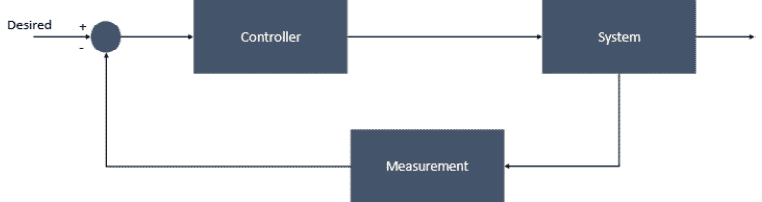
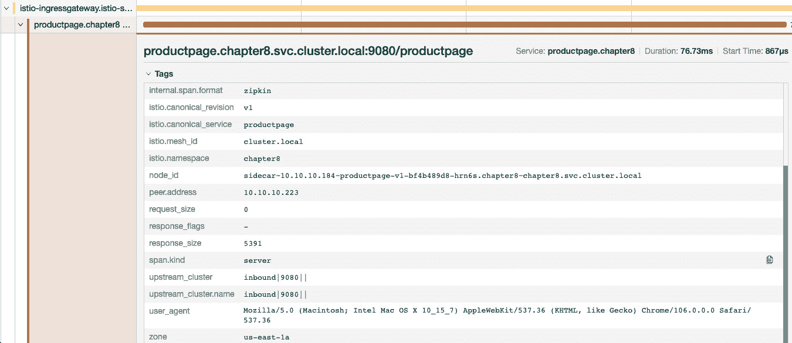

# 7

# 服务网格可观测性

使用微服务架构构建的分布式系统复杂且不可预测。无论你在编写代码时多么细心，失败、崩溃、内存泄漏等问题都是很可能发生的。应对此类事件的最佳策略是主动观察系统，以识别任何故障或可能导致故障的情况，或其他任何不利的行为。

观察系统可以帮助你了解系统行为以及故障背后的根本原因，从而使你能够自信地排除问题并分析潜在修复的效果。在本章中，你将阅读为什么可观测性很重要，如何从 Istio 收集遥测信息，不同类型的指标以及如何通过 API 获取它们，以及如何启用分布式追踪。我们将通过讨论以下主题来进行：

+   理解可观测性

+   使用 Prometheus 抓取指标

+   自定义 Istio 指标

+   使用 Grafana 可视化遥测数据

+   实现分布式追踪

不再耽搁，让我们从理解可观测性开始。

重要提示

本章的技术前提与前几章相同。

# 理解可观测性

**可观测性**的概念最初作为**控制理论**的一部分提出，控制理论处理的是自我调节动态系统的控制。控制理论是一个抽象的概念，具有跨学科的应用；它基本上提供了一个模型，指导系统输入的应用，以将系统驱动到所需状态，同时最大化其稳定性和性能。



图 7.1 – 控制理论中的可观测性

系统的可观测性是衡量我们如何根据外部输出的信号和观察来理解系统内部状态的能力。然后，控制器利用这些信息对系统进行补偿控制，以将其驱动到所需状态。如果一个系统发出信号，控制器可以使用这些信号来确定系统的状态，那么该系统就被视为可观测的。

在 IT 世界中，*系统*是软件系统，*控制器*是其他软件系统或有时是人工操作员（例如**站点可靠性工程师**（**SREs**）），他们依赖可观测系统提供的测量数据。如果你希望你的软件系统具备韧性并自我调节，那么确保软件系统的各个部分都是可观测的非常重要。

另一个需要记住的概念是**遥测数据**，它是系统用于观察系统可观测性的传输数据。通常，这些数据是日志、事件追踪和指标：

+   **日志**：这些是由软件系统以详细格式输出的信息。日志通常是应用程序发出的数据，并且在设计应用程序时就已经预先设定。开发人员常常通过将日志与生成它们的代码块关联，来使用日志进行代码故障排除。日志可以是结构化的，这意味着所有日志条目都遵循特定的模式，使得观察系统更容易获取和理解它们。日志也可以是非结构化的，这不幸的是，大多数日志都是这种情况。Istio 会生成每个请求的完整记录，包括源和目标的元数据。

+   **追踪**：在分布式系统或应用程序中，追踪是查找请求或活动如何跨多个组件处理和执行的手段。追踪由描述系统内执行/软件处理的跨度组成。多个跨度被组合在一起，形成一个请求执行的追踪。追踪描述了不同系统之间的关系，以及它们如何合作完成一个任务。为了使分布式系统中的追踪工作，所有系统之间共享上下文非常重要，这些上下文通常以关联 ID 或类似的形式存在，所有参与的系统都可以理解并遵守。Istio 为每个服务生成分布式追踪跨度，提供请求流和各个服务之间的相互依赖关系的详细信息。

+   `500` 响应码。**饱和度**显示了系统资源（如内存、CPU、网络和存储）被系统使用的程度。Istio 会生成数据平面和控制平面的度量数据。

所有这些遥测数据结合使用，以提供系统的可观察性。有各种类型的开源和商业软件可用于观察软件系统；Istio 提供了多种现成的工具，我们在*第二章*中简要讨论过。Prometheus 和 Grafana 是 Istio 默认提供的；在下一节中，我们将安装 Prometheus 和 Grafana，并配置它们以收集 Istio 的度量数据。

# 使用 Prometheus 进行度量抓取

**Prometheus** 是一个开源的系统监控软件，它存储所有度量信息及其记录的时间戳。Prometheus 与其他监控软件的区别在于其强大的多维数据模型和一个强大的查询语言 **PromQL**。它通过从各个目标收集数据，然后分析和处理这些数据以生成度量。系统还可以实现提供度量数据的 HTTP 端点；这些端点随后被 Prometheus 调用，以收集来自应用程序的度量数据。收集来自不同 HTTP 端点的度量数据的过程也称为 **抓取**。

如下图所示，Istio 控制平面和数据平面组件暴露了发出指标的端点，Prometheus 被配置为抓取这些端点以收集指标数据并将其存储在时间序列数据库中：


图 7.2 – 使用 Prometheus 进行指标抓取

我们将在接下来的章节中详细描述这个过程。

## 安装 Prometheus

Istio 已经提供了一个示例安装文件，位于 `/sample/addons/prometheus.yaml`，这个文件足够作为起点。我们对文件进行了少量修改，以适应仅支持严格 mTLS 模式的应用程序：

```
% kubectl apply -f Chapter7/01-prometheus.yaml
serviceaccount/prometheus created
configmap/prometheus created
clusterrole.rbac.authorization.k8s.io/prometheus created
clusterrolebinding.rbac.authorization.k8s.io/prometheus created
service/prometheus created
deployment.apps/prometheus created
```

我们文件 `01-prometheus.yaml` 中的更改与原始文件相比，主要是我们通过注入一个 sidecar 为 Prometheus 配置了 Istio 证书，并配置其将证书写入共享卷，再将其挂载到 Prometheus 容器中。这个 sidecar 只是用于挂载和管理证书，不会拦截任何进出请求。您可以在 `Chapter7/01-prometheus.yaml` 中找到更改内容。

您可以检查在 `istio-system` 命名空间中安装了哪些内容：

```
% kubectl get po -n istio-system
NAME                       READY   STATUS    RESTARTS   AGE
istio-egressgateway-7d75d6f46f-28r59   1/1     Running   0          48d
istio-ingressgateway-5df7fcddf-7qdx9   1/1     Running   0          48d
istiod-56fd889679-ltxg5                1/1     Running   0          48d
prometheus-7b8b9dd44c-sp5pc            2/2     Running   0          16s
```

现在，我们将看看如何部署示例应用程序。

## 部署示例应用程序

让我们部署启用了 `istio-injection` 的 `sockshop` 应用程序。

使用以下代码修改 `sockshop/devops/deploy/kubernetes/manifests/00-sock-shop-ns.yaml`：

```
apiVersion: v1
kind: Namespace
metadata:
  labels:
    istio-injection: enabled
  name: sock-shop
```

然后，部署 `sockshop` 应用程序：

```
% kubectl apply -f sockshop/devops/deploy/kubernetes/manifests/
```

最后，我们将配置一个 Ingress 网关：

```
% kubectl apply -f Chapter7/sockshop-IstioServices.yaml
```

现在，从浏览器进行一些调用，向前端服务发送流量，正如您在前几章中所做的那样。然后，我们将检查 Prometheus 抓取的一些指标，以访问仪表盘，使用以下命令：

```
% istioctl dashboard prometheus
http://localhost:9090
```

从仪表盘中，我们首先检查 Prometheus 是否正在抓取指标。可以通过点击 Prometheus 仪表盘中的 **Status** | **Targets** 来查看：


图 7.3 – Prometheus 配置

您将看到 Prometheus 正在抓取指标的所有目标。

在仪表盘中，我们将发起一个查询，以获取 `istio-` Ingress 网关和前端服务之间的总请求数，使用以下代码：

```
istio_requests_total{destination_service="front-end.sock-shop.svc.cluster.local",response_code="200",source_app="istio-ingressgateway",namespace="sock-shop"}
```


图 7.4 – PromQL

在前面的截图中，指标的名称是 `istio_requests_total`，大括号中的字段被称为 `istio_requests_total` 指标，其维度分别是 `destination_service`、`response_code`、`source_app` 和 `namespace`，用于匹配 `front-end.sock-shop.svc.cluster.local`、`200`、`istio-ingressgateway` 和 `sock-shop` 的值。

作为响应，我们收到一个指标计数 `51` 和其他作为指标的一部分的维度。

让我们再执行一个查询，检查从前端服务到目录服务的请求数量，使用以下代码：

```
istio_requests_total{destination_service="catalogue.sock-shop.svc.cluster.local",source_workload="front-end",reporter="source",response_code="200"}
```

在查询中注意到，我们提供了 `reporter` = `"source"`，这意味着我们希望由前端 Pod 上报的指标。


图 7.5 – 从前端到目录的 PromQL istio_request_total

如果你更改 `reporter = "destination"`，你将看到类似的指标，但由目录 Pod 上报。


图 7.6 – 从前端到目录的 PromQL istio_request_total，由目录 sidecar 上报

让我们还检查一下目录服务与 MySQL 目录数据库之间的数据库连接，使用以下查询：

```
istio_tcp_connections_opened_total{destination_canonical_service="catalogue-db",source_workload="catalogue", source_workload_namespace="sock-shop}
```


图 7.7 – 目录与目录-db 之间的 PromQL TCP 连接

指标数据显示，目录服务建立了七个 TCP 连接。

到目前为止，我们使用的是默认的指标配置。在下一节中，我们将介绍这些指标是如何配置的，以及如何通过添加新的指标来定制它们。

# 定制 Istio 指标

Istio 提供了灵活性，可以观察到除了开箱即用的指标之外的其他指标。这为观察特定应用程序的指标提供了灵活性。考虑到这一点，让我们首先来看一下由 sidecar 暴露的 `/stats/prometheus` 端点：

```
% kubectl exec front-end-6c768c478-82sqw -n sock-shop -c istio-proxy -- curl -sS 'localhost:15000/stats/prometheus' | grep istio_requests_total
```

以下截图显示了该端点返回的示例数据，这些数据也被 Prometheus 抓取，与你在上一节中使用仪表板看到的数据相同：


图 7.8 – Istio 指标、维度和数值

该指标按以下结构组织：

+   **指标名称**：这是由 Istio 导出的指标名称。开箱即用的 Istio 生成了许多指标详情，可以在 [`istio.io/latest/docs/reference/config/metrics/#metrics`](https://istio.io/latest/docs/reference/config/metrics/#metrics) 中找到。

+   **指标维度**：这些是指标的一部分的各个字段。在 Prometheus 上下文中，这些字段称为维度，在 Istio 指标上下文中称为标签。有关 Istio 指标标准标签部分的详细信息，请访问 [`istio.io/latest/docs/reference/config/metrics/#labels`](https://istio.io/latest/docs/reference/config/metrics/#labels)。

+   **指标值**：这是指标的值，可以是计数器、仪表或直方图。

+   **计数器**用于跟踪事件的发生。计数器是持续增加的值，并以时间序列的形式呈现。计数器类型值的指标示例包括请求计数、接收字节和 TCP 连接。

+   **仪表**是单个时间点上测量的快照。它用于衡量如 CPU 消耗和内存消耗等指标。

+   顾名思义，**直方图**用于衡量一段时间内的观测数据。它们也是最复杂的度量类型。

Istio 的遥测组件由 `proxy-wasm` 插件实现。我们将在*第九章*中深入了解这个插件，但目前只需理解它是用来为 **Envoy** 构建扩展的工具。你可以使用以下命令查找这些过滤器：

```
% kubectl get EnvoyFilters -A
NAMESPACE      NAME                               AGE
istio-system   stats-filter-1.16                  28h
istio-system   tcp-stats-filter-1.16              28h
```

这些过滤器在请求执行的不同阶段运行 WebAssembly，并收集各种指标。使用相同的技术，你可以通过添加/删除新的维度轻松自定义 Istio 指标。你还可以添加新的指标或覆盖任何现有的指标。我们将在接下来的章节中讨论如何实现这一点。

## 为 Istio 指标添加维度

`istio_request_total` 指标没有请求路径的维度——也就是说，我们无法统计各个请求路径的请求数量。我们将配置一个 EnvoyFilter，将 `request.url_path` 包含到 `request_total` 指标中。请注意，`istio_` 是 Prometheus 添加的前缀；在 Istio 的上下文中，实际的指标名称是 `request_total`。

我们将在*第九章*中讨论 EnvoyFilter，因此如果你想跳转到该章节了解扩展 Istio 的各种方式，请随时去阅读；或者，你也可以在 [EnvoyFilter 参考](https://istio.io/latest/docs/reference/config/networking/envoy-filter/#EnvoyFilter-PatchContext) 中了解此过滤器。

在以下配置中，我们创建了一个 EnvoyFilter，应用于前端 Pods，并使用 `workloadSelector` 中的条件，代码如下：

```
apiVersion: networking.istio.io/v1alpha3
kind: EnvoyFilter
metadata:
  name: custom-metrics
  namespace: sock-shop
spec:
  workloadSelector:
    labels:
      name: front-end
```

接下来，我们将 `configPatch` 应用到 `HTTP_FILTER`，以便为侧车的入站流量进行配置。其他选项包括 `SIDECAR_OUTBOUND` 和 `GATEWAY`。此补丁应用于 HTTP 连接管理器过滤器，特别是 `istio.stats` 子过滤器；这是我们在前一部分讨论的过滤器，负责 Istio 的遥测功能：

```
configPatches:
  - applyTo: HTTP_FILTER
    match:
      context: SIDECAR_INBOUND
      listener:
        filterChain:
          filter:
            name: envoy.filters.network.http_connection_manager
            subFilter:
              name: istio.stats
      proxy:
        proxyVersion: ¹\.16.*
```

请注意，代理版本（1.16）必须与你安装的 Istio 版本匹配。

接下来，我们将用以下内容替换 `istio.stats` 过滤器的配置：

```
patch:
      operation: REPLACE
      value:
        name: istio.stats
        typed_config:
          '@type': type.googleapis.com/udpa.type.v1.TypedStruct
          type_url: type.googleapis.com/envoy.extensions.filters.http.wasm.v3.Wasm
          value:
            config:
              configuration:
                '@type': type.googleapis.com/google.protobuf.StringValue
                value: |
                  {
                    "debug": "false",
                    "stat_prefix": "istio",
                    "metrics": [
                      {
                        "name": "requests_total",
                        "dimensions": {
                          "request.url_path": "request.url_path"
                        }
                      }
                    ]
                  }
```

在此配置中，我们通过添加一个名为 `request.url.path` 的新维度来修改 `metrics` 字段，其值与 Envoy 的 `request.url.path` 属性相同。要删除任何现有维度——例如 `response_flag`——请使用以下配置：

```
"metrics": [
                      {
                        "name": "requests_total",
                        "dimensions": {
                          "request.url_path": "request.url_path"
                        },
                        "tags_to_remove": [
                          "response_flags"
                        ]
                      }
```

然后，应用配置：

```
% kubectl apply -f Chapter7/01-custom-metrics.yaml
envoyfilter.networking.istio.io/custom-metrics created
```

默认情况下，Istio 不会将新添加的 `request.url.path` 维度包含到 Prometheus 中；需要应用以下注解以包含 `request.url_path`：

```
spec:
  template:
    metadata:
      annotations:
        sidecar.istio.io/extraStatTags: request.url_path
```

将更改应用到前端部署：

```
% kubectl patch Deployment/front-end -n sock-shop --type=merge --patch-file Chapter7/01-sockshopfrontenddeployment_patch.yaml
```

你现在将能够看到新维度已添加到 `istio_requests_total` 指标中：


图 7.9 – 新的指标维度

您可以将任何 Envoy 属性作为指标的维度，并且可以在 [`www.envoyproxy.io/docs/envoy/latest/intro/arch_overview/advanced/attributes`](https://www.envoyproxy.io/docs/envoy/latest/intro/arch_overview/advanced/attributes) 找到所有可用属性的完整列表。

## 创建新的 Istio 指标

您还可以使用 EnvoyFilter 创建一个新的 Istio 指标，类似于您用于创建自定义指标的方式。

在以下示例中，我们使用 `definitions` 创建了新的指标，并且添加了另一个维度：

```
              configuration:
                '@type': type.googleapis.com/google.protobuf.StringValue
                value: |
                  {
                    "debug": "false",
                    "stat_prefix": "istio",
                    "definitions": [
                      {
                        "name": "request_total_bymethod",
                        "type": "COUNTER",
                        "value": "1"
                      }
                    ],
                    "metrics": [
                      {
                        "name": "request_total_bymethod",
                        "dimensions": {
                          "request.method": "request.method"
                        }
                      }
                    ]
                  }
```

接下来，应用更改：

```
% kubectl apply -f Chapter7/02-new-metric.yaml
envoyfilter.networking.istio.io/request-total-bymethod configured
```

我们还必须为前端 Pod 添加 `sidecar.istio.io/statsInclusionPrefixes` 注释，以便将 `request_total_bymethod` 指标包含在 Prometheus 中：

```
% kubectl patch Deployment/front-end -n sock-shop --type=merge --patch-file Chapter7/02-sockshopfrontenddeployment_patch.yaml
deployment.apps/front-end patched
```

最好重新启动前端 Pod 以确保注释已应用。应用更改后，您可以使用以下代码抓取 Prometheus 端点：

```
% kubectl exec front-end-58755f99b4-v59cd -n sock-shop -c istio-proxy -- curl -sS 'localhost:15000/stats/prometheus' | grep request_total_bymethod
# TYPE istio_request_total_bymethod counter
istio_request_total_bymethod{request_method="GET"} 137
```

同时，使用 Prometheus 仪表盘，检查新指标是否可用：


图 7.10 – 新指标

通过此步骤，您现在应该能够创建一个带有维度的新 Istio 指标，并且更新任何现有指标的维度。在下一节中，我们将了解 Grafana，这是另一个强大的可观察性工具。

# 使用 Grafana 可视化遥测数据

**Grafana** 是一种开源软件，用于可视化遥测数据。它提供了一个易于使用和交互的选项，用于可视化可观察性指标。Grafana 还帮助将来自各种系统的遥测数据集中统一显示，提供跨所有系统的统一可观察性视图。

Istio 安装提供了 Grafana 的示例清单，位于 `samples/addons` 中。使用以下命令安装 Grafana：

```
% kubectl apply -f samples/addons/grafana.yaml
serviceaccount/grafana created
configmap/grafana created
service/grafana created
deployment.apps/grafana created
configmap/istio-grafana-dashboards created
configmap/istio-services-grafana-dashboards created
```

安装 Grafana 后，您可以使用以下命令打开 Grafana 仪表盘：

```
% istioctl dashboard grafana
http://localhost:3000
```

这应该会打开 Grafana 仪表盘，如下图所示：


图 7.11 – Grafana 仪表盘

Grafana 已经为 Istio 包含了以下仪表盘：

+   **Istio 控制平面仪表盘**：此仪表盘提供显示 Istio 控制平面组件资源消耗的图表。它还提供关于控制平面与数据平面之间交互的指标，包括 xDS 推送、配置同步中的错误以及数据平面和控制平面之间的配置冲突。

+   **Istio 网格仪表盘**：此仪表盘提供网格的汇总视图。仪表盘提供请求、错误、网关和策略的汇总视图，并详细说明服务及其在请求处理期间的相关延迟。

+   **Istio 性能仪表盘**：此仪表盘提供显示 Istio 组件资源利用率的图表。

+   **Istio 服务和工作负载仪表板**：提供每个服务和工作负载的请求-响应指标。使用此仪表板，您可以找到有关服务和工作负载行为的更详细信息。您可以根据不同维度搜索指标，如在*使用 Prometheus 抓取指标*一节中讨论的那样。


图 7.12 – Istio 服务仪表板

Grafana 的另一个强大功能是**告警**，您可以基于某些事件创建告警。在接下来的示例中，我们将创建一个这样的告警：

1.  创建一个告警，当 `response_code` 不等于 `200` 时，基于过去 10 分钟内的 `istio_request_total` 指标。


图 7.13 – 在 Grafana 中创建告警

1.  配置一个告警，当过去 10 分钟内响应码为 `~=200` 的请求数量超过 3 时触发，这也叫做**阈值**。我们还将配置该告警的评估频率以及触发告警的阈值。在以下示例中，我们将告警设置为每分钟评估一次，但在 5 分钟后触发。通过调整这些参数，我们可以避免告警过早或过晚触发。


图 7.14 – 配置触发告警的阈值

1.  接下来，您配置告警规则的名称以及告警应存储的位置：


图 7.15 – 添加告警详情

1.  配置完规则名称后，接下来配置标签，标签是用来将告警与通知策略关联的方式：


图 7.16 – 告警通知

1.  接下来，您配置需要在告警触发时通知的联系人：


图 7.17 – 配置联系人

1.  最后，您创建一个通知策略，指定将在告警触发时通知的联系人。


图 7.18 – 配置通知策略

最终，您的告警已配置完成。现在，您可以禁用 `sockshop.com` 上的目录服务，进行几次请求，您将看到以下告警在 Grafana 中被触发：


图 7.19 – 因目录服务中断引起的故障触发的告警

在本节中，我们展示了如何使用 Grafana 来可视化 Istio 产生的各种指标。Grafana 提供了全面的工具来可视化数据，帮助发现新的机会以及揭示系统中可能出现的问题。

# 实现分布式追踪

**分布式追踪**帮助你理解请求在各种 IT 系统中的流转过程。在微服务的背景下，分布式追踪帮助你理解请求在不同微服务之间的流动，帮助你诊断请求可能遇到的任何问题，并帮助你快速诊断任何故障或性能问题。

在 Istio 中，你可以启用分布式追踪，而无需在应用程序代码中做任何更改，只要你的应用程序将所有追踪头部转发给上游服务即可。Istio 支持与多种分布式追踪系统的集成；Jaeger 就是其中一个支持的系统，并且作为 Istio 的附加组件提供。Istio 的分布式追踪基于 Envoy，在这里，追踪信息直接从 Envoy 发送到追踪后端。追踪信息包括`x-request-id`、`x-b3-trace-id`、`x-b3-span-id`、`x-b3-parent-spanid`、`x-b3-sampled`、`x-b3-flags`和`b3`。这些自定义头部由 Envoy 为每个经过 Envoy 的请求创建。Envoy 将这些头部转发到 Pod 中相关的应用容器。应用容器然后需要确保这些头部不会被截断，而是转发给网格中的任何上游服务。代理的应用程序随后需要在所有从应用程序发出的外部请求中传播这些头部。

你可以在 [`www.envoyproxy.io/docs/envoy/latest/intro/arch_overview/observability/tracing`](https://www.envoyproxy.io/docs/envoy/latest/intro/arch_overview/observability/tracing) 阅读更多关于头部的信息。

在接下来的部分，我们将学习如何安装 Jaeger 并为`sockshop`示例启用分布式追踪。

## 使用 Jaeger 启用分布式追踪

Jaeger 是一个开源的分布式追踪软件，最初由 Uber Technologies 开发，后来捐赠给 CNCF。Jaeger 用于监控和故障排除基于微服务的系统，主要用于以下几个方面：

+   分布式上下文传播和事务监控

+   微服务依赖分析与故障排除

+   了解分布式架构中的瓶颈

Jaeger 的创建者 Yuri Shkuro 出版了一本名为 *Mastering Distributor Tracing* 的书（[`www.shkuro.com/books/2019-mastering-distributed-tracing`](https://www.shkuro.com/books/2019-mastering-distributed-tracing)），书中解释了 Jaeger 设计和操作的许多方面。你可以在 [`www.jaegertracing.io/`](https://www.jaegertracing.io/) 阅读更多关于 Jaeger 的信息。

接下来，我们将在 Istio 中安装和配置 Jaeger。

用于部署 Jaeger 的 Kubernetes 清单文件已经可以在` samples/addons/jaeger.yaml`中找到：

```
% kubectl apply -f samples/addons/jaeger.yaml
deployment.apps/jaeger created
service/tracing created
service/zipkin created
service/jaeger-collector created
```

这个代码块将在`istio-system`命名空间中安装 Jaeger。你可以使用以下命令打开仪表盘：

```
$ istioctl dashboard jaeger
```

不幸的是，`sockshop` 应用没有设计成传播头部，因此在此场景中，我们将使用 Istio 示例中的 `bookinfo` 应用。但在此之前，我们将部署 `httpbin` 应用以理解 Istio 注入的 Zipkin 追踪头部：

```
% kubectl apply -f  Chapter7/01-httpbin-deployment.yaml
```

让我们向 `httpbin` 发送请求并检查响应头部：

```
% curl -H "Host:httpbin.com"  http://a858beb9fccb444f48185da8fce35019-1967243973.us-east-1.elb.amazonaws.com/headers
{
  "headers": {
    "Accept": "*/*",
    "Host": "httpbin.com",
    "User-Agent": "curl/7.79.1",
    "X-B3-Parentspanid": "5c0572d9e4ed5415",
    "X-B3-Sampled": "1",
    "X-B3-Spanid": "743b39197aaca61f",
    "X-B3-Traceid": "73665fec31eb46795c0572d9e4ed5415",
    "X-Envoy-Attempt-Count": "1",
    "X-Envoy-Internal": "true",
    "X-Forwarded-Client-Cert": "By=spiffe://cluster.local/ns/Chapter7/sa/default;Hash=5c4dfe997d5ae7c853efb8b81624f1ae5e4472f1cabeb36a7cec38c9a4807832;Subject=\"\";URI=spiffe://cluster.local/ns/istio-system/sa/istio-ingressgateway-service-account"
  }
}
```

在响应中，请注意 Istio 注入的头部 – `x-b3-parentspanid`、`x-b3-sampled`、`x-b3-spanid` 和 `x-b3-traceid`。这些头部也称为 B3 头部，用于跨服务边界传播追踪上下文：

+   `1` 表示允许，`0` 表示禁止。

+   **x-b3-traceid**：这是 8 字节或 16 字节长，表示追踪的整体 ID。

+   **x-b3-parentspanid**：这是 8 字节长，表示父操作在追踪树中的位置。每个 span 都会有一个父 span，除非它本身就是根 span。

+   **x-b3-spanid**：这是 8 字节长，表示当前操作在追踪树中的位置。

在 `httpbin` 的响应中，请求会经过 Ingress 网关，然后到达 `httpbin`。B3 头部在请求到达 Ingress 网关时就被 Istio 注入。Ingress 网关生成的 span ID 是 `5c0572d9e4ed5415`，它是 `httpbin` span 的父 span，后者的 span ID 是 `743b39197aaca61f`。Ingress 网关和 `httpbin` 的 span 会有相同的 trace ID，因为它们属于同一个追踪。由于 Ingress 网关是根 span，它不会有 `parentspanid`。在这个示例中，只有两个跳数，因此只有两个 span。如果有更多跳数，它们也都会生成 B3 头部，因为 `x-b3-sampled` 的值是 `1`。

您可以在[`www.envoyproxy.io/docs/envoy/latest/configuration/http/http_conn_man/headers.html`](https://www.envoyproxy.io/docs/envoy/latest/configuration/http/http_conn_man/headers.html)了解更多关于这些头部的信息。

现在，您已经熟悉了 Istio 注入的 `x-b3` 头部，让我们部署示例应用 `bookinfo` 并配置 Ingress。如果您还没有创建 `Chapter7` 命名空间，请在启用 Istio 注入的情况下创建它：

```
% kubectl apply -f samples/bookinfo/platform/kube/bookinfo.ya
ml -n Chapter7
% kubectl apply -f Chapter7/bookinfo-gateway.yaml
```

请注意，`Chapter7/bookinfo-gateway.yaml` 将 `bookshop.com` 配置为主机；我们这样做是为了使其能够与 `sock-shop.com` 一起运行。部署 Ingress 配置后，您可以通过 `istio-ingress` 网关服务的外部 IP 访问 `bookinfo`。请使用 `/productpage` 作为 URI。接下来，您可以向 `bookinfo` 应用发送一些请求，然后查看 Jaeger 仪表盘，并选择 **productpage.Chapter7** 作为服务。选择服务后，点击 **Find Traces**，然后将显示该服务的最新追踪的详细视图：


图 7.20 – Jaeger 仪表盘

在 Jaeger 中，**跟踪（trace）**是一个请求执行的表示，由多个 **span** 组成；跟踪记录了请求所经过的路径。一个跟踪由多个 span 组成；每个 span 表示一个工作单元，用于跟踪请求所做的特定操作。第一个 span 表示 **根 span**，即请求的开始到结束；每个后续的 span 提供了请求执行过程中该部分发生情况的更深入上下文。

你可以点击仪表盘上的任何一个跟踪。以下是一个包含八个 spans 的跟踪示例：


图 7.21 – Jaeger 中的跟踪和 spans

在以下截图中，你可以观察到以下内容：

+   请求在 `istio-ingressgateway` 中花费了 78.69 毫秒，这也是根 span。请求随后被转发到位于端口 `9080` 的 `productpage` 上游服务。如果你查看下一个子 span，你会发现 `istio-ingressgateway` 中花费的时间是 78.69 – 76.73 毫秒 = 1.96 毫秒。


图 7.22 – BookInfo 的根 span

+   请求随后在整体处理时间轴的 867 微秒时被 `productpage` 服务接收。处理该请求花费了 76.73 毫秒。



图 7.23 – 请求到达产品页

+   `productpage` 服务在 867 微秒到 5.84 毫秒之间进行了处理，之后，它调用了位于端口 `9080` 的 `details` 服务。来回往返到 `details` 服务花费了 12.27 毫秒。


图 7.24 – 从产品页到详情服务的请求

+   请求在 7.14 毫秒后被 `details` 服务接收，并花费了 1.61 毫秒来处理该请求。


图 7.25 – 请求到达详情服务

我没有展示其余的 spans，但我希望你能了解进行此练习的好处。我们刚才讲解的示例引出了几个有趣的观察结果：

+   通过比较第三个和第四个 spans 的开始时间，可以清楚地看到，请求从产品页离开并到达详情页花费了 1.3 毫秒。

+   详情页只用了 1.6 毫秒来处理请求，但产品页接收到请求并将其发送到详情页却花费了 12.27 毫秒，这突显了产品页实现中的一些低效。

你可以通过点击仪表盘右上角的下拉菜单来进一步探索。


图 7.26 – 查看追踪详情的其他选项

**Trace Spans Table** 选项在呈现多个跨度处理请求所花时间的摘要视图时非常有用：


图 7.27 – Jaeger 中的追踪跨度表

追踪会带来性能损耗，因此不适合追踪所有请求，因为它们会导致性能下降。我们以 demo 配置文件安装了 Istio，默认情况下会采样所有请求。这可以通过以下配置映射来控制：

```
% kubectl get cm/istio -n istio-system -o yaml
```

你可以通过为 `tracing` 中的 `sampling` 提供正确的值来控制采样率：

```
apiVersion: v1
data:
  mesh: |-
..
      tracing:
       sampling: 10
        zipkin:
          address: zipkin.istio-system:9411
    enablePrometheusMerge: true
..
kind: ConfigMap
```

这也可以在部署级别进行控制——例如，我们可以通过在 `bookinfo.yaml` 中添加以下内容来配置产品页面仅对 1% 的请求进行采样：

```
  template:
    metadata:
      annotations:
        proxy.istio.io/config: |
          tracing:
            sampling: 1
            zipkin:
              address: zipkin.istio-system:9411
```

整个配置文件可以在 `Chapter7/bookinfo-samplingdemo.yaml` 中找到。

在本节中，我们了解了如何使用 Jaeger 执行分布式追踪，而无需在应用程序代码中进行任何更改，前提是你的应用程序能够转发 `x-b3` 头信息。

# 总结

在本章中，我们了解了 Istio 如何通过生成各种遥测数据使系统可观察。Istio 提供了各种度量指标，这些指标可以被 Istio 操作员用来对系统进行微调和优化。这一切都是通过 Envoy 实现的，Envoy 生成的各种度量数据随后被 Prometheus 抓取。

Istio 允许你配置新的度量指标，以及为现有的度量指标添加新的维度。你已经学习了如何使用 Prometheus 通过 PromQL 查询各种度量指标，并构建可以提供系统以及业务运营洞察的查询。随后，我们安装了 Grafana 来可视化 Prometheus 收集的度量指标，尽管 Istio 提供了多个开箱即用的仪表盘，你也可以轻松添加新的仪表盘，配置告警，并创建如何分发这些告警的策略。

最后，我们安装了 Jaeger 来执行分布式追踪，以了解请求在分布式系统中的处理过程，并且我们做这一切时不需要修改应用程序代码。本章提供了对 Istio 如何使系统可观察的基础理解，从而实现不仅健康而且最优的系统。

在下一章中，我们将学习在操作 Istio 时可能遇到的各种问题以及如何进行故障排除。

# 第三部分：扩展、扩展与优化

本部分带你深入学习 Istio 的高级主题。你将了解部署 Istio 到生产环境的各种架构。你还将探索扩展 Istio 数据平面的不同选项，并学习为什么这是 Istio 非常有用和强大的功能。Istio 为基于虚拟机的工作负载提供了极大的灵活性，因此，在本部分中，你将阅读如何将 Istio 扩展到虚拟机。接近本部分结尾时，你将学习如何排除 Istio 故障以及在生产环境中操作和配置 Istio 的最佳实践。最后，我们将总结所学内容，并将其应用到另一个示例应用中，同时讨论 eBPF 以及如何进一步了解 Istio。附录将提供有关其他服务网格技术的宝贵信息，并帮助你获得与其他选项相比的 Istio 相关知识。

本部分包含以下章节：

+   *第八章*，*将 Istio 扩展到多个集群的部署——一个 Kubernetes 的案例*

+   *第九章*，*扩展 Istio 数据平面*

+   *第十章*，*为非 Kubernetes 工作负载部署 Istio 服务网格*

+   *第十一章*，*排除故障与操作 Istio*

+   *第十二章*，*总结我们所学的内容与下一步计划*
