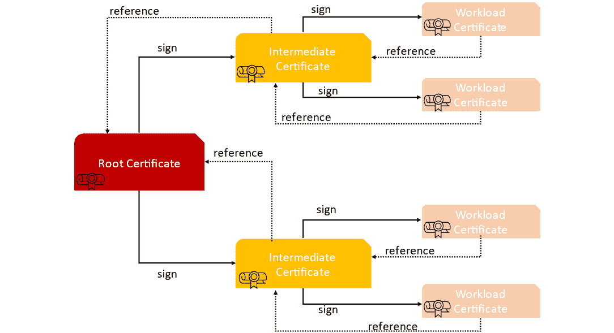
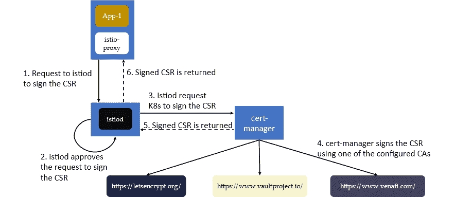
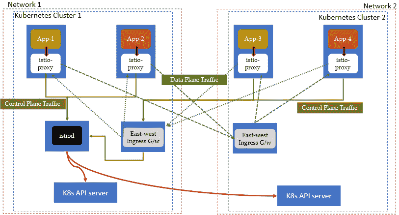
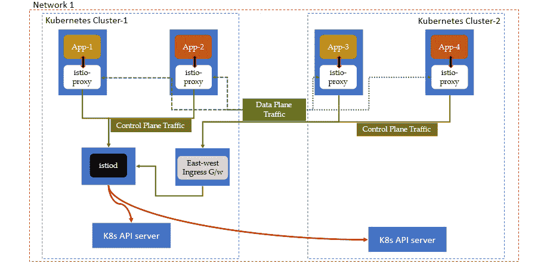
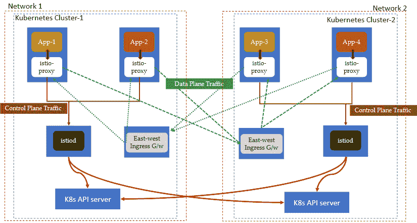
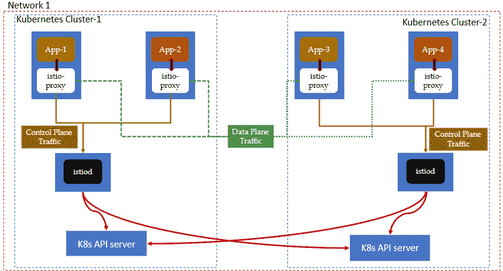

# 8

# 扩展 Istio 至跨 Kubernetes 的多集群部署

**容器**不仅改变了应用程序的开发方式，还改变了应用程序的连接方式。应用程序网络，即应用程序之间的网络连接，对于生产部署至关重要，必须是自动化的、弹性可扩展的且安全的。实际应用程序部署在本地、多云、Kubernetes 集群以及集群中的命名空间中。因此，有必要在传统环境和现代环境之间提供一个服务网格，实现应用程序之间的无缝连接。

在*第三章*中，我们简要讨论了 Istio 控制平面的部署模型。我们讨论了带有本地控制平面的单个集群、带有单个控制平面的主集群和远程集群，以及带有外部控制平面的单个集群。单网格/单集群部署是最简单的，但也是一种不实际的部署模型，因为您的生产工作负载将包括多个 Kubernetes 集群，可能分布在多个数据中心。

在本章中，我们将通过以下主题，学习如何在多个 Kubernetes 集群之间部署 Istio，并如何将它们联合起来：

+   在多集群部署中建立相互信任

+   多网络上的主-远程集群

+   同一网络上的主-远程集群

+   不同网络上的多主集群

+   同一网络上的多主集群

本章内容极具实践性，因此请特别注意*技术要求*部分。此外，在每个部分，请特别注意设置集群和配置 Istio 的说明。

# 技术要求

在本章中，我们将使用**Google Cloud**进行实际操作。如果您是第一次使用，您可能符合获得免费信用额度的条件，详情请参考[`cloud.google.com/free`](https://cloud.google.com/free)。您需要一个 Google 帐户进行注册；注册后，请按照 Google 文档中的说明安装**Google CLI**，具体说明见[`cloud.google.com/sdk/docs/install`](https://cloud.google.com/sdk/docs/install)。安装 Google CLI 后，您需要按照[`cloud.google.com/sdk/docs/initializing`](https://cloud.google.com/sdk/docs/initializing)中的步骤进行初始化。初始化步骤将完成必要的配置，以便您可以通过 CLI 与您的 Google Cloud 帐户进行交互。

## 设置 Kubernetes 集群

一旦您设置好帐户，我们将使用**Google Kubernetes Engine 服务**创建两个 Kubernetes 集群。为此，请按照以下步骤操作：

1.  使用以下命令创建集群 1：

    ```
    % gcloud beta container --project "istio-book-370122" clusters create "cluster1" --zone "australia-southeast1-a" --no-enable-basic-auth --cluster-version "1.23.12-gke.100" --release-channel "regular" --machine-type "e2-medium" --image-type "COS_CONTAINERD" --disk-type "pd-standard" --disk-size "30" --num-nodes "3"
    ```

在此示例中，我们正在创建一个名为`cluster1`的集群，位于`australia-southeast1`区域的`australia-southeast1-a`可用区。所使用的机器类型为`e2-medium`，默认池大小为`3`。你可以将区域更改为最接近你位置的区域。你也可以更改实例类型和其他参数，但请注意可能产生的费用。

1.  接下来，创建集群 2。过程与前一步相同，但我们使用了不同的区域和子网：

    ```
    % gcloud beta container --project "istio-book-370122" clusters create "cluster2" --zone "australia-southeast2-a" --no-enable-basic-auth --cluster-version "1.23.12-gke.100" --release-channel "regular" --machine-type "e2-medium" --image-type "COS_CONTAINERD" --disk-type "pd-standard" --disk-size "30" --max-pods-per-node "110" --num-nodes "3"
    ```

1.  现在，设置环境变量以引用已创建的集群。从`kubectl`配置中找到集群引用名称：

    ```
    % kubectl config view -o json | jq '.clusters[].name'
    "gke_istio-book-370122_australia-southeast1-a_primary-cluster"
    "gke_istio-book-370122_australia-southeast2-a_primary2-cluster"
    "minikube"
    ```

在本章中使用的每个终端窗口中设置以下上下文变量：

```
export CTX_CLUSTER1="gke_istio-book-370122_australia-southeast1-a_primary-cluster"
export CTX_CLUSTER2="gke_istio-book-370122_australia-southeast2-a_primary2-cluster"
```

这完成了在 Google Cloud 中设置 Kubernetes 集群的步骤。在下一部分，你将在工作站上设置 OpenSSL。

## 设置 OpenSSL

我们将使用 OpenSSL 生成根证书和中间**证书授权机构**（**CA**）。你需要使用 OpenSSL 3.0 或更高版本。Mac 用户可以按照[`formulae.brew.sh/formula/openssl@3`](https://formulae.brew.sh/formula/openssl@3)上的说明进行操作。

你可能会看到以下响应：

```
openssl@3 is keg-only, which means it was not symlinked into /opt/homebrew,
because macOS provides LibreSSL.
```

在这种情况下，手动将 OpenSSL 添加到`PATH`中：

```
% export PATH="/opt/homebrew/opt/openssl@3/bin:$PATH"
% openssl version
OpenSSL 3.0.7 1
```

请确保路径反映了你将执行与证书相关命令的终端。

## 额外的 Google Cloud 步骤

以下步骤对于在两个 Kubernetes 集群之间建立连接非常有用。请暂时不要执行本部分中的步骤，我们将在后续的实践环节中参考这些步骤：

1.  计算集群 1 和集群 2 的**无类域间路由**（**CIDR**）块：

    ```
    % function join_by { local IFS="$1"; shift; echo "$*"; }
    ALL_CLUSTER_CIDRS=$(gcloud container clusters list –format='value(clusterIpv4Cidr)' | sort | uniq)
    ALL_CLUSTER_CIDRS=$(join_by , $(echo "${ALL_CLUSTER_CIDRS}"))
    ```

`ALL_CLUSTER_CIDR`的值将类似于`10.124.0.0/14,10.84.0.0/14`。

1.  获取集群 1 和集群 2 的`NETTAGS`：

    ```
    % ALL_CLUSTER_NETTAGS=$(gcloud compute instances list –format='value(tags.items.[0])' | sort | uniq)
    ALL_CLUSTER_NETTAGS=$(join_by , $(echo "${ALL_CLUSTER_NETTAGS}"))
    ```

`ALL_CLUSTER_NETTAGS`的值将类似于`gke-primary-cluster-9d4f7718-node`，`gke-remote-cluster-c50b7cac-node`。

1.  创建一个防火墙规则，允许集群 1 和集群 2 之间的所有流量：

    ```
    % gcloud compute firewall-rules create primary-remote-shared-network \
      --allow=tcp,udp,icmp,esp,ah,sctp \
      --direction=INGRESS \
      --priority=900 \
      --source-ranges="${ALL_CLUSTER_CIDRS}" \
      --target-tags="${ALL_CLUSTER_NETTAGS}" –quiet
    ```

1.  通过执行以下步骤删除 Google Cloud Kubernetes 集群和防火墙规则：

    +   删除防火墙：

        ```
        cluster1:

        ```

        cluster2:

        ```
        %gcloud container clusters delete cluster2 –zone "australia-southeast2-a"
        ```

        ```

        ```

这完成了为接下来的部分准备所需的所有步骤。在下一部分，我们将开始介绍多集群部署所需的基础知识。

# 在多集群部署中建立相互信任

在设置多集群部署时，我们还必须在集群之间建立信任。Istio 架构基于零信任模型，假设网络是恶意的，并且服务之间没有隐式信任。因此，Istio 对每个服务的通信进行身份验证，以验证工作负载的真实性。集群中的每个工作负载都会被分配一个身份，服务与服务之间的通信通过 sidecar 上的 mTLS 完成。此外，sidecar 与控制平面之间的所有通信也都通过 mTLS 进行。在前面的章节中，我们使用了带有自签名根证书的 Istio CA。在设置多集群时，我们必须确保工作负载分配的身份能够被网格中所有其他服务理解和信任。Istio 通过将 CA 捆绑包分发到所有工作负载来实现这一点，捆绑包包含一条证书链，sidecar 可以利用这条证书链来识别通信另一端的 sidecar。在多集群环境中，我们需要确保 CA 捆绑包包含正确的证书链，以验证数据平面中的所有服务。

有两种方法可以实现这一点：

+   **插件 CA 证书**：使用此选项，我们在 Istio 外部创建根证书和中间证书，并配置 Istio 使用创建的中间证书。此选项允许您使用已知的 CA，甚至是您自己的内部 CA 作为根证书颁发机构，为 Istio 生成中间 CA。您将中间 CA 证书和密钥与根 CA 证书一起提供给 Istio。然后，Istio 使用中间 CA 和密钥来签署工作负载，并将根 CA 证书作为信任根嵌入其中。



图 8.1 – 作为 Istio 插件 CA 的中间 CA

+   **外部 CA 证书颁发机构**：我们使用外部 CA 来签发证书，而无需将私钥存储在 Kubernetes 集群内。当 Istio 使用自签名证书时，它会将自签名的私钥作为一个 Secret 存储在 Kubernetes 集群内。如果使用插件 CA，它仍然需要在集群中保存中间密钥。如果 Kubernetes 的访问权限没有受到限制，那么将私钥存储在 Kubernetes 集群中并不是一个安全的选择。在这种情况下，我们可以使用外部 CA 来作为证书签发机构。



图 8.2 – cert-manager

一种这样的证书管理软件是**cert-manager**。它将外部证书和证书颁发者作为资源类型添加到 Kubernetes 集群中，并简化了获取、续订和使用这些证书的过程。它可以与多种支持的源集成，包括 Let's Encrypt 和 HashiCorp Vault。它确保证书有效并及时更新，并在证书过期之前的配置时间尝试续订证书。cert-manager 软件通过 **Kubernetes CSR API** 与 Kubernetes 集成；您可以在 [`kubernetes.io/docs/reference/access-authn-authz/certificate-signing-requests/`](https://kubernetes.io/docs/reference/access-authn-authz/certificate-signing-requests/) 上阅读相关内容。当使用 cert-manager 时，Istio 批准来自服务工作负载的 CSR，并将请求转发给 cert-manager 进行签名。cert-manager 签名该请求并将证书返回给 istiod，之后这些证书将传递给 istio-agent。

在本章中，我们将使用插件 CA 证书选项，这是一个更简单、易用的选项，这样我们就可以专注于 Istio 的多集群设置。在接下来的部分中，我们将介绍在不同集群配置中设置 Istio。

# 多网络上的主远程

在主远程配置中，我们将在集群 1 上安装 Istio 控制平面。集群 1 和集群 2 位于不同的网络之间，Pods 之间没有直接连接。集群 1 将承载 Istio 控制平面以及数据平面。集群 2 仅承载数据平面，并使用集群 1 的控制平面。集群 1 和集群 2 都使用由根 CA 签发的中间 CA。在集群 1 中，istiod 观察集群 1 和集群 2 中的 API 服务器，以监控 Kubernetes 资源的任何变化。我们将在两个集群中都创建一个 Ingress 网关，用于在工作负载之间进行跨网络通信。我们将这个 Ingress 网关称为东西网关，因为它用于东西方向的通信。东西网关负责处理集群 1 和集群 2 之间的身份验证工作负载，并充当两个集群之间所有流量的中心枢纽。在下图中，数据平面流量中的虚线箭头表示来自集群 1 到集群 2 的服务请求，通过东西网关传递。在集群 2 中，虚线箭头表示数据平面流量从集群 2 到集群 1。



图 8.3 – 不同网络上的主远程集群

在下一部分中，我们将从配置两个 Kubernetes 集群之间的相互信任开始。我们将使用上一部分中描述的插件 CA 选项，*在多集群部署中建立相互信任*。

## 在两个集群之间建立信任

我们需要在两个集群上配置 Istio CA 以相互信任。如前一部分所述，我们将通过创建根 CA 并使用它为两个集群生成中间 CA 来实现这一点。

转到 Istio 安装目录，并创建一个名为 `certs` 的文件夹，用于存放生成的证书。然后，从 `cert` 目录执行以下指令：

1.  生成根证书：

    ```
    % mkdir -p certs
    % cd certs
    % make -f ../tools/certs/Makefile.selfsigned.mk root-ca
    generating root-key.pem
    generating root-cert.csr
    generating root-cert.pem
    Certificate request self-signature ok
    subject=O = Istio, CN = Root CA
    ```

这将生成 `root-key.pem`（私钥）和 `root-cert.pem`（根证书）。

1.  为 `cluster1` 生成中间 CA：

    ```
    % make -f ../tools/certs/Makefile.selfsigned.mk cluster1-cacerts
    generating cluster1/ca-key.pem
    generating cluster1/cluster-ca.csr
    generating cluster1/ca-cert.pem
    Certificate request self-signature ok
    subject=O = Istio, CN = Intermediate CA, L = cluster1
    generating cluster1/cert-chain.pem
    Intermediate inputs stored in cluster1/
    done
    rm cluster1/cluster-ca.csr cluster1/intermediate.conf%
    % ls cluster1
    ca-cert.pem     ca-key.pem cert-chain.pem  root-cert.pem
    ```

这将为 `cluster1` 生成一个中间 CA，CA 密钥存放在 `ca-key.pem` 中，证书存放在 `ca-cert.pem` 中，链存放在 `cert-chain.pem` 中。

1.  为 `cluster2` 生成一个中间 CA：

    ```
    % % make -f ../tools/certs/Makefile.selfsigned.mk cluster2-cacerts
    generating cluster2/ca-key.pem
    generating cluster2/cluster-ca.csr
    generating cluster2/ca-cert.pem
    Certificate request self-signature ok
    subject=O = Istio, CN = Intermediate CA, L = cluster2
    generating cluster2/cert-chain.pem
    Intermediate inputs stored in cluster2/
    done
    rm cluster2/cluster-ca.csr cluster2/intermediate.conf
    % ls cluster2
    ca-cert.pem     ca-key.pem  cert-chain.pem  root-cert.pem
    ```

这将为 `cluster2` 生成一个中间 CA，CA 密钥存放在 `ca-key.pem` 中，证书存放在 `ca-cert.pem` 中，链存放在 `cert-chain.pem` 中。

1.  按照《技术要求》部分 *设置 Kubernetes 集群* 子部分中的第三步和第四步描述设置环境变量。这有助于执行针对多个 Kubernetes 集群的命令：

    ```
     % export CTX_CLUSTER1=" gke_istio-book-370122_australia-southeast1-a_primary-cluster"
    % export CTX_CLUSTER2=" gke_istio-book-370122_australia-southeas1-b_remote-cluster"
    ```

1.  在主集群和远程集群中创建命名空间。我们将在此命名空间中安装 Istio：

    ```
    % kubectl create ns istio-system --context="${CTX_CLUSTER1}"
    namespace/istio-system created
    % kubectl create ns istio-system --context="${CTX_CLUSTER2}"
    namespace/istio-system created
    ```

1.  在 `cluster1` 中创建 `secret`，该 `secret` 将作为中间 CA 供 Istio 使用：

    ```
    % kubectl create secret generic cacerts -n istio-system \
          --from-file=cluster1/ca-cert.pem \
          --from-file=cluster1/ca-key.pem \
          --from-file=cluster1/root-cert.pem \
          --from-file=cluster1/cert-chain.pem --context="${CTX_CLUSTER1}"
    secret/cacerts created
    ```

1.  在 `cluster2` 中创建 `secret`，该 `secret` 将作为中间 CA 供 Istio 使用：

    ```
    % kubectl create secret generic cacerts -n istio-system \
          --from-file=cluster2/ca-cert.pem \
          --from-file=cluster2/ca-key.pem \
          --from-file=cluster2/root-cert.pem \
          --from-file=cluster2/cert-chain.pem --context="${CTX_CLUSTER2}"
    secret/cacerts created
    ```

1.  为 `cluster1` 和 `cluster2` 中的 `namespace` 添加网络名称标签：

    ```
    % kubectl --context="${CTX_CLUSTER1}" label namespace istio-system topology.istio.io/network=network1
    namespace/istio-system labeled
    % kubectl --context="${CTX_CLUSTER2}" label namespace istio-system topology.istio.io/network=network2
    namespace/istio-system labeled
    ```

1.  按照以下方式配置 `cluster1`：

    1.  创建 Istio 操作员配置：

    ```
    apiVersion: install.istio.io/v1alpha1
    kind: IstioOperator
    spec:
      values:
        global:
          meshID: mesh1
          multiCluster:
            clusterName: cluster1
          network: network1
    ```

该文件可以在 GitHub 上的 `Chapter08/01-Cluster1.yaml` 找到。

1.  安装 Istio：

```
% istioctl install --set values.pilot.env.EXTERNAL_ISTIOD=true --context="${CTX_CLUSTER1}" -f Chapter08/01-Cluster1.yaml"
This will install the Istio 1.16.0 default profile with ["Istio core" "Istiod" "Ingress gateways"] components into the cluster. Proceed? (y/N) y
 Istio core installed
 Istiod installed
 Ingress gateways installed
 Installation complete
Making this installation the default for injection and validation.
```

1.  在此步骤中，我们将在 `cluster1` 中安装东西向网关，它将把 `cluster1` 中的所有服务暴露给 `cluster2` 中的服务。此网关可供 `cluster2` 中的所有服务访问，但只能由具有信任的 mTLS 证书和工作负载 ID 的服务访问，也就是说，只有属于网格中的服务才能访问：

```
% samples/multicluster/gen-eastwest-gateway.sh \
    --mesh mesh1 --cluster cluster1 --network network1 | \
    istioctl --context="${CTX_CLUSTER1}" install -y -f -
 Ingress gateways installed
 Installation complete
```

1.  东西向网关还用于将 istiod 端点暴露给 `cluster2`。这些端点由 `cluster2` 中的变更 webhook 和 `istio-proxy` 使用。以下配置创建一个名为 `istiod-gateway` 的网关，并通过 TLS 暴露端口 `15012` 和 `15017`：

```
apiVersion: networking.istio.io/v1alpha3
kind: Gateway
metadata:
  name: istiod-gateway
spec:
  selector:
    istio: eastwestgateway
  servers:
    - port:
        name: tls-istiod
        number: 15012
        protocol: tls
      tls:
        mode: PASSTHROUGH
      hosts:
        - "*"
    - port:
        name: tls-istiodwebhook
        number: 15017
        protocol: tls
      tls:
        mode: PASSTHROUGH
      hosts:
        - "*"
```

1.  以下虚拟服务将入站流量从端口 `15012` 和 `15017` 路由到 `cluster1` 上的 `istiod.istio-system.svc.cluster.local` 服务的端口 `15012` 和 `443`：

```
  tls:
  - match:
    - port: 15012
      sniHosts:
      - "*"
    route:
    - destination:
        host: istiod.istio-system.svc.cluster.local
        port:
          number: 15012
  - match:
    - port: 15017
      sniHosts:
      - "*"
    route:
    - destination:
        host: istiod.istio-system.svc.cluster.local
        port:
          number: 443
```

配置文件可以在 Istio 安装文件夹中的 `samples/multicluster/expose-istiod.yaml` 找到。使用以下命令应用该配置：

```
 % kubectl apply --context="${CTX_CLUSTER1}" -n istio-system -f "samples/multicluster/expose-istiod.yaml"
gateway.networking.istio.io/istiod-gateway created
virtualservice.networking.istio.io/istiod-vs created
```

1.  为了将工作负载服务暴露给 `cluster2`，我们需要创建另一个网关。该配置与 `istiod-gateway` 非常相似，不同之处在于我们暴露的是专门为网格内服务设计的端口 `15443`：

    ```
    apiVersion: networking.istio.io/v1alpha3
    kind: Gateway
    metadata:
      name: cross-network-gateway
    spec:
      selector:
        istio: eastwestgateway
      servers:
        - port:
            number: 15443
            name: tls
            protocol: TLS
          tls:
            mode: AUTO_PASSTHROUGH
          hosts:
            - "*.local"
    ```

1.  一个示例文件可以在 Istio 安装目录的 `samples/multicluster/expose-services.yaml` 中找到：

    ```
    % kubectl --context="${CTX_CLUSTER1}" apply -n istio-system -f samples/multicluster/expose-services.yaml
    gateway.networking.istio.io/cross-network-gateway created
    ```

1.  在这一步，我们将配置`cluster2`。为此，您需要记下在前一步中创建的东西方网关的外部 IP。在接下来的步骤中，我们将首先准备 Istio 的配置文件，然后使用该配置文件在`cluster2`中安装 Istio：

    1.  配置 Istio 操作员配置。以下是示例配置，它包含两个需要注意的配置：

        +   `injectionPath`：构造为`/inject/cluster/REMOTE_CLUSTER 的 CLUSTER_NAME/net/` `REMOTE_CLUSTER 的 NETWORK_NAME`

        +   `remotePilotAddress`：东西方网关的 IP，暴露端口`15012`和`15017`，并且网络可以访问`cluster2`

示例文件可以在 GitHub 上的`Chapter08/01-Cluster2.yaml`中找到：

```
apiVersion: install.istio.io/v1alpha1
kind: IstioOperator
spec:
  profile: remote
  values:
    istiodRemote:
      injectionPath: /inject/cluster/cluster2/net/network2
    global:
      remotePilotAddress: 35.189.54.43
```

1.  标记并注解命名空间。将`topology.istio.io/controlPlaneClusters`命名空间注解设置为`cluster1`，指示在`cluster1`上运行的 istiod 管理 `cluster2`，当它作为远程集群附加时：

```
% kubectl --context="${CTX_CLUSTER2}" annotate namespace istio-system topology.istio.io/controlPlaneClusters=cluster1
namespace/istio-system annotated
```

1.  通过向 `istio-system` 命名空间添加标签来设置 `cluster2` 的网络。网络名称应与您在前一步中 `01-Cluster2.yaml` 文件中配置的名称相同：

```
% kubectl --context="${CTX_CLUSTER2}" label namespace istio-system topology.istio.io/network=network2
namespace/istio-system labeled
```

1.  在`cluster2`中安装 Istio：

```
istioctl install --context="${CTX_CLUSTER2}" -f " Chapter08/01-Cluster2.yaml"
This will install the Istio 1.16.0 remote profile with ["Istiod remote"] components into the cluster. Proceed? (y/N) y
 Istiod remote installed
 Installation complete
Making this installation the default for injection and validation.
```

1.  提供主集群访问远程集群 API 服务器：

    ```
    % istioctl x create-remote-secret \
      --context="${CTX_CLUSTER2}" \
      --name=cluster2 \
      --type=remote \
      --namespace=istio-system \
      --create-service-account=false | \
      kubectl apply -f - --context="${CTX__CLUSTER1}"
    secret/istio-remote-secret-cluster2 created
    ```

执行此步骤后，`cluster1`中的 istiod 将能够与`cluster2`中的 Kubernetes API 服务器通信，从而能够看到`cluster2`中的服务、端点和命名空间。只要 API 服务器对 istiod 可访问，它将修补`cluster2`中的 webhooks 中的证书。现在，在*第 13 步*之前和之后执行以下操作：

```
% kubectl get mutatingwebhookconfiguration/istio-sidecar-injector --context="${CTX_CLUSTER2}" -o json
```

您会注意到以下内容已在边车注入器中更新：

```
                "caBundle": "..MWRNPQotLS0tLUVORCBDRVJUSUZJQ0FURS0tLS0tCg==",
                "url": https://a5bcd3e72e1f04379a75247f8f718bb1-689248335.us-east-1.elb.amazonaws.com:15017/inject/cluster/cluster2/net/network2
```

1.  创建东西方网关以处理从主集群到远程集群的流量入口：

    ```
    % samples/multicluster/gen-eastwest-gateway.sh --mesh mesh1 --cluster "${CTX_CLUSTER2}" --network network2 > eastwest-gateway-1.yaml
    % istioctl manifest generate -f eastwest-gateway-remote.yaml --set values.global.istioNamespace=istio-system | kubectl apply --context="${CTX_CLUSTER2}" -f -
    ```

1.  安装 CRDs，以便您可以配置流量规则：

    ```
    % kubectl apply -f manifests/charts/base/crds/crd-all.gen.yaml --context="${CTX_CLUSTER2}"
    ```

1.  暴露远程集群中的所有服务：

    ```
    % kubectl --context="${CTX_CLUSTER2}" apply -n istio-system -f samples/multicluster/expose-services.yaml
    ```

这完成了在两个集群中安装和配置 Istio。

## 部署 Envoy 虚拟应用

在本节中，我们将首先部署两个版本的 Envoy 虚拟应用，然后测试虚拟应用的流量分配。让我们从部署两个版本的 Envoy 虚拟应用开始：

1.  创建命名空间并启用`istio-injection`：

    ```
    % kubectl create ns chapter08 --context="${CTX_CLUSTER1}"
    % kubectl create ns chapter08 --context="${CTX_CLUSTER2}"
    % kubectl label namespace chapter08 istio-injection=enabled --context="${CTX_CLUSTER1}"
    % kubectl label namespace chapter08 istio-injection=enabled --context="${CTX_CLUSTER2}"
    ```

1.  创建配置映射：

    ```
    % kubectl create configmap envoy-dummy --from-file=Chapter3/envoy-config-1.yaml -n chapter08 --context="${CTX_CLUSTER1}"
    % kubectl create configmap envoy-dummy --from-file=Chapter4/envoy-config-2.yaml -n chapter08 --context="${CTX_CLUSTER2}"
    ```

1.  部署 Envoy 应用：

    ```
    % kubectl create -f "Chapter08/01-envoy-proxy.yaml" --namespace=chapter08 --context="${CTX_CLUSTER1}"
    % kubectl create -f "Chapter08/02-envoy-proxy.yaml" --namespace=chapter08 --context="${CTX_CLUSTER2}"
    ```

1.  使用网关和虚拟服务暴露 Envoy。您可以使用任何集群作为`context`；istiod 将把配置传播到另一个集群：

    ```
    % kubectl apply -f "Chapter08/01-istio-gateway.yaml" -n chapter08 --context="${CTX_CLUSTER2}"
    ```

我们现在已经成功地在两个集群中部署了`envoydummy`应用。现在，让我们继续测试虚拟应用的流量分配：

1.  IP 是 Ingress 网关的外部 IP，请注意，它与东西方网关不同。东西方网关用于服务工作负载之间的集群间通信，而 Ingress 网关用于南北向通信。由于我们将从集群外部使用 `curl`，我们将使用南北向网关：

    ```
    % kubectl get svc -n istio-system --context="${CTX_CLUSTER1}"
    NAME              TYPE              CLUSTER-IP    EXTERNAL-IP   PORT(S)     AGE
    istio-eastwestgateway   LoadBalancer   10.0.7.123   35.189.54.43   15021:30141/TCP,15443:32354/TCP,15012:30902/TCP,15017:32082/TCP   22h
    istio-ingressgateway   LoadBalancer   10.0.3.75   34.87.233.38   15021:30770/TCP,80:30984/TCP,443:31961/TCP                        22h
    istiod  ClusterIP      10.0.6.149   <none>         15010/TCP,15012/TCP,443/TCP,15014/TCP                             22h
    ```

1.  继续使用以下命令调用 Envoy 虚拟机：

    ```
    curl -Hhost:mockshop.com -s "http://34.87.233.38";echo "\\n"; done
    V2----------Bootstrap Service Mesh Implementation with Istio----------V2
    Bootstrap Service Mesh Implementation with Istio
    Bootstrap Service Mesh Implementation with Istio
    V2----------Bootstrap Service Mesh Implementation with Istio----------V2
    Bootstrap Service Mesh Implementation with Istio
    V2----------Bootstrap Service Mesh Implementation with Istio----------V2
    V2----------Bootstrap Service Mesh Implementation with Istio----------V2
    Bootstrap Service Mesh Implementation with Istio
    V2----------Bootstrap Service Mesh Implementation with Istio----------V2
    Bootstrap Service Mesh Implementation with Istio
    ```

正如你在输出中观察到的，流量在两个集群间分布。`cluster1`中的 Ingress 网关能够识别`cluster2`中的 Envoy 虚拟机的`v2`，并能够在`v1`和`v2`之间路由流量。

这就完成了不同网络中主远程集群的设置。在下一节中，我们将设置同一网络中的主远程集群。

# 同一网络上的主远程集群

在同一网络集群中的主集群和远程集群，服务可以访问其他集群间服务，因为它们位于同一网络中。这意味着我们不需要东-西网关来实现集群间服务的通信。我们将把`cluster1`设置为主集群，`cluster2`设置为远程集群。我们仍然需要一个东-西网关来代理 istiod 服务。所有从集群 2 到集群 1 的控制平面相关流量将通过东-西网关进行传输。



图 8.4 – 主远程集群共享同一网络

在这里，我们将使用上一节中设置的基础设施，*多网络上的主远程集群*，但如果你愿意，你也可以创建一个单独的基础设施。

让我们开始吧！

1.  如果你使用的是上一节中的 Kubernetes 集群，你需要先使用以下代码块卸载远程集群上的 Istio：

    ```
    $ istioctl uninstall --purge --context="${CTX_CLUSTER2}"
    All Istio resources will be pruned from the cluster
    Proceed? (y/N) y
     ..::istio-reader-clusterrole-istio-system.
     Uninstall complete
    % kubectl delete ns istio-system --context="${CTX_CLUSTER2}"
    namespace "istio-system" deleted
    ```

1.  然后，我们将通过以下*额外的 Google Cloud* *步骤*部分提供的步骤打开两个集群之间的防火墙：

    ```
    % function join_by { local IFS="$1"; shift; echo "$*"; }
    ALL_CLUSTER_CIDRS=$(gcloud container clusters list --format='value(clusterIpv4Cidr)' | sort | uniq)
    ALL_CLUSTER_CIDRS=$(join_by , $(echo "${ALL_CLUSTER_CIDRS}"))
    ```

*步骤 1*将分配类似于`10.124.0.0/14,10.84.0.0/14`的值，如下所示：

```
% ALL_CLUSTER_NETTAGS=$(gcloud compute instances list --format='value(tags.items.[0])' | sort | uniq)
ALL_CLUSTER_NETTAGS=$(join_by , $(echo "${ALL_CLUSTER_NETTAGS}"))
```

*步骤 2*将分配类似于`gke-primary-cluster-9d4f7718-node`，`gke-remote-cluster-c50b7cac-node`的值。

*步骤 3*创建一条防火墙规则，允许集群 1 和集群 2 之间的所有流量：

```
% gcloud compute firewall-rules create primary-remote-shared-network \
  --allow=tcp,udp,icmp,esp,ah,sctp \
  --direction=INGRESS \
  --priority=900 \
  --source-ranges="${ALL_CLUSTER_CIDRS}" \
  --target-tags="${ALL_CLUSTER_NETTAGS}" –quiet
Creating firewall...⠹Created
Creating firewall...done.
NAME  NETWORK  DIRECTION  PRIORITY   ALLOW                     DENY  DISABLED
primary-remote-shared--network   default   INGRESS      900       tcp,udp,icmp,esp,ah,sctp        False
```

执行这些步骤后，`cluster1`和`cluster2`将具有双向网络访问。

1.  执行*步骤 7*，这是*多网络上的主远程集群*一节中的步骤。此步骤将在`cluster2`中创建`secret`，它将被 Istio 作为中间 CA 使用。我们还需要使用以下步骤注释`istio-system`命名空间：

    ```
    % kubectl --context="${CTX_CLUSTER2}" annotate namespace istio-system topology.istio.io/controlPlaneClusters=cluster1
    ```

1.  在`cluster2`中安装 Istio。我们将在安装中使用以下配置：

    ```
    apiVersion: install.istio.io/v1alpha1
    kind: IstioOperator
    spec:
      profile: remote
      values:
        istiodRemote:
          injectionPath: /inject/cluster/cluster2/net/network1
        global:
          remotePilotAddress: 35.189.54.43
    ```

请注意，`injectionPath`的值为`network1`，而不是`network2`。`remotePilotAddress`是`cluster1`的东-西网关的外部 IP。你将在`Chapter08/02-Cluster2.yaml`中找到此配置。以下命令将使用配置文件在集群 2 中安装 Istio：

```
% istioctl install --context="${CTX_CLUSTER2}" -f  Chapter08/02-Cluster2.yaml -y
✔ Istiod remote installed
✔ Installation complete                                                                                                                                                      Making this installation the default for injection and validation.
Thank you for installing Istio 1.16
```

这将完成在`cluster2`中安装 Istio。

1.  接下来，我们将创建一个远程 Secret，提供 Istiod 在`cluster1`中访问`cluster2`的 Kubernetes API 服务器：

    ```
    % istioctl x create-remote-secret --context="${CTX_CLUSTER2}" --name=cluster2 |    kubectl apply -f - --context="${CTX_CLUSTER1}"
    secret/istio-remote-secret-cluster2 configured
    ```

这就完成了同一网络中主远程集群的设置。

接下来，我们将通过部署 Envoy 虚拟应用程序来测试设置，就像我们在*多网络上的主远程*部分中做的那样。按照*多网络上主远程*部分中*部署 Envoy 虚拟应用程序*子部分的*步骤 1–4*来安装 `envoydummy` 应用程序。部署完成后，我们可以测试是否 Envoy 虚拟服务的流量会在两个集群之间分配：

```
% for i in {1..10}; do curl -Hhost:mockshop.com -s "http://34.129.4.32";echo '\n'; done
Bootstrap Service Mesh Implementation with Istio
Bootstrap Service Mesh Implementation with Istio
V2----------Bootstrap Service Mesh Implementation with Istio----------V2
Bootstrap Service Mesh Implementation with Istio
V2----------Bootstrap Service Mesh Implementation with Istio----------V2
V2----------Bootstrap Service Mesh Implementation with Istio----------V2
Bootstrap Service Mesh Implementation with Istio
Bootstrap Service Mesh Implementation with Istio
V2----------Bootstrap Service Mesh Implementation with Istio----------V2
V2----------Bootstrap Service Mesh Implementation with Istio----------V2
```

从响应中可以观察到，流量在 `cluster1` 和 `cluster2` 之间分配。两个集群都能识别彼此的服务，服务网格能够在两个集群之间分配流量。

这标志着通过共享网络设置主远程集群的过程结束。由于我们对 Kubernetes 集群进行了多次修改，建议在执行后续任务之前删除这些更改，以及防火墙规则，以确保一个干净的环境。以下是删除集群的示例，请根据您的配置更改参数值：

```
% gcloud container clusters delete remote-cluster --zone "australia-southeast2"
% gcloud container clusters delete primary-cluster --zone "australia-southeast1-a"
% gcloud firewall delete primary-remote-shared-network
```

在下一节中，我们将执行一个在不同网络上的主-主集群设置。

# 不同网络上的多主集群

在多主集群中，控制平面具有高可用性。在前面讨论的架构选项中，我们有一个主集群，其他集群没有使用 istiod，因此如果主控制平面由于不可预见的情况发生故障，可能会导致控制丧失。在多主集群中，我们有多个主控制平面，即使其中一个控制平面发生短暂故障，网格仍能不间断提供服务。



图 8.5 – 在不同网络上的主-主集群

我们将首先设置集群，然后在两个集群之间建立信任。执行以下步骤以建立多主集群：

1.  按照*设置 Kubernetes 集群*部分中的初始步骤设置这两个集群。这将完成集群的创建并设置上下文变量。由于这两个集群都是主集群，我们在 Google Cloud 中创建集群时，将它们命名为 `primary1` 和 `primary2`。

1.  执行*步骤 1–7*，这些步骤位于*多网络上的主远程*部分，以建立集群之间的信任。这些步骤将创建证书、创建命名空间，然后在命名空间中创建一个 Secret。

1.  在两个集群中为 `istio-system` 命名空间标记其网络名称。

1.  首先，将 `topology.istio.io/network` 标签应用到 `cluster1` 中 `istio-system` 命名空间，标签值为 `network1`：

    ```
    % kubectl --context="${CTX_CLUSTER1}" get namespace istio-system && kubectl --context="${CTX_CLUSTER1}" label namespace istio-system topology.istio.io/network=network1
    NAME           STATUS   AGE
    istio-system   Active   3m38s
    namespace/istio-system labelled
    ```

1.  接下来，将 `topology.istio.io/network` 标签应用到 `cluster2` 中 `istio-system` 命名空间，标签值为 `network2`：

    ```
    % kubectl --context="${CTX_CLUSTER2}" get namespace istio-system && kubectl --context="${CTX_CLUSTER2}" label namespace istio-system topology.istio.io/network=network2
    NAME           STATUS   AGE
    istio-system   Active   3m45s
    namespace/istio-system labeled
    ```

1.  `cluster1` 的 Istio 操作符配置类似于主远程配置，因此我们将使用 `01-cluster1.yaml` 文件来安装 Istio 在 `cluster1` 中：

    ```
    % istioctl install --context="${CTX_CLUSTER1}" -f " Chapter08/01-Cluster1.yaml" -n istio-system -y
     Istio core installed
     Istiod installed
     Ingress gateways installed
     Installation complete
    ```

1.  在`cluster1`中安装东西向网关：

    ```
    % samples/multicluster/gen-eastwest-gateway.sh --mesh mesh1 --cluster cluster1 --network network1 | istioctl --context="${CTX_CLUSTER1}" install -y -f -
     Ingress gateways installed
     Installation complete
    ```

1.  创建一个网关配置，以通过东西向网关公开`cluster1`中的所有服务：

    ```
    % kubectl --context="${CTX_CLUSTER1}" apply -n istio-system -f samples/multicluster/expose-services.yaml
    gateway.networking.istio.io/cross-network-gateway created
    ```

1.  我们将使用以下 Istio 操作员配置来配置`cluster2`并安装 Istio：

    ```
    apiVersion: install.istio.io/v1alpha1
    kind: IstioOperator
    spec:
      values:
        global:
          meshID: mesh1
          multiCluster:
            clusterName: cluster2
          network: network2
    ```

请注意，我们没有在配置中提供配置文件，这意味着将选择默认配置文件。在默认配置中，`istioctl`会安装 Ingress 网关和 istiod。要了解更多有关配置文件的信息，以及每个配置文件中包含的内容，请使用以下命令：

```
% istioctl profile dump default
```

示例文件可以在`Chapter08/03-Cluster3.yaml`中找到。使用以下命令在`cluster2`中安装 Istio：

```
% istioctl install --context="${CTX_CLUSTER2}" -f " Chapter08/03-Cluster3.yaml" -y
 Istio core installed
 Istiod installed
 Ingress gateways installed
 Installation complete
```

1.  安装东西向网关并公开所有服务：

    ```
    % samples/multicluster/gen-eastwest-gateway.sh --mesh mesh1 --cluster cluster2 --network network2 | istioctl --context="${CTX_CLUSTER2}" install -y -f -
     Ingress gateways installed
     Installation complete
    % kubectl --context="${CTX_CLUSTER2}" apply -n istio-system -f samples/multicluster/expose-services.yaml
    gateway.networking.istio.io/cross-network-gateway created
    ```

1.  创建一个远程密钥以便`cluster1`能够访问`cluster2`中的 API 服务器：

    ```
    % istioctl x create-remote-secret --context="${CTX_CLUSTER2}" --name=cluster2 | kubectl apply -f - --context="${CTX_CLUSTER1}"
    secret/istio-remote-secret-cluster2 created
    ```

1.  最后，创建一个远程密钥以便`cluster2`能够访问`cluster1`中的 API 服务器：

    ```
    % istioctl x create-remote-secret --context="${CTX_CLUSTER1}" --name=cluster1 | kubectl apply -f - --context="${CTX_CLUSTER2}"
    secret/istio-remote-secret-cluster1 configured
    ```

现在是时候部署并测试我们的设置了。

## 通过 Envoy 虚拟服务进行部署和测试

接下来，我们将通过部署 Envoy 虚拟应用程序来测试设置，正如我们在前几节中所做的那样。请按照*步骤 1-4*，在*Primary-remote on* *multi-network*子节下的*部署 Envoy 虚拟应用程序*部分进行操作。

测试 Envoy 虚拟应用程序：

```
% for i in {1..5}; do curl -Hhost:mockshop.com -s "http://34.129.4.32";echo '\n'; done
Bootstrap Service Mesh Implementation with Istio
V2----------Bootstrap Service Mesh Implementation with Istio----------V2
Bootstrap Service Mesh Implementation with Istio
V2----------Bootstrap Service Mesh Implementation with Istio----------V2
V2----------Bootstrap Service Mesh Implementation with Istio----------V2
```

另一个需要执行的测试是验证控制平面的高可用性。你可以关闭任何集群中的 istiod，但这不会影响控制平面的操作。你仍然可以将新服务发布到服务网格中。

执行以下测试以验证控制平面的高可用性。我已经省略了命令说明，因为我们在本书中已经执行过这些步骤多次：

1.  关闭`cluster1`中的 istiod。

1.  使用`01-envoy-proxy.yaml`从`cluster1`删除 Envoy 虚拟应用程序。

1.  测试 Envoy 虚拟应用程序。

1.  使用`01-envoy-proxy.yaml`在`cluster1`中部署 Envoy 虚拟应用程序。

1.  测试 Envoy 虚拟应用程序。

因为我们已经设置了一个多主控集群，即使`cluster1`的控制平面不可用，控制平面的操作也不会中断。

在下一节中，我们将设置一个多主控控制平面，其中`cluster1`和`cluster2`共享同一网络。

# 同一网络上的多主控

在本节中，我们将设置一个具有共享网络的多主控 Istio 集群。在这种架构中，`cluster1`中的工作负载可以直接访问`cluster2`中的服务，反之亦然。在多主控集群中，我们不需要东西向网关，原因如下：

+   服务可以跨集群边界直接相互通信

+   每个控制平面都会观察两个集群中的 API 服务器



图 8.6 – 同一网络上的多主控

由于我们在上一节中将多主集群设置在一个独立网络中，首先需要进行一些清理工作以设置环境。为此，我们需要执行以下步骤：

1.  卸载主集群和远程集群中的 Istio：

    ```
    % istioctl uninstall --purge --context="${CTX_CLUSTER2}" -y
      Uninstall complete
    % istioctl uninstall --purge --context="${CTX_CLUSTER1}" -y
      Uninstall complete
    ```

1.  删除`cluster2`中`istio-system`命名空间的所有标签：

    ```
    % kubectl label namespace istio-system topology.istio.io/network- --context="${CTX_CLUSTER2}"
    namespace/istio-system unlabeled
    ```

1.  然后，我们将在初始部署步骤中，按照*附加 Google Cloud 步骤*部分打开两个集群之间的防火墙。

完成上述步骤后，两个集群已准备好进行下一步操作来安装 Istio。请按照以下步骤在两个集群上安装 Istio：

1.  使用`01-Cluster1.yaml`安装 Istio。`cluster1`的配置与其他架构相同：

    ```
    % istioctl install --context="${CTX_CLUSTER1}" -f  "Chapter08/01-Cluster1.yaml"
    This will install the Istio 1.16.0 default profile with ["Istio core" "Istiod" "Ingress gateways"] components into the cluster. Proceed? (y/N) y
    ✔ Istio core installed
    ✔ Istiod installed
    ✔ Ingress gateways installed
    ✔ Installation complete                                                                                                                                                      Making this installation the default for injection and validation.
    ```

1.  对于`cluster2`，我们将使用默认配置文件，它将安装 istiod 和 Ingress 网关。由于`cluster2`与`cluster1`共享网络，我们将在`clusterName`和`network`参数中分别使用`cluster2`和`network1`值：

    ```
    apiVersion: install.istio.io/v1alpha1
    kind: IstioOperator
    spec:
      values:
        global:
          meshID: mesh1
          multiCluster:
            clusterName: cluster2
          network: network1
    ```

示例文件位于`Chapter08/04-Cluster2.yaml`。使用以下命令通过示例文件安装 Istio：

```
% istioctl install --context="${CTX_CLUSTER2}" -f "Chapter08/04-Cluster2.yaml"
This will install the Istio 1.16.0 default profile with ["Istio core" "Istiod" "Ingress gateways"] components into the cluster. Proceed? (y/N) y
✔ Istio core installed
✔ Istiod installed
✔ Ingress gateways installed
✔ Installation complete
```

1.  创建远程 Secret，以便`cluster1`控制平面可以访问`cluster2`中的 Kubernetes API 服务器：

    ```
    % istioctl x create-remote-secret --context="${CTX_CLUSTER2}" --name=cluster2 | kubectl apply -f - --context="${CTX_CLUSTER1}"
    secret/istio-remote-secret-cluster2 created
    ```

1.  创建远程 Secret，以便`cluster2`控制平面可以访问`cluster1`中的 Kubernetes API 服务器：

    ```
    % istioctl x create-remote-secret --context="${CTX_CLUSTER1}" --name=cluster1 | kubectl apply -f - --context="${CTX_CLUSTER2}"
    secret/istio-remote-secret-cluster1 created
    ```

接下来，我们将通过部署 Envoy 虚拟应用程序来测试设置，就像我们在之前的章节中所做的那样。要安装`envoydummy`应用程序，请按照*步骤 1-4*，即*在多网络上部署 Envoy 虚拟应用程序*部分下的*主控-远程*章节操作。类似地，按照*步骤 5-6*进行测试。以下代码块演示了如何在两个集群之间分配流量：

```
% for i in {1..5}; do curl -Hhost:mockshop.com -s "http://34.129.4.32";echo '\n'; done
V2----------Bootstrap Service Mesh Implementation with Istio----------V2
Bootstrap Service Mesh Implementation with Istio
V2----------Bootstrap Service Mesh Implementation with Istio----------V2
Bootstrap Service Mesh Implementation with Istio
V2----------Bootstrap Service Mesh Implementation with Istio----------V2
```

1.  另外，通过关闭主集群中的 istiod 并重新部署应用程序来测试虚拟应用程序，验证即使一个主集群的控制平面不可用，网格操作是否也不受影响。

这就完成了在独立网络上设置多主集群。共享网络上的多主集群无疑是最简单的 Istio 设置，它不需要东西向网关来协调不同 Kubernetes 集群之间的流量。

提醒

删除集群和防火墙规则。以下是如何删除集群的示例。请根据您的配置更改参数值：

```
% gcloud container clusters delete primary1-cluster --zone "australia-southeast2"
% gcloud container clusters delete primary2-cluster --zone "australia-southeast1-a"
% gcloud firewall delete primary1-primary2-shared-network
```

# 总结

本章内容非常实践性强，但我们希望你已经学会了如何在不同的集群配置中设置 Istio。每个部分都使用了两个集群作为示例来演示设置过程，但我们建议你通过增加更多的集群来扩展每个示例。通过部署一个 Envoy 虚拟应用程序和来自 `utilities` 命名空间的 `curl` Pod，并应用虚拟规则和目标规则，测试在多集群环境中服务的行为，来练习各种场景。通过配置东西向网关使其仅在跨集群之间可访问，来练习东西向流量场景，并根据本章中的说明观察其效果。

尽管我们讨论了四种部署选项，但选择正确的部署模型取决于具体的使用场景，你需要考虑底层基础设施提供商、应用隔离、网络边界和服务级别协议（SLA）等要求，以确定最适合的架构。通过实现多集群部署，你可以提高服务网格的可用性，并设定更严格的故障边界，从而避免某个故障导致整个集群宕机。在企业环境中，多团队协作可能需要隔离数据平面，但为了节省运营成本，可能可以共享控制平面。在这种情况下，像主备远程这样的多集群环境可以提供隔离和集中控制。

在下一章中，我们将了解 WebAssembly 以及它如何用于扩展 Istio 数据平面。
