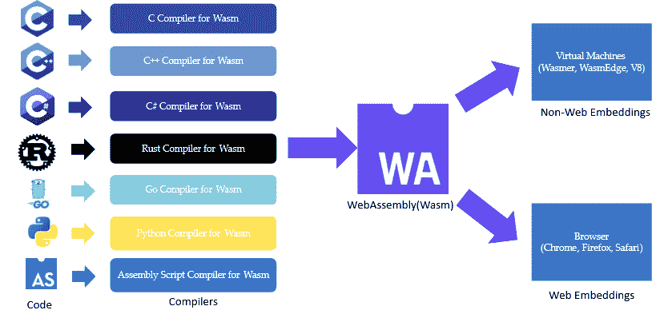
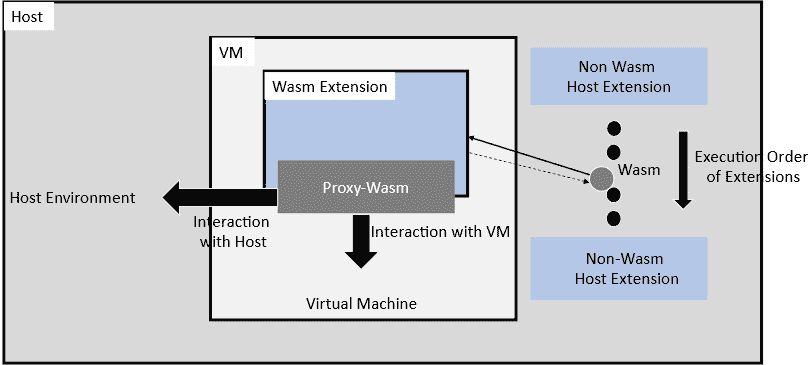
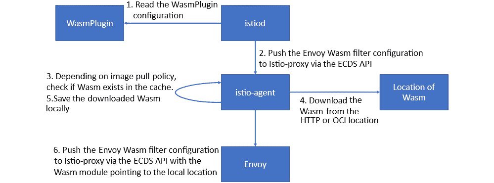

# 第九章：扩展 Istio 数据平面

Istio 提供了多种 API 来管理数据平面流量。有一个名为`EnvoyFilter`的 API 我们尚未使用。`EnvoyFilter` API 提供了一种定制 Istio 控制平面生成的 istio-proxy 配置的方式。使用`EnvoyFilter` API，您可以直接使用 Envoy 过滤器，即使它们没有被 Istio API 直接支持。

还有另一个 API 叫做`WasmPlugins`，它是扩展 istio-proxy 功能的另一种机制，**WebAssembly**（**Wasm**）支持在 Envoy 等代理中变得越来越常见，以便开发人员构建扩展。

在本章中，我们将讨论这两个主题；然而，关于`EnvoyFilter`的内容会简要介绍，因为您已经在*第三章*中学习了 Envoy 的过滤器和插件。我们将重点讲解如何从 Istio 配置中调用 Envoy 插件。但我们会像往常一样通过动手活动深入探讨 Wasm。

本章将涵盖以下主题：

+   为什么需要可扩展性？

+   使用 EnvoyFilter 定制数据平面

+   理解 Wasm 的基本原理

+   使用 Wasm 扩展 Istio 数据平面

# 技术要求

为了简化操作，我们将使用 minikube 来进行本章的动手练习。到目前为止，您应该已经熟悉了安装和配置 minikube 的步骤，如果还不熟悉，请参阅*第四章*的*技术要求*部分。

除了 minikube 外，最好在工作站上安装 Go 和 TinyGo。如果您是 Go 的新手，请按照[`go.dev/doc/install`](https://go.dev/doc/install)中的说明进行安装。根据[`tinygo.org/getting-started/install/macos/`](https://tinygo.org/getting-started/install/macos/)的说明为您的主机操作系统安装 TinyGo。然后，通过以下命令验证安装是否成功：

```
% tinygo version
tinygo version 0.26.0 darwin/amd64 (using go version go1.18.5 and LLVM version 14.0.0)
```

# 为什么需要可扩展性？

和任何好的架构一样，**可扩展性**非常重要，因为没有 *一刀切* 的技术方法能够适应每个应用程序的需求。可扩展性在 Istio 中尤为重要，因为它为用户提供了构建特殊情况和根据个人需求扩展 Istio 的选项。在 Istio 和 Envoy 的早期，两个项目采取了不同的方式来构建可扩展性。Istio 采用了构建通用的进程外扩展模型——**Mixer**（[`istio.io/v1.6/docs/reference/config/policy-and-telemetry/mixer-overview/`](https://istio.io/v1.6/docs/reference/config/policy-and-telemetry/mixer-overview/)），而 Envoy 则专注于代理内扩展（[`www.envoyproxy.io/docs/envoy/latest/extending/extending`](https://www.envoyproxy.io/docs/envoy/latest/extending/extending)）。Mixer 现在已被弃用；它是一种基于插件的实现，用于构建各种基础设施后端的扩展（也称为适配器）。一些适配器的例子包括 Bluemix、AWS、Prometheus、Datadog 和 SolarWinds。这些适配器使 Istio 能够与各种后端系统进行接口，以进行日志记录、监控和遥测，但基于适配器的扩展模型存在显著的资源低效问题，影响了尾延迟和资源利用率。这个模型本身也有局限性，应用场景有限。Envoy 的扩展方法要求用户用 C++ 编写过滤器，而 C++ 也是 Envoy 的本地语言。用 C++ 编写的扩展会与 Envoy 的代码一起打包、编译并进行测试，确保它们按预期工作。Envoy 的代理内扩展方法要求在 C++ 中编写扩展，随后进行单体构建过程，并且你必须自己维护 Envoy 的代码库。一些大型组织能够管理自己版本的 Envoy 代码库，但大多数 Envoy 社区成员认为这种方法不可行。因此，Envoy 采取了其他构建扩展的方法，其中一个是 **基于 Lua 的过滤器**，另一个是 Wasm 扩展。在基于 Lua 的扩展中，用户可以在现有的 Envoy HTTP Lua 过滤器中编写内联 Lua 代码。以下是一个 Lua 过滤器的示例；Lua 脚本已被突出显示：

```
http_filters:
name: envoy.filters.http.lua
typed_config:
  "@type": type.googleapis.com/envoy.extensions.filters.http.lua.v3.Lua
  default_source_code:
    inline_string: |
     function envoy_on_request(request_handle)
...... -- Do something on the request path.
       request_handle:headers():add("NewHeader", "XYZ")
     end
     function envoy_on_response(response_handle)
       -- Do something on the response path.
      response_handle:logInfo("Log something")
     response_handle:headers:add("response_size",response_handle:body():length())
      response_handle:headers:remove("proxy")
    end
```

在这个示例中，我们使用了 `envoy_on_request` 和/或 `envoy_on_response` 函数，这些函数分别在请求和响应周期上作为协程执行。你可以在这些函数中编写 Lua 代码，以在请求/响应处理过程中执行以下操作：

+   检查和修改请求和响应流的头部、主体和尾部

+   异步 HTTP 调用上游系统

+   执行直接响应并跳过进一步的过滤器迭代

你可以在 [`www.envoyproxy.io/docs/envoy/latest/configuration/http/http_filters/lua_filter.html?highlight=lua%20filter`](https://www.envoyproxy.io/docs/envoy/latest/configuration/http/http_filters/lua_filter.html?highlight=lua%20filter) 阅读更多关于 Envoy HTTP Lua 过滤器的内容。这种方法适合简单的逻辑，但当编写复杂的处理指令时，编写内联 Lua 代码就不太实际。内联代码不容易与其他开发人员共享，也不容易与软件编程的最佳实践对齐。另一个缺点是缺乏灵活性，因为开发人员只能使用 Lua，这限制了非 Lua 开发人员编写这些扩展的能力。

为了给 Istio 提供可扩展性，需要一种带来更少权衡的方案。由于 Istio 的数据平面由 Envoy 组成，因此将 Envoy 和 Istio 的扩展性统一起来是有意义的。这可以将 Envoy 的发布与其扩展生态系统解耦，使 Istio 用户能够使用自己选择的语言构建数据平面扩展，利用最佳的编程语言和实践，然后部署这些扩展，而不会对生产环境中的 Istio 部署造成任何停机风险。在这个共同努力的基础上，Wasm 支持已被引入 Istio。在接下来的部分中，我们将讨论 Wasm。但在那之前，让我们快速回顾一下 Istio 对运行 Envoy 过滤器的支持。

# 使用 Envoy Filter 自定义数据平面

Istio 提供了 `EnvoyFilter` API，允许修改通过其他 Istio `EnvoyFilter` CRD 创建的配置，你可以直接更改这些低级配置。这是一个非常强大的功能，但也应该小心使用，因为如果使用不当，可能会导致更糟的结果。通过使用 `EnvoyFilter`，你可以应用 Istio CRD 中没有直接提供的配置，并执行更高级的 Envoy 功能。该过滤器可以在命名空间级别以及通过标签标识的特定工作负载级别上应用。

让我们通过一个示例来进一步理解这个问题。

我们将选取在 *第七章* 中执行的一个实际操作来将请求路由到 `httpbin.org`。不要忘记创建 `Chapter09` 文件夹并开启 `istio-injection`。以下命令将按照 `Chapter09/01-httpbin-deployment.yaml` 中的描述部署 `httpbin` Pod：

```
kubectl apply -f Chapter09/01-httpbin-deployment.yaml
curl -H "Host:httpbin.org" http://a816bb2638a5e4a8c990ce790b47d429-1565783620.us-east-1.elb.amazonaws.com/get
```

仔细检查所有响应字段，确保包含请求中传递的所有头部信息。

使用 `EnvoyFilter`，我们将在请求发送到 `httpbin` Pod 之前添加一个自定义头部。对于这个示例，我们选择 `ChapterName` 作为头部名称，并将其值设置为 `ExtendingIstioDataPlane`。`Chapter09/02-httpbinenvoyfilter-httpbin.yaml` 中的配置会将自定义头部添加到请求中。

使用 `EnvoyFilter` 应用以下配置：

```
$ kubectl apply -f Chapter09/02-httpbinenvoyfilter-httpbin.yaml
envoyfilter.networking.istio.io/updateheaderhorhttpbin configured
```

让我们分两部分来讲解`Chapter09/02-httpbinenvoyfilter-httpbin.yaml`：

```
apiVersion: networking.istio.io/v1alpha3
kind: EnvoyFilter
metadata:
  name: updateheaderforhttpbin
  namespace: chapter09
spec:
  workloadSelector:
    labels:
      app: httpbin
  configPatches:
  - applyTo: HTTP_FILTER
    match:
      context: SIDECAR_INBOUND
      listener:
        portNumber: 80
        filterChain:
          filter:
            name: "envoy.filters.network.http_connection_manager"
            subFilter:
              name: "envoy.filters.http.router"
```

在这一部分，我们将在 `chapter09` 命名空间中创建一个名为 `updateheaderforhttpbin` 的 EnvoyFilter，它将应用于具有 `app` 标签且值为 `httpbin` 的工作负载。对于该配置，我们正在为 `httpbin` Pod 的端口 `80` 上的所有传入流量应用配置补丁，该流量会传递到 Istio 侧车即 istio-proxy 即 Envoy。该配置补丁应用于 `HTTP_FILTER`，特别是应用于 `http_connection_manager` 网络过滤器的 HTTP 路由过滤器。

在 EnvoyFilter 配置的下一部分，我们在现有路由配置之前应用配置，特别是我们正在附加一个包含内联代码的 Lua 过滤器，正如 `inlineCode` 部分所指定的那样。Lua 代码在 `envoy_on_request` 阶段运行，并添加一个请求头，名称为 `X-ChapterName`，值为 `ExtendingIstioDataPlane`：

```
 patch:
      operation: INSERT_BEFORE
      value:
        name: envoy.lua
        typed_config:
          "@type": "type.googleapis.com/envoy.extensions.filters.http.lua.v3.Lua"
          inlineCode: |
            function envoy_on_request(request_handle)
              request_handle:logInfo(" ========= XXXXX ==========");
              request_handle:headers():add("X-ChapterName", "ExtendingIstioDataPlane");
            end
```

现在，继续使用以下命令测试端点：

```
% curl -H "Host:httpbin.org" http://a816bb2638a5e4a8c990ce790b47d429-1565783620.us-east-1.elb.amazonaws.com/get
```

你将在响应中收到已添加的头部信息。

你可以使用以下命令查看应用的最终 Envoy 配置。要找到 `httpbin` Pod 的确切名称，可以使用 `proxy-status`：

```
% istioctl proxy-status | grep httpbin
httpbin-7bffdcffd-l52sh.chapter09
Kubernetes     SYNCED     SYNCED     SYNCED     SYNCED      NOT SENT     istiod-56fd889679-ltxg5     1.14.3
```

接下来是监听器的 `proxy-config` 详细信息：

```
% istioctl proxy-config listener httpbin-7bffdcffd-l52sh.chapter09  -o json
```

在输出中，查找 `envoy.lua`，这是我们通过配置应用的补丁和过滤器的名称。在输出中，查找 `filterChainMatch` 和设置为 `80` 的 `destinationPort`：

```
"filterChainMatch": {
                    "destinationPort": 80,
                    "transportProtocol": "raw_buffer"
                },
```

我们通过 EnvoyFilter 应用了该配置：

```
  {
                                    "name": "envoy.lua",
                                    "typedConfig": {
                                        "@type": "type.googleapis.com/envoy.extensions.filters.http.lua.v3.Lua",
                                        "inlineCode": "function envoy_on_request(request_handle)\n  request_handle:logInfo(\" ========= XXXXX ==========\");\n  request_handle:headers():add(\"X-ChapterName\", \"ExtendingIstioDataPlane\");\nend \n"
                                    }
                                }
```

希望这给了你一些关于 EnvoyFilter 以及整体机制如何工作的想法。在本章的动手练习中，另一个示例应用相同的更改，但在 Ingress 网关层级。你可以在 `Chapter09/03-httpbinenvoyfilter-httpbiningress.yaml` 文件中找到该示例。在应用 Ingress 网关更改之前，请确保删除 `Chapter09/02-httpbinenvoyfilter-httpbin.yaml` 文件。

欲了解更多有关 EnvoyFilter 各种配置的详细信息，请参考 Istio 文档：[`istio.io/latest/docs/reference/config/networking/envoy-filter/#EnvoyFilter-EnvoyConfigObjectPatch`](https://istio.io/latest/docs/reference/config/networking/envoy-filter/#EnvoyFilter-EnvoyConfigObjectPatch)。

重要提示

清理时，请使用此命令：`kubectl delete` `ns chapter09`。

在下一部分中，我们将学习 Wasm 基础知识，然后了解如何使用 Wasm 扩展 Istio 数据平面。

# 理解 Wasm 基础知识

Wasm 是一种便携式二进制格式，旨在运行在**虚拟机**（**VMs**）上，使其能够在各种计算机硬件和数字设备上运行，并且在提升 Web 应用性能方面被广泛应用。它是为堆栈机设计的虚拟**指令集架构**（**ISA**），旨在便携、紧凑且安全，具有较小的二进制文件大小，能够减少在 Web 浏览器执行时的下载时间。现代浏览器的 JavaScript 引擎能够比 JavaScript 解析和下载 Wasm 二进制格式快几个数量级。所有主要浏览器厂商都已支持 Wasm，Mozilla 基金会表示，Wasm 代码运行速度比等效的 JavaScript 代码快 10%到 800%。它提供了更快的启动时间和更高的峰值性能，且不会造成内存膨胀。

Wasm 也是构建 Envoy 扩展的首选且实用的选择，原因如下：

+   Wasm 扩展可以在运行时交付，而无需重新启动 istio-proxy。此外，扩展可以通过多种方式加载到 istio-proxy，而无需对 istio-proxy 进行任何更改。这使得能够以扩展的形式交付对扩展和代理行为的更改，而无需任何停机。

+   Wasm 与宿主机隔离，并在沙箱/虚拟机环境中执行，通过**应用程序二进制接口**（**ABI**）与宿主机通信。通过 ABI，我们可以控制哪些内容可以或不能修改，以及哪些内容对扩展可见。

+   在沙箱环境中运行 Wasm 的另一个好处是隔离性和定义的故障边界。如果 Wasm 执行出现问题，干扰的范围将仅限于沙箱内，不会扩展到宿主进程。



图 9.1 – Wasm 概述

超过三十种编程语言支持编译为 Wasm 模块。一些示例包括 C、Java、Go、Rust、C++和 TypeScript。这使得大多数开发人员能够使用他们选择的编程语言来构建 Istio 扩展。

为了熟悉 Wasm，我们将使用 Go 构建一个示例应用程序。源代码位于`Chapter09/go-Wasm-example`文件夹中。

问题陈述是构建一个 HTML 页面，该页面接受一个小写字符串，并提供大写输出。我们假设你已经有一些 Go 的工作经验，并且 Go 已安装在你的实践环境中。如果你不想使用 Go，可以尝试使用你选择的语言实现该示例：

1.  从`Chapter09/go-Wasm-example`复制代码，并重新初始化 Go 模块：

    ```
    % go mod init Bootstrap-Service-Mesh-Implementations-with-Istio/Chapter09/go-Wasm-example
    % go mod tidy
    ```

首先，让我们检查`Chapter09/go-Wasm-example/cmd/Wasm/main.go`：

```
package main
import (
    "strings"
    "syscall/js"
)
func main() {
    done := make(chan struct{}, 0)
    js.Global().Set("WasmHash", js.FuncOf(convertToUpper))
    <-done
}
func convertToUpper(this js.Value, args []js.Value) interface{} {
    strings.ToUpper(args[0].String())
    return strings.ToUpper(args[0].String())
}
```

`done := make(chan struct{}, 0)`和`<-done`是 Go 通道。Go 通道用于并发函数之间的通信。

`js.Global().Set("WasmHash", hash)`将 Go 哈希函数暴露给 JavaScript。

`convertToUpper`函数将一个字符串作为参数传入，参数随后使用`syscall/js`包中的`.String()`函数进行类型转换。`strings.ToUpper(args[0].String())`这一行将 JavaScript 提供的所有参数转换为大写字符串，并将其作为函数的输出返回。

1.  下一步是使用以下命令编译`Chapter09/go-Wasm-example/cmd/Wasm/main.go`：

    ```
    % GOOS=js GOARCH=Wasm go build -o static/main.Wasm cmd/Wasm/main.go
    ```

这里的秘密配方是`GOOS=js GOARCH=Wasm`，它告诉 Go 编译器将目标主机设为 JavaScript，目标架构设为 Wasm。如果没有这一步，Go 编译器将根据你的工作站规格编译成目标操作系统和架构。你可以在[`gist.github.com/asukakenji/f15ba7e588ac42795f421b48b8aede63`](https://gist.github.com/asukakenji/f15ba7e588ac42795f421b48b8aede63)查看有关`GOOS`和`GOARCH`的更多信息。

然后，命令将在静态文件夹中生成名为`main.Wasm`的 Wasm 文件。

1.  我们还需要在浏览器中获取并执行 Wasm。幸运的是，Go 通过`Wasm_exec.js`实现了这一功能。

JavaScript 文件可以在`GOROOT`文件夹中找到。要将其复制到静态目录，请使用以下命令：

```
% cp "$(go env GOROOT)/misc/Wasm/Wasm_exec.js" ./static
```

1.  我们有 Wasm 和 JavaScript 来加载并在浏览器中执行 Wasm。我们需要创建一个 HTML 页面并从中加载 JavaScript。你将在`Chapter09/go-Wasm-example/static/index.html`中找到示例 HTML 页面。在 HTML 中你会看到以下代码片段来加载 JavaScript 并实例化 Wasm：

    ```
    <script src="img/Wasm_exec.js"></script>
    <script>
        const go = new Go();
        WebAssembly.instantiateStreaming(fetch("main.Wasm"), go.importObject).then((result) => {
            go.run(result.instance);
        });
    </script>
    ```

1.  最后一步，我们需要一个 Web 服务器。你可以使用`nginx`或使用`Chapter09/go-Wasm-example/cmd/webserver/main.go`中的示例 HTTP 服务器包。使用以下命令运行服务器：

    ```
    % go run ./cmd/webserver/main.go
    Listening on http://localhost:3000/index.html
    ```

1.  在浏览器中打开[`localhost:3000/index.html`](http://localhost:3000/index.html)，并测试在文本框中输入的小写字母是否会被转换为大写字母：


图 9.2 – 使用 Go 创建 Wasm

本节介绍了 Wasm 的基本知识，希望你在阅读后已经对 Wasm 有了初步的了解。在下一节中，我们将学习 Wasm 如何帮助扩展 Istio 数据平面。

# 使用 Wasm 扩展 Istio 数据平面

Wasm 的主要目标是实现高性能的网页应用，因此 Wasm 最初是为在网页浏览器中执行而设计的。Wasm 有一个**万维网联盟**（**W3C**）工作组，详情可以在[`www.w3.org/Wasm/`](https://www.w3.org/Wasm/)查看。该工作组管理 Wasm 规范，具体内容可见[`www.w3.org/TR/Wasm-core-1/`](https://www.w3.org/TR/Wasm-core-1/)和[`www.w3.org/TR/Wasm-core-2/`](https://www.w3.org/TR/Wasm-core-2/)。大多数互联网浏览器已经实现了该规范，Google Chrome 的相关信息可以在[`chromestatus.com/feature/5453022515691520`](https://chromestatus.com/feature/5453022515691520)找到。Mozilla 基金会还维护浏览器兼容性，详情请参见[`developer.mozilla.org/en-US/docs/WebAssembly#browser_compatibility`](https://developer.mozilla.org/en-US/docs/WebAssembly#browser_compatibility)。关于在第四层和第七层代理上支持 Wasm 执行的工作，大多数工作是最近才开始的。在代理上执行 Wasm 时，我们需要与主机环境进行通信的方式。与网页浏览器的开发类似，Wasm 应该只编写一次，之后可以在任何代理上运行。

## 介绍 Proxy-Wasm

为了使 Wasm 能够与主机环境通信，并使 Wasm 的开发与底层主机环境无关，存在一个`Proxy-Wasm`规范，也称为代理用 Wasm。该规范由`Proxy-Wasm` ABI 组成，属于低级别接口。然后，这些规范会在高级语言中抽象出来，形成`Proxy-Wasm`模块，即`Proxy-Wasm` ABI 规范。

`Proxy-Wasm`的概念可能很难理解。为了让它们更易于消化，我们将其分解成以下几个部分，并逐一讲解。

### Proxy-Wasm ABI

ABI 是一种低级接口规范，描述了 Wasm 如何与虚拟机和主机进行通信。规范的详细信息可以在[`github.com/proxy-Wasm/spec/blob/master/abi-versions/vNEXT/README.md`](https://github.com/proxy-Wasm/spec/blob/master/abi-versions/vNEXT/README.md)找到，规范本身可以在[`github.com/proxy-Wasm/spec`](https://github.com/proxy-Wasm/spec)查看。为了理解 API，最好先了解 ABI 规范中一些最常用的方法，从而理解它的作用：

+   `_start`：此函数需要在 Wasm 中实现，并且在 Wasm 加载和初始化时会被调用。

+   `proxy_on_vm_start`：当主机机器启动 Wasm 虚拟机时调用此方法。Wasm 可以使用此方法来检索虚拟机的任何配置详情。

+   `proxy_on_configure`：当主机环境启动插件并加载 Wasm 时调用此方法。通过此方法，Wasm 可以检索与插件相关的任何配置。

+   `proxy_on_new_connection`: 这是一个级别为 4 的扩展，当代理与客户端之间建立 TCP 连接时调用。

+   `proxy_on_downstream_data`: 这是一个级别为 4 的扩展，当从客户端接收到每个数据块时调用。

+   `proxy_on_downstream_close`: 这是一个级别为 4 的扩展，当与下游的连接关闭时调用。

+   `proxy_on_upstream_data`: 这是一个级别为 4 的扩展，当从上游接收到每个数据块时调用。

+   `proxy_on_upstream_close`: 这是一个级别为 4 的扩展，当与上游的连接关闭时调用。

+   `proxy_on_http_request_headers`: 这是一个级别为 7 的扩展，在从客户端接收到 HTTP 请求头时调用。

+   `proxy_on_http_request_body`: 这是一个级别为 7 的扩展，在从客户端接收到 HTTP 请求体时调用。

+   `proxy_on_http_response_headers`: 这是一个级别为 7 的扩展，在从上游接收到 HTTP 响应头时调用。

+   `proxy_on_http_response_body`: 这是一个级别为 7 的扩展，在从上游接收到 HTTP 响应体时调用。

+   `proxy_send_http_response`: 这也是一个级别为 7 的扩展，在主机环境 Envoy 中实现。使用这种方法，Wasm 可以指示 Envoy 在不实际调用上游服务的情况下发送 HTTP 响应。

此列表并未涵盖 ABI 中的所有方法，但我们希望它能让您对 ABI 的用途有所了解。以下图表说明了我们在本节中涵盖的内容：



图 9.3 – 代理 Wasm ABI

如果我们在 Envoy 的背景下分析这个图表，我们可以得出以下解释：

+   本地扩展按照配置文件中指定的顺序执行。

+   Envoy 还为加载 Wasm 提供了一个本地扩展，详见[`www.envoyproxy.io/docs/envoy/latest/api-v3/extensions/Wasm/v3/Wasm.proto`](https://www.envoyproxy.io/docs/envoy/latest/api-v3/extensions/Wasm/v3/Wasm.proto)。该扩展负责加载并请求 Envoy 执行 Wasm。

+   Envoy 在虚拟机上执行 Wasm。

+   在执行过程中，通过`Proxy-Wasm` ABI，Wasm 可以与请求、虚拟机和 Envoy 进行交互，我们在本节的早些时候看到了一些这些交互点。

+   一旦 Wasm 执行完成，执行流程将返回到配置文件中定义的其他本地扩展。

虽然 ABI 很复杂，但它们也非常低级且不适合程序员使用，通常他们更喜欢在高级编程语言中编写代码。在下一节中，我们将了解代理 Wasm SDK 如何解决这个问题。

### 代理 Wasm SDK

Proxy-Wasm SDK 是 Proxy-Wasm ABI 的高级抽象，已在多种编程语言中实现。Proxy-Wasm SDK 遵循 ABI，这样在创建 Wasm 时，你不需要了解 Proxy-Wasm ABI。撰写本章时，Proxy-Wasm API 的 SDK 已在 Go（使用 TinyGo 编译器）、Rust、C++ 和 AssemblyScript 中提供。与我们对 ABI 所做的类似，我们将选择其中一种语言的 SDK，并进行分析，以了解 ABI 与 SDK 之间的关系。因此，让我们通过一些 Proxy-Wasm Go SDK 中的函数来感受它；该 SDK 可以在 [`pkg.go.dev/github.com/tetratelabs/proxy-Wasm-go-SDK/proxyWasm`](https://pkg.go.dev/github.com/tetratelabs/proxy-Wasm-go-SDK/proxyWasm) 找到。

首先，你需要了解 SDK 中定义的各种类型，因此我们提供了以下基础类型的列表：

+   `VMContext`：对应于每个 Wasm 虚拟机（VM）。对于每个 Wasm 虚拟机，只有一个 `VMContext`。`VMContext` 具有以下方法：

    +   `OnVMStart(vmConfigurationSize int) OnVMStartStatus`：当虚拟机创建时会调用此方法。在此方法内部，Wasm 可以检索虚拟机配置。

    +   `NewPluginContext(contextID uint32) PluginContext`：为每个插件配置创建一个插件上下文。

+   `PluginContext`：对应于宿主中每个插件的配置。插件在 HTTP 或网络过滤器中为监听器配置。`PluginContext` 中的一些方法如下：

    +   `OnPluginStart(pluginConfigurationSize int) OnPluginStartStatus`：此方法会为所有已配置的插件调用。一旦虚拟机（VM）创建完成，Wasm 可以通过此方法检索插件配置。

    +   `OnPluginDone() bool`：当宿主删除 `PluginContext` 时会调用此方法。如果此方法返回 `true`，则表示可以删除 `PluginContext`，而 `false` 表示插件处于待处理状态，尚不能删除。

    +   `NewTcpContext(contextID uint32) TcpContext`：此方法创建 `TCPContext`，对应于每个 TCP 请求。

    +   `NewHttpContext(contextID uint32) HttpContext`：此方法创建 `HTTPContext`，对应于每个 HTTP 请求。

+   `HTTPContext`：此方法由 `PluginContext` 为每个 HTTP 流创建。以下是该接口中的一些可用方法：

    +   `OnHttpRequestHeaders(numHeaders int, endOfStream bool) Action`：此方法提供访问作为请求流一部分的 HTTP 头部的功能。

    +   `OnHttpRequestBody(bodySize int, endOfStream bool) Action`：此方法提供访问请求体数据帧的功能。它会为请求体中的每个数据帧多次调用。

    +   `OnHttpResponseHeaders(numHeaders int, endOfStream bool) Action`：此方法提供访问响应头的功能。

    +   `OnHttpResponseBody(bodySize int, endOfStream bool) Action`：此方法提供访问响应体帧的功能。

    +   `OnHttpStreamDone()`：该方法在`HTTPContext`删除之前被调用。在此方法中，Wasm 可以访问 HTTP 连接的请求和响应阶段的所有信息。

其他类型包括`TCPContext`，我们没有涵盖 SDK 中的所有方法和类型；你可以在[`pkg.go.dev/github.com/tetratelabs/proxy-Wasm-go-SDK@v0.20.0/proxyWasm/types#pkg-types`](https://pkg.go.dev/github.com/tetratelabs/proxy-Wasm-go-SDK@v0.20.0/proxyWasm/types#pkg-types)中找到完整的列表和详细信息。

在了解了这些概述后，我们开始编写一个 Wasm，将自定义头信息注入到`envoydummy` Pod 的响应中。请注意，在*使用 Envoy 过滤器自定义数据平面*一节中，我们使用 EnvoyFilter 来修补 Istio，并应用了一个包含内联代码的 Lua 过滤器，将头信息注入到发送到`httpbin` Pod 的请求中。

创建`chapter09-temp`命名空间，并禁用`istio-injection`：

```
% kubectl create ns chapter09-temp
namespace/chapter09-temp created
```

运行`envoydummy`，检查其是否按预期工作：

```
% kubectl apply -f Chapter09/01-envoy-dummy.yaml
namespace/chapter09-temp created
service/envoydummy created
configmap/envoy-dummy-2 created
deployment.apps/envoydummy-2 created
```

转发端口以便你可以在本地进行测试：

```
% kubectl port-forward svc/envoydummy 18000:80 -n chapter09-t
emp
Forwarding from 127.0.0.1:18000 -> 10000
```

然后，测试端点：

```
% curl  localhost:18000
V2----------Bootstrap Service Mesh Implementation with Istio----------V2%
```

所以，我们已经验证了`envoydummy`正在正常工作。下一步是创建 Wasm，将头信息注入响应中。你可以在[Chapter09/go_Wasm_example_for_envoy](http://Chapter09/go_Wasm_example_for_envoy)找到源代码。

Go 模块中只有一个`main.go`文件，以下是代码的关键部分：

Go 模块的入口点是`main`方法。在`main`方法中，我们通过调用`SetVMContext`来设置 Wasm 虚拟机。该方法在[`github.com/tetratelabs/proxy-wasm-go-sdk/tree/main/proxywasm`](https://github.com/tetratelabs/proxy-wasm-go-sdk/tree/main/proxywasm)中的`Entrypoint.go`文件中有描述。以下代码片段展示了`main`方法：

```
func main() {
    proxyWasm.SetVMContext(&vmContext{})
}
```

以下方法将一个头信息注入到响应头中：

```
func (ctx *httpHeaders) OnHttpResponseHeaders(numHeaders int, endOfStream bool) types.Action {
    if err := proxyWasm.AddHttpResponseHeader("X-ChapterName", "ExtendingEnvoy"); err != nil {
        proxyWasm.LogCritical("failed to set response header: X-ChapterName")
    }
    return types.ActionContinue
}
```

另外，注意`AddHttpResponseHeader`，该方法定义在[`github.com/tetratelabs/proxy-Wasm-go-SDK/blob/v0.20.0/proxyWasm/hostcall.go#L395`](https://github.com/tetratelabs/proxy-Wasm-go-SDK/blob/v0.20.0/proxyWasm/hostcall.go#L395)。

下一步是为 Wasm 编译 Go 模块，我们需要使用 TinyGo。请注意，由于 Proxy-Wasm Go SDK 不支持标准 Go 编译器，因此我们无法使用标准 Go 编译器。

根据[`tinygo.org/getting-started/install/macos/`](https://tinygo.org/getting-started/install/macos/)中的说明，为你的主机操作系统安装 TinyGo。

使用 TinyGo，使用以下命令编译 Go 模块和 Wasm：

```
% tinygo build -o main.Wasm -scheduler=none -target=wasi main.go
```

一旦 Wasm 文件创建完成，我们需要将 Wasm 文件加载到`configmap`中：

```
% kubectl create configmap 01-Wasm --from-file=main.Wasm -n chapter09-temp
configmap/01-Wasm created
```

修改`envoy.yaml`文件，以应用 Wasm 过滤器并从`configmap`加载 Wasm：

```
http_filters:
              - name: envoy.filters.http.Wasm
                typed_config:
                  "@type": type.googleapis.com/udpa.type.v1.TypedStruct
                  type_url: type.googleapis.com/envoy.extensions.filters.http.Wasm.v3.Wasm
                  value:
                    config:
                      vm_config:
                        runtime: "envoy.Wasm.runtime.v8"
                        code:
                          local:
                            filename: "/Wasm2/main.Wasm"
              - name: envoy.filters.http.router
                typed_config:
                  "@type": type.googleapis.com/envoy.extensions.filters.http.router.v3.Router
```

我们在配置文件中指定`envoy`，以使用`v8`运行时来运行 Wasm。相关更改也可以在`Chapter09/02-envoy-dummy.yaml`找到。按照如下方式应用更改：

```
% kubectl apply -f Chapter09/02-envoy-dummy.yaml
service/envoydummy created
configmap/envoy-dummy-2 created
deployment.apps/envoydummy-2 created
```

将端口`80`转发到`18000`：

```
% kubectl port-forward svc/envoydummy 18000:80 -n chapter09-temp
```

测试端点，检查 Wasm 是否成功注入了响应头：

```
% curl -v localhost:18000
* Mark bundle as not supporting multiuse
< HTTP/1.1 200 OK
< content-length: 72
< content-type: text/plain
< x-chaptername: ExtendingEnvoy
* Connection #0 to host localhost left intact
V2----------Bootstrap Service Mesh Implementation with Istio----------V2%
```

希望这一节让您对如何创建符合 Proxy-Wasm 的 Wasm 并将其应用于 Envoy 有了信心。我们建议您通过查看[`github.com/tetratelabs/proxy-Wasm-go-SDK/tree/main/examples`](https://github.com/tetratelabs/proxy-Wasm-go-SDK/tree/main/examples)上的示例，进行更多实践。

在我们结束这一节之前，让我们检查一下 Wasm 如何符合 Proxy-Wasm ABI。为此，我们将安装`brew`：

```
% brew install wabt
```

WABT 提供了多种操作和检查 Wasm 的方法。其中一个工具，`Wasm-objdump`，可以打印 Wasm 二进制文件的信息。使用以下命令，您可以打印出所有在 Wasm 实例化后能访问到的主机环境函数列表：

```
% Wasm-objdump main.Wasm --section=export -x.
```

您会注意到输出是一个函数列表，这些函数在 Proxy-Wasm ABI 中有定义。

重要说明

要进行清理，您可以使用以下命令：

```
% kubectl delete ns chapter09-temp
```

这部分已完成关于 Proxy-Wasm 的内容，希望您现在理解了如何使用 Go SDK 创建符合 Proxy-Wasm 标准的 Wasm。在下一节中，我们将部署 Istio 中的 Wasm。

## 与 Istio 一起使用 Wasm

本节将扩展我们在前一节中构建的 Istio 数据平面 Wasm。我们将使用 Istio 的`httpbin`应用程序：

1.  第一步是将 Go 模块中创建的`main.Wasm`上传到 HTTPS 位置，模块位置在`Chapter09/go_Wasm_example_for_envoy`。您可以使用 AWS S3 或类似服务来实现；另一种选择是使用 OCI 注册表，如`main.Wasm`到 AWS S3。托管该文件的 S3 存储桶 HTTPS 位置为`https://anand-temp.s3.amazonaws.com/main.Wasm`。请注意，出于安全原因，您在阅读本书时可能无法访问该链接，但我相信您可以自己创建 S3 存储桶或 Docker 注册表。

1.  第二步是部署`httpbin`应用程序，相关文件已在`Chapter09/01-httpbin-deployment.yaml`中提供：

    ```
    % kubectl apply -f Chapter09/01-httpbin-deployment.yaml
    ```

检查以下命令的响应，并观察请求过程中添加的头信息：

```
% curl -H "Host:httpbin.org" http://a816bb2638a5e4a8c990ce790b47d429-1565783620.us-east-1.elb.amazonaws.com/get
```

1.  之后，我们将使用`WasmPlugin`应用以下更改：

    ```
    apiVersion: extensions.istio.io/v1alpha1
    kind: WasmPlugin
    metadata:
      name: addheaders
      namespace: chapter09
    spec:
      selector:
        matchLabels:
          app: httpbin
      url: https://anand-temp.s3.amazonaws.com/main.Wasm
      imagePullPolicy: Always
      phase: AUTHZ
    ```

使用以下命令应用`WasmPlugin`：

```
% kubectl apply -f Chapter09/01-Wasmplugin.yaml
Wasmplugin.extensions.istio.io/addheaders configured
```

我们将在*第 5 步*之后进一步了解`WasmPlugin`。现在，让我们查看`httpbin`的响应头：

```
% curl --head -H "Host:httpbin.org" http://a816bb2638a5e4a8c990ce790b47d429-1565783620.us-east-1.elb.amazonaws.com/get
```

您会注意到，正如预期的那样，响应中有`x-chaptername: ExtendingEnvoy`。

1.  让我们创建另一个 Wasm，向`request`添加自定义头信息，以便我们可以在`httpbin`负载的响应中看到它。为了这个目的，`Chapter09/go_Wasm_example_for_istio`中已经创建了一个 Wasm。请注意`main.go`中的`OnHTTPRequestHeaders`函数：

    ```
    func (ctx *httpHeaders) OnHttpRequestHeaders(numHeaders int, endOfStream bool) types.Action {
        if err := proxyWasm.AddHttpRequestHeader("X-Chapter", "Chapter09"); err != nil {
            proxyWasm.LogCritical("failed to set request header: X-ChapterName")
        }
        proxyWasm.LogInfof("added custom header to request")
        return types.ActionContinue
    }
    ```

将其编译成 Wasm 并复制到 S3 位置。另一个 Istio 配置文件`Chapter09/02-Wasmplugin.yaml`也可以用于部署此 Wasm：

```
apiVersion: extensions.istio.io/v1alpha1
kind: WasmPlugin
metadata:
  name: addheaderstorequest
  namespace: chapter09
spec:
  selector:
    matchLabels:
      app: httpbin
  url: https://anand-temp.s3.amazonaws.com/AddRequestHeader.Wasm
  imagePullPolicy: Always
  phase: AUTHZ
```

1.  应用更改后，测试端点，你会发现两个 Wasm 都已执行，在响应中添加了一个头部，同时在请求中也添加了一个头部，这在`httpbin`响应中得到了反映。以下是响应的简短版本：

    ```
    % curl -v -H "Host:httpbin.org" http://a816bb2638a5e4a8c990ce790b47d429-1565783620.us-east-1.elb.amazonaws.com/get
    < HTTP/1.1 200 OK
    ……
    < x-chaptername: ExtendingEnvoy
    <
    {
      "args": {},
      "headers": {
        "Accept": "*/*",
        "Host": "httpbin.org",
        "User-Agent": "curl/7.79.1",
    …..,
        "X-Chapter": "Chapter09",
    …
      },
      "origin": "10.10.10.216",
      "url": "http://httpbin.org/get"
    }
    ```

在*步骤 3*和*步骤 4*中，我们使用`WasmPlugin`在 Istio 数据平面上应用 Wasm。以下是我们在`WasmPlugin`中配置的参数：

+   `selector`：在`selector`字段中指定 Wasm 应应用的资源。它可以是 Istio 网关和 Kubernetes Pod。你需要提供标签，标签必须与应用 Wasm 配置的 Envoy sidecar 的工作负载匹配。在我们实现的示例中，我们应用了`app:httpbin`标签，这对应于`httpbin` Pod。

+   `url`：这是可以下载 Wasm 文件的位置。我们提供了 HTTP 位置，但也支持 OCI 位置。默认值是`oci://`，用于引用 OCI 镜像。要引用基于文件的位置，请使用`file://`，它用于引用在代理容器内本地存在的 Wasm 文件。

+   `imagePullPolicy`：此字段的可选值如下：

    +   `UNSPECIFIED_POLICY`：除非 URL 指向带有最新标签的 OCI 镜像，否则与`IfNotPresent`相同。在这种情况下，字段将默认为`Always`。

    +   `Always`：我们将始终从 URL 指定的位置拉取最新版本的镜像。

    +   `IfNotPresent`：仅当请求的版本在本地不可用时，才拉取 Wasm。

+   `phase`：此字段的可选值如下：

    +   `UNSPECIFIED_PHASE`：这意味着 Wasm 过滤器将被插入到过滤器链的末尾。

    +   `AUTHN`：这将在 Istio 认证过滤器之前插入插件。

    +   `AUTHZ`：这将在认证和授权过滤器之间插入插件。

    +   `STATS`：这将在授权过滤器后、统计过滤器前插入插件。

我们已经描述了在示例中使用的值，但可以在`WasmPlugin`中配置各种字段；你可以在[`istio.io/latest/docs/reference/config/proxy_extensions/Wasm-plugin/#WasmPlugin`](https://istio.io/latest/docs/reference/config/proxy_extensions/Wasm-plugin/#WasmPlugin)中找到详细列表。

对于生产部署，我们强烈建议使用`sha256`字段来确保 Wasm 模块的完整性。

Istio 通过利用 istio-agent 内的 xDS 代理和 Envoy 的**扩展配置发现服务**（**ECDS**）为 Wasm 提供了可靠的开箱即用分发机制。有关 ECDS 的详细信息，请访问[`www.envoyproxy.io/docs/envoy/latest/configuration/overview/extension`](https://www.envoyproxy.io/docs/envoy/latest/configuration/overview/extension)。

应用`WasmPlugin`后，你可以检查`istiod`日志中的 ECDS 条目：

```
% kubectl logs istiod-56fd889679-ltxg5 -n istio-system
```

你会找到类似如下的日志条目：

```
10-18T12:02:03.075545Z     info ads  ECDS: PUSH for node:httpbin-7bffdcffd-4zrhj.chapter09 resources:1 size:305B
```

Istio 向 istio-proxy 发出 ECDS 调用，应用`WasmPlugin`。以下图示描述了通过 ECDS API 应用 Wasm 的过程：



图 9.4 – 向 Istio 数据平面分发 Wasm

部署在 Envoy 旁边的 istio-agent 拦截来自`istiod`的 ECDS 调用。然后它下载 Wasm 模块，保存到本地，并更新 ECDS 配置，指定下载的 Wasm 模块的路径。如果 WASM 模块无法访问 Istio-agent，它将拒绝 ECDS 更新。你可以在`istiod`日志中看到 ECDS 更新失败。

本节到此结束，希望它能为你提供足够的知识，帮助你开始将 Wasm 应用到生产工作负载中。

# 总结

在本章中，我们了解了 Wasm 及其用途。我们学习了 Wasm 如何因其高性能而在网页上使用，并且我们也熟悉了如何使用 Go 构建 Wasm，并通过 JavaScript 从浏览器中使用它。Wasm 也正逐渐成为服务器端的热门选择，尤其是在网络代理（如 Envoy）中。

为了获得一个标准化的接口来实现代理的 Wasm，有 Proxy-Wasm ABI 规范，这些是低级规范，描述了 Wasm 和托管 Wasm 的代理之间的接口。Envoy 的 Wasm 需要符合 Proxy-Wasm 规范，但 Proxy-Wasm ABI 很难使用；相比之下，Proxy-Wasm SDK 更易于使用。在写这章时，有许多编程语言中都有 Proxy-Wasm SDK 的实现，其中 Rust、Go、C++和 AssemblyScript 是最受欢迎的几种。我们利用 Envoy Wasm 过滤器，在 Envoy HTTP 过滤器链上配置 Wasm。然后，我们构建了一些简单的 Wasm 示例来操作请求和响应头，并通过`WasmPlugin`将它们部署到 Istio 上。Wasm 并不是扩展 Istio 数据平面的唯一选项，还有一个名为 EnvoyFilter 的过滤器，可以将 Envoy 配置作为补丁应用到由`Istiod`创建的 Envoy 配置上。

下一章非常有趣，因为我们将学习如何为非 Kubernetes 工作负载部署 Istio 服务网格。
