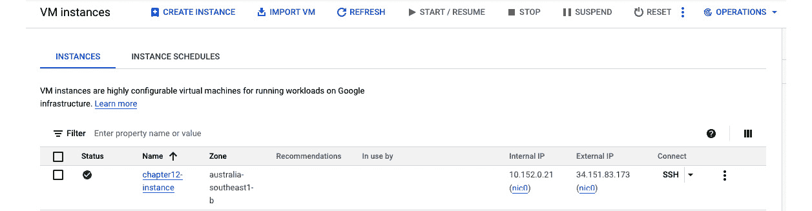
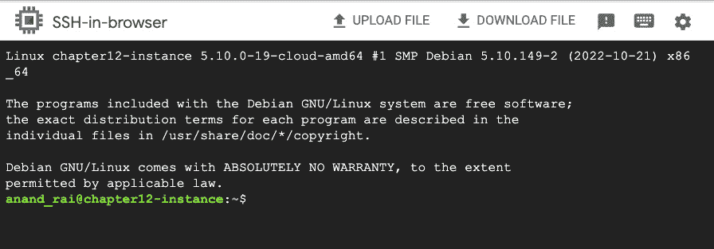
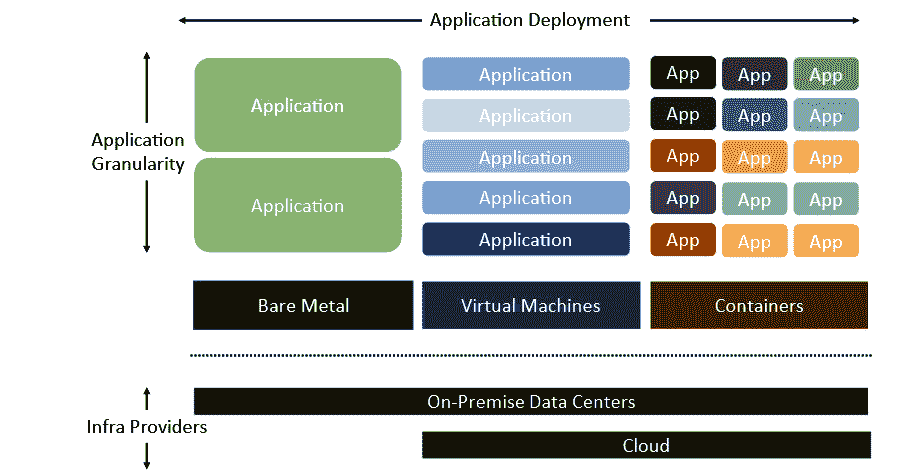
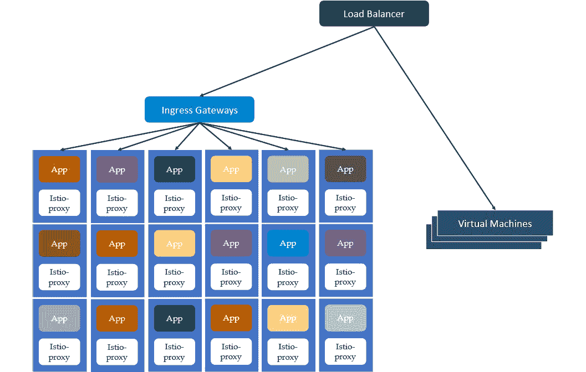
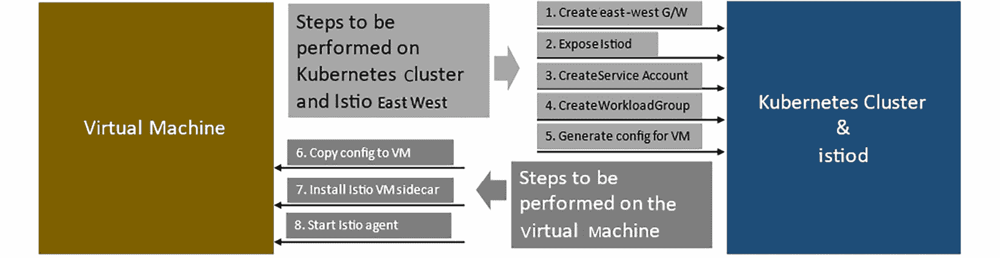
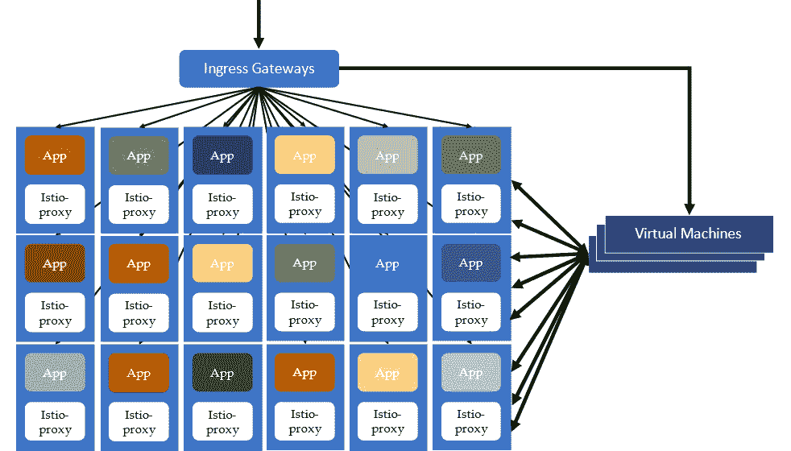
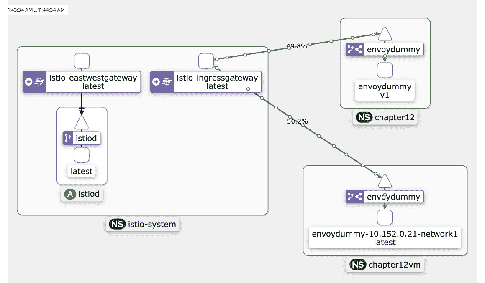

# 第十章：为非 Kubernetes 工作负载部署 Istio 服务网格

Istio 和 Kubernetes 是互补的技术。Kubernetes 解决了将分布式应用程序以容器形式打包、相互隔离并在具有专用资源的统一环境中部署的问题。尽管 Kubernetes 解决了容器的部署、调度和管理问题，但它并没有解决容器之间的流量管理问题。Istio 通过提供流量管理能力、增加可观察性并执行零信任安全模型，补充了 Kubernetes。

Istio 像是 Kubernetes 的边车；话虽如此，Kubernetes 是一项相对较新的技术，大约在 2017 年左右开始广泛应用。从 2017 年开始，大多数企业在构建微服务和其他云原生应用程序时使用 Kubernetes，但仍有许多应用程序没有基于 Kubernetes 构建或迁移到 Kubernetes；这些应用程序通常部署在**虚拟机**（**VM**）上。虚拟机不仅限于传统数据中心，而且也是云服务提供商的主流产品。组织最终会有一个基于 Kubernetes 的应用程序和基于虚拟机的应用程序并行部署在云端和本地的数据中心。

在本章中，我们将学习 Istio 如何帮助将传统技术与现代技术结合起来，以及如何将服务网格扩展到 Kubernetes 之外。在本章中，我们将涵盖以下主题：

+   检查混合架构

+   为混合架构设置服务网格

# 技术要求

使用以下命令，我们将在 Google Cloud 中设置基础设施，以供动手练习使用：

1.  创建一个 Kubernetes 集群：

    ```
    % gcloud container clusters create cluster1 --cluster-version latest --machine-type "e2-medium" --num-nodes "3" --network "default" --zone "australia-southeast1-a" --disk-type "pd-standard" --disk-size "30"
    kubeconfig entry generated for cluster1.
    NAME      LOCATION                MASTER_VERSION   MASTER_IP      MACHINE_TYPE  NODE_VERSION     NUM_NODES  STATUS
    cluster1  australia-southeast1-a  1.23.12-gke.100  34.116.79.135  e2-medium     1.23.12-gke.100  3          RUNNING
    ```

1.  创建虚拟机：

    ```
    % gcloud compute instances create chapter10-instance --tags=chapter10-meshvm \
      --machine-type=e2-medium --zone=australia-southeast1-b
      --network=default --subnet=default \
      --image-project=ubuntu-os-cloud \
      --image=ubuntu-1804-bionic-v20221201, mode=rw, size=10
    Created [https://www.googleapis.com/compute/v1/projects/istio-book-370122/zones/australia-southeast1-b/instances/chapter10-instance].
    NAME        ZONE                    MACHINE_TYPE  PREEMPTIBLE  INTERNAL_IP  EXTERNAL_IP   STATUS
    chapter10-instance australia-southeast1-b  e2-medium                10.152.0.13  34.87.233.38  RUNNING
    ```

1.  检查你的`kubectl`文件以找到集群名称，并适当设置`context`：

    ```
    % kubectl config view -o json | jq .contexts
    [
      {
        "name": "gke_istio-book-370122_australia-southeast1-a_cluster1",
        "context": {
          "cluster": "gke_istio-book-370122_australia-southeast1-a_cluster1",
          "user": "gke_istio-book-370122_australia-southeast1-a_cluster1"
        }
      }
    ]
    % export CTX_CLUSTER1=gke_istio-book-370122_australia-southeast1-a_cluster1
    ```

1.  使用 Google Cloud 仪表盘中的**SSH**访问已创建的服务器——你可以在右下角找到**SSH**选项，如下图所示：



图 10.1 – Google Cloud 仪表盘

1.  点击**SSH**，这将打开**SSH 浏览器**，如下图所示：



图 10.2 – SSH 浏览器

1.  查找用户名，然后从终端使用 SSH：

    ```
    % gcloud compute ssh anand_rai@chapter10-instance
    ```

1.  设置防火墙以允许 Kubernetes 集群和虚拟机之间的流量，具体步骤如下：

    1.  查找集群的**无类域间路由**（**CIDR**）：

    ```
    % CLUSTER_POD_CIDR=$(gcloud container clusters describe cluster1 --format=json --zone=australia-southeast1-a | jq -r '.clusterIpv4Cidr')
    % echo $CLUSTER_POD_CIDR
    10.52.0.0/14
    ```

    1.  创建防火墙规则：

    ```
    % gcloud compute firewall-rules create "cluster1-pods-to-chapter10vm" \
      --source-ranges=$CLUSTER_POD_CIDR \
      --target-tags=chapter10-meshvm  \
      --action=allow \
      --rules=tcp:10000
    Creating firewall...⠹Created [https://www.googleapis.com/compute/v1/projects/istio-book-370122/global/firewalls/cluster1-pods-to-chapter10vm].
    Creating firewall...done.
    NAME  NETWORK  DIRECTION  PRIORITY  ALLOW      DENY  DISABLED
    cluster1-pods-to-chapter10vm   default  INGRESS    1000      tcp:10000        False
    ```

这就是接下来部分所需的所有内容。我们将首先探索一些基础知识，然后进行实际设置。

# 检查混合架构

如本章介绍所述，组织已经采用 Kubernetes 并运行微服务及其他各种工作负载作为容器，但并非所有工作负载都适合容器。因此，组织必须遵循混合架构：



图 10.3 – 混合架构

设备和传统应用通常部署在裸机服务器上。单体应用程序以及一些**商业现成软件**（**COTS**）应用程序部署在虚拟机上。现代应用程序以及基于微服务架构的自研应用程序则作为容器部署，这些容器由 Kubernetes 等平台进行管理和编排。所有三种部署模式——即裸机、虚拟机和容器——分布在传统数据中心和各种云提供商之间。这些不同的应用架构和部署模式的交织引发了各种问题：

+   服务网格与虚拟机（VM）之间的流量管理具有挑战性，因为它们彼此之间完全没有概念。

+   无法查看虚拟机应用和服务网格内应用之间的流量操作。

+   服务网格内虚拟机和应用程序的治理不一致，因为没有统一的方式来定义和应用虚拟机应用和网格内应用的安全策略。

以下是虚拟机和服务网格环境中流量流动的示例：



图 10.4 – 服务网格和虚拟机之间的流量管理是分开的

虚拟机被视为一个独立的宇宙。开发者必须选择其中一种部署模式，因为他们不能将系统组件分布在虚拟机和容器之间。这对于传统系统来说是可以接受的，但在基于微服务架构构建应用程序时，选择虚拟机和容器之间的限制性决策会成为约束。例如，你的系统可能需要一个数据库，虚拟机部署可能更适合，而应用程序的其他部分可能更适合容器部署。尽管有很多传统的解决方案可以在服务网格和虚拟机之间路由流量，但这样做会导致不同的网络解决方案。幸运的是，Istio 提供了为虚拟机建立服务网格的选项。解决方案是将虚拟机抽象为 Istio 构造，使得服务网格运维人员能够在容器和虚拟机之间一致地操作网络。

在下一节中，我们将学习如何为虚拟机配置服务网格。

# 为混合架构设置服务网格

在本节中，我们将设置服务网格。但首先，让我们先从*设置概览*部分高层次地看一下步骤，然后在*在虚拟* *机上设置演示应用程序*部分进行实现。

## 设置概览

**Envoy**是一款出色的网络软件，也是一个优秀的反向代理；它也被广泛采用作为独立的反向代理。**Solo.io**和一些其他公司使用 Envoy 构建了 API 网关解决方案，**Kong Inc.**拥有 Kong Mesh 和 Kuma Service Mesh 技术，利用 Envoy 作为数据平面的边车。

当 Envoy 作为边车部署时，它并不知道自己是一个边车；它通过 xDS 协议与`istiod`通信。Istio `init`用正确的配置和有关`istiod`的详细信息启动 Envoy，并且边车注入将正确的证书挂载，这些证书随后由 Envoy 用于与`istiod`进行身份验证；一旦启动，它会通过 xDS API 持续获取正确的配置。

基于相同的概念，Istio 将 Envoy 打包为虚拟机的边车。Istio 操作员需要执行以下图示的步骤，将虚拟机包含到服务网格中：



图 10.5 – 将虚拟机加入网格的步骤

以下是我们将在下一节中实施的步骤的简要概述：

1.  为了使虚拟机边车能够访问 Istio 控制平面，我们需要通过东西向网关暴露`istiod`。因此，我们安装另一个 Ingress 网关，用于东西向流量。

1.  我们通过东西向网关暴露`istiod`服务。这一步和前一步类似于多集群服务网格设置中所需的步骤，正如*第八章*中所讨论的那样。

1.  虚拟机中的边车需要访问 Kubernetes API 服务器，但由于虚拟机不属于集群，因此无法访问**Kubernetes 凭证**。为了解决这个问题，我们将手动在 Kubernetes 中为虚拟机边车创建一个服务账户，以便它能够访问 API 服务器。我们在这里手动执行，但可以通过使用像**HashiCorp Vault**这样的外部凭证管理服务来自动化此过程。

1.  下一步是创建 Istio `WorkloadGroup`，它提供了由边车（sidecar）使用的启动配置。它可以被运行相似工作负载的虚拟机集合共享。在`WorkloadGroup`中，您定义通过标签来标识工作负载在 Kubernetes 中的信息，以及其他细节，如暴露的端口、使用的服务账户以及各种健康检查探针。在某种程度上，`WorkloadGroup`类似于 Kubernetes 中的部署描述符。我们将在下一节的设置中更详细地了解它。

1.  操作员需要手动生成用于配置虚拟机和边车的配置文件。对于自动扩展虚拟机来说，生成配置文件时会面临一些挑战。

1.  在这一步中，我们需要将上一步骤中的配置复制到虚拟机的指定位置。

1.  需要安装 Istio 边车。

1.  最后，需要启动 Istio 侧车，并进行一些检查以确保它已经采纳了在*步骤 5*中创建的配置。

一旦 Istio 侧车启动，它将拦截出去的流量并根据服务网格规则进行路由，只要目标服务端点（可以是虚拟机或 Kubernetes Pod）在同一网络中，Ingress 网关就能完全识别虚拟机工作负载并进行路由，网格内的任何流量也适用，具体如下图所示：



图 10.6 – 虚拟机工作负载与网格中其他工作负载的处理方式相同

**Pod 连接性**假定集群网络使用与独立机器相同的地址空间。对于云托管的 Kubernetes（Google GKE 和 Amazon EKS），这是默认的网络模式，但对于自托管的集群，需要使用 Calico 等网络子系统来实现一个平面可路由的网络地址空间。在下一节中，我们将执行 Istio 在虚拟机上的设置，因此请卷起袖子，并确保完成*技术要求*部分中描述的任务。

## 在虚拟机上设置一个演示应用程序

我们将首先在虚拟机上安装一个应用程序，模拟一个虚拟机工作负载/应用程序，用于测试整体设置。为此，我们需要执行以下步骤：

1.  在虚拟机上设置 Envoy。按照 Envoy 提供的[`www.envoyproxy.io/docs/envoy/latest/start/install`](https://www.envoyproxy.io/docs/envoy/latest/start/install)中的操作系统安装说明进行设置，选择用于创建虚拟机的操作系统。可以按如下方式进行：

    1.  安装`envoy`，如以下代码块所示：

    ```
    $ sudo apt update
    $ sudo apt install debian-keyring debian-archive-keyring apt-transport-https curl lsb-release
    $ curl -sL 'https://deb.dl.getenvoy.io/public/gpg.8115BA8E629CC074.key' | sudo gpg --dearmor -o /usr/share/keyrings/getenvoy-keyring.gpg
    # Verify the keyring - this should yield "OK"
    $ echo 
    a077cb587a1b622e03aa4bf2f3689de14658a9497a9af2c427bba5f4cc3c4723 /usr/share/keyrings/getenvoy-keyring.gpg | sha256sum --check
    $ echo "deb [arch=amd64 signed-by=/usr/share/keyrings/getenvoy-keyring.gpg] https://deb.dl.getenvoy.io/public/deb/debian $(lsb_release -cs) main" | sudo tee /etc/apt/sources.list.d/getenvoy.list
    $ sudo apt update
    envoy is properly installed:
    ```

```
$ envoy --version
envoy  version: d362e791eb9e4efa8d87f6d878740e72dc8330ac/1.18.2/clean-getenvoy-76c310e-envoy/RELEASE/BoringSSL
```

+   配置 Envoy 以运行虚拟应用程序：

    1.  使用`envoy-demo.yaml`并复制`Chapter4/envoy-config-2.yaml`的内容。

    1.  检查`envoy-demo.yaml`的内容是否与您复制或创建的内容一致。*   使用在`envoy-demo.yaml`中提供的配置运行`envoy`：

    ```
    $ envoy -c envoy-demo.yaml &
    [2022-12-06 03:46:31.679][55335][info][main] [external/envoy/source/server/server.cc:330] initializing epoch 0 (base id=0, hot restart version=11.104)
    ```

    +   测试应用程序是否在虚拟机（VM）上运行：

    ```
    $ curl localhost:10000
    V2----------Bootstrap Service Mesh Implementation with Istio----------V2
    ```

在虚拟机上运行应用程序后，我们可以继续进行其余设置。请注意，在虚拟机上安装 Istio 之前，设置应用程序并非强制性的。您可以在安装 Istio 侧车前或后随时在虚拟机上安装演示应用程序。

## 在集群中设置 Istio

假设集群中没有运行 Istio，但如果有的话，可以跳过本节。使用以下步骤进行设置：

1.  配置`IstioOperator`配置文件进行安装，提供集群和网络名称。该文件也可以在`Chapter10/01-Cluster1.yaml`中找到：

    ```
    apiVersion: install.istio.io/v1alpha1
    kind: IstioOperator
    spec:
      values:
        global:
          meshID: mesh1
          multiCluster:
            clusterName: cluster1
          network: network1
    ```

1.  安装 Istio，如以下代码块所示：

    ```
    % istioctl install -f Chapter10/01-Cluster1.yaml --set values.pilot.env.PILOT_ENABLE_WORKLOAD_ENTRY_AUTOREGISTRATION=true --set values.pilot.env.PILOT_ENABLE_WORKLOAD_ENTRY_HEALTHCHECKS=true --context="${CTX_CLUSTER1}"
    This will install the Istio 1.16.0 default profile with ["Istio core" "Istiod" "Ingress gateways"] components into the cluster. Proceed? (y/N) y
     Istio core installed
     Istiod installed
     Ingress gateways installed
     Installation complete                                                                                                                                                                        Making this installation the default for injection and validation.
    ```

这标志着 Istio 在集群中的基础安装完成。接下来，我们将配置 Istio，使其为与虚拟机上的 Istio 集成做好准备。

## 配置 Kubernetes 集群

在本节中，我们将为与虚拟机上的 Istio 集成准备网格：

1.  安装东西向网关以暴露`istiod`验证 Webhook 和服务：

    ```
    % samples/multicluster/gen-eastwest-gateway.sh \
    --mesh mesh1 --cluster cluster1 --network network1  | \
    istioctl install -y --context="${CTX_CLUSTER1}" -f -
    ✔ Ingress gateways installed
    ✔ Installation complete
    ```

1.  暴露`istiod`服务：

    ```
    % kubectl apply -n istio-system -f samples/multicluster/expose-istiod.yaml --context="${CTX_CLUSTER1}"
    gateway.networking.istio.io/istiod-gateway created
    virtualservice.networking.istio.io/istiod-vs created
    ```

1.  按照以下步骤创建服务帐户：

    1.  创建一个命名空间来托管`WorkloadGroup`和`ServiceAccount`：

    ```
    % kubectl create ns chapter10vm --context="${CTX_CLUSTER1}"
    istiod on the VM to connect with the Kubernetes API server:
    ```

```
% kubectl create serviceaccount chapter10-sa -n chapter10vm --context="${CTX_CLUSTER1}"
serviceaccount/chapter10-sa created
```

+   按如下方式设置`WorkloadGroup`：

    1.  使用以下配置创建工作负载模板；该文件也可在`Chapter10/01-WorkloadGroup.yaml`中找到：

    ```
    apiVersion: networking.istio.io/v1alpha3
    kind: WorkloadGroup
    metadata:
      name: "envoydummy"
      namespace: "chapter10vm"
    spec:
      metadata:
        labels:
          app: "envoydummy"
      template:
        serviceAccount: "chapter10-sa"
        network: "network1"
      probe:
        periodSeconds: 5
        initialDelaySeconds: 1
        httpGet:
          port: 10000
          path: /
    ```

    1.  应用配置。此模板将被 Istio 用于创建表示虚拟机上运行工作负载的工作负载条目：

    ```
    % kubectl --namespace chapter10vm apply -f "Chapter10/01-WorkloadGroup.yaml" --context="${CTX_CLUSTER1}"
    workloadgroup.networking.istio.io/envoyv2 created
    ```

在进入下一部分之前，让我们检查一下`WorkloadGroup.yaml`的内容。

`WorkloadGroup`是一种定义托管在虚拟机上工作负载特征的方式，类似于 Kubernetes 中的部署。`WorkloadGroup`具有以下配置：

+   `metadata`：这主要用于定义 Kubernetes 标签以标识工作负载。我们设置了一个值为`envoydummy`的`app`标签，您可以在 Kubernetes 服务描述中使用该标签来标识将被服务定义抽象化的端点。

+   `template`：这定义了将被复制到由 Istio 代理生成的`WorkloadEntry`配置中的值。最重要的两个值是服务帐户名称和网络名称。`ServiceAccount`指定将用于生成工作负载身份的帐户名称。网络名称用于根据其网络位置对端点进行分组，并了解哪些端点可以直接相互访问，哪些端点需要通过东西向网关连接，就像我们在*第八章*中为多集群环境设置的那样。在这个实例中，我们已分配了`network1`的值，这与我们在`01-cluster1.yaml`中配置的（即`cluster1`）相同，而且虚拟机在同一网络上，彼此可以直接访问，因此我们不需要为它们连接做任何特别的安排。

+   `probe`：这是用来了解虚拟机工作负载的健康状况和准备情况的配置。流量不会路由到不健康的工作负载，从而提供了一个有韧性的架构。在这个实例中，我们配置了在创建`WorkloadEntry`后进行一次 HTTP `Get`探测，延迟 1 秒，然后每 5 秒进行一次定期探测。你还可以定义成功和失败的阈值，默认值分别为`1`秒和`3`秒。我们已配置虚拟机上的端点暴露在`10000`端口，路径为`root`，并且应该用于确定应用程序的健康状况。

接下来，让我们开始在虚拟机上设置 Istio。

## 在虚拟机上设置 Istio

为了在虚拟机上配置和设置 Istio，我们需要执行以下步骤：

1.  为 Istio 边车生成配置：

    ```
    % istioctl x workload entry configure -f "Chapter10/01-WorkloadGroup.yaml" -o . --clusterID "cluster1" --autoregister --context="${CTX_CLUSTER1}"
    Warning: a security token for namespace "chapter10vm" and service account "chapter10-vm-sa" has been generated and stored at "istio-token"
    Configuration generation into directory . was successful
    ```

这将在当前目录下生成以下五个文件：

```
% ls
hosts root-cert.pem istio-token cluster.env mesh.yaml
```

1.  首先将所有文件复制到虚拟机的主目录，然后将它们复制到各个文件夹，如以下代码块所示：

    ```
    % sudo mkdir -p /etc/certs
    % sudo cp "${HOME}"/root-cert.pem /etc/certs/root-cert.pem
    % sudo  mkdir -p /var/run/secrets/tokens
    % sudo cp "${HOME}"/istio-token /var/run/secrets/tokens/istio-token
    % sudo cp "${HOME}"/cluster.env /var/lib/istio/envoy/cluster.env
    % sudo cp "${HOME}"/mesh.yaml /etc/istio/config/mesh
    % sudo sh -c 'cat $(eval echo ~$SUDO_USER)/hosts >> /etc/hosts'
    % sudo mkdir -p /etc/istio/proxy
    % sudo chown -R istio-proxy /var/lib/istio /etc/certs /etc/istio/proxy /etc/istio/config /var/run/secrets /etc/certs/root-cert.pem
    ```

1.  安装 Istio VM 集成运行时。从[`storage.googleapis.com/istio-release/releases/`](https://storage.googleapis.com/istio-release/releases/)下载并安装该软件包：

    ```
    $ curl -LO https://storage.googleapis.com/istio-release/releases/1.16.0/deb/istio-sidecar.deb
    $ sudo dpkg -i istio-sidecar.deb
    Selecting previously unselected package istio-sidecar.
    (Reading database ... 54269 files and directories currently installed.)
    Preparing to unpack istio-sidecar.deb ...
    Unpacking istio-sidecar (1.16.0) ...
    Setting up istio-sidecar (1.16.0) ...
    ```

1.  在虚拟机上启动 Istio 代理，然后检查其状态：

    ```
    $ sudo systemctl start istio
    $ sudo systemctl status istio
    ● istio.service - istio-sidecar: The Istio sidecar
         Loaded: loaded (/lib/systemd/system/istio.service; disabled; vendor preset: enable>
         Active: active (running) since Tue 20XX-XX-06 07:56:03 UTC; 15s ago
           Docs: http://istio.io/
       Main PID: 56880 (sudo)
          Tasks: 19 (limit: 4693)
         Memory: 39.4M
            CPU: 1.664s
         CGroup: /system.slice/istio.service
                 ├─56880 sudo -E -u istio-proxy -s /bin/bash -c ulimit -n 1024; INSTANCE_IP>
                 ├─56982 /usr/local/bin/pilot-agent proxy
                 └─56992 /usr/local/bin/envoy -c etc/istio/proxy/envoy-rev.json --drain-tim>
    ```

这完成了 Istio 侧车代理在虚拟机上的安装和配置。

接下来，验证`WorkloadEntry`是否已在`chapter10vm`命名空间中创建：

```
% kubectl get WorkloadEntry -n chapter10vm
NAME                              AGE    ADDRESS
envoydummy-10.152.0.21-network1   115s   10.152.0.21
```

`WorkloadEntry`会自动创建，表示虚拟机已成功加入网格。它描述了虚拟机上运行的应用程序的属性，并继承了`WorkloadGroup`配置中的模板。

使用以下代码块检查`WorkloadEntry`的内容：

```
% kubectl get WorkloadEntry/envoydummy-10.152.0.21-network1 -n chapter10vm -o yaml
```

`WorkloadEntry`包含以下值：

+   `address`：这是应用在虚拟机上运行的网络地址，也可以是 DNS 名称。在这个例子中，虚拟机的私有 IP 是`10.152.0.21`。

+   `labels`：这些标签继承自`WorkloadGroup`定义，用于标识由服务定义选择的端点。

+   `locality`：在多数据中心中，此字段用于标识工作负载在机架层级的位置。该字段用于基于位置/邻近性的负载均衡。

+   `network`：该值继承自`WorkloadGroup`条目。

+   `serviceAccount`：该值继承自`WorkloadGroup`条目。

+   `status`：该值指定应用程序的健康状况。

到目前为止，我们已经在虚拟机上配置了 Istio 代理，并验证了代理可以与 Istiod 通信。在下一节中，我们将把虚拟机上的工作负载与网格集成。

## 将虚拟机工作负载与网格集成

让我们开始进行配置，以便网格能够将流量路由到在虚拟机上运行的工作负载：

1.  使用以下代码块，将`envoydummy`应用暴露为虚拟机上的 Kubernetes 服务：

    ```
    apiVersion: v1
    kind: Service
    metadata:
      name: envoydummy
      labels:
        app: envoydummy
      namespace: chapter10vm
    spec:
      ports:
      - port: 80
        targetPort: 10000
        name: tcp
      selector:
        app: envoydummy
    ---
    ```

配置是标准的，它将虚拟机视为需要通过服务暴露的 Pod。请注意标签，它们与`WorkloadGroup`定义中的元数据值匹配。在定义服务时，只需假设虚拟机不过是如`WorkloadGroup`配置文件中定义的 Kubernetes Pod。服务描述文件位于`Chapter10/01-istio-gateway.yaml`。使用以下命令应用配置：

```
% kubectl apply -f Chapter10/02-envoy-proxy.yaml -n chapter10vm
```

1.  接下来，我们将在 Kubernetes 集群中部署`envoydummy`应用的 v1 版本：

    ```
    $ kubectl create ns chapter10 --context="${CTX_CLUSTER1}"
    $ kubectl label namespace chapter10 istio-injection=enabled --context="${CTX_CLUSTER1}"
    $ kubectl create configmap envoy-dummy --from-file=Chapter3/envoy-config-1.yaml -n chapter10 --context="${CTX_CLUSTER1}"
    $ kubectl create -f "Chapter10/01-envoy-proxy.yaml" --namespace=chapter10 --context="${CTX_CLUSTER1}"
    $ kubectl apply -f Chapter10/01-istio-gateway.yaml" -n chapter10 --context="${CTX_CLUSTER2}"
    ```

注意`01-istio-gateway.yaml`中的`route`配置：

```
    route:
    - destination:
        host: envoydummy.chapter10.svc.cluster.local
      weight: 50
    - destination:
        host: envoydummy.chapter10vm.svc.cluster.local
      weight: 50
```

我们将一半的流量路由到`envoydummy.chapter10vm.svc.cluster.local`，它代表在虚拟机上运行的应用，另一半路由到`envoydummy.chapter10.svc.cluster.local`，它代表在 Kubernetes 集群中运行的应用。

我们已经配置好了将虚拟机工作负载与网格集成的所有步骤。要测试虚拟机的连接性和 DNS 解析，请从虚拟机中运行以下命令：

```
$ curl envoydummy.chapter10.svc:80
Bootstrap Service Mesh Implementation with Istio
```

这表明虚拟机已经识别出服务网格中暴露的端点。你也可以反向操作，从本书 GitHub 仓库中`utilities`文件夹描述的 `curl` Pod 所在的 Kubernetes 集群进行测试，请确保它是网格的一部分，而不仅仅是一个在 Kubernetes 上运行的 Pod。

现在，从 Istio Ingress 网关进行测试：

```
% for i in {1..10}; do curl -Hhost:mockshop.com -s "http://34.87.194.86:80";echo '\n'; done
V2----------Bootstrap Service Mesh Implementation with Istio----------V2
Bootstrap Service Mesh Implementation with Istio
V2----------Bootstrap Service Mesh Implementation with Istio----------V2
Bootstrap Service Mesh Implementation with Istio
V2----------Bootstrap Service Mesh Implementation with Istio----------V2
Bootstrap Service Mesh m bbhgc  Mesh Implementation with Istio----------V2
Bootstrap Service Mesh Implementation with Istio
V2----------Bootstrap Service Mesh Implementation with Istio----------V2
Bootstrap Service Mesh Implementation with Istio
```

现在，让我们也来看一下 Kiali 仪表盘，看看图表是什么样的。请根据*第七章*中的说明安装 Kiali。



图 10.7 – Kiali 仪表盘显示流量分配给 VM 工作负载

从前面的图中，你可以看到 `chapter10vm` 命名空间中的 `WorkloadEntry` 被表示为另一个 Pod，就像 `chapter10` 命名空间中的 `envoydummyv1` 一样。

现在设置已经完成，让我们总结一下本章所学内容。

# 总结

虚拟机（VM）是现代架构中的重要组成部分，并且与容器一起，预计会在可预见的未来继续存在。借助 Istio，你可以将运行在虚拟机上的传统工作负载集成到 Istio 服务网格中，并利用 Istio 提供的流量管理和安全性等所有优势。Istio 对虚拟机的支持使得可以纳入遗留应用程序以及那些由于某些约束无法在容器上运行的应用程序。

阅读完本章后，你应该能够为混合架构创建网格。你现在可以在虚拟机上安装 Istio，并将工作负载与网格以及基于 Kubernetes 的工作负载集成。为了巩固本章中的概念，练习创建多个虚拟机，并在不同版本的 `envoydummy` 应用程序上实现流量管理，通过虚拟服务和目标规则进行流量控制。

在下一章，我们将学习各种故障排除策略和技术来管理 Istio。
