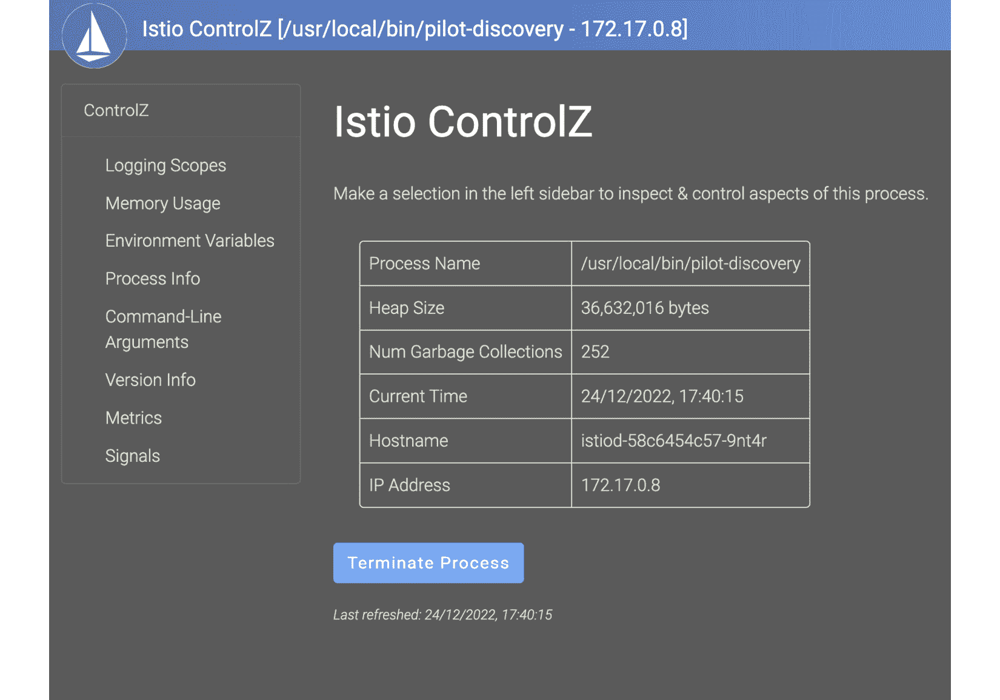

# 11

# 排除故障与操作 Istio

部署微服务涉及许多活动组件，包括应用程序、底层的 Kubernetes 平台，以及由 Istio 提供的应用程序网络。网格在某些情况下表现异常并不罕见。Istio 在早期以复杂且难以排查故障而臭名昭著。Istio 社区非常重视这种看法，并一直在致力于简化其安装和 Day-2 操作，使其在生产环境中的部署更加简便和可靠。

在本章中，我们将讨论在操作 Istio 时可能遇到的常见问题，以及如何将它们与其他问题区分开来并加以隔离。然后，我们将学习如何在识别出问题后**排除故障**。我们还将探索部署和操作 Istio 的各种**最佳实践**，以及如何自动化实施最佳实践。

简而言之，本章将涵盖以下内容：

+   理解 Istio 组件之间的交互

+   检查和分析 Istio 配置

+   使用访问日志排除故障

+   使用调试日志排除故障

+   调试 Istio 代理

+   理解 Istio 的最佳实践

+   使用 OPA Gatekeeper 自动化最佳实践

# 理解 Istio 组件之间的交互

在排除服务网格问题时，网格的异常行为很可能是由以下潜在问题之一引起的：

+   无效的控制平面配置

+   无效的数据平面配置

+   异常的数据平面

在接下来的章节中，我们将探索如何借助 Istio 提供的各种诊断工具诊断任何异常行为的根本原因。但首先，让我们看看 Istio 中 istiod、数据平面和其他组件之间的各种交互。

## 探索 Istiod 端口

Istiod 暴露了多个端口，其中一些可以用于故障排除。在本节中，我们将介绍这些端口，了解它们的功能以及如何帮助排查故障。

让我们从查看这些端口开始：

+   `443` 端口会被转发到 `15017` 端口，我们在设置主远程集群时已经看到过它的实际应用。

+   **15014 端口**：该端口由 Prometheus 用于抓取控制平面指标。你可以使用以下命令查看该指标：

    ```
    % kubectl -n istio-system port-forward deploy/istiod 15014 &
    [1] 68745
    Forwarding from 127.0.0.1:15014 -> 15014
    ```

然后，你可以从 `15014` 端口获取指标：

```
% curl http://localhost:15014/metrics
Handling connection for 15014
# HELP citadel_server_csr_count The number of CSRs received by Citadel server.
# TYPE citadel_server_csr_count counter
citadel_server_csr_count 6
# HELP citadel_server_root_cert_expiry_timestamp The unix timestamp, in seconds, when Citadel root cert will expire. A negative time indicates the cert is expired.
# TYPE citadel_server_root_cert_expiry_timestamp gauge
citadel_server_root_cert_expiry_timestamp 1.986355163e+09
……….
```

+   `15010` 端口是不安全的，而 `15012` 端口是安全的，因此可以用于生产环境。

+   `istiod` 实例。该端口用于通过网格内的 REST API 调用或仪表板访问 ControlZ 接口，可以使用以下命令进行访问：

    ```
    % istioctl dashboard controlz deployment/istiod.istio-system
    ```

以下是 ControlZ 接口的截图：



图 11.1 – Istio ControlZ 接口

ControlZ 接口可用于检查日志范围、环境变量等。该接口也可以用来更改日志级别。

本节中，我们将了解 istiod 暴露的各种端口。接下来我们将阅读有关 Istio 数据平面暴露的端口。

## 探索 Envoy 端口

Envoy 作为 Istio 的数据平面，暴露了多个端口与 Istio 控制平面和可观察性工具进行交互。我们来看一下这些端口，它们的作用以及它们如何帮助故障排除：

+   **端口 15000**：这是 Envoy 管理界面，可用于检查和查询 Envoy 配置。我们将在下一节中详细阅读此端口，*检查和分析 Istio 配置*。

+   **端口 15001**：此端口用于接收来自应用程序 Pods 的所有出站流量。

+   **端口 15004**：此端口可用于调试数据平面配置。

+   **端口 15006**：所有来自网格内部的入站应用流量都会被路由到此端口。

+   `istio-agent`，以及应用程序，随后由 Prometheus 抓取。

+   **端口 15021**：此端口暴露用于执行数据平面健康检查。

+   **端口 15053**：此端口用于提供 DNS 代理服务。

+   **端口 15090**：此端口提供 Envoy 的遥测信息。

在下一节中，我们将探讨如何分析和检查 Istio 配置。

# 检查和分析 Istio 配置

在调试 Istio 数据平面时，检查 Istio 控制平面和数据平面之间是否存在配置不匹配非常有用。在处理多集群网格时，最好首先检查控制平面和数据平面之间的连接性；如果你的 Pod 支持 `curl`，可以使用以下命令检查二者之间的连接性：

```
$ kubectl exec -it curl -c curl -n chapter11 -- curl  istiod.istio-system.svc.cluster.local:15014/version
1.16.0-8f2e2dc5d57f6f1f7a453e03ec96ca72b2205783-Clean
```

要检查配置，第一个检查点是使用`istioctl proxy-status`命令，查看集群、监听器、路由和端点配置在 istiod 和 istio-proxy 之间的同步状态。

你可以使用以下命令检查整个集群的配置状态：

```
% istioctl proxy-status
NAME       CLUSTER       CDS       LDS       EDS        RDS       ECDS       ISTIOD              VERSION
curl.chapter11
Kubernetes     SYNCED     SYNCED     SYNCED     SYNCED        NOT SENT     istiod-58c6454c57-9nt4r     1.16.0
envoydummy.chapter11
Kubernetes     SYNCED     SYNCED     SYNCED     SYNCED        NOT SENT     istiod-58c6454c57-9nt4r     1.16.0
istio-egressgateway-5bdd756dfd-bjqrg.istio-system      Kubernetes     SYNCED     SYNCED     SYNCED     NOT SENT     NOT SENT     istiod-58c6454c57-9nt4r     1.16.0
istio-ingressgateway-67f7b5f88d-xx5fb.istio-system
Kubernetes     SYNCED     SYNCED     SYNCED     SYNCED        NOT SENT     istiod-58c6454c57-9nt4r     1.16.0
```

以下是同步状态的可能值：

+   `SYNCED`：Envoy 已经拥有最新的配置。

+   `NOT SENT`：istiod 尚未向 Envoy 发送任何配置；在大多数情况下，原因是 istiod 没有配置需要发送。在此示例中，Istio Egress Gateway 的状态为 `NOT SENT`，因为没有需要同步的路由信息。

+   `STALE`：Envoy 没有最新的配置，表示 Envoy 和 istiod 之间存在网络问题。

你可以使用以下命令检查工作负载的状态：

```
% istioctl proxy-status envoydummy.chapter11
Clusters Match
Listeners Match
Routes Match (RDS last loaded at Sat, 17 Dec 2022 11:53:31 AEDT)Access Logs
```

如果被调查的 Pod 支持 `curl`，那么你可以通过以下命令从 Envoy 的管理界面（暴露在端口 `15000` 上）抓取配置，来执行 `istio-proxy` 配置的转储：

```
% kubectl exec curl -c curl -n chapter11 -- curl localhost:15000/config_dump > config_dump.json
```

你可以通过使用以下 `istioctl` `proxy-config` 命令，选择性地转储监听器、集群、路由和端点的配置：

```
% istioctl proxy-config endpoints envoydummy.chapter11 -o json > endpoints-envoydummy.json
% istioctl proxy-config routes envoydummy.chapter11 -o json > routes-envoydummy.json
% istioctl proxy-config listener envoydummy.chapter11 -o json > listener-envoydummy.json
% istioctl proxy-config cluster envoydummy.chapter11 -o json > cluster-envoydummy.json
```

你可以从 istiod 的角度获取 Envoy 配置，并将其与从 Envoy 管理界面获取的配置进行比较：

```
% kubectl exec istiod-58c6454c57-gj6cw -n istio-system -- curl 'localhost:8080/debug/config_dump?proxyID=curl.chapter11' | jq . > Chapter11/config-from-istiod-for-curl.json
```

你可以通过以下命令，从 Web 浏览器中检查 Pod 中的 `istio-proxy` 配置：

```
$ kubectl port-forward envoydummy -n chapter11 15000
```

现在，你可以通过浏览器访问 Envoy 仪表盘，如下图所示：


图 11.2 – Envoy 仪表盘

Envoy 仪表盘是查看值的一个好选择，但在更改配置参数时需要谨慎，因为通过此仪表盘，你将更改数据平面配置，而这超出了 istiod 的控制范围。

在写这本书时，`istioctl describe`是一个实验性功能。它用于描述一个 Pod，如果该 Pod 满足成为服务网格一部分的所有要求，那么此命令（对 Pod 运行时）还可以告诉你该 Pod 中的 `istio-proxy` 是否已启动，或者该 Pod 是否属于服务网格的一部分。它会输出任何警告和建议，以便更好地将 Pod 集成到服务网格中。

以下是对 `envoydummy` Pod 运行 `istioctl describe` 命令的示例：

```
% istioctl x describe pod envoydummy -n chapter11
Pod: envoydummy
   Pod Revision: default
   Pod Ports: 10000 (envoyproxy), 15090 (istio-proxy)
Suggestion: add 'app' label to pod for Istio telemetry.
--------------------
Service: envoydummy
   Port:  80/auto-detect targets pod port 10000
--------------------
Effective PeerAuthentication:
   Workload mTLS mode: PERMISSIVE
```

在输出中，你可以看到它建议将 `app` 标签应用到该 Pod 上以启用 Istio 测量。Istio 推荐明确地将 `app` 和 `version` 标签添加到服务网格中的工作负载上。这些标签为 Istio 收集的指标和遥测数据添加了上下文信息。输出还描述了其他一些重要信息，比如服务暴露在端口 `80` 上，端点在端口 `10000` 上，`istio-proxy` Pod 暴露在端口 `15090` 上，以及 `mTLS 模式` 是宽松的。它还描述并警告了有关目标规则和虚拟服务的任何问题。

以下命令是另一个示例，展示了当错误的虚拟服务配置应用到 `envoydummy` 时的情况。正确的配置可以在 `Chapter11/04-istio-gateway-chaos.yaml` 中找到：

```
% kubectl apply -f Chapter11/04-istio-gateway-chaos.yaml
gateway.networking.istio.io/chapter11-gateway configured
virtualservice.networking.istio.io/mockshop configured
destinationrule.networking.istio.io/envoydummy configured
% istioctl x describe pod envoydummy -n chapter11
Pod: envoydummy
   Pod Revision: default
   Pod Ports: 10000 (envoyproxy), 15090 (istio-proxy)
--------------------
Service: envoydummy
   Port:  80/auto-detect targets pod port 10000
DestinationRule: envoydummy for "envoydummy"
   Matching subsets: v1
      (Non-matching subsets v2)
   No Traffic Policy
--------------------
Effective PeerAuthentication:
   Workload mTLS mode: PERMISSIVE
Exposed on Ingress Gateway http://192.168.49.2
VirtualService: mockshop
   WARNING: No destinations match pod subsets (checked 1 HTTP routes)
      Warning: Route to UNKNOWN subset v3; check DestinationRule envoydummy
```

前面片段底部的警告清楚地描述了虚拟服务将流量路由到 `UNKNOWN subset v3`。要解决这个问题，你需要配置虚拟服务以纠正目标规则中定义的子集，或者在目标规则中添加 `v3` 子集。正确的配置可以在 `Chapter11/04-istio-gateway.yaml` 中找到。

另一个用于检查和检测服务网格中任何配置错误的诊断工具是 `istioctl analyze`。它可以对整个集群运行，也可以在将配置应用到服务网格之前对任何配置运行：

```
% istioctl analyze Chapter11/04-istio-gateway-chaos.yaml -n chapter11
Error [IST0101] (VirtualService chapter11/mockshop Chapter11/04-istio-gateway-chaos.yaml:35) Referenced host+subset in destinationrule not found: "envoydummy+v3"
Info [IST0118] (Service chapter11/envoydummy) Port name  (port: 80, targetPort: 10000) doesn't follow the naming convention of Istio port.
Error: Analyzers found issues when analyzing namespace: chapter11.
See https://istio.io/v1.16/docs/reference/config/analysis for more information about causes and resolutions.
```

在前面的示例中，`istioctl analyze`通过分析配置文件指出了错误。这对于在将配置应用到服务网格之前验证任何错误配置非常有用。在接下来的部分，我们将学习如何使用 Envoy 访问日志来排除错误。

# 使用访问日志排查错误

`istio-proxy` 容器。访问日志是流量访问 Envoy 的记录，可以与 Ingress 和 Egress 网关的访问记录以及网格中所有其他上游和下游工作负载的访问记录交织在一起，以跟踪请求的生命周期。

默认情况下，访问日志是关闭的，除非你使用演示配置文件安装了 Istio。你可以通过检查 Istio 配置映射来查看是否启用了访问日志：

```
% kubectl get cm/istio -n istio-system -o json | jq .data.mesh
"accessLogFile: \"\"\ndefaultConfig:\n  discoveryAddress: istiod.istio-system.svc:15012\n  proxyMetadata: {}\n  tracing:\n    zipkin:\n      address: zipkin.istio-system:9411\nenablePrometheusMerge: true\nextensionProviders:\n- envoyOtelAls:\n    port: 4317\n    service: opentelemetry-collector.istio-system.svc.cluster.local\n  name: otel\nrootNamespace: istio-system\ntrustDomain: cluster.local"
```

可以通过以下命令启用访问日志：

```
% istioctl install --set profile=demo --set meshConfig.accessLogFile="/dev/stdout"
```

根据你的需求和系统性能要求，你可以决定是否启用访问日志。如果启用了访问日志且想要禁用它，可以通过将 `accessLogFile` 参数设置为空值来实现：

```
% istioctl install --set profile=demo --set meshConfig.accessLogFile=""
```

访问日志也可以在工作负载或命名空间级别启用。假设你已全局关闭访问日志，我们可以使用 `Telemetry` 资源有选择性地为 `envoydummy` 工作负载打开访问日志：

```
apiVersion: telemetry.istio.io/v1alpha1
kind: Telemetry
metadata:
  name: envoy-dummy-accesslog-overwrite
  namespace: chapter11
spec:
  selector:
    matchLabels:
      service.istio.io/canonical-name: envoydummy
  accessLogging:
  - providers:
    - name: envoy
  - disabled: false
```

该配置将为 `envoydummy` Pod 打开访问日志。配置文件可在 GitHub 上的 `Chapter11/03-telemetry-01.yaml` 中找到：

1.  使用以下命令应用配置：

    ```
    $ kubectl apply -f Chapter11/03-telemetry-01.yaml
    telemetry.telemetry.istio.io/envoy-dummy-accesslog-overwrite configured
    ```

1.  现在，你可以从 `curl` Pod 向 `envoydummy` 发起一个 `curl` 请求，命令如下：

    ```
    % kubectl exec -it curl -n chapter11 -c curl -- curl envoydummy.chapter11
    Bootstrap Service Mesh Implementation with Istio
    ```

1.  接下来，如果你检查 `curl` 和 `envoydummy` Pods 中的 `istio-proxy` 访问日志，你会发现 `curl` Pod 中没有访问日志，而 `envoydummy` Pod 中有访问日志：

    ```
    [2022-12-15T00:48:54.972Z] "GET / HTTP/1.1" 200 - via_upstream - "-" 0 48 0 0 "-" "curl/7.86.0-DEV" "2d4eec8a-5c17-9e2c-8699-27a341c21b8b" "envoydummy.chapter11" "172.17.0.9:10000" inbound|10000|| 127.0.0.6:49977 172.17.0.9:10000 172.17.0.8:56294 outbound_.80_._.envoydummy.chapter11.svc.cluster.local default
    ```

`curl` Pod 中没有访问日志的原因是我们全局关闭了访问日志，但通过 `Telemetry` 资源有选择性地为 `envoydummy` Pod 打开了访问日志。

你可以阅读更多关于如何使用 `Telemetry` 配置 `accessLogging` 的信息，网址是 [`istio.io/latest/docs/reference/config/telemetry/#AccessLogging`](https://istio.io/latest/docs/reference/config/telemetry/#AccessLogging)。

访问日志的默认编码是按照以下规范格式化的字符串：

```
[%START_TIME%] \"%REQ(:METHOD)% %REQ(X-ENVOY-ORIGINAL-PATH?:PATH)% %PROTOCOL%\" %RESPONSE_CODE% %RESPONSE_FLAGS% %RESPONSE_CODE_DETAILS% %CONNECTION_TERMINATION_DETAILS% \"%UPSTREAM_TRANSPORT_FAILURE_REASON%\" %BYTES_RECEIVED% %BYTES_SENT% %DURATION% %RESP(X-ENVOY-UPSTREAM-SERVICE-TIME)% \"%REQ(X-FORWARDED-FOR)%\" \"%REQ(USER-AGENT)%\" \"%REQ(X-REQUEST-ID)%\" \"%REQ(:AUTHORITY)%\" \"%UPSTREAM_HOST%\" %UPSTREAM_CLUSTER% %UPSTREAM_LOCAL_ADDRESS% %DOWNSTREAM_LOCAL_ADDRESS% %DOWNSTREAM_REMOTE_ADDRESS% %REQUESTED_SERVER_NAME% %ROUTE_NAME%\n
```

每个字段的详细定义可以在 [`www.envoyproxy.io/docs/envoy/latest/configuration/observability/access_log/usage`](https://www.envoyproxy.io/docs/envoy/latest/configuration/observability/access_log/usage) 上找到。

访问日志也可以配置为以 JSON 格式显示，可以通过将 `accessLogEncoding` 设置为 `JSON` 来实现：

```
% istioctl install --set profile=demo --set meshConfig.accessLogFile="" --set meshConfig.accessLogFormat="" --set meshConfig.accessLogEncoding="JSON"
```

设置后，访问日志将以 JSON 格式显示，我已经简化了它以便于阅读：

```
{
   "duration":0,
   "start_time":"2022-12-15T01:03:02.725Z",
   "bytes_received":0,
   "authority":"envoydummy.chapter11",
   "upstream_transport_failure_reason":null,
   "upstream_cluster":"inbound|10000||",
   "x_forwarded_for":null,
   "response_code_details":"via_upstream",
   "upstream_host":"172.17.0.9:10000",
   "user_agent":"curl/7.86.0-DEV",
   "request_id":"a56200f2-da0c-9396-a168-8dfddf8b623f",
   "response_code":200,
   "route_name":"default",
   "method":"GET",
   "downstream_remote_address":"172.17.0.8:45378",
   "upstream_service_time":"0",
   "requested_server_name":"outbound_.80_._.envoydummy.chapter11.svc.cluster.local",
   "protocol":"HTTP/1.1",
   "path":"/",
   "bytes_sent":48,
   "downstream_local_address":"172.17.0.9:10000",
   "connection_termination_details":null,
   "response_flags":"-",
   "upstream_local_address":"127.0.0.6:42313"
}
```

在访问日志中，有一个字段叫做 `response_flags`（如前面的代码片段所示），这是在通过访问日志排查故障时非常有用的信息。

接下来，我们将通过在 `envoydummy` Pod 中注入一些错误来了解响应标志：

1.  首先，通过以下命令为 `curl` Pod 打开访问日志：

    ```
    % kubectl apply -f Chapter11/03-telemetry-02.yaml
    telemetry.telemetry.istio.io/curl-accesslog-overwrite created
    ```

1.  然后，删除 `envoydummy` Pod，但保留 `envoydummy` 服务：

    ```
    % kubectl delete po envoydummy -n chapter11
    pod "envoydummy" deleted
    ```

1.  现在，服务已经损坏，你将无法使用 `curl`：

    ```
    % kubectl exec -it curl -n chapter11 -c curl -- curl envoydummy.chapter11
    no healthy upstream
    ```

1.  检查 `curl` Pod 的访问日志：

    ```
    % kubectl logs -f curl -n chapter11 -c istio-proxy | grep response_flag
    {"path":"/","response_code":503,"method":"GET","upstream_cluster":"outbound|80||envoydummy.chapter11.svc.cluster.local","user_agent":"curl/7.86.0-DEV","connection_termination_details":null,"authority":"envoydummy.chapter11","x_forwarded_for":null,"upstream_transport_failure_reason":null,"downstream_local_address":"10.98.203.175:80","bytes_received":0,"requested_server_name":null,"response_code_details":"no_healthy_upstream","upstream_service_time":null,"request_id":"4b39f4ca-ffe3-9c6a-a202-0650b0eea8ef","route_name":"default","upstream_local_address":null,"response_flags":"UH","protocol":"HTTP/1.1","start_time":"2022-12-15T03:49:38.504Z","duration":0,"upstream_host":null,"downstream_remote_address":"172.17.0.8:52180","bytes_sent":19}
    ```

`response_flags` 的值为 `UH`，这意味着上游集群中没有健康的上游主机。`response_flag` 的可能值显示在以下表格中，并参考了 [`www.envoyproxy.io/docs/envoy/latest/configuration/observability/access_log/usage`](https://www.envoyproxy.io/docs/envoy/latest/configuration/observability/access_log/usage)：

| **Name** | **描述** |
| --- | --- |
| `UH` | 上游集群中没有健康的上游主机，此外还返回了 503 响应码 |
| `UF` | 上游连接失败，此外还返回了 503 响应码 |
| `UO` | 上游溢出（断路器）发生，此外还返回了 503 响应码 |
| `NR` | 没有为给定请求配置路由，此外还返回了 404 响应码，或下游连接没有匹配的过滤链 |
| `URX` | 请求被拒绝，因为达到了上游重试限制（HTTP）或最大连接尝试次数（TCP） |
| `NC` | 未找到上游集群 |
| `DT` | 请求或连接超出了 `max_connection_duration` 或 `max_downstream_connection_duration` |

表格 11.1 – HTTP 和 TCP 连接的响应标志值

以下表格描述了 HTTP 连接的响应标志值：

| **Name** | **描述** |
| --- | --- |
| `DC` | 下游连接终止 |
| `LH` | 本地服务健康检查失败请求，此外还返回了 503 响应码 |
| `UT` | 上游请求超时，此外还返回了 504 响应码 |
| `LR` | 连接本地重置，此外还返回了 503 响应码 |
| `UR` | 上游远程重置，此外还返回了 503 响应码 |
| `UC` | 上游连接终止，此外还返回了 503 响应码 |
| `DI` | 请求处理被延迟，延迟时间由故障注入指定 |
| `FI` | 请求被中止，并返回了通过故障注入指定的响应码 |
| `RL` | 请求被 HTTP 速率限制过滤器在本地限速，此外还返回了 429 响应码 |
| `UAEX` | 请求被外部授权服务拒绝 |
| `RLSE` | 请求被拒绝，因为速率限制服务发生错误 |
| `IH` | 请求被拒绝，因为它为严格检查的头部设置了无效的值，此外还返回了 400 响应码 |
| `SI` | 流空闲超时，此外还返回了 408 或 504 响应码 |
| `DPE` | 下游请求发生 HTTP 协议错误 |
| `UPE` | 上游响应发生 HTTP 协议错误 |
| `UMSDR` | 上游请求达到了最大流持续时间 |
| `OM` | 超载管理器终止了请求 |
| `DF` | 请求由于 DNS 解析失败而终止 |

表格 11.2 – HTTP 连接的响应标志值

响应标志在故障排除访问日志时非常有用，是指示上游系统可能出错的好指标。了解这些信息后，我们可以将焦点转向 Istio 调试日志如何用于故障排除。

# 使用调试日志排查错误

Istio 组件支持灵活的日志方案，用于**调试**日志。调试日志级别可以从较高的级别更改为非常冗长的级别，以便获取 Istio 控制平面和数据平面中发生的详细信息。接下来的两节将描述如何更改 Istio 数据平面和控制平面的日志级别。让我们直接开始吧！

## 更改 Istio 数据平面的调试日志

以下是 Istio 数据平面的各种日志级别——即 Envoy 侧车：

+   `trace`：最高冗长的日志消息

+   `debug`：非常冗长的日志消息

+   `info`：关于 Envoy 执行状态的通知性消息

+   `warning/warn`：表明可能导致错误事件的问题的事件

+   `error`：重要的错误事件，可能会损害 Envoy 的某些功能，但不会让 Envoy 完全无法运行

+   `critical`：严重的错误事件，可能导致 Envoy 停止运行

+   `off`：不产生任何日志

日志级别可以使用以下命令格式进行更改：

```
istioctl proxy-config log [<type>/]<name>[.<namespace>] [flags]
```

这样的命令示例如下：

```
% istioctl proxy-config log envoydummy.chapter11 -n chapter11 --level debug
```

这种改变日志级别的方法不需要重启 Pods。如本章前面*探索 istiod 端口*一节所述，也可以使用 ControlZ 接口来更改日志级别。

## 更改 Istio 控制平面的日志级别

Istio 控制平面支持以下日志级别：

+   `none`：不产生任何日志

+   `error`：只产生错误信息

+   `warn`：产生警告消息

+   `info`：在正常情况下产生详细信息

+   `debug`：产生最多的日志消息

istiod 内部的每个组件根据所记录消息的类型对日志进行分类。这些分类包括 `ads`、`adsc`、`all`、`analysis`、`authn`、`authorization`、`ca`、`cache`、`cli`、`default`、`installer`、`klog`、`mcp`、`model`、`patch`、`processing`、`resource`、`source`、`spiffe`、`tpath`、`translator`、`util`、`validation`、`validationController` 和 `wle`。

以下是更改不同范围的日志级别时使用的命令示例：

```
% istioctl analyze --log_output_level validation:debug,validationController:info,ads:debug
```

在这个示例中，我们将 `validation` 范围的日志级别更改为 `debug`，将 `validationController` 范围更改为 `info`，将 `ads` 更改为 `debug`：

```
% istioctl admin log | grep -E 'ads|validation'
ads                    ads debugging                                debug
adsc                   adsc debugging                               info
validation             CRD validation debugging                     debug
validationController   validation webhook controller                info
validationServer       validation webhook server                    info
```

你可以使用 `istioctl admin log` 来获取所有 Istio 组件的日志级别：

```
% istioctl admin log
ACTIVE    SCOPE      DESCRIPTION               LOG LEVEL
ads                    ads debugging                                debug
adsc                   adsc debugging                               info
analysis               Scope for configuration analysis runtime     info
authn                  authn debugging                              info
authorization          Istio Authorization Policy                   info
ca                     ca client                                    info
controllers            common controller logic                      info
default                Unscoped logging messages.                   info
delta                  delta xds debugging                          info
file                   File client messages                         info
gateway                gateway-api controller                       info
grpcgen                xDS Generator for Proxyless gRPC             info
……
```

我们刚刚看到了 Envoy，它位于请求路径的`request`上，但还有另一个关键组件，它不在`request`路径上，但对 Envoy 的平稳操作非常重要。在接下来的章节中，我们将了解如何调试 Istio 代理中的问题。

# 调试 Istio 代理

在本节中，我们将学习如何排查由 Istio 代理配置错误导致的数据平面问题。Istio 代理可能由于多种原因未按预期工作；本节将讨论调试和排查此类问题的多种方法。

以下命令可用于检查 Envoy 用来启动并与 istiod 连接的初始引导配置文件：

```
$ istioctl proxy-config bootstrap envoydummy -n chapter11 -o json >bootstrap-envoydummy.json
```

引导配置由 Istiod 控制器在通过验证和 Sidecar 注入 Webhook 注入 Sidecar 时提供的信息组成。

我们可以使用以下命令检查由`istio-agent`为 Envoy 配置的证书和`secret`：

```
% istioctl proxy-config secret envoydummy -n chapter11
RESOURCE NAME     TYPE           STATUS     VALID CERT     SERIAL NUMBER                               NOT AFTER                NOT BEFORE
default           Cert 
Chain      ACTIVE      true     151990293406794295074718429679 77531899      20XX-12-26T01:02:53Z     20XX-12-25T01:00:53Z
ROOTCA        CA        ACTIVE        true 177195801324177165655021729164749485784     20XX-12-11T05:19:23Z     20XX-12-14T05:19:23Z
```

你还可以通过在命令中添加`-o json`来以 JSON 格式显示详细信息。`ROOTCA`是根证书，`default`是工作负载证书。在进行多集群配置时，ROOTCA 在不同集群之间必须匹配。

你可以使用以下命令检查证书的值：

```
% istioctl proxy-config secret envoydummy -n chapter11 -o json | jq '.dynamicActiveSecrets[0].secret.tlsCertificate.certificateChain.inlineBytes' -r | base64 -d | openssl x509 -noout -text
```

根据配置的网关和目标规则，可能还会有其他 Secrets。在日志中，如果发现 Envoy 处于警告状态，这意味着正确的 Secret 未加载到 Envoy 中。与`default`证书和`ROOTCA`相关的问题通常是由于 istio-proxy 与 istiod 之间的连接问题引起的。

要检查 Envoy 是否已成功启动，可以使用以下命令登录到`istio-proxy`容器：

```
% kubectl exec -it envoydummy -n chapter11 -c istio-proxy --  pilot-agent wait
2022-12-25T05:29:44.310696Z info Waiting for Envoy proxy to be ready (timeout: 60 seconds)...
2022-12-25T05:29:44.818220Z info Envoy is ready!
```

在 Sidecar 代理的启动过程中，`istio-agent`通过 ping `http://localhost:15021/healthz/ready`来检查 Envoy 的就绪状态。它还在 Pod 的生命周期内使用相同的端点来确定 Envoy 的就绪状态。HTTP 状态码 200 表示 Envoy 已就绪，`istio-proxy`容器被标记为已初始化。如果`istio-proxy`容器处于待处理状态并未初始化，这意味着 Envoy 未从 istiod 接收到配置，可能是由于与 istiod 的连接问题或 Envoy 拒绝配置。

以下错误信息表明`istio-proxy`日志中存在连接问题，可能是由于网络问题或 istiod 不可用：

```
20XX-12-25T05:58:02.225208Z     warning envoy config    StreamAggregatedResources gRPC config stream to xds-grpc closed since 49s ago: 14, connection error: desc = "transport: Error while dialing dial tcp 10.107.188.192:15012: connect: connection refused"
```

如果 Envoy 能够连接到 istiod，那么你会在日志文件中找到类似以下的消息：

```
20XX-12-25T06:00:08.082523Z     info    xdsproxy        connected to upstream XDS server: istiod.istio-system.svc:15012
```

在本节中，我们深入分析了 Istio 调试日志，并查看了如何使用 Envoy、`istio-agent`和 Istio 控制平面的调试日志进行故障排除。在下一节中，我们将阅读有关 Istio 最佳实践的内容，了解如何安全地管理和高效地操作 Istio。

# 了解 Istio 的最佳实践

在操作 Service Mesh 时，建议假设安全威胁不仅会来自组织安全边界之外，还可能来自安全边界内部。你应该始终假设网络不是坚不可摧的，并创建能够保护资产的安全控制，即使网络边界被突破。在本节中，我们将讨论在实施 Service Mesh 时需要关注的各种攻击向量。

## 检查控制平面的攻击向量

以下列表显示了针对控制平面发起攻击的常见策略：

+   故意造成配置问题，使控制平面发生故障，从而使服务网格无法正常工作，进而影响网格管理的业务关键应用。这也可能是针对 Ingress 或其他应用程序的攻击的前奏。

+   获取特权访问权限，能够执行控制平面和数据平面的攻击。通过获得特权访问，攻击者可以修改安全策略，从而利用资产进行攻击。

+   垃圾数据窃取：窃听控制平面数据，或篡改并伪造数据平面与控制平面之间的通信。

## 检查数据平面的攻击路径。

以下是对数据平面发起攻击的常见策略：

+   窃听服务间通信以窃取敏感数据，并将其发送给攻击者。

+   假冒为网格中的受信任服务；攻击者可以执行服务间的中间人攻击。通过使用中间人攻击，攻击者可以窃取敏感数据或篡改服务之间的通信，以便为攻击者创造有利结果。

+   操控应用程序进行僵尸网络攻击。

另一个容易受到攻击的组件是托管 istio 的基础设施，可以是 Kubernetes 集群、虚拟机或任何托管 istio 的底层堆栈组件。我们不打算深入讨论如何保护 Kubernetes，因为有各种关于如何安全配置 Kubernetes 集群的书籍；其中一本是 Kaizhe Huang 和 Pranjal Jumde 所著的*Learn Kubernetes Security*，由 Packt 出版。其他最佳实践包括保护服务网格，我们将在下一节中讨论。

## 保护服务网格

以下是保护服务网格的一些最佳实践：

+   部署**Web 应用防火墙**（**WAF**）来保护入口流量。WAF 实施安全控制措施，包括**开放 Web 应用安全项目**（**OWASP**）识别的威胁；你可以在[`owasp.org/`](https://owasp.org/)阅读有关 OWASP 的信息。大多数云提供商提供 WAF 作为其云服务的一部分；例如 AWS 的**AWS WAF**、Google Cloud 的**Cloud Armor**和 Azure 的**Azure Web 应用防火墙**。还有其他供应商，如 Cloudflare、Akamai、Imperva 和 AppTrana，提供 SaaS 形式的 WAF，而像 Fortinet 和 Citrix 这样的供应商也提供自托管 WAF 服务。WAF 是你防御的第一道防线，它会处理许多指向网格入口的攻击路径。

+   定义策略来控制从外部网格到网格内部服务的访问。入口访问控制策略对于禁止未授权访问服务非常重要。每个入口应明确定义，并且应具有关联的身份验证和授权策略，以验证外部请求是否被授权访问通过入口网关暴露的服务。然而，所有的入口访问应该通过入口网关进行，并且每个入口应通过虚拟服务及其关联的目标规则进行路由。

+   所有出口系统应为已知并定义，且不应允许向未知的出口点发送流量。安全策略应强制出口流量的 TLS 起源，并且所有出口流量应通过出口网关进行。授权策略应用于控制哪些工作负载被允许发送出口流量，并且如果允许，所有出口端点应由安全管理员知晓并批准。出口安全策略还帮助防止数据泄露；通过出口策略，您可以仅控制流量发送到已知的出口点，从而阻止已渗透系统的攻击者将数据发送到攻击者的系统。这还可以防止网格中的应用程序参与任何僵尸网络攻击。

+   网格中的所有服务应通过 mTLS 进行通信，并应具有相关的身份验证和授权策略。默认情况下，所有服务间通信应被拒绝，除非通过授权策略授权，并且任何服务间通信应通过明确定义的服务身份进行显式启用。

+   当服务间通信代表终端用户或系统进行时，除 mTLS 外，所有此类通信应使用 JWT。JWT 作为凭证，证明服务请求是明确代表终端用户发出的；调用服务需要提供一个 JWT 作为凭证，以识别终端用户，并结合身份验证和授权策略来确定可以访问的服务以及授予的访问级别。这有助于防止任何受损的应用程序进行数据泄露或服务利用。

+   如果使用任何外部长期有效的身份验证令牌来验证任何主体，无论是终端用户还是系统，那么此类令牌应被短期令牌替换。令牌替换应在入口处进行，然后在整个网格中使用短期令牌。这样做有助于防止攻击者窃取令牌并利用其进行未授权访问。同时，外部长期攻击可能会附带许多更广泛的作用域，受损的应用程序可能会滥用这些作用域，而短期令牌具有受限作用域，有助于避免令牌滥用。

+   在应用网格或安全规则的例外时，应谨慎定义例外策略。例如，如果您希望启用工作负载 A 在网格中允许来自另一个工作负载 B 的 HTTP 流量，那么您应明确规定允许来自工作负载 B 的 HTTP 流量的例外，而不是明确允许所有 HTTP 流量，且所有其他流量应仅限于 HTTPS。

+   必须限制并控制对 istiod 的访问。防火墙规则应限制对控制平面的访问，仅允许已知来源。该规则应同时适应人工操作员和数据平面对控制平面的访问，无论是在单集群还是多集群配置中。

+   所有由服务网格管理的工作负载应仅通过**基于角色的访问控制**（**RBAC**）策略在 Kubernetes 环境中进行管理，对于非 Kubernetes 工作负载，则通过用户组进行管理。Kubernetes 管理员应仔细定义应用程序用户和网格管理员的 RBAC 策略，并仅允许后者对网格进行任何更改。网格操作员应根据其被授权执行的操作进一步分类。例如，有权限在命名空间中部署应用程序的网格用户不应有权访问其他命名空间。

+   限制用户可以访问的仓库，以便从中拉取镜像进行部署。

在本节中，我们了解了 istio 的最佳实践；除此之外，您还应该访问 istio 官网，阅读有关最佳实践的内容，网址为[`istio.io/latest/docs/ops/best-practices/`](https://istio.io/latest/docs/ops/best-practices/)。该网站会根据 istio 社区的反馈定期更新。

即便在所有控制措施到位的情况下，网格操作员也可能会错误地配置服务网格，导致意外结果甚至安全漏洞。一个解决方案是强制执行严格的审查和治理流程来进行更改，但手动执行这一过程既昂贵又耗时，且容易出错，通常也很麻烦。在接下来的部分，我们将了解**OPA Gatekeeper**以及如何使用它来自动化最佳实践政策。

# 使用 OPA Gatekeeper 自动化最佳实践

为了避免人为错误，你可以将最佳实践和约束定义为策略的形式，并在集群中创建、删除或更新资源时自动强制执行这些策略。自动化的政策执行确保了一致性，并遵循最佳实践，同时不影响敏捷性和部署速度。一种这样的软件是**Open Policy Agent**（**OPA**）Gatekeeper，它是一个基于**自定义资源定义**（**CRD**）的准入控制器，执行由 OPA 执行的策略。OPA Gatekeeper 使得强制执行保护措施成为可能；任何不符合保护措施的 istio 配置都会被自动拒绝。它还允许**集群管理员**审核不符合最佳实践的资源。通过以下步骤，我们将设置 OPA Gatekeeper，并配置一些用于 istio 的最佳实践强制执行。让我们开始吧！

1.  使用以下命令安装 Gatekeeper：

    ```
    % kubectl apply -f https://raw.githubusercontent.com/open-policy-agent/gatekeeper/master/deploy/gatekeeper.yaml
    ```

1.  配置 Gatekeeper 同步命名空间、Pods、Services、istio CRD 网关、虚拟服务、目标规则、策略和服务角色绑定到其缓存中。我们已经在以下文件中定义了这一点，文件路径为`Chapter11/05-GatekeeperConfig.yaml`：

    ```
    apiVersion: config.gatekeeper.sh/v1alpha1
    kind: Config
    metadata:
      name: config
      namespace: gatekeeper-system
    spec:
      sync:
        syncOnly:
          - group: ""
            version: "v1"
            kind: "Namespace"
          - group: ""
            version: "v1"
            kind: "Pod"
          - group: ""
            version: "v1"
            kind: "Service"
          - group: "networking.istio.io"
            version: "v1alpha3"
            kind: "Gateway"
          - group: "networking.istio.io"
            version: "v1alpha3"
            kind: "VirtualService"
          - group: "networking.istio.io"
            version: "v1alpha3"
            kind: "DestinationRule"
          - group: "authentication.istio.io"
            version: "v1alpha1"
            kind: "Policy"
          - group: "rbac.istio.io"
            version: "v1alpha1"
            kind: "ServiceRoleBinding"
    ```

1.  现在，使用以下命令应用配置：

    ```
    % kubectl apply -f Chapter11/05-GatekeeperConfig.yaml
    config.config.gatekeeper.sh/config created
    ```

这完成了 Gatekeeper 的安装；接下来，我们将配置约束。

我们将从确保 Pod 命名约定符合 istio 最佳实践的简单策略开始。正如在*检查和分析 istio 配置*部分中讨论的，istio 建议向每个 Pod 部署添加显式的`app`和`version`标签。`app`和`version`标签为 istio 收集的指标和遥测数据添加了上下文信息。

执行以下步骤来强制执行这一治理规则，以便任何不遵守该规则的部署都会被自动拒绝：

1.  首先，我们必须定义`ConstraintTemplate`。在约束模板中，我们执行以下操作：

    +   描述将用于强制执行约束的策略

    +   描述约束的模式

重要说明

Gatekeeper 约束使用一种专门的、高层次的声明式语言**Rego**定义。Rego 特别用于编写 OPA 策略；你可以在 https://www.openpolicyagent.org/docs/latest/#rego 查看更多关于 Rego 的信息。

以下步骤定义了约束模板和模式：

1.  我们将使用 OPA CRD 声明一个约束模板：

```
apiVersion: templates.gatekeeper.sh/v1beta1
kind: ConstraintTemplate
metadata:
  name: istiorequiredlabels
  annotations:
    description: Requires all resources to contain a specified label with a value
      matching a provided regular expression.
```

1.  接下来，我们将定义模式：

```
spec:
  crd:
    spec:
      names:
        kind: istiorequiredlabels
      validation:
        # Schema for the `parameters` field
        openAPIV3Schema:
          properties:
            message:
              type: string
            labels:
              type: array
              items:
                type: object
                properties:
                  key:
                    type: string
```

1.  最后，我们将定义`rego`以检查标签并检测任何违规：

```
 targets:
    - target: admission.k8s.gatekeeper.sh
      rego: |
        package istiorequiredlabels
        get_message(parameters, _default) = msg {
          not parameters.message
          msg := _default
        }
        get_message(parameters, _default) = msg {
          msg := parameters.message
        }
        violation[{"msg": msg, "details": {"missing_labels": missing}}] {
          provided := {label | input.review.object.metadata.labels[label]}
          required := {label | label := input.parameters.labels[_].key}
          missing := required - provided
          count(missing) > 0
          def_msg := sprintf("you must provide labels: %v", [missing])
          msg := get_message(input.parameters, def_msg)
        }
```

配置文件位于`Chapter11/gatekeeper/01-istiopodlabelconstraint_template.yaml`。使用以下命令应用配置：

```
% kubectl apply -f Chapter11/gatekeeper/01-istiopodlabelconstraint_template.yaml
constrainttemplate.templates.gatekeeper.sh/istiorequiredlabels created
```

1.  接下来，我们将定义用于通知 Gatekeeper 我们希望强制执行名为`istiorequiredlabels`的约束模板的`constraints`，该模板根据在`mesh-pods-must-have-app-and-version`约束中定义的配置进行定义。示例文件可在`Chapter11/gatekeeper/01-istiopodlabelconstraint.yaml`中找到：

    ```
    apiVersion: constraints.gatekeeper.sh/v1beta1
    kind: istiorequiredlabels
    metadata:
      name: mesh-pods-must-have-app-and-version
    spec:
      enforcementAction: deny
      match:
        kinds:
          - apiGroups: [""]
            kinds: ["Pod"]
        namespaceSelector:
          matchExpressions:
            - key: istio-injection
              operator: In
              values: ["enabled"]
      parameters:
        message: "All pods must have an `app and version` label"
        labels:
          - key: app
          - key: version
    ```

对于约束配置，我们定义了以下字段：

+   `enforcementAction`：此字段定义处理约束违规的操作。该字段设置为`deny`，这是默认行为；任何违反此约束的资源创建或更新将根据强制执行的操作进行处理。其他支持的`enforcementAction`值包括`dryrun`和`warn`。在向运行中的集群推出新约束时，`dryrun`功能可以帮助在不强制执行的情况下测试它们。`warn`强制执行操作提供与`dryrun`相同的好处，例如在不强制执行的情况下测试约束。此外，它还提供了即时反馈，说明为何该约束会被拒绝。

+   `match`：此字段定义了选择标准，用于识别约束将应用于哪些对象。在配置中，我们定义了约束应应用于在具有`istio-injection`标签并且值为`enabled`的命名空间中部署的`pod`资源。通过这样做，我们可以选择性地将约束应用于属于数据平面网格的命名空间。

1.  最后，我们定义了当约束被违反时显示的消息。应用以下约束：

    ```
    % kubectl apply -f Chapter11/gatekeeper/01-istiopodlabelconstraint.yaml
    istiorequiredlabels.constraints.gatekeeper.sh/mesh-pods-must-have-app-and-version created
    ```

1.  作为测试，我们将部署缺少标签的`envoydummy` Pod：

    ```
    % kubectl apply -f Chapter11/06-envoy-proxy-chaos.yaml -n chapter11
    service/envoydummy created
    Error from server (Forbidden): error when creating "Chapter11/01-envoy-proxy.yaml": admission webhook "validation.gatekeeper.sh" denied the request: [all-must-have-owner] All pods must have an `app` label
    ```

Gatekeeper 已经验证了该部署并拒绝了它，因为它违反了约束，缺少`app`和`version`标签。请修复标签并重新部署，以检查是否可以使用正确的标签成功部署。

我希望这能给你一些关于如何使用 Gatekeeper 自动化一些最佳实践的想法。我们将进行另一个示例练习，以帮助你进一步了解如何使用 Gatekeeper。一开始，定义约束可能看起来是一个艰巨的任务，但一旦你积累了使用`rego`的经验，你会发现它简单易用。

作为另一个示例，让我们编写另一个约束，以强制执行端口命名约定。根据在[`istio.io/v1.0/docs/setup/kubernetes/spec-requirements/`](https://istio.io/v1.0/docs/setup/kubernetes/spec-requirements/)中描述的 Istio 最佳实践，`Service`端口必须命名。端口名称必须采用`<protocol>[-<suffix>]`的形式，其中`http`、`http2`、`grpc`、`mongo`或`redis`为`<protocol>`。如果你希望利用 Istio 的路由功能，这一点非常重要。例如，`name: http2-envoy`和`name: http`是有效的端口名称，但`name: http2envoy`是无效的名称。

约束模板中的`rego`如下所示：

```
package istio.allowedistioserviceportname
        get_message(parameters, _default) = msg {
          not parameters.message
          msg := _default
        }
        get_message(parameters, _default) = msg {
          msg := parameters.message
        }
        violation[{"msg": msg, "details": {"missing_prefixes": prefixes}}] {
          service := input.review.object
          port := service.spec.ports[_]
          prefixes := input.parameters.prefixes
          not is_prefixed(port, prefixes)
          def_msg := sprintf("service %v.%v port name missing prefix",
            [service.metadata.name, service.metadata.namespace])
          msg := get_message(input.parameters, def_msg)
        }
        is_prefixed(port, prefixes) {
          prefix := prefixes[_]
          startswith(port.name, prefix)
        }
```

在`rego`中，我们定义了端口名称应该以前缀开始，如果缺少前缀，则应视为违规。

该约束定义如下：

```
apiVersion: constraints.gatekeeper.sh/v1beta1
kind: AllowedIstioServicePortName
metadata:
  name: port-name-constraint
spec:
  enforcementAction: deny
  match:
    kinds:
      - apiGroups: [""]
        kinds: ["Service"]
    namespaceSelector:
      matchExpressions:
        - key: istio-injection
          operator: In
          values: ["enabled"]
  parameters:
    message: "All services declaration must have port name will one of following  prefix http-, http2-, grpc-, mongo-,redis-"
    prefixes: ["http-", "http2-","grpc-","mongo-","redis-"]
```

在约束中，我们定义了允许的各种前缀，并且当约束被违反时，显示相应的错误信息。

现在，让我们应用约束模板和配置，如下所示：

```
% kubectl apply -f Chapter11/gatekeeper/02-istioportconstraints_template.yaml
constrainttemplate.templates.gatekeeper.sh/allowedistioserviceportname created
% kubectl apply -f Chapter11/gatekeeper/02-istioportconstraints.yaml
allowedistioserviceportname.constraints.gatekeeper.sh/port-name-constraint configured
```

应用配置后，我们部署一个名称不正确的`envoydummy`服务端口。我们将创建一个没有指定任何端口名称的`envoydummy`服务，具体方法如下代码片段所示：

```
spec:
  ports:
  - port: 80
    targetPort: 10000
  selector:
    name: envoydummy
```

文件位于`Chapter11/07-envoy-proxy-chaos.yaml`。使用以下代码应用配置，并观察错误信息，查看 OPA Gatekeeper 的实际操作：

```
% kubectl apply -f Chapter11/07-envoy-proxy-chaos.yaml
pod/envoydummy created
Error from server (Forbidden): error when creating "Chapter11/07-envoy-proxy-chaos.yaml": admission webhook "validation.gatekeeper.sh" denied the request: [port-name-constraint] All services declaration must have port name with one of following prefix http-, http2-, grpc-, mongo-, redis-
```

在响应中，你可以看到由于服务配置中的端口命名错误而导致的错误信息。通过如下方式给端口声明添加名称，可以解决该问题：

```
spec:
  ports:
  - port: 80
    targetPort: 10000
    name: http-envoy
  selector:
    name: envoydummy
```

OPA Gatekeeper 是一个强大的工具，用于自动执行服务网格的最佳实践。它弥补了人为操作导致的任何配置错误，减少了保持网格与最佳实践对齐所需的时间和成本。你可以在[`open-policy-agent.github.io/gatekeeper/website/docs/`](https://open-policy-agent.github.io/gatekeeper/website/docs/)阅读更多关于 OPA Gatekeeper 的内容，并且在[`github.com/crcsmnky/gatekeeper-istio`](https://github.com/crcsmnky/gatekeeper-istio)中有一些 Gatekeeper 的优秀示例。

卸载 OPA Gatekeeper

要卸载 OPA Gatekeeper，可以使用以下命令：

`% kubectl delete -``f` [`raw.githubusercontent.com/open-policy-agent/gatekeeper/master/deploy/gatekeeper.yaml`](https://raw.githubusercontent.com/open-policy-agent/gatekeeper/master/deploy/gatekeeper.yaml)

# 概述

在这一章中，我们学习了各种故障排除技巧以及配置和操作 istio 的最佳实践。到现在为止，你应该已经很好地理解了 istio 暴露的各种端口以及它们如何帮助诊断网格中的任何错误。你还学习了 Envoy 和 istiod 生成的调试信息和访问日志，以及它们如何帮助你找出错误的根本原因。istio 在其诊断工具包中提供了多种非常有用的工具，帮助故障排除和分析服务网格中的问题和错误。

安全性在运行服务网格时至关重要，这也是我们讨论控制平面和数据平面的各种攻击向量的原因。你现在应该已经对可以采取的安全控制措施有了很好的理解。最后，我们阅读了如何使用 OPA Gatekeeper 自动化最佳实践，以捕捉大多数（如果不是全部的话）不合规的配置。你学习了如何设置 OPA Gatekeeper，如何使用 Rego 和约束模板定义约束，以及如何使用它们来捕捉不良配置。我希望这一章能让你有信心去排查问题、操作 Istio，并使用自动化工具如 OPA Gatekeeper 来强制执行配置卫生，确保你的 Istio 服务网格实现符合最佳实践。

在下一章，我们将通过在网格上部署一个应用程序，将本书的学习内容付诸实践。
