# 第十二章：总结我们学到的内容及下一步

在全书中，你学习并实践了服务网格的各种概念，并了解如何使用 Istio 应用它们。强烈建议你在每一章中练习动手示例。不要仅限于本书中呈现的场景，而是要探索、调整、扩展这些示例，并将它们应用到你在组织中面临的实际问题上。

在本章中，我们将通过为在线精品应用程序实现 Istio，回顾本书中讨论的概念。建议在查看代码示例之前，先查看本章中呈现的场景并尝试自己实现。我希望阅读本章能给你使用 Istio 带来更多信心。我们将在本章中讲解以下主题：

+   使用 OPA Gatekeeper 执行最佳实践

+   将本书中的学习应用到示例的在线精品应用程序

+   Istio 的路线图、愿景和文档，以及如何与社区互动

+   认证、学习资源以及各种学习路径

+   扩展伯克利数据包过滤器

# 技术要求

本章中的技术要求类似于*第四章*。我们将使用 AWS EKS 部署一个在线精品商店的网站，这是一个可通过 Apache 许可证 2.0 获得的开源应用程序，地址是[`github.com/GoogleCloudPlatform/microservices-demo`](https://github.com/GoogleCloudPlatform/microservices-demo)。

请检查*第四章*的*技术要求*部分，使用 Terraform 在 AWS 中设置基础设施，设置 kubectl，并安装包括可观察性附加组件在内的 Istio。要部署在线精品商店应用程序，请使用 GitHub 上`Chapter12/online-boutique-orig`文件中的部署工件。

你可以使用以下命令部署在线精品商店应用程序：

```
$ kubectl apply -f Chapter12/online-boutique-orig/00-online-boutique-shop-ns.yaml
namespace/online-boutique created
$ kubectl apply -f Chapter12/online-boutique-orig
```

最后一条命令应该部署在线精品应用程序。过一段时间后，你应该能够看到所有的 Pods 正在运行：

```
$ kubectl get po -n online-boutique
NAME                        READY   STATUS    RESTARTS   AGE
adservice-8587b48c5f-v7nzq               1/1     Running   0          48s
cartservice-5c65c67f5d-ghpq2             1/1     Running   0          60s
checkoutservice-54c9f7f49f-9qgv5         1/1     Running   0          73s
currencyservice-5877b8dbcc-jtgcg         1/1     Running   0          57s
emailservice-5c5448b7bc-kpgsh            1/1     Running   0          76s
frontend-67f6fdc769-r8c5n                1/1     Running   0          68s
paymentservice-7bc7f76c67-r7njd          1/1     Running   0          65s
productcatalogservice-67fff7c687-jrwcp   1/1     Running   0          62s
recommendationservice-b49f757f-9b78s     1/1     Running   0          70s
redis-cart-58648d854-jc2nv               1/1     Running   0          51s
shippingservice-76b9bc7465-qwnvz         1/1     Running   0          55s
```

工作负载的名称也反映了它们在在线精品应用程序中的角色，但你可以在[`github.com/GoogleCloudPlatform/microservices-demo`](https://github.com/GoogleCloudPlatform/microservices-demo)上找到更多关于这个免费开源应用程序的信息。

现在，你可以通过以下命令访问应用程序：

```
$ kubectl port-forward svc/frontend 8080:80 -n online-boutique
Forwarding from 127.0.0.1:8080 -> 8079
Forwarding from [::1]:8080 -> 8079
```

然后，你可以通过`http://localhost:8080`在浏览器中打开它。你应该能看到类似以下内容：


图 12.1 – Google 的在线精品应用程序

这完成了本章中代码示例所需的技术设置。现在，让我们进入本章的主要内容。我们将从设置 OPA Gatekeeper 开始，以执行 Istio 部署最佳实践。

# 使用 OPA Gatekeeper 执行工作负载部署最佳实践

在本节中，我们将使用*第十一章*的知识部署 OPA Gatekeeper。然后，我们将配置 OPA 策略，强制每个部署都有 `app` 和 `version` 作为标签，并且所有端口名称以协议名称作为前缀：

1.  安装 OPA Gatekeeper。按照*第十一章*中*使用 OPA 自动化最佳实践*的*Gatekeeper*部分的说明进行部署：

    ```
    % kubectl apply -f https://raw.githubusercontent.com/open-policy-agent/gatekeeper/master/deploy/gatekeeper.yaml
    ```

1.  部署 OPA Gatekeeper 后，您需要配置它来同步命名空间、Pod、服务以及 Istio CRD 网关、虚拟服务、目标规则和策略与服务角色绑定到其缓存中。我们将使用在*第十一章*中创建的配置文件：

    ```
    $ kubectl apply -f Chapter11/05-GatekeeperConfig.yaml
    config.config.gatekeeper.sh/config created
    ```

1.  配置 OPA Gatekeeper 以应用约束。在*第十一章*中，我们配置了约束，强制 Pod 应有 `app` 和 `version` 作为标签（定义在 `Chapter11/gatekeeper/01-istiopodlabelconstraint_template.yaml` 和 `Chapter11/gatekeeper/01-istiopodlabelconstraint.yaml` 中），并且所有端口名称应该以协议名称作为前缀（定义在 `Chapter11/gatekeeper/02-istioportconstraints_template.yaml` 和 `Chapter11/gatekeeper/02-istioportconstraints.yaml` 中）。使用以下命令应用约束：

    ```
    $ kubectl apply -f Chapter11/gatekeeper/01-istiopodlabelconstraint_template.yaml
    constrainttemplate.templates.gatekeeper.sh/istiorequiredlabels created
    $ kubectl apply -f Chapter11/gatekeeper/01-istiopodlabelconstraint.yaml
    istiorequiredlabels.constraints.gatekeeper.sh/mesh-pods-must-have-app-and-version created
    $ kubectl apply -f Chapter11/gatekeeper/02-istioportconstraints_template.yaml
    constrainttemplate.templates.gatekeeper.sh/allowedistioserviceportname created
    $ kubectl apply -f Chapter11/gatekeeper/02-istioportconstraints.yaml
    allowedistioserviceportname.constraints.gatekeeper.sh/port-name-constraint created
    ```

这完成了 OPA Gatekeeper 的部署和配置。您应该根据需要扩展约束，确保工作负载的部署描述符保持良好的规范。

在下一部分，我们将重新部署在线精品应用，并启用 istio sidecar 注入，然后发现违反 OPA 约束的配置，并逐一解决它们。

# 将我们的学习应用到示例应用中

在本节中，我们将把书中的学习成果——特别是*第四章*到*第六章*的知识——应用到我们的在线精品应用中。让我们直接开始吧！

## 为示例应用启用服务网格

现在，OPA Gatekeeper 已经配置好并强制执行我们希望它在部署中应用的所有约束，是时候部署示例应用了。我们将首先从撤销 `online-boutique` 应用的部署开始，并在命名空间级别启用 istio-injection 后重新部署。

通过删除 `online-boutique` 命名空间来撤销在线精品应用的部署：

```
% kubectl delete ns online-boutique
namespace " online-boutique " deleted
```

一旦撤销部署，让我们修改命名空间并添加一个 `istio-injection:enabled` 标签，然后重新部署应用。更新后的命名空间配置如下：

```
apiVersion: v1
kind: Namespace
metadata:
  name: online-boutique
  labels:
    istio-injection: enabled
```

示例文件可在 GitHub 上的 `Chapter12/OPAGatekeeper/automaticsidecarinjection/00-online-boutique-shop-ns.yaml` 中找到。

启用自动 sidecar 注入后，让我们尝试使用以下命令部署应用：

```
$ kubectl apply -f Chapter12/OPAGatekeeper/automaticsidecarinjection
namespace/online-boutiquecreated
$ kubectl apply -f Chapter12/OPAGatekeeper/automaticsidecarinjection
Error from server (Forbidden): error when creating "Chapter12/OPAGatekeeper/automaticsidecarinjection/02-carts-svc.yml": admission webhook "validation.gatekeeper.sh" denied the request: [port-name-constraint] All services declaration must have port name with one of following  prefix http-, http2-,https-,grpc-,grpc-web-,mongo-,redis-,mysql-,tcp-,tls-
```

由于 OPA Gatekeeper 强制的约束违反，将会发生错误。前面的示例输出已被截断以避免重复，但从您的终端输出中，您必须注意到所有部署都违反了约束，因此没有任何资源部署到 online-boutique 命名空间。

尝试通过应用正确的标签并按照 Istio 最佳实践正确命名端口来修复约束违规问题。

你需要为所有部署应用`app`和`version`标签。以下是一个`frontend`部署的示例：

```
apiVersion: apps/v1
kind: Deployment
metadata:
  name: frontend
  namespace: online-boutique
spec:
  selector:
    matchLabels:
      app: frontend
  template:
    metadata:
      labels:
        app: frontend
        version: v1
```

同样，你需要为服务声明中的所有端口定义添加`name`。以下是一个`carts`服务的示例：

```
apiVersion: v1
kind: Service
metadata:
  name: frontend
  namespace: online-boutique
spec:
  type: ClusterIP
  selector:
    app: frontend
  ports:
  - name: http-frontend
    port: 80
    targetPort: 8080
```

为了方便起见，更新后的文件可在`Chapter12/OPAGatekeeper/automaticsidecarinjection`中找到。使用以下命令部署 Online Boutique 应用：

```
% kubectl apply -f Chapter12/OPAGatekeeper/automaticsidecarinjection
```

通过这个，我们已经练习了在 Service Mesh 中部署 Online Boutique 应用。你应该在集群中部署了 Online Boutique 应用及其自动侧车注入功能。Online Boutique 应用是 Service Mesh 的一部分，但尚未完全准备好。在下一节中，我们将应用*第五章*关于管理应用流量的学习内容。

## 配置 Istio 以管理应用流量

在本节中，基于*第四章*的学习内容，我们将配置 Service Mesh 来管理 Online Boutique 应用的流量。我们将首先从配置 Istio Ingress 网关开始，允许流量进入服务网格。

### 配置 Istio Ingress 网关

在*第四章*中，我们了解到网关就像是服务网格边缘的负载均衡器，它接收传入的流量，然后将流量路由到底层的工作负载。

在以下源代码块中，我们已经定义了网关配置：

```
apiVersion: networking.istio.io/v1alpha3
kind: Gateway
metadata:
  name: online-boutique-ingress-gateway
  namespace: online-boutique
spec:
  selector:
    istio: ingressgateway
  servers:
  - port:
      number: 80
      name: http
      protocol: HTTP
    hosts:
    - "onlineboutique.com"
```

该文件也可以在 GitHub 上的`Chapter12/trafficmanagement/01-gateway.yaml`找到。使用以下命令应用配置：

```
$ kubectl apply -f Chapter12/trafficmanagement/01-gateway.yaml
gateway.networking.istio.io/online-boutique-ingress-gateway created
```

接下来，我们需要配置`VirtualService`，将`onlineboutique.com`主机的流量路由到相应的`frontend`服务。

### 配置 VirtualService

`VirtualService`用于定义网关配置中指定的每个主机的路由规则。`VirtualService`与网关相关联，主机名由该网关管理。在`VirtualService`中，你可以定义流量/路由的匹配规则，并在匹配时指定流量应该被路由到哪里。

以下源代码块定义了`VirtualService`，它匹配由`online-boutique-ingress-gateway`处理的任何流量，并且主机名为`onlineboutique.com`。如果匹配，流量将被路由到名为`frontend`的目标服务的`v1`子集：

```
apiVersion: networking.istio.io/v1alpha3
kind: VirtualService
metadata:
  name: onlineboutique-frontend-vs
  namespace: online-boutique
spec:
  hosts:
  - "onlineboutique.com"
  gateways:
  - online-boutique-ingress-gateway
  http:
  - route:
    - destination:
        host: frontend
        subset: v1
```

配置文件可以在 GitHub 上的`Chapter12/trafficmanagement/02-virtualservice-frontend.yaml`找到。

接下来，我们将配置`DestinationRule`，它定义了请求将如何由目标处理。

### 配置 DestinationRule

虽然它们看起来可能不必要，但当您的工作负载有多个版本时，`DestinationRule` 用于定义流量策略，例如负载均衡策略、连接池策略、异常检测策略等。以下代码块为 `frontend` 服务配置了 `DestinationRule`：

```
apiVersion: networking.istio.io/v1alpha3
kind: DestinationRule
metadata:
  name: frontend
  namespace: online-boutique
spec:
  host: frontend
  subsets:
  - name: v1
    labels:
      app: frontend
```

配置已与 `VirtualService` 配置一起提供，在 GitHub 上的 `Chapter12/trafficmanagement/02-virtualservice-frontend.yaml` 中。

接下来，我们使用以下命令创建 `VirtualService` 和 `DestinationRule`：

```
$ kubectl apply -f Chapter12/trafficmanagement/02-virtualservice-frontend.yaml
virtualservice.networking.istio.io/onlineboutique-frontend-vs created
destinationrule.networking.istio.io/frontend created
```

现在，您应该能够通过 Web 浏览器访问在线精品店网站。您需要找到暴露 Ingress 网关服务的 AWS 负载均衡器的公共 IP – 别忘了按照*第四章*中的讨论，并通过 **ModHeader** 扩展在 Chrome 中添加 **Host** 头部，正如以下截图所示：

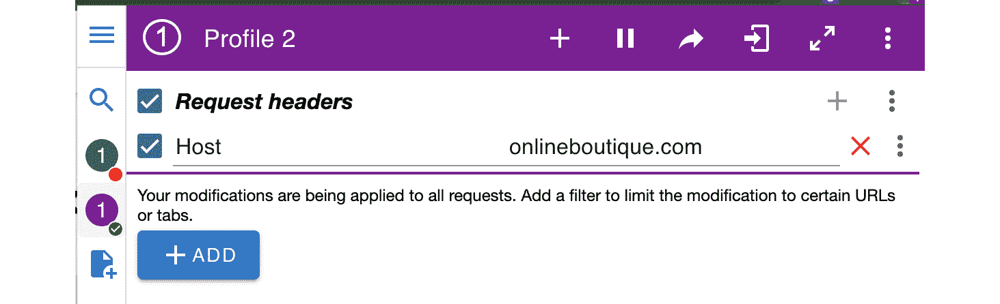

图 12.2 – 带 Host 头部的 ModHeader 扩展

一旦添加了正确的 Host 头部，您就可以通过 AWS 负载均衡器的公共 DNS 使用 Chrome 访问在线精品店：


图 12.3 – 在线精品店登录页面

到目前为止，我们只创建了一个虚拟服务，将流量从 Ingress 网关路由到网格中的 `frontend` 服务。默认情况下，Istio 会将流量发送到网格中的所有相关微服务，但正如我们在前一章讨论的那样，最佳实践是通过 `VirtualService` 定义路由，并通过目标规则定义请求如何路由。遵循最佳实践，我们需要为剩余的微服务定义 `VirtualService` 和 `DestinationRule`。拥有 `VirtualService` 和 `DestinationRule` 有助于在底层工作负载有多个版本时管理流量。

为了方便起见，`VirtualService` 和 `DestinationRule` 已在 GitHub 上的 `Chapter12/trafficmanagement/03-virtualservicesanddr-otherservices.yaml` 文件中定义。您可以使用以下命令应用配置：

```
$ kubectl apply -f Chapter12/trafficmanagement/03-virtualservicesanddr-otherservices.yaml
```

在应用配置并生成一些流量后，查看 Kiali 仪表板：

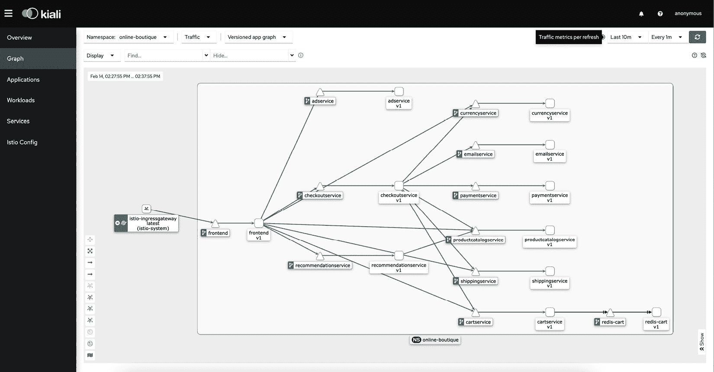

图 12.4 – 在线精品店的版本化应用图

在 Kiali 仪表板中，您可以观察到 Ingress 网关、所有虚拟服务以及底层工作负载。

### 配置访问外部服务

接下来，我们快速回顾一下将流量路由到网格外目标的概念。在*第四章*中，我们学习了 `ServiceEntry`，它使我们能够将额外的条目添加到 Istio 的内部服务注册表中，以便网格中的服务可以将流量路由到这些不属于 Istio 服务注册表的端点。以下是将 `xyz.com` 添加到 Istio 服务注册表的 `ServiceRegistry` 示例：

```
apiVersion: networking.istio.io/v1alpha3
kind: ServiceEntry
metadata:
  name: allow-egress-to-xyv.com
spec:
  hosts:
  - "xyz.com"
  ports:
  - number: 80
    protocol: HTTP
    name: http
  - number: 443
    protocol: HTTPS
    name: https
```

本节内容讲解了如何管理应用程序流量，我们通过 Istio Ingress Gateway 暴露了`onlineboutique.com`，并为流量路由和处理定义了`VirtualService`和`DestinationRule`。

## 配置 Istio 以管理应用程序的韧性

Istio 提供了多种功能来管理应用程序的韧性，我们在*第五章*中详细讨论了这些功能。我们将应用该章节中的一些概念到在线商店应用程序中。

让我们从超时和重试开始！

### 配置超时和重试

假设电子邮件服务存在间歇性故障，如果在 5 秒内没有收到电子邮件服务的响应，那么最好设置超时，并在失败后重试发送邮件几次，而不是直接放弃。我们将配置电子邮件服务的重试和超时，以修改应用程序的韧性概念。

Istio 提供了配置超时的功能，即 Istio 代理边车应该等待来自给定服务的回复的时间。在以下配置中，我们为电子邮件服务应用了 5 秒的超时：

```
apiVersion: networking.istio.io/v1alpha3
kind: VirtualService
metadata:
  namespace: online-boutique
  name: emailvirtualservice
spec:
  hosts:
  - emailservice
  http:
  - timeout: 5s
    route:
    - destination:
        host: emailservice
        subset: v1
```

Istio 还提供了自动重试的功能，这一功能作为`VirtualService`配置的一部分实现。在以下源代码块中，我们已将 Istio 配置为重试两次发送请求给电子邮件服务，每次重试的超时时间为 2 秒，且仅在下游返回`5xx,gateway-error,reset,connect-failure,refused-stream,retriable-4xx`错误时才会重试：

```
apiVersion: networking.istio.io/v1alpha3
kind: VirtualService
metadata:
  namespace: online-boutique
  name: emailvirtualservice
spec:
  hosts:
  - emailservice
  http:
  - timeout: 5s
    route:
    - destination:
        host: emailservice
        subset: v1
    retries:
      attempts: 2
      perTryTimeout: 2s
      retryOn: 5xx,gateway-error,reset,connect-failure,refused-stream,retriable-4xx
```

我们已经通过`VirtualService`配置设置了`timeout`和`retries`。假设电子邮件服务较为脆弱，并且会出现临时故障，我们将尝试通过缓解流量激增或尖峰可能导致的问题来解决这一问题。

### 配置速率限制

Istio 提供了控制来自消费者的流量激增的功能，并能够根据消费者的处理能力来控制流量。

在以下目标规则中，我们定义了电子邮件服务的速率限制控制。我们定义了电子邮件服务的活跃请求数为`1`（根据`http2MaxRequests`），每个连接只有 1 个请求（在`maxRequestsPerConnection`中定义），而在等待连接池连接时，排队请求数为 0（根据`http1MaxPendingRequests`定义）：

```
apiVersion: networking.istio.io/v1alpha3
kind: DestinationRule
metadata:
  namespace: online-boutique
  name: emaildr
spec:
  host: emailservice
  trafficPolicy:
      connectionPool:
        http:
          http2MaxRequests: 1
          maxRequestsPerConnection: 1
          http1MaxPendingRequests: 0
  subsets:
  - name: v1
    labels:
      version: v1
      app: emailservice
```

让我们做更多假设，假设电子邮件服务有两个版本，其中`v1`比`v2`更不稳定。在这种情况下，我们需要应用异常检测策略来执行熔断器。Istio 提供了良好的异常检测控制。以下代码块描述了您需要在电子邮件服务的目标规则中的`trafficPolicy`中添加的配置：

```
      outlierDetection:
        baseEjectionTime: 5m
        consecutive5xxErrors: 1
        interval: 90s
        maxEjectionPercent: 50
```

在异常值检测中，我们定义了`baseEjectionTime`，其值为`5`分钟，这是每次驱逐的最短持续时间。然后，这个值会乘以电子邮件服务被发现不健康的次数。例如，如果`v1`电子邮件服务被发现异常 5 次，那么它将从连接池中被驱逐`baseEjectionTime*5`分钟。接下来，我们定义了`consecutive5xxErrors`，其值为`1`，即需要发生的`5x`错误次数，才能将上游服务标记为异常值。然后，我们定义了`interval`，其值为`90s`，即 Istio 扫描上游服务健康状态的检查间隔时间。最后，我们定义了`maxEjectionPercent`，其值为`50%`，即连接池中可以被驱逐的最大主机数。

这样，我们就对在线精品应用程序的应用韧性管理进行了修订和应用了各种控制。Istio 提供了各种控制，用于管理应用韧性，而无需修改或构建任何特定于应用程序的内容。在下一部分，我们将把*第六章*的学习应用到我们的在线精品应用程序中。

## 配置 Istio 来管理应用安全性

现在，我们已经通过 Istio Gateway 创建了 Ingress，通过 Istio `VirtualService`和`DestinationRules`配置了路由规则，以处理流量如何被路由到最终目的地，我们可以进入下一步——在网格中保护流量。以下策略强制要求所有流量在网格中严格通过 mTLS 进行：

```
apiVersion: security.istio.io/v1beta1
kind: PeerAuthentication
metadata:
  name: strictmtls-online-boutique
  namespace: online-boutique
spec:
  mtls:
    mode: STRICT
```

配置文件可在 GitHub 上的`Chapter12/security/strictMTLS.yaml`文件中找到。如果没有此配置，网格中的所有流量都将处于*PERMISSIVE*模式，这意味着流量可以通过 mTLS 或明文传输进行。你可以通过部署`curl` Pod 并向网格中的任何微服务发起 HTTP 请求来验证这一点。但一旦应用此策略，Istio 将强制执行*STRICT*模式，这意味着所有流量将严格使用 mTLS 进行。使用以下命令应用配置：

```
$ kubectl apply -f Chapter12/security/strictMTLS.yaml
peerauthentication.security.istio.io/strictmtls-online-boutique created
```

你可以在 Kiali 中检查网格中的所有流量是否都通过 mTLS 进行：

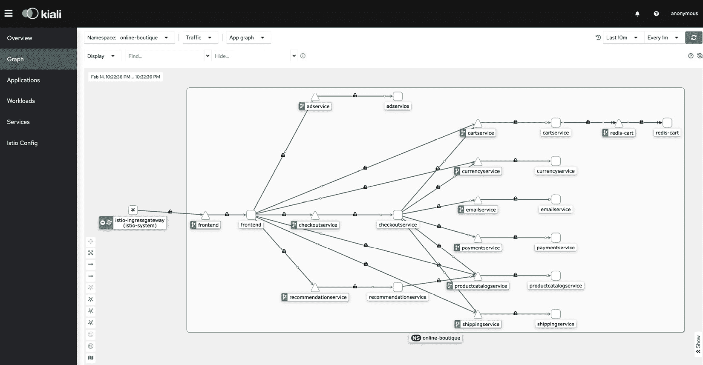

图 12.5 – 显示服务之间 mTLS 通信的应用图

接下来，我们将使用`https`来保护 Ingress 流量。这个步骤很重要，需要修订，但它的结果会导致无法访问应用程序的问题，因此我们将执行修订步骤后再将其恢复，以便继续访问应用程序。

我们将使用*第四章*中*通过 HTTPS 暴露入口*部分的内容进行学习。如果你拥有一个`onlineboutique.com`域名，步骤会简单得多：

1.  创建一个 CA。这里，我们正在使用`onlineboutique.inc`来创建 CA：

    ```
    $ openssl req -x509 -sha256 -nodes -days 365 -newkey rsa:2048 -subj '/O=Online Boutique./CN=onlineboutique.inc' -keyout onlineboutique.inc.key -out onlineboutique.inc.crt
    Generating a 2048 bit RSA private key
    writing new private key to 'onlineboutique.inc.key'
    ```

1.  生成一个`onlineboutique.com`，同时生成一个私钥：

    ```
    $ openssl req -out onlineboutique.com.csr -newkey rsa:2048 -nodes -keyout onlineboutique.com.key -subj "/CN=onlineboutique.com/O=onlineboutique.inc"
    Generating a 2048 bit RSA private key
    ...........................................................................+++
    .........+++
    writing new private key to 'onlineboutique.com.key'
    ```

1.  使用以下命令通过 CA 签署 CSR：

    ```
    $ openssl x509 -req -sha256 -days 365 -CA onlineboutique.inc.crt -CAkey onlineboutique.inc.key -set_serial 0 -in onlineboutique.com.csr -out onlineboutique.com.crt
    Signature ok
    subject=/CN= onlineboutique.com/O= onlineboutique.inc
    ```

1.  将证书和私钥作为 Kubernetes Secret 加载：

    ```
    $ kubectl create -n istio-system secret tls onlineboutique-credential --key=onlineboutique.com.key --cert=onlineboutique.com.crt
    secret/onlineboutique-credential created
    ```

我们已经创建了证书并将其存储为 Kubernetes Secret。在接下来的步骤中，我们将修改 Istio Gateway 配置，通过 HTTPS 暴露流量，并使用这些证书。

1.  按照以下命令创建 Gateway 配置：

    ```
    apiVersion: networking.istio.io/v1alpha3
    kind: Gateway
    metadata:
      name: online-boutique-ingress-gateway
      namespace: online-boutique
    spec:
      selector:
        istio: ingressgateway
      servers:
      - port:
          number: 443
          name: https
          protocol: HTTPS
        tls:
          mode: SIMPLE
          credentialName: onlineboutique-credential
        hosts:
        - "onlineboutique.com"
    ```

应用以下配置：

```
$ kubectl apply -f Chapter12/security/01-istio-gateway.yaml
```

你可以使用以下命令访问并检查证书。请注意，输出已被截断，仅突出显示相关部分：

```
$ curl -v -HHost:onlineboutique.com --connect-to "onlineboutique.com:443:aced3fea1ffaa468fa0f2ea6fbd3f612-390497785.us-east-1.elb.amazonaws.com" --cacert onlineboutique.inc.crt --head  https://onlineboutique.com:443/
..
* Connected to aced3fea1ffaa468fa0f2ea6fbd3f612-390497785.us-east-1.elb.amazonaws.com (52.207.198.166) port 443 (#0)
--
* Server certificate:
*  subject: CN=onlineboutique.com; O=onlineboutique.inc
*  start date: Feb 14 23:21:40 2023 GMT
*  expire date: Feb 14 23:21:40 2024 GMT
*  common name: onlineboutique.com (matched)
*  issuer: O=Online Boutique.; CN=onlineboutique.inc
*  SSL certificate verify ok.
..
```

该配置将保护 `online-boutique` 商店的 Ingress 流量，但这也意味着你将无法通过浏览器访问它，因为浏览器中使用的 FQDN 与证书中配置的 CN 不匹配。你可以选择在 AWS 负载均衡器上注册 DNS 名称，但现在，你可能会发现删除 HTTPS 配置并恢复使用 GitHub 上的 `Chapter12/trafficmanagement/01-gateway.yaml` 文件会更容易。

让我们深入探讨安全性，并为 Online Boutique 商店执行 `RequestAuthentication` 和授权。在 *第六章* 中，我们详细讲解了使用 Auth0 构建认证和授权的过程。按照相同的思路，我们将为 `frontend` 服务构建认证和授权策略，但这一次，我们将使用 Istio 附带的虚拟 JWKS 端点。

我们将从创建一个 `RequestAuthentication` 策略开始，用来定义 `frontend` 服务支持的认证方法：

```
apiVersion: security.istio.io/v1beta1
kind: RequestAuthentication
metadata:
 name: frontend
 namespace: online-boutique
spec:
  selector:
    matchLabels:
      app: frontend
  jwtRules:
  - issuer: "testing@secure.istio.io"
    jwksUri: "https://raw.githubusercontent.com/istio/istio/release-1.17/security/tools/jwt/samples/jwks.json"
```

我们正在使用 Istio 附带的虚拟 `jwksUri` 进行测试。使用以下命令应用 `RequestAuthentication` 策略：

```
$ kubectl apply -f Chapter12/security/requestAuthentication.yaml
requestauthentication.security.istio.io/frontend created
```

应用 `RequestAuthentication` 策略后，你可以通过向 `frontend` 服务提供虚拟令牌来进行测试：

1.  获取虚拟令牌并将其设置为环境变量，稍后在请求中使用：

    ```
    TOKEN=$(curl -k https://raw.githubusercontent.com/istio/istio/release-1.17/security/tools/jwt/samples/demo.jwt -s); echo $TOKEN
    eyJhbGciOiJSUzI1NiIsImtpZCI6IkRIRmJwb0lVcXJZOHQyen BBMnFYZkNtcjVWTzVaRXI0UnpIVV8tZW52dlEiLCJ0eXAiOiJKV1QifQ.eyJleHAiOjQ2ODU5ODk3MDAsImZvbyI6ImJhciIsImlhdCI6MTUzMjM4OTcwMCwiaXNzIjoidGVzdGluZ0BzZWN1cmUuaXN0aW8uaW8iLCJzdWIiOiJ0ZXN0aW5nQHNlY3VyZS5pc3Rpby5pbyJ9\. CfNnxWP2tcnR9q0vxyxweaF3ovQYHYZl82hAUsn21bwQd9zP7c-LS9qd_vpdLG4Tn1A15NxfCjp5f7QNBUo-KC9PJqYpgGbaXhaGx7bEdFWjcwv3nZzvc7M__ZpaCERdwU7igUmJqYGBYQ51vr2njU9ZimyKkfDe3axcyiBZde7G6dabliUosJvvKOPcKIWPccCgefSj_GNfwIip3-SsFdlR7BtbVUcqR-yv-XOxJ3Uc1MI0tz3uMiiZcyPV7sNCU4KRnemRIMHVOfuvHsU60_GhGbiSFzgPTAa9WTltbnarTbxudb_YEOx12JiwYToeX0DCPb43W1tzIBxgm8NxUg
    ```

1.  使用 `curl` 进行测试：

    ```
    $ curl -HHost:onlineboutique.com http://aced3fea1ffaa468fa0f2ea6fbd3f612-390497785.us-east-1.elb.amazonaws.com/ -o /dev/null --header "Authorization: Bearer $TOKEN" -s -w '%{http_code}\n'
    200
    ```

注意到你收到了一个 `200` 响应。

1.  现在尝试使用无效令牌进行测试：

    ```
    $ curl -HHost:onlineboutique.com http://aced3fea1ffaa468fa0f2ea6fbd3f612-390497785.us-east-1.elb.amazonaws.com/ -o /dev/null --header "Authorization: Bearer BLABLAHTOKEN" -s -w '%{http_code}\n'
    401
    ```

`RequestAuthentication` 策略已生效并拒绝了请求。

1.  测试没有令牌的情况：

    ```
    % curl -HHost:onlineboutique.com http://aced3fea1ffaa468fa0f2ea6fbd3f612-390497785.us-east-1.elb.amazonaws.com/ -o /dev/null  -s -w '%{http_code}\n'
    200
    ```

请求的结果不是我们期望的，但这是预期的，因为 `RequestAuthentication` 策略仅负责在传递令牌时验证该令牌。如果请求中没有 `Authorization` 头部，`RequestAuthentication` 策略将不会被调用。我们可以通过使用 `AuthorizationPolicy` 来解决这个问题，后者为服务网格中的工作负载强制执行访问控制策略。

让我们构建 `AuthorizationPolicy`，强制要求请求中必须存在一个主体：

```
apiVersion: security.istio.io/v1beta1
kind: AuthorizationPolicy
metadata:
  name: require-jwt
  namespace: online-boutique
spec:
  selector:
    matchLabels:
      app: frontend
  action: ALLOW
  rules:
  - from:
    - source:
       requestPrincipals: ["testing@secure.istio.io/testing@secure.istio.io"]
```

配置文件可以在 GitHub 上的 `Chapter12/security/requestAuthorizationPolicy.yaml` 文件中找到。使用以下命令应用配置：

```
$ kubectl apply -f Chapter12/security/requestAuthorizationPolicy.yaml
authorizationpolicy.security.istio.io/frontend created
```

在应用了`RequestAuthentication`策略后，按照*步骤 1*到*步骤 4*执行配置测试时，您会发现所有步骤都按预期工作，但在*步骤 4*中，我们遇到了以下问题：

```
$ curl -HHost:onlineboutique.com http://aced3fea1ffaa468fa0f2ea6fbd3f612-390497785.us-east-1.elb.amazonaws.com/ -o /dev/null  -s -w '%{http_code}\n'
403
```

这是因为授权策略强制要求 JWT 的存在，且该 JWT 具有`["``testing@secure.istio.io/testing@secure.istio.io"]`主体。

这就是我们为在线商店应用程序配置安全性设置的总结。在下一节中，我们将阅读有关各种资源的内容，这些资源将帮助您成为使用和操作 Istio 的专家，并获得认证。

# Istio 的认证和学习资源

学习 Istio 的主要资源是 Istio 官方网站([`istio.io/latest/`](https://istio.io/latest/))。网站上有关于执行从基础到多集群设置的详细文档。资源涵盖了初学者和高级用户，并提供了各种关于流量管理、安全性、可观察性、可扩展性和策略执行的练习。除了 Istio 文档之外，提供大量 Istio 支持内容的另一个组织是 Tetrate([`tetrate.io/`](https://tetrate.io/))，它还提供实验室和认证课程。Tetrate Academy 提供的一项认证是**认证 Istio 管理员**。有关课程和考试的详细信息，请访问[`academy.tetrate.io/courses/certified-istio-administrator`](https://academy.tetrate.io/courses/certified-istio-administrator)。Tetrate Academy 还提供了一门免费的 Istio 基础课程。您可以在[`academy.tetrate.io/courses/istio-fundamentals`](https://academy.tetrate.io/courses/istio-fundamentals)找到课程的详细信息。同样，Solo.io 也提供了一门名为**开始使用 Istio**的课程，您可以在[`academy.solo.io/get-started-with-istio`](https://academy.solo.io/get-started-with-istio)查看课程的详细信息。来自 Linux 基金会的另一门好课程叫做**Istio 简介**，您可以在[`training.linuxfoundation.org/training/introduction-to-istio-lfs144x/`](https://training.linuxfoundation.org/training/introduction-to-istio-lfs144x/)找到该课程的详细信息。

我个人喜欢在[`istiobyexample.dev/`](https://istiobyexample.dev/)上使用的学习资源；该网站详细解释了 Istio 的各种使用场景（例如金丝雀发布、管理 Ingress、管理 gRPC 流量等），并提供了配置示例。如有任何技术问题，您可以随时访问 StackOverflow，[`stackoverflow.com/questions/tagged/istio`](https://stackoverflow.com/questions/tagged/istio)。这里有一个充满活力和热情的 Istio 用户与开发者社区，他们在[`discuss.istio.io/`](https://discuss.istio.io/)讨论各种与 Istio 相关的话题；欢迎注册讨论论坛。

Tetrate Academy 还提供了一个免费的 Envoy 基础课程；该课程非常有助于理解 Envoy 的基础知识，进而理解 Istio 数据平面。你可以在 [`academy.tetrate.io/courses/envoy-fundamentals`](https://academy.tetrate.io/courses/envoy-fundamentals) 找到该课程的详细信息。课程中包含了许多实用的实验和小测验，非常有助于你掌握 Envoy 技能。

Istio 网站已经整理了一份有用的资源清单，帮助你了解 Istio 的最新动态并与 Istio 社区互动；你可以在 [`istio.io/latest/get-involved/`](https://istio.io/latest/get-involved/) 找到这份清单。该清单还提供了如何报告 bugs 和问题的详细信息。

总结来说，除了少数几本书和网站外，相关资源并不多，但你大多数问题的答案可以在 [`istio.io/latest/docs/`](https://istio.io/latest/docs/) 找到。关注 **IstioCon** 也是一个不错的主意，IstioCon 是 Istio 社区的年会，每年举办一次。你可以在 [`events.istio.io/istiocon-2022/sessions/`](https://events.istio.io/istiocon-2022/sessions/) 找到 2022 年的会议内容，在 [`events.istio.io/istiocon-2021/sessions/`](https://events.istio.io/istiocon-2021/sessions/) 找到 2021 年的会议内容。

# 理解 eBPF

在本书接近尾声时，了解与服务网格相关的其他技术也非常重要。其中一个技术就是 **扩展伯克利数据包过滤器**（**eBPF**）。在这一部分，我们将了解 eBPF 及其在服务网格演变中的作用。

eBPF 是一个框架，它允许用户在操作系统内核中运行自定义程序，而无需修改内核源代码或加载内核模块。自定义程序被称为 **eBPF 程序**，用于在运行时向操作系统添加额外的功能。eBPF 程序既安全又高效，像内核模块一样，它们是轻量级的沙盒虚拟机，由操作系统在特权上下文中运行。

eBPF 程序是基于内核级事件触发的，这通过将它们与钩子点关联来实现。钩子是预定义的内核级事件，包括系统调用、网络事件、函数入口和退出等。在没有合适钩子的场景下，用户可以使用内核探针，也叫做 kprobes。kprobes 被插入到内核例程中；eBPF 程序被定义为 kprobes 的处理程序，并且每当在内核中触发特定断点时，eBPF 程序就会执行。像钩子和 kprobes 一样，eBPF 程序也可以附加到 uprobes 上，uprobes 是用户空间级别的探针，绑定到用户应用程序级别的事件，因此 eBPF 程序可以在从内核到用户应用程序的任何级别执行。执行内核级程序时，最大的关注点是程序的安全性。在 eBPF 中，这是通过 BPF 库来保证的。BPF 库处理加载 eBPF 程序的系统调用，分为两个步骤。第一个步骤是验证步骤，在此过程中验证 eBPF 程序，确保它能够完成执行并且不会锁死内核，加载 eBPF 程序的进程具有正确的权限，并且 eBPF 程序不会对内核造成任何危害。第二个步骤是**即时编译**（**JIT**）步骤，它将程序的通用字节码转换为特定机器的指令，并对其进行优化，以获得程序的最大执行速度。这使得 eBPF 程序的运行效率与本地编译的内核代码相当，就像它作为内核模块加载一样。一旦这两个步骤完成，eBPF 程序就会被加载并编译进内核，等待钩子或 kprobes 触发执行。

BPF 已经广泛作为内核的附加组件使用。大多数应用程序都集中在网络层，主要用于可观察性领域。eBPF 被用来提供对数据包和套接字级别的系统调用的可视化，进而用于构建可以从内核低级上下文中操作的安全解决方案系统。eBPF 程序还用于对用户应用程序以及运行该应用程序的内核部分进行自省，这提供了一个统一的视角，用于排查应用程序性能问题。你可能会想知道为什么我们在服务网格的上下文中讨论 eBPF。eBPF 的可编程性和插件模型在网络领域特别有用。eBPF 可以用于执行 IP 路由、数据包过滤、监控等功能，且速度与内核模块的本地速度相同。Istio 架构的一个缺点是它为每个工作负载都部署一个边车（sidecar），正如我们在*第二章*中讨论的那样——边车的基本工作原理是拦截网络流量，利用 iptables 配置内核的 netfilter 数据包过滤功能。这种方法的缺点是性能不太理想，因为为服务流量创建的数据路径比没有边车流量拦截时的路径要长得多。通过 eBPF 的套接字相关程序类型，你可以过滤套接字数据、重定向套接字数据，并监控套接字事件。这些程序有可能替代基于 iptables 的流量拦截；使用 eBPF，有多种方式可以拦截和管理网络流量，而不会对数据路径性能产生负面影响。

**Isovalent**（访问 [`isovalent.com/`](https://isovalent.com/)）就是这样一个正在革新 API 网关和服务网格架构的组织。**Cilium**是 Isovalent 的一个产品，它提供多种功能，包括 API 网关功能、服务网格、可观察性和网络功能。Cilium 是以 eBPF 为核心技术构建的，它在 Linux 内核的多个位置注入 eBPF 程序，从而实现应用程序网络、安全和可观察性功能。Cilium 正在被 Kubernetes 网络中采用，以解决由于数据包需要在主机和 Pod 之间多次穿越相同的网络栈而导致的性能下降问题。Cilium 通过绕过 iptables 的网络堆栈，避免了 iptables 带来的网络过滤器和其他开销，从而大幅提高了网络性能。你可以在[`isovalent.com/blog/post/cilium-release-113/`](https://isovalent.com/blog/post/cilium-release-113/)阅读更多关于 Cilium 产品栈的信息；你将会惊讶地发现，eBPF 正在如何革新应用程序网络领域。

Istio 还创建了一个名为 Merbridge 的开源项目，它用 eBPF 程序替代了 iptables，允许数据直接在边车容器和应用容器的进出套接字之间传输，从而缩短整体数据路径。Merbridge 虽然还处于初期阶段，但已经取得了一些有前景的成果；你可以在[`github.com/merbridge/merbridge`](https://github.com/merbridge/merbridge)找到这个开源项目。

随着 eBPF 和像 Cilium 这样的产品的出现，未来网络代理产品的设计和操作方式可能会有显著的进展。eBPF 正在被包括 Istio 在内的各种服务网格技术积极探索，研究如何利用它来克服缺点并提升使用 Istio 的整体性能和体验。eBPF 是一项非常有前景的技术，已经在像 Cilium 和 Calico 这样的产品中得到了广泛应用，做出了很多令人惊叹的成果。

# 总结

我希望本书能为你提供对 Istio 的深入了解。*第一章*到*第三章*为你设定了服务网格为何需要以及 Istio 的控制平面和数据平面如何运作的背景。这三章中的信息对理解 Istio 及其架构非常重要。接着，*第四章*到*第六章*提供了如何使用 Istio 构建我们在前几章中讨论的应用网络的详细信息。

然后，在*第七章*中，你学习了可观察性以及 Istio 如何与各种观察工具进行集成，接下来的步骤是你应该探索与其他可观察性和监控工具的集成，例如 Datadog。接着，*第八章*展示了如何在多个 Kubernetes 集群中部署 Istio 的实践，这应该让你对如何在生产环境中安装 Istio 充满信心。*第九章*接着提供了如何使用 WebAssembly 扩展 Istio 及其应用的详细信息，而*第十章*讨论了 Istio 如何帮助将旧有的虚拟机世界与新兴的 Kubernetes 世界连接，通过讨论如何扩展服务网格以包含部署在虚拟机上的工作负载。最后，*第十一章*涵盖了操作 Istio 的最佳实践，以及如何使用 OPA Gatekeeper 等工具自动化一些最佳实践。

在本章中，我们通过部署和配置另一个开源示范应用，复习了*第四章*到*第六章*的概念，这应该让你充满信心并获得经验，将书中的学习应用到实际应用中，并利用 Istio 提供的应用网络和安全功能。

你还会了解 eBPF 以及它作为一种颠覆性技术的重要性，它使得在不需要理解或经历内核恐怖的情况下，也可以在内核级别编写代码。eBPF 可能会给服务网格、API 网关和一般的网络解决方案带来许多变化。在本书的附录中，你将找到关于其他服务网格技术的信息：Consul Connect、Kuma Mesh、Gloo Mesh 和 Linkerd。附录提供了这些技术的概述，并帮助你理解它们的优势和局限性。

希望你喜欢学习 Istio。为了巩固你对 Istio 的知识，你还可以探索参加 Tetrate 提供的认证 Istio 管理员考试。你还可以探索本章中提供的其他学习途径。希望你阅读本书的过程能帮助你提升职业生涯，并在使用 Istio 构建可扩展、弹性和安全的应用程序方面获得更多经验。

祝你好运！

# 附录 – 其他服务网格技术

在本附录中，我们将学习以下服务网格实现：

+   Consul Connect

+   Gloo Mesh

+   Kuma

+   Linkerd

这些服务网格技术很受欢迎，并且正在被越来越多的组织认可和采用。本 *附录* 中提供的关于这些服务网格技术的信息并不详尽；这里的目标是让你熟悉并了解 Istio 的替代方案。我希望阅读本 *附录* 能为你提供这些替代技术的基本认知，并帮助你理解这些技术与 Istio 相比的表现。让我们开始深入了解吧！

# Consul Connect

Consul Connect 是由 HashiCorp 提供的服务网格解决方案，也称为 Consul 服务网格。在 HashiCorp 的官网上，你会发现 Consul Connect 和 Consul 服务网格这两个术语是可以互换使用的。它是基于 Consul 构建的，而 Consul 是一个服务发现解决方案和键值存储。Consul 是一个非常流行且历史悠久的服务发现解决方案；它为各种工作负载提供和管理服务身份，然后这些身份被服务网格用来管理 Kubernetes 中服务之间的流量。它还支持使用 ACL 来实现零信任网络，并提供对网格中流量流动的精细控制。

Consul 使用 Envoy 作为其数据平面，并将其注入到工作负载 Pod 中作为 sidecar。注入可以基于注解和全局配置来自动将 sidecar 代理注入到指定命名空间中的所有工作负载。我们将从在你的工作站上安装 Consul 服务网格开始，然后进行一些练习，帮助你掌握使用 Consul 服务网格的基础知识。

让我们从安装 Consul 开始：

1.  克隆 Consul 仓库：

    ```
    % git clone https://github.com/hashicorp-education/learn-consul-get-started-kubernetes.git
    …..
    Resolving deltas: 100% (313/313), done.
    ```

1.  安装 Consul CLI：

    +   对于 MacOS，请按照以下步骤操作：

        1.  安装 HashiCorp tap：

        ```
        % brew tap hashicorp/tap
        ```

    1.  安装 Consul Kubernetes CLI：

    ```
    % brew install hashicorp/tap/consul-k8s
    Running `brew update --auto-update`...
    ==> Auto-updated Homebrew!
    Updated 1 tap (homebrew/core).
    You have 4 outdated formulae installed.
    You can upgrade them with brew upgrade
    or list them with brew outdated.
    ==> Fetching hashicorp/tap/consul-k8s
    ==> Downloading https://releases.hashicorp.com/consul-k8s/1.0.2/consul-k8s_1.0.2_darwin_arm64.zip
    ######################################################################## 100.0%
    ==> Installing consul-k8s from hashicorp/tap
    consul-k8s on the Consul CLI:
    ```

```
% consul-k8s version
    consul-k8s v1.0.2
```

+   对于 Linux Ubuntu/Debian，请按照以下步骤操作：

1.  添加 HashiCorp GPG 密钥：

```
% curl -fsSL https://apt.releases.hashicorp.com/gpg | sudo apt-key add –
```

1.  添加 HashiCorp 的 apt 仓库：

```
apt-get install to install the consul-k8s CLI:

```

% sudo apt-get update && sudo apt-get install consul-k8s

```

*   For CentOS/RHEL, follow these steps:1.  Install yum-config-manager to manage your repositories:

```

% sudo yum install -y yum-utils

```

1.  Use yum-config-manager to add the official HashiCorp Linux repository:

```

consul-k8s CLI：

```
% sudo yum -y install consul-k8s
```

                启动 minikube：

```
% minikube start --profile dc1 --memory 4096 --kubernetes-version=v1.24.0
```

                使用 Consul CLI 在 minikube 上安装 Consul。

            在 learn-consul-get-started-kubernetes/local 中运行以下命令：

```
% consul-k8s install -config-file=helm/values-v1.yaml -set global.image=hashicorp/consul:1.14.0
==> Checking if Consul can be installed
✓ No existing Consul installations found.
✓ No existing Consul persistent volume claims found
✓ No existing Consul secrets found.
==> Consul Installation Summary
    Name: consul
    Namespace: consul
….
--> Starting delete for "consul-server-acl-init-cleanup" Job
✓ Consul installed in namespace "consul".
```

                1.  检查命名空间中的 Consul Pods：

    ```
    % kubectl get po -n consul
    NAME                    READY   STATUS    RESTARTS    AGE
    consul-connect-injector-57dcdd54b7-hhxl4       1/1     Running   1 (21h ago)   21h
    consul-server-0       1/1     Running   0             21h
    consul-webhook-cert-manager-76bbf7d768-2kfhx   1/1     Running   0             21h
    ```

                1.  配置 Consul CLI 以便能够与 Consul 通信。

            我们将设置环境变量，以便 Consul CLI 能够与您的 Consul 集群通信。

            从`secrets/consul-bootstrap-acl-token`设置`CONSUL_HTTP_TOKEN`并将其设置为环境变量：

```
CONSUL_HTTP_TOKENsecrets/consul-bootstrap-acl-token --template={{.data.token}} | base64 -d)
```

            设置 Consul 目标地址。默认情况下，Consul 在端口 8500 上运行 HTTP，在端口 8501 上运行 HTTPS：

```
% export CONSUL_HTTP_ADDR=https://127.0.0.1:8501
```

            删除 SSL 验证检查，以简化与您的 Consul 集群的通信：

```
% export CONSUL_HTTP_SSL_VERIFY=false
```

                1.  使用以下命令访问 Consul 仪表盘：

    ```
    % kubectl port-forward pods/consul-server-0 8501:8501 --namespace consul
    ```

            在浏览器中打开`localhost:8501`以访问 Consul 仪表盘，如下图所示：

            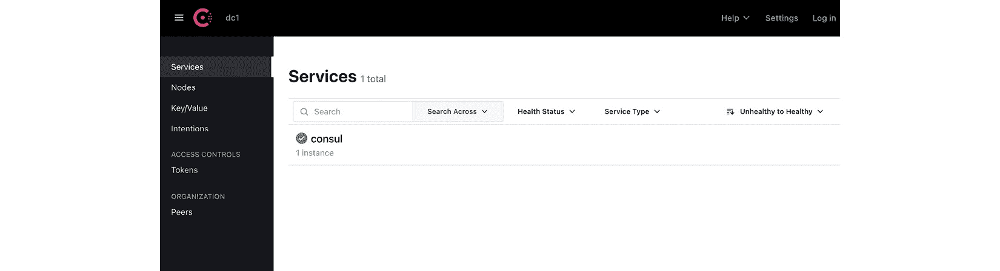

            图 A.1 – Consul 仪表盘

            现在我们已在 minikube 上安装了 Consul 服务网格，让我们部署一个示例应用程序，并了解 Consul 服务网格的基本原理。

            部署示例应用程序

            在这一节中，我们将部署 envoydummy 及一个 curl 应用程序。`sampleconfiguration`文件位于`AppendixA/envoy-proxy-01.yaml`。

            在配置文件中，您将看到以下注释：

```
      annotations:
        consul.hashicorp.com/connect-inject: "true"
```

            该注释允许 Consul 自动为每个服务注入一个代理。代理创建了一个数据平面，根据 Consul 的配置处理服务之间的请求。

            应用配置以创建`envoydummy`和`curl` Pods：

```
% kubectl create -f AppendixA/Consul/envoy-proxy-01.yaml -n appendix-consul
configmap/envoy-dummy created
service/envoydummy created
deployment.apps/envoydummy created
servicedefaults.consul.hashicorp.com/envoydummy created
serviceaccount/envoydummy created
servicedefaults.consul.hashicorp.com/curl created
serviceaccount/curl created
pod/curl created
service/curl created
```

            几秒钟后，您将看到 Consul 自动将 sidecar 注入到 Pods 中：

```
% % kubectl get po -n appendix-consul
NAME                          READY   STATUS    RESTARTS   AGE
curl                          2/2     Running   0          16s
envoydummy-77dfb5d494-2dx5w   2/2     Running   0          17s
```

            要了解更多关于 sidecar 的信息，请使用以下命令检查`envoydummy` Pod：

```
% kubectl get po/envoydummy-77dfb5d494-pcqs7 -n appendix-consul -o json | jq '.spec.containers[].image'
"envoyproxy/envoy:v1.22.2"
"hashicorp/consul-dataplane:1.0.0"
% kubectl get po/envoydummy-77dfb5d494-pcqs7 -n appendix-consul -o json | jq '.spec.containers[].name'
"envoyproxy"
"consul-dataplane"
```

            在输出中，您会看到一个名为`consul-dataplane`的容器，它是从名为`hashicorp/consul-dataplane:1.0.0`的镜像创建的。您可以在[`hub.docker.com/layers/hashicorp/consul-dataplane/1.0.0-beta1/images/sha256-f933183f235d12cc526099ce90933cdf43c7281298b3cd34a4ab7d4ebeeabf84?context=explore`](https://hub.docker.com/layers/hashicorp/consul-dataplane/1.0.0-beta1/images/sha256-f933183f235d12cc526099ce90933cdf43c7281298b3cd34a4ab7d4ebeeabf84?context=explore)查看该镜像，您会发现它是由 envoy 代理组成的。

            让我们尝试从`curl` Pod 访问`envoydummy`：

```
% kubectl exec -it pod/curl -n appendix-consul -- curl http://envoydummy:80
curl: (52) Empty reply from server
command terminated with exit code 52
```

            到目前为止，我们已成功部署`envoydummy` Pod，并将`consul-dataplane`作为 sidecar 一同部署。我们通过观察`curl` Pod 发现，尽管它与`envoydummy` Pod 部署在同一个命名空间，但无法访问该 Pod，从而验证了 Consul 服务网格安全的实际效果。在下一节中，我们将了解这一行为，并学习如何配置 Consul 以实现零信任网络。

            零信任网络

            Consul 通过名为意图的 Consul 构造来管理服务间授权。使用 Consul CRD，你需要定义意图，规定哪些服务可以互相通信。意图是 Consul 中零信任网络的基石。

            意图由边车代理在入站连接上执行。边车代理通过其 TLS 客户端证书识别入站服务。在识别入站服务后，边车代理检查是否存在允许客户端与目标服务通信的意图。

            在下面的代码块中，我们定义了一个意图，允许`curl`服务到`envoydummy`服务的流量：

```
apiVersion: consul.hashicorp.com/v1alpha1
kind: ServiceIntentions
metadata:
  name: curl-to-envoydummy-api
  namespace: appendix-consul
spec:
  destination:
    name: envoydummy
  sources:
    - name: curl
      action: allow
```

            在配置中，我们指定了目标服务和源服务的名称。在`action`中，我们指定了`allow`，允许源到目标的流量。`action`的另一个可能值是`deny`，即拒绝源到目标的流量。如果你不想指定服务名称，你需要使用`*`。例如，如果`sources`中的服务名称是`*`，则允许所有服务到`envoydummy`的流量。

            让我们使用以下命令应用意图：

```
% kubectl create -f AppendixA/Consul/curl-to-envoy-dummy-intentions.yaml
serviceintentions.consul.hashicorp.com/curl-to-envoydummy-api created
```

            你可以在 Consul 仪表板中验证已创建的意图：

            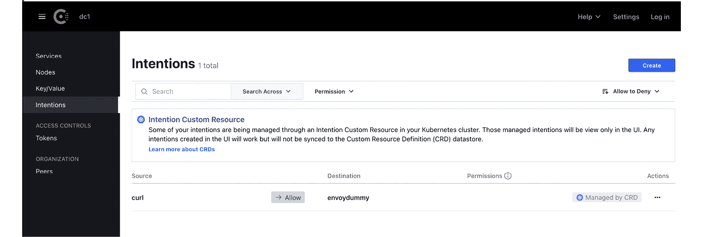

            图 A.2 – Consul 意图

            鉴于我们已经创建了允许`curl`服务到`envoydummy`服务的流量意图，接下来让我们测试`curl` Pod 是否能够通过以下命令与`envoydummy` Pod 进行通信：

```
% kubectl exec -it pod/curl -n appendix-consul -- curl http://envoydummy
V1----------Bootstrap Service Mesh Implementation with Istio----------V1%
```

            通过使用意图，我们能够定义控制服务间流量的规则，而无需配置防火墙或进行集群中的任何更改。意图是 Consul 构建零信任网络的关键组成部分。

            流量管理与路由

            Consul 提供了全面的服务发现和流量管理功能。服务发现包括三个阶段：路由、拆分和解析。这三个阶段也被称为服务发现链，它可以用于基于 HTTP 头、路径、查询字符串和工作负载版本实现流量控制。

            让我们逐步分析服务发现链的每个阶段。

            路由

            这是服务发现链的第一个阶段，用于使用 Layer 7 构造（如 HTTP 头和路径）拦截流量。这是通过`service-router`配置条目实现的，你可以使用各种标准控制流量路由。例如，对于`envoydummy`，假设我们希望强制任何发送到`envoydummy`版本 v1 并且 URI 中包含`/latest`的请求应该路由到`envoydummy`版本 v2，而任何发送到`envoydummy`应用版本 v2 但路径中包含`/old`的请求应该路由到`envoydummy`应用版本 v1。这可以通过以下`ServiceRouter`配置实现：

```
apiVersion: consul.hashicorp.com/v1alpha1
kind: ServiceRouter
metadata:
  name: envoydummy
spec:
  routes:
    - match:
        http:
          pathPrefix: '/latest'
      destination:
        service: 'envoydummy2'
```

            在配置中，我们指定了任何目标为 `envoydummy` 服务的请求，如果 `pathPrefix` 设置为 `'/latest'`，将会路由到 `envoydummy2`。而在接下来的配置中，我们指定了任何目标为 `envoydummy2` 服务的请求，如果 `pathPrefix` 设置为 `'/old'`，将会路由到 `envoydummy`：

```
apiVersion: consul.hashicorp.com/v1alpha1
kind: ServiceRouter
metadata:
  name: envoydummy2
spec:
  routes:
    - match:
        http:
          pathPrefix: '/old'
      destination:
        service: 'envoydummy'
```

            两个 `ServiceRouter` 配置保存在 `AppendixA/Consul/routing-to-envoy-dummy.yaml` 中。`envoydummy` 版本 v2 的部署描述符以及允许从 `curl` Pod 进行流量的意图也可以在 GitHub 上的 `AppendixA/Consul/envoy-proxy-02.yaml` 找到。

            使用以下命令部署 `envoydummy` 版本 v2 以及 `ServiceRouter` 配置：

```
% kubectl apply -f AppendixA/Consul/envoy-proxy-02.yaml
% kubectl apply -f AppendixA/Consul/routing-to-envoy-dummy.yaml -n appendix-consul
servicerouter.consul.hashicorp.com/envoydummy configured
servicerouter.consul.hashicorp.com/envoydummy2 configured
```

            你可以使用 Consul 仪表板检查配置。以下两张截图展示了我们应用的两个 `ServiceRouter` 配置：

                +   `ServiceRouter` 配置，将带有 `/latest` 前缀的流量发送到 `envoydummy2`：

            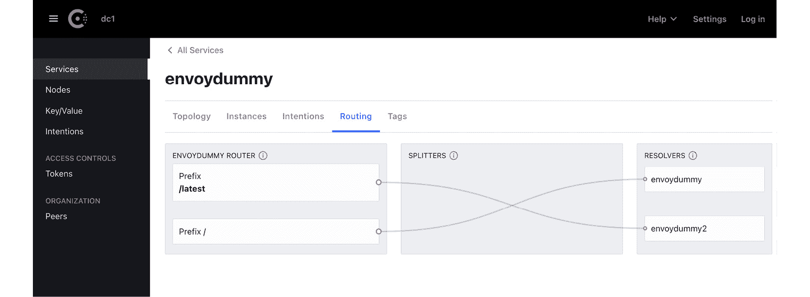

            图 A.3

                +   `ServiceRouter` 配置，将带有 `/old` 前缀的流量发送到 `envoydummy`：

            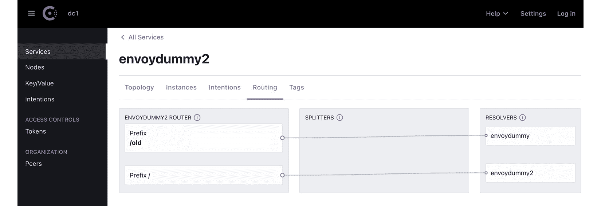

            图 A.4

            现在我们已经配置了服务路由，让我们来测试一下路由行为：

                1.  向 `envoydummy` 版本 v1 发起请求，URI 不是 `/latest`：

    ```
    % kubectl exec -it pod/curl -n appendix-consul -- curl http://envoydummy/new
    V1----------Bootstrap Service Mesh Implementation with Istio----------V1%
    ```

            输出符合预期：请求应该被路由到 `envoydummy` 版本 v1。

                1.  向 `envoydummy` 版本 v1 发起请求，URI 为 `/latest`：

    ```
    % kubectl exec -it pod/curl -n appendix-consul -- curl http://envoydummy/latest
    V2----------Bootstrap Service Mesh Implementation with Istio----------V2%
    ```

            输出符合预期：请求虽然是发送给 `envoydummy` 版本 v1，但实际上被路由到了 `envoydummy` 版本 v2。

                1.  向 `envoydummy` 版本 v2 发起请求，URI 不是 `/old`：

    ```
    % kubectl exec -it pod/curl -n appendix-consul -- curl http://envoydummy2/new
    V2----------Bootstrap Service Mesh Implementation with Istio----------V2%
    ```

            输出符合预期：请求应该被路由到 `envoydummy` 版本 v2。

                1.  向 `envoydummy` 版本 v2 发起请求，URI 为 `/old`：

    ```
    % kubectl exec -it pod/curl -n appendix-consul -- curl http://envoydummy2/old
    V1----------Bootstrap Service Mesh Implementation with Istio----------V1%
    ```

            输出符合预期：请求虽然是发送给 `envoydummy` 版本 v2，但实际上被路由到了 `envoydummy` 版本 v1。

            在这些示例中，我们利用路径前缀作为路由标准。其他选项还包括查询参数和 HTTP 头。`ServiceRouter` 还支持重试逻辑，这可以添加到目标配置中。以下是添加到 `ServiceRouter` 配置中的重试逻辑示例：

```
apiVersion: consul.hashicorp.com/v1alpha1
kind: ServiceRouter
metadata:
  name: envoydummy2
spec:
  routes:
    - match:
        http:
          pathPrefix: '/old'
      destination:
        service: 'envoydummy'
        requestTimeout = "20s"
        numRetries = 3
        retryOnConnectFailure = true
```

            你可以在 HashiCorp 网站上阅读更多关于 `ServiceRouter` 配置的内容：[`developer.hashicorp.com/consul/docs/connect/config-entries/service-router`](https://developer.hashicorp.com/consul/docs/connect/config-entries/service-router)。

            接下来是服务发现链中的拆分，我们将在以下部分学习相关内容。

            拆分

            服务分流是 Consul 服务发现链中的第二个阶段，通过`ServiceSplitter`配置进行配置。`ServiceSplitter`允许你将请求分流到多个子集工作负载。通过此配置，你还可以进行金丝雀发布。以下是一个示例，展示了`envoydummy`服务的流量以 20:80 的比例路由到`envoydummy`应用的 v1 和 v2 版本：

```
apiVersion: consul.hashicorp.com/v1alpha1
kind: ServiceSplitter
metadata:
  name: envoydummy
spec:
  splits:
    - weight: 20
      service: envoydummy
    - weight: 80
      service: envoydummy2
```

            在`ServiceSplitter`配置中，我们将 80%的流量路由到`envoydummy2`服务，剩下的 20%流量路由到`envoydummy`服务。该配置文件位于`AppendixA/Consul/splitter.yaml`中。你可以使用以下命令应用该配置：

```
% kubectl apply -f AppendixA/Consul/splitter.yaml -n appendix-consul
servicesplitter.consul.hashicorp.com/envoydummy created
```

            应用配置后，你可以在 Consul 仪表盘上查看路由配置。在下面的截图中，我们可以看到所有流量都被路由到`envoydummy`和`envoydummy2`。截图中没有显示百分比，但你可以将鼠标悬停在连接分流器和解析器的箭头上，应该能看到百分比：

            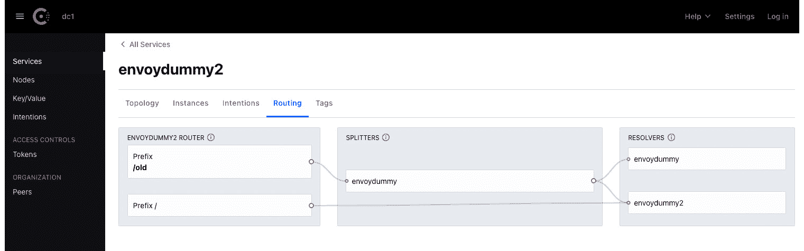

            图 A.5 – envoydummy2 服务的流量分配

            以下截图显示了`envoydummy`的流量分配：

            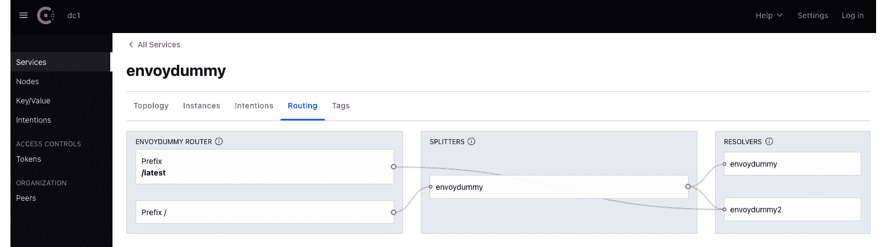

            图 A.6 – envoydummy 服务的流量分配

            现在`ServiceSplitter`配置已经到位，测试我们服务的流量是否按照配置文件中指定的比例进行路由：

```
% for ((i=0;i<10;i++)); do kubectl exec -it pod/curl -n appendix-consul -- curl http://envoydummy/new ;done
V2----------Bootstrap Service Mesh Implementation with Istio----------V2
V2----------Bootstrap Service Mesh Implementation with Istio----------V2
V2----------Bootstrap Service Mesh Implementation with Istio----------V2
V1----------Bootstrap Service Mesh Implementation with Istio----------V1
V2----------Bootstrap Service Mesh Implementation with Istio----------V2
V1----------Bootstrap Service Mesh Implementation with Istio----------V1
V2----------Bootstrap Service Mesh Implementation with Istio----------V2
V2----------Bootstrap Service Mesh Implementation with Istio----------V2
V2----------Bootstrap Service Mesh Implementation with Istio----------V2
V2----------Bootstrap Service Mesh Implementation with Istio----------V2
```

            你将观察到，流量在两个服务之间按 20:80 的比例进行路由。`ServiceSplitter`是一个强大的功能，可以用于 A/B 测试、金丝雀发布以及蓝绿部署。通过使用`ServiceSplitter`，你还可以在同一服务的不同子集之间进行基于权重的路由。它还允许你在路由服务时添加 HTTP 头。你可以在[`developer.hashicorp.com/consul/docs/connect/config-entries/service-splitter`](https://developer.hashicorp.com/consul/docs/connect/config-entries/service-splitter)了解更多关于`ServiceSplitter`的信息。

            我们已经了解了 Consul 服务发现链中的三个步骤中的两个，最后一个步骤是解析，我们将在下一节中讲解。

            解析

            Consul 还有另一种配置类型叫做`ServiceResolver`，用于定义哪些服务实例映射到客户端请求的服务名称。它们控制服务发现，并决定请求最终路由到哪里。通过使用`ServiceResolver`，你可以通过将请求路由到健康的上游来控制系统的弹性。`ServiceResolver`可以在服务跨多个数据中心时分发负载，并在服务出现故障时提供故障转移。关于`ServiceResolver`的更多细节可以在[`developer.hashicorp.com/consul/docs/connect/config-entries/service-resolver`](https://developer.hashicorp.com/consul/docs/connect/config-entries/service-resolver)找到。

            Consul 服务网格还为网关提供了管理来自网格外部流量的功能。它支持三种类型的网关：

                +   **网格网关**用于启用并保护数据中心之间的通信。它充当代理，提供对服务网格的入口，同时使用 mTLS 来保护流量。网格网关用于在不同数据中心和/或 Kubernetes 集群中部署的 Consul 服务网格实例之间进行通信。关于网格网关的一个很好的实践练习可以在[`developer.hashicorp.com/consul/tutorials/kubernetes/kubernetes-mesh-gateways`](https://developer.hashicorp.com/consul/tutorials/kubernetes/kubernetes-mesh-gateways)找到。

                +   **入口网关**用于为网格内的服务提供对外部客户端的访问。客户端可以位于同一个 Kubernetes 集群内，也可以完全位于集群外部，但在组织的网络边界内或边界外。你可以在[`developer.hashicorp.com/consul/docs/k8s/connect/ingress-gateways`](https://developer.hashicorp.com/consul/docs/k8s/connect/ingress-gateways)了解更多关于入口网关的内容。

                +   `ServiceDefault`。这里定义了外部服务的详细信息，终结网关会引用这些信息。你可以在[`developer.hashicorp.com/consul/docs/k8s/connect/terminating-gateways`](https://developer.hashicorp.com/consul/docs/k8s/connect/terminating-gateways)了解更多关于终结网关的内容。

            最后，Consul 服务网格还提供了对网格的全面可观察性。Sidecar 代理收集并暴露通过网格流量的数据。Sidecar 代理暴露的度量数据随后由 Prometheus 抓取。数据包括第七层度量，如 HTTP 状态码、请求延迟和吞吐量。Consul 控制平面还提供一些度量数据，如配置同步状态、异常和错误，类似于 Istio 控制平面。可观察性技术栈也类似于 Istio；像 Istio 一样，Consul 也支持与各种其他可观察性工具的集成，如 Datadog，以便深入了解 Consul 服务网格的健康状况和性能。你可以在 [`developer.hashicorp.com/consul/tutorials/kubernetes/kubernetes-layer7-observability`](https://developer.hashicorp.com/consul/tutorials/kubernetes/kubernetes-layer7-observability) 上了解更多关于 Consul 服务网格可观察性的内容。

            我希望这一部分简要但信息丰富地介绍了 Consul 服务网格是如何工作的，Consul 服务网格中的各种构件是什么，以及它们是如何操作的。我相信你一定注意到 Consul 服务网格和 Istio 之间的相似之处：它们都使用 Envoy 作为 sidecar 代理，Consul 服务发现链与 Istio 的虚拟服务和目标规则非常相似；Consul 服务网格网关与 Istio 网关非常相似。主要区别在于控制平面的实现方式以及每个集群节点上使用代理的方式。Consul 服务网格可以在虚拟机上运行，为传统工作负载提供服务网格的优势。Consul 服务网格由 HashiCorp 提供支持，并与 HashiCorp 的其他产品（包括 HashiCorp Vault）紧密集成。它也作为一种免费增值产品提供。对于需要企业支持的组织，还有一个企业版本，并且有一个名为 HCP Consul 的 SaaS 提供服务，为希望一键式网格部署的客户提供完全托管的云服务。

            卸载 Consul 服务网格

            你可以使用 consul-k8s 卸载 Consul 服务网格，使用以下命令：

            `% consul-k8s uninstall -auto-approve=true -wipe-data=true`

            `..`

            `删除安装数据：`

            `名称：consul`

            `命名空间 consul`

            `✓` `已删除 PVC => data-consul-consul-server-0`

            `✓` `PVCs 已删除。`

            `✓` `已删除密钥 => consul-bootstrap-acl-token`

            `✓` `Consul 密钥已删除。`

            `✓` `已删除服务帐户 => consul-tls-init`

            `✓` `Consul 服务帐户已删除。`

            你可以通过 macOS 上的 Brew 卸载 consul-k8s CLI：

            `% brew` `uninstall consul-k8s`

            Gloo Mesh

            Gloo Mesh 是 Solo.io 提供的服务网格产品。它有一个开源版本，叫做 Gloo Mesh，还有一个企业版，叫做 Gloo Mesh Enterprise。两者都基于 Istio 服务网格，并声称在开源 Istio 的基础上提供了更好的控制平面和附加功能。Solo.io 在其官网提供了一个功能对比，概述了 Gloo Mesh Enterprise、Gloo Mesh Open Source 和 Istio 之间的差异，您可以在 [`www.solo.io/products/gloo-mesh/`](https://www.solo.io/products/gloo-mesh/) 访问该对比内容。Gloo Mesh 主要专注于提供一个 Kubernetes 原生管理平面，用户可以通过它配置和操作多个集群中的多个异构服务网格实例。它提供一个 API，抽象了管理和操作多个网格的复杂性，用户无需了解多个服务网格下的复杂实现。您可以在 [`docs.solo.io/gloo-mesh-open-source/latest/getting_started/`](https://docs.solo.io/gloo-mesh-open-source/latest/getting_started/) 获取有关 Gloo Mesh 的详细信息，这是一个关于如何安装和试用 Gloo Mesh 的全面资源。Solo.io 还提供另一款产品，叫做 Gloo Edge，它既是一个 Kubernetes Ingress 控制器，又是一个 API 网关。Gloo Mesh Enterprise 与 Gloo Edge 一起部署，后者提供了许多全面的 API 管理和 Ingress 功能。Gateway Gloo Mesh Enterprise 增加了使用 OIDC、OAuth、API 密钥、LDAP 和 OPA 的外部身份验证支持。这些策略通过一个自定义 CRD，称为 ExtAuthPolicy 来实现，当路由和目标匹配某些条件时，可以应用这些身份验证。

            Gloo Mesh Enterprise 提供 WAF 策略，用于监控、过滤和阻止任何有害的 HTTP 流量。它还通过对 Envoy 记录的响应体和内容执行一系列正则替换，提供数据丢失防护（DLP）支持。这是一个从安全角度来看非常重要的功能，可以防止敏感数据被记录到日志文件中。DLP 过滤器可以在监听器、虚拟服务和路由上进行配置。Gloo Mesh 还提供支持，通过 SOAP 消息格式连接到传统应用程序。提供了构建数据转换策略的选项，应用 XSLT 转换来现代化 SOAP/XML 端点。这些数据转换策略可以用于转换请求或响应负载。它还支持通过 Inja 模板进行特殊转换。使用 Inja，你可以编写循环、条件逻辑以及其他函数来转换请求和响应。

            还广泛支持 WASM 过滤器。Solo.io 提供了定制的工具，加速 WebAssembly 的开发和部署。为了存储 WASM 文件，Solo.io 提供了 WebAssembly Hub，网址是[`webassemblyhub.io/`](https://webassemblyhub.io/)，还有一个名为 wasme 的开源 CLI 工具。你可以在[`docs.solo.io/web-assembly-hub/latest/tutorial_code/getting_started/`](https://docs.solo.io/web-assembly-hub/latest/tutorial_code/getting_started/)了解更多关于如何使用 WebAssembly Hub 和 wasme CLI 的信息。

            由于 Gloo Mesh 和 Solo.io 的其他产品与企业服务网格（Enterprise Service Mesh）紧密集成，您可以获得许多其他功能，其中之一就是全球 API 门户。API 门户是一个自我发现门户，用于发布、共享和监控 API 的使用情况，支持内部和外部的盈利化。在使用多异构网格时，用户无需担心为每个网格管理可观察性工具；相反，Gloo Mesh Enterprise 通过每个网格提供汇总的度量数据，提供了管理和观察多个网格的无缝体验。

            在企业环境中，多个团队和用户能够访问和部署网格中的服务，而不会互相干扰是非常重要的。用户需要知道可以消费哪些服务以及他们已经发布了哪些服务。用户应该能够自信地执行网格操作，而不影响其他团队的服务。Gloo Mesh 使用工作空间的概念，工作空间是为团队设定的逻辑边界，限制团队在工作空间内执行服务网格操作，这样多个团队可以同时使用网格。工作空间提供了每个团队发布的配置之间的安全隔离。通过工作空间，Gloo Mesh 解决了企业环境中多租户的复杂性，使多个团队可以在彼此配置隔离的情况下，安全地使用网格，并实现严格的访问控制。

            Gloo Mesh 还与基于不同架构的另一个服务网格（与 Istio 不同）进行了集成。这个网格叫做 Istio Ambient Mesh，它不是为每个工作负载添加侧车代理，而是在每个节点级别添加代理。Istio Ambient Mesh 与 Gloo Mesh 集成，用户可以同时运行基于侧车代理的网格和每个节点代理的 Istio Ambient Mesh。

            Gloo Enterprise Mesh 与 Solo.io 产品（如 Gloo Edge）的集成，使其成为服务网格解决方案中的强有力竞争者。它支持多集群和多网格部署，通过工作空间实现多租户，强大的身份验证支持，零信任网络，以及通过 Gloo Edge 成熟的 Ingress 管理，使其成为一个全面的服务网格解决方案。

            Kuma

            Kuma 是一个开源的 CNCF 沙箱项目，由 Kong Inc.捐赠给 CNCF。像 Istio 一样，Kuma 也使用 Envoy 作为数据平面。它支持多集群和多网格部署，提供一个全球控制平面来管理所有部署。在撰写本书时，Kuma 是一个用 GoLang 编写的单一可执行文件。它可以在 Kubernetes 上部署，也可以在虚拟机上部署。当在非 Kubernetes 环境中部署时，它需要一个 PostgreSQL 数据库来存储其配置。

            让我们先下载并安装 Kuma，然后进行相关的动手操作：

                1.  下载适用于你操作系统的 Kuma：

    ```
    % curl -L https://kuma.io/installer.sh | VERSION=2.0.2 sh -
    INFO Welcome to the Kuma automated download!
    INFO Kuma version: 2.0.2
    INFO Kuma architecture: arm64
    INFO Operating system: Darwin
    INFO Downloading Kuma from: https://download.konghq.com/mesh-alpine/kuma-2.0.2-darwin-arm64.tar.gz
    ```

                1.  在 minikube 上安装 Kuma。解压下载的文件，在解压文件夹的`bin`目录中运行以下命令，将 Kuma 安装到 Kubernetes 中：

    ```
    % kumactl install control-plane | kubectl apply -f -
    ```

            这将创建一个名为`kuma-system`的命名空间，并在该命名空间中安装 Kuma 控制平面，同时配置各种 CRD 和准入控制器。

                1.  此时，我们可以使用以下命令访问 Kuma 的图形用户界面（GUI）：

    ```
    % kubectl port-forward svc/kuma-control-plane -n kuma-system 5681:5681
    ```

            在浏览器中打开`localhost:5681/gui`，你将看到以下仪表板：

            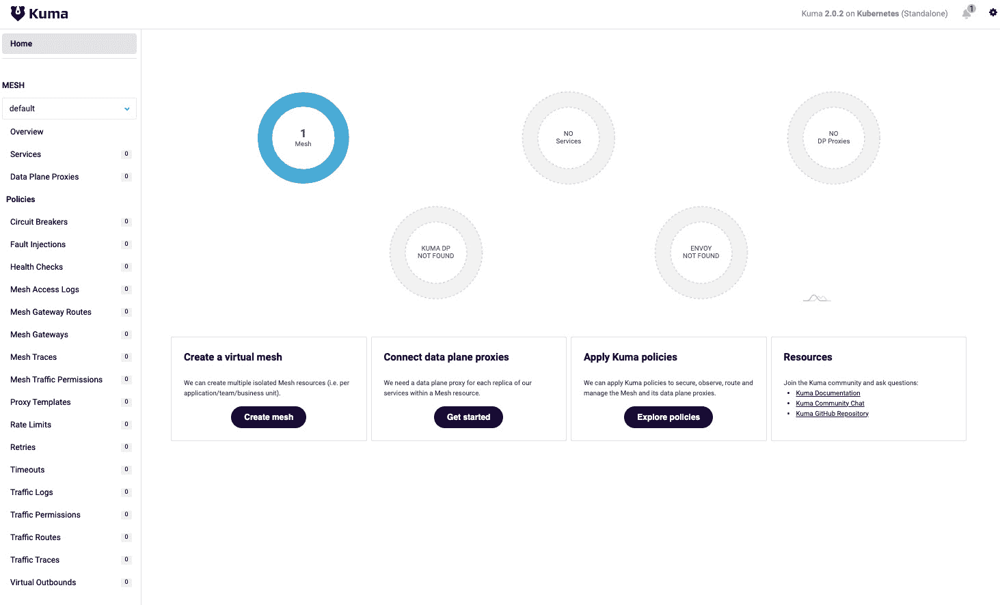

            图 A.7 – Kuma 仪表板

            Kuma GUI 提供了关于网格的全面详细信息。我们将使用它来检查配置，当我们构建策略并将应用程序添加到网格中时。在 GUI 的主页上，你会注意到显示了一个名为**default**的网格。Kuma 中的网格是一个与其他 Kuma 网格逻辑隔离的服务网格。你可以在一个 Kubernetes 集群中安装 Kuma，然后管理多个服务网格，也许为每个团队或部门部署其应用程序。这个概念非常重要，并且是 Kuma 与其他服务网格技术的一个关键区分点。

            在 Kuma 网格中部署 envoydemo 和 curl

            部署文件可以在`AppendixA/Kuma/envoy-proxy-01.yaml`找到。与 Istio 的部署文件相比，明显的区别是添加了以下标签，它指示 Kuma 将其 sidecar 代理注入到`envoydummy`中：

```
        kuma.io/sidecar-injection: enabled
```

            以下命令将部署`envoydummy`和`curl`应用程序：

```
% kubectl create ns appendix-kuma
namespace/appendix-kuma created
% kubectl apply -f AppendixA/Kuma/envoy-proxy-01.yaml
configmap/envoy-dummy created
service/envoydummy created
deployment.apps/envoydummy created
serviceaccount/envoydummy created
```

            几秒钟后，使用以下命令检查 Pods 是否已部署并且 sidecar 已注入：

```
% kubectl get po -n appendix-kuma
NAME                          READY   STATUS    RESTARTS   AGE
curl                          2/2     Running   0          71s
envoydummy-767dbd95fd-tp6hr   2/2     Running   0          71s
serviceaccount/curl created
pod/curl created
```

            这些 sidecar 也叫做**数据平面代理**（**DPPs**），它们与网格中的每个工作负载一起运行。DPP 由定义 DPP 配置的数据平面实体和一个 kuma-dp 二进制文件组成。在启动过程中，kuma-dp 从 Kuma 控制平面（kuma-cp）检索 Envoy 的启动配置，并使用该配置启动 Envoy 进程。一旦 Envoy 启动，它将通过 XDS 连接到 kuma-cp。kuma-dp 在启动时还会启动一个 core-dns 进程。

            值得注意的是，安装 Kuma 并部署应用程序非常简单。它非常直观，甚至对于初学者来说也很容易上手。

            使用 GUI，让我们检查网格的整体状态。

            从**MESH** | **概览**中，你可以看到新添加的 DPP：

            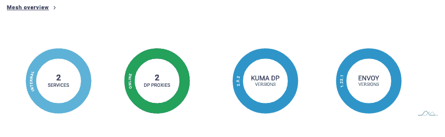

            图 A.8 – Kuma GUI 中的网格概览

            从**MESH** | **数据平面代理**，你可以找到关于工作负载的详细信息：

            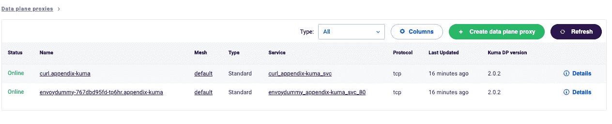

            图 A.9 – 数据平面代理

            现在我们已经安装了应用程序，我们将进行一些关于 Kuma 策略的动手操作，来体验 Kuma 的使用。

            我们将首先从`curl` Pod 访问`envoydummy`服务：

```
% kubectl exec -it pod/curl -n appendix-kuma -- curl http://envoydummy:80
V1----------Bootstrap Service Mesh Implementation with Istio----------V1%
```

            输出结果符合预期。默认情况下，Kuma 允许网格内外的流量。默认情况下，所有流量在网格中都是未加密的。我们将启用 mTLS 并拒绝网格内的所有流量，以建立零信任网络。首先，我们将删除允许网格内所有流量的策略，使用以下命令：

```
% kubectl delete trafficpermissions/allow-all-traffic
```

            `allow-all-traffic`是一个允许网格内所有流量的流量权限策略。前面的命令删除了该策略，从而限制了网格内的所有流量。

            接下来，我们将在网格内启用 mTLS 以启用安全通信，并让`kong-dp`通过比较服务身份与 DPP 证书来正确识别服务。如果没有启用 mTLS，Kuma 无法强制执行流量权限。以下策略启用默认网格中的 mTLS。它使用内建的 CA，但如果你希望使用外部 CA，也可以提供外部生成的根 CA 和密钥。Kuma 会为每个工作负载自动生成证书，并以 SPIFEE 格式的 SAN 进行配置。

```
apiVersion: kuma.io/v1alpha1
kind: Mesh
metadata:
  name: default
spec:
  mtls:
    enabledBackend: ca-1
    backends:
    - name: ca-1
      type: builtin
```

            在配置文件中，我们定义了该策略适用于`default`网格。我们声明了一个名为`ca-1`的 CA，它是`builtin`类型，并将其配置为作为 mTLS 的根 CA，定义`enabledBackend`。配置文件位于`AppendixA/Kuma/enablemutualTLS.yaml`。你可以使用以下命令应用配置：

```
% kubectl apply -f AppendixA/Kuma/enablemutualTLS.yaml
```

            启用 mTLS 后，我们来尝试从`curl`访问`envoydummy`：

```
% kubectl exec -it pod/curl -n appendix-kuma -- curl http://envoydummy:80
curl: (52) Empty reply from server
command terminated with exit code 52
```

            输出结果符合预期，因为启用了 mTLS，且没有`TrafficPermission`策略允许`curl`与`envoydummy`之间的流量。

            为了允许流量，我们需要创建以下`TrafficPermission`策略：

```
apiVersion: kuma.io/v1alpha1
kind: TrafficPermission
mesh: default
metadata:
  name: allow-all-traffic-from-curl-to-envoyv1
spec:
  sources:
    - match:
        kuma.io/service: 'curl_appendix-kuma_svc'
  destinations:
    - match:
        kuma.io/service: 'envoydummy_appendix-kuma_svc_80'
```

            请注意，`kuma.io/service`字段包含对应标签的值。标签是一组键值对，包含 DPP 所属服务的详细信息和该服务的元数据。以下是应用于`envoydummy`的 DPP 标签：

```
% kubectl get dataplane/envoydummy-767dbd95fd-tp6hr -n appendix-kuma -o json | jq '.spec.networking.inbound[].tags'
{
  "k8s.kuma.io/namespace": "appendix-kuma",
  "k8s.kuma.io/service-name": "envoydummy",
  "k8s.kuma.io/service-port": "80",
  "kuma.io/protocol": "http",
  "kuma.io/service": "envoydummy_appendix-kuma_svc_80",
  "name": "envoydummy",
  "pod-template-hash": "767dbd95fd",
  "version": "v1"
}
```

            类似地，你可以获取`curl` DPP 的值。配置文件位于`AppendixA/Kuma/allow-traffic-curl-to-envoyv1.yaml`。使用以下命令应用配置：

```
% kubectl apply -f AppendixA/Kuma/allow-traffic-curl-to-envoyv1.yaml
trafficpermission.kuma.io/allow-all-traffic-from-curl-to-envoyv1 created
```

            应用配置后，测试你是否可以从`curl`访问`envoydummy`：

```
% kubectl exec -it pod/curl -n appendix-kuma -- curl http://envoydummy:80
V1----------Bootstrap Service Mesh Implementation with Istio----------V1%
```

            我们刚刚体验了如何在网格中控制工作负载之间的流量。你会发现这与 Consul 服务网格中的`ServiceIntentions`非常相似。

            流量管理与路由

            现在我们将探讨 Kuma 中的流量路由。我们将部署`envoydummy`服务的 v2 版本，并在版本 v1 和 v2 之间路由特定的请求。

            第一步是部署`envoydummy`的 v2 版本，然后定义流量权限以允许`curl` Pod 与`envoydummy` v2 Pod 之间的流量。文件位于`AppendixA/Kuma/envoy-proxy-02.yaml`和`AppendixA/Kuma/allow-traffic-curl-to-envoyv2.yaml`。应用配置后，测试`curl`是否能够访问`envoydummy`的 v1 和 v2 Pod：

```
% for ((i=0;i<2;i++)); do kubectl exec -it pod/curl -n appendix-kuma -- curl http://envoydummy ;done
V2----------Bootstrap Service Mesh Implementation with Istio----------V2
V1----------Bootstrap Service Mesh Implementation with Istio----------V1
```

            接下来，我们将通过使用名为`TrafficRoute`的 Kuma 策略来配置路由。此策略允许我们为网格中的流量路由配置规则。

            该策略可以分为四个部分，便于理解：

                1.  在第一部分，我们声明了`TrafficRoute`策略。该策略的基本用法已在[`kuma.io/docs/2.0.x/policies/traffic-route/`](https://kuma.io/docs/2.0.x/policies/traffic-route/)文档中记录。在此，我们声明该策略适用于默认网格，以及来自`curl_appendix-kuma_svc`并以`envoydummy_appendix-kuma_svc_80`为目标的任何请求：

    ```
    apiVersion: kuma.io/v1alpha1
    kind: TrafficRoute
    mesh: default
    metadata:
      name: trafficroutingforlatest
    spec:
      sources:
        - match:
            kuma.io/service: curl_appendix-kuma_svc
      destinations:
        - match:
            kuma.io/service: envoydummy_appendix-kuma_svc_80
    ```

                1.  接下来，我们将配置任何带有`'/latest'`前缀的请求，按照`destination`下标出的标签路由到 DPP：

    ```
     conf:
        http:
        - match:
            path:
              prefix: "/latest"
          destination:
            kuma.io/service: envoydummy_appendix-kuma_svc_80
            version: 'v2'
    ```

                1.  然后，我们将配置带有`'/old'`前缀的请求，按照`destination`下标出的标签路由到数据平面：

    ```
        - match:
            path:
              prefix: "/old"
          destination:
            kuma.io/service: envoydummy_appendix-kuma_svc_80
            version: 'v1'
    ```

                1.  最后，我们声明了未匹配前面配置部分中任何路径的请求的默认目标。默认目标将是带有以下代码中高亮标签的 DPP：

    ```
        destination:
          kuma.io/service: envoydummy_appendix-kuma_svc_80
    ```

            配置文件位于`AppendixA/Kuma/trafficRouting01.yaml`。应用配置后，测试以下场景：

                +   所有带有`'/latest'`前缀的请求应该路由到版本 v2：

    ```
    % for ((i=0;i<4;i++)); do kubectl exec -it pod/curl -n appendix-kuma -- curl http://envoydummy/latest ;done
    V2----------Bootstrap Service Mesh Implementation with Istio----------V2
    V2----------Bootstrap Service Mesh Implementation with Istio----------V2
    V2----------Bootstrap Service Mesh Implementation with Istio----------V2
    V2----------Bootstrap Service Mesh Implementation with Istio----------V2
    ```

                +   所有带有`'/old'`前缀的请求应路由到版本 v1：

    ```
    % for ((i=0;i<4;i++)); do kubectl exec -it pod/curl -n appendix-kuma -- curl http://envoydummy/old ;done
    V1----------Bootstrap Service Mesh Implementation with Istio----------V1
    V1----------Bootstrap Service Mesh Implementation with Istio----------V1
    V1----------Bootstrap Service Mesh Implementation with Istio----------V1
    V1----------Bootstrap Service Mesh Implementation with Istio----------V1
    ```

                +   所有其他请求应遵循默认行为：

    ```
    % for ((i=0;i<4;i++)); do kubectl exec -it pod/curl -n appendix-kuma -- curl http://envoydummy/xyz ;done
    V2----------Bootstrap Service Mesh Implementation with Istio----------V2
    V2----------Bootstrap Service Mesh Implementation with Istio----------V2
    V1----------Bootstrap Service Mesh Implementation with Istio----------V1
    V1----------Bootstrap Service Mesh Implementation with Istio----------V1
    ```

            请求路由按预期工作，类似于您使用 Istio 配置相同行为的方式。现在，让我们看看 Kuma Mesh 的负载均衡特性。我们将构建另一个流量路由策略，在`envoydummy`的 v1 和 v2 版本之间进行加权路由。以下是`AppendixA/Kuma/trafficRouting02.yaml`配置的一个片段：

```
  conf:
    split:
      - weight: 10
        destination:
          kuma.io/service: envoydummy_appendix-kuma_svc_80
          version: 'v1'
      - weight: 90
        destination:
          kuma.io/service: envoydummy_appendix-kuma_svc_80
          version: 'v2'
```

            应用配置后，您可以使用以下命令测试流量分配：

```
% for ((i=0;i<10;i++)); do kubectl exec -it pod/curl -n appendix-kuma -- curl http://envoydummy/xyz ;done
```

            流量应以大约 1:9 的比例在两个版本之间分配。您可以使用`TrafficRoute`策略进行流量路由、流量修改、流量拆分、负载均衡、金丝雀发布和感知区域的负载均衡。要了解更多关于`TrafficRoute`的信息，请查阅此处的完整文档：https://kuma.io/docs/2.0.x/policies/traffic-route。

            Kuma 还提供了用于断路器、故障注入、超时、速率限制等的策略。Kuma 策略的完整列表可以在这里查看：[`kuma.io/docs/2.0.x/policies/introduction/`](https://kuma.io/docs/2.0.x/policies/introduction/)。这些开箱即用的策略使得 Kuma 非常易于使用，学习曲线也非常浅。

            在到目前为止的实践示例中，我们一直在默认网格中部署所有工作负载。我们之前讨论过，Kuma 允许你创建不同的隔离网格，使得团队可以在同一个 Kuma 集群中拥有隔离的网格环境。你可以使用以下配置创建一个新网格：

```
apiVersion: kuma.io/v1alpha1
kind: Mesh
metadata:
  name: team-digital
```

            配置可以在 `AppendixA/Kuma/team-digital-mesh.yaml` 中找到。使用以下命令应用该配置：

```
% kubectl apply -f AppendixA/Kuma/team-digital-mesh.yaml
mesh.kuma.io/team-digital created
```

            一旦你创建了网格，你可以通过在工作负载部署配置中添加以下注释来创建网格中的所有资源：

```
kuma.io/mesh: team-digital
```

            并将以下内容添加到 Kuma 策略中：

```
mesh: team-digital
```

            创建网格的能力是企业环境中非常有用的功能，也是 Kuma 与 Istio 区别的一个关键点。

            Kuma 还提供了内置的 Ingress 能力来处理南北向流量以及东西向流量。Ingress 被管理为一个名为网关的 Kuma 资源，网关本身是 kuma-dp 的一个实例。你可以灵活地部署任意数量的 Kuma 网关，但理想情况下，建议每个网格部署一个网关。Kuma 还支持与非 Kuma 网关集成，也称为委托网关。现在，我们将讨论内置的 Kuma 网关，稍后会简要讨论委托网关。

            要创建内置网关，首先需要定义 `MeshGatewayInstance` 和匹配的 `MeshGateway`。`MeshGatewayInstance` 提供了网关实例如何实例化的详细信息。以下是 `MeshGatewayInstance` 的示例配置，该配置也可以在 `AppendixA/Kuma/envoydummyGatewayInstance01.yaml` 中找到：

```
apiVersion: kuma.io/v1alpha1
kind: MeshGatewayInstance
metadata:
  name: envoydummy-gateway-instance
  namespace: appendix-kuma
spec:
  replicas: 1
  serviceType: LoadBalancer
  tags:
    kuma.io/service: envoydummy-edge-gateway
```

            在配置中，我们设置了将有 `1 个副本` 和 `LoadBalancer` 类型的服务，并且我们应用了一个标签 `kuma.io/service: envoydummy-edge-gateway`，该标签将用于与 `MeshGateway` 构建关联。

            在以下配置中，我们正在创建一个名为 `envoydummy-edge-gateway` 的 `MeshGateway`。该配置可以在 `AppendixA/Kuma/envoydummyGateway01.yaml` 中找到：

```
apiVersion: kuma.io/v1alpha1
kind: MeshGateway
mesh: default
metadata:
  name: envoydummy-edge-gateway
  namespace: appendix-kuma
spec:
  selectors:
  - match:
      kuma.io/service: envoydummy-edge-gateway
  conf:
    listeners:
      - port: 80
        protocol: HTTP
        hostname: mockshop.com
        tags:
          port: http/80
```

            `MeshGateway` 资源指定了监听器，它们是接收网络流量的端点。在配置中，你需要指定端口、协议和一个可选的主机名。在 `selectors` 下，我们还指定了与 `MeshGateway` 配置相关联的 `MeshGatewayInstance` 标签。请注意，我们指定的是在 `MeshGatewayInstance` 配置中定义的相同标签。

            接下来，我们将定义`MeshGatewayRoute`，它描述了请求如何从`MeshGatewayInstance`路由到工作负载服务。配置示例可在`AppendixA/Kuma/envoydummyGatewayRoute01.yaml`中找到。以下是文件中的一些片段：

                +   在`selectors`下，我们指定了此路由应附加到的网关和监听器的详细信息。通过提供相应网关和监听器的标签来指定详细信息：

    ```
    spec:
      selectors:
        - match:
            kuma.io/service: envoydummy-edge-gateway
            port: http/80
    ```

                +   在`conf`部分，我们提供了请求的第 7 层匹配标准，例如路径和 HTTP 头信息，以及目标详细信息：

    ```
      conf:
        http:
          rules:
            - matches:
                - path:
                    match: PREFIX
                    value: /
              backends:
                - destination:
                    kuma.io/service: envoydummy_appendix-kuma_svc_80
    ```

                +   最后但同样重要的是，我们通过配置`TrafficPermission`，允许边缘网关与 envoy 假服务之间的流量，如以下代码片段所述。你可以在`AppendixA/Kuma/allow-traffic-edgegateway-to-envoy.yaml`中找到该配置：

    ```
    kind: TrafficPermission
    mesh: default
    metadata:
      name: allow-all-traffic-from-curl-to-envoyv1
    spec:
      sources:
        - match:
            kuma.io/service: 'envoydummy-edge-gateway'
      destinations:
        - match:
            kuma.io/service: 'envoydummy_appendix-kuma_svc_80'
    ```

            在配置了流量权限之后，我们现在准备通过以下一组命令应用配置：

                1.  创建`MeshGatewayInstance`：

    ```
    % kubectl apply -f AppendixA/Kuma/envoydummyGatewayInstance01.yaml
    meshgatewayinstance.kuma.io/envoydummy-gateway-instance created
    ```

                1.  创建`MeshGateway`：

    ```
    % kubectl apply -f AppendixA/Kuma/envoydummyGateway01.yaml
    meshgateway.kuma.io/envoydummy-edge-gateway created
    ```

                1.  创建`MeshGatewayRoute`：

    ```
    % kubectl apply -f AppendixA/Kuma/envoydummyGatewayRoute01.yaml
    meshgatewayroute.kuma.io/envoydummy-edge-gateway-route created
    ```

                1.  创建`TrafficPermissions`：

    ```
    $ kubectl apply -f AppendixA/Kuma/allow-traffic-edgegateway-to-envoy.yaml
    trafficpermission.kuma.io/allow-all-traffic-from-curl-to-envoyv1 configured
    ```

            你可以通过以下命令验证 Kuma 是否已创建网关实例：

```
% kubectl get po -n appendix-kuma
NAME                         READY   STATUS    RESTARTS   AGE
curl                         2/2     Running   0          22h
envoydummy-767dbd95fd-br2m6                    2/2     Running   0          22h
envoydummy-gateway-instance-75f87bd9cc-z2rx6   1/1     Running   0          93m
envoydummy2-694cbc4f7d-hrvkd                   2/2     Running   0          22h
```

            你也可以使用以下命令检查相应的服务：

```
% kubectl get svc -n appendix-kuma
NAME                  TYPE   CLUSTER-IP      EXTERNAL-IP   PORT(S)        AGE
envoydummy       ClusterIP      10.102.50.112   <none>        80/TCP         22h
envoydummy-gateway-instance   LoadBalancer   10.101.49.118   <pending>     80:32664/TCP   96m
```

            现在我们已经准备好使用内置的 Kuma 网关访问`envoydummy`。但首先，我们需要找到一个 IP 地址，通过该地址我们可以访问 minikube 上的 Ingress 网关服务。使用以下命令来查找 IP 地址：

```
% minikube service envoydummy-gateway-instance --url -n appendix-kuma
http://127.0.0.1:52346
```

            现在，通过使用 http://127.0.0.1:52346，你可以通过在终端执行`curl`访问`envoydummy`服务：

```
% curl -H "host:mockshop.com" http://127.0.0.1:52346/latest
V1----------Bootstrap Service Mesh Implementation with Istio----------V1
```

            你已经学习了如何创建一个`MeshGatewayInstance`，它随后与`MeshGateway`关联。关联后，kuma-cp 创建了一个内置 Kuma 网关的网关实例。接着，我们创建了一个`MeshGatewayRoute`，指定了如何将请求从网关路由到工作负载服务。随后，我们创建了一个`TrafficPermission`资源，允许从`MeshGateway`到`EnvoyDummy`工作负载的流量。

            Kuma 还提供了将外部网关用作 Ingress 的选项，也叫做委托网关。在委托网关中，Kuma 支持与各种 API 网关的集成，但 Kong Gateway 是首选且文档最完善的选项。你可以在[`kuma.io/docs/2.0.x/explore/gateway/#delegated`](https://kuma.io/docs/2.0.x/explore/gateway/#delegated)阅读有关委托网关的更多内容。

            与 Istio 类似，Kuma 也原生支持 Kubernetes 和基于虚拟机的工作负载。Kuma 为在多个 Kubernetes 集群、数据中心和云提供商之间运行复杂配置的服务网格提供了广泛的支持。Kuma 有一个区域的概念，区域是可以相互通信的 DPP（数据平面代理）的逻辑聚合。Kuma 支持在多个区域中运行服务网格，并支持多区域部署中控制平面的分离。每个区域都会分配一个水平可扩展的控制平面，从而实现区域之间的完全隔离。所有区域还由一个集中式的全球控制平面进行管理，后者负责管理应用于 DPP 的策略的创建和更改，并将特定区域的策略和配置传输到各自区域的控制平面。全球控制平面提供了一个单一视窗，展示所有区域中的所有 DPP 的清单。

            如前所述，Kuma 是一个开源项目，由 Kong 捐赠给 CNCF。Kong 还提供了 Kong Mesh，这是一个基于 Kuma 的企业版，扩展了 Kuma，包含了运行企业级工作负载所需的功能。Kong Mesh 提供了一个即插即用的服务网格解决方案，具有与 OPA 集成、FIPS 140-2 合规性和基于角色的访问控制等功能。结合 Kong Gateway 作为入口网关，基于 Kuma 的服务网格、额外的企业级插件以及可靠的企业支持，使得 Kong Mesh 成为一项即插即用的服务网格技术。

            卸载 Kuma

            你可以使用以下命令卸载 Kuma Mesh：

            `% kumactl install control-plane | kubectl delete -``f -`

            Linkerd

            Linkerd 是一个 CNCF 毕业项目，采用 Apache v2 许可证。Buoyant ([`buoyant.io/`](https://buoyant.io/)) 是 Linkerd 的主要贡献者。在所有服务网格技术中，Linkerd 可能是最早的之一，甚至可能是最老的。它最初由 Buoyant 在 2017 年公开发布。虽然它一开始取得了一定的成功，但后来因为资源消耗过大而受到批评。Linkerd 中使用的代理是用 Scala 和 Java 网络生态系统编写的，运行时使用 **Java 虚拟机**（**JVM**），导致显著的资源消耗。2018 年，Buoyant 发布了 Linkerd 的新版本，名为 Conduit。Conduit 后来被重新命名为 Linkerd v2。Linkerd v2 数据平面由 Linkerd2-proxy 组成，它是用 Rust 编写的，资源消耗较小。Linkerd2-proxy 专门为 Kubernetes Pods 中的 sidecar 代理而构建。虽然 Linkerd2-proxy 是用 Rust 编写的，但 Linkerd 控制平面是用 Golang 开发的。

            与本文 *附录* 中讨论的其他开源服务网格技术一样，我们将通过实际操作 Linkerd，观察它与 Istio 的相似与不同之处。让我们从在 minikube 上安装 Linkerd 开始：

                1.  使用以下命令在 minikube 上安装 Linkerd：

    ```
    % curl --proto '=https' --tlsv1.2 -sSfL https://run.linkerd.io/install | sh
    Downloading linkerd2-cli-stable-2.12.3-darwin...
    Linkerd stable-2.12.3 was successfully installed
    Add the linkerd CLI to your path with:
      export PATH=$PATH:/Users/arai/.linkerd2/bin
    ```

                1.  按照建议将 linkerd2 添加到你的路径中：

    ```
    export PATH=$PATH:/Users/arai/.linkerd2/bin
    ```

                1.  Linkerd 提供了一项检查和验证 Kubernetes 集群是否满足安装 Linkerd 所需所有先决条件的选项：

    ```
    % linkerd check --pre
    ```

                1.  如果输出包含以下内容，那么安装就成功了：

    ```
    Status check results are √
    ```

            如果没有，您需要通过以下链接中的建议解决问题：[`linkerd.io/2.12/tasks/troubleshooting/#pre-k8s-cluster-k8s%20for%20hints`](https://linkerd.io/2.12/tasks/troubleshooting/#pre-k8s-cluster-k8s%20for%20hints)。

                1.  接下来，我们将分两步安装 Linkerd：

    1.  首先，我们安装 CRDs：

    ```
    linkerd namespace:
    ```

```
% linkerd install --set proxyInit.runAsRoot=true | kubectl apply -f -
```

                安装控制平面后，请使用以下命令检查 Linkerd 是否完全安装：

```
% linkerd check
```

            如果 Linkerd 安装成功，你应该会看到以下消息：

```
Status check results are √
```

            这完成了 Linkerd 的安装！现在让我们分析一下已安装的内容：

```
% kubectl get pods,services -n linkerd
NAME                    READY   STATUS    RESTARTS   AGE
pod/linkerd-destination-86d68bb57-447j6       4/4     Running   0          49m
pod/linkerd-identity-5fbdcccbd5-lzfkj         2/2     Running   0          49m
pod/linkerd-proxy-injector-685cd5988b-5lmxq   2/2     Running   0          49m
NAME   TYPE        CLUSTER-IP       EXTERNAL-IP   PORT(S)    AGE
service/linkerd-dst           ClusterIP    10.102.201.182   <none>        8086/TCP   49m
service/linkerd-dst-headless        ClusterIP   None             <none>        8086/TCP   49m
service/linkerd-identity        ClusterIP   10.98.112.229    <none>       8080/TCP   49m
service/linkerd-identity-headless       ClusterIP   None             <none>        8090/TCP   49m
service/linkerd-policy           ClusterIP    None             <none>        8090/TCP   49m
service/linkerd-policy-validator    ClusterIP   10.102.142.68    <none>        443/TCP    49m
service/linkerd-proxy-injector      ClusterIP   10.101.176.198   <none>        443/TCP    49m
service/linkerd-sp-validator        ClusterIP    10.97.160.235    <none>        443/TCP    49m
```

            这里需要注意的是，控制平面由多个 Pod 和服务组成。`linkerd-identity` 服务是用于生成 Linkerd 代理签名证书的 CA。`linkerd-proxy-injector` 是负责修改 Kubernetes Pod 规格以添加 linkerd-proxy 和 proxy-init 容器的 Kubernetes 审核控制器。`destination` 服务是 Linkerd 控制平面的“大脑”，它维护服务发现和关于服务的身份信息，以及管理和安全保障网格中流量的策略。

            在 Linkerd 中部署 envoydemo 和 curl

            现在让我们部署 envoydummy 和 curl 应用，并检查 Linkerd 如何执行服务网格功能。按照以下步骤安装应用：

                1.  和大多数服务网格解决方案一样，我们需要在部署描述符中添加以下注解：

    ```
          annotations:
            linkerd.io/inject: enabled
    ```

            `envoydummy` 和 `curl` 应用的配置文件和注解位于 `AppendixA/Linkerd/envoy-proxy-01.yaml`。

                1.  准备好部署描述符后，你可以应用配置：

    ```
    % kubectl create ns appendix-linkerd
    % kubectl apply -f AppendixA/Linkerd/envoy-proxy-01.yaml
    ```

                1.  这应该会部署 Pod。一旦 Pod 部署完成，你可以通过以下命令检查 Pod 中注入了什么内容：

    ```
    % kubectl get po/curl -n appendix-linkerd -o json | jq '.spec.initContainers[].image, .spec.initContainers[].name'
    "cr.l5d.io/linkerd/proxy-init:v2.0.0"
    "linkerd-init"
    % kubectl get po/curl -n appendix-linkerd -o json | jq '.spec.containers[].image, .spec.containers[].name'
    "cr.l5d.io/linkerd/proxy:stable-2.12.3"
    "curlimages/curl"
    "linkerd-proxy"
    "curl"
    ```

            从前面的输出中，可以观察到 Pod 初始化是由名为 `linkerd-init` 的容器执行的，容器类型为 `cr.l5d.io/linkerd/proxy-init:v2.0.0`，并且 Pod 中有两个正在运行的容器：`curl` 和 `linkerd-proxy`，它们的类型是 `cr.l5d.io/linkerd/proxy:stable-2.12.3`。`linkerd-init` 容器在 Pod 初始化阶段运行，并修改 iptables 规则，将所有网络流量从 `curl` 路由到 `linkerd-proxy`。如你所知，在 Istio 中，我们有 `istio-init` 和 `istio-proxy` 容器，它们与 Linkerd 容器类似。与 Envoy 相比，`linkerd-proxy` 极其轻量且速度极快。它使用 Rust 编写，这使其性能可预测，且不需要垃圾回收，垃圾回收通常会导致高延迟。Rust 在内存安全性方面比 C++ 和 C 更加优越，这使其不易受到内存安全漏洞的影响。你可以在 [`linkerd.io/2020/12/03/why-linkerd-doesnt-use-envoy/`](https://linkerd.io/2020/12/03/why-linkerd-doesnt-use-envoy/) 了解更多关于为什么 `linkerd-proxy` 比 envoy 更好的原因。

            验证 `curl` 是否能够与 `envoydummy` Pod 通信，如下所示：

```
% kubectl exec -it pod/curl -c curl -n appendix-linkerd -- curl http://envoydummy:80
V1----------Bootstrap Service Mesh Implementation with Istio----------V1%
```

            现在我们已经安装了 `curl` 和 `envoydummy` Pods，让我们来探索 Linkerd 服务网格的功能。首先，我们将探索如何使用 Linkerd 限制网格内的流量。

            零信任网络

            Linkerd 提供了全面的策略来限制网格中的流量。Linkerd 提供了一组 CRD，通过这些 CRD 可以定义策略来控制网格中的流量。让我们通过实施策略来控制访问 `envoydummy` Pod 的流量，来探索这些策略：

                1.  我们将首先使用以下命令限制集群中的所有流量：

    ```
    % linkerd upgrade --default-inbound-policy deny --set proxyInit.runAsRoot=true | kubectl apply -f -
    ```

            我们使用 `linkerd upgrade` 命令应用了一个 `default-inbound-policy`，其值为 `deny`，这会禁止所有流量访问网格中工作负载暴露的端口，除非该端口附有服务器资源。

            应用策略后，所有访问 `envoydummy` 服务的请求将被拒绝：

```
% kubectl exec -it pod/curl -c curl -n appendix-linkerd -- curl --head http://envoydummy:80
HTTP/1.1 403 Forbidden
content-length: 0
l5d-proxy-error: unauthorized request on route
```

                1.  接下来，我们创建一个服务器资源来描述 `envoydummy` 端口。服务器资源是一种指示 Linkerd 仅授权的客户端才能访问该资源的方式。我们通过声明以下 Linkerd 策略来实现这一点：

    ```
    apiVersion: policy.linkerd.io/v1beta1
    kind: Server
    metadata:
      namespace: appendix-linkerd
      name: envoydummy
      labels:
        name: envoydummy
    spec:
      podSelector:
        matchLabels:
          name: envoydummy
      port: envoydummy-http
      proxyProtocol: HTTP/1
    ```

            配置文件位于 `AppendixA/Linkerd/envoydummy-server.yaml`。服务器资源在与工作负载相同的命名空间中定义。在配置文件中，我们还定义了以下内容：

                +   `podSelector`：选择工作负载的标准。

                +   `port`：声明此服务器配置的端口名称或端口号。

                +   `proxyProtocol`：配置入站连接的协议发现，必须是以下之一：unknown、`HTTP/1`、`HTTP/2`、`gRPC`、`opaque` 或 `TLS`。

            使用以下命令应用服务器资源：

```
% kubectl apply -f AppendixA/Linkerd/envoydummy-server.yaml
server.policy.linkerd.io/envoydummy created
```

            尽管我们已经应用了服务器资源，但 `curl` Pod 仍然无法访问 `envoydummy` 服务，除非我们授权它。

                1.  在这一步，我们将创建一个授权策略，授权`curl`访问`envoydummy`。授权策略是通过提供目标目的地的服务器详细信息和用于运行源服务的服务账户详细信息来配置的。我们在前一步中创建了一个名为`envoydummy`的服务器资源，并且根据`AppendixA/Linkerd/envoy-proxy-01.yaml`，我们使用名为`curl`的服务账户来运行`curl` Pod。该策略定义如下，并且也可以在`AppendixA/Linkerd/authorize-curl-access-to-envoydummy.yaml`中找到：

    ```
    apiVersion: policy.linkerd.io/v1alpha1
    kind: AuthorizationPolicy
    metadata:
      name: authorise-curl
      namespace: appendix-linkerd
    spec:
      targetRef:
        group: policy.linkerd.io
        kind: Server
        name: envoydummy
      requiredAuthenticationRefs:
        - name: curl
          kind: ServiceAccount
    ```

                1.  按如下方式应用配置：

    ```
    % kubectl apply -f AppendixA/Linkerd/authorize-curl-access-to-envoydummy.yaml
    authorizationpolicy.policy.linkerd.io/authorise-curl created
    ```

            一旦`AuthorizationPolicy`到位，它将授权所有来自任何使用`curl`服务账户运行的工作负载的流量访问 Envoy 服务器。

                1.  你可以使用以下命令验证`curl`和`envoydummy` Pods 之间的访问：

    ```
    % kubectl exec -it pod/curl -c curl -n appendix-linkerd – curl  http://envoydummy:80
    V1----------Bootstrap Service Mesh Implementation with Istio----------V1
    ```

            使用`AuthorizationPolicy`，我们控制了来自网格中其他客户端的端口访问。通过另一个名为`s`的策略，可以管理细粒度的访问控制，如控制对 HTTP 资源的访问。

            我们可以通过一个例子更好地理解这个概念，因此我们做一个要求：只有 URI 以`/dummy`开头的请求才能从`curl`访问；对任何其他 URI 的请求必须被拒绝。让我们开始吧：

                1.  我们首先需要定义一个`HTTPRoute`策略，如以下代码片段所示：

    ```
    apiVersion: policy.linkerd.io/v1beta1
    kind: HTTPRoute
    metadata:
      name: envoydummy-dummy-route
      namespace: appendix-linkerd
    spec:
      parentRefs:
        - name: envoydummy
          kind: Server
          group: policy.linkerd.io
          namespace: appendix-linkerd
      rules:
        - matches:
          - path:
              value: "/dummy/"
              type: "PathPrefix"
            method: GET
    ```

            配置也可以在`AppendixA/Linkerd/HTTPRoute.yaml`中找到。此配置将创建一个 HTTP 路由，目标是`envoydummy`服务器资源。在`rules`部分，我们定义了用于识别请求的标准，这些标准将用于识别该路由的 HTTP 请求。在这里，我们定义了一个规则来匹配任何带有`dummy`前缀和`GET`方法的请求。`HTTPRoute`还支持使用头部和查询参数进行路由匹配。你还可以在`HTTPRoute`中应用其他过滤器，以指定请求在请求或响应周期中应如何处理；例如，你可以修改传入请求头、重定向请求、修改请求路径等。

                1.  一旦定义了`HTTPRoute`，我们可以修改`AuthorizationPolicy`，使其关联到`HTTPRoute`而不是服务器，如以下代码片段所示，并且也可以在`AppendixA/Linkerd/HttpRouteAuthorization.yaml`中查看：

    ```
    apiVersion: policy.linkerd.io/v1alpha1
    kind: AuthorizationPolicy
    metadata:
      name: authorise-curl
      namespace: appendix-linkerd
    spec:
      targetRef:
        group: policy.linkerd.io
    HTTPRoute
    envoydummy-dummy-route
      requiredAuthenticationRefs:
        - name: curl
          kind: ServiceAccount
    ```

            配置更新了`AuthorizationPolicy`，并且不再将目标引用为服务器（在`AppendixA/Linkerd/authorize-curl-access-to-envoydummy.yaml`中配置的`envoydummy`），而是将策略现在引用为`HTTPRoute`（命名为`envoydummy-dummy-route`）。

            应用两个配置并测试，你是否能够对 URI 中以`/dummy`为前缀的请求进行操作。任何其他请求都将被 Linkerd 拒绝。

            到目前为止，在`AuthorizationPolicy`中我们使用了`ServiceAccount`认证。`AuthorizationPolicy`还支持`MeshTLSAuthentication`和`NetworkAuthentication`。以下是这些认证类型的简要概述：

                +   `MeshTLSAuthentication` 用于基于其网格身份标识客户端。例如，`curl` Pod 将表示为 `curl.appendix-linkerd.serviceaccount.identity.linkerd.local`。

                +   `NetworkAuthentication` 用于根据其网络位置使用 **无类域间路由** (**CIDR**) 块标识客户端。

            Linkerd 还提供重试和超时功能，以在系统承受压力或遭受部分故障时提供应用程序弹性。除了支持常规重试策略外，还提供了指定重试预算的选项，以确保重试不会加剧弹性问题。Linkerd 使用 **指数加权移动平均** (**EWMA**) 算法自动负载均衡到所有目标端点的请求。Linkerd 支持基于权重的流量分割，对于进行金丝雀部署和蓝/绿部署非常有用。Linkerd 的流量分割使用 **服务网格接口** (**SMI**) Traffic Split API，允许用户在蓝色和绿色服务之间逐步转移流量。您可以在 [`github.com/servicemeshinterface/smi-spec/blob/main/apis/traffic-split/v1alpha4/traffic-split.md`](https://github.com/servicemeshinterface/smi-spec/blob/main/apis/traffic-split/v1alpha4/traffic-split.md) 上了解 Traffic Split API，以及在 [`smi-spec.io`](https://smi-spec.io) 上了解 SMI。Linkerd 与 Flagger 的集成有明确定义和文档化，用于在进行金丝雀部署和蓝/绿部署时执行自动流量转移。

            还有很多关于 Linkerd 的内容需要学习和消化。您可以在 [`linkerd.io/2.12`](https://linkerd.io/2.12) 上阅读相关信息。Linkerd 由于其使用 Rust 构建的超轻量级服务代理而具有超高性能。它被精心设计用来解决应用程序网络问题。超轻量级代理执行大多数服务网格功能，但在诸如断路器和速率限制等功能方面欠缺。希望 Linkerd 的创建者能够弥补与 Envoy 的差距。

            希望您现在已经熟悉了 Istio 的各种替代方案以及它们如何实现服务网格。Consul、Linkerd、Kuma 和 Gloo Mesh 具有许多相似之处，它们都非常强大，但 Istio 是拥有最大社区支持和多个知名组织支持的服务网格之一。此外，有各种组织为 Istio 提供企业支持，在将 Istio 部署到生产环境时这是非常重要的考虑因素。

```

```
