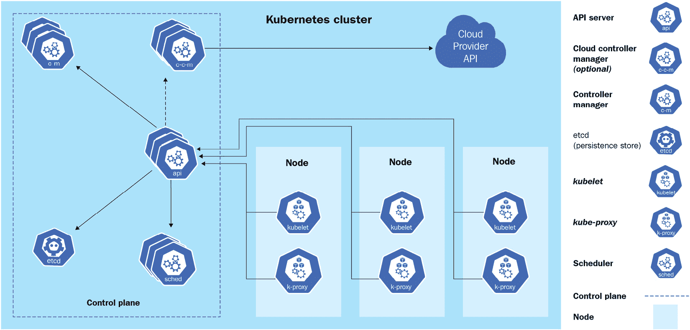

# 1

# Kubernetes 概览

本章介绍了 Kubernetes 架构和核心概念，深入探讨了常见的 Kubernetes 工具并进行实践，展示了 Kubernetes 中不同发行版和生态系统的整体情况。本章将覆盖以下主要主题：

+   CKA 考试概述

+   集群架构与组件

+   Kubernetes 核心概念

+   Kubernetes 市场中的发行版和生态系统

# CKA 考试概述

**认证 Kubernetes 管理员** (**CKA**) 认证是一个实践考试，涵盖了一些常见的 Kubernetes 工作场景。你需要在限定的时间内完成考试。我们强烈建议你在自己的环境中通读本书，并确保你理解并实践每一个步骤，直到你能培养直觉，快速完成所有任务而无需再三思考。时间管理是成功通过此考试的关键。

在撰写本书时，CKA 考试是基于 Kubernetes 1.22 版本的。请访问官方示例页面，确保你了解考试大纲的任何更新：[`www.cncf.io/certification/cka/`](https://www.cncf.io/certification/cka/)。要了解 Kubernetes 的更新内容，请查看社区发布说明：[`github.com/kubernetes/kubernetes/releases`](https://github.com/kubernetes/kubernetes/releases)。

本书内容与 CKA 考试大纲高度一致：

+   *第一部分* – *第一章* 到 *第三章* 涉及 *Kubernetes 集群架构、安装与配置*，约占考试的 25%。

+   *第二部分* – *第四章* 涉及 *工作负载与调度*，约占考试的 15%，*第五章* 涉及 *存储服务与网络*，约占考试的 10%，*第六章* 和 *第七章* 涉及 *服务与网络*，约占考试的 20%。

+   *第三部分* – *第八章* 到 *第十章* 涉及 *故障排除*，约占考试的 30%。

考试大纲的目标是帮助你为 CKA 考试做准备，并帮助你全面了解每个领域，这将有助于你在职业生涯中成为熟练的 Kubernetes 管理员。在阅读本书时，如果你已经熟悉某些话题，可以跳过不太需要了解的部分，直接阅读你最需要掌握的领域。

请注意，2020 年 11 月之前的一些 Kubernetes 安全内容已经逐渐移至 **认证 Kubernetes 安全专家**（**CKS**）考试。作为一个全面的 Kubernetes 管理员，深入了解 Kubernetes 安全是至关重要的。事实上，单独将 Kubernetes 安全作为一个独立的主题是比较困难的；然而，了解安全上下文和 **基于角色的访问控制**（**RBAC**）等主题仍然是您成功完成考试的必要条件。因此，本书仍将涵盖一些关键的安全概念，为您日后如果打算攻读 CKS 认证奠定基础。如需了解更多 Kubernetes 认证信息，请访问 Linux Foundation 网站的常见问题解答：[`docs.linuxfoundation.org/tc-docs/certification/faq-cka-ckad-cks`](https://docs.linuxfoundation.org/tc-docs/certification/faq-cka-ckad-cks)。

## 在 CKA 考试中需要预期的内容

在考试之前，您必须确保您在考试期间使用的计算机符合考试提供方定义的系统要求。摄像头和麦克风在考试期间必须开启。您只能使用单一实例的基于 Chromium 的浏览器进行考试。您可以在这里查看基于 Chromium 的浏览器列表：[`en.wikipedia.org/wiki/Chromium_(web_browser)`](https://en.wikipedia.org/wiki/Chromium_(web_browser))。

请通过运行兼容性检查工具确保您的硬件符合最低要求，您可以在这里找到该工具：[`www.examslocal.com/ScheduleExam/Home/CompatibilityCheck`](https://www.examslocal.com/ScheduleExam/Home/CompatibilityCheck)。详细的系统要求可以在这里查看：[`docs.linuxfoundation.org/tc-docs/certification/faq-cka-ckad-cks#what-are-the-system-requirements-to-take-the-exam`](https://docs.linuxfoundation.org/tc-docs/certification/faq-cka-ckad-cks#what-are-the-system-requirements-to-take-the-exam)。

重要提示

由于本次考试为在线远程监控考试，您还可以查看考试的具体情况，点击这里：[`psi.wistia.com/medias/5kidxdd0ry`](https://psi.wistia.com/medias/5kidxdd0ry)。

在考试期间，你可以查看官方 Kubernetes 文档，包括[`kubernetes.io`](https://kubernetes.io)和[`github.com/kubernetes`](https://github.com/kubernetes)上的文章和文档，且可以在同一浏览器实例中与考试界面一起查看。CKA 考试由大约 20 个基于场景的任务组成，任务需在 Linux 基础的 shell 和一组预定义的 Kubernetes 集群中完成。这些基于场景的任务以需要解决的问题形式提供，并附有额外的信息。考生必须根据提供的信息提出解决方案并及时执行。CKA 考试时长大约为 2 小时，考试结束后将标记为已提交。如果你愿意，可以使用多个显示器参加考试，尽管在此之前请查看考试政策，确保你已满足组织方的所有要求：[`docs.linuxfoundation.org/tc-docs/certification/faq-cka-ckad-cks#how-is-the-exam-proctored`](https://docs.linuxfoundation.org/tc-docs/certification/faq-cka-ckad-cks#how-is-the-exam-proctored)。

我们强烈推荐你通过**killer.sh**提供的模拟考试，走一遍样本场景，并收藏对你有帮助的官方文档。访问**killer.sh**培训网站[`killer.sh/course/`](https://killer.sh/course/)来测试模拟考试环境并试用场景。

欲了解更多 CKA 考试说明和技巧，请访问[`docs.linuxfoundation.org/tc-docs/certification/tips-cka-and-ckad`](https://docs.linuxfoundation.org/tc-docs/certification/tips-cka-and-ckad)。

你需要至少 66%的分数才能通过考试，考试结果将在考试结束后的 24 到 36 小时内通过邮件发送给你。你将收到有效期为 3 年的 PDF 格式证书，稍后还会收到徽章。如果有任何问题，你可以通过邮件联系`certificationsupport@cncf.io`寻求进一步帮助。

## CKA 考试技巧和窍门

成功通过 CKA 考试或任何其他 Kubernetes 认证的两个关键因素如下：

+   优秀的时间管理能力

+   练习，因为我们知道“熟能生巧”

在进入考试部分之前，你必须熟悉 Kubernetes；在准备考试时，不要只关注认证。深入了解 Kubernetes 集群架构和生态系统将为学习任何与考试相关的内容奠定坚实的基础。

### 获得一些基本的 Linux shell 理解

看到考试本身，基本的 Linux shell 知识将帮助你更快达成目标。在你完成本书中的练习时，以下命令会对你有所帮助：

+   尽量使用`sudo`以避免权限问题，使用`sudo su`来获取 root 权限

+   `curl`

+   在命令过滤结果中使用`| grep`

+   `vi/vim/nano` 或其他 Linux 文本编辑器

+   `cat`

+   `cp/mv/mkdir/touch`

+   `cp/scp`

+   对 `json` 路径的良好理解是加分项，使用 `jq` 进行 JSON 解析是获取命令输出信息的一个好方法。

在本书中，我们将逐一介绍所有的考试主题，练习中会涉及大部分命令。确保你理解并能独立自信地完成所有练习，不要着急。

### 设置 kubectl 别名以节省时间

在考试的各种场景中，你会反复使用很多命令，因此一个便捷的 `kubectl` 快捷方式是必不可少的，因为几乎所有的命令中都会使用它：

```
alias k=kubectl 
alias kg='kubectl get'
alias kgpo='kubectl get pod'
```

GitHub 上有一个 `kubectl-aliases` 仓库，你可以参考（[`github.com/ahmetb/kubectl-aliases`](https://github.com/ahmetb/kubectl-aliases)）。这个仓库是由一位贡献者创建的，展示了很多很好的 `kubectl` 别名示例。

如果你不想记住太多内容，你可以尝试理解 Kubernetes 中快捷方式的命名约定。例如，`svc` 是 services 的缩写，`kubectl get services` 可以变成 `kubectl get svc`，或者 `kubectl get nodes` 可以变成 `k get no`，等等。我创建了一个 `melonkube playbook` 仓库，涵盖了 Kubernetes 对象的所有快捷方式（[`github.com/cloudmelon/melonkube/blob/master/00%20-%20Shortcuts.md`](https://github.com/cloudmelon/melonkube/blob/master/00%20-%20Shortcuts.md)）。

你可以参考这个仓库，找到最适合你的方式。然而，请保持简单，因为在实际考试中，出于某些原因，你的大脑可能会变得很紧张。多加练习会让你更快上手。

### 设置 kubectl 自动补全

你可以在你的 shell 中设置自动补全；这通常在考试时的 Linux shell 中有效。你可以通过以下方式实现：

```
source <(kubectl completion bash) # setup autocomplete in bash into the current shell, bash-completion package should be installed first.
echo "source <(kubectl completion bash)" >> ~/.bashrc # add autocomplete permanently to your bash shell.
```

与快捷方式配合使用时，你可以执行以下操作：

```
alias k=kubectl
complete -F __start_kubectl k
```

尽管有时从 `bash 自动补全` 中寻找正确的命令可能会花费更多时间，但我认为通过实践建立对技术的深入理解将有助于你更快提高技能。

### 在浏览器中为陌生但重要的文档添加书签

熟悉 Kubernetes 官方文档，了解如何找到你需要的信息。CKA 的目标是*不是*记忆，而是实际操作技能；知道如何找到正确的路径并解决挑战才是关键。你可以在以下领域为文档添加书签：

+   Kubernetes 官方文档：[`kubernetes.io/docs/`](https://kubernetes.io/docs/)

+   Kubernetes 博客：[`kubernetes.io/blog/`](https://kubernetes.io/blog/)

+   Kubernetes GitHub 仓库：[`github.com/kubernetes/`](https://github.com/kubernetes/)

我通常推荐人们收藏的第一页是 `kubectl` 快捷命令表：[`kubernetes.io/docs/reference/kubectl/cheatsheet/`](https://kubernetes.io/docs/reference/kubectl/cheatsheet/)。另一个好的收藏是官方文档搜索：[`kubernetes.io/search/?q=kubecon`](https://kubernetes.io/search/?q=kubecon)。

### 小心安全上下文

上下文是最重要的指示器，可以帮助你了解当前操作的是哪个 Kubernetes 集群。我们将在本书后面更详细地讨论安全上下文。我建议你在处理任何新问题之前，先检查一下上下文，因为有时候你可能会感到困惑。请注意，如果你没有在该问题的目标 Kubernetes 集群上操作，你将 *不会* 得分。

你可以使用以下命令查看上下文：

```
kubectl config current-context
```

如果你想切换到一个特定的 Kubernetes 集群，可以使用以下命令：

```
kubectl config use-context my-current-cluster-name
```

你还可以通过以下命令查看你曾经操作过的 Kubernetes 集群列表，特别是在实际考试中：

```
kubectl config get-contexts  
```

### 明智地管理你的时间

时间管理是 CKA 考试成功的关键，合理管理时间，调整任务顺序非常重要。通常情况下，所有考试任务的难度从易到难排列。当你接近最后几个问题时，你可能会发现某些任务虽然非常耗时，但并不是最难的。你可以跳过这些问题，先处理那些你有信心的问题，之后再回到这些耗时的问题上。这就是为什么了解当前操作的 Kubernetes 集群非常重要。

### 最后的思考

如果你已经完成了本书中的所有练习，并希望更深入地理解 Kubernetes，我推荐你阅读一本我在 2020 年共同编写的书，名为 *The Kubernetes Workshop*，同样由 Packt 出版，书中提供了大量的 Kubernetes 练习，帮助你提高技术水平。

# 集群架构和组件

Kubernetes 是一个便携式、高度可扩展的开源编排系统，旨在管理容器化工作负载和服务，并协调容器以在不同的工作节点上实现所需的状态。值得一提的是，官方文档中提到，Kubernetes 在希腊语中的意思是 *pilot*，它的名字来源于此，这对于它的功能来说是非常合适的。

它支持各种工作负载，例如无状态、状态化以及数据处理工作负载。从理论上讲，任何可以容器化的应用程序都可以在 Kubernetes 上运行。

一个 Kubernetes 集群由一组工作节点组成；这些工作节点运行实际的工作负载，即容器化的应用程序。一个 Kubernetes 集群可以有从 1 到 5000 个节点（截至写本章节时，我们使用的是 Kubernetes 1.23 版本）。

我们通常启动一个节点进行快速测试，而在生产环境中，集群有多个工作节点以确保高可用性和故障恢复。

Kubernetes 采用主/工作节点架构，这是一种机制，其中一个进程充当主控组件，控制一个或多个其他组件（称为从节点，或者在我们的案例中是工作节点）。一个典型的 Kubernetes 集群架构如下所示：



图 1.1 – Kubernetes 集群架构

Kubernetes 主节点或控制平面负责响应集群事件，它包含以下组件：

+   `kube-apiserver` 负责公开 Kubernetes REST API。你可以将它看作是 Kubernetes 集群中各个组件之间的通信管理器。

+   **etcd**：这是一个分布式键值存储，存储关于集群信息以及在 Kubernetes 集群中运行的所有对象状态的信息，如 Kubernetes 集群节点、Pods、配置映射、密钥、服务账户、角色和绑定。

+   `kube-scheduler` 是 Kubernetes 的默认调度器。你可以把它想象成一个邮递员，它将 Pod 的信息发送到每个节点，当信息到达目标节点时，该节点上的 `kubelet` 代理将根据收到的规范为容器化工作负载提供支持。

+   Kubernetes 中的 `kube-controller-manager`。这些控制器的示例包括副本控制器、端点控制器和命名空间控制器。

除了控制平面外，Kubernetes 集群中每个运行实际工作负载的工作节点还包含以下组件：

+   **kubelet**：kubelet 是一个在每个工作节点上运行的代理。它接受来自 API 服务器或本地（用于静态 Pod）发送的 Pod 规格，并在相应的节点上配置容器化工作负载，如 Pod、StatefulSet 和 ReplicaSet。

+   **容器运行时**：这是帮助在每个节点的 Pods 中运行容器的软件虚拟化层。Docker、CRI-O 和 containerd 是常见的与 Kubernetes 一起工作的容器运行时的例子。

+   **kube-proxy**：此组件在每个工作节点上运行，负责在 Kubernetes 集群中部署服务对象时实现网络规则和流量转发。

了解这些组件及其工作原理将帮助你理解 Kubernetes 的核心概念。

# Kubernetes 核心概念

在深入探讨 Kubernetes 的核心内容之前，我们将首先解释一些关键概念，帮助你开始 Kubernetes 的学习旅程。

## 容器化工作负载

容器化工作负载是指在 Kubernetes 上运行的应用程序。回到容器化的基本定义，容器为你的应用程序提供了一个隔离的环境，相比于部署在物理服务器或 **虚拟机**（**VMs**）上的应用程序，容器具有更高的密度和更好的基础设施利用率：


图 1.2 – 虚拟机与容器

上图展示了虚拟机（VM）和容器之间的区别。与虚拟机相比，容器更加高效，且更易于管理。

## 容器镜像

容器将应用程序及其所有依赖项、库、二进制文件和配置文件隔离开来。应用程序的包，连同其依赖项、库、二进制文件和配置，称为**容器镜像**。一旦容器镜像构建完成，镜像的内容就变得不可变。所有代码更改和依赖项更新都需要构建新的镜像。

## 容器注册表

为了存储容器镜像，我们需要一个容器注册表。**容器注册表**可以位于本地机器、内部网络，或者有时在云端。你需要认证才能访问容器注册表的内容，以确保安全性。大多数公共注册表，如 DockerHub 和 [quay.io](http://quay.io)，允许广泛的非限制性容器镜像分发：


图 1.3 – 容器镜像

整个机制的优点在于，它允许开发人员专注于编码和配置，这正是他们工作中的核心价值，而无需担心底层基础设施或管理安装在主机节点上的依赖项和库，正如上图所示。

## 容器运行时

容器运行时负责运行容器，也称为**容器引擎**。这是一个运行在主机操作系统上的软件虚拟化层，用于运行容器。像 Docker 这样的容器运行时可以从容器注册表拉取容器镜像，并使用 CLI 命令管理容器生命周期，在这种情况下，使用 Docker CLI 命令，正如下图所示：


图 1.4 – 管理 Docker 容器

除了 Docker，Kubernetes 还支持多种容器运行时，如 containerd 和 CRI-O。在 Kubernetes 的上下文中，容器运行时帮助在每个工作节点上的 Pod 内启动并运行容器。我们将在下一章中介绍如何设置容器运行时，作为在配置 Kubernetes 集群之前的准备工作。

重要提示

Kubernetes 通过配置运行在工作节点上的 Pods 来运行容器化的工作负载。一个节点可以是物理机或虚拟机，无论是在本地还是云端。

# Kubernetes 基本工作流

我们在*集群架构和组件*章节中看到了一种典型的工作流程，展示了 Kubernetes 如何与 Kubernetes 组件协同工作，以及它们如何相互配合。当你使用 `kubectl` 命令、YAML 规范或其他方式调用 API 时，API 服务器会创建一个 Pod 定义，调度器则会识别可用的节点来部署新的 Pod。调度器有两个步骤：*过滤*和*评分*。过滤步骤会找到一组可用的候选节点来部署 Pod，评分步骤会对最合适的 Pod 部署进行排名。

API 服务器将这些信息传递给目标工作节点上的 kubelet 代理。然后，kubelet 在节点上创建 Pod，并指示容器运行时引擎部署应用镜像。一旦完成，kubelet 会将状态信息反馈给 API 服务器，后者会更新 `etcd` 存储中的数据，并通知用户 Pod 已被创建。

这个机制在每次执行任务并与 Kubernetes 集群进行交互时都会重复，不论是使用 `kubectl` 命令、部署 YAML 定义文件，还是通过其他方式触发 API 服务器的 REST API 调用。

以下图示展示了我们刚才描述的过程：


图 1.5 – Kubernetes 集群基本工作流程

了解基本的 Kubernetes 工作流程将帮助你理解 Kubernetes 集群组件如何相互协作，为学习 Kubernetes 插件模型和 API 对象打下基础。

## Kubernetes 插件模型

Kubernetes 主导市场并成为云原生生态系统新常态的最重要原因之一是它灵活、高度可配置且具有高度可扩展的架构。Kubernetes 在以下几个层面上具有高度的可配置性和可扩展性：

+   **容器运行时**：容器运行时是运行容器的最低级别软件虚拟化层。由于**容器运行时接口**（**CRI**）插件的支持，这一层支持市场上多种不同的运行时。CRI 包含一组协议缓冲区、规范、gRPC API、库和工具。在 *第二章*，*安装和配置 Kubernetes 集群* 中，我们将介绍如何在部署 Kubernetes 集群时与不同的运行时进行合作。

+   **网络**：Kubernetes 的网络层由 kubenet 或 **容器网络接口**（**CNI**）定义，负责为 Linux 容器配置网络接口，在我们的案例中，主要是 Kubernetes Pods。CNI 实际上是一个 **云原生计算基金会**（**CNCF**）项目，包含 CNI 规范、插件和库。在 *第七章*，*解密 Kubernetes 网络* 中，我们将详细讨论 Kubernetes 网络的更多内容。

+   **存储**：Kubernetes 的存储层曾是一个极具挑战性的部分，直到**容器存储接口**（**CSI**）被引入作为暴露块存储和文件存储系统的标准接口。存储卷由存储供应商量身定制的存储驱动程序管理，这部分曾是 Kubernetes 源代码的一部分。与 CSI 兼容的卷驱动程序为用户提供服务，使其能够将 CSI 卷附加或挂载到 Kubernetes 集群中运行的 Pods 上。我们将在*第五章*《解密 Kubernetes 存储》中详细介绍 Kubernetes 中的存储管理。

它们可以像下图所示轻松地布局：


图 1.6 – Kubernetes 插件模型

深入理解 Kubernetes 插件模型，不仅有助于你作为 Kubernetes 管理员的日常工作，还能为你奠定基础，帮助你快速学习 Kubernetes 生态系统和云原生社区标准。

# Kubernetes API 原语

所有组件之间的操作和通信以及外部用户命令，都是 API 服务器处理的 REST API 调用。在 Kubernetes 中，所有内容都被视为一个 API 对象。

在 Kubernetes 中，当你运行`kubectl`命令时，`kubectl`工具实际上是连接到 kube-apiserver 的。`kube-apiserver`首先对请求进行身份验证和验证，然后更新`etcd`中的信息并检索请求的信息。

在每个工作节点中，kubelet 代理在每个节点上获取由 API 服务器提供的 Podspecs，配置容器化工作负载，并确保 Pods（如 Podspec 中所描述的）正在运行并保持健康。Podspec 是 YAML 定义文件的主体，它被转化为一个 JSON 对象，描述工作负载的规格。Kubernetes 通过 API 服务器发起 API 调用，然后由控制平面进行处理。

Kubernetes API 原语，也被称为 Kubernetes 对象，是任何在 Kubernetes 集群中运行的容器化工作负载的基础构件。

以下是我们在日常使用 Kubernetes 集群时将要使用的主要 Kubernetes 对象：

+   **Pods**：Kubernetes 中最小的可部署单元是 Pod。工作节点托管着 Pods，Pods 中包含了实际的应用工作负载。应用被打包并部署在容器中。一个 Pod 包含一个或多个容器。

+   **副本集**：副本集帮助 Pods 在用户定义的副本数量下实现更高的可用性。副本集的作用是确保集群始终有精确数量的副本在 Kubernetes 集群中运行。如果其中任何一个副本失败，新的副本将会被部署。

+   **DaemonSet**：DaemonSet 类似于 ReplicaSet，但它确保至少在 Kubernetes 集群中的每个节点上都有一个副本的 Pod。如果集群中添加了新节点，该 Pod 的副本将自动分配到该节点。同样，当节点被移除时，Pod 也会自动被移除。

+   **StatefulSet**：StatefulSet 用于管理有状态的应用。当工作负载需要存储卷以提供持久性时，用户可以使用 StatefulSet。

+   `Completed` 状态。使用作业的一个示例是当我们希望运行一个特定目标的工作负载，并确保它只运行一次且成功时。

+   使用 `cron` 表达式根据需求定义特定的调度时间。

+   **Deployment**：Deployment 是一种方便的方式，允许你定义所需的状态，例如部署一个具有特定副本数的 ReplicaSet，并且可以轻松地进行版本回滚或发布。

我们将在*第四章*《应用调度与生命周期管理》中详细介绍如何使用这些 Kubernetes 对象。敬请期待！

# 使用命名空间共享集群

理解 Kubernetes 基本对象将让你初步了解 Kubernetes 如何在工作负载级别上运作。随着我们的深入讲解，还会涵盖更多细节和其他相关对象。这些在 Kubernetes 集群上运行的对象在进行开发、测试或快速入门时会正常工作，尽管在企业级组织的生产环境中，我们需要考虑工作负载的隔离，这时命名空间的作用就体现出来了。

命名空间是对单一 Kubernetes 集群中所有命名空间对象的逻辑隔离。命名空间对象的示例包括 Deployments、Services、Secrets 等。还有一些 Kubernetes 对象是全局范围的，例如 StorageClasses、Nodes 和 PersistentVolumes。资源的名称在一个命名空间内必须唯一，但它在所有命名空间中都是通过命名空间名称和对象名称来标记的。

命名空间旨在将集群资源在多个用户之间进行隔离，从而为组织内部的多个项目共享集群提供了可能性。我们称这种模式为**Kubernetes 多租户模型**。多租户模型是一种有效的方式，帮助不同的项目和团队共享集群并最大化地利用同一个集群。多租户模型有助于最小化资源浪费。尤其在使用云端 Kubernetes 时，云服务商总是会保留一定的资源，这时多租户模型特别有用。尽管如此，多租户模型也给资源管理和安全方面带来了额外的挑战。我们将在*第四章*《应用调度与生命周期管理》中讨论资源管理。

为了更好的物理隔离，我们建议组织使用多个 Kubernetes 集群。这将为不同的项目和团队带来物理边界，尽管 Kubernetes 系统所保留的资源也会在集群之间进行复制。除此之外，跨多个 Kubernetes 集群工作也是具有挑战性的，因为它涉及到通过切换安全上下文来建立有效的机制，以及处理网络方面的复杂性。我们将在*第六章*，*保护 Kubernetes*，以及 Kubernetes 网络部分的*第七章*，*揭秘 Kubernetes 网络*中详细讨论 Kubernetes 安全性和网络。以下是一个显示 Kubernetes 多租户与多集群比较的图示：


图 1.7 – Kubernetes 多租户与多集群

# Kubernetes 市场发行版和生态系统

Kubernetes 得到了一个快速发展的、充满活力的开源社区的支持。目前市场上有超过 60 种已知的 Kubernetes 平台和发行版。从宏观上看，市场上有来自上游社区的托管 Kubernetes 和标准 Kubernetes 发行版。在本节中，我们将提供关于 Kubernetes 及其生态系统的高层次总结。

## 上游原生 Kubernetes

上游原生 Kubernetes 通常在组织希望管理自己的 Kubernetes 集群以及本地基础设施或基于云的虚拟机时使用。Kubernetes 发行版的源代码来自上游 Kubernetes 社区项目。它是开放的，欢迎贡献，因此请随时加入任何**兴趣小组**（**SIG**）小组；这里是社区小组的完整列表：[`github.com/kubernetes/community/blob/master/sig-list.md`](https://github.com/kubernetes/community/blob/master/sig-list.md)。

如果你有任何想法或希望向社区学习：[`kubernetes.io/docs/contribute/generate-ref-docs/contribute-upstream/`](https://kubernetes.io/docs/contribute/generate-ref-docs/contribute-upstream/)。

## 托管 Kubernetes

云服务商托管的 Kubernetes 发行版通常属于这一类别。托管的 Kubernetes 发行版通常基于原生 Kubernetes 集群，不同的厂商在此基础上构建其功能，使其更适应其基础设施。托管的 Kubernetes 发行版通常由厂商管理控制平面，用户只需管理工作节点，并将精力集中在基于核心专业知识提供价值上。

**Microsoft Azure** 提供 **Azure Kubernetes Service**（**AKS**），**Amazon Web Service**（**AWS**）提供 **Elastic Kubernetes Service**（**EKS**），而 **Google Cloud Platform**（**GCP**）则以其 **Google Kubernetes Engine**（**GKE**）为荣。

其他流行的 Kubernetes 发行版包括 VMware 的 Tanzu、RedHat 的 OpenShift、Canonical 的 Charmed Kubernetes 和 Ranger Lab 的 Kubernetes。

## Kubernetes 生态系统

Kubernetes 生态系统不仅限于供应和管理工具；它还有多种工具用于安全、网络、可观察性等方面，涵盖了使用 Kubernetes 时所有重要的方面。Kubernetes 生态系统是云原生领域的重要组成部分。由于 Kubernetes 具有高度的可移植性和平台无关性，我们可以将 Kubernetes 带到任何地方。它容易与安全敏感的断开场景集成，或者随着组织向云迁移，与混合场景集成。生态系统中的这些工具相互补充，推动了 Kubernetes 作为云原生技术的巨大增长，并对社区以及各类规模的企业产生了积极影响。查看云原生领域的更多内容，请访问[`landscape.cncf.io`](https://landscape.cncf.io)。

学习 Kubernetes 及其生态系统将帮助你更好地理解如何为你的组织使用 Kubernetes，以及如何帮助你的组织从 Kubernetes 中获得最大的收益。

# 总结

本章介绍了 Kubernetes 的一些核心概念，并简要概览了市场上所有流行的 Kubernetes 发行版。激动人心的旅程即将开始！

在下一章，我们将深入探讨 Kubernetes 集群的安装和配置细节，敬请期待！
