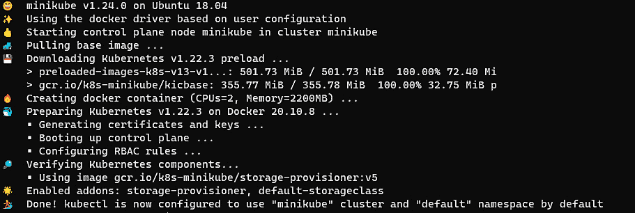

# 2

# 安装和配置 Kubernetes 集群

本章介绍了 Kubernetes 的不同配置，这是使用 Kubernetes 的第一步。我们将通过设置一个包含单个工作节点的 Kubernetes 集群，然后再扩展为多个工作节点，来进行实践。本章将帮助你熟悉 Kubernetes 安装，这是作为 Kubernetes 管理员日常工作中的一项关键技能。

在本章中，我们将涵盖以下主题：

+   Kubernetes 工具实践

+   安装和配置 Kubernetes 集群

+   使用 `minikube` 设置单节点 Kubernetes 集群

+   使用 `kubeadm` 安装基本的 Kubernetes 集群

+   使用 `kubeadm` 设置高可用集群

# 技术要求

为了开始工作，我们需要确保你的本地机器满足以下技术要求：

+   兼容的 Linux 主机 – 我们推荐使用基于 Debian 的 Linux 发行版，如 Ubuntu 18.04 或更高版本。

+   确保你的主机至少有 2 GB 的内存、2 个 CPU 核心，以及大约 20 GB 的空闲磁盘空间。

# Kubernetes 工具实践

市场上有许多 Kubernetes 工具 – 我们将首先介绍一些广泛使用的 Kubernetes 工具，用于与 Kubernetes 集群进行交互。我们将在本章后面通过实际操作深入讲解一些关键工具。

## 核心工具

在本节中，我们将介绍用于与 Kubernetes 和容器一起工作的工具。

### kubectl

`kubectl` 是一个 Kubernetes 命令行工具，用于与 Kubernetes 集群进行交互。它无疑是最常用和最重要的工具，使你能够在 Kubernetes 集群中运行命令。`kubectl` 提供了许多命令，允许用户执行与 Kubernetes 集群相关的操作，比如部署容器化应用程序、管理集群资源、监控和可视化事件与日志。我们将在整个过程中介绍大部分常用的 `kubectl` 命令，并通过示例进行讲解。

要设置 `kubectl` 工具，如果你使用的是基于 Red Hat 的发行版，如 CentOS 或 Fedora，请参考官方文章获取更多信息：[`kubernetes.io/docs/tasks/tools/install-kubectl-linux/#install-using-native-package-management`](https://kubernetes.io/docs/tasks/tools/install-kubectl-linux/#install-using-native-package-management)。你可以使用以下命令：

```
cat <<EOF | sudo tee /etc/yum.repos.d/kubernetes.repo
[kubernetes]
name=Kubernetes
baseurl=https://packages.cloud.google.com/yum/repos/kubernetes-el7-x86_64
enabled=1
gpgcheck=1
repo_gpgcheck=1
gpgkey=https://packages.cloud.google.com/yum/doc/yum-key.gpg https://packages.cloud.google.com/yum/doc/rpm-package-key.gpg
EOF
sudo yum install -y kubectl 
```

如果你使用的是基于 Debian 的发行版，如 Ubuntu 18.04，可以按照以下说明进行操作：

1.  首先，你需要更新 `apt` 包索引，然后，你需要按顺序运行以下命令来安装使用 Kubernetes `apt` 仓库所需的软件包：

    ```
    sudo apt-get update
    sudo apt-get install -y apt-transport-https ca-certificates curl
    ```

1.  下载 Google Cloud 公共签名密钥，并使用以下命令添加 Kubernetes `apt` 仓库：

    ```
    sudo curl -fsSLo /usr/share/keyrings/kubernetes-archive-keyring.gpg https://packages.cloud.google.com/apt/doc/apt-key.gpg
    echo "deb [signed-by=/usr/share/keyrings/kubernetes-archive-keyring.gpg] https://apt.kubernetes.io/ kubernetes-xenial main" | sudo tee /etc/apt/sources.list.d/kubernetes.list
    ```

1.  现在，你可以开始了。确保你再次更新 `apt` 包索引并使用 `apt-get install` 命令安装 `kubectl` 工具：

    ```
    sudo apt-get update
    sudo apt-get install -y kubectl
    ```

1.  在完成之前的步骤后，你可以通过运行以下命令来验证`kubectl`是否已经成功安装：

    ```
    kubectl version --client
    ```

如果你成功安装了`kubectl`，你将看到类似下面的输出：


图 2.1 – kubectl 安装成功

有关在不同环境中安装`kubectl`的说明，请参考[`kubernetes.io/docs/tasks/tools/`](https://kubernetes.io/docs/tasks/tools/)。

### 容器运行时

现在，我们将按照这些指示设置`containerd`作为我们的容器运行时：

1.  更新`apt`索引，添加 Docker 的官方`GPG`密钥，并通过运行以下指令设置`apt`仓库：

    ```
    sudo apt-get update
    sudo apt-get install \
        ca-certificates \
        curl \
        gnupg \
        lsb-release
    curl -fsSL https://download.docker.com/linux/ubuntu/gpg | sudo gpg --dearmor -o /usr/share/keyrings/docker-archive-keyring.gpg
    echo \
      "deb [arch=$(dpkg --print-architecture) signed-by=/usr/share/keyrings/docker-archive-keyring.gpg] https://download.docker.com/linux/ubuntu \
      $(lsb_release -cs) stable" | sudo tee /etc/apt/sources.list.d/docker.list > /dev/null
    ```

1.  安装 Docker 引擎和`containerd.io`：

    ```
    sudo apt-get update
    sudo apt-get install docker-ce docker-ce-cli containerd.io
    ```

1.  使用以下命令验证 Docker 是否已经成功安装：

    ```
    sudo docker ps
    #optional - running your first docker container
    sudo docker run hello-world
    ```

如果你成功安装了`kubectl`，你将看到类似下面的输出：


图 2.2 – Docker 已启动并运行

1.  如果你准备将`containerd`配置为容器运行时，可以使用以下命令并将配置设置为`default`：

    ```
    sudo mkdir -p /etc/containerd
    containerd config default | sudo tee /etc/containerd/config.toml
    ```

1.  重启`containerd`以确保更改生效：

    ```
    sudo systemctl restart containerd
    ```

如果你想了解如何设置 CRI-O 作为运行时，请查看以下链接：[`kubernetes.io/docs/setup/production-environment/container-runtimes/#cri-o`](https://kubernetes.io/docs/setup/production-environment/container-runtimes/#cri-o)。该链接将展示`containerd`如何在 Kubernetes 上下文中作为容器运行时工作。

## 部署工具

要引导一个 Kubernetes 集群，我们依赖于部署工具。市面上有很多有用的工具可以帮助启动一个 Kubernetes 集群，其中许多是与供应商相关的。在这里，我们将介绍 CKA 考试中要求的工具。这也是我们专注于上游 Kubernetes 的主要原因，这些工具将帮助我们在本地启动集群。以下工具将帮助你设置 Kubernetes 集群，我们将在下一章中详细介绍每个工具的使用方法：

+   `kubeadm`是帮助你通过考试练习的最重要工具。它帮助安装并设置 Kubernetes 集群，采用最佳实践。使用`kubeadm`，你可以配置单节点集群，更重要的是，多节点集群。这是大多数希望管理自己 Kubernetes 集群并使用自有本地服务器的公司首选的工具。

+   `minikube`是一个流行的本地 Kubernetes，可以在你的本地笔记本电脑或**虚拟机**（**VM**）上进行配置。它非常轻量，专注于使学习 Kubernetes 变得简单，并能够快速进行测试。

+   `kind` 类似于 `minikube`，它专注于本地 Kubernetes 集群的配置以及一些简单的 CI 场景和开发。它使用 Docker 运行时运行本地 Kubernetes 集群——可以运行单节点 Kubernetes 集群或 Kubernetes 多节点集群。你可以使用 `kind` 测试许多有用的简单场景。

## 其他工具

一些其他工具不在 CKA 考试中覆盖——但是，它们在你作为 Kubernetes 管理员的日常工作中仍然会非常有用。

### Helm

Helm 是一个管理工具，用于管理以图表形式预配置的 Kubernetes 对象包——我们称这些为 Helm 图表。

要安装 `helm`，你可以按照以下针对基于 Debian 的发行版（例如 Ubuntu 18.04）的说明进行操作：

1.  更新 `apt` 包索引：

    ```
    curl https://baltocdn.com/helm/signing.asc | sudo apt-key add -
    sudo apt-get install apt-transport-https --yes
    ```

1.  使用以下命令安装 Helm `apt` 仓库的相关软件包：

    ```
    echo "deb https://baltocdn.com/helm/stable/debian/ all main" | sudo tee /etc/apt/sources.list.d/helm-stable-debian.list
    ```

1.  确保再次使用新的仓库更新 `apt` 包索引，然后使用 `apt-get install` 命令安装 Helm：

    ```
    sudo apt-get update
    sudo apt-get install helm
    ```

1.  使用以下 Helm 命令验证其安装是否成功：

    ```
    helm version
    ```

你将看到类似于以下内容的输出：


图 2.3 – Helm 安装成功

要了解更多安装 Helm 的方法，请查看以下链接：[`helm.sh/docs/intro/install/`](https://helm.sh/docs/intro/install/)。

### Kompose

大多数使用 Docker 的人都知道 Docker Compose。Docker Compose 是一个用于定义和运行由 Docker 容器化的多容器应用的工具。它也使用 YAML 文件来定义应用程序的规格。随着越来越多的人不再单纯使用 Docker Swarm 或 Docker Desktop，而是利用企业级的容器编排系统，Kompose 成为一个有用的转换工具，将 Docker Compose 转换为 Kubernetes 等容器编排系统——同样的结构也适用于 Redhat OpenShift。

你可以通过在 Ubuntu 18.04 上运行以下说明来安装 Kompose：

1.  获取 `kompose` 二进制文件：

    ```
    curl -L https://github.com/kubernetes/kompose/releases/download/v1.26.0/kompose-linux-amd64 -o kompose
    chmod +x kompose
    sudo mv ./kompose /usr/local/bin/kompose
    ```

1.  然后，你可以从官方网站获取一个 `docker compose` 示例文件，并按照如下方式测试 `kompose convert` 命令：

    ```
    wget https://raw.githubusercontent.com/kubernetes/kompose/master/examples/docker-compose-v3.yaml -O docker-compose.yaml
    kompose convert
    ```

你的输出将类似于以下内容：


图 2.4 – 一个 `kompose convert` 命令将 Docker compose 转换为 Kubernetes 本地的 YAML 定义文件

1.  然后，使用以下命令将这些 YAML 文件部署到本地 Kubernetes 集群：

    ```
    kubectl apply -f .
    ```

你的输出将类似于以下内容：


图 2.5 – Kubernetes Pods 启动成功

上面的截图显示了在 Kubernetes 集群中运行的 Redis Pods。

### 仪表盘

您可以为 Kubernetes 集群安装一个基于 Web 的**用户界面**（**UI**）。它不仅显示集群状态并展示 Kubernetes 集群的运行情况，还允许您部署容器化应用程序、进行故障排除，并管理集群及其相关资源。

以下是一个示例控制面板：


图 2.6 – Kubernetes 控制面板

控制面板有时对从 UI 快速监控集群状态很有帮助，且对不熟悉`kubectl`命令的人来说，界面友好，便于协作。

# 安装和配置 Kubernetes 集群

本节重点介绍 Kubernetes 集群的安装及其相关配置。通过在*第一章*中获得的良好理解，您已经了解了 Kubernetes 集群架构和 Kubernetes 工具，接下来您将通过`minikube`和`kubeadm`来进行 Kubernetes 集群安装，并且更新集群版本。

请注意，使用`minikube`启动单节点集群并不包含在 CKA 考试范围内，但它在你想在本地机器上测试 Kubernetes 时非常有用。同样，使用`kubeadm`安装 Kubernetes 多节点集群，以及设置**高可用**（**HA**）Kubernetes 集群也不在考试范围内。

我们希望您通过两种方式学习，但更侧重于通过`kubeadm`进行的动手实验。从下一个章节开始，我们将带您逐步完成安装新的 Kubernetes 集群及其配置的过程。

## 安装 Kubernetes 集群的先决条件

为了开始，我们需要确保您的本地机器满足以下技术要求，以便同时支持`minikube`和`kubeadm`：

+   一个兼容的 Linux 主机 – 我们推荐使用基于 Debian 的 Linux 发行版，如 Ubuntu 18.04 或更高版本。

+   确保您的主机至少有 2 GB 内存、2 个 CPU 核心，以及大约 20 GB 的空闲磁盘空间。

+   网络连接：因为在整个过程中，您需要下载依赖项。

+   在创建 Kubernetes 集群之前，需要安装容器运行时。在集群创建过程中，Kubernetes 集群会通过扫描本地机器中的 Unix 域套接字（如果有的话）来自动检测已安装的容器运行时。**Unix 域套接字**使用**传输控制协议**（**TCP**）作为底层传输协议。它用于同一操作系统上双向数据通信。我们在*第一章*中讨论了如何安装和配置容器运行时，请按照其中的说明操作。

在开始之前，让我们完成以下清单：

### 检查是否禁用了 swap

对于`kubeadm`，我们必须禁用`swap`才能使`kubelet`正常工作，您可以通过以下步骤禁用`swap`：

```
sudo swapoff -a
```

### 检查容器运行时

你可以按照指示检查 Unix 域套接字的路径，以验证你的容器运行时 —— 这个路径可以被 Kubernetes 检测到。按照本章前面讲解的安装 Docker 的指示，安装 `kubelet` 代理后，你会在 `/var/run/dockershim.sock` 路径下找到 Unix 域套接字路径。要验证 Docker 是否已成功安装，可以运行 `docker ps` 命令：

```
sudo docker ps
```

以下命令的输出结果如下：


图 2.7 – 检查 Docker 运行时

如果你已经安装了 `containerd` 作为容器运行时，正如本章前面在*容器运行时*部分中讲解的那样，你会在 `/run/containerd/containerd.sock` 路径下找到 Unix 域套接字路径，具体如下：


图 2.8 – 检查 containerd 运行时

当检测到 `docker` 和 `containerd` 两种容器运行时，`kubeadm` 会选择 `docker` 而非 `containerd` 作为容器运行时。截止到写作本文时（2022 年 1 月初宣布），Kubernetes 将在即将发布的 v1.24 版本中移除 `dockershim`。这并不令人惊讶，因为这一消息早在 2020 年 12 月就已宣布，Kubernetes 内置的 `dockershim` 组件在 Kubernetes v1.20 中已被弃用。在大多数情况下，只要满足以下条件，它不会影响 Kubernetes 中运行的应用程序或容器化应用程序的构建过程：

+   在容器内部执行 Docker 命令时，容器级别不会应用特权的 root 权限，并且它使用 `systemctl` 重启 `docker.service`

+   Docker 配置文件，如 /`etc/docker/daemon.json` 已被修改

此时，Kubernetes 官方文档已经发布了这篇文章，帮助用户检查 `dockershim` 弃用是否会影响他们。点击此处查看更多关于如何检查 Docker 依赖的方式：[`kubernetes.io/docs/tasks/administer-cluster/migrating-from-dockershim/check-if-dockershim-deprecation-affects-you/#find-docker-dependencies`](https://kubernetes.io/docs/tasks/administer-cluster/migrating-from-dockershim/check-if-dockershim-deprecation-affects-you/#find-docker-dependencies)。

### 检查 Kubernetes 所需的端口是否已开放

在安装 `kubeadm` 之前，我们还需要检查本地机器上是否打开了某些端口。你可以使用 `telnet` 命令来检查：

```
telnet 127.0.0.1 6443
```

你可以查看官方文档，确保 Kubernetes 使用的端口和协议可用，访问此链接：[`kubernetes.io/docs/reference/ports-and-protocols/`](https://kubernetes.io/docs/reference/ports-and-protocols/)。

### 确保 iptables 看到桥接流量

确保你的 Linux 节点的 `iptables` 配置正确，以便能够监控桥接流量。你可以将 `net.bridge.bridge-nf-call-iptables` 参数设置为 `1`，就像我们在这里所做的那样：

```
cat <<EOF | sudo tee /etc/modules-load.d/k8s.conf
br_netfilter
EOF
cat <<EOF | sudo tee /etc/sysctl.d/k8s.conf
net.bridge.bridge-nf-call-ip6tables = 1
net.bridge.bridge-nf-call-iptables = 1
EOF
sudo sysctl --system
```

你将看到类似如下的输出：


图 2.9 – iptables 监控桥接流量

上面的截图显示 `iptables` 中的值已更新。

### 检查是否已安装 kubectl

`kubectl` 是你可以用来与 Kubernetes 集群交互的命令行工具。使用 `kubectl version` 命令，你可以验证是否成功安装了 `kubectl`：

```
kubectl version --client
```

成功安装将显示类似以下的输出：


图 2.10 – 检查 kubectl 版本

在继续下一个部分之前，确保你已完成本节中的检查清单。这些工具和要求是必要的，你可以在未来根据需要使用它们。

# 使用 minikube 设置单节点 Kubernetes 集群

使用 `minikube` 创建 Kubernetes 集群是启动本地 Kubernetes 集群的最简单方法，并且可以在几分钟内完成。以下是你需要做的：

### 安装 minikube

按照以下步骤安装 `minikube`：

1.  在本地或云端的 Linux 虚拟机上，使用 `curl` 命令获取 `minikube` 二进制文件，然后将其安装到 `/usr/local/bin/minikube` 下，如下所示：

    ```
    curl -LO https://storage.googleapis.com/minikube/releases/latest/minikube-linux-amd64
    sudo install minikube-linux-amd64 /usr/local/bin/minikube
    ```

1.  在继续下一步之前，你可以前往 `/usr/local/bin/minikube` 检查是否成功安装了 `minikube` 二进制文件，或者你也可以通过在终端中输入以下命令进行检查：

    ```
    minikube –-help
    ```

### 使用 minikube 配置单节点 Kubernetes 集群

按照以下步骤使用 minikube 来配置单节点 Kubernetes 集群：

1.  使用 `minikube` 配置单节点 Kubernetes 集群时，你可以简单地使用 `minikube start` 命令：

    ```
    minikube start
    ```

1.  你也可以通过添加 `--memory` 和 `--cpus` 标志来设置 CPU 核心和内存，启动你的 `minikube` 集群，如下所示：

    ```
    minikube start --memory 8192 --cpus 4
    ```

执行命令后，它将启动 `minikube` 集群配置过程。你将看到类似如下的输出：



图 2.11 – 启动 minikube 集群

最后，你将看到一条消息，告诉你我们已经准备好使用 `minikube` Kubernetes 集群（如前面的截图所示）。

### 验证 minikube 集群安装

你的 `minikube` 集群包含一个节点，既充当控制平面，又充当工作节点。这意味着，一旦设置好，你就可以开始在本地 Kubernetes 集群中调度工作负载。你可以使用以下命令查看该节点是否准备好使用：

```
kubectl get node 
```

你也可以使用该命令的快捷方式：

```
alias k=kubectl 
k get no
```

输出将显示如下内容：

+   节点的状态及其是否准备好使用

+   节点的角色

+   Kubernetes 版本

+   节点自部署以来的时间

这是输出结果：


图 2.12 – 检查 Docker 运行时

### 配置 minikube 集群

如果你希望配置`minikube`集群而不重新创建一个新的集群，你需要使用`minikube stop`命令停止`minikube`集群。

`minikube config set`命令将帮助你应用分配给`minikube`集群的 CPU 和内存等设置。在配置`minikube`集群后，你需要启动`minikube`集群，之后你将使用新配置的集群进行操作。

以下是使用更多内存和 CPU 配置`minikube`的过程：

```
minikube stop
minikube config set memory 8192
minikube config set cpus 4
minikube start
```

之后，你可以继续操作`minikube`集群。如果你对命令的使用有任何疑问，可以使用`minikube config --help`命令获取帮助。

### 删除 minikube 集群

以下命令会删除所有本地 Kubernetes 集群和所有配置文件：

```
minikube delete --all
```

你从本节学到的内容可以在每次需要本地 Kubernetes 集群时反复使用。你可以复制你在本节学到的内容，快速测试最新 Kubernetes 版本中发布说明中的大多数新功能：[`github.com/kubernetes/kubernetes/releases`](https://github.com/kubernetes/kubernetes/releases)。

然而，大多数企业级环境对单节点集群并不满足需求。它们大多是多节点设置。在下一节中，我们将深入探讨如何使用`kubeadm`创建一个 Kubernetes 多节点集群。

# 使用 kubeadm 安装基本 Kubernetes 集群

在本节中，我们将使用`kubeadm`创建一个多节点的 Kubernetes 集群。以下是我们需要执行的步骤：

1.  安装`kubeadm`。

1.  启动一个主节点，控制平面将位于该节点

1.  安装网络插件（我们将在本章后面详细介绍支持的插件，并在该部分使用 Calico 作为示例）。

1.  启动工作节点。

1.  将工作节点加入控制平面。

在开始之前，你需要确保你的主节点满足本章列出的所有技术要求。

我们将通过本节描述的步骤部署一个基本的 Kubernetes 集群，如*图 2.7*所示：


图 2.13 – 使用 kubeadm 启动基本 Kubernetes 集群的工作流程

Kubernetes 集群将类似于*图 2.14*中展示的架构：


图 2.14 – 标准的多节点 Kubernetes 集群

从现在开始，你可以按照这些指示创建一个多节点的 Kubernetes 集群。要使用`kubeadm`创建 Kubernetes 集群，其默认设置符合设置标准 Kubernetes 集群的最佳实践。这套最佳实践被封装为 Kubernetes 一致性测试。查看有关 Kubernetes 一致性计划的详细信息：[`kubernetes.io/blog/2017/10/software-conformance-certification/`](https://kubernetes.io/blog/2017/10/software-conformance-certification/)。

### 安装 kubeadm

我们介绍了设置`docker`或`containerd`作为容器运行时 —— 然后，我们可以按照以下说明安装`kubeadm`：

1.  通过运行以下命令，更新`apt`包索引，添加谷歌云公共签名密钥，并设置 Kubernetes 的`apt`仓库：

    ```
    sudo apt-get update
    sudo apt-get install -y apt-transport-https ca-certificates curl
    sudo curl -fsSLo /usr/share/keyrings/kubernetes-archive-keyring.gpg https://packages.cloud.google.com/apt/doc/apt-key.gpg
    echo "deb [signed-by=/usr/share/keyrings/kubernetes-archive-keyring.gpg] https://apt.kubernetes.io/ kubernetes-xenial main" | sudo tee /etc/apt/sources.list.d/kubernetes.list
    ```

1.  首先更新`apt`包索引，然后安装`kubelet`和`kubeadm`：

    ```
    sudo apt-get update
    sudo apt-get install -y kubelet kubeadm 
    ```

1.  如果你还没有安装`kubectl`，你也可以一步安装`kubelet`、`kubeadm`和`kubectl`：

    ```
    sudo apt-get update
    sudo apt-get install -y kubelet kubeadm kubectl 
    ```

1.  使用以下命令来固定你正在安装的工具版本：

    ```
    sudo apt-mark hold kubelet kubeadm kubectl 
    ```

输出显示那些包已被设置为保持，如*图 2.9*所示：


图 2.15 – 检查 containerd 运行时

1.  从这里，你可以通过在命令行中输入`kubeadm`来检查`kubeadm`是否已成功安装。以下是该命令的输出：


图 2.16 – 检查 containerd 运行时

1.  要验证`kubelet`是否存在于主节点上，你可以使用`which kubelet`命令，该命令会返回`kubelet`代理的位置：


图 2.17 – 检查 kubelet 是否存在

由于你已经成功安装了`kubeadm`和`kubelet`，现在可以开始初始化控制平面。

在这里，我们将展示一个可选操作，你可以使用`images pull`来预拉取设置 Kubernetes 集群所需的镜像：

```
sudo kubeadm config images pull
```

输出应该类似于以下截图：


图 2.18 – 预拉取镜像

请注意，之前的操作是可选的 —— 你可以跳过它，直接进入下一节。

### 引导主节点

你可以使用`kubeadm init`命令以普通用户身份初始化控制平面，并通过以下命令获得来自主节点机器的`sudo`权限：

```
sudo kubeadm init --pod-network-cidr=192.168.0.0/16
```

你将看到类似于以下的输出：


图 2.19 – 控制平面成功启动

在 Kubernetes 的`control-plane`成功初始化后，你可以执行以下命令来配置`kubectl`：

```
mkdir -p $HOME/.kube
sudo cp -i /etc/kubernetes/admin.conf $HOME/.kube/config
sudo chown $(id -u):$(id -g) $HOME/.kube/config
```

如果你是 root 用户，你可以使用以下命令：

```
export KUBECONFIG=/etc/kubernetes/admin.conf
```

接下来，步骤是向 Kubernetes 集群部署 pod 网络。

### 安装网络插件

为了让 pods 之间可以互相通信，你可以通过启用**容器网络接口**（**CNI**）插件来部署网络。CNI 插件符合 CNI 规范，根据官方 Kubernetes 文档，Kubernetes 遵循 CNI 规范的 v0.4.0 版本。

有许多网络插件可以与 Kubernetes 一起使用——我们将在*第七章*《解密 Kubernetes 网络》中深入探讨 Kubernetes 网络。以下是一些附加选项：

+   Calico

+   Flannel

+   Weave Net

对于 Kubernetes 社区认可的所有可能选项，请查看官方文档：[`kubernetes.io/docs/concepts/cluster-administration/addons/`](https://kubernetes.io/docs/concepts/cluster-administration/addons/)。你可以通过该页面上的链接获取相应选项的安装说明。

在这里，我们将使用 Calico 插件作为 Kubernetes 集群的覆盖网络。它是一个 Kubernetes CNI 网络提供者，允许你编写网络策略，这意味着它支持一系列的网络选项，以满足不同的需求。我们将按以下方式进行操作：

1.  部署 Tigera Calico 的`kubectl create -f`命令：

    ```
    kubectl create -f https://docs.projectcalico.org/manifests/tigera-operator.yaml
    kubectl create -f https://docs.projectcalico.org/manifests/custom-resources.yaml
    ```

1.  你可以使用`watch`命令来监视 pod 状态：

    ```
    watch kubectl get pods -n calico-system
    ```

或者，可以使用以下替代命令：

```
kubectl get pods -n calico-system -w
```

现在，你可以看到 pods 的状态为`Running`：


图 2.20 – 控制平面已成功启动

1.  对于通过`kubeadm`创建的 Kubernetes 集群，主节点默认会有污点。因此，我们需要移除污点，以便主节点可以调度 pods。要移除污点，可以使用以下命令：

    ```
    kubectl taint nodes --all node-role.kubernetes.io/master-
    ```

以下截图显示，主节点上的污点已成功移除：


图 2.21 – 成功移除主节点上的污点

1.  你可以使用以下命令查看当前可用的节点：

    ```
    kubectl get no
    ```

1.  要获取更多关于节点的信息，可以使用以下命令：

    ```
    kubectl get no -o wide
    ```

以下截图显示了示例输出：


图 2.22 – Kubernetes 节点状态

从之前的命令输出中，可以看到在启用 CNI 网络后，Kubernetes 节点已经正常运行，并且分配了一个内部 IP 地址。

### 启动工作节点

要将更多工作节点添加到 Kubernetes 集群中，我们将通过 SSH 连接到客户端机器，并确保工作节点满足与主节点相同的技术要求。请查看本章中的*安装 Kubernetes 集群的先决条件*部分，并参考 `kubeadm` 相关信息获取更多详细信息。确保已经安装了容器运行时和`kubeadm`，尽管对于工作节点来说，`kubectl` 是可选的，因为我们通常使用主节点进行管理。

### 将工作节点加入控制平面

在确保工作节点和本地环境满足我们之前设定的技术要求后，您可以继续为主节点安装`kubeadm`，正如本节早些时候提到的那样。正如在*第一章*，《Kubernetes 概述》中介绍的那样，工作节点是容器化工作负载运行的地方。

您可以使用以下命令将工作节点加入 Kubernetes 集群。每次您需要加入新的工作节点时，都可以重复使用此命令：

```
sudo kubeadm join --token <token> <control-plane-host>:<control-plane-port> --discovery-token-ca-cert-hash sha256:<hash>
```

您实际上可以返回并复制主节点控制平面的输出，输出内容与以下示例命令类似：

```
sudo kubeadm join 172.16.16.129:6443 --token k626hm.oqwyac35h43x80mg   --discovery-token-ca-cert-hash sha256:889983
a6b87643e598b88533dbe3a68643a623b9a0ed9380561c6a7dbb93b3f0
```

您可以使用前述命令将工作节点加入控制平面，并使用多个工作节点设置您的 Kubernetes 集群。

# 使用 kubeadm 设置高可用集群

在*第一章*，《Kubernetes 概述》中，我们介绍了集群架构，为我们提供了两种选择：设置单节点 Kubernetes 集群用于开发/测试的快速测试，或设置多节点 Kubernetes 集群用于更专业的用途，甚至用于生产环境。标准配置通常是一个主节点和多个工作节点。正如我们在上一章中提到的，Kubernetes 主节点是控制平面所在的位置。如果主节点宕机，容器化工作负载仍会在工作节点上运行，直到工作节点因某些原因下线，或者没有可用的主节点，这意味着不会有新的工作负载被调度到工作节点。

有两种可用选项来构建高可用性（HA）Kubernetes 集群：

+   **构建多个主节点**：这是控制平面节点和 etcd 成员共同存在于同一主节点中的选项。*图 2.16* 显示了堆叠的 etcd 拓扑结构：


图 2.23 – 高可用 kubeadm 集群的堆叠 etcd 拓扑结构

与本章中构建的基本 Kubernetes 集群架构相比，这种拓扑结构使集群更加具有弹性，这要归功于主节点的冗余性。如果一个主节点宕机，您可以轻松切换到另一个可用的主节点，以确保整个 Kubernetes 集群的健康。

然而，在一些需要管理集群并复制集群信息的情况下，外部 etcd 拓扑结构会派上用场。

+   `kubeadm`外部 etcd 集群的 HA 拓扑架构如*图 2.24*所示：


图 2.24 – 外部 etcd HA kubeadm 集群的拓扑结构

如*图 2.24*所示，外部 etcd 是一个集群，并与每个控制平面的 API 服务器进行通信。如果控制平面节点发生故障，我们不会丢失存储在 etcd 中的所有信息。它还使控制平面更加解耦和可管理，因为我们只需添加更多的控制平面节点。控制平面节点的丧失将不会像堆叠 etcd 拓扑结构中那样产生较大影响。

# 总结

本章涵盖了大多数 Kubernetes 管理员的首要任务，他们正在设置一个具有单个工作节点或多个工作节点的 Kubernetes 集群。本章介绍的各种工具将帮助你在工作中的日常操作，超越考试的需求。然而，这也是 CKA 考试中最耗时的任务之一。练习、练习、再练习将帮助你掌握它。了解 Kubernetes 集群的 HA 拓扑结构也将帮助你满足作为 Kubernetes 管理员在组织中的需求。当你掌握了基本 Kubernetes 集群的设置过程后，将更容易将你的技能应用于不同的拓扑结构。

在下一章中，我们将讨论 Kubernetes 集群的维护，包括一些重要的话题，如 Kubernetes 组件的升级，这也是 Kubernetes 管理员日常工作中至关重要的任务。本章涉及外部 etcd 拓扑结构只是一个开始，因为我们将在下一章深入探讨与 etcd 相关的更有趣的工作。祝学习愉快！

# 模拟 CKA 场景练习测试

你有两台虚拟机，*master-0*和*worker-0*。请完成以下模拟场景。

## **场景 1**：

安装最新版本的`kubeadm`，然后在`master-0`节点上创建一个基本的`kubeadm`集群，并获取节点信息。

## **场景 2**：

使用 SSH 连接到`worker-0`并将其加入`master-0`节点。

## **场景 3（可选）**：

设置一个本地`minikube`集群并调度你的第一个工作负载，名为`hello Packt`

你可以在本书的*附录*中找到所有场景解决方案，*模拟 CKA 场景练习测试解决方案*。

# 常见问题

+   *我应该从哪里开始测试 Kubernetes 集群？*

您可以从您的本地笔记本电脑或桌面计算机开始，在 Windows、Linux 或 Mac OS 上，并推荐使用 VMware Player 或 Hyper-V 来启动多个虚拟机，以便测试多节点场景。使用来自 Canonical 的 Multipass 也非常适合创建 Ubuntu 虚拟机，并支持 Linux、Mac 和 Windows。在这里查看：[`multipass.run/`](https://multipass.run/)。

另一种选择是订阅云服务，如 Microsoft Azure、AWS 或 GCP，使用它们可以通过点击体验来创建虚拟机。

+   *我在哪里可以找到最新的 Kubernetes 发布版来进行测试？*

Kubernetes GitHub 仓库是您可以找到所有发布版本和更改日志的地方，您可以获取最新的发布版并自行构建：[`github.com/kubernetes/kubernetes`](https://github.com/kubernetes/kubernetes)。

我们也可以使用 `kubeadm` 或 `minikube` 来获取 Kubernetes，因为它们与 Kubernetes 源代码交付周期保持一致且保持更新。
