# 3

# 维护 Kubernetes 集群

在过去几年里，Kubernetes 一直是社区中最具活力的平台，并保持了良好的发布节奏，这使得 Kubernetes 的维护变得尤为重要，以便与 Kubernetes 合作的组织能够利用其最新功能。本章介绍了维护 Kubernetes 集群的不同方法，同时提供了进行 Kubernetes 集群升级、etcd 备份和 etcd 恢复的实用教程。它涵盖了 CKA 考试内容的 25%。

在本章中，我们将讨论以下主要主题：

+   解密 Kubernetes 集群维护

+   使用 kubeadm 对 Kubernetes 集群进行版本升级

+   与 etcd 配合工作

+   备份和恢复 etcd

# 解密 Kubernetes 集群维护

2021 年 4 月之前，Kubernetes 一直保持着全年每季度发布的稳定节奏。尽管在社区中的增长和广泛的流行，这一节奏被缩减为每年三次发布。更少的发布仍意味着应该在组织内部安排定期的维护窗口，以便升级安全补丁，并充分利用增强功能和新特性。

一般的维护窗口包括升级的 Kubernetes 集群版本。我们可以将要执行的任务分为两部分：

+   升级主节点，主节点包含控制平面

+   升级工作节点

如果只有一个主节点，升级主节点是简单的。然而，大多数企业级客户可能会有多个主节点以增强弹性。我们应当意识到，作为 Kubernetes 管理员与组织合作有时比与其他组织合作更具挑战性。主节点管理的一般参考可以参见在*第二章*《安装与配置 Kubernetes 集群》中提到的高可用性两种类型。升级主节点的常规方式是无论当前集群中的主节点数量如何，都逐个升级。你需要升级 kubeadm 和 kubectl 版本。

关于工作节点的升级，正如我们在上一章提到的，工作节点是实际运行你工作负载的地方；因此，你需要同时升级 kubeadm 和 kubelet 版本。请记住，当当前 Kubernetes 集群中有多个工作节点时，你需要逐个升级。

如果你设置了一个独立的 etcd 集群，你需要升级 etcd 存储版本，这在 CKA 考试中没有涵盖。通常，你需要查阅官方文档，了解更多关于 Kubernetes 组件和版本兼容性的信息，链接在此：[`kubernetes.io/releases/version-skew-policy/`](https://kubernetes.io/releases/version-skew-policy/)。

Kubernetes 集群维护的另一个常见任务是使用 etcd 存储进行备份和恢复。etcd 存储着集群数据，包括集群状态信息，如 pod 状态数据、节点状态数据，以及 Kubernetes 所需的关键配置。通常情况下，作为 Kubernetes 管理员，你需要执行以下两个关键任务：

+   定期备份 etcd 存储

+   从集群故障恢复 etcd

以下部分将首先带你了解使用 kubeadm 升级 Kubernetes 集群的一般流程。这是实际 CKA 考试中最耗时的问题之一。确保你多练习几次，直到掌握一般的升级流程，并能够按照 Kubernetes 官方文档执行升级任务。请注意，云供应商的托管 Kubernetes 发行版的更新政策各不相同，请查阅它们各自的官方文档。

此外，我们将了解如何备份和恢复 etcd 集群。

# 使用 kubeadm 升级 Kubernetes 集群

Kubernetes 版本遵循语义化版本控制，表达形式为三部分：

1.  主版本

1.  小版本

1.  补丁版本

例如，Kubernetes 版本 1.23.3 表示它是 Kubernetes 1.23 的小版本，补丁号为 3。类似地，1.22 和 1.21 也是类似 1.23 的小版本。

在编写本书时，Kubernetes 1.19+有一年的路径支持。这意味着对于 2022 年 1 月发布的 Kubernetes 1.23，支持结束时间是 2023 年 2 月。而对于 Kubernetes 1.8 及更早版本，支持补丁的时间缩短至大约 9 个月。**兴趣小组**（**SIG**）负责管理 Kubernetes 的发布周期，跟踪发布计划的最佳方式是关注他们的[`github.com/kubernetes/sig-release/tree/master/releases`](https://github.com/kubernetes/sig-release/tree/master/releases)，并阅读[`github.com/kubernetes/kubernetes/tree/master/CHANGELOG`](https://github.com/kubernetes/kubernetes/tree/master/CHANGELOG)上的更改日志，保持最新。

如果你想将集群升级到目标版本，可以查看[`kubernetes.io/releases/version-skew-policy/#supported-versions`](https://kubernetes.io/releases/version-skew-policy/#supported-versions)上的受支持版本。

## 升级主节点

在升级主节点之前，确保你了解升级的目的，并已备份任何重要组件。建议先检查当前版本，然后决定要升级到哪个版本。一旦决定，我们将执行以下操作来升级主节点，如*图 2.1*所示，包括使用 kubeadm 进行升级并与 Kubernetes 节点交互：

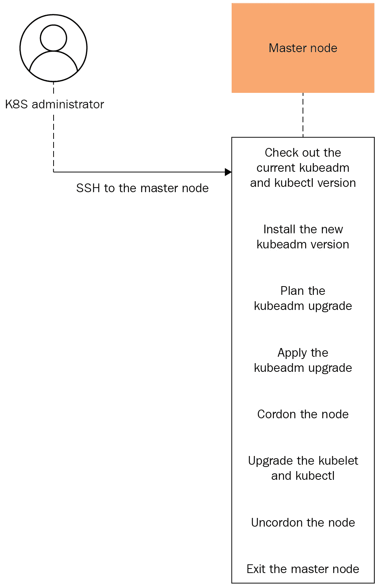

图 3.1 – 主节点升级过程

一旦我们进入主节点，就让我们开始检查当前版本，通过以下命令：

```
   kubeadm version
   kubectl version 
```

从输出中，我们知道我们当前使用的是 Kubernetes 2.23.2：

```
Client Version: version.Info{Major:"1", Minor:"23", GitVersion:"v1.23.2", GitCommit:"e6c093d87ea4cbb530a7b2ae91e54c0842d8308a", GitTreeState:"clean", BuildDate:"2022-02-16T12:38:05Z", GoVersion:"go1.17.7", Compiler:"gc", Platform:"linux/amd64"}
```

让我们通过以下命令查看可用的最新版本：

```
  apt update
  apt-cache madison kubeadm
```

现在我们知道可用的最新版本：

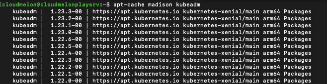

图 3.2 – 可用版本

一旦我们决定了想要升级到哪个版本，就可以开始准备升级过程：

1.  我们将从升级 kubeadm 开始，需要使用以下命令将 1.23.x-00 中的*x*替换为最新的补丁版本，在我们的情况下是 1.23.3：

```
apt-mark unhold kubeadm && \
apt-get update && apt-get install -y kubeadm=1.23.3-00 && \
apt-mark hold kubeadm
```

`apt-mark`命令的输出如下：

```
kubeadm set on hold.
```

1.  现在我们可以使用`kubeadm version`命令检查 kubeadm 的版本，看看它是否是 1.23.3：

```
Client Version: version.Info{Major:"1", Minor:"23", GitVersion:"v1.23.2", GitCommit:"e6c093d87ea4cbb530a7b2ae91e54c0842d8308a", GitTreeState:"clean", BuildDate:"2022-02-16T12:38:05Z", GoVersion:"go1.17.7", Compiler:"gc", Platform:"linux/amd64"}
```

1.  我们使用`kubeadm upgrade plan`命令检查当前集群是否可以升级，以及它可以升级到哪些可用版本：

```
    kubeadm upgrade plan
```

如*图 3.3*所示，我可以将 kubelet 和控制平面组件（如 API 服务器、调度器和控制器管理器）从 1.23.2 升级到 1.23.3：

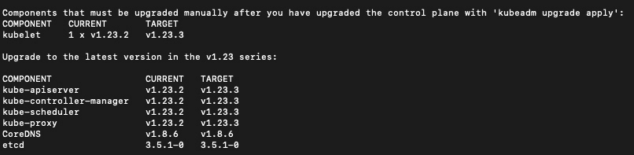

图 3.3 – kubeadm 升级计划

1.  如果我们决定采取行动，将当前集群从 1.23.2 升级到 1.23.3，可以使用以下命令。请注意，在`apply`之后，你只需替换为任何未来的可用版本，升级到你希望的版本：

```
    kubeadm upgrade apply v1.23.3
```

重要提示

为了顺利执行升级操作，我们建议你通过运行`sudo su`命令获取考试中的 root 权限。

在日常升级任务中，你可以使用`sudo`并输入密码来执行此操作。

一旦执行命令，你会看到一条消息，表明升级成功：

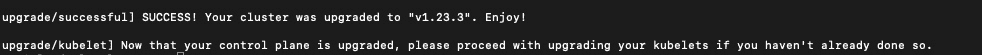

图 3.4 – 控制平面成功升级

1.  然后我们需要隔离节点，因此我们将清理工作负载以准备节点进行维护。我们用以下命令隔离一个名为`cloudmelonplaysrv`的节点：

```
kubectl drain cloudmelonplaysrv --ignore-daemonsets
```

它将显示一堆正在被驱逐的 Pod，意味着这些 Pod 正在从被隔离的工作节点中被移除：

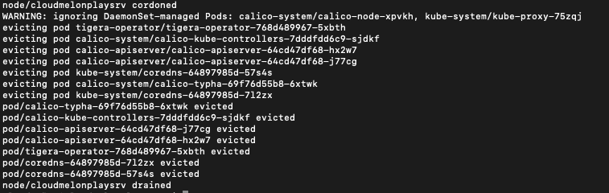

图 3.5 – 在节点上清理工作负载

如果你正在使用`kubectl get no`命令，节点将被标记为`schedulingDisabled`。

1.  我们使用以下命令来升级 kubelet 和 kubectl：

```
apt-mark unhold kubelet kubectl && \
apt-get update && apt-get install -y kubelet=1.23.3-00 kubectl=1.23.3-00 && \
apt-mark hold kubelet kubectl
```

1.  重启 kubelet：

```
sudo systemctl daemon-reload
sudo systemctl restart kubelet
```

1.  现在我们可以解锁该节点，这样正在升级的节点`cloudmelonplaysrv`上的工作负载就可以再次调度：

```
kubectl uncordon cloudmelonplaysrv
```

该命令将返回现在显示为`uncordoned`的节点。

## 升级工作节点

由于工作节点是实际运行工作负载的地方，我们需要逐一升级，然后将相同的操作复制到当前 Kubernetes 集群中的所有其他工作节点上。*图 3.6*描绘了总体的升级工作流：

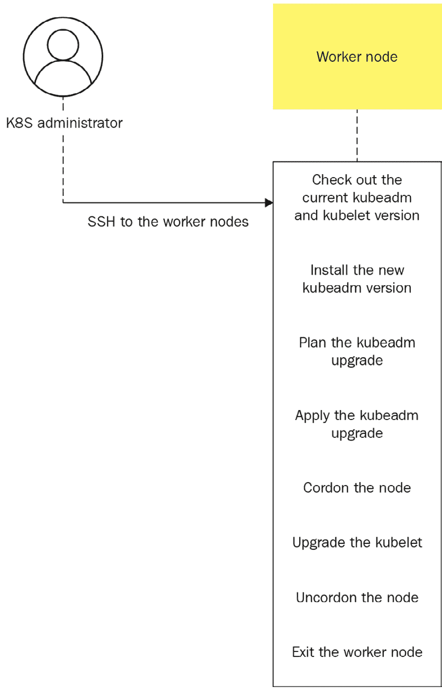

图 3.6 – 在节点上排空工作负载

1.  让我们从使用以下命令将 kubeadm 从 1.23.2 升级到 1.23.3 开始：

```
  apt-mark unhold kubeadm && \
  apt-get update && apt-get install -y kubeadm=1.23.3-00 && \
  apt-mark hold kubeadm
```

1.  对于工作节点，我们升级 kubelet，这也会升级本地 kubelet 配置，使用以下命令：

```
  sudo kubeadm upgrade node
```

1.  同样，我们需要对节点进行 cordon 操作，这样我们就能将工作负载迁移出去，为节点的维护做准备。在这里，我们使用以下命令对一个名为`cloudmelonplayclient`的节点进行 cordon 操作：

```
kubectl drain cloudmelonplayclient --ignore-daemonsets
```

然后，我们可以使用`kubectl get no`命令来检查节点状态。它将标记为`schedulingDisabled`。

1.  我们使用以下命令来升级 kubelet 和 kubectl，就像我们对主节点所做的那样：

```
apt-mark unhold kubelet kubectl && \
apt-get update && apt-get install -y kubelet=1.23.3-00 kubectl=1.23.3-00 && \
apt-mark hold kubelet kubectl
```

1.  重启 kubelet 以使更改生效：

```
sudo systemctl daemon-reload
sudo systemctl restart kubelet
```

1.  最后，我们可以`uncordon`节点，它将使工作负载重新能够调度到名为`cloudmelonplayclient`的节点上。它将返回节点，显示为`uncordoned`状态：

```
kubectl uncordon cloudmelonplayclient
```

我们现在已经完成了工作节点的升级过程。在升级完成后，请确保使用`kubectl get nodes`命令，确保所有节点的状态为`ready`。

# 与 etcd 协作

集群数据存储在 Kubernetes 集群中的一个键值存储 etcd 中。集群数据包括集群状态信息，例如 Pod 状态数据、节点状态数据和配置。由于这些数据对于 Kubernetes 将工作负载编排到期望的状态至关重要，因此合理的做法是定期备份这些数据。

要访问 Kubernetes 集群中的 etcd 集群，我们可以运行以下命令：

```
  kubectl get po -n kube-system
```

这将列出当前在`kube-system`命名空间中运行的所有 Pod：

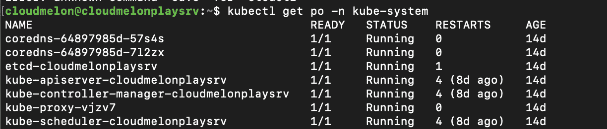

图 3.7 – 检查当前 etcd Pod 状态

在接下来的章节中，我们将更详细地了解 etcd 集群 Pod，并学习所有与实际 CKA 考试中有用的相关信息。

## 探索 ETCD 集群 Pod

要更详细地查看我们当前的 etcd Pod，请使用以下命令：

```
  kubectl describe po <etcd-podname> -n kube-system
```

例如，要获取名为`etcd-cloudmelonplaysrv`的 etcd Pod 的详细信息，命令如下：

```
  kubectl describe po etcd-cloudmelonplaysrv -n kube-system
```

它返回以下输出：

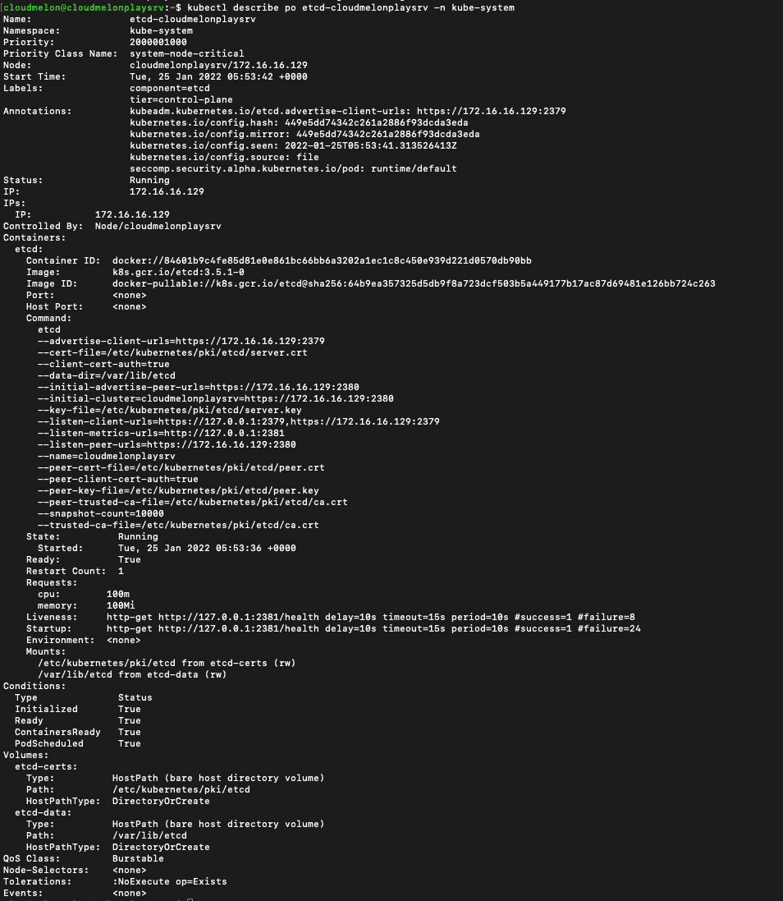

图 3.8 – 检查当前 etcd Pod

在图中，你可以看到关于 etcd 的以下重要信息：

```
      etcd
      --advertise-client-urls=https://172.16.16.129:2379
      --cert-file=/etc/ubernetes/pki/etcd/server.crt
      --client-cert-auth=true
      --data-dir=/var/lib/etcd
      --initial-advertise-peer-urls=https://172.16.16.129:2380
      --initial-cluster=cloudmelonplaysrv=https://172.16.16.129:2380
      --key-file=/etc/ubernetes/pki/etcd/server.key
      --listen-client-urls=https://127.0.0.1:2379,https://172.16.16.129:2379
      --listen-metrics-urls=http://127.0.0.1:2381
      --listen-peer-urls=https://172.16.16.129:2380
      --name=cloudmelonplaysrv
      --peer-cert-file=/etc/ubernetes/pki/etcd/peer.crt
      --peer-client-cert-auth=true
      --peer-key-file=/etc/ubernetes/pki/etcd/peer.key
      --peer-trusted-ca-file=/etc/ubernetes/pki/etcd/ca.crt
      --snapshot-count=10000
      --trusted-ca-file=/etc/ubernetes/pki/etcd/ca.crt
    State:          Running
```

在所有可配置参数中，以下几项在你与 etcd 的日常工作中会非常有用：

+   `--advertise-client-urls`告诉 etcd 接受来自客户端的请求。它接受一个 URL 列表。

+   `--cert-file` 是我们指定客户端服务器 `TLS cert` 文件路径的地方。

+   `--key-file` 是我们指定客户端服务器 `TLS key` 文件路径的地方。

+   `--trusted-ca-file` 是我们指定客户端服务器 `TLS trusted CA cert` 文件路径的地方。

这些是用于通过安全通信验证客户端请求的关键标志。您需要它们来检查 etcd 状态、备份和恢复 etcd 集群。

重要提示

访问 etcd 相当于获得集群中的 root 权限。我们确保身份验证请求仅通过 API 服务器进行。

要了解更多可配置的参数，请访问 [`etcd.io/docs/v3.5/op-guide/configuration/`](https://etcd.io/docs/v3.5/op-guide/configuration/)。

## 列出 etcd 集群成员

使用从 `kubectl describe pod` 命令获取的信息，我们可以列出 etcd 集群的成员：

```
   kubectl exec etcd-cloudmelonplaysrv -n kube-system -- sh -c "ETCDCTL_API=3 etcdctl member list --endpoints=https://127.0.0.1:2379 --cacert=/etc/kubernetes/pki/etcd/ca.crt --cert=/etc/kubernetes/pki/etcd/server.crt --key=/etc/kubernetes/pki/etcd/server.key"
```

它返回关于成员的信息。在我们的例子中，由于我们只使用一个主节点，因此只会有一个结果。我们的命令将如下所示：

```
8d1f17827821818f, started, cloudmelonplaysrv, https://172.16.16.129:2380, https://172.16.16.129:2379, false
```

输出描述了诸如 `ID` 和 `Status` 等列，这些列显示了 etcd 集群的状态、集群名称、对等节点和客户端地址。

您可以使用 `--write-out=table` 自动将输出以表格形式呈现。它将看起来像这样：

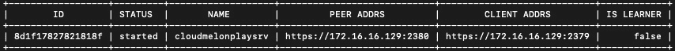

图 3.9 – 当前的 etcd 成员列表

请注意，客户端地址与 `kubectl describe pod` 输出中的 `--advertise-client-urls` URL 的值相同。

## 检查 etcd 集群状态

您可以使用以下命令来检查 etcd 集群状态并以表格形式输出结果。请注意，在使用正确的 etcdctl API 版本时，以下示例中我们使用的是 API 版本 3：

```
ETCDCTL_API=3 etcdctl endpoint status
```

以下命令用于从 Kubernetes 集群访问 etcd pod，并查看多节点 etcd 集群中 etcd pod 的状态：

```
  kubectl -n kube-system exec <etcd-podname> -- sh -c "ETCDCTL_API=3 etcdctl endpoint status --write-out=table --endpoints=https://<IP1>:2379,https://<IP2>:2379,https://<IP3>:2379 --cacert=/etc/kubernetes/pki/etcd/ca.crt --cert=/etc/kubernetes/pki/etcd/server.crt --key=/etc/kubernetes/pki/etcd/server.key"
```

您可以在以下命令中使用从`etcdctl member list`获取的信息：

+   `ETCDCTL_API` 是 etcdctl 的版本。

+   `--endpoints` 是您的 etcd 成员的客户端地址，如果您有多个主节点的话。

然而，在本章中，我们展示的是一个单一的主节点，并且它只包含一个 etcd 成员。因此，从 Kubernetes 集群访问名为 `etcd-cloudmelonplaysrv` 的 etcd pod 并查看其状态的命令将如下所示：

```
  kubectl -n kube-system exec etcd-cloudmelonplaysrv -- sh -c "ETCDCTL_API=3 etcdctl endpoint status --endpoints=https://172.16.16.129:2379 --cacert=/etc/kubernetes/pki/etcd/ca.crt --cert=/etc/kubernetes/pki/etcd/server.crt --key=/etc/kubernetes/pki/etcd/server.key --write-out=table"
```

输出将如下所示：

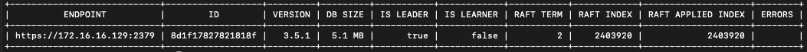

图 3.10 – 当前的 etcd 成员列表

从 `kubectl describe pod <etcd-podname>` 的输出中，我们还可以看到我们有两个 `listen client` IP：

```
  --listen-client-urls=https://127.0.0.1:2379,https://172.16.16.129:2379
```

当我们检查 Kubernetes 集群内部的 etcd 集群状态时，我们还可以使用内部端点地址`https://127.0.0.1:2379`来检查 etcd 集群状态。可以使用以下命令访问名为`etcd-cloudmelonplaysrv`的 etcd pod，并使用内部端点检查该 pod 的状态：

```
  kubectl -n kube-system exec etcd-cloudmelonplaysrv -- sh -c "ETCDCTL_API=3 etcdctl endpoint status --endpoints=https://127.0.0.1:2379 --cacert=/etc/kubernetes/pki/etcd/ca.crt --cert=/etc/kubernetes/pki/etcd/server.crt --key=/etc/kubernetes/pki/etcd/server.key --write-out=table"
```

它会返回关于 etcd 集群的信息：

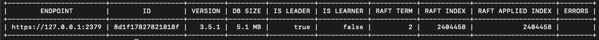

图 3.11 – 当前的 etcd 成员列表

在接下来的章节中，我们将探讨如何从 Kubernetes 集群外部的客户端与 etcd 集群交互。

## 安装 etcd

要在 Kubernetes 集群外部访问 etcd，您需要安装 etcdctl。您可以按照本节中的说明进行操作。但请注意，这不属于 CKA 考试的一部分。

要开始操作，我们需要获取 etcd 二进制文件：

```
 wget https://github.com/etcd-io/etcd/releases/download/v3.4.18/etcd-v3.4.18-linux-amd64.tar.gz
tar xvf etcd-v3.4.18-linux-amd64.tar.gz
sudo mv etcd-v3.4.18-linux-amd64/etcd* /usr/local/bin
```

安装完成后，您可以使用以下命令验证当前版本：

```
    etcdctl version
```

命令返回当前的 etcdctl 客户端版本和 API 版本，格式如下：

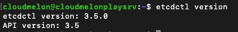

图 3.12 – 检查 Kubernetes 集群外部的当前 etcdctl 版本

同样，您可以使用以下命令检查 Kubernetes 集群中的 kubectl 版本。当您使用`kubectl exec`命令时，它会直接在名为`etcd-cloudmelonplaysrv`的 pod 上执行，该 pod 位于`kube-system`命名空间中。我们可以使用以下命令执行`etcdctl version` Bash 命令，以获取 etcd 存储的版本：

```
    kubectl exec etcd-cloudmelonplaysrv -n kube-system -- sh -c "etcdctl version"
```

返回的结果类似于 etcdctl 客户端版本和 API 版本：

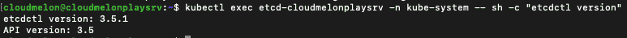

图 3.13 – 检查 Kubernetes 集群中的当前 etcdctl 版本

同样，一旦安装了 etcdctl，您可以通过运行以下命令检查 etcd 存储状态，并获取端点状态：

```
    kubectl exec etcd-cloudmelonplaysrv -n kube-system -- sh -c " etcdctl --write-out=table --endpoints=$ENDPOINTS endpoint status "
If you want to make sure the etcd store is healthy, using the following command with the endpoint from the Previous command : 
   kubectl exec etcd-cloudmelonplaysrv -n kube-system -- sh -c " etcdctl --endpoints=$ENDPOINTS endpoint health "
```

## 备份 etcd

根据我们在前面章节中做的所有准备工作，我们可以将备份 etcd 过程概括如下：

1.  SSH 进入 etcd 集群节点。它可以是一个独立的节点，也可以与主节点相同。在 CKA 考试中，您很可能会从主节点开始，在该节点上安装了 etcdctl，因此这一步是可选的。

1.  检查 etcd 状态。您可以通过`kubectl describe <etcd-podname>`命令获取必要的信息。

1.  执行 etcd 备份。

1.  退出主节点。在实际的 CKA 考试中，这一步可能不是必需的。

一般过程如下图所示：

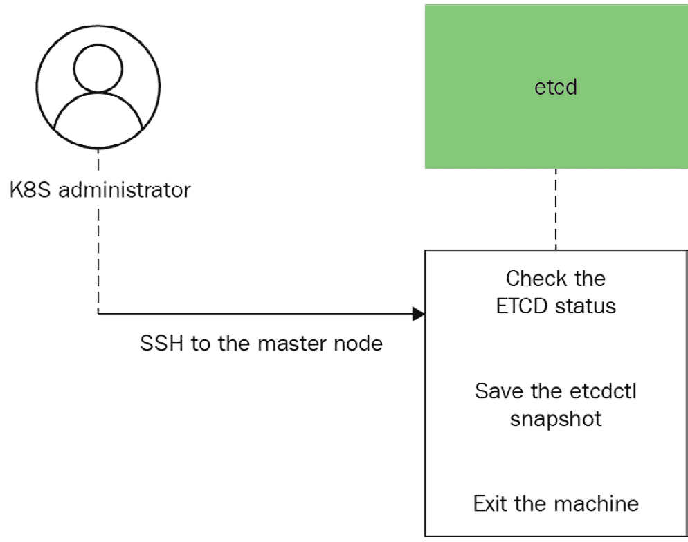

图 3.14 – 备份 etcd 过程

现在让我们看看备份 etcd 的详细过程：

1.  如果你需要连接到主节点或 etcd 集群节点，可以使用`ssh master-0`命令或`ssh username@<nodeIP>`命令。请注意，这一步是可选的。以下是一个名为`packtuser`的用户使用`ssh`连接到 IP 地址为`10.10.11.20`的节点的示例：

```
 ssh packtuser@10.10.11.20
```

1.  使用以下命令从集群外部检查 etcd 状态：

```
sudo ETCDCTL_API=3 etcdctl endpoint status --endpoints=https://172.16.16.129:2379 --cacert=/etc/kubernetes/pki/etcd/ca.crt --cert=/etc/kubernetes/pki/etcd/server.crt --key=/etc/kubernetes/pki/etcd/server.key --write-out=table
```

返回的输出将如下所示：

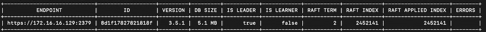

图 3.15 – 从集群外部检查 etcd 状态

1.  使用`etcdctl snapshot save`命令备份 etcd 集群。它将像这样：

```
sudo ETCDCTL_API=3 etcdctl --endpoints $ENDPOINT snapshot save snapshotdb
```

由于你是从 Kubernetes 集群外部进行备份操作，你需要从 API 服务器进行身份验证并使用安全通信。为此，你可以使用以下命令：

```
sudo ETCDCTL_API=3 etcdctl snapshot save snapshotdb
--endpoints=https://172.16.16.129:2379
--cacert=/etc/kubernetes/pki/etcd/ca.crt --cert=/etc/kubernetes/pki/etcd/server.crt --key=/etc/kubernetes/pki/etcd/server.key
```

返回的输出显示你已成功备份了 etcd 存储：

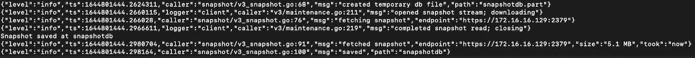

图 3.16 – 备份 etcd 存储

1.  通过以下命令验证快照：

```
sudo ETCDCTL_API=3 etcdctl snapshot status snapshotdb --endpoints=https://172.16.16.129:2379 --cacert=/etc/kubernetes/pki/etcd/ca.crt --cert=/etc/kubernetes/pki/etcd/server.crt --key=/etc/kubernetes/pki/etcd/server.key --write-out=table
```

以下图展示了 etcd 集群的状态：

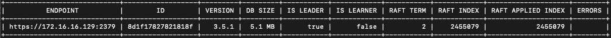

图 3.17 – 使用快照备份检查 etcd 存储

## 恢复 etcd

要恢复 etcd 集群，你可以按照*图 3.18*中展示的过程进行操作。请注意，如果你有任何 API 服务器实例正在运行，你需要在执行恢复操作之前停止它们。etcd 恢复后，你可以重新启动 API 服务器实例：

1.  SSH 连接到 etcd 集群节点。

1.  检查 etcd 状态。

1.  恢复 etcd 备份。

1.  退出主节点：

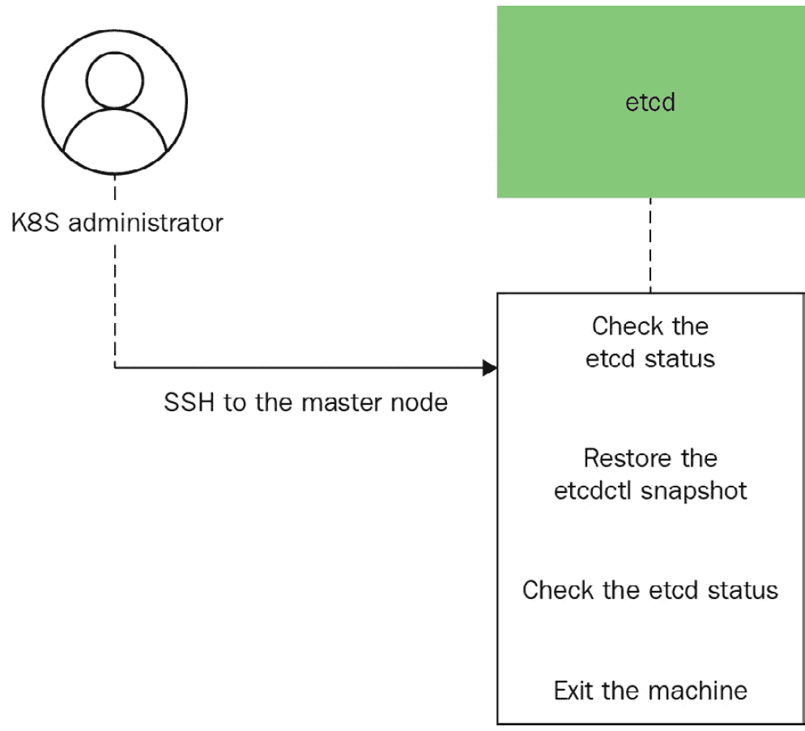

图 3.18 – 恢复 etcd 过程

一旦你有了快照，你可以使用以下命令从之前的备份操作中恢复 etcd：

```
sudo ETCDCTL_API=3 etcdctl --endpoints 172.16.16.129:2379 snapshot restore snapshotdb
```

返回的输出显示 etcd 存储已成功恢复：

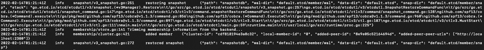

图 3.19 – 使用现有快照恢复的 etcd 存储

你现在已经完成了 etcd 恢复过程。

请注意，如果你想从不同的补丁版本恢复 etcd 集群，可以使用此方法。定期备份 etcd 非常重要，然后执行恢复操作以从失败的集群中恢复集群数据。要了解更多关于 Kubernetes 的 etcd 集群备份和恢复，请查看[`kubernetes.io/docs/tasks/administer-cluster/configure-upgrade-etcd/`](https://kubernetes.io/docs/tasks/administer-cluster/configure-upgrade-etcd/)。

# 总结

本章涵盖了 Kubernetes 管理员最常见的工作之一 - 维护和升级 Kubernetes 集群。与集群安装类似，这也是 CKA 考试中最耗时的任务之一。再次强调，熟能生巧。*第二章**，安装和配置 Kubernetes 集群*中的 HA 拓扑将帮助您理解需要升级的内容以及如何执行。如果需要，请回顾*第一章**，Kubernetes 概述*，确保对 Kubernetes 组件有充分的理解。这样，您将知道如何以及需要什么来升级控制平面和工作节点。

与集群升级相比，备份和恢复 etcd 在 CKA 考试中是价值最高的问题之一，因为回答简单且分数高。彻底练习本章所学内容将帮助您在考试中克服任何挑战。

在下一章中，我们将讨论应用程序调度和生命周期管理，我们将重新审视一些重要的 Kubernetes 对象和概念，并探讨它们在 CKA 考试和实际生活中的作用。请继续关注！

# 模拟 CKA 场景实践测试

您有两台虚拟机，`master-0` 和 `worker-0`。请完成以下模拟场景：

## **场景 1**

SSH 到 `master-0` 节点，检查当前 kubeadm 版本，并升级到最新的 kubeadm 版本。检查当前 kubectl 版本，并升级到最新的 kubectl 版本。

## **场景 2**

SSH 到 `worker-0` 节点，查看当前 kubeadm 版本，并升级到最新的 kubeadm 版本。查看当前 kubelet 版本，并升级到最新的 kubelet 版本。

## **场景 3**

SSH 到 `master-0` 节点并备份 etcd 存储。

## **场景 4**

SSH 到 `master-0` 节点并将 etcd 存储恢复到之前的备份。

您可以在本书的*附录**- 模拟 CKA 场景实践测试解决方案*中找到所有场景的解决方法。

# 常见问题解答

1.  *我在哪里可以找到每个发布版本的 Kubernetes 组件的兼容版本信息？*

前往 Kubernetes 官方文档了解版本偏差策略：[`kubernetes.io/releases/version-skew-policy/`](https://kubernetes.io/releases/version-skew-policy/)。

1.  *我在哪里可以了解 etcd 存储的最新发展？*

前往 [`etcd.io/`](https://etcd.io/)，您将找到 etcd 存储的最新发展。有关守护程序和如何开始使用 etcd，请参阅官方文档：[`etcd.io/docs/`](https://etcd.io/docs/)。

1.  *升级 Kubernetes 集群的推荐官方 Kubernetes 文章是什么？*

我建议将文章*《升级 kubeadm》*添加到书签中，在其中你将找到大部分关键命令和过程：[`kubernetes.io/docs/tasks/administer-cluster/kubeadm/kubeadm-upgrade/`](https://kubernetes.io/docs/tasks/administer-cluster/kubeadm/kubeadm-upgrade/)。

1.  *备份和恢复 etcd 的官方推荐 Kubernetes 文章是什么？*

我建议将文章*《为 Kubernetes 操作 etcd 集群》*添加到书签中，在其中你将找到所有关于 etcd 备份和恢复的关键命令：[`kubernetes.io/docs/tasks/administer-cluster/configure-upgrade-etcd/`](https://kubernetes.io/docs/tasks/administer-cluster/configure-upgrade-etcd/)。

# 第二部分：Kubernetes 管理

本部分描述了如何管理部署在 Kubernetes 上的工作负载，以及如何管理 Kubernetes 集群的安全性和网络，以满足企业需求。

本书的这一部分包括以下章节：

+   *第四章**, 应用调度与生命周期管理*

+   *第五章**, 揭开 Kubernetes 存储的面纱*

+   *第六章**, Kubernetes 安全性*

+   *第七章**, 揭开 Kubernetes 网络的面纱*
