# 第四章：应用程序调度和生命周期管理

本章描述了如何使用 Kubernetes 部署来部署 Pods、扩展 Pods、执行滚动更新和回滚、进行资源管理，并使用 ConfigMaps 配置 Pods，使用 `kubectl` 命令和 YAML 定义。本章涵盖了 CKA 考试内容的 15%。

本章将覆盖以下主要内容：

+   Kubernetes 工作负载基础

+   部署和管理应用程序

+   扩展应用程序

+   执行滚动更新和回滚

+   资源管理

+   工作负载调度

+   配置应用程序

# 技术要求

为了开始，我们需要确保你的本地机器满足以下技术要求：

+   兼容的 Linux 主机——我们推荐基于 Debian 的 Linux 发行版，如 Ubuntu 18.04 或更高版本

+   确保你的主机至少具有 2 GB 内存、2 个 CPU 核心以及约 20 GB 的空闲磁盘空间

# Kubernetes 工作负载基础

Kubernetes 协调你的工作负载以实现期望的状态——一个运行在 Kubernetes 上的容器化工作负载，包括无状态、有状态和数据处理应用程序。关于云原生应用程序，有一篇有趣的白皮书深入介绍了云原生应用程序的概念和设计模式，如果你感兴趣，可以在这里查看：[`www.redhat.com/en/resources/cloud-native-container-design-whitepaper`](https://www.redhat.com/en/resources/cloud-native-container-design-whitepaper)。

任何在 Kubernetes 集群中运行的容器化工作负载的基本构建模块称为 Kubernetes API 原语或 Kubernetes 对象。它们是 Kubernetes 中定义的 API 资源类型，包括 Pods、ReplicaSets、DaemonSets、StatefulSets、Job 和 CronJob 对象，以及在*第一章*中提到的 Deployments，*Kubernetes 概述*。

CKA 考试涵盖了一些主要的 Kubernetes 对象，如 Pods、Deployments、ReplicaSets 和 DaemonSets，在使用 Kubernetes 集群时，我们将在本章的下一部分深入探讨这些内容。

在开始实践之前，请确保你的本地机器符合所需的技术要求。

## 命令式管理与声明式管理

在 Kubernetes 中，有几种方式可以与 API 服务器进行通信——主要可以归类为命令式管理或声明式管理。你将需要同时使用 `kubectl` 和 YAML 定义来管理 Kubernetes 对象。`kubectl` 工具支持所有管理 Kubernetes 对象的管理技术，因为 Kubernetes 旨在作为期望状态的管理器。执行 `kubectl` 命令后，结果将当前运行在 Kubernetes 中的工作负载从实际状态转移到期望状态，该期望状态是在命令行参数或 YAML 定义的规范中定义的。

时间管理是 CKA 考试成功的关键。熟悉 `kubectl` 命令将帮助你在新部署时节省大量时间。对 YAML 定义的良好理解将帮助你快速更新配置。

## 理解 Pod

Kubernetes 中最小的可部署单元是 Pod。Pod 包含实际的应用工作负载 – 它可以是一个或多个容器。Kubernetes 中的 Pod 有一个定义的生命周期。我们将覆盖以下关于 Pod 的主题：

+   理解 Pod

+   理解 Pod 的健康探测

+   理解多容器 Pod

+   理解初始化容器

+   理解静态 Pod

让我们先看一下 Pod。你可以使用如下命令创建一个 Pod：

```
kubectl run <pod-name> --image=<image-name:image-tag>
```

这是运行名为 `ngin-pod` 的 Pod 示例，镜像为 `nginx`，镜像标签为 `alpine`：

```
kubectl run nginx-pod --image=nginx:alpine
```

你将看到输出返回为`created`，如下所示，表示你的 Pod 已经成功创建：

```
pod/nginx-pod created
```

在此过程中，你将看到 Pod 具有 `ContainerCreating` 状态，表示容器正在创建，你可以使用 `kubectl` 的描述命令查看发生了什么。我们可以使用以下命令检查 Pod 的当前状态：

```
kubectl describe pod nginx-pod
```

在 `describe` 命令的底部，你将看到事件 – 这对于你检查部署过程中是否出现问题非常有帮助。我们将在*第八章*中进一步探讨 Pod 故障排除，*监控和日志 Kubernetes 集群与应用程序*：

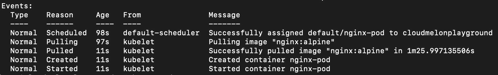

图 4.1 – Pod 事件

相同的 Pod 也可以通过 YAML 定义，如下所示，结果相同：

```
apiVersion: v1
kind: Pod
metadata:
  name: nginx
spec:
  containers:
  - name: nginx
    image: nginx:alpine
    ports:
    - containerPort: 80
```

你可以使用以下命令来部署一个 YAML 定义：

```
kubectl apply -f <your-spec>.yaml
```

类似地，我们可以通过一个命令运行 BusyBox 镜像，如下所示：

```
kubectl run busybox --rm -it --image=busybox /bin/sh
```

你还可以部署一个 `nginx` 镜像，然后使用 `-o yaml` 标志导出 YAML 定义：

```
kubectl run nginx --image=nginx --dry-run -o yaml > pod-sample.yaml
```

运行此命令后，一个示例的 `yaml` 文件将被导出到本地计算机 – 如果需要，你可以编辑这个 `yaml` 文件进行本地修改。

### 理解存活性、就绪性和启动探针

为了进一步探讨 Pod 的健康状态，我们来谈谈健康探针。探针让你了解 Kubernetes 如何判断容器的状态。我们来逐一看看每种探针：

+   **存活性探针**表示容器是否正常运行，因为它们决定了集群何时自动重启容器。

+   **就绪性探针**表示容器是否准备好接受请求。

+   `kubelet` 在它们启动之前会进行初始化。一旦配置完成，它们会禁用存活性检查和就绪性检查，直到容器启动完成。

我们将在 *第八章* 中更详细地了解这些内容，*《Kubernetes 集群和应用程序的监控与日志记录》*。你可以通过以下链接找到更多关于健康检查探针的细节：[`kubernetes.io/docs/tasks/configure-pod-container/configure-liveness-readiness-startup-probes/`](https://kubernetes.io/docs/tasks/configure-pod-container/configure-liveness-readiness-startup-probes/)。

### 理解多容器 Pod

多容器 Pod 就是具有多个容器一起作为一个单元工作的 Pod。当多个容器驻留在一个 Pod 中时，一个容器与另一个容器的交互有以下两种方式：

+   **共享网络**：当两个容器在同一主机上运行并且它们在同一个 Pod 中时，它们可以通过简单地使用 *localhost* 互相访问。即使容器没有对外暴露端口，Pod 内的所有监听端口也可以被其他容器访问。

*图 4.2* 显示了同一 Pod 中多个容器如何共享本地网络：

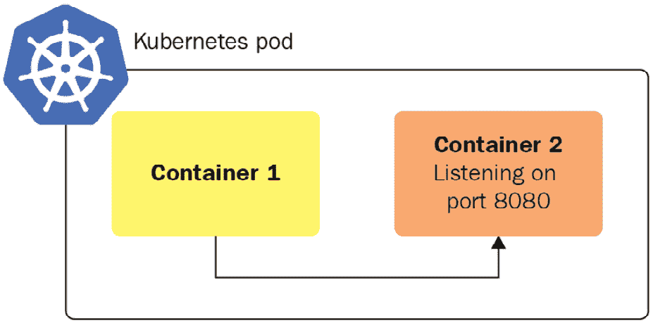

图 4.2 – 多容器 Pod 的共享网络

+   **共享存储卷**：我们可以将相同的存储卷挂载到两个不同的容器，以便它们可以共同访问相同的数据 —— 一个容器可以将数据写入存储卷，另一个容器则可以从同一存储卷读取数据。有些存储卷甚至允许并发读写。我们将在 *第五章* 中深入探讨多容器 Pod 的存储工作原理，*《揭开 Kubernetes 存储的神秘面纱》*。

*图 4.3* 显示了同一 Pod 中多个容器如何共享本地存储：

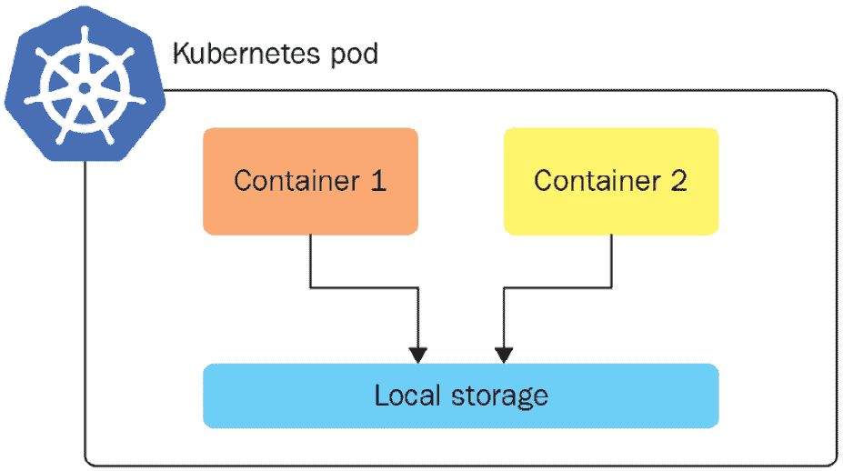

图 4.3 – 多容器 Pod 的共享存储卷

以下是如何在 Pod 中创建多个容器的示例：

```
apiVersion: v1
kind: Pod
metadata:
  name: multi-app-pod
  labels:
      app: multi-app
spec:
  containers:
  - name: nginx
    image: nginx
    ports:
    - containerPort: 80
  - name: busybox-sidecar
    image: busybox
    command: ['sh', '-c', 'while true; do sleep 3600; done;']
```

一般来说，容器与 Pod 之间最好是保持一对一的关系，这符合通过保持每个模块独立来构建微服务的原则。现实世界有时比看起来更复杂，让我们来看看多容器 Pod 的情况。

### 理解初始化容器

初始化容器是在 Pod 中配置的，用于在容器主机启动之前执行。它在 `initContainers` 部分中指定，如以下示例所示。你还可以配置多个初始化容器，这样每个初始化容器将按顺序逐个完成：

```
apiVersion: v1
kind: Pod
metadata:
  name: melon-pod
  labels:
    app: melonapp
spec:
  containers:
  - name: melonapp-container
    image: busybox:latest
    command: ['sh', '-c', 'echo The melonapp is running! && sleep 3600']
  initContainers:
  - name: init-melonservice
    image: busybox:latest
    command: ['sh', '-c', 'until nslookup melonservice; do echo waiting for melonservice; sleep 2; done;']
  - name: init-melondb
    image: busybox:latest
    command: ['sh', '-c', 'until nslookup melondb; do echo waiting for melondb; sleep 2; done;']
```

如果任何初始化容器未能完成，Kubernetes 会不断重启 Pod，直到初始化容器成功。要了解更多关于初始化容器的信息，请访问以下链接：[`kubernetes.io/docs/concepts/workloads/pods/init-containers/`](https://kubernetes.io/docs/concepts/workloads/pods/init-containers/)。

### 理解静态 Pod

作为工作节点的“队长”，`kubelet` 代理可以独立管理一个节点，并且可以创建 pods。由 `kubelet` 守护进程直接管理并绑定到特定节点的 pod 称为静态 pod。与由 Kubernetes 主节点管理的 pod 相对，静态 pod 由 `kubelet` 代理监视，并且在失败时会重启。

配置 `kubelet` 使其读取 pod 定义文件的方法是将 YAML 规范添加到以下目录，该目录存储静态 pod 信息：

```
 /etc/kubernetes/manifests
```

`kubelet` 会定期检查该目录。此路径可以在 `kubelet.service` 中进行配置。

### 理解 Job 和 CronJob 对象

`Completed` 状态。

Jobs 可用于可靠地执行工作负载，直到其完成。Job 将创建一个或多个 pod。当 Job 完成时，容器将退出，pod 将进入 `Completed` 状态。Jobs 的一个典型使用场景是当我们想要运行特定的工作负载，并确保它只运行一次并成功执行时。

1.  你可以使用 YAML 描述来创建一个 Job：

    ```
    apiVersion: batch/v1
    kind: Job
    metadata:
      name: pi
    spec:
      template:
        spec:
          containers:
          - name: pi
            image: perl
            command: ["perl",  "-Mbignum=bpi", "-wle", "print bpi(2000)"]
          restartPolicy: Never
      backoffLimit: 4
    ```

`backoffLimit` 参数表示如果失败 `4` 次，这就是限制。所有的 Job 在底层创建 pod 时都是一样的。虽然正常的 pod 会持续运行，但当 Job 完成时，它会进入 `Completed` 状态。这意味着容器不再运行，所以 pod 仍然存在，但容器已经完成。

1.  你可以使用以下命令部署 YAML 定义：

    ```
    kubectl apply -f melon-job.yaml
    ```

1.  你可以运行以下命令检查 Job 的状态：

    ```
    kubectl get job
    ```

1.  当 Job 仍在运行时，你可以看到 `Running` 状态。当 Job 完成时，你可以看到它是完成状态，以下是一个例子：

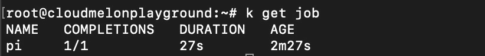

图 4.4 – Job 已完成

**CronJobs** 基于 Job 的能力，通过允许用户按计划执行 Jobs 来增加价值。用户可以使用 cron 表达式根据需求定义特定的计划。以下是 CronJob YAML 定义的示例：

```
apiVersion: batch/v1
kind: CronJob
metadata:
 name: hello
spec:
 schedule: "*/1 * * * *"
 jobTemplate:
   spec:
     template:
       spec:
         containers:
         - name: hello
           image: busybox
           args:
           - /bin/sh
           - -c
           - date; echo Hello from the Kubernetes cluster
         restartPolicy: OnFailure
```

1.  你可以使用以下命令部署 YAML 定义：

    ```
    kubectl apply -f melon-cronjob.yaml
    ```

你可以使用以下命令检查 cron 作业的状态：

```
kubectl get cronjob
```

你将获得如下输出：

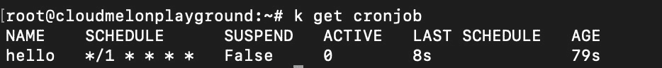

图 4.5 – cron 作业显示为已完成

这个 cron 作业创建了几个名为 `hello` 的 pod，因此我们将使用以下命令检查 Job 的日志：

```
kubectl get pods | grep hello
```

你将获得如下输出：

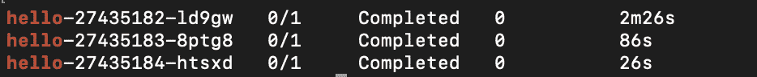

图 4.6 – 完成的 cron 作业 pod

我们可以使用以下命令检查这些 pod 的日志：

```
kubectl logs hello-xxxx
```

我们可以看到 cron 作业已经执行完成：

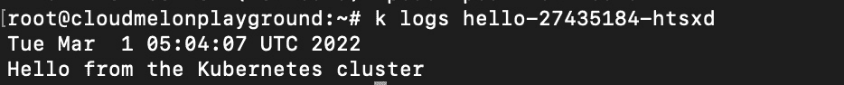

图 4.7 – 显示 cron 作业如何完成的日志

如果你想删除 cron 作业，可以使用以下命令：

```
kubectl delete cronjobs hello
```

然后，您将看到以下输出，表示您的定时任务已被删除：

```
cronjob.batch "hello" deleted
```

CronJobs 已在 Kubernetes v1.21 中提升为正式功能。您可以在这里找到一篇关于使用 CronJob 执行自动化任务的精彩文章：[`kubernetes.io/docs/tasks/job/automated-tasks-with-cron-jobs`](https://kubernetes.io/docs/tasks/job/automated-tasks-with-cron-jobs)。

# 部署和管理应用程序

本章的以下部分将通过具体的实践练习，带您了解您在实际 CKA 考试中会遇到的场景，包括如何部署和扩展应用程序、执行滚动更新和回滚、管理和治理这些应用程序的资源消耗，以及如何配置它们。

## 部署应用程序

部署应用程序可以通过多种方式实现，例如通过 `kubectl` 或 YAML 定义来部署一个 pod，就像我们在本章的 *Kubernetes 工作负载基础* 部分中所做的那样。现在，我们将深入了解使用 Deployments 的更有效方法。本节将介绍如何部署和扩展应用程序。

### Deployments

Deployment 是定义期望状态部署的便捷方式——它为我们提供了一种更好的方式来通过滚动更新无缝升级基础实例、撤销更改以及根据需要暂停和恢复更改。例如，像部署具有特定副本数的 ReplicaSet 这样的操作可以轻松实现滚动发布和回滚，更加高效。下图展示了 Deployment 的概念图：

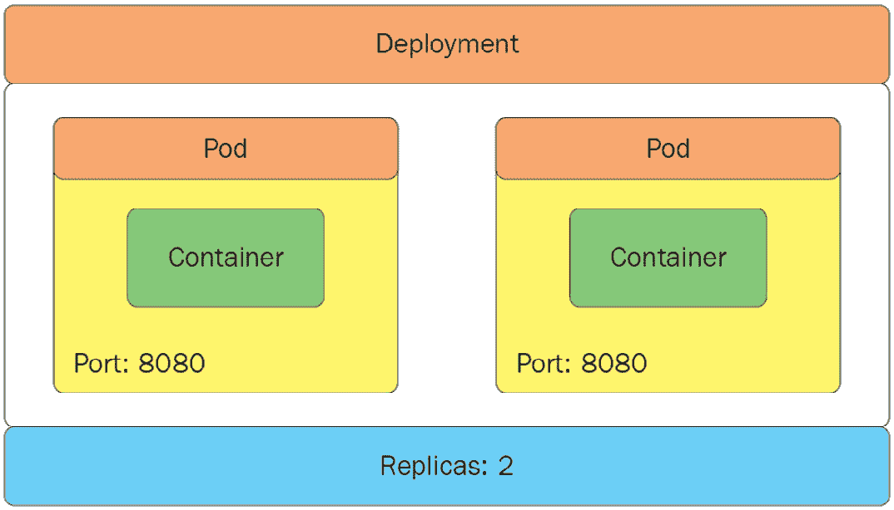

图 4.8 – 一个 Deployment

Deployments 提供了一种定义副本 pod 所需状态的方法。您可以使用如下的 YAML 定义来定义一个 Deployment：

```
apiVersion: apps/v1
kind: Deployment
metadata:
  name: nginx-deployment
  labels:
    app: nginx
spec:
  replicas: 3
  selector:
    matchLabels:
      app: nginx
  template:
    metadata:
      labels:
        app: nginx
    spec:
      containers:
      - name: nginx
        image: nginx:latest
        ports:
        - containerPort: 80
```

以下属性对于帮助您理解前面的 YAML 定义非常重要：

+   `spec.replicas` 给出了副本 pod 的数量

+   `spec.template` 是模板 pod 描述符，用于定义将要创建的 pod

+   `spec.selector` 是将管理所有标签与此选择器匹配的 pod 的部署

我们可以使用以下 `kubectl` 命令来创建一个 Deployment：

```
kubectl create deployment kubeserve --image=nginx:latest
```

运行上述命令后，您将得到以下输出：

```
deployment.apps/kubeserve created
```

您可以使用 `kubectl get deploy` 查询当前命名空间中的所有 Deployments，如下所示：

```
kubectl get deployments
```

您将在输出中看到以下 Deployment 状态：

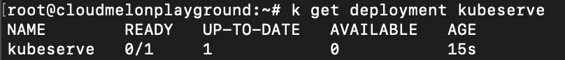

图 4.9 – 使用 kubectl 获取 Deployments

如果您知道 Deployment 的名称，可以使用以下命令来获取该 Deployment：

```
kubectl get deployment kubeserve
```

您将看到以下输出：

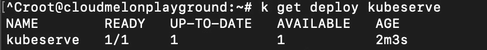

图 4.10 – 使用 kubectl 按名称获取 Deployment

以下命令允许您获取 Deployment 的详细信息：

```
kubectl describe deployment kubeserve
```

此命令将帮助你了解 Deployment 中的配置，你将看到以下输出：

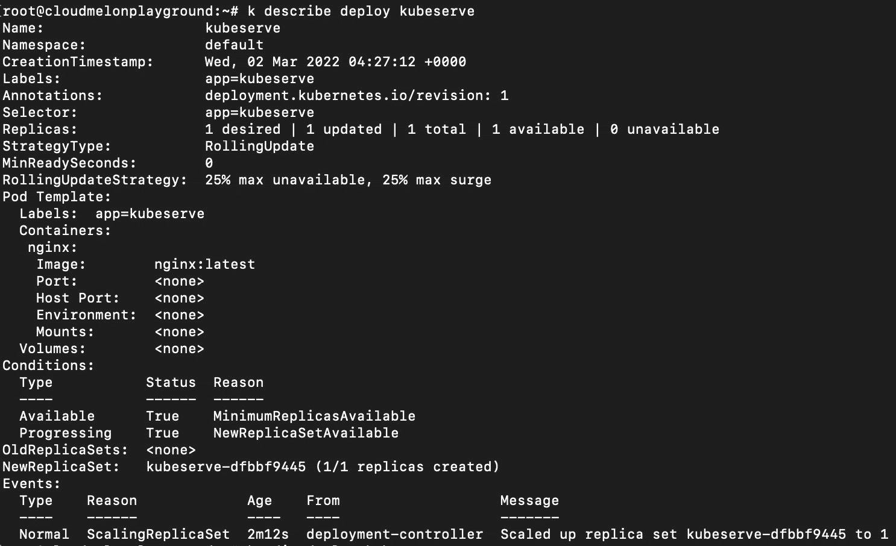

图 4.11 – kubectl 描述 Deployment

以下命令允许你进行 Deployment 的实时编辑：

```
kubectl edit deployment kubeserve
```

上述命令是一个非常有用的命令，它允许你*实时编辑* Deployment。以下是示例输出，你可以进行实时编辑——它的工作方式类似于你使用 `vim` 编辑器创建 pod 时的操作。你可以在这里实时编辑 Deployment，然后使用 `wq!` 保存并退出：

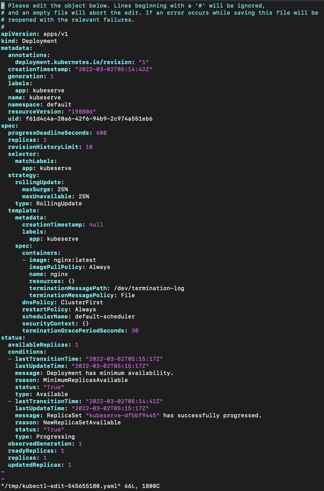

图 4.12 – kubectl 描述 Deployment 进行实时编辑

然后，如果你不再需要 Deployment，可以使用 `kubectl delete` 命令删除它：

```
kubectl delete deployment melon-serve
```

以下输出显示 Deployment 已成功删除：

```
deployment.apps "kubeserve" deleted
```

随着 Deployment 的删除，在该 Deployment 中定义的对象也被删除，因为它们共享相同的生命周期。在我们的第三个示例中，部署的`nginx` pod 被删除，因为我们删除了 `kubeserve` Deployment。

学习 Deployment 使你能够更有效地管理应用程序，更轻松地将其作为一个整体进行更新，并将其回滚至之前的版本。在下一节中，我们将了解滚动更新和回滚。

# 执行滚动更新和回滚

滚动更新提供了一种更加高效、有效的方式来更新 Deployment 至较新版本。通过这种方式，你可以逐步更新 Kubernetes 对象，如副本和 pod，几乎实现零停机时间。简而言之，你可以考虑使用`kubectl set image`命令，或者直接更新 YAML 清单文件。在本节中，我们将介绍`kubectl set image`，因为它在实际的 CKA 考试中非常有效且便捷。

## 使用 kubectl 进行滚动更新

在这里，我们将介绍使用 `kubectl` 执行滚动更新的步骤：

1.  你可以使用以下命令启动一个新的 Deployment，`kubeserve`：

    ```
    kubectl create deployment kubeserve --image=nginx:latest
    ```

1.  你可以使用`kubectl`按照以下方式更新容器镜像：

    ```
    kubectl set image deployment/kubeserve nginx=nginx:1.18.0 --record
    ```

重要说明

`--record flag` 用于记录更新的信息，以便以后可以回滚。你可以使用`--record flag`或者`--record=true flag`。

使用上述命令后，你将看到以下输出：

```
deployment.apps/kubeserve image updated
```

1.  你可以使用 `kubectl describe` 命令通过输入以下命令来再次检查容器镜像是否已成功更新：

    ```
    kubectl describe deploy kubeserve
    ```

你的输出应该类似于 *图 4.14*，其中你可以看到镜像已设置为`nginx:1.18.0`：

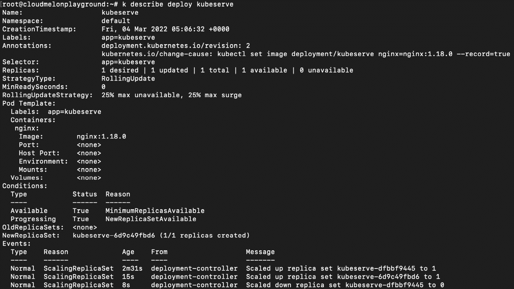

图 4.13 – kubectl 描述更新镜像后的 kubeserve

`kubectl describe deploy` 命令在我们尝试查看关键信息时非常有用，比如容器镜像、端口和与部署相关的事件。在实际的 CKA 考试中也是如此——确保你掌握此命令的快捷方式 `k describe deploy`，这将帮助你在考试中更加高效地工作。

## 回滚

回滚使我们能够恢复到之前的状态，而部署让这一切变得非常简单：

1.  如果需要执行回滚，你可以使用以下 `kubectl rollout` 命令来快速恢复：

    ```
    kubectl rollout undo deployments kubeserve
    ```

你的输出应如下所示：

```
deployment.apps/kubeserve rolled back
```

1.  现在，如果你使用 `kubectl describe deploy kubeserve` 命令，你将看到以下输出，表明镜像已被回滚：

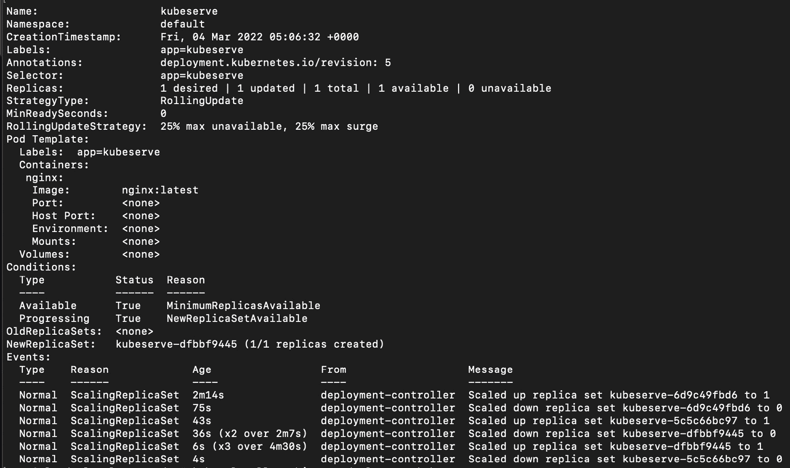

图 4.14 – kubectl 描述回滚后的 kubeserve

1.  现在，你可能非常好奇是否可以跟踪我们部署的历史记录。你可以使用以下命令：

    ```
    kubectl rollout history deployment kubeserve
    ```

输出将如下所示：

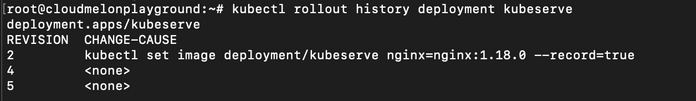

图 4.15 – kubectl 描述 kubeserve

1.  如果你想回滚到特定版本，你可以使用 `--to-revision` 参数。你可以在 *图 4.16* 中看到，由于我们在设置镜像版本时使用了 `--record` 参数，我们可以使用版本 `2`。以下命令是回滚部署并恢复到版本 `2` 的示例：

    ```
    kubectl rollout undo deployment kubeserve --to-revision=2
    ```

你的输出应如下所示：

```
deployment.apps/kubeserve rolled back
```

1.  现在，如果你使用 `kubectl describe deploy kubeserve` 命令，你将看到以下输出，表明镜像已回滚到版本 `2`：

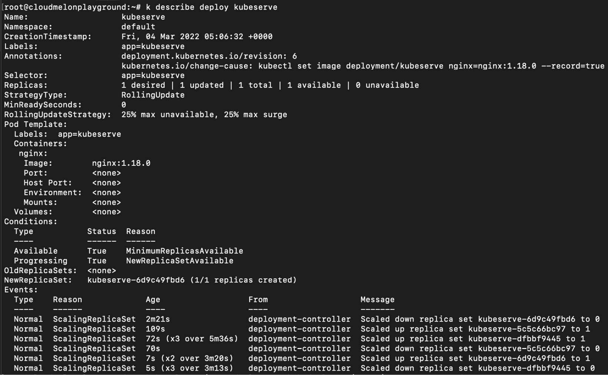

图 4.16 – kubectl 描述 kubeserve

部署不仅使滚动更新和回滚过程变得更加简单，而且帮助我们轻松地进行扩缩容——在下一节中，我们将了解如何扩展应用程序，以及扩展时所有可行的选项。

# 扩展应用程序

当我们的应用程序变得流行时，为了处理越来越多的按需请求，我们需要启动多个应用程序实例来满足工作负载要求。

当你有一个部署时，扩展是通过更改副本数来实现的。在这里，你可以使用 `kubectl scale` 命令来扩展部署：

```
kubectl scale deployment kubeserve --replicas=6
```

你的输出应如下所示：

```
deployment.apps/kubeserve scaled
```

如果你现在使用 `kubectl get pods` 命令，你将看到更多副本的 Pods 被启动，输出如下所示：

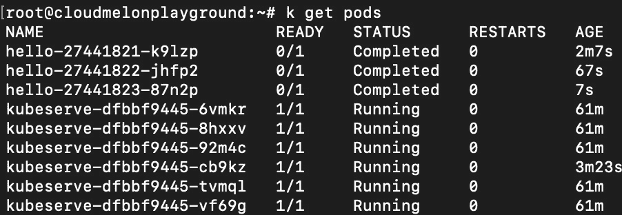

图 4.17 – kubectl 获取 Pods 并显示更多副本

除了使用 `kubectl scale` 命令手动扩展部署，我们还有另一种扩展部署及其 ReplicaSets 的方式，那就是 **HorizontalPodAutoscaler**（**HPA**）。让我们先来看一下 ReplicaSets。

## ReplicaSets

ReplicaSets 帮助 pods 实现更高的可用性，因为用户可以使用 ReplicaSet 定义一定数量的副本。ReplicaSet 的主要功能是确保集群中保持精确数量的副本在 Kubernetes 集群中运行。如果任何副本失败，它们会被新副本取代。

以下是一个 ReplicaSet 的 YAML 定义示例：

```
apiVersion: apps/v1
kind: ReplicaSet
metadata:
  name: frontend
  labels:
    app: melonapp-rs
spec:
  replicas: 3
  selector:
    matchLabels:
      app: melonapp-rs
  template:
    metadata:
      labels:
        app: melonapp-rs
    spec:
      containers:
      - name: nginx
        image: nginx
```

`matchLabels` 选择器简单地将其下指定的标签与 pods 上的标签进行匹配。要检查你的 ReplicaSet，可以使用以下命令：

```
kubectl get replicaset
```

另外，你也可以使用以下命令：

```
kubectl get rs
```

然后，你会看到输出显示 `DESIRED` *副本* 数量以及有多少副本处于 `READY` 状态：

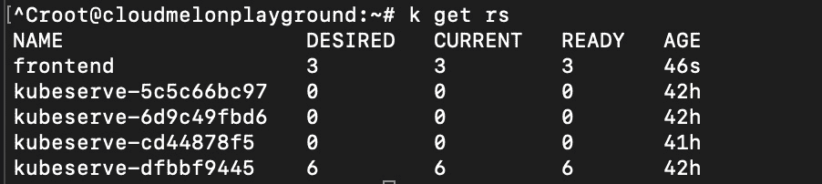

图 4.18 – kubectl 获取 rs 命令显示 ReplicaSet 的状态

一旦 ReplicaSet 部署完成，可以使用以下命令更新 ReplicaSet 的数量：

```
kubectl scale replicaset frontend --replicas=6
```

你的输出应如下所示：

```
replicaset.apps/frontend scaled
```

另外，你也可以在 YAML 定义中使用以下命令指定：

```
kubectl scale --replicas=6 -f replicas.yaml
```

你的输出应如下所示：

```
replicaset.apps/frontend scaled
```

现在，如果你想检查 ReplicaSets 的数量是否增加，可以再次使用 `kubectl get rs` 命令，你将能够看到以下输出：

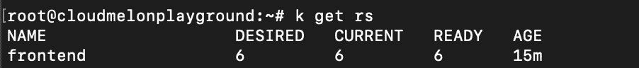

图 4.19 – 使用 kubectl 获取 ReplicaSets

如果你想删除一个 ReplicaSet，可以使用 `kubectl delete` 命令——在这种情况下，我们可以使用它删除名为 `frontend` 的 ReplicaSet：

```
kubectl delete replicaset frontend
```

你的输出应如下所示：

```
replicaset.apps "frontend" deleted
```

直接使用 ReplicaSets 不是唯一的扩展应用程序的方式。接下来让我们来看一下另一种方式，HPA。

### HPA

要更新工作负载资源（例如 Deployment 或 StatefulSet），我们也可以使用 HPA——这是一个 Kubernetes API 原语，根据你的需求自动扩展工作负载。*图 4.18* 解释了在应用扩展的上下文中 HPA 是如何工作的：

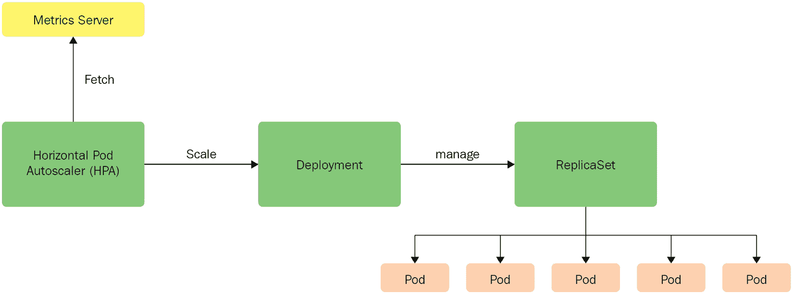

图 4.20 – HPA

从前面的图示中，我们可以看到 HPA 配置为基于 CPU 和内存使用情况从度量服务器中获取指标。这些指标由度量服务器从`kubelet`获取，然后通过度量 API 将它们暴露给 API 服务器。HPA 通过增加或减少副本数来扩展部署，副本数由底层的 ReplicaSet 管理。

随着按需资源请求的增加，HPA 扩展部署并增加副本数。相反，当资源请求减少时，副本数也会减少。

要创建一个 HPA，你可以使用 `kubectl autoscale deployment` 命令并带上以下标志来满足要求：

+   `cpu-percent` 表示所有 pod 的平均 CPU 利用率

+   `min` 提供最小副本数

+   `max` 提供最大副本数

你可以使用以下命令创建一个 HPA，CPU 利用率为 50%，并确保最少有 `3` 个副本，最多可达 `10` 个副本：

```
kubectl autoscale deployment kubeserve --cpu-percent=50 --min=3 --max=10
```

你的输出应该如下所示：

```
horizontalpodautoscaler.autoscaling/kubeserve autoscaled
```

要查看当前在默认命名空间中有多少个 HPA，请使用以下命令：

```
kubectl get hpa
```

输出将如下所示：

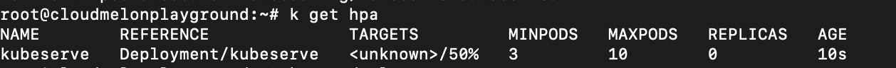

图 4.21 – 获取默认命名空间中的 HPAs

你还可以使用以下 YAML 定义来部署 HPA，这样也能达到相同的目标：

```
apiVersion: autoscaling/v2
kind: HorizontalPodAutoscaler
metadata:
  name: kubeserve
spec:
  scaleTargetRef:
    apiVersion: apps/v1
    kind: Deployment
    name: kubeserve
  minReplicas: 3
  maxReplicas: 10
  metrics:
  - type: Resource
    resource:
      name: cpu
      target:
        type: Utilization
        averageUtilization: 50
```

如果你想删除一个 HPA，请使用 `kubectl delete` 命令。这里，我们可以按如下方式删除名为 `kubeserve` 的 HPA：

```
kubectl delete hpa kubeserve
```

你的输出应该如下所示：

```
horizontalpodautoscaler.autoscaling "kubeserve" deleted
```

我们接下来会介绍另一个概念：DaemonSets，它在实际中更为常用，特别是在至少需要将 pod 的一个副本均匀分布在各个工作节点的场景中。让我们直接开始吧。

### DaemonSets

我们已经了解了 ReplicaSets 和 Deployments 如何帮助我们确保应用程序的多个副本在各个工作节点上正常运行。DaemonSets 会创建 pod 的几个副本，并确保至少有一个副本均匀分布在 Kubernetes 集群中的每个节点上，如 *图 4.23* 所示。

如果集群中新增了一个节点，该节点会自动分配一个 pod 副本。类似地，当一个节点被移除时，该 pod 会自动被移除。

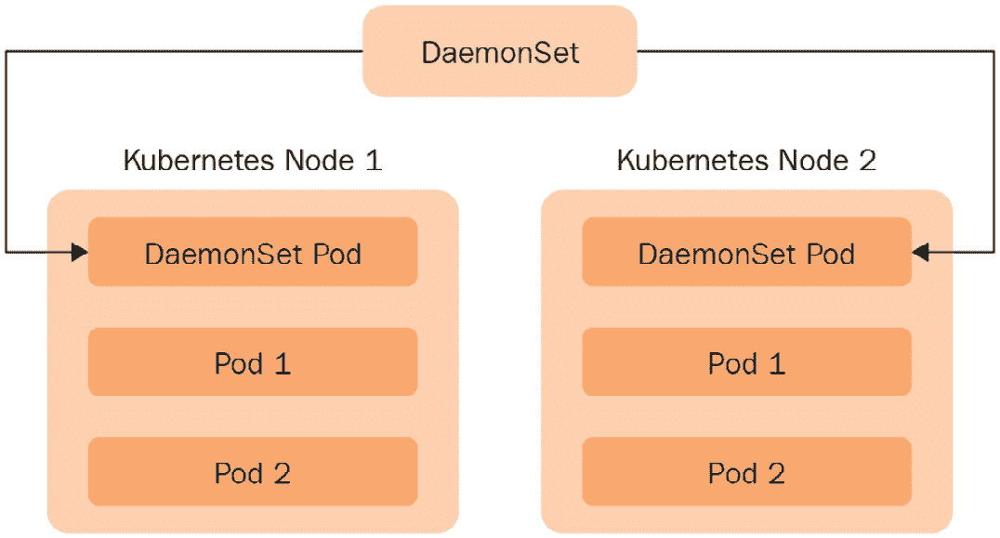

图 4.22 – DaemonSets

你可以使用以下 YAML 定义来定义一个 DaemonSet：

```
apiVersion: apps/v1
kind: DaemonSet
metadata:
  name: fluentd
  namespace: kube-system
  labels:
    k8s-app: fluentd
spec:
  selector:
    matchLabels:
      name: fluentd
  template:
    metadata:
      labels:
        name: fluentd
    spec:
      containers:
      - name: fluentd
        image: fluentd:latest
```

你的输出将如下所示：

```
daemonset.apps/fluentd created
```

注意，这次我们在名为 `kube-system` 的命名空间中创建了这个 DaemonSet——这个命名空间通常保留给 Kubernetes 系统创建的对象。我们稍后会讨论命名空间。现在，你可以使用以下命令来检查 DaemonSet 是否已经创建：

```
kubectl get daemonsets -n kube-system
```

或者，我们可以简化命令：

```
kubectl get ds -n kube-system
```

你的输出将如下所示：

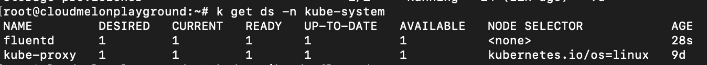

图 4.23 – 查看 kube-system 命名空间中的 DaemonSets

别忘了通过以下命令查看 DaemonSets 的详细信息：

```
kubectl describe daemonsets fluentd -n kube-system
```

你的输出将如下所示：

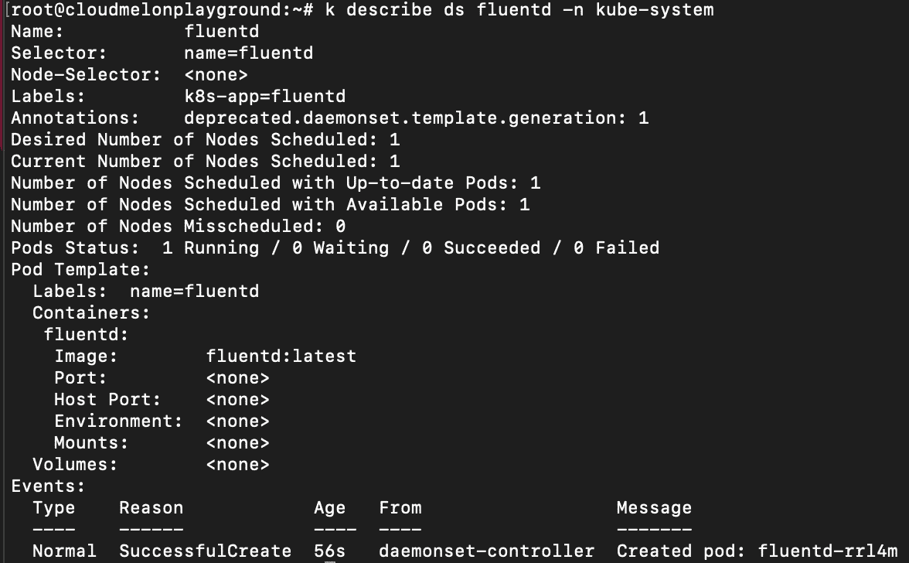

图 4.24 – kubectl 描述 DaemonSets

如果你想删除一个 DaemonSet，请使用 `kubectl delete` 命令。这里，我们可以按如下方式删除在 `kube-system` 命名空间中的名为 `fluentd` 的 DaemonSet：

```
kubectl delete ds fluentd -n kube-system 
```

你的输出应该如下所示：

```
daemonset.apps "fluentd" deleted
```

DaemonSets 的主要用途是将其用作每个节点上的监控代理或日志收集器，或者在其他情况下，用于在所有工作节点上运行集群存储守护进程。

使用 DaemonSets 时，你不必担心添加或删除会影响这些节点上的监控代理的节点。实际应用案例，比如 `fluentd`，需要在集群中的每个节点上部署代理。

# 工作负载调度

理解工作负载调度及其与 Kubernetes 调度器的配合将对你作为 Kubernetes 管理员的日常工作有所帮助。Kubernetes 允许你通过良好的标签、选择器和注释来定义节点亲和性规则、污点和容忍度，帮助你前进。首先，我们从命名空间的概念开始。

## 理解命名空间

考虑到工作负载的隔离，命名空间非常方便。命名空间是一个逻辑分隔符，用于将所有部署在单个 Kubernetes 集群中的命名空间对象隔离开来。Deployments、Services 和 Secrets 都是命名空间对象。否则，一些 Kubernetes 对象是集群范围的，例如 Nodes、StorageClass 和 PersistentVolume。资源的名称在命名空间内必须是唯一的。

你可以使用以下命令获取所有命名空间：

```
kubectl get namespaces
```

或者，你可以使用以下命令：

```
kubectl get ns
```

你将看到输出会列出当前我们 Kubernetes 集群中的所有命名空间：

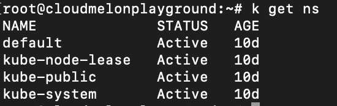

图 4.25 – kubectl 获取命名空间

当你定义一个 pod 或任何命名空间的 Kubernetes 对象时，可以在 YAML 定义中指定命名空间，如下所示：

```
   apiVersion: v1
   kind: Pod
   metadata:
    name: k8s-ns-pod
    namespace: k8s-ns
    labels:
      app: k8sapp
   spec:
    containers:
    - name: k8sapp-container
      image: busybox
      command: ['sh', '-c', 'echo Salut K8S! && sleep 3600']
```

如果你创建了该 pod 并指定了 pod 所属的命名空间，那么在使用 `kubectl get pods` 命令查询该 pod 时，可以添加 `-n` 标志。以下是一个示例：

```
kubectl get pods -n k8s-ns
```

类似地，如果 pod 已在该命名空间中创建，你可以使用以下命令查看：

```
kubectl describe pod k8s-ms-pod -n k8s-ns
```

如果 pod 不在默认命名空间中，你不再需要指定命名空间选项。以下示例中，你想设置一个名为 `dev` 的命名空间，然后使用没有 `-n` 标志的 `kubectl get` 命令：

```
kubectl config set-context &(kubectl config current-context) --namespace=dev
```

然后，你可以简单地运行以下命令，不带命名空间选项，来列出 pods：

```
kubectl get pods
```

理解命名空间将进一步帮助你在需要定义命名空间作用域的权限时，在 Kubernetes 对象分组时提供帮助。我们将在 *第六章*《*Kubernetes 安全*》中进一步阐述。

## 标签、节点选择器和注释

标签、选择器和注释是工作负载调度时非常有用的概念。标签是附加到 Kubernetes 对象上的键值对，可以在对象描述符的 `metadata.labels` 部分列出。选择器用于通过标签识别和选择一组对象。请参见以下基于质量的选择器示例：

```
kubectl get pods -l app=my-app
kubectl get pods -l environment=production
```

当涉及到不等式时，你可以使用以下命令：

```
kubectl get pods -l environment!=production
```

以下示例通过使用逗号分隔的列表将多个选择器串联在一起：

```
kubectl get pods -l app=myapp.environment=production
```

要将一个 Pod 分配到节点上，我们可以使用节点选择器。你可以在 `PodSpec` 字段中指定一组键值对：

你可以通过以下命令开始为工作节点打标签：

```
kubectl label node cloudmelonplayground env=dev
```

输出应该如下所示：

```
node/cloudmelonplayground labeled
```

你可以使用以下命令显示工作节点的标签：

```
kubectl get nodes --show-labels
```

然后，我们应该得到以下输出：

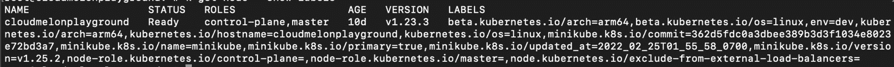

图 4.26 – 获取节点标签

然后，你可以在 YAML 定义中添加节点选择器，如下所示：

```
apiVersion: v1
kind: Pod
metadata:
  name: nginx
  labels:
    env: test
spec:
  containers:
  - name: nginx
    image: nginx
  nodeSelector:
    env: dev
```

我们可以使用 `metadata.annotations` 部分将注解附加到对象上，以下是带有注解 `imageregistry: "http://hub.docker.com/"` 的配置文件：

```

apiVersion: v1
kind: Pod
metadata:
  name: melon-annotation
  annotations:
    imageregistry: "https://hub.docker.com/"
spec:
  containers:
  - name: nginx
    image: nginx:latest
    ports:
    - containerPort: 80
```

注解类似于标签，它们可以用来存储关于对象的自定义元数据。

## 节点亲和性和反亲和性

节点亲和性和反亲和性是帮助 Pod 分配到正确节点的方式。与此相比，`nodeSelector` 是用于将 Pod 直接分配到工作节点的。以下是 YAML 配置中节点亲和性和反亲和性的示例：

```
 spec:
  affinity:
    podAffinity:
      requiredDuringSchedulingIgnoredDuringExecution:
      - labelSelector:
          matchExpressions:
          - key: security
            operator: In
            values:
            - S1
        topologyKey: topology.kubernetes.io/zone
    podAntiAffinity:
      preferredDuringSchedulingIgnoredDuringExecution:
      - weight: 100
        podAffinityTerm:
          labelSelector:
            matchExpressions:
            - key: security
              operator: In
              values:
              - S2
          topologyKey: topology.kubernetes.io/zone
```

通过特定的标签，节点亲和性和反亲和性使我们能够创建具有逻辑和操作的匹配规则。

## 污点和容忍

除了节点亲和性和反亲和性之外，我们还可以通过给节点打上污点并确保没有 Pod 被调度到该节点来在节点上分配污点和在 Pod 上分配容忍。

你可以使用以下命令给节点打污点：

```
kubectl taint nodes melonnode app=melonapp:NoSchedule
```

上面的定义可以转化为 Pod 的 YAML 定义文件，以实现相同的结果，如下所示：

```
  apiVersion: v1
  kind: Pod
  metadata:
   name: melon-ns-pod
   namespace: melon-ns
   labels:
     app: melonapp
  spec:
   containers:
   - name: melonapp-container
     image: busybox
     command: ['sh', '-c', 'echo Salut K8S! && sleep 3600']
   tolerations:
   - key: "app"
     operator: "Equal"
     value: "melonapp"
     effect: "NoSchedule"
```

如果你想解除节点的污点，可以使用以下命令：

```
kubectl taint nodes yourworkernode   node-role.kubernetes.io/yourworkernode:NoSchedule-
```

在这一部分中，我们已经学会了如何在需要将工作负载从节点中驱逐时给某些节点打污点。现在，让我们来看一下资源管理。

# 资源管理

Kubernetes 允许我们在 Pod 规格中指定容器的资源需求，这基本上是指容器需要多少资源。

`kube-scheduler` 使用你为 Pod 中的容器指定的资源请求信息来决定将 Pod 调度到哪个工作节点。`kubelet` 负责在你为容器指定资源限制时执行这些限制，以确保运行中的容器不会超出设定的限制，并为容器保留至少请求的系统资源量。

它通常会给我们以下值：

+   `resources.limits.cpu` 是设置的 CPU 使用资源限制。

+   `resources.limits.memory` 是设置的内存使用资源限制。

+   `resources.requests.cpu` 是为使应用程序正常运行而请求的最小 CPU 使用量。

+   `resources.requests.memory` 是请求的最小内存使用量，用于确保你的应用程序能够正常运行。如果容器超出了其内存请求，运行该容器的工作节点会同时内存不足，容器所属的 Pod 很可能也会被驱逐。

+   `resources.limits.ephemeral-storage` 是对临时存储资源的限制。

+   `resources.limits.hugepages-<size>` 是对 Pod 中任何应用程序预分配的大页内存分配和消耗的限制。

资源请求是指运行容器所需的资源量，它们决定了容器将在哪个工作节点上调度。因此，当 Kubernetes 准备运行一个特定的 Pod 时，它会根据 Pod 容器的资源请求来选择一个工作节点。Kubernetes 将使用这些值来确保选择一个有足够资源来运行该 Pod 的节点。Pod 只会在拥有足够可用资源的节点上运行。以下是定义 `resource request` 和 `limits` 的 YAML 示例：

```
apiVersion: v1
kind: Pod
metadata:
 name: melonapp-pod
spec:
 containers:
 - name: melonapp-container
   image: busybox
   command: ['sh', '-c', 'echo stay tuned! && sleep 3600']
   resources:
     requests:
       memory: "64Mi"   # 64 Megabytes
cpu: "250m" 
     limits:
       memory: "128Mi"
       cpu: "500m"
```

你可以使用 `kubectl describe node` 命令检查该节点的资源分配，以查看你的请求或限制定义是否符合当前环境下的需求：

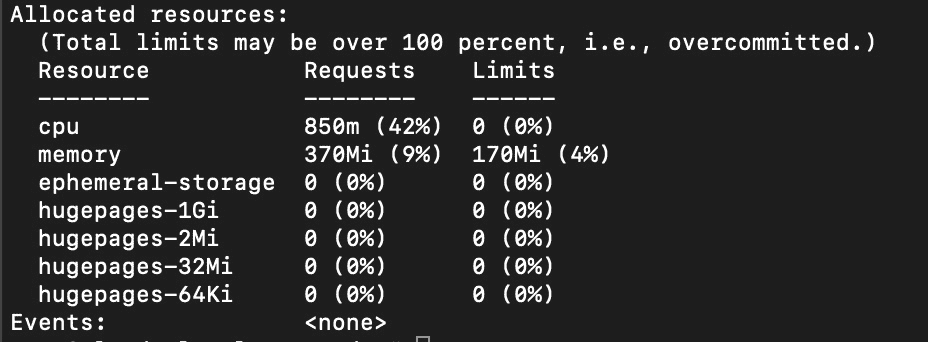

图 4.27 – kubectl 描述节点资源

如果你的集群中已安装了度量服务器，你可以使用 `kubectl top` 命令检查节点或 Pod 的实际资源使用情况。

# 配置应用程序

配置应用程序是一个简单直接的过程，得益于 ConfigMaps 和 Secrets。我们来逐一看看它们。

### 理解 ConfigMaps

ConfigMap 仅仅是一个 Kubernetes 对象，用来存储以键值对形式的配置信息。然后，这些配置信息可以通过配置 Pod 来使用环境变量、命令行参数或挂载包含配置文件的卷，从而配置运行在容器中的软件。

你也可以使用 YAML 定义来定义 `configmap`，如下所示：

```
  apiVersion: v1
  kind: ConfigMap
  metadata:
    name: melon-configmap
  data:
    myKey: myValue
    myFav: myHome
```

你的输出应如下所示：

```
configmap/melon-configmap created
```

你可以使用以下命令检查 `configmap`：

```
kubectl get configmap
```

或者，你可以使用这个命令：

```
kubectl get cm
```

你的输出将如下所示：

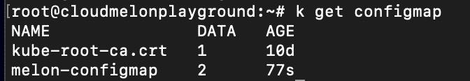

图 4.28 – kubectl 获取 configmap

你可以使用以下命令检查 `configmap` 的二进制数据：

```
k describe configmap melon-configmap
```

以下截图是前述命令的输出：

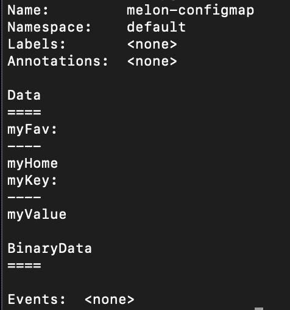

图 4.29 – configmap 二进制数据

一旦 `configmap` 准备好，下面是如何配置 Pod 来使用它：

1.  通过使用环境变量创建一个可以使用 `configmap` 数据的 Pod：

    ```
    apiVersion: v1
    kind: Pod
    metadata:
      name: melon-configmap
    spec:
      containers:
      - name: melonapp-container
    image: busybox
        command: ['sh', '-c', "echo $(MY_VAR) && sleep 3600"]
        env:
        - name: MY_VAR
          valueFrom:
            configMapKeyRef:
              name: melon-configmap
              key: myKey
    ```

你可以使用以下命令来检查`configmap`的值：

```
 kubectl logs melon-configmap
```

输出将类似于以下内容：

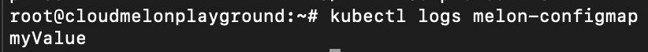

图 4.30 – configmap 挂载的值

1.  你可以通过卷来创建 pod 使用`configmap`数据。以下是一个 YAML 定义的示例：

    ```
    apiVersion: v1
    kind: Pod
    metadata:
      name: melon-volume-pod
    spec:
      containers:
       - name: myapp-container
         image: busybox
         command: ['sh', '-c', "echo $(cat /etc/config/myKey) && sleep 3600"]
         volumeMounts:
           - name: config-volume
             mountPath: /etc/config
      volumes:
        - name: config-volume
          configMap:
            name: melon-configmap
    ```

你可以使用`kubectl logs`命令检查 pod 中的挂载数据值，或者使用以下命令来检查`configmap`：

```
kubectl exec melon-volume-pod -- ls /etc/config
```

输出将如下所示：

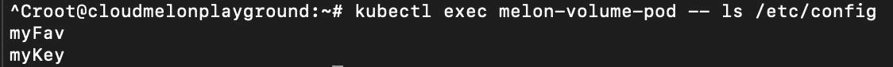

图 4.31 – configmap 挂载的值

如果你想删除一个`configmap`，请使用`kubectl delete`命令：

```
kubectl delete cm melon-configmap
```

你的输出将如下所示：

```
configmap "melon-configmap" deleted
```

在这里，我们展示了如何在 Kubernetes 中使用 ConfigMap。一旦你对 ConfigMap 感到熟悉，你会发现当你处理 Secrets 时，有很多相似之处。接下来，我们将看看如何处理 Kubernetes Secrets，以便它们能被你的应用消费。

### 理解 Secrets

Kubernetes Secret 是一个包含敏感数据的对象，例如密码、API 令牌或密钥，这些数据会传递给 pod，而不是存储在`PodSpec`字段或容器中：

```
kubectl create melon-secret --from-literal=username=packtuser 
  --from-literal=password='S!B\*d$zDsb='
```

你还可以使用 YAML 定义来将`configmap`定义为以下形式并使用 base64：

```
apiVersion: v1
kind: Secret
metadata:
  name: melon-secret
type: Opaque
data:
  USER_NAME: bXl1c2VybmFtZQo=
  PASSWORD: bXlwYXNzd29yZAo=
```

你可以使用以下命令检查 Secrets：

```
kubectl get secrets
```

你的输出将如下所示：

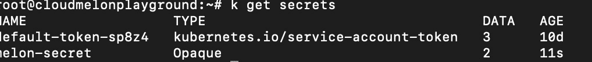

图 4.32 – kubectl 获取 Secrets

创建 Secret 后，你可能希望将其附加到一个应用程序中。这时，你需要创建一个 pod 来消费该 Secret，步骤如下：

1.  你可以创建一个 pod，通过环境变量消费 Secret：

    ```
    apiVersion: v1
    kind: Pod
    metadata:
      name: melon-secret-pod
    spec:
      containers:
        - name: test-container
          image: busybox:latest
          command: [ "/bin/sh", "-c", "env" ]
          envFrom:
          - secretRef:
              name: melon-secret
      restartPolicy: Never
    ```

1.  你还可以将 Secret 作为卷来使用，如下所示——你需要定义一个`secret-volume`，然后将`secret-volume`挂载到`/etc/secret-volume`路径：

    ```
      volumes:
      - name: secret-volume
        secret:
          secretName: melon-secret
      containers:
      - name: mybusybox
        image: busybox:latest
        command: [ "/bin/sh", "-c", "env" ]
        volumeMounts:
        - name: secret-volume
          readOnly: true
          mountPath: "/etc/secret-volume"
    ```

如果你想删除一个 Secret，请使用以下`kubectl delete`命令：

```
kubectl delete secret melon-secret
```

你的输出将如下所示：

```
secret "melon-secret" deleted
```

请注意，如果你删除了一个 Secret，确保更新你应用的`PodSpec`字段，以避免出现异常。你可以通过创建一个新的 Secret，然后将其附加到你的 pod 上，或者更新你的应用使其不再需要该 Secret。

## 使用 kustomize 进行清单管理

从 Kubernetes 1.14 开始，提供了自定义文件，以便更顺畅地管理 Kubernetes。它支持以下用例：

+   从其他资源生成 YAML 定义，例如生成 Kubernetes Secret 及其 YAML 定义

+   多个 YAML 定义中的常见配置，例如为一组资源添加命名空间

+   组合和自定义 YAML 定义集合，例如为多个 Kubernetes 对象设置资源请求和限制

这可以通过一个名为`Kustomization.yaml`的中央文件来实现。你可以使用以下命令查看包含在定制文件中的目录中的资源：

```
kubectl kustomize <targeting_kustomization_directory>
```

然后，你可以通过运行以下命令来应用这些资源：

```
kubectl apply -k <targeting_kustomization_directory>
```

以 Secret 生成为例，生成一个 Secret 清单文件：

```
# Create a password.txt file
cat <<EOF >./password.txt
username=admin
password=secret
EOF
cat <<EOF >deployment.yaml
apiVersion: apps/v1
kind: Deployment
metadata:
  name: my-app
  labels:
    app: my-app
spec:
  selector:
    matchLabels:
      app: my-app
  template:
    metadata:
      labels:
        app: my-app
    spec:
      containers:
      - name: app
        image: my-app
        volumeMounts:
        - name: password
          mountPath: /secrets
      volumes:
      - name: password
        secret:
          secretName: example-secret-1
EOF
cat <<EOF >./kustomization.yaml
resources:
- deployment.yaml
secretGenerator:
- name: example-secret-1
  files:
  - password.txt
EOF
```

然后，你将能够看到在执行前述步骤后创建了两个文件：

```
kustomization.yaml  password.txt
```

如果你想查看`customization.yaml`文件的内容，可以使用`cat customization.yaml`命令，输出将如下所示：

```
secretGenerator:
- name: example-secret-1
  files:
  - password.txt
```

然后，你可以使用`kubectl apply`命令来部署带有挂载 Secret 的 Pod：

```
kubectl apply -f ./test
```

Kustomize 是一个非常好的方式来定制你的应用程序配置，现在它已集成到`kubectl apply -k`中，你可以通过访问官方文档网站，深入了解 Kustomize 的使用场景：[`kubectl.docs.kubernetes.io/guides/`](https://kubectl.docs.kubernetes.io/guides/)。

## 使用 Helm 进行常见的包管理和模板化操作

Helm 是一个管理预配置 Kubernetes 对象包的工具，形式为 chart——我们称之为 Helm charts。Helm charts 允许用户更可复现、更高效地安装和管理 Kubernetes 应用程序。此外，你还可以通过以下链接，从社区中查找流行的 Helm charts，或与 Helm 社区共享你自己的应用程序：[`artifacthub.io/packages/search`](https://artifacthub.io/packages/search)。

chart 的标准文件结构如下：

+   `Charts` – （文件夹）

+   `Chart.yaml #` – 一个`.yaml`文件，其中包含有关 chart 的信息

+   `README.md`

+   `requirements.lock`

+   `requirements.yaml` – 一个可选的文件，用于列出 chart 的依赖项（这些依赖项实际上是打包在`Charts`文件夹中的）

+   `templates` – 一个包含模板的目录，这些模板与值结合生成 Kubernetes 清单文件

+   `values.yaml` – 包含 chart 的默认配置值（这是 Helm 从中获取清单模板中包含的参考值的地方）

要查询已部署的 Helm charts，可以使用以下命令：

```
helm install stable/melonchart
```

如果你需要搜索某个 chart，可以使用以下命令：

```
helm search chartname
```

使用以下命令删除已部署的 Helm chart：

```
helm delete melonchart
```

每当你安装一个 chart 时，都会创建一个新的发布版本。因此，同一个 chart 可以多次安装到同一个集群中。每个发布版本都可以独立管理和升级。要将发布版本升级到指定的 chart 版本或更新 chart 的值，请运行以下命令：

```
helm upgrade [RELEASE] [CHART_path] [flags]
```

要回滚到特定版本，你可以使用以下命令：

```
helm rollback melon-release 2
```

Helm charts 帮助你管理、安装和升级 Kubernetes 本地应用程序。你可以访问 Helm 的官方网站，了解更多关于 Helm 的信息：[`helm.sh/docs/`](https://helm.sh/docs/)。

# 总结

本章中，我们介绍了 Kubernetes 管理员和开发人员最常做的任务之一——应用调度和应用生命周期管理。虽然本章内容涵盖了 CKA 考试约 15% 的内容，但作为 Kubernetes 管理员，处理 Kubernetes 对象是最重要的日常任务之一。在继续之前，确保你充分练习并掌握 `kubectl` 命令的快捷方式。

在下一章中，我们将讨论 Kubernetes 存储。本书的 *第四章* *应用调度与生命周期管理* 和 *第五章* *破解 Kubernetes 存储* 被认为是在实际 CKA 考试中高价值且不费时的内容，敬请关注并继续学习！

# 模拟 CKA 情景练习测试

你有两台虚拟机，`master-0` 和 `worker-0`。请完成以下模拟场景。

## 情景 1

SSH 进入 `worker-0` 节点，并创建一个名为 `ngnix` 的新 Pod，包含一个容器 `nginx`。

## 情景 2

SSH 进入 `worker-0`，然后将 `nginx` 扩展为 5 个副本。

## 情景 3

SSH 进入 `worker-0`，设置一个包含用户名和密码的 ConfigMap，然后将一个新的 Pod 附加到 BusyBox。

## 情景 4

SSH 进入 `worker-0`，并创建一个包含名为 `busybox` 的 init 容器的 `nginx` Pod。

## 情景 5

SSH 进入 `worker-0`，创建一个 `nginx` Pod，然后在同一 Pod 中创建一个 `busybox` 容器。

你可以在本书的 *附录* *- 模拟 CKA 情景练习测试解析* 中找到所有情景的解析。

# 常见问题

+   *在哪里可以了解 Helm charts？*

访问 Helm 的官方文档，了解更多有关 Helm 的信息：[`helm.sh/docs/howto/charts_tips_and_tricks/`](https://helm.sh/docs/howto/charts_tips_and_tricks/)。

+   *在哪里可以了解 Kustomize？*

访问 Helm 的官方文档，了解更多有关 Kustomize 的信息：[`kubectl.docs.kubernetes.io/references/kustomize/`](https://kubectl.docs.kubernetes.io/references/kustomize/)。

+   *关于 init 容器，推荐的官方 Kubernetes 文章是什么？*

我建议收藏这篇文章，*Init 容器*：[`kubernetes.io/docs/concepts/workloads/pods/init-containers/`](https://kubernetes.io/docs/concepts/workloads/pods/init-containers/)。

+   *你推荐的 Kubernetes 官方文章关于 ConfigMaps 是哪一篇？*

我建议收藏这篇文章，*ConfigMaps*：[`kubernetes.io/docs/concepts/configuration/configmap/`](https://kubernetes.io/docs/concepts/configuration/configmap/)。

+   *你推荐的 Kubernetes 官方文章关于资源管理是哪一篇？*

我建议收藏这篇文章，*Pod 和容器的资源管理*：[`kubernetes.io/docs/concepts/configuration/manage-resources-containers/`](https://kubernetes.io/docs/concepts/configuration/manage-resources-containers/)。
