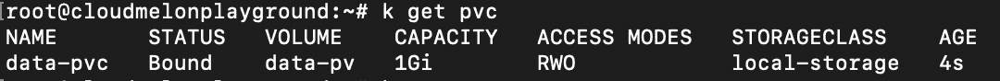
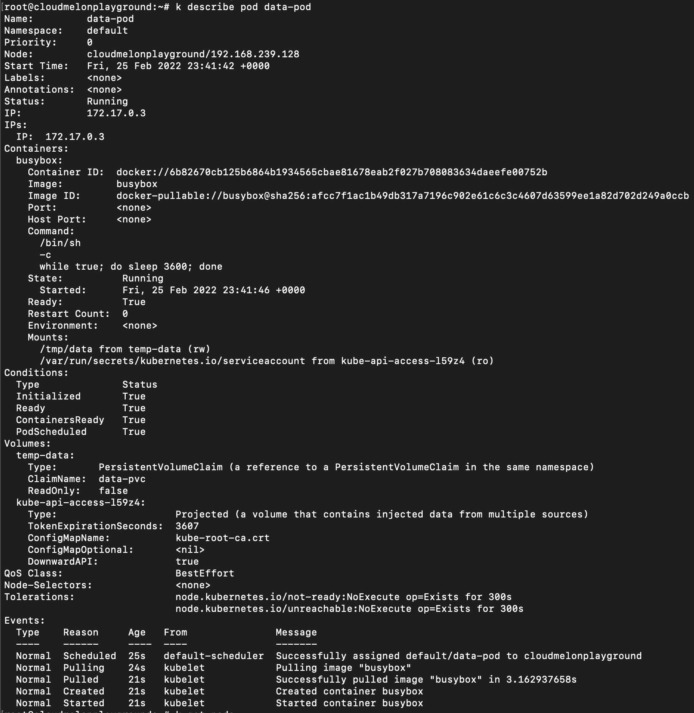

# 5

# 解密 Kubernetes 存储

本章将讨论 Kubernetes 存储的核心概念，针对有状态工作负载，并展示如何配置带挂载存储和动态持久存储的应用程序。本章内容覆盖 **认证 Kubernetes 管理员** (**CKA**) 考试的 10%。

在本章中，我们将涵盖以下主要内容：

+   有状态与无状态工作负载

+   Kubernetes 卷

+   Kubernetes 存储类

+   卷模式、访问模式和卷的回收策略

+   配置带挂载存储的应用程序

+   配置持久存储的应用程序

# 技术要求

在开始之前，我们需要确保你的本地机器满足以下技术要求：

+   兼容的 Linux 主机 – 我们推荐使用基于 Debian 的 Linux 发行版，如 Ubuntu 18.04 或更高版本

+   确保你的主机机器至少有 2 GB 的 RAM、2 个 CPU 核心，并且有大约 20 GB 的空闲磁盘空间

# 有状态与无状态工作负载

Kubernetes 旨在支持有状态和无状态应用程序。为了在 Kubernetes 中保持无状态工作负载，我们可以自由删除和替换容器，无需额外考虑。有状态应用程序通常会附加存储，无论是本地存储还是远程位置的存储，因为它需要保存客户端数据。这些数据可能是短暂的或*非持久*存储，这意味着它们只会保留直到会话过期。例如，Kubernetes 上的 Redis 缓存就是这样的应用场景。另一个使用案例是当数据需要通过持久存储长期保存，以便可以按需使用时。后者的一个示例是 Kubernetes 上的 MongoDB 操作器。整个过程比看起来更复杂，但一切都从 Kubernetes 卷开始。

Kubernetes 卷表示 Kubernetes 中存储的概念。如在*第一章*《Kubernetes 概述》中提到的，Kubernetes 中的卷由存储供应商定制的存储驱动程序进行管理。在引入 **容器存储接口** (**CSI**) 后，这部分不再是 Kubernetes 源代码的一部分。

卷可以支持本地存储、本地软件定义存储、云存储（如 blob 存储、块存储或文件存储）或 **网络文件系统** (**NFS**)，如图 *5.1* 所示：


图 5.1 – 一个 CSI

然后，用户可以使用与 CSI 兼容的卷驱动程序和 CSI 卷，将其附加或直接挂载到 Kubernetes 集群中正在运行的 Pods。

# Kubernetes 卷

瞬态卷和持久卷是 Kubernetes 中的两种主要卷类型。我们将分别了解它们。虽然其中一些可能不会在 CKA 考试中涉及，但了解它们很重要，因为你所在的组织无论如何都会与某个公共云服务提供商展开合作。

## 瞬态存储

目标是应用程序需要保存数据的临时卷，但如果 Pod 失败或重启，它们不关心数据丢失——临时卷的生命周期与 Pod 的生命周期一致。考虑到这一点，挂载的存储通常是临时的，因为它与容器共享相同的生命周期。只要容器在重启 Pod 的过程中停止或销毁，任何内部存储都会被完全移除。

另一个使用场景是当一个 Pod 包含多个容器时。可以将存储挂载到这些容器，并允许它们共享相同的卷，从而在共享的文件系统上进行交互。

临时卷有几种类型，我们将逐一介绍。

### emptyDir

emptyDir 是最常见的临时存储类型之一，并且会出现在 CKA 考试中。它通常作为 Pod 启动时的一个空目录，并与 Pod 共享相同的生命周期，这意味着它只存在于 Pod 运行时，并且当 Pod 停止或重启时，emptyDir 中的数据会被永久删除。

当涉及到同一 Pod 中的多个容器时，它们可以共享存储卷，尽管每个容器可以将 emptyDir 挂载到不同的目录，如 *图 5.2* 所示：


图 5.2 – Pod 中多个容器共享存储卷

以下是一个将 emptyDir 挂载到 Pod 的 YAML 示例定义：

```
apiVersion: v1
kind: Pod
metadata:
  name: multi-containers
spec:
  restartPolicy: Never
  volumes:
  - name: shared-data
    emptyDir: {}
  containers:
  - name: busybox-pod
    image: busybox
    command: ["/bin/sh","-c","while true; do sleep 3600; done"]
    volumeMounts:
    - name: shared-data
      mountPath: /tmp/data
  - name: nginx-pod
    image: nginx
    volumeMounts:
    - name: shared-data
      mountPath: /data
```

通过前面的示例，你可以看到如何在两个容器之间挂载共享卷，当你希望这两个容器共享相同的数据源时，这会非常有用。

### CSI 临时卷

CSI 临时卷是与 CSI 驱动程序兼容的卷，作为临时存储使用。在过去的很长一段时间里，Kubernetes 中由外部存储驱动程序提供的 CSI 卷被用作持久卷，目的是不与 Pod 共享生命周期。从 Kubernetes 1.15 开始，CSI 驱动程序也可以用于此类临时内联卷。以下是使用 CSI 临时卷的示例：

```
kind: Pod
apiVersion: v1
metadata:
  name: my-csi-pod
spec:
  containers:
    - name: my-frontend
      image: busybox
      volumeMounts:
      - mountPath: "/data"
        name: my-csi-vol
      command: ["sleep", "1000000"]
  volumes:
    - name: my-csi-vol
      csi:
        driver: inline.storage.kubernetes.io
        volumeAttributes:
          foo: bar
```

这些 CSI 存储驱动程序通常是第三方的，例如 Azure Disk、Azure File、AWS EBS 和 DellEMC Unity——你可以在 [`kubernetes-csi.github.io/docs/drivers.xhtml`](https://kubernetes-csi.github.io/docs/drivers.xhtml) 找到完整的 CSI 驱动程序列表。

### 通用临时卷

通用临时卷是具有一些附加功能的通用驱动程序，如快照、存储克隆、存储调整大小和存储容量跟踪。以下是使用 CSI 临时卷的示例：

```
kind: Pod
apiVersion: v1
metadata:
  name: my-app
spec:
  containers:
    - name: my-frontend
      image: busybox
      volumeMounts:
      - mountPath: "/cache"
        name: cache-volume
      command: [ "sleep", "1000000" ]
  volumes:
    - name: scratch-volume
      ephemeral:
        volumeClaimTemplate:
          metadata:
            labels:
              type: my-cache-volume
          spec:
            accessModes: [ "ReadWriteOnce" ]
            storageClassName: "my-cache-storage-class"
            resources:
              requests:
                storage: 1Gi
```

通用临时卷可以与所有支持动态供应的存储驱动程序一起使用，包括一些第三方 CSI 存储驱动程序。现在我们已经对临时卷有了较好的理解，我们将看看投影卷，并了解它们如何与 Kubernetes 一起工作。

### 投影卷

配置数据被挂载到 Kubernetes Pod 中——这些数据通过边车模式注入到 Pod 中。我们在*第四章*《应用调度与生命周期管理》中已经讨论了 `ConfigMap` 和 `Secret` 对象，它们属于这一类别。更具体地说，它们也被称为**投影卷**，因为它们代表一个将多个现有卷映射到同一目录的卷。

除了 ConfigMap 和 Secret，投影卷还包括**downwardAPI**卷和**服务账户令牌**。我们将在这里通过一些示例更详细地了解它们。

`downwardAPI` 卷旨在使 downward API 数据对应用程序可用。同样，它也作为一个目录挂载，然后将数据以纯文本文件的形式写入。downward API 允许容器在不使用 Kubernetes API 服务器或客户端的情况下，消费集群或 Pod 信息。

以下示例展示了如何将 `downwardAPI` 作为投影卷挂载：

```
apiVersion: v1
kind: Pod
metadata:
  name: volume-test
spec:
  containers:
  - name: container-test
    image: busybox
    volumeMounts:
    - name: all-in-one
      mountPath: "/projected-volume"
      readOnly: true
  volumes:
  - name: all-in-one
    projected:
      sources:
      - downwardAPI:
          items:
            - path: "labels"
              fieldRef:
                fieldPath: metadata.labels
            - path: "cpu_limit"
              resourceFieldRef:
                containerName: container-test
                resource: limits.cpu
```

服务账户令牌类型的投影卷旨在使 downward API 数据对应用程序可用。同样，它也作为一个目录挂载，然后将数据以纯文本文件的形式写入。

以下示例展示了如何将服务账户令牌作为投影卷挂载：

```
apiVersion: v1
kind: Pod
metadata:
  name: volume-test
spec:
  containers:
  - name: container-test
    image: busybox
    volumeMounts:
    - name: all-in-one
      mountPath: "/projected-volume"
      readOnly: true
  volumes:
  - name: all-in-one
    projected:
      sources:
      - serviceAccountToken:
          audience: api
          expirationSeconds: 3600
          path: token
```

让我们总结一下本节内容，回顾我们在*第四章*《应用调度与生命周期管理》中学到的关于 `downwardAPI` 和服务账户令牌卷的内容，以及关于 ConfigMap 和 Secret 对象的知识，通过以下示例来帮助你理解如何在一次操作中处理所有这些内容：

```
apiVersion: v1
kind: Pod
metadata:
  name: volume-test
spec:
  containers:
  - name: container-test
    image: busybox
    volumeMounts:
    - name: all-in-one
      mountPath: "/projected-volume"
      readOnly: true
  volumes:
  - name: all-in-one
    projected:
      sources:
      - secret:
          name: mysecret
          items:
            - key: username
              path: my-group/my-username
      - downwardAPI:
          items:
            - path: "labels"
              fieldRef:
                fieldPath: metadata.labels
            - path: "cpu_limit"
              resourceFieldRef:
                containerName: container-test
                resource: limits.cpu
      - configMap:
          name: myconfigmap
          items:
            - key: config
              path: my-group/my-config
      - serviceAccountToken:
          audience: api
          expirationSeconds: 3600
          path: token
```

所有投影卷，`configMap`、`downwardAPI`、`secret` 和 `emptyDir`，都作为本地短暂存储提供。在每个节点上，`kubelet` 负责配置和管理 Pod，并管理本地短暂存储。

除了作为内部存储的挂载存储外，在某些使用场景中，我们还需要容器生命周期之外的持久数据，即使容器停止或被替换，数据依然存在。这就提出了为我们的 Pod 分配持久外部存储的需求。我们将在下一节讨论持久卷。

## 持久化存储

与短暂卷相比，持久卷的生命周期与 Kubernetes Pod 无关。状态持久性意味着在容器删除或替换后，某些数据或信息能够继续存在。然而，在容器运行时，它可以被容器修改或更新。

在 Kubernetes 中与持久卷（Persistent Volume）一起工作的机制利用了暴露的 API，它抽象了外部存储提供和消费的技术细节。Kubernetes 允许我们通过持久卷和持久卷声明的概念来操作持久存储：

+   **持久卷**（**PV**）是根据存储类动态供应的存储资源，具有一组功能，以满足用户的需求。

+   **持久卷声明**（**PVC**）是用户请求的 Pod 和 PV 之间的抽象层，包含一组要求，包括特定的资源级别和访问模式。

如下所示，*图 5.3* 中，PV 和 PVC 被定义在 Kubernetes 集群中，而物理存储则位于 Kubernetes 集群之外：


图 5.3 – PV 和 PVC

同样需要注意的是，PV 可以绑定到 PVC，它是集群范围的资源，而 PVC 是命名空间级别的资源。

在我们深入探讨*如何*使用之前，先来了解一些关于 PV 和 PVC 的其他重要概念。

### 存储类（StorageClass）

Kubernetes 中的 `StorageClass` 资源将 Kubernetes 存储分类。事实上，`StorageClass` 包含 `provisioner`、`parameters` 和 `reclaimPolicy` 字段。

供应器（provisioner）表示用于供应 PV 的 CSI 卷插件。不同供应器的示例包括 Azure 磁盘、AWS EBS 和 Glusterfs。你可以在这里找到支持的 `StorageClass` 资源的完整列表：[`kubernetes.io/docs/concepts/storage/storage-classes/`](https://kubernetes.io/docs/concepts/storage/storage-classes/)。

我们需要在 PVC 中定义存储类，存储类的定义包括供应器和回收策略。它们之间的关系如 *图 5.3* 所示：


图 5.4 – 一个 StorageClass 资源

注意，当回收策略（reclaim policy）未指定时，它默认为 `Delete`，这意味着如果用户删除了与此 PV 绑定的 PVC，则 PVC 本身也会被删除。你还可以将其设置为 `Retain`，这意味着它将被保留，你需要手动删除其中存储的数据。另一种情况是将其设置为 `Recycle`，此时 PV 将被回收、废弃，并由动态供应替代，这将取决于供应器。Kubernetes API 服务器上的 DefaultStorageClass 入站控制器也需要启用——这超出了 CKA 考试的范围，但我认为还是值得提及。

以下是一个 `StorageClass` 定义的示例，使用 Azure 磁盘管理的磁盘来定义一个 `StorageClass` 资源，并给出 YAML 定义：

```
apiVersion: storage.k8s.io/v1
kind: StorageClass
metadata:
  name: slow
provisioner: kubernetes.io/azure-disk
parameters:
  storageaccounttype: Standard_LRS
  kind: managed
```

有趣的是，尽管本地卷不支持动态供应，它们仍然可以在 pod 被调度时创建并绑定。我们可以将 `volumeBindingMode` 设置为 `WaitForFirstConsumer`，如下所示：

```
apiVersion: storage.k8s.io/v1
kind: StorageClass
metadata:
  name: local-storage
commissions: kubernetes.io/no commissions
volumeBindingMode: WaitForFirstConsumer
```

了解 Kubernetes 中的存储类将帮助你在实际工作中处理不同的存储，超越当前 CKA 考试的要求。请随时查看官方文档——每当新增一个支持的存储类时，文档会进行更新，并提供有用的示例：[`kubernetes.io/docs/concepts/storage/storage-classes/`](https://kubernetes.io/docs/concepts/storage/storage-classes/)。

接下来，我们来看看另一个重要的概念——卷模式。

### 卷模式

卷模式表示卷的消费类型——它可以是文件系统或块设备。当 `volumeMode` 设置为 `Filesystem` 时，它作为目录挂载到 pods 中。当 `volumeMode` 设置为 `Block` 时，我们将其作为原始块使用。

### 访问模式

当 PV 被挂载到 pod 时，我们可以指定不同的访问模式。访问模式表示存储资源中数据的消费方式。它们可以总结如下表所示：

| **访问模式** | **定义** | **缩写** |
| --- | --- | --- |
| `ReadWriteOnce` | 该卷可以被一个节点以读写方式挂载。 | `RWO` |
| `ReadOnlyMany` | 该卷可以被多个节点以只读方式挂载。 | `ROX` |
| `ReadWriteMany` | 该卷可以被多个节点以读写方式挂载。 | `RWX` |
| `ReadWriteOncePod` | 该卷可以被一个 pod 以读写方式挂载。这是 Kubernetes 从 1.22 版本开始支持的特性。 | `RWOP` |

要了解更多关于访问模式的信息，你可以在这里找到官方文档：[`kubernetes.io/docs/concepts/storage/persistent-volumes/#access-modes`](https://kubernetes.io/docs/concepts/storage/persistent-volumes/#access-modes)。

了解访问模式很重要，因为在使用 Kubernetes 存储时它们是常常用到的。现在，我们来看看 PV 和 PVC，看看这些概念如何与 Kubernetes 协同工作。

### 一个 PV

首先，我们来看看如何创建一个 PV。你可以使用以下 YAML 定义来实现：

```
  apiVersion: v1
  kind: PersistentVolume
  metadata:
    name: my-pv
  spec:
    storageClassName: local-storage
    capacity:
      storage: 1Gi
    accessModes:
      - ReadWriteOnce

```

要了解 PV 如何与 Kubernetes 配合工作，可以查看这篇文章：[`kubernetes.io/docs/concepts/storage/persistent-volumes/#persistent-volumes`](https://kubernetes.io/docs/concepts/storage/persistent-volumes/#persistent-volumes)。

仅仅了解 PV 还不够——我们需要了解 PVC 如何与其在 Kubernetes 存储中协同工作，这也是接下来要探讨的内容。

### PVCs

关于 PVC 最有趣的一点是，用户无需担心存储的位置细节。用户只需要了解 `StorageClass` 和 `accessMode`。PVC 会自动绑定到具有兼容 `StorageClass` 和 `accessMode` 的 PV。以下是一个 PVC 的示例：

```
 apiVersion: v1
 kind: PersistentVolumeClaim
 metadata:
   name: my-pvc
 spec:
   storageClassName: local-storage
   accessModes:
       - ReadWriteOnce
   resources:
     requests:
        storage: 512Mi
```

你可以在 Kubernetes 官方文档中了解更多关于 PVC 的信息：[`kubernetes.io/docs/concepts/storage/persistent-volumes/#lifecycle-of-a-volume-and-claim`](https://kubernetes.io/docs/concepts/storage/persistent-volumes/#lifecycle-of-a-volume-and-claim)。

一旦你有了 PV 和 PVC 来定义 Kubernetes 存储，下一步就是将存储分配给部署在 Kubernetes 上的应用。正如我们所解释的，Kubernetes 也能够处理有状态工作负载，因此我们将看看如何将存储挂载到 Kubernetes 中的有状态应用。

# 破解 Kubernetes 中的有状态应用

在本节中，我们将学习如何在 Kubernetes 中处理有状态应用的存储。此部分的内容通常被认为在 CKA 考试中是高价值、低难度的。确保你不断练习这些内容，直到你自信地掌握它们：

+   将存储挂载到有状态应用

+   动态为有状态应用提供存储

## 配置带有挂载存储的应用

你需要创建一个新的 YAML 定义文件，在其中写出 Kubernetes pod 的规范，然后为该 pod 设置 emptyDir 卷。Kubernetes 在 pod 被调度到特定工作节点后，会在节点上创建空存储：

1.  使用以下命令检查你当前是否有可用的节点来调度 pod：

    ```
    kubectl get nodes
    ```

或者，你也可以使用前面命令的简化版本：

```
alias k=kubectl
k get no
```

如果你任何节点的状态显示为 `Ready`，如以下图所示，那就意味着你可以继续执行下一步：


图 5.5 – 检查可用的节点

1.  使用 Vim 编辑器创建一个新的 YAML 定义文件，命名为 `pod-volume.yaml`，并在进入 Vim 后按下键盘上的 *Insert* 键，将当前的 `edit` 模式切换为 `INSERT`：


图 5.6 – 使用 Vim 插入 YAML 规范

1.  然后，将以下内容放入 YAML 定义中：

    ```
    apiVersion: v1
    kind: Pod
    metadata:
      name: my-volume-pod
    spec:
      containers:
      - image: busybox
        name: busybox
        command: ["/bin/sh","-c","while true; do sleep 3600;  done"]
        volumeMounts:
        - name: my-volume
          mountPath: /tmp/storage
      volumes:
      - name: my-volume
        emptyDir: {}
    ```

1.  然后，保存你的编辑并退出 Vim。按下 *Esc* 键，在编辑器底部输入 `:wq!`，然后按 *Enter* 键返回终端：


图 5.7 – 在 Vim 中保存 YAML 定义

1.  在终端中，使用以下命令来部署 `.yaml` 文件：

    ```
    kubectl apply -f pod-volume.yaml
    ```

然后，它应该会显示一条消息，表明 pod 已成功创建，类似于以下内容：

```
pod/my-volume-pod created
```

你可以继续使用`kubectl get pods`命令检查 Pod 是否正在运行，命令返回以下输出：


图 5.8 – 检查 Pod 是否正在运行

现在，你已经部署了一个带有挂载存储的 Pod。如果你运行以下命令，你将能够查看更多细节，包括配置信息、资源要求、Pod 的标签和关于这个 Pod 及其挂载存储的事件信息：

```
kubectl describe pod my-volume-pod
```

该命令的输出应类似于以下内容：


图 5.9 – 检查 Pod 配置和状态

从输出中，我们可以看到 Pod 已经挂载到名为`my-volume`的卷上，就像我们在 YAML 定义中指定的那样。`Type`被指定为`EmptyDir`，所以它是一个临时目录，和 Pod 的生命周期共享。截图底部还显示了在配置该 Pod 时的相关事件。

## 配置具有持久存储的应用程序

在这种情况下，你需要创建一个新的 YAML 定义文件，其中写入 Kubernetes PV 的规格——Kubernetes 将在 Pod 被调度到特定工作节点后，根据绑定到该 PV 的 PVC 来分配存储。

### 创建你的 PV

你可以通过使用`kubectl get nodes`或`kubectl get no`来检查当前是否有可用的节点来调度 Pod。确保你的某个节点的状态是`Ready`，如以下所示：


图 5.10 – 检查可用的节点

从这里开始，我们通过以下步骤创建一个新的 PV：

1.  使用 Vim 编写以下名为`data-pv.yaml`的 YAML 定义：

    ```
      apiVersion: v1
      kind: PersistentVolume
      metadata:
        name: data-pv
      spec:
        storageClassName: local-storage
        capacity:
          storage: 1Gi
        accessModes:
          - ReadWriteOnce
        hostPath:
          path: "/mnt/data"
    ```

1.  当你在终端时，使用以下命令来部署`.yaml`文件：

    ```
    kubectl apply -f data-pv.yaml
    ```

然后，它将显示一条消息，表示 PV 已成功创建，类似于以下内容：

```
persistentvolume/data-pv created
```

前面的 YAML 定义意味着分配了 1 GB 的存储作为本地存储。你可以定义一个 1 GB 存储的 PVC，并绑定到这个 PV。然而，在理论情况下，如果你有两个 500 MB 的请求，PV 也可以在分配过程中被拆分。底层，这两个 PVC 会绑定到同一个 PV，然后共享存储容量。

1.  使用以下命令检查 PV 的状态：

    ```
    kubectl get pv
    ```

你将获得以下输出：


图 5.11 – 检查 PV 是否可用

注意，状态为`available`，意味着该 PV 目前没有绑定到 PVC，并且可以与我们将在下一步创建的新的 PVC 进行绑定。

### 创建你的 PVC

从这里开始，我们通过以下步骤创建一个新的 PVC：

1.  使用 Vim 编辑以下名为 `data-pvc.yaml` 的 YAML 定义文件：

    ```
    apiVersion: v1
    kind: PersistentVolumeClaim
    metadata:
      name: data-pvc
    spec:
      storageClassName: local-storage
      accessModes:
        - ReadWriteOnce
      resources:
        requests:
          storage: 512Mi
    ```

1.  当你在终端上时，使用以下命令来部署 `yaml` 文件：

    ```
    kubectl apply -f data-pvc.yaml
    ```

PVC 成功创建，并输出类似于以下内容：

```
persistentvolumeclaim/data-pvc created
```

1.  使用以下命令检查 PVC 的状态：

    ```
    kubectl get pvc
    ```

你将得到以下输出：



图 5.12 – 检查 PVC

你可能会注意到该 PVC 的状态为`Bound`，这意味着它已经绑定到了 PV。

为了再次确认它是否绑定到你想要的 PV，你可以使用`kubectl get pv`命令进行检查：


图 5.13 – 检查 PVC 是否绑定到 PV

上图显示了我们 PV 的 `Bound` 状态，意味着它已经成功绑定。

### 配置 pod 以使用 PV

在这里，我们正在通过以下步骤配置 pod 以使用 PV：

1.  使用 Vim 编辑以下名为 `data-pod.yaml` 的 YAML 定义文件，在这里我们将创建一个 pod 来使用目标 PV：

    ```
     apiVersion: v1
     kind: Pod
     metadata:
       name: data-pod
     spec:
       containers:
         - name: busybox
           image: busybox
           command: ["/bin/sh", "-c","while true; do sleep 3600;  done"]
           volumeMounts:
           - name: temp-data
             mountPath: /tmp/data
       volumes:
         - name: temp-data
           persistentVolumeClaim:
             claimName: data-pvc
       restartPolicy: Always
    ```

1.  2. 当你在终端上时，使用以下命令来部署 `yaml` 文件：

    ```
    kubectl apply -f data-pod.yaml
    ```

pod 已成功创建，输出类似于以下内容：

```
pod/data-pod created
```

你可以使用 `kubectl get pods` 命令验证 pod 是否已启动并正在运行。如果你希望命令能够持续监视 pod 的状态，可以在命令中使用 `-w` 标志；它应该类似于以下内容：

```
kubectl get pods -w
```

输出将类似于以下内容：


图 5.14 – 检查 pod 是否已启动并正常运行

你可以使用以下命令进一步查看详细信息，包括配置、资源要求、pod 的标签以及此 pod 和动态分配的存储的事件信息：

```
kubectl describe pod data-pod
```

此命令的输出应类似于以下内容：



图 5.15 – 检查 pod 的详细配置和事件

从输出中，我们可以看到 pod 已经动态地附加到了名为`temp-data`的持久存储上，这是预期的结果，因为我们在 YAML 定义中已经指定了它。截图的底部也显示了在配置此 pod 时相关的事件。

上述是使用 PVC 作为存储卷的示例——这允许 pod 通过使用声明作为存储卷来访问存储。在这种情况下，声明必须存在于 pod 将使用它们的相同命名空间中。

我们还注意到，在某些情况下，用户使用 `hostPath` 来挂载卷，它只是将集群中该节点的本地存储分配给 pod，使 pod 使用该存储。

重要提示

`hostPath` 也容易引发安全问题，因此我们应尽量避免使用它。在使用时，我们可以将 `volumeMounts` 指定为 `ReadOnly`，并仅使其对特定文件或仓库可用。

以下是一个示例：

```
apiVersion: v1
kind: Pod
metadata:
  name: my-pv
  namespace: default
spec:
  restartPolicy: Never
  volumes:
  - name: vol
    hostPath:
      path: /tmp/data
  containers:
  - name: my-pv-hostpath
    image: "busybox"
    command: ["/bin/sh", "-c","while true; do sleep 3600;  done"]
    volumeMounts:
    - name: vol
      mountPath: /scrub
```

请注意，`hostPath` 仅适用于单个节点，如果你使用的是多节点集群，建议使用本地卷。你可以在 [`kubernetes.io/docs/concepts/storage/volumes/#local`](https://kubernetes.io/docs/concepts/storage/volumes/#local) 获取更多关于本地存储的详细信息。

# 总结

本章涵盖了 CKA 考试中的一个高价值主题——Kubernetes 存储。在过去三年中，CKA 考试对 Kubernetes 存储的关注越来越多，以前仅仅是触及表面，现在则专注于有状态应用程序部署的各种用例。学习这一部分可能现在看起来对 Kubernetes 管理员来说不是最关键的，但随着越来越多的云原生数据库被企业级客户采用，存储知识将迅速起飞。对存储有扎实的了解会为你现有的 Kubernetes 管理技能增值。如果你能自信地完成本章中的练习，它将提高你在实际 CKA 考试中的成功率，因为与其他集群维护任务相关的问题相比，存储相关的问题通常更简单但更具价值。

在下一章 *Securing Kubernetes* 中，我们将深入探讨一些重要的 Kubernetes 安全概念，这不仅有助于你为 CKA 考试打下坚实的基础，还可能帮助你为将来的 **Kubernetes 安全认证专家**（**CKS**）考试做好准备——敬请期待！

# 模拟 CKA 场景化实践测试

你有两台虚拟机，`master-0` 和 `worker-0`。请完成以下模拟场景。

## 场景 1

创建一个新的 PV，名为 `packt-data-pv`，用于存储 2 GB，并创建两个 PVC，每个请求 1 GB 的本地存储。

## 场景 2

为 `pack-storage-pod` 创建一个新的 Pod，并为该 Pod 分配一个可用的 PV。

你可以在本书的 *附录* *- 模拟 CKA 场景化实践测试解答* 中找到所有的场景解决方案。

# 常见问题

+   *在与 Kubernetes 配合使用时，我可以在哪里找到支持的 CSI 驱动程序的最新更新？*

Kubernetes CSI **特别兴趣小组**（**SIG**）有一个基于 GitHub 的文档网站，你可以在其主页找到所有最新的驱动程序教程：[`kubernetes-csi.github.io/docs`](https://kubernetes-csi.github.io/docs)。更具体地，你可以在以下链接找到所有可用的支持的 CSI 驱动程序：[`kubernetes-csi.github.io/docs/drivers.xhtml`](https://kubernetes-csi.github.io/docs/drivers.xhtml)。

+   *推荐参考哪篇官方 Kubernetes 文章来配置临时存储？*

我建议收藏关于临时卷的官方文档：[`kubernetes.io/docs/concepts/storage/ephemeral-volumes/`](https://kubernetes.io/docs/concepts/storage/ephemeral-volumes/)。

+   *配置持久存储时，推荐参考的官方 Kubernetes 文章是什么？*

我建议收藏这篇文章，*配置 Pod 使用持久卷进行存储*，在这里你可以找到所有关键步骤和过程：[`kubernetes.io/docs/tasks/configure-pod-container/configure-persistent-volume-storage/`](https://kubernetes.io/docs/tasks/configure-pod-container/configure-persistent-volume-storage/)。
