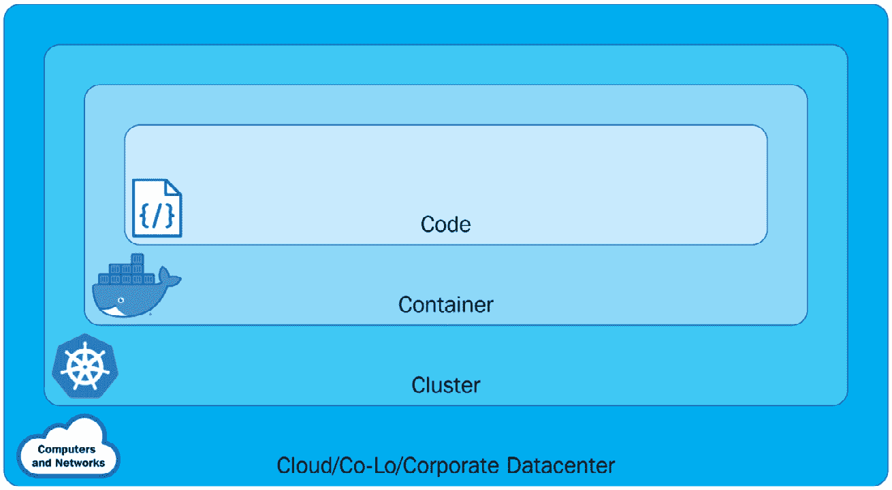
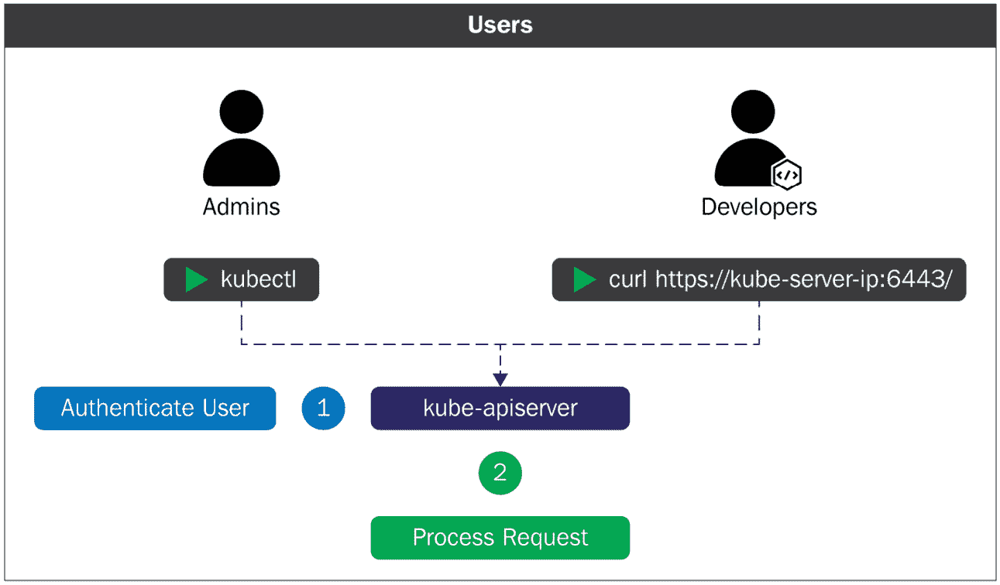
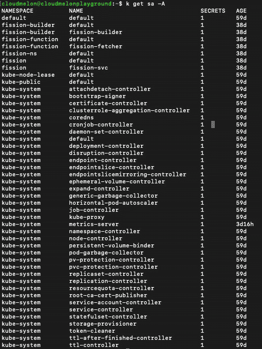
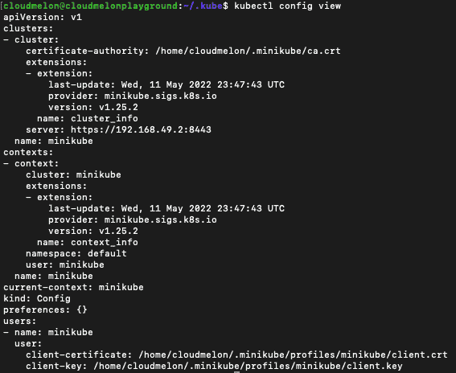
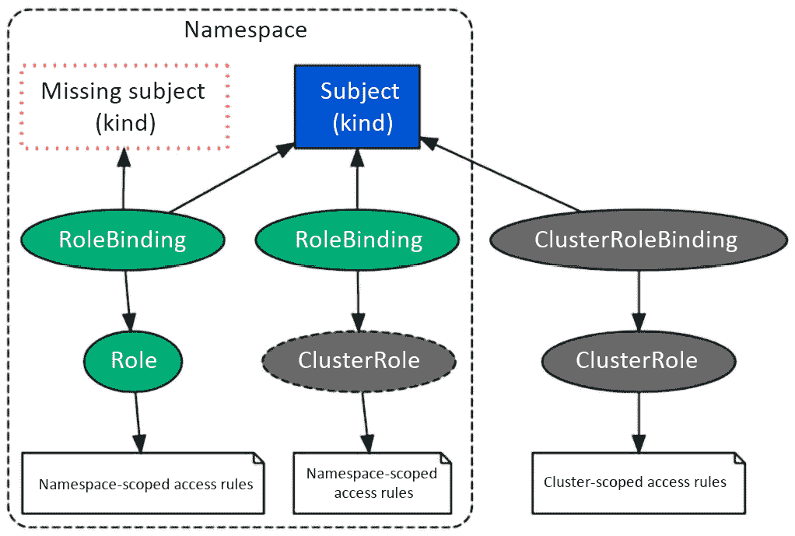

# 6

# 保护 Kubernetes 安全

本章将介绍 Kubernetes 认证和授权模式的工作原理，并深入探讨 Kubernetes 的**基于角色的访问控制**（**RBAC**）。我们还将了解如何管理在 Kubernetes 上部署的应用的安全性。

由于在 2020 年 11 月之前发布的大多数 Kubernetes 安全相关内容已经逐渐转移到**认证 Kubernetes 安全专家**（**CKS**）考试中，本章将只介绍一些必要的内容，帮助你学习 Kubernetes 安全。我们将特别关注 Kubernetes RBAC，因为它接近 CKA 考试内容的 5%。

尽管如此，深入理解 Kubernetes 安全基础知识将对 CKA 考试有很大帮助，并为你在 Kubernetes 领域的进一步发展做好准备。

在本章中，我们将涵盖以下主要内容：

+   分层保护 Kubernetes

+   Kubernetes 认证和授权

+   Kubernetes RBAC

+   管理 Kubernetes 应用的安全

# 技术要求

为了开始，你需要确保你的本地机器满足以下技术要求：

+   一个兼容的 Linux 主机——我们推荐基于 Debian 的 Linux 发行版，如 Ubuntu 18.04 或更高版本。

+   确保你的主机至少有 2GB 的内存、2 个 CPU 核心和约 20GB 的空闲磁盘空间。

# 分层保护 Kubernetes

由于平台的复杂性，Kubernetes 安全是一个广泛的话题。它包括安全的 Kubernetes 节点、网络以及 Kubernetes 对象，如 Pods。**云原生计算基金会**（**CNCF**）将 Kubernetes 安全定义为分层的，他们称之为*云原生安全的四个 C*，将安全话题扩展到 Kubernetes 及其生态系统之外。这四个 C 分别代表**云**、**集群**、**容器**和**代码**，如以下图所示：



图 6.1 – Kubernetes 中的不同层

从前面的图示中，我们可以看到以下内容：

+   **云**层基于 Kubernetes 集群部署的底层基础设施——当它在云中时由云服务提供商管理，或者在私有数据中心时由组织管理。

+   **集群**层更多地关注如何保护 Kubernetes 集群组件，确保每个组件都安全且正确地构建。回顾*第一章*，*Kubernetes 概述*，有助于你理解这些组件是如何协同工作的。

+   **容器**层包括容器漏洞扫描、托管操作系统扩展和容器特权用户。

+   **代码**层关注的是应用代码。与传统的应用安全方法不同，它现在与 DevSecOps 和漏洞评估工具配合使用。这个层次虽然相关，但不在 Kubernetes 安全的范围之内。

云原生安全，或者更具体地说，Kubernetes 安全，要求组织在每一层次上解决相关问题。在本章中，我们将重点讨论以下话题：

+   Kubernetes API 安全性与准入控制器

+   Kubernetes 的认证与授权，包括 RBAC、**基于属性的访问控制**（**ABAC**）以及节点授权

+   使用安全上下文管理 Kubernetes 应用的安全性

上述话题属于集群层或容器层的安全，它们帮助我们安全地运行 Kubernetes 应用。我们将在 *第七章*《解密 Kubernetes 网络》部分，深入讨论 Kubernetes 网络安全和网络策略。

# Kubernetes 的认证与授权

在 *第一章*《Kubernetes 概览》中，我们讨论了 Kubernetes 组件之间协同工作的典型工作流程。在这个流程中，当请求通过 Kubernetes API 服务器时，它会触发一个 API 调用。此时，API 请求需要通过 API 服务器进行认证和授权，才会发起对 Kubernetes API 资源的请求。因此，该请求要么被*允许*，要么被*拒绝*。认证过程可以如 *图 6.2* 所示：



图 6.2 – API Kubernetes 认证

你可以参考以下文章，概览 Kubernetes 认证过程是如何工作的：[`kubernetes.io/docs/reference/access-authn-authz/authentication/`](https://kubernetes.io/docs/reference/access-authn-authz/authentication/)。

在讨论认证和授权之前，首先让我们了解一下 Kubernetes 中的用户账户和服务账户。

## 服务账户与用户账户的区别

在 Kubernetes 中，我们区分正常用户账户和由 Kubernetes 管理的服务账户。账户代表用户或服务进程的身份。用户账户和服务账户之间的主要区别如下：

+   **用户账户**是针对普通人类用户的。在 Kubernetes 中，RBAC 子系统用于判断用户是否有权在特定范围内执行特定操作。我们将在本章稍后的*Kubernetes RBAC*部分进一步探讨这一点。

+   **服务账户**是为在 Kubernetes 集群中运行的 Pod 内的服务或进程提供的。服务账户是由 Kubernetes API 管理的用户。在 Kubernetes 中，可以使用客户端证书、承载令牌，甚至认证代理来通过 API 服务器进行 API 请求的认证。

接下来我们将重点讲解以下内容：

+   Kubernetes 服务账户及其使用方式

+   如何使用 `kubeconfig` 作为 Kubernetes 用户组织集群访问

+   如何配置 Kubernetes 用户访问多个集群

让我们先来看看 Kubernetes 服务账户。

## Kubernetes 服务账户

在前一章中，我们使用`kubectl`创建了一个新的 Pod，虽然`default`命名空间中有一个默认的服务账户，Pod 实际上是自动分配给这个账户的。现在，让我们来看一下如何在 Kubernetes 中使用服务账户。

### 管理服务账户

你可以使用以下命令来获取`default`命名空间中的当前服务账户：

```
kubectl get serviceaccounts
```

或者，你可以简单地使用以下快捷命令：

```
kubectl get sa
```

输出将返回`default`命名空间中的默认服务账户：

```
NAME      SECRETS   AGE
default   1         5d
```

服务账户是一个命名空间资源——你可以使用以下命令查看当前集群中所有的服务账户：

```
k get sa -A
```

或者，你可以使用完整的命令，如下所示：

```
k get serviceaccounts --all-namespaces
```

前面命令的输出将按命名空间列出服务账户信息，类似于*图 6.3*所示：



图 6.3 – 按命名空间显示的服务账户信息

这也意味着我们可以使用`kubectl get sa`命令按命名空间获取服务账户信息，然后通过指定`-n`标志和`namespace name`来获取特定命名空间的服务账户。例如，使用`kubectl get sa -n`和`kube-system`将只返回`kube-system`命名空间中的服务账户。

### kubectl create sa 命令

你可以使用`kubectl create`命令来创建一个新的服务账户，以下是一个示例：

```
kubectl create serviceaccount melon-serviceaccount
```

以下输出将显示服务账户已成功创建：

```
serviceaccount/melon-serviceaccount created
```

我们还可以使用`kubectl create`命令在不同的命名空间中创建服务账户，方法是指定`-n`标志。此外，我们还需要确保命名空间在创建服务账户之前已经存在。以下是使用`kubectl create`命令在名为`melon-ns`的命名空间中创建一个名为`melonsa`的服务账户的示例：

```
kubectl create ns melon-ns
kubectl create sa melonsa -n melon-ns
```

前面的输出显示你已经成功创建了服务账户。你也可以使用以下命令来检查服务账户是否刚刚创建：

```
k get –n melon-ns serviceaccounts
```

以下输出列出了服务账户以及它的创建时间：

```
NAME                   SECRETS   AGE 
melon-ssa   1         46s
```

类似地，如果你想查看另一个命名空间中的服务账户，可以使用`kubectl get sa <service account name>`命令，然后添加`-n`标志，例如，`k get sa melonsa -n melon-ns`。

### 将服务账户分配给 Pod

创建服务账户的目的是为 Pod 中运行的进程提供身份验证。要确定 Pod 将使用哪个服务账户，可以在 Pod YAML 规格文件`sa-pod.yaml`中指定`serviceAccountName`字段，如下所示：

```
apiVersion: v1
kind: Pod
metadata:
   name: melon-serviceaccount-pod
spec:
   serviceAccountName: melon-serviceaccount
   containers:
   - name: melonapp-svcaccount-container
     image: busybox
     command: ['sh', '-c','echo stay tuned!&& sleep 3600']
```

然后，当我们使用`kubectl apply -f sa-pod.yaml`命令来部署这个 YAML 文件时，我们将能看到一个 Pod 启动。

### kubectl delete sa 命令

你可以使用 `kubectl delete sa <account name>` 命令删除服务账户：

```
kubectl delete sa melon-serviceaccount
```

返回的输出显示该服务账户已被删除：

```
serviceaccount "melon-serviceaccount" deleted
```

希望你现在对如何使用本节内容操作 Kubernetes 服务账户有了更好的了解。接下来，让我们看看如何使用 `kubeconfig` 来组织集群访问。

## 使用 kubeconfig 组织集群访问

作为 Kubernetes 用户，当你使用 `kubeadm` 部署 Kubernetes 集群时，你会在 `$HOME/.kube` 目录中找到一个名为 `config` 的文件：

```
cloudmelon@cloudmelonplayground:~$ cd $HOME/.kube
cloudmelon@cloudmelonplayground:~/.kube$ ls
cache/  config
```

在其他情况下，`kubeconfig` 文件可以作为 KUBECONFIG 环境变量或 `--kubeconfig` 标志来设置。你可以在官方文档中找到详细的说明：[`kubernetes.io/docs/tasks/access-application-cluster/configure-access-multiple-clusters/`](https://kubernetes.io/docs/tasks/access-application-cluster/configure-access-multiple-clusters/)。

`kubeconfig` 文件帮助组织集群、用户和命名空间信息。从 `kubectl` 工具的角度来看，它读取 `kubeconfig` 文件来定位集群信息，并与该 Kubernetes 集群的 API 服务器进行通信。

以下是一个 `kubeconfig` 文件的示例：

```
apiVersion: v1
clusters:
- cluster:
    certificate-authority: /home/cloudmelon/.minikube/ca.crt
    extensions:
    - extension:
        last-update: Wed, 11 May 2022 23:47:43 UTC
        provider: minikube.sigs.k8s.io
        version: v1.25.2
      name: cluster_info
    server: https://192.168.49.2:8443
  name: minikube
contexts:
- context:
    cluster: minikube
    extensions:
    - extension:
        last-update: Wed, 11 May 2022 23:47:43 UTC
        provider: minikube.sigs.k8s.io
        version: v1.25.2
      name: context_info
    namespace: default
    user: minikube
  name: minikube
current-context: minikube
kind: Config
preferences: {}
users:
- name: minikube
  user:
    client-certificate: /home/cloudmelon/.minikube/profiles/minikube/client.crt
    client-key: /home/cloudmelon/.minikube/profiles/minikube/client.key
```

你可以使用以下命令查看 `config`：

```
kubectl config view
```

输出应该如下所示：



图 6.4 – kubectl config view 输出

你可以使用 `kubectl config` 命令来显示 `current-context`：

```
kubectl config current-context
```

返回的输出将是当前上下文——在我的例子中是 `minikube`。你可能会注意到它与前面提到的 `config` 文件中的 `current-context` 相同：

```
minikube
```

要了解更多关于如何使用 `kubeconfig` 组织集群访问的内容，请参考官方文章了解更多信息：

[`kubernetes.io/docs/concepts/configuration/organize-cluster-access-kubeconfig/`](https://kubernetes.io/docs/concepts/configuration/organize-cluster-access-kubeconfig/)

## 配置访问多个集群

作为 Kubernetes 用户，当涉及到多个集群时，我们还可以使用 `kubectl config` 命令来配置当前上下文，以便在不同的 Kubernetes 集群之间切换。要查看 `kubectl config` 提供的所有命令，可以使用以下命令：

```
kubectl config --help
```

以下是一个 `kubeconfig` 文件的示例，它包含了两个不同 Kubernetes 集群的访问信息：

```
apiVersion: v1
clusters:
- cluster:
    certificate-authority-data: 
 < authority data >
    server: https://xx.xx.xx.xx
  name: gke_cluster
- cluster:
    certificate-authority-data: 
 < authority data >
    server: https://xx.xx.xx.xx
  name: arctestaks
contexts:
- context:
    cluster: gke_cluster
    user: gke_cluster
  name: gke_cluster
- context:
    cluster: arctestaks
    user: clusterUser_akscluster
  name: akscluster
current-context: akscluster
kind: Config
preferences: {}
users:
- name: gke_cluster
  user:
    auth-provider:
      config:
        access-token: 
 < token data >
        cmd-args: config config-helper --format=json
        cmd-path: C:\Program Files (x86)\Google\Cloud SDK\google-cloud-sdk\bin\gcloud.cmd
        expiry: '2022-05-12T00:28:06Z'
        expiry-key: '{.credential.token_expiry}'
        token-key: '{.credential.access_token}'
      name: gcp
- name: clusterUser_akscluster
  user:
    client-certificate-data: <data>
    client-key-data: <data>
    token: 
 < token >
```

我们可以使用 `kubectl config current-context` 命令来查看当前正在使用的集群，输出将如下所示：

```
 gke-cluster
```

上述输出表明我所在的 Kubernetes 集群是 `gke-cluster`，并且我正在使用以下命令将我的默认上下文切换到另一个 Kubernetes 集群 `akscluster`：

```
kubectl config use-context akscluster     
```

我们可以使用 `kubectl config current-context` 命令来检查我当前工作的 Kubernetes 集群，输出将如下所示：

```
aks-cluster
```

切换上下文是你在实际 CKA 考试中可以应用的一项重要技巧，执行任务时务必在目标 Kubernetes 集群中进行，这样你的得分才会准确。这项技能在你作为 Kubernetes 管理员工作时也非常有用，因为你通常需要在多个 Kubernetes 集群上进行工作。

要了解如何配置对多个集群的访问，可以查看官方文章：[`kubernetes.io/docs/tasks/access-application-cluster/configure-access-multiple-clusters/`](https://kubernetes.io/docs/tasks/access-application-cluster/configure-access-multiple-clusters/)

## Kubernetes 授权

在 Kubernetes 中，必须先对请求进行身份验证，才能授权并授予访问 Kubernetes 集群资源的权限。

Kubernetes 中有四种授权模式：

+   **RBAC 授权**：Kubernetes 的 RBAC 更多的是根据具有特定权限的角色来规范对 Kubernetes 资源的访问，以执行特定任务，例如通过 API 请求读取、创建或修改。我们将在本节中重点介绍 Kubernetes RBAC。

+   `kubelets agent`。这是一种特殊的授权模式，CKA 考试中未涉及。你可以查看关于节点授权的官方文档，了解更多信息：[`kubernetes.io/docs/reference/access-authn-authz/node/`](https://kubernetes.io/docs/reference/access-authn-authz/node/)。

+   **ABAC 授权**：ABAC 是一种通过策略和属性（如用户属性、资源属性和对象）授予用户的访问控制。这一主题未在当前的 CKA 考试中涉及。如果你想了解更多关于使用 ABAC 模式的信息，可以参考官方文章：[`kubernetes.io/docs/reference/access-authn-authz/abac/`](https://kubernetes.io/docs/reference/access-authn-authz/abac/)。

+   **Webhook 授权**：通过 WebHooks 的 Webhook 授权是一种由事件触发的 HTTP POST 请求。例如，Webhook 将在某些操作触发时对 URL 作出反应。本主题未在当前的 CKA 考试中涉及。如果你想了解更多关于它的内容，可以参考以下文章：[`kubernetes.io/docs/reference/access-authn-authz/webhook/`](https://kubernetes.io/docs/reference/access-authn-authz/webhook/)。

让我们来看看 CKA 考试中涵盖的关键领域，从 Kubernetes RBAC 开始。

# Kubernetes RBAC

Kubernetes RBAC 旨在根据具有特定权限的角色来规范对 Kubernetes 资源的访问，以执行特定任务。

一旦指定，RBAC 将检查`rbac.authorization.k8s.io` API 组成员资格，以查看是否允许通过 Kubernetes API。

让我们来看一下 Kubernetes 中的不同角色和角色绑定。

### 角色与集群角色及其角色绑定

在 Kubernetes 中，我们有 Roles 和 ClusterRoles。Kubernetes RBAC 中的 Role 或 ClusterRole 表示具有一组权限的角色。简而言之，它们通过这些权限的范围有所不同：

+   **Role**表示在特定命名空间中的权限

+   **ClusterRole**表示集群中的权限——它可以是全局的、跨多个命名空间的，也可以是单个命名空间的

使用 Roles 和 ClusterRoles 时，我们有**RoleBinding**和**ClusterRoleBinding**的概念。绑定将角色与用户、组或服务账户等一组主体关联，正如以下图所示：



图 6.5 – Kubernetes RBAC

让我们在名为`dev`的命名空间中定义一个新的角色，名为`dev-user`。我们可以使用以下命令来做到这一点：

```
kubectl create role dev-user --verb=get --verb=list --resource=pods --namespace=dev
```

上述命令与以下 YAML 定义相同：

```
apiVersion: rbac.authorization.k8s.io/v1
kind: Role
metadata:
  namespace: dev
  name: dev-user
rules:
- apiGroups: [""] 
  resources: ["pods"]
  verbs: ["get", "list"]
```

上述命令的输出如下：

```
role.rbac.authorization.k8s.io/dev-user created
```

然后，我们可以使用`kubectl get role`命令检查我们刚刚创建的角色：

```
cloudmelon@cloudmelonplayground:~$ k get role -n dev
NAME       CREATED AT
dev-user   2022-05-13T04:14:59Z
```

然后，我们需要创建 RoleBinding，将此角色绑定到主体，如下所示：

```
kubectl create rolebinding dev-pods-binding --role=dev-user - -user=melon-dev --namespace=dev
```

另外，我们还可以使用以下 YAML 文件：

```
apiVersion: rbac.authorization.k8s.io/v1
kind: RoleBinding
metadata:
  name: dev-pods-binding
  namespace: dev
subjects:
- kind: User
  apiGroup: rbac.authorization.k8s.io
  name:melon-dev
roleRef:
kind: Role 
  name: dev-user 
  apiGroup: rbac.authorization.k8s.io
```

让我们定义一个新的 ClusterRole，名为`secret-reader`——请注意，ClusterRole 不是基于命名空间的。我们可以使用以下 YAML 定义：

```
apiVersion: rbac.authorization.k8s.io/v1
kind: ClusterRole
metadata:
  name: secret-reader
rules:
- apiGroups: [""]
  resources: ["secrets"]
  verbs: ["get", "list"]
```

然后，我们需要创建 RoleBinding，将此角色绑定到主体，如以下 YAML 定义所示：

```
apiVersion: rbac.authorization.k8s.io/v1
kind: RoleBinding
metadata:
  name: read-secrets
  namespace: development
subjects:
- kind: Group
  name: manager
  apiGroup: rbac.authorization.k8s.io
roleRef:
  kind: ClusterRole
  name: secret-reader
  apiGroup: rbac.authorization.k8s.io
```

我们可以使用以下命令获取所有命名空间中的所有角色：

```
cloudmelon@cloudmelonplayground:~$ kubectl get roles -A
NAMESPACE          NAME                                 CREATED AT
dev                dev-user                                        
kube-public        kubeadm:bootstrap-signer-clusterinfo             
kube-public        system:controller:bootstrap-signer               
kube-system        extension-apiserver-authentication-reader        
kube-system        kube-proxy                                       
kube-system        kubeadm:kubelet-config-1.23                      
kube-system        kubeadm:nodes-kubeadm-config                     
kube-system        system::leader-locking-kube-controller-manager   
kube-system        system::leader-locking-kube-scheduler            
kube-system        system:controller:bootstrap-signer               
kube-system        system:controller:cloud-provider                 
kube-system        system:controller:token-cleaner                  
kube-system        system:persistent-volume-provisioner             
```

我们可以使用以下命令获取所有命名空间中的所有 RoleBindings：

```
cloudmelon@cloudmelonplayground:~$ kubectl get rolebindings -A
NAMESPACE          NAME                                                
ROLE                                                  AGE
dev                dev-pods-binding                                    
Role/dev-user                                         15s
kube-public        kubeadm:bootstrap-signer-clusterinfo                
Role/kubeadm:bootstrap-signer-clusterinfo             6d
kube-public        system:controller:bootstrap-signer                  
Role/system:controller:bootstrap-signer               6d
kube-system        kube-proxy                                          
Role/kube-proxy                                       6d
kube-system        kubeadm:kubelet-config-1.23                         
Role/kubeadm:kubelet-config-1.23                      6d
kube-system        kubeadm:nodes-kubeadm-config                        
Role/kubeadm:nodes-kubeadm-config                     6d
kube-system        metrics-server-auth-reader                          
Role/extension-apiserver-authentication-reader        3h
kube-system        system::extension-apiserver-authentication-reader   Role/extension-apiserver-authentication-reader        
6d
kube-system        system::leader-locking-kube-controller-manager      Role/system::leader-locking-kube-controller-manager   6d
kube-system        system::leader-locking-kube-scheduler               
Role/system::leader-locking-kube-scheduler            6d
kube-system        system:controller:bootstrap-signer                  
Role/system:controller:bootstrap-signer               6d
kube-system        system:controller:cloud-provider                    
Role/system:controller:cloud-provider                 6d
kube-system        system:controller:token-cleaner                     
Role/system:controller:token-cleaner                  6d
kube-system        system:persistent-volume-provisioner                
Role/system:persistent-volume-provisioner             6d
```

了解 Roles 和 RoleBindings 在 Kubernetes 中的工作方式后，让我们看看如何实现您自己的 Kubernetes RBAC 角色和 RoleBindings。

### 实现 Kubernetes RBAC

要启用 RBAC，请将`apiserver --authorization-mode`设置为 RBAC，默认值为`AlwaysAllow`。其他可能的值包括`node`、`ABAC`、`Always deny`和`webhook`。在以下命令中，我们展示了将其设置为使用 Kubernetes RBAC 的示例：

```
kube-apiserver –authorization-mode=RBAC
```

要了解更多关于如何设置授权模式的信息，请访问以下链接：[`kubernetes.io/docs/reference/command-line-tools-reference/kube-apiserver/`](https://kubernetes.io/docs/reference/command-line-tools-reference/kube-apiserver/)

我们首先创建一个新的部署，使用当前上下文`minikube`：

```
kubectl create deployment mybusybox –-image=busybox 
```

然后，切换到`dev-user`的上下文：

```
kubectl config use-context dev-user
```

由于我们的`dev-user`仅具有`list`和`get`权限，让我们尝试使用此配置文件删除部署：

```
cloudmelon@cloudmelonplayground:~$ kubectl delete deployment mybusybox
Error from server (Forbidden): deployments.apps is forbidden: User "dev-user" cannot delete resource "deployments" in API group "apps" in the namespace "t
```

现在我们已经学会了如何管理自己的 Kubernetes RBAC 角色，让我们看看如何管理 Kubernetes 应用程序的安全性。

# 管理 Kubernetes 应用程序的安全性

`securityContext` 字段定义了在 Pod YAML 规范中 Pod 的特权和访问控制设置。如果 Pod 或容器需要以非常规方式与底层操作系统的安全机制交互，我们需要配置安全上下文。在这一节中，我们将介绍如何为 Pod 或容器配置安全上下文。

作为准备工作的一部分，你可以创建一个新用户和一个新组，如下所示：

```
sudo useradd -u 2000 container-user-0
sudo groupadd -g 3000 container-group-0
```

我们现在将登录到工作节点并创建一个名为 `message.txt` 的新 `.txt` 文件：

```
sudo mkdir -p /etc/message
echo "hello Packt" | sudo tee -a /etc/message/message.txt
```

从这里，你将看到我们从终端输入的消息：

```
 hello Packt
```

现在，我们需要调整权限以限制测试目的的权限，具体如下所示：

```
sudo chown 2000:3000 /etc/message/message.txt
sudo chmod 640 /etc/message/message.txt
```

最后，我们可以在当前的 Kubernetes 集群中部署一个新 Pod 来进行测试。`securityContext` 字段作为 Pod YAML 规范的一部分，定义在 `pod-permission.yaml` 中。通过名为 `securityContext` 的部分，我们可以指定安全权限信息，如以下 YAML 文件所示：

```
  apiVersion: v1
  kind: Pod
  metadata:
    name: melon-securitycontext-pod
  spec:
    securityContext:
      runAsUser: 2000
      fsGroup: 3000
    containers:
    - name: melonapp-secret-container
      image: busybox
      command: ['sh', '-c','cat /message/message.txt && sleep 3600']
      volumeMounts:
      - name: message-volume
        mountPath: /message
    volumes:
    - name: message-volume
      hostPath:
        path: /etc/message

```

在前面的 YAML 定义文件中，`runAsUser` 字段表示对于该 Pod 中的任何容器，所有进程都将以 `2000` 的用户 ID 运行。`fsGroup` 字段为 `2000`，这意味着容器的所有进程也是 `ID 2000` 补充组的一部分。在该卷中创建的所有文件以及卷/消息的所有者将是 `ID 2000` 组。

让我们继续按照以下步骤部署这个 YAML 文件：

```
kubectl apply -f pod-permission.yaml
```

然后，我们将看到 Pod 正在启动，但会很快遇到以下错误：

```
NAME                        READY   STATUS          RESTARTS    
AGE
melon-securitycontext-pod 0/1     CrashLoopBackOff   1 5m
```

从前面的示例中，我们可以看到 Pod 因缺少权限而处于 `BackOff` 状态。现在，让我们拉取一个类似的示例，看看我们能否解决这个问题。让我们配置一个与以下类似的 YAML 文件：

```
securityContext:
    runAsUser: 1000
    runAsGroup: 3000
    fsGroup: 2000
```

让我们使用以下 YAML 示例来部署它：

```
apiVersion: v1
kind: Pod
metadata:
  name: security-context-message
spec:
  securityContext:
    runAsUser: 1000
    runAsGroup: 3000
    fsGroup: 2000
  volumes:
  - name: sec-ctx-msg
    emptyDir: {}
  containers:
  - name: sec-ctx-msg
    image: busybox:1.28
    command: [ "sh", "-c", "sleep 1h" ]
    volumeMounts:
    - name: sec-ctx-msg
      mountPath: /message
    securityContext:
      allowPrivilegeEscalation: false
```

我们可以看到这个示例现在已经在我的本地 Kubernetes 集群中运行：

```
cloudmelon@cloudmelonplayground:/$ kubectl get pod security-context-demo
NAME                    READY   STATUS    RESTARTS   AGE
security-context-message  1/1     Running   0          3m4s
```

让我们进入这个正在运行的 Pod：

```
kubectl exec -it security-context-message -- sh
```

然后，我们将进入交互式 shell，输入 `id`，并得到以下输出：

```
/ $ id
uid=1000 gid=3000 groups=2000
```

从输出中，我们可以看到 `uid` 为 `1000`，与 `runAsUser` 字段相同；`gid` 为 `3000`，与 `runAsGroup` 字段相同；`fsGroup` 为 `2000`。

要了解更多关于安全上下文的信息，请查阅官方文档：[`kubernetes.io/docs/tasks/configure-pod-container/security-context/`](https://kubernetes.io/docs/tasks/configure-pod-container/security-context/)

# 总结

本章概述了 Kubernetes 安全性，重点讨论了容器安全、RBAC 和安全上下文三个关键主题。你可以利用本章内容为你的 CKS 考试打下基础。接下来的章节《揭开 Kubernetes 网络的神秘面纱》，将帮助你全面了解与 Kubernetes 网络安全相关的概念和实践示例，帮助你作为 Kubernetes 管理员在日常工作中应用这些知识，并且这将覆盖 CKA 考试内容的 20%。让我们拭目以待！

# 模拟 CKA 场景练习测试

你有两台虚拟机，`master-0`和`worker-0`—请完成以下模拟场景。

## 场景 1

在名为`packt-ns`的新命名空间中创建一个名为`packt-sa`的新服务账户。

## 场景 2

创建一个名为`packtrole`的 Role，并将其与 RoleBinding `packt-clusterbinding`绑定。将`packt-sa`服务账户映射为`list`和`get`权限。

## 场景 3

在`packt-ns`命名空间中，创建一个名为`packt-pod`的 Pod，使用`busybox:1.28`镜像，并暴露端口`80`。然后，将`packt-sa`服务账户分配给该 Pod。

你可以在本书的*附录* *- 模拟 CKA 场景练习题解答*中找到所有场景的解决方案。

# 常见问题解答

+   *在使用 Kubernetes 时，我可以在哪里找到关于 Kubernetes 安全性的最新更新？*

Kubernetes 安全**特别兴趣小组**（**SIG**）有一个 GitHub 仓库，你可以在这里找到：[`github.com/kubernetes/community/tree/master/sig-security`](https://github.com/kubernetes/community/tree/master/sig-security)。

+   *推荐的 Kubernetes 官方文章在哪里可以找到，用于配置临时存储？*

我推荐将有关 Kubernetes RBAC 的官方文档添加书签，你可以在这里找到：[`kubernetes.io/docs/reference/access-authn-authz/rbac/`](https://kubernetes.io/docs/reference/access-authn-authz/rbac/)。
